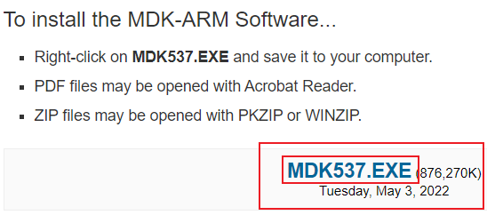

# 安装KEIL5

> 1）安装路径名中不能带中文，必须是英文路径名。
> 2）安装目录不能与51单片机的KEIL或者KEIL4冲突，三者目录必须分开。
> 3）KEIL5的安装比KEIL4多一个步骤，必须添加MCU库，不然没法使用。

1. [下载安装连接](https://www.keil.com/download/product/)
	

2. [安装STM32芯片包](http://www.keil.com/dd2/pack/)
	

# 项目环境配置
## 仿真器配置
配置Debug设备
配置Utilities
配置Debug Settings
选择目标板
下载程序