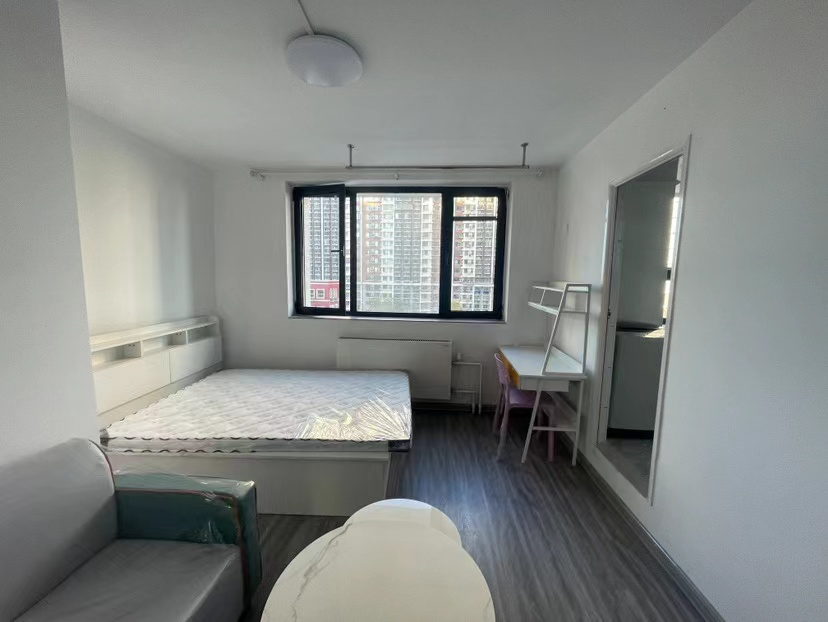

[zhihu.com/question/652739371/answer/3464474182](https://www.zhihu.com/question/652739371/answer/3464474182)

## 掌阅科技

### 水南庄壹号(合租, 500m)

五家三卫 /两卫 (2500/月) 「vx: 乔治 3721」
水电费: 10 块(1 吨) + 1.5 * 7.5 * 30(337.5)
供暖费: 0
网络费: 50
管理费: 60
服务费: 600

五家三卫 /两卫 3200/月「vx: 乔治 3721」
水电费: 10 块(1 吨) + 1.5 * 7.5 * 30(337.5)
供暖费: 0
网络费: 50
管理费: 60
服务费: 600

五家三卫 /两卫 3200/月「vx: 乔治 3721」
水电费: 10 块(1 吨) + 1.5 * 7.5 * 30(337.5)
供暖费: 0
网络费: 50
管理费: 60
服务费: 600

三家一卫 (3300/月)「vx: 乔治 3721」
水电费: 10 块(1 吨) + 1.5 * 7.5 * 30(337.5)
供暖费: 0
网络费: 50
管理费: 60
服务费: 600

### 水南庄壹号(整租, 500 m)

整租 (3100/月) 「vx: 乔治 3721」

### 房东直租(3.6km)

单人整租 (3500/月)「vx: juhuibataiqiu」
水电费: 0
供暖费: 0
网络费: 0
管理费: 0
服务费: 0

单人整租 (3500/月)「vx: zy 19810203539」
水电费: 0
供暖费: 0
网络费: 0
管理费: 0
服务费: 0

### 北花园小区(3km)

厅卧独卫，四家合租(2700)「vx: zy 363779460」
水电费: 5 块(1 吨) + 0.5 * 7.5 * 30(130) 预存 300
供暖费: 0
网络费: 0
管理费: 0
服务费: 0

### 通惠家园(1.7km)

### 高碑店水南庄(500m)

### 百子湾小区(1.5 km)
