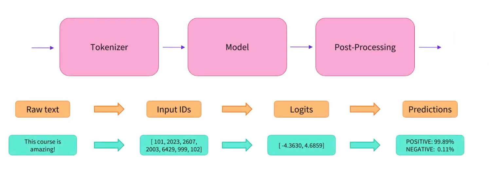

# 专业名词

## 一般名词

- autoencoding models: 参阅 MLM
- autoregressive models: 参阅 CLM
- CLM: 因果语言建模(causal language modeling)，一种预训练任务，模型按顺序读取文本，并且必须预测下一个单词。 它通常是通过阅读整个句子来完成的，但在模型中使用掩码来隐藏特定时间步长的未来 tokens。
- deep learning: 使用多层神经网络的机器学习算法。
- MLM: 掩码语言模型(masked language modeling)，一种预训练任务，模型读取到的文本是经过处理的corrupted版本，通常通过随机masking一些tokens来完成，并且必须预测出原始完整文本。
- multimodal: 将文本与另一种输入（例如图像）相结合的任务。
- NLG: 自然语言生成(natural language generation)，与生成文本相关的所有任务（例如交谈，翻译）。
- NLP: 自然语言处理(natural language processing)，一种通用的"处理文本"的表达方式。
- NLU: 自然语言理解(natural language understanding)，与理解文本中的内容相关的所有任务（例如对整个文本，单个单词进行分类）。
- pretrained model: 已针对某数据进行预训练的模型。预训练方法涉及一个自我监督的目标，它可以是阅读文本并尝试预测下一个单词（参见CLM），也可以掩盖一些单词并试图预测它们（参见MLM）。
- RNN: 递归神经网络，一种使用循环层来处理文本的模型。
- self-attention: 输入的每个元素找出它们应该关注输入的其他元素。
- seq2seq or sequence-to-sequence: 从输入生成新序列的模型。
- token: 句子的一部分，通常是单词，但也可以是子词（非常用单词通常拆分为子词）或标点符号。
- transformer: 基于self-attention的深度学习模型架构。

## 模型输入

每个模型都是不同的，但与其他模型有相似之处。因此，大多数模型使用相同的输入，此处使用示例详细介绍这些输入。

### Input IDs

input ids 通常是输入给 model 的唯一必需的参数。*input ids 是 token的 indices(索引)序列，是用来构建模型输入序列的token的数字表示，由 tokenizer 获得*。



每个 tokenizer 的工作方式不同，但基础机制保持不变。 下面是一个使用 BERT tokenizer的示例，它是一个 [WordPiece](https://arxiv.org/pdf/1609.08144.pdf) tokenizer：

```python
from transformers import BertTokenizer

tokenizer = BertTokenizer.from_pretrained("bert-base-cased")

sequence = "A Titan RTX has 24GB of VRAM"
```

tokenizer 负责将序列拆分为 tokenizer vocabulary中可用的tokens.

```python
tokenized_sequence = tokenizer.tokenize(sequence)
```

tokens可以是单词或子单词(例如，如果"VRAM"不在模型词汇表中，可以将它拆分为"V"、"RA"和"M"，同时为了表明这些tokens不是单独的单词，为"RA"和"M"添加前缀)。

```python
print(tokenized_sequence)
# ['A', 'Titan', 'R', '##T', '##X', 'has', '24', '##GB', 'of', 'V', '##RA', '##M']
```

然后，可以将这些tokens转换为模型可以理解的IDs，这可以通过直接将sentence直接馈送到tokenizer来完成。

```python
inputs = tokenizer(sequence)
```

tokenizer返回一个字典，其中包含其相应模型正常工作所需的所有参数，token的indices在键词“input_ids”中：

```python
encoded_sequence = inputs["input_ids"]
print(encoded_sequence)
[101, 138, 18696, 155, 1942, 3190, 1144, 1572, 13745, 1104, 159, 9664, 2107, 102]
```

注意：tokenizer会自动添加一些"特殊 tokens"(如果当前使用的模型需要)，这些 tokens也会对应一些特殊的 IDs。例如，如果我们解码之前的id序列，可以看到：

```python
decoded_sequence = tokenizer.decode(encoded_sequence)
print(decoded_sequence)
[CLS] A Titan RTX has 24GB of VRAM [SEP]
```

### Attention mask

attention mask是一个可选参数used when batching sequences together.

此参数向模型指示哪些tokens应该被关注，哪些不用。举例如下：

```python
from transformers import BertTokenizer

tokenizer = BertTokenizer.from_pretrained("bert-base-cased")

sequence_a = "This is a short sequence."
sequence_b = "This is a rather long sequence. It is at least longer than the sequence A."

encoded_sequence_a = tokenizer(sequence_a)["input_ids"]
encoded_sequence_b = tokenizer(sequence_b)["input_ids"]
```

编码后的版本具有不同的长度：

```python
len(encoded_sequence_a), len(encoded_sequence_b)
# (8, 19)
```

因此，我们不能将它们放在同一个tensor中，即第一个序列需要填充到第二个序列的长度，或者第二个序列需要截断到第一个序列的长度。

在第一种情况下，IDs 列表将通过填充索引进行扩展，如下所示，我们可以看到，在第一句话的右侧添加了0，使其长度与第二句话相同：

```python
padded_sequences = tokenizer([sequence_a, sequence_b], padding=True)

padded_sequences["input_ids"]
# [[101, 1188, 1110, 170, 1603, 4954, 119, 102, 0, 0, 0, 0, 0, 0, 0, 0, 0, 0, 0], [101, 1188, 1110, 170, 1897, 1263, 4954, 119, 1135, 1110, 1120, 1655, 2039, 1190, 1103, 4954, 138, 119, 102]]
```

然后，它可以在 PyTorch 或 TensorFlow 中转换为tensor。attention mask 是一个二进制 tensor，可以指示填充索引的位置，以便模型不会关注它们。对于 [BertTokenizer](https://huggingface.co/docs/transformers/v4.17.0/en/model_doc/bert#transformers.BertTokenizer), `1` 表示应注意的值，而 `0` 表示填充的值。attention mask tensor位于tokenizer返回的字典中，可以使用键值“attention_mask”获得：

```python
padded_sequences["attention_mask"]
[[1, 1, 1, 1, 1, 1, 1, 1, 0, 0, 0, 0, 0, 0, 0, 0, 0, 0, 0], [1, 1, 1, 1, 1, 1, 1, 1, 1, 1, 1, 1, 1, 1, 1, 1, 1, 1, 1]]
```


### Token Type IDs

因为一些模型的目的是对句子或问答进行分类，这需要将两个不同的序列连接在单个"input_ids"条目中，这通常是在特殊标记`[CLS]`或`[SEP]`的帮助下实现的。例如，BERT 模型按如下方式构建其两个序列输入：

```python
# [CLS] SEQUENCE_A [SEP] SEQUENCE_B [SEP]
```

可以使用tokenizer自动生成这样的句子，方法是将两个序列作为两个参数（而不是像以前那样的列表）传递给`tokenizer`：

```python
from transformers import BertTokenizer

tokenizer = BertTokenizer.from_pretrained("bert-base-cased")
sequence_a = "HuggingFace is based in NYC"
sequence_b = "Where is HuggingFace based?"

encoded_dict = tokenizer(sequence_a, sequence_b)
decoded = tokenizer.decode(encoded_dict["input_ids"])
print(decoded)
# [CLS] HuggingFace is based in NYC [SEP] Where is HuggingFace based? [SEP]
```

这足以让一些模型了解一个序列在哪里结束，另一个序列在哪里开始。但是，其他模型（如 BERT）也会部署token类型的ID（也称为segment ID），用来作为标识模型中两种类型的序列的二进制掩码。在tokenizer中通过键词"token_type_ids"获取此掩码：

```python
encoded_dict["token_type_ids"]
# [0, 0, 0, 0, 0, 0, 0, 0, 0, 0, 1, 1, 1, 1, 1, 1, 1, 1, 1]
```

第一个序列，即用于问题的“context” ，其所有tokens都由`0`表示，而对应于“question”的第二个序列的所有标记都由 `1`表示。某些模型（如 [XLNetModel](https://huggingface.co/docs/transformers/v4.17.0/en/model_doc/xlnet#transformers.XLNetModel) [）](https://huggingface.co/docs/transformers/v4.17.0/en/model_doc/xlnet#transformers.XLNetModel)使用` 2` 。

### Position IDs

与嵌入了每个token 位置的RNN不同，transformers 不知道每个 token 的位置。因此，模型使用位置 IDs (`position_ids`) 来标识每个令牌token在token列表中的位置。

这是一个可选参数，如果没有 `position_ids` 传递给模型，则 ID将自动创建为绝对位置嵌入。

绝对位置嵌入范围为`[0, config.max_position_embeddings - 1]` ，而某些模型也会使用其他类型的位置嵌入，例如正弦位置嵌入或相对位置嵌入。


### Labels

T标签是一个可选参数，可以传递该参数，以便模型计算损失。这些标签应该是模型的预期预测：它将使用标准损失来计算其预测值与预期值（标签）之间的损失。

这些标签根据model head 而有所不同，例如：

- 对于序列分类模型 (e.g., [BertForSequenceClassification](https://huggingface.co/docs/transformers/v4.17.0/en/model_doc/bert#transformers.BertForSequenceClassification)), ，模型需要一个`(batch_size)`维度的tensor，其中batch的每个值对应于整个序列的预期标签。
- 对于token分类模型 (e.g., [BertForTokenClassification](https://huggingface.co/docs/transformers/v4.17.0/en/model_doc/bert#transformers.BertForTokenClassification))，模型需要一个`(batch_size, seq_length)`维度的tensor，其中每个值都对应于每个单独token的预期标签。
- 对于掩码语言建模 (e.g., [BertForMaskedLM](https://huggingface.co/docs/transformers/v4.17.0/en/model_doc/bert#transformers.BertForMaskedLM))，模型需要一个`(batch_size, seq_length)`维度的tensor，其中每个值对应于每个单独token的预期标签，而标签是被掩码token的token ID，其余值（通常为 -100）将被忽略。
- 对于序列到序列任务(e.g., [BartForConditionalGeneration](https://huggingface.co/docs/transformers/v4.17.0/en/model_doc/bart#transformers.BartForConditionalGeneration), [MBartForConditionalGeneration](https://huggingface.co/docs/transformers/v4.17.0/en/model_doc/mbart#transformers.MBartForConditionalGeneration))，模型需要一个`(batch_size, tgt_seq_length)`维度的tensor，其中每个值对应于与每个输入序列关联的目标序列。在训练的时候， *BART* a和 *T5* 都会在其内部构造*decoder_input_ids* 和 decoder attention masks，因此它们通常不需要提供，同样，这不也适用于利用Encoder-Decoder框架的模型。具体要求，需要查阅每个模型的文档。

base models (e.g., [BertModel](https://huggingface.co/docs/transformers/v4.17.0/en/model_doc/bert#transformers.BertModel)) 不需要接受标签， 因为这些是基本模型，只是需要输出特征。


### Decoder input IDs

此输入特定于encoder-decoder 模型，包含了需要馈送到decoder的input IDs 。这些 inputs 被用在序列到序列任务，并且通常以特定于每个模型的方式去构建。

大多数 encoder-decoder 模型 (BART, T5) ，由自身的 `labels`构建 `decoder_input_ids`。在这一类模型中，通过`labels` 是训练的首选方法。

### Feed Forward Chunking

transformers 中每一个residual attention block中的self-attention layer后面，通常都跟着两个 feed forward layers。feed forward layers的中间嵌入大小(intermediate embedding)通常都大于模型的隐藏层大小 。

对于维度为 `[batch_size, sequence_length]`的输入，存储维度大小为`[batch_size, sequence_length, config.intermediate_size]`的中间前馈嵌入矩阵( intermediate feed forward embeddings)   所需的空间，会占据内存使用的很大一部分。 [Reformer: The Efficient Transformer](https://arxiv.org/abs/2001.04451) 一书的作者注意到，由于计算与 `sequence_length` 维度无关，因此在数学上等效于单独计算维度为`[batch_size, config.hidden_size]_0, ..., [batch_size, config.hidden_size]_n`的两个前馈层的输出嵌入矩阵，然后将其合并为`n = sequence_length`的 `[batch_size, sequence_length, config.hidden_size]` 矩阵，这会在增加的计算时间和减少的内存使用之间进行权衡，并且能产生数学上**等效**的结果。

对于使用函数[apply_chunking_to_forward()](https://huggingface.co/docs/transformers/v4.17.0/en/internal/modeling_utils#transformers.apply_chunking_to_forward)的模型，`chunk_size` 定义并行计算的输出嵌入矩阵数目，从而定义内存和时间复杂度之间的权衡。如果 `chunk_size`设置为0, 则不执行feed forward chunking。
