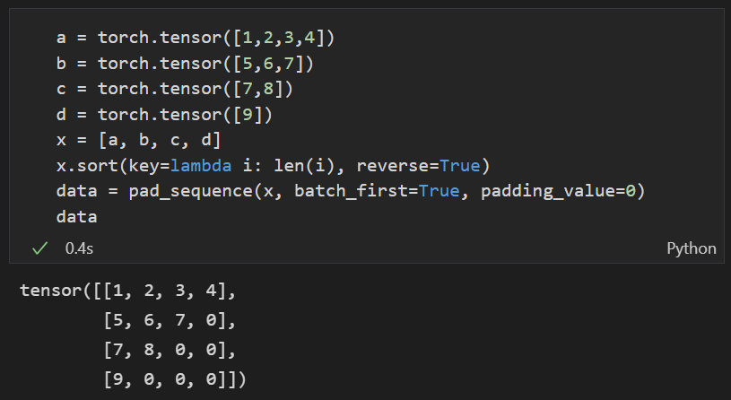
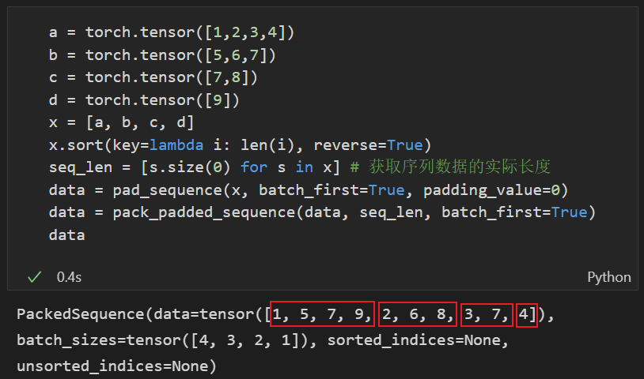
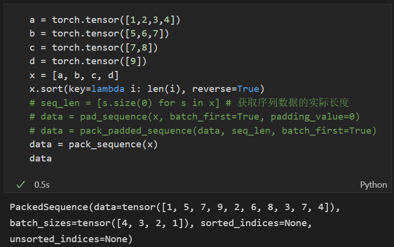
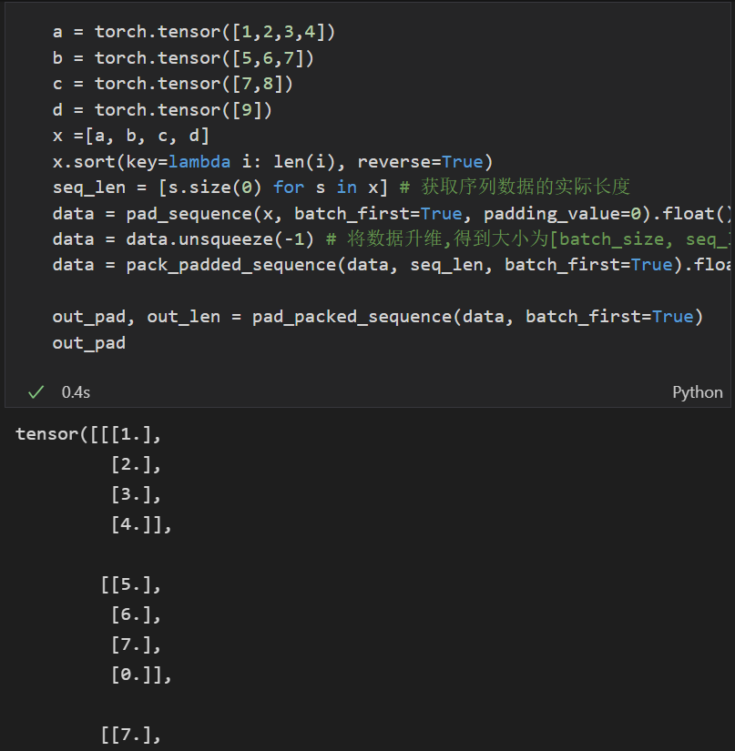

pack_padded_sequence 和 pad_packed_sequence

面临序列样本数据长短不一的情况，对 batch 进行填充，保证各个序列在输入维度上长度相同。

处理过程：
1. 使用函数 pad_sequence 对序列进行填充。
2. 使用函数 pack_padded_sequence 进行压缩，压缩掉无效的填充值。
3. 使用 pad_packed_sequence 把压缩的序列再复原回来，便于进行后续的处理。

pad_sequence

```python
"""
 ``Pad_Sequence``函数，用特定的字符按照一定的规则填充 batch 内数据。

 `B` 是 batch 大小，等于 ``sequences`` 数量.

 `T` 等于最长的 sequence 长度.

 `L` 等于 sequence 长度.

 `*` 是任意数量的尾缀维度，包括 none.

 Arguments:

 sequences (list[Tensor]): 输入包含不同长度序列构成的 batch，其中每个序列的大小为``L x * ``，`L` 为单个序列的长度，`*` 为序列中每个时间步特征的维度.

 batch_first (bool, optional): 如果为 ``True`` 则输出维度为 ``B x T x *`` , 否则输出维度为 ``T x B x *``.

 padding_value (float, optional): 自定义需要填充的数值. Default: 0.

"""
```



pack_padded_sequence

```python

"""
 打包(压缩)经过填充的包含变长序列的 batch .

 Note:

 This function accepts any input that has at least two dimensions. You can apply it to pack the labels, and use the output of the RNN with them to compute the loss directly. A Tensor can be retrieved from
 a :class:`PackedSequence` object by accessing its ``.data`` attribute.


 Args:

 input (Tensor): 经过填充的可变长度序列 batch,即经过 pad_sequence 处理之后的 batch .

 lengths (Tensor or list(int)): 每一个 batch 中各个序列的原始实际长度(如果提供的tensor型数据，必须在CPU上).

 batch_first (bool, optional): 如果为 ``True`` 则输出维度为 ``B x T x *`` , 否则输出维度为 ``T x B x *``.

 enforce_sorted (bool, optional): 如果为 ``True``, 则输入 batch 中的序列数据应该是按长度降序排序的. 如果为 ``False``, 则输入没有要求,其在函数内部进行排序. Default: ``True``.

 Returns:

 a :class:`PackedSequence` object
	 data:压缩后的数据
	 batch_sizes:每个时间步需要吃进去多少数据。
	 sorted_indices:排序之后的结果与原始 data 中的 tensor 的下标对应关系。
	 unsorted_indices:未排序前结果。
"""
```



pack_sequence

```python
"""
对前述 pad_sequence 和 pack_padded_sequence 操作的一个封装。
"""
def pack_sequence(sequences, enforce_sorted=True):

	lengths = torch.as_tensor([v.size(0) for v in sequences])

	return pack_padded_sequence(pad_sequence(sequences), lengths, enforce_sorted=enforce_sorted)
```



pad_packed_sequence

```python
"""
如果网络输入数据用了 pack_sequence 进行打包，则网络输出同样会打包成一个 PackedSequence 对象,因此有时需要将其解压,方便后续的计算.


 .. note::

 :attr:`total_length` is useful to implement the ``pack sequence -> recurrent network -> unpack sequence`` pattern in a :class:`~torch.nn.Module` wrapped in :class:`~torch.nn.DataParallel`. See :ref:`this FAQ section <pack-rnn-unpack-with-data-parallelism>` for details.

  

 Args:

 sequence (PackedSequence): PackedSequence 对象，将要被解压的 batch,将其解压到 paded 状态,与函数 pad_sequence 的结果对应；

 batch_first (bool, optional): 一般设置为 True，返回的数据格式为 [B, T, *] ；

 padding_value (float, optional): 填充值；

 total_length (int, optional): 如果不是 ``None``, 则输出的每一个序列将填充到 `total_length` 长度. 但如果 `total_length`的大小小于 `T` 则出错:class:`ValueError`  .
"""


```


