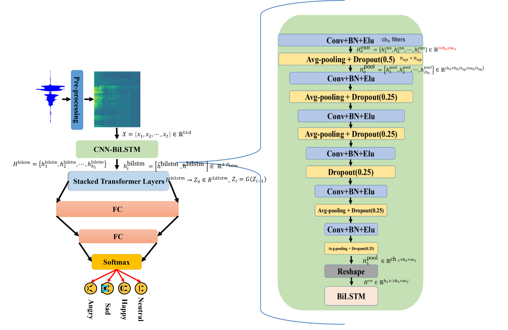

#  重点

- 论文源文件
- [开源代码](https://github.com/HW-AARC-CLUB/ICASSP_SER)
- 在现有语音情绪识别(SER)模型基础上增加 stacked transformer layers (STL)结构构建新的SER体系结构, 利用STLS模块强大的特征学习能力. 
- 使用 ==t-SNE== 技术可视化中间过渡层发现的特征质量来检查STL模型的有效性.

# 摘要

Speech emotion recognition (SER) aims to automatically recognize emotional category for a given speech utterance. The performance of a SER system heavily relies on the effectiveness of global representation expressed at utterance level. To effectively extract such a global feature, the mainstream of recent SER architectures adopts a pipeline with two key modules, feature extraction and aggregation. Although variant module designs have brought impressive progresses, SER is still a challenging task. In contrast with those previous works, herein we propose a novel strategy for global SER feature extraction by applying an additional enhancement module on top of the current SER pipeline. To verify its effect, an endto-end SER architecture is proposed where stacked multiple transformer layers are explored to enhance the aggregated global feature. Such an architecture is evaluated on IEMOCAP and results strongly substantiate the effectiveness of our proposal. In terms of weighted accuracy on four emotion categories, our proposed SER system outperforms the prior arts by a large margin of relatively 20% improvement. Our codes and the pre-trained SER models are made publicly available.

语音情感识别(SER)的目的是自动识别给定语音话语的情感类别。SER系统的性能在很大程度上依赖于在话语层面上表达的全局表征的有效性。为了有效地提取这样的全局特征，目前主流的SER体系结构采用了一种包含两个关键模块的流水线，即特征提取和聚合。尽管各种各样的模块设计已经带来了令人印象深刻的进步，但SER仍然是一项具有挑战性的任务。与前人的工作不同，本文提出了一种新的全局SER特征提取策略，在现有SER流水线的基础上增加了一个增强模块。为了验证其效果，提出了一种端到端的SER结构，其中利用堆叠的多个转换器层来增强聚集的全局特征。这种体系结构在IEMOCAP上进行了评估，结果有力地证明了我们的建议的有效性。在四个情感类别的加权准确率方面，我们提出的SER系统比现有技术有较大幅度的提高20%。我们的代码和预先培训的SER模型是公开提供的。

# 词汇记录

# 结果

IEMOCAP包含超过10K个话语，由九个情感类别的标签标注。按照前人的研究步骤，我们使用了一个四类({高兴、愤怒、悲伤、中性})的子库，总共有5531个话语。对于每个情感类别，其关联样本分别按7/1/2的比例随机分为训练/均值/测试。

所提出的SER系统已在PyTorch中实现。利用Adam[20]优化器对分类交叉熵进行优化，同时监测验证精度，提前停止设置为8个历元。训练系统的批次为32，学习率为2×10−4，衰减率为1×10−6。

# 精读

言语情感作为文本之外的一种 meta-information，对理解说话人的心理和反应起着重要的作用。相关研究被称为语音情感识别(SER)，其目的是自动识别给定语音表达的情感类别。由于情感通常以一种微妙和可变的方式传达，因此识别情感嵌入作为话语的表征一直是一个挑战，可以有效地对情感类别进行分类。

随着深度神经网络(DNN)的最新进展，情感嵌入已经从先前基于知识的手工制作的声学特征，例如低级描述符(LLD)，演变为基于DNN的深度情感特征。在最近的SER工作中，已经探索了各种DNN结构，如卷积神经网络(CNN)、长短期记忆(LSTM)、时延神经网络(TDNN)、残差网络(ResNet)、扩张残差网络(DRN)，它们本身或组合在一起[1-4]。在语义特征识别领域已经有了大量的研究成果，但由于情感与语言特征的分离，以及从长时间的话语中提取有效的情感特征，这方面的研究仍然具有挑战性。为了解决这些问题，现代SER系统普遍采用两个模块的流水线：1)特征提取模块，以生成情感相关的时间声学特征；以及2)聚合模块，将这些时间特征汇集到话语级别的紧凑的全局语境表示(也称为情感嵌入)中。为了产生有效的情感嵌入，最近的SER工作集中在开发不同的模块架构上。例如，[2]提出了一种混合的CNN-LSTM体系结构，其中CNN从原始频谱图中提取特征序列，而LSTM聚合长期特征依赖关系。类似地，文献[5]提出了基于1D和2D CNN-LSTM的SER系统，并表明2D CNNLSTM网络通过从谱图中捕捉局部相关性和全局上下文信息而优于1D网络。后来在注意力机制的启发下，RNN在[7]中提出了RNN-注意，RNN通过关注情绪显著的特征来提取时间特征和聚合长期特征依赖关系。文[8]测试了几种时间建模方法，目的是从原始波形中学习深层情感特征。在[9]中，作者引入了CNN-BLSTM-注意结构，将注意力扩展到多头注意(MHA)，以探索不同位置的不同代表子空间。MHA机制再次被[4]采用来构建DRN-注意体系结构，其中DRN使网络在特征学习中保持高分辨率的时间结构。此外，文献[10]还提出了语境LSM注意来考虑周围话语之间的关系和依存关系。尽管在以前的工作中取得了进展，但目前的SER表现仍有改进的空间。例如，在基准数据集IEMOCAP上的SOTA分类准确率仅为76%左右(在四个情感类别上)。同时，我们注意到，在其他研究领域，经常有报道称，用叠层变压器层(STL)取代重复性可以显著提高性能。例如，基于STLS的声学模型[11]在Librispeech基准上给出了最好的声学模型。在问答领域，堆积式潜在注意和多跳注意网络(MAN)[12]都表现出显著的性能改进。对于图像捕获任务，从堆叠的交叉注意网络(SCAN)[13]或堆叠的注意模块[14]获得最先进的(SOTA)结果。受其他研究领域的成功启发，在本研究中，我们有兴趣将STL机制应用到SER网络中。特别是，提出了一种通过在现有SER流水线上添加STL而构建的新的SER体系结构。我们建议的动机是利用STLS模块强大的特征学习能力来直接提高流水线输出。据作者所知，这是文献中第一次使用这种策略来研究SER问题。本文组织如下。在第二节中，简要介绍了香草变压器。在第三节中，我们详细地提出了STL增强的SER体系结构。第四节报道了实验。第五节总结了这项研究。

在本节中，我们将简要描述源自Vanilla Transformer[15]的STL的详细信息，后者完全依赖注意力机制来捕获输入和输出序列之间的长期依赖关系。在这项研究中，我们感兴趣的是ITS编码器，它将输入序列转换为固定维度的全局上下文向量。具体地，编码器由六个相同的变压器层(TL)堆叠而成。每个TL包含具有剩余连接的两个子层：1)自关注子层和2)位置前馈网络(FFN)子层。此外，还引入了位置编码(PE)来为模型提供显式的顺序信息。得益于自我注意机制，输出序列通过重视输入的特定部分来保留和利用输入信息。TL的堆叠方式是，只有第一层采用输入顺序，每隔一层只采用前面的输出作为输入。这使得能够通过在潜在表示空间内的迭代关注和投影来丰富上下文向量。从数学上讲，《变形金刚》的体系结构被解释为多粒子动力系统中对流扩散方程的数值常微分方程组(ODE)求解器。从这个角度来看，STL的数量对应于ODE中的时间维度，这自然赋予Transformer以强大的学习能力来产生深层上下文表示。
度。

我们建议的新的SER框架将在这一部分介绍。图1概述了它的体系结构。如图所示，它依次包括4个模块：前端预处理模块，用于提取帧级别的LLD；CNN-BiLSTM模块，用于提取上下文表示；STLS，用于增强上下文表示；后端分类器，用于预测情感类别的概率。下面介绍CNNBiLSTM和STLS模块的设计细节。

CNN-BiLSTM Module

我们的 CNN-BiLSTM 模块的详细信息如图2所示，这类似于我们之前的研究[17]。简而言之，该模块由六对CNN-Pooling层和一个BiLSTM层构成。每个CNN-Pooling对包括一个卷积层(配有batch归一化和ELU函数激活)用于提取高层时间特征，以及一个池化层(具有固定丢失率)用于降低特征维.

特别是，模块输入是基于帧级别的LLD声学特征，表示为$X=\left\{x_{1}，x_{2}，\cdots，x_{t}\right\}\in$$\mathbb{R}^{\mathrm{t}\times\mathrm{d}}$，其中$\mathrm{t}$表示帧长度，$\mathrm{d}$表示LLD特征尺寸。对于第一个CNN-Pooling对，是具有$c h_{0}$个Filter的2D卷积，应用在$X$上，并产生时间特征序列，表示为$H_{0}^{\text{CNN}}=$$\left\{h_{1}^{\mathrm{CNN}}，h_{2}^{\mathrm{CNN}}，\cdots，H_{\mathrm{t}}^{\mathrm{cnn}}\right\}\in \mathbb{R}^{\mathrm{t}\times\mathrm{h}_{0}\times\mathrm{w}_{0}}$；然后对每个输出进行大小为$n_{a_p}*n_{a_p}$的2D-AveragePooling操作以降维，得到的输出$H_{0}^{\text {pool }}=$ $\left.\left\{h_{1}^{\text {pool }}, h_{2}^{\text {pool }}, \cdots, h_{\text {ch }_{0}}^{\text {pool }}\right\} \in \mathbb{R}^{\text {ch }_{0} \times \mathrm{h}_{0} / \mathrm{n}_{\mathrm{ap}} \times \mathrm{w}_{0} / \mathrm{n}_{\mathrm{ap}}}\right)$被馈送到下一个卷积对。通过总共6个CNN-Pooling对，，得到最终的潜在表示$H_{5}^{\text{pool}}\in\mathbb{R}^{\mathrm{ch}_{5}\times\mathrm{h}_{5}\times\mathrm{w}_{5}}$。通过进一步的reshape操作，将reshape版本$H^{r e}\in\mathbb{R}^{\mathrm{h}_{5}\times\left(\mathrm{ch}_{5}\times\mathrm{w}_{5}\right)}$随后馈送到BiLSTM层。

BiLSTM向前和向后从$H^{\text{re}}$学习上下文依赖关系。其输出为隐藏状态序列 $H^{\text {bilstm }}=\left\{h_{1}^{\text {bilstm }}, h_{2}^{\text {bilstm }}, \cdots, h_{h_{5}}^{\text {bilstm }}\right\}$表示上下文特征序列，其中$h_{i}^{\text {bilstm }}=\left[\vec{h}^{\text {bilstm }}, \overleftarrow{h}^{\text {bilstm }}\right] \in$ $\mathbb{R}^{2 \mathrm{~d}_{\text {stm }}}$，隐藏状态大小为$\mathrm{d}_{\mathrm{lstm}}$。

在经典的SER任务中，采用了两种聚合方法，即reucurrence-based 方法和attention-based,方法来产生全局情感嵌入。
$$

X^{G}=\left\{\begin{array}{cl}

h_{\mathrm{h}_{5}}^{\text {bilstm }}, & \text { recurrence - based } \\

\sum_{i=1}^{\mathrm{h}_{5} \alpha_{\mathrm{i}} \mathrm{h}_{\mathrm{i}}^{\text {bilstm }},} & \text { attention }-\text { based }
\end{array}\right.
$$

在任何一种方式中，情感嵌入XG(或受进一步仿射变换的约束)被馈送到后端分类器以进行概率预测。

作为我们的核心贡献，提出了一种产生情感嵌入的替代方法。它应用 additional STLs 来增强上下文特征序列$H^{\text {bilstm }}$。

为此，首先执行1D卷积以将$H^{\text{bilstm}}$映射到向量 $Z_{0} \in \mathbb{R}^{2 \mathrm{~d}_{\text {stm }}}$。然后使用具有L层的STLs 迭代增强
$Z_{0}$ 得到 $Z_{i}=G\left(Z_{i-1}\right)$。除了跳过 positional encoding 外，一系列操作都是在$G$内执行的，例如多头注意、前馈和残差连接(如第2节所述)。最后一个Transformer层的输出是全局嵌入，即$X^{G}=Z_{L-1}$。

最后，以端到端的方式对所提出的SER体系结构进行训练，目标函数如下：$$

\begin{gathered}

\hat{y}_{c}=\operatorname{softmax}\left(\mathrm{X}_{\mathrm{G}}^{\mathrm{T}} \mathrm{W}+\mathrm{b}\right), \\

L=-\log \prod_{i \in S} \sum_{c=1}^{C} \hat{y}_{i, c} \log \left(\hat{y}_{i, c}\right),

\end{gathered}

$$，其中$S$表示用于训练的样本集，$C$表示情感类别的总数。

我们注意到，类似的架构被用于多通道情感识别[18]。我们的方法与以前的工作不同，因为CMA是对时间特征序列进行操作，这需要进一步的统计汇集；而在我们的例子中，STLS应用于语音级表示。

3. STL模块，用于增强上下文表示；

    STACKED Transformer:** 完全依赖注意力机制来捕获输入和输出序列之间的长期依赖关系，可以将输入序列转换为固定维度的上下文全局特征。它由六个相同的  Transformer Layers (TLs)堆叠而成，每个 Transformer Layer 包含两个附带  residual connections 的子层：self-attention 层和position-wise feed-forward network(FFN) 子层。此外引入了 positional encoding (PE)来为模型提供显式的顺序信息。

    通过 self-attention 机制，对输入序列的特定部分加以重视, 来保留和利用输入序列信息。Transformer Layers 的堆叠，只有第一层接受输入序列，后面每隔一层只接受前一层的输出作为输入，这使得能够通过在潜在表征空间的 迭代注意力机制和数据投影来丰富上下文全局特征。

    从数学上讲， Transformer 结构被解释为多粒子动力系统中对流扩散方程的数值常微分方程(ODE)求解器[16]。从这个角度来看，STLs的数量对应于ODE中的时间维度，这自然使Transformer具有很强的学习能力来产生**深层上下文表示**。

4. 分类器，用于预测情感类别的概率。

**[t-SNE 可视化技术](https://zhuanlan.zhihu.com/p/148170862)**

我们进行了更多的调查，以评估我们拟议的STL模块的有效性。首先，研究了一种不带STLS模块的截断SER系统。由此产生的WA值暴跌至72.79%。这项研究的意义是双重的：
1)我们的截断系统设计得很好，性能可以与现有技术相媲美；
2)STLS模块对系统整体性能的贡献很大(18.5%)，代价是合理增加参数数量(从356K增加到468K)。
其次，通过使用t-SNE技术可视化中间层发现的特征质量来检查STLS的有效性[24]。
两个潜在特征分布Z0和Z4在图3中用关于类的2D曲线图进行了比较和说明。同样，可以观察到，STL之后的特征被清楚地投影到不同的集群，并且彼此很好地分开。
最后，进一步研究了STL的最佳层数。实验结果如图4(A)所示，有趣的是，系统性能在开始时(&lt;5层)迅速提高，在中间(5-10层)几乎保持不变，然后在结束时(&gt;10层)急剧下降。基于这样的观察，我们所提出的STLS模块的最佳深度被选择为5。同时，根据我们的模型的学习曲线，在图4(B)中画出了最佳的5个变压器层，其中最佳模型是在第67个历元。

## 引用

- [2]提出了一种混合的CNN-LSTM体系结构，其中CNN从原始频谱图中提取特征序列，而LSTM聚合长期的特征依赖关系。

- MHA机制再次被[4]采用来构建DRN-注意体系结构，其中DRN使网络在特征学习中保持高分辨率的时间结构。

- 文献[5]提出了基于一维和二维CNN-LSTM的SER系统，并表明2D CNN LSTM网络通过从谱图中捕获局部相关性和全局上下文信息而优于一维 CNN LSTM网络。

- 后来在注意机制[6]的启发下，在[7]中提出了RNN-注意，RNN通过关注情绪显著的特征来提取时间特征，并聚合长期特征依赖关系。

- 文[8]测试了几种时态建模方法，目的是从原始波形中学习深层情感特征。

- 在文献[9]中，作者引入了CNN-BLSTM-注意结构，将注意力扩展到多头注意(MHA)，以探索不同位置的不同代表子空间。

- 文献[10]还提出了语境LSTM注意来考虑周围话语之间的关系和依存关系。

- 基于STL的声学模型[11]在Librispeech基准上给出了最好的声学模型。

- 在问题回答领域，stacked latent attention 和multihop attention networks (MAN)[12]都显示出了显著的性能改进.

- 对于图像捕获任务，从 stacked cross attention network (SCAN)[13]或stacked attention modules [14]获得最先进的结果。

- vanilla Transformer [15]

- 我们的 CNN-BiLSTM 模块的详细信息如图2所示，类似于我们之前的研究[17]。

- 类似的架构被用于多通道情感识别[18]。

- DSCNN [21]

- IAAN [22] 

- 通过使用 t-SNE 技术可视化中间层发现的特征质量来检查STL的有效性[24]。
