# 神经网络实现

## LeNet

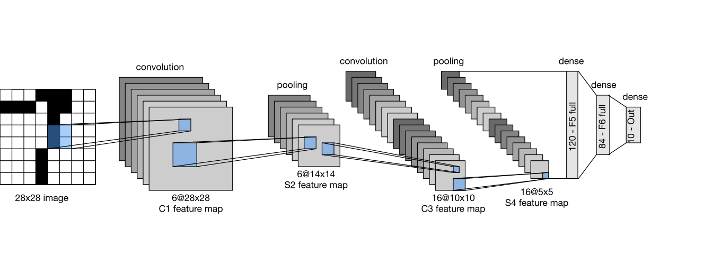

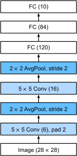

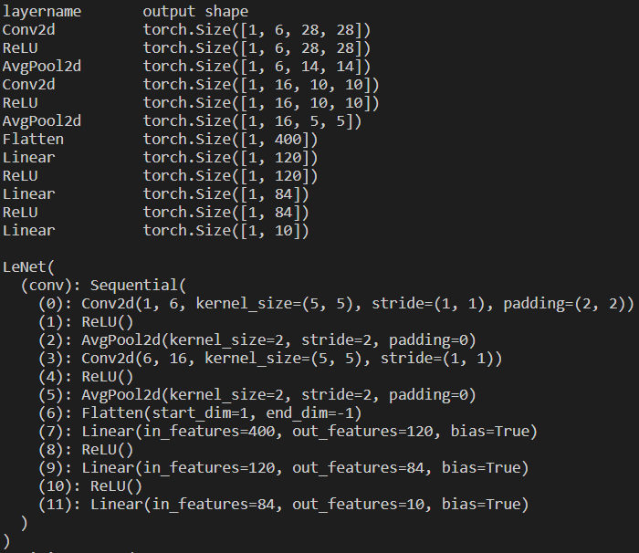

## AlexNet

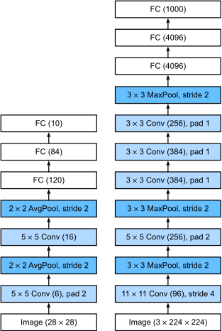

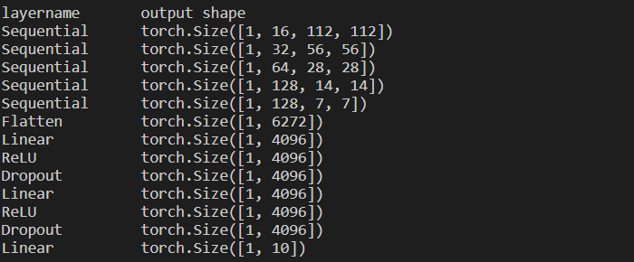

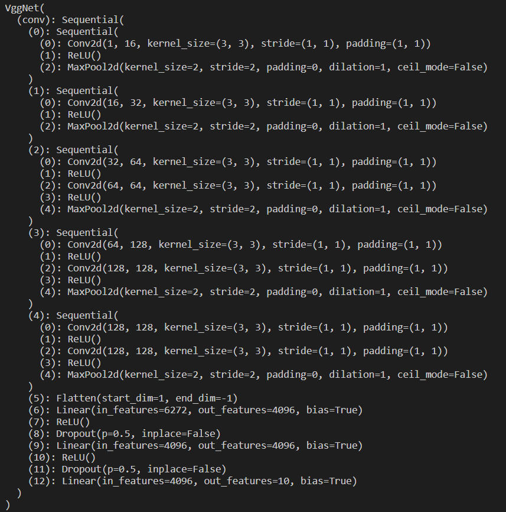

## VGG

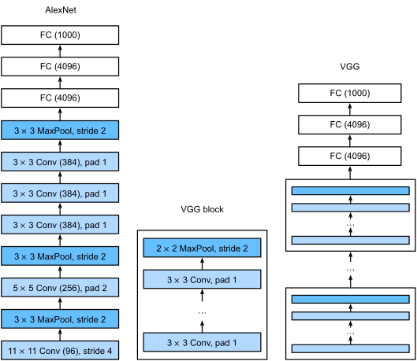

## NiN

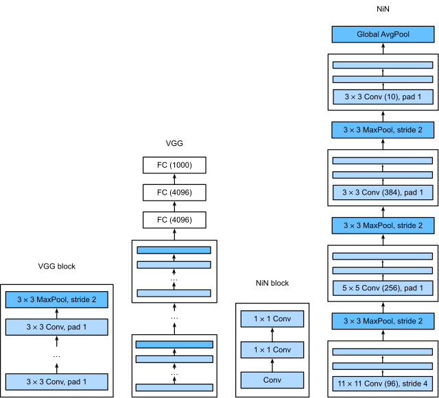

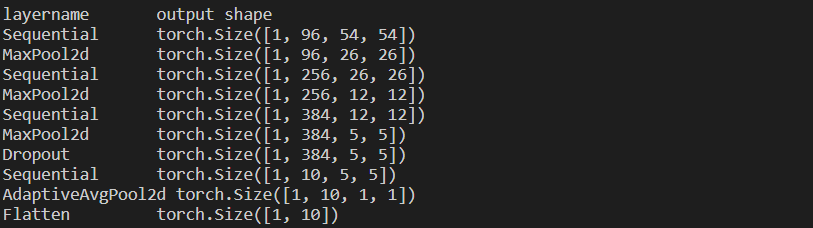

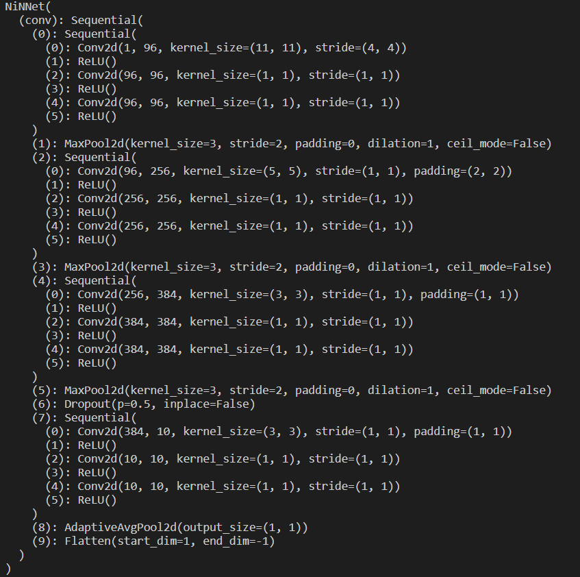

- [ ] 参数的数量是多少？
- [ ] 计算量是多少？
- [ ] 训练期间需要多少显存？
- [ ] 预测期间需要多少显存？

## GoogLeNet

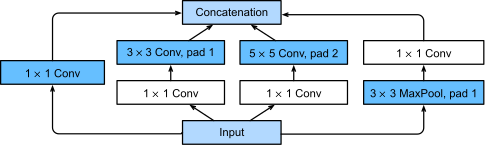

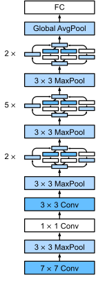

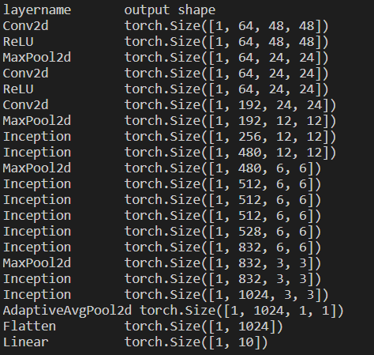

- [ ] 添加批量归一化层 [Ioffe & Szegedy, 2015](https://zh-v2.d2l.ai/chapter_references/zreferences.html#ioffe-szegedy-2015)（batch normalization），在 [7.5节](https://zh-v2.d2l.ai/chapter_convolutional-modern/batch-norm.html#sec-batch-norm)中将介绍）。
- [ ] 对 Inception 模块进行调整。
- [ ] 使用标签平滑（label smoothing）进行模型正则化 [Szegedy et al., 2016](https://zh-v2.d2l.ai/chapter_references/zreferences.html#szegedy-vanhoucke-ioffe-ea-2016)。
- [ ] 加入残差连接 [Szegedy et al., 2017](https://zh-v2.d2l.ai/chapter_references/zreferences.html#szegedy-ioffe-vanhoucke-ea-2017) ，（ [7.6节](https://zh-v2.d2l.ai/chapter_convolutional-modern/resnet.html#sec-resnet) 将介绍）。

- [ ] 使用 GoogLeNet 的最小图像大小是多少？
- [ ] 将 AlexNet、VGG 和 NiN 的模型参数大小与 GoogLeNet 进行比较。后两个网络结构是如何显著减少模型参数大小的？
