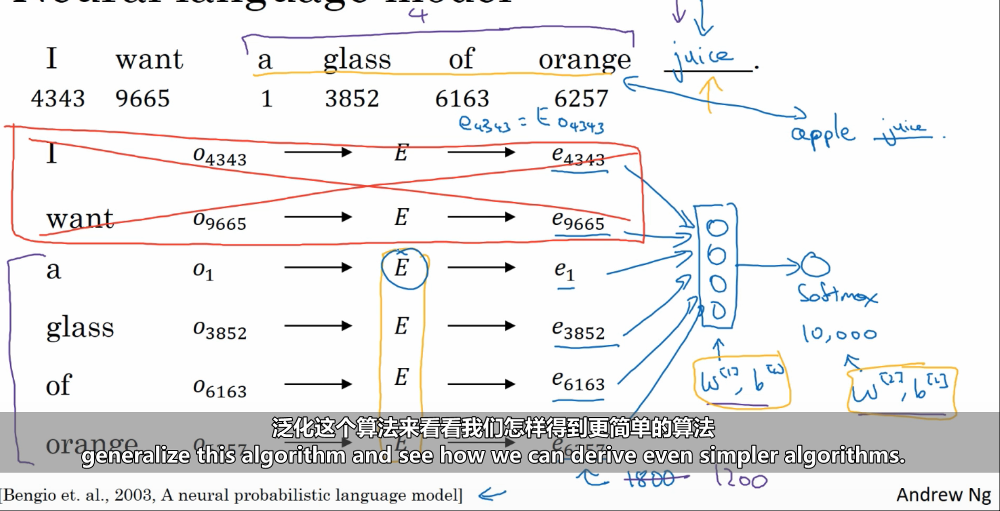
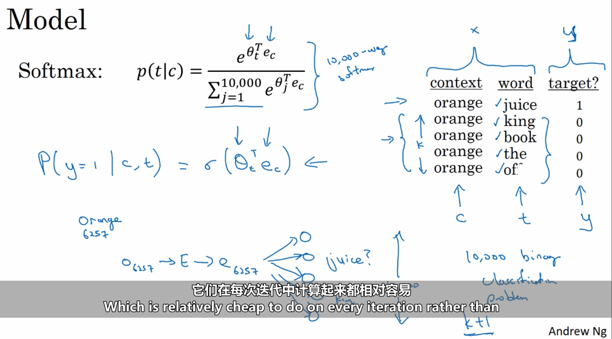
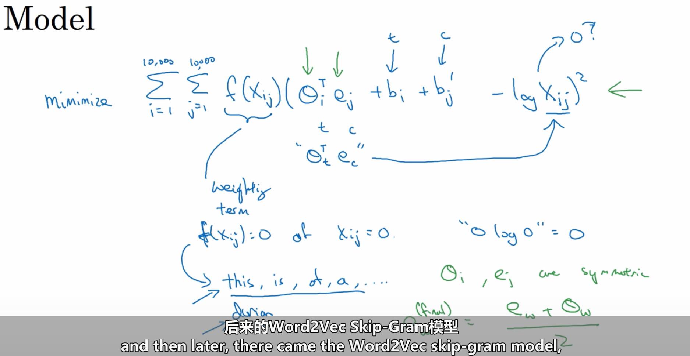

# 文本预处理

## read 文本读取

## tokenize 字符串解析

[NLP BERT GPT等模型中 tokenizer 类别说明详解](https://cloud.tencent.com/developer/article/1865689)

| Model          | Type of Tokenizer             |
| -------------- | ----------------------------- |
| fast MPNet     | WordPiece                     |
| PhoBERT        | Byte-Pair-Encoding            |
| T5             | SentencePiece                 |
| fast T5        | Unigram                       |
| fast MBART     | BPE                           |
| fast PEGASuS   | Unigram                       |
| PEGASUS        | SentencePiece                 |
| XLM            | Byte-Pair-Encoding            |
| TAPAS          | WordPiece                     |
| BertGeneration | SentencePiece                 |
| BERT           | WordPiece                     |
| fast BERT      | WordPiece                     |
| XLNet          | SentencePiece                 |
| GPT-2          | byte-level Byte-Pair-Encoding |
| fast XLNet     | Unigram                       |
| fast GPT-2     | byte-level Byte-Pair-Encoding |
| fast ALBERT    | Unigram                       |
| ALBERT         | SentencePiece                 |
| CTRL           | Byte-Pair-Encoding            |
| fast GPT       | Byte-Pair-Encoding            |
| Flaubert       | Byte-Pair-Encoding            |
| FAIRSEQ        | Byte-Pair-Encoding            |
| Reformer       | SentencePiece                 |
| fast Reformer  | Unigram                       |
| Marian         | SentencePiece                 |

Vocab 词表建立

concat 文本行拼接

# 语言模型

求解生成序列的概率$P(x_{1},x_{2},\cdots,x_{T})=P(x_{1})P(x_{2}|x_{1}) P(x_{3}|x_{1},x_{2}) \cdots P(x_{T}|x_{1},x_{2} \cdots , x_{T-1})$

经马尔科夫条件简化后$P(x_{1},x_{2},\cdots,x_{T})=P(x_{1})P(x_{2}|x_{1})  \cdots P(x_{T}|x_{T-M} \cdots ,x_{T-2}, x_{T-1})$

# 词元表示

One-Hot向量

词嵌入矩阵

1. 上下文计算嵌入矩阵E

	

2. Skip-grams

	输入一个背景词，去预测词库所有词在序列出现的概率。计算softmax概率时，可以使用分层softmax方法优化运算速度如将最简单的贪婪算法替换为二分类法，将最常出现的词汇放在二分树顶层等。

3. Cbow

4. 负抽样

	给定背景词以及预测目标词、随机抽取的k个无关词，构建训练集，使用二分类法训练E矩阵。

5. GloVe

	

6. Word2Vec
