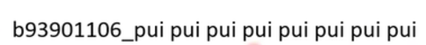

 识别系统

GMM-HMM语音识别系统

DNN-HMM语音识别系统

CNN/LSTM+HMM语音识别系统

基于 CTC（连接时序分类）的端到端语音识别系统

基于 Attention 的端到端语音识别

基于 Transformer 的纯端到端系统。

基于递归神经网络转换器（RNN-T）的端到端语音识别

> [语音识别的技术原理是什么？](https://www.zhihu.com/question/20398418/answer/18080841)
>
> [入门书籍或者课程推荐？](https://www.zhihu.com/question/345422117/answer/1508405344) 

Regression

classification

self-attention

Transformer

GAN

BERT

Autoencoder

Explainable Al

Attack

Adaptation

RL

Compression

Life-long

Meta Learning

kaggle

最终评价

Overall Accuracy（也有工作称其为 Weighted Accuracy）

Average Accuracy（也有工作称其为 Unweighted Accuracy）。

Confusion matrix

t-SNE
