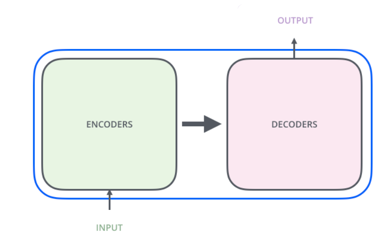
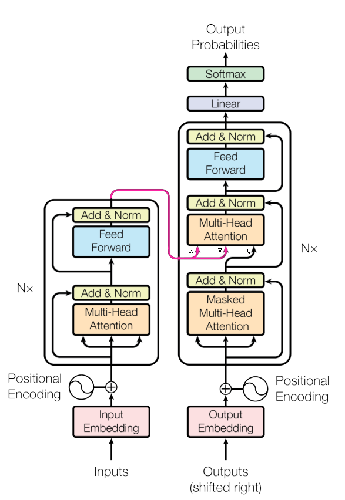
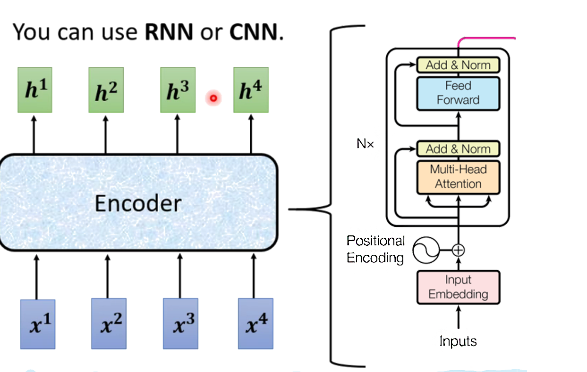
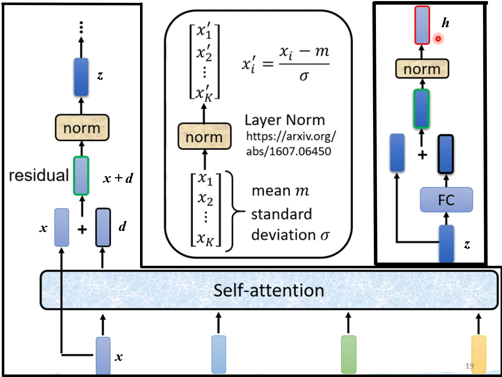
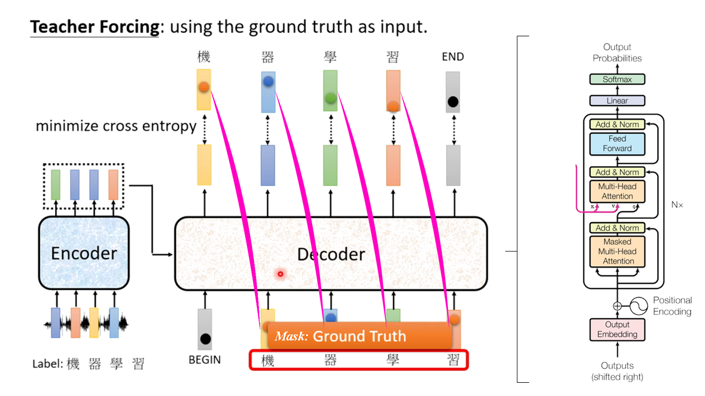
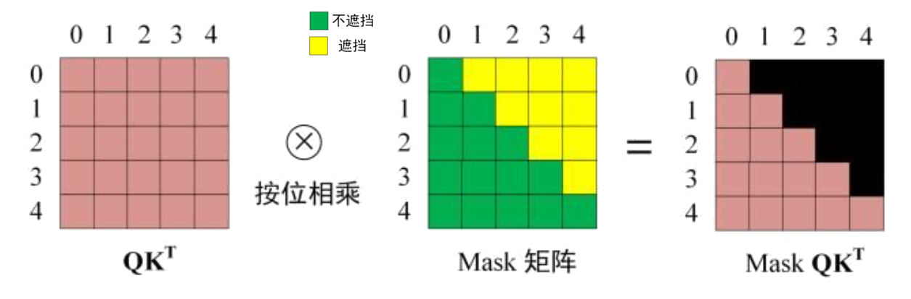
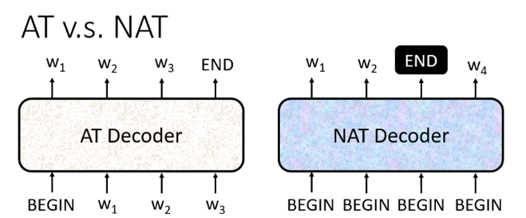

# Transformer-Seq2seq模型

Transformer 由且仅由 self-Attenion 和 Feed Forward Neural Network 组成，主要解决了顺序计算模型的并行计算问题和长期依赖现象导致的信息丢失问题。

Transformer 的本质上是一个 Encoder-Decoder 的结构，简单结构如下所示：

其中，Transformer 内部的 ENCODERS（编码器）和 DECODERS（解码器）均由 Attention 结构和 Feed Forward 结构构成。计算过程中, Encoder 的的输出将作为 Decoder 的输入，并且其 Attention 结构的 $k, v$ 向量被提供到 Decoder 的第二层 Attention 层中。

## Encoder

在 Encoder 中，输入数据首先利用一个含 Position 的 Multi-Head Attention 机制 ，读取到新的嵌入矩阵，此矩阵与输入矩阵维度一致，如下图 $x\rightarrow d$。然后利用 Residual （残差损失）机制，得到 $x+d$，并将其通过 Layer Norm 方法进行标准化，得到最终输出 $z$  。

得到的输出 $z$  经过 Feed Forward 层（前馈神经网络，两层全连接），然后将得到的结果再经 Residual 机制（残差损连接）和 Layer Norm 方法处理，最终得到想要的输出 $h$ ，其维度与 $x$ 一致。  

## Decoder

Decoder 的结构与 Encoder 类似，不过在中间多了一个 Attention 机制，并且使用的 $k, v$ 来自于 Encoder 。

第一个 Multi-Head Attention 层操作与 Encoder 基本相同，只是其对得到的相关向量矩阵 $A$ 在通过 Softmax 之前进行了 Masked 操作，通过 Masked 操作可以使得最终得到的嵌入矩阵，每一个输出序列的信息只考虑其之前的序列信息。如下图所示，可以很容易看出最右边的矩阵中，被遮挡的 attention score 都为 0，相当于输入序列 $0$ 只能使用序列 $0$ 的信息，而序列 $1$ 可以使用序列 $0, 1$ 的信息，即只能使用之前的信息。

第二个 Multi-Head Attention 主要特殊点在于其 Self-Attention 的 $K, V$ 矩阵是使用 Encoder 的输出编码信息矩阵 $h$ 计算的，这样处理带来的效果就是 $K$ 和 $V$ 都包含了 Encoder 所有输入向量序列的信息，因此在 $Q$ 与 $K$ 做相关运算时，不会因为之前的Mask而损失更多信息。

之后的 Feed Forward 层与 Encoder 相同，得到的输出最后利用 Softmax 预测结果。在之前的操作中，因为 Mask 的存在，Softmax层得到的输入矩阵的每一行都仅包含其之前的信息，因此对应的Softmax输出也是利用这个信息来预测之后的信息。

运行机制    

NAT（Non-autoregressive）Decoder（并行输入和输出），则需要先判断输出个数 $N$ ，然后输入 $N$ 个BEGIN。

AT Decoder ：一个个输入后输出（串行），则 Decoder 的输入是 BEGIN 或上一步的输出，当输出结果判断为 END 时结束。

以 AT Decoder 为例，下图左边Encoder负责利用注意力等机制将数据序列编码成嵌入向量，然后乘以权重矩阵为decoder提供$k，v$。右边的decoder以前面的输出为输入（训练时以Masked掩盖当前输入后的数据）经第一个Attention层，并乘以权重矩阵得到$Q$，此三者 $q，k，v$ 作为后续的输入。

[nn.Transformer/Transformer_demo.py at main · wulele2/nn.Transformer (github.com)](https://github.com/wulele2/nn.Transformer/blob/main/Transformer_demo.py)

[Transformer 源码中 Mask 机制的实现 - 虾野百鹤 - 博客园 (cnblogs.com)](https://www.cnblogs.com/wevolf/p/12484972.html)

[alexeykarnachev/full_stack_transformer: Pytorch library for end-to-end transformer models training, inference and serving (github.com)](https://github.com/alexeykarnachev/full_stack_transformer)

[Speech-Transformer/encoder.py at e6847772d6a786336e117a03c48c62ecbf3016f6 · kaituoxu/Speech-Transformer (github.com)](https://github.com/kaituoxu/Speech-Transformer/blob/e6847772d6a786336e117a03c48c62ecbf3016f6/src/transformer/encoder.py)

[foamliu/Speech-Transformer: PyTorch re-implementation of Speech-Transformer (github.com)](https://github.com/foamliu/Speech-Transformer)

[sooftware/speech-transformer: Transformer implementation speciaized in speech recognition tasks using Pytorch. (github.com)](https://github.com/sooftware/speech-transformer)

[transformer/positional_encoding.py at master · hyunwoongko/transformer (github.com)](https://github.com/hyunwoongko/transformer/blob/master/models/embedding/positional_encoding.py#L10:7)

[maxjcohen/transformer: Implementation of Transformer model (originally from Attention is All You Need) applied to Time Series. (github.com)](https://github.com/maxjcohen/transformer)

[Transformer/Batch.py at master · SamLynnEvans/Transformer (github.com)](https://github.com/SamLynnEvans/Transformer/blob/master/Batch.py)

[attention-is-all-you-need-pytorch/train.py at master · jadore801120/attention-is-all-you-need-pytorch (github.com)](https://github.com/jadore801120/attention-is-all-you-need-pytorch/blob/master/train.py)

[nlp-tutorial/Transformer.py at master · graykode/nlp-tutorial (github.com)](https://github.com/graykode/nlp-tutorial/blob/master/5-1.Transformer/Transformer.py)

[transformers.modeling_bert — transformers 3.0.2 documentation (huggingface.co)](https://huggingface.co/transformers/v3.0.2/_modules/transformers/modeling_bert.html#BertModel.forward)

[(39条消息) BERT简单解读_郑不凡的博客-CSDN博客_bert解读](https://blog.csdn.net/m0_50896529/article/details/121748613)

[BERT预训练的任务MLM和NSP - 知乎 (zhihu.com)](https://zhuanlan.zhihu.com/p/562352255)

[BERT 详解 - 知乎 (zhihu.com)](https://zhuanlan.zhihu.com/p/103226488)
[BERT模型学习与分析 - 简书 (jianshu.com)](https://www.jianshu.com/p/160c4800b9b5)

[qianfan1996/WSA-BERT: Word-wise Sparse Attention for Multimodal Sentiment Analysis (github.com)](https://github.com/qianfan1996/WSA-BERT)

