# 情感语音研究（识别、生成、转换、数据库）

## Source Filter 理论

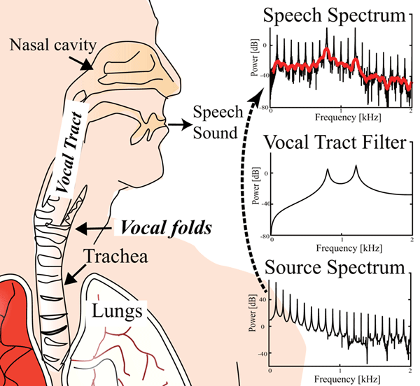

人们发声是由身体的多个部位共同作用而成的。

人当我们呼气，气流从肺部（Lungs）流出，经过气管，再流到喉部。排出的空气。空气通过气管（Trachea）进入喉部。

在喉部，有两片被称为“声带，Vocal folds”的小肌肉褶皱。发声时，随着声带靠拢形成窄缝，气流冲击声带，并不断地引起周围气压变化，使得声带产生周期性振动（Titze, 2008）。这种由声带振动产生的声音叫“浊音”。如果声带不振动，即只是允许气流通过但不产生声带的振动，那么产生的声音叫“清音”。

然后，声音流经喉部上方的声道（Vocal Tract），口腔和舌头、软腭、唇、口腔、牙齿和硬颚等器官，会被进一步调整，使其呈现出特定的语言特征。这些结构的位置和形状随时间变化，导致我们发出不同的音节和单词。例如，当我们发出“t”和“d”的声音时，舌尖会接触上颚；而发“p”和“b”的声音时，双唇会闭合。当我们从“a”转到“i”时，舌头会从口腔的底部移动到靠近硬颚的位置。

此外，当呼出的气流经过如声门（Vocal folds，声带之间的空隙）或声道的某些狭窄或突变等部分时，它可能会产生“湍流气流”，也就是气流变得不稳定并开始旋转和涡动，产生混乱、不规则的流动模式。湍流气流所产生的声音通常听起来像是噪音或摩擦声，并且常常伴随着清音、爆破音或摩擦音等特定的语音音素。例如，当我们发出“sh”（如“shush”中的声音）或“f”（如“fan”中的声音）这样的声音时，这是因为气流在声道中产生了湍流，从而产生了这种摩擦声，而不是因为声带的振动。

为了系统地理解语音产生的机制，在源-滤波器理论中，语音产生的机制被描述为一个两阶段（Chiba＆Kajiyama，1941; Fant, 1960）的过程：
(a) 来自肺部 (Lungs) 的气流引起喉部内的声带组织(Vocal folds)振动，并产生“源”声音。其中，湍流气流会在声门或声道处产生一些嘈杂、非周期性的声“源”。
(b)这些源声音的频谱结构(**Source Spectrum**)由声道(Vocal Tract)“滤波器”进行再塑造。通过滤波过程，与声道共鸣相对应的频率成分被放大，而其他频率成分则减弱。

源声主要表征了嗓音（即基频），而滤波器则形成了音色。尤其是对于基于声音的听觉交流来说，将控制源（发话）和滤波器（发音）分离是有利的，例如需要通过灵活调整口腔配置实现各种不同语素表达方式的人类语言。

源音主要表征了声音的振幅（音量）和频率（音调），而滤波器则形成了整体频谱结构。

根据该理论，声源受到声道滤波器的影响较弱，并且已成功应用于语音分析、合成和处理（Atal＆Schroeder, 1978; Markel＆Gray, 2013）。独立控制声源（发音）和滤波器（发音器官运动）对于进行语言交流非常有优势，这要求能够以灵活的方式表达各种不同的音素，并通过调整口腔构造来实现（Fitch, 2010; Lieberman, 1977）。

2.1 声源
提供声学输入给声道滤波器的主要声源有四种：声门源、吸气噪音源、摩擦噪音源和瞬时噪音源（Stevens, 1999, 2005）。

声门源是由声带振动产生的。声带是位于喉部的肌肉襞片。左右两侧声带之间的开放空间称为“声门区域”。当两侧声带靠近时，来自肺部的气流会导致声带组织振动。在压力、气流、组织弹性和左右两侧声带碰撞等多重影响下，声带产生振动，周期性地调制着喉部处空气压力。每秒钟周期性发生的振动次数被称为“基频（f0）”，以赫兹或每秒循环次数表示。在频谱空间中，通过基频和其整数倍（谐波）来决定了人们所说话语中的元音（例如[a]、[e]、[i]、[o]、[u]）、双元音（即由两个元音组合而成）、浊辅音（例如[b]、[d]、[ɡ]、[v]）。这些都是由于呼出口形成了一个闭合状态，在释放闭合状态时会产生一阵短暂湍流。

除了通过呼出口生成的基本来源外，杂乱信号也可以作为辅助辅助辅助物质进行发射。在此过程中，在呼吸道收窄或堵塞部位形成的空气湍流对广泛范围内不规则(非周期)压力起伏做出贡献，并且具有随机分布在宽频率范围内特点。“吸入噪音”指从格洛蒂斯或紧邻格洛蒂斯处产生并伴随某些阻塞性排放或关闭行为而引起强烈喷息爆裂现象。“摩擦噪音”则是通过将空气迫使经过上节段收窄处创建而产生。（例如下唇与上牙齿之间收窄区域，舌后与软颚之间收窄区域以及舌侧与臼齿之间收缩区域）(Shadle, 1985, 1991) 当发现通向言语道路完全关闭然后释放，“瞬时噪音”就会生成。通过形成言语道路中断点来建立一个高压环境，并且回复正常情况后会持续几毫秒时间。

有些语音声音可能涉及多个声源。例如，一个带声门摩擦的辅音结合了声门源和摩擦噪音。气息声可能来自于声门源和吸气噪音，而无声摩擦可以将在声门和上喉狭窄处产生的两个噪音源结合起来。这些声源被输入到口腔道滤波器中以创建语音声音。

2.2 Filter

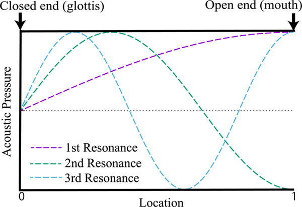

在源-滤波器理论中，声道充当声音的一个声学滤波器来修改源音。通过这个声学滤波器，某些频率成分被传递到输出语音中，而其他频率则被衰减。滤波器的特性取决于声道的形状。作为一个简单情况，考虑一根长度为 L = 17.5厘米的均匀管道的声学特性，即男性喉部标准长度。管道的一端是闭合的（如声门），另一端是开放的（如口腔）。在管内，纵向声波可以朝着口腔或者朝着喉部传播。这种波动通过交替地压缩和扩张管段内空气来传播。由于这种压缩/扩张作用，空气分子会稍微偏离它们静止位置。因此，在时间上变化了沿着行进方向上空气纵向位移时产生了相应变化的管内声学气压力。管内声学气压力剖面由前往口腔或喉部行进的纵向波确定下来。在此形成了“驻波”，其峰值幅度剖面不随空间移动而改变。绝对值最小振幅处称为“节点”，绝对值最大振幅处称为“反节点”。由于空气分子无法在封闭端震动得太多，所以封闭端成为一个节点；另一方面, 管道开放端则成为反节点, 因为空气分子可以自由运动. 可以形成符合这些边界条件的各种驻波。在图2中，1/4（紫色）、3/4（绿色）和5/4（天蓝色）波表示第一、第二和第三共振频率。根据管道内节点数量确定驻波的波长为λ = 4L、(4/3)L、(4/5)L。相应的频率可计算为 f = c / λ = 490, 1470, 2450 Hz，其中 c = 343 m/s 代表声速。这些共振频率在语音学中被称为“共振峰”。

接下来，考虑一个源声音输入到这个声学管中。在源声音（有声源或噪音，或两者兼有）中，声能分布在广泛的频率范围内。源声音引起管道内空气柱的振动，并产生外部空气中的声波作为输出。从这个声学滤波器输出时，输入频率以何种强度输出取决于管道的特性。如果输入频率成分接近共振峰之一，则管道与输入发生共振并传播相应的振动。因此，**在靠近共振峰频率附近的频率成分将以其完全强度通过到输出端**。然而，如果输入频率成分远离任何共振峰，则管道不会与输入发生共振。这样的频率成分被大幅衰减，并且在输出端只能达到较低的震荡幅度。通过这种方式，声学管或说话道路对源声进行了过滤处理。该过程可以用传递函数来描述，该函数描述了输入和输出之间的放大比例随着频率变化而变化的依赖关系。从物理上讲，传递函数由说话道路形状确定。

最后，声波从口唇和鼻子辐射出去。它们也包含在说话道路传递函数中考虑进去了。

2.3 源信号和滤波器的卷积

人类能够在很大程度上独立地控制声音发生（源生成）和发音（过滤过程）。因此，语音声音被认为是声道滤波器的响应，其中输入了一个声源。为了模拟这样的语音产生中的源-滤波系统，通常将声源或激励信号 x(t)实现为周期性脉冲列以表示有声语音，而白噪声则用作无声语音的来源。如果 vocal-tract 的配置不随时间变化，则 vocal-tract 滤波器成为线性时不变（LTI）系统，并且输出信号 y(t)可以通过输入信号 x(t)与系统冲击响应 h(t)进行卷积来表示。

y(t)=h(t)∗x(t),

在这里，星号表示卷积。方程（1）描述了时域中的情况，也可以用频域来表达。

Y(ω)=H(ω)X(ω).

频域公式表明，语音谱Y(ω)被建模为源谱X(ω)和声道滤波器H(ω)的乘积。声道滤波器H(ω)的谱由声道传递函数T(ω)和嘴巴和鼻子辐射特性R(ω)的乘积表示，即H(ω)= [ T ( ω ) R ( ω ) ] 。

有几种方法可以估计声道滤波器H(ω)。最流行的方法是逆滤波，通过最小二乘法从声学语音信号中估计自回归参数（Atal＆Schroeder, 1978; Markel＆Gray, 2013）。然后可以根据估计的自回归参数恢复传递函数。然而，在实践中，逆滤波仅限于非鼻化或轻微鼻化的元音。另一种方法是基于声道形状的测量。对于人体主体，可以通过X射线摄影或核磁共振成像（MRI）来测量声道横截面积。一旦获得了声道区域函数，就可以通过所谓的传输线模型来计算相应的传递函数，在该模型中假设在声道内部进行一维平面波传播（Sondhi＆Schroeter, 1987; Story等人,1996）。

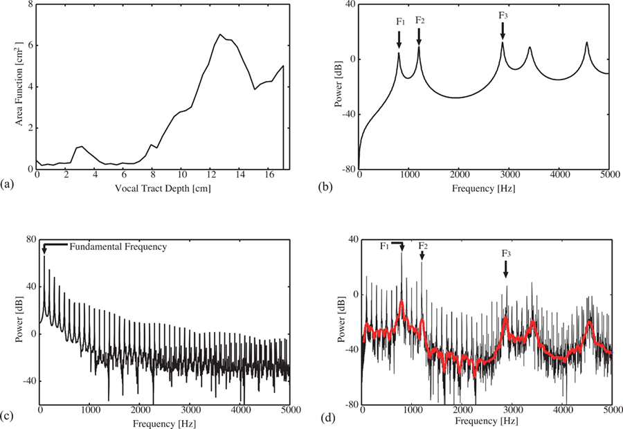

为了说明源-滤波模型，我们以图3中合成的元音/a/声音作为例子。图3（a）中的声道面积函数是通过MRI从一个男性受试者那里测量得到的（Story et al., 1996）。通过传输线模型，我们得到了传递函数H(ω)，如图3（b）所示。第一和第二共振峰分别位于F1 = 805 Hz和F2 = 1205 Hz。通过反向傅立叶变换，我们可以得到声道系统的冲激响应h(t)。作为声门源信号，我们使用了Liljencrants-Fant合成模型(Fant et al., 1985)。基频被设定为fo = 100 Hz，在图3(c)中产生了功率谱上的尖峰。除了在fo的高次谐波处出现的尖峰外，声门源信号的频谱结构相对平坦。如图3(d)所示，将源信号与声道滤波器卷积会放大靠近共振峰附近fo高次谐波部分。

由于源-滤波建模捕捉到了语音产生的本质，因此已成功应用于语音分析、合成和处理（Atal＆Schroeder，1978; Markel＆Gray，2013）。最早解释了基于发声（源）和发音（滤波器）概念的语音产生机制是千叶和梶山（1941年）。他们的想法与 Fant 的滤波理论相结合（Fant, 1960），从而在语音产生研究中引出了“元-滤波理论”。 

迄今为止，源-滤波建模仅应用于声门源，在这种情况下，声带振动提供主要的声源。还有其他声源，例如摩擦噪声。在摩擦噪声中，在气道收窄或阻塞部位会形成空气湍流。这种随机来源也以类似于声门来源的方式激励共鸣腔道（Stevens, 1999, 2005）。它与声门来源明显不同之处在于其滤波特性由收窄或阻塞后气道形状决定。例如，如果收窄位于唇部，则没有从收窄位置向下游存在腔体，并且因此无需进行过滤即可直接从口腔开放处辐射出来。当收窄位于唇部上游时，介乎收缩点和唇部之间气道的形状决定着其滤波特性。还应注意到，在构成物上生成的湍流源对 vocal tract 的三维几何形状非常敏感。因此，在建模摩擦噪声时需要考虑 vocal tract 的三维形状而不是一维面积函数 (Shadle, 1985, 1991) 。

3. Resonance Tuning

作为源-滤波理论的有趣应用，“共振调谐”（Sundberg, 1989）被阐述了出来。在女性语音中，第一和第二共振峰分别位于300至900 Hz 和900至2,800 Hz 之间。在女高音唱法中，声音的频率可以达到这两个范围。为了提高高频率下发声效果的效率，女高音歌手会调整声道形状以将第一或第二共振峰（R1或 R2）与基频 fo 进行调谐。当基频 fo 的任何一个谐波与共振峰重合时，产生的声学功率（和音乐表现力）会得到增强。

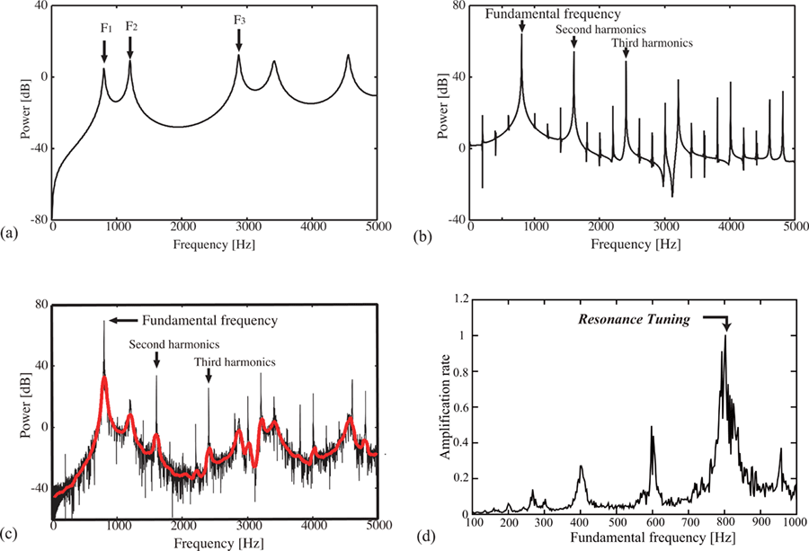

图4展示了共振调谐的一个例子，其中基频被调至元音/a/的第一共振峰R1，即f o = 805 Hz。如图4(c)所示，在输出语音频谱中，声道滤波器强烈放大了声源的基频成分，而其他谐波则被衰减。由于只有一个频率成分被强调，输出语音听起来像是纯音。图4(d)显示了放大比（即输出语音与输入源之间的功率比）对基频 f o 的依赖关系。事实上，在 f o = 805 Hz 共振调谐点处，输出语音的功率达到最大值。在不损失声源功率的情况下，歌手可以轻松地发出响亮的声音，并且这些声音在大型演奏厅中能够很好地传达给观众（Joliveau等人, 2004）。

尽管音量显著增加，但可理解性却受到了牺牲。由于基频 f o 得到了强烈的提升，其高次谐波被大幅削弱，使得感知共振峰结构变得困难（图4(c)）。这就解释了为什么女高音在高音域唱歌时很难辨认出单词。

这里讨论的共振调谐是基于源和滤波器的线性卷积，假设它们彼此独立。然而，在现实中，源和滤波器会相互作用。根据声道的声学特性，它促进了声带的振动并使声源更强大。因此，这种源-滤波器交互作用除了线性共振效应外还可以使输出语音听起来更响亮。在第4节将详细解释这种交互作用。

有趣的是，一些动物如鸟类和长臂猿在它们的声音表达中利用共振调谐技术（Koda等人，2012年；Nowicki，1987年；Riede等人，2006年）。通过X射线拍摄和氦氧实验发现这些动物会调整声道共振以跟踪基频f o 。这可能通过增加它们声音的响度来促进声学交流。同样地，高次谐波成分，在人类语言交流中需要强调共振峰时则被抑制。关于动物是否在其交流中利用共振峰信息仍存在争议（Fitch, 2010; Lieberman, 1977），但至少在这种情况下，产生大声音对于远距离警报呼叫和纯音歌唱对动物更具优势。

4. Source-Filter Interaction

线性源-滤波器理论认为，语音可以表示为源和滤波器的卷积。该理论基于这样一个假设：声带振动以及湍流噪声源受到声道的影响较小。然而，这种假设主要适用于成年男性的语音。实际的语音产生过程是非线性的。声带振动是由压力、气流、组织弹性和组织碰撞等多种因素共同作用引起的。这样一个复杂系统自然遵循非线性运动方程。在声门和声道内部的空气动力学也严格遵循非线性方程。此外，源和滤波器之间存在相互作用（Flanagan, 1968; Lucero et al., 2012; Rothenberg, 1981; Titze, 2008; Titze & Alipour, 2006）。首先，从声带生成的源音受到了声道的影响，因为声道决定了位于声带上方压力来改变悬浮流体力学特性。正如第2.3节所述，湍流源对于声道几何形状也非常敏感。其次，在通过喉头传播到口腔时，源音不仅从口腔辐射出去，还会部分反射回喉头经过喉头传导回去。这种反射可能会影响到声带振动，特别是当基频或其谐波与其中一个共鸣频率密切相邻时（例如唱歌中）。强烈的听觉反馈使得源和滤波器之间关系变得非线性，并引发各种人类发音不稳定现象（例如突然跳调、亚谐波、共鸣、淬灭和混沌）(Hatzikirou et al., 2006; Lucero et al., 2012; Migimatsu & Tokuda, 2019; Titze et al., 2008)。

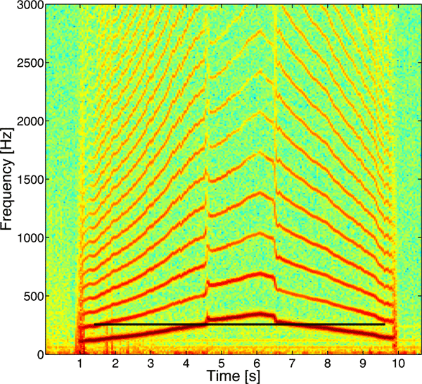

图5显示了一个频谱图，展示了这种音高跳跃。水平轴表示时间，垂直轴表示歌声的频谱功率。在这个录音中，男歌手在一定的频率范围内滑动他的音高。因此，基频从120 Hz增加到350 Hz，然后再降回到120 Hz。大约在270Hz处，基频或其更高次谐波穿过声道共振之一（图5黑色粗线），并且突然跳变。在这样的频率交叉点上，从声道到声带的声学反射变得非常强烈且不可忽视。源-滤波器相互作用有两个方面（Story et al., 2000）。一方面，声道共振促进了声带振荡，并有助于产生响亮的歌唱声音，如共鸣调节部分所讨论的那样（第3节）。另一方面，声道共振抑制了声带振荡，并导致发出不稳定的音色。例如，在图5中通过滑奏唱法演示时可以突然停止或自发地跳转到另一个基本频率上来。为避免这种音色不稳定性，在发生频率交叉时歌手必须减弱声学耦合水平, 可能通过调整会压喉部位 (Lucero et al., 2012; Titze et al., 2008) 。

5. 结论
总结一下，源-滤波器理论被描述为模拟人类语音产生的基本框架。源声是由声带振动和/或在声门上方形成的湍流气流产生的。喉腔作为一个滤波器，用来改变源声的频谱结构。这种滤波机制可以通过共鸣管道的共振来解释。对于需要灵活操纵喉腔配置以顺序和平稳地表达各种音素的人类语言基础声学交流而言，源与滤波器之间的独立性至关重要（Fitch, 2010; Lieberman, 1977）。作为源-滤波器理论应用之一，共振调谐被解释为女高音歌手和某些动物所使用的技术。最后，我们描述了源与滤波器之间存在相互影响。由于它们彼此紧密相连，在空气动力学上不可避免地会使得源声受到喉腔影响。此外，从喉腔反射回声门处并影响到声带振动，并可能引起各种发音不稳定性的压力波也会对其产生影响。例如，在唱歌时当基频或其更高次谐波穿过其中一个喉腔共振时，源-滤波器相互作用可能变得很强大。

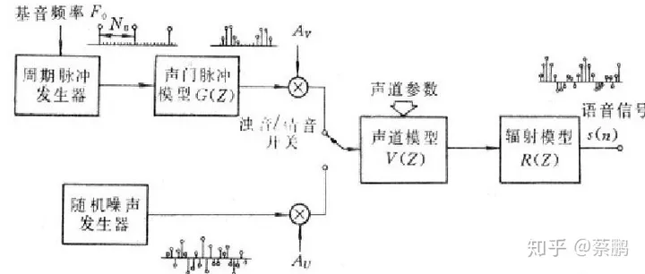

基频是由声带的振动产生的，并决定了声音的音高。是声音中最低的频率，并且是其他所有频率的基础。
共振峰是由声道的形状和大小决定的，当声带产生的声音穿过声道时，某些频率会被强化。在语音学中，共振峰通常被称为“格式”。

## 语音特征

### 韵律特征（基于超音段的特征）

不同情感状态下语气变化的体现。

最为常见的韵律特征包括：基频、能量、节奏。

基频亦或是音调，是反映声门振动的本质特征。中性或非情感性语音的音调范围情感性语音的音调范围窄得多，并发现随着情感强度的增加，中性语音中通常出现的停顿和停止的频率和持续时间会减少。不同人的基频差别较大，因此基频特征常应用于说话人识别。

能量亦或是音量、强度。在恐惧，喜悦和愤怒中，高频能量增加，而悲伤的语音，其高频能量则会减少。具有高激活水平的情感，如愤怒、惊讶和幸福，其能量较高，而恐惧、悲伤和厌恶的能量较低。

节奏的特征包括语速、音素之间的停顿、浊音段的长度、重音的频度和突变特性等。恐惧、厌恶、愤怒、快乐这些高激活水平的情感具有较快的节奏，惊奇这类中激活水平的情感具有正常的节奏，而悲伤这类的情感的节奏则比较慢。

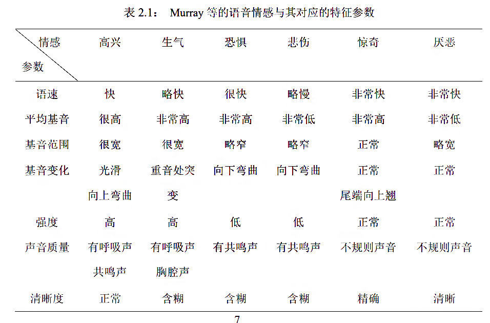

特征 1-10：短时能量及其差分的均值、最大值、 最小值、中值、方差； 

特征 11-25：基音及其一阶、二阶差分的均值、 最大值、最小值、中值、方差；特征 26：基音范围；

特征 27-36：发音帧数、不发音帧数、不发音 帧数和发音帧数之比、发音帧数和总帧数之比、发 音区域数、不发音区域数、发音区域数和不发音区 域数之比、发音区域数和总区域数之比、最长发音 区域数、最长不发音区域数；

### 音质特征

情感状态下语音音质变化的体现,反应发音时声门波形状的变化，如声道肌肉紧张程度等。

常用的音质参数包括带宽、呼吸声、明亮度、 共振峰频率、清晰度，用来衡量语音是否清晰、纯净。

共振峰在决定音质和音色上起重要作用，

特征 37-66：第 1、第 2、第 3 共振峰及其一阶 差分的均值、最大值、最小值、中值、方差； 

特征 67-69：250 Hz 以下谱能量百分比、650 Hz 以下谱能量百分比、4 kHz 以上谱能量百分比。 

特征 70-74：谐波噪声比(HNR)的均值、最大值、最小值、中值、方差。

第一和第二谐波振幅差。

松紧度、粗糙度、清晰度、明亮度、喉化度和呼吸 声

### 声道特征（频谱特征）

声道形状变化和发声运动之间相关性的体现。

最为常见的频谱特征包括：梅尔频率倒谱系数（MFCC）、感知线性预测系数（PLPC）、线性预测倒谱系数（LPCC）、对数频率功率系数（LFPC）、共振峰频率、包络谱。

梅尔频率倒谱系数，更接近于人类听觉系统。

感知线性预测系数，利用人类感知的知识来强调频谱中的重要语音信息，同时最小化说话者之间的差异，更偏重于人类的感知特性。

线性预测倒谱系数，将声音在每段频率上的特性视为线性关系，计算量小。

对数频率功率系数，能够模拟人耳对不同频率的不同听觉分辨能力的模型，更适合在低阶滤波器中保存基本频率信息。

共振峰频率，基于人类声道的声共振在声谱中相对较高强度的频率区域。

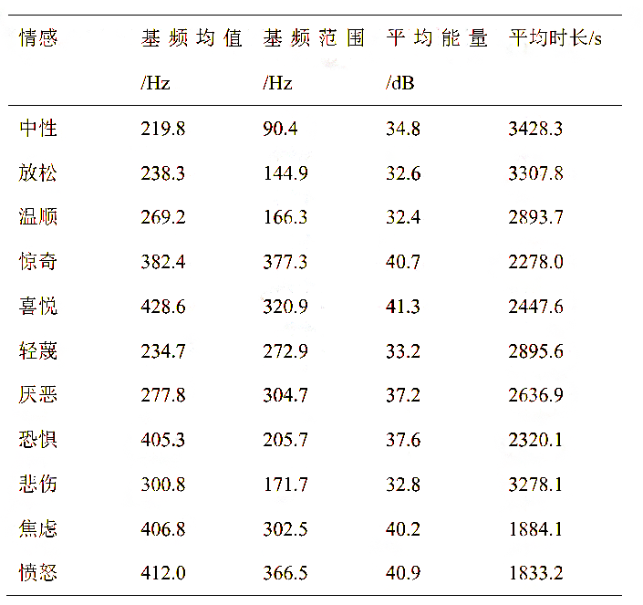

### 语音的非线性特征

Teager 能量算子的过零特征提取

### 特征重要性分析

基于情感维度空间模型的特征分析: PCA 方法

实用语音情感的特征评价与特征选择: fisher 准则

### 特征提取工具

openSMILE

openXBOW

DeepSpectrum

auDeep

End2You

VQ 工具包

## 情感表示模型

### 离散情感模型

愤怒、悲伤、 厌恶、恐惧、开心、惊奇、惊喜、轻蔑、忧虑、内疚、有趣、羞愧、焦虑、勇敢、沮丧、渴望、绝望、亲密、讨厌、希望、爱、和平等

### 维度情感模型

#### Robert Plutchik情绪环  

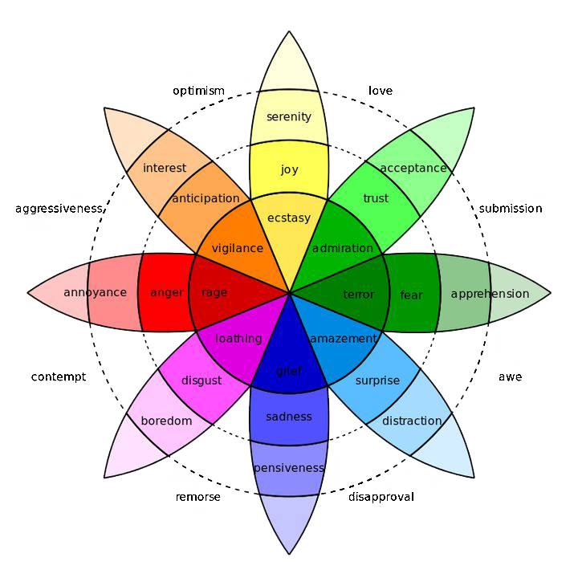

#### Schloberg 三维情感模型：快乐-不快乐，恐惧-厌恶，激活水平，

#### Plutchik 椭圆情感三维模型

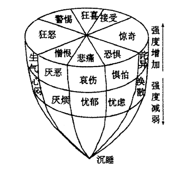

#### * Mehrabian PAD：pleasure-arousal-dominance(愉悦度-激活度-优势度)三维模型

> [1] A. Mehrabian, 《Pleasure-arousal-dominance: A general framework for describing and measuring individual differences in Temperament》, 1996, doi: [10.1007/BF02686918](https://doi.org/10.1007/BF02686918).

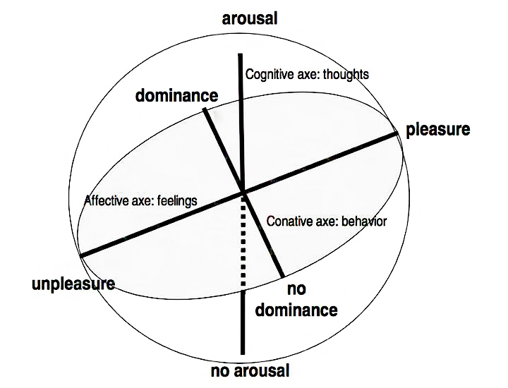
