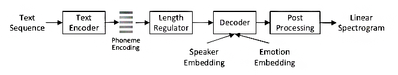
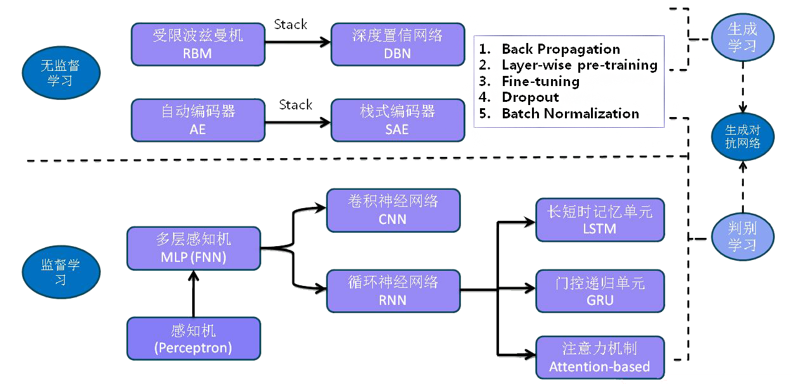

# 语音合成

> 富有情感的语音能准确传递说话人的真实情绪，让听者准确理解说话人所要表达的意思。
>

## 应用

开发智能语音教具，提高教学的质量

人机交互，提升交互友好度

文本阅读，便于理解感情色彩

## 合成技术

### 共振峰合成

`通过合成器参数控制，来灵活的改变合成语音的质量`

### 波形拼接合成

### 韵律特征合成

### 基于统计参数的合成

基音同步叠加技术 (Pitch  Synchronous Overlap Add, PSOLA)，PSOLA 能够在拼接语音波形之前灵活的调整波形的基频、时长和短时能量等韵律参数

### 基于深度学习模型的合成

深度神经网络(Deep Neural Networks, DNNs)

pixelRNN

Gated CNN

模型

Tacotron（文本-语谱图-声码器）  

Tacotron2

Wavenet

VoiceLoop

ClariNet（文本-波形）

Deep Voice（文本-参数-声码器）

Char2Wav（字符-参数-声码器）

SampleRNN

## 合成方式

合成中性的语音，修改声学特征参数转换成目标情感语音；

> 在语音合成中叠加基本情感语调的规则；
>
> 分析不同情感下的韵律参数，建立韵律特征模板，以此完成语音参数的修改和波形拼接；
>
> 分析韵律特征参数，基于关联规则，完善情感语音合成韵律模型；
>
> 离散余弦变换 (DCT)与 PSOLA 算法相结合，利用 DCT 调整单元基音频率；
>
> 建立不同情感的韵母基音模板库，将基音模板作为 PSOLA 算法的合成基元；
>
> 韵律特征与音质特征相结合，通过频谱包络综合地调整音质类和发声器官类参数；
>
> 转换中性语音的频谱特征和多级韵律特征，来合成情感语音。

基于情感语料库合成出带情感的语音；

> 使用最大似然线性回归(MLLR)的自适应算法与少量情感语料库来修改中性平均声学模型以获得目标情感声学模型；
>
> 选择合适的风格控制向量，通过HMM控制语音合成风格；
>
> 可训练合成语音和韵律特征修改相结合；
>
> 说话人自适应训练得到目标情感的声学模型，说话人自适应变换合成出目标说话人的目标情感语音。
>
> 完善情感描述模型，更高效的区分不同的情感。

在合成情感语音的基础上，调整参数以提高准确性。

> 文本分析和场景因素结合，建立情感预测网络；  
>
> 加入频谱修正，语音频谱包络的非线性频域变换、滤波高频或低频的变化范围以及频谱的平度，控制频谱噪声；
>
> 利用 PAD 模型对合成情感语音的声学特征进行修正

### 热门方式：

HMM/DNN/RNN等 + 声码器

1. 数据收集和处理

	IEMOCAP(英)、SAVEE(英)、EMODB(德)、Arabic NAD(阿拉伯)、RAVDESS(英)、emotional speech(汉)、CASIA(汉)

	文本规范化、语法分析、韵律分析、字音转换、情感标注

2. 模型训练与自适应

	输入特征：频谱、Mel谱、语言特征、音素信息、上下文相关标注等

	平均音模型训练

	说话人自适应

3. 语音合成

	WORLD声码器、STRAIGHT（自适应加权谱内插）、WaveRNN

	最大似然生成算法

4. 效果评价

端到端语音合成模型 + 韵律特征参数调整

1. 数据收集和处理

2. 模型训练

	Tacotron2、ClariNet、Deep Voice

	输入特征：频谱、Mel谱、语言特征等

3. 韵律调整

	基频：语音音调的高低

	时长：语速的快慢

	能量：声音的强度

4. 效果评价

## 技术应用

不同说话人的情感迁移

依赖其他人的情感差异，使一个没有情感数据的声音情感化

人机交互中情感的感知与应对

虚拟形象的情感表达

计算机辅助教学

识别说话人情感，智能应对（生气时，撒娇求原谅。伤心时，安慰。高兴时，共同庆祝。）

识别说话人情感，生成动态表情包（含语音）
