# 语音信号处理

语音信号处理是研究用数字信号处理技术对语音信号进行处理的一门学科。通过处理得到一些反映语音信号重要特征的语音参数以便高效的传输或储存语音信号信息;二是要通过处理的某种运算以达到某种用途的要求，例如人工合成出语音、辨识出讲话者、识别出讲话的内容等等。因此，在研究各种语音信号数字处理技术应用之前，首先需要了解语音信号的一些重要特性的知识，在此基础上才可以建立既实用又便于分析的语音信号产生模型和语音信号感知模型等，它们是贯穿整个语音信号数字处理的基础。

## 发展历史

40年代，通道声码器技术，语谱仪。

50年代，数字信号处理技术（FFT）。

70年代，倒谱分析技术，线性预测技术。

80年代，矢量量化VQ，隐马尔可夫模型HMM。

近年来，人工神经网络。

语音发展重点，企业实践（科大讯飞，思必驰，标贝科技）

从辅音和元音级别的较小语言单元中提取的韵律特征

从较长的语音片段（如单词和短语）中提取的逐帧韵律特征序列

## 语音发音及其感知系统

语音是声音（Acoustic）和语言（Language）的组合体，因此其既有声音的物理特性，也蕴含着人类的一些思想。

声音首先由传达者通过发声器官或发声工具（手机，麦克风等）产生出来，经由空气介质传播到听话者的听觉器官，耳朵中。然后听话者的耳蜗会分析声音中的频率成分，产生对应的神经脉冲，通过听觉神经传递给大脑进行感知。

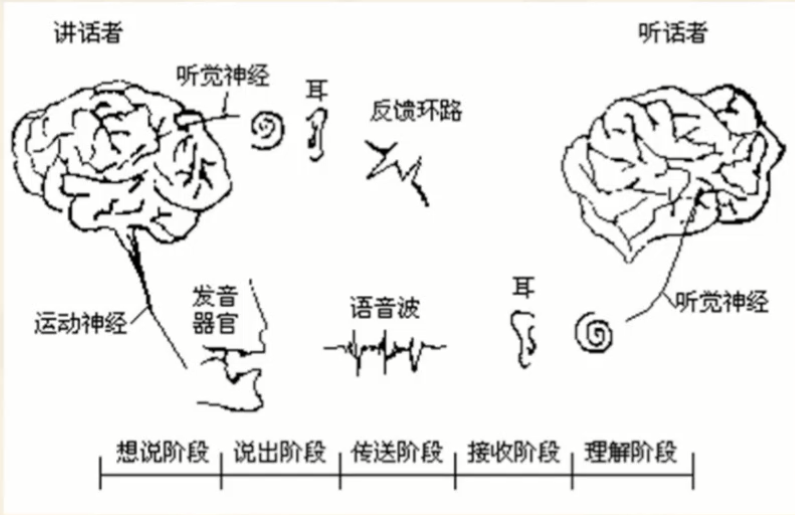

从物理性质看，语音具有一定的音色（音质）、音调（频率）、音强（振幅）和音长。人体从肺部呼出的直气流，经由声带的开闭变为交流的断续流，形成一系列脉冲。而气流冲击声带会产生震动，然后通过声道产生频率响应变成语音。

- 肺部呼出气流的强弱决定了音强的大小。

- 声带的开闭构成音调的周期或基音（Pitch）周期，其倒数为基音频率，基音频率决定了音调的高低。其中声带振动的是浊音（mō），声带不振动的是清音(pō)。

- 声道的形状、口腔（舌、唇、齿、颚等器官）等会对语音产生调音作用，影响声音音色。在整体发音器官维持较稳定形状情况下，声音仅从口腔辐射出去，会形成元音音色，此种音色具有特有的声学特性：共振峰（共振峰频率、频带宽度等）；反之为辅音。

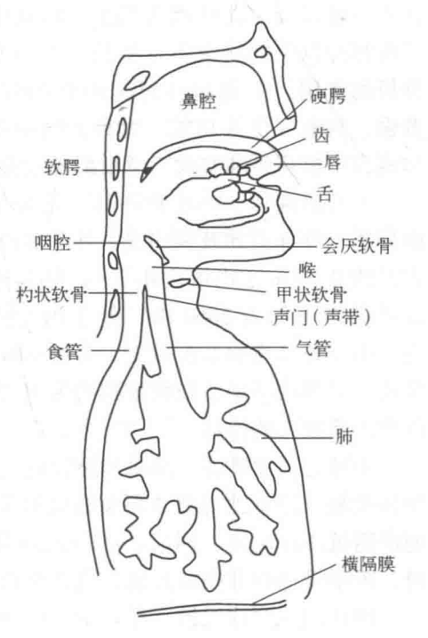

语言，是一种规律性的符号系统，包含语素、词、短语、句子等层次的单位，以及词法、句法、 文脉等结构内容。与之相对应的为声音中的音节和音素结构。

音节（Syllable）是一个清晰的语音片段（如一个汉字），由一个或多个音素（Phoneme）组成（如元音（Vowel）和辅音（Consonant））。

在汉语中，一个音节就是一个字，主要由音调以及音素构成的声母或韵母（调母）不同组合拼成。其中声调的变化具体表现为浊音基音周期（或基音频率）的变化。

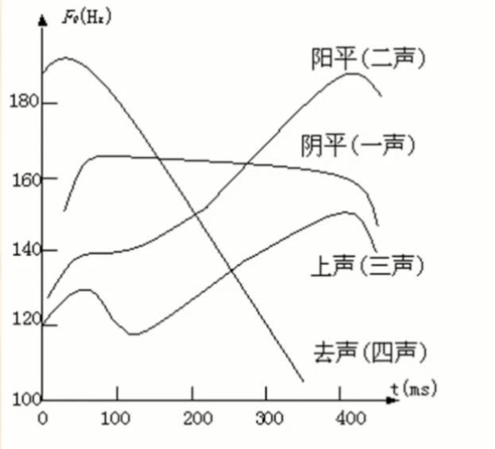

在人体的听觉结构中，外耳、中耳、内耳和蜗神经预先完成声音采集、频率分解、及声能转换等功能。然后大脑听觉中枢会对神经信号进行加工和分析，感知声音音色、音调、音强、方位等。因为硬件结构限制，人的听觉器官一般可以感觉到频率在20Hz -20kHz，强度在-5dB-130dB的声音信号。并且根据人的心理学角度研究，人类在听取声音时，一个强信号附近的弱信号将变得不可闻（听觉掩蔽）。

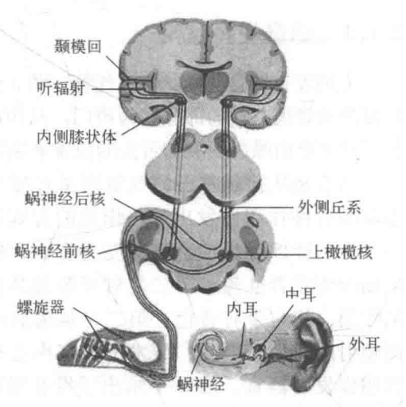

语音信号建模

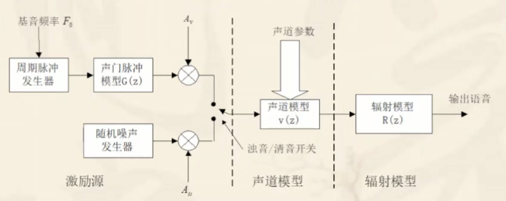

声带开闭，会形成一个类似于斜三角型的脉冲信号，并且从其频域结构上看，可以把其作为一个低通滤波器。

$$

g(n)=\left\{\begin{array}{ll}

(1 / 2)\left[1-\cos \left(\pi n / N_{1}\right)\right], & 0 \leqslant n \leqslant N_{1} \\
\cos \left[\pi\left(n-N_{1}\right) / 2 N_{2}\right], & N_{1} \leqslant n \leqslant N_{1}+N_{2} \\
0, & \text { 其他 }
\end{array}\qquad,\quad G(z)=\frac{1}{\left(1-\mathrm{e}^{-c T} z^{-1}\right)^{2}}\right.
$$

当给声带加以附带权重的脉冲激励信号时，便可得到浊音激励波，而清音激励波的输入激励信号为随机噪声信号。

$$

U(z)=G(z) E(z)=\frac{A_{v}}{1-z^{-1}} \cdot \frac{1}{\left(1-\mathrm{e}^{-c T} z^{-1}\right)^{2}}

$$

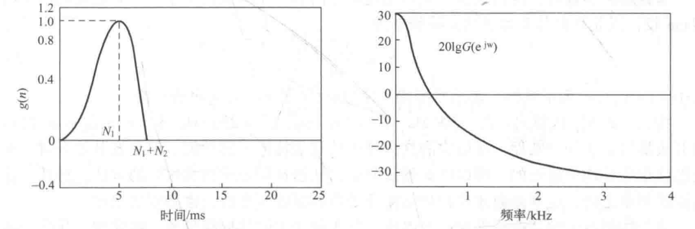

声道模型的常用建模方法有两种：声管模型（不同截面管子串联）、共振峰模型（谐振腔结构），下图为二阶谐振器的串联组和并联组。

$$

V(z)=\prod_{k=1}^{M} \frac{1-2 e^{-B_{k} T} \cos \left(2 \pi F_{k} T\right)+e^{-2 B_{k} T}}{1-2 e^{-B_{k} T} \cos \left(2 \pi F_{k} T\right) z^{-1}+e^{-2 B_{k} T} z^{-2}}

V(z)=\frac{\sum_{r=0}^{R} b_{r} z^{-r}}{1-\sum_{k=1}^{N} a_{k} z^{-k}}

$$


辐射模型

$$

z_{L}(\Omega)=\frac{j \Omega L_{r} R_{r}}{R_{r}+j \Omega L_{r}}

$$

## 信号处理

```Python
"""语音录制"""
import pyaudio # 播放和录制音频库库
import wave # 读取和编辑WAV 文件库
CHUNK = 1024 # 定义数据流块大小
FORMAT = pyaudio.paInt16 # 设置录制格式
CHANNELS = 2 # 声道，不同的方位音源数量或扬声器数量
RATE = 16000 # 采样率fs，每秒的采样个数
RECORD_SECONDS = 2 # 采集时间长度
WAVE_OUTPUT_FILENAME = "Oldboy.wav" # 输出文件名
p = pyaudio.PyAudio() # 初始化PyAudio模块打开一个数据流对象
stream = p.open(format=FORMAT,
                channels=CHANNELS,
                rate=RATE,
                input=True,
                frames_per_buffer=CHUNK) # 底层的缓存的块的大小，底层的缓存由N个同样大小的块组成
print("录音开始(时长2s)，请讲话：") # 开始录制
frames = [] # 存储声音数据
for i in range(0, int(RATE / CHUNK * RECORD_SECONDS)):
	 采样率/ 声道 *录制时间 = 每个声道总共采集的数据个数
    data = stream.read(CHUNK) # 读取数据块
    frames.append(data)
print("录音结束，程序正在退出...")
stream.stop_stream()
stream.close()
p.terminate() # 关闭 PyAudio
# 将音频文件真正的写入.wav文件
wf = wave.open(WAVE_OUTPUT_FILENAME, 'wb') # (新建)打开输出WAV文件
wf.setnchannels(CHANNELS)  # 配置声道数
wf.setsampwidth(p.get_sample_size(FORMAT))  # 配置量化位数
wf.setframerate(RATE) # 配置取样频率
wf.writeframes(b''.join(frames)) # 写入语音帧
wf.close()
```

```Python
"""语音播放"""

import pyaudio # 播放和录制音频库库
import wave # 读取和编辑WAV 文件库
CHUNK = 1024 # 定义数据流块大小
FILENAME = r"Oldboy.wav" # 文件名
def player(filename=FILENAME):
    wf = wave.open(filename, 'rb') # 打开音频文件
	p = pyaudio.PyAudio() # PyAudio初始化
	# 打开声音输出流
    stream = p.open(format=p.get_format_from_width(wf.getsampwidth()), # 以字节为单位返回样本宽度
                    channels=wf.getnchannels(), # 返回音频通道的数量（1对于单声道，2对于立体声）。
                    rate=wf.getframerate(), # 返回采样频率。
                    output=True)
    data = wf.readframes(CHUNK) # 读取数据块
    while data != b'':
        stream.write(data) # 播放
        data = wf.readframes(CHUNK)
    stream.stop_stream() # 停止数据流
    stream.close()
    p.terminate() # 关闭 PyAudio
player(FILENAME)

```

```Python
"""可视化"""

import librosa  # 音频分析库
import librosa.display
import matplotlib.pyplot as plt # 绘图库
# Librosa默认的采样率是22050，如果需要读取原始采样率，需要设定参数sr=None或者自定义参数("fs")
data1, sample_rate = librosa.load('Oldboy.wav', sr=None)
print(f"长度 = {len(data1) / sample_rate} 秒")
print(f"采样率：{sample_rate}")
plt.figure(figsize=(14, 5))
librosa.display.waveplot(data1, sample_rate)
plt.show()
```

```python
"""音频分帧和加窗
:param data: 音频数据
:param win: 帧长或窗
:param inc: 间隔(默认为帧长)
"""
def enframe(x, win, inc=None):
    nx = len(x) # 信号总长度
    if isinstance(win, list):
        nwin = len(win)
        nlen = nwin  # 帧长=窗长
    elif isinstance(win, int):
        nwin = 1
        nlen = win  # 设置为帧长
    if inc is None:
        inc = nlen # 移动步长
        
if ndata <= nlen: #若信号长度小于一个帧的长度，则帧数定义为1
    nf=1
else:
    nf = (nx - nlen + inc) // inc # 计算帧数

    frameout = np.zeros((nf, nlen)) # （帧数，帧长）
    indf = np.multiply(inc, np.array([i for i in range(nf)])) # 计算每帧的位置
    for i in range(nf):
        frameout[i, :] = x[indf[i]:indf[i] + nlen]
	if isinstance(win, list) or isinstance(win, np.ndarray):
        frameout = np.multiply(frameout, np.array(win)) # 加窗
    return frameout
```

## 语音处理

[不同元音辅音在声音频谱的表现是什么样子？](https://www.zhihu.com/question/27126800/answer/35376174)

语音信号属于短时平稳信号，一般在10-30ms内的语音信号特性不会有太大变化，容易分析。对分割好的语音帧，可以进行FFT运算，得到单帧的频谱特性，并构建频谱图（频率×强弱）。一整段语音可以分割成多帧语音信号，对每一帧都进行FFT运算，可以得到整个语音的短时傅里叶变换，并构建语谱图（时间×频率×强弱）。

STFT运算可以通过滤波器间接实现。

通过统计方法，获得幅度直方图，分析得到振幅分布的概率密度逼近函数：修正伽马分布概率密度函数或拉普拉斯分布概率密度函数。

$$

p_{G}(x)=\frac{\sqrt{k}}{2 \sqrt{\pi}} \frac{e^{-k|x|}}{\sqrt{|x|}}

$$

$$

p_{L}=0.5 \alpha e^{-\alpha|x|}

$$


在AD转换过程中，AD位数的实质是指模数转换数据时使用多少位（bit）来表征数据电压幅值大小，即存储的二级制数的位数。位数越高，存储小数点后面的位数也就越多，因此，转换后的数据也就越精确，越接近实际值。信号与量化噪声之比(SQNR)为6.02M dB，即6.02M dB。由于每一位只能存储0和1，对应的数字大小为2^0=1和2^1=2，相差2倍。我们知道，线性2倍，对应6dB。

语音信号数字化：低通滤波（高频分量下降）、放大和增益控制、采样、模数转换（A/D）、编码调制

预加重（高通滤波，高频分量上升，频谱变平坦）

加窗（时域信号乘积，频域信号卷积）

- 时域内计算过零率能量能，用矩形窗；频域中考虑到阶段效应，改用汉明窗等。使得时域中波形两端尽量平滑过渡，减少截断效应。且频域中要有较宽的3dB带宽，旁瓣衰减要大。窗口长度的选择会影响时间分辨率（反比）和频率分辨率（正比）。

矩形窗（窗口长度 N ）：（主瓣宽4pi/N，旁瓣值-13，阻带衰减-21），

$$
\omega(n)=\left\{\begin{array}{cc}
1, & 0 \leq n \leq(N-1) \\

0, & n=\text { else }

\end{array}\right.
$$

汉明窗（窗口长度 N ）：（主瓣宽8pi/N，旁瓣值-41，阻带衰减-53）

$$
\omega(n)=\left\{\begin{array}{cc}

0.54-0.46 \cos [2 \pi n /(N-1)], & 0 \leq n \leq(N-1) \\

0, & n=\text { else }

\end{array}\right.
$$

分帧（交叠分段，n 为第几帧）

$$
  

\begin{aligned}
&x_{n}(m)=\omega(m) x(n+m)\\
&\omega(m)= \begin{cases}1, & m=0 \sim(N-1) \\ 0, & m=\text { 其它值 }\end{cases}\\

\end{aligned}
$$

## 时域分析

### 短时能量

$$

E_{n}=\sum_{m=0}^{N-1} x_{n}^{2}(m)

$$

```Python
def STEn(frames):
    """
    计算短时能量函数
    :param frames: 语音帧数据（帧数，帧长）
    :param win: 帧长或窗
    :param inc: 间隔
    :return:
    """
    s = np.multiply(frames, frames)
    return np.sum(s, axis=1)

```

### 短时幅度

```Python
def STMn(frames):
    """
    计算短时能量函数
    :param frames: 语音帧数据（帧数，帧长）
    :param win: 帧长或窗
    :param inc: 间隔
    :return:
    """
    M = np.abs(frames)
    return np.mean(M, axis=1)

```

### 短时过零率

一帧中语音信号波形穿过横轴的次数，过零率高，说明高频分量多，信号变化快。

$$

Z_{n}=\frac{1}{2} \sum_{m=0}^{N-1}\left|\operatorname{sgn}\left[x_{n}(m)\right]-\operatorname{sgn}\left[x_{n}(m-1)\right]\right|

$$

```Python
def STZcr(frames):
    """
    计算短时过零率
    :param data: 语音数据
    :param win: 帧长或窗
    :param inc: 间隔
    :return:
    """
    data1 = frames[:, :-1]
    data2 = frames[:, 1:]
    s = np.multiply(data1, data2)
    sgn = np.where(s < 0, 1, 0)
    return np.sum(sgn, axis=1)

```

### 短时自相关分析

经过自相关分析，可以去除周期信号中的噪声信号影响。

$$
\begin{aligned}

R_{n}(k)=\sum_{m=0}^{N-1-k} x_{n}(m) x_{n}(m+k), 0<k \leq K

\end{aligned}
$$

- 当k=0时, 自相关取到最大值，总共获取到 k 个自相关值
- 自相关结果的周期等于原函数周期，$R_{n}(k)=R_{n}\left(k+N_{p}\right)$
- 自相关函数是偶函数，以零点左右对称

```Python
def STAc(frames):
    """
    计算短时相关函数
    :param data: （帧数，帧长）
    :return:
    """
    data = frames.T # （帧长，帧数）
    para = np.zeros(data.shape)
    fn = data.shape[1]
    for i in range(fn):
        R = np.correlate(data[:, i], data[:, i], 'valid') # 需要数据已被0均值化
        para[:, i] = R
	return para # （帧长，帧数）
```

### 修正自相关分析

对每帧信号进行自相关分析，因为短时自相关其自身的特性，在相关运算过程中，随着 K 增加，$x_{n}(m+k), m \in(0,N-1-k)$ 所含的值就会越来越少，导致计算结果受影响，也会越来越小。修正自相关，通过使用不同的两个窗口，即 $x_{n}(m)$ 还是使用长度为 N 的原窗口截取短时信号，但是将 $x_{n}(m+k)$ 的窗口长度扩展到 N+K ，这样在做相关运算时，只要不超过 K 则运算过程使用的数据数量保持一致。


$$
\begin{aligned}

&R_{n}(k)=\sum_{m=0}^{N-1} x_{n}(m) x_{n}^{\prime}(m+k), 0 \leq k \leq K \\

&x_{n}(m)=\omega(m) x(n+m)\\
&\omega(m)= \begin{cases}1, & m=0 \sim(N-1) \\ 0, & m=\text { 其它值 }\end{cases}\\

&x_{n}^{\prime}(m)=\omega^{\prime}(m) x(n+m),(0 \leq k \leq N-1+K)\\
&\omega^{\prime}(m)=\left\{\begin{array}{lc}
1, & m=0 \sim(N-1+K) \\
0, & m=\text { 其它值. }
\end{array}\right.
\end{aligned}
$$

### 短时平均幅度差

因为语音信号周期性，在一个语音信号与自身移动周期的整数倍信号相减时，得到的幅度应接近于零。利用此性质，可以得到语音信号的周期（频率）。由短时平均幅度差，可以得到每帧信号中，与第 k 时间点幅度差不多相同的其他点位置。

$$

F_{n}(k)=\sum_{m=0}^{N-1-k}\left|x_{n}(m)-x_{n}(m+k)\right|

$$
短时平均幅度差和短时自相关的关系如下式所示：
$$

F_{n}(k)=\sqrt{2} \beta(k)\left[R_{n}(0)-R_{n}(k)\right]^{1 / 2}

$$

```Python
def STAmdf(frames):
    """
    计算短时幅度差，好像有点问题
    :param X: （帧数，帧长）
    :return:
    """
    fn = frames.shape[1]
    wlen = frames.shape[0]
    para = np.zeros((fn, wlen, wlen))
    for i in range(fn): # 遍历帧
        data = frames[i, :]
        for k in range(wlen): # 遍历时间点
	        for m in range(wlen):
		        md = np.abs(data[m] - data[m+k]) # 计算 k 时间点幅值与帧内其他点的幅值差
	            para[i,k, j] = md
    return para
```

### 短时修正平均幅度差

## 频域分析

### 短时FFT 及其功率谱

$$
\begin{aligned}
&X_{n}\left(e^{j \omega}\right)=\sum_{m=0}^{N-1} x_{n}(m) e^{-j \omega m} \\
&X_{n}\left(e^{-j \omega}\right)=\frac{1}{2} \int_{-\pi}^{\pi}\left[W\left(e^{j \theta}\right) e^{j n \theta}\right] \cdot\left[X\left(e^{j(\omega+\theta)}\right)\right] d \theta
\end{aligned}
$$

```Python
def STFFT(frames, nfft):
    """短时FFT
    :param x: 音频数据
    :param nfft: 频域的采样个数M(一般为帧长)
    :return: 单边谱
    """
    y = np.fft.fft(frames, nfft, axis=1)
    return y[:, :nfft // 2] # 单边变换

```

$$
\begin{aligned}

&S_{n}(k)=X_{n}(k) \cdot X_{n}^{*}(k)=\left|X_{n}(k)\right|^{2}\\
&S_{n}\left(e^{j \omega}\right)=X_{n}\left(e^{j \omega}\right) \cdot X_{n}^{*}\left(e^{j \omega}\right)=\left|X_{n}\left(e^{j \omega}\right)\right|^{2}
\end{aligned}
$$
并且功率谱 $S_{n}\left(e^{j \omega}\right)$ 是短时自相关函数 $\mathrm{R}_{\mathrm{n}}(\mathrm{k})$ 的傅里叶变换，即
$$

S_{n}\left(e^{j \omega}\right)=\left|X_{n}\left(e^{j \omega}\right)\right|^{2}=\sum_{k=-N+1}^{N-1} R_{n}(k) e^{-j \omega k}

$$

## 倒谱分析

对语音信号进行解卷，求取语音倒谱特征参数的方法有两种，一种是线性预测分析，一种是同态分析处理。

同态信号处理：

语音信号，可以看作是声门激励信号和声道冲击响应时域卷积得到的，同时对应频域的乘积。因此可以考虑通过 log、反变换等操作，将信号的这两种信息分离出来，得到声道共振特征和基音周期。

一个信号的频域表示：

$$
\begin{aligned}
&X\left(e^{j \omega}\right)=\left|X\left(e^{j \omega}\right)\right| e^{j \arg \left[X\left(e^{j \omega}\right)\right]}\\

&\hat{X}\left(e^{j \omega}\right)=\ln \left|X\left(e^{j \omega}\right)\right|+j \arg \left[X\left(e^{j \omega}\right)\right]
\end{aligned}
$$

### 实倒谱变换（缺失相位信息，一般无法还原）

$$

c(n)=F^{-1}\left[\ln \left|X\left(e^{j \omega}\right)\right|\right]

$$

简单示例：

- 声门激励信号

一个幅度因子为 $a_{r}$ ，基音周期为 $N_{p}$ 的冲激信号序列

$$
\begin{aligned}

&x(n)=\sum_{r=0}^{M} \alpha_{r} \delta\left(n-r N_{p}\right)\\

&\hat{x}(n)=\ln \alpha_{0} \delta(n)+\sum_{k=1} \beta_{k} \delta\left(n-r N_{p}\right)=\sum_{k=0}^{\infty} \beta_{k} \delta\left(n-r N_{p}\right)
\end{aligned}
$$

- 声道冲激响应

$$

X(z)=|A| \frac{\prod_{k=1}^{m_{i}}\left(1-a_{k} z^{-1}\right) \prod_{k=1}^{m_{0}}\left(1-b_{k} z\right)}{\prod_{k=1}^{p_{i}}\left(1-c_{k} z^{-1}\right) \prod_{k=1}^{p_{0}}\left(1-d_{k} z\right)}

$$
求对数可得：
$$
\hat{x}(n)= \begin{cases}\ln |A| & n=0 \\ \sum_{k=1}^{p_{i}} \frac{c_{k}^{n}}{n}-\sum_{k=1}^{m_{i}} \frac{a_{k}^{n}}{n} & n>0 \\ \sum_{k=1}^{m_{0}} \frac{b_{k}^{-n}}{n}-\sum_{k=1}^{p_{0}} \frac{d_{k}^{-n}}{n} & n<0\end{cases}
$$

$$
\hat{s}(n)=I D F T\{\ln |D F T[s(n)]|\}
$$

相位卷绕问题

- 微分法
- 最小相位信号法

```Python
"""信号倒谱变换"""
    y = np.fft.fft(x)
    rcceps = np.fft.ifft(np.log(np.abs(y)))
```

### Mel频率倒谱系数（MFCC)

> [语音识别技术中提取的声音特征的参数具体指什么？- 知乎](https://www.zhihu.com/question/27268668/answer/38253151) 
>
> [Mel Frequency Cepstral Coefficient (MFCC) tutorial](http://practicalcryptography.com/miscellaneous/machine-learning/guide-mel-frequency-cepstral-coefficients-mfccs/#deltas-and-delta-deltas)

1. 对语音信号进行预加重、分帧和加窗处理。

帧和帧之间的时间差（称为“帧移”）常常取为10ms，这样帧与帧之间会有重叠，否则，由于帧与帧连接处的信号会因为加窗而被弱化，这部分的信息就丢失了。

音频信号是在不断变化的，而傅里叶变换适用于分析平稳的信号。短时间尺度的连续信号变化幅度更小，在语音识别中，一般把帧长取为20~50ms，这样一帧内既有足够多的周期，又不会变化太剧烈。

每帧信号通常要与一个平滑的窗函数相乘，让帧两端平滑地衰减到零，这样可以降低后期傅里叶变换后旁瓣的强度，取得更高质量的频谱。

2. 对于每个帧计算频域功率谱值。

现实世界中，人通过耳蜗接收声音，然后其根据声音的频率在不同部位震动，引发相关神经通知大脑存在哪些频率。在研究过程中为了模拟相关过程，引用傅里叶变换，获取声音在频域上的能量分布来分析。

3. 将梅尔滤波器应用于频谱，汇总每个滤波器中的能量。

这里是把频谱与每个过滤器相乘并积分，求出频谱在每一个过滤器的能量，同时这样也可以减少数据量个数，去除数据冗余。通常我们只对某一段的频率能量变化有兴趣（如人耳 20Hz-20000Hz 的频率范围）因此过滤器大都具有低频密、高频疏的特点。

4. 对梅尔能量取对数。

这也是由人类听力引起的：人对声音很难线性地去感受，要使声音的感受量翻倍，我们需要投入8倍的能量。这意味着，如果声音一开始就很大，能量的巨大变化听起来可能就没什么不同了。这种对数级的压缩操作使模型更贴近人类实际听到的。为什么是对数而不是立方根？对数可以使用倒谱Mean subtraction。

$$
\operatorname{Mel}(f)=2595 \lg (1+f / 700)
$$


5. 计算对数滤波器组能量的 DCT （离散余弦变换）。

进行此步运算主要有两个原因：

由于滤波器组都是有重叠的，因此之前计算得到的能量值之间具有极大的相关性；

离散余弦变换可以对数据进行降维压缩和抽象，使获得的特征参数没有虚部。

对于一般的语音信号，这一步的结果的前几个系数特别大，后面的系数比较小，可以忽略，实际中，一般仅保留前12~20个，这就进一步压缩了数据。

6. [具体步骤](http://practicalcryptography.com/miscellaneous/machine-learning/guide-mel-frequency-cepstral-coefficients-mfccs/#computing-the-mel-filterbank)

Mel 频谱能量动态系数

```Python
"""信号离散余弦变换"""
    N = len(x)
    X = np.zeros(N)
    ts = np.array([i for i in range(N)])
    C = np.ones(N)
    C[0] = np.sqrt(2) / 2
    for k in range(N):
        X[k] = np.sqrt(2 / N) * np.sum(C[k] * np.multiply(x, np.cos((2 * ts + 1) * k * np.pi / 2 / N)))
```

## 线性预测分析

线性预测分析的基本思想是用过去p个样点值来预测现在或未来的样点值，然后得到一组使得预测误差最小的线性预测系数 $a_i$。

假设语音的简单零极点传输函数，输入$e(n)$，输出$s(n)$ ：

$$

H(z)=\frac{S(z)}{E(z)}=\frac{G}{1-\sum_{i=1}^{p} a_{i} z^{-i}}=\frac{G}{A(z)}

$$

线性预测系统函数：

$$

P(z)=\sum_{i=1}^{p} a_{i} z^{-i}

$$

$$
\begin{aligned}
&\hat{s}(n)=\sum_{i=1}^{p} a_{i} s(n-i) \\

&\min{\varepsilon(n)}=s(n)-\hat{s}(n)=s(n)-\sum_{i=1}^{p} a_{i} s(n-i)=Ge(n)
\end{aligned}
$$

线性预测方程推导

求误差最小值，即期望值达到最小
$$

E\left\{\varepsilon^{2}(n)\right\}=E\left\{\left[s(n)-\sum_{i=1}^{p} a_{i} s(n-i)\right]^{2}\right\}

$$

对期望内线性预测系数求导

$$

E\left\{\left[s(n)-\sum_{i=1}^{p} a_{i} s(n-i)\right] s(n-j)\right\}=0, j=1, \ldots, p

$$

化简已知量，令

$$
\Phi_{n}(j, i)=E\left\{s_{n}(m-j) s_{n}(m-i)\right\}
$$
加一些限制，并与自相关函数进行关联

$$
\Phi_{n}(j, i)=\sum_{m=0}^{N-1-|i-j|} s_{n}(n) s_{n}(n-j)=R_{n}(|i-j|)
$$

得到

$$
\sum_{i=1}^{p} a_{i} \Phi_{n}(j, i)=\Phi_{n}(j, 0), j=1, \ldots, p
$$

$$
\sum_{i=1}^{p} a_{i} R_{n}(|i-j|)=R_{n}(j)
$$

$$
\left[\begin{array}{cccc}

R_{n}(0) & R_{n}(1) & \therefore & R_{n}(p-1) \\

R_{n}(1) & R_{n}(0) & \Lambda & R_{n}(p-2) \\

\mathrm{M} & \mathrm{M} & \mathrm{O} & \mathrm{M} \\

R_{n}(p-1) & R_{n}(p-2) & \Lambda & R_{n}(0)

\end{array}\right]\left[\begin{array}{c}

a_{1} \\

a_{2} \\

\mathrm{M} \\

a_{p}

\end{array}\right]=\left[\begin{array}{c}

R_{n}(1) \\

R_{n}(2) \\

\mathrm{M} \\

R_{n}(p)

\end{array}\right]
$$

这种方程叫 Yule-Wslker方程, 方程左边的矩阵称为托普利兹 (Toeplitz) 矩阵, 它是以主对角线对称的、而且其沿着主 对角线平行方向的各轴向的元素值都相等。这种YuleWslker方程可用莱文逊–杜宾 (Levinson-Durbin) 递推算法 来高效地求解。

LPC谱估计

当求出一组预测器系数后, 就可以得到语音产生模型的频率 响应, 即:
$$

H\left(e^{j \omega}\right)=\frac{G}{1-\sum_{i=1}^{p} a_{i} e^{-j \omega i}}=\frac{G}{\sum_{i=0}^{p} a_{i} e^{-j \omega i}}=\frac{G}{A\left(e^{j \omega}\right)}

$$
因此在共振峰频率上其频率响应特性会出现峰值。所以线性 预测分析法又可以看做是一种短时谱估计法。其频率响应 $\mathrm{H}\left(\mathrm{e}^{\mathrm{j} \omega}\right)$ 即称为LPC谱。

LPC谱估计具有一个特点：在信号能量较大的区域即接近谱 的峰值处, LPC谱和信号谱很接近; 而在信号能量较低的区 域即接近谱的谷底处, 则相差比较大。这个特点对于呈现谐 波结构的浊音语音谱来说, 就是在谐波成分处LPC谱匹配信 号谱的效果要远比谐波之间好得多。LPC谱估计的这一特点 实际上来自均方误差最小准则。

从以上讨论我们知道如果 $\mathrm{p}$ 选得很大, 可以使 $\left|H\left(\mathrm{e}^{\mathrm{j} \omega}\right)\right|$ 精确 地匹配于 $\left|\mathrm{S}\left(\mathrm{e}^{\mathrm{j} \omega}\right)\right|$, 而且极零模型也可以用全极点模型来代 替, 但却增加了计算量和存储量, 且 $\mathrm{p}$ 增加到一定程度以后, 预测平方误差的改善就很不明显了, 因此在语音信号处理中, $\mathrm{p}$ 一般选在 $8 １ 4$ 之间。

$\mathrm{LPC}$ 系数是线性预测分析的基本参数, 可以把这些系数变换 为其他参数, 以得到语音的其他替代表示方单。LPC系数可 以表示整个LPC系统冲激响应的复倒谱。
$$
\begin{aligned}
&\hat{h}(0)=0 \\
&\hat{h}(1)=-a_{1} \\
&\hat{h}(n)=-a_{n}-\sum_{k=1}^{n-1}(1-k / n) a_{k} \hat{h}(n-k),(1 \leq n \leq p) \\
&\hat{h}(n)=-\sum_{k=1}^{p}(1-k / n) a_{k} \hat{h}(n-k),(n>p)
\end{aligned}
$$
按上式求得的复倒谱 $h(n)$ 称之为LPC复倒谱。

LPC复倒谱由于利用了线性预测中声道系统函数 $\mathrm{H}(\mathrm{z})$ 的最小 相位特性, 避免了相位卷绕问题；且LPC复倒谱的运算量小, 它仅是用FFT求复倒谱时运算量的一半; 又因为当 $\mathrm{p} \rightarrow \infty$ 时, 语音信号的短时复频谱 $S\left(e^{j \omega}\right)$ 满足 $\left|S\left(e^{j \omega}\right)\right|=\left|H\left(e^{j \omega}\right)\right|$, 因 而可以认为 $h(n)$ 包含了语音信号频谱包络信息, 即可近似 把 $h(n)$ 当作 $s(n)$ 的短时复倒谱 $s^{\prime}(n)$, 来分别估计出语音短 时谱包络和声门激励参数。在实时语音识别中也经常采用 LPC复倒谱作为特征矢量。

对以上所介绍的进行总结可知, 为了估计语音信号的短时谱 包络, 有三种方法: (1)由LPC系数直接估计语音信号的谱包 络; (2)由LPC倒谱估计谱包络; (3)求得复倒谱 $s^{-}(\mathrm{n})$, 再用低 时窗取出短时谱包络信息, 这种方法称之为FFT倒谱。

由式 (3-143) 求得复倒谱h $(n)$ 后, 由c $(n)=1 / 2[h \hat{n}(n)+h \uparrow(-n)]$ 即可求出倒谱 $\mathrm{c}(\mathrm{n})$ 。但是, 这个倒谱 $\mathrm{c}(\mathrm{n})$ 是实际频率尺度的 倒谱系数 (称为 LPC倒谱系数: LPCC)。根据人的听觉特性可 以把上述的倒谱系数进一步按符合人的听觉特性的美尔 (MEL) 尺度进行非线性变换, 从而求出如下所示的LPC美尔倒谱系 数 (LPCMCC)。
$$

M C_{k}(n)= \begin{cases}C_{n}+\alpha \cdot M C_{0}(n+1) & k=0 \\ \left(1-\alpha^{2}\right) \cdot M C_{0}(n+1)+M C_{1}(n+1) & k=1 \\ M C_{k-1}(n+1)+\alpha\left(M C_{0}(n+1)-M C_{k-1}(n)\right) & k>1\end{cases}

$$

线谱对分析(LSP)

线谱对分析也是一种线性预测分析方法, 只是它求解的模型 参数是 “线谱对” (Line Spectrum Pair, 简称为LSP), 它 是频域参数, 因而和语音信号谱包络的峰有着更紧密的联系; 同时它构成合成滤波器H $(\mathrm{z})$ 时容易保证其稳定性, 合成语音 的数码率也比用格型法求解时要低。
$$
\left[\begin{array}{c}
1 \\

a_{1}^{(p)} \\

a_{2}^{(p)} \\

\mathrm{M} \\
\mathrm{M} \\

a_{p}^{(p)}

\end{array}\right]=\left[\begin{array}{c}
1 \\

a_{1}^{(p-1)} \\

a_{2}^{(p-1)} \\

\mathrm{M} \\

a_{p-1}^{(p-1)} \\

0
\end{array}\right]-k_{p}\left[\begin{array}{c}
0 \\

a_{p-1}^{(p-1)} \\

a_{p-2}^{(p-1)} \\

\mathrm{M} \\

a_{1}^{(p-1)} \\

1
\end{array}\right]
$$

两边同时乘以 $\left[\begin{array}{lllll}1 & \mathrm{z}^{-1} & \mathrm{z}^{-2} & \cdots & \mathrm{z}^{-\mathrm{p}}\end{array}\right]$, 得：
$$

A^{p}(z)=A^{p}(z-1)-k_{p} z^{-p} A^{p-1}\left(z^{-1}\right)

$$
分别将 $k_{p+1}=-1$ 和 $k_{p+1}=1$ 时的 $A_{p+1}(z)$ 用 $P(z)$ 和 $Q(z)$ 表示, 可得:
$$
\begin{aligned}
&P(z)=A(z)-z^{-(p+1)} A\left(z^{-1}\right) \\
&Q(z)=A(z)+z^{-(p+1)} A\left(z^{-1}\right)
\end{aligned}
$$
这两个式子均为 $p+1$ 阶多项式, 则由上面二式可直接得出:
并有:
$$
\begin{aligned}
&P(z)=1+\left(a_{1}-a_{p}\right) z^{-1}+\left(a_{2}-a_{p-1}\right) z^{-2}+\ldots+\left(a_{p}-a_{1}\right) z^{-p}-z^{(-p+1)} \\
&Q(z)=1+\left(a_{1}+a_{p}\right) z^{-1}+\left(a_{2}+a_{p-1}\right) z^{-2}+\ldots+\left(a_{p}+a_{1}\right) z^{-p}+z^{(-p+1)}
\end{aligned}
$$
所以如果知道了 $P(z)=0$ 和 $Q(z)=0$ 的根，我们就可以求得 $A(z)$ 。

$P(z)=\left(1+z^{-1}\right) \prod_{i=1}^{p-2}\left(1+2 \cos \omega_{i} z^{-1}+z^{-2}\right)$
$$

Q(z)=\left(1-z^{-1}\right) \prod_{i=1}^{p-2}\left(1-2 \cos \theta_{i} z^{-1}+z^{-2}\right)

$$
并且 $\omega_{i} 、 \theta_{i}$ 按下列关系排列:
$$
0<\omega_{1}<\theta_{1}<\ldots<\omega_{p / 2}<\theta_{p / 2}<\pi
$$
由于因式分解中的系数 $\omega_{i} 、 \theta_{i}$ 成对出现, 反映了谱的特性, 故称为 “线谱对”。而且可以证明, $\mathrm{P}(\mathrm{z})$ 和 $\mathrm{Q}(\mathrm{z})$ 的零点互相 分离, 是保证合成滤波器 $\mathrm{H}(\mathrm{z})=1 / \mathrm{A}(\mathrm{z})$ 稳定的充分必要条件。 从上面的分析可以看到，线谱对分析的基本出发点是将 $A(z)$ 的 $\mathrm{p}$ 个零点通过 $\mathrm{P}(\mathrm{z})$ 和 $\mathrm{Q}(\mathrm{z})$ 映射到单位圆上, 这样使得这些 零点可以直接用频率 $\omega$ 来反映, 且 $P(z)$ 和 $Q(z)$ 各提供 $p / 2$ 个 零点频率; 而从物理意义上来说, $\mathrm{P}(\mathrm{z})$ 和 $\mathrm{Q}(\mathrm{z})$ 就对应着声门 全开或全闭时的全反射情况 (因为反射系数是 $\mathrm{k}_{\mathrm{p}+1}=\pm 1$ )。

在用线谱对对语音信号进行分析时, 主要的任务是要求解参 数 $\omega_{i} 、 \theta{ }_{i}$ 。当 $\mathrm{A}(\mathrm{z})$ 的系数 (线性预测系数 $\left\{a_{i}\right\}$ 求出后, 我们 可以采用下面的方法求 $P(z)$ 和 $Q(z)$ 的零点。

用代数方程式求根

由于
$$
\prod_{j=1}^{m}\left(1-2 z^{-1} \cos \omega_{j}+z^{-2}\right)=\left(2 z^{-1}\right)^{m} \prod_{j=1}^{m}\left(\frac{z+z^{-1}}{2}-\cos \omega_{j}\right)
$$
所以 $\mathrm{P}(\mathrm{z}) /\left(1+\mathrm{z}^{-1}\right)=0$ 是关于 $\mathrm{x}$ 的一个 $\mathrm{p} / 2$ 次代数方程。同理 $\mathrm{Q}(\mathrm{z}) /\left(1-\mathrm{z}^{-1}\right)=0$ 也是关于 $\mathrm{x}$ 的一个 $\mathrm{p} / 2$ 次代数方程。此处使用了切比雪夫多项式，令cos(w)=x，则可化成x的幂次形式，即非线性转成线性。

DFT法

对 $P(z)$ 和 $Q(z)$ 的系数求离散傅里叶变换, 得到 $z k=e^{-j \omega \pi / N}$ $(\mathrm{k}=0,1, \cdots, \mathrm{N}-1$ ) (实际中 $\mathrm{N}$ 值常取 $64 \sim 128)$ 各点的值, 根 据两点间嵌入零点的内揷, 能够推定零点。

$$

P(z)=\left(1+z^{-1}\right) \prod_{i=1}^{p-2}\left(1+2 \cos \omega_{i} z^{-1}+z^{-2}\right)

$$
$$

Q(z)=\left(1-z^{-1}\right) \prod_{i=1}^{p-2}\left(1-2 \cos \theta_{i} z^{-1}+z^{-2}\right)

$$
并且 $\omega_{i} 、 \theta_{i}$ 按下列关系排列:
$$
0<\omega_{1}<\theta_{1}<\ldots<\omega_{p / 2}<\theta_{p / 2}<\pi
$$
由于因式分解中的系数 $\omega_{i} 、 \theta_{i}$ 成对出现, 反映了谱的特性, 故称为 “线谱对”。而且可以证明, $P(z)$ 和 $Q(z)$ 的零点互相 分离, 是保证合成滤波器 $\mathrm{H}(\mathrm{z})=1 / \mathrm{A}(\mathrm{z})$ 稳定的充分必要条件。 从上面的分析可以看到，线谱对分析的基本出发点是将 $\mathrm{A}(\mathrm{z})$ 的 $\mathrm{p}$ 个零点通过 $\mathrm{P}(\mathrm{z})$ 和 $\mathrm{Q}(\mathrm{z})$ 映射到单位圆上, 这样使得这些 零点可以直接用频率 $\omega$ 来反映, 且 $P(z)$ 和 $Q(z)$ 各提供 $p / 2$ 个 零点频率; 而从物理意义上来说, $\mathrm{P}(\mathrm{z})$ 和 $Q(\mathrm{z})$ 就对应着声门 全开或全闭时的全反射情况（因为反射系数是 $k_{p+1}=\pm 1$ )。

## 基金周期估计

基音是指发浊音时声带振动所引起的周期性, 而基 音周期是指声带振动频率的倒数。基音周期是语音 信号最重要的参数之一, 它描述了语音激励源的一 个重要特征。基音周期信息在多个领域有着广泛的 应用, 如：语音识别、说话人识别、语音分析与综 合以及低码率语音编码、发音系统疾病诊断、听觉 残障者的语言指导等。因为汉语是一种有调语言, 基音的变化模式称为声调, 它携带着非常重要的具 有辨意作用的信息, 有区别意义的功能, 所以, 基 音的提取和估计对汉语更是一个十分重要的问题。

### 基音检测算法

自相关函数 (ACF) 法

峰值提取算法 (PPA)

平均度差函数 (AMDF) 法

并行处理技术

倒谱法

倒谱法是传统的基音周期检测算法之一，它利用语音信号的 倒频谱特征, 检测出表征声门激励周期的基音信息。
正如在 $3.5$ 小节介绍的, 语音 $\mathrm{S}(\mathrm{n})$ 是由声门脉冲激励e $(\mathrm{n})$ 经 声道响应V $(\mathrm{n})$ 滤波而得。即:
$$
\mathrm{s}(\mathrm{n})=\mathrm{e}(\mathrm{n}) * \mathrm{v}(\mathrm{n})
$$
设三者的倒谱分别为 $s^{\wedge}(n) 、 e^{\wedge}(n)$ 及 $v^{\wedge}(n)$, 则有：
$$

s^{\hat{n}}(n)=e^{\hat{n}}(n)+v^{\wedge}(n)

$$
可见，倒谱域中基音信息与声道信息可以认为是相对分离的。 采取简单的倒滤波方法可以分离并恢复出e $(\mathrm{n})$ 和 $\mathrm{v}(\mathrm{n})$ ，根据激励e (n) 及其倒谱的特征可以求出基音周期。

SIFT

谱图法

小波法

### 基音检测后处理

无论采用哪一种基音检测算法都可能产生基音检测错误, 使求得的基音周期轨迹中有一个或几个基音周期估值偏离了正常轨迹（通常是偏离到正常值的 2 倍或 $1 / 2 ）$, 并称这种偏离点为基音轨迹的“野点”。

#### 平滑滤波算法

**中值滤波**

中值平滑处理的基本原理是: 设 $\mathrm{x}(\mathrm{n})$ 为输入信号, $\mathrm{y}(\mathrm{n})$ 为中 值滤波器的输出, 采用一滑动窗, 则 $\mathrm{n}_{0}$ 处的输出值 $\mathrm{y}\left(\mathrm{n}_{0}\right)$ 就 是将窗的中心移到 $\mathrm{n}_{0}$ 处时窗内输入样点的中值。即在 $n_{0}$ 点的 左右各取L个样点。连同被平滑点共同构成一组信号采样值 (共 $(2 \mathrm{~L}+1)$ 个样值), 然后将这 $(2 \mathrm{~L}+1)$ 个样值按大小次序排成 一队, 取此队列中的中间者作为平滑器的输出。L值一般取 为 1 或 2 , 即中值平滑的 “窗口” 一般套住 3 或 5 个样值, 称为 3 点或 5 点中值平滑。中值平滑的优点是既可以有效地去除少 量的野点, 又不会破坏基音周期轨迹中两个平滑段之间的阶 跃性变化。

**线性平滑处理**

线性平滑是用滑动窗进行线性滤波处理, 即:
$$

y(n)=\sum_{m=-L}^{L} s(n-m) \cdot \omega(m)

$$
其中 $\{\omega(m), m=-L,-L+1, \cdots, 0,1,2, \cdots, L\}$ 为 $2 \mathrm{~L}+1$ 点平滑窗, 满足:
$$
\sum_{m=-L}^{L} \omega(m)=1
$$
例如三点窗的权值可取为 $\{0.25,0.5,0.25\}$ 。线性平滑在 纠正输入信号中不平滑处样点值的同时, 也使附近各样点的 值做了修改。所以窗的长度加大虽然可以增强平滑的效果,
但是也可能导致两个平滑段之间阶跃的模糊程度加重。以上 两种平滑技术可以结合起来使用。

**组合平滑处理**

为了改善平滑的效果可以将两个中值平滑串接, 图3-29a所 示是将一个5点中值平滑和一个 3 点中值平滑串接. 另一种方 法是将中值平滑和线性平滑组合, 如图 3-29b所示。为了使平 滑的基音轨迹更贴近, 还可以采用二次平滑的算法, 全部算 法的框图如图3-29c所示。由于中值平滑和线性平滑都会引 入延时, 所以在实现上述方案时应考虑到它的影响。3-29d 是一个采用裣延时的可实现二次平滑方案。其中的延时大小 可由中值平滑的点数和线性平滑的点数来决定。

## 共振峰估计

声道可以看成是一根具有非均匀截面的声管,在发音时起共鸣器的作用。当准周期脉冲激励进入声道时会引起共振特性，产生一组共振频率，称为共振峰频率或简称共振峰。共振峰参数包括共振峰频率和频带宽度，它是区别不同韵母的重要参数。共振峰信息包含在语音频谱包络中，因此共振峰参数提取的关键是估计自然语音频谱包络，并认为谱包络中的最大值就是共振峰。

提取共振峰特性最简便的手段是使用语谱仪。分析共振峰参数也可采用数字信号处理的方法,它可获得与语谱图相同的信息。下面讨论常用的几种。

### 带通滤波器组法

这种方法类似于语谱仪，但由于使用了计算机，使滤波器特性的选取更具灵活性，实现框图如图3-30所示。这是共振峰提取的最早形式，与线性预测法相比，滤波器组法有些逊色。但通过滤波器组的设计可以使估计的共振峰频率同人耳的灵敏度相匹配，其匹配的程度比线性预测法要好。

滤波器的中心频率有两种分布方法:一种是等间距地分布在分析频段上，则所有带通滤波器的带宽可设计成相同，从而保证了各通道的群延时相同。另一种是非均匀地分布，例如为了获得类似于人耳的频率分辨特性,在低频端间距小，高频端间距大，带宽也随之增加，这时滤波器的阶数必须设计成与带宽成正比使得它们输出的群延时相同，不会产生波形失真。

### 倒谱法

虽然可以直接对语音信号求离散傅里叶变换（DFT）。然后 用DFT谱来提取信号的共振峰参数, 但是, 直接DFT的谱要受 基频谐波的影响, 最大值只能出现在谐波频率上, 因而共振 峰测定误差较大。为了消除基频谐波的影响, 可以采用同态 解卷技术, 经过同态滤波后得到平滑的谱, 这样简单地检测 峰值就可以直接提取共振峰参数, 因而这种方法更为有效和 精确。因为倒谱运用对数运算和二次变换将基音谐波和声道 的频谱包络分离开来。因此用低时窗 $1(\mathrm{n})$ 从语音信号倒谱 $\mathrm{c}(\mathrm{n})$ 中所截取出来的 $\mathrm{h}(\mathrm{n})$, 能更精确地反映声道响应。这样, 由 $\mathrm{h}(\mathrm{n})$ 经DFT得到的 $\mathrm{H}^{\prime}(\mathrm{k})$, 就是声道的离散谱曲线。用 $\mathrm{H}^{\prime}(\mathrm{k})$ 代替直接DFT的频谱, 因为去除了激励引起的谐波波动, 所 以可以更精确地得到共振峰参数。实验表明，倒谱法因为其频谱曲线的波动比较小，所以估计共振峰参数的效果是较好的，但其运算量太大。

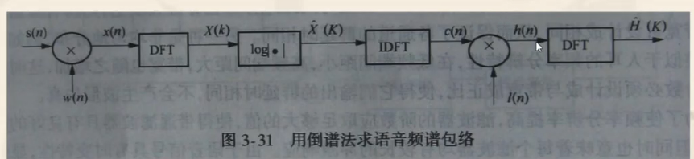

从线性预测导出的声道滤波器是频谱包络估计器的最新形式, 线性预测提供了一个优良的声道模型 (条件是语音不含噪声)。 尽管线性预测法的频率灵敏度和人耳不相匹配, 但它仍是最 廉价、最优良的行之有效的方法。
用线性预测可对语音信号进行解卷: 即把激励分量归入预测 残差中, 得到声道响应的全极模型 $\mathrm{H}(\mathrm{z})$ 的分量, 从而就得到 这个分量的 $\mathrm{a}_{\mathrm{i}}$ 参数。另外, 也可以采用抛物线内揷技术, 解 决频率分辨率较低的情况下的共振峰频率值的求取, 它的原 理如图3-22所示。

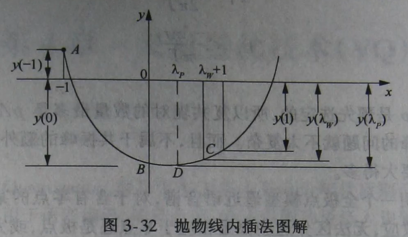

## 矢量量化

矢量量化是实现数据压缩的一种方法.采用矢量量化技术对信号波形或参数进行压缩处理,可以获得很好的效益，使存储要求、传输比特率需求或和计算量需求降低.

矢量量化能有效的应用矢量中各分量之间的四种相互关联性质来消除数据中的冗余度。这四种相互关联的性质是线性依赖(相关性)、非线性依赖(统计不独立)、概率密度函数的形状和矢量量化的维数，而标量量化仅能利用线性依赖和概率密度函数的形状来消除冗余度。

### 基本原理

标量量化是对信号的单个样本或参数的幅度进行量化;标量是指被量化的变量,为一维变量。

矢量量化的过程是将语音信号波形的K个样点的每一帧,或有K个参数的每一参数帧构成K维空间的一个矢量，然后对这个矢量进行量化。

标量量化可以说是K=1的矢量量化。矢量量化过程和标量量化过程相似。将K维无限空间划分为M个区域边界，然后将输入矢量与这些边界进行比较，并被量化为“距离”最小的区域边界的中心矢量值。

将信号序列 $\left\{y_{i}\right\}$ 的每 $\mathrm{Y}$ 个连续样点分成一 组, 形成K维欧式空间中的一个矢量, 矢 量量化就是把这个K维输入矢量X映射成另 一个K维量化矢量。其中量化矢量构成的 集合 $\left\{\boldsymbol{Y}_{i}\right\}$ 称为码书或码本, 码书中的每个 矢量 $\boldsymbol{Y}_{i}$ 称为码字或者码矢。
$$

Y \in\left\{Y_{1}, Y_{2}, \Lambda Y_{N} \mid Y_{i} \in R^{K}\right\}

$$


矢量量化就是将这个平面划分为 $\mathrm{M}$ 块 $\mathrm{~S}_{1}, \mathrm{~S}_{2}, \ldots$, $S_{i} \ldots S_{M}$, 然后从每一块中找出代表值 $Y_{i}$ ( $i=1,2 \ldots \mathrm{M}$ ），这就构成一个有 $M$ 个区间的二维矢量量化 器。通常这些代表值 $\mathrm{Y}_{\mathrm{i}}$ 称为量化矢量。

对一个矢量X进行量化, 首先选择一个合适的失真测度, 然后用最小失真原理, 分别计算用量化矢量 $\mathrm{Y}_{\mathrm{i}}$ 替代X所带来的失真。其中最小失真值所对应的那个量化矢量, 就是矢量X的重构矢量（或恢复矢量）。

所有M个量化矢量构成的集合 $\left\{Y_{i}\right\}$ 称为码书或码本; 把码书中的每个量化矢量 $\mathrm{Y}_{\mathrm{i}}(\mathrm{i}=1,2 \ldots \mathrm{M})$ 称为码字或码矢。

不同的划分或不同的量化矢量选取就可以构成不同的矢量量化器。
注：根据香农定理, 矢量越长越好。实际中码书是不完备的, 即矢量数是有限的, 而对于任何一个实际应用来说, 矢量通常是无限的。 在实际运用中, 输入矢量和码书中码字不匹配的情况下, 这种失真是允许的。

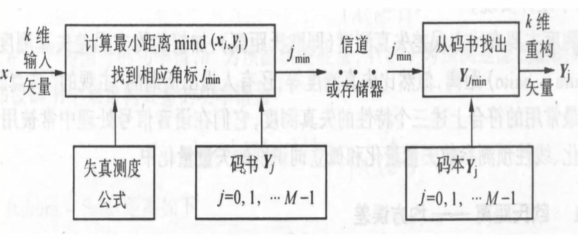

矢量量化的性能指标除了码书的大小M以外 还有由于量化而产生的平均信噪比。
矢量量化的准则：在给定码本大小 $K$ 时使量 化所造成的失真最小。
矢量量化的设计: 从大量信号样本中训练出 好的码书, 从实际效果出发寻找最好的失真测 度定义公式, 设计出最佳的矢量量化系统, 以 便用最少的搜索和计算失真的计算量, 来实现 最大可能的平均信噪比。噪声：在编码过程中总会产生些失真，此失真即噪声。

### 失真测度

失真测度（距离测度）：是将输入矢量 $\mathrm{X}_{\mathrm{i}}$ 用码 本重构矢量 $\mathrm{Y}_{\mathrm{i}}$ 来表征时所产生的误差或失真的度量 方法, 它可以描述两个或多个模型矢量间的相似程度。

#### 欧氏距离

**均方误差**

设输入信号的某个 $K$ 维矢量X, 与码书中某个 1 维矢量 $\mathrm{Y}$ 进行比较, $\mathrm{x}_{\mathrm{i}}, \mathrm{y}_{\mathrm{i}}$ 分别表示 $\mathrm{X}$ 和 $\mathrm{Y}$ 中的各元 素 $(1 \leq i \leq K)$, 则定义均方误差为欧氏距离:
$$

d_{2}(X, Y)=\frac{1}{K} \sum_{i=1}^{K}\left(x_{i}-y_{i}\right)^{2}=\frac{(X-Y)^{T}(X-Y)}{K}

$$

 **$r$ 方平均误差**
$$

d_{r}(X, Y)=\frac{1}{K} \sum_{i=1}^{K}\left|x_{i}-y_{i}\right|^{r}

$$


**$r$ 平均误差**
$$

d_{r}^{\prime}(X, Y)=\left[\frac{1}{K} \sum_{i=1}^{K}\left|x_{i}-y_{i}\right|^{r}\right]^{\frac{1}{r}}

$$
**绝对值平均误差**
$$

d_{1}(X, Y)=\frac{1}{K} \sum_{i=1}^{K}\left|x_{i}-y_{i}\right|

$$
**最大平均误差**
$$

d_{M}(X, Y)=\lim _{r \rightarrow \infty}\left[d_{r}(X, Y)\right]^{\frac{1}{r}}=\max _{1 \leq i \leq K}\left|x_{i}-y_{i}\right|

$$

#### 线性预测失真测度

**Itakur-Saito**距离

$$
\begin{aligned}
&d_{I S}\left(f, f^{\prime}\right)=\frac{a^{\prime T} R a^{\prime}}{\alpha}-\ln \frac{\sigma^{2}}{\alpha}-1 \\
&a^{\prime T} R a=r(0) r_{a}^{\prime}(0)+2 \sum^{p} r(i) r_{a}^{\prime}(i)
\end{aligned}
$$

对比似然比失真测度

$$

d_{L L R}\left(f, f^{\prime}\right)=\ln \frac{\sigma_{p}^{\prime 2}}{\sigma^{2}}=\ln \left(\frac{a^{\prime T} R a^{\prime}}{a^{T} R a}\right)

$$

模型失真测度

$$

d_{m}\left(f, f^{\prime}\right)=\frac{\sigma_{p}^{\prime 2}}{\sigma^{2}}-1=\frac{a^{\prime T} R a^{\prime}}{a^{T} R a}-1

$$

### 最佳矢量量化器和码本的设计

#### 最佳矢量确定

在使得失真测度最小的最佳设计中，重要的问题是如何划分量化区间和确定量化矢量。

1. 对矢量空间进行最佳划分：Voronoi分割条件 (最近邻准则)

即对信号空间的分割应满足
$$

S_{l}=\left\{X \in R^{K}: d\left(X, Y_{l}\right) \leq d\left(X, Y_{i}\right) ; i \neq l\right\}

$$

$S_{l}$ 称为一个胞腔，也是子空间的边界。将大量的样本X，找出与其测度距离最小的Y_i，构成一个由码本矢量构成的新的K维空间。

2. Centroid质心条件

子空间分割固定后, Voronoi胞元的质心就是量化器的码字
$$

Y_{l}=E\left[X \mid Y \in S_{l}\right]

$$

#### 码本确定-LBG算法步骤

第一步: 初始化

给出训练VQ码书所需的全部参考矢量 $X$, $\mathbf{X}$ 的集合用 $\mathbf{S}$ 表示; 设定量化级数，失真控制门 限 $\boldsymbol{\delta}$, 算法最大迭代次数L以及初始码 书 $\left\{Y_{1}^{(0)}, Y_{2}^{(0)}, \Lambda, Y_{N}^{(0)}\right\}$; 设总失真 $D^{(0)}=\infty$ ； 迭代次数的初始化为 $m=1$

**初始码书的选择**

1. 随机选取法（不太好）

2. 分裂法（简单点）


第二步：迭代

1) 根据最近邻准则将 $S$ 分成 $N$ 个集 $S_{1}^{(m)}$, $S_{2}^{(m)}, \cdots=, S_{N}^{(m)}$, 即当 $\boldsymbol{X} \in \boldsymbol{S}_{1}^{(m)}$ 时, 下式成 立: $d\left(X, Y_{l}^{(m-1)} \leq d\left(X, Y_{i}^{(m-1)}\right), \forall i, j=l\right.$

2) 计算失真:

$$

D^{(m)}=\sum_{i=1}^{N} \sum_{X \in S_{l}^{(m)}} d\left(X, Y_{l}^{(m-1)}\right)

$$

3) 计算新码字 $Y_{1}^{(m)}, Y_{2}^{(m)}, \Lambda, Y_{N}^{(m)}$ :

$$

Y_{i}^{(m)}=\frac{1}{N_{i}} \sum_{X \in S_{i}^{(m)}} X

$$

4) 计算相对失真改进量 $\boldsymbol{\delta}^{(m)}$ :

$$
\delta^{(m)}=\frac{\Delta D^{(m)}}{D^{(m)}}=\frac{\left|D^{(m-1)}-D^{(m)}\right|}{D^{(m)}}
$$
将 $\boldsymbol{\delta}^{(m)}$ 与失真门限值 $\boldsymbol{\delta}$ 进行比较。若 $\boldsymbol{\delta}^{(m)} \leq \boldsymbol{\delta}$ 则转入 6）否则转入 5）;

5) 若 $m>L$ 则转至6）, 否则 $m$ 加1, 转至1) 第三步：结束

6) 得到最终的训练码书 $Y_{1}^{(m)}, Y_{2}^{(m)}, \Lambda, Y_{N}^{(m)}$, 并输出总失真 $D^{(m)}$

为了避免迭代算法无限制循环下去, 这里设 置了两个阈值参数：最大迭代次数 $\mathrm{L}$ 和失真控制 门限 $\delta$ 。 $\delta$ 的值设得远小于1, 当 $\delta^{(m)} \leq \delta$ 时, 表明再进行迭代运算失真得减小是有限的。

### 降低复杂度

矢量量化系统主要由编码器和译码器组成，编码器主要由码书搜索算法和码书构成，译码器由查表方法和码书构成。
降低复杂度的设计方法大致分为两类：一类是无记忆的矢量量化器，另一类是有记忆的矢量量化器。

#### 无记忆矢量量化系统

无记忆矢量量化是指量化每一个矢量时都不依赖于此矢量前面的其他矢量,即每一个矢量都是独立量化的。

**1、全搜索矢量量化器**

前面我们介绍的LBG算法，在进行VQ编码时，采用的就是全搜索法，即对于每个输入矢量，比较它与每一个码书中的码字的失真,并将失真最小的码字标号作为输出。

**2、树形搜索的矢量量化系统**

树形搜索是减少矢量量化计算量的一种重要方法。它又分为二叉树和多叉树两种:

码字不象普通的码字那样随意放置, 而是排列在一棵树的接点上, 如图所 示, 码本尺寸为 $M=8$ 的二叉树, 它的 码本中共包含 14 个码字。输入矢量 $X$ 先与 $Y_{0}$ 和 $Y_{1}$ 比较, 计算出失真 $d\left(X, Y_{0}\right)$ 和 $d\left(X, Y_{1}\right)$ 。如果后者较小, 则走下面 支路, 可时送出 “ 1 ”, 可理, 如果 是后达到Y101, 则送出的输出角标 最后达到 $Y 101$, 则送出的输出角标 101。这就是矢量量化的过程。

**3、多级矢量量化系统**

多级矢量量化器由若干级矢量量化器级联而成,因而又称级联矢量量化器。
多级矢量量化不仅可以减少计算量还可以减少存储量。多级矢量量化器由若干个小码书构成。

先采用一个小的码书,其长度为 $\mathrm{M} 1$, 用它来逼近输入信号矢量;然后再用第二个小码书, 其长度为 $\mathrm{M} 2$, 用它来对第一次的误差进行编码; 输入矢量与第一级匹配, 得到其地址编号 $\mathbf{i}$, 然后在第二级码书中搜索与这个误差矢量最佳匹配的矢量, 得到其地址编号j, , 将i和 $j$同时发送出去, 在接受端根据 $\boldsymbol{i}$ 和 $\boldsymbol{j}$ 来恢复原来的矢量, 由于每本码书的体积较小, 所以采用全搜索法。

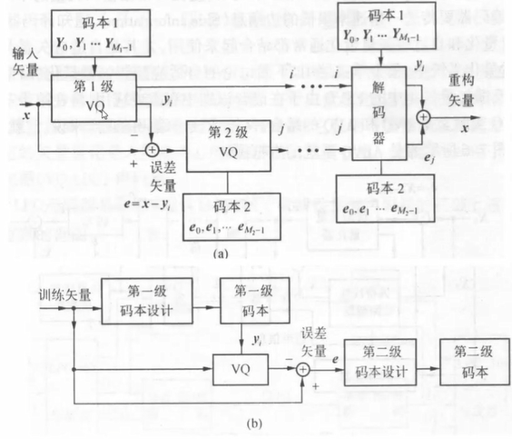

#### 有记忆的矢量量化系统

**反馈矢量量化：预测矢量量化PVQ**

**反馈矢量量化：有限状态矢量量化FSVQ**

**自适应矢量量化**

### 语音参数矢量量化

模糊矢量量化

基于遗传算法的矢量量化

## 隐马尔可夫模型

### 离散马尔可夫过程

离散和连续过程是由输出来定义的。如果输出是单个值，如状态矢量，单标签矢量等，为离散过程。而如果是输出的概率值，相当于一个概率函数，即连续函数，这样的是连续过程。

Markov链是Markov 随机过程的特殊情况, 即Markov链是状 态和时间参数都离散的Markov过程。

设在时刻 $t$ 的随机变量用 $S_{t}$ 、其观察值用 $s_{t}$ 表示, 则如果当 $S_{1}=s_{1}, S_{2}=s_{2}, \Lambda, S_{t}=s_{t}$ 的前提下, $S_{t+1}=s_{t+1}$ 的概率是如下式所示, 则称 其为 $n$ 阶Markov过程
$$

P\left(S_{t+1}=s_{t+1} \mid S_{1}^{t}=s_{1}^{t}\right)=P\left(S_{t+1}=s_{t+1} \mid S_{t-n+1}^{t}=s_{t-n+1}^{t}\right)

$$


特别地, 当如下式成立时, 则称其为 1 阶Markov过程, 又叫 单纯Markov过程。
$$

P\left(S_{t+1}=s_{t+1} \mid S_{1}^{t}=s_{1}^{t}\right)=P\left(S_{t+1}=s_{t+1} \mid S_{t}=s_{t}\right)

$$
系统在任一时刻所处的状态只与此时刻的前一时刻所处的状 态有关。而且, 为了处理问题方便, 我们只考虑式 (5-4) 右边的概率与时间无关的情况, 即:
$$

P_{i j}(t, t+1)=P\left[S_{t+1}=s_{j} \mid S_{t}=s_{i}\right]

$$
同时满足： $P(t, t+1)_{i j} \geq 0 \quad \sum_{j=1}^{N} P(t, t+1)_{i j}=1$
这里 $P(t, t+1)_{i j}$ 是当时刻 $\mathrm{t}$ 从状态 $\mathrm{i}$ 在时刻 $\mathrm{t}+1$ 到状态 $\mathrm{j}$ 的转移概率, 当这个转移概率是与时间无关的常数时, 是具有 常数转移概率的Markov过程。另外, $P(t)_{ij}≥0$表示t存在时, 从 状态 $i$ 到状态 $\mathrm{j}$ 的转移是可能的。对于任意的 $\mathrm{i}, \mathrm{j}$ 都有 $P(t)_{i j} \geq 0$ 则这个Markov过程, 是正则Markov过程。

HMM类似于一阶Markov过程。不同点是HMM是一个双内嵌式随 机过程。正如在前一小节所介绍的一样, HMM是由两个随机 过程组成, 一个是状态转移序列, 它对应着一个单纯Markov 过程。另一个是每次转移时输出的符号组成的符号序列。在 语音识别用HMM中, 相邻符号之间是不相关的 (这当然不符 合语音信号的实际情况, 这也是HMM的一个缺点, 对此, 已 经有许多改进的HMM被提出）。这二个随机过程, 其中一个 随机过程是不可观测的, 只能通过另一个随机过程的输出观 察序列观测。设状态转移序列为 $S=s_{1} s_{2} \Lambda s_{T}$, 输出的符号序列 为 $O=o_{1} O_{2} \Lambda o_{T}$, 则在单纯Markov过程和相邻符号之间是不相关 的假设下 (即 $s_{i-1}$ 和 $s_{i}$ 之间转移时的输出观察值 $o_{i}$ 和其他转 移之间无关）, 有下式成立:

$$
\begin{aligned}
&P(S)=\prod_{i} P\left(s_{i} \mid s_{1}^{i-1}\right)=\prod_{i} P\left(s_{i} \mid s_{i-1}\right) \\
&P(O \mid S)=\prod P\left(o_{i} \mid s_{1}^{i}\right)=\prod_{i} P\left(o_{i} \mid s_{i-1}, s_{i}\right)
\end{aligned}
$$
因为是隐Markov模型, 把所有可能的状态转移序列都考虑进 去, 则有：
$$

P(O)=\sum_{S} P(O \mid S) P(S)=\sum_{S} \prod_{i} P\left(s_{i} \mid s_{i-1}\right) P\left(o_{i} \mid s_{i-1}, s_{i}\right)

$$
这就是上面我们计算输出符号序列 $a a b$ 的输出概率时所用的 方法。

### HMM的基本元素

根据以上的分析, 对于语音识别用HMM可以用下面六个 模型参数来定义, 即:
$$

M=\{S, O, A, B, \pi, F\}

$$
$S$ : 模型中状态的有限集合, 即模型由几个状态组成。设 有 $N$ 个状态, $S=\left\{S_{t} \mid i=1,2 \Lambda, N\right\}$ 。记 $\mathrm{t}$ 时刻模型所处状态为 $s_{t}$, 显 然 $s_{t} \in\left(S_{1}, \Lambda, S_{N}\right)$ 。在球与缸的实验中的缸就相当于状态。
$O$ : 输出的观测值符号的集合, 即每个状态对应的可能的 观察值数目。记 $M$ 个观察值为 $O_{1}, \Lambda, O_{M}$, 记 $t$ 时刻观察到的观 察值为 $o_{t}$, 其中 $b_{t} \in\left(O_{1}, \Lambda, O_{w}\right)$ 。在球与缸实验中所选彩球的颜 色就是观察值。

状态转移矩阵

$A$ :状态转移概率的集合。所有转移概率可以构成一个转移 概率矩阵, 即：
$$

A=\left[\begin{array}{rrr}

a_{11} & \Lambda & a_{1 N} \\

\mathrm{M} & \mathrm{O} & \mathrm{M} \\

a_{N 1} & \Lambda & a_{N N}

\end{array}\right]
$$
其中 $a_{i j}$ 是从状态 $S_{i}$ 到状态 $S_{j}$ 转移时的转移概率, $1 \leq i, j \leq N$ 且 有 $0 \leq a_{i j} \leq 1, \sum_{j=1}^{N} a_{i j}=1$ 。在球与忤实验中, 它指描述每次在当前 选取得缸的条件下选取下一个缸的概率。

状态转移输出  

$B$ : 输出观测值概率的集合。 $B=\left\{b_{i j}(k)\right\}$, 其中 $b_{i j}(k)$ 是从状态 $S_{i}$ 到状态 $S_{j}$ 转移时观测值符号的输出概率。即缸中球的颜色 $k$ 出现的概率。根据 $\mathrm{B}$ 可将HMM分为连续型和离散型HMM等。
$\pi$ ：系统初始状态概率的集合, $\pi=\left\{\pi_{i}\right\}$ : $_{\pi_{i}}$ 表示初始状态是 $s_{j}$ 的概率, 即,
$$
\pi_{i}=P\left[S_{1}=s_{i}\right], \quad(1 \leq i \leq N) \quad \sum \pi_{j}=1
$$
在球与缸实验中, 它指开始时选取某个缸的概率。
- $F$ ：系统终了状态的集合。
这里需要说明的是, 严格地说Markov模型是没有终了状态 的概念的, 只是在语音识别里用的Markov模型要设定终了状 态。  

###  HMM基本算法

 

#### 前向－后向算法

前向-一后向算法 (Forward-Backward, 简称为 $F-B$ 算法) 是 用来计算给定一个观察值序列 $O=o_{1} O_{2} \Lambda o_{T}$ 以及一个模型 $M=\{4, B, \pi\}$ 时, 由模型M产生出 0 的概率 $P(O \mid M)$ 的。

前向算法

前向算法即按输出观察值序列的时间, 从前向后递推计算输 出概率。
$\alpha_{t}(j)$ 可有下面的递推公式计算得到:

(1) 初始化 $\alpha_{0}(1)=1, \alpha_{0}(j)=0 \quad(j \neq 1)$
(2) 递推公式 $\alpha_{t}(j)=\sum_{t} \alpha_{t-1}(i) a_{i j} b_{i j}\left(o_{t}\right) \quad(t=1,2, \Lambda, T ; i, j=1,2, \Lambda, N)$
(3) 最后结果 $P(O / M)=\alpha_{T}(N)$
* 后向算法
大与前向算法类似, 后向算法即按输出观察值序列的时间，从 后向前递推计算输出概率的方法。
$\beta_{t}(i)$ 可由下面的递推公式计算得到:
(1) 初始化 $\beta_{T}(N)=1, \beta_{T}(j)=0 \quad(j \neq N)$
(2) 递推公式 $\beta_{t}(i)=\sum \beta_{t+1}(j) a_{i j} b_{i j}\left(o_{t+1}\right) \quad(t=T, T+1, \Lambda, 1 ; i, j=1,2, \Lambda, N)$
(3) 最后结果 $P(O / M)=\sum_{i=1}^{N} \beta_{1}(i) \pi_{i}=\beta_{0}(1)$

#### 维特比 (Viterbi）算法

* Viterbi算法解决了给定一个观察值序列 $O=o_{1}, o_{2}, \Lambda, o_{T}$ 和一个 模型 $M=\{A, B, \pi\}$ 时, 在最佳的意义上确定一个状态序列 $S=s_{1} s_{2} \Lambda s_{T}$ 的问题。

Viterbi算法可以叙述如下:

（1）初始化 $\alpha_{0}^{\prime}(1)=1, \alpha_{0}^{\prime}(j)=0 \quad(j \neq 1)$
(2) 递推公式 $\alpha_{t}^{\prime}(j)=\max _{i} \alpha_{i-1}^{\prime}(j) a_{i j} b_{i j}\left(o_{t}\right) \quad(t=1,2, \Lambda, T ; i, j=1,2, \Lambda, N)$
(3) 最后结果 $P_{\max }(S, O / M)=\alpha_{T}^{\prime}(N)$
在这个递推公式中, 每一次使 $\alpha_{t}^{\prime}(j)$ 最大的状态组成的状态 序列就是所求的最佳状态序列。

#### Baum-Welch 算法

这个算法实际上是解决HMM训练的, 即HMM参数估计问题的。 或者说, 给定一个观察值序列 $O=0_{1}, o_{2}, \Lambda, o_{r}$, 该算法能确定一 $\mathrm{~ 个 ~}$ 想, 使 $P(O / M)$ 局部放大, 最后得到优化的模型参数 $M=\{A, B, \pi\}$ 。

下面给出利用Baum-We1ch算法进行HMM训练具体步骤:
1) 适当地选择和的初始值。一般情况下可以按如下方式设定:

a) 给予从状态转移出去的每条弧相等的转移概率

b) 给予每一个输出观察符号相等的输出概率初始值

$$

b_{i j}(k)=\frac{1}{\text { 码本中码字的个数 }}

$$
并且每条弧上给予相同的输出概率距阵;
2) 给定一个 (训练) 观察值符号序列 $O=o_{1}, o_{2}, \Lambda, o_{T}$, 由初始模型计算等 $(i, j)$ 并且, 由上述重估公式, 计算$\hat{a}_{i j}$和 $\hat{b}_{i j}$
3) 再给定一个 (训练) 观察值符号序列 $O=o_{1}, o_{2}, \Lambda, o_{T}$, 把前一次 $\hat{a}_{i j}$ 的和 $\hat{b}_{i j}(k)$ 作为初始模型计算 $\gamma_{t}(i, j)$ 等, 祭, 上述重估公式, 重新计算 $\hat{a}_{i j}$ 和 $\hat{b}_{i j}(k)$;
4) 如此反复, 直到 $\hat{a}_{i j}$ 和 $\hat{b}_{i j}(k)$ 收敛为止;

### 隐马尔可夫模型的各种结构类型 

按照HMM的状态转移概率矩阵（参数）分类

各态历经型或遍历型HMM (Ergodic HMM）: 严格的讲, 所谓 的遍历模型就是经过有限步的转移后, 系统能达到任何一个 状态。即系统从一个状态允许转移到任何一个状态。在某些 应用系统中, 常遇到的是一步遍历模型, 即经过一步跳转, 系统可达到任何一个状态。这样的HMM的状态转移矩阵中的 每一个元素均为大于零的数, 没有零元素。显然, 各态历经 型HMM不符合时间顺序的要求, 因为它可以回到以前到过的 状态, 所以只能用于不要求时间顺序的语音信号处理, 如: 与文本无关的说话人识别等。

从左到右型HMM（Left-to-Right HMM）：所谓的从左到右模 型, 就是指随着时间的增加, 状态的转移只能是从左到右进 行或停留在原来的状态, 而不能出现返回到以前状态的情况, 即从编号高的状态 (如第状态) 到编号低的状态 (如第 $n-1$ 或 $n-2$ 等等状态) 跳转的情况 (这实际上是一个时序的问题, 因为按照时间顺序, 总是从编号低的状态向编号高的状态转 移)。因此, 其状态转移矩阵具有如下的形式, 它是一个上 三角矩阵, 而表示终止状态的最后一行除了最后一个元素外 全为零 (当终止状态没有自转移时, 则最后一行全为零)。
$$
\left[\begin{array}{cccc}

a_{14} & a_{12} & a_{13} & a_{14} \\

0 & a_{22} & a_{23} & a_{24} \\
0 & 0 & a_{33} & a_{34} \\
0 & 0 & 0 & a_{44}
\end{array}\right]
$$

另外从状态转移结构上HMM还有 其他的一些变体, 如由图5-5 (c) 所示的由两条并行的从左到右模 型组成的HMM, 又称为HMM网络。 它不是一般的情况, 是由标准模 型组合的变体, 用于特殊的应用 场合。这种模型较复杂, 所以性 能一般要比单个左右模型要好。

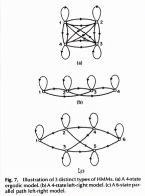

按照HMM的输出概率分布 (B参数) 分类

离散HMM（DHMM）:离散HMM就是上面一直在介绍的

HMM。在这种HMM中, 每一个状态的输出概率是按观

察字符离散分布的, 每一次转移时状态输出的字符,
是从一个有限的离散字符集中按照一定的离散概率
分布选出的。在语音信号处理中, 经过特征分析后,
语音信号先被分割成若干帧, 每帧求取一个特征参
数向量, 即每帧是用一个特征参数向量表示的。此
时若要使用离散HMM, 则需要将语音特征参数向量
的时间序列进行矢量量化, 通过矢量量化使每一帧
语音信号由特征参数向量表示转变为用码字符号表 示的形式。

连续型HMM（Continuous HMM, 简称为CHMM）： 在连续HMM中, 由于可以输出的是连续值, 不是有限的, 所以不能用矩阵表 示输出概率, 而要改用概率密度函数来表示。即用 $\left[b_{i j}(X) d X\right]$ 表示：在 $X$ 和 $X+d X$ 之间观察矢量的输出概率。这里 $b_{i j}(X)$ 称 为参数 $X$ 的概率密度分布函数, 输出 $X$ 的概率可以通过 $b_{i j}(X)$ 计算出来。 $b_{i j}(X)$ 一般用高斯概率密度函数, 由于 $X$ 是多维矢 量所以要用多元高斯概率密度函数
$$

b_{i j}(X)=P(X \mid i, j)=\frac{1}{(2 \pi)^{p / 2}\left|\Sigma_{i j}\right|^{1 / 2}} \exp \left\{-\frac{1}{2}\left(X-\mu_{i j}\right) \Sigma_{i j}^{-1}\left(X-\mu_{i j}\right)^{t}\right\}

$$


根据协方差矩阵是全协方差矩阵还是对角协方差矩阵, 可以 把连续HMM分成全协方差矩阵CHMM和对角协方差矩阵CHMM。
另一方面, 由于在实际的语音信号处理系统中, 往往用一个 高斯概率密度函数不足以表示语音参数的输出概率分布, 所 以一种常用于语音信号处理的概率密度函数, 称之为 “高斯 元混合密度” , 即用多个高斯概率分布的加权组合来表示输 出概率密度函数。
$$

b_{i j}(X)=\sum_{m=1}^{M} w_{i j m} b_{i j m}(X)=\sum_{m=1}^{M} w_{i j m} \frac{1}{\left.(2 \pi)^{p / 2}|\sum_{ijm}\right|^{1 / 2}} \exp \left\{-\frac{1}{2}\left(X-\mu_{i j m}\right) \sum_{i j m}^{-1}\left(X-\mu_{i j m}\right)^{\prime}\right\}

$$
连续混合密度HMM为多个正态分布线性相加的HMM系统, 当M 值较大 (混合密度MMM为 4 或5) 时, 系统的识别率较高, 但其运算量 较大。另一方面, 每个模型中每个状态的概率密度由 M个正 态分布函数叠加而成, 它比前者有更多的自由度, 因而逼近 实际分布的效果更好一些, 这样识别效果也会更佳, 随着词 汇量的增加, 这一优点更加突出, 因而, 对一些大词汇量的 与说话人无关的语音识别系统, 连续混合密度HMM受到重视。

半连续型HMM (Semi-Continuous HMM: 简称为SCHMM）: 离 散HMM的模型参数少, 对训练数据量要求不高, 而且离散HMM 的计算量较少, 易于实时实现, 但是离散HMM的缺点是识别 精度不高。连续型HMM虽然不使用离散概率分布不需要对输 入信号进行量化, 从而提高了识别率, 但这是以运算量的增 加为代价的, 而且连续型HMM尤其是连续混合密度HMM的模型 参数教多, 训练数据不够时训练的模型精度较低。为了结合 这两种模型的优点, 弥补这两种模型的缺点。人们提出了半 连续型HMM, 它的输出概率的形式如下式所示:
$$

b_{i j}(X)=\sum_{k=1}^{J} P(k \mid i, j) N\left(X, \mu_{k}, \Sigma_{k}\right)=\sum_{k=1}^{J} w_{i j k} N\left(X, \mu_{k}, \Sigma_{k}\right)

$$
这样, 对于离散HMM, 半连续型HMM用多个正态分布线性相加 作为概率密度函数弥补了离散分布的误差; 对于连续型HMM, 半连续型HMM用多个各状态共有的正态分布线性相加作为概 率密度函数弥补了参数数量多, 计算量大的缺陷。

其他一些特殊的HMM的形式

空转移 (Nu11 Transitions) : 在这种类型的HMM中, 系统的 输出是与转移弧相联系的, 允许不产生输出的转移, 即从一 个状态转移到其他状态时, 无观察符号 (或矢量) 输出。这 样的转移称为空转移。在连续语音识别系统中, 单词或语句 的HMM都是由基元HMM的连接形成的, 一般在连接时, 一个基 元HMM的终止状态和一个基元HMM的初始状态相连接, 这种连 接产生的转移弧就是空转移, 如图5-6所示。所以在大词汇 连续语音识别系统中大量使用了这种模型。

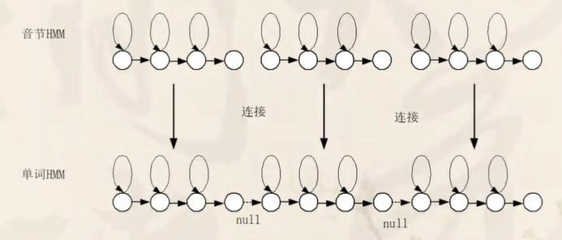

参数捆绑（Parameter tieing）:参数捆绑的基本思想是在 HMM的不同状态转移弧的参数之间建立一定的关系, 使得不 同状态转移弧使用相同的参数, 其目的就是使模型中的独立 的状态参数减少, 从而使得参数估计变得较为简单。参数捆 绑是解决训练数据不足问题的重要方法, 因为模型的参数越 多, 则需要的训练数据数量就越大, 否则训练出的模型精度 就不够。所以可以通过参数捆绑来降低模型参数数量, 减少 对训练数据量的压力。参数捆绑常用于两个或多个状态的输 出观察向量的概率密度分布近似相同的情况, 提取的语音特 征参数可以认为在这些状态转移弧上符合相同的分布。实际 上, 在如图5-7所示的连续型HMM中, 一个状态的自转移弧和 互转移弧的参数必须进行参数捆绑, 因为, 对于一个训练参 数的时间序列, 实际上互转移弧上只通过了一帧的语音数据, 娄而用一帧的语音数据估计正态分布概率密度函数是不可能的。

具有参数捆绑的连续型HMM

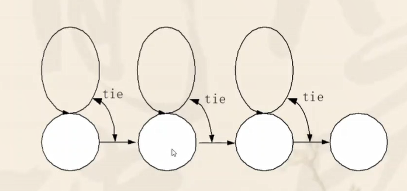

### 模 型的一些实际问题

#### 下溢问题

在计算HMM的三个问题时, 需要计算前向变量 $\alpha_{t}(i)$ 和后向变量中, 计算前向变量所用的递归公式如下:
$$
\alpha_{t}(j)=\sum_{t=1}^{N} \alpha_{t-1}(i) a_{ij} b_{i j}\left(o_{t}\right)
$$
在上式中, $a_{i j}$ 和 $b_{i j}\left(o_{t}\right)$ 项均为小于的 1 数 (其至远小于 1 )，因此在实际运算中, $\alpha_{t}(i)$较$\alpha_{t-1}(i)$
要小,随着t的增加,$\alpha_{t}(i)$就有明显得降低, 最后, 该变量变得非常小, 以致会超出计算动态范围的下限, 即使采用双精度运算, 当t相当大时,几乎所有的?都趋向于零,后向变量?的计算也有类似情况,这就是计算中的下溢问题。因此, 在进行相关计 算时, 必须加入是定标过程。

参数初始化问题

从理论上而言, 基于标准ML (Maximum Likelihood Method, 简称 为ML法)判据的Baum-Welch前后向重估训练算法能够给出似然函 数的局部最大点, 一个关键的问题是如何恰当地选择HMM的初始参 数, 使局部最大值尽量的接近全局最优点。佔外, 好的初值选择 还可以保证达到收敛所需的迭代次数最小, 即计算效率较高。初 始概率和状态转移系数矩阵的初值较易确定。由迭代算法可知, 如果任何一个参数的初值定为 0 , 那么以后的迭代运算中恒为零。 因些, 通常对这两组参数的初值设置为均匀分布之值或非零的随 机数, 据有关文献介绍, $\pi$ 和 $a_{i j}$ 的初值设置对识别率的影响不是 太大。
参数B的初值设置较其它两组参数的设置更至关重要也更困难。对 离散型HMM等较简单的情况, B的设置较容易, 可以采取均匀的或 随机的设置每一字符出现的概率初值。牡连续分布HMM的B中, 包 含的参数越多越复杂, 则参数初值的设置对丧迭代计算的结果越 至关重要，一种较简单的B初值的设置方法是用手工对输入的语音 进行状态划分并统计出相应的概率分布作为初值, 这适合于较小 的语音单位。对于较大的语音单位, 目前普遍采用分段 $K$-均值算 法, 该算法的基本思想和计算流程如图5-8所示。

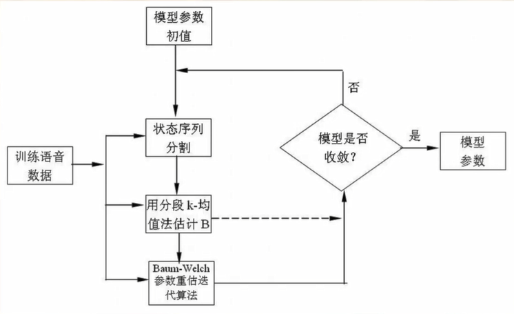

描述语音动态特性


为了保证HMM计算的有效性和训练的可实现性, 基本的HMM模 型本身隐含了以下三个假设:
假设 1: 状态转移概率与观察序列无关, 且时不变;
假设 2 : 状态观察概率密度函数与过去状态无关;
假设 3 : 状态观察概率密度函数与过去观察无关。
由于语音是发音系统连续变化所产生的, 具有很强的相关性,
以上基本HMM的假设无疑是不合理的。因此, 虽然隐马尔可
夫模型是现在最流行的语音识别模型, 然而基本型的HMM采 用状态输出独立假设是它的一个固有的缺陷。它影响了HMM 描述语音信号时间上帧间相关动态特性的能力。


为了弥补这一缺陷, 最早人们采用的方法是在利用语音静态 参数 $X$ 的同时, 增加如下式 (5-63) 所示的语音的动态特 性参数, 即以时刻t (帧) 为中心, $2 w+1$ (帧) 为幅度的线 性回归系数 $\Delta X(t)$ :
$$
\Delta X(t)=\frac{\sum_{i=-w}^{w} i X(t+i)}{\sum_{i=-1 w}^{w} i^{2}}
$$
然而这些扩展都没有从根本上解决HMM假设的不合理性, 因 而其对识别性能的改进也必然是有限的。因此, 基于语音段 的统计建模方法正是在此基础上于八十年代末、九十年代初 应运而生了, 提出许多方法, 如使用线性或非线性预测器法 利用多项式回归函数法、利用条件概率HMM的方法和复数帧 段输入HMM方法等。

利用语音帧间相关信息最直接最简便的方法, 是采用相继的 复数帧组成的特征参数矢量作为输入特征量的方法。这种方 法最初是由井手等人提出, Ostendorf等人把这一方法推广 到了连续语音识别系统。利用这一设想, 可以较好地改善传 统输出独立HMM的缺陷, 是一种有效而简便的利用帧间相关 信息的方法。

HMM训练方法的改进

现在作为HMM的模型的代表性训练方法是被称为Baum-Welch 算法的最大似然推定法 (ML法)。这种方法是以学习样本生成 的似然函数值最大为学习准则, 而没有考虑各学习类别之间 的关系, 所以不能保证用ML法训练的模型产生的识别误差率 为最小, 即模型间鉴别力最大。
针对HMM的模型的训练方法的问题, 提出了许多改进的训练 方法。其中, 基于最小分类误差基准的学习方法 (Minimum Classification Error Method, 以下简称MCE法）效果较好。


直接利用状态持续时间分布概率的HMM系统
由Viterbi算法以及上面介绍的 $\mathrm{k}$ 均值HMM训练法可以知道, 实际上语音信号中各个稳定段是与相应的HMM状态相对应的。 然而在标准HMM中, 观察符号 (矢量) 序列在任何一个状态 的停留时间或持续时间的概率分布并没有在系统的参数组中 表现出来。
在HMM三个基本问题的解决中, 不是孤立地通过状态转移矩 阵估计每个状态的持续时间, 而是用Viterbi算法从总体上 估计最可能出现的总体序列。

为了能够在HMM中很好地表现和利用持续时间这一明显有用 的参数, 有下列解决方法:
(1) 增加HMM的状态数。
(2) 采用后处理的方法。
(3) 采用状态持续时间分布的HMM系统。

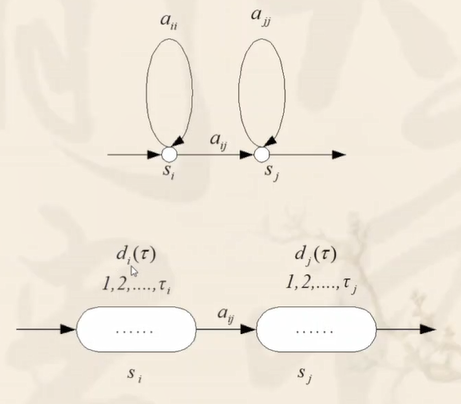

## 人工神经网络

### 主成分分析 

## 语音编码

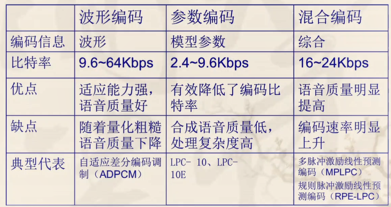

语音编码依据之一:语音信号冗余度

基本时域冗余:

- 语音信号幅度非均匀分布性
- 语音信号样本间的强相关性
- 浊音语音段具有的准周期性
- 声道形状及其变化的缓慢性
- 静止系数(即语音间隙性)


基本频域冗余:

- 从长时间的功率谱密度来看，语音信号具强烈的非平坦型，存在着固定的冗余度。而且高频能量通常较低，恰好对应于时域上的相邻样本相关性。
- 从短时功率谱密度来看，语音信号在不同频率交替出现峰值(共振峰)与谷值。整个功率谱的细节基于基音频率形成高次谐波结构。

语音编码依据之二:人的听觉特点

- 人类听觉系统存在着掩蔽系统，即高声级单音会明显掩蔽临近频率声音。
- 对于不同频段的声音，人耳的敏感程度不尽相同。
- 人类对于语音信号的周期性(即音调)极为敏感，但对信号的相位却充耳不闻，这与理论分类存在差异。

### 波形编码

重建后的语音时域信号的波形与原语音信号保
持一致。

- 脉冲编码调制(PCM)

形式一：均匀PCM

最简单最原始的波形编码方式, 没有运用压缩技术, 产生 的比特率也极高, 故在当今运用极少。

形式二：非均匀PCM

将信号进行非线性变换后再均匀量化, 变换后信号具有均 匀概率密度分布。编码时常采用对数变换压缩（译码时指数 扩展）。

形式三: 自适应PCM

无论是均匀或是非均匀PCM, 量化间隔总是随着量化器的 确定而固定。而自适应PCM引入的自适应幅值变化概念使得量化 误差可以匹配于输入信号方差, 或是量化器增益G可以随着幅值 而变化, 从而使信号能量在量化前恒定。

- 自适应预测编码

自适应预测编码器 (APC) 利用线性预测 来改进编码中的量化器性能, 根据信号量 化噪声比的定义:
$$
\mathrm{SNR}=\frac{\mathrm{E}\left[\mathrm{s}^{2}(\mathrm{n})\right]}{\mathrm{E}\left[\mathrm{q}^{2}(\mathrm{n})\right]}=\frac{\mathrm{E}\left[\mathrm{s}^{2}(\mathrm{n})\right]}{\mathrm{E}\left[\mathrm{e}^{2}(\mathrm{n})\right]} * \frac{\mathrm{E}\left[\mathrm{e}^{2}(\mathrm{n})\right]}{\mathrm{E}\left[\mathrm{q}^{2}(\mathrm{n})\right]}
$$
- 自适应增量调制(ADM)

增量调制方式将下一个语音信号与当前语音信号 比较, 如果高与当前值则系统则编码 1 , 否则系统编 码 0 .自适应增量调制随输入波形自适应的改变量化 阶梯的大小, 在信号平均斜率大时自动增大量化阶梯, 反之减小。

- 自适应差分脉冲编码调制(ADPCM)
不同于DM的一位编码, DPCM多位量化对两个采样 之间的差分信号利用多位量化进行编码, 使信息量得 到压缩的同时降低了信道负载。但采用固定的高阶预测, 改善效果并不明显, 于是, 高阶自 适应预测作为相应的解决方式被提出, 自适应预测器随着语音 特征变化不断更新预测系数，从而获得更高的预测增益。

- 子带编码(SBC)

子带编码属于频域编码, 它首先将语音信号通过带通 滤波器分割为若干频带 (子带) , 而后对子带信号进行 频谱平移变为基带信号, 再利用奈奎斯特速率抽样, 最 后进行编码处理。分带后可去除信号相关性, 获得与时域一样的效果。不同子带拥有不同比特数, 可获得更佳主观听音质量。 各子带间量化噪音相互独立互不干扰。 


- 自适应变换编(ATC)

自适应变换编码利用正交变换将信号由时域变换到另外一个域，使变换域系数密集化，从而使信号相邻样本间冗余度得到降低。频域变换明显, 较易控制量化噪声频率范围。 兼顾性能与计算量, 不需要传输特征矢量。变换效率高于DFT, 且在频域区的畸变更小。

#### 参数编码

线性预测声码器

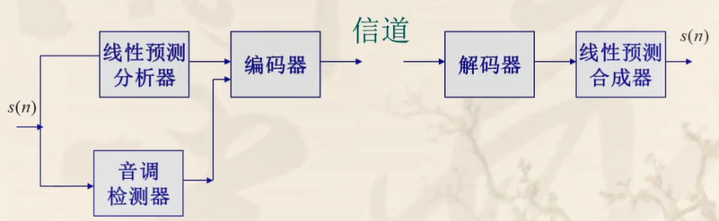

通过建立语音信号的产生模型，提取其特征参
数来编码，波形上不要求与原信号匹配，又称声码器技术。


- 变帧率 LPC声不马器

为降低LPC声码器的速率, 应用了变帧速率编码 （VFR）技术的变帧率LPC声码器应运产生。通过付 出编码解码复杂化与时延出现的代价, 变帧率LPC 声码器可明显降低传输数码率同时保持音质。

- LPC-10编码器

LPC-10利用简单的二元激励取代余量信号, 在 $2.4 \mathrm{kbps}$ 的速率上得到了清晰的合成语音, 在当代 长期被作为标准算法使用。但因为激励信号选取的 影响, 抗噪能力与自然度仍不尽如人意。

#### 混合编码

有机结合以上两种编码方式，基于语音产生模
型的假定并采用分析合并技术。


合成编码方法 (LPAS）是目前得到最广泛研究的语音编码算法, 它通 过线性预测确定系统参数, 并通过闭环或分析-合成方法确定激励序列。

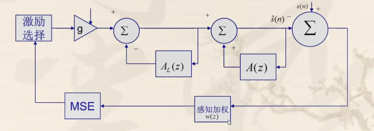

码激励线性预测编码 ( C E L P )

C E L P 因其自身的良好抗噪性多次复接能力与高质量 的合成语音而被广泛运用。不同于 L P C 的二元激励, C E $\mathrm{L} \mathrm{P}$ 采用矢量量化对信号编码, 编码时只传送最佳码矢量的 下标, 占用比特数大大降低。

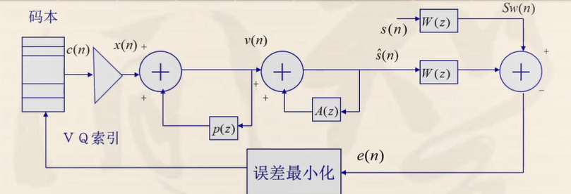

#### 现代通信的语音信号编码

在通信技术蓬勃发展信息至上观念深入人心的今天，
传统的 T D M A或是窄带 C D M A 已不能满足移动通信
业务量的需求。第三代移动通信 $3 \mathrm{G}$ 系统引入了更高的
传输速率业务, 其中语音服务仍为主要业务。

E V R C 算法

目前的 C D M A 系统中, 基于 R C E L P 算法的 $E V$
$\mathrm{R} \mathrm{C}$ 算法在语音质量与比特速率间取得了很好的平衡,
且适用于变速率编码, 抗干挞扰能力也粃力令人满意, 从而得到了极为广涋泊的应用。

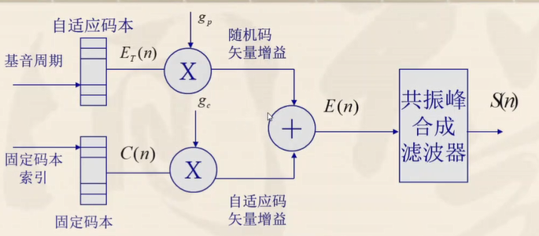

## 语音合成

### 波形合成法

一般有两种形式, 一种是波形编码合成, 它类似于语音编码 中的波形编解码方法, 该方法直接把要合成的语音的发音波形进行存储 或者进行波形编码压缩后存储, 合成重放时再解码组合输出。另一种是 波形编辑合成, 它把波形编辑技术用于语音合成, 通过选取音库中采取 自然语言的合成单元的波形, 对这些波形进行编辑拼接后输出。

#### 共振峰合成法

共振峰语音合成器模型是把声道视为一个谐振腔, 利用腔体 的谐振特性, 如共振峰频率及带宽, 以此为参数构成一个共 振峰滤波器。因为音色各异的语音有不同的共振峰模式, 以 每个共振峰频率及其宽带为参数, 可以构成一个共振峰滤波 器。将多个这种滤波器组合起来模拟声道的传输特性, 对激 励声源发生的信号进行调制, 经过辐射即可得到合成语音。 这便是共振峰语音合成器的构成原理。

#### 线性预测合成法

线性预测合成方法是目前比较简单和实用的一种语音合成方 法。六十年代后期发展起来的LPC语音分析方法可以有效地 估计基本语音参数。 LPC语音合成器利用LPC语音分析方法, 通过分析自然语音样本, 计算出 LPC系数, 就可以建立信号 产生模型, 从而合成出语音。

### 参数合成法

也称为分析合成法, 是一种比较复杂的方法。为了节约存储 容量, 必须先对语音信号进行分析, 提取出语音的参数, 以压缩存储量, 然后由人工控制这些参数的合成。

### 规则合成法

是一种高级的合成方法。规则合成方法通过语音学规则产生 语音。合成的词汇表不是事先确定, 系统中存储的是最小的语音单位的 声学参数, 以及由音素组成音节、由音节组成词、由词组成句子和控制 音调、轻重音等韵律的各种规则。给出待合成的字母或文字后, 合成系 统利用规则自动的将他们转换成连续的语音声波。这种方法可以合成无 限词汇的语句。


语速

短时平均能量

短时最大振幅

基频的最小值、最大值、平均值、变化范围、均方差、1/3分位点、1/4分位点


基音变化的1/3分位点、1/4分位点

第一、二、三共振峰频率的位置、最大值、平均值、变化范围、 均方差、1/3 分位点、1/4 分位点

停顿和爆发的持续时间中的波峰和波谷

语言、上下文和其他形式（如面部表情）的帮助。

### 非个性化语音情感特征

无声部分时间与有声部分时间比率

振幅平均变化率

短时能量平均变化率

基频的平均变化率、标准方差

基频变化率的1/4分位点、3/4分位点、1/3分位点和2/3分位点

第一、二、三共振峰频率的平均变化率

第一、二、三共振峰频率的平均变化率1/4分位点、3/4分位点、1/3分位点和2/3分位点

一阶差分MFCC系数

二阶差分MCFF系数

线性预测倒谱系数（LPCC）

线性预测编码（LPC）

对数频率功率系数（LFPC）

单边自相关线性预测编码（OSALPC）

单边自相关线性预测倒谱系数（OSALPCC）

### 融合特征

基于TEO的特征参数

基于导数的非个性化特征

### 基频特征

### 短时自相关函数法(ACF)（存在半频和倍频检测误差）

周期信号的自相关函数仍是周期性的，而随机噪声信号随着延迟增加，它的自相关函数将减到零。因此在一定延迟时间后，被干扰信号的自相关函数中就只保留了周期信号的信息，而排除了随机信号的干扰，能从自相关函数的第一个最大值的位置估计出信号的基音周期。

语音信号是非稳态信号，它的特征是随时间变化，但在一个很短的时间段内可以认为具有相对稳定的特征即短时平稳性。ACF 中的短时自相关函数为

$$R_{i}(k)=\sum_{m=1}^{\mathrm{N}-k} S_{i}(m) S_{i}(m+k)$$

其中, $R_{i}(k)$ 表示第 $i$ 帧自相关函数, $S_{i}(m)$ 表示一帧语音信号的第 $m$ 个采样值, $\mathrm{N}$ 表示帧长, $k$ 表示时间的延迟量，**基频=采样率/Max**。

### 平均幅度差法(AMDF)

AMDF 中的平均幅度差函数为

$$D_{i}(k)=\sum_{m=1}^{\mathrm{N}-k}\left|S_{i}(m+k)-S_{i}(m)\right|$$

其中, $D_{i}(k)$ 表示第 $i$ 帧平均幅度差函数。平均幅度 差函数与原语音信号的周期性一致, 它在周期的整 数倍上取极小值，通过寻找波谷之间的延迟即可找到原信号的周期。

### 小波法

语音信号经过小波变换后极值点对应原信号 的不连续点。发声时，来自肺部周期性的气流冲击 声门，使声门产生周期性的开启或闭合，这样语音 信号就产生了不连续点。通过寻找小波变换后极值 点之间的距离即可确定基音周期。

NACF-CBS 算法

SWT-HS 算法

 Pitch detection algorithm based on normalized correlation function and central bias function

Robust glottal closure instant detection by jointly exploiting stationary wavelet transform and harmonic superposition

### Filterbank

### Spectrogram

### raw waveform

## 矢量量化技术

## 隐马尔可夫模型

## 人工神经网络

## 语音压缩编码

语音通信

## 语音合成

## 语音识别

## 说话人识别

声纹识别，人脸识别，虹膜识别组合

## 语音情感识别

## 语音增强

噪声背景下，怎么

## 语音理解

## 参考文献

1.[IEEE Trans. Audio, Speech, And Language Processing](https://ieeexplore.ieee.org/xpl/RecentIssue.jsp?punumber=10376)（权威）
2.[Speech Communication]([Speech Communication | Journal | ScienceDirect.com by Elsevier](https://www.sciencedirect.com/journal/speech-communication))（历史悠久）
3.Journal Acoustical Society o America
4.[Int. Conf. Acoustic, Speech, Signal Processing (ICASSP)](https://www.ieeeicassp.org) （顶会）
5.[INTERSPEECH](https://www.isca-speech.org/archive/interspeech_2021/index.html)
6.语音信号处理相关著作,教材，网站
