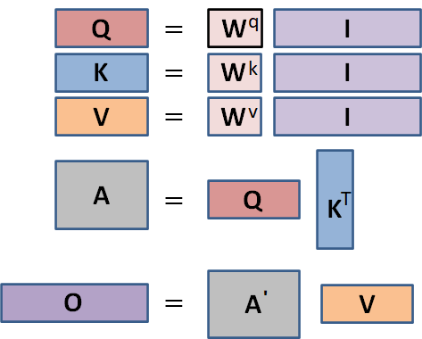
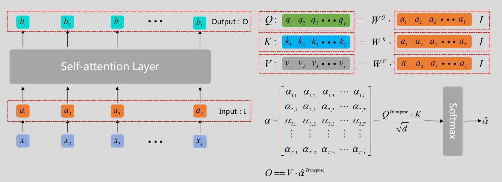
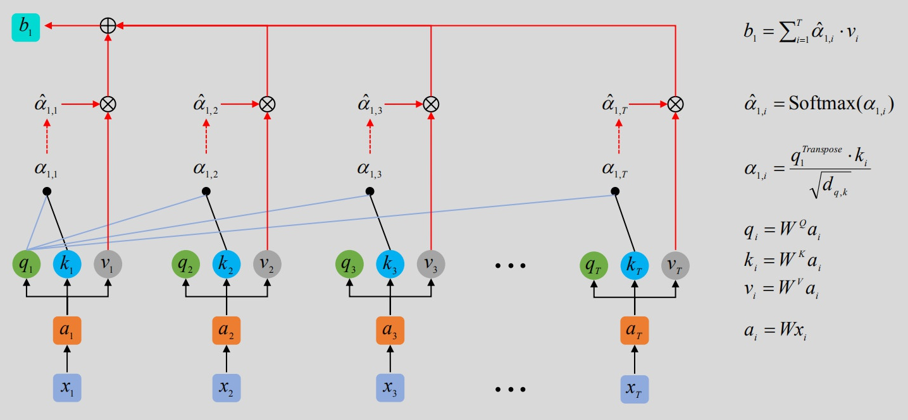
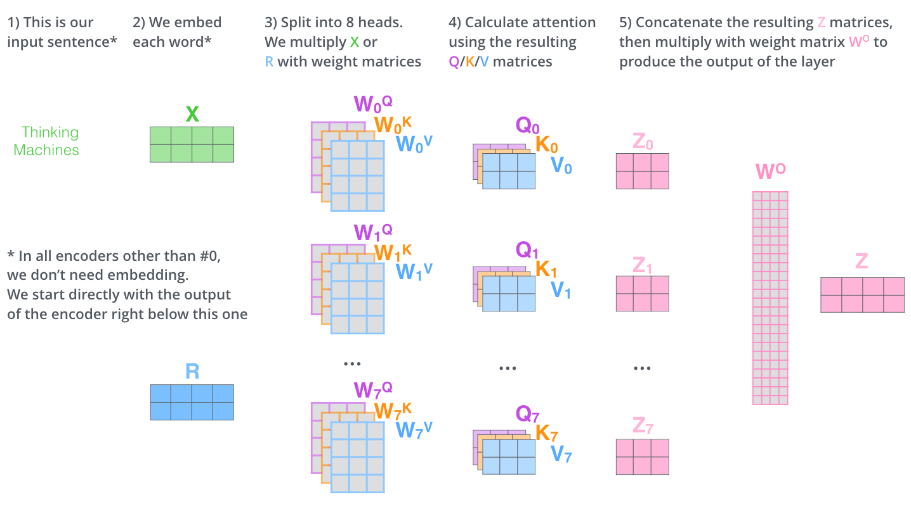

# Self Attention 解析

1. 将输入转为统一向量形式作为输入，如音频特征向量，单词嵌入向量等

2. 将输入序列 $[a_{1}, a_{2}, \cdots, a_T]$ 构成一个矩阵 $I$ ，每一个col（列）为原始的单数据向量。

3. 初始化三个矩阵 $W^{q/k/v}$，使用 $W$ 对 $I$ 进行加权运算得到三个矩阵 $Q$（所有数据序列的query向量（搜索特征）所构成的矩阵）、$K$（所有数据序列的key向量所构成的矩阵）、$V$（计算得到所有数据序列的value向量所构成的矩阵）

4. 由矩阵 $Q$ 和 $K$ 相乘计算出相关向量矩阵$A$（得到每一个输入向量与其他输入向量互相间的相关系数，越大代表越相似），其中 $A[i]$ 为每一个序列对应的搜索向量 $q_i$ 与其余所有数据序列的 key 向量（含自身）$k_i$ 运算得到的相关系数构成的向量。为了梯度的稳定，Transformer 又对 $A[i]$ 进行了相关系数归一化和 softmax 激活，得到 $A’$ 。
	1. 利用矩阵 $Q$ 中的 $q_{i}$ 分别与矩阵 $K$ 中的  $k_{1}, k_{2}, k_{3}, \cdots, k_{T}$ 计算向量点积，得到 $\alpha_{i,1}, \alpha_{i,2}, \alpha_{i,3}, \cdots, \alpha_{i, T} \quad$ (从数值上看， $\alpha_{i, j}$ 还不一定是0-1之间的数，还需经过softmax处理)；
	2. 将 $A = [\alpha_{i,1}, \alpha_{i,2}, \alpha_{i,3}, \cdots, \alpha_{i, T}]$ 输入 softmax 层，从而得到均在0-1之间的注意力权重值: $A’ = [\hat{\alpha_{i,1}}, \hat{\alpha_{i,2}}, \hat{\alpha_{i,3}},  \cdots, \hat{\alpha_{i,T}}]$ ；

5. 将矩阵 $V$ 与相关系数向量矩阵 $A’$ 相乘，因为$A'$ 在 softmax 层中，已经被转为了一种大小在$[0-1]$的权重系数，因此此运算相当于将从输入向量得到的 value 向量矩阵 $V$ 中的每个向量进行加权求和，最终得到新的嵌入向量矩阵。即将上一步得到的 $[\hat{\alpha_{i,1}}, \hat{\alpha_{i,2}}, \hat{\alpha_{i,3}},  \cdots, \hat{\alpha_{i,T}}]$ 分别与对应位置的 $[v_{1}, v_{2}, v_{3}, \cdots, v_{T}]$ 相乘，然后求和，这样便得到了与输入的 $x_{i}$ 所对应的输出 $b_{i}$ 。
	

# Multi-Head Attention 解析：

Multi-Head Attention 就是使用不同的 $Q$，$K$，$V$ 表示，然后使用上述操作，得到多个 $O$，最后再将其结果结合起来。具体操作过程中有多种多头结合方法，一是将多个 $O$ 拼接得到一个更大维度的嵌入向量，然后通过一个全连接层将其映射成想要的嵌入向量维度，通常这个维度与输入的维度一致；二是通过将 $Q$，$K$，$V$ 的输出维度定义成输入维度除以 Head 数目，这样最终就不需要全连接层做映射了。

[Attention机制详解（二）——Self-Attention与Transformer - 知乎 (zhihu.com)](https://zhuanlan.zhihu.com/p/47282410)
[Multi-headed Self-attention（多头自注意力）机制介绍 - 知乎 (zhihu.com)](https://zhuanlan.zhihu.com/p/365386753)
[The Illustrated Transformer – Jay Alammar – Visualizing machine learning one concept at a time. (jalammar.github.io)](https://jalammar.github.io/illustrated-transformer/)
