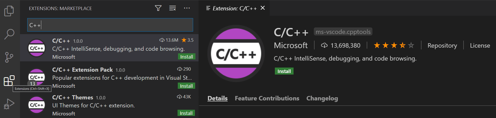
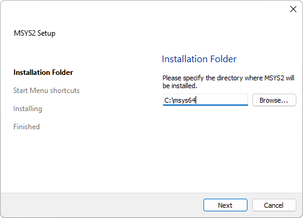
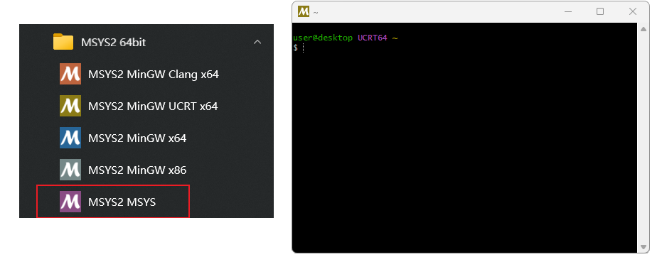
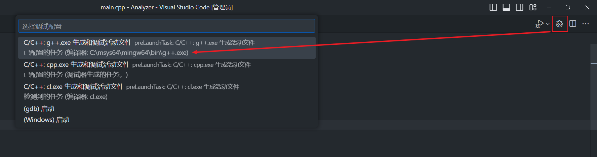
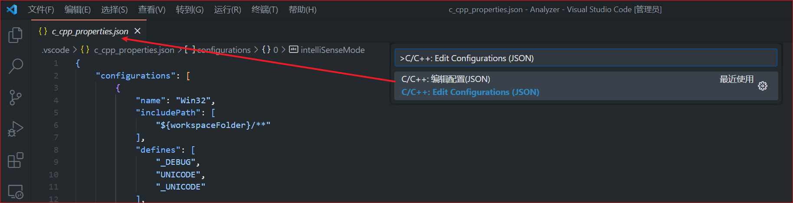
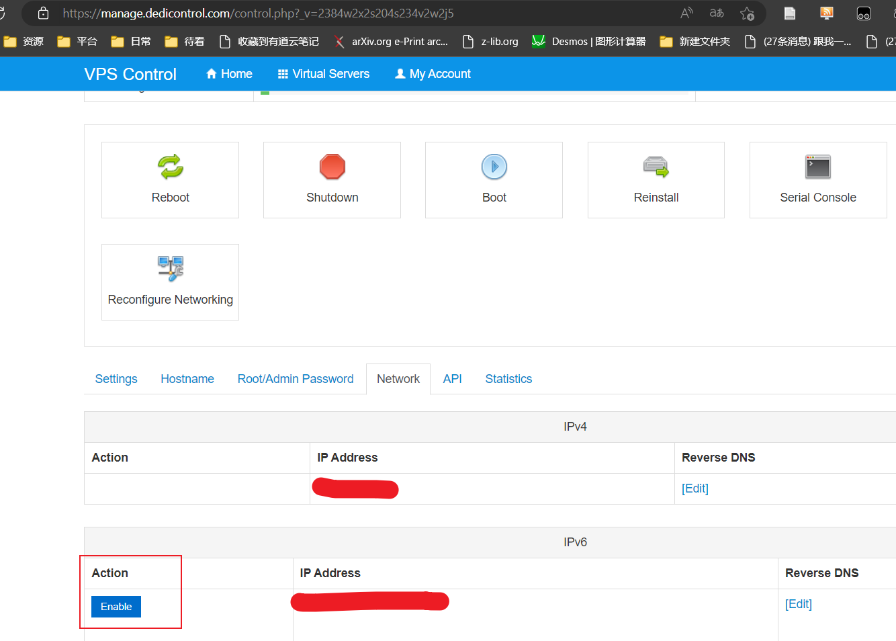
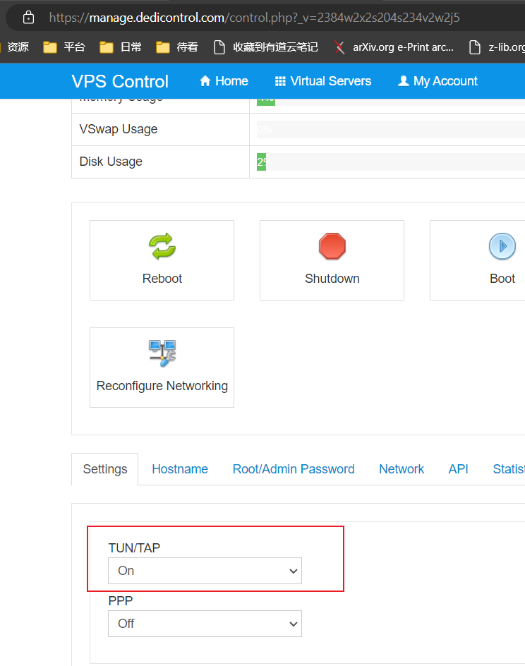

## 编译环境配置

C++

[Install gcc compiler on Windows with MSYS2 for C/C++ | DevDungeon](https://www.devdungeon.com/content/install-gcc-compiler-windows-msys2-cc)

[MSYS2使用教程（整理）——win10系统64位安装msys2最新版（msys2-x86_64-20190524.exe） - wdliming - 博客园 (cnblogs.com)](https://www.cnblogs.com/CodeWorkerLiMing/p/12274583.html)


[MSYS2](https://www.msys2.org/)

## 项目环境配置

### KEIL5

> 1）安装路径名中不能带中文，必须是英文路径名。
> 2）安装目录不能与51单片机的KEIL或者KEIL4冲突，三者目录必须分开。
> 3）KEIL5的安装比KEIL4多一个步骤，必须添加MCU库，不然没法使用。

1. [下载安装连接](https://www.keil.com/download/product/)
	

2. [安装STM32芯片包](http://www.keil.com/dd2/pack/)
	

#### 项目环境配置

#### 仿真器配置

配置Debug设备
配置Utilities
配置Debug Settings
选择目标板
下载程序

### 深度学习环境配置

#### 安装 Python 编译环境

#### 配置 conda

#### 配置第三方包

`conda create -n SCW3.9 python=3.9`

`pip install torch==1.8.1+cu101 torchvision==0.9.1+cu101 torchaudio==0.8.1 -f https://download.pytorch.org/whl/torch_stable.html`

`pip install audioread keras pandas redis redis opencv-python matplotlib scikit-learn  selenium==3.141.0 tqdm nvitop nlpaug librosa==0.9.2 decord g-mlp-pytorch opensmile==2.4.1 sklearn torchinfo pretrainedmodels transformers tensorboard area_attention pytorchvideo fairscale apex ava`

`conda install ffmpeg==4.0`

`pip install detectron2 -f https://dl.fbaipublicfiles.com/detectron2/wheels/cu101/torch1.8/index.html`

## C++ 环境配置(Windows+VSCode)

### 0. 先决条件

1. 安装 [Visual Studio Code](https://code.visualstudio.com/download)。
2. 安装 VS Code 的 C/C++ 扩展


### 1. 根据官网教程安装 [MSYS64](https://www.msys2.org/) 

- 下载[安装包](https://github.com/msys2/msys2-installer/releases))
- 运行安装程序, 需要注意的是 MSYS2 需要 64 位 Windows 8.1 或更高版本系统。
- 输入所需存放的安装文件夹


- 安装就绪后, 单机完成即可, 默认情况下会打开 linux 类型的终端窗口, 方便通过 `pacman` 指令安装所需要的工具. 未打开窗口, 可通过在开始菜单中查询以下程序打开.



- 更改软件管理工具 pacman 的下载镜像

```bash
sed -i "s#https\?://mirror.msys2.org/#https://mirrors.tuna.tsinghua.edu.cn/msys2/#g" /etc/pacman.d/mirrorlist*
```

### 2. 通过安装 MSYS2 环境必备工具

- 从服务器下载新的软件包数据库

```bash
pacman -Sy
```

- 升级系统及所有已经安装的软件

```bash
pacman -Syu
```

- 安装 Mingw-w64 中必备的工具链
```bash
# 安装  Mingw-w64 版本的 GCC 工具包(包含, git, gcc, gdb, make等工具)
pacman --needed -S mingw-w64-x86_64-toolchain
pacman --needed -S base-devel
# pacman --needed -S mingw-w64-clang-aarch64-toolchain mingw-w64-clang-i686-arm-none-eabi-toolchain mingw-w64-clang-i686-toolchain mingw-w64-clang-x86_64-arm-none-eabi-toolchain mingw-w64-clang-x86_64-toolchain mingw-w64-cross-clang-toolchain mingw-w64-i686-arm-none-eabi-toolchain mingw-w64-x86_64-arm-none-eabi-toolchain mingw-w64-x86_64-toolchain mingw-w64-i686-toolchain
# pacman --needed -S mingw-w64-x86_64-cmake mingw-w64-i686-cmake
```
- 将 Mingw-w64 文件夹的路径添加到 Windows 环境变量

```bash
SETX /M "Path" "%Path%;C:\msys64\ucrt64\bin"
```

- 检查 MinGW 安装状态

```bash
gcc --version
g++ --version
gdb --version
```

>[!cite]
> [使用msys2打造优雅的开发环境 - 飞鸿影 - 博客园 (cnblogs.com)](https://www.cnblogs.com/52fhy/p/15158765.html)

### 3. 自定义工作区配置

- 新建或打开一个工作区文件夹, 并接受工作区信任的弹出消息框.
```bash
mkdir projects
cd projects
mkdir helloworld
cd helloworld
code .
```
- 添加, 保存, 和打开一个源代码文件, 使其在屏幕展示, 成为活动文件

```c++
// 示例: `helloworld.cpp`
#include <iostream>
#include <vector>
#include <string>

using namespace std;

int main()
{
    vector<string> msg {"Hello", "C++", "World", "from", "VS Code", "and the C++ extension!"};

    for (const string& word : msg)
    {
        cout << word << " ";
    }
    cout << endl;
}

```
- 单击菜单栏的 `终端` , 通过 `配置默认生成任务` 自动生成一个 `tasks.json` 文件, 编译器选择安装好的 msys64 的 g++ 程序


- 单机活动文件右上角的齿轮按钮, 自动生成一个 `launch.json` 文件, 调试配置选择安装好的 msys64 的 g++ 程序



- 使用快捷键 `Ctrl+Shift+P` 打开 VSCode 的命令面板, 运行命令 `C/C++: Edit Configurations (JSON)` 自动生成一个 `c_cpp_properties.json` 文件



#### 通过 `launch.json` 配置 C/C++ 调试行为

```json
{
    "configurations": [
        {
            "name": "C/C++: g++.exe 生成和调试活动文件",
			// 额外的调试选项
			// "processId": , // 通过指定 processId 选项，调试器可以附加到一个正在运行的进程进行调试。
			"request": "launch", // `launch`: 启动一个新的调试会话，通常是通过运行程序来启动。`attach`: 附加到一个正在运行的进程进行调试。`disconnect`: 断开调试器和被调试进程之间的连接。`terminate`: 终止调试会话。`setBreakpoints`: 设置断点。`configurationDone`: 告诉调试器已完成配置。
			"type": "cppdbg", // cppvsdbg(Visual Studio 调试器) 或 cppdbg ( GDB或LLDB调试器 )
			// "sourceFileMap": ,
			
			// VSCode 行为控制
            "program": "${fileDirname}\\build\\${fileBasenameNoExtension}.exe", // 指定需要调试的程序的可执行文件路径
            // "symbolSearchPath": "C:\\Symbols;..." , // 可选参数, 指定 windows 调试器要搜索的符号文件(.pdb)所在的路径, 多个路径用分号隔开.
            // "requireExactSource": false, // 可选参数, 要求当前源代码与 pdb 匹配
            // "additionalSOLibSearchPath": "/Users/user/dir1;..." // 可选参数, 指定需要搜索的动态链接库文件(.so)所在的路径, 多个路径用分号隔开.
            // "avoidWindowsConsoleRedirection": false, // 默认会将控制台重定向命令添加到调试程序的参数中, 以使 Windows 上的 gdb 支持 VSCode 的集成终端, 将控制台输入和输出显示在集成终端中. 一般不需要更改设置.
            // "logging": { // 用于确定应将哪些类型的消息记录到调试控制台。
			    // "exceptions": true , // 用于确定是否应将异常消息记录到调试控制台。
			    // "moduleLoad": true, // 用于确定是否应将模块加载事件记录到调试控制台。
			    // "programOutput": true, // 用于确定是否应将程序输出记录到调试控制台。
			    // "engineLogging": false // 用于确定是否应将诊断引擎日志记录到调试控制台。
			    // "trace": false, // 用于确定是否应将诊断适配器命令跟踪记录到调试控制台。
			    // "traceResponse": false, // 用于确定是否应将诊断适配器命令和响应跟踪记录到调试控制台。
			// }
			// "visualizerFile": "*.natvis", // 指定调试时要使用的 `.natvis` 文件, 控制可视化类对象的定义视图, 一般不用设置.
			// "showDisplayString": , // 当 `visualizerFile` 参数指定后, 是否启用字符串显示, 启用会导致调试性能降低.
           "externalConsole": false, // 控制是否打开外部终端来启动调试, macOS 中似乎对集成终端有限制, 需要注意.
           
			// 程序运行设置
            "args": [], // 设置启动调试程序时, 要传递给程序的命令行参数, 其中转义字符需要双重转义.
            "cwd": "${fileDirname}", // 设置调试器启动的应用程序的工作目录, "${workspaceFolder}": 项目地址, "${fileDirname}": 文件地址
            "environment": [], // 要临时添加到程序环境中的环境变量.
           
            // 调试设置
            "MIMode": "gdb", // 指定要使用的调试器类型, `gdb`或`lldb`.
            "miDebuggerPath": "C:\\msys64\\mingw64\\bin\\gdb.exe", // 调试器的可执行文件路径
            // "miDebuggerArgs": [], // 控制调试器在启动时所使用的附加参数
			"stopAtEntry": false, // 控制调试器是否在程序入口处停止
			// "stopAtConnect": false, 控制调试器是否应在连接到目标程序后停止
            "setupCommands": [ // 控制调试器启动后, 连接到程序之前的调试环境命令
                {
                    "description": "为 gdb 启用整齐打印",
                    "text": "-enable-pretty-printing",
                    "ignoreFailures": true
                },
                {
                    "description": "将反汇编风格设置为 Intel",
                    "text": "-gdb-set disassembly-flavor intel",
                    "ignoreFailures": true
                }
            ],
            // "customLaunchSetupCommands":[], // 用于在使用自定义调试器时, 连接到程序之前的调试环境命令
            // "launchCompleteCommand": [], // 设置在调试器启动和初始化完成后要执行的命令
            // "symbolLoadInfo": {
	            // "loadAll": true, // 如果为真，将加载所有库的符号，否则将不加载任何 solib 符号。
	            // "exceptionList": "foo.so;bar.so" // 由分号分隔的文件名列表, 如果 LoadAll 为真，则不加载与列表中任何名称匹配的库的符号。否则只为匹配的库加载符号。
			// },


			// 设置调试系统上的转储文件(dump, 进程快照)
			// "dumpPath": , // 转储文件路径
			// "coreDumpPath": , // 核心转储文件
			
			// 使用本地或远程的调试服务
			// "miDebuggerServerAddress": "localhost:1234", // 要连接到以进行远程调试的调试器服务器的网络地址
			// "debugServerPath": , // 要启动的调试服务器的完整路径
			// "debugServerArgs": , // 调试器服务器的参数
			// "serverStarted": , // 要在调试服务器输出中查找的服务器启动模式。支持正则表达式
			// "filterStdout": true, // 如果设置为 true，则stdout在流中搜索服务器启动模式并将 stdout 记录到调试输出。
			// "filterStderr": true, // 如果设置为 true，则stderr在流中搜索服务器启动模式并记录 stderr 以调试输出。
			// "serverLaunchTimeout": 10000, // 调试器等待 debugServer 启动的时间（以毫秒为单位）。
			// "pipeTransport": , // 有关附加到远程进程的信息，例如调试 Docker 容器中的进程
			// "hardwareBreakpoints": , // 如果提供，这将显式控制远程目标的硬件断点行为。
			
            "preLaunchTask": "C/C++: g++.exe 生成活动文件"
        }
    ],
    "version": "2.0.0"
}
```

#### 通过 `tasks.json` 配置编译生成行为任务

对于一些自动化工具, 如编译工具 TypeScript、 ESLint、TSLint、Make、Ant、Gulp、Jake、Rake 和 MSBuild 等, 能通过命令行运行, 并自动执行检查、构建、打包、测试或部署软件系统等任务。为了方便 VSCode 执行这些任务, 而不需要额外的命令行操作, 可以通过在终端菜单栏单击 `Configure Tasks/配置任务` 选择适合的模板文件来生成 `tasks.json` , 并自定义相关任务. 当需要运行任务时, 可以通过在终端菜单栏单击 `run task/运行任务` 或 命令面板( `Ctrl+Shift+P` ) 访问任务命令, 选择对应的任务名字即可.

```json
{
    "version": "2.0.0",
    "tasks": [
        {
            "label": "C/C++: g++.exe 生成活动文件", // 在 VScode 界面中所显示的当前任务的名字
            "type": "cppbuild", // 设置任务的类型, 如 shell, process, cppbuild, npm 等
            "command": "C:\\msys64\\mingw64\\bin\\g++.exe", // 当前任务实际要执行的程序
            "args": [ // 程序运行所需的参数
                "-fdiagnostics-color=always",
                "-g",
                "${file}",
                "-o",
                "${fileDirname}\\${fileBasenameNoExtension}.exe",
                "-static-libgcc",
                "-std=c++23"
            ],
            // "windows": { // 配置 Windows 系统中对应的特定属性, 拥有覆盖默认属性
            //     "options": {
            //         "env": {
            //             "PATH": "C:\\msys64\\mingw64\\bin"
            //         }
            //     }
            // }, 
            "group": { // 配置任务的组属性
                "kind": "build", // 将当前任务归属于生成任务类型, 
                "isDefault": true // 配置为默认生成任务, 这样就可以通过任务组的快捷键默认直接运行此任务了
            },
            // "presentation": { //  定义任务输出在用户界面中的处理方式。
            //    "reveal": "always"
            //},
            "options": { // 修改环境中一些参数的默认值, 如 `cwd` ：、、
                "cwd": "${fileDirname}", // 修改当前工作目录
                // `env`: { // 修改指定的环境变量
			    //    "PATH": "C:\\msys64\\mingw64\\bin"
		        // },
                // `shell`: "",// 修改 shell 的默认值
            },
            // "runOptions": , // 定义任务运行的时间和方式
            "problemMatcher": [ // 
                "$gcc"
            ],

            "detail": "编译器: C:\\msys64\\mingw64\\bin\\g++.exe" // 
        },
    ]
}
```

#### 通过 `c_cpp_properties.json` 配置当前项目环境 

```json
{

    "configurations": [

        {

            "name": "Win32",

            "includePath": [

                "${workspaceFolder}/**"

            ],

            "defines": [

                "_DEBUG",

                "UNICODE",

                "_UNICODE"

            ],

            "cStandard": "c23",

            "cppStandard": "c++23",

            "compilerPath": "C:\\msys64\\mingw64\\bin\\g++.exe",

            "windowsSdkVersion": "10.0.19041.0",

            "intelliSenseMode": "gcc-x64"

        }

    ],

    "version": 4

}

```

### Cmake 配置

`c_cpp_properties.json` 配置 `configurationProvider` , 让 Cmake Tools 插件根据 CMakeLists.txt 的配置来指定 C/C++的代码环境

```json
"configurationProvider": "ms-vscode.cmake-tools"
```

## 服务器代理环境设置

### 服务器购买和域名注册

### 先决问题解决

- 服务器 IPv6 不能用, 导致的部分网址 DNS 解析后无法访问的问题

如: Connecting to raw.githubusercontent.com :443... failed: Connection refused 问题

解决方法 1: 关闭服务器 IPv6 地址




解决方法 2: 修改 hosts 文件 (问题解决不彻底, 这样需要每个出错的网站都设置一遍, 不方便), 强制解析到 IPv4 类型地址

```bash
sudo vi /etc/hosts

# 添加以下内容(网址对应的 IPv4 类型的 ip 在 https://www.ipaddress.com/ 处获得)
185.199.108.133 raw.githubusercontent.com
```
解决方法 3: 禁用 IPv6(问题解决不彻底, 在脚本检测到你支持 IPV 6 时, 会帮你重新打开, 出现问题)

```bash
vim /etc/sysctl.conf

# 添加以下内容
net.ipv6.conf.all.disable_ipv6 = 1
net.ipv6.conf.default.disable_ipv6 = 1
net.ipv6.conf.lo.disable_ipv6 = 1
```

- 未知安装问题

开启服务器的 TUN/TAP



- 启动 chrony 服务失败 

解决方法: 更换系统到更新的版本(如 Ubuntu 20.04), 或者更新系统内核(便宜的 vps 不支持更换内核)


- 80 端口占用问题

解决方法: 卸载预装的 web 服务(如 apache2)

```bash
lsof -i:80
netstat -tunlp | grep 80

# 停止和卸载服务, 以 apache2 举例
service apache2 stop
# 卸载相关服务
sudo apt-get --purge remove apache2
sudo apt-get --purge remove apache2.2-common
sudo apt-get autoremove
# 删除残留配置文件
sudo find /etc -name "*apache*" -exec rm -rf {} \;
```

### 安装环境(Dedipath+V2Ray+Vmess+websocket+TLS+Nginx+Website+warp-go)

更新 apt 的下载源

```bash
apt-get update
```

使用脚本一键式安装 V2ray 服务(这里使用的 Vmess+websocket+TLS+Nginx+Website 组合类型服务)

```bash
wget --no-check-certificate -O install.sh "https://raw.githubusercontent.com/wulabing/V2Ray_ws-tls_bash_onekey/master/install.sh" && chmod +x install.sh

bash install.sh
# 打开bbr加速设置
11
# 启用bbr加速
11
# 重启系统
reboot

bash install.sh

# 选择要安装的服务类型(V2Ray (Nginx+ws+tls))
1
# 软件安装确认(可能无此选项)
Y
# 确认时间准确
Y
# 输入域名地址
域名地址 # free.charvin.top
# 选择代理服务端口
443
# 选择生成的链接种类
1
# 选择支持的 TLS 版本
3

# 启动 V2ray：`systemctl start v2ray`
# 停止 V2ray：`systemctl stop v2ray`
# 启动 Nginx：`systemctl start nginx`
# 停止 Nginx：`systemctl stop nginx`
# systemctl status v2ray
# systemctl disable v2ray #关闭服务自启
# systemctl enable v2ray #开启服务自启
# Web 目录：`/home/wwwroot/3DCEList`
# V2ray 服务端配置：`/etc/v2ray/config.json`
# V2ray 客户端配置: `~/v2ray_info.inf`
# Nginx 目录： `/etc/nginx`
# 证书文件: `/data/v2ray.key 和 /data/v2ray.crt` 请注意证书权限设置

```
为域名添加 DNS 解析([Cloudflare](https://dash.cloudflare.com/)), 同时把 SSL/TLS 加密方式设置为“完全(full)”。


使用脚本一键安装 [warp](https://github.com/fscarmen/warp/blob/main/README.md#warp-go-%E8%BF%90%E8%A1%8C%E8%84%9A%E6%9C%AC), 开启非全局模式, 只让部分网站通过 WARP 伪装

```bash
wget -N https://raw.githubusercontent.com/fscarmen/warp/main/warp-go.sh && bash warp-go.sh
# 选择语言
2
# IPv4 非全局
7
# 选择账户
3

# 选择可以访问 奈飞的 IP
nohup warp-go i > ./warpv4.log 2>&1
1
# 选择 IP 地区
US
# 测试是否成功
ctrl+z
bg
nohup warp-go i > ./warpv6.log 2>&1
2
# 选择 IP 地区
US
bg
```

配置 v2ray 的参数文件, 实现网络分流, 使得指定网络通过 warp 进一步伪装访问
```bash
apt install vim
Y
vim /etc/v2ray/config.json
# 添加出站配置
  "outbounds": [
.
.
.,
	{
		"tag":"warpOut",
		"protocol":"freedom",
		"settings":{
			"domainStrategy":"UseIPv4"
		},
	   "sendThrough":"172.16.0.2"
	 }
  ],

# 修改数据通信路由配置(防止原有规则最前面)
"rules": [
   {
	"type":"field",
	"outboundTag":"warpOut",
	"domain":[
		"geosite:netflix",
		"domain:ip.gs",
		"domain:openai.com",
		"domain:ai.com"
		]
   },
   .
   .
   .


# 重启 v2ray
systemctl start v2ray
```

客户端导入 VPN 信息链接

### 安装环境(virmach+shadowsocks+WS+TLS+CDN+warp-go)

更新 apt 的下载源

```bash
apt-get update
```


处理后面脚本 mbedtls 源无法使用问题

```bash
apt-get install git
apt-get install build-essential
apt-get install gcc
apt install python-minimal

wget -qO- bench.sh | bash

wget -qO- --no-check-certificate https://raw.githubusercontent.com/oooldking/script/master/superbench.sh | bash


git clone https://github.com/Mbed-TLS/mbedtls.git

cd mbedtls

git checkout mbedtls-2.16.5
make SHARED=1 CFLAGS=-fPIC
make DESTDIR=/usr install
ldconfig
cd ..
```


使用脚本一键式安装 V2ray 服务(这里使用的 shadowsocks+WS+TLS+CDN 组合类型服务)

```bash
## CentOS 7/8
wget -O centos-ss-install.sh https://github.com/M3chD09/shadowsocks-with-v2ray-plugin-install/raw/master/centos-ss-install.sh
chmod +x centos-ss-install.sh
./centos-ss-install.sh

## Ubuntu 18.04/16.04 or Debian 9/10
wget -O ubuntu-ss-install.sh https://github.com/M3chD09/shadowsocks-with-v2ray-plugin-install/raw/master/ubuntu-ss-install.sh
chmod +x ubuntu-ss-install.sh
./ubuntu-ss-install.sh

1

password

解析到此服务器的域名

# 安装完成

# Congratulations, Shadowsocks-libev server install completed
# Your Server IP        :  ****
# Your Server Port      :  443
# Your Password         :  ****
# Your Encryption Method:  aes-256-gcm
# Your Plugin           :  v2ray-plugin
# Your Plugin options   :  tls;host=****
# Enjoy it!

# 服务控制命令如下
# systemctl status shadowsocks #运行状态
# systemctl start shadowsocks #启动
# systemctl stop shadowsocks #停止
# systemctl disable shadowsocks #关闭服务自启

```

为域名添加 DNS 解析([Cloudflare](https://dash.cloudflare.com/)), 同时把 SSL/TLS 加密方式设置为“完全(full)”。


使用脚本一键安装 [warp](https://github.com/fscarmen/warp/blob/main/README.md#warp-go-%E8%BF%90%E8%A1%8C%E8%84%9A%E6%9C%AC), 开启非全局模式, 只让部分网站通过 WARP 伪装

```bash
wget -N https://raw.githubusercontent.com/fscarmen/warp/main/warp-go.sh && bash warp-go.sh
# 选择语言
2
# IPv4 非全局
5
# 选择账户
3

# 选择可以访问 奈飞的 IP
nohup warp-go i && 1 && US & 
nohup warp-go i && 2 && US & 

# 测试是否成功
warp-go g
curl chat.openai.com
```


```
apt install ntpdate
ntpdate time.apple.com
```
客户端添加 VPN 服务器信息和插件信息

> [!cite]
> [wulabing/V2Ray_ws-tls_bash_onekey](https://github.com/wulabing/V2Ray_ws-tls_bash_onekey)
> [V2Ray 白话文教程](https://selierlin.github.io/v2ray/prep/json.html)
