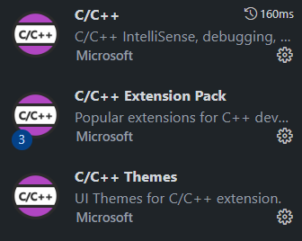
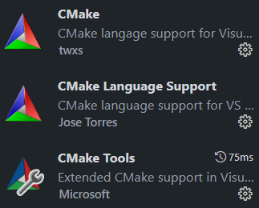
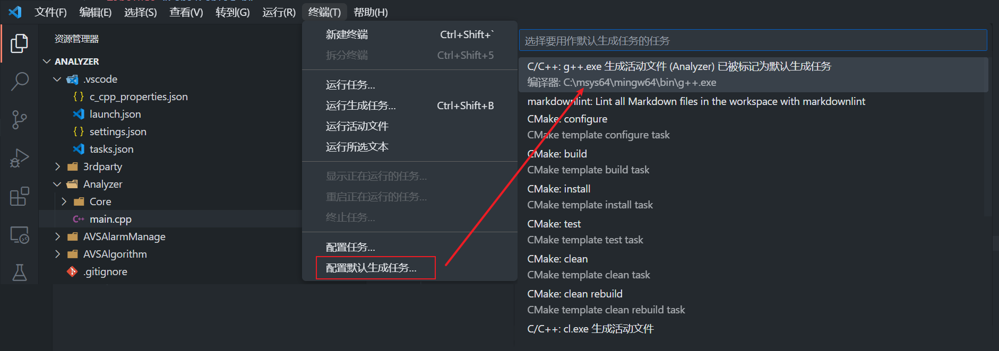
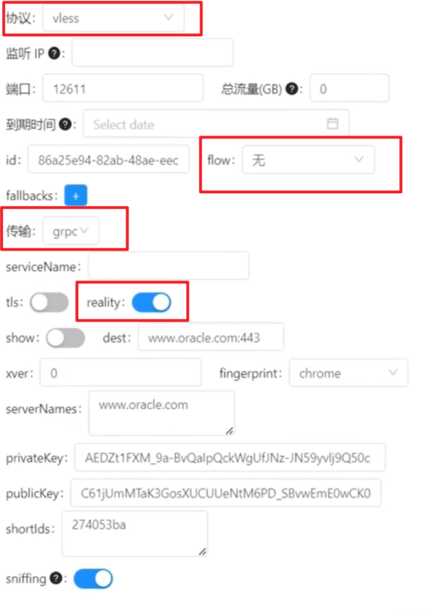
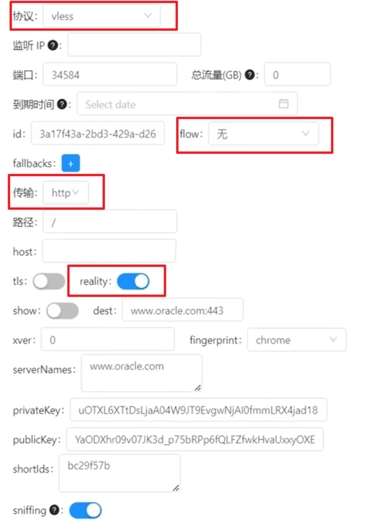

## 编译环境配置

C++

[Install gcc compiler on Windows with MSYS2 for C/C++ | DevDungeon](https://www.devdungeon.com/content/install-gcc-compiler-windows-msys2-cc)

[MSYS2使用教程（整理）——win10系统64位安装msys2最新版（msys2-x86_64-20190524.exe） - wdliming - 博客园 (cnblogs.com)](https://www.cnblogs.com/CodeWorkerLiMing/p/12274583.html)


[MSYS2](https://www.msys2.org/)

## 项目环境配置

### KEIL5

> 1）安装路径名中不能带中文，必须是英文路径名。
> 2）安装目录不能与51单片机的KEIL或者KEIL4冲突，三者目录必须分开。
> 3）KEIL5的安装比KEIL4多一个步骤，必须添加MCU库，不然没法使用。

1. [下载安装连接](https://www.keil.com/download/product/)
	

2. [安装STM32芯片包](http://www.keil.com/dd2/pack/)
	

#### 项目环境配置

#### 仿真器配置

配置Debug设备
配置Utilities
配置Debug Settings
选择目标板
下载程序

### 深度学习环境配置

#### 安装 Python 编译环境

#### 配置 conda

#### 配置第三方包

`conda create -n SCW3.9 python=3.9`

`conda activate SCW3.9`

`pip install torch==1.8.1+cu101 torchvision==0.9.1+cu101 torchaudio==0.8.1 -f https://download.pytorch.org/whl/torch_stable.html`

`pip install audioread keras pandas redis redis opencv-python matplotlib scikit-learn  selenium==3.141.0 tqdm nvitop nlpaug librosa==0.9.2 decord g-mlp-pytorch opensmile==2.4.1 torchinfo pretrainedmodels transformers tensorboard area_attention pytorchvideo fairscale ava`

`conda install apex ffmpeg==4.0`

`python -m pip install detectron2 -f https://dl.fbaipublicfiles.com/detectron2/wheels/cu101/torch1.8/index.html`

`pip install timm`
-
``
$$\begin{align*}
\text{Linear}(x) &= Wx + b \\
\text{Softmax}(x_i) &= \frac{e^{x_i}}{\sum_{j} e^{x_j}} \\
D_{KL}(P || Q) &= \sum_{i} P(i) \log\left(\frac{P(i)}{Q(i)}\right) \\
\text{sim\_loss} &= \frac{1}{2} \left( D_{KL}(\text{Softmax}(W_{common} \cdot \text{common\_feature} + b_{common}) || \text{Softmax}(W_{af} \cdot \text{af\_fea} + b_{af})) \right. \\
&\quad \left. + D_{KL}(\text{Softmax}(W_{common} \cdot \text{common\_feature} + b_{common}) || \text{Softmax}(W_{vf} \cdot \text{vf\_fea} + b_{vf})) \right)
\end{align*}
$$

## C++ 项目开发配置

### Windows 环境配置 (msys64 + cmake + vcpkg)

#### 1. 安装 [MSYS64](https://www.msys2.org/) 和管理项目开发工具

- 下载[安装包](https://github.com/msys2/msys2-installer/releases))
- 运行安装程序, 需要注意的是 MSYS2 需要 64 位 Windows 8.1 或更高版本系统。
- 输入所需存放的安装文件夹


- 安装就绪后, 单机完成即可, 默认情况下会打开 linux 类型的终端窗口, 方便通过 `pacman` 指令安装所需要的工具. 未打开窗口, 可通过在开始菜单中查询以下程序打开.


- 更改软件管理工具 pacman 的下载镜像

```bash
sed -i "s#https\?://mirror.msys2.org/#https://mirrors.tuna.tsinghua.edu.cn/msys2/#g" /etc/pacman.d/mirrorlist*
```

- 从服务器下载新的软件包数据库

```bash
pacman -Sy
```

- 升级系统及所有已经安装的软件

```bash
pacman -Syu
```

- 安装 Mingw-w64 中必备的工具链
```bash
# 安装  Mingw-w64 版本的 GCC 工具包(包含, git, gcc, gdb, make, cmake等工具)
pacman --needed -S mingw-w64-x86_64-toolchain
pacman --needed -S base-devel
# 其他的工具链还有 (非必需, 按照项目类型按需安装)
# mingw-w64-i686-toolchain
# mingw-w64-i686-arm-none-eabi-toolchain
# mingw-w64-x86_64-arm-none-eabi-toolchain
# mingw-w64-clang-x86_64-toolchain
# mingw-w64-clang-i686-toolchain
# mingw-w64-cross-clang-toolchain
# mingw-w64-clang-aarch64-toolchain
# mingw-w64-clang-i686-arm-none-eabi-toolchain
# mingw-w64-clang-x86_64-arm-none-eabi-toolchain
```
- 将 Mingw-w64 文件夹的路径添加到 Windows 环境变量

```bash
SETX /M "Path" "%Path%;D:\msys64\mingw64\bin"
```

- 检查 MinGW 安装状态

```bash
gcc --version
g++ --version
gdb --version
```

>[!cite]
> [使用msys2打造优雅的开发环境 - 飞鸿影 - 博客园 (cnblogs.com)](https://www.cnblogs.com/52fhy/p/15158765.html)

#### 2. 安装 vckpg 管理项目依赖库

```bash
# 先 WIN + R 输入 cmd, 然后用 CTRL + SHIFT + ENTER 以管理员方式打开 cmd
cd /d d: && mkdir dev && cd dev
git clone https://github.com/microsoft/vcpkg.git
.\vcpkg\bootstrap-vcpkg.bat

# 添加环境变量 PATH = PATH + "d:\dev\vcpkg"
SETX /M "VCPKG_ROOT" "d:\dev\vcpkg"
SETX /M "Path" "%Path%;d:\dev\vcpkg"

# vcpkg 常用命令, 按需使用
# vcpkg help triplets
# vcpkg install ... --triplet=x64-windows|
# vcpkg search ...
# --clean-after-build # 生成每个包后清理生成树、包和下载
# --head # 使用可用的最新版本
# --only-downloads # 不进行生成, 只下载所需资源
# --only-binarycaching # 不进行生成, 直接下载二进制缓存

```

> [!cite]
> [C++开源库 - 包管理工具Vcpkg安装使用](https://www.cnblogs.com/linuxAndMcu/p/14696542.html)

### Linux 环境配置 (cmake + vcpkg)

#### 1. 安装必要的开发环境

```
# Debian, Ubuntu, popOS
sudo apt-get update
sudo apt-get install build-essential tar curl zip unzip autoconf autoconf-archive
# CentOS
sudo yum install centos-release-scl
sudo yum install devtoolset-7
scl enable devtoolset-7 bash
# macOS
xcode-select --install
```

#### 2. 安装 vckpg 管理项目依赖库

```bash
# cmd
cd ~/ && mkdir dev && cd dev

git clone https://github.com/microsoft/vcpkg.git
.\vcpkg\bootstrap-vcpkg.bat

# 添加环境变量 ~/.bashrc 文件中添加
echo 'export VCPKG_ROOT=~/dev/vcpkg' >> ~/.bashrc
echo 'export PATH=$VCPKG_ROOT:$PATH' >> ~/.bashrc

# vcpkg 常用命令, 按需使用
# vcpkg help triplets
# vcpkg install ... --triplet=x64-windows|
# vcpkg search ...
# --clean-after-build # 生成每个包后清理生成树、包和下载
# --head # 使用可用的最新版本
# --only-downloads # 不进行生成, 只下载所需资源
# --only-binarycaching # 不进行生成, 直接下载二进制缓存

```

## IDE 配置 (Visual Studio Code )

### 软件和插件安装

1. 安装 [Visual Studio Code](https://code.visualstudio.com/download)。
2. 安装 VS Code 的 C/C++ 扩展和 cmake 扩展




### 单文件运行和调试配置

- 新建文件夹，并通过 vscode 打开, 并接受工作区信任的弹出消息框.
- 添加, 保存, 和打开一个源代码文件 `helloworld.cpp` , 使其在屏幕展示, 成为活动文件。文件示例内容如下：

```c++
// 示例: `helloworld.cpp`
#include <iostream>
#include <vector>
#include <string>

using namespace std;

int main()
{
    vector<string> msg {"Hello", "C++", "World", "from", "VS Code", "and the C++ extension!"};

    for (const string& word : msg)
    {
        cout << word << " ";
    }
    cout << endl;
}

```
- 单击菜单栏的 `终端` , 通过 `配置默认生成任务` 自动生成一个 `tasks.json` 文件, 编译器选择安装好的 msys64 的 g++ 程序




- 单机活动文件右上角的齿轮按钮, 自动生成一个 `launch.json` 文件, 调试配置选择安装好的 msys64 的 g++ 程序


- 使用快捷键 `Ctrl+Shift+P` 打开 VSCode 的命令面板, 运行命令 `C/C++: Edit Configurations (JSON)` 自动生成一个 `c_cpp_properties.json` 文件


##### 通过 `launch.json` 配置 vscode 的 C/C++ 调试行为

```json
{
    "configurations": [
        {
            "name": "C/C++: g++.exe 生成和调试活动文件",
			// 额外的调试选项
			// "processId": , // 通过指定 processId 选项，调试器可以附加到一个正在运行的进程进行调试。
			"request": "launch", // `launch`: 启动一个新的调试会话，通常是通过运行程序来启动。`attach`: 附加到一个正在运行的进程进行调试。`disconnect`: 断开调试器和被调试进程之间的连接。`terminate`: 终止调试会话。`setBreakpoints`: 设置断点。`configurationDone`: 告诉调试器已完成配置。
			"type": "cppdbg", // cppvsdbg(Visual Studio 调试器) 或 cppdbg ( GDB或LLDB调试器 )
			// "sourceFileMap": ,
			
			// VSCode 行为控制
            "program": "${fileDirname}\\build\\${fileBasenameNoExtension}.exe", // 指定需要调试的程序的可执行文件路径
            // "symbolSearchPath": "C:\\Symbols;..." , // 可选参数, 指定 windows 调试器要搜索的符号文件(.pdb)所在的路径, 多个路径用分号隔开.
            // "requireExactSource": false, // 可选参数, 要求当前源代码与 pdb 匹配
            // "additionalSOLibSearchPath": "/Users/user/dir1;..." // 可选参数, 指定需要搜索的动态链接库文件(.so)所在的路径, 多个路径用分号隔开.
            // "avoidWindowsConsoleRedirection": false, // 默认会将控制台重定向命令添加到调试程序的参数中, 以使 Windows 上的 gdb 支持 VSCode 的集成终端, 将控制台输入和输出显示在集成终端中. 一般不需要更改设置.
            // "logging": { // 用于确定应将哪些类型的消息记录到调试控制台。
			    // "exceptions": true , // 用于确定是否应将异常消息记录到调试控制台。
			    // "moduleLoad": true, // 用于确定是否应将模块加载事件记录到调试控制台。
			    // "programOutput": true, // 用于确定是否应将程序输出记录到调试控制台。
			    // "engineLogging": false // 用于确定是否应将诊断引擎日志记录到调试控制台。
			    // "trace": false, // 用于确定是否应将诊断适配器命令跟踪记录到调试控制台。
			    // "traceResponse": false, // 用于确定是否应将诊断适配器命令和响应跟踪记录到调试控制台。
			// }
			// "visualizerFile": "*.natvis", // 指定调试时要使用的 `.natvis` 文件, 控制可视化类对象的定义视图, 一般不用设置.
			// "showDisplayString": , // 当 `visualizerFile` 参数指定后, 是否启用字符串显示, 启用会导致调试性能降低.
           "externalConsole": false, // 控制是否打开外部终端来启动调试, macOS 中似乎对集成终端有限制, 需要注意.
           
			// 程序运行设置
            "args": [], // 设置启动调试程序时, 要传递给程序的命令行参数, 其中转义字符需要双重转义.
            "cwd": "${fileDirname}", // 设置调试器启动的应用程序的工作目录, "${workspaceFolder}": 项目地址, "${fileDirname}": 文件地址
            "environment": [], // 要临时添加到程序环境中的环境变量.
           
            // 调试设置
            "MIMode": "gdb", // 指定要使用的调试器类型, `gdb`或`lldb`.
            "miDebuggerPath": "C:\\msys64\\mingw64\\bin\\gdb.exe", // 调试器的可执行文件路径
            // "miDebuggerArgs": [], // 控制调试器在启动时所使用的附加参数
			"stopAtEntry": false, // 控制调试器是否在程序入口处停止
			// "stopAtConnect": false, 控制调试器是否应在连接到目标程序后停止
            "setupCommands": [ // 控制调试器启动后, 连接到程序之前的调试环境命令
                {
                    "description": "为 gdb 启用整齐打印",
                    "text": "-enable-pretty-printing",
                    "ignoreFailures": true
                },
                {
                    "description": "将反汇编风格设置为 Intel",
                    "text": "-gdb-set disassembly-flavor intel",
                    "ignoreFailures": true
                }
            ],
            // "customLaunchSetupCommands":[], // 用于在使用自定义调试器时, 连接到程序之前的调试环境命令
            // "launchCompleteCommand": [], // 设置在调试器启动和初始化完成后要执行的命令
            // "symbolLoadInfo": {
	            // "loadAll": true, // 如果为真，将加载所有库的符号，否则将不加载任何 solib 符号。
	            // "exceptionList": "foo.so;bar.so" // 由分号分隔的文件名列表, 如果 LoadAll 为真，则不加载与列表中任何名称匹配的库的符号。否则只为匹配的库加载符号。
			// },


			// 设置调试系统上的转储文件(dump, 进程快照)
			// "dumpPath": , // 转储文件路径
			// "coreDumpPath": , // 核心转储文件
			
			// 使用本地或远程的调试服务
			// "miDebuggerServerAddress": "localhost:1234", // 要连接到以进行远程调试的调试器服务器的网络地址
			// "debugServerPath": , // 要启动的调试服务器的完整路径
			// "debugServerArgs": , // 调试器服务器的参数
			// "serverStarted": , // 要在调试服务器输出中查找的服务器启动模式。支持正则表达式
			// "filterStdout": true, // 如果设置为 true，则stdout在流中搜索服务器启动模式并将 stdout 记录到调试输出。
			// "filterStderr": true, // 如果设置为 true，则stderr在流中搜索服务器启动模式并记录 stderr 以调试输出。
			// "serverLaunchTimeout": 10000, // 调试器等待 debugServer 启动的时间（以毫秒为单位）。
			// "pipeTransport": , // 有关附加到远程进程的信息，例如调试 Docker 容器中的进程
			// "hardwareBreakpoints": , // 如果提供，这将显式控制远程目标的硬件断点行为。
			
            "preLaunchTask": "C/C++: g++.exe 生成活动文件"
        }
    ],
    "version": "2.0.0"
}
```

##### 通过 `tasks.json` 配置 vscode 的编译生成行为任务

对于一些自动化工具, 如编译工具 TypeScript、 ESLint、TSLint、Make、Ant、Gulp、Jake、Rake 和 MSBuild 等, 能通过命令行运行, 并自动执行检查、构建、打包、测试或部署软件系统等任务。为了方便 VSCode 执行这些任务, 而不需要额外的命令行操作, 可以通过在终端菜单栏单击 `Configure Tasks/配置任务` 选择适合的模板文件来生成 `tasks.json` , 并自定义相关任务. 当需要运行任务时, 可以通过在终端菜单栏单击 `run task/运行任务` 或 命令面板( `Ctrl+Shift+P` ) 访问任务命令, 选择对应的任务名字即可.

```json
{
    "version": "2.0.0",
    "tasks": [
        {
            "label": "C/C++: g++.exe 生成活动文件", // 在 VScode 界面中所显示的当前任务的名字
            "type": "cppbuild", // 设置任务的类型, 如 shell, process, cppbuild, npm 等
            "command": "C:\\msys64\\mingw64\\bin\\g++.exe", // 当前任务实际要执行的程序
            "args": [ // 程序运行所需的参数
                "-fdiagnostics-color=always",
                "-g",
                "${file}",
                "-o",
                "${fileDirname}\\${fileBasenameNoExtension}.exe",
                "-static-libgcc",
                "-std=c++23"
            ],
            // "windows": { // 配置 Windows 系统中对应的特定属性, 拥有覆盖默认属性
            //     "options": {
            //         "env": {
            //             "PATH": "C:\\msys64\\mingw64\\bin"
            //         }
            //     }
            // }, 
            "group": { // 配置任务的组属性
                "kind": "build", // 将当前任务归属于生成任务类型, 
                "isDefault": true // 配置为默认生成任务, 这样就可以通过任务组的快捷键默认直接运行此任务了
            },
            // "presentation": { //  定义任务输出在用户界面中的处理方式。
            //    "reveal": "always"
            //},
            "options": { // 修改环境中一些参数的默认值, 如 `cwd` ：、、
                "cwd": "${fileDirname}", // 修改当前工作目录
                // `env`: { // 修改指定的环境变量
			    //    "PATH": "C:\\msys64\\mingw64\\bin"
		        // },
                // `shell`: "",// 修改 shell 的默认值
            },
            // "runOptions": , // 定义任务运行的时间和方式
            "problemMatcher": [ // 
                "$gcc"
            ],

            "detail": "编译器: C:\\msys64\\mingw64\\bin\\g++.exe" // 
        },
    ]
}
```

##### 通过 `c_cpp_properties.json` 配置 vscode 的当前项目环境配置

```json
{

    "configurations": [

        {

            "name": "Win32",

            "includePath": [

                "${workspaceFolder}/**"

            ],

            "defines": [

                "_DEBUG",

                "UNICODE",

                "_UNICODE"

            ],

            "cStandard": "c23",

            "cppStandard": "c++23",

            "compilerPath": "C:\\msys64\\mingw64\\bin\\g++.exe",

            "windowsSdkVersion": "10.0.19041.0",

            "intelliSenseMode": "gcc-x64"

        }

    ],

    "version": 4

}

```

### 复杂项目运行和调试配置

#### 新建文件夹作为项目目录

#### 通过 vcpkg 的清单模式为当前项目单独添加依赖库和项目文件

1. 创建 vcpkg 的依赖项清单文件 `vcpkg.json` 和默认配置文件 `vcpkg-configuration.json`
```
vcpkg new --application
```
2. 修改 `vcpkg.json` 文件
```json
{
  "$schema": "https://raw.githubusercontent.com/microsoft/vcpkg-tool/main/docs/vcpkg.schema.json",
  "dependencies": [
    "boost-system",
    {
      "name": "cpprestsdk",
      "default-features": false
    },
{ "name": "arrow", "default-features": false, "features": [ "json", { "name": "mimalloc", "platform": "windows" } ] },
    "libxml2",
    "yajl"
  ]
}
```
- `"$schema"` 为支持的 IDE 提供语法检查功能的模式参考文件
- `dependencies` 提供依赖项列表, 列表内元素可以是依赖库的名字，也可以是具有更加细致要求的依赖库字典，包含 `name` , `default-features` , `features` , 等设置。
	- `name` : 项目名
	- `default-features`: 
	- `features` : 依赖项目提供的可选功能


这是清单文件。 vcpkg 读取清单文件，以了解要安装和与 CMake 集成的依赖项，从而提供项目所需的依赖项。
    
    默认 `vcpkg-configuration.json` 文件引入了[基线](https://learn.microsoft.com/zh-cn/vcpkg/reference/vcpkg-configuration-json#registry-baseline)约束，指定项目应使用的依赖项的最低版本。 修改此文件超出了本教程的范围，但这在定义项目依赖项的版本约束方面起着重要作用。 因此，尽管这对于本教程来说并不是必要的，但建议将 `vcpkg-configuration.json` 添加到源代码管理，以确保不同开发环境中的版本一致性。

## 服务器代理环境设置

### 服务器购买和域名注册

### 先决问题解决

- 服务器 IPv6 不能用, 导致的部分网址 DNS 解析后无法访问的问题

如: Connecting to raw.githubusercontent.com :443... failed: Connection refused 问题

解决方法 1: 关闭服务器 IPv6 地址


解决方法 2: 修改 hosts 文件 (问题解决不彻底, 这样需要每个出错的网站都设置一遍, 不方便), 强制解析到 IPv4 类型地址

```bash
sudo vi /etc/hosts

# 添加以下内容(网址对应的 IPv4 类型的 ip 在 https://www.ipaddress.com/ 处获得)
185.199.108.133 raw.githubusercontent.com
```
解决方法 3: 禁用 IPv6(问题解决不彻底, 在脚本检测到你支持 IPV 6 时, 会帮你重新打开, 出现问题)

```bash
vim /etc/sysctl.conf

# 添加以下内容
net.ipv6.conf.all.disable_ipv6 = 1
net.ipv6.conf.default.disable_ipv6 = 1
net.ipv6.conf.lo.disable_ipv6 = 1
```

- 未知安装问题

开启服务器的 TUN/TAP


- 启动 chrony 服务失败 

解决方法: 更换系统到更新的版本(如 Ubuntu 20.04), 或者更新系统内核(便宜的 vps 不支持更换内核)


- 80 端口占用问题

解决方法: 卸载预装的 web 服务(如 apache2)

```bash
lsof -i:80
netstat -tunlp | grep 80

# 停止和卸载服务, 以 apache2 举例
service apache2 stop
# 卸载相关服务
sudo apt-get --purge remove apache2
sudo apt-get --purge remove apache2.2-common
sudo apt-get autoremove
# 删除残留配置文件
sudo find /etc -name "*apache*" -exec rm -rf {} \;
```

### 安装环境(Dedipath+V2Ray+Vmess+websocket+TLS+Nginx+Website+warp-go)

更新 apt 的下载源

```bash
apt-get update
```

使用脚本一键式安装 V2ray 服务(这里使用的 Vmess+websocket+TLS+Nginx+Website 组合类型服务)

```bash
wget --no-check-certificate -O install.sh "https://raw.githubusercontent.com/wulabing/V2Ray_ws-tls_bash_onekey/master/install.sh" && chmod +x install.sh

bash install.sh
# 打开bbr加速设置
11
# 启用bbr加速
11
# 重启系统
reboot

bash install.sh

# 选择要安装的服务类型(V2Ray (Nginx+ws+tls))
1
# 软件安装确认(可能无此选项)
Y
# 确认时间准确
Y
# 输入域名地址
域名地址 # free.charvin.top
# 选择代理服务端口
443
# 选择生成的链接种类
1
# 选择支持的 TLS 版本
3

# 启动 V2ray：`systemctl start v2ray`
# 停止 V2ray：`systemctl stop v2ray`
# 启动 Nginx：`systemctl start nginx`
# 停止 Nginx：`systemctl stop nginx`
# systemctl status nginx
# systemctl restart nginx
# systemctl disable v2ray #关闭服务自启
# systemctl enable v2ray #开启服务自启
# Web 目录：`/home/wwwroot/3DCEList`
# V2ray 服务端配置：`/etc/v2ray/config.json`
# V2ray 客户端配置: `~/v2ray_info.inf`
# Nginx 目录： `/etc/nginx`
# 证书文件: `/data/v2ray.key 和 /data/v2ray.crt` 请注意证书权限设置

```
为域名添加 DNS 解析([Cloudflare](https://dash.cloudflare.com/)), 同时把 SSL/TLS 加密方式设置为“完全(full)”。


使用脚本一键安装 [warp](https://github.com/fscarmen/warp/blob/main/README.md#warp-go-%E8%BF%90%E8%A1%8C%E8%84%9A%E6%9C%AC), 开启非全局模式, 只让部分网站通过 WARP 伪装

```bash
wget -N https://raw.githubusercontent.com/fscarmen/warp/main/warp-go.sh && bash warp-go.sh
# 选择语言
2
# IPv4 非全局
7
# 选择账户
3

# 选择可以访问 奈飞的 IP
nohup warp-go i > ./warpv4.log 2>&1
1
# 选择 IP 地区
US
# 测试是否成功
ctrl+z
bg
nohup warp-go i > ./warpv6.log 2>&1
2
# 选择 IP 地区
US
bg

wget -N https://raw.githubusercontent.com/fscarmen/warp/main/menu.sh
bash menu.sh

14

warp
11
2
12
US
systemctl status warp_unlock

curl chat.openai.com --interface CloudflareWARP
```

配置 v2ray 的参数文件, 实现网络分流, 使得指定网络通过 warp 进一步伪装访问
```bash
apt install vim
Y
vim /etc/v2ray/config.json
# 添加出站配置
  "outbounds": [
.
.
.,
	{
		"tag":"warpOut",
		"protocol":"freedom",
		"settings":{
			"domainStrategy":"UseIPv4"
		},
	   "sendThrough":"172.16.0.2"
	 }
  ],

# 修改数据通信路由配置(防止原有规则最前面)
"rules": [
   {
	"type":"field",
	"outboundTag":"warpOut",
	"domain":[
		"geosite:netflix",
		"domain:ip.gs",
		"domain:openai.com",
		"domain:ai.com"
		]
   },
   .
   .
   .


# 重启 v2ray
systemctl stop v2ray
systemctl start v2ray
```

客户端导入 VPN 信息链接

### 安装环境(virmach+shadowsocks+WS+TLS+CDN+warp-go)

更新 apt 的下载源

```bash
apt-get update
```


处理后面脚本 mbedtls 源无法使用问题

```bash
apt-get install git
apt-get install build-essential
apt-get install gcc
apt install python-minimal

wget -qO- bench.sh | bash

wget -qO- --no-check-certificate https://raw.githubusercontent.com/oooldking/script/master/superbench.sh | bash


git clone https://github.com/Mbed-TLS/mbedtls.git

cd mbedtls

git checkout mbedtls-2.16.5
make SHARED=1 CFLAGS=-fPIC
make DESTDIR=/usr install
ldconfig
cd ..
```


使用脚本一键式安装 V2ray 服务(这里使用的 shadowsocks+WS+TLS+CDN 组合类型服务)

```bash
## CentOS 7/8
wget -O centos-ss-install.sh https://github.com/M3chD09/shadowsocks-with-v2ray-plugin-install/raw/master/centos-ss-install.sh
chmod +x centos-ss-install.sh
./centos-ss-install.sh

## Ubuntu 18.04/16.04 or Debian 9/10
wget -O ubuntu-ss-install.sh https://github.com/M3chD09/shadowsocks-with-v2ray-plugin-install/raw/master/ubuntu-ss-install.sh
chmod +x ubuntu-ss-install.sh
./ubuntu-ss-install.sh

1

password

解析到此服务器的域名

# 安装完成

# Congratulations, Shadowsocks-libev server install completed
# Your Server IP        :  ****
# Your Server Port      :  443
# Your Password         :  ****
# Your Encryption Method:  aes-256-gcm
# Your Plugin           :  v2ray-plugin
# Your Plugin options   :  tls;host=****
# Enjoy it!

# 服务控制命令如下
# systemctl status shadowsocks #运行状态
# systemctl start shadowsocks #启动
# systemctl stop shadowsocks #停止
# systemctl disable shadowsocks #关闭服务自启

```

为域名添加 DNS 解析([Cloudflare](https://dash.cloudflare.com/)), 同时把 SSL/TLS 加密方式设置为“完全(full)”。


使用脚本一键安装 [warp](https://github.com/fscarmen/warp/blob/main/README.md#warp-go-%E8%BF%90%E8%A1%8C%E8%84%9A%E6%9C%AC), 开启非全局模式, 只让部分网站通过 WARP 伪装

```bash
wget -N https://raw.githubusercontent.com/fscarmen/warp/main/warp-go.sh && bash warp-go.sh
# 选择语言
2
# IPv4 非全局
7
# 选择账户
3

# 选择可以访问 奈飞的 IP
nohup warp-go i && 1 && US & 
nohup warp-go i && 2 && US & 

# 测试是否成功
warp-go g
curl chat.openai.com
```


```
apt install ntpdate
ntpdate time.apple.com
```
客户端添加 VPN 服务器信息和插件信息

> [!cite]
> [wulabing/V2Ray_ws-tls_bash_onekey](https://github.com/wulabing/V2Ray_ws-tls_bash_onekey)
> [V2Ray 白话文教程](https://selierlin.github.io/v2ray/prep/json.html)

### 安装环境(cloudcone+x-ui)

> [!cite]
> https://www.youtube.com/watch?v=xlvKnjQoF7c
> 

```bash

bash <(curl -Ls https://gitlab.com/rwkgyg/x-ui-yg/raw/main/install.sh)

x-ui

# 安装 x-ui 和 ACME 证书(步骤: acme.sh方式->独立80方式->解析后的域名->成功)

# 可视化添加节点

# VLESS-XTLS-Vision


# VLESS-XTLS-uTLS-REALITY


# VLESS-gRPC-uTLS-REALITY



# VLESS-H2-uTLS-REALITY



# 更新 v2rayN 的 xray内核到 1.8 版本以上

# 使用 warp

x-ui

# 管理 WARP
10
# 选择 wgcf
1
# 当前 IPV4 接管VPS出站
1
# 安装/切换wgcf-warp单栈IPV4
1
# 更改出栈配置

                    "geosite:openai",
                    "netflix.com",
                    "ip.sb",
                    "openai.com"


# 测速
wget -N --no-check-certificate https://raw.githubusercontent.com/FunctionClub/ZBench/master/ZBench-CN.sh && bash ZBench-CN.sh
```


xray 配置备份

```
{
    "dns": {
        "hosts": {
            "geo site:netflix": "205.189.160.212"
        },
        "servers": [
            "8.8.8.8",
            "1.1.1.1"
        ]
    },
    "api": {
        "services": [
            "HandlerService",
            "LoggerService",
            "StatsService"
        ],
        "tag": "api"
    },
    "inbounds": [
        {
            "listen": "127.0.0.1",
            "port": 62789,
            "protocol": "dokodemo-door",
            "settings": {
                "address": "127.0.0.1"
            },
            "tag": "api"
        }
    ],
    "policy": {
        "system": {
            "statsInboundDownlink": true,
            "statsInboundUplink": true
        },
        "levels": {
            "0": {
                "handshake": 10,
                "connIdle": 100,
                "uplinkOnly": 2,
                "downlinkOnly": 3,
                "bufferSize": 10240
            }
        }
    },
    "outbounds": [
        {
            "protocol": "blackhole",
            "tag": "blocked"
        },
        {
            "tag": "direct",
            "protocol": "freedom",
            "settings": {}
        },
        {
            "tag": "vps-outbound-v4",
            "protocol": "freedom",
            "settings": {
                "domainStrategy": "UseIPv4"
            }
        },
        {
            "tag": "vps-outbound-v6",
            "protocol": "freedom",
            "settings": {
                "domainStrategy": "UseIPv6"
            }
        }
    ],
    "routing": {
        "domainStrategy": "IPIfNonMatch",
        "rules": [
            {
                "inboundTag": [
                    "api"
                ],
                "outboundTag": "api",
                "type": "field"
            },
            {
                "type": "field",
                "port": "443",
                "network": "udp",
                "outboundTag": "blocked"
            },
            {
                "type": "field",
                "domain": [
                    "domain:gstatic.com"
                ],
                "outboundTag": "direct"
            },
            {
                "ip": [
                    "geoip:private"
                ],
                "outboundTag": "blocked",
                "type": "field"
            },
            {
                "outboundTag": "blocked",
                "protocol": [
                    "bittorrent"
                ],
                "type": "field"
            },
            {
                "type": "field",
                "outboundTag": "vps-outbound-v4",
                "domain": [
                    "yg kkk"
                ]
            },
            {
                "type": "field",
                "outboundTag": "vps-outbound-v6",
                "domain": [
                    "yg kkk"
                ]
            },
            {
                "type": "field",
                "outboundTag": "direct",
                "network": "udp,tcp"
            }
        ]
    },
    "stats": {}
}
```

## IOS 开发配置

### 基本开发环境

Github 镜像加速方法
- 压缩包下载加速：https://github.ur1.fun
- Clone 加速：https://gitclone.com/github.com/...

Iterm 安装及其配置
- https://iterm2.com下载并安装，移动 iTerm2 到应用目录，打开即可开始使用，首次启动的时候，会提示安装pip。
- 配置快捷键
	- 配置 Split Pane 切换，开启 Cmd + 数字切换命令行窗口方式。同时可以使用 Cmd + Shift + Enter 放大某一个单独的窗口。
	- 新增 hot key window 配置，使用快捷 Ctrl + ` 快速呼出iTerm窗口。
- 安装主题
	- 主题下载地址：https://github.com/mbadolato/iTerm2-Color-Schemes
- 设置为默认终端

homebrew 安装及其清华源配置

- 命令直接安装
```
/bin/bash -c "$(curl -fsSL https://github.com/Homebrew/install/raw/master/install.sh)"
```
- Zsh 中设置默认源
```
test -r ~/.zprofile && echo 'export HOMEBREW_API_DOMAIN="https://mirrors.tuna.tsinghua.edu.cn/homebrew-bottles/api"' >> ~/.zprofile  # zsh
test -r ~/.zprofile && echo 'export HOMEBREW_BREW_GIT_REMOTE="https://mirrors.tuna.tsinghua.edu.cn/git/homebrew/brew.git"' >> ~/.zprofile  # zsh
test -r ~/.zprofile && echo 'export HOMEBREW_CORE_GIT_REMOTE="https://mirrors.tuna.tsinghua.edu.cn/git/homebrew/homebrew-core.git"' >> ~/.zprofile

brew update
```

ohmyzsh 安装及其配置

- 直接安装命令
```
sh -c "$(curl -fsSL https://gitee.com/mirrors/oh-my-zsh/raw/master/tools/install.sh)"
```
- 安装插件， zoxide 支持历史地址快速跳转，fzf 提供跳转选择框， zsh-autosuggestions 提供命令自动补全，zsh-syntax-highlighting 提供语法高亮显示
```
brew install zsh-syntax-highlighting
echo "source $(brew --prefix)/share/zsh-syntax-highlighting/zsh-syntax-highlighting.zsh" >> ~/.zshrc

brew install zsh-autosuggestions
echo "source $(brew --prefix)/share/zsh-autosuggestions/zsh-autosuggestions.zsh" >> ~/.zshrc

brew install fzf
brew install zoxide
eval "$(zoxide init zsh)"

source ~/.zshrc

## 默认使用 z 匹配历史记录直接跳转
z anypath
## 如果安装了 fzf，zi 在有多个选择时就会出现可视化选择框让你选择，如果只有一个则会直接跳转
zi anypath

## 修改为 autojump 风格的 j 命令
eval "$(zoxide init zsh --cmd j)"## 接下来你就可以使用## 匹配历史记录直接跳转
j anypath
## 如果安装了fzf，zi在有多个选择时就会出现可视化选择框让你选择，如果只有一个则会直接跳转
ji anypath
```

  Xcode 安装及其版本管理
  
- 命令直接下载和安装 xcodes
```
brew install --cask xcodes
```
- 通过 xcodes 安装指定版本的 xcode
- [Copilot for Xcode](https://medium.com/%E5%BD%BC%E5%BE%97%E6%BD%98%E7%9A%84-swift-ios-app-%E9%96%8B%E7%99%BC%E5%95%8F%E9%A1%8C%E8%A7%A3%E7%AD%94%E9%9B%86/%E5%9C%A8-xcode-%E4%BD%BF%E7%94%A8-copilot-%E5%B9%AB%E5%BF%99%E5%AF%AB%E7%A8%8B%E5%BC%8F-7e8761a206f4) 


CocoaPods 安装及其配置，用于管理 Xcode 项目的依赖项

- 修改 gem 镜像源
```
# 检查现在系统是哪个源
gem sources -l 
# 移除https://rubygems.org/
gem sources --remove https://rubygems.org/
# 添加国内ruby
gem sources -a https://gems.ruby-china.com
# 检查是否替换成功
gem sources -l 
```

- 安装最新版本 ruby

```
# 查看 ruby 的安装目录
which -a ruby
# 通过 Homebrew 安装 ruby
brew install ruby
# 需把可执行文件导入全局变量 PATH 中即可，使用如下命令（安装后会有命令提示， 路径不同以提示为主）
echo 'export PATH="/usr/local/opt/ruby/bin:$PATH"' >> ~/.zshrc
source ~/.zshrc
```

- 安装 CocoaPods

```
# 安全起见可以先删除
sudo gem uninstall cocoapods
# OS 10.11之后
sudo gem install -n /usr/local/bin cocoapods
# OS 10.11之前
sudo gem install cocoapods

pod setup

# 更换清华源（新版本方式）

cd ~/.cocoapods/repos
pod repo remove master
git clone https://mirrors.tuna.tsinghua.edu.cn/git/CocoaPods/Specs.git master
# 更换清华源（旧版本方式）
pod repo add master https://mirrors.tuna.tsinghua.edu.cn/git/CocoaPods/Specs.git
pod repo update


# 验证安装
pod repo list
# 项目的podFile文件第一行添加以下指令
source 'https://mirrors.tuna.tsinghua.edu.cn/git/CocoaPods/Specs.git'


安装好了之后 如果执行pod install 报错 可能是因为没有勾选使用Rosetta打开 (应用程序-实用工具-终端-显示简介-勾选“Rosetta”)
就执行
sudo arch -x86_64 gem install ffi 

等待安装好之后也可能是告诉你没有读写/usr/bin的权限，执行
sudo gem install cocoapods -n /usr/local/bin
```


Sourcetree  安装和使用


SwiftLint 安装和使用
> [!todo]
> https://github.com/realm/SwiftLint
> https://github.com/kodecocodes/swift-style-guide/blob/main/SWIFTLINT.markdown

```bash
if [[ "$(uname -m)" == arm64 ]]; then
    export PATH="/opt/homebrew/bin:$PATH"
fi

if [ -f ~/ProgramData/SwiftLint/com.raywenderlich.swiftlint.yml ]; then
  if which swiftlint >/dev/null; then
    swiftlint --no-cache --config ~/ProgramData/SwiftLint/com.raywenderlich.swiftlint.yml
  else
    echo "warning: SwiftLint not installed, download from https://github.com/realm/SwiftLint"
  fi
else
  if which swiftlint > /dev/null; then
    swiftlint --fix && swiftlint
  else
    echo "warning: SwiftLint not installed, download from https://github.com/realm/SwiftLint"
  fi
fi
```

### CocoaPods 使用

1. 终端进入 xcode 项目目录，创建 `Podfile` 初始文件

```
cd ...
pod init
```

2. 修改 Podfile 文件，管理依赖库项目

```
source 'https://mirrors.tuna.tsinghua.edu.cn/git/CocoaPods/Specs.git'

# Uncomment the next line to define a global platform for your project
# platform :ios, '9.0'

# 隐藏所有警告
inhibit_all_warnings!

target 'FirstProject' do

  # 若为 Swift 项目，use_frameworks! 此句会自动取消注释，表明依赖的库编译生成动态框架 .frameworkds，而不是 .a
  use_frameworks!

  # 默认使用最新版本依赖
  pod 'xxx'

  # 使用固定版本依赖
  pod 'xxx', '2.0.0'

  # 使用大约 6.0.x 版本范围依赖
  pod 'xxx', '~> 6.0.0'

  # 使用比较版本范围依赖，支持>=，>，<，<=
  pod 'xxx' , '<=1.0'

  # 使用本地依赖库， 支持指定自定义路径
  pod 'xxx', :path => '本地代码仓库的路径/xxx.podspec' 
  
  # 使用 git 仓库地址加载依赖库， 支持限定tag，branch和commit ID等
  pod 'xxx', :git => 'git仓库地址' , :tag => '2.2.2'
  pod 'xxx', :git => 'git仓库地址' , :branch => 'development'
  pod 'xxx', :git => 'git仓库地址' , :commit => 'abcdef123456'
  
  # 自定义控制警告信息的显示
  pod 'xxx', '~> 1.0.0', :inhibit_warnings => false

end
```

3. 安装/更新第三方库

```
pod install
pod update
```

安装完成后会自动创建 `Pods` 目录、 `Podfile.lock` 文件、和 `.xcworkspace` 目录。
- `Pods` 目录用于存放所有第三方库的源代码文件、资源文件、头文件和静态库等内容。每个库都会在此目录下单独创建一个文件夹，以便项目能够按需引用这些库的资源和代码。然后主项目依赖 Pods 项目，将源码管理工作都迁移到了 Pods 项目中，而 Pods 项目最终会编译成一个名为 libPods.a 的静态库文件，主项目只需要依赖这个.a 文件即可。
- `Podfile.lock` 文件用于记录和锁定当前项目中当前使用的每个库的确切版本信息，以确保项目的每个成员都使用相同版本的第三方库。
- `project.xcworkspace` 目录中包含了一个用于包含和替代主 Xcode 项目和 Pods 中依赖项目的汇总工作空间文件。可以直接被 Xcode 打开，以便同时管理主项目和 Pods 依赖项目。

Pods 目录下下载了第三方库，此目录需要加入 .gitignore 文件中，避免随 git 提交


对于资源文件，CocoaPods 提供了一个名为 Pods-resources.sh 的 bash 脚本，该脚本在每次项目编译的时候都会执行，将第三方库的各种资源文件复制到目标目录中。


[!] The `FirstProject [Debug]` target overrides the `LD_RUNPATH_SEARCH_PATHS` build setting defined in `Pods/Target Support Files/Pods-FirstProject/Pods-FirstProject.debug.xcconfig'. This can lead to problems with the CocoaPods installation
    - Use the `$(inherited)` flag, or
    - Remove the build settings from the target.

[!] The `FirstProject [Release]` target overrides the `LD_RUNPATH_SEARCH_PATHS` build setting defined in `Pods/Target Support Files/Pods-FirstProject/Pods-FirstProject.release.xcconfig'. This can lead to problems with the CocoaPods installation
    - Use the `$(inherited)` flag, or
    - Remove the build settings from the target.

[!] AFNetworking has been deprecated in favor of Alamofire


- .podspec 库描述文件：包含了库基本描述、源码文件、依赖库、编译选项等信息。平常使用的 AFNetworing、SDWebImage 等三方库，都需要将自己的库描述文件提交到 cocoaPods 的官方远程索引库当中。

基本指令介绍

- pod install：重新解析依赖文件，会根据 (.podspec)库描述文件中的 source 找到库的源码地址，安装到项目中。 如果发现项目中有 Podfile.lock 文件，直接执行该文件；若没有，执行 Podfile 文件，然后生成 Podfile.lock 文件;
- pod update：更新 repo 并重新解析依赖文件，不管是否有 Podfile.lock 文件，直接执行 Podfile 文件，然后生成 Podfile.lock 文件。
- pod update AFNetworking，更新指定库；
- pod init：为项目创建 Podfile 文件
- pod repo update：更新仓库信息
- pod setup：初始化、更新仓库信息。会把当前时间点的远端索引库 clone 到本地，并可以通过前往文件~/.cocoapods/repos/master/Specs  查看本地的索引库；
- pod search 库名：从本地仓库索引记录搜索库是否存在。第一次搜索会特别慢，因为会在 ~/Library/Caches/CocoaPods 路径下生成一个检索索引文件 search_index.json ，之后搜索会直接在该文件内查找，快很多。
- pod 集成三方库
- pod 更新远端库 

- 执行 pod install / pod update 指令时，会触发 cocoaPods 更新本地 Spec 仓库。

```
// --verbose：查看详细的执行日志
// --no-repo-update : 告诉pod不用检测和更新本地spec仓库
pod install --verbose --no-repo-update 
pod update --verbose --no-repo-update 
```


4. 常用第三方库

> [!cite]
> https://www.jianshu.com/p/d 669 a 81 b 4 a 30
> https://github.com/Tim 9 Liu 9/TimLiu-iOS/blob/master/Swift.md
> https://flycoit.com/2017/08/03/%E7%AC%AC%E4%B8%89%E5%91%A8-cocoapods%E5%92%8C%E7%AC%AC%E4%B8%89%E6%96%B9%E6%A1%86%E6%9E%B6/


```
platform :iOS, '8.0'

target 'CuteKids' do     #项目工程名
	# use_frameworks!

    pod 'AFNetworking','~> 3.1.0' #网络请求
    pod 'Reachability'            #网络情况监测

    pod 'YYModel' #数据解析
    pod 'JSONModel' #数据解析

    pod 'JSPatch'                 #JS和OC是通过JavaScriptCore互传消息的 (热修复)
    pod 'WebViewJavascriptBridge'    #OC、JS交互（,'~> 5.0' #OC、JS交互）


    pod 'MJRefresh'               #下拉刷新，上拉加载更多（拓展性强）

    pod 'SVProgressHUD'             #提示框 (pod 'MBProgressHUD', '~> 0.9') 都可以
    pod 'MBProgressHUD', '~> 0.9'   #提示框
    pod 'M13ProgressSuite','~> 1.2.7' #多风格的进程加载指示

    pod 'MWPhotoBrowser' #图片浏览
    pod 'SDWebImage'              #图片的加载及缓存
    pod 'SDCycleScrollView','~> 1.6' #无限轮播 

    pod 'FLEX', '~> 2.0', :configurations => ['Debug']   #Xcode界面调试工具
    pod 'Masonry','~> 1.0.2'      #约束建立
    pod 'UITableView+FDTemplateLayoutCell', '~> 1.5.beta' # 自动计算tableviewcell高度

    pod 'CYLTabBarController' #视图位置、响应

    pod 'ActionSheetPicker-3.0'   #地区选择

    pod 'IQKeyboardManager','~> 3.3.7'  #兼容IOS7    # 键盘


    pod 'YYText'   #富文本       聊天表情+文字并排
    pod 'ZSSRichTextEditor'               #富文本处理
    pod 'TTTAttributedLabel', '~> 1.13.3' # 富文本 文字视图效果

    pod 'ZBarSDK', '~> 1.3.1'                   # 扫描二维码，条形码
    pod 'LBXScan','~> 1.1.1' #二维码

    pod 'JDStatusBarNotification', '~> 1.5.2'  # 状态栏显示提醒信息

    pod 'KxMenu', '~> 1'  # 弹出式菜单


    pod 'FMDB/common' , '~>2.5'     #数据库
    pod 'FMDB/SQLCipher','~>2.5'    #数据库加解密
    pod 'LKDBHelper' #数据库

    pod 'MLeaksFinder'  #可以把它放在MobileProject_Local的target中这样就不会影响到产品环境 #内存泄露
    pod 'CocoaLumberjack','~> 2.0.0-rc'  #Mac和iOS上一个简捷、强大、灵活的日志框架
    pod 'UMengAnalytics-NO-IDFA'#友盟统计无IDFA版SDK

    pod 'skpsmtpmessage' #邮件发送

    pod 'BPushSDK', '~> 1.4.0-1'      # 百度推送
    pod 'GTSDK'  #个推SDK


    pod 'BaiduMapKit' #百度地图SDK

    pod 'UMengSocial', '~> 4.3'  #友盟社会化分享及第三方登录

    pod   'RongCloudIMKit', '~> 2.2.6'       # 融云第三方框架


    pod 'RegexKitLite', '4.0' #正则表达式

    pod 'XAspect' #轻量级、面向切面编程的库。允许你在每一个类和每一个实例中存在的方法里面加入任何代码。


      # Pods for CuteKids

      target 'CuteKids Tests' do
        inherit! :search_paths
        # Pods for testing
      end

    end


```
