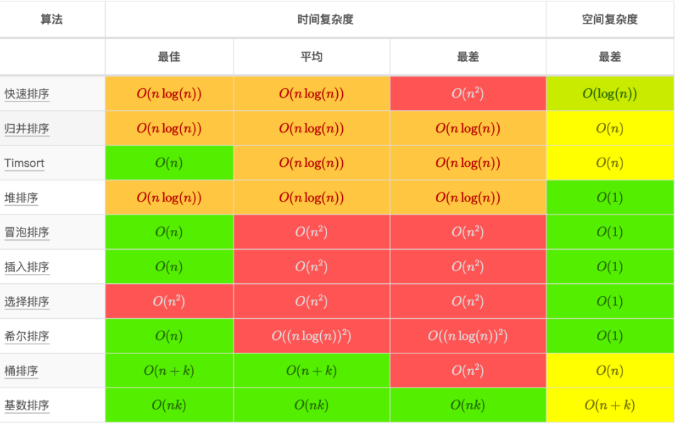

> [!cite]
> [Robert Love's answer to How do I strengthen my knowledge of data structures and algorithms? Both have left me with a fractured knowledge of the subject with lots of gaps in between. What would be a good way to go about filling the gaps and making progress? - Quora](https://www.quora.com/How-do-I-strengthen-my-knowledge-of-data-structures-and-algorithms-Both-have-left-me-with-a-fractured-knowledge-of-the-subject-with-lots-of-gaps-in-between-What-would-be-a-good-way-to-go-about-filling-the-gaps-and-making-progress/answer/Robert-Love-1)
> [Data Structure Visualization](https://www.cs.usfca.edu/~galles/visualization/Algorithms.html)
> [visualising data structures and algorithms through animation - VisuAlgo](https://visualgo.net/en)
# 算法性能分析

## 时间复杂度 O(f(n)) 分析

时间复杂度用来方便开发者估算出程序运行时间。

- `O(...)` 表示算法的最坏情况运行时间的上界（业界表示一般情况）。

## 空间复杂度分析

空间复杂度是一个程序在运行过程中占用内存空间大小的量度。

## 常用算法分析

`O(1)` 常数阶 < `O(logn)` 对数阶 < `O(n)` 线性阶 < `O(n^2)` 平方阶 < ` O(n^3)` 立方阶 < `O(2^n)` 指数阶

稳定排序： 冒泡排序（bubble sort）、插入排序 （insertion sort）、归并排序 （merge sort）

非稳定排序： 选择排序 （selection sort）、希尔排序 （shell sort）、堆排序 （heapsort）、快速排序 （quicksort）

