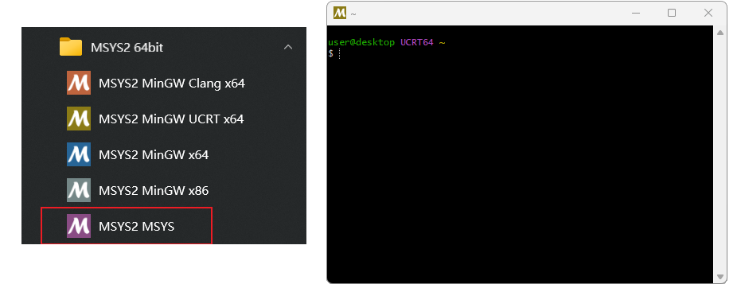
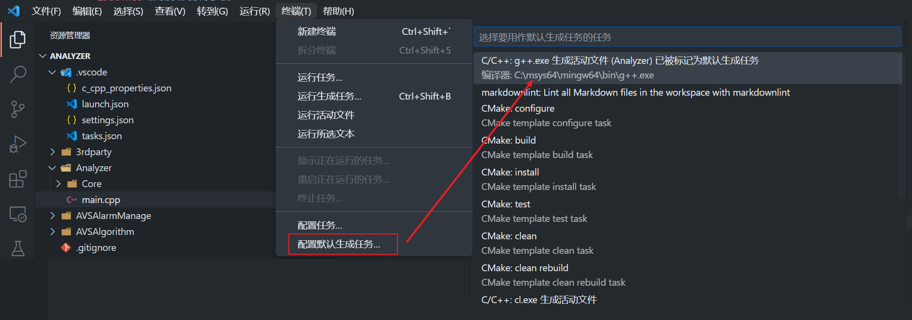
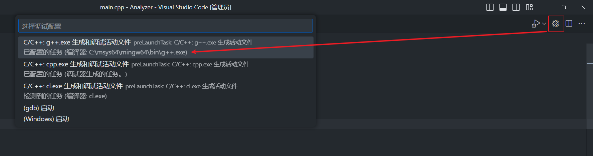

> [!cite]
> [Install gcc compiler on Windows with MSYS2 for C/C++ | DevDungeon](https://www.devdungeon.com/content/install-gcc-compiler-windows-msys2-cc)
> [MSYS2使用教程（整理）——win10系统64位安装msys2最新版（msys2-x86_64-20190524.exe） - wdliming - 博客园 (cnblogs.com)](https://www.cnblogs.com/CodeWorkerLiMing/p/12274583.html)
> [MSYS2](https://www.msys2.org/)

## C++ 项目开发配置

### Windows 环境配置 (msys 64 + cmake + vcpkg)

#### 1. 安装 [MSYS64](https://www.msys2.org/) 和管理项目开发工具

- 下载[安装包](https://github.com/msys2/msys2-installer/releases))
- 运行安装程序, 需要注意的是 MSYS 2 需要 64 位 Windows 8.1 或更高版本系统。
- 输入所需存放的安装文件夹


- 安装就绪后, 单机完成即可, 默认情况下会打开 linux 类型的终端窗口, 方便通过 `pacman` 指令安装所需要的工具. 未打开窗口, 可通过在开始菜单中查询以下程序打开.



- 更改软件管理工具 pacman 的下载镜像

```bash
sed -i "s#https\?://mirror.msys2.org/#https://mirrors.tuna.tsinghua.edu.cn/msys2/#g" /etc/pacman.d/mirrorlist*
```

- 从服务器下载新的软件包数据库

```bash
pacman -Sy
```

- 升级系统及所有已经安装的软件

```bash
pacman -Syu
```

- 安装 Mingw-w 64 中必备的工具链
```bash
# 安装  Mingw-w64 版本的 GCC 工具包(包含, git, gcc, gdb, make, cmake等工具)
pacman --needed -S mingw-w64-x86_64-toolchain
pacman --needed -S base-devel
# 其他的工具链还有 (非必需, 按照项目类型按需安装)
# mingw-w64-i686-toolchain
# mingw-w64-i686-arm-none-eabi-toolchain
# mingw-w64-x86_64-arm-none-eabi-toolchain
# mingw-w64-clang-x86_64-toolchain
# mingw-w64-clang-i686-toolchain
# mingw-w64-cross-clang-toolchain
# mingw-w64-clang-aarch64-toolchain
# mingw-w64-clang-i686-arm-none-eabi-toolchain
# mingw-w64-clang-x86_64-arm-none-eabi-toolchain
```
- 将 Mingw-w 64 文件夹的路径添加到 Windows 环境变量

```bash
SETX /M "Path" "%Path%;D:\msys64\mingw64\bin"
```

- 检查 MinGW 安装状态

```bash
gcc --version
g++ --version
gdb --version
```

>[!cite]
> [使用msys2打造优雅的开发环境 - 飞鸿影 - 博客园 (cnblogs.com)](https://www.cnblogs.com/52fhy/p/15158765.html)

#### 2. 安装 vckpg 管理项目依赖库

```bash
# 先 WIN + R 输入 cmd, 然后用 CTRL + SHIFT + ENTER 以管理员方式打开 cmd
cd /d d: && mkdir dev && cd dev
git clone https://github.com/microsoft/vcpkg.git
.\vcpkg\bootstrap-vcpkg.bat

# 添加环境变量 PATH = PATH + "d:\dev\vcpkg"
SETX /M "VCPKG_ROOT" "d:\dev\vcpkg"
SETX /M "Path" "%Path%;d:\dev\vcpkg"

# vcpkg 常用命令, 按需使用
# vcpkg help triplets
# vcpkg install ... --triplet=x64-windows|
# vcpkg search ...
# --clean-after-build # 生成每个包后清理生成树、包和下载
# --head # 使用可用的最新版本
# --only-downloads # 不进行生成, 只下载所需资源
# --only-binarycaching # 不进行生成, 直接下载二进制缓存

```

> [!cite]
> [C++开源库 - 包管理工具Vcpkg安装使用](https://www.cnblogs.com/linuxAndMcu/p/14696542.html)

### Linux 环境配置 (cmake + vcpkg)

#### 1. 安装必要的开发环境

```
# Debian, Ubuntu, popOS
sudo apt-get update
sudo apt-get install build-essential tar curl zip unzip autoconf autoconf-archive
# CentOS
sudo yum install centos-release-scl
sudo yum install devtoolset-7
scl enable devtoolset-7 bash
# macOS
xcode-select --install
```

#### 2. 安装 vckpg 管理项目依赖库

```bash
# cmd
cd ~/ && mkdir dev && cd dev

git clone https://github.com/microsoft/vcpkg.git
.\vcpkg\bootstrap-vcpkg.bat

# 添加环境变量 ~/.bashrc 文件中添加
echo 'export VCPKG_ROOT=~/dev/vcpkg' >> ~/.bashrc
echo 'export PATH=$VCPKG_ROOT:$PATH' >> ~/.bashrc

# vcpkg 常用命令, 按需使用
# vcpkg help triplets
# vcpkg install ... --triplet=x64-windows|
# vcpkg search ...
# --clean-after-build # 生成每个包后清理生成树、包和下载
# --head # 使用可用的最新版本
# --only-downloads # 不进行生成, 只下载所需资源
# --only-binarycaching # 不进行生成, 直接下载二进制缓存

```

## IDE 配置 (Visual Studio Code )

### 软件和插件安装

1. 安装 [Visual Studio Code](https://code.visualstudio.com/download)。
2. 安装 VS Code 的 C/C++ 扩展和 cmake 扩展


### 单文件运行和调试配置

- 新建文件夹，并通过 vscode 打开, 并接受工作区信任的弹出消息框.
- 添加, 保存, 和打开一个源代码文件 `helloworld.cpp` , 使其在屏幕展示, 成为活动文件。文件示例内容如下：

```c++
// 示例: `helloworld.cpp`
#include <iostream>
#include <vector>
#include <string>

using namespace std;

int main()
{
    vector<string> msg {"Hello", "C++", "World", "from", "VS Code", "and the C++ extension!"};

    for (const string& word : msg)
    {
        cout << word << " ";
    }
    cout << endl;
}

```
- 单击菜单栏的 `终端` , 通过 `配置默认生成任务` 自动生成一个 `tasks.json` 文件, 编译器选择安装好的 msys 64 的 g++ 程序




- 单机活动文件右上角的齿轮按钮, 自动生成一个 `launch.json` 文件, 调试配置选择安装好的 msys 64 的 g++ 程序



- 使用快捷键 `Ctrl+Shift+P` 打开 VSCode 的命令面板, 运行命令 `C/C++: Edit Configurations (JSON)` 自动生成一个 `c_cpp_properties.json` 文件


##### 通过 `launch.json` 配置 vscode 的 C/C++ 调试行为

```json
{
    "configurations": [
        {
            "name": "C/C++: g++.exe 生成和调试活动文件",
			// 额外的调试选项
			// "processId": , // 通过指定 processId 选项，调试器可以附加到一个正在运行的进程进行调试。
			"request": "launch", // `launch`: 启动一个新的调试会话，通常是通过运行程序来启动。`attach`: 附加到一个正在运行的进程进行调试。`disconnect`: 断开调试器和被调试进程之间的连接。`terminate`: 终止调试会话。`setBreakpoints`: 设置断点。`configurationDone`: 告诉调试器已完成配置。
			"type": "cppdbg", // cppvsdbg(Visual Studio 调试器) 或 cppdbg ( GDB或LLDB调试器 )
			// "sourceFileMap": ,
			
			// VSCode 行为控制
            "program": "${fileDirname}\\build\\${fileBasenameNoExtension}.exe", // 指定需要调试的程序的可执行文件路径
            // "symbolSearchPath": "C:\\Symbols;..." , // 可选参数, 指定 windows 调试器要搜索的符号文件(.pdb)所在的路径, 多个路径用分号隔开.
            // "requireExactSource": false, // 可选参数, 要求当前源代码与 pdb 匹配
            // "additionalSOLibSearchPath": "/Users/user/dir1;..." // 可选参数, 指定需要搜索的动态链接库文件(.so)所在的路径, 多个路径用分号隔开.
            // "avoidWindowsConsoleRedirection": false, // 默认会将控制台重定向命令添加到调试程序的参数中, 以使 Windows 上的 gdb 支持 VSCode 的集成终端, 将控制台输入和输出显示在集成终端中. 一般不需要更改设置.
            // "logging": { // 用于确定应将哪些类型的消息记录到调试控制台。
			    // "exceptions": true , // 用于确定是否应将异常消息记录到调试控制台。
			    // "moduleLoad": true, // 用于确定是否应将模块加载事件记录到调试控制台。
			    // "programOutput": true, // 用于确定是否应将程序输出记录到调试控制台。
			    // "engineLogging": false // 用于确定是否应将诊断引擎日志记录到调试控制台。
			    // "trace": false, // 用于确定是否应将诊断适配器命令跟踪记录到调试控制台。
			    // "traceResponse": false, // 用于确定是否应将诊断适配器命令和响应跟踪记录到调试控制台。
			// }
			// "visualizerFile": "*.natvis", // 指定调试时要使用的 `.natvis` 文件, 控制可视化类对象的定义视图, 一般不用设置.
			// "showDisplayString": , // 当 `visualizerFile` 参数指定后, 是否启用字符串显示, 启用会导致调试性能降低.
           "externalConsole": false, // 控制是否打开外部终端来启动调试, macOS 中似乎对集成终端有限制, 需要注意.
           
			// 程序运行设置
            "args": [], // 设置启动调试程序时, 要传递给程序的命令行参数, 其中转义字符需要双重转义.
            "cwd": "${fileDirname}", // 设置调试器启动的应用程序的工作目录, "${workspaceFolder}": 项目地址, "${fileDirname}": 文件地址
            "environment": [], // 要临时添加到程序环境中的环境变量.
           
            // 调试设置
            "MIMode": "gdb", // 指定要使用的调试器类型, `gdb`或`lldb`.
            "miDebuggerPath": "C:\\msys64\\mingw64\\bin\\gdb.exe", // 调试器的可执行文件路径
            // "miDebuggerArgs": [], // 控制调试器在启动时所使用的附加参数
			"stopAtEntry": false, // 控制调试器是否在程序入口处停止
			// "stopAtConnect": false, 控制调试器是否应在连接到目标程序后停止
            "setupCommands": [ // 控制调试器启动后, 连接到程序之前的调试环境命令
                {
                    "description": "为 gdb 启用整齐打印",
                    "text": "-enable-pretty-printing",
                    "ignoreFailures": true
                },
                {
                    "description": "将反汇编风格设置为 Intel",
                    "text": "-gdb-set disassembly-flavor intel",
                    "ignoreFailures": true
                }
            ],
            // "customLaunchSetupCommands":[], // 用于在使用自定义调试器时, 连接到程序之前的调试环境命令
            // "launchCompleteCommand": [], // 设置在调试器启动和初始化完成后要执行的命令
            // "symbolLoadInfo": {
	            // "loadAll": true, // 如果为真，将加载所有库的符号，否则将不加载任何 solib 符号。
	            // "exceptionList": "foo.so;bar.so" // 由分号分隔的文件名列表, 如果 LoadAll 为真，则不加载与列表中任何名称匹配的库的符号。否则只为匹配的库加载符号。
			// },


			// 设置调试系统上的转储文件(dump, 进程快照)
			// "dumpPath": , // 转储文件路径
			// "coreDumpPath": , // 核心转储文件
			
			// 使用本地或远程的调试服务
			// "miDebuggerServerAddress": "localhost:1234", // 要连接到以进行远程调试的调试器服务器的网络地址
			// "debugServerPath": , // 要启动的调试服务器的完整路径
			// "debugServerArgs": , // 调试器服务器的参数
			// "serverStarted": , // 要在调试服务器输出中查找的服务器启动模式。支持正则表达式
			// "filterStdout": true, // 如果设置为 true，则stdout在流中搜索服务器启动模式并将 stdout 记录到调试输出。
			// "filterStderr": true, // 如果设置为 true，则stderr在流中搜索服务器启动模式并记录 stderr 以调试输出。
			// "serverLaunchTimeout": 10000, // 调试器等待 debugServer 启动的时间（以毫秒为单位）。
			// "pipeTransport": , // 有关附加到远程进程的信息，例如调试 Docker 容器中的进程
			// "hardwareBreakpoints": , // 如果提供，这将显式控制远程目标的硬件断点行为。
			
            "preLaunchTask": "C/C++: g++.exe 生成活动文件"
        }
    ],
    "version": "2.0.0"
}
```

##### 通过 `tasks.json` 配置 vscode 的编译生成行为任务

对于一些自动化工具, 如编译工具 TypeScript、 ESLint、TSLint、Make、Ant、Gulp、Jake、Rake 和 MSBuild 等, 能通过命令行运行, 并自动执行检查、构建、打包、测试或部署软件系统等任务。为了方便 VSCode 执行这些任务, 而不需要额外的命令行操作, 可以通过在终端菜单栏单击 `Configure Tasks/配置任务` 选择适合的模板文件来生成 `tasks.json` , 并自定义相关任务. 当需要运行任务时, 可以通过在终端菜单栏单击 `run task/运行任务` 或命令面板( `Ctrl+Shift+P` ) 访问任务命令, 选择对应的任务名字即可.

```json
{
    "version": "2.0.0",
    "tasks": [
        {
            "label": "C/C++: g++.exe 生成活动文件", // 在 VScode 界面中所显示的当前任务的名字
            "type": "cppbuild", // 设置任务的类型, 如 shell, process, cppbuild, npm 等
            "command": "C:\\msys64\\mingw64\\bin\\g++.exe", // 当前任务实际要执行的程序
            "args": [ // 程序运行所需的参数
                "-fdiagnostics-color=always",
                "-g",
                "${file}",
                "-o",
                "${fileDirname}\\${fileBasenameNoExtension}.exe",
                "-static-libgcc",
                "-std=c++23"
            ],
            // "windows": { // 配置 Windows 系统中对应的特定属性, 拥有覆盖默认属性
            //     "options": {
            //         "env": {
            //             "PATH": "C:\\msys64\\mingw64\\bin"
            //         }
            //     }
            // }, 
            "group": { // 配置任务的组属性
                "kind": "build", // 将当前任务归属于生成任务类型, 
                "isDefault": true // 配置为默认生成任务, 这样就可以通过任务组的快捷键默认直接运行此任务了
            },
            // "presentation": { //  定义任务输出在用户界面中的处理方式。
            //    "reveal": "always"
            //},
            "options": { // 修改环境中一些参数的默认值, 如 `cwd` ：、、
                "cwd": "${fileDirname}", // 修改当前工作目录
                // `env`: { // 修改指定的环境变量
			    //    "PATH": "C:\\msys64\\mingw64\\bin"
		        // },
                // `shell`: "",// 修改 shell 的默认值
            },
            // "runOptions": , // 定义任务运行的时间和方式
            "problemMatcher": [ // 
                "$gcc"
            ],

            "detail": "编译器: C:\\msys64\\mingw64\\bin\\g++.exe" // 
        },
    ]
}
```

##### 通过 `c_cpp_properties.json` 配置 vscode 的当前项目环境配置

```json
{

    "configurations": [

        {

            "name": "Win32",

            "includePath": [

                "${workspaceFolder}/**"

            ],

            "defines": [

                "_DEBUG",

                "UNICODE",

                "_UNICODE"

            ],

            "cStandard": "c23",

            "cppStandard": "c++23",

            "compilerPath": "C:\\msys64\\mingw64\\bin\\g++.exe",

            "windowsSdkVersion": "10.0.19041.0",

            "intelliSenseMode": "gcc-x64"

        }

    ],

    "version": 4

}

```

### 复杂项目运行和调试配置

#### 新建文件夹作为项目目录

#### 通过 vcpkg 的清单模式为当前项目单独添加依赖库和项目文件

1. 创建 vcpkg 的依赖项清单文件 `vcpkg.json` 和默认配置文件 `vcpkg-configuration.json`
```
vcpkg new --application
```
2. 修改 `vcpkg.json` 文件
```json
{
  "$schema": "https://raw.githubusercontent.com/microsoft/vcpkg-tool/main/docs/vcpkg.schema.json",
  "dependencies": [
    "boost-system",
    {
      "name": "cpprestsdk",
      "default-features": false
    },
{ "name": "arrow", "default-features": false, "features": [ "json", { "name": "mimalloc", "platform": "windows" } ] },
    "libxml2",
    "yajl"
  ]
}
```
- `"$schema"` 为支持的 IDE 提供语法检查功能的模式参考文件
- `dependencies` 提供依赖项列表, 列表内元素可以是依赖库的名字，也可以是具有更加细致要求的依赖库字典，包含 `name` , `default-features` , `features` , 等设置。
	- `name` : 项目名
	- `default-features` : 
	- `features` : 依赖项目提供的可选功能


这是清单文件。 vcpkg 读取清单文件，以了解要安装和与 CMake 集成的依赖项，从而提供项目所需的依赖项。
    
    默认 `vcpkg-configuration.json` 文件引入了[基线](https://learn.microsoft.com/zh-cn/vcpkg/reference/vcpkg-configuration-json#registry-baseline)约束，指定项目应使用的依赖项的最低版本。 修改此文件超出了本教程的范围，但这在定义项目依赖项的版本约束方面起着重要作用。 因此，尽管这对于本教程来说并不是必要的，但建议将 `vcpkg-configuration.json` 添加到源代码管理，以确保不同开发环境中的版本一致性。
