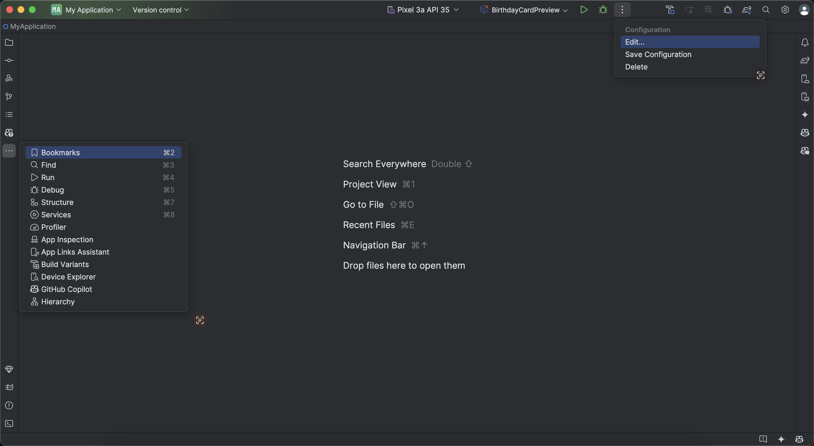
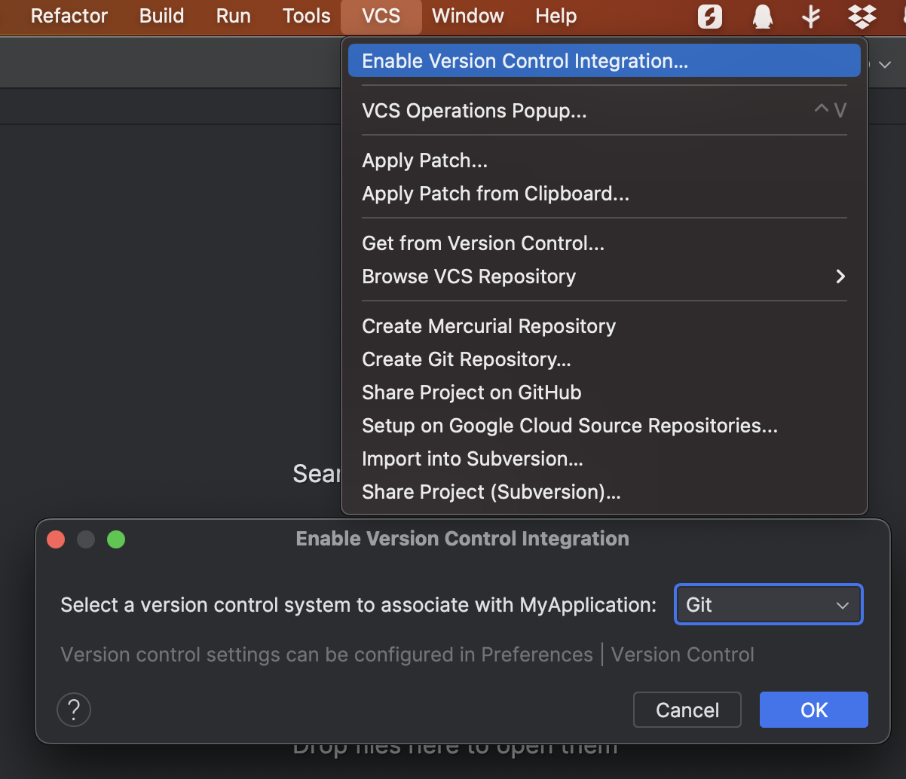

## 安装 Android Studio 及其配置

> [!cite]
>  [Android Studio 下载文件归档  |  Android Developers](https://developer.android.com/studio/archive)
>

- 打开设置，在`Appearance & Behavior`下有一个`New UI`的选项, 选择 `Enable new UI` 即可启用新的 UI. `Compact Mode` 用于缩小界面图标样式和间隔.

- 顶部主菜单功能: 项目名 | 版本控制 | 运行设备 | 构建配置 | 运行 | 调试 | 配置控制 | 项目编译控制 | 搜索 | 设置 | 用户
- 左侧和右侧的工具栏均分为上下两个区域, 主要包含 项目 | 资源管理 | APP 质量检查 | 日志 | 问题 | 终端 | 设备管理 | Gradle 等功能. 可根据具体需要自行拖拽添加.
- 导航栏默认在最下面, 可以在在 `View > Appearance > Navigation Bar` 中进行设置到上面


- 到 `Settings > Build,Execution,Deployment > Build Tools > Gradle > Gradle JDK` 中设置 Gradle 的 JDK 版本.

- 到 `Settings > Editor > File Encodings` 中设置文件编码格式, 防止乱码. 一般设置为 `UTF-8`.


### 日志 ( Logcat )


默认情况下, 会设置 `package:mine` 为过滤条件, 可以在`Android Studio > Settings > Tools > Logcat` 中进行设置, 如设置为 `package:com.example.myapp tag:MyActivity level:debug`
- `tag`：与日志条目的 tag 字段匹配。
- `package`：与日志记录应用的软件包名称匹配。
- `process`：与日志记录应用的进程名称匹配。
- `message`：与日志条目的消息部分匹配。
- `level`：与指定或更高严重级别的日志匹配，例如 DEBUG。
- `age`：如果条目时间戳是最近的，则匹配。值要指定为数字，后跟表示时间单位的字母：s 表示秒，m 表示分钟，h 表示小时，d 表示天。例如，age: 5m 只会过滤过去 5 分钟内记录的消息。


为了防止日志太多, 可以在 `Android Studio > Settings > Tools > Logcat -> Logcat cycle buffer size` 增加缓冲区大小.


在引用类或者变量的时候，因为输入的是小写而IDE没有提示的时候，需要设置一下匹配大小写。`Settings > Editor > General > Code Completion > Match case` 取消.


设置文件创建时的默认注释模板, 在 `Settings > Editor > File and Code Templates` 中进行设置.


### 版本控制

- 在 `Android Studio > Settings > Version Control` 中设置版本控制的配置.
- 在 `VCS > Enable Version Control Integration` 中开启版本控制.


### IDE 配置

在 `Help > Edit Custom VM Options` 中对`studio.vmoptions` 文件进行配置.
- 最大堆大小:  `-Xmx4096m`
- 初始堆大小:  `-Xms2048m`
- 缓存大小:  `-XX:MaxPermSize=1024m`
- Java 垃圾回收器:  `-XX:+UseG1GC`
- 
在 `Help > Edit Custom Properties` 中对`idea.properties` 文件进行配置.
- 

在 `File > Manage IDE Settings > Export Settings` 中进行配置导出.

### SDK 配置

在 `Tools > SDK Manager` 中进行 SDK 的配置.

### 项目管理

在 `File > New > New Project` 中选择任意模板创建项目.
- `Name` 控制项目的名称
- `Package name` 控制项目的包名
- `Save location` 控制项目的保存位置
- `Language` 控制项目的编程语言
- `Minimum API level` 控制项目的最低需要支持的 API 级别
- `Build configuration language` 控制项目的构建配置语言

每个项目包含了一个或多个模块, 每个模块都是一个独立的可构建单元, 有自己的构建配置, 资源文件和源代码, 分为应用模块, 功能模块和库模块.

#### 项目级结构及配置

```
└── MyApp/  # Project
    ├── local.properties # 构建系统的本地环境属性
    ├── gradle/
    │   └── wrapper/
    │       └── gradle-wrapper.properties # Gradle 程序环境配置
    ├── gradle.properties # Gradle 程序设置
    ├── settings.gradle(.kts) # Gradle 项目配置
    ├── build.gradle(.kts) # Gradle 模块通用配置
    └── .../  # 应用模块
    └── .../  # 功能模块
    └── .../  # 库模块
```

#### 模块级结构及配置

```
├── app/  # Module
│    ├── build.gradle(.kts) # Gradle 模块配置
│    ├── build/ # 构建输出目录
│    ├── libs/ # 模块内部私有库
│    ├── consumer-rules.pro # 消费者 ProGuard 规则
│    ├── proguard-rules.pro # ProGuard 规则
│    └── src/ # 源代码目录
│        ├── main/ # 主要源代码
│        │    ├── java|c++|kotlin/
│        │    │   └── com.example.myapp
│        │    ├── res/
│        │    │   ├── drawable/
│        │    │   ├── values/
│        │    ├── assets/
│        │    └── AndroidManifest.xml # 描述和配置模块
│        ├── test/ # 本地测试代码
│        │    ├── java/
│        │    │   └── com.example.myapp
│        └── androidTest/ # Android 设备上运行的测试代码
│             └── java/
│                 └── com.example.myapp
├── ...(其他模块)
```

项目创建时会自动创建一个应用模块, 可以通过 `File > New > New Module` 创建其他模块.
- 应用模块: 用于生成 APK 文件, 通常包含应用的代码和资源文件.
- 功能模块: 包括动态特性模块和即时特性模块. 功能模块可以在运行时下载和安装.
- 库模块: 用于生成 AAR 代码存档文件, 通常包含库的代码和资源文件, 可用作项目内其他模块的依赖, 或是导出到其他项目中.
    - Android Library: 支持除本地 C++ 代码之外的所有代码和资源的库模块.
    - Android Native Library: 支持本地 C++ 代码以及其他所有代码和资源的库模块.
    - Java 或 Kotlin Library: 仅包含 Kotlin 或 Java 代码的库模块.

注意: 三种模块的结构基本相同, 但是编译结果不同, 应用模块会生成 APK 文件, 而另两种模块会生成 AAR 文件. 创建模块后, 具体模块类型和模块构建配置可以在 `build.gradle` 中进行手动配置和更改.

```kotlin
//  应用模块
plugins {
    id 'com.android.application' version '8.5.0'
    id 'kotlin-android' version '1.9.23'
}

android {
    ...
    defaultConfig {
        applicationId "com.example.myapp"
        ...
    }
}

// 非应用模块
plugins {
    id 'com.android.library' version '8.5.0'
    id 'kotlin-android' version '1.9.23'
}

android {
    ...
    defaultConfig {
        // 不需要 applicationId
        ...
    }
}
```


除了模块类型, 还可以在 `build.gradle` 中配置模块的构建配置, 如 `android` 配置, `dependencies` 配置, `buildTypes` 配置等. 一个大致完整的 `build.gradle` 文件如下.

```kotlin
plugins {
    alias(libs.plugins.android.library)
    alias(libs.plugins.jetbrains.kotlin.android)
}

ext {
    test = 0
}

android {
    namespace 'com.example.mylibrary'
    compileSdk 34

    defaultConfig {
        // applicationId "com.example.myapplication3" // 应用模块需要 applicationId
        minSdk 24
        targetSdk 34
        versionCode 1
        versionName "1.0"
        
        testInstrumentationRunner "androidx.test.runner.AndroidJUnitRunner"
        consumerProguardFiles "consumer-rules.pro"
    }

    buildTypes {
        release {
            minifyEnabled false
            proguardFiles getDefaultProguardFile('proguard-android-optimize.txt'), 'proguard-rules.pro'
        }
    }
    compileOptions {
        sourceCompatibility JavaVersion.VERSION_1_8
        targetCompatibility JavaVersion.VERSION_1_8
    }
    kotlinOptions {
        jvmTarget = '1.8'
    }
    
    // 默认资源目录为src/main/res/ 或 src/debug/res/
    // 可以通过 sourceSets 配置更改资源目录
    sourceSets {
        getByName("main") {
            res.srcDirs("resources/main1", "resources/main2"))
        }
        getByName("debug") {
            res.srcDirs("resources/debug")
        }
    }
}

dependencies {

    // 远程模块模块依赖
    implementation "androidx.core:core-ktx:1.7.0"
    // 项目内模块依赖
    implementation project(":my-library-module")
    // 本地模块文件依赖
    implementation files('libs/my-library.aar')
    implementation fileTree(dir: "libs", include: ["*.jar"])
    
    testImplementation "junit:junit:4.13.2"
    
    androidTestImplementation "androidx.test.ext:junit:1.1.3"
    androidTestImplementation "androidx.test.espresso:espresso-core:3.4.0"
}
```

此外, 可以通过 `File > Project Structure` 进行可视化的项目配置.
- `Project`: 包括 `Android Gradle Plugin Version` 和 `Gradle Version` 的配置.
- `SDK Location`: 包括  `Android SDK Location` 的位置配置.
- `Variables`: 包括项目构建脚本中可以使用的变量, 与所有项目级和模块级 `build.gradle` 中的 `ext` 配置对应.
- `Modules`: 包括项目中的各个模块的配置, 与 `build.gradle` 中的 `android` 配置对应
- `Dependencies`: 包括项目中的各个模块的依赖配置, 与 `build.gradle` 中的 `dependencies` 配置对应.
- `Build Variants`: 包括项目中的各个模块的构建变体配置, 与 `build.gradle` 中的 `buildTypes` 配置对应.

#### 资源管理

包括图片、字符串、布局、动画等资源被存储在 `res/` 目录下的各个子目录中(不能进一步创建子目录), 可以使 Android Studio 自动处理资源文件, 并生成 `R` 类, 用于访问资源文件. 通常包括以下子目录:
- `animator/` 定义属性动画的 XML 文件
- `anim/` 定义视图动画( Tween animations)的 XML 文件
- `color/` 定义颜色值的 XML 文件
- `drawable/` 存储可绘制资源
- `layout/` 存储界面布局的 XML 文件
- `mipmap/` 存储启动器图标
- `values/` 存储资源值, 如字符串(`strings.xml`)、颜色(`colors.xml`)、尺寸(`dimens.xml`)、样式(`styles.xml`)、`arrays.xml`等.
- `menu/` 存储菜单资源
- `raw/` 存储原始资源文件, 如音频、视频等
- `xml/` 存储 XML 文件
- `font/` 存储字体文件

 `res/` 目录下的各个资源子目录可以进一步添加限定符, 如 `drawable-hdpi/`、`strings-en-rUS/` 等, 适配不同的设备和语言环境. 具体有哪些限定符, 参见[组资源类型](https://developer.android.com/guide/topics/resources/providing-resources?_gl=1*z5crgf*_up*MQ..*_ga*MTM2NTM3ODA4Mi4xNzIyNzQ4NDg2*_ga_6HH9YJMN9M*MTcyMjc1NzgxNS4yLjAuMTcyMjc1NzgxNS4wLjAuMA..#ResourceTypes)

 `res/` 目录下的内部所有资源都可在代码中通过 `R` 类的静态字段进行访问, 如 `R.drawable.ic_launcher_background`, `R.layout.activity_main`, `R.string.app_name`. 也可在 XML 文件中通过 `@` 符号进行访问, 如 `@drawable/ic_launcher_background`, `@layout/activity_main`, `@string/app_name`.

```
// code
val imageView = findViewById(R.id.myimageview) as ImageView
imageView.setImageResource(R.drawable.ic_launcher_background)

// xml
<resources>
    <color name="red">#f00</color>
    <color name="highlight">@color/red</color>
</resources>
```


库中的所有资源默认都是公开的, 想要将资源标记为私有, 可以在 `res/values/public.xml` 文件中声明一个或多个公共资源, 所有未声明的资源将自动设为私有. 特殊的, 可以使用空的 `public.xml` 文件来标记所有资源为私有.

```xml
<resources>
    <public />
</resources>
```

一些需要以目录结构进行组织的资源, 可以放在 `assets/` 目录下, 通过 `AssetManager` 类进行访问. 支持任意文件类型, 如文本、图片、HTML、音频、游戏资源等.

```kotlin
val assetManager = context.assets
val inputStream = assetManager.open("filename")

```


```xml

### 基本项目管理(基本模块+功能模块+动态模块)

`settings.gradle(.kts)`

```kotlin
pluginManagement {
    repositories {
        google {
            content {
                includeGroupByRegex("com\\.android.*")
                includeGroupByRegex("com\\.google.*")
                includeGroupByRegex("androidx.*")
            }
        }
        mavenCentral()
        gradlePluginPortal()
    }
}
dependencyResolutionManagement {
    repositoriesMode.set(RepositoriesMode.FAIL_ON_PROJECT_REPOS)
    repositories {
        google()
        mavenCentral()
    }
}

rootProject.name = "My Application"
include ':app'

```

`build.gradle`

```kotlin
plugins {
    id 'com.android.application' version '8.5.0' apply false
    id 'com.android.library' version '8.5.0' apply false
    id 'org.jetbrains.kotlin.android' version '1.9.23' apply false
}

plugins {
alias(libs.plugins.android.application) apply false
    alias(libs.plugins.jetbrains.kotlin.android) apply false
}
```

```kotlin
plugins {
    alias(libs.plugins.android.application)
    alias(libs.plugins.jetbrains.kotlin.android)
}

android {
    namespace 'com.example.myapplication'
    compileSdk 34

    defaultConfig {
        applicationId "com.example.myapplication"
        minSdk 24
        targetSdk 34
        versionCode 1
        versionName "1.0"

        testInstrumentationRunner "androidx.test.runner.AndroidJUnitRunner"
    }

    buildTypes {
        release {
            minifyEnabled false
            proguardFiles getDefaultProguardFile('proguard-android-optimize.txt'), 'proguard-rules.pro'
        }
    }
    compileOptions {
        sourceCompatibility JavaVersion.VERSION_1_8
        targetCompatibility JavaVersion.VERSION_1_8
    }
    kotlinOptions {
        jvmTarget = '1.8'
    }
}

dependencies {

    implementation libs.androidx.core.ktx
    implementation libs.androidx.appcompat
    implementation libs.material
    testImplementation libs.junit
    androidTestImplementation libs.androidx.junit
    androidTestImplementation libs.androidx.espresso.core
}


dependencies {
    implementation(project(":my-library-module"))
}
```


按下 `Alt+Enter` (Windows) 或 `Option+Enter` (Mac), 可以对代码进行装换或增强.

### 快捷键

|                    |                   |
| ------------------ | ----------------- |
| 侧边栏打开项目       | Command+1         |
| 侧边栏打开版本控制    | Command+9         |
| 代码构建并运行       | Control+R         |
| 代码调试            | Control+D         |
| 侧边栏打开日志       | Command+6         |
| 返回编辑器           | Esc               |
| 隐藏所有工具窗口      | Command+Shift+F12 |
| 最近使用的文件       | Command+E         |
| 最近编辑的文件       | Command+Shift+E   |
| 查看当前文件结构      | Command+F12       |
| 项目内快速导航       | Command+O         |
| 当前光标处内容引用查找 | Command+Shift+F7 |
| 重新格式化代码       | Command+Option+L  |
