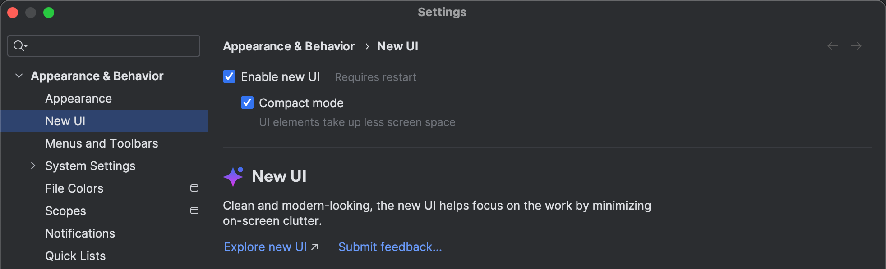
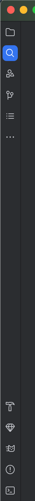
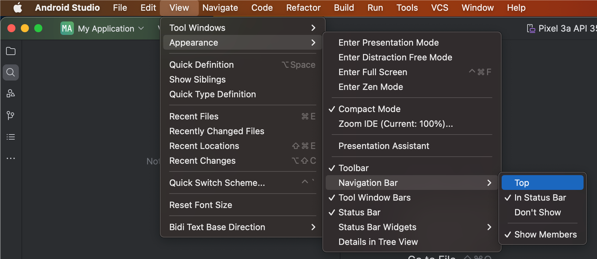
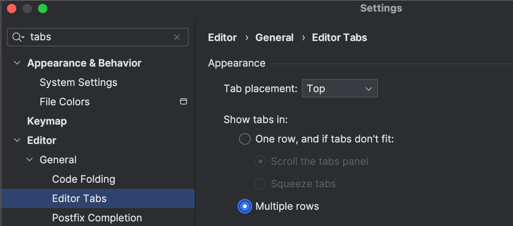
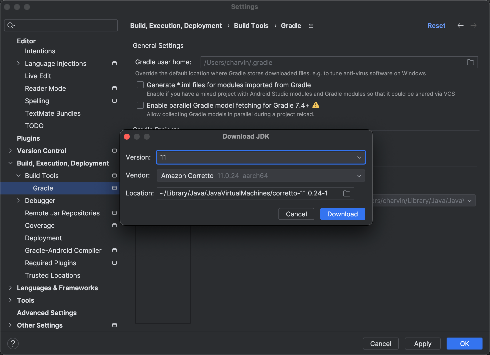
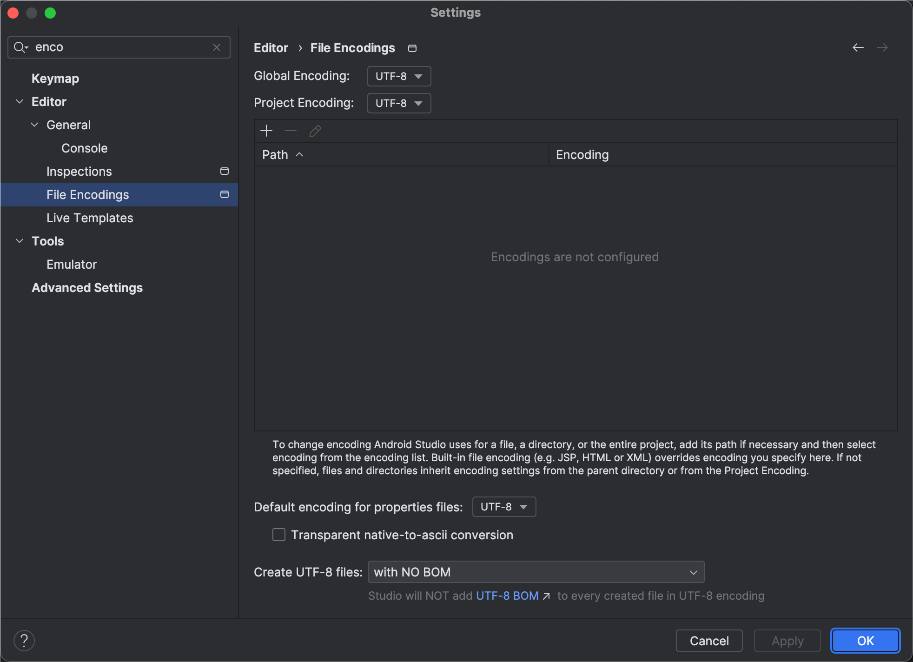
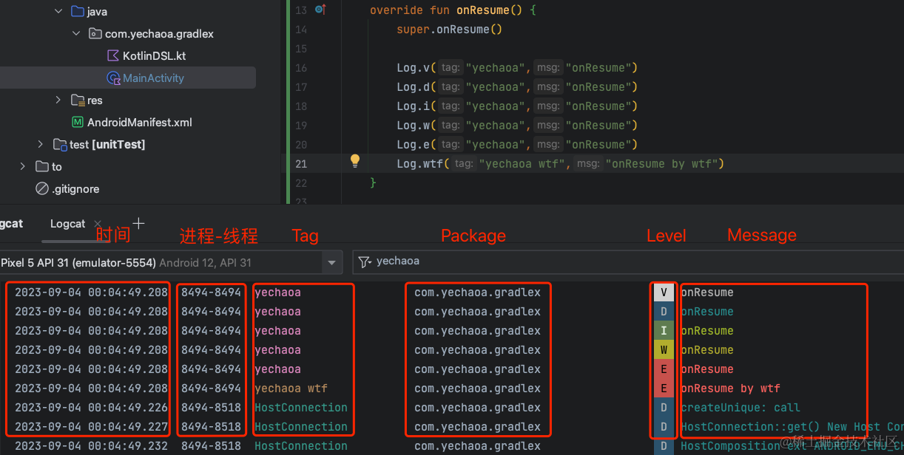
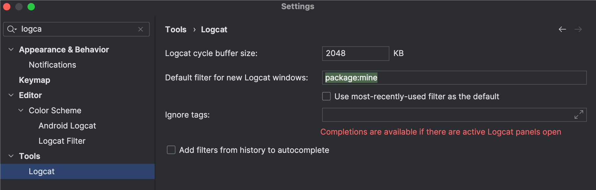
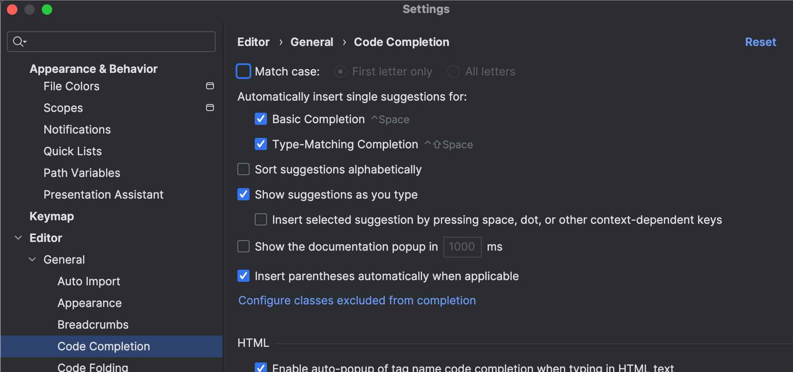
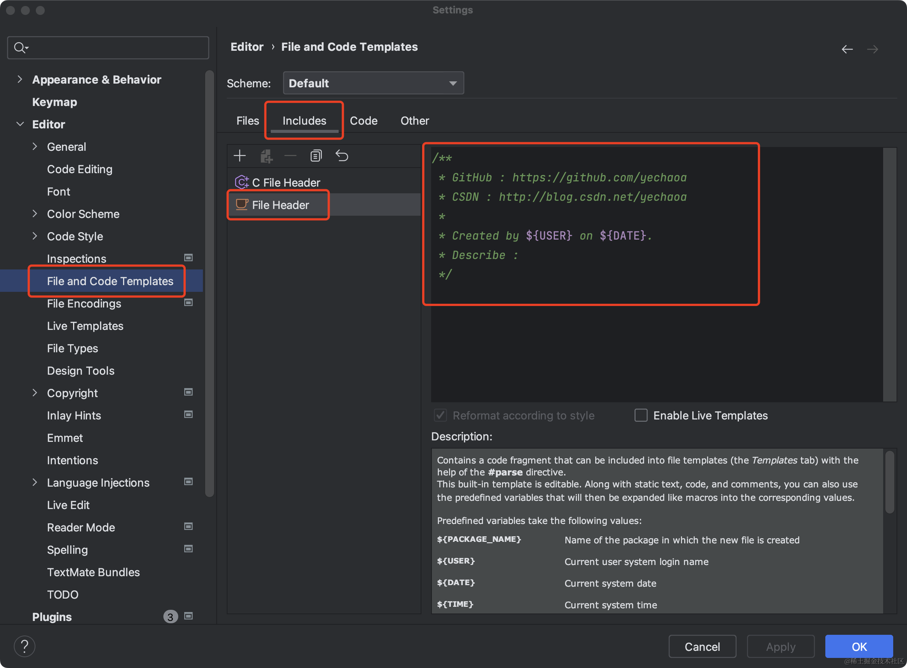

[Android Studio 下载文件归档  |  Android Developers](https://developer.android.com/studio/archive)



















Win： `Settings > Editor > General > Code Completion > Case sensitive completion > None`



### 基本项目结构

```
└── MyApp/  # Project
    ├── local.properties # 构建系统的本地环境属性
    ├── gradle/
    │   └── wrapper/
    │       └── gradle-wrapper.properties # Gradle 程序环境配置
    ├── gradle.properties # Gradle 程序设置
    ├── settings.gradle(.kts) # Gradle 项目配置
    ├── build.gradle(.kts) # Gradle 模块通用配置
    └── app/  # Module
    │   ├── build.gradle(.kts) # Gradle 模块配置
    │   ├── build/
    │   ├── libs/
    │   └── src/
    │        └── main/  # Source set
    │            ├── java/
    │            │   └── com.example.myapp
    │            ├── res/
    │            │   ├── drawable/
    │            │   ├── values/
    │            │   └── ...
    │            └── AndroidManifest.xml
```

`settings.gradle(.kts)`

```kotlin
pluginManagement {
    repositories {
        google {
            content {
                includeGroupByRegex("com\\.android.*")
                includeGroupByRegex("com\\.google.*")
                includeGroupByRegex("androidx.*")
            }
        }
        mavenCentral()
        gradlePluginPortal()
    }
}
dependencyResolutionManagement {
    repositoriesMode.set(RepositoriesMode.FAIL_ON_PROJECT_REPOS)
    repositories {
        google()
        mavenCentral()
    }
}

rootProject.name = "My Application"
include ':app'

```

`build.gradle`

```kotlin
plugins {
    id 'com.android.application' version '8.5.0' apply false
    id 'com.android.library' version '8.5.0' apply false
    id 'org.jetbrains.kotlin.android' version '1.9.23' apply false
}

plugins {
alias(libs.plugins.android.application) apply false
    alias(libs.plugins.jetbrains.kotlin.android) apply false
}
```

```kotlin
plugins {
    alias(libs.plugins.android.application)
    alias(libs.plugins.jetbrains.kotlin.android)
}

android {
    namespace 'com.example.myapplication'
    compileSdk 34

    defaultConfig {
        applicationId "com.example.myapplication"
        minSdk 24
        targetSdk 34
        versionCode 1
        versionName "1.0"

        testInstrumentationRunner "androidx.test.runner.AndroidJUnitRunner"
    }

    buildTypes {
        release {
            minifyEnabled false
            proguardFiles getDefaultProguardFile('proguard-android-optimize.txt'), 'proguard-rules.pro'
        }
    }
    compileOptions {
        sourceCompatibility JavaVersion.VERSION_1_8
        targetCompatibility JavaVersion.VERSION_1_8
    }
    kotlinOptions {
        jvmTarget = '1.8'
    }
}

dependencies {

    implementation libs.androidx.core.ktx
    implementation libs.androidx.appcompat
    implementation libs.material
    testImplementation libs.junit
    androidTestImplementation libs.androidx.junit
    androidTestImplementation libs.androidx.espresso.core
}
```


按下 `Alt+Enter` (Windows) 或 `Option+Enter` (Mac), 可以对代码进行装换或增强.
