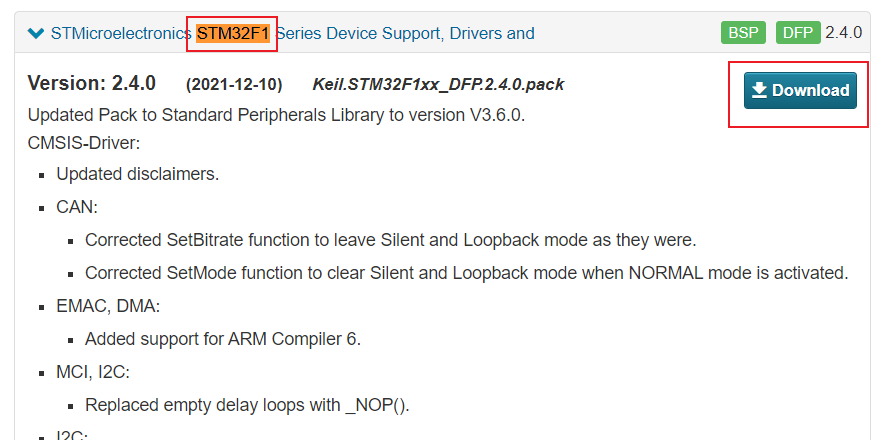

## 嵌入式环境配置

### KEIL 5

> 1）安装路径名中不能带中文，必须是英文路径名。
> 2）安装目录不能与 51 单片机的 KEIL 或者 KEIL 4 冲突，三者目录必须分开。
> 3）KEIL 5 的安装比 KEIL 4 多一个步骤，必须添加 MCU 库，不然没法使用。

1. [下载安装连接](https://www.keil.com/download/product/)
	  

2. [安装STM32芯片包](http://www.keil.com/dd2/pack/)
	 

#### 项目环境配置

#### 仿真器配置

配置 Debug 设备
配置 Utilities
配置 Debug Settings
选择目标板
下载程序
