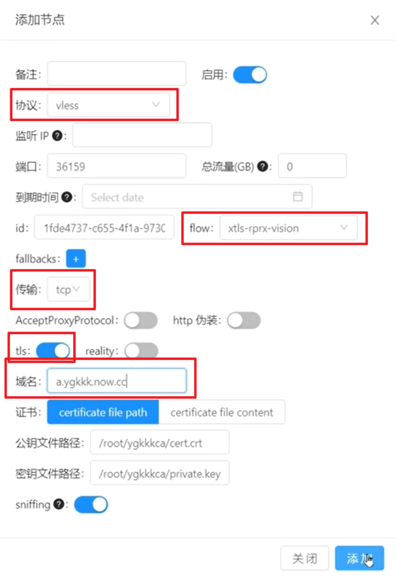

## 服务器代理环境设置

### 服务器购买和域名注册

### 先决问题解决

- 服务器 IPv 6 不能用, 导致的部分网址 DNS 解析后无法访问的问题

如: Connecting to raw.githubusercontent.com :443... failed: Connection refused 问题

解决方法 1: 关闭服务器 IPv 6 地址


解决方法 2: 修改 hosts 文件 (问题解决不彻底, 这样需要每个出错的网站都设置一遍, 不方便), 强制解析到 IPv 4 类型地址

```bash
sudo vi /etc/hosts

# 添加以下内容(网址对应的 IPv4 类型的 ip 在 https://www.ipaddress.com/ 处获得)
185.199.108.133 raw.githubusercontent.com
```
解决方法 3: 禁用 IPv 6(问题解决不彻底, 在脚本检测到你支持 IPV 6 时, 会帮你重新打开, 出现问题)

```bash
vim /etc/sysctl.conf

# 添加以下内容
net.ipv6.conf.all.disable_ipv6 = 1
net.ipv6.conf.default.disable_ipv6 = 1
net.ipv6.conf.lo.disable_ipv6 = 1
```

- 未知安装问题

开启服务器的 TUN/TAP


- 启动 chrony 服务失败 

解决方法: 更换系统到更新的版本(如 Ubuntu 20.04), 或者更新系统内核(便宜的 vps 不支持更换内核)


- 80 端口占用问题

解决方法: 卸载预装的 web 服务(如 apache 2)

```bash
lsof -i:80
netstat -tunlp | grep 80

# 停止和卸载服务, 以 apache2 举例
service apache2 stop
# 卸载相关服务
sudo apt-get --purge remove apache2
sudo apt-get --purge remove apache2.2-common
sudo apt-get autoremove
# 删除残留配置文件
sudo find /etc -name "*apache*" -exec rm -rf {} \;
```

### 安装环境(Dedipath+V 2 Ray+Vmess+websocket+TLS+Nginx+Website+warp-go)

更新 apt 的下载源

```bash
apt-get update
```

使用脚本一键式安装 V 2 ray 服务(这里使用的 Vmess+websocket+TLS+Nginx+Website 组合类型服务)

```bash
wget --no-check-certificate -O install.sh "https://raw.githubusercontent.com/wulabing/V2Ray_ws-tls_bash_onekey/master/install.sh" && chmod +x install.sh

bash install.sh
# 打开bbr加速设置
11
# 启用bbr加速
11
# 重启系统
reboot

bash install.sh

# 选择要安装的服务类型(V2Ray (Nginx+ws+tls))
1
# 软件安装确认(可能无此选项)
Y
# 确认时间准确
Y
# 输入域名地址
域名地址 # free.charvin.top
# 选择代理服务端口
443
# 选择生成的链接种类
1
# 选择支持的 TLS 版本
3

# 启动 V2ray：`systemctl start v2ray`
# 停止 V2ray：`systemctl stop v2ray`
# 启动 Nginx：`systemctl start nginx`
# 停止 Nginx：`systemctl stop nginx`
# systemctl status nginx
# systemctl restart nginx
# systemctl disable v2ray #关闭服务自启
# systemctl enable v2ray #开启服务自启
# Web 目录：`/home/wwwroot/3DCEList`
# V2ray 服务端配置：`/etc/v2ray/config.json`
# V2ray 客户端配置: `~/v2ray_info.inf`
# Nginx 目录： `/etc/nginx`
# 证书文件: `/data/v2ray.key 和 /data/v2ray.crt` 请注意证书权限设置

```
为域名添加 DNS 解析([Cloudflare](https://dash.cloudflare.com/)), 同时把 SSL/TLS 加密方式设置为“完全(full)”。


使用脚本一键安装 [warp](https://github.com/fscarmen/warp/blob/main/README.md#warp-go-%E8%BF%90%E8%A1%8C%E8%84%9A%E6%9C%AC), 开启非全局模式, 只让部分网站通过 WARP 伪装

```bash
wget -N https://raw.githubusercontent.com/fscarmen/warp/main/warp-go.sh && bash warp-go.sh
# 选择语言
2
# IPv4 非全局
7
# 选择账户
3

# 选择可以访问 奈飞的 IP
nohup warp-go i > ./warpv4.log 2>&1
1
# 选择 IP 地区
US
# 测试是否成功
ctrl+z
bg
nohup warp-go i > ./warpv6.log 2>&1
2
# 选择 IP 地区
US
bg

wget -N https://raw.githubusercontent.com/fscarmen/warp/main/menu.sh
bash menu.sh

14

warp
11
2
12
US
systemctl status warp_unlock

curl chat.openai.com --interface CloudflareWARP
```

配置 v 2 ray 的参数文件, 实现网络分流, 使得指定网络通过 warp 进一步伪装访问
```bash
apt install vim
Y
vim /etc/v2ray/config.json
# 添加出站配置
  "outbounds": [
.
.
.,
	{
		"tag":"warpOut",
		"protocol":"freedom",
		"settings":{
			"domainStrategy":"UseIPv4"
		},
	   "sendThrough":"172.16.0.2"
	 }
  ],

# 修改数据通信路由配置(防止原有规则最前面)
"rules": [
   {
	"type":"field",
	"outboundTag":"warpOut",
	"domain":[
		"geosite:netflix",
		"domain:ip.gs",
		"domain:openai.com",
		"domain:ai.com"
		]
   },
   .
   .
   .


# 重启 v2ray
systemctl stop v2ray
systemctl start v2ray
```

客户端导入 VPN 信息链接

### 安装环境(virmach+shadowsocks+WS+TLS+CDN+warp-go)

更新 apt 的下载源

```bash
apt-get update
```


处理后面脚本 mbedtls 源无法使用问题

```bash
apt-get install git
apt-get install build-essential
apt-get install gcc
apt install python-minimal

wget -qO- bench.sh | bash

wget -qO- --no-check-certificate https://raw.githubusercontent.com/oooldking/script/master/superbench.sh | bash


git clone https://github.com/Mbed-TLS/mbedtls.git

cd mbedtls

git checkout mbedtls-2.16.5
make SHARED=1 CFLAGS=-fPIC
make DESTDIR=/usr install
ldconfig
cd ..
```


使用脚本一键式安装 V 2 ray 服务(这里使用的 shadowsocks+WS+TLS+CDN 组合类型服务)

```bash
## CentOS 7/8
wget -O centos-ss-install.sh https://github.com/M3chD09/shadowsocks-with-v2ray-plugin-install/raw/master/centos-ss-install.sh
chmod +x centos-ss-install.sh
./centos-ss-install.sh

## Ubuntu 18.04/16.04 or Debian 9/10
wget -O ubuntu-ss-install.sh https://github.com/M3chD09/shadowsocks-with-v2ray-plugin-install/raw/master/ubuntu-ss-install.sh
chmod +x ubuntu-ss-install.sh
./ubuntu-ss-install.sh

1

password

解析到此服务器的域名

# 安装完成

# Congratulations, Shadowsocks-libev server install completed
# Your Server IP        :  ****
# Your Server Port      :  443
# Your Password         :  ****
# Your Encryption Method:  aes-256-gcm
# Your Plugin           :  v2ray-plugin
# Your Plugin options   :  tls;host=****
# Enjoy it!

# 服务控制命令如下
# systemctl status shadowsocks #运行状态
# systemctl start shadowsocks #启动
# systemctl stop shadowsocks #停止
# systemctl disable shadowsocks #关闭服务自启

```

为域名添加 DNS 解析([Cloudflare](https://dash.cloudflare.com/)), 同时把 SSL/TLS 加密方式设置为“完全(full)”。


使用脚本一键安装 [warp](https://github.com/fscarmen/warp/blob/main/README.md#warp-go-%E8%BF%90%E8%A1%8C%E8%84%9A%E6%9C%AC), 开启非全局模式, 只让部分网站通过 WARP 伪装

```bash
wget -N https://gitlab.com/fscarmen/warp/-/raw/main/menu.sh && bash menu.sh
# 选择语言
2
# IPv4 非全局
7
# 选择账户
3

# 选择可以访问 奈飞的 IP
nohup warp-go i && 1 && US & 
nohup warp-go i && 2 && US & 

# 测试是否成功
warp-go g
curl chat.openai.com


更换 warp ip

bash <(curl -sSL https://gitlab.com/fscarmen/warp_unlock/-/raw/main/unlock.sh)
```


```
apt install ntpdate
ntpdate time.apple.com
```
客户端添加 VPN 服务器信息和插件信息

> [!cite]
> [wulabing/V2Ray_ws-tls_bash_onekey](https://github.com/wulabing/V2Ray_ws-tls_bash_onekey)
> [V2Ray 白话文教程](https://selierlin.github.io/v2ray/prep/json.html)

### 安装环境(cloudcone+x-ui)

> [!cite]
> https://www.youtube.com/watch?v=xlvKnjQoF 7 c
> 

```bash
sudo apt install curl
bash <(curl -Ls https://gitlab.com/rwkgyg/x-ui-yg/raw/main/install.sh)

x-ui

# 安装 x-ui 和 ACME 证书(步骤: acme.sh方式->独立80方式->解析后的域名->成功)

# 更新 v2rayN 的 xray内核到 1.8 版本以上

# 使用 warp

x-ui

# 管理 WARP
10
# 选择 wgcf
1
# 当前 IPV4 接管VPS出站
1
# 安装/切换wgcf-warp单栈IPV4
1
# 更改出栈配置

                    "geosite:openai",
                    "netflix.com",
                    "ip.sb",
                    "openai.com"


# 测速
wget -N --no-check-certificate https://raw.githubusercontent.com/FunctionClub/ZBench/master/ZBench-CN.sh && bash ZBench-CN.sh
```

VLESS-XTLS-Vision



VLESS-XTLS-uTLS-REALITY


VLESS-gRPC-uTLS-REALITY


VLESS-H 2-uTLS-REALITY


xray 配置备份

```
{
    "dns": {
        "hosts": {
            "geo site:netflix": "205.189.160.212"
        },
        "servers": [
            "8.8.8.8",
            "1.1.1.1"
        ]
    },
    "api": {
        "services": [
            "HandlerService",
            "LoggerService",
            "StatsService"
        ],
        "tag": "api"
    },
    "inbounds": [
        {
            "listen": "127.0.0.1",
            "port": 62789,
            "protocol": "dokodemo-door",
            "settings": {
                "address": "127.0.0.1"
            },
            "tag": "api"
        }
    ],
    "policy": {
        "system": {
            "statsInboundDownlink": true,
            "statsInboundUplink": true
        },
        "levels": {
            "0": {
                "handshake": 10,
                "connIdle": 100,
                "uplinkOnly": 2,
                "downlinkOnly": 3,
                "bufferSize": 10240
            }
        }
    },
    "outbounds": [
        {
            "protocol": "blackhole",
            "tag": "blocked"
        },
        {
            "tag": "direct",
            "protocol": "freedom",
            "settings": {}
        },
        {
            "tag": "vps-outbound-v4",
            "protocol": "freedom",
            "settings": {
                "domainStrategy": "UseIPv4"
            }
        },
        {
            "tag": "vps-outbound-v6",
            "protocol": "freedom",
            "settings": {
                "domainStrategy": "UseIPv6"
            }
        }
    ],
    "routing": {
        "domainStrategy": "IPIfNonMatch",
        "rules": [
            {
                "inboundTag": [
                    "api"
                ],
                "outboundTag": "api",
                "type": "field"
            },
            {
                "type": "field",
                "port": "443",
                "network": "udp",
                "outboundTag": "blocked"
            },
            {
                "type": "field",
                "domain": [
                    "domain:gstatic.com"
                ],
                "outboundTag": "direct"
            },
            {
                "ip": [
                    "geoip:private"
                ],
                "outboundTag": "blocked",
                "type": "field"
            },
            {
                "outboundTag": "blocked",
                "protocol": [
                    "bittorrent"
                ],
                "type": "field"
            },
            {
                "type": "field",
                "outboundTag": "vps-outbound-v4",
                "domain": [
                    "yg kkk"
                ]
            },
            {
                "type": "field",
                "outboundTag": "vps-outbound-v6",
                "domain": [
                    "yg kkk"
                ]
            },
            {
                "type": "field",
                "outboundTag": "direct",
                "network": "udp,tcp"
            }
        ]
    },
    "stats": {}
}
```
