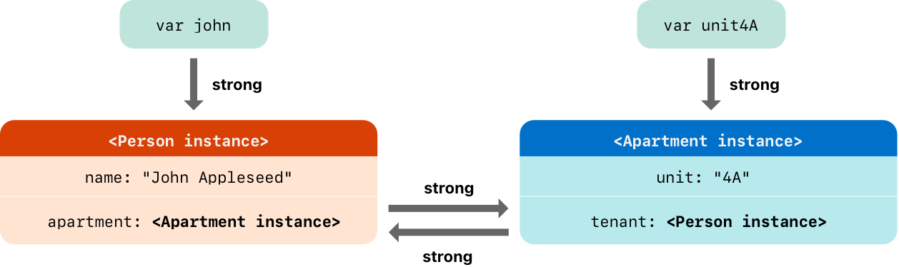

# Swift

Swift 是一门展现苹果工程师文化精髓的优雅语言, 融汇了现代编程语言的精华以及开源社区的多样性. 其编译器为专为性能所调优, 语言专为开发所优化, 二者绝不互相妥协. 

- 变量一定是在使用前初始化的；
- 数组索引会检查越界错误；
- 整数会检查溢出；
- 可选项保证了 nil 值会显式处理；
- 内存自动管理；
- 错误处理允许从意外错误中恢复控制. 

## 基本语句

变量声明与赋值

```swift
var value_name,  ...; // 仅声明
var value_name = ...; // 声明和赋值
value_name = ...; // 赋值
```

常量声明与赋值

```swift
let value_name = ...; // 声明和赋值
```

注释语句

```swift
// 这是一个注释
/* this is also a comment,  but written over multiple lines */

/* 这是第一个多行注释的开头
/* 这是第二个嵌套在内的注释块 */
这是第一个注释块的结尾*/

```

>[!tip]
> 变量和常量是用来存储和操作数据值的标识符; 注释用于提供对代码的解释和说明,  增强代码可读性.

## 数据类型

值类型: 在被指定到常量、变量或传递给函数时, 会被直接复制其值的类型. 这包括整数,  浮点数,  布尔量,  字符串,  数组,  字典,  结构体,  枚举等. 

引用类型: 在被指定到常量、变量或传递给函数时, 实际上是在内存中指向相同实例或数据的引用, 而不是直接复制其值. 这包括类,  闭包,  函数等. 

> [!tip]
> 变量或常量声明时,  编译器会自动根据你赋值时的实际值去推断数据类型,  此外也可以通过提供类型标注,  来明确变量或常量能够储存值的类型: `var value_name: TypeName;` 或是通过类型转换实现将其他类型转换到当前类型.

类型标注和类型转换

```swift
var value_name: TypeName; // 单变量标注
var value1,  value2,  ...: TypeName; // 多变量标注

// 支持: UInt8 -> UInt16 | Int <-> Double/Float | [Character] -> String 等
let typeOne: TypeName1 = ...;
let typeTwo = TypeName2(typeOne); // 类型转换强制
```

类型别名

```swift
typealias OtherTypeName = TypeName; 给指定类型起个其他名字
```

### 基本类型

Swift 中的基本类型是通过结构体和枚举来实现的,  除了存储值外,  有自己的属性和方法. 这里仅介绍具体有哪些类型及其值使用方法,  细节方面查看具体类型的详细文档.

整数类型
```swift
// TypeName: (U)Int8 | (U)Int16 | (U)Int32 | (U)Int64 | (U)Int
let value: Int = 0;
```

浮点数类型

```swift
// TypeName: Float | Double
let value = 0.0; // 直接赋值
```

数值型字面量

```swift
// TypeName: 
// 整数类型 二进制数: 0b| 八进制数: 0o| 十六进制数: 0x
let binaryInteger = 0b10001; // 17 in binary notation
let octalInteger = 0o21; // 17 in octal notation
let hexadecimalInteger = 0x11; // 17 in hexadecimal notation

// 浮点类型及其可选指数使用方式
let decimalDouble = 12.1875;
let exponentDouble = 1.21875e1; // 十进制的指数使用方式
let hexadecimalDouble = 0xC.3p0; // 十六进制的指数使用方式「必须有」

// 额外的零或者添加下划线可以被用来增加代码的可读性
let paddedDouble = 000123.456;
let oneMillion = 1_000_000;
let justOverOneMillion = 1_000_000.000_000_1;
```

布尔类型

> 非布尔类型无法直接当作 Bool 值使用,  必须用可以转换为 Bool 值的运算表达式间接转换,  比如比较表达式

```swift
// TypeName: Bool

let boolFlag = true;
let boolFlag = false;
```

元组
> 把多个任意类型值合并成单一的复合值. 
```swift
let http404Error = (Int,  String,  Bool,  ...); // 简单元组
let (statusCode,  statusMessage,  ...) = http404Error; // 拆解元组
let (justTheStatusCode,  _,  _) = http404Error; // 部分拆解
http404Error.0; http404Error.1; http404Error.2; ...; // 索引访问
let http200Status = (statusCode: 200,  description: "OK",  ...) // 位置命名
http404Error.statusCode; http404Error.description; ...; // 命名访问

```

### 字符串类型

字符类型

```swift
// TypeName: Character
let exclamationMark: Character = "!";
```
Unicode 标量

> 每一个字符可以是多 Unicode 标量的集群,  共同组合成为单个可读字符

```swift
// U+0000 - U+D7FF; U+E000 - U+10FFFF

let eAcute: Character = "\u{E9}" // 单 Unicode 标量表示
let combinedEAcute: Character = "\u{65}\u{301}" // 双 Unicode 标量表示

```

字符串字面量

- 起始于 `"""` 终止于下一个 `"""`
- 通过反斜杠 `\` 使得特定行换行失效,  仅使代码易读
- 通过额外的空行为起始或结束位置添加换行符,  默认没有.
- `"""` 的缩进控制了内容的起始缩进位置,  是统一的
- 特殊字符: `\0` (空字符) | `\\` (反斜杠) | `\t` (水平制表符) | `\n` (换行符) | `\r` (回车符) | `\"` (双引号)  | `\'` (单引号) | `\u{n}` (Unicode 标量)
- 是值类型,  赋值或传递时,  使用的是其拷贝,  而不是自身
- 支持索引和遍历操作
- 支持 `+` | `+=` 运算符实现字符连接; 
- 支持以 `\(...)` 的形式进行插值
- 支持比较运算符进行检查,  从左向右,  按照最终的 Unicode 字符集进行判别
- 通过前后添加扩展 `#` 使得特殊字符转义或插值失效; 同时可在内部的特定特殊字符 `\` 后面添加相同数量的扩展 `#` 符使得其独自生效; 通过前后添加扩展 `#` 为多行字符串指定额外的起始终止位置
- 不能通过整数值进行索引访问数据

```swift
// TypeName: String
var emptyString = ""; var anotherEmptyString = String(); // 空字符串
let stringValue = "Some string literal value"; // 赋值初始化
let message = "\(0.5) times 2.5 is \(Double(0.5) * 2.5)" // 插值初始化
let stringInfo = """

\"\"\"
The White Rabbit put on his spectacles.  "Where shall I begin,  \
please your Majesty?\u{1F496}" he asked.

"Begin at the beginning, " the King said gravely,  "and go on \
till you come to the end; then stop."
\"\"\"

"""

```

字符串方法

- `~.append(...)` : `s.append(...)` 追加字符或字符串
- `~.count` : 获取字符串内的字符计数,  需要注意 Unicode 集群算一个计数
- `~.startIndex` : 获取第一个字符的位置
- `~.endIndex` : 获取最后一个字符后面的位置
- `~.index(...)` : `s.index(before: greeting.endIndex)` | `s.index(after: greeting.startIndex)` | `s.index(greeting.startIndex,  offsetBy: 7)` | `.index(of: ", ")` : 获取指定索引前一位 | 后一位 | 偏移位位置的索引 | 获取指定字符所在的第一次索引位置
- `~.indices` : 获取所有索引位置
- `~.insert(...)` : `s.insert("!",  at: s.endIndex)` | `s.insert(contentsOf: " there",  at: s.index(before: s.endIndex))` : 在特定索引位置插入字符 | 在指定特定索引位置插入字符串
- `~.remove(...);.removeSubrange(...)` : `.remove(at: s.index(before: s.endIndex))` | `.removeSubrange(range)` : 在特定索引位置删除字符 | 删除指定索引范围内的字符
- `.hasPrefix(_:);hasSuffix(_:)` : 查找字符串是否有指点前缀或后缀
- `.utf8; .utf16; .unicodeScalars; ` : 以不同的编码格式去访问字符串中的字符

### 可选项类型

可选项: 处理值可能缺失的情况, 表示一个变量或常量可能有值, 也可能没有值 `nil` , 定义时通过在类型后面加 `?` 定义普通的可选项, 或是通过在类型后面加 `!` 定义隐式展开的可选项, 使其在被访问是自动展开.

- 未显式初始化的可选项默认值为 `nil`
- 使用 `!` 符号可以强制展开一个可选项(获取和使用它的值). 前提是你确定可选项不是 `nil` 值，否则会引发运行时错误
- 使用 `if let` 或 `guard let` 可以在使用过程中安全展开, 将可选值赋予到指定常量中, 有值时直接转换赋值, 无值时会自动赋值一个对应的默认空值.
```swift
var possibleAnswer: String?; // 定义可选的 `String?`` 值类型,  并默认初始化为「无值」状态：`nil`
possibleAnswer = "The answer info"; // 重新赋值
let myAnswer = possibleAnswer!; // 对可选项的值进行强制展开,  获取其值及其实际类型 `String`; 如果此时「无值」会出错
if let myAnswer = String(possibleAnswer); // 进行可选项绑定,  将值赋予 `String` 类常量,  有值时会进行正常转换和赋值; 「无值」时赋值一个空 `String`; 

let assumedAnswer: String! = "The answer info"; // 隐式展开可选项,  使得后面使用它时,  不再需要强制展开或判值,  像普通变量一样使用. 如果此时「无值」会出错
let optionalString = assumedString; // 默认首先是可选值类型
let implicitString: String = assumedString // 遇到显示声明的类型,  则自动进行强制展开为对应类型

```
可选链: 在可选项的基础上, 允许在可选项上调用属性, 方法或下标, 同时部位因为 `nil` 状态而引发运行时错误. 使用可选项时, 在其后面加上 `?` 来实现.

- 可选链调用的结果是一个可选值, 即成功时返回包装成可选项类型的值, 失败时返回 `nil` 
- 可选链调用时, 如果可选项是 `nil` , 则同语句的后续操作不会再进行. 如 `optionalValue?.otherValue = func();` , `optionalValue` 是 `nil` 时, 等号右侧函数不会被执行.
- 可选链调用的方法可以没有返回值, 此时默认返回为 `Void?` 类型的可选值结果
- 可以通过连接多个可选链, 深入访问属性, 方法或下标, 并且返回值不会是套娃的可选的可选的...的类型.

```swift
class Room {
    let name: String
    init(name: String) { self.name = name }
class Address {
    var buildingName: String?
    var buildingNumber: String?
    var street: String?
    func buildingIdentifier() -> String? {
        if buildingName != nil {
            return buildingName
        } else if buildingNumber != nil && street != nil {
            return "\(buildingNumber) \(street)"
        } else {
            return nil
        }
    }
}
}
class Residence {
    var rooms = [Room]()
    var numberOfRooms: Int {
        return rooms.count
    }
    subscript(i: Int) -> Room {
        get {
            return rooms[i]
        }
        set {
            rooms[i] = newValue
        }
    }
    func printNumberOfRooms() {
        print("The number of rooms is \(numberOfRooms)")
    }
    var address: Address?
}
class Person {
    var residence: Residence?;
}
let john = Person();
let roomCount = john.residence?.numberOfRooms // 可选链访问属性
john.residence?.address = Address(); // 可选链为属性赋值
let firstRoomName = john.residence?[0].name; // 可选链访问下标
john.residence?.printNumberOfRooms(); // 可选链访问方法
let johnsStreet = john.residence?.address?.street;// 多层可选链
john.residence?.address?.buildingIdentifier()?.hasPrefix("The"); // 函数返回值也可以链接
```

### 数组类型

以有序的方式来储存相同类型的值,  同时可以有重复值存在

- 支持 `+` 运算符或 `+=` 进行数组连接
- 支持下标取值或改值 `arr[i]` ; 同时支持范围类型下标集合改变多个值
- 

```swift
var someInts: [Int] = Array<int>(); var someInts: [Int] = [Int](); // 构造空数组
var threeInts: [Int] = Array(repeating: 0,  count: 3);// 默认值初始化
var someInts: [Int] = [0,  1,  2]; // 字面量初始化
someInts = []; // 上述内容经提供类型信息后,  可直接用空字面量赋值

var someInts: [Int] = [Int](set...); // 从集合类型转换初始化

```

数组属性和方法
- `~.count` 得出数组中元素的数量
- `~.isEmpty` 检查是否为空状态
- `~.append(_:)` 末尾添加新的元素 `arr.append(1)`
- `~.insert(_:at:)` 特定的索引位置插入元素 `arr.insert(2,  at: 1)`
- `~.remove(at:)` 特定的索引位置移除元素 `arr.remove(at: 1)`
- `~.removeLast()` 移除末尾元素,  避免使用 `remove` 进行 `count` 属性查询

### 集合类型

将同一类型且不重复的值无序地储存

- 支持 `==` 运算符判断两个集合是否包含有相同的值

```swift
var someInts: Set<Int> = Set<int>(); // 构造空集合
var threeInts: Set<Int> = Set(repeating: 0,  count: 3);// 默认值初始化
var someInts: Set<Int> = [0,  1,  2]; // 字面量初始化,  必须显示声明类型
someInts = []; // 上述内容经提供类型信息后,  可直接用空字面量赋值

```

数组属性和方法
- `~.count` 得出集合中元素的数量
- `~.isEmpty` 检查是否为空状态
- `~.insert(_:)` 插入元素 `set.insert(2)`
- `~.remove(_:)` 移除元素 `set.remove(1)`
- `~.removeAll()` 移除所有元素
- `~.contains(_:)` 判断是否包含特定元素 `set.contains(2)`
- `~.sorted()` 获取从小到大进行排序的集合元素组成的数组
- `~.intersection(_:)` 创建一个只包含两个集合共有值的新集合；
- `~.symmetricDifference(_:)` 创建一个只包含两个集合各自有的非共有值的新集合；
- `~.union(_:)` 创建一个包含两个集合所有值的新集合；
- `~.subtracting(_:)` 创建一个两个集合当中不包含某个集合值的新集合. 
- `~.isSubset(of:)` 验证一个集合的所有值是被某集合包含；
- `~.isSuperset(of:)` 验证一个集合是否包含某个集合的所有值；
- `~.isStrictSubset(of:)` 或者 `~.isStrictSuperset(of:)` 验证是个集合是否为某一个集合的子集或者超集, 但并不相等；
- `~.isDisjoint(with:)` 验证两个集合是否拥有完全不同的值. 

### 字典类型

储存**无序**的互相关联的同一类型的键和同一类型的值的集合

- 支持下标取值添值和改值 `dict[key] = ?` ,  返回可选类型值,  可能是旧值,  可能是空值; 可以使用下标脚本语法给一个键赋值 `nil` 来从字典当中移除一个键值对;
- 支持 `==` 运算符判断两个集合是否包含有相同的值

```swift
var someInts: Dictionary<Int,  String> = Dictionary<Int,  String>(); // 构造空集合
var threeInts: [Int,  String] = Dictionary;// 默认值初始化
var someInts: [Int,  String] = [0: "0",  1: "1"]; // 字面量初始化
someInts = []; // 上述内容经提供类型信息后,  可直接用空字面量赋值

```

字典属性和方法
- `~.count` 得出字典中元素的数量
- `~.isEmpty` 检查是否为空状态
- `~.updateValue(_:forKey:)` 设置或者更键值,  返回可选类型值,  可能是旧值,  可能是空值 `dict.updateValue("3",  forKey: 3)`
- `~.removeValue(forKey:)` 从字典里移除键值对 `dict.removeValue(forKey: 3)`
- `~.keys; ~.values` 获取键或值的集合

## 数值运算符

- 赋值运算符 `a = b; (x,  y) = (1,  2);` ,  没有返回值
- 算术运算符 `a+b; a-b; a*b; a/b;` 有返回值,  不支持值溢出行为(超出类型的取值范围)
- 余数运算符 `a % b;` 
- 一元减号运算符 `-a`
- 一元加号运算符 `+a`
- 组合赋值符号 `a+=b; ` 无返回值
- 比较运算符 `a==b; a != b; a > b; a < b; a >= b; a <= b; ===; !==; ` 返回 Bool  类型值,  需要值是可比较的
- 三元条件运算符 `question ? answer1 : answer2;` 
- 合并空值运算符 `a ?? b` 如果可选项 a  有值则强制展开 a 并返回, 如果是「无值」, 则返回默认值 b . 
- 区间运算符  `a...b` 和  `a..<b`  根据指定范围,  返回一组值. 当作数组等类型数据的下标使用时,  可以省略一侧数值,  使其默认为此侧边界
- 逻辑运算符 `!a; a && b; a || b` 仅适用于布尔类型,  组合时从左向右
- 显式括号 `()`
- 特征运算符  `===` 和 `!==` 用于检查两个常量或者变量是否引用自相同的实例

### 高级运算符

> [!TODO]
> https://developer.apple.com/documentation/swift/operator-declarations

按位运算符
- 按位与|或|非|异或运算符
- 按位左移|右移运算符

溢出运算符
- 溢出加法 ( `&+` )
- 溢出减法 ( `&-` )
- 溢出乘法 ( `&*` )

### 自定义运算符

新运算符使用关键字在全局级别声明 operator，并用 `prefix`,`infix` 或 `postfix` 修饰符标记：

```swift
prefix operator +++
```

## 函数

- 构造函数时,  函数由函数关键字,  函数名,  函数的形式输入参数名及其类型,  返回类型,  函数体组成
- 形式输入参数可以通过设置默认值,  使其调用时省略此形式参数
- 使用函数时,  通过 `函数名(实际参数...)` 的方式调用函数,  实际参数数量和类型应与构造时设定的形式参数对应
- 使用函数时,  返回值可以被忽略, 但是如果此函数需要返回值,  就必须返回. 
- 可以通过元组,  使函数返回多个值. `return (value1 ,  ...)`
- 可以通过将返回类型设置为可选项,  处理空值情况. `-> (value1: Int,  ...)?`
- 如果整个函数体是一个单一表达式, 那么此函数隐式返回这个表达式 `{"Hello,  " + person + "!"}`
- 函数里面也可以继续内嵌函数,  默认对外部隐藏,  除非被当作返回值.

函数构造与使用示例

```swift
// 无形式参数,  无返回值函数
func func_name(){
    ...
}

// 无形式参数,  有返回值函数
func func_name() -> String {
    return "hello,  world";
}

// 无形式参数,  多返回值函数
func func_name() -> (value1: Int,  ...) {
	...
    return (value1,  ...)
}
let values = func_name();
values.value1; values.valu2;...;

// 含形式参数及其可选参数标签的函数,  逗号分隔不同参数
func func_name(arg1: String,  arg2_tag arg2: String,  ...) -> String {
    ...
    return ...
}
func_name("arg1",  "arg2",  ...); func_name(arg1:"arg1",  arg2_tag:"arg2", ...); 

// 含可变形式参数的函数,  ...标识此类型,  最终为指定类型的数组存储形式
func func_name(args_tag args: String...) -> String {
	...
    return ...;
}

// 含输入输出类型的形式参数的函数,  `inout` 关键字标识此类型,  值只能是单一变量,  不能有默认值,  类似于 c++ 的引用传递

func func_name(_ arg1: inout Int,  _ arg2: inout Int) {
	...
}
func_name(&value1,  &value2);
```


函数类型与使用示例

```swift
// 构造函数类型的变量
func func_name(_ arg1: Int,  _ arg2: Int) -> Int {
    return ...;
}
var func_name2: (Int,  Int) -> Int = func_name;

// 构造输入含有函数类型参数的函数

func use_func(_ func_name: (Int,  Int) -> Int,  _ arg1: Int,  _ arg2: Int) {
    return func_name(arg1, arg2);
}

// 构造返回函数类型参数的函数
func choose_func(backwards: Bool) -> (Int,  Int) -> Int {
    return func_name; return func_name2;
}

```

### 闭包(匿名函数)

一种用于传递的功能性独立代码块,  没有名字,  用于减少简单函数块的代码编写.

- 闭包可以当作变量使用,  并且是引用类型,  即赋值一个闭包到不同变量或常量时,  它们指向的是同一个闭包
- 闭包可以进一步通过更简洁化的构造方式来缩减代码量
	- 闭包可以根据上下文推断自己的形式参数和返回值的类型. 比如,  在将闭包作为函数参数传递时,  由函数已有的形参类型,  减少闭包的代码编写.
	- 通过提供的参数名简写省去书写输入形参; 
	- 通过直接使用特殊运算符,  省去相关闭包的多余语句. 
	- 闭包如果是单表达式,  可以隐式返回此表达式的结果值,  即省略 return 关键字.
- 当闭包用于函数的最后一个输入参数时,  通过尾随闭包写法,  可以增强特别长的闭包表达式的可读性.
- 闭包可以捕获和使用其所在位置的上下文中常量或变量,  即使原作用域不存在. 即可以延长这些数据的生命周期. 特殊的,  如全局函数是一个有名字但不会捕获任何值的闭包. 内嵌函数是一个有名字且能从其上层函数捕获任意值的闭包.
- 当闭包用于函数时,  可以通过自动闭包,  将函数的实际输入参数(单一表达式)打包成闭包,  并在调用时隐式返回此表达式的结果值. 此功能通过 `@autoclosure` 标志标记形式参数来使用: `func func_name(arg1_tag arg1: @autoclosure (...) -> ...) {...}`
- 闭包可以通过闭包逃逸,  在自身被声明时的作用域之外使用. 此功能通过 `@escaping` 标志标记形式参数来使用: `func func_name(arg1_tag arg1: @escaping (...) -> ...) {...}`
- 

```swift

// 闭包表达式语法
{ (parameters) -> return_type in
    statements
}

// 举例: 原始函数
func func_name(_ s1: String,  _ s2: String) -> Bool {
    return s1 > s2
}
// 闭包写法
var func_name: (String,  String) -> Bool = { 
	(s1: String,  s2: String) -> Bool in 
	return s1 > s2 
};

// 自动闭包写法,  不接受任何实际参数,  省略了形式参数声明和返回类型声明,  并且仅在被调用时才执行(延迟处理),  并自动返回内部打包的表达式的值 
var func_name = {func_name("1",  "2")};
var result:BOOL = func_name();

// 当传递给函数或方法时,  可以省略参数类型和返回类型. 因为编译器可以由函数已有的形参类型推导出实际参数
func use_func(_ arg1: String,  _ arg2: String,  _ func_name: (String,  String) -> Bool) {
    return func_name(arg1, arg2);
}
use_func("1",  "2",  func_name: { s1,  s2 in return s1 > s2 } );

// 当闭包内部是单表达式时,  可以进行隐式返回,  即省略 return 关键字.
use_func("1",  "2",  func_name: { s1,  s2 in s1 > s2 } );

// 尾随闭包写法示例,  甚至如果闭包作为函数唯一参数时,  可以省略 `()`
use_func("1",  "2"){ s1,  s2 in return s1 > s2 };

// 多闭包尾随时,  除第一个闭包参数外,  其他闭包都需要指定参数标签
func use_func(_ arg1: String,  _ arg2: String,  _ func_name: (String,  String) -> Bool,  onFailure: () -> Void) {
    return func_name(arg1, arg2);
    return onFailure();
}

use_func("1",  "2") { 
	s1,  s2 in return s1 > s2
	} 
	onFailure:{...}; 
// 
```

逃逸闭包和非逃逸闭包
- 一个接受闭包作为参数的函数, 该闭包可能在函数返回后才被调用, 即闭包逃离了函数的作用域, 这种闭包称为逃逸闭包. 声明函数时,  通过关键字 `@escaping` 来明确闭包是允许逃逸.  `func func_name(arg1:@escaping (Any) -> Void) {}`
- 一个接受闭包作为参数的函数, 闭包是在这个函数结束前内被调用, 这种闭包称为非逃逸闭包,  默认闭包参数. 

## 类,  结构体和枚举

类,  结构体和枚举是用来定义复杂数据类型的模板,  由属性,  方法和初始化器组成. 通过此模板可以创建具体化的实体对象,  可以被直接使用,  称为实例.

- 属性分为存储类型属性和计算类型属性,  存储类型属性用于存储常量或变量,  计算类型属性用于存储一些需要通过特定计算过程而得到的值. 这些属性默认只有具体化为实例后才能使用(实例属性),  但是可以通过声明为静态类型,  通过模板直接使用(类型属性).
- 方法是与类、结构体或枚举相关联的函数,  封装了数据类型提供的特定功能. 与属性一样,  这些属性默认只有具体化为实例后才能使用(实例属性),  但是可以通过声明为静态类型,  通过模板直接使用(类型属性).
- 初始化器是准备类,  结构体和枚举实例使用的过程. 它为实例中的每个存储属性设置初始值,  并执行其他必要的设置. 可以定义多个初始化器来满足不同的初始化需求.

### 枚举类型

枚举类型用于管理一组特定的值「枚举成员」,  每个枚举成员都可以被赋予一个有意义的名称, 而其对应的值可以是字符串、字符、任意的整数值, 或者是浮点类型.

- 枚举类型的名称必须首字母大写
- 枚举成员在被创建时不会分配一个默认的整数值(即不默认关联整数值),  使得彼此间值独立,  可以有不同类型值. 除非被手动指定,  设置原始值. 
- 每个枚举类型都相当于定义了一个全新的类型. 在使用枚举类型中的枚举成员进行赋值时,  可以自动进行类型推断,  无需再声明被赋值的变量类型.
- 枚举类型声明的变量,  可以通过 `.case_name` 的方式访问枚举类型内部不同的枚举成员. 同样也可以在 `switch` 语句中使用,  不过必须要覆盖所有枚举成员的判断.
- 可以通过将枚举类型声明为可迭代类型,  允许自身被遍历,  并默认生成一个包含所有枚举成员的集合类型 `allCases` . 示例:  `enum SomeCase: CaseIterable{...}; SomeCase. allCases`
- 可以通过将枚举类型声明为指定类型,  使得内部存储相同类型的枚举成员,  同时为它们设置预先填充的原始值. 对于整数或字符串,  可以进行隐式的原始值分配(默认从 0 开始,  一个比一个 +1)
- 对于拥有原始值的枚举类型,  可以通过原始值访问内部的枚举成员. 示例: `let possibleCase = SomeCase(rawValue: 0)` 返回一个可选值类型.

```swift
// 带原始值的构造
enum ASCIIControlCharacter: Character {
    case tab = "\t";
    case lineFeed = "\n";
    case carriageReturn = "\r";
}

// 默认构造
enum SomeCase {
	case case_name1; 
	case case_name2,  case_name3,  ...;
	case case_tuple(Int,  Int,  Int,  Int); // 值与类型关联
	case case_string(String); // 值与类型关联
	case ASCIIControl(ASCIIControlCharacter);
}

var case_ = SomeCase.case_name1; // 初始化
case_ = .case_name2; // 更换类型
case_ = .case_tuple(0,  1,  2,  3); // 更换并关联值
case_ = .qrCode("ABCD"); // 更换并关联值

// 支持整数或字符串的隐式初始化
enum Planet: Int {
    case one = 1,  two,  three;
}
enum CompassPoint: String {
    case north,  south,  east,  west; // 值与 case name 相同
}
```
- `~.case_name.rawValue` 属性,  访问一个枚举成员的原始值

### 类类型

- 类是引用类型,  其常量实例仅对当前实例对象有效,  对其内部成员无效
- 继承允许一个类继承另一个类的特性,  包括属性和方法. 子类可以重写父类的方法、添加新的方法和属性,  从而扩展或修改父类的功能. 
- 在一个类的实例被释放之前, Swift 允许执行反初始化操作. 这通常用于清理和释放被实例所持有的资源. 反初始化由 `deinit` 方法实现. 
- 引用计数允许不止一个对类实例的引用. 
- 下标允许通过在实例名称后面的方括号内使用索引值或其他键来访问实例的元素. 它们提供了一种快速访问集合,  列表或序列元素的方式.

继承: 一个类可以从另一个类继承方法, 属性和其他的特性. 被继承的为父类, 新类叫子类.

- 子类可以调用和访问自己父类的方法, 属性和下标方法
- 子类可以进一步重写父类的方法, 属性和下标方法
- 可以通过关键字 `final` 禁止方法, 属性和下标方法被重写
```swift
// 类构造

class Vehicle {
    var currentSpeed = 0.0;
    var description: String {
        return "traveling at \(currentSpeed) miles per hour";
    }
    func makeNoise() {
        // do nothing - an arbitrary vehicle doesn't necessarily make a noise
    }
}

// 类实例
let someVehicle = Vehicle();
someVehicle.description; // 点语法来访问一个实例的属性的属性(如果有)


// 类继承
class Bicycle: Vehicle {
    var hasBasket = false;
}

class Tandem: Bicycle {
    var currentNumberOfPassengers = 0;
}

class Train: Vehicle {
    override func makeNoise() { // 方法重写
        print("Choo Choo")
    }
}

class Car: Vehicle {
    var gear = 1;
    override var description: String { // 属性重写, 可以在计算属性或存储属性间任意切换
        return super.description + " in gear \(gear)";
    }
}

class AutomaticCar: Car {
    override var currentSpeed: Double { // 属性观察器重写
        didSet {
            gear = Int(currentSpeed / 10.0) + 1
        }
    }
}

```

### 结构体类型

- 结构体是值类型,  因此对于常量类型的结构体实例,  其内部成员也全部无法被修改.
- 所有的结构体都有一个自动生成的成员初始化器,  即构造实例时,  可以通过具体的属性名称进行内部属性的初始化.
- 下标允许通过在实例名称后面的方括号内使用索引值或其他键来访问实例的元素. 它们提供了一种快速访问集合,  列表或序列元素的方式.


```swift
// 结构体构造
struct Resolution {
  var width = 0;
  var height = 0;
}

// 结构体实例构造
let someResolution = Resolution();
someResolution.width; // 点语法来访问一个实例的属性
```

### 属性

属性是特定类,  结构体或枚举相关联的值,  可以用于存储值「存储属性」或提供计算值「计算属性」,  同时提供了一些功能增强机制, 比如延迟初始化, 属性观察者, 属性包装, 类型属性等

存储属性只能由类和结构体定义

- 定义时可以为其提供默认值
- 如果想要存储属性仅在第一次使用时才进行设置,  可以通过 `lazy` 设置为延迟存储属性. 适用于一些需要执行复杂或代价高昂的配置过程来计算的值,  必须为变量.
- 可以通过闭包和函数来设置属性的默认值, 此闭包会在初始化过程中直接运行. 示例: `let value:TypeName ={...}()`

计算属性可以由类,  结构体和枚举定义,  它实际并不存储值,  而是提供一个读取器 `get` 和一个可选的设置器 `set` 来间接得到和设置其他的属性和值

- 计算属性的设置器如果没有为输入值定义名字, 则会被默认命名为 `newValue` . 即 `set {}` 等于 `set (newValue){}`
- 计算属性的读取器中,  如果是单一表达式,  则隐式返回此表达式.
- 计算属性如果没有设置器,  称作只读计算属性,  此时代码编写可以进一步简化. 即 `var value: TypeName {...}`

属性观察者是用于监视属性值变化的一种方法, 包含被修改前( `willSet` )和被修改后( `didSet` )两种观察者, 在对应情况发生时, 属性观察者会被调用. 可以为**类或结构体自身的存储属性**和**继承来的存储属性或计算属性**定义属性观察者. 

- `willSet` 被调用时会被传入新值, 而 `didSet` 被调用时会被传入旧值, 两者均为常量类型, 并在不提供自定义名字的情况下, 采用 `newValue` 或 `oldValue` 作为默认名称.
- 属性观察者不会在类继承的子类初始化器调用父类初始化器初始化父类属性的过程中被调用.
- 属性观察者在其观察的属性被通过 `inout` 关键字传递给函数时, 因为取消了值拷贝, 允许函数直接修改原值, 所以会触发观察者调用.

属性包装是用于封装具有同类属性所有操作(比如延迟初始化, 数据验证, 类型转换等)的一种方法, 减少定义属性时的相关代码. 构造时通过定义一个含有名称为 `wrappedValue` 属性的类,  结构体或枚举, 然后用  `@propertyWrapper`  关键字将此模板声明为属性包装. 之后就可以在代码中通过 `@` 符号使用所定义的属性包装.

- 属性包装可以通过定义不同的初始化器为内部元素设置不同的初始值. 
	- `init()` 初始化器对应没有指定初始值的情况; 
	- `init(wrappedValue:TypeName)` 对应为属性指定初始值的情况; 
	- 对于含有更多参数的初始化器 `init(wrappedValue:TypeName, ...)` , 可以通过 `@wrappedProperty(wrappedValue: TypeName, ...)` 接受实际参数, 调用对应的初始化器, 其中 `wrappedValue` 参数可以由直接指定初始值来替代 .
- 属性包装只有一个 `wrappedValue` 与被包装的属性关联, 是一对一的关系
- 属性包装可以在内部定义其他的属性作为映射值, 如 `var projectedValue` , 来暴露额外的功能. 并在被包装的属性前添加 `$` 符号获取此映射值(支持省略 `self`). 如果有其他名称的映射值, 可以再通过 `.` 符号指定需要获取的映射值.


类型属性可以由类,  结构体和枚举定义,  是属于类型本身的属性, 所有由此类型构造的实例, 都共享此属性. 可以通过 `static` 关键字将存储属性或计算属性进一步声明为类型属性. 

- 对于类类型的计算类型属性, 你可以使用 `class` 关键字来允许子类继承和重写父类的实现. 而  `static` 定义的类型属性, 无法被继承和重写.

```swift
struct ExampleStruct {
	let fixedValue: Int; // 无默认值常量属性
    var changeableValue : Int; // 无默认值的变量属性
    lazy var lazyProperty = DataImporter(); // 延迟属性
    var doubleValue : Int { // 计算属性
	    get{ // 读取器
		    return 2*changeableValue;
	    } // 设置器
	    set(newValue){
		    changeableValue = newValue/2;
	    }
    }
    var observedValue: Int = 0 {
        willSet(newValue) { // 在 observedValue 被存储之前被调用的属性观察者
            ...
        }
        didSet(oldValue) { // 在 totalSteps 被存储之后被调用的属性观察者
            ...
        }
    }

}

var exampleStruct = ExampleStruct(variables: 0,  constants: 3)// 默认初始化器初始化
exampleStruct.firstValue = 6;
exampleStruct.lazyProperty; // 延迟属性初始化


@propertyWrapper // 属性包装声明
struct SmallNumber {
    private var maximum: Int;
    private var number: Int;
	var projectedValue = false; // 被暴露在外的映射值
	static var storedTypeProperty = "Some value." // 类型属性
	static var computedTypeProperty: Int {return 1} // 类型计算属性
	
    var wrappedValue: Int { // 属性包装所需的属性及其操作
        get { return number; };
        set { number = min(newValue, maximum); };
    }
 
    init() { // 属性默认初始化器
        maximum = 12;
        number = 0;
    }
    init(wrappedValue: Int) { // 为 wrappedValue 指定初值的初始化器
        maximum = 12;
        number = min(wrappedValue, maximum);
    }
    init(wrappedValue: Int, maximum: Int) { // 提供更多参数的初始化器
        self.maximum = maximum;
        number = min(wrappedValue, maximum);
    }
}
struct SmallRectangle {
	// 使用属性包装为其他属性添加功能
    @TwelveOrLess var value: Int; // 无初值, 默认初始化
    @SmallNumber var height: Int = 1; // 给定初值初始化
    @SmallNumber(wrappedValue: 1, maximum: 12) var width: Int; // 给定指定参数的初始化
    @SmallNumber(maximum: 12) var width: Int = 1; // 给定指定参数的初始化
}
struct SomeStructure {
    @SmallNumber var someNumber: Int;
};
var someStructure = SomeStructure();
someStructure.$someNumber;  // 使用映射值
```

### 初始化器

初始化器是为类, 结构体或者枚举准备实例的过程, 通过在类型内部定义 `init(...){...}` 来实现, 主要给内部的存储属性设置初始值或者执行一些自定义操作. 

- 对于没有明确设置自定义初始化器的类, 结构体或枚举, 会自动生成一些初始化器(有则不生成)
	- 首先类和结构体会自动生成一个默认初始化器, 在此初始化器中, 有默认值属性的设置为默认值, 没有默认值的自动设置. `init(){...}`
	- 结构体又会自动生成一个包含所有成员属性的成员初始化器, 形式参数及其标签与属性名相同, 并且对于拥有默认值的成员属性, 在调用此初始化器时可以省略. `init(...){...}`
	- 类的继承关系, 会使得当子类没有定义任何指定初始化器时, 自动继承所有父类的指定初始化器.
- 在初始化器内部, 可以对常量属性进行值分配, 初始化完成后, 则不能再进行修改.
- 初始化器可以通过定义不同的输入形式参数, 实现不同的初始化过程. 当含有参数标签时, 必须在外部调用初始化器时通过参数标签传入形式参数. 否则就用 `-` 符号替代参数标签, 可以在调用时不考虑参数标签.
- 可选存储属性一般是不在初始化器中进行初始化的, 因此会被自动的设置为 `nil` 「无值 」状态.
- 如果有多个自定义的初始化器, 它们之间可以互相调用, 成为初始化器委托. 但是调用方式需要满足一定规则. 
	- 值类型(结构体和枚举)不支持继承, 初始化器可以直接通过 `self.init(...)` 调用其他初始化器, 根据输入参数标签选择对应的初始化器.
	- 类类型支持继承, 因此初始化要求所有的存储属性(包括继承来的)都要涵盖, 这里通过 Swift 提供的两种类型的初始化器实现.
		- 指定初始化器: 定义时与值类型初始化器相同, 至少有一个, 用于完全初始化该类的所有属性(包括继承来的), 在内部可以通过 `super.init(...)` 调用直系父类的初始化器来初始化继承来的属性, 或作为父类时被直系子类调用.
		- 便捷初始化器: 一种辅助初始化器, 可以没有, 通常用于在初始化时提供默认值, 或进行特殊实例的初始化. 定义时需要以关键字 `convenience` 开头, 并在内部必须调用同级的便捷初始化器或指定初始化器, 这样能保证最终至少一个指定初始化器. 不能被子类中以 `super.init(...)`  的形式调用.
		- 类初始化过程是一个两段式过程: 
			- 第一阶段依次从底部子类到顶部父类, 保证对所有存储属性(含继承的)的初始值进行初始化. 期间禁止调用任何实例方法, 读取值或引用 `self` , 只能进行如分配未初始化的内存, 执行指定初始化器初始化当前类定义的属性, 执行父类初始化器初始化父类的定义的属性等操作, 依次, 直至全部存储属性初始化完成. 对于父类定义的非常量属性, 只有经过父类初始化后, 对其再修改才能真正生效, 否则父类进行初始化时, 会强制覆盖此属性的所有修改. 
			- 第二阶段从顶部父类依次到底部子类, 进一步设置实例的自定义状态, 如执行指定初始化器的定制行为, 便捷初始化器的定制行为, 通过 `self` 调用实例方法等.
		- 子类默认不会继承父类的初始化器, 防止父类初始化过程出现错误. 此时如果需要子类实现一个与父类的指定初始化器相同的子类指定初始化器或子类便捷初始化器, 可以通过关键字 `override` 重写父类指定初始化器(包括自动生成的初始化器). 
		- 如果需要子类实现一个与父类的便捷初始化器相同的子类指定初始化器或子类便捷初始化器时, 直接定义即可, 不需要 `override` 关键字 .  如果添加了, 则会导致子类无法调用父类的此便捷初始化器.
		- 如果你的子类没有定义任何指定初始化器, 它会自动继承父类所有的指定初始化器. 此外, 如果你的子类提供了所有父类指定初始化器的实现——要么是通过继承来的, 要么通过在定义中提供自定义实现的——那么它自动继承所有的父类便捷初始化器.

```swift
struct Celsius {
    var temperatureInCelsius: Double;
    var description: String?;
    let label: String;
    init() {
        temperatureInCelsius = 32.0;
        label = "temperatureInCelsius";
    }
    init(_ celsius: Double) {
        temperatureInCelsius = celsius;
        label = "temperatureInCelsius";
    }
    init(fromFahrenheit fahrenheit: Double) {
        temperatureInCelsius = (fahrenheit - 32.0) / 1.8;
        label = "temperatureInCelsius";
    }
    init(fromKelvin kelvin: Double) {
        temperatureInCelsius = kelvin - 273.15;
        label = "temperatureInCelsius";
    }
}
let defaultPointOfWater = Celsius();
let boilingPointOfWater = Celsius(fromFahrenheit: 212.0);
let freezingPointOfWater = Celsius(fromKelvin: 273.15);

struct Size {
    var width = 0.0, height = 0.0;
}
struct Point {
    var x = 0.0, y = 0.0;
}
struct Rect {
    var origin = Point();
    var size = Size();
    init() {};
    init(origin: Point, size: Size) {
        self.origin = origin;
        self.size = size;
    }
    init(center: Point, size: Size) {
        let originX = center.x - (size.width / 2);
        let originY = center.y - (size.height / 2);
        self.init(origin: Point(x: originX, y: originY), size: size);
    }
}

let twoByTwo = Size(width: 2.0);


class Person {
    var name: String;
    var age: Int;
    
    // 指定初始化器
    init(name: String, age: Int) {
        self.name = name;
        self.age = age;
    }
}


class Child: Parent {
    var text: String
    override init(name: String, age: Int) {
        self.text = "Child"
        super.init(name: name, age: age);
        // 在此处可以修改 number 或 text
    }
}

class Student: Person {
    var school: String;

    // 子类的指定初始化器
    init(name: String, age: Int, school: String) {
        self.school = school;
        super.init(name: name, age: age);
    }
    
    // 子类的便捷初始化器
    convenience init() {
        self.init(name: "Unknown", age: 0, school: "Unknown");
    }
}

```

可失败初始化器是妥善处理类, 结构体或者枚举初始化实例失败的要进行的过程, 通过在类型内部定义 `init?(...){...}` 或 `init!(...){...}` 来实现, 主要解决初始化传入无效的形式参数值, 或缺少某种外部所需的资源, 又或是其他阻止初始化的情况.

- `init?(...){...}` 初始化时返回一个可选对象, 失败则返回 `nil` .
- `init!(...){...}` 初始化时返回一个可选对象, 但是会自动将其隐式解包, 遇到失败则会触发运行时错误. 相当于开发者认为这里一定不会出错.
- 不能定义可失败和非可失败的初始化器为相同的形式参数类型和名称.
- 可失败初始化器通过 `return nil` 来触发初始化失败.
- 带有原始值的枚举会自动获得一个可失败初始化器 `init?(rawValue:)`
- 类, 结构体或枚举类型的可失败初始化器可以被同类型内的另一个可失败初始化器调用. 同时类继承过程中, 子类的可失败初始化器调用父类的可失败初始化器. 在这个过程中, 中间有一个触发初始化失败, 整个过程直接失败, 后续代码不再执行.
- 类继承过程中, 子类可以用普通的或者可失败的初始化器来重写父类的可失败初始化器, 取消失败初始化.

```swift
// 结构体初始化失败处理实例
struct Animal {
    let species: String
    init?(species: String) {
        if species.isEmpty { return nil }
        self.species = species
    }
}

// 枚举初始化失败处理实例
enum TemperatureUnit {
    case Kelvin, Celsius, Fahrenheit
    init?(symbol: Character) {
        switch symbol {
        case "K":
            self = .Kelvin
        case "C":
            self = .Celsius
        case "F":
            self = .Fahrenheit
        default:
            return nil
        }
    }
}

enum TemperatureUnit: Character {
    case Kelvin = "K", Celsius = "C", Fahrenheit = "F"
}

// 失败传递
class Product {
    let name: String
    init?(name: String) {
        if name.isEmpty { return nil }
        self.name = name
    }
}
 
class CartItem: Product {
    let quantity: Int
    init?(name: String, quantity: Int) {
        if quantity < 1 { return nil }
        self.quantity = quantity
        super.init(name: name)
    }
}
// 非可失败初始化器重写一个可失败初始化器, 反过来不行
class Document {
    var name: String?
    // this initializer creates a document with a nil name value
    init() {}
    // this initializer creates a document with a non-empty name value
    init?(name: String) {
        self.name = name
        if name.isEmpty { return nil }
    }
}

class AutomaticallyNamedDocument: Document {
    override init() {
        super.init()
        self.name = "[Untitled]"
    }
    override init(name: String) {
        super.init()
        if name.isEmpty {
            self.name = "[Untitled]"
        } else {
            self.name = name
        }
    }
}
```

必要初始化器: 在类的初始化器前添加 `required` 关键字可以使得所有该类的子类都必须实现该初始化器.

反初始化器仅适用于类类型, 是在其实例被释放之前执行的代码过程, 通过在类类型内部定义 `deinit {...}` 来实现. 主要实现一些资源的释放, 对象的销毁, 信号的通知等操作. 
- 父类的反初始化器可以被子类继承, 并且子类的反初始化器实现结束之后父类的反初始化器会被调用.
- 反初始化器可以访问实例中的所有属性并且可以基于这些属性修改自身行为
- Swift 会自动处理实例的内存释放, 而反初始化器会在实例被释放之前自动被调用.
```swift
class Bank {
    static var coinsInBank = 10_000
    static func distribute(coins numberOfCoinsRequested: Int) -> Int {
        let numberOfCoinsToVend = min(numberOfCoinsRequested, coinsInBank)
        coinsInBank -= numberOfCoinsToVend
        return numberOfCoinsToVend
    }
    static func receive(coins: Int) {
        coinsInBank += coins
    }
}

class Player {
    var coinsInPurse: Int
    init(coins: Int) {
        coinsInPurse = Bank.distribute(coins: coins)
    }
    func win(coins: Int) {
        coinsInPurse += Bank.distribute(coins: coins)
    }
    deinit {
        Bank.receive(coins: coinsInPurse)
    }
}
```

### 方法

方法是与特定类,  结构体或枚举相关联的函数,  分为实例方法和类型方法, 通过 `.` 符号调用 .

实例方法的定义方式与普通函数一样, 只需将函数定义放在对于的类,  结构体或枚举内部

- 在实例方法中隐含一个 `self` 属性, 用来在实例方法中调用实例的其他方法或属性。
- 对于结构体或者枚举, 两者均是值属性, 因此想要在实例方法内部修改实例的其他属性时, 需要使用 `mutating` 关键字修饰此方法. 除了修改实例属性之外, 也可以修改实例自身为新实例
- 实例方法如果需要被重写, 直接使用 `override` 关键字进行方法重写.

类型方法可以由类,  结构体和枚举定义,  是属于类型本身的方法, 所有由此类型构造的实例, 都共享此方法. 可以通过 `static` 关键字将方法声明为类型方法.

- 在类型方法中隐含一个 `self` 属性, 用来在类型方法中调用其他类型属性或类型方法.
- 类型方法如果需要被重写, 需要使用 `class ` 关键字定义类型方法, 并通过 `override` 关键字进行方法重写.


```swift

class Counter {
    var count = 0
    func increment() {
        count += 1
    }
    func increment(by amount: Int) {
        count += amount
    }
    func reset() {
        count = 0
    }
}

struct Point {
    var x = 0.0, y = 0.0
    mutating func moveBy(x deltaX: Double, y deltaY: Double) {
        self = Point(x: x + deltaX, y: y + deltaY)
    }
}

enum TriStateSwitch {
    case off, low, high
    mutating func next() {
        switch self {
        case .off:
            self = .low
        case .low:
            self = .high
        case .high:
            self = .off
        }
    }
}
```

### 下标

下标是对特定类,  结构体或枚举类型定义的一种快捷访问方式, 支持通过索引值的方式设置或检索类型内部的值, 一般用于访问集合, 列表或序列中的元素.

- 下标方法可以允许类型通过 `Value[...]` 的语法对实例内部数值进行访问, 通过为类型定义名称为 `subscript` 的下标方法来实现.
- 支持定义多个具有不同类型的, 不同数量的形参输入的下标方法, 使用时会自动选择合适的下标方法.
- 不支持使用 `inout` 标识的输入输出类型参数或提供默认值的形参
- 支持通过 `static` 关键字将下标方法声明为类型方法.

```swift
struct TimesTable {
    let multiplier: Int;
    subscript(index: Int) -> Int {
        return multiplier * index;
    }
}

struct Matrix {
    let rows: Int, columns: Int;
    var grid: [Double];
    init(rows: Int, columns: Int) {
        self.rows = rows;
        self.columns = columns;
        grid = Array(repeating: 0.0, count: rows * columns);
    };
    func indexIsValid(row: Int, column: Int) -> Bool {
        return row >= 0 && row < rows && column >= 0 && column < columns;
    };
    subscript(row: Int, column: Int) -> Double {
        get {
            assert(indexIsValid(row: row, column: column), "Index out of range");
            return grid[(row * columns) + column];
        };
        set {
            assert(indexIsValid(row: row, column: column), "Index out of range");
            grid[(row * columns) + column] = newValue;
        };
    };
};
let threeTimesTable = TimesTable(multiplier: 3);
var matrix = Matrix(rows: 2, columns: 2);


```

### 类型转换

类型转换可以判断实例的类型, 也可以将该实例根据其继承关系或原始转换关系, 进行类型转换.

- `is` 运算符可以用于检查实例的类型, 返回 BOOL 类型值.
- `as?` 或 `as!` 用于将某个实例向下转换为其子类类型实例. 其中 `as?` 返回一个可选项类型, 用于处理转换失败的情况. `as!` 用于进行类型转换的同时将其强制展开, 因此遇到转换错误时会报错.
- Swift 为不确定的类型提供了两种特殊的类型别名:   `AnyObject`  表示任何类类型的实例和 `Any`  可以表示任何类型, 包括函数类型.


```swift

// 基类
class MediaItem {
    var name: String
    init(name: String) {
        self.name = name
    }
}

// 子类 1
class Movie: MediaItem {
    var director: String
    init(name: String, director: String) {
        self.director = director
        super.init(name: name)
    }
}

// 子类 2
class Song: MediaItem {
    var artist: String
    init(name: String, artist: String) {
        self.artist = artist
        super.init(name: name)
    }
}

// 类型库, 用于包含继承自同一父类的多种元素
// Swift 的类型检查器能够推断出 Movie 和 Song 有一个共同的 MediaItem 超类，因此它推断出库数组的 [MediaItem] 类型：
let library = [
    Movie(name: "Casablanca", director: "Michael Curtiz"),
    Song(name: "Blue Suede Shoes", artist: "Elvis Presley"),
    Movie(name: "Citizen Kane", director: "Orson Welles"),
    Song(name: "The One And Only", artist: "Chesney Hawkes"),
    Song(name: "Never Gonna Give You Up", artist: "Rick Astley")
]

var movieCount = 0
var songCount = 0

for item in library { // 使用类型检查去累计不同类型元素的数量
    if item is Movie {
        movieCount += 1
    } else if item is Song {
        songCount += 1
    }
}


// 类型向下转换
for item in library {
    if let movie = item as? Movie {
        print("Movie: '\(movie.name)', dir. \(movie.director)")
    } else if let song = item as? Song {
        print("Song: '\(song.name)', by \(song.artist)")
    }
}

// 任意类型
var things = [Any]()
 
things.append(0)
things.append(0.0)
things.append(42)
things.append(3.14159)
things.append("hello")
things.append((3.0, 5.0))
things.append(Movie(name: "Ghostbusters", director: "Ivan Reitman"))
things.append({ (name: String) -> String in "Hello, \(name)" })

for thing in things {
    switch thing {
    case 0 as Int:
        print("zero as an Int")
    case 0 as Double:
        print("zero as a Double")
    case let someInt as Int:
        print("an integer value of \(someInt)")
    case let someDouble as Double where someDouble > 0:
        print("a positive double value of \(someDouble)")
    case is Double:
        print("some other double value that I don't want to print")
    case let someString as String:
        print("a string value of \"\(someString)\"")
    case let (x, y) as (Double, Double):
        print("an (x, y) point at \(x), \(y)")
    case let movie as Movie:
        print("a movie called \(movie.name), dir. \(movie.director)")
    case let stringConverter as (String) -> String:
        print(stringConverter("Michael"))
    default:
        print("something else")
    }
}
```

### 类型嵌套

为了能够支持更复杂的类型定义, Swift 可以将支持的枚举、类和结构嵌套起来, 只需将其他类型的定义写在当前类型的大括号内即可.

```SWIFT
struct BlackjackCard {

    // nested Suit enumeration
    enum Suit: Character {
        case spades = "♠", hearts = "♡", diamonds = "♢", clubs = "♣"
    }


    // nested Rank enumeration
    enum Rank: Int {
        case two = 2, three, four, five, six, seven, eight, nine, ten
        case jack, queen, king, ace
        struct Values {
            let first: Int, second: Int?
        }
        var values: Values {
            switch self {
            case .ace:
                return Values(first: 1, second: 11)
            case .jack, .queen, .king:
                return Values(first: 10, second: nil)
            default:
                return Values(first: self.rawValue, second: nil)
            }
        }
    }


    // BlackjackCard properties and methods
    let rank: Rank, suit: Suit
    var description: String {
        var output = "suit is \(suit.rawValue),"
        output += " value is \(rank.values.first)"
        if let second = rank.values.second {
            output += " or \(second)"
        }
        return output
    }
}
```

### 运算符重载

```swift
struct Vector2D {
    var x = 0.0, y = 0.0
}


extension Vector2D {
    static func + (left: Vector2D, right: Vector2D) -> Vector2D {
       return Vector2D(x: left.x + right.x, y: left.y + right.y)
    }
}

extension Vector2D {
    static prefix func - (vector: Vector2D) -> Vector2D {
        return Vector2D(x: -vector.x, y: -vector.y)
    }
}

extension Vector2D {
    static func += (left: inout Vector2D, right: Vector2D) {
        left = left + right
    }
}

extension Vector2D: Equatable {
    static func == (left: Vector2D, right: Vector2D) -> Bool {
       return (left.x == right.x) && (left.y == right.y)
    }
}

```

## 进阶语句

### for-in 遍历语句

用 for-in 循环来遍历序列(范围值,  数组,  字符串,  集合,  字典等)

```swift
// 遍历数组或集合
let names = ["Anna",  "Alex",  "Brian",  "Jack"]
for name in names {
    ...;
}
// 遍历字典
let numberOfLegs = ["spider": 8,  "ant": 6,  "cat": 4]
for (animalName,  legCount) in numberOfLegs {
    ...;
}
// 遍历数字区间
for index in 1...5 {
    ...;
}
for index in 1..<5 {
    ...;
}

```

### while 循环语句

while 循环执行指定语句前,  会先判断自己的条件,  如果为 false 则不执行,  如果为 true 则执行代码块的语句

```swift
while condition {
	...
};
```

### repeat-while 循环语句

repeat-while 循环会先执行指定语句,  然后判断自己的条件,  如果为 false 则不继续执行,  如果为 true 则继续执行代码块的语句.

```swift
repeat {
    ...
} while condition;
```

### if 条件判断语句

if 语句它只会在判断条件为 true 的情况下才执行自己的代码块,  同时可以设置多个判断分支,  每个分支都有自己的独立代码块,  所有分支只有


// 布尔值 | If 语句以及强制展开 | 可选项绑定 |  可选项绑定

```swift
// 简单判断
var i = 30;
let i_charge = true;
if i <= 32 {
    ...
} else if i >= 86 {
    ...
} else {
    ...
}

// 判断后进行赋值,  减少代码编写; 所有分支都需要包含相同类型的值; 
let weatherAdvice = if temperatureInCelsius <= 0 {
    "It's very cold. Consider wearing a scarf.";
} else if temperatureInCelsius >= 30 {
    "It's really warm. Don't forget to wear sunscreen.";
} else {
    nil as String?;
}

```

可用性条件:

```swift
@available(macOS 10.12,  *)

if #available(iOS 10,  macOS 10.12,  *) {
    // Use iOS 10 APIs on iOS,  and use macOS 10.12 APIs on macOS
} else {
    // Fall back to earlier iOS and macOS APIs
}

if #unavailable(iOS 10) {
    // Fallback code
}
```

### Switch 匹配语句

将条件值与多个预设值进行匹配,  然后基于第一个成功匹配的值来执行对应的代码块,  然后直接退出
- 每匹配的函数体必须包含至少一个可执行的语句. 
- 可以使用区间进行多值匹配
- 可以进行元组类型值匹配,  其中使用下划线 `(0,  _)` 进行泛匹配,  使用区间进行多值匹配
- 可以进行临时值绑定,  `case (let x,  0):`
- 可以使用 `where` 分句来检查额外的情况,  `case let (x,  y) where x == y:`
- 匹配多个情况可以用逗号分隔
- 可以在匹配代码块语句中使用 `fallthrough` 关键字,  使得可以继续进行匹配判断
- 

```swift

// 简单匹配
switch value{
case value1:
    ...
case value2,  value3:
    ...
case value4..<value5:
	...
default:
    ...
}

// 匹配后赋值,  减少代码编写; 所有分支都需要包含相同类型的值; 
let anotherCharacter: Character = "a";
let message = switch anotherCharacter {
case "a":
    "The first letter of the Latin alphabet";
case "z":
    "The last letter of the Latin alphabet";
default:
    "Some other character";
}

// 元组匹配
let somePoint = (1,  1);
switch somePoint {
case (0,  0):
    ...
case (0,  _):
    ...
case (-2...2,  -2...2):
    ...
default:
    ...
}

// 枚举类型匹配

enum Barcode {
    case upc(Int,  Int,  Int,  Int)
    case qrCode(String)
}

switch productBarcode {
case .upc(let numberSystem,  let manufacturer,  let product,  let check):
    print("UPC: \(numberSystem),  \(manufacturer),  \(product),  \(check).")
case .qrCode(let productCode):
    print("QR code: \(productCode).")
}

```

### 通用控制转移语句

- `continue` 告诉循环停止正在做的事情并且再次从头开始循环的下一次遍历. 
- `break` 立即结束整个控制流语句,  支持循环语句,  遍历语句,  Switch 语句
- `return`
- `throw`

### guard 条件判断语句

guard 总是有一个 else 分支,  并且仅当要求一个条件必须是真时,  执行 guard 的代码块,  否则执行 else 的代码块

```
guard condition else {
	...
}
```

如果 guard 语句的条件被满足, 代码会继续执行直到 guard 语句后的花括号. 任何在条件中使用可选项绑定而赋值的变量或者常量在 guard 所在的代码块中随后的代码里都是可用的. 

如果这个条件没有被满足, 那么在 else 分支里的代码就会被执行. 这个分支必须转移控制结束 guard 所在的代码块. 要这么做可以使用控制转移语句比如 return ,  break ,  continue 或者 throw , 或者它可以调用一个不带有返回值的函数或者方法, 比如 fatalError() . 

相对于使用 if 语句来做同样的事情, 为需求使用 guard 语句来提升你代码的稳定性. 它会让正常地写代码而不用把它们包裹进 else 代码块, 并且它允许你保留在需求之后处理危险的需求. 

### 错误处理语句

错误处理是响应和接收来自你程序中错误条件的过程, 提供了定义, 抛出, 传递, 捕获和操纵等功能.


自定义错误类型, 通过 `Error` 协议和枚举类型定义不同的错误情况

```swift
enum VendingMachineError: Error {
    case invalidSelection;
    case insufficientFunds(coinsNeeded: Int);
    case outOfStock;
}

```


错误抛出, 通过在方法或函数中使用 `throw` 抛出错误, 相对应的, 这种函数声明时需要使用 `throws` 关键字表示这个函数可以抛出错误.
- 只有抛出函数可以传递错误, 任何在非抛出函数中抛出的错误都必须在该函数内部处理.

```swift
struct Item {
    var price: Int;
    var count: Int;
}
 
class VendingMachine {
    var inventory = [
        "Candy Bar": Item(price: 12, count: 7),
        "Chips": Item(price: 10, count: 4),
        "Pretzels": Item(price: 7, count: 11)
    ];
    var coinsDeposited = 0;
    
    func vend(itemNamed name: String) throws {
        guard let item = inventory[name] else {
            throw VendingMachineError.invalidSelection;
        };
        
        guard item.count > 0 else {
            throw VendingMachineError.outOfStock;
        };
        
        guard item.price <= coinsDeposited else {
            throw VendingMachineError.insufficientFunds(coinsNeeded: item.price - coinsDeposited);
        };
        
        coinsDeposited -= item.price;
        
        var newItem = item;
        newItem.count -= 1;
        inventory[name] = newItem;
    }
}
```

错误捕获, 可以在调用函数时捕捉函数抛出的错误, 并选择性的进行响应. 一般可以使用  `do-catch` 语句, `try?` 或 `try!` 进行错误捕捉和执行错误处理语句, 或是使用 `try` 捕捉错误, 但是不进行处理, 而是继续传递错误, 直至被处理或产生运行时错误.

- 使用 `do-catch` 语句, 可以通过代码块处理错误.  `do` 分句用于执行可能出现错误的代码块, `catch` 语句用于匹配错误和执行对应的此错误处理代码块. 
	- `catch` 没有匹配到的语句, 默认会继续进行传递.
	- `catch` 可以通过 `,` 符号同时匹配多个相关的错误.
	- 错误信息默认被绑定到 `error` 常量.
- `try?` 用于捕捉函数抛出的错误, 并将错误转换为可选项进行处理错误, 可选项类型取决于函数返回值类型.
- `try!` 用于取消函数抛出的错误.
```swift
// 错误传递
struct PurchasedSnack {
    let name: String
    init(name: String, vendingMachine: VendingMachine) throws {
        try vendingMachine.vend(itemNamed: name); // 捕捉, 不处理, 继续传递
        self.name = name;
    }
}

// 捕捉函数可能出现的错误
var vendingMachine = VendingMachine();
vendingMachine.coinsDeposited = 8;
do {
    try buyFavoriteSnack(person: "Alice", vendingMachine: vendingMachine);
} catch VendingMachineError.invalidSelection {
	let catchError = "Invalid Selection.";
} catch VendingMachineError.outOfStock {
	let catchError = "Out of Stock.";
} catch VendingMachineError.insufficientFunds(let coinsNeeded) {
	let catchError = "Insufficient funds.";
} catch { // 捕获未知的错误, 错误信息默认被绑定到 `error` 常量
	let catchError = error;
    // "Unexpected error."
}

// `try?` 进行错误处理

let x = try? buyFavoriteSnack(person: "Alice", vendingMachine: vendingMachine);

// `try!` 取消错误传递
let x = try! buyFavoriteSnack(person: "Alice", vendingMachine: vendingMachine);
```

断言和条件验证

```swift
// assert(_:_:),  调试时,  触发断言
let age = -3;
assert(age >= 0,  "A person's age cannot be less than zero");
assert(age >= 0);

// assertionFailure(_:file:line:),  调试时,  触发断言失败
assertionFailure("A person's age can't be less than zero.");

// precondition(_:_:file:line:),  调试和运行时,  触发先决条件验证,  可由编译器控制是否触发
precondition(index > 0,  "Index must be greater than zero.");

// fatalError(_:file:line:),  调试和运行时,  触发严重问题,  一定执行
fatalError("Unimplemented");
```

### defer 语句

`defer` 语句用于在退出当前代码块前执行一段代码, 无论是因为错误抛出, return 语句, 还是因为达到代码块的末尾. defer 块中的代码会在所有其他代码执行完毕后, 且在当前代码块退出前执行.

```swift
func processFile(filename: String) throws {
    if exists(filename) {
        let file = open(filename)
        defer {
            close(file)
        }
        while let line = try file.readline() {
            // Work with the file.
        }
        // close(file) is called here, at the end of the scope.
    }
}
```

### 语句标签

在进行语句嵌套执行时,  可以通过语句标签来实现控制转移语句的定向执行;

```swift
gameLoop: while square != finalSquare {
	diceRoll += 1
    if diceRoll == 7 { diceRoll = 1 }
    switch square + diceRoll {
    case finalSquare:
        // diceRoll will move us to the final square,  so the game is over
        break gameLoop
    case let newSquare where newSquare > finalSquare:
        // diceRoll will move us beyond the final square,  so roll again
        continue gameLoop
    default:
        // this is a valid move,  so find out its effect
        square += diceRoll
        square += board[square]
    }
}
print("Game over!")
```

## 并发(异步和并行)

### 结构化并发

结构化并发, 通过限制并发任务的创建和管理来简化并发编程, 意味着所有并发任务的生命周期受到其创建环境的控制.  Swift 的结构化并发, 包括异步和并行处理任务, 其根本构建在传统的线程之上, 但无需手动操作线程.

**异步代码**

通过一个可用的线程, 一次只执行一段程序代码块(函数或方法), 可以暂停和稍后恢复, 或是等到需要时再获取异步代码的结果, 避免某些耗时代码导致调用线程的阻塞. 异步代码使用 `async` 和 `await`  关键字定义和使用:
- `async`  用于标记函数代码块是异步的(有 ` throw ` 就在写在其左侧, 并记得标记 try 使用, 有返回值则写在返回箭头左侧), 表示此段程序代码将在另一个后台线程上执行, 从而不会阻塞其他任务所在线程.
- `await`  用于在指定位置调用异步函数或等待异步函数的结果. 当执行到 `await` 语句时, 会在此处建立一个恢复点, 然后暂停执行当前线程, 直到所等待的异步函数执行完成. 在等待期间, 不会阻塞其他线程的执行, 并在异步操作完成后恢复执行当前线程.
- 异步函数或方法的调用位置有特殊要求:
	- 异步代码可以在同类的被标记为异步执行代码段(函数, 方法, 属性)中调用
	- 异步代码可以在标记为 `@main` 的结构体、类或者枚举的静态 `main()` 方法中调用
	- 异步代码可以在非结构化并发构建的子任务中调用

对于耗时很长的异步代码, 可以通过手动调用 `Task.yield()` 将控制权交还给调度器, 让其他任务获得继续执行的时间片.

可以通过 `Task.sleep(for:tolerance:clock:)` 方法模拟耗时操作,使得当前代码挂起至少给定的时间.

不能在同步代码中调用异步代码, 因此需要考虑编写代码时, 自上而下的将代码转换为异步的.

```swift
func listPhotos(inGallery name: String) async throws -> [String] {
    try await Task.sleep(for: .seconds(2))
    return ["IMG001", "IMG99", "IMG0404"]
}

// 这里会暂停，等待网络请求完成，但不会阻塞线程, 其他任务仍然可以继续执行
let photos = try await listPhotos(inGallery: "A Rainy Weekend")
let sortedNames = photoNames.sorted()
let name = sortedNames[0]
let photo = await downloadPhoto(named: name)
show(photo)
```

**异步序列**

相比于异步代码, 异步序列提供了更高级别的抽象, 可用于异步处理一个个生成数据的场景.

使用 `AsyncSequence` ,  `AsyncIteratorProtocol` , `for await...in` 关键字定义和遍历异步数据序列结构. 
- `AsyncSequence` 用于自定义异步序列及其元素类型
- `AsyncIteratorProtocol` 用于自定义异步元素生成的方式.
- `for await...in`  用于遍历异步生成的元素, 同时当等待下一个可用元素时, 循环会潜在的在每一次遍历前挂起, 同时不会堵塞住其他任务.

```swift
struct MyAsyncSequence: AsyncSequence {
    typealias Element = Int
    func makeAsyncIterator() -> MyAsyncIterator {
        return MyAsyncIterator()
    }
}

struct MyAsyncIterator: AsyncIteratorProtocol {
    typealias Element = Int

    mutating func next() async -> Int? {
        // 生成异步的元素，或者返回 nil 表示结束
        // 这里可以进行异步操作，例如等待网络请求或其他异步任务完成
        await Task.sleep(1 * 1_000_000_000) // 模拟异步等待1秒
        return Int.random(in: 1...100)
    }
}

let asyncSeq = MyAsyncSequence()

Task {
    do {
        for await element in asyncSeq {
            print(element)
        }
    } catch {
        print("Error: \(error)")
    }
}
```


**并行调用异步代码**

并行调用用于需要多段异步代码同时独立运行的场景, 减少代码等待时间. 使用 `async let` 和 `await` 关键字可以实现多个异步代码的结果绑定和异步代码的并行调用.
- `async let` 用于执行异步代码, 同时不会停留在调用位置等待此代码的结果, 而是将此未来不知何时才能得到的结果与一个常量进行绑定, 等到需要时再使用. 
- `await` 用于在指定位置使用异步代码的结果常量. 当执行到 `await` 语句时, 会在此处建立一个恢复点, 然后暂停执行, 直到所等待的异步常量绑定的异步代码执行完成并返回结果. 在等待期间, 不会阻塞其他线程的执行, 并在异步操作完成后恢复执行.
- 异步代码发生暂停和恢复后, 可能与上次所在线程不同.

```swift
async let firstPhoto = downloadPhoto(named: photoNames[0])
async let secondPhoto = downloadPhoto(named: photoNames[1])
async let thirdPhoto = downloadPhoto(named: photoNames[2])
 
let photos = await [firstPhoto, secondPhoto, thirdPhoto]
show(photos)

```

**任务和任务组**

任务是 Swift 中的独立执行单元, 可以用于管理异步代码. async-let 语法就会隐式创建一个子任务. 而任务组用于管理多个子任务, 每个子任务都有相同的父任务, 允许创建动态数量的任务, 并控制任务的优先级和取消. 同时, 每个子任务都可以继续拥有自己的子任务.

- 在父任务中, 需要等待其子任务完成.
- 当为子任务设置更高的优先级时, 父任务的优先级会自动升级
- 当父任务被取消时, 其每个子任务也会自动取消
- 任务本地值有效且自动地传播到子任务

```swift
let photos = await withTaskGroup(of: Data.self) { group in
    let photoNames = await listPhotos(inGallery: "Summer Vacation")
    for name in photoNames {
        group.addTask {
            return await downloadPhoto(named: name)
        }
    }

    var results: [Data] = []
    for await photo in group {
        results.append(photo)
    }

    return results
}
```

Swift 并发使用协作取消模型, 即每个任务都会在执行过程中的适当位置检查它是否已被取消, 并适当地响应取消, 做出一些操作, 如抛出错误 `CancellationError` , 返回 `nil` 或空集合, 返回部分完成的工作等.

- 通过调用 `Task.checkCancellation()` 方法, 如果任务被取消, 调用 checkCancellation() 会抛出错误, 抛出任务可以将错误传播到任务之外, 从而停止任务的所有工作. 
- 通过读取 `Task.isCancelled` 属性, 允许在停止任务时执行清理工作, 例如关闭网络连接和删除临时文件, 更加灵活.
- 通过 `Task.withTaskCancellationHandler(operation:onCancel:)` 方法可以在需要时立即通知任务取消.
- 

```swift

let photos = await withTaskGroup(of: Optional<Data>.self) { group in
    let photoNames = await listPhotos(inGallery: "Summer Vacation")
    for name in photoNames {
        group.addTaskUnlessCancelled {
            guard isCancelled == false else { return nil } // 读取`Task.isCancelled` 属性确认任务是否取消
            return await downloadPhoto(named: name)
        }
    }


    var results: [Data] = []
    for await photo in group { // 收集任务组结果, 跳过 nil 值, 返回部分结果.
        if let photo { results.append(photo) }
    }
    return results
}
```


```swift
let task = await Task.withTaskCancellationHandler {
    // ...
} onCancel: {
    print("Canceled!")
}


// ... some time later...
task.cancel()  // Prints "Canceled!"


```

### 非结构化并发

与结构化并发不同, 非结构化并发没有特别强的依赖关系, 没有父任务, 拥有更加灵活的任务管理方式.

- 要创建在当前参与者上运行的非结构化任务，调用 `Task.init(priority:operation:)` 初始值设定项.
- 要创建不属于当前参与者的非结构化任务（称为分离任务），调用 `Task.detached(priority:operation:)` 类方法.

```Swift
let newPhoto = // ... some photo data ...
let handle = Task {
    return await add(newPhoto, toGalleryNamed: "Spring Adventures")
}
let result = await handle.value
```


**Actor 模型**

使用任务, 可以将程序分解为独立的不同并发部分, 使其彼此隔离. 但是有时也需要在并发环境中为不同任务提供安全地访问和修改任务间共享数据的能力, 保证数据访问的顺序性和一致性.

`actor` 用于管理和保护一些可变状态, 是引用类型, 其内部状态不受并发访问影响, 确保内部可变状态的并发访问问题. 与类不同, actor 通过将其状态封装在一个单独的执行上下文中来实现安全并发访问, 一次只允许一个任务访问其可变状态, 从而实现多个任务安全地访问和修改其状态.

- `actor` 关键字用于自定义可以被安全并发访问的数据类型.
- 普通属性和常量默认可以被外部访问; `private(set)` 可以用来限定属性只能被 `actor` 类型的内部代码更新值.
- 可以使用与结构和类相同的初始化语法来创建 actor 类型的实例
- 外部访问 actor 类型的属性或方法时, 无法直接访问, 而是需要使用 await 来标记潜在的挂起点, 直到前面的任务完成对同一属性或方法的操作后, 再访问. 相反, actor 类型的内部代码访问自身的属性或方法时, 不需要编写 await, 会自动通过 actor 的机制进行管理, 隐式地在必要时进行暂停和恢复.

特点:

- 顺序执行：在 actor 内部，代码在不同的挂起点之间按照编写的顺序运行，不会被其他并发代码打断。这意味着即使有多个任务同时访问 actor，actor 会按照它们被调用的顺序逐个执行，每个任务在 actor 内部的执行是有序的，不会混乱。
 - 本地状态交互： actor 的本地状态（即其属性和方法）只在该 actor 内部运行。其他任务或代码无法直接访问或修改 actor 的状态，只有 actor 自己的方法可以操作其状态。这种方式下，actor 内部的状态受到保护，只能通过 actor 的方法进行交互。
- 单一任务处理： 每个 actor 一次只处理一个任务。当一个任务访问 actor 时，actor 会依次处理每个任务，确保同时只有一个任务在执行。这样做可以保证操作的安全性和一致性，因为不会出现多个任务同时修改 actor 的状态。

```swift

actor TemperatureLogger {
    let label: String
    var measurements: [Int]
    private(set) var max: Int


    init(label: String, measurement: Int) {
        self.label = label
        self.measurements = [measurement]
        self.max = measurement
    }
}

let logger = TemperatureLogger(label: "Outdoors", measurement: 25)
print(await logger.max)
// Prints "25"

extension TemperatureLogger {
    func update(with measurement: Int) {
        measurements.append(measurement)
        if measurement > max {
            max = measurement // 不需要 await 进行等待, 暂停和恢复操作
        }
    }
}

extension TemperatureLogger {
    func convertFarenheitToCelsius() {
        measurements = measurements.map { measurement in
            (measurement - 32) * 5 / 9
        } // 当 map 操作进行时, 其他代码无法读取部分转换的 measurements
    }
}
```


**可发送类型**

值类型在传递时, 会进行独立拷贝, 因此始终可以安全的传递. 但是某些类型的实例可能包含可变部分, 如引用类型成员变量等, 此时需要考虑并发访问问题.

`Sendable` 是一种协议, 没有代码要求, 只有代码编写的语义要求. 用于标识特定类型是可以安全的在并发任务之间传递和共享的, 可以在调用 actor 方法时作为参数传递, 或者作为任务结果返回. 

- 当数据类型是值类型, 并且其内部所有可变部分也是遵循 `Sendable` 协议的安全可发送数据组成时, 当前数据类型也会成为 `Sendable` .
- 当数据类型内部没有可变部分, 并且不可变部分也都是遵循 `Sendable` 协议的安全可发送数据组成时, 当前数据类型也会成为 `Sendable` .
- 当数据类型包含可变部分, 但是内部的代码确保了对这些可变状态的安全处理时, 当前数据类型也会成为 `Sendable` .

```swift
// 隐含符合 Sendable 协议的结构版本, 仅具有可发送属性的结构, 并且该结构未标记为public或@usableFromInline
struct TemperatureReading: Sendable {
    var measurement: Int
}


// 显式地将类型标记为不可发送, 覆盖对可发送协议的隐式一致性
struct FileDescriptor {
    let rawValue: CInt
}
@available(*, unavailable)
extension FileDescriptor: Sendable { }


extension TemperatureLogger {
    func addReading(from reading: TemperatureReading) {
        measurements.append(reading.measurement)
    }
}


let logger = TemperatureLogger(label: "Tea kettle", measurement: 85)
let reading = TemperatureReading(measurement: 45)
await logger.addReading(from: reading)
```

## 宏(待学)

使用宏可以在编译时控制生成代码的过程, 实现一些简单的源代码替换.

### 独立宏

独立宏单独出现, 不附加到声明中, 可以在其调用位置产生一个值, 或是执行一个操作.

调用独立宏, 需要在其名称前写入数字符号 (#), 并在其名称后的括号中写入宏的所有参数

```swift

func myFunction() {
	// #function, 标准库中用于替换当前函数名称的宏
    print("Currently running \(#function)")
	// #warning("..."), 标准库中用于生成编译时警告的宏
    #warning("Something's wrong")
}


```

### 附加宏

附加宏修改它们所附加的声明, 向该声明添加代码, 例如定义新方法或添加协议一致性.

## 内置函数

IO 类型函数

```swift
// print( _:separator:terminator:)
print(someValue,  terminator: "");
print("The value is \(someValue)");

```
闭区间: `stride(from:to:by:)`  | 开区间: `stride(from:through:by:)`

```swift
let minuteInterval = 5
for tickMark in stride(from: 0,  to: minutes,  by: minuteInterval) {
    // render the tick mark every 5 minutes (0,  5,  10,  15 ... 45,  50,  55)
}

let hours = 12
let hourInterval = 3
for tickMark in stride(from: 3,  through: hours,  by: hourInterval) {
    // render the tick mark every 3 hours (3,  6,  9,  12)
}

```

## 协议

在 Swift 中, 协议类似于一份承诺或者规范, 定义了适合特定任务或功能的方法、属性和其他要求的蓝图, 但并不提供这些功能的具体实现. 使得类、结构或枚举可以采用该协议来提供这些要求的实际实现, 任何满足协议要求的类型都被称为符合该协议.

- 可以通过 `protocol` 关键字定义协议, 并在生命类型时, 将要遵循的协议名称放在类型名称后面, 用冒号分隔即可.  多个协议用逗号分隔. 
- 如果类有父类, 则将父类放在所有协议之前.
- 协议名称与类相同, 大写字母开头.


```swift
protocol SomeProtocol {
    // protocol definition goes here
}

class SomeClass: SomeSuperclass, FirstProtocol, AnotherProtocol {
    // class definition goes here
}
```

**属性要求**

通过协议可以要求类型必须或提供具有特定名称和类型的实例属性或类型属性, 不限制是存储属性或计算属性.

- 可以指定属性是否需要 `gettable` 或 `gettable && settable` . 要求 `settable`  时, 则隐性的要求不能是常量存储属性或只读计算属性.
- 属性要求始终声明为变量属性, 以 `var` 关键字为前缀.
- `static` 声明的类型属性需求, 必须在使用时也是用 `static` 关键字, 不能用 `class` 关键字.

```swift
protocol SomeProtocol {
    var mustBeSettable: Int { get set } // 要求属性必须可设置, 可获得
    var doesNotNeedToBeSettable: Int { get } // 要求属性可获得, 即可以是计算属性, 也可是存储属性
}

protocol AnotherProtocol {
    static var someTypeProperty: Int { get set } // 要求所需属性必须使用 static 关键字定义为类型属性(不能用 class 关键字定义可继承和重写的类型属性)
}

protocol FullyNamed { // 协议
    var fullName: String { get }
}

struct Person: FullyNamed {
    var fullName: String // 存储属性示例
}

class Starship: FullyNamed {
    var prefix: String?
    var name: String
    init(name: String, prefix: String? = nil) {
        self.name = name
        self.prefix = prefix
    }
    var fullName: String { // 计算属性示例
        return (prefix != nil ? prefix! + " " : "") + name
    }
}
let john = Person(fullName: "John Appleseed")
var ncc1701 = Starship(name: "Enterprise", prefix: "USS")

```

**方法要求**

通过协议可以要求类型必须提供具有特定名称的实例方法和类型方法, 遵循与普通方法相同的声明规则, 但是没有花括号, 不能指定默认值.

- `static` 声明的类型方法需求, 必须在使用时也是用 `static` 关键字, 不能用 `class` 关键字.

```swift
protocol SomeProtocol {
    static func someTypeMethod()
}

protocol RandomNumberGenerator {
    func random() -> Double
}

class LinearCongruentialGenerator: RandomNumberGenerator {
    var lastRandom = 42.0
    let m = 139968.0
    let a = 3877.0
    let c = 29573.0
    func random() -> Double {
        lastRandom = ((lastRandom * a + c)
            .truncatingRemainder(dividingBy:m))
        return lastRandom / m
    }
}
let generator = LinearCongruentialGenerator()
print("Here's a random number: \(generator.random())")
// Prints "Here's a random number: 0.3746499199817101"
print("And another one: \(generator.random())")
// Prints "And another one: 0.729023776863283"

```

**异变方法要求**

异变方法: 需要修改自己所属实例的方法, 即结构和枚举中通过 `mutating` 定义的方法.

通过协议可以要求类型提供的实例方法可以用来改变采用该协议的任何类型的实例, 只需要用 `mutating` 关键字将该方法标记为协议定义的一部分.
- 协议中添加 `mutating` 关键字之后, 为采用此协议的类编写该方法的实现时不需要编写 mutating 关键字

```swift
protocol Togglable {
    mutating func toggle()
}
enum OnOffSwitch: Togglable {
    case off, on
    mutating func toggle() {
        switch self {
        case .off:
            self = .on
        case .on:
            self = .off
        }
    }
}
var lightSwitch = OnOffSwitch.off
lightSwitch.toggle()
```

**初始化器要求**

通过协议可以要求类型提供特定的初始化器, 遵循与普通初始化器声明相同的规则, 但是没有花括号, 不能指定默认值.

- 当协议定义了初始化器要求, 如果遵循此协议的是类, 因为类有继承的概念, 此时协议所规定的初始化器对于子类也应是必需的, 因此需要在类中定义此初始化器时, 通过添加 `required` 关键字要求其子类也继承或可以重写它, 以便这些子类也符合协议。包含类中的指定初始化器或便利初始化器两种类型.
	- 如果类有 `Final` 关键字修饰, 标识此类无法有自己的子类, 则不需要使用 `required` 关键字.
- 当协议定义了初始化器要求, 并且有个父类遵循此协议, 那么如果有子类需要重写父类所遵循的协议中规定的初始化器, 并且此初始化器也要满足协议中的要求时, 可以通过同时使用 `required` 和 `override` 关键字
- 可以定义可失败的初始化器要求, 使得遵循该协议的类型可以用可失败的初始化器（ `init?` ）或者不可失败的初始化器（ `init` ）来满足这个要求.
- 如果是定义了一个不可失败的初始化器（使用 `init` ）, 那么遵循该协议的类型必须用不可失败的初始化器（ `init` ）或隐式解包的可失败初始化器（ `init!` ）来满足这个要求.

```swift
protocol SomeProtocol {
    init(someParameter: Int)
}

class SomeClass: SomeProtocol {
    required init(someParameter: Int) {
        // initializer implementation goes here
    }
}

class SubClass: SomeClass, SomeProtocol {
    required override init(someParameter: Int) {
        super.init(someParameter: someParameter)
        // initializer implementation goes here
    }
}

```


此外, 协议可以在代码中可以作为一种特殊的类型出现, 使用方式与使用其他类型类似, 一般有三种使用方式:
- 作为类型通用约束使用(泛型编程), 将协议作为一种约束来指定一种泛型类型, 使得编写的函数或类型可以与任何符合特定协议要求的类型一起工作, 具体的类型由使用 API 的代码自动选择.
- 作为不透明类型使用, 用于隐藏函数返回类型的具体信息, 只暴露其遵守的协议. 此时, 虽然函数(API) 返回类型的在编译时是已知的, 但是对于使用 API 的客户端来说是隐藏的, 防止 API 的实现细节因为类型而泄露, 保持 API 的抽象性和封装性.
- 通过盒装技术使用协议, 比如可以将遵守同一个协议的不同类型数据存储在数组中. 不过此时 "盒子" 内数据的底层类型, 编译器是未知的, 因此在使用过程中只能访问由此协议定义的方法和属性. 

```swift
// 存储满足制定协议的各种类型实例
let things: [TextRepresentable] = [game, d12, simonTheHamster]
for thing in things {
    print(thing.textualDescription)
}


```


**设计模式: 委托(Delegation)**

定义: 使类或结构体将自身的部分职责委派给另一种类型的实例. 
- 实现方式: 定义一个封装了委托职责的协议, 然后通过遵循了该协议的委托类型来保证提供被委托的功能. 比如可用于响应特定操作, 或从外部源检索数据, 而无需知道该源的基础类型.
- 可以通过扩展实现委托功能的默认实现


```swift
// 提供了属性和方法要求协议
protocol DiceGame {
    var dice: Dice { get }
    func play()
}
// 提供三种追踪游戏进度的方法要求
protocol DiceGameDelegate: AnyObject {
    func gameDidStart(_ game: DiceGame)
    func game(_ game: DiceGame, didStartNewTurnWithDiceRoll diceRoll: Int)
    func gameDidEnd(_ game: DiceGame)
}

class SnakesAndLadders: DiceGame {
    let finalSquare = 25
    let dice = Dice(sides: 6, generator: LinearCongruentialGenerator())
    var square = 0
    var board: [Int]
    init() {
        board = Array(repeating: 0, count: finalSquare + 1)
        board[03] = +08; board[06] = +11; board[09] = +09; board[10] = +02
        board[14] = -10; board[19] = -11; board[22] = -02; board[24] = -08
    }
    var delegate: DiceGameDelegate?
    func play() {
        square = 0
        delegate?.gameDidStart(self)
        gameLoop: while square != finalSquare {
            let diceRoll = dice.roll()
            delegate?.game(self, didStartNewTurnWithDiceRoll: diceRoll)
            switch square + diceRoll {
            case finalSquare:
                break gameLoop
            case let newSquare where newSquare > finalSquare:
                continue gameLoop
            default:
                square += diceRoll
                square += board[square]
            }
        }
        delegate?.gameDidEnd(self)
    }
}

class DiceGameTracker: DiceGameDelegate {
    var numberOfTurns = 0
    func gameDidStart(_ game: DiceGame) {
        numberOfTurns = 0
        if game is SnakesAndLadders {
            print("Started a new game of Snakes and Ladders")
        }
        print("The game is using a \(game.dice.sides)-sided dice")
    }
    func game(_ game: DiceGame, didStartNewTurnWithDiceRoll diceRoll: Int) {
        numberOfTurns += 1
        print("Rolled a \(diceRoll)")
    }
    func gameDidEnd(_ game: DiceGame) {
        print("The game lasted for \(numberOfTurns) turns")
    }
}

let tracker = DiceGameTracker()
let game = SnakesAndLadders()
game.delegate = tracker
game.play()
```

**泛型编程的条件协议要求**

可以在扩展类型时, 通过 `where` 子句为泛型类型约束, 使其有条件的符合协议.

```swift
extension Array: TextRepresentable where Element: TextRepresentable {
    var textualDescription: String {
        let itemsAsText = self.map { $0.textualDescription }
        return "[" + itemsAsText.joined(separator: ", ") + "]"
    }
}
let myDice = [d6, d12]
print(myDice.textualDescription)
```

**可选协议要求**

在协议中除了必须要遵守的要求之外, 也可以设置一些可选要求, 使得遵守协议的类自己去选择要实现此要求. 

- 可以使用 `@objc` 属性定义可选协议, 并在其内部同时使用 `@objc` 和 `optional` 关键字来定义可选要求. 这种可选协议类型只能由类（class）来遵守.
- 协议中定义的可选要求(属性和方法), 会在构造实际类型时自动将其变为可选类型. 比如 `(Int) -> String` 类型的方法会变成 `((Int) -> String)?` 类型
- 可以使用可选链接来链式调用可选协议

```swift
@objc protocol CounterDataSource {
	// 可选方法要求
    @objc optional func increment(forCount count: Int) -> Int
    // 可选属性要求
    @objc optional var fixedIncrement: Int { get }
}

class Counter {
    var count = 0
    var dataSource: CounterDataSource?
    func increment() {
	    // 可选链调用可选类型的可选方法进行检索增量值
        if let amount = dataSource?.increment?(forCount: count) {
            count += amount
		// 可选链调用可选类型的可选属性去获取固定增量值
        } else if let amount = dataSource?.fixedIncrement {
            count += amount
        }
    }
}

class ThreeSource: NSObject, CounterDataSource {
    let fixedIncrement = 3 // 只实现了属性要求
}

class TowardsZeroSource: NSObject, CounterDataSource {
    func increment(forCount count: Int) -> Int {
        if count == 0 {
            return 0
        } else if count < 0 {
            return 1
        } else {
            return -1
        }
    }
}

var counter = Counter()
counter.dataSource = ThreeSource()
for _ in 1...4 {
    counter.increment()
    ...
}

counter.count = -4
counter.dataSource = TowardsZeroSource()
for _ in 1...5 {
    counter.increment()
    print(counter.count)
}
```


**根据协议自动功能合成**

当自定义类型采用一些协议时(如 `Equatable` 、 `Hashable` 和 `Comparable` 协议), 如果此类型内部的属性满足协议的要求, 那么编译器可以为此类型自动合成所对应的功能代码, 而不需要手动实现.

`Equatable` 协议可以为自定义类型自动提供 `==` 和 `!=` 运算符的代码实现, 协议条件如下:
- 所有存储属性都符合 `Equatable` 协议的结构体类型
- 所有关联值都符合 `Equatable` 协议的枚举类型
- 没有关联值的枚举类型

```swift
struct Vector3D: Equatable {
    var x = 0.0, y = 0.0, z = 0.0; // 整数都满足协议
}

let twoThreeFour = Vector3D(x: 2.0, y: 3.0, z: 4.0)
let anotherTwoThreeFour = Vector3D(x: 2.0, y: 3.0, z: 4.0)
if twoThreeFour == anotherTwoThreeFour {
	...
}
```

`Hashable` 协议可以自动使得自定义类型可以用作集合的键或在字典中存储, 协议条件如下:
- 所有存储属性都符合 `Hashable` 协议的结构体类型
- 所有关联值都符合 `Hashable` 协议的枚举类型
- 没有关联值的枚举类型

`Comparable` 协议可以为自定义类型自动提供比较操作的代码实现, 协议条件如下:
- 没有原始值的枚举类型
- 所有关联值都符合 `Comparable` 协议的枚举类型

```swift
enum SkillLevel: Comparable {
    case beginner
    case intermediate
    case expert(stars: Int)
}
var levels = [SkillLevel.intermediate, SkillLevel.beginner,
              SkillLevel.expert(stars: 5), SkillLevel.expert(stars: 3)]
for level in levels.sorted() {
    print(level)
}
```


**协议继承**

协议可以继承一个或多个其他协议，并且可以在继承的要求之上添加进一步的要求

- 可以通过将 `AnyObject` 协议添加到协议的继承列表中，将协议采用限制为类类型. 这样可以要求类型是引用行为, 而不是值行为

```swift
protocol InheritingProtocol: SomeProtocol, AnotherProtocol {
    // protocol definition goes here
}

extension SnakesAndLadders: PrettyTextRepresentable {
    var prettyTextualDescription: String {
        var output = textualDescription + ":\n"
        for index in 1...finalSquare {
            switch board[index] {
            // 如果方块的值大于0，那么它是梯子的底部，并由▲表示。
            case let ladder where ladder > 0:
                output += "▲ "
			// 如果方块的值小于0，那么它是蛇的头部，并由▼表示。
            case let snake where snake < 0:
                output += "▼ "
			// 否则，方块的值为0，表示为空方块，由○表示。
            default:
                output += "○ "
            }
        }
        return output
    }
}


// 仅类协议
protocol SomeClassOnlyProtocol: AnyObject, SomeInheritedProtocol {
    // class-only protocol definition goes here
}
```


**协议组合**

使用协议组合可以将多个协议苬合并为单个要求, 类似于一个临时的协议, 但是并没有实际定义一个新协议类型.

- 通过 `SomeProtocol & AnotherProtocol` 的形式, 可以使用协议组合, 

```swift
protocol Named {
    var name: String { get }
}
protocol Aged {
    var age: Int { get }
}
struct Person: Named, Aged {
    var name: String
    var age: Int
}

// 要求传递符合符合Named和Aged两种协议的类型
func wishHappyBirthday(to celebrator: Named & Aged) {
    print("Happy birthday, \(celebrator.name), you're \(celebrator.age)!")
}
let birthdayPerson = Person(name: "Malcolm", age: 21)
wishHappyBirthday(to: birthdayPerson)


class Location {
    var latitude: Double
    var longitude: Double
    init(latitude: Double, longitude: Double) {
        self.latitude = latitude
        self.longitude = longitude
    }
}
class City: Location, Named {
    var name: String
    init(name: String, latitude: Double, longitude: Double) {
        self.name = name
        super.init(latitude: latitude, longitude: longitude)
    }
}
func beginConcert(in location: Location & Named) {
    print("Hello, \(location.name)!")
}


let seattle = City(name: "Seattle", latitude: 47.6, longitude: -122.3)
beginConcert(in: seattle)
```


**协议检查与转换**


在实例的类型转换过程中, 也可以通过 is 和 as 运算符检查协议的符合情况或是将实例转换为特定协议.

- `is` 运算符可以用于检查实例支持的协议的类型, 返回 `BOOL` 类型值.
- `as?` 或 `as!` 用于实例转换为某协议, 并返回转换后的值. 其中 `as?` 返回一个可选项类型, 用于处理不符合协议的情况. `as!` 强制将实例转换为协议类型, 转换错误时会报错.
- 协议类型转换时, 不会改变实例底层对象类型, 但是转换成功后, 会仅被认为是此协议类型, 也只能访问此协议所需求的属性和方法.

```swift

protocol HasArea {
    var area: Double { get }
}

class Circle: HasArea {
    let pi = 3.1415927
    var radius: Double
    var area: Double { return pi * radius * radius }
    init(radius: Double) { self.radius = radius }
}
class Country: HasArea {
    var area: Double
    init(area: Double) { self.area = area }
}

class Animal {
    var legs: Int
    init(legs: Int) { self.legs = legs }
}

let objects: [AnyObject] = [
    Circle(radius: 2.0), // 符合协议
    Country(area: 243_610), // 符合协议
    Animal(legs: 4) // 不符合协议
]

objects[0] as? HasArea // 符合 HasArea 协议, 返回 HasArea 协议类型的实例
objects[2] as? HasArea // 不符合协议, 返回 nil
```

## 扩展

扩展用于向现有的类、结构、枚举或协议类型添加新功能, 即使无权访问原始源代码的类型.

可以为现有的类、结构体或枚举
- 添加新计算实例属性和计算类型属性；(不能添加存储属性或属性观察器)
- 添加新实例方法, 类型方法和异变方法；
- 添加新初始化器；
	- 可以向类添加新的便利初始化器, 但不能向类添加新的指定初始化器或取消初始化器, 它们必须始终由原始类实现提供.
	- 如果向值类型(如结构体)添加了新的初始化器, 并且此初始化器为值类型内部的所有存储属性都提供了默认值, 并且没有定义任何自定义初始化器, 那么可以在此扩展初始化器内调用该值类型的默认初始化器和成员逐一初始化器. 而如果将初始化器作为值类型原始实现的一部分编写, 就不会出现这种情况.
	- 如果向类型中添加了新的初始化器, 则在使用此结构的旧初始化器之前, 新初始化器内部是无法访问 `self` 的
- 定义新下标访问方式；
- 定义和使用新内嵌类型；
- 使现有的类型遵循某协议 protocol
- 扩展协议来提供其要求的实现或添加符合类型可以利用的附加功能

```swift
// 基本关键字使用示例
extension SomeType {
    // new functionality to add to SomeType goes here
}

// 向现有类型添加新的计算实例属性和计算类型属性
extension Double {
    var km: Double { return self * 1_000.0 }
    var m: Double { return self }
    var cm: Double { return self / 100.0 }
    var mm: Double { return self / 1_000.0 }
    var ft: Double { return self / 3.28084 }
}
let oneInch = 25.4.mm
let threeFeet = 3.ft
let aMarathon = 42.km + 195.m

// 向现有类型添加新的实例方法, 类型方法和异变方法
extension Int {
    func repetitions(task: () -> Void) {
        for _ in 0..<self {
            task()
        }
    }
    mutating func square() {
        self = self * self
    }
}
3.repetitions { print("Hello!") }
var someInt = 3
someInt.square()

// 向现有类型添加新的初始化器
struct Size {var width = 0.0, height = 0.0;}
struct Point {var x = 0.0, y = 0.0;}
struct Rect {var origin = Point(); var size = Size();}

extension Rect {
    init(center: Point, size: Size) {
        let originX = center.x - (size.width / 2)
        let originY = center.y - (size.height / 2)
        self.init(origin: Point(x: originX, y: originY), size: size)
    }
}

let defaultRect = Rect()
let memberwiseRect = Rect(origin: Point(x: 2.0, y: 2.0),
    size: Size(width: 5.0, height: 5.0))
let centerRect = Rect(center: Point(x: 4.0, y: 4.0),
    size: Size(width: 3.0, height: 3.0))

// 向现有类型添加新下标访问方式
extension Int {
    subscript(digitIndex: Int) -> Int {
        var decimalBase = 1
        for _ in 0..<digitIndex {
            decimalBase *= 10
        }
        return (self / decimalBase) % 10
    }
}
746381295[0]; 746381295[1];

// 向现有类型添加
extension Int {
    enum Kind { // 新的内嵌枚举
        case negative, zero, positive
    }
    var kind: Kind {
        switch self {
        case 0:
            return .zero
        case let x where x > 0:
            return .positive
        default:
            return .negative
        }
    }
}
3.kind;

// 扩展现有类型以使其采用一种或多种协议
extension SomeType: SomeProtocol, AnotherProtocol {
    // implementation of protocol requirements goes here
}
```

**扩展协议遵循**

通过扩展协议可以要求类型使用和符合新协议, 并且会自动在新协议添加时, 使得现有的实例符合新协议.
- 如果一个类型已经符合协议的所有要求, 但尚未声明它采用了该协议, 可以手动使用一个空的扩展来使其采用该协议. 例如可以将此类型用在一些需要此协议类型的地方了.

```Swift
protocol TextRepresentable {
    var textualDescription: String { get }
}

extension Dice: TextRepresentable {
    var textualDescription: String {
        return "A \(sides)-sided dice"
    }
}

let d12 = Dice(sides: 12, generator: LinearCongruentialGenerator())

extension SnakesAndLadders: TextRepresentable {
    var textualDescription: String {
        return "A game of Snakes and Ladders with \(finalSquare) squares"
    }
}

print(game.textualDescription)


// 通过空扩展声明, 使得已有类型采用某协议
struct Hamster {
    var name: String
    var textualDescription: String {
        return "A hamster named \(name)"
    }
}
extension Hamster: TextRepresentable {}
let simonTheHamster = Hamster(name: "Simon")
let somethingTextRepresentable: TextRepresentable = simonTheHamster
```


**扩展协议实现**

通过扩展, 可以为已有协议中的属性或方法要提供默认实现, 或是添加新的属性或方法.

- 扩展协议时, 可以通过 `where` 关键字为指定的满足某些要求的协议类型进行扩展, 而不是所有.

```swift

protocol TextRepresentable {
    var textualDescription: String { get }
}

protocol PrettyTextRepresentable: TextRepresentable {
    var prettyTextualDescription: String { get }
}
// 为协议方法提供默认实现
extension PrettyTextRepresentable  {
    var prettyTextualDescription: String {
        return textualDescription
    }
}

protocol RandomNumberGenerator {
    func random() -> Double
}

// 添加新方法
extension RandomNumberGenerator {
    func randomBool() -> Bool {
        return random() > 0.5
    }
}

let generator = LinearCongruentialGenerator()
print("Here's a random number: \(generator.random())")
// Prints "Here's a random number: 0.3746499199817101"
print("And here's a random Boolean: \(generator.randomBool())")
// Prints "And here's a random Boolean: true"

```

```Swift
// 为所有内部元素都满足 Equatable 协议的集合类型, 扩展一个 allEqual 方法
extension Collection where Element: Equatable {
    func allEqual() -> Bool {
        for element in self {
            if element != self.first {
                return false
            }
        }
        return true
    }
}
let equalNumbers = [100, 100, 100, 100, 100]
equalNumbers.allEqual()

```

## 泛型

泛型用于编写一种通用函数(类似标准库函数)或类型(类似字典,集合等类型), 然后与其他多种类型一起使用, 并可以指定这些类型的要求.

泛型函数定义

- 函数名后跟尖括号 `<T1, T2, ...>` , 表示实际类型的占位符, 
- 占位符有名称, 但是不代表实际类型, 只有在使用时才会确定类型, 并使得实际类型替换此占位符
- 相同名称的占位符, 表示有相同类型的要求
- 可以在占位符类型名称后面设置占位符类型约束 `<T1: Requirement>` , 如协议, 基类. 使得此类型遵守某些要求. 

```swift
func findIndex<T: Equatable>(of valueToFind: T, in array:[T]) -> Int? {
    for (index, value) in array.enumerated() {
        if value == valueToFind {
            return index
        }
    }
    return nil
}

let doubleIndex = findIndex(of: 9.3, in: [3.14159, 0.1, 0.25])
```

泛型类型定义
- 类型名后跟尖括号 `<T1, T2, ...>` , 表示实际类型的占位符, 
- 占位符有名称, 但是不代表实际类型, 只有在使用时才会确定类型, 并使得实际类型替换此占位符
- 相同名称的占位符, 表示有相同类型的要求
- 可以通过扩展, 给泛型类型扩展功能. 扩展时与普通类型一样, 不再需要重复声明占位符.

```swift
struct Stack<Element> {
    var items: [Element] = []
    mutating func push(_ item: Element) {
        items.append(item)
    }
    mutating func pop() -> Element {
        return items.removeLast()
    }
}
var stackOfStrings = Stack<String>()
stackOfStrings.push("uno")
```

泛型类型关联定义

- 在协议声明时, 通过 `associatedtype` 关键字, 声明协议所需要的关联类型占位符, 方便在声明协议时不指定特定的类型, 提升泛化能力.
- 关联类型占位符是泛型类型, 但是会要求采用协议的类型必须通过 `typealias` 关键字为此关联类型提供实际类型. 
- 可以在关联类型占位符名称后面设置类型约束 `associatedtype Item: Equatable` , 如协议, 基类, 并通过关键字 `where` 指定进一步的限制. 使得此类型遵守某些要求. 
- 协议中的关联类型约束互相间可以引用

```swift
protocol Container {
    associatedtype Item: Equatable
    mutating func append(_ item: Item)
    var count: Int { get }
    subscript(i: Int) -> Item { get }
}

struct IntStack: Container {
    // original IntStack implementation
	...
    // conformance to the Container protocol
    typealias Item = Int
    ...
}

// Swift 可以自动推断 Element 是用作该特定容器的 Item 的适当类型。

struct Stack<Element>: Container {
    // original Stack<Element> implementation
    var items: [Element] = []
    mutating func push(_ item: Element) {
        items.append(item)
    }
    mutating func pop() -> Element {
        return items.removeLast()
    }
    // conformance to the Container protocol
    mutating func append(_ item: Element) {
        self.push(item)
    }
    var count: Int {
        return items.count
    }
    subscript(i: Int) -> Element {
        return items[i]
    }
}

protocol SuffixableContainer: Container {
    associatedtype Suffix: SuffixableContainer where Suffix.Item == Item
    func suffix(_ size: Int) -> Suffix
}

extension Stack: SuffixableContainer {
    func suffix(_ size: Int) -> Stack {
        var result = Stack()
        for index in (count-size)..<count {
            result.append(self[index])
        }
        return result
    }
}
var stackOfInts = Stack<Int>()
stackOfInts.append(10)
stackOfInts.append(20)
stackOfInts.append(30)
let suffix = stackOfInts.suffix(2)
```


基于泛型类型的 where 子句
- 在泛型类型, 泛型函数的代码块左大括号之前, 通过 `where` 关键字编写进一步的类型约束或关系约束.
- 在关联泛型类型的类型约束后面, 可以通过 `where` 关键字编写进一步的类型约束或关系约束.
- 在使用 `extension` 进行类型扩展时, 也可以使用  `where`  子句, 使用方法一样. 
- 特殊使用: 可以通过 `where`  子句限定泛型类型为特定类型, 使得使用泛型类型的方法, 只有在满足此约束时才可用

```swift
func allItemsMatch<C1: Container, C2: Container>
        (_ someContainer: C1, _ anotherContainer: C2) -> Bool
        where C1.Item == C2.Item, C1.Item: Equatable {


    // Check that both containers contain the same number of items.
    if someContainer.count != anotherContainer.count {
        return false
    }


    // Check each pair of items to see if they're equivalent.
    for i in 0..<someContainer.count {
        if someContainer[i] != anotherContainer[i] {
            return false
        }
    }


    // All items match, so return true.
    return true
}


var stackOfStrings = Stack<String>()
stackOfStrings.push("uno")
stackOfStrings.push("dos")
stackOfStrings.push("tres")


var arrayOfStrings = ["uno", "dos", "tres"]


if allItemsMatch(stackOfStrings, arrayOfStrings) {
    print("All items match.")
} else {
    print("Not all items match.")
}
// Prints "All items match."


extension Stack where Element: Equatable {
    func isTop(_ item: Element) -> Bool {
        guard let topItem = items.last else {
            return false
        }
        return topItem == item
    }
}

if stackOfStrings.isTop("tres") {
    print("Top element is tres.")
} else {
    print("Top element is something else.")
}
// Prints "Top element is tres."

extension Container where Item: Equatable {
    func startsWith(_ item: Item) -> Bool {
        return count >= 1 && self[0] == item
    }
}
```

## 对端的值类型信息隐藏

### 不透明类型

意义: 当调用函数或方法时, 隐藏其返回值的实际类型信息, 只返回此值所支持的协议类型. 在保留类型隐私的同时, 也避免了因为嵌套泛型类型导致的类型复杂问题.
- 可以通过 `some` 关键字实现设置不透明返回值类型.
- 尽管符合不透明返回值类型的情况可能有很多种, 但是要求具体实现时, 返回值必须是同一类型.
- 不透明返回值类型可以在泛型函数中使用

```swift

struct Square: Shape {
    var size: Int
    func draw() -> String {
        let line = String(repeating: "*", count: size)
        let result = Array<String>(repeating: line, count: size)
        return result.joined(separator: "\n")
    }
}


func makeTrapezoid() -> some Shape {
    let top = Triangle(size: 2)
    let middle = Square(size: 2)
    let bottom = FlippedShape(shape: top)
    let trapezoid = JoinedShape(
        top: top,
        bottom: JoinedShape(top: middle, bottom: bottom)
    )
    return trapezoid
}
func flip<T: Shape>(_ shape: T) -> some Shape {
    return FlippedShape(shape: shape)
}
func join<T: Shape, U: Shape>(_ top: T, _ bottom: U) -> some Shape {
    JoinedShape(top: top, bottom: bottom)
}
let trapezoid = makeTrapezoid()
let opaqueJoinedTriangles = join(smallTriangle, flip(smallTriangle))
// trapezoid 的类型信息为 Shape 协议类型

```

```swift

// 有问题代码
protocol Shape {
    func draw() -> String
}

struct Triangle: Shape {
    var size: Int
    func draw() -> String {
       var result: [String] = []
       for length in 1...size {
           result.append(String(repeating: "*", count: length))
       }
       return result.joined(separator: "\n")
    }
}

struct FlippedShape<T: Shape>: Shape {
    var shape: T
    func draw() -> String {
        let lines = shape.draw().split(separator: "\n")
        return lines.reversed().joined(separator: "\n")
    }
}

struct JoinedShape<T: Shape, U: Shape>: Shape {
    var top: T
    var bottom: U
    func draw() -> String {
       return top.draw() + "\n" + bottom.draw()
    }
}
let joinedTriangles = JoinedShape(top: smallTriangle, bottom: flippedTriangle)
// *
// **
// ***
// ***
// **
// *
// joinedTriangles 的类型是 JoinedShape<FlippedShape<Triangle>, Triangle>
// 这样导致返回值的实际类型信息特别长, 同时暴露了 FlippedShape 和 JoinedShape 等多余的信息.
```

### 盒装协议类型

意义: 可以创建一个存储遵守同一约束类型, 但是实际类型不同的元素的数组.
- 可以通过 `[any ...]` 的声明结构, 创建容器, 存储元素.
- 如果知道容器内的实际元素类型, 可以通过 `as?` 进行强制累心转换.


```swift
struct VerticalShapes: Shape {
    var shapes: [any Shape]
    func draw() -> String {
        return shapes.map { $0.draw() }.joined(separator: "\n\n")
    }
}


let largeTriangle = Triangle(size: 5)
let largeSquare = Square(size: 5)
let vertical = VerticalShapes(shapes: [largeTriangle, largeSquare])
```

## 类: 自动引用计数(ARC)

ARC 原理: 创建类新实例 -> 自动分配内存去存储实例信息和存储属性的值 -> 属性赋值使用实例(强引用增加引用计数) -> 不需要实例(引用计数归零) -> 自动释放实例内存.

### 强引用

在创建后的实例被分配给变量或常量时, 默认会创建一个强引用. 只要强引用存在, Swift 就会保证所引用的实例不会被销毁.

循环引用问题(强引用带来的问题), 会导致两个互相强引用的实例, 无法被 ARC 自动销毁.


### 弱引用

通过为**变量**声明时添加 `weak` 关键字, 使其不会因为引用关系阻止 ARC 对引用实实例进行处理, 如销毁操作.

- 使用场景: 两个存在互相引用属性的类型实例, 都可以设置为 nil 时
- 实例存在检查(弱引用带来的问题): 弱引用引用的实例可能被提前销毁, 因此使用时需要检查弱引用属性是否被自动设置为 `nil` . 
- 因为弱引用属性会被自动设置为 `nil` , 所以其类型也应该是可选值类型

注意: 当 ARC 将弱引用设置为 `nil` 时，不会调用属性观察器。

### 无主引用

> [!TODO]
> https://docs.swift.org/swift-book/documentation/the-swift-programming-language/automaticreferencecounting#Unowned-References-and-Implicitly-Unwrapped-Optional-Properties

通过为**变量或常量**声明时添加 `unowned` 关键字, 使其不会因为引用关系阻止 ARC 对引用实实例进行处理, 如销毁操作. 

- 使用场景: 两个存在互相引用属性的类型实例, 一个不能为 nil , 一个可以为 nil 时. (人可以没有信用卡, 但信用卡开卡后必须有人)
- 实例存在检查(无主引用带来的问题): 无主引用引用的实例可能被提前销毁, 同时其并不会被 ARC 自动设置为 nil, 所以需要保证所引用实例要有更长的生存期, 避免被提前销毁.
- 因为无主引用变量不需要自动设置 , 所以其类型默认不是可选值类型. 但是如果设置为可选值类型, 则此时与弱引用, 也只是差了个 ARC 的自动设置.

```swift
class Customer {
    let name: String
    var card: CreditCard?
    init(name: String) {
        self.name = name
    }
    deinit { print("\(name) is being deinitialized") }
}


class CreditCard {
    let number: UInt64
    unowned let customer: Customer // 信用卡总是只会有一个用户, 同时不会比用户呆的时间长
    init(number: UInt64, customer: Customer) {
        self.number = number
        self.customer = customer
    }
    deinit { print("Card #\(number) is being deinitialized") }
}

var john: Customer?
john = Customer(name: "John Appleseed")
john!.card = CreditCard(number: 1234_5678_9012_3456, customer: john!)


```

## 访问控制

开放访问( `open`)和公共访问( `public` )使实体能够在其定义模块的任何源文件中使用，也可以在导入定义模块的另一个模块的源文件中使用。开放访问仅适用于类和类成员
内部访问( `internal`)允许实体在其定义模块的任何源文件中使用，但不能在该模块外部的任何源文件中使用。
文件私有访问( `fileprivate`)将实体的使用限制为其自己定义的源文件。
私有访问( `private`)将实体的使用限制为封闭声明以及同一文件中该声明的扩展。

- 元祖比较特殊, 无论是返回元祖, 还是其他的, 会根据内部元素中最限制级的访问属性作参考.
- 枚举类型无法为内部元素单独设置访问属性.
- 常量、变量或属性不能比其类型更公开。

```swift
open class SomeOpenClass {}
public class SomePublicClass {}
internal class SomeInternalClass {} // default
fileprivate class SomeFilePrivateClass {}
private class SomePrivateClass {}

open var someOpenVariable = 0
public var somePublicVariable = 0
internal let someInternalConstant = 0  // default
fileprivate func someFilePrivateFunction() {}
private func somePrivateFunction() {}
```

> [!TODO]
> https://docs.swift.org/swift-book/documentation/the-swift-programming-language/advancedoperators#Result-Builders

## END
