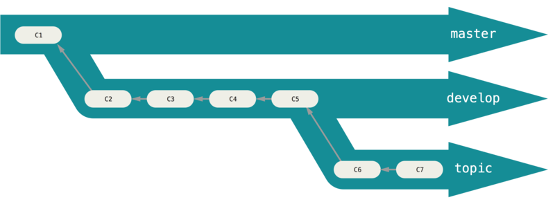
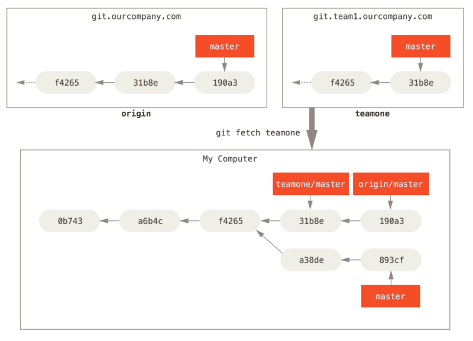

## hexo

hexo clean && hexo deploy

hexo clean && hexo s

git add -A .

git commit -m "add doc"

git push -u origin master

npm install hexo-deployer-git --save

git clone git@github.com:charvincn/charvincn.github.io
git clone -o https://github.com/NAME/KUMING.git 本地库名
git clone git@github.com:s-charvin/deeplearning.git
git clone git@SCW_github:s-charvin/deeplearning.git

## git 分支管理模型

主要分支(	本地+远程)
- main (可发布状态)
	- 附带 hook 脚本, 在每次提交时进行自动编译(可选)
- dev (最近的一次修改提交状态, 即日常开发分支)
	- 开发最新版本的分支, 包含所有新功能内容
	- 开发完毕合并修改到 main 时, 应附带发布版本号的标签

辅助分支
- fea
	- 本地分支, 用于新功能开发
	- 创建自 dev, 也必须合并回 dev
- release-*
	- 指定版本的预发布分支
	- 此分支不应在做新功能开发, 而只做此版本的 bug 修复工作.
	- 创建自 dev, 必须合并回 dev 和 main
- hotfix


```


##### 创建一个新仓库

git clone git@gitlab.zhangyue-inc.com:ios_ireader/learning-milestones-scw.git
cd learning-milestones-scw
git switch -c master
touch README.md
git add README.md
git commit -m "add README"
git push -u origin master

##### 推送现有文件夹

cd existing_folder
git init --initial-branch=master
git remote add origin git@gitlab.zhangyue-inc.com:ios_ireader/learning-milestones-scw.git
git add .
git commit -m "Initial commit"
git push -u origin master

##### 推送现有的 Git 仓库

cd existing_repo
git remote rename origin old-origin
git remote add origin git@gitlab.zhangyue-inc.com:ios_ireader/learning-milestones-scw.git
git push -u origin --all
git push -u origin --tags


# 初始化分支
git checkout -b main
git checkout -b dev
git push --set-upstream origin dev


# 本地功能开发, 并将其合并到开发分支
git checkout -b fea dev

git checkout fea
...
git status ...
git diff ...
git rm ...
git reset ...
git clean ...

git add -A .

git commit -a -m "Public for the first time"
git checkout dev
git merge --no-ff fea
git branch -d fea
git push origin dev

# 预发布分支管理
git checkout -b release-1.2
git checkout main
git merge --no-ff release-1.2
git tag -a 1.2
git checkout dev
git merge --no-ff release-1.2
git branch -d release-1.2

```

## git 安装

## git 使用记录

### linux 基本命令

进入某文件夹

cd d:/github/blog/themes/tomotoes/source/css

建立空文件夹

mkdir learngit

显示当前文件夹目录路径

pwd

### git 基本环境设置

#### 设置用户名、邮箱

```console
git config --global user.name "Charvins"
git config --global user.email "1911523105@qq.com"

```

--global  所有的Git仓库都会使用这个配置, 即全局命令

#### 检查配置信息

```console
git config --list
git config --list --show-origin
```

                   工作区 --->   暂存区 --->版本库

### 本地创建 git 版本库

#### 把当前目录变成 Git 可以管理的仓库

```console
git init
```

#### 检查当前仓库文件状态

```console
git status --short
```

信息提示意义: 
- Untracked files：未被跟踪的文件
- Changes not staged for commit：发生变化的文件
- Changes to be committed：处于暂存状态的新文件

#### 添加需要版本跟踪的新文件

```console
git add 文件或文件夹名

# 添加新文件和编辑过的文件不包括删除的文件
git add .
# 添加所有内容
git add -A .
# 添加编辑或者删除的文件，不包括新添加的文件
git add -u
```

#### 设置需要忽略版本跟踪的文件

```console
# 修改.gitignore文件
# 在 .gitignore 文件中，每一行的忽略规则的语法如下：
# 1、空格不匹配任意文件，可作为分隔符，可用反斜杠转义
# 2、以“＃”开头的行都会被 Git 忽略。即#开头的文件标识注释，可以使用反斜杠进行转义。
# 3、可以使用标准的glob模式匹配。所谓的glob模式是指shell所使用的简化了的正则表达式。
# 4、以斜杠"/"开头表示目录；"/"结束的模式只匹配文件夹以及在该文件夹路径下的内容，但是不匹配该文件；"/"开始的模式匹配项目跟目录；如果一个模式不包含斜杠，则它匹配相对于当前 .gitignore 文件路径的内容，如果该模式不在 .gitignore 文件中，则相对于项目根目录。
# 5、以星号"*"通配多个字符，即匹配多个任意字符；使用两个星号"**" 表示匹配任意中间目录，比如a/**/z可以匹配 a/z, a/b/z 或 a/b/c/z等。
# 6、以问号"?"通配单个字符，即匹配一个任意字符；
# 7、以方括号"[]"包含单个字符的匹配列表，即匹配任何一个列在方括号中的字符。比如[abc]表示要么匹配一个a，要么匹配一个b，要么匹配一个c；如果在方括号中使用短划线分隔两个字符，表示所有在这两个字符范围内的都可以匹配。比如[0-9]表示匹配所有0到9的数字，[a-z]表示匹配任意的小写字母）。
# 8、以叹号"!"表示不忽略(跟踪)匹配到的文件或目录，即要忽略指定模式以外的文件或目录，可以在模式前加上惊叹号（!）取反。需要特别注意的是：如果文件的父目录已经被前面的规则排除掉了，那么对这个文件用"!"规则是不起作用的。也就是说"!"开头的模式表示否定，该文件将会再次被包含，如果排除了该文件的父级目录，则使用"!"也不会再次被包含。可以使用反斜杠进行转义。


# dir 不需要提交的目录
/node_modules
# file 不需要提交的文件
config.ini
# log 不需要提交的任意包含后缀名为log的文件
*.log

*.[oa]
._*.*

```

#### 提交更新当前已修改的版本文件到新版本状态

```console
git commit -m "提交说明"

git commit -a -m "提交说明"
```

#### 更改上次提交操作

```console
git commit --amend
```

#### 查看提交日志

```console
git log -p --stat --pretty=format:"%H - %an(%ae) - %ar
提交信息:
---  %s" --after="2020-05-15" --before="2022-05-25" --graph
////
git log -p --stat --pretty=format:"%H - %an(%ae) - %ar
提交信息:
---  %s" --graph
```

#### 回退状态

回退到某次提交的版本状态

```console

git reset HEAD filename.txt      # 将文件从暂存区撤回到工作区
git reset --soft HEAD~1         # 将 HEAD 指针移动到上一次提交的位置，保留修改
git reset --mixed HEAD~1        # 将 HEAD 指针移动到上一次提交的位置，取消暂存的更改
git reset --hard HEAD~1         # 将 HEAD 指针移动到上一次提交的位置，丢弃所有修改
git reset --hard commit_id

```

#### 清空未跟踪文件

```
git clean -n             # 显示将要被删除的未跟踪文件，但不执行删除操作
git clean -f             # 删除未跟踪的文件
git clean -f -d          # 删除未跟踪的文件和目录
git clean -f -X          # 删除未跟踪的.gitignore中忽略的文件

```


撤销此文件在工作区的全部修改,回到最近一次修改时的的状态

```console
git checkout -- filename
```

把暂存区的修改撤销掉,重新放回工作区

```console
git reset HEAD filename
```

#### 设置版本标签

##### 添加标签

```console
git tag -a v1.0 -m "当前添加的标签详细信息"
git tag -a v1.2 -m "标签信息添加到195837对应的版本上" 1958373633a61
git tag "v1.1"

```

##### 列出本地提交的已有标签

```console
git tag
git tag -l "v1.8.5*"
```

##### 展示某标签对应的完整信息

```console
git show v1.0
```

##### 删除标签

```console
git tag -d 标签名
git push 仓库简写 --delete <标签名>
```

### git 文件命令

#### 移除文件（完全移除、仅移除暂存库）

```console
git rm filename.txt             # 删除已跟踪文件
git rm -r directory/            # 删除目录及其内容
git rm --cached filename.txt    # 停止跟踪文件但不删除工作区文件
```

#### 移动文件

```console
git mv file_from file_to
```

#### 检查文件改动

```console
git diff --word-diff
git diff HEAD -- filename
git diff                  # 显示工作区与暂存区之间的差异
git diff --staged         # 显示已暂存（即将提交）的文件与最新提交版本之间的差异
git diff HEAD             # 显示工作区与最新提交版本之间的差异
git diff <commit-hash>    # 显示工作区与指定提交版本之间的差异
```

### git 创建版本分支


#### 创建分支(同时切换过去)

```console
git branch "分支名称"
git checkout -b "分支名称"
```

#### 查看各个分支当前所指的对象

```console
git log --oneline --decorate --graph --all

git branch
```

#### 分支切换(切换成功时, 本地文件也会恢复到分支内的相应状态)

```console
git checkout 分支名称
```

#### 合并分支

```console
git merge 分支名称

# 合并分支,并禁用Fast forward 模式
git merge --no-ff -m "merge with no-ff" 分支名称
```

#### 删除分支

```console
git branch -d 分支名称
# 强行删除未被合并分支
git branch -D 分支名称
```

#### 分支合并冲突

```html
<<<<<<< HEAD:index.html
`HEAD`所指文件内容
=======
被合并文件所指内容
>>>>>>> iss53:index.html
```

#### 查看哪些分支已经合并(或没有)到了当前分支

```console
git branch --merged
git branch --no-merged
# 查看分支的合并情况
git log --graph
```

#### 分支种类设置



`master` : 稳定版本分支

`develop` : 开发版本分支

`develop` → `issue53` : 短期开发 issue53 的分支

### Git 远程仓库

####  创建和连接远程仓库

##### 生成和查看本地 SSH 密钥, 相当于进入远程仓库的钥匙

```console
# 生成
ssh-keygen -t rsa # 似乎不可以用了
ssh-keygen -t ecdsa
ssh-keygen -t ed25519

ssh -T git@github.com # 与远程存储库建立链接
 
# 指定文件夹
/home/visitors2/SCW/.ssh/id_rsa

# 查看密钥
cat /home/user4/.ssh/id_rsa.pub
```

##### 指定远程仓库使用特定密钥

首先在 .ssh 新建 config 文件

```console
touch config
```

然后将文件权限设置为 600

```console
chmod 600 config
```

文件内容添加远程连接信息

```console
# 修改所有用户使用的密钥
Host github.com
    HostName github.com
    User git
    IdentityFile ~/.ssh/id_rsa

# 为指定用户 account1 指定独有的密钥
Host account1
HostName ssh.github.com
PreferredAuthentications publickey
Port 443
User git
IdentityFile ~/.ssh/id_rsa_account1
```

然后在指定存储库中的 .git 文件夹修改 config 文件

```console
touch ?/repository/.git/config
```

修改当前存储库连接使用的地址为 account1

```console
...
...
[remote "origin"]
	url = git@account1:??/??.git
...
...

```


解决 hosts 问题 以及链接时间过长断开问题

1. `ssh -T git@github.com`  尝试重新与远程存储库建立链接

2. 尝试修改连接端口
```
# 修改连接端口 22 为 443
Host github.com
    Hostname ssh.github.com
    Port 443
    User git
```

##### 创建远程仓库

创建github远程仓库

```
创建和登录账号->主页面右上角➕号->New repository->Private->Create repository

->主页面右上角用户头像->Settings->SSH and GPG keys->SSH keys->添加本地仓库的SSH key
```

##### 检测 ssh 是否已经可以连接远程仓库

```console
ssh -T git@github.com
```

#### 使用本地 Git 连接和管理远程仓库

##### Git 连接远程仓库

直接克隆已经存在的远程仓库, 会同步添加远程仓库连接

```console
# http连接
git clone -o https://github.com/用户名/仓库名 本地库名

# ssh连接
git clone git@github.com:s-charvin/deeplearning.git

# 指定config的ssh连接
git clone git@SCW_github:s-charvin/deeplearning.git
```

仅添加远程仓库连接

```console
git remote add 远程仓库简写 https://github.com/paulboone/ticgit.git

git remote add origin git@github.com:s-charvin/Note.git
```

查看当前已连接的远程仓库

```console
git remote -v
git remote show 远程仓库简写
git ls-remote 远程仓库简写
```

##### 基本管理命令

拉取远程仓库分支到本地

```console
git fetch 远程仓库简写
git pull 远程仓库简写

# 取消并保存当前修改,更新本地分支后应用修改
git pull --rebase
```

推送当前本地分支到远程仓库

```console
git push 远程仓库简写 远程仓库分支名称 --tags
git push 远程库名字 标签名称
git push 远程库名字 --tags
git push [远程库名] [本地分支名]:[远程分支名]
```

本地远程仓库简写名称改名

```console
git remote rename 仓库简写 新简写
```

本地删除远程仓库

```console
git remote remove 仓库简写
```

删除远程仓库标签

```console
git tag -d 标签名
git push 仓库简写 --delete <标签名>
git push origin :refs/tags/标签名称
```

#### 使用 Git 连接和管理远程仓库分支



新建和链接远程分支

```console
# 创建分支
git checkout -b 本地分支名

# 添加远程仓库
git remote add 仓库名称 仓库地址
# 链接远程分支

git push --set-upstream origin main
git push origin 本地分支名:分支名


```

本地分支连接已有远程分支

```console
git branch --set-upstream-to=远程库名/分支名
```

根据已有远程分支新建本地分支

```console
git checkout -b 本地分支名 远程库名/分支名
```

#### GIt 工作现场

##### 保存当前工作现场, 并去处理其他事情

git stash

##### 查看已保存的工作现场

git stash list

##### 恢复第 n 个工作现场

git stash apply stash@{n-1} (恢复不删除stash内容)

git stash pop(恢复并删除stash)

##### 删除工作现场内容

git stash drop

### 常见 git 使用方法

#### [git删除历史版本，保留当前状态。](https://www.cnblogs.com/langkyeSir/p/14528857.html)

#### git 添加版本号信息并推送

git add -A .
git commit -am "备注"
git tag -a "tagname" -m "备注" [id]
git push [远程库名] [本地分支名]:[远程分支名] --tags
