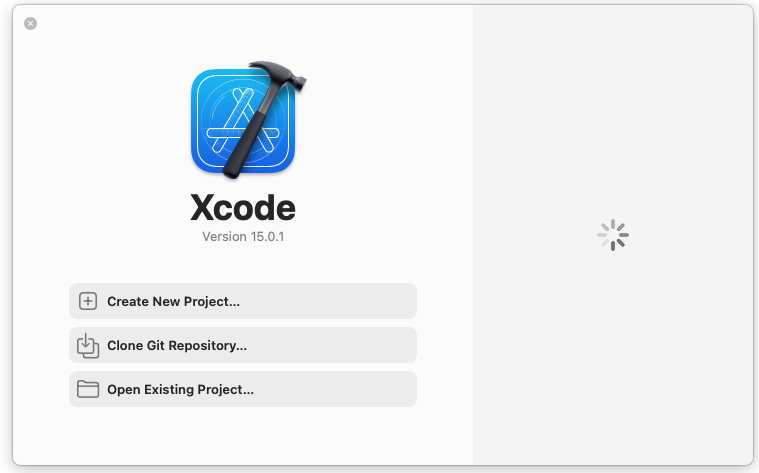
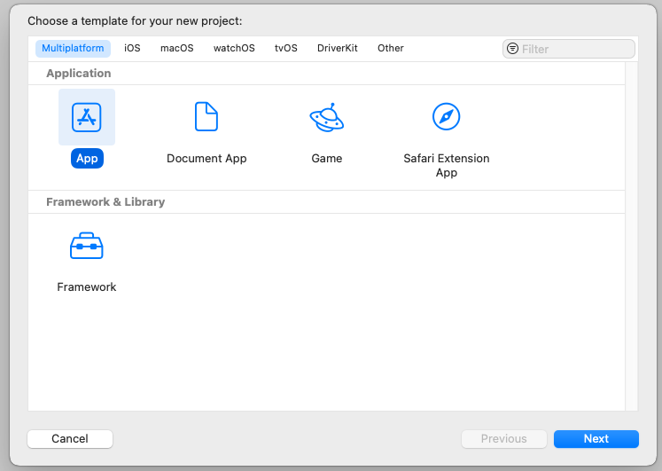
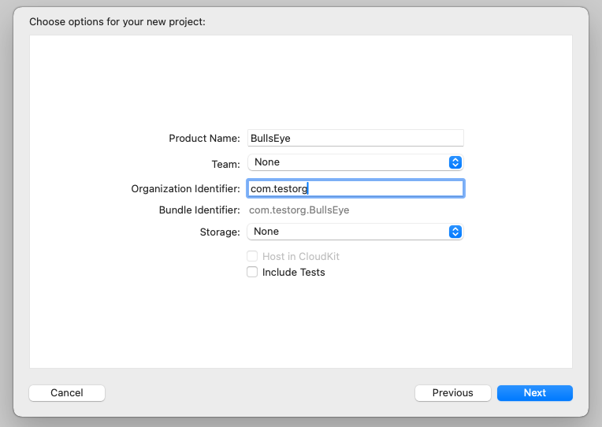
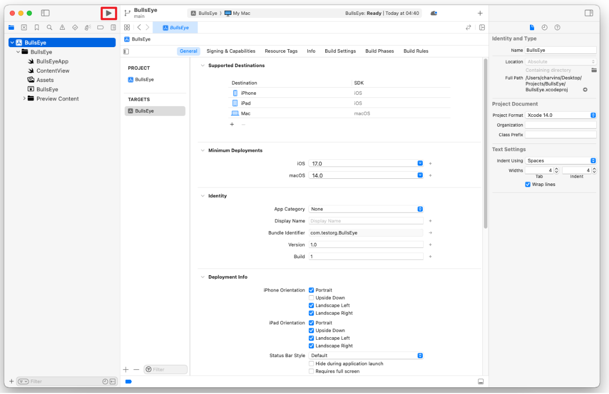
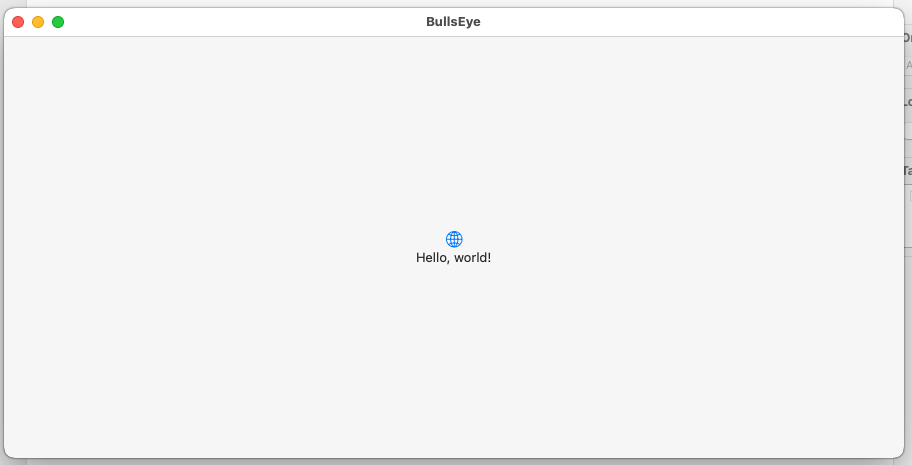
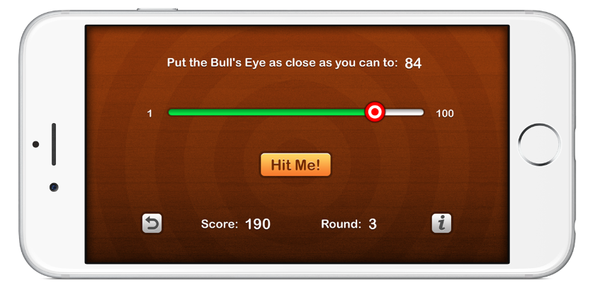
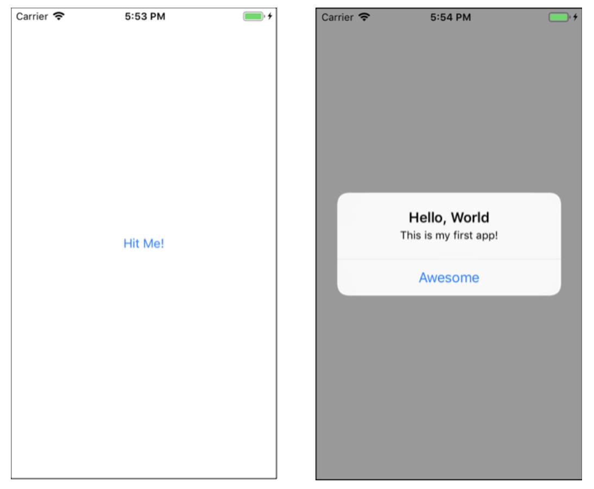

# IOS

## 前言

### 环境准备

- 一台配备 Intel/ARM 处理器的 Mac 计算机,  推荐安装 macOS Big Sur 11.3及以上系统版本, 拥有 16 GB+ 的 RAM.
- Xcode 13+ 和 Swift 5.5 开发环境. Xcode 用于编写代码,   Swift 是编程开发语言.
- （可选）运行 iOS 15 的 iPhone、iPad 或 iPod touch。
- [本书源代码](https://github.com/raywenderlich/ia-materials/tree/editions/10.0),  均可在 GitHub 存储库中找到.
- [官方论坛](https://forums.raywenderlich.com/c/books/uikit-apprentice/),  这是询问有关本书的问题或提交您可能发现的任何错误的好地方。

> [!Cite]
> [IOS开发大佬:Matthijs Hollemans](www.matthijshollemans.com)
> [音频编程](https://audiodev.blog/)

### 学习目标概览

学习如何使用 Apple 的 Swift 编程语言, Xcode, Storyboard, UIKit 等技术, 制作自己的 iPhone 应用程序( iPad 和 iPod touch 类似), 掌握 Swift 和 iOS SDK 的基本构建块,  培养系统性分析问题的能力. 最后付费加入开发者计划,  将完成的应用提交到 App Store 中供用户下载和使用.

其中,  共设计了以下几种应用程序供学习者逐步学习应用构建,  包括:

1. **Bull’s Eye**：一个简单的小游戏,  教授使用 Xcode、Interface Builder 和 Swift.
2. **Checklists**：待办事项,  教授使用 iOS 应用的基本设计模式, 如表视图,  导航控制器和代理.
3. **MyLocations**：位置感知应用程序,  教授使用 Core Location,  Core Data 和 Map Kit 等高级主题.
4. **StoreSearch**：使用 HTTP 请求和 JSON 与 iTunes 商店交互的搜索应用,  教授使用网络编程与 Web 服务进行通信.

### 学习注意事项

- 学习+实践: 阅读教程,  打开 Xcode,  编写源代码,  改动源代码,  按指示运行程序.
- 理解>复制粘贴: 不要盲目复制粘贴所遇到的源代码,  通过工具和相关知识来理解其正在做的事情以及为什么要这样做,  思考有没有替代方案.
- 重复练习++: 玩弄源代码,  尝试添加新功能.

## 起步

### 基础知识

#### 基本项目创建

- 下载并安装 Xcode 和 iOS SDK. Xcode 是代码编辑器,  含有用于设计应用用户界面的视觉编辑器和代码缺陷调试器,  能够将代码转换为可执行应用,  并在 iOS 模拟器上启动应用.
- 启动 Xcode,  启动后界面如下图. Xcode 应用程序可以在 `/Applications` 文件夹或 `Launchpad` 中找到.

- 选择创建新的 Xcode 项目( `Create New Project...` ),  开启 Xcode 的主窗口,  

- 选择应用项目模板 (App),  输入项目名称(Product Name),  设置团队类型(Team)为空(None),  填写组织标识(Organization Identifier) 为某网站域名倒写或其他独有名称,  最后选择数据存储和管理方式(Storage)为 None,  并取消包含测试功能(Include Tests).

> [!tip]
> [SwiftData 和 Core Data](https://medium.com/@amangupta007/swift-data-vs-core-data-2caa5d907a8d) 都是对象关系映射 (ORM) 框架, 允许您在 iOS 应用程序中存储和管理数据。
> SwiftData 比较新,  构建在 Core Data 之上,  提供了更现代且对 Swift 友好的 API,  比较高效,  与 SwiftUI 的集成更好,  高级功能少
> CoreData 更加成熟,  比较复杂且以 OC 为导向,  比较低效,  与 SwiftUI 的集成较差,  功能更完善

- 选择项目保存位置,  比如桌面的 Projects 文件夹. 之后 Xcode 会使用项目名称自动为项目创建一个新文件作为项目存储目录. 默认会选择支持 git 版本控制管理项目.
- 在项目中尝试运行空项目,  根据提示启用开发者人员模式,  并确保运行之前没有将 iPhone 或 iPad 设备插入计算机.

Bull’s Eye 实践

概念设计
- 游戏类型：益智类
- 核心玩法：玩家需要将滑块上的靶心尽量接近一个随机选定的目标值(1 至 100 之间)
- 目标受众：无

音效和音乐
- 音效：每当玩家移动滑块或点击按钮时可能会有相应的音效。
- 背景音乐：可能有轻松的背景音乐, 提升游戏体验。
- 反馈提示音：分数弹出窗口可能有特定的提示音效。

游戏功能需完成事项
- 显示功能-滑块模块: 在屏幕放置一个滑块,  控制射击分数,  其值范围在 1 到 100 之间.
- 显示功能-目标靶数值: 在每轮开始时生成一个随机数并将其显示在屏幕上作为目标靶数值
- 显示功能-射靶控制按钮: 在屏幕上放置一个按钮,  文字显示为 “打我！”,  控制是否以当前分数射击
- 显示功能-中靶记录文本: 在屏幕上放置 “分数：”和 “回合：” 标签,  当玩家得分时分数就会增加,  当玩家开始新回合时,  回合数目增加.
- 显示功能-重新开始按钮: 将“重新开始”按钮放在屏幕上。使其重置分数并将玩家带回第一轮。
- 逻辑功能-射靶: 当玩家按下 “打我！”按钮时,  将滑块的值与该随机数进行距离得分计算,  作为此次射靶的表现分. 
- 显示功能-射靶反馈: 当玩家按下 “打我！”按钮,  并计算出得分后,  应用程序必须显示一个警报弹出窗口,  告知玩家他或她的表现分如何,  并在警报弹出窗口中显示此分数.
- 显示功能-显示方向: 应用程序置于横向方向

### 按钮和弹窗设计

让我们从列表顶部开始, 制作一个非常简单的游戏第一个版本, 仅显示一个按钮。当您按下按钮时, 应用程序会弹出一条警报消息。这就是你现在要做的全部事情。一旦你完成了这个工作, 你就可以在此基础上构建游戏的其余部分。

是时候开始编码了！我假设您此时已经下载并安装了最新版本的 Xcode。在本书中, 您将使用 Xcode 13.0 或更高版本。较新版本的 Xcode 也可能可以使用, 但任何早于 13.0 版本的版本可能都无法使用。由于 Swift 是一种新语言, 因此它往往会在 Xcode 版本之间发生变化。如果你的 Xcode 太旧或者太新！ ——那么并非本书中的所有代码都可以正常工作。出于同样的原因, 建议您不要使用 Xcode 的 beta 版本, 而仅使用 Mac App Store 中的官方版本。

### 滑块与标签的使用

### 界面与逻辑连接

### 游戏回合与计分逻辑

### 应用优化技巧

### 界面美化

### 终极应用实现

## 核心技巧

### 章节概览

### 表格视图基础

### 数据模型设计

### 导航控制器运用

### 添加项目界面

### 代理与协议

### 编辑功能实现

### 数据保存与加载

### 列表管理

### 数据模型优化

### 用户偏好设置

### 界面改善技巧

### 本地通知功能

## 位置服务

### 章节概览

### Swift 语言复习

### 位置数据获取

### 位置数据应用

### 对象与类别

### 位置标记界面

### 用户体验提升

### 位置数据保存

### 位置信息管理

### 地图集成与应用

### 图片选择与处理

### 应用细节打磨

## 商店搜索

### 章节概览

### 搜索栏的实现

### 自定义表格单元

### 网络请求与数据处理

### 异步网络编程

### 使用 URLSession

### 详细信息弹出窗口

### 弹窗界面优化

### 横屏适配

### 代码重构与优化

### 国际化与本地化

### iPad 适配与改进

### 应用发布
