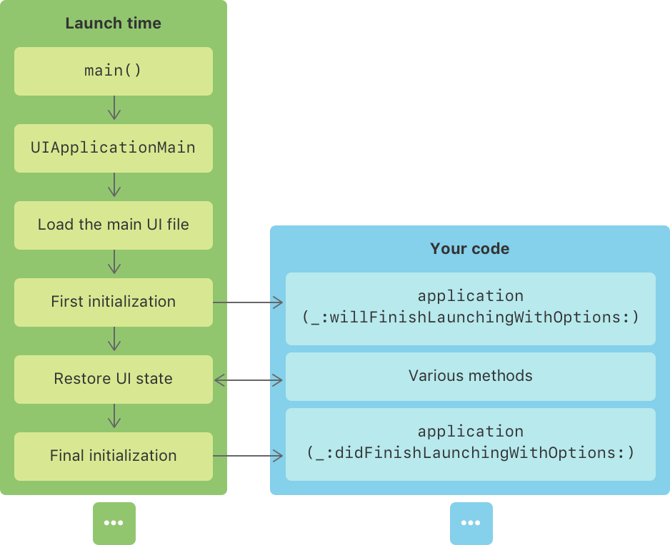
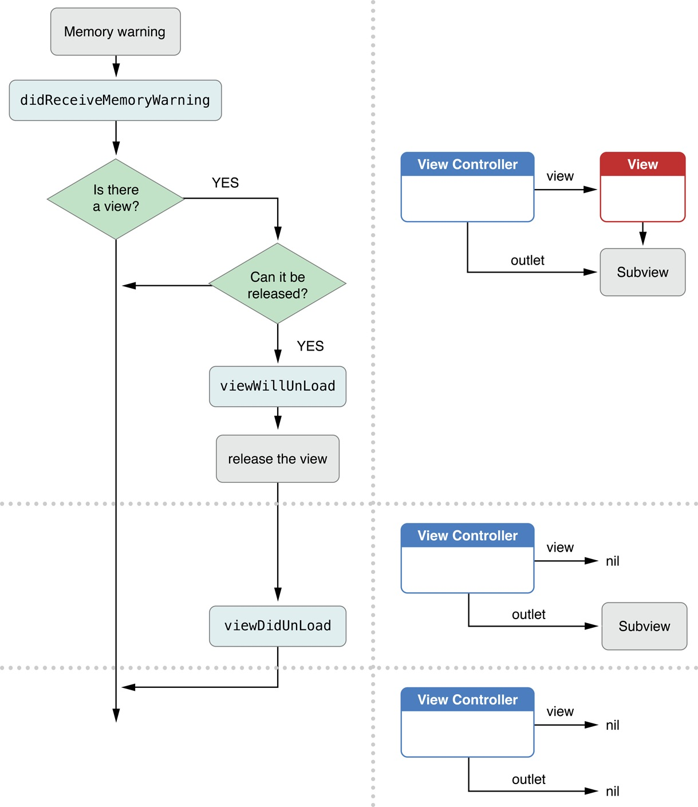

# UIKit

## 应用程序

### 单视图应用文件结构

- APP
	- `AppDelegate.swift`  管理 `ApplicationDelegate` 类型对象, 其被委托来处理程序中的事件, 同时也是应用程序入口点
	- `SceneDelegate.swift` 
	- `ViewController.swift` 管理控制器, 处理组件与数据的交互
	- `Assets.xcassets` 可视化管理程序资源文件
	- `LaunchScreen.storyboard` 提供可视化的启动页面设计管理, IOS 14+限制大小为 25 MB
	- `Info.plist` 应用程序配置和功能的信息
	- `Main.storyboard` 提供可视化的程序页面设计管理, 可以通过构建多个文件定义多个不同的页面
- Products

在 iOS 应用程序项目中,   sXcode 和 Swift 编译器会自动处理在同一个应用程序上下文中定义的源代码文件之间的引用关系, 以确保它们能够正确协作.

 ### 应用程序设计结构

`Info.plist` 配置项

> [!TODO]

https://developer.apple.com/library/archive/documentation/General/Reference/InfoPlistKeyReference/Introduction/Introduction.html#//apple_ref/doc/uid/TP 40009247

场景支持是一项可选功能。要启用基本支持，将 `UIApplicationSceneManifest` 键添加到应用程序的 Info.plist 文件

## UIKit 用户界面工具包

**特性**

- iOS 13+ 支持为应用程序提供多实例界面(特别适合分屏操作), 即用户可以在同一个设备上打开同一个应用的多个窗口, 每个窗口能够显示不同的内容或以不同的方式显示相同的内容.
- 实现 UI 的窗口, 视图架构, 事件处理基础设施, 程序主循环
- 支持动画、文档、绘图和打印、文本管理和显示、搜索、应用程序扩展、资源管理以及获取有关当前设备的信息
- 支持针对不同语言、国家或文化区域本地化

> [!tip]
> 在继承开发环境 Xcode 开发项目, 仅从应用程序的主线程或主调度队列使用 UIKit 类, 除非这些类的文档中另有说明. 

## UIKit 应用程序资源

- App icons「应用程序图标」
- storyboard「初始启动界面可视化设计版」
- Metadata「元数据」

## UIKit 应用程序环境信息

UIKit 使用 `trait collections` 来传达有关当前应用环境的设备设置、界面设置和用户偏好设置等信息. 比如暗黑模式激活信息, 界面大小信息, 横竖屏信息等.
- 可以根据当前环境信息自定义 `UIView` 视图和 `UIViewController` 控制器内容
- 根据将自定义对象去遵守 `UITraitEnvironment` 协议, 使其也能接受到 `trait collections` 传达的信息

## UIKit 应用程序启动



### 启动

用户或系统[预热](https://developer.apple.com/videos/play/wwdc2017/413)启动应用程序 -> 执行 Xcode 提供的 `main()` 函数 -> 创建应用实例和应用委托实例 -> 加载环境信息和 UI 文件 -> ↓
调用预设或自定义启动设置方法 -> 调用 `application(_:willFinishLaunchingWithOptions:)` 方法 -> 执行状态恢复 -> 调用 `application(_:didFinishLaunchingWithOptions:)` 方法

- `UIApplicationMain` 由系统自动调用, 并创建 `UIApplication` 对象的单例实例处理用户事件, 管理程序生命周期等操作. 一般情况不用考虑, 等需要时再学.
- 每个应用程序都必须有一个符合 `UIApplicationDelegate` 协议的委托对象来响应程序消息. 并且此对象提供了 `main()`  方法的实现, 可以通过 `@main` 属性标记一个委托对象为程序入口点.
- 应用程序启动后会发布一个 `UIApplication.didFinishLaunchingNotification` 通知, 用于处理通知信息


```swift
// IOS

import UIKit


// 程序入口点
@main
class AppDelegate: UIResponder, UIApplicationDelegate {
	/* 委托对象作用
		- 初始化数据结构
		- 配置程序环境
		- 响应程序通知
		- 响应程序事件
		- 注册所需服务
	*/
	
    let sharedApp = UIApplication.shared // 访问当前程序的单利应用实例

	// 表示启动过程开始, 但是处于非活动状态和状态恢复之前状态, 需要确保准备好所有必要数据和服务, 确保应用可以被正常恢复
    func application(_ application: UIApplication, willFinishLaunchingWithOptions launchOptions: [UIApplication.LaunchOptionsKey: Any]? = nil) -> Bool {
        // 初始化数据结构, 配置环境, 检查资源, 连接服务等
        return true
    }

	// 表示应用准备运行, 处于状态恢复之后, 但是呈现应用窗口或引入后台运行之前, 可以进行一些 UI 配置并进行最后的启动原因处理
    func application(_ application: UIApplication, didFinishLaunchingWithOptions launchOptions: [UIApplication.LaunchOptionsKey: Any]? = nil) -> Bool {
        // 检查启动原因
        if let launchOptions = launchOptions {
            // 检查是否由推送通知或其他原因启动
        }
        
        /*进行可选的如下配置
	        - 设置界面选择根视图控制器
			- 应用启动的第一次配置
			- 从服务器下载所需数据
			- 进行数据复制和迁移
			- 配置用户默认首选项
			- 设置用户账户和手机数据
        */
	    // 获取应用程序支持目录
	    let appSupportURL = FileManager.default.urls(for: .applicationSupportDirectory, in: .userDomainMask)
	    // 获取应用程序缓存目录
	    let cachesURL = FileManager.default.urls(for: .cachesDirectory, in: .userDomainMask)
	    // 获取应用程序临时目录
	    let temporaryDirectory = FileManager.temporaryDirectory()
		// 注册观察者，监听应用程序完成启动的通知, 其中 appDidFinishLaunching 是自定义观察者函数
        NotificationCenter.default.addObserver(self, selector: #selector(appDidFinishLaunching(_:)), name: UIApplication.didFinishLaunchingNotification, object: nil)
        
        return true
    }

}

/* LaunchOptionsKey

	// 检查是否是通过蓝牙中心管理器的蓝牙外设启动. 表示程序关闭前使用了提供蓝牙功能（`CBCentralManager`）的对象, 因此重启应用时提供了该选项
	// 值是一个包含之前用于蓝牙操作的中央管理器对象的恢复标识符的数组, 用于恢复连接
	if let bluetoothCentrals = launchOptions?[.bluetoothCentrals] as? [CBCentralManagerOption: Any] {}

	// 检查是否是通过蓝牙外设启动. 表示程序关闭前, 被作为蓝牙设备使用了, 值是一个恢复标识符的数组,用于重新连接 
	if let bluetoothPeripherals = launchOptions?[.bluetoothPeripherals] as? [String: Any] {}
	
	// 检查是否是通过CloudKit共享启动
	if let cloudKitShareMetadata = launchOptions?[.cloudKitShareMetadata] as? CKShareMetadata {}
	
	// 检查是否是通过事件归因启动
	if let eventAttribution = launchOptions?[.eventAttribution] as? [String: Any] {}
	
	// 检查是否是通过位置信息的变化启动
	if let location = launchOptions?[.location] as? [AnyHashable: Any] {}
	
	// 检查是否是通过Newsstand下载启动
	if let newsstandDownloads = launchOptions?[.newsstandDownloads] as? [String] {}
	
	// 检查是否是通过远程通知启动
	if let remoteNotification = launchOptions?[.remoteNotification] as? [AnyHashable: Any] {}
	
	// 检查是否是通过3D Touch快捷方式启动
	if let shortcutItem = launchOptions?[.shortcutItem] as? UIApplicationShortcutItem {}
	
	// 检查是否是通过另一个应用程序启动
	if let sourceApplication = launchOptions?[.sourceApplication] as? String {}
	
	// 检查是否是通过URL启动
	if let url = launchOptions?[.url] as? URL {}
	
	// 检查是否是通过用户活动启动
	if let userActivityDictionary = launchOptions?[.userActivityDictionary] as? [AnyHashable: Any] {}
	
	// 检查是否是通过特定类型的用户活动启动
	if let userActivityType = launchOptions?[.userActivityType] as? String {}
	
	// 自定义 LaunchOptionsKey
	let remoteNotificationKey = UIApplication.LaunchOptionsKey(rawValue: "remoteNotification")
*/


```

### 保存与恢复

当程序终止后, 为了确保在再次启动时返回之前的状态, 方便用户操作, UIKit 会自动将应用程序的视图和视图控制器的状态保留到磁盘上的加密文件中. 并在稍后重启时, 根据保留的数据重建视图和视图控制器. 想要开启此功能, 需要进行以下操作: 

- 启用对状态保存和恢复的支持
- 将恢复标识符分配给要保留的视图控制器
- 在恢复时根据需要重新创建视图控制器
- 对将视图控制器恢复到之前状态所需的自定义数据进行编码和解码

> [!TODO]

https://developer.apple.com/documentation/uikit/view_controllers/preserving_your_app_s_ui_across_launches#2928951

询问委托是否安全地保留应用程序的状态
询问委托是否恢复应用程序的保存状态
要求委托提供指定的视图控制器
告诉您的委托在状态保存过程开始时保存所有高级状态信息
告诉您的委托恢复任何高级状态信息，作为状态恢复过程的一部分
负责创建恢复存档的应用程序版本
您的应用程序创建恢复存档的系统版本
您的应用程序创建恢复存档的时间
当您的应用程序创建恢复存档时生效的用户界面习惯用法
对包含视图控制器的故事板的引用

## UIKit 应用程序生命周期管理

生命周期指的是从启动应用到退出应用的整个过程. 在这个过程中, 应用会经历一系列状态变化, UIKit 提供了一系列回调函数, 便于在应用状态发生变化时执行相应的操作. 具体状态变化因为系统版本不同, 有两种情况:

### 基于场景的生命周期事件(IOS 13 +)

场景代表设备上程序 UI 的一个实例, 可以同时创建多个场景, 并且每个场景都有自己独立的生命周期事件, 处于不同的执行状态. 
- `Not Running` : 未运行状态, 应用未启动，或被系统终止
- `Inactive` : 非活动状态, 应用在前台运行，但不接收事件（如用户正接电话时）
- `unattached` : 未附加状态, 当用户或系统为应用程序请求新场景时, UIKit 会创建场景, 并置于此状态. 主要用于配置场景的初始 UI, 并加载所需数据
- `foreground` : 前台状态
	- `foreground-active` : 前台活动状态, 系统会配置场景 UI 并可以与用户交互. 一般用户请求的场景都会在打开时快速进入此状态.
	- `foreground-inactive` : 前台非活动状态, 场景虽然在前台, 但是不接收用户交互事件. 一般会在切换应用, 关闭应用, 进入后台时出现.
- `background` : 进入后台状态后, 只为完成关键的必需任务, 停止非必需行为, 释放内存, 并为应用程序快照做好准备. 一般系统请求的场景通常会先移动到后台状态, 不需要与用户交互.
- `suspended` : 挂起状态, 场景仍在内存中, 但是无法继续执行, 可能被系统随时清理与场景关联的所有共享资源. 

**实现方式
**
- 应用程序在变为活动状态后, 会调用 `sceneDidBecomeActive(_ application: UIApplication)` 方法
- 应用程序在变为非活动状态后, 会调用 `sceneWillResignActive(_ application: UIApplication)` 方法
- 应用程序在变为后台状态后, 会调用 ` sceneDidEnterBackground(_ application: UIApplication)` 方法
- 应用程序在变为前台状态时, 会调用 `sceneWillEnterForeground(_ application: UIApplication)` 方法.
- 当场景即将显示时, 回调用 `viewWillAppear(_:)` 方法
- 应用程序在终止运行时, 会调用 `func applicationWillTerminate(_ application: UIApplication)` 方法, 用于执行最终的清理任务和数据保存任务, 并在调用后发布 `willTerminateNotification` 通知. 但是此方法默认只有 5 秒的运行时间, 超过则直接终止和清除程序. 

- 应用程序在创建新场景之前会调用 `application(_:configurationForConnecting:)` 方法, 用于检索配置数据, 并返回一个包含场景详细信息的 `UISceneConfiguration` 对象. 如果不实现此方法, 则必须在应用程序的 `Info.plist` 文件中提供场景配置数据.
- 应用程序在关闭了应用场景时, 会调用 `application(_:didDiscardSceneSessions:)` 方法, 用于自定义场景释放.


```swift
import UIKit

// 程序入口点
@main
class AppDelegate: UIResponder, UIApplicationDelegate {
...
	// 表示场景创建之前, 动态地配置一些包括场景类型、场景的代理对象以及包含要显示的初始视图控制器的故事板等的信息

	// 比如根据用户活动信息动态设置场景
	class DefaultSceneDelegate: UIResponder, UIWindowSceneDelegate {...}
	class DetailSceneDelegate: UIResponder, UIWindowSceneDelegate {...}
	
    func application(_ application: UIApplication, configurationForConnecting connectingSceneSession: UISceneSession, options: UIScene.ConnectionOptions) -> UISceneConfiguration {
        if options.userActivities.contains(where: { $0.activityType == "com.example.myapp.showDetail" }) {
            let detailSceneConfig = UISceneConfiguration(name: "Detail Configuration", sessionRole: connectingSceneSession.role)
            detailSceneConfig.delegateClass = DetailSceneDelegate.self // Assign your custom scene delegate class
            detailSceneConfig.storyboard = UIStoryboard(name: "Main", bundle: nil) // Set the storyboard with your detail view controller
            return detailSceneConfig
        } else {
            let defaultSceneConfig = UISceneConfiguration(name: "Default Configuration", sessionRole: connectingSceneSession.role)
            defaultSceneConfig.delegateClass = DefaultSceneDelegate.self // Assign your default scene delegate class
            defaultSceneConfig.storyboard = UIStoryboard(name: "Main", bundle: nil) // Set the default storyboard
            return defaultSceneConfig
        }
    }


    // 实现可选的方法以处理场景会话的丢弃, 执行清理和资源释放操作
    func application(_ application: UIApplication, didDiscardSceneSessions sceneSessions: Set<UISceneSession>) {
        for session in sceneSessions {
            if session.persistentIdentifier == "com.example.myapp.scene1" {
	            // 执行与场景1相关的清理
            } else if session.persistentIdentifier == "com.example.myapp.scene2" {
                // 执行与场景2相关的清理
            }
        }
        // 更新应用程序的界面，以反映与场景关联的内容的变化
    }
...
}

```

### 基于应用程序的生命周期事件 (iOS 12-)

- `Not Running` : 未运行状态, 应用未启动，或被系统终止
- `Inactive` : 非活动状态, 应用在前台运行，但不接收事件（如用户正接电话时）
- `Active` : 完成 UI 配置并准备与用户交互活动状态, 应用在前台运行并接收事件
- `Background` : 后台状态, 应用在后台运行，仍然能执行代码, 但是被分配的系统资源就会较少, 此时程序应该尽可能的少做工作. (程序挂起时会短暂处于此状态, 或是规定在后台运行)
- `Suspended` : 挂起状态, 应用在后台，但不执行代码
- 程序启动时, 首先初始化应用程序的数据结构和 UI, 然后进入 `Inactive` 或 ` Background` 状态

当应用程序的状态发生变化时, UIKit 会通过调用适当的委托对象的方法来通知
- 在 iOS 13 及更高版本中, 使用 `UISceneDelegate` 对象来响应基于场景的应用程序中的生命周期事件
- 在 iOS 12 及更早版本中, 使用 `UIApplicationDelegate` 对象来响应生命周期事件
- 如果启用了场景支持, 将始终在 iOS 13 及更高版本中使用 `UISceneDelegate` , 在 iOS 12 及更早版本中，系统使用 `UIApplicationDelegate` 

**实现方式**

- 应用程序在变为活动状态后, 会调用 `applicationDidBecomeActive(_ application: UIApplication)` 方法, 用于重启程序完整的服务或刷新界面, 并在调用后发布 `didBecomeActiveNotification` 通知.
- 应用程序在变为非活动状态后, 会调用 `applicationWillResignActive(_ application: UIApplication)` 方法, 用于暂停程序服务和保存状态, 并在调用后发布 `willResignActiveNotification` 通知.
- 应用程序在变为后台状态后, 会调用 `applicationDidEnterBackground(_ application: UIApplication)` 方法, 用于释放共享资源, 存储状态信息, 并在调用后发布 `didEnterBackgroundNotification` 通知. 但是此方法默认只有 5 秒的运行时间, 超过则终止和清除程序. 可以通过 `beginBackgroundTask(expirationHandler:)` 方法增加处理时间. 
- 应用程序在变为前台状态时(从后台到活动状态转换的一部分), 会调用 `applicationWillEnterForeground(_ application: UIApplication)` 方法, 用于撤消进入后台后对应用程序所做的更改, 并在调用后发布 `willEnterForegroundNotification` 通知.
- 应用程序在终止运行时, 会调用 `func applicationWillTerminate(_ application: UIApplication)` 方法, 用于执行最终的清理任务和数据保存任务, 并在调用后发布 `willTerminateNotification` 通知. 但是此方法默认只有 5 秒的运行时间, 超过则直接终止和清除程序. 

```swift

import UIKit


// 程序入口点
@main
class AppDelegate: UIResponder, UIApplicationDelegate {
...

	func applicationDidBecomeActive(_ application: UIApplication) {
	    // 重新启动服务或刷新界面
	    // 发布通知以通知其他部分应用程序已经变为活动状态
	    NotificationCenter.default.post(name: UIApplication.didBecomeActiveNotification, object: application)
	}

	func applicationWillResignActive(_ application: UIApplication) {
	    // 暂停服务或保存状态
	    // 发布通知以通知其他部分应用程序即将进入非活动状态
	    NotificationCenter.default.post(name: UIApplication.willResignActiveNotification, object: application)
	}

	func applicationDidEnterBackground(_ application: UIApplication) {
	    // 释放共享资源、存储状态信息等
	    // 发布通知以通知其他部分应用程序已进入后台状态
	    NotificationCenter.default.post(name: UIApplication.didEnterBackgroundNotification, object: application)
	    
	    // 如果需要更多时间来执行操作，可以使用 beginBackgroundTask 方法
	    let backgroundTaskID = application.beginBackgroundTask(withName: "MyBackgroundTask") {
	        // 处理任务完成后的清理工作
	        application.endBackgroundTask(backgroundTaskID)
	    }
	}

	func applicationWillEnterForeground(_ application: UIApplication) {
	    // 撤消进入后台后对应用程序所做的更改
	    // 发布通知以通知其他部分应用程序即将进入前台状态
	    NotificationCenter.default.post(name: UIApplication.willEnterForegroundNotification, object: application)
	}
	
	func applicationWillTerminate(_ application: UIApplication) {
	    // 执行最终的清理任务和数据保存任务
	    // 发布通知以通知其他部分应用程序即将终止运行
	    NotificationCenter.default.post(name: UIApplication.willTerminateNotification, object: application)
	}

}
```

## UIKit 系统事件, 通知及其响应

事件使得应用程序能够响应外部的变化、用户输入和系统状态的变化. 通知用于在程序之内传递信息或触发操作. 响应是应用程序或系统对事件或通知做出的具体行动或操作.

**Memory warnings 「内存警告」**

系统运行内存不足时, UIKit 会向正在运行的应用程序发送内存不足警告, 比如: 
- 内存不足时, 会调用 `applicationDidReceiveMemoryWarning(_ application: UIApplication)`  方法, 通知应用程序, 表示内存不足了
- 内存不足时, 会调用 `didReceiveMemoryWarning()` 方法, 通知控制器采取措施, 释放在视图重新加载时可以重建的资源
- 内存不足时, 会将 `didReceiveMemoryWarningNotification`  内存警告通知发送给监听此通知的观察者和调度队列.



```swift


import UIKit
@main
class AppDelegate: UIResponder, UIApplicationDelegate {
    ...
    // 1. 调用应用程序的 applicationDidReceiveMemoryWarning() 方法
    func applicationDidReceiveMemoryWarning(_ application: UIApplication) {
        // 处理内存不足警告. 例如，清除缓存、释放不必要的对象等
    }
    ...
}


class ViewController: UIViewController {

	// 2. 调用任何活动的视图控制器的 didReceiveMemoryWarning() 方法
    override func didReceiveMemoryWarning() {
        super.didReceiveMemoryWarning()
        // 释放视图相关的资源
    }

    override func viewDidLoad() {
        super.viewDidLoad()

        // 3. 注册内存不足通知
        NotificationCenter.default.addObserver(self, selector: #selector(handleMemoryWarning), name: UIApplication.didReceiveMemoryWarningNotification, object: nil)
    }

    deinit {
        // 在视图控制器销毁时取消注册通知
        NotificationCenter.default.removeObserver(self, name: UIApplication.didReceiveMemoryWarningNotification, object: nil)
    }

    @objc func handleMemoryWarning() {
        // 在这里处理内存不足警告. 例如，清除缓存、释放不必要的对象等
    }
}


// 4. 设置监听和处理内存警告的监听队列
let queue = DispatchQueue.global(qos: .default)
let memoryPressureSource = DispatchSource.makeMemoryPressureSource(eventMask: [.warning], queue: queue)
memoryPressureSource.setEventHandler {
    // 处理内存压力事件
}
memoryPressureSource.resume()


```

**Protected data becomes available/unavailable 「受保护数据状态变化」**

在使用内容保护的设备上, 受保护的文件以加密形式存储, 并且仅在解锁后可用.  
- 当设备解锁后, 系统会调用 `applicationProtectedDataDidBecomeAvailable(_ application: UIApplication)`  方法, 并发送 `protectedDataDidBecomeAvailableNotification` 通知, 表示可以访问受保护文件了. 
- 当设备即将被锁定时, 系统会调用 `applicationProtectedDataWillBecomeUnavailable(_ application: UIApplication)` 方法, 并发送 `protectedDataWillBecomeUnavailableNotification` 通知,  表示不可以访问受保护文件了

```swift
import UIKit
@main
class AppDelegate: UIResponder, UIApplicationDelegate {
    ...
    func applicationProtectedDataDidBecomeAvailable(_ application: UIApplication) {
	    // 执行与受保护文件相关的操作
    }

    func applicationProtectedDataWillBecomeUnavailable(_ application: UIApplication) {
        // 释放对受保护文件的引用或采取适当的措施来处理它. 例如，关闭文件，保存进度，或显示警告等
    }
    ...
}

class SomeViewController: UIViewController {

    override func viewDidLoad() {
        super.viewDidLoad()

        NotificationCenter.default.addObserver(self, 
                                               selector: #selector(protectedDataWillBecomeUnavailable), 
                                               name: UIApplication.protectedDataWillBecomeUnavailableNotification, 
                                               object: nil)

        NotificationCenter.default.addObserver(self, 
                                               selector: #selector(protectedDataDidBecomeAvailable), 
                                               name: UIApplication.protectedDataDidBecomeAvailableNotification, 
                                               object: nil)
    }

    @objc func protectedDataWillBecomeUnavailable() {
        // 当受保护的数据即将不可用时执行的操作
    }

    @objc func protectedDataDidBecomeAvailable() {
        // 当受保护的数据变得可用时执行的操作
    }

    deinit {
        NotificationCenter.default.removeObserver(self)
    }
}

```

**Handoff tasks 「交接任务」**

```swift
```

**Time changes 「时间变化」**

当一些重要时间到来时(夜晚, 夏令时更改, 时区变更等), 会调用 `applicationSignificantTimeChange(_ application: UIApplication)` 方法, 并在调用前发出 `significantTimeChangeNotification` 通知. 程序挂起时, 通知会排队, 并最终使用最新的通知, 其他的忽略.

```swift
import UIKit
@main
class AppDelegate: UIResponder, UIApplicationDelegate {
    ...
    func applicationSignificantTimeChange(_ application: UIApplication) {
        // 在这里调整显示时间的对象或响应时间变化. 例如，更新显示当前时间的界面元素
    }
    ...
}

class TimeSensitiveViewController: UIViewController {

    override func viewDidLoad() {
        super.viewDidLoad()
        NotificationCenter.default.addObserver(self, 
                                       selector: #selector(handleSystemTimeChange), 
                                       name: UIApplication.significantTimeChangeNotification, 
                                       object: nil)
    }

    @objc func handleSystemTimeChange() {
        // 更新视图控制器中的时间相关内容
    }

    deinit {
        NotificationCenter.default.removeObserver(self)
    }
}
```

**Open URLs 「后台 URL 会话」**
> [!TODO]

https://developer.apple.com/documentation/uikit/uiapplicationdelegate/1622941-application
https://developer.apple.com/documentation/uikit/app_and_environment/scenes/preparing_your_ui_to_run_in_the_foreground/processing_queued_notifications

```swift


```

**APNs 程序注册**


**用户活动处理**

WatchKit 交互

HealthKit 交互

打开 URL

禁止指定的应用扩展类型

SiriKit 意图处理

CloudKit 意图处理

键盘快捷键处理

界面方向处理


应用程序再次开始运行时可以收到的通知:
- 用户更改了您应用的偏好设置
- 当前语言或区域设置已更改
- 显示器的屏幕模式发生变化
- 外接显示器已连接或断开
- 附件已连接或断开
- 用户的 iCloud 帐户状态已更改
- 设备方向发生变化
- 时间发生重大变化
- 电池电量或电池状态发生变化
- 设备与用户的距离发生了变化

## UIKit 窗口

### 主窗口

UIKit 使用 `UIWindow` 对象用于管理应用程序主窗口. 
- 如果应用程序的 `Info.plist` 文件包含 `UIMainStoryboardFile` key 的设置, 则需要实现此属性.
- 如果使用 Storyboard 文件, 一般会自动加载文件并设置一个通用的 `UIWindow` 对象并将其分配给该属性
- 如果想自定义主窗口, 可以通过实现此属性的 `getter` 方法来创建和返回自定义窗口

```swift

import UIKit

@main
class AppDelegate: UIResponder, UIApplicationDelegate {

    var window: UIWindow? {
        // 创建并返回自定义窗口
        let customWindow = UIWindow(frame: UIScreen.main.bounds)
        
        // 配置窗口属性，例如背景色、根视图控制器等
        customWindow.backgroundColor = UIColor.white
        customWindow.rootViewController = ViewController() // 自定义的根视图控制器
        
        return customWindow
    }

    func application(_ application: UIApplication, didFinishLaunchingWithOptions launchOptions: [UIApplication.LaunchOptionsKey: Any]?) -> Bool {
        // 使自定义窗口可见
        window?.makeKeyAndVisible()
        return true
    }
}


// 示例的自定义视图控制器
class ViewController: UIViewController {
    override func viewDidLoad() {
        super.viewDidLoad()
        view.backgroundColor = UIColor.green
    }
}

```

### 多窗口

> [!TODO]

https://developer.apple.com/documentation/uikit/uiscenedelegate/supporting_multiple_windows_on_ipad

UIKit 使用 `UIWindowScene` 对象管理每个窗口实例, 并称之为场景(Scene). 其中每个场景都包含了一个实际窗口实例, 视图控制器和 `UIWindowSceneDelegate` 场景委托对象. 同一程序的场景彼此同时运行, 共享相同的内存和进程空间.

## UIKit 模型类

UIKit 和 Foundation 框架提供了许多用于定义应用程序模型对象的基本类型。
- UIDocument 对象来组织属于基于磁盘的文件的数据结构。
- Foundation 框架定义了表示字符串、数字、数组和其他数据类型的基本对象。
- Swift 标准库提供了许多与 Foundation 框架中可用的相同类型。

## UIKit 交互界面

### 视图(View)

####  `UIView` 

所有视图的根类并定义它们的共同行为, 该类被用来管理屏幕上矩形区域内容, 或是通过子类化, 实现自定义视图.
- 提供了绘制, 动画, 布局, 嵌套, 事件响应等功能.
- 必须始终从应用程序主线程中运行的代码调用 UIView 类的方法.
- 视图可以看作是内部 layer 的委托对象, 来提供基于 layer 的功能
- 视图的动画渲染期间, 不接受用户交互事件

**使用示例**

```swift
let rect = CGRect(x: 10, y: 10, width: 100, height: 100)
let myView = UIView(frame: rect)

// 根据属性动画化视图

UIViewPropertyAnimator

// 监听属性变化
let sizeTraits: [UITrait] = [UITraitVerticalSizeClass.self, UITraitHorizontalSizeClass.self]


registerForTraitChanges(sizeTraits, action: #selector(UIView.setNeedsLayout))
// 
registerForTraitChanges(sizeTraits) { (self: Self, previousTraitCollection: UITraitCollection) in
    // Handle the trait change.
}

view.registerForTraitChanges(sizeTraits) { (view: MyView, previousTraitCollection: UITraitCollection) in
    // Handle the trait change.
}

view.registerForTraitChanges(sizeTraits, target: self, action: #selector(sizeClassChangedFunction(...)))


override func viewDidAppear(_ animated: Bool) {
   var newSafeArea = UIEdgeInsets()
   // Adjust the safe area to accommodate 
   //  the width of the side view.
   if let sideViewWidth = sideView?.bounds.size.width {
      newSafeArea.right += sideViewWidth
   }
   // Adjust the safe area to accommodate 
   //  the height of the bottom view.
   if let bottomViewHeight = bottomView?.bounds.size.height {
      newSafeArea.bottom += bottomViewHeight
   }
   // Adjust the safe area insets of the 
   //  embedded child view controller.
   let child = self.childViewControllers[0]
   child.additionalSafeAreaInsets = newSafeArea
}
```

##### 初始化

- `init(frame: CGRect)` 从已有框图区域初始化视图
- `init?(coder: NSCoder)`  从 `storyboard` 或 `nib` 文件初始化视图
- `traitOverrides: UITraitOverrides { get set }`  通过 `UITraitOverrides`  为特定的视图配置外观和布局属性, 重写和覆盖原有的界面特征

#####  外观设置

- `backgroundColor: UIColor? { get set }` 控制视图背景颜色, 默认透明
- `isHidden: Bool { get set }` |  `alpha: CGFloat { get set }` 控制视图是否要隐藏或是透明度程度
- `isOpaque: Bool { get set }` 
- `tintColor: UIColor! { get set }` 设置视图的主题色, 表示视图的激活状态或是突出显示状态
- `tintAdjustmentMode: UIView.TintAdjustmentMode { get set }` 控制视图状态改变时的, 主题色改变模式. `.dimmed` 表示自动调暗
- `clipsToBounds: Bool { get set }` 控制内部子视图是否必须在视图边界内, 默认 `false`
- `clearsContextBeforeDrawing: Bool { get set }` 控制视图绘制前的视图缓存是否清除, 清除可以确保去伪影. 不清除需要优化绘制方法, 但是增加性能.
- `mask: UIView? { get set }` 设置视图显示的掩码, 用于屏蔽部分内容
- `layerClass: AnyClass { get }` 定义视图的核心动画层（Core Animation layer）的类型。当创建视图实例时，它会使用这个属性指定的类作为它的底层渲染层。
- `layer: CALayer { get }` 视图的核心渲染结构, 其所显示的内容也由此决定

##### 视图层次管理

- `superview: UIView? { get }` 表征父视图
- `subviews: [UIView] { get }` 表征所有子视图的列表
- `window: UIWindow? { get }` 视图窗口对象
- `~.addSubview(_:)` 将视图添加到子视图列表的末尾, 即展示在最顶层. 同时此视图被替换为所添加视图的父视图
- `bringSubviewToFront(_ view: UIView)` 移动指定的子视图到子视图列表的末尾, 即使其显示在其同级视图的最上方.
- `sendSubviewToBack(_ view: UIView)` 移动指定的子视图到子视图列表的头部, 即使其显示在同级视图最下方
- `removeFromSuperview()` 取消视图与其父视图及其窗口的链接
- `insertSubview(_:aboveSubview:)` | `insertSubview(_:belowSubview:)` | `insertSubview(_:at:)` 在指定索引位置, 或另一个视图上下层添加子视图
- `exchangeSubview( at index1: Int, withSubviewAt index2: Int )` 交换指定索引的视图位置
- `isDescendant(of view: UIView)` 返回一个布尔值, 判断是否是给定视图的子视图(可以直接是它)

##### 区域(边界-边距-内容)

- `frame: CGRect { get set }`  控制视图相对于父视图坐标系的位置和大小. 如果大小改变默认不会触发重新绘制视图. 支持动画
- `bounds: CGRect { get set }` 控制视图在自己内部坐标系的位置和大小, 框中框, 大小改变默认不触发重绘. 支持动画.
- `center: CGPoint { get set }` 控制视图相对于父视图坐标系的中心点, 可以用来更新 `frame` 属性带来的原点位置.支持动画
- `transform: CGAffineTransform { get set }`  控制视图相对锚点( `anchorPoint` )的转换, 如缩放或旋转, 默认恒等变换. 支持动画处理.
- `transform3D: CATransform3D { get set }` 控制视图相对于锚点( `anchorPoint` )的 3 D 转换
- `anchorPoint: CGPoint { get set }` 视图锚点, 默认为视图中心点. `(0, 0)` : 视图左下角， `(1, 1)` : 右上角, `(0.5, 0.5)` : 中心.

- `directionalLayoutMargins: NSDirectionalEdgeInsets { get set }` 控制视图布局的默认边距大小, 但是考虑语言的左右阅读方向, `leading` 和 `trailing` 控制左右边距. 
- `layoutMargins: UIEdgeInsets { get set }` 控制视图布局的默认边距大小, 
- `preservesSuperviewLayoutMargins: Bool { get set }` 控制当前视图是否考虑父视图的边距, 默认 false

- `safeAreaInsets: UIEdgeInsets { get }` 获取可以保证此视图安全显示的边距区域信息, 表示比如导航栏、选项卡栏、工具栏和其他可能遮挡当前视图的父视图所占据的不安全区域.
- `safeAreaLayoutGuide: UILayoutGuide { get }` 获取可以保证此视图安全显示的内容区域信息
- `insetsLayoutMarginsFromSafeArea: Bool { get set }` 控制视图的布局边距是否跟随安全区域变化而更新

- `viewRespectsSystemMinimumLayoutMargins` 指示视图是否遵循系统最小布局边距。
- `insetsLayoutMarginsFromSafeArea` 确定视图的布局边距是否从安全区域边缘内缩。
- `SuperviewLayoutMargins` 引用视图的父视图的布局边距。

##### 布局约束管理(锚点布局, 指南布局, 自动布局)

- `constraints: [NSLayoutConstraint] { get }` 一个列表, 包含了视图的所有布局约束
- `addConstraint(_ constraint: NSLayoutConstraint)` | `addConstraints(_ constraints: [NSLayoutConstraint])`  为视图添加单个或多个布局约束
- `removeConstraint(_ constraint: NSLayoutConstraint)` | `removeConstraints(_ constraints: [NSLayoutConstraint])` 从视图删除指定约束


- `topAnchor: NSLayoutYAxisAnchor { get }` 代表视图框架顶部边缘的布局锚点
- `bottomAnchor: NSLayoutYAxisAnchor { get }` 代表视图框架底部边缘的布局锚点
- `leftAnchor: NSLayoutXAxisAnchor { get }` 代表视图框架左边缘的布局锚点
- `rightAnchor: NSLayoutXAxisAnchor { get }` 代表视图框架右边缘的布局锚点
- `heightAnchor: NSLayoutDimension { get }` 代表视图框架高度的布局尺寸
- `widthAnchor: NSLayoutDimension { get }` 代表视图框架宽度的布局尺寸
- `centerXAnchor: NSLayoutXAxisAnchor { get }` 代表视图框架水平中心点的布局锚点
- `centerYAnchor: NSLayoutYAxisAnchor { get }` 代表视图框架垂直中心点的布局锚点
- `firstBaselineAnchor: NSLayoutYAxisAnchor { get }` 代表视图框架第一基准线的布局锚点, 即顶行文本的底部
- `lastBaselineAnchor: NSLayoutYAxisAnchor { get }` 代表视图框架最后基准线的布局锚点
- `leadingAnchor: NSLayoutXAxisAnchor { get }` 代表视图框架前导边缘的布局锚点
- `trailingAnchor: NSLayoutXAxisAnchor { get }` 代表视图框架尾部边缘的布局锚点

- `addLayoutGuide(_ layoutGuide: UILayoutGuide)` 为视图添加用于自动布局约束的布局指南
- `layoutGuides: [UILayoutGuide] { get }` 管理视图所拥有的自动布局的指南列表
- `layoutMarginsGuide: UILayoutGuide { get } ` 包含推荐边距的布局指南
- `readableContentGuide: UILayoutGuide { get }` 包含内容可读推荐区域的布局指南
- `keyboardLayoutGuide: UIKeyboardLayoutGuide`
- `removeLayoutGuide(_ layoutGuide: UILayoutGuide)` 删除指定布局指南

- `systemLayoutSizeFitting(_ targetSize: CGSize) -> CGSize` 计算出满足当前布局约束的最佳视图大小
- `systemLayoutSizeFitting( _ targetSize: CGSize, withHorizontalFittingPriority horizontalFittingPriority: UILayoutPriority, verticalFittingPriority: UILayoutPriority ) -> CGSize` 计算出满足当前布局约束和指定的拟合优先级的最佳视图大小
- `intrinsicContentSize: CGSize { get }` 为视图设置内在内容大小声明, 方便自动布局.
- `invalidateIntrinsicContentSize()` 通知视图的内在内容大小失效, 需要重新计算
- `contentCompressionResistancePriority(for axis: NSLayoutConstraint.Axis) -> UILayoutPriority` 获取视图在指定轴上的阻止小于其内在内容大小的优先级
- `setContentCompressionResistancePriority(_ priority: UILayoutPriority, for axis: NSLayoutConstraint.Axis)` 设置视图在指定轴上的阻止小于其内在内容大小的优先级
- `contentHuggingPriority(for axis: NSLayoutConstraint.Axis) -> UILayoutPriority` 获取视图在指定轴上的阻止大于其内在内容大小的优先级
- `setContentHuggingPriority(_ priority: UILayoutPriority, for axis: NSLayoutConstraint.Axis)` 设置视图在指定轴上的阻止大于其内在内容大小的优先级


- `alignmentRect(forFrame:)` |  `frame(forAlignmentRect:)` 这两个方法用于在视图的对齐矩形和帧矩形之间进行转换。对齐矩形用于布局，而帧矩形用于实际的视图位置和大小。
- `alignmentRectInsets: UIEdgeInsets` 定义视图的对齐矩形相对于其帧矩形的边缘内缩。
- `forFirstBaselineLayout: UIView` |  `forLastBaselineLayout: UIView` 用于布局中的基线对齐， `forFirstBaselineLayout` 用于第一条基线， `forLastBaselineLayout` 用于最后一条基线。

- `needsUpdateConstraints() -> Bool` 检查视图是否需要更新其约束
- `setNeedsUpdateConstraints()` 标记视图的约束需要在未来的更新周期中进行更新
- `updateConstraints()` 重写此方法以手动修改视图的约束
- `updateConstraintsIfNeeded()` 如果需要，立即更新视图的约束

- `hasAmbiguousLayout: Bool` 指示视图的布局是否不明确，即是否存在多个有效的布局解决方案。
- `exerciseAmbiguityInLayout()` 在视图的布局不明确时，尝试不同的布局解决方案以帮助识别问题所在。


- `layoutSubviews()` 直接布局子视图。通常重写此方法来自定义子视图的布局。
- `setNeedsLayout()` 标记视图需要在下一个更新周期重新布局，不会立即触发布局。
- `layoutIfNeeded()` 如果布局需要更新，则立即对视图进行布局。
- `translatesAutoresizingMaskIntoConstraints: Bool` 确定视图是否将自动布局约束转换为自动调整大小的掩码。如果使用自动布局，通常将其设置为 `false` 。

##### 事件控制, 事件回调, 和属性监听

- `isUserInteractionEnabled: Bool { get set }` 控制是否接收用户的交互事件
- `isMultipleTouchEnabled: Bool { get set }` 控制是否接收多点触摸事件
- `isExclusiveTouch: Bool { get set }` 控制是否被用来专门处理触摸事件, 防止同一 window 内的其他视图接收

- `didAddSubview(_ subview: UIView)` 回调方法, 在添加子视图时被调用
- `willRemoveSubview(_ subview: UIView)` 回调方法, 在子视图将要被删除时调用
- `willMove(toSuperview newSuperview: UIView?)` 回调方法, 在父视图将要被改变时调用
- `didMoveToSuperview()` 回调方法, 在父视图被改变后调用
- `willMove(toWindow newWindow: UIWindow?)` 回调方法, 在视图窗口将要被改变时调用
- `didMoveToWindow()` 回调方法, 在视图窗口被改变后调用
- `layoutMarginsDidChange()` 回调方法, 当视图布局边距被改变时调用
- `safeAreaInsetsDidChange()` 回调方法, 当视图的安全区域发生变化时调用

- `registerForTraitChanges( _ traits: [UITrait], action: Selector ) -> UITraitChangeRegistration`  监听指定的界面特征的改变, 当改变时调用此方法, 同时选择执行 `action` 方法
- `registerForTraitChanges<Self>( _ traits: [UITrait], handler: @escaping UIView.TraitChangeHandler<Self> ) -> UITraitChangeRegistration where Self : UITraitEnvironment`  监听指定的界面特征的改变, 当改变时调用此方法, 同时选择执行闭包操作
- `registerForTraitChanges( _ traits: [UITrait], target: Any, action: Selector ) -> UITraitChangeRegistration` 监听指定的界面特征的改变, 当改变时调用此方法, 同时选择执行目标对象的目标方法
- `unregisterForTraitChanges(_ registration: UITraitChangeRegistration)` 停止监听目标属性

##### 用户界面调整

- `overrideUserInterfaceStyle: UIUserInterfaceStyle` 覆盖用户界面样式，可以设置为深色模式或浅色模式。
- `semanticContentAttribute: UISemanticContentAttribute` 设置内容的语义方向，例如，在支持从右到左的语言环境中调整布局方向。
- `effectiveUserInterfaceLayoutDirection: UIUserInterfaceLayoutDirection` 获取当前用户界面的布局方向，例如左到右或右到左。

##### 界面交互(手势)

- `addInteraction(any UIInteraction)` 向视图添加一个交互行为。
- `removeInteraction(any UIInteraction)` 从视图中移除一个交互行为。
- `interactions: [any UIInteraction]` 存储与视图相关联的所有交互行为。

手势交互
- `addGestureRecognizer(UIGestureRecognizer)` 向视图添加一个手势识别器。
- `removeGestureRecognizer(UIGestureRecognizer)` 从视图移除一个手势识别器。
- `gestureRecognizers: [UIGestureRecognizer]?` 存储与视图相关联的所有手势识别器。
- `gestureRecognizerShouldBegin(UIGestureRecognizer) -> Bool` 确定手势识别器是否应该开始识别手势。

焦点模式

- `canBecomeFocused: Bool` 指示视图是否能成为焦点。
- `inheritedAnimationDuration: TimeInterval` 获取继承的动画持续时间。
- `isFocused: Bool` 指示视图当前是否有焦点。
- `focusGroupIdentifier: String?` 获取或设置焦点组的标识符。
- `focusEffect: UIFocusEffect?` 设置焦点效果。
- `focusGroupPriority: UIFocusGroupPriority` 设置焦点组的优先级。

动作特效

- `addMotionEffect(UIMotionEffect)` 向视图添加运动效果。
- `motionEffects: [UIMotionEffect]` 存储与视图相关联的所有运动效果。
- `removeMotionEffect(UIMotionEffect)` 从视图移除一个运动效果。

悬停外观
- `hoverStyle: UIHoverStyle?` 设置当鼠标悬停在视图上时的样式（适用于支持鼠标的设备）。

管理字体大小偏好设置

- `minimumContentSizeCategory: UIContentSizeCategory?` | `maximumContentSizeCategory: UIContentSizeCategory?` 设置内容大小类别的最小值和最大值，用于适应不同的字体大小。
- `appliedContentSizeCategoryLimitsDescription: String` 描述应用的内容大小类别限制。

##### 界面绘制

- `draw(CGRect)` 在指定的矩形区域内绘制视图的内容。
- `setNeedsDisplay()` |  `setNeedsDisplay(CGRect)` 标记整个视图或视图的一部分需要重绘。
- `contentScaleFactor: CGFloat` 设置视图内容的比例因子。
- `tintColorDidChange()` 当视图的主题颜色发生变化时调用。

设置打印视图内容的格式
- `viewPrintFormatter() -> UIViewPrintFormatter` |  `draw(CGRect, for: UIViewPrintFormatter)` 用于打印视图内容。

##### 保存和恢复状态

- `restorationIdentifier: String?` 
- `encodeRestorableState(with: NSCoder)`
- `decodeRestorableState(with: NSCoder)`

##### 捕获视图快照

- `snapshotView(afterScreenUpdates: Bool) -> UIView?`
- `resizableSnapshotView(from: CGRect, afterScreenUpdates: Bool, withCapInsets: UIEdgeInsets) -> UIView?`
- `drawHierarchy(in: CGRect, afterScreenUpdates: Bool) -> Bool`


运行时给视图打标签
- `tag: Int`
- `viewWithTag(Int) -> UIView?`

视图坐标系转换
- `convert(CGPoint, to: UIView?) -> CGPoint`
- `convert(CGPoint, from: UIView?) -> CGPoint`
- `convert(CGRect, to: UIView?) -> CGRect`
- `convert(CGRect, from: UIView?) -> CGRect`

视图中的命中测试
- `hitTest(CGPoint, with: UIEvent?) -> UIView?` |  `point(inside: CGPoint, with: UIEvent?) -> Bool` 用于处理触摸事件和确定触摸点是否在视图内。

结束视图编辑会话
- `endEditing(Bool) -> Bool` 使视图或其子视图停止编辑。

修改可访问性行为
- `accessibilityIgnoresInvertColors: Bool` - `largeContentImage: UIImage?` - `largeContentImageInsets: UIEdgeInsets` - `largeContentTitle: String?` - `scalesLargeContentImage: Bool` - `showsLargeContentViewer: Bool`


创建和管理视图的动画和过渡效果。
- class `animate(springDuration: TimeInterval, bounce: CGFloat, initialSpringVelocity: CGFloat, delay: TimeInterval, options: UIView.AnimationOptions, animations: () -> Void, completion: ((Bool) -> Void)?)`
- class `animate(withDuration: TimeInterval, delay: TimeInterval, options: UIView.AnimationOptions, animations: () -> Void, completion: ((Bool) -> Void)?)`
- class `animate(withDuration: TimeInterval, animations: () -> Void, completion: ((Bool) -> Void)?)`
- class `animate(withDuration: TimeInterval, animations: () -> Void)`
- class `transition(with: UIView, duration: TimeInterval, options: UIView.AnimationOptions, animations: (() -> Void)?, completion: ((Bool) -> Void)?)`
- class `transition(from: UIView, to: UIView, duration: TimeInterval, options: UIView.AnimationOptions, completion: ((Bool) -> Void)?)`
- class `animateKeyframes(withDuration: TimeInterval, delay: TimeInterval, options: UIView.KeyframeAnimationOptions, animations: () -> Void, completion: ((Bool) -> Void)?)`
- class `addKeyframe(withRelativeStartTime: Double, relativeDuration: Double, animations: () -> Void)`
- class `perform(UIView.SystemAnimation, on: [UIView], options: UIView.AnimationOptions, animations: (() -> Void)?, completion: ((Bool) -> Void)?)`
- class `animate(withDuration: TimeInterval, delay: TimeInterval, usingSpringWithDamping: CGFloat, initialSpringVelocity: CGFloat, options: UIView.AnimationOptions, animations: () -> Void, completion: ((Bool) -> Void)?)`
- class `performWithoutAnimation(() -> Void)`
- class `modifyAnimations(withRepeatCount: CGFloat, autoreverses: Bool, animations: () -> Void)`
显示游乐场实时视图
- `playgroundLiveViewRepresentation: PlaygroundLiveViewRepresentation` 在 Swift Playgrounds 中表示视图。

实例方法

- `updateTraitsIfNeeded()` 在需要时更新视图的 trait（如大小类别和布局方向）。

#### 内容视图

UIActivityIndicatorView

UICalendarView

UIContentUnavailableView

UIImageView

UIPickerView

UIProgressView

UIWebView

#### 视图容器 (Container)

- container view 是一种可以通过数据来定义和管理多视图显示的视图容器, 主要包含集合视图, 等
- cell 作为容器内部的子项目, 用于提供子内容视图
- layout 用于定义容器内部子视图的分布方式
- data source 通过协议的方式, 为容器提供一个数据源对象, 用于自定义内部子内容视图获取数据的方式.
- dalegate 通过协议的方式, 为容器提供一个任务委托对象, 用于管理和处理用户与容器的交互事件
- controller 作为容器视图的控制器, 管理子视图生命周期

#####  CollectionView

管理数据项的有序集合并使用可自定义布局呈现它们的对象。

容器类型:  `UICollectionView ` 
容器数据源: 
- `UICollectionViewDiffableDataSource` 
- `UICollectionViewDataSource`
子视图类型: `UICollectionViewCell`
布局类型: 
- `UICollectionViewLayout`
- `UICollectionViewFlowLayout`

当集合视图首次加载其内容时, 其数据源会为每个可见项目提供一个子视图. 同时, 因为子视图会随着用户交互而隐藏, 集合视图维护了一个的子视图对象队列, 用来存储这些隐藏的子视图, 方便显示新子视图时可以复用资源.

复用方法: 
- `dequeueReusableCell(withReuseIdentifier:for:)`
- `dequeueReusableSupplementaryView(ofKind:withReuseIdentifier:for:)`
数据预加载方法:
- `UICollectionViewDataSourcePrefetching`
子视图重定位方法:
- `beginInteractiveMovementForItem(at:)`
- `updateInteractiveMovementTargetPosition(_:)`
- `endInteractiveMovement()`
- `cancelInteractiveMovement()`


集合视图在显示新视图之前, 默认会提前准备子视图, 提高体验.

##### TableView

##### StackView

##### ScrollView

#### 控件视图 (Controls)

UIControl
UIButton
UIColorWell
UIDatePicker
UIPageControl
UISegmentedControl
UISlider
UIStepper
UISwitch

#### 文本视图

UILabel
UITextField
UITextView

#### 搜索视图

UISearchTextField
UISearchToken
UISearchTextFieldDelegate

#### Visual effects

UIVisualEffect
UIVisualEffectView
UIVibrancyEffect
UIBlurEffect

#### Bars

UIBarItem
UIBarButtonItem
UIBarButtonItemGroup
UINavigationBar
UISearchBar
UIToolbar
UITabBar
UITabBarItem
UIBarPositioning
UIBarPositioningDelegate

#### Content viewer

UILargeContentViewerInteraction
UILargeContentViewerInteractionDelegate
UILargeContentViewerItem

#### Private Click Measurement (PCM)

UIEventAttributionView
UIEventAttribution
NSAdvertisingAttributionReportEndpoint

### 后台任务

> [!TODO]

https://developer.apple.com/documentation/uikit/app_and_environment/scenes/preparing_your_ui_to_run_in_the_background

当应用程序进入后台时, UIKit 会拍摄当前界面的快照, 并在返回前台时显示此快照. 因此 UI 不能显示敏感信息.
当应用程序进入后台时支持为以下操作提供执行时间:
- 使用 AirPlay 或画中画视频进行音频通信
- 为用户提供位置敏感的服务
- IP 语音
- Communication with an external accessory
- 与蓝牙设备通信, 或将设备转换为蓝牙设备
- 服务器定期更新
- Apple 推送通知服务(APN)

## IOS 组件化方案

组件化是一种将复杂的应用程序拆分成多个独立、功能明确的模块进行软件开发的策略。这种策略的核心在于，每个模块只承担特定的职责或功能，并能够独立地完成任务，而不需要依赖应用程序的其他部分。可以组件化的模块，包括但不限于用户界面元素（按钮、滑动视图、独立页面等）、数据模型、网络请求处理器，或者任何其他可以独立运行的代码单元等。例如，在社交媒体应用中，可能将新闻 Feed、个人资料页面、图片上传器等作为独立组件开发；电商平台将搜索功能、产品列表、购物车、支付处理等封装成组件；银行和金融应用通过将转账功能、账户信息展示、交易历史等功能独立为组件。

组件化的目的在于促进代码重用性、简化测试流程、提升团队协作效率，以及增强代码的可维护性。为了成功实施组件化开发，通常需要解决以下问题：
- 模块接口规范设计：确保模块间的稳定交互和清晰的依赖关系；接口设计遵循开闭原则，详细说明参数类型、返回值、异常处理机制等。
- 模块独立与访问限制：实现高内聚低耦合，限制模块间的直接访问；模块封装需要隐藏模块的内部实现细节，只通过公开的接口与外界交互
- 模块重用原则：提高代码的可重用性，减少开发时间和成本；模块重用需要考虑通用性，可配置性。
- 模块间通信机制：实现模块间的数据交换和协作；
- 模块文档与示例设计：提高模块的易用性和可维护性；编写和保持最新的详细文档，包括模块的功能描述、接口规范、使用示例、配置指南和常见问题解答，并提供模块使用示例代码。

降低耦合的指标：
- 模块间没有直接耦合，一个模块内部的修改不会影响到另一个模块
- 模块可以被单独编译
- 模块间能够清晰地进行数据传递
- 模块可以随时被另一个提供了相同功能的模块替换

### 模块接口规范设计

- 通过协议来强制规定对外的通信接口，并使用扩展为协议提供默认实现，减少重复代码。
- 通过依赖注入传递依赖对象，减少代码耦合，轻松替换模块的依赖。
- 使用 API 管理工具如 Swagger 或 Postman，可以方便地管理和测试接口。

### 模块独立与访问限制

- 通过多种访问控制级别（private, fileprivate, internal, public, open），控制模块内部实现的可见性和访问性。
- 

### 模块重用原则

使用 CocoaPods 和 Swift Package Manager（SPM）这些依赖管理工具允许模块化的代码被打包、共享和重用。

### 模块间通信机制

- 通过协议和代理（Delegate）模式实现模块间一对一的通信，需要注意循环引用问题。
- 通过通知（Notification）实现一对多的通信方式，但是难以追踪。
- 通过闭包（Closure）实现模块间的方法回调，需要注意循环引用问题。
- 通过单例模式（Singleton）管理全局所有模块公用的全局状态，注意减少耦合。
- 通过抽象工厂模式管理模块的创建行为。
- 通过路由（Router）实现动态地加载和调用模块，以及模块间的数据通信。

#### 路由方案

路由方案的目的：

**页面管理**
- 将页面导航逻辑与页面实现解耦
- 提供一种机制来在页面之间传递参数

**组件化开发**
- 解耦合的进行通信，确保模块间没有直接耦合，任何一个模块的变动不会直接影响到其他模块。
- 允许动态地添加新模块或替换旧模块，而不需要修改现有的代码。
- 灵活地传递参数和处理返回值，以支持不同模块间的复杂交互。
- 保证在模块间传递的数据类型安全，减少运行时错误。
- 模块可以随时被另一个提供了相同功能的模块替换
- 模块的对外接口容易查找和维护
- 支持 Objective-C 和 Swift，以及混编

路由方案应用场景：
- 统一跨端的页面跳转逻辑
- 使用 3 D-Touch 功能或者点击推送消息时，处理外部转到 App 内部深层次界面跳转
- 处理自家系列 App 之间跳转
- 解除 App 组件之间和 App 页面之间的耦合性
- 管理组件间调用和页面跳转时的埋点统计
- 

##### URL 路由

URL 路由是通过定义 URL 模式来映射应用内的页面或功能的一种方式。在组件化中，每个组件可以注册自己能处理的 URL 模式，当应用需要跳转到某个页面或执行某个操作时，通过发送对应的 URL 来实现。URL 中可以包含必要的参数，路由系统负责解析这些参数并将其传递给目标组件。

适合用来做远程模块的网络协议交互，或为经常跨多端运营活动的 app 提供统一管理多平台的路由规则。

优点：
- 解耦：各模块之间不需要相互引用，只需知道 URL 模式。
- 灵活性：可以动态添加或修改 URL 模式，易于支持动态下发的功能或页面。
- 通用性：适用于 App 内部跳转及 App 间跳转，也便于 Web 链接直接跳转到 App 内部。
缺点：
- 安全性：如果 URL 公开，可能会被恶意利用。参数传递基于字符串，无法在编译时暴露出所有问题，需要在运行时才能发现错误；无法保证所使用的模块一定存在。
- 复杂性：需要额外的初始化方法。
- 局限性：需要依赖于固定的字符串表或命名规则，修改的重构难度大；
- 支持性：不支持 storyboard；只适用于界面模块，不适用于通用模块；不支持声明必需参数。

##### Target-Action

Target-Action 旨在改善传统 URL 路由方法中通过 URL 进行页面跳转和模块调用的方式。它的核心思想是减少字符串的使用，转而利用接口（protocols）来管理模块间的通信，使得编译器能够帮助检查参数类型，确保调用模块真实存在。通过字典传递参数，这样可以在不修改方法签名的情况下，灵活地传递多个参数。

优点：
- 通过中介者（Mediator）进行通信，减少模块耦合
- 利用 category 可以明确声明接口，进行编译检查
- 新的模块可以很容易地加入到系统中，只需按照约定提供 Target 和 Action 即可，无需修改现有代码。
- 相比于 URL 字符串，Target-Action 通过 category 扩展接口，可以在编译时进行更多的检查。
- 相对于 URL Route 传递的是字符串，Target-Action 方案可以通过字典传递具体的对象，更加类型安全。
- URL Route 需要解析 URL 并映射到具体的函数调用，这个过程相对复杂，而 Target-Action 则直接通过字符串找到类和方法，过程更直接。

缺点：
- 如果目标模块不存在或者方法签名错误，只能在运行时发现。
- 类名、方法名的字符串硬编码增加了出错的风险，同时也使得代码的可读性和可维护性下降。
- 字典传参虽然灵活，但是缺少类型检查。
- 过于依赖 Objective-C 的 runtime 和 category 特性来动态获取和调用模块，不太适用于 Swift。

##### protocol 匹配

Protocol 匹配是指定义一组协议（Protocol），规定了遵循该协议的组件必须实现的方法和属性。其他组件通过协议来与这些组件交互，而不是直接与具体的类或对象交互。这种方式强调了接口编程的原则，提高了组件的通用性和可替换性。

### 模块文档与示例设计

使用自动生成文档工具如 Jazzy，Doxygen，Swift DocC，根据代码中的注释自动生成文档。

# End
