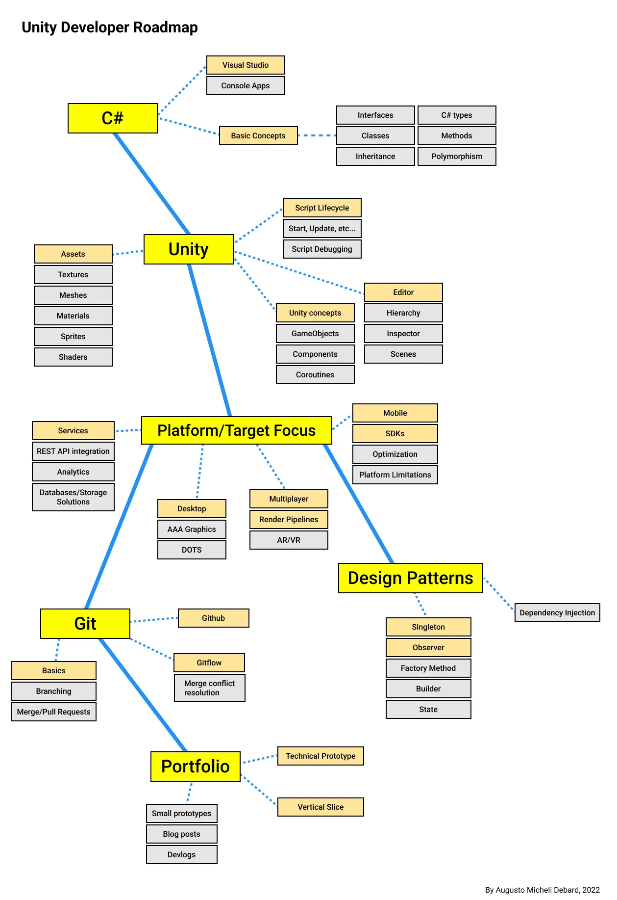
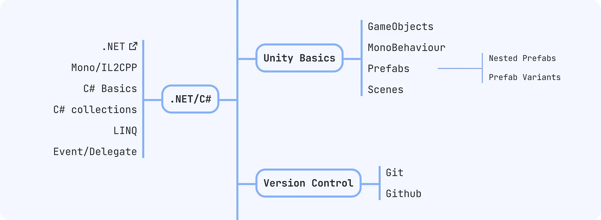
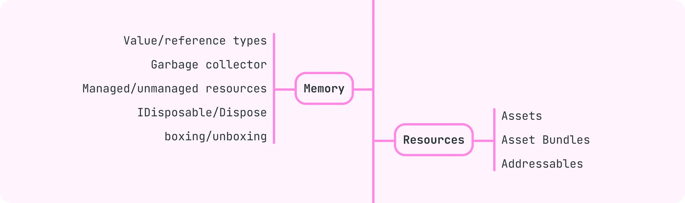
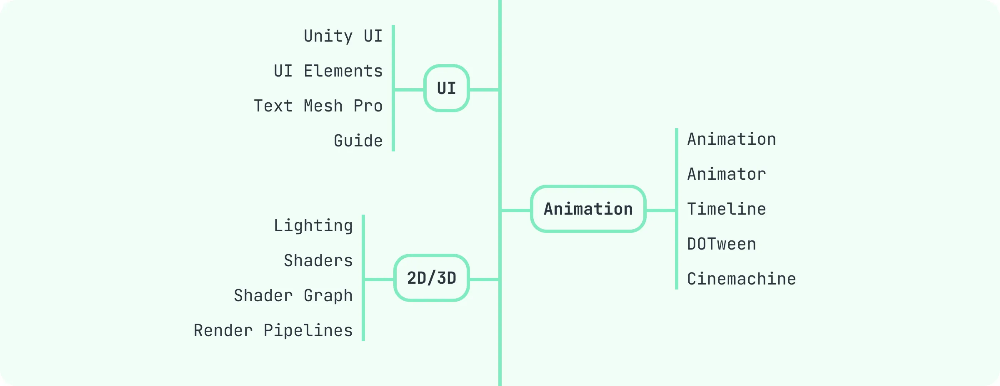
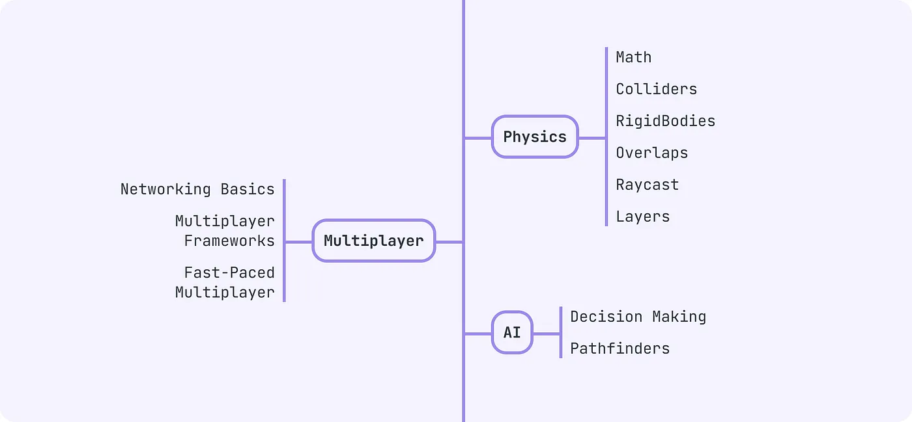
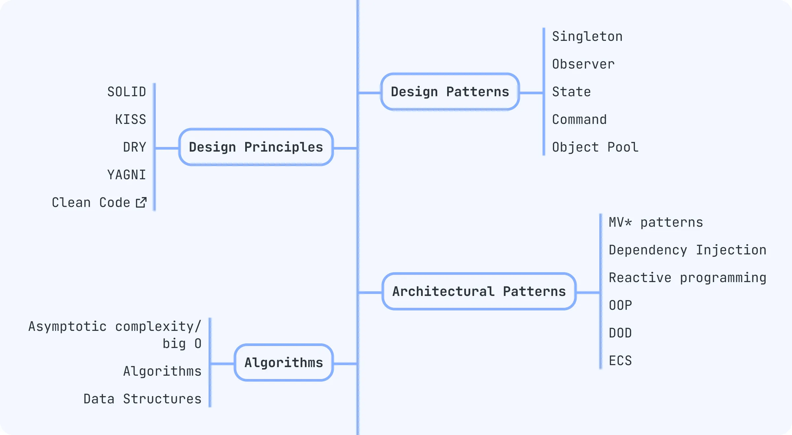
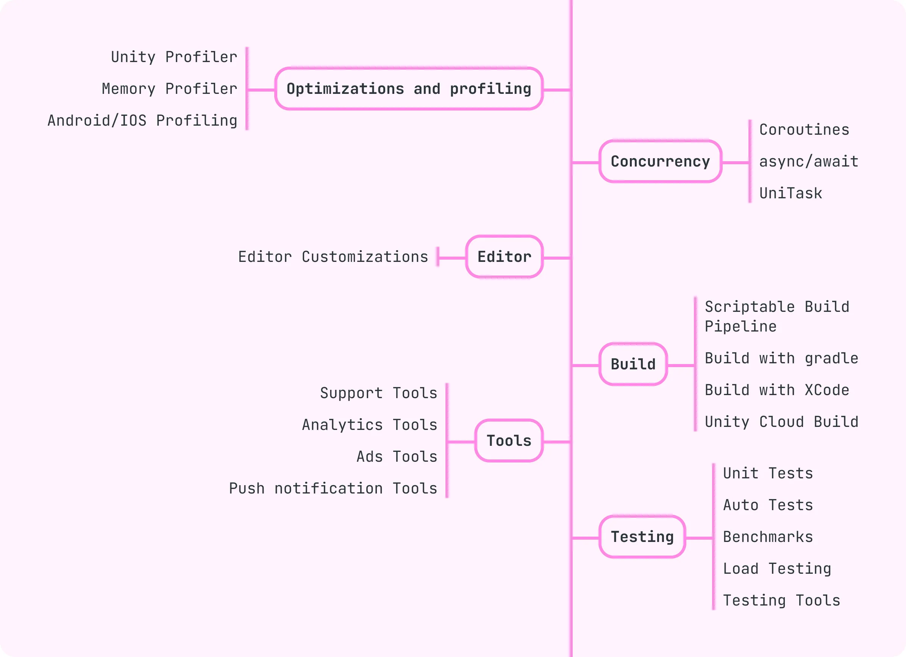

> [!cite]
> [《王者荣耀》技术分析之服务器架构演进 - 掘金](https://juejin.cn/post/6844903487961055246)
> [大白话总结类《王者荣耀》等MOBA游戏中的网络同步机制\_网络游戏udp同步机制-CSDN博客](https://blog.csdn.net/m0_37422289/article/details/88543037)
> [从王者荣耀聊聊游戏的帧同步-腾讯游戏学堂](https://gwb.tencent.com/community/detail/116978)
> [天游论-《王者荣耀》打团不掉帧、不卡顿的架构方式和实现原理 - 知乎](https://zhuanlan.zhihu.com/p/31331767)
> [zhihu.com/question/402684182/answer/2922693913](https://www.zhihu.com/question/402684182/answer/2922693913)
> [zhuanlan.zhihu.com/p/445625178](https://zhuanlan.zhihu.com/p/445625178)

> [!ciet]
> [GitHub - miloyip/game-programmer: A Study Path for Game Programmer](https://github.com/miloyip/game-programmer/)
> [Learn game development w/ Unity | Courses & tutorials in game design, VR, AR, & Real-time 3D | Unity Learn](https://learn.unity.com/pathways)
> [GitHub - milanm/DotNet-Developer-Roadmap: The comprehensive .NET Developer Roadmap by seniority level.](https://github.com/milanm/DotNet-Developer-Roadmap)
> [GitHub - EllanJiang/GameFramework: This is literally a game framework, based on Unity game engine. It encapsulates commonly used game modules during development, and, to a large degree, standardises the process, enhances the development speed and ensures the product quality.](https://github.com/EllanJiang/GameFramework)
> [zhuanlan.zhihu.com/p/637050116](https://zhuanlan.zhihu.com/p/637050116)
> [zhihu.com/question/37475609/answer/3266000047](https://www.zhihu.com/question/37475609/answer/3266000047)
> [zhuanlan.zhihu.com/p/611457078](https://zhuanlan.zhihu.com/p/611457078)
> [zhuanlan.zhihu.com/p/29383687](https://zhuanlan.zhihu.com/p/29383687
> [zhihu.com/question/436911803/answer/1651938158](https://www.zhihu.com/question/436911803/answer/1651938158)
> [zhuanlan.zhihu.com/p/39790846](https://zhuanlan.zhihu.com/p/39790846)
> [zhihu.com/question/33526170/answer/2525578594](https://www.zhihu.com/question/33526170/answer/2525578594)
> [zhihu.com/question/61642141/answer/2623983281](https://www.zhihu.com/question/61642141/answer/2623983281)
> [zhihu.com/question/52174853/answer/2515005526](https://www.zhihu.com/question/52174853/answer/2515005526)

## Free Option

1. [C# Tutorial - Full Course for Beginners](https://www.youtube.com/watch?v=GhQdlIFylQ8) - 4.5 hours, if you already know typescript then you can probably speed through this with constant 5 second skipping of stuff  
    C# 教程 - 初学者完整课程 - 4.5 小时，如果您已经了解 typescript，那么您可能可以通过持续 5 秒跳过内容来加快速度
    
2. [Unity Beginner Scripting  
    Unity 初学者脚本编写](https://learn.unity.com/project/beginner-gameplay-scripting?uv=5.x&courseId=5c61706dedbc2a324a9b022d)
    
3. [Unity C# Survival Guide  
    Unity C# 生存指南](https://www.youtube.com/playlist?list=PLBh_DqwMIbLJOIiilyCOnbmvScvaV5mtU)
    
4. [Unity Intermediate Scripting  
    Unity 中级脚本编写](https://learn.unity.com/project/intermediate-gameplay-scripting)
    
5. [CodeMonkey's C# Basics to Advanced](https://www.youtube.com/playlist?list=PLzDRvYVwl53t2GGC4rV_AmH7vSvSqjVmz) - codemonkey has a lot of good material to learn from and has released multiple games on steam that shows what he teaches works  
    CodeMonkey's C# Basics to Advanced - codemonkey 有很多值得学习的好材料，并且在 Steam 上发布了多款游戏，这些游戏证明了他所教的内容是有效的
    
6. [Jason Weimann's Game Programming Patterns](https://www.youtube.com/playlist?list=PLB5_EOMkLx_VOmnIytx37lFMiajPHppmj) - another solid unity youtuber, it isn't really needed to perfectly understand this stuff right now but just mainly to get exposed to it and understand it exists  
    Jason Weimann 的游戏编程模式 - 另一个可靠的统一 YouTuber，现在并不需要完全理解这些东西，而主要是接触它并理解它的存在
    
7. [Optimizing Unity UI](https://learn.unity.com/tutorial/optimizing-unity-ui#5c7f8528edbc2a002053b5a3) - mainly just an explanation of the UI system and how to not waste performance for no reason  
    优化Unity UI - 主要只是UI系统的讲解以及如何不无端浪费性能
    
8. [The RIGHT way to Pool in Unity - Save your Game Performance with the new generic Object Pool](https://www.youtube.com/watch?v=mRh2DA1Uzo8) - unity's new built in pooling system  
    在 Unity 中进行池化的正确方法 - 使用新的通用对象池保存游戏性能 - Unity 的新内置池化系统
    
9. [Rethink Everything with Scriptable Object VARIABLES](https://www.youtube.com/watch?v=VFOGGml_N6g) - Learning scriptable objects took me a pretty long time, this is a more recent video but I feel it has explained scriptable object architecture in the easiest way to understand. I don't personally use scriptable object architecture but I feel it is still something you should know exists..  
    使用可编写脚本的对象变量重新思考一切 - 学习可编写脚本的对象花了我很长时间，这是一个较新的视频，但我觉得它以最容易理解的方式解释了可编写脚本的对象架构。我个人并不使用可编写脚本的对象架构，但我觉得它仍然是你应该知道的存在。
    
10. [Getting Started with Addressables](https://learn.unity.com/project/getting-started-with-addressables) - mainly just an explanation of addressables which is the recommended way to load assets, honestly it requires way more work than the most straightforward way you will learn at the beginning so learning it doesn't need to be a super high priority until later.  
    可寻址入门 - 主要只是对可寻址的解释，这是推荐的加载资源的方式，老实说，它比您一开始学习的最直接的方法需要更多的工作，因此学习它不需要是一个超高优先级到后来。
    
11. [Speed Up Compile Times in Unity with Assembly Definitions](https://www.youtube.com/watch?v=eovjb5xn8y0) - assembly definitions split up a project into parts so that the whole project doesn't need to be recompiled if nothing in its part has changed, not really needed until your project is large  
    使用程序集定义加快 Unity 中的编译时间 - 程序集定义将项目分成多个部分，这样，如果整个项目的部分没有任何更改，则不需要重新编译整个项目，除非项目很大，否则不需要重新编译
    
12. [Quick Tip ~ Enter Play Mode Faster & Speed Up Development in Unity 2020](https://www.youtube.com/watch?v=lYRPeYoD3EE) - disabling domain reloading / scene reloading can significantly speed up development but also can cause some confusing bugs with static variables like singletons / events which can be fixed after reading [this doc](https://docs.unity3d.com/Manual/DomainReloading.html) on Domain Reloading  
    快速提示 ~ 在 Unity 2020 中更快地进入游戏模式并加快开发速度 - 禁用域重新加载/场景重新加载可以显着加快开发速度，但也可能会导致一些令人困惑的静态变量错误，例如单例/事件，这些错误可以在阅读域上的文档后修复重新装弹

ouTube 游戏项目，可帮助您过渡到制作自己的游戏。

1. [Make A Game In Unity With No Experience](https://www.youtube.com/playlist?list=PLUtKzyIe0aB3TZfe2wsIgJgGZW5G_NAxa) - this is made by the dev of heat signature which proves he knows what he is talking about  
    在没有经验的情况下在 Unity 中制作游戏 - 这是由 heat Signature 的开发人员制作的，这证明他知道自己在说什么
    
2. [Make A Game Like Pokemon in Unity Series](https://www.youtube.com/playlist?list=PLLf84Zj7U26kfPQ00JVI2nIoozuPkykDX) - 103 part tutorial  
    在 Unity 系列中制作类似 Pokemon 的游戏 - 103 部分教程

When I learned Unity I went through a lot of courses and the first 7 I finished and felt they were pretty impactful in my learning experience. After that I mention some video courses that are about newer features I feel are still important to learn.  
当我学习 Unity 时，我学习了很多课程，我完成了前 7 门课程，觉得它们对我的学习经历非常有影响力。之后，我提到了一些关于我认为仍然很重要的新功能的视频课程。

The 8th is newer but a Unity pooling system is probably going to be better to use than your own.  
第 8 个更新，但 Unity 池系统可能比您自己的更好用。

The 9th I felt is the best video course for learning about using scriptable objects as variables, not something I use specifically but still good to know exists.  
我认为第 9 个视频课程是学习如何使用可编写脚本的对象作为变量的最佳视频课程，不是我专门使用的东西，但仍然很高兴知道它的存在。

The 10th Addressables, is something newer I recently learned that is still pretty important but doesn't need to be a high priority. You can definitely make games without using any addressables if your project is not large.  
第 10 个可寻址对象是我最近了解到的新内容，它仍然非常重要，但不需要成为高优先级。如果您的项目不大，您绝对可以在不使用任何可寻址的情况下制作游戏。

The 11th Assembly definitions is another thing that you should know exists but like addressables it isn't really required until you have a large project.  
第 11 个程序集定义是您应该知道存在的另一件事，但就像可寻址一样，直到您有一个大型项目时才真正需要它。

The 12th Disabling Domain Reloading can speed up development a lot with pretty much instant play mode time if you don't need to recompile your project. The problem is it can cause some crazy bugs if you use any static variables like singletons / static events. I feel the trade off is worth it but seriously the bugs can be crazy, you definitely do not want to forget about your static bug problem. I sometimes forget about static bugs and have wasted a decent amount of time trying to track down a bug that only existed because I disabled domain reloading. To fix the bugs you need to reset your static stuff manually with [RuntimeInitializeOnLoadMethod]  
如果您不需要重新编译项目，第 12 个禁用域重新加载可以通过几乎即时的播放模式时间大大加快开发速度。问题是，如果您使用任何静态变量（例如单例/静态事件），它可能会导致一些疯狂的错误。我觉得这种权衡是值得的，但说真的，错误可能会很疯狂，你绝对不想忘记你的静态错误问题。我有时会忘记静态错误，并浪费了大量时间试图追踪仅因我禁用域重新加载而存在的错误。要修复错误，您需要使用 [RuntimeInitializeOnLoadMethod] 手动重置静态内容

All of these courses / playlists are free and the way I learned.  
所有这些课程/播放列表都是免费的，也是我学习的方式。

## Free Option

1. [C# Tutorial - Full Course for Beginners](https://www.youtube.com/watch?v=GhQdlIFylQ8) - 4.5 hours, if you already know typescript then you can probably speed through this with constant 5 second skipping of stuff  
    C# 教程 - 初学者完整课程 - 4.5 小时，如果您已经了解 typescript，那么您可能可以通过持续 5 秒跳过内容来加快速度
    
2. [Unity Beginner Scripting  
    Unity 初学者脚本编写](https://learn.unity.com/project/beginner-gameplay-scripting?uv=5.x&courseId=5c61706dedbc2a324a9b022d)
    
3. [Unity C# Survival Guide  
    Unity C# 生存指南](https://www.youtube.com/playlist?list=PLBh_DqwMIbLJOIiilyCOnbmvScvaV5mtU)
    
4. [Unity Intermediate Scripting  
    Unity 中级脚本编写](https://learn.unity.com/project/intermediate-gameplay-scripting)
    
5. [CodeMonkey's C# Basics to Advanced](https://www.youtube.com/playlist?list=PLzDRvYVwl53t2GGC4rV_AmH7vSvSqjVmz) - codemonkey has a lot of good material to learn from and has released multiple games on steam that shows what he teaches works  
    CodeMonkey's C# Basics to Advanced - codemonkey 有很多值得学习的好材料，并且在 Steam 上发布了多款游戏，这些游戏证明了他所教的内容是有效的
    
6. [Jason Weimann's Game Programming Patterns](https://www.youtube.com/playlist?list=PLB5_EOMkLx_VOmnIytx37lFMiajPHppmj) - another solid unity youtuber, it isn't really needed to perfectly understand this stuff right now but just mainly to get exposed to it and understand it exists  
    Jason Weimann 的游戏编程模式 - 另一个可靠的统一 YouTuber，现在并不需要完全理解这些东西，而主要是接触它并理解它的存在
    
7. [Optimizing Unity UI](https://learn.unity.com/tutorial/optimizing-unity-ui#5c7f8528edbc2a002053b5a3) - mainly just an explanation of the UI system and how to not waste performance for no reason  
    优化Unity UI - 主要只是UI系统的讲解以及如何不无端浪费性能
    
8. [The RIGHT way to Pool in Unity - Save your Game Performance with the new generic Object Pool](https://www.youtube.com/watch?v=mRh2DA1Uzo8) - unity's new built in pooling system  
    在 Unity 中进行池化的正确方法 - 使用新的通用对象池保存游戏性能 - Unity 的新内置池化系统
    
9. [Rethink Everything with Scriptable Object VARIABLES](https://www.youtube.com/watch?v=VFOGGml_N6g) - Learning scriptable objects took me a pretty long time, this is a more recent video but I feel it has explained scriptable object architecture in the easiest way to understand. I don't personally use scriptable object architecture but I feel it is still something you should know exists..  
    使用可编写脚本的对象变量重新思考一切 - 学习可编写脚本的对象花了我很长时间，这是一个较新的视频，但我觉得它以最容易理解的方式解释了可编写脚本的对象架构。我个人并不使用可编写脚本的对象架构，但我觉得它仍然是你应该知道的存在。
    
10. [Getting Started with Addressables](https://learn.unity.com/project/getting-started-with-addressables) - mainly just an explanation of addressables which is the recommended way to load assets, honestly it requires way more work than the most straightforward way you will learn at the beginning so learning it doesn't need to be a super high priority until later.  
    可寻址入门 - 主要只是对可寻址的解释，这是推荐的加载资源的方式，老实说，它比您一开始学习的最直接的方法需要更多的工作，因此学习它不需要是一个超高优先级到后来。
    
11. [Speed Up Compile Times in Unity with Assembly Definitions](https://www.youtube.com/watch?v=eovjb5xn8y0) - assembly definitions split up a project into parts so that the whole project doesn't need to be recompiled if nothing in its part has changed, not really needed until your project is large  
    使用程序集定义加快 Unity 中的编译时间 - 程序集定义将项目分成多个部分，这样，如果整个项目的部分没有任何更改，则不需要重新编译整个项目，除非项目很大，否则不需要重新编译
    
12. [Quick Tip ~ Enter Play Mode Faster & Speed Up Development in Unity 2020](https://www.youtube.com/watch?v=lYRPeYoD3EE) - disabling domain reloading / scene reloading can significantly speed up development but also can cause some confusing bugs with static variables like singletons / events which can be fixed after reading [this doc](https://docs.unity3d.com/Manual/DomainReloading.html) on Domain Reloading  
    快速提示 ~ 在 Unity 2020 中更快地进入游戏模式并加快开发速度 - 禁用域重新加载/场景重新加载可以显着加快开发速度，但也可能会导致一些令人困惑的静态变量错误，例如单例/事件，这些错误可以在阅读域上的文档后修复重新装弹
    

And two decently long youtube game projects to help transition into making your own games.  
还有两个相当长的 YouTube 游戏项目，可帮助您过渡到制作自己的游戏。

1. [Make A Game In Unity With No Experience](https://www.youtube.com/playlist?list=PLUtKzyIe0aB3TZfe2wsIgJgGZW5G_NAxa) - this is made by the dev of heat signature which proves he knows what he is talking about  
    在没有经验的情况下在 Unity 中制作游戏 - 这是由 heat Signature 的开发人员制作的，这证明他知道自己在说什么
    
2. [Make A Game Like Pokemon in Unity Series](https://www.youtube.com/playlist?list=PLLf84Zj7U26kfPQ00JVI2nIoozuPkykDX) - 103 part tutorial  
    在 Unity 系列中制作类似 Pokemon 的游戏 - 103 部分教程
    

## Paid Option 付费选项

Like I said I learned for free mostly from the courses above but a paid path would probably make use of of gamedev.tv courses, something like below. I did speed through the 2D course and the RPG Core Combat Creator and they definitely seemed like they would be decent but again it is not the way I learned.  
就像我说的，我主要从上面的课程中免费学习，但付费路径可能会利用 gamedev.tv 课程，如下所示。我确实快速完成了 2D 课程和 RPG Core Combat Creator，它们看起来确实很不错，但这又不是我学习的方式。

Udemy does have each individual course so you can see the reviews and I think they are all decently rated / reviewed.  
Udemy 确实有每个单独的课程，因此您可以看到评论，我认为它们都得到了不错的评级/评论。

1. [Beginner Unity Bundle  
    初学者 Unity 捆绑包](https://www.gamedev.tv/p/beginner-unity-bundle/?coupon_code=AUTUMN)
    

---

- Complete C# Unity Game Developer 2D Online Course - 2021  
    完整的 C# Unity 游戏开发人员 2D 在线课程 - 2021
    
- Complete C# Unity Game Developer 3D Online Course - 2020  
    完整的 C# Unity 游戏开发人员 3D 在线课程 - 2020
    
- Unity Mobile C# Developer Course  
    Unity 移动 C# 开发人员课程
    

1. [The Complete Unity RPG Bundle: Intermediate C# Game Coding  
    完整的 Unity RPG 捆绑包：中级 C# 游戏编码](https://www.gamedev.tv/p/the-complete-unity-rpg-bundle-intermediate-c-game-coding/?coupon_code=AUTUMN)
    

---

- 2019 RPG Core Combat Creator: Learn Intermediate Unity C# Coding  
    2019 RPG Core Combat Creator：学习中级 Unity C# 编码
    
- RPG Inventory Systems: Intermediate C# Game Coding Course  
    RPG 库存系统：中级 C# 游戏编码课程
    
- Unity Dialogue & Quests: Intermediate C# Game Coding  
    Unity 对话和任务：中级 C# 游戏编码
    
- Unity RPG Shops & Abilities: Intermediate C# Game Coding  
    Unity RPG 商店和功能：中级 C# 游戏编码

掌握基础知识：C#

方法、类、构造函数、继承、接口、内置 C# 类型和类，甚至多态性

Update execution loop and Script Lifecycle. 理解更新执行循环和脚本生命周期
serialization, framerate independence, and features like Coroutines and Events 序列化、帧率独立性等概念以及协程和事件等功能
与图形相关的概念：材质、纹理、网格、精灵、绘制调用和着色器。

《C# 8.0 in a Nutshell》。您应该重点关注“C# 语言基础知识”和“处置和垃圾收集”章节。

资源管理对于 Unity 开发人员也至关重要。这里的资源指的是各种图像、模型、纹理、字体、声音等，你需要知道如何管理它们。为了深入了解这一切是如何工作的，您应该阅读[手册](https://docs.unity3d.com/Manual/AssetWorkflow.html)。了解 [Asset Bundles](https://docs.unity3d.com/Manual/AssetBundlesIntro.html) 和更新的功能 [Addressables](https://docs.unity3d.com/Packages/com.unity.addressables@2.0/manual/index.html) 也很有用。

视觉开发。 Unity 中的视觉效果可分为三类：UI、2D 和 3D。

Unity 中的 UI 由两个不同的系统表示：在标准游戏对象上运行的较旧的 Unity UI，以及更像 Web 开发的较新的 UI Toolkit。由于 Unity UI 的熟悉性，许多开发人员仍然更喜欢它。[最全面的 Unity UI 指南](https://unity.com/ru/resources/user-interface-design-and-implementation-in-unity)

学习图形编程要复杂得多。首先，您需要了解[照明](https://learn.unity.com/tutorial/introduction-to-lighting-and-rendering-2019-3)及其在引擎中的高层次运作方式。然后，您可以深入了解[着色器和着色器语言](https://docs.unity3d.com/Manual/Shaders.html)。或者，您可以使用 [Shader Graph](https://docs.unity3d.com/Packages/com.unity.shadergraph@17.0/manual/index.html) 进行可视化着色器编程，从而绕过详细的着色器编程。了解 [HDRP](https://unity.com/srp/High-Definition-Render-Pipeline)/[URP](https://unity.com/srp/universal-render-pipeline) 也很有帮助。

- [Animation/Animator](https://learn.unity.com/project/creative-core-animation) a作为Unity动画的基本元素。
- [Timeline](https://docs.unity3d.com/Packages/com.unity.timeline@1.2/manual/index.html) i非常适合游戏场景，例如创建由多个动画、声音等组成的长场景。
- [DOTween](https://dotween.demigiant.com/) i是一个优秀的动画编程解决方案。

核心游戏玩法。在引擎中首先要熟悉的是[物理原理](https://pikuma.com/blog/math-for-game-developers)。您甚至可能还记得线性代数的基础知识以及什么是引力.了解[碰撞体、刚体、重叠、光线投射和图层](https://docs.unity3d.com/Manual/PhysicsSection.html)。

游戏在线多人游戏功能。这对于客户端开发人员来说相当复杂。如果公司不使用定制解决方案，通常会使用 [Photon](https://www.photonengine.com/pun)。您还应该了解 [Unity 多人游戏](https://docs-multiplayer.unity3d.com/)。在此之前，不要忘记了解[网络](https://www.educative.io/courses/grokking-computer-networking)的一般工作原理。之后，您必须弄清楚游戏中的网络是如何工作的，包括[预测、插值和滞后补偿](https://www.gabrielgambetta.com/client-server-game-architecture.html)。

创建游戏 NPC。除了传统的脚本机器人之外，还有多种方法可以实现机器人行为：决策树、有限状态机、行为树（在 Ian Millington 的《[AI for Games](https://www.amazon.com/AI-Games-Third-Ian-Millington-dp-1138483974/dp/1138483974)》一书中进行了描述）以及 [Utility AI](https://www.gdcvault.com/play/1018040/Architecture-Tricks-Managing-Behaviors)。除了行为之外，您还需要寻路算法：对于自定义解决方案，您应该了解 [A*](https://en.wikipedia.org/wiki/A*_search_algorithm)，但 Unity 已经有了自己的解决方案：[AI 导航](https://docs.unity3d.com/Packages/com.unity.ai.navigation@2.0/manual/)。

项目架构。熟悉算法、数据结构及其复杂性。您可能还会喜欢一本关于算法的有趣书籍，即 Aditya Y Bhargava 所著的《Grokking Algorithms》。

Architectural patterns
- [Object-oriented programming  
    面向对象编程](https://www.educative.io/courses/learn-object-oriented-programming-in-c-sharp)
- [Functional programming 函数式编程](https://www.manning.com/books/functional-programming-in-c-sharp-second-edition)
- [Data-oriented design  面向数据的设计](https://github.com/dbartolini/data-oriented-design)
- [Reactive programming  反应式编程](https://github.com/neuecc/UniRx)
项目架构

[MV*](https://uniandes-se4ma.gitlab.io/books/chapter8/mvc-mvvm-mv-mvwhat.html) patterns (MVC, MVP, MVVM) are useful.

依赖注入，请了解 [DI 和 IoC](https://www.amazon.com/Dependency-Injection-Principles-Practices-Patterns-dp-161729473X/dp/161729473X)。 [Zenject](https://github.com/modesttree/Zenject) 是 Unity 广泛使用的 DI 框架。

核心玩法开发，目前最流行的是ECS方式。您可以使用 [Unity DOTS](https://unity.com/dots) 或您喜欢的其他实现。

Design patterns. 

[Refactoring Guru](https://refactoring.guru/design-patterns)  [game development patterns](https://gameprogrammingpatterns.com/contents.html). 基本模式包括单例、观察者、状态、命令、对象池。

设计原则SOLID, KISS, DRY, and YAGNI. Also read about [Clean Code](https://www.amazon.com/dp/0132350882?ref_=cm_sw_r_cp_ud_dp_NE79KK78D39P7MN63CBF).

优化和分析您的游戏。 Unity 为此提供了两个主要工具：[Profiler](https://docs.unity3d.com/Manual/Profiler.html) 和 [Memory Profiler](https://unity.com/how-to/use-memory-profiling-unity)。实际上，有很多方法和工具可用于提高游戏性能。
熟悉并发这样的概念。您必须了解[协程](https://learn.unity.com/tutorial/coroutines)、[async/await](https://www.educative.io/courses/c-sharp-concurrency-for-senior-engineering-interviews) 和 [UniTask](https://github.com/Cysharp/UniTask) 是什么。

创建自己的[自定义编辑器窗口](https://docs.unity3d.com/Manual/UIE-support-for-editor-ui.html)并[自定义构建管道。](https://docs.unity3d.com/Packages/com.unity.scriptablebuildpipeline@1.21)

外部包的集成。这可以是分析工具（例如 [Firebase](https://firebase.google.com/docs/analytics/unity/start) 或 Amplitude）的集成，用于跟踪用户行为和优化游戏。

广告包（例如 [AdMob](https://developers.google.com/admob/unity/quick-start) 或 [Unity Ads](https://unity.com/products/unity-ads)）是免费项目货币化所必需的。推送通知可以使用 [OneSignal](https://documentation.onesignal.com/docs/unity-sdk-setup) 或 Firebase 实现，将帮助您留住并重新吸引用户.

联系支持的工具，例如 [Zendesk](https://www.zendesk.com/unity/) 或 [Helpshift](https://developers.helpshift.com/sdkx-unity/)，以便为用户提供优质支持并解决他们的问题。

测试在游戏开发中起着重要作用。单元测试可以使用 NUnit 或 xUnit 编写，有助于检查代码的每个单独部分是否正确运行。您还应该注意 [Unity Test Framework](https://docs.unity3d.com/Packages/com.unity.test-framework@1.4/) 和 [Performance Test Package](https://docs.unity3d.com/Packages/com.unity.test-framework.performance@3.0)。

使用基准测试可以让您测量代码的性能并对其进行优化，而负载测试将有助于检查您的游戏如何应对大量用户。

不断提高您的技能：订阅各种摘要，关注 X、TikTok 和 YouTube 上的开发人员。在 [dev.to](http://dev.to/) 上阅读和收听播客、参加会议、撰写文章、参加游戏即兴活动。
