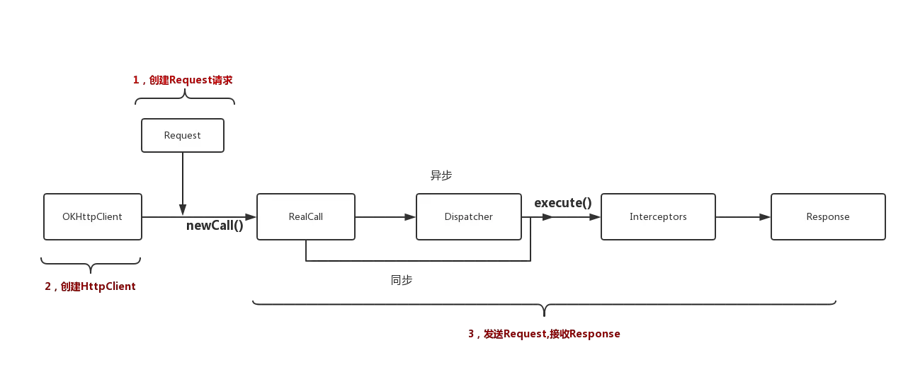
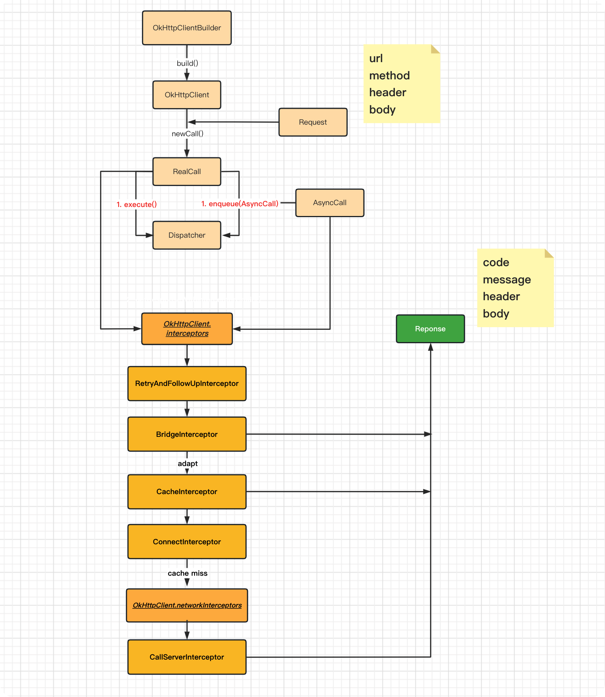

> [!todo]
> https://developer.android.com/courses/android-basics-compose/course
> https://developer.android.com/courses/unit/kotlin-basics-unit-1
> https://www.geeksforgeeks.org/kotlin-android-tutorial/
> https://developer.android.com/courses/
> 
> 

## Android 应用程序组成

### 清单文件 `AndroidManifest.xml`

安卓操作系统与安卓应用程序之间由清单文件 `AndroidManifest.xml` 进行连接, 该清单文件位于应用程序的根目录下, 用于告知系统应用程序的基本信息, 如应用程序的名称、图标、版本号、权限以及各种组件等. 


以下是一个简单的清单文件示例及其内容解析:

```xml
<?xml version="1.0" encoding="utf-8"?>
<manifest xmlns:android="http://schemas.android.com/apk/res/android"
    xmlns:tools="http://schemas.android.com/tools">

    <!-- 应用程序信息 -->
    <application
        android:name=".MyApplication"
        android:allowBackup="true"
        android:dataExtractionRules="@xml/data_extraction_rules"
        android:fullBackupContent="@xml/backup_rules"
        android:icon="@mipmap/ic_launcher"
        android:label="@string/app_name"
        android:roundIcon="@mipmap/ic_launcher_round"
        android:supportsRtl="true"
        android:theme="@style/Theme.MyApplication3"
        tools:targetApi="31">

        <!-- 活动声明 -->
        <activity
            android:name=".MainActivity"
            android:launchMode="singleTop"
            android:taskAffinity=""
            android:allowTaskReparenting="true"
            android:exported="true"
            android:label="@string/title_activity_main">
        <intent-filter>
            <action android:name="android.intent.action.MAIN" />
            <category android:name="android.intent.category.LAUNCHER" />
        </intent-filter>
        </activity>

        <activity
            android:name=".SecondActivity"
            android:exported="true"
            android:label="@string/title_activity_second">
        <intent-filter>
            <action android:name="com.example.SECOND" />
            <category android:name="android.intent.category.DEFAULT" />
        </intent-filter>
        </activity>

        <!-- 服务声明 -->
        <service
            android:name=".MyService"
            android:exported="true">
            <intent-filter>
                <action android:name="com.example.MY_SERVICE" />
            </intent-filter>
        </service>

        <!-- 广播接收器声明 -->
        <receiver
            android:name=".MyReceiver"
            android:exported="true">
            <intent-filter>
                <action android:name="android.intent.action.BOOT_COMPLETED" />
            </intent-filter>
        </receiver>

        <!-- 内容提供程序声明 -->
        <provider
            android:name=".MyProvider"
            android:authorities="com.example.myprovider"
            android:exported="true"
            android:grantUriPermissions="true">
            <grant-uri-permission android:pathPattern="/myprovider/*" />
            </provider>
    </application>

    <!-- 权限声明 -->
    <uses-permission android:name="android.permission.INTERNET" />
    <uses-permission android:name="android.permission.ACCESS_NETWORK_STATE" />
    <uses-permission android:name="android.permission.CAMERA" />
    <uses-permission android:name="android.permission.RECORD_AUDIO" />
    <uses-permission android:name="android.permission.ACCESS_FINE_LOCATION" />

    <!-- 使用特性 -->
    <uses-feature android:name="android.hardware.camera" />
    <uses-feature android:name="android.hardware.microphone" />
    <uses-feature android:name="android.hardware.location.gps" />

</manifest>
```

**顶部声明**
- `<?xml version="1.0" encoding="utf-8"?>`：声明 XML 文件的版本和编码方式。
- `<manifest>`：根元素，包含应用的所有配置。
    - `xmlns:android="http://schemas.android.com/apk/res/android"`：定义 `android` 命名空间，用于引用安卓系统提供的属性。
    - `xmlns:tools="http://schemas.android.com/tools"`：定义 `tools` 命名空间，用于引用开发工具（如 Android Studio）提供的一些自定义属性。
**`<application>` 元素**

包含应用级别的配置信息，定义应用的全局属性和组件。
- `android:name=".MyApplication"`: 指定应用的自定义 `Application` 类。
- `android:allowBackup="true"`: 允许用户备份和恢复应用的数据。
- `android:dataExtractionRules="@xml/data_extraction_rules"`: 指定数据提取规则，通常用于自动备份功能。
- `android:fullBackupContent="@xml/backup_rules"`: 指定完整备份内容的规则。
- `android:icon="@mipmap/ic_launcher"`: 指向用于标识应用的图标的资源
- `android:label="@string/app_name"`: 指定应用的显示名称。
- `android:roundIcon="@mipmap/ic_launcher_round"`: 指定圆形应用图标（通常用于圆形图标需求的设备）。
- `android:supportsRtl="true"`: 指定应用是否支持从右到左（RTL）的布局方向。
- `android:theme="@style/Theme.MyApplication3"`: 指定应用的主题。
- `tools:targetApi="31"`: 指定目标 API 级别，主要用于开发工具进行静态代码检查，不影响实际运行时的行为。

**`<activity>` 元素**

定义一个活动（Activity），是应用的一个主要组件，代表一个用户界面。
- `android:name=".MainActivity"`: 指定活动的类名，`.MainActivity` 表示该活动在应用包名下。
- `android:launchMode="singleTop"`: 指定活动的启动模式。这里是 `singleTop`，表示如果活动已经在栈顶，不会重新创建新的实例。
- `android:taskAffinity=""`: 指定活动的任务亲和性。
- `android:allowTaskReparenting="true"`: 指定活动是否允许移动到其他任务中。
- `android:exported="true"`: 指定活动是否可以由应用之外的组件启动。`true` 表示可以被其他应用访问。
- `android:label="@string/title_activity_main"`: 指定活动的显示名称。
- `<intent-filter>`: 定义了活动能够响应的意图（Intent），通常用于配置应用的启动活动和处理特定的动作。
    - `<action>`: 定义意图的动作。
        - `android:name="android.intent.action.MAIN"`: 表示该活动是应用的主入口点。
        - `android:name="com.example.SECOND"`: 自定义的动作名称。
    - `<category>`: 定义意图的类别。
        - `android:name="android.intent.category.LAUNCHER"`: 表示该活动会出现在应用启动器中，作为应用的启动活动。
        - `android:name="android.intent.category.DEFAULT"`: 默认的意图类别。

**`<service>` 元素**

定义一个服务（Service），是一个后台运行的组件，用于执行长时间运行的操作。
- `android:name=".MyService"`: 指定服务的类名。
- `android:exported="true"`: 指定服务是否可以被其他应用访问。
- `<intent-filter>`: 定义了服务能够响应的意图。
    - `<action>`: 定义意图的动作。
        - `android:name="com.example.MY_SERVICE"`: 自定义的动作名称。

**`<receiver>` 元素**

定义一个广播接收器（Broadcast Receiver），用于接收系统广播事件。
- `android:name=".MyReceiver"`: 指定广播接收器的类名。
- `android:exported="true"`: 指定广播接收器是否可以被其他应用访问。
- `<intent-filter>`: 定义了广播接收器能够响应的意图。
    - `<action>`: 定义意图的动作。
        - `android:name="android.intent.action.BOOT_COMPLETED"`: 表示系统启动完成后发送的广播。

**`<provider>` 元素**

定义一个内容提供程序（Content Provider），用于管理应用程序的数据集。
- `android:name=".MyProvider"`: 指定内容提供程序的类名。
- `android:authorities="com.example.myprovider"`: 指定内容提供程序的权限。
- `android:exported="true"`: 指定内容提供程序是否可以被其他应用访问。
- `android:grantUriPermissions="true"`: 指定内容提供程序是否授予 URI 权限。
- `<grant-uri-permission>`: 定义了内容提供程序授予的 URI 权限。
    - `android:pathPattern="/myprovider/*"`: 匹配 URI 的路径模式。

**`<uses-permission>` 元素**

定义应用程序需要的权限。
- `android:name="android.permission.INTERNET"`: 访问互联网的权限。
- `android:name="android.permission.ACCESS_NETWORK_STATE"`: 访问网络状态的权限。
- `android:name="android.permission.CAMERA"`: 使用摄像头的权限。
- `android:name="android.permission.RECORD_AUDIO"`: 录制音频的权限。
- `android:name="android.permission.ACCESS_FINE_LOCATION"`: 访问精确位置的权限。

**`<uses-feature>` 元素**

定义应用程序需要的硬件功能。
- `android:name="android.hardware.camera"`: 摄像头硬件功能。
- `android:name="android.hardware.microphone"`: 麦克风硬件功能。
- `android:name="android.hardware.location.gps"`: GPS 定位硬件功能。

### 应用程序基础: Application

应用程序的基础是 `Application` 类, 一个单例类, 每个应用程序都有一个 `Application` 实例, 它是整个应用程序的入口点，负责应用程序的初始化和全局状态的管理, 可以通过 `getApplication()` 方法获取。
- 在应用程序启动时初始化一些全局的资源或配置，例如第三方库（如分析工具、数据库库等）。
- 在应用程序的生命周期中管理全局状态，例如用户登录状态、网络连接状态等。
- 监控整个应用程序的生命周期，处理一些全局的状态变化。
    - `onCreate()`: 应用程序创建时调用。
    - `onTerminate()`: 应用程序终止时调用。

```kotlin
class MyApplication : Application() {
    override fun onCreate() {
        super.onCreate()
        // 初始化Firebase
        FirebaseApp.initializeApp(this)
        // 初始化Crashlytics
        Fabric.with(this, Crashlytics())
        // 初始化数据库
        Realm.init(this)
        // 初始化全局数据
        someGlobalData = "This is some global data"
    }
}
```

### 应用程序四大组件: 活动、服务、广播接收器、内容提供程序

Android 应用程序由四个主要组件组成:
- 活动 (Activity): 用户与应用程序进行交互的主要入口点, 通常表示一个具有用户界面的屏幕
- 服务 (Service): 在后台执行长时间运行的操作或远程处理
- 广播接收器 (Broadcast Receiver): 在系统广播事件发生时接收系统广播
- 内容提供程序 (Content Provider): 管理应用程序的数据集

活动可以启动服务来执行后台任务; 注册广播接收器来接收系统或应用的广播以更新 UI; 使用内容提供程序来访问和管理数据; 启动其他活动，并传递数据。

广播接收器被动接收系统或应用的广播事件, 然后可以启动服务来执行后台任务, 也可以通过内容提供程序来访问和管理数据。

服务通常是由活动或广播接收器启动, 可以通过内容提供程序来访问和管理数据。

内容提供程序为程序提供标准的数据管理接口, 包括查询、插入、更新和删除。

此外还有些附加组件:
- 片段 (Fragment): 可重用的 UI 组件
- 意图 (Intent): 用于在组件之间传递消息
- 视图 (View): 用户界面的构建块
- 布局 (Layout): 定义视图的结构和外观
- 资源 (Resource): 应用程序的非代码资源，如图像、字符串和布局文件

#### 活动 (Activity)

活动是 Android 应用程序的一个主要组件，用于表示用户界面的一个屏幕, 通常包含用户界面元素，如按钮、文本框和图像，用于与用户进行交互。每个活动都是一个类，继承自 `Activity` 类或其子类。Android 系统初始化其应用程序是通过活动中的 `onCreate()` 开始的。

每个应用程序可以包含多个活动，所有活动必须在清单文件 `AndroidManifest.xml` 中进行声明。

每个活动都有一个生命周期，包括以下主要状态:
- `onCreate()`: 活动创建时调用
- `onStart()`: 活动开始时调用
- `onResume()`: 活动恢复时调用
- `onPause()`: 活动暂停时调用
- `onStop()`: 活动停止时调用
- `onDestroy()`: 活动销毁时调用
- `onRestart()`: 活动重新启动时调用

活动之间可以通过意图 (Intent) 进行通信，意图可以用于启动活动、启动服务、发送广播等。

#### 服务 (Service)

服务是可以在后台执行长时间运行操作或远程处理(下载文件、播放音乐、更新数据等)的组件，不提供用户界面, 即使应用程序处于后台或被销毁，服务仍然可以继续运行。每个服务都是一个类，继承自 `Service` 类或其子类。服务必须在清单文件 `AndroidManifest.xml` 中进行声明。

服务可以通过活动的 `startService()` 或 `bindService()` 方法启动，通过 `stopService()` 或 `unbindService()` 方法停止。区别在于 `startService()` 启动的服务会一直运行，直到调用 `stopService()` 停止，而 `bindService()` 是在其他 app 或系统组件中绑定服务，绑定后服务会一直运行直到所有绑定的组件都解绑。

每个服务也有一个生命周期，包括以下主要状态:
- `onStartCommand()`: 服务启动时调用
- `onCreate()`: 服务创建时调用
- `onBind()`: 服务绑定时调用
- `onUnbind()`: 服务解绑时调用
- `onRebind()`: 服务重新绑定时调用
- `onDestroy()`: 服务销毁时调用

#### 广播接收器 (Broadcast Receiver)

广播接收器是用于接收系统或应用的广播事件的组件，当特定事件发生时，广播接收器会接收并处理广播消息。每个广播接收器都是一个类，继承自 `BroadcastReceiver` 类或其子类。广播接收器必须在清单文件 `AndroidManifest.xml` 中进行声明。

广播接收器可以通过 `registerReceiver()` 方法注册，通过 `unregisterReceiver()` 方法注销。也可以通过清单文件声明静态注册，这样即使应用程序未运行，也可以接收广播。

广播接收器可以接收系统广播事件, 常见的系统广播事件包括:
- `android.intent.action.BOOT_COMPLETED`: 系统启动完成时发送的广播
- `android.intent.action.SCREEN_ON`: 屏幕开启时发送的广播
- `android.intent.action.SCREEN_OFF`: 屏幕关闭时发送的广播
- `android.intent.action.ACTION_POWER_CONNECTED`: 充电器连接时发送的广播
- `android.intent.action.ACTION_POWER_DISCONNECTED`: 充电器断开时发送的广播
- `android.intent.action.BATTERY_LOW`: 电池电量低时发送的广播
- `android.intent.action.BATTERY_OKAY`: 电池电量恢复正常时发送的广播

广播接收器也可以通过活动的`sendBroadcast()` 方法发送自定义的广播事件。

#### 内容提供程序 (Content Provider)

内容提供程序是用于管理应用程序的数据集的组件，提供包括查询、插入、更新和删除等数据接口，支持跨应用程序访问数据。存储方式包括数据库, 文件, 网络等.

每个内容提供程序都是一个类，继承自 `ContentProvider` 类或其子类。内容提供程序必须在清单文件 `AndroidManifest.xml` 中进行声明。

内容提供程序可以通过查询, 插入, 更新和删除方法来操作数据。想访问内容提供程序可以通过预定义的 URI (Uniform Resource Identifier) 来标识和访问数据集，URI 由以下部分组成:`<prefix>://<authority>/<data_type>/<id>`

`ContentProvider` 类中的方法:
- `query()`: 查询数据
- `insert()`: 插入数据
- `update()`: 更新数据
- `delete()`: 删除数据
- `getType()`: 获取数据类型
- `onCreate()`: 当提供者被启动时调用

#### 意图 (Intent)

意图是一种异步消息传递机制，


意图是用于在组件之间异步传递消息的对象，用于在将组件绑定, 同时在组件之间传递消息，如启动活动、启动服务、发送广播等。
- 显式意图 (Explicit Intent): 指定要启动的组件的类名
- 隐式意图 (Implicit Intent): 指定要执行的操作，由系统根据意图的动作和数据类型选择合适的组件

## UI

应用的界面 (UI) 就是您在屏幕上所看到的内容（文本、图片、按钮和许多其他类型的元素）及其在屏幕上的布局方式。

Jetpack Compose 可以使用在项目的 Android 自动生成的 `R` 类中通过资源 ID 访问 Android 项目中定义的资源。
- `painterResource()` 函数会加载可绘制图片资源，并将资源 ID（在本例中为 `R.drawable.androidparty` ）作为实参。
- `stringResource()` 


`onCreate()` 函数中的 [`setContent()`](https://developer.android.com/reference/kotlin/androidx/compose/ui/platform/ComposeView?hl=zh-cn#setContent(kotlin.Function0)) 函数用于通过可组合函数定义布局。


可组合函数 Jetpack Compose 是用于构建 Android 界面的新款工具包。任何标有 `@Composable` 注解的函数都可通过 `setContent()` 函数或其他可组合函数进行调用。该注解可告知 Kotlin 编译器 Jetpack Compose 使用的这个函数会生成 UI。

注解

```kotlin
@Composable
@Preview
```

修饰符 [`Modifier`](https://developer.android.com/reference/kotlin/androidx/compose/ui/Modifier?hl=zh-cn) 用于扩充或修饰可组合项, 如修饰组件的布局。
- 内边距修饰符 (`Modifier.padding`) 在 `Text` 可组合项的周围添加空间。
```
Modifier.padding(
    start = 16.dp,
    top = 16.dp,
    end = 16.dp,
    bottom = 16.dp
)

Modifier
    .padding(16.dp)
    .align(alignment = Alignment.End)
```
- 背景颜色修饰符 `Modifier.background` 


基本标准布局元素是 `Column`、`Row,` 和 `Box`。
- [`Box`](https://developer.android.com/reference/kotlin/androidx/compose/foundation/layout/package-summary?hl=zh-cn#Box(androidx.compose.ui.Modifier,androidx.compose.ui.Alignment,kotlin.Boolean,kotlin.Function1)) 布局是 Compose 中的标准布局元素之一。使用 `Box` 布局可将元素堆叠在一起。`Box` 布局还可用于配置它所包含的元素的特定对齐方式。

应用在某些情况下可能会被翻译成其他语言, 一些固定的 `String` 数据类型可以提取到资源文件中进行管理, 避免硬编码导致无法进行翻译.

@JvmOverloads constructor 用于自动在 java 中生成各种重载的构造函数


[ConstraintLayout之ConstraintSet - enzo的博客](https://enzowyf.github.io/constraintset.html)

// 设置控件尺寸  
// constrainWidth/constrainHeight  
// constrainDefaultWidth/constrainDefaultHeight  
// constrainMaxWidth/constrainMaxHeight  
// constrainMinWidth/constrainMinHeight
  
// 设置控件间直接约束关系  
  
// 控件 start 的某边与 end 的某边对齐, margin 用于设置边与边中间间距  
// connect(int startID, int startSide, int endID, int endSide, int margin)  
// connect(int startID, int startSide, int endID, int endSide)  
  
// 控件 center 置于另两个控件 first 和 second 之间, bias(0~1) 用于设置位置偏移比例  
// center(int centerID, int firstID, int firstSide, int firstMargin, int secondID, int secondSide, int secondMargin, float bias)  
// 控件 center 水平居中于另一个控件 centerID, leftId/rightId 用于设置左右边界控件  
// centerHorizontally(int centerID, int leftId, int leftSide, int leftMargin, int rightId, int rightSide, int rightMargin, float bias)  
  
// 方向: ConstraintSet.TOP/BOTTOM/START/END/LEFT/RIGHT/BASELINE(TextView)  
  
// 控件 viewId 与 toView 水平居中  
// centerHorizontally(int viewId, int toView)  
// 控件 viewId 与 toView 垂直居中  
// centerVertically(int viewId, int toView)  
  
// 修改控件属性  
// setVisibility/setAlpha/setRotation  
// setRotationX/setRotationY  
// setScaleX/setScaleY/setTransformPivot/setTransformPivotX/setTransformPivotY  
// setTranslation/setTranslationX/setTranslationY/setTranslationZ  
// setElevation


RecyclerView ( `RecyclerView` 和 `RecyclerView.LayoutManager` )
- 数据驱动：需要一个数据源来提供要显示的数据, 见 `RecyclerView.Adapter` 和 `RecyclerView.ViewHolder`
- 可重用性：支持视图的重用机制，通过重用池来减少内存开销, 见 `onCreateViewHolder` 和 `onBindViewHolder`
- 布局管理：支持多种布局，通过不同的布局管理器来控制视图的显示方式（如网格、列表等）, 见 `LinearLayoutManager` 、 `GridLayoutManager` 、 `StaggeredGridLayoutManager`
- 自定义单元格：允许自定义单元格，以便显示复杂的内容。创建自定义的 `ViewHolder` 子类, 然后在 `Adapter` 中使用这个 `ViewHolder`, 在 `onCreateViewHolder` 和 `onBindViewHolder` 方法中绑定 `ViewHolder`.

### 基础组件

- AbsListView  
- AbsListView.LayoutParams  
- AbsoluteLayout  
- AbsoluteLayout.LayoutParams  
- AbsSeekBar  
- AbsSpinner  
- ActionMenuView  
    - ActionMenuView.LayoutParams  
- AdapterView  
- AdapterView.AdapterContextMenuInfo  
- AdapterViewAnimator  
- AdapterViewFlipper  
- AlphabetIndexer  
- AnalogClock  
- ArrayAdapter  
- AutoCompleteTextView  
- BaseAdapter  
- BaseExpandableListAdapter  
- Button  
- CalendarView  
- CheckBox  
- CheckedTextView  
- Chronometer  
- CompoundButton  
- CursorAdapter  
- CursorTreeAdapter  
- DatePicker  
- DialerFilter  
- DigitalClock  
- EdgeEffect  
- EditText  
- ExpandableListView  
    - ExpandableListView.ExpandableListContextMenuInfo  
- Filter  
    - Filter.FilterResults  
- FrameLayout  
    - FrameLayout.LayoutParams  
- Gallery  
    - Gallery.LayoutParams  
- GridLayout  
    - GridLayout.Alignment  
    - GridLayout.LayoutParams  
    - GridLayout.Spec  
- GridView  
- HeaderViewListAdapter  
- HorizontalScrollView  
- ImageButton  
- ImageSwitcher  
- ImageView  
- LinearLayout  
    - LinearLayout.LayoutParams  
- ListPopupWindow  
- ListView  
    - ListView.FixedViewInfo  
- Magnifier  
    - Magnifier.Builder  
- MediaController  
- MultiAutoCompleteTextView  
    - MultiAutoCompleteTextView.CommaTokenizer  
- NumberPicker  
- OverScroller  
- PopupMenu  
- PopupWindow  
- ProgressBar  
- QuickContactBadge  
- RadioButton  
- RadioGroup  
    - RadioGroup.LayoutParams  
- RatingBar  
- RelativeLayout  
    - RelativeLayout.LayoutParams  
- RemoteViews  
    - RemoteViews.DrawInstructions  
    - RemoteViews.DrawInstructions.Builder  
    - RemoteViews.RemoteCollectionItems  
    - RemoteViews.RemoteCollectionItems.Builder  
    - RemoteViews.RemoteResponse  
    - RemoteViews.RemoteViewOutlineProvider  
- RemoteViewsService  
- ResourceCursorAdapter  
- ResourceCursorTreeAdapter  
- Scroller  
- ScrollView  
- SearchView  
- SeekBar  
- ShareActionProvider  
- SimpleAdapter  
- SimpleCursorAdapter  
- SimpleCursorTreeAdapter  
- SimpleExpandableListAdapter  
- SlidingDrawer  
- Space  
- Spinner  
- StackView  
- Switch  
- TabHost  
    - TabHost.TabSpec  
- TableLayout  
    - TableLayout.LayoutParams  
- TableRow  
    - TableRow.LayoutParams  
- TabWidget  
- TextClock  
- TextSwitcher  
- TextView  
    - TextView.SavedState  
- TimePicker  
- Toast  
    - Toast.Callback  
- ToggleButton  
- Toolbar  
    - Toolbar.LayoutParams  
- TwoLineListItem  
- VideoView  
- ViewAnimator  
- ViewFlipper  
- ViewSwitcher  
- ZoomButton  
- ZoomButtonsController  
- ZoomControls

- InlineContentView
- InlinePresentationSpec
    - InlinePresentationSpec.Builder

### androidx 扩展组件

- ActionBar
    - ActionBar.LayoutParams
    - ActionBar.Tab
- ActionBarDrawerToggle
- AlertDialog
    - AlertDialog.Builder
- AppCompatActivity
- AppCompatDelegate
- AppCompatDialog
- AppCompatDialogFragment
- AppCompatViewInflater
- AppLocalesMetadataHolderService

- ActionMenuView
    - ActionMenuView.LayoutParams
- AppCompatAutoCompleteTextView
- AppCompatButton
- AppCompatCheckBox
- AppCompatCheckedTextView
- AppCompatEditText
- AppCompatImageButton
- AppCompatImageView
- AppCompatMultiAutoCompleteTextView
- AppCompatRadioButton
- AppCompatRatingBar
- AppCompatSeekBar
- AppCompatSpinner
- AppCompatTextView
- AppCompatToggleButton
- LinearLayoutCompat
    - LinearLayoutCompat.LayoutParams
- ListPopupWindow
- PopupMenu
- SearchView
- ShareActionProvider
- SwitchCompat
- ThemedSpinnerAdapter.Helper
- Toolbar
    - Toolbar.LayoutParams
    - Toolbar.SavedState
- TooltipCompat

### androidx 碎片组件(Fragment)

 `Fragment`是 `Activity` 中使用的一种可重用 UI 组件，可以在 `Activity` 中被添加、替换、移除，也可以在 `Fragment` 中嵌套其他 `Fragment`, 有自己的生命周期，可以与 `Activity` 共享生命周期。
 - `Fragment` 生命周期回调方法: `onCreate()` , `onCreateView()` , `onViewCreated()` , `onViewStateRestored()` , `onStart()` , `onResume()` , `onPause()` , `onStop()` , `onSaveInstanceState()` , `onDestroyView()` , `onDestroy()` 
 - `Fragment` 生命周期状态: `CREATED`, `STARTED`, `RESUMED`, `DESTROYED`. 可以由 `getLifecycle().getCurrentState()` 获取当前状态
 - `Fragment` 视图状态: `INITIALIZED` , `CREATED` , `STARTED` , `RESUMED` , `DESTROYED`. 可以由 `getViewLifecycleOwner().getLifecycle().getCurrentState()` 获取当前状态

实际开发中, `Fragment` 需要一个托管它的视图容器, 通常是一个 `FrameLayout` 等布局容器. 新的 API 提供了 `FragmentContainerView` 来代替 `FrameLayout`, 支持更好的视觉效果设置, 和额外的编辑器功能.

可以根据不同的场景获取不同的 `FragmentManager` 管理实例, 来管理场景内 `Fragment` 的添加、替换、移除等操作。`FragmentManager` 通过事务(`FragmentTransaction`) 和回退栈(`BackStack`) 来管理 `Fragment` 的状态和生命周期。

回退栈是一个后进先出的栈，用于存储 `Fragment` 的状. 在应用的任意时刻，只能有一个 `FragmentManager` 可以控制 `Fragment` 的回退栈, 所以在多 `Fragment` 的情况下，需要使用 `setPrimaryNavigationFragment()` 方法在不同的导航片段之间切换主要导航控制权, 以便正确管理回退栈. 吃外如果需要支持多个回退栈，可以使用 `saveBackStack()` 和 `restoreBackStack()` 方法来保存和恢复回退栈, 比如在导航栏切换时.

事务是一组针对`Fragment`的操作集合, 通过 `beginTransaction()` 或 kotlin 扩展方法 `commit` 来创建和提交事务，可以包括任意数量的操作. 事务执行时可以通过 `addToBackStack()` 方法在回退栈中保存事务，这样可以通过 `popBackStack()` 方法来回退到上一个状态. 没添加到回退栈的事务会被立即执行，但不会保存状态, 比如删除任务会立即删除和销毁, 无法回撤.

如果设备发生了配置变化（如屏幕旋转）, Activity 及其所有 Fragment 都会被销毁并重新创建, 此时需要注意 `Fragment` 的实例初始化问题.

- Fragment
    - DialogFragment
    - PreferenceFragmentCompat
    - ListFragment

```kotlin
class MyFragment : Fragment() {
    override fun onCreateView(
        inflater: LayoutInflater, container: ViewGroup?,
        savedInstanceState: Bundle?
    ): View? {
        return inflater.inflate(R.layout.fragment_my, container, false)
    }
}

class MyActivity : AppCompatActivity() {
    override fun onCreate(savedInstanceState: Bundle?) {
        super.onCreate(savedInstanceState)
        setContentView(R.layout.activity_main)
        if (savedInstanceState == null) {
            supportFragmentManager.beginTransaction()
                .add(R.id.fragment_container, MyFragment())
                .commit()
            // 或者
            supportFragmentManager.commit {
                add<MyFragment>(R.id.fragment_container)
            }
        }
    }
}
```

- FragmentContainer: 一个抽象类, 用于管理 Fragment 的容器, 通常是一个 ViewGroup
- FragmentContainerView: 一个 ViewGroup, 用于管理 Fragment 的容器

- FragmentManager: 
    - 在 Activity 中通过 `getSupportFragmentManager()` 获取管理实例
    - 在 Fragment 中通过 `getChildFragmentManager()` 获取管理实例
    - 在 Child Fragment 中通过 `getParentFragmentManager()` 获取管理实例
    - 通过 `beginTransaction()` 创建事务, 类型为 `FragmentTransaction`
    - 通过 `commit()` 提交事务
    - 通过 `popBackStack()` 弹出回退栈
    - 通过 `addToBackStack()` 添加到回退栈
    - 通过 `add`, `replace`, `remove`, `hide`, `show` 等方法操作 Fragment
    - 通过 `findFragmentById()` 和 `findFragmentByTag()` 查找 Fragment
    - 通过 `getFragments()` 获取当前所有 Fragment
    - 通过 `setReorderingAllowed()` 设置是否允许事务操作的重新排序
    - 通过 `setCustomAnimations` 设置自定义动画, 应用于调用位置后续的所有 `Fragment` 操作
        - `setCustomAnimations(enter: Int, exit: Int, popEnter: Int, popExit: Int)`
- Fragment.SavedState
- FragmentActivity
- FragmentController
- FragmentFactory: 用于创建 Fragment 实例的工厂, 可以通过自定义工厂来控制 Fragment 的实例创建过程. 默认情况下, Fragment 会通过反射机制创建实例, 通过 `FragmentFactory` 可以自定义创建逻辑.
- FragmentHostCallback
- FragmentKt
- FragmentManager.FragmentLifecycleCallbacks
- FragmentManagerKt
- FragmentManagerNonConfig
- FragmentPagerAdapter
- FragmentStatePagerAdapter
- FragmentTabHost
- FragmentTransaction
- FragmentTransactionKt
- FragmentViewModelLazyKt
- ViewKt


```kotlin
class MainActivity : AppCompatActivity() {
    // 创建 Fragment 实例
    val fragment = MyFragment()
    
    override fun onCreate(savedInstanceState: Bundle?) {
        super.onCreate(savedInstanceState)
        setContentView(R.layout.activity_main)
        if (savedInstanceState == null) {

            supportFragmentManager.commit {
                setReorderingAllowed(true)
                add<MyFragment>(R.id.fragment_container_view)
            }
        }
    }
}
```

### androidx 导航组件(Navigation)

`NavHostFragment` 是一个特殊的 Fragment，用于承载导航图中的目的地，通常作为 Activity 布局的一部分，用于显示不同的目的地。
`NavController` 是一个用于管理导航图和页面之间的导航的类，可以通过 `NavHostFragment` 来获取 `NavController` 实例。
`NavGraph` 是一个用于定义导航图的类，包含多个目的地和动作，可以通过 XML 或代码来定义。
`NavDestination` 是一个用于定义导航目的地的类，包含页面的 ID 和参数，可以通过 XML 或代码来定义。
目的地类型有三种: `Hosted` , `Dialog` , `Activity`
- `Hosted` 会使得目的内容占满整个导航内容区域
- `Dialog` 会使得目的内容展示在之前的内容上方
- `Activity` 会退出导航图所在的 Activity, 启动一个与导航组件分开管理的新 Android 活动


  

### 动画和过渡

> [!cite]
> https://developer.android.com/guide/fragments/animate

## 网络库(HttpURLConnection, OkHttp, Retrofit, 内部库)

网络请求库 = 网络请求 + 数据解析 + 线程切换(异步) + 异常处理

### HttpURLConnection

> [!TODO]

### OkHttp

> [!cite]
> [【OkHttp】OkHttp Get 和 Post 请求 ( 同步 Get 请求 | 异步 Get 请求 | 同步 Post 请求 | 异步 Post 请求 )-腾讯云开发者社区-腾讯云](https://cloud.tencent.com/developer/article/2249988)
> [网络请求框架OkHttp3全解系列（一）：OkHttp的基本使用-腾讯云开发者社区-腾讯云](https://cloud.tencent.com/developer/article/1667338)
> [由浅入深，聊聊OkHttp的那些事(易懂，不繁琐) - 掘金](https://juejin.cn/post/7199431845367922745?searchId=20240806152219108948FAF7C05048547D)
> [ \[Android\] 主流网络请求框架 OkHttp 全方位详析 - 掘金](https://juejin.cn/post/7345756317557817354?searchId=20240806152219108948FAF7C05048547D)
> [从OKHttp框架看代码设计](https://juejin.cn/post/6844903449469943821?searchId=2024080615223180876F5097A608E5EACE)
> [HTTP客户端连接，选择HttpClient还是OkHttp？](https://juejin.cn/post/6844904040644476941?searchId=2024080615223180876F5097A608E5EACE)
> [OkHttp的完整指南](https://juejin.cn/post/7068162792154464264?searchId=2024080615223180876F5097A608E5EACE)
> [雨露均沾的OkHttp—WebSocket长连接（使用篇） - 掘金](https://juejin.cn/post/6847009772198166536?searchId=2024080615223180876F5097A608E5EACE)
> [官方推荐使用的OkHttp4网络请求库全面解析！](https://juejin.cn/post/7212536164057776184?searchId=2024080615223180876F5097A608E5EACE)
> [OkHttp 拦截器的一些骚操作 - 掘金](https://juejin.cn/post/6844903606718562317?searchId=2024080615223180876F5097A608E5EACE)
> [一篇文章带你走通 OkHttp+Retrofit+Rxjava - 掘金](https://juejin.cn/post/6844903464082866190?searchId=2024080615223180876F5097A608E5EACE)
> [使用 Retrofit 2.0 + OkHttp 3.0 实现缓存处理 - 掘金](https://juejin.cn/post/6844903444285751309?searchId=2024080615223180876F5097A608E5EACE)
> [OKHttp源码解析(一)--初阶-腾讯云开发者社区-腾讯云](https://cloud.tencent.com/developer/article/1199021)

- 简洁易用的 API：通过构建 Request 对象和使用 Call 对象来发起同步或异步的网络请求。
- 支持现代的 HTTP 协议，包括 HTTP/2 和 SPDY
- 连接池和缓存：OkHttp 内置了连接池和响应缓存，可以有效地管理和复用网络连接，并提供可配置的缓存机制，减少重复的网络请求。
- 自动重试 ：在请求失败时自动重试请求，从而提高请求可靠性。
- 拦截器：提供拦截器机制，允许在发送请求和接收响应的过程中进行自定义处理，例如添加公共参数、日志记录等。
- 支持gzip压缩 ：支持接受和解压 GZIP 压缩的响应数据，减小网络传输的数据量，提升网络性能。

#### 使用



```kotlin
val client = OkHttpClient.Builder() // 1. 创建 OkHttpClient 实例
    .connectTimeout(5000L, java.util.concurrent.TimeUnit.MILLISECONDS)
    .readTimeout(5000L, java.util.concurrent.TimeUnit.MILLISECONDS)
    .writeTimeout(5000L, java.util.concurrent.TimeUnit.MILLISECONDS)
    .retryOnConnectionFailure(true)
    .followRedirects(true)
    .followSslRedirects(true)
    .cache(null) // 设置缓存
    .authenticator(null) // 设置身份验证器
    .certificatePinner(null) // 设置证书锁定器
    .connectionPool(null) // 设置连接池
    .connectionSpecs(listOf()) // 设置连接规范
    .cookieJar(null) // 设置 Cookie 管理器
    .dispatcher(null) // 设置分发器
    .dns(null) // 设置 DNS 解析器
    .eventListenerFactory(null) // 设置事件监听器工厂
    .proxy(null) // 设置代理
    .protocols(listOf()) // 设置支持的协议
    .proxyAuthenticator(null) // 设置代理身份验证器
    .proxySelector(null) // 设置代理选择器
    .socketFactory(null) // 设置 Socket 工厂
    .hostnameVerifier(null) // 设置主机名验证器
    .build()

val getRequest = Request.Builder() // 2. 创建 Request 对象
    .url("https://reqres.in/api/users?page=2")
    .header("name", "value")
    .addHeader("name", "value")
    .cacheControl(null) // 设置缓存控制
    .build()

// 3. 同步请求
val response1 = client.newCall(getRequest).execute().use { response ->
    response.body?.string() ?: ""
}

// 3. 异步请求, 如果当前 request 已执行, 抛出错误
val response2 = client.newCall(get).enqueue(object : Callback {
    override fun onFailure(call: Call?, e: IOException) {
        //
    }

    override fun onResponse(call: Call?, response: Response) {
        val content = response.body?.string() ?: ""
    }
})
```

#### 原理

> [!cite]
> [由浅入深，聊聊OkHttp的那些事(易懂，不繁琐) - 掘金](https://juejin.cn/post/7199431845367922745?searchId=20240806152219108948FAF7C05048547D)
> [面试官：听说你熟悉OkHttp原理？ - 掘金](https://juejin.cn/post/6844904087788453896?searchId=20240806152219108948FAF7C05048547D)



> [!TODO]

### Retrofit

> [!TODO]

### 内部库


## 临时


Git – 断点续传git大项目
假设要从GitHub拉取OpenCV：https://github.com/opencv/opencv进行编译，可以按照以下的方法。
1. 首先新建一个项目文件夹, 初始化空白 git 仓库
mkdir opencv
cd opencv
git init
2. 添加远程仓库
git remote add origin https://github.com/opencv/opencv
3. 拉取所有分支、标签和完整历史记录
git fetch origin --prune --tags +refs/heads/*:refs/remotes/origin/*

origin：指定远程仓库名。
--prune：删除本地没有的远程分支。
--tags：获取所有标签。
+refs/heads/*:refs/remotes/origin/*：获取远程仓库的所有分支，并将其映射到本地的 refs/remotes/origin/ 下, 一般可以不加此选项
4. 如果第3步中断或者失败，则重复执行第3步，直到完成下载
5. 下载完成之后, 检出需要的分支或标签, 如 master
git branch -r
git tag
git checkout master
6.  更新所有本地分支和远程分支的映射关系
git pull origin --all
7. 再执行git checkout master命令
在Linux系统下，可以写一个shell脚本，自动循环进行git fetch，比如
#!/bin/bashset -x

num=1while [ $num -le 2000 ]; dogit fetch https://github.com/opencv/opencvif [ $? -ne 0 ]; thennum=$(($num+1))elsebreakfidone
上面脚本以拉取opencv为例，如果git fetch失败会重复尝试2000次，直到成功拉取。

应用组件
DialerFilter 被弃用
DigitalClock 被弃用
EdgeEffect 用于在可滑动控件边缘提供视觉反馈，例如ScrollView在滑动到边界时显示的弧形颜色效果。
EditText 用于输入和修改文本的用户界面元素, 支持输入类型选择, 文本类型, 密码类型等.
ExpandableListView 可扩展列表视图, 显示垂直滚动的两级列表中的项目的视图, 与 ListView 的不同之处在于允许两个级别：可以单独展开以显示其子级的组。
Filter 过滤器使用过滤模式来异步约束数据, 细节待定.
FrameLayout 框架布局, 可以添加多个子视图进行叠放, 新添加的视图, 会覆盖在旧视图上面.
Gallery 被弃用了. 可以参考新的 HorizontalScrollView 和 ViewPager
GridLayout 矩形网格布局, 可以指定网格的列数和行数. GridLayout 基本上将其子级放置在矩形网格中。该网格有一组许多细线，将视图区域分隔成单元格, N列的网格，那么我们将有N+1 个从0 开始的网格索引。子项占据一个或多个连续的单元格，由其 rowSpec 和 columnSpec 布局参数定义, 占据相同单元格的子项, 可能会产生重叠.
GridView 网格视图, 将多个子项显示在支持滚动的二维网格的视图。数据通过 Adapter 适配器与GridView 连接, 并将每条数据插入到将在 GridView 中显示的适当项目中。
HeaderViewListAdapter,  一个基类, 目前不需要学习.
HorizontalScrollView 水平滚动视图, 也只支持水平滚动, 需要在其中放置一个包含要滚动的全部内容的子项, 在水平方向上，呈现用户可以滚动浏览的顶级项目的水平数组。
ImageButton 图像按钮, 显示一个带有图像（而不是文本）的按钮，用户可以按下或单击该按钮。
ImageSwitcher 图像切换器, 当在两个 ImageView 上设置新图像时，ViewSwitcher 在两个 ImageView 之间切换。添加到 ImageSwitcher 的视图必须都是 ImageView。
ImageView 图像视图, 显示图片资源，例如 Bitmap 或者 Drawable 资源。 I
LinearLayout 线性布局, 将其他视图水平排列在单列中或垂直排列在单行中的布局。
ListPopupWindow 列表弹出窗口, ListPopupWindow 将自身锚定到主视图并显示一个选项列表, 能够显示 ListAdapter 中的项目。，进行包括定位、滚动父项以适应下拉菜单、与 IME（如果存在）进行合理交互等。
ListView 显示可垂直滚动的视图集合，其中每个视图都位于列表中前一个视图的正下方。
Magnifier 放大镜, Android 放大镜小部件。可由附加到窗口的任何视图使用。
MediaController 媒体控制器.  如果拥有“android.permission.MEDIA_CONTENT_CONTROL”权限或者是启用的通知侦听器，或者直接从会话所有者获取 MediaSession.Token，则可以通过 MediaSessionManager 创建 MediaController。允许应用程序与正在进行的媒体会话交互。媒体按钮和其他命令可以发送到会话。可以注册回调以接收来自会话的更新，例如元数据和播放状态变化。
MultiAutoCompleteTextView,可编辑的文本视图，扩展 AutoCompleteTextView ，可以显示用户正在键入的文本子字符串的补全建议，而不只是整个内容。AutoCompleteTextView仅提供有关整个文本的建议。但是 MultiAutoCompleteTextView 为文本的子字符串提供了多种建议。
NumberPicker 数字选择器, 一个小部件，使用户能够从预定义范围中选择一个数字, 支持显示为可编辑输入字段，上面有一个递增按钮，下面有一个递减按钮。也支持将当前值显示为可编辑输入字段，上面的值较小，下面的值较大。点击较小或较大的值可以通过向上或向下动画数轴来选择该值，以使所选值成为当前值。向上或向下滑动允许当前值多次递增或递减。长按较小和较大值还可以快速更改当前值。点击当前值可以输入所需的值。

还支持将当前值显示为滚动垂直选择器，所选值位于中心，上方和下方是前一个和后一个数字，并由分隔线分隔。通过垂直滑动来更改该值。
OverScroller 过滚, 封装了滚动能力, 同时支持超出滚动操作范围的能力.
PopupMenu 弹出菜单, PopupMenu 在锚定到视图的模式弹出窗口中显示菜单。如果有空间，弹出窗口将出现在锚视图下方；如果没有空间，则弹出窗口将出现在锚视图上方。如果 IME 可见，则弹出窗口不会与其重叠，直到触摸它为止。触摸弹出窗口外部会将其关闭。
PopupWindow 弹出窗口.  此类表示可用于显示任意视图的弹出窗口。弹出窗口是一个浮动容器，出现在当前活动的顶部。
ProgressBar 进度条. 指示操作进度的用户界面元素。进度条支持两种表示进度的模式：确定和不确定。不确定模式是进度条的默认模式，显示循环动画，但不指示具体的进度量。当想要显示已发生特定数量的进度时，请对进度栏使用确定模式。例如，正在检索的文件的剩余百分比、写入数据库的批次中的记录数量或正在播放的音频文件的剩余百分比。
QuickContactBadge, 显示为一个小徽章，用户单击该徽章即可快速创建联系人，例如将电话号码或电子邮件添加到联系人列表。

为什么减少依赖很重要？
这段内容强调了在开发 Android 应用时，应该尽量减少对 Android 框架类（如 Context、Toast 等）的直接依赖，将这些依赖隔离在少数核心组件中。这样做的主要目的是提高代码的可测试性和模块化，降低耦合度。
1. 提高可测试性：当类依赖于 Android 框架时（例如需要一个 Context 实例），在编写单元测试时，必须模拟这些依赖对象，这可能会增加复杂性。如果业务逻辑不依赖于 Android 框架类，那么编写单元测试就变得更加容易，因为你只需要测试纯粹的业务逻辑，而不必处理 Android 特有的依赖。
2. 降低耦合度：如果类依赖于 Android 框架，它们就只能在 Android 环境中运行（例如设备或模拟器）。通过减少这种依赖性，代码可以更独立、更灵活，可以在不同的环境中复用，且不容易受到 Android 特定 API 的限制。
举例说明
不良的依赖设计
考虑以下示例，一个 UserManager 类直接依赖于 Context 来获取资源或展示 Toast：
class UserManager(private val context: Context) {

    fun showWelcomeMessage() {
        // 使用 Context 来显示 Toast 消息
        Toast.makeText(context, "Welcome!", Toast.LENGTH_SHORT).show()
    }
}
在这个设计中，UserManager 类直接依赖于 Context，这会带来以下问题：
- 难以测试：在测试时，你需要提供一个 Context 实例，这可能会使测试更加复杂和笨重。
- 耦合性高：UserManager 只能在 Android 环境中使用，因为它需要一个 Context 实例。
改进后的设计
现在我们将 UserManager 中与 Android 相关的操作抽离到一个单独的接口中，这样就可以减少对 Android 类的直接依赖：
interface MessageDisplayer {
    fun showMessage(message: String)
}

class ToastMessageDisplayer(private val context: Context) : MessageDisplayer {
    override fun showMessage(message: String) {
        Toast.makeText(context, message, Toast.LENGTH_SHORT).show()
    }
}

class UserManager(private val messageDisplayer: MessageDisplayer) {

    fun showWelcomeMessage() {
        // 使用抽象接口来显示消息
        messageDisplayer.showMessage("Welcome!")
    }
}
在这个改进的设计中：
- MessageDisplayer：定义了一个抽象接口，它不依赖于 Android 框架。这个接口可以有不同的实现，比如 ToastMessageDisplayer 用于 Android 环境。
- ToastMessageDisplayer：是 MessageDisplayer 的具体实现，负责实际显示 Toast 消息。它依赖 Context，但这种依赖被隔离在了这个具体的类中。
- UserManager：现在只依赖于 MessageDisplayer 接口，而不是直接依赖 Context。这使得 UserManager 可以轻松地进行单元测试，因为你可以传递一个简单的 MessageDisplayer mock 对象。
在测试中的优势
在测试 UserManager 时，你不再需要依赖 Context 或 Android 特有的类：
class FakeMessageDisplayer : MessageDisplayer {
    var message: String? = null

    override fun showMessage(message: String) {
        this.message = message
    }
}

fun testShowWelcomeMessage() {
    val fakeMessageDisplayer = FakeMessageDisplayer()
    val userManager = UserManager(fakeMessageDisplayer)

    userManager.showWelcomeMessage()

    assert(fakeMessageDisplayer.message == "Welcome!")
}
在这个测试中，FakeMessageDisplayer 是 MessageDisplayer 的一个简单实现，允许你检查 UserManager 的行为而不需要 Context。
总结
减少对 Android 类的直接依赖，通过使用接口或抽象类来隔离 Android 相关操作，可以让你的应用更加模块化和可测试。你可以将业务逻辑与 Android 特有的实现细节分开，使代码更灵活、更容易测试，也更符合 SOLID 原则中的单一职责和依赖倒置原则。
文件读写和权限说明
Android 数据存储五种方式使用与总结.md AndroidInterview/android/Android 数据存储五种方式使用与总结.md at master · helen-x/AndroidInterview
        // sharedPreferences: 基于XML文件存储的键值对数据
        // 根据第一个参数name获得相应的SharedPreferences对象
        // MODE_PRIVATE: 只能被本应用程序读、写
        // MODE_WORLD_READABLE: 其他应用程序可以读, 但不能写
        // MODE_WORLD_WRITEABLE: 其他应用程序可以读, 写
        // MODE_MULTI_PROCESS: 当多个进程同时读写同一个 SharedPreferences 时, 会检查文件是否修改
记一个 Android 14 适配引发的Android 存储权限问题
   记一个 Android 14 适配引发的Android 存储权限问题 - SharpCJ - 博客园
Android 文件读写最全解析
Android 文件读写最全解析_android的data目录文件的读写-CSDN博客

Android 多线程
任务执行和管理: Thread | Runnable | Executors | WorkManager (AsyncTask 弃用了) | ThreadPoolExecutor
任务反馈及交互:  Callable | Future | FutureTask | Handler | HandlerThread | 
直接创建和管理线程及其任务
子类化 Thread . 通过复写 run 方法自定义线程任务, 同时可以通过创建的线程对象管理线程, 如 运行、睡眠、挂起、停止.
class MyThread(name: String) : Thread(name) {
    private var ticket = 100
    override fun run() {
        while (ticket > 0) {
            ticket--
            Thread.sleep(1000)
        }
    }
}

// 创建线程对象并启动
val mt = MyThread("线程名称")
mt.start()

// 使用匿名类创建和启动线程
Thread("线程名称") {
    var ticket = 100
    while (ticket > 0) {
        ticket--
        println("线程名称: 卖掉了1张票，剩余票数为: $ticket")
        Thread.sleep(1000) // 卖票速度是1秒一张
    }
}.start()

任务与线程分离, 实现线程复用和资源共享
通过实现 Runnable 任务接口, 只需要定义一个 run 方法来自定义线程任务(即只关注于任务). 通过创建 Runnable 任务对象, 并将 Runnable 对象传递给一个或多个线程对象, 使得线程对象可以执行Runnable 对象定义的线程任务, 同时共享此 Runnable 对象中的资源. 线程的管理仍是通过线程对象自身进行, 无需子类化 Thread.
class MyRunnable : Runnable {
    private var ticket = 100
    override fun run() {
        while (ticket > 0) {
            ticket--
            Thread.sleep(1000)
        }
    }
}

// 创建线程对象并启动任务
val myRunnable = MyRunnable()
val thread1 = Thread(myRunnable)
val thread2 = Thread(myRunnable)
thread1.start()
thread2.start()

// 使用匿名 Runnable 创建和启动线程
val runnable = Runnable {
    var ticket = 100
    while (ticket > 0) {
        ticket--
        Thread.sleep(1000)
    }
}

Thread(runnable, "线程名称1").start()
Thread(runnable, "线程名称2").start()

// 使用 lambda 表达式创建和启动线程, lambda 表达式会被自动转换成 Runnable. 
Thread {
    var ticket = 100
    while (ticket > 0) {
        ticket--
        Thread.sleep(1000)
    }
}.start()
使用线程池简化线程创建和生命周期管理
将任务提交给线程池, 根据需要分配线程来执行任务. 
Executor 是一个接口, 只限制了任务提交功能. 
ExecutorService 是在Executor的基础上进一步定义的接口, 提供了:
- shutdown() 方法停止提交任务, 并允许先前提交的任务继续执行, 直到执行完成.
- shutdownNow() 方法停止提交任务, 并阻止等待先前提交的任务, 尝试停止当前正在执行的任务.
- submit(...) 方法提交任务, 并返回一个可用于取消任务执行和存放任务结果的 Future 对象.
- invokeAny 和 invokeAll 执行一组任务, 然后等到至少一个或全部任务完成.
ScheduledExecutorService 是在 ExecutorService 基础上进一步定义的接口, 提供了:
- schedule(...) 方法, 用于延迟执行任务.
- scheduleAtFixedRate(...) 方法, 用于周期性执行任务.
- scheduleWithFixedDelay(...) 方法, 用于周期性执行任务, 但是在任务完成后的固定延迟后再次执行.
完整的实现了ExecutorService 或 ScheduledExecutorService 的类型有: 
- ForkJoinPool
- ScheduledExecutorService
- ThreadPoolExecutor
  - ScheduledThreadPoolExecutor
Executors 是一个工具类提供了方便的工厂方法来创建不同类型的任务执行服务

// 固定大小的线程池, 适用于需要限制线程数量, 且需要复用线程执行大量短期任务的场景
val executor = Executors.newFixedThreadPool(3) // ExecutorService
// 可缓存的线程池, 优先复用已有线程, 不足时根据需要创建新线程, 适用于执行大量生存期很短的异步任务
val executor = Executors.newCachedThreadPool()
// 只有一个线程, 所有任务按照提交顺序执行
val executor = Executors.newSingleThreadExecutor()
executor.execute { Thread.sleep(1000) } // 模拟任务执行时间
executor.shutdown()

// 定时任务线程池, 适用于需要延迟执行或周期性执行任务的场景
val scheduler = Executors.newScheduledThreadPool(2)
scheduler.schedule({ Thread.sleep(1000) }, 2, TimeUnit.SECONDS) // 延迟2秒后执行
scheduler.scheduleAtFixedRate({ Thread.sleep(1000) }, 1, 3, TimeUnit.SECONDS) // 延迟1秒后, 每3秒执行一次
scheduler.shutdown()

// 自定义线程池
val threadPool = ThreadPoolExecutor(
    2, // 核心线程数
    4, // 最大线程数
    60, // 空闲线程存活时间
    TimeUnit.SECONDS, // 时间单位
    LinkedBlockingQueue<Runnable>(2) // 任务队列
)
threadPool.execute { Thread.sleep(1000) } // 模拟任务执行时间
threadPool.shutdown()
异步获取任务结果
ExecutorService和ScheduledExecutorService两种任务执行器类型的submit 或 schedule 等方法均可以通过传递一个 Callable 任务对象来返回一个表示异步计算结果的 Future 或 ScheduledFuture 对象. 通过 Future 对象可以取消其所绑定的任务, 获取任务执行状态, 以及获取任务执行结果.
val executor = Executors.newSingleThreadExecutor()
val callableTask = Callable {
    Thread.sleep(1000)
    "Callable 任务执行结果"
}
val future: Future<String> = executor.submit(callableTask)
println("任务执行结果: ${future.get()}")
executor.shutdown()

Thread 可以通过 FutureTask 将任务进行封装, 其可以同时作为 Runnable 任务对象和 Future 对象作为任务载体, 同时获取和控制线程状态.
val futureTask = FutureTask<String> {
    "Hello"
}
Thread(futureTask).start()
val result = futureTask.get()
不同任务线程间进行消息传递


应用架构
原则:
- 组件分离
  - 单一职责
  - 高内聚低耦合
- 通过数据模型驱动界面
  - 尽量持久化存储
- 单一数据源
  - 分配单一的数据持有者
  - 只有持有者可以修改或转变数据, 修改尽量通过提供接口来实现
架构:
- UI Layer(界面层, 唯一职责是使用和显示界面状态)
  - 界面: 使用 View 或 Jetpack Compose 等构建视图元素来呈现数据, 同时直接处理与用户事件相关的修改界面元素的逻辑.
  - 界面状态: 由状态容器提供, 向界面提供数据(_UiState, 类似于 Model, 尽可能是不可变的.).
    - 状态流(LiveData 或 StateFlow): 通过数据流, 以协程为基础, 利用定义的挂起函数异步的生成和使用值, 从而从确保数据从 ViewModel 流向 UI, UI 只能观察数据的变化, 而不能直接修改数据.
    - 要显示的数据, 控制是否要展示的状态, 控制是否要跳转的状态, 界面的回调函数, 界面的补充信息(突然要弹窗展示的信息)
  - 状态容器(ViewModel): 负责存储和提供界面状态, 并且包含执行相应任务所必需的业务处理逻辑.
    - ViewModel 尽量不要放入容器视图的适配器中, 会增加耦合, 而是采用回调的方式(界面状态中放回调或适配器定义回调参数)进行. 
  - 界面会向状态容器发送用户事件通知, 状态容器会处理事件对应的逻辑并更新界面状态. 更新后的界面状态将反馈给界面以进行呈现. (循环往复)
  - ()[!https://developer.android.com/static/topic/libraries/architecture/images/mad-arch-ui-udf-in-action.png?hl=zh-cn]
data class NewsItem()
data class NewsUiState()
interface NewsRepository{}

class NewsViewModel : ViewModel() {
    private val repository: NewsRepository = // Initialize or inject your repository here
    private val _uiState = MutableStateFlow(NewsUiState())
    val uiState: StateFlow<NewsUiState> = _uiState.asStateFlow()

    private var fetchJob: Job? = null

    fun fetchArticles(category: String) {
        fetchJob?.cancel()
        fetchJob = viewModelScope.launch {
            try {
                val newsItems = repository.newsItemsForCategory(category)
                _uiState.update {
                    it.copy(newsItems = newsItems)
                }
            } catch (ioe: IOException) {
                // Handle the error and notify the UI when appropriate.
                _uiState.update {
                    val messages = getMessagesFromThrowable(ioe)
                    it.copy(userMessages = messages)
                 }
            }
            // 根据一些条件, 自行修改界面状态的部分信息.
            if (!internetConnection()) {
                _uiState.update { currentUiState ->
                    currentUiState.copy(userMessage = "No Internet connection")
                }
                return@launch
            }
        }
    }
    
    private fun getMessagesFromThrowable(ioe: IOException): String {
        return ioe.localizedMessage ?: "Unknown error"
    }
}

class NewsActivity : AppCompatActivity() {
    private lateinit var binding: ActivityLatestNewsBinding
    private val viewModel: NewsViewModel by viewModels()

    override fun onCreate(savedInstanceState: Bundle?) {
        ...

        lifecycleScope.launch {
            repeatOnLifecycle(Lifecycle.State.STARTED) {
                // 界面根据新数据, 更新要显示的数据
                viewModel.uiState
                    .map { it.isFetchingArticles }
                    .distinctUntilChanged()
                    .collect { progressBar.isVisible = it }
                // 根据状态的更改, 界面进行响应
                viewModel.uiState.collect { uiState ->
                    if (uiState.isUserLoggedIn) {
                        // Navigate to the Home screen.
                    }
                    
                    // 根据一些信息的更改, 界面进行一些通知
                    uiState.userMessage?.let {
                        // TODO: Show Snackbar with userMessage.

                        // Once the message is displayed and
                        // dismissed, notify the ViewModel.
                        viewModel.userMessageShown()
                    }
                } 
            }
        }

        binding.expandButton.setOnClickListener {
            binding.expandedSection.visibility = View.VISIBLE
        }

        binding.refreshButton.setOnClickListener {
            viewModel.refreshNews()
        }
    }
}

- Domain Layer
  - 当业务逻辑非常负责, 需要支持各部件可重用性时采用.
  - 通过多种 UseCase 用例, 整合业务逻辑, 每个用例仅提供单一功能.
- Data Layer
  - 由多个存储库(Repositories)组成，其中每个存储库都可以包含零到多个数据源(Data Sources).
  - 存储库负责处理数据变化, 解决不同数据源冲突, 对数据源抽象化处理, 编码业务逻辑, 提供公开数据访问接口.
  - 数据源仅负责处理一个数据源, 数据源可以是文件、网络来源或本地数据库.
- 依赖管理
  - 依赖注入 (DI, Hilt 库): 依赖注入使类能够定义其依赖项而不构造它们。在运行时，另一个类负责提供这些依赖项。
  - 服务定位器: 服务定位器模式提供了一个注册表，类可以从中获取其依赖项而不构造它们。


