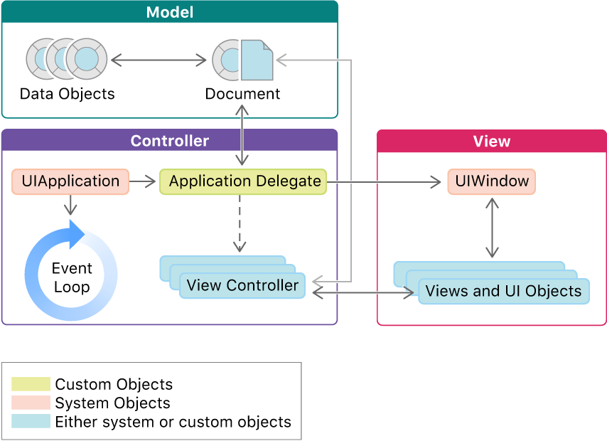
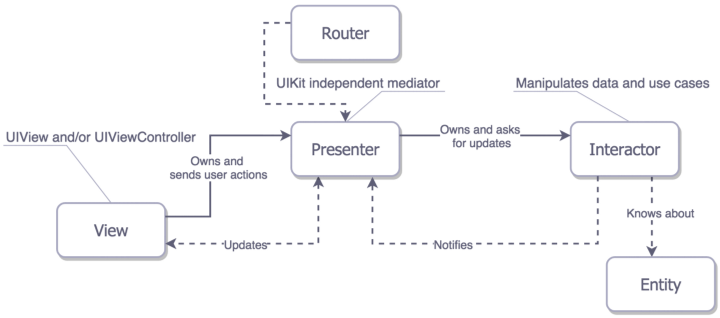
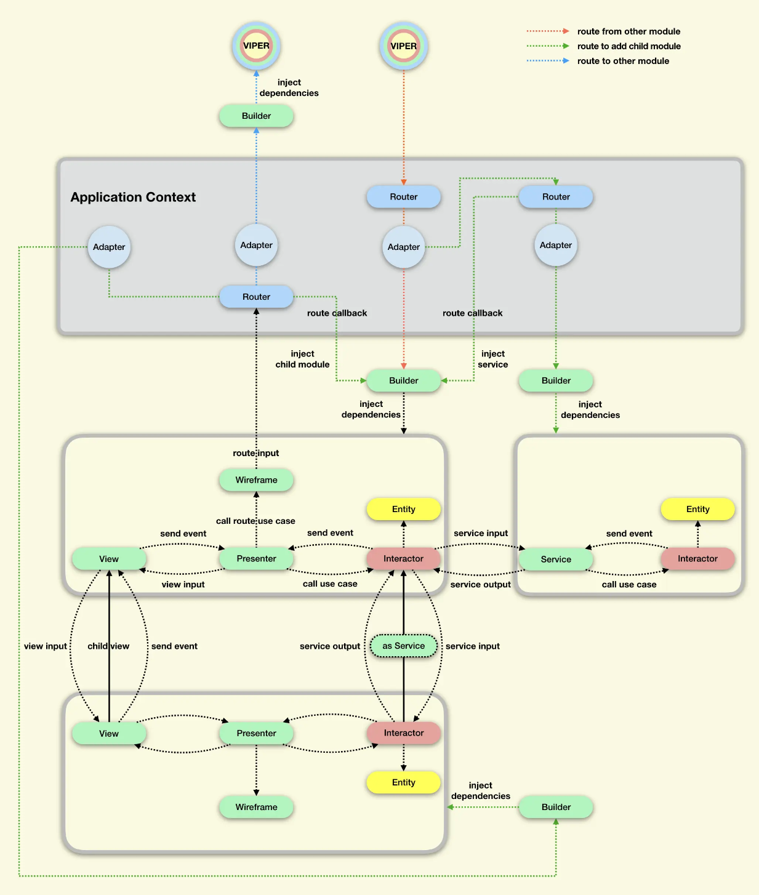

# 应用程序设计

熟悉 Singleton、Observer、Factory Method、Builder 和 State 等模式。

## 软件设计模式: 依赖注入

> [!cite]
> [Dependency Injection in Swift using latest Swift features - SwiftLee](https://www.avanderlee.com/swift/dependency-injection/)
> [Comparing Four different approaches towards Dependency Injection: Part II of Dependency Injection for Modern Swift Applications](https://lucasvandongen.dev/di_frameworks_compared.php)
> [GitHub - hmlongco/Factory: A new approach to Container-Based Dependency Injection for Swift and SwiftUI.](https://github.com/hmlongco/Factory)

依赖注入是一种通过特定的依赖关系使对象之间的交互尽可能精简的技术。通过依赖注入, 可以编写出松散耦合的代码，或者仅依赖于单独类的所需部分来运行的代码。

当你创建一个对象时，就可能会产生相应的依赖关系。比如，如果 ClassA 在使用时可能需要 ClassB 存在，那么 ClassA 就依赖于 ClassB。换句话说，ClassB 是 ClassA 的一个依赖项。

### 现代依赖注入要解决什么问题？

- 可测试性——更加方便的通过模拟数据进行测试
- 通用性——使用方式更接近于语言(如 Swift)的标准 API
- 可扩展性——当应用程序增长时，维护或添加功能方便
- 编译阶段安全——如果应用程序编译成功，则不会因为依赖问题崩溃.
- 版本迭代——安全地解锁依赖关系
- 细节封装——解耦在不暴露包内的私有/内部类型的情况下，应该能够定义标准依赖关系

通过注入对象的依赖关系，类或结构的职责和要求变得更加清晰和透明。比如通过将 User 注入到 UserViewModel 中，我们知道 UserViewModel 依赖于 User。

通过依赖注入，单元测试变得更加容易。依赖注入允许开发人员用模拟对象替换对象的依赖关系，这使得隔离行为和设置单元测试变得更容易、更简单。

依赖注入使我们能够以更清晰的方式理解我们的代码并分离我们的关注点。当我们使用依赖注入时，我们可以看到我们的对象负责管理和处理给定的依赖关系。

- 支持 graph 作用域，这意味着可以管理依赖项的生命周期，以及它们在依赖图中的创建和销毁。依赖项可以根据需要重新创建，如果没有任何引用指向这些依赖项，它们会自动销毁，从而有效管理内存和资源。
- 支持延迟初始化，即依赖项仅在需要时创建，而不是在应用启动时预先加载。这有助于避免启动时不必要的性能损耗。此外，允许设置“上下文”，其中可以包括预览、测试等默认实现的上下文，这对于测试和模拟场景非常有用。

###  对象依赖注入的方法：

1. 通过初始化器(也可以是方法调用或上下文对象传递)进行依赖注入

这种方式是基于树的依赖关系管理方法，通过在组件或类层次结构中以明确和直接的方式传递依赖项，依赖项从根部（通常是应用程序的启动或顶级组件）逐级向下传递到需要它们的叶节点。

```swift
protocol AuthenticationService {
    func authenticate(token: String, completion: @escaping (Bool) -> Void)
}

protocol UserManager {
    func performUserAction()
}

class SimpleAuthenticationService: AuthenticationService {
    func authenticate(token: String, completion: @escaping (Bool) -> Void) {
        // 模拟身份验证过程
        completion(token == "validToken")
    }
}

class SimpleUserManager: UserManager {
    let authService: AuthenticationService

    init(authService: AuthenticationService) {
        self.authService = authService
    }

    func performUserAction() {
        authService.authenticate(token: "validToken") { isAuthenticated in
            if isAuthenticated {
                print("Performing a user-specific action")
            } else {
                print("Authentication failed")
            }
        }
    }
}

class AppController {
    let userManager: UserManager

    init(userManager: UserManager) {
        self.userManager = userManager
    }

    func run() {
        userManager.performUserAction()
    }
}

// Setting up dependencies
let authService = SimpleAuthenticationService()
let userManager = SimpleUserManager(authService: authService)
let appController = AppController(userManager: userManager)

// Running the application
appController.run()

```


(优点)  **明确的依赖关系**. 通过构造器注入，确保了类的实例在创建时就已经拥有所有必要的依赖项,。

(缺点) **依赖传递的复杂性增加**. 在大型应用中，一个对象可能需要通过多层传递许多依赖。这不仅使构造函数变得复杂，还可能迫使一些中间类了解它们不直接使用的依赖，这违反了单一职责原则。

**例子**：如果有一个 `UserInterface` 需要一个 `NotificationService` ，而 `NotificationService` 又依赖于一个 `EmailService` ，那么在构造这个 `UserInterface` 时，你可能需要先创建一个 `EmailService` 实例，再用它来创建一个 `NotificationService` 实例，然后才能完成 `UserInterface` 的创建。这使得代码的依赖链变得复杂和难以管理。

(缺点) **代码重构困难**. 如果后期添加或修改依赖关系，可能需要修改涉及的每个类的构造器，这可能导致大规模的代码更改，特别是在依赖关系深入多个层级的情况下。

**例子**：假设 `NotificationService` 后来需要一个新的 `LoggingService` 。这意味着每个使用 `NotificationService` 的类都需要修改，以便在构造 `NotificationService` 时传递 `LoggingService` 。

(缺点) **依赖重建导致资源浪费**. 每次视图重新渲染时，依赖项都会被重新创建

2. 使用单例依赖管理服务进行依赖注入

```swift
class ServiceLocator {
    static let shared = ServiceLocator()
    private var services: [String: Any] = [:]

    private init() {}

    func addService<T>(service: T) {
        let key = String(describing: T.self)
        services[key] = service
    }

    func getService<T>() -> T {
        let key = String(describing: T.self)
        return services[key] as! T
    }
}


class SimpleUserManager: UserManager {
    var authService: AuthenticationService {
        return ServiceLocator.shared.getService()
    }

    func performUserAction() {
        authService.authenticate(token: "validToken") { isAuthenticated in
            if isAuthenticated {
                print("Performing a user-specific action")
            } else {
                print("Authentication failed")
            }
        }
    }
}

class AppController {
    var userManager: UserManager {
        return ServiceLocator.shared.getService()
    }

    func run() {
        userManager.performUserAction()
    }
}


// Setting up dependencies in Service Locator
let authService = SimpleAuthenticationService()
ServiceLocator.shared.addService(service: authService as AuthenticationService)
ServiceLocator.shared.addService(service: SimpleUserManager() as UserManager)

// Running the application
let appController = AppController()
appController.run()
```

(缺点)  **隐藏了对象依赖关系**. 
(缺点)  **无法在编译时确认依赖创建问题**. 

(优点) **解耦了组件和其依赖项的创建**. 不会随着层级增加使得依赖传递的复杂性增加, 后期添加或修改依赖关系时, 代码重构简单.

3. 使用基于静态方法的依赖管理服务进行依赖注入

```swift
class ServiceLocator {
    static var authService: AuthenticationService = SimpleAuthenticationService()
    static var userManager: UserManager = SimpleUserManager()
    static func getAuthService() -> AuthenticationService {
        return authService
    }
    static func getUserManager() -> UserManager {
        return userManager
    }
}

class SimpleUserManager: UserManager {
    var authService: AuthenticationService {
        return ServiceLocator.getAuthService()
    }

    func performUserAction() {
        authService.authenticate(token: "validToken") { isAuthenticated in
            if isAuthenticated {
                print("Performing a user-specific action")
            } else {
                print("Authentication failed")
            }
        }
    }
}

class AppController {
    var userManager: UserManager {
        return ServiceLocator.getUserManager()
    }

    func run() {
        userManager.performUserAction()
    }
}

let appController = AppController()
appController.run()

```

## 软件设计架构

#### MVC



- View「视图」负责界面的布局和渲染, 用户交互请求接收
- Controller「控制器」协调和管理模型和视图的内部交互关系，负责将 Model 的变化更新到 View 和处理来自 View 的事件
- Model「模型」负责应用程序的数据处理 + 业务逻辑. 

简单使用遇到的问题：
- 原生 UIViewController 和 UIView 耦合十分紧密，很难对 Controller 中与 View 无关的逻辑代码进行测试。
- 随着持续开发，UIViewController 容易变得十分臃肿
- UIViewController 负责界面跳转时，源界面和目的界面会产生过度耦合

#### MVP 

思想： 利用接口编程降低各层之间的耦合；同时将 ViewController 的职责分离到 Presenter 中，使其方便进行单元测试。

- View + ViewController「视图层」负责展示用户界面（UI）和接收用户的交互
	- ViewInterface「视图控制接口」负责定义 Presenter 与 View 进行数据交互和更新 UI 的规范。
	- View「视图」负责 UI 控件展示
	- ViewController「视图控制器」负责界面布局和组合，实现界面接口方法，并将事件转发给 Presenter。
 - Presenter「呈现层」协调和管理 Model 和 View 的交互
	- PresenterInterface「呈现器接口」负责定义 Presenter 的需要实现的业务逻辑规范。
	- PresenterImpl「呈现器」具体负责业务逻辑代码的具体实现，比如对 View 交互事件的处理逻辑，对 Model 的数据管理逻辑，View 的更新逻辑等。并持有 View 和 Model 的引用。
- Model「模型层」负责应用程序的数据处理 + 业务逻辑. 
	- ModelInterface「模型接口」负责定义 Presenter 如何与 Model 交互的规范。
	- ModelImpl「模型接口实现」执行数据处理和业务逻辑的具体实现。

#### MVVM

思想： 利用数据绑定实现 View 元素和 ViewModel 数据的自动同步；同时将 ViewController 的业务逻辑分离到 ViewModel 中，使得 UI 与业务逻辑解耦，进而便于进行单元测试和维护。


- View + ViewController「视图层」负责展示用户界面（UI）和接收用户的交互
	- View「视图」负责 UI 控件展示
	- ViewController「视图控制器」负责界面布局和组合。
	- 视图层通过数据绑定和事件绑定（或代理方式）与 ViewModel 进行交互事件传递(触摸, 滑动, 点击)和数据更新。
 - ViewModel「视图模型」协调和管理 Model 和 View 的交互
	- ViewModel 可以访问其他 ViewModel 和 Model。但是禁止访问视图层。
	- ViewModel 负责从私有 Model 获取数据，并将 Model 的数据转化为 View 可显示的格式。
	- ViewModel 负责处理来自 View 的输入, 并调用 Model 的对应业务逻辑或更新逻辑。
	- ViewModel 通过双向绑定，实现 View 信息的同步。主要实现方式有观察模式、通知、使用像 RxSwift 这样的框架等
- Model「模型层」负责应用程序的数据处理 + 业务逻辑. 
	- Model 可以访问其他 Model。但是禁止访问 ViewModel 或视图。
	- Model 负责与其他 Model 共同实现数据的定义和存储，并完成对网络、文件系统、数据库等原始数据源（Source）存储的请求。

#### reactive architecture

#### VIPER

用例: 应用程序通常作为一组用例来实现。
- 用例是负责业务逻辑的应用程序层，例如用户浏览商品目录的逻辑，从数据库中检索商品信息并呈现给用户。 
- 用例独立于用户界面实现：用例与应用程序的具体外观和交互方式无关。无论应用程序是一个网页、手机应用还是桌面程序，用户都应该能够通过同样的步骤来浏览商品目录。 
- 用例需要尽可能小且定义明确：用例的范围应该被明确定义，不应该包含太多复杂的功能，例如用户下单或者管理购物车，这些不应该属于浏览商品目录用例的范畴。 
 - 分解复杂应用程序为小的用例：将整个应用程序分解为多个小的用例，例如购物程序分为浏览商品、添加商品到购物车、下订单等，每个用例都可以独立开发和测试，最终组合起来形成完整的应用程序。






- ViperView「视图层」只负责展示用户界面（UI）和接收用户的交互。
	- 视图层的界面部分由 ViewController (+ View) 组成，负责 UI 控件展示和界面布局。
	- 视图层的交互事件和数据需求由外部注入的事件处理对象和数据源对象负责，具体行为通过视图预置的代理协议规定。
	- 为了方便界面跳转，视图层需要向外提供用于界面跳转的源界面，默认是视图自身。
 - ViperPresenter「控制器层」不包含如视图，数据，服务等的业务实现代码，只包含使用这些业务的逻辑代码。
	- ViperPresenter 必须持有视图层，交互层，路由层三者的对象，才能起到中心协调的角色，实现在逻辑代码中，调用和管理不同业务。实现如 View 交互事件的处理逻辑，向 Interactor 进行业务请求，数据管理和数据回调的逻辑，通知 View 更新的逻辑，通过 Router 视图跳转的逻辑等
	- ViperPresenter 负责 ViperView 的交互事件处理逻辑和视图数据需求逻辑两部分，因此在使用时一般需要实现这两者所规定的协议方法活属性。
- ViperInteractor「交互器」负责应用程序的数据处理 + 业务功能实现. 
	- 通过不同的 Manager 和 Service 组合实现业务代码，并封装各种业务用例供外部调用。
	- 维护、获取、更新业务相关的各种状态模型
	- 当有业务相关的事件发生时，处理事件，并通知 Presenter
- Entity「实体」和 Model 一样的数据模型
	- Interactor 持有 Entity，并且 Interactor 不能将 Entity 传递到 Presenter。
- Service「服务」向 Interactor 提供各种封装好的服务，例如数据库的访问、存储，调用定位功能等。
	- Service 由 Application 在执行路由时注入到 Builder 里，再由 Buidler 注入到 Interactor 里。
	- 也可以只注入一个 Service Router，在运行时再通过这个 Service Router 懒加载需要的 Service，相当于注入了一个提供 Router 功能的 Service。
- Router「路由」只负责页面之间的跳转实现，实现页面模块之间的解耦。
	- 整个项目设置一个总路由工厂类 TMRoute，然后根据业务划分大模块  Route。
	- 各个大模块统筹自己内部的小模块
	- 是由 Application 提供的具体路由技术，可以简单封装 UIKit 里的那些跳转方法，也可以用 URL Router 来执行路由。但是一个模块是不需要知道 app 使用的是什么具体技术的。Router 才是真正连接各个模块的地方。它也负责寻找对应的目的模块，并且通过 Buidler 进行依赖注入。
- Wireframe「路由执行」负责提供一系列具体的路由用例，这个用例里已经配置好了源界面和目的界面的一些依赖，包括转场动画、模块间传参等。
	- 通过调用 Router 来执行真正的路由操作。
	- Presenter 包含对用户输入做出反应的逻辑，因此 Presenter 知道何时导航到另一个屏幕以及导航到哪个屏幕。同时，线框知道如何导航。因此，Presenter 将使用 Wireframe 来执行导航。
- Adapter「接口转换器」
	- 负责在模块通信时进行一些接口的转换，例如两个模块使用了相同业务功能的某个 Service，使用的 protocol 实现一样，但是 protocol 名字不一样，就可以在路由时，在 Adapter 里进行一次转换。甚至只要定义的逻辑一样，依赖参数的名字和数据类型也可以允许不同。这样就能让模块不依赖于某个具体的 protocol，而是依赖于 protocol 实际定义的依赖和接口。
- Builder「初始化器」负责初始化整个模块，配置 VIPER 之间的关系，并对外声明模块需要的依赖，让外部执行注入。

#### 优化结构（基于 MVVM）

- View + ViewController「视图」负责展示用户界面（UI）和接收用户的交互
	- 视图层可以访问其他视图层和 ViewModel。但是禁止访问 Model
	- 视图层只进行视图布局、动画、初始化 UI 组件等功能
	- 视图层与 ViewModel 通过数据绑定和事件绑定进行交互接收和传递用户操作(触摸, 滑动, 点击)。在观察到 ViewModel 的变化后会自行更新。
 - State「状态模型」包含 ViewModel 中的应用业务逻辑和状态数据。
	 - ViewModel 应该定义一个或多个状态，以及处理事件并根据这些事件更新状态的逻辑。
	 - 每个状态的变化都可以触发视图的更新或其他副作用（如 API 调用）。
 - EffectHandler「行为模型」负责处理由 ViewModel 发起的行为请求，如数据处理，网络请求和数据库访问等操作。
 - ViewModel「视图模型」协调和管理 Model 和 View 的交互；承载状态管理，状态更新和行为处理等功能。
	- ViewModel 可以访问其他 ViewModel 和 Model。但是禁止访问视图层。
	- ViewModel 负责从私有 Model 获取数据，并将 Model 的数据转化为 View 可显示的格式。
	- ViewModel 负责处理来自 View 的输入, 并调用 Model 的对应业务逻辑或更新逻辑。
	- ViewModel 通过双向绑定，实现 View 信息的同步。主要实现方式有观察模式、通知、使用像 RxSwift 这样的框架等。
	- 商店接收来自视图的事件，处理这些事件以更新状态，并可能触发效果处理器执行副作用。
- Model「模型层」负责应用程序的数据处理 + 业务逻辑. 
	- Model 可以访问其他 Model。但是禁止访问 ViewModel 或视图。
	- Model 负责与其他 Model 共同实现数据的定义和存储，并完成对网络、文件系统、数据库等原始数据源（Source）存储的请求。

1. **Model**：定义应用的数据结构和业务逻辑。
2. **View && ViewController**：定义用户界面和展示逻辑，订阅商店中的状态变化以更新 UI。
3. **ViewModel**：现在充当事件源和效果处理器的角色，处理来自 View 的用户交互，将它们转换为事件发送给商店，并处理商店指示的副作用。
4. **State**：在 ViewModel 中定义，描述应用的当前状态和可能的状态变化。
5. **Store**：负责接收事件、使用 ViewModel 中的逻辑更新状态、执行副作用，并通知 View 更新。

#### TCA

- 状态快照：将同类状态属性封装为 struct ，减少可能因为多线程导致的状态属性冲突问题，同时方便记录和追溯状态；将与业务逻辑相关的状态继续封装为方法，易于维护和测试。

```swift
class ProcessListViewModel {
    private(set) var loading: Bool
    private(set) var processes: [Process]
    private(set) var error: Error
}

⬇
⬇

struct ProcessListViewState {
    let loading: Bool
    let processes: [ProcessViewState]?
    let error: Error?
    static func loading() -> ProcessListViewState {
        return ProcessListViewState(loading: true, processes: nil, error: nil)
    }
    
    static func loaded(with processes: [Process]) -> ProcessListViewState {
        return ProcessListViewState(loading: false, processes: processes, error: nil)
    }
    
    static func error(with error: Error) -> ProcessListViewState {
        return ProcessListViewState(loading: false, processes: nil, error: error)
    }
}

class ProcessListViewModel {
    private(set) var state: ProcessListViewState {
        didSet {
             print("New state: \(viewState)")
        }
    }
    ...
}
```

- 状态枚举：根据业务逻辑，封装独占状态为 enum 类型，减少判断语句；将与业务逻辑相关的枚举选项继续抽象和解构，并封装为方法，使其方便维护和测试，同时易于添加新选项，只更改局部定义即可。

```swift
enum State {
    case loading
    case loaded(Data)
}

class View {
    func render(state: State) {
        switch state {
        case .loading:
            loadingView.isHidden = false
            tableView.isHidden = true
        case .loaded(let data):
            loadingView.isHidden = true
            tableView.isHidden = false
            tableView.render(with: data)
        }
    }
}

⬇
⬇

enum State {
    case loading
    case loaded(Data)
	case error(Error) // extend
	
    var data: Data? {
        switch self {
        case .loading: return nil
        case .loaded(let data): return data
        case .error: return nil // extend
        }
    }
    var isLoading: Bool {
        switch self {
        case .loading: return true
        case .loaded: return false
        case .error: return false // extend
        }
    }
    var isError: Bool { // extend
        switch self {
        case .error: return true
        default: return false
        }
    }
}
class View {
    func render(state: State) {
        loadingView.isHidden = !state.isLoading
        tableView.isHidden = state.isLoading
        errorView.isHidden = !state.isError
        
        if let data = state.data {
            tableView.render(with: data)
        } else if state.isError {
            errorView.render(with: "An error occurred")
        }
    }
}
```

- 决策与动作分离：采用状态枚举来表示决策事件和决策结果，而不是直接输入和执行；将业务的事件决策逻辑进行抽象和封装，但是仅返回决策结果；将业务实际动作进行抽象和封装，实现根据决策结果执行相关动作。以此实现业务决策逻辑与实际执行的动作分离。

```swift
// 配置业务逻辑的状态处理
protocol State: Equatable {
    associatedtype Event
    associatedtype Effect
    mutating func handle(event: Event) -> Effect?
    static var initialState: Self { get }
}

enum ProcessState: State {
    case idle
    case loading
    case loaded([Process])
    case error(String)
    
    static var initialState: ProcessState {
        return .idle
    }
    
    enum Event: Equatable {
        case fetchProcesses
        case load(processes: [Process])
        case userDidLogOut
    }
    
    enum Effect: Equatable {
        case downloadProcesses
    }
    
    mutating func handle(event: Event) -> Effect? {
        switch (self, event) {
        case (.loading, .fetchProcesses):
            fatalError()
        case (_, .fetchProcesses):
            self = .loading
            return .downloadProcesses
        case (_, .load(let processes)):
            self = .loaded(processes)
        case (_, .userDidLogOut):
            self = .idle
        }
        return nil
    }
}


protocol EffectHandler: class {
    associatedtype S: State
    func handle(effect: S.Effect) -> Future<S.Event>?
}

class ProcessEffects: EffectHandler {
    private let service: ProcessService
    
    init(service: ProcessService) {
        self.service = service
    }
    
    func handle(effect: ProcessState.Effect) -> Future<ProcessState.Event>? {
        switch effect {
        case .downloadProcesses:
            return service.fetchProcesses()
                   .map { ProcessState.Event.load(processes: $0) }
        }
    }
}

```

```swift
protocol EventSource: class {
    associatedtype S: State
    func configureEventSource(dispatch: @escaping (S.Event) -> Void)
}

class ProcessEvents: EventSource {
    private let sessionStore: Store<SessionState>
    private var token: SubscriptionToken!
   
    init(sessionStore: Store<SessionState>) {
        self.sessionStore = sessionStore
    }
    func configureEventSource(dispatch: @escaping (ProcessState.Event) -> Void) {
        token = sessionStore.subscribe { state in
            guard !state.sessionValid else { return }
            dispatch(.userDidLogOut)
        }
    }
}

final class Store<S: State> {
    private let effectHandler: AnyEffectHandler<S>
    private let eventSource: AnyEventSource<S>
    init<EH: EffectHandler, 
         ES: EventSource>(effectHandler: EH, eventSource: ES) 
         where EH.S == S, ES.S == S {
        self.effectHandler = AnyEffectHandler.init(effectHandler)
        self.eventSource = AnyEventSource.init(eventSource)
        self.eventSource.configureEventSource { 
            [unowned self] in self.dispatch(event: $0)
        }
    }
    var state: S { … }
    func subscribe(_ block: @escaping (S) -> Void) -> SubscriptionToken { … }
    @discardableResult 
    func dispatch(event: S.Event) -> Future<S> {
        let effect = state.handle(event: event)
        let currentStateFuture = Future(value: self.state)
        let effectFuture = effect.flatMap { 
            effectHandler.handle(effect: $0) 
        }
        let nextEventFuture = effectFuture.flatMap { 
            self.dispatch(event: $0) 
        }
        return nextEventFuture.map { future in 
            currentStateFuture.flatMap { _ in future }
        } ?? currentStateFuture
    }
}

// Create the store with the effects handler and event source
let effects = ProcessEffects(service: …)
let events = ProcessEvents(sessionStore: …)
let store = Store<ProcessState>(effectHandler: effects, 
                                eventSource: events)
// start dispatching events to it
store.dispatch(.fetchProcesses)
```


> [!cite]
> [正确认识 MVC/MVP/MVVM - 掘金](https://juejin.cn/post/6901200799242649607#heading-1)
> [Different flavors of view models in Swift | Swift by Sundell](https://www.swiftbysundell.com/articles/different-flavors-of-view-models-in-swift/)
> [iOS Architecture: A State Container based approach | by Luis Recuenco | Job&Talent Engineering](https://jobandtalent.engineering/ios-architecture-an-state-container-based-approach-4f1a9b00b82e)
> [iOS VIPER架构实践(二)：VIPER详解与实现 - 掘金](https://juejin.cn/post/6844903491945627656)
> [VIPER-S: writing your own architecture to understand its importance (part 1) – Think And Build](https://www.thinkandbuild.it/viper-s-writing-your-own-architecture-to-understand-its-importance-part-1/)
> 

## 人机界面指南

> [!cite]
> [Human Interface Guidelines | Apple Developer Documentation](https://developer.apple.com/design/human-interface-guidelines/)
> [iOS Design Kit – Library of iOS app templates and UI elements](https://iosdesignkit.io/)
> [Great Simple Studio | Dribbble](https://dribbble.com/greatsimple)
> [Apple Design Resources - Apple Developer](https://developer.apple.com/design/resources/)
> [Figma (@apple) | Figma](https://www.figma.com/@apple)
> [Design at Meta](https://design.facebook.com/)
> [Max Rudberg - UI Designer](https://blog.maxrudberg.com/)
> [UI Design Dos and Don’ts - Apple Developer](https://developer.apple.com/design/tips/)
> [Ivo Mynttinen / User Interface Designer](https://ivomynttinen.com/)


设计理念

- 核心哲学：Deference, Clarity, Depth
- 以用户内容为中心，避免一切可能与内容竞争的视觉元素。
- 清晰和简洁的界面设计，提问每个元素的必要性。
- 利用动画、卡片设计、模糊背景等手法增加深度和内容丰富度。

最佳体验策略

- 保护隐私
- 保护数据（磁盘加密，Apple CryptoKit）
- 系统支持
- 国际化和本地化
- 测试和调试
- 优化性能
- 跨平台支持

设计技巧和方法

- 屏幕展示
    - 控制屏幕控件数量和控件交互次数，帮助用户专注于主要任务和内容；现代程序一般需要始终包含状态栏、导航栏、选项卡栏和主页指示器；新版设备的刘海可以为状态栏及额外内容提供空间。
    - 提供无缝适应外观变化支持（设备方向、深色模式和动态尺寸）；横向布局取消状态栏，竖向布局保留状态栏；横向布局考虑水平可以显示更多内容，竖向布局考虑垂直可以显示更多内容。
    - 通过添加状态栏、导航栏和选项卡栏来使导航变得更容易。
    - 安全区域参考（纵向）：状态栏区域 44 pt，导航栏高度 44 pt，安全边距 16 pt，选项卡栏高度 49 pt，主页指示器高度 34 pt
    - 安全区域参考（横向）：状态栏区域隐藏，导航栏高度 32 pt，安全边距 16 pt，选项卡栏高度 30 pt，主页指示器高度 23 pt
    - 使用圆角卡片作为更好地组织内容的方式；控件使用 8-16 的 margin（控件边界空白）
    - 正文最小大小 11 pt，主要正文大小 17-19（17） pt，次要正文大小 11-14（12） pt，屏幕标题大小 34+ pt，正文标题 20-30 pt（20）；iPhone 正文最大可以占据整个安全宽度，iPad 正文可以防止容器内，字符数量不超过 90 个
    - 图标符号意义清晰，必要时使用次要文本标注；图标颜色与主题和功能相匹配；导航栏和选项卡栏图标大小 30×30 pt；头像图标大小 30×30 pt 或 50×50 pt
    - 按钮需要易于点击，大小在 30-60 pt 之间，最佳宽或高为 44 pt, 极端可设置为 22 pt，按钮圆角半径 12 pt；其开关和滑块类型通常为 31 pt；其步进器类型通常为 29 pt
    - 屏幕分辨率（iphone）：4 S「320×480」，SE「320×568」，8「375×667」，8 Plus「414×736」，X「375×812」，XR「414×896」，XS「375×812」，XS Max「414×896」
    - 程序图标分辨率（iphone）：@2 x 和 @3 x；三种类型：App Store（60×60 pt），Spotlight（40×40 pt），Settings（29×29 pt）
    - 程序图标分辨率（ipad）：@1 x 和 @2 x；三种类型：App Store（83.5×83.5 pt），App Store（76×76 pt），Spotlight（40×40 pt），Settings（29×29 pt）

- 人体工程学考虑
- 设备输入
- 程序交互
    - 动画和交互设计
    - 适当使用动画可以增加界面的趣味性和吸引力，但不应过度使用以免分散用户注意力。
    - 动画应该用来指引用户如何使用应用，比如通过优雅的过渡和动画来引导用户完成引导流程。
    - 3 D Touch 和手势操作为“高级用户”提供了便捷的操作方式，设计时需要考虑到这些交互的直观性和易用性。
    - 以供握持设备方式的交互支持
- 系统交互

全面总结

iOS 设计的核心在于如何通过简洁、清晰和有深度的设计提升用户体验。随着技术的进步和用户需求的变化，iOS 设计不仅仅是视觉上的改变，还包括了如何更好地与用户交互和提供有价值的内容。通过有效的颜色使用、排版、动画和交互设计，设计师能够创造出既美观又实用的应用。此外，随着设备屏幕的变化，适应不同屏幕大小和分辨率也成为设计中不可或缺的一部分。通过学习 iOS 11 的设计理念和技巧，设计师可以将这些原则和技术应用到其他平台和领域，从而创造出更具吸引力和易用性的产品。
