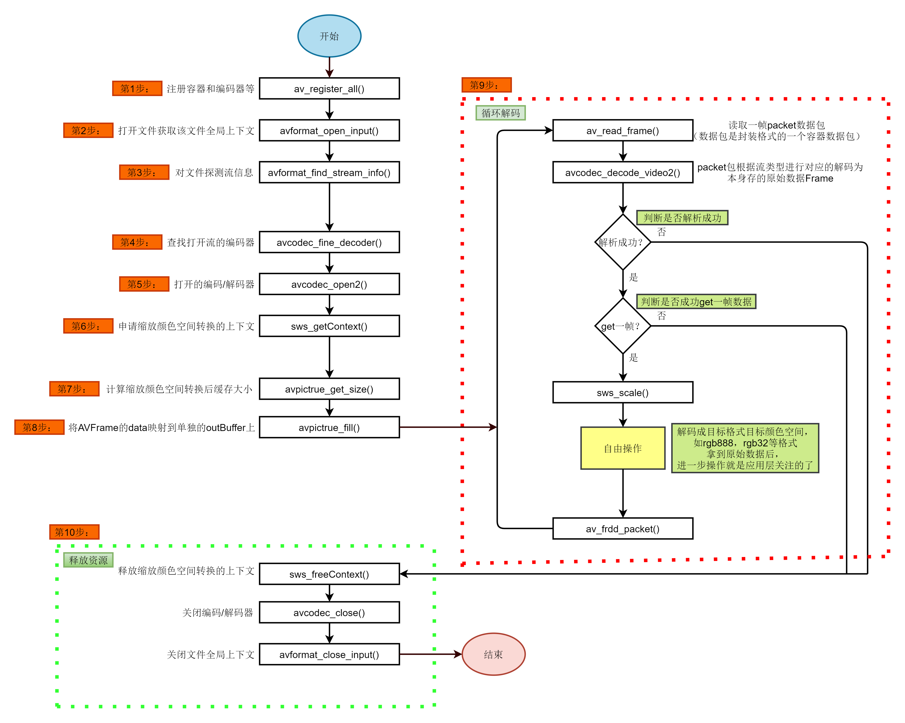

# 软件工程师

学习计划: 
1.计算机、通信、电子信息、通信工程、软件工程等相关专业;
2.熟悉C/C++/swift等语言, 有Android/linux/ios平台相关产品开发经验优先考虑;
3.熟悉数据结构和算法, 了解操作系统原理;

# 项目

## **深度学习训练框架**

### 框架设计概述

此框架实现了一个完整的训练和评估流程，接受训练项目配置文件来初始化训练环境，并控制训练的整体流程。支持多进程和分布式训练。支持多种类型的迭代过程。实现了多种数据预处理方法。通过一系列的 **`Hook`** 类型管理训练过程中的关键时间节点，如学习率调整、模型保存、日志记录和性能分析。

对于一般的训练任务来说，基本的训练步骤应该包括: 初始化训练环境→加载数据集→迭代[数据分批→数据预处理→模型计算→参数传播→学习率更新→结果评估-过程可视化]等过程.

### 训练流程管理

#### Runner 训练过程封装

这里通过 `Runner` 来封装整个训练过程, 并基于给定的参数配置文件实现自定义训练过程，配置多进程及分布式训练环境。

#### 自定义训练过程

#### 多进程及分布式训练环境配置

分布式训练，主要 `distributed` 选项设置和设置必要的环境变量

- ** `MASTER_ADDR` ** 用于指定主节点的地址。
- ** `MASTER_PORT` **用于指定主节点的端口。
- ** `init_process_group()` ** 方法用于初始化分布式环境，其中需要设置的参数有：backend， init_method，rank，world_size
    - ** `backend='nccl'` ** ，用于设置多机器间交换数据的协议，包含 MPI，Gloo，NCCL。详细介绍在下面。
    - `init_method='env://'` ，用于指定初始化进程组的方式，设置进程间如何进行通信。
        - ** `env://` ** 表示使用环境变量来初始化分布式环境。
            - ** `MASTER_PORT` **: 用于通信的主端口。
            - ** `MASTER_ADDR` **: 主节点（通常是 rank 0 的节点）的地址。
            - ** `WORLD_SIZE` **: 总的进程数，表示参与分布式训练的所有进程。
            - ** `RANK` **: 当前进程的标识符。
    - ** `init_method='file:///path/to/shared/file'` ** 表示基于一个在所有参与进程中可访问的共享文件系统进行初始化和进程通信。进程会创建或等待一个锁文件，以确保在给定时间只有一个进程可以写入共享文件。一旦获得了锁，它会写入其地址和其他必要信息供其他进程使用。
    - ** `init_method='tcp://10.1.1.20:23456'` ** 直接使用指定的 IP 地址和端口来初始化主节点。主节点会在给定的地址和端口上监听，其他进程会使用这个地址和端口来连接到主节点。
    - ** `init_method='shm://'` ** 表示通过共享内存来实现进程通信，条件是所有的训练进程都在同一台机器上。避免了网络延迟，允许更快的数据交换。
        `rank=rank`，用于标识主机和从机，主节点为 0, 剩余的为 1-(N-1), N 为要使用的机器的数量
        `world_size=world_size`，用于标识使用进程数（主机数*每台主机的GPU数/实际就是机器的个数？）

**多机器间交换数据的协议**

  - MPI  的核心是通过消息传递来实现的一种数据并行化方式，可以用在高性能并行计算环境中，让环境中的进程间在没有共享内存的情况下进行通信。比如实现进程的点对点通信和集体通信。
        **点对点通信**：MPI 允许两个进程之间直接发送和接收信息。例如，** `MPI_Send` ** 和 ** `MPI_Recv` ** 是基本的发送和接收函数。
        **集体通信**：MPI 支持所有进程之间的通信，如广播、集合和散布。这允许在所有进程之间共享信息或同步操作。
        - 工作原理
            1. **并行模型**:MPI 采用 SPMD (Single Program Multiple Data) 模型，这意味着所有的并行任务都运行相同的程序，但是它们处理的数据或执行的代码路径可能会不同。每个任务都有一个唯一的标识符，称为 rank，用于区分不同的任务。
            2. **启动**:使用 MPI 的程序通常从一个 `MPI_Init` 调用开始，它初始化 MPI 运行时环境。一旦初始化完成，程序的每个副本都可以开始并行执行。
            3. **点对点通信**:MPI 提供了一套点对点的通信原语，允许两个进程之间进行消息交换。
                - `MPI_Send` : 发送消息到另一个进程。
                - `MPI_Recv` : 从另一个进程接收消息。
                这些函数通常需要指定消息的来源或目的地、消息大小、消息类型、通信标签以及一个通信器，通常是 `MPI_COMM_WORLD` ，表示所有进程的集合。
            4. **集体通信**:除了点对点通信，MPI 还提供了集体通信原语，允许进程群体之间进行通信。
                - `MPI_Bcast` : 从一个进程广播消息到所有其他进程。
                - `MPI_Scatter` : 将一个数组分散到所有进程。
                - `MPI_Gather` : 从所有进程收集数据到一个进程。
                - `MPI_Reduce` : 从所有进程收集数据，并进行某种计算（例如求和或查找最大值），然后将结果返回给一个进程。
            5. **同步**:MPI 提供了同步原语来确保进程间的协调。
                - `MPI_Barrier` : 使所有进程在此同步点停止，直到所有进程都到达此点，然后所有进程才能继续执行。
            6. **派生数据类型**:MPI 允许用户定义派生的数据类型，这样就可以更容易地发送和接收复杂的数据结构。
            7. **拓扑结构**:MPI 可以定义进程的拓扑结构，例如网格或图形，以优化数据交换的性能。
            8. **结束**:在并行计算结束时，应调用 `MPI_Finalize` 。此调用确保所有进程完成其任务并正确终止。
    - Gloo 是专门为集体通信设计的库，支持 CPU 和 GPU。对于 GPU 间的通信，它不如 NCCL 高效。
        - 工作原理
            1. **基于传输的设计**:Gloo 设计为可插拔的传输后端。这意味着它可以使用不同的通信技术进行数据传输，例如 TCP、InfiniBand 或其他通信机制。用户可以根据其硬件和网络环境选择最适合的传输。
            2. **算法和传输的解耦**:Gloo 的设计中明确区分了集体操作的算法和传输的具体细节。这使得库可以为不同的通信模式和网络条件选择最优的算法，同时提供了对各种传输技术的支持。
            3. **集体操作的优化**:Gloo 的核心功能是为深度学习框架提供集体操作，如广播、归约和集合。它为这些操作提供了高效的实现，尤其是在大量数据需要在许多设备之间传输时。
            4. **同步和异步模式**:Gloo 支持同步和异步的集体操作。这意味着用户可以选择等待操作完成（同步模式）或继续执行其他任务，同时集体操作在后台执行（异步模式）。
            5. **CPU 和 GPU 支持**:尽管 Gloo 最初是为 CPU 集体操作设计的，但它也支持 GPU 间的通信，使得它能够更广泛地应用于深度学习和其他高性能计算任务。
            6. **可扩展性**:Gloo 的设计考虑了扩展性。这意味着它可以有效地扩展到大规模的集群，处理多节点、多设备的通信。
            7. **集成与深度学习框架**:Gloo 可以轻松地与深度学习框架（如 PyTorch）集成，为它们提供高效的集体通信操作。
            8. **简洁性**:相比 MPI 这样的全功能通信库，Gloo 更加简洁，专注于为深度学习工作负载提供集体通信功能。
    - NCCL 是 NVIDIA 开发的，专为 GPU 间的集体通信而设计的库。它提供了高性能的多 GPU 和多节点间的通信，为多种集体通信操作优化，如广播、归约和全连接。
        - 工作原理
            1. **高效的 GPU-to-GPU 通信**:NCCL 专门针对 NVIDIA GPU 进行优化，支持高吞吐量和低延迟的 GPU-to-GPU 数据传输。它采用了一系列技术，如使用 NVIDIA 的 NVLink、PCIe 和高速网络（例如 InfiniBand）来提供高效的数据交换。
            2. **简化的 API**:NCCL 提供了一个简洁的 API 来进行常见的集体通信操作，如广播、归约、全连接和其他。这些操作可以轻松地插入到现有的 GPU 代码中，而无需复杂的设置或初始化。
            3. **自动拓扑检测和优化**:NCCL 能够自动检测系统中的 GPU 布局和连接性，并针对这些拓扑进行优化，以最大化数据传输速度。这意味着，无论你的 GPU 如何连接（例如，使用 NVLink 或 PCIe），NCCL 都可以为你选择最佳的通信路径。
            4. **跨节点通信**:除了在单个节点的多个 GPU 之间通信外，NCCL 还支持跨多个节点的 GPU 通信。它与高速网络接口（例如 InfiniBand）集成，以提供分布式系统中的高效数据交换。
            5. **与 CUDA 的集成**:NCCL 与 NVIDIA 的 CUDA 生态系统紧密集成。这允许开发人员在 CUDA 代码中轻松地使用 NCCL，同时确保与其他 NVIDIA 工具和库的兼容性。
            6. **并行性和流水线化**:为了进一步加速集体操作，NCCL 实现了并行和流水线技术。这允许它在等待某些数据时启动其他传输，从而最大化总体通信吞吐量。
            7. **错误处理和恢复**:在分布式系统中，错误是不可避免的。NCCL 设计了一套机制来检测通信错误，并在可能的情况下尝试恢复，确保数据的完整性。

### 迭代过程抽象

因为不同的任务可能会用到不同的训练迭代过程，这里将这些迭代过程抽象为 `BaseLoop` 类型对象, 并通过 `run` 函数控制迭代过程. 目前实现的有基于 `Epoch` 的迭代过程, 基于 `Iter` 的迭代过程, 测试迭代过程和验证迭代过程.  `BaseLoop` 类型对象会在特定的迭代逻辑下, 加载和分批数据, 并利用这些数据调用模型的计算函数.

### 数据加载，处理与打包

迭代时的[数据分批→数据预处理]过程利用了 `Torch` 的 `DataLoader` 进行数据分批加载. 并通过重新封装 `dataset` 对象和 `sampler` 对象统一了数据加载方式, 并重写了 `collate_fn` 函数用于定义数据的分批方式.

`dataset` 通过 `load_info` 加载数据集信息,  获得模型输入数据信息列表和元信息列表。元信息列表包含了输入数据所共有的信息，如所有类别信息等.输入数据列表中的每个元素都是一个字典, 其中可能包含有以下信息：
    - `_img_path` ： 输入图片路径
    - `_audio_path` ：输入音频路径
    - `_video_path` ：输入视频路径
    - `_transcription` ： 输入转录文本
    - `label` ：分类标签
    - `label_id` ： 分类标签 onehot 
    - 索引值以及音视频时间长度，采样率等其他信息。

`dataset` 通过 `BaseTransform` 类型对象对加载的数据信息进行转化和增强。
    - 如可以通过 `LoadAudioFromFile` 将与 `_audio_path` 匹配的所有输入数据加载为语音, 加载后的数据存储在对应字典内, key 值为 `_audio_data`. 视频, 图像亦有类似方法.
    - 可以对加载后的数据进行特殊处理如语音重采样， 图像随即裁剪， 视频重采样等操作。这些操作都是默认对所有满足含有内置 prefix 的数据进行处理的， 除非你指定了要被处理的key。注意：其中一些操作会在已有数据的基础上产生新类型的数据，如果没有指定 override 则会在数据字典中构建新的key以存储数据， 并保留原有数据。key的构造也是以 `_type` 为规律。

最后需要通过与当前任务所匹配的输入打包方法 `Pack_*`， 为模型提供合法的输入数据。这里规定数据打包后必须为一个字典， 其中含有两个键：“inputs” 是一个字典，包含模型输入数据的键值对, 且其中的值数据必须是 Tensor 或 ndarray 类型数据；“data_samples”是一个字典， 包含当前样本的标签等元数据， 一般用于计算指标。不同任务可以自定义实现其对应的打包方法. 每个输入类型数据规定保存在一个列表中， 为多输入任务做准备。

最终打包后的完整数据格式应该为:
        
```
results = {
       inputs: {
           audio_data:Tensor(...),
           mfcc_data:Tensor(...),
                ...
       },
       data_samples: {
           index: 0,
           audio_path: "",
           "sample_rate": 16000,
           "num_classes": ["a", "b"],
                ...
       }
}                                                
```
        
`DataLoader` 会利用 `collate_fn` 函数从 `dataset` 中取样 Batch 数量的数据, 并将同类型数据合并到同一个 batch 大小的**列表**中, 这里没有将所有数据都堆叠到同一个 Tensor 结构中构成 batch 输入, 是因为便于后面使用 batch 级别的输入数据增强. 这里是通过重写 dataloader 的 `input_collate` 函数来实现的, 最终打包后的数据组的格式如下所示.
    
```
batch = {
       inputs: {
           audio_data:[Tensor(...), ...],
           mfcc_data:[Tensor(...), ...]
       },
       data_samples: [BaseDataElement{
           index: 0,
           audio_path: "",
           "sample_rate": 16000,
           "num_classes": ["a", "b"]
       }, ...]
}
```

### 模型计算与参数传播

4. 在迭代时的[模型计算]过程中, 会将处理好的 batch 数量的数据送入模型中。每个模型都应继承自 `BaseModel` 类, 从而可以继承已经写好的 `train_step` , `val_step` , `test_step` 函数. 其中每个 `BaseModel` 都会利用 `DataPreprocessor` 对 batch 内数据进行一次预处理, 对于不同的任务, 可以通过继承 `DataPreprocessor` 来实现 batch 级数据增强或自定义的训练前处理操作. 每个模型都应该去自己实现 `forward` 函数, 并完成 loss 和 predict 的前向计算逻辑. 可选的, 可以为了其他一些任务, 实现 tensor 模式的计算逻辑. 
    
    ```
    如果是 loss 模式, 则应该返回包含损失名称和损失值的字典;
    - 返回可以有多种损失值, 默认采用取和的方式最终汇总损失值. 或者可以重写 parse_losses 函数, 自定义损失值计算逻辑.
    - 示例: {"loss": lossFunc(output, target), ...}
    
    如果是 predict 模式, 则应该返回一个与输入样本数量对应的输出样本列表. 
    每个输出样本为继承自 BaseDataElement 的已有或自定义样本类型.
    - 示例: [DataSample, DataSample, ...]
    ```
    
5. 在迭代时的[参数传播]过程中, 参数的更新默认由 `OptimWrapper` 类型对象来管理.
6. 同时在迭代过程中, 利用  `HOOK` 机制管理了一些在制定时间节点可能要用到的操作. 比如训练时所需的学习率更新操作, 模型存储操作, 日志记录操作, 早停判断机制, 过程可视化操作等, 并将这些操作根据执行时间节点分为了 `before_run` , `after_load_checkpoint` , `before_train` , `before_train_epoch` , `before_train_iter` , `after_train_iter` , `after_train_epoch` , `before_save_checkpoint` ,  `after_train` , `after_run` , `before_val` , `before_val_epoch` , `before_val_iter` , `after_val_iter` ,  `after_val_epoch` , `after_val` , `before_test` , `before_test_epoch` , `before_test_iter` , `after_test_iter` ,  `after_test_epoch` , `after_test` 等调用接口. 所有继承自 `HOOK` 的自定义类都可以通过实现以上展示的调用接口函数，实现在指定时间节点所需要进行的操作。
    - `HOOK` 种类
        1. `IterTimerHook` 用于在`before_run` , `after_train_iter`, `after_val_iter``, `after_test_iteafter_val_epochafter_test_epochafter_run`, 记录迭代时间, 如加载数据的时间(`data_time`), 每个迭代的时间(`time`), 估计剩余时间（ `eta` ）
        2. `DistSamplerSeedHook` 用于 `before_train_epoch` , 即在每个 epoch 之前设置采样器的种子, 保证分布式训练中数据的一致性.
        3. `ParamSchedulerHook` 用于在训练过程中的 `after_train_iter`, `after_train_epoch`, 更新优化器中的一些超参数，例如学习率和动量。此外，还可以在验证周期结束后的, `after_val_epoch`  根据需要更新调度器的超参数.
        4. `SyncBuffersHook` 用于在每个训练周期结束时同步模型缓冲区的数据, 即 `model.buffers()` .
        5. `EmptyCacheHook` 用于控制在训练过程中的不同阶段释放未使用的 GPU 缓存内存.
        6. `CheckpointHook` 用于在训练迭代过程中的 `after_train_epoch`, `after_val_epochafter_trainafter_train_iter` 时间点保存模型的状态.
        7. `LoggerHook` 用于在训练、验证和测试过程中记录日志, 如时间点: `after_train_iter` , `after_val_iterafter_test_iterafter_val_epochafter_test_epochafter_run` .
        8. `NaiveVisualizationHook` 用于做什么?
        9. `EMAHook` 用于实现指数移动平均, 实现模型参数平滑, 提高模型的泛化能力和稳定性.
        10. `RuntimeInfoHook` 用于在训练过程中更新运行时信息到消息中心（message hub）, 如训练状态相关的信息(epoch、iter、最大的 epoch 和 iter 数量), 训练元信息(配置文件、随机种子、实验名称).
        11. `ProfilerHook` 用于在训练过程中分析性能指标, 如CPU/GPU时间, 内存分配/释放, FLOPS 等并将其可视化.
        12. `NPUProfilerHook` 用于做什么?
        13. `EarlyStoppingHook` 用于当监测到指定指标达到平稳状态时, 提前停止训练.
        14. 当模型经过训练后, 如果设置了评估任务, 则会通过配置选用评估处理模型. 所有评估处理模型均应该继承自 `BaseMetric` , 然后实现 `process` 和 `compute_metrics` 函数逻辑.

## **流媒体服务**

### 项目介绍

- 通过第三方库实现的命令行参数解析，日志管理，JSON 解析功能
- 通过**互斥锁**机制实现了线程安全的普通参数管理，进一步的使用**双检锁单例模式**实现全局参数管理。其中利用 **C++ 模板和特化** 实现了不同参数类型到String的转换，用于输出参数值。
- 通过 **socket** 和 **libevent** 实现 HTTP 服务, 对指定端口进行监听，并在发生 http 请求后，执行回调函数，实现对外的 api 接口，用于管理任务的添加，开始，暂停，删除功能。
- 通过基本的数据结构（**map, atomic\<bool\>， queue**），互斥锁和**条件变量**等技术实现了任务调度器，用于存储和管理任务。其中删除任务的操作是通过一个单独的线程执行的，并通过使用条件变量减少了线程轮询造成的系统资源浪费。

### 项目视频流处理封装

通过 FFmpeg 来处理任务中的音视频流，并定义了 PullStream 和 PushStream，分别用于拉取和推送音视频流。两者均实现了基础的连接、断开和重连流功能，并提供了一个 start 方法用于在单独的线程中处理流数据，维护了一个数据帧队列，用于存储读取的/待推送的音视频帧。
    
在解码过程中，需要将原始的 YUV 420 P 视频数据转换为 BGR 格式，将原始的 S 16 格式的音频数据转换为 PCM 格式。在编码过程中，则相反。
 

### 项目开发难点

    
针对项目中管理程序运行时的全局参数配置和任务参数配置的配置管理器和配置类设计。

1. 第一个问题是如何设计一个通用的配置管理器，能够存储不同类型的配置项，并提供统一的操作接口?
> 利用工厂模式的设计思想, 通过一个抽象基类创建了配置项的接口类, 并采用模板类的方法, 为不同的参数类型来构建不同的配置项, 用来存储参数信息, 最终使用一个配置管理类来构建和管理所有的配置项。在管理过程中, 使用了智能指针 std::shared_ptr 管理配置项的生命周期和 std::dynamic_pointer_cast 类型转换操作符来实现对修改已有配置参数时的类型匹配检查.
2. 考虑到配置参数的输出需求, 如何能够将不同类型的参数转换成字符串来输出展示?
> 通过函数模板的方法, 利用标准库的 to_string 函数解决此问题.
3. 如何保证能够在多线程环境下能安全地访问和修改配置管理器中的配置项.
> 在每个配置项中使用互斥锁来保证在多线程环境下安全地访问(用 shared_lock)和修改(用 unique_lock)配置项。
4. 对于全局参数配置对象, 如何保证程序运行时只有一个.
> 为全局配置对象采用了双检索风格的单例模式这种设计模式来创建和管理实例对象. 并使用内部静态类实现了全局参数配置对象的自动释放.

针对项目中包括启动任务、取消任务、获取任务状态等功能 API 接口的实现。

- 使用了 libevent 库, jsoncpp 等来实现对指定端口进行监听，解析和响应 HTTP 请求。
- 实现了 SMA_Server 项目中的一些 API 接口, 这些接口可以通过 HTTP 请求来触发.

针对项目中实现任务的添加、暂停、开始、删除、获取状态等功能的的任务调度器部分。

- 由于任务调度器需要支持多线程环境下的任务管理和调度，因此必须考虑线程安全问题。
> 借鉴了线程池的概念，通过构造任务池, 并使用条件变量和互斥锁来实现线程同步，保证了任务管理的多线程操作的安全性。互斥锁可以保证同一时间只有一个线程可以访问共享资源，条件变量可以用来等待某个条件的发生。
- 任务的添加、暂停、开始、删除等操作需要对任务池进行操作，因此需要考虑数据结构的选择和实现问题。
> 将正在运行的任务存储在一个 map 容器中，实现了任务的存储和管理. 并将需要删除的任务放入了队列中, 等待删除,避免了在任务池中直接删除任务的问题。未来的话，考虑支持设置任务的优先级，使用优先级队列来实现任务的排序和管理。
- 因为每个任务都会占用不少系统资源，因此需要考虑如何避免系统资源过载，资源释放等问题？
> 任务池和任务队列的容量限制问题，可能导致任务无法添加或者执行。利用 RAII（Resource Acquisition Is Initialization）技术来管理对象的生命周期，即在对象的构造函数中申请资源，在析构函数中释放资源，从而避免了资源泄漏的问题。

针对项目中的任务执行器 `TaskExecutor` 类和任务比较函数 `TaskComparator` 类。

- 如何处理流媒体数据，实现对流数据的读取和写入
- 学习音视频编码的原理，并参考 FFmpeg 官方文档学习 FFmpeg 库的使用，了解 libavcodec 和 libavformat 库的使用方法。最终通过构建线程池的方式管理推流和拉流子任务的执行。
- 如何在多线程环境下处理数据帧队列的线程安全性需要保证
> 需要使用互斥锁和条件变量进行同步。
- 对于流数据的读取和写入，需要考虑到网络传输的稳定性和错误处理。
- 对于网络传输的稳定性和错误处理，可以使用重连机制和错误处理机制进行处理。

### FFMpeg 介绍及其基本使用

    
FFmpeg 是一个开源的跨平台音视频处理框架，它提供了一组用于处理音视频的函数和工具。下面是使用FFmpeg进行音视频处理的一般调用过程，以及涉及的各种结构：

- 初始化AVFormatContext：AVFormatContext是FFmpeg中最重要的结构之一，它用于存储音视频封装格式的相关信息。在开始处理音视频之前，需要使用avformat_alloc_context()函数来分配一个AVFormatContext结构体，并使用avformat_open_input()函数打开音视频文件，将文件的信息读入到AVFormatContext中。
- 获取音视频流信息：调用 avformat_find_stream_info() 函数可以读取音视频文件中的流信息，并将其填充到AVFormatContext中。音视频流信息包括每个流的编解码器参数、时长、帧率等。
- 创建StreamContext：对于每个音视频流，可以创建一个StreamContext结构体来存储相关的信息。StreamContext通常包含一个AVCodecContext结构体，用于存储编解码器的上下文信息。
- 查找最佳的音视频流：使用av_find_best_stream()函数可以找到最佳的音视频流。该函数会根据流的类型和相关参数选择最适合的音视频流。
- 获取编解码器：通过AVStream结构体的codecpar字段可以获取音视频流的编解码器参数。然后使用avcodec_find_decoder()函数查找对应的解码器，并使用avcodec_alloc_context3()函数分配一个AVCodecContext结构体来存储解码器的上下文信息。
- 将编解码器参数设置到上下文：使用avcodec_parameters_to_context()函数将编解码器参数设置到AVCodecContext中。
- 打开解码器：调用avcodec_open2()函数打开解码器，初始化解码器的上下文。
- 解码音视频帧：使用av_packet_alloc()函数分配一个AVPacket结构体，用于存储从文件中读取的音视频数据。然后使用av_read_frame()函数从文件中读取音视频帧，并将其存储在AVPacket中。接下来，使用avcodec_send_packet()函数将AVPacket发送给解码器，再使用avcodec_receive_frame()函数从解码器中接收解码后的音视频帧。
- 渲染或处理音视频帧：获取解码后的音视频帧后，可以进行后续的渲染或处理操作。对于音频帧，可以使用音频库进行播放或保存；对于视频帧，可以使用图像库进行显示或保存。
- 释放资源：在处理完成后，需要释放分配的资源。可以使用av_frame_free()函数释放AVFrame结构体，使用av_packet_free()函数释放AVPacket结构体，使用avcodec_close()函数关闭解码器，最后使用avformat_close_input()函数关闭AVFormatContext，释放相关的资源。

### FFmpeg 常用命令:

1. 输入/输出选项：
    - `i <input>`：指定输入文件。 `-i input.mp 4`
    - `f <format>`：指定输出格式。 `-f mp 4`
    - `y`：覆盖输出文件而不询问确认。
    - `ss <position>`：从指定位置开始处理输入文件。 `-ss 00:00:10`
    - `t <duration>`：设置处理的持续时间。 `-t 00:01:30`
2. 视频选项：
    - `r <rate>`：设置帧率。 `-r 30`
    - `s <size>`：设置视频尺寸。 `-s 1280 x 720`
    - `c:v <codec>`：指定视频编解码器。 `-c:v libx 264`
    - `b:v <bitrate>`：设置视频比特率。 `-b:v 2 M`
    - `vf <filter>`：应用视频过滤器效果。 `-vf "scale=6 40:480”`
3. 音频选项：
    - `c:a <codec>`：指定音频编解码器。 `-c:a aac`
    - `b:a <bitrate>`：设置音频比特率。 `-b:a 128 k`
    - `ar <rate>`：设置音频采样率。 `-ar 44100`
    - `ac <channels>`：设置音频通道数。 `-ac 2`
4. 格式选项：
    - `movflags <flags>`：设置 MOV 文件格式选项。 `movflags +faststart`
    - `vcodec <codec>`：指定视频编码器。 `-vcodec libx 264`
    - `acodec <codec>`：指定音频编码器。 `-acodec copy`
    - `f <format>`：指定输出格式。 `-f matroska`

### **FFmpeg 解码相关变量和函数介绍**

- **AVFormatContext** AVFormatContext 描述了一个媒体文件或媒体流的构成和基本信息，位于 avformat.h 文件中。
- **AVInputFormat** AVInputFormat 是类似 COM 接口的数据结构，表示输入文件容器格式，着重于功能函数，一种文件容器格式对应一个 AVInputFormat 结构，在程序运行时有多个实例，位于 avoformat.h 文件中。
- **AVDictionary**AVDictionary 是一个字典[集合](https://so.csdn.net/so/search?q=%E9%9B%86%E5%90%88&spm=1001.2101.3001.7020)，键值对，用于配置相关信息。
- **AVCodecContext** AVCodecContext 是一个描述编解码器上下文的数据结构，包含了众多编解码器需要的参数信息，位于 avcodec.h 文件中。
- **AVPacket** AVPacket 是 FFmpeg 中很重要的一个数据结构，它保存了解复用（demuxer)之后，解码（decode）之前的数据（仍然是压缩后的数据）和关于这些数据的一些附加的信息，如显示时间戳（pts），解码时间戳（dts）,数据时长（duration），所在流媒体的索引（stream_index）等等。使用前，使用 av_packet_alloc()分配，
- **AVCodec**AVCodec 是存储编解码器信息的结构体，位于 avcodec.h 文件中。
- **AVFrame** AVFrame 中存储的是经过解码后的原始数据。在解码中，AVFrame 是解码器的输出；在编码中，AVFrame 是编码器的输入。使用前，使用 av_frame_alloc()进行分配。     
- **struct SwsContext** 使用前，使用 sws_getContext()进行获取，主要用于视频图像的转换。
- **av_register_all** `void av_register_all(void);` 初始化 libavformat 并注册所有 muxer、demuxer 和协议。如果不调用此函数，则可以选择想要指定注册支持的哪种格式，通过 av_register_input_format()、av_register_output_format()。
- **avformat_open_input**  `int avformat_open_input(AVFormatContext **ps, const char *url, AVInputFormat *fmt,  AVDictionary **options);` 打开输入流并读取标头。编解码器未打开。流必须使用 avformat_close_input()关闭，返回 `0` 成功，`-1` 失败错误码。
    - **参数一**：指向用户提供的 AVFormatContext（由 avformat_alloc_context 分配）的指针。
    - **参数二**：要打开的流的 url
    - **参数三**：fmt 如果非空，则此参数强制使用特定的输入格式。否则将自动检测格式。
    - **参数四**：包含 AVFormatContext 和 demuxer 私有选项的字典。返回时，此参数将被销毁并替换为包含找不到的选项。都有效则返回为空。
- **avformat_find_stream_info** int avformat_find_stream_info(AVFormatContext *ic, AVDictionary **options); 读取检查媒体文件的数据包以获取具体的流信息，如媒体存入的编码格式。
    - **参数一**：媒体文件上下文。
    - **参数二**：字典，一些配置选项。
- **avcodec_find_decoder** `AVCodec *avcodec_find_decoder(enum AVCodecID id);` 查找具有匹配编解码器 ID 的已注册解码器，解码时，已经获取到了，注册的解码器可以通过枚举查看，枚举太多，略。
- **avcodec_open 2** `int avcodec_open 2(AVCodecContext *avctx, const AVCodec *codec, AVDictionary **options);` 初始化 AVCodeContext 以使用给定的 AVCodec。
- **sws_getContext** `struct SwsContext *sws_getContext(int srcW, int srcH, enum AVPixelFormat srcFormat,int dstW,int dstH, enum AVPixelFormat dstFormat,int flags, SwsFilter *srcFilter,SwsFilter *dstFilter,const double *param);` 分配并返回一个 SwsContext。需要它来执行 sws_scale()进行缩放/转换操作。
- **avpicture_get_size**`int avpicture_get_size(enum AVPixelFormat pix_fmt, int width, int height);`返回存储具有给定参数的图像的缓存区域大小。
    - **参数一**：图像的像素格式
    - **参数二**：图像的像素宽度
    - **参数三**：图像的像素高度
- **avpicture_fill**`int avpicture_fill(AVPicture *picture,const uint 8_t *ptr,enum AVPixelFormat pix_fmt,int width,int height);`根据指定的图像、提供的数组设置数据指针和线条大小参数。
    - **参数一**：输入 AVFrame 指针，强制转换为 AVPciture 即可。
    - **参数二**：映射到的缓存区，开发者自己申请的存放图像数据的缓存区。
    - **参数三**：图像数据的编码格式。
    - **参数四**：图像像素宽度。
    - **参数五**：图像像素高度。
- **av_read_frame**`int av_read_frame(AVFormatContext *s, AVPacket *pkt);` 返回流的下一帧。此函数返回存储在文件中的内容，不对有效的帧进行验证。获取存储在文件中的帧中，并为每个调用返回一个。不会的省略有效帧之间的无效数据，以便给解码器最大可用于解码的信息。返回 0 是成功，小于 0 则是错误，大于 0 则是文件末尾，所以大于等于 0 是返回成功。
- **avcodec_decode_video 2**
            `int avcodec_decode_video 2(AVCodecContext *avctx,AVFrame *picture,int *got_picture_ptr,const AVPacket *avpkt);`将大小为 avpkt->size from avpkt->data 的视频帧解码为图片。一些解码器可以支持单个 avpkg 包中的多个帧，解码器将只解码第一帧。出错时返回负值，否则返回字节数，如果没有帧可以解压缩，则为 0。
    - **参数一**：编解码器上下文。
    - **参数二**：将解码视频帧存储在 AVFrame 中。 
    - **参数三**：输入缓冲区的 AVPacket。
    - **参数四**：如果没有帧可以解压，那么得到的图片是 0，否则，它是非零的。  
- **sws_scale**
            `int sws_scale(struct SwsContext *c,const uint 8_t *const srcSlice[],const int srcStride[],int srcSliceY,int srcSliceH,uint 8_t *const dst[],const int dstStride[]);`在 srcSlice 中缩放图像切片并将结果缩放在 dst 中切片图像。切片是连续的序列图像中的行。
    - **参数一**：以前用创建的缩放上下文*sws_getContext()。
    - **参数二**：包含指向源片段，就是 AVFrame 的 data。
    - **参数三**：包含每个平面的跨步的数组，其实就是 AVFrame 的 linesize。
    - **参数四**：切片在源图像中的位置，从开始计数 0 对应切片第一行的图像，所以直接填 0 即可。
    - **参数五**：源切片的像素高度。
    - **参数六**：目标数据地址映像，是目标 AVFrame 的 data。
    - **参数七**：目标每个平面的跨步的数组，就是 linesize。
- **av_free_packet**`void av_free_packet(AVPacket *pkt);`释放一个包。
- **avcodec_close**`int avcodec_close(AVCodecContext *avctx);`关闭给定的 avcodeContext 并释放与之关联的所有数据（但不是 AVCodecContext 本身）。
- **avformat_close_input**`void avformat_close_input(AVFormatContext **s);`关闭打开的输入 AVFormatContext。释放它和它的所有内容并将*s 设置为空。

### FFmpeg 基本开发流程:



- 使用 avformat_alloc_context()函数来初始化一个 AVFormatContext 结构体, 用于存储音视频封装格式的相关信息.
- 使用 avformat_open_input() 函数打开音视频文件，将文件的信息读入到 AVFormatContext 中。
- 使用 avformat_find_stream_info() 函数获取音视频流信息。音视频流信息包括每个流的编解码器参数、时长、帧率等。
- 使用 avcodec_find_decoder() 获取音视频编解码器, 并使用 avcodec_alloc_context 3() 函数分配一个 AVCodecContext 结构体来存储解码器的上下文信息。
- 使用 avcodec_open 2() 函数打开解码器，初始化解码器的上下文。
- 使用 av_packet_alloc() 和 av_read_frame() 函数从文件中读取音视频帧，并将其存储在 AVPacket 中。接下来，使用 avcodec_send_packet() 函数将 AVPacket 发送给解码器，再使用 avcodec_receive_frame() 函数从解码器中接收解码后的音视频帧。
- 渲染或处理音视频帧：获取解码后的音视频帧后，可以进行后续的渲染或处理操作。对于音频帧，可以使用音频库进行播放或保存；对于视频帧，可以使用图像库进行显示或保存。
- 释放资源：在处理完成后，需要释放分配的资源。可以使用 av_frame_free()函数释放 AVFrame 结构体，使用 av_packet_free() 函数释放 AVPacket 结构体，使用 avcodec_close()函数关闭解码器，最后使用 avformat_close_input()函数关闭 AVFormatContext，释放相关的资源。

### **音视频基本概念(转码, 转封装,码率,码流,分辨率,帧率,GOP（关键帧间隔）,扫描模式,IDR 帧对齐,编码级别,比特率,码率控制方法,编码格式,采样率,码率,声道数,声道,UTC 时间):**

- **转码**
    视频转码（Video Transcoding）是指将已经压缩编码的视频码流转换成另一个视频码流，以适应不同的网络带宽、不同的终端处理能力和不同的用户需求。转码本质上是一个先解码、再编码的过程，因此转换前后的码流可能遵循相同的视频编码标准，也可能不遵循相同的视频编码标准。
- **转封装**
    转封装指的是将视频或音频的封装格式进行转换，如将 AVI 的视频转换为 MP 4，其间并不会进行音视频的编码和解码工作，而是直接将视频和音频压缩码流从一种封装格式文件中获取出来然后打包成另一种封装格式的文件。
    相比转码，转封装有两大特点：处理速度极快。音视频编解码过程十分复杂，占据了转码的绝大部分时间。转封装不需要进行编码和解码，节约了大量的处理时间。
    音视频质量无损。没有解码（解压缩）和编码（压缩）过程，所以不会有音视频的压缩损伤。
    转封装后的文件与原始文件的分辨率、码率等几乎一致，故播放时也称其为“原画”。
- **码率、码流**
    码率（Bitrate）是指视频文件在单位时间内使用的数据流量，也叫码流或码流率，是视频编码中画面质量控制最重要的部分。量度单位为“比特每秒”（bit/s 或 bps），常使用 Kbps（每秒多少千个比特）或 Mbps。一般来说同样分辨率下，视频文件的码率越大，压缩比就越小，画面质量就越高。码率越大，说明单位时间内取样率越大，数据流精度就越高，处理出来的文件就越接近原始文件，图像质量越好，画质越清晰，要求播放设备的解码能力也越高。
    当然，码率越大，文件体积也越大，其计算公式是文件体积=时间×码率/8。例如，网络上常见的一部 60 分钟的码率为 1 Mbps 的 720 P 的视频文件，其体积就大概为 3600 秒×1 Mbps/8=450 MB。
- **分辨率**
    分辨率（Resolution）用来描述视频对细节的分辨能力，通常表示为每一个方向上的像素数量，比如 1280 x 720 等。分辨率决定了视频画面细节的精细程度。通常情况下，视频的分辨率越高，所包含的像素就越多，画面就越清晰。
    分辨率是决定码率的主要因素，不同的分辨率要采用不同的码率。总体而言，视频的分辨率越高，所要求的码率也越大，但并不总是如此，不同分辨率都有合理的码率选择范围。所谓“合理的范围”指的是，如果低于这个范围，视频画面质量会很差；如果高于这个范围，画面提升有限甚至几乎无提升，且浪费网络流量和存储空间。
- **帧率**
    帧率（Frame Rate）是单位时间内视频显示帧数的量度单位，也就是每秒钟刷新的图片的帧数，量度单位为“每秒显示帧数”（Frame Per Second，FPS）或“赫兹”。
    高的帧率可以得到更流畅、更逼真的画面效果。一般来说 25~30 fps 就可接受，提升至 60 fps 则可以明显提升交互感和逼真感，但一般来说超过 75 fps 就不容易察觉到有明显的流畅度提升了。如果帧率超过屏幕刷新率只会浪费图形处理的能力，因为显示设备不能以这么快的速度更新，这样超过刷新率的帧率就浪费掉了。在分辨率不变的情况下，帧率越高，则对显卡的处理能力要求越高。
- **GOP（关键帧间隔）**
    GOP（Group of Pictures）是一组以 MPEG 编码的影片或视讯串流内部的连续图像，以 I 帧开头，到下一个 I 帧结束。一个 GOP 包含如下图像类型：
    - I 帧（Intra Coded Picture）：又称帧内编码帧，为关键帧，是一种自带全部信息的独立帧，无需参考其他图像便可独立进行解码，可以简单理解为一张静态画面。视频序列中的第一个帧始终都是 I 帧，每个 GOP 由 I 帧开始。
    - P 帧（Predictive Coded Picture）：又称帧间预测编码帧，需要参考前面的 I 帧才能进行编码。表示的是当前帧画面与前一帧（前一帧可能是 I 帧也可能是 P 帧）的差别。解码时需要用之前缓存的画面叠加上本帧定义的差别，生成最终画面。与 I 帧相比，P 帧通常占用更少的数据位，但不足是，由于 P 帧对前面的 P 和 I 参考帧有着复杂的依赖性，因此对传输错误非常敏感。
    - B 帧（Bidirectionally Predictive Coded Pictures）：又称双向预测编码帧，也就是 B 帧记录的是本帧与前后帧的差别。也就是说要解码 B 帧，不仅要取得之前的缓存画面，还要解码之后的画面，通过前后画面的与本帧数据的叠加取得最终的画面。B 帧压缩率高，但是对解码性能要求较高。
    
    GOP 值表示关键帧的间隔（即两个关键帧之间的帧数），也就是两个 IDR 帧之间的距离，一个帧组的最大帧数。一般而言，每一秒视频至少需要使用 1 个关键帧。增加关键帧个数可改善视频质量，但会同时增加带宽和网络负载。GOP 值（帧数）除以帧率即为时间间隔，如阿里云视频点播默认的 GOP 值为 250 帧，帧率为 25 fps，则时间间隔为 10 秒。
    
    GOP 值需要控制在合理范围，以平衡视频质量、文件大小（网络带宽）和 seek 效果（拖动、快进的响应速度）等：
    加大 GOP 值有利于减小视频文件大小，但也不宜设置过大，太大则会导致 GOP 后部帧的画面失真，影响视频质量。
    
    GOP 值也是影响视频 seek 响应速度的关键因素，seek 时播放器需要定位到离指定位置最近的前一个关键帧，如果 GOP 太大意味着距离指定位置可能越远（需要解码的预测帧就越多）、seek 响应的时间（缓冲时间）也越长。
    
    由于 P、B 帧的复杂度大于 I 帧，GOP 值过大，过多的 P、B 帧会影响编码效率，使编码效率降低。
    
    但如果设置过小的 GOP 值，则需要提高视频的输出码率，以确保画面质量不会降低，故会增加网络带宽。
    
- **扫描模式**
    逐行扫描（progressive）：在电子显示屏上通过扫描显示图像时，每一帧图像通过一场扫描来完成，由电子束顺序地一行接着一行连续扫描而成，一场扫描即能构成完整的画面。
    隔行扫描（interlaced）：在电子显示屏上通过扫描显示图像时，每一帧图像通过两场扫描来完成，通常第一场先只扫描奇数行，然后第二场只扫描偶数行，两场组合起来构成完整的画面。
- **IDR 帧对齐**
    IDR 帧（Instantaneous Decoding Refresh Picture），即时解码刷新帧，是 I 帧的一种。与普通 I 帧的区别在于，一个 IDR 帧之后的所有帧都不能引用该 IDR 帧之前的帧的内容；相反，对于普通的 I 帧，其后的 P 帧和 B 帧可以引用该普通 I 帧之前的其他 I 帧。在编码和解码中为了方便，将首个 I 帧和其他 I 帧区别开，称为 IDR，这样就方便控制编码和解码流程。
    
    IDR 帧的作用是立刻刷新，使错误不致传播，从 IDR 帧开始，重新算一个新的序列开始编码。而普通 I 帧不具有随机访问的能力，这个功能是由 IDR 承担。视频播放时，播放器一般都支持随机 seek（拖动）到指定位置，而播放器直接选择到指定位置附近的 IDR 帧进行播放最为便捷，因为可以明确知道该 IDR 帧之后的所有帧都不会引用其之前的其他 I 帧，从而避免较为复杂的反向解析。
    
    在对同一个视频进行多码率转码时，如果指定 IDR 帧对齐（IDR Frame Alignment），则意味着所有输出视频的 IDR 帧在时间点、帧内容方面都保持精确同步，此时播放器便可实现多码率视频平滑切换，从而不会出现较为明显的切换卡顿。
    
- **编码级别**
    编码档次（Profile）是针对特定应用场景的特定编码功能的集合。H.264 规定了三种主要级别：
    
    Baseline：支持 I/P 帧，只支持无交错（Progressive）和 CAVLC，一般用于低阶或需要额外容错的应用，比如视频通话、手机视频等即时通信领域；
    
    Main：提供 I/P/B 帧，支持无交错（Progressive）和交错（Interlaced），同样提供对于 CAVLC 和 CABAC 的支持，用于主流消费类电子产品规格如低解码（相对而言）的 MP 4、便携的视频播放器、PSP 和 iPod 等；
    
    High：在 Main 的基础上增加了 8x8 内部预测、自定义量化、无损视频编码和更多的 YUV 格式（如 4:4:4），用于广播及视频碟片存储（蓝光影片），高清电视的应用。
    
- **比特率**
    比特率（Bit rate）是指每秒传送的比特（bit）数，单位为 bps(Bit Per Second)，比特率越高，传送的数据越大。在视频领域，**比特率等同于码率**。比特率表示经过编码（压缩）后的音、视频数据每秒钟需要用多少个比特来表示，而比特就是二进制里面最小的单位，要么是 0，要么是 1。与码率类似，比特率与音、视频压缩的关系，简单的说就是比特率越高，音、视频的质量就越好，但编码后的文件就越大；如果比特率越低则文件越小。
    
- **码率控制方法**
    码率控制是指视频编码中决定输出码率的过程，常用的码率控制方法有：
    
    VBR（Variable Bitrate）：动态比特率，也就是没有固定的比特率，音视频压缩软件在压缩时根据音视频数据的复杂程度即时确定使用什么比特率，这是以质量为前提兼顾文件大小的方式。
    
    CBR（Constant Bitrate）：固定比特率，指文件从头到尾都是一种位速率。相对于 VBR 和 ABR 来讲，它压缩出来的文件体积很大，而且视频质量相对于 VBR 和 ABR 不会有明显的提高。
    
    ABR（Average Bitrate）：平均比特率，是 VBR 的一种插值参数。LAME 针对 CBR 不佳的文件体积比和 VBR 生成文件大小不定的特点创造了这种编码模式。ABR 在指定的文件大小内，以每 50 帧（30 帧约 1 秒）为一段，低频和不敏感频率使用相对低的流量，高频和大动态表现时使用高流量，可以做为 VBR 和 CBR 的一种折衷选择。
    
    ABR 在一定的时间范围内达到设定的码率，但是局部码率峰值可以超过设定的码率，平均码率恒定。ABR 是 VBR 的改良版，能确保输出平均码率在合理范围，且在这个范围内，还是动态根据复杂度编码，也是阿里云默认的编码控制方式。
    
- **编码格式**
    定义参考视频编码方式。主要包括无损编码和有损编码两种。根据采样定理，音频编码只能“无限接近”自然信号，故而所有的音频编码方式实质上都是有损的。在计算机领域中，通常约定能够达到最高保真水平的 PCM 编码为无损编码。互联网中常见的音频编码均为有损编码，常见的编码格式有 MP 3、AAC 等。
    
- **采样率**
    采样率（Sample Rate），也称为采样速度或者采样频率，定义了每秒从连续信号中提取并组成离散信号的采样个数，单位为赫兹（HZ）。采样率是指将模拟信号转换成数字信号时的采样频率，也就是单位时间内采样多少点，采样频率越高声音的还原就越真实越自然。
    
- **码率**
    参考视频编码的“码率”介绍。
    
- **声道,声道数**
    声道（Sound Channel）是指声音在录制（或播放）时，在不同空间位置采集（或播放）的相互独立的音频信号。所谓声道数，也就是声音录制时的音源数量或播放时的扬声器数量。
    
- **UTC 时间**
    UTC 时间指的是协调世界时，又称世界统一时间、世界标准时间、国际协调时间。由于英文（CUT）和法文（TUC）的缩写不同，作为妥协，简称 UTC。协调世界时是以原子时秒长为基础，在时刻上尽量接近于世界时的一种时间计量系统。中国内地采用 ISO 8601-1988 的《数据元和交换格式信息交换日期和时间表示法》（GB/T 7408-1994）称之为国际协调时间。
    
    如无特别指定，阿里云视频点播默认返回的时间字段或接口请求的时间参数都为UTC时间，时间格式按照ISO8601标准表示，格式为：YYYY-MM-DDThh:mm:ssZ。例如：2017-01-11T 12:00:00Z 表示北京时间 2017 年 1 月 11 日 20 点 0 分 0 秒。注：北京时间与 UTC 的时差为+8，也就是 UTC+8。
                

### **编解码格式(H.264, H.265 (HEVC), VP 9, AV 1, MPEG-2, PCMA)**

            
视频压缩的基本原理就是去除图像的冗余信息。同一张图像内会有很多冗余的区域，视频的图像序列之间也有很多冗余的区域，视频的帧率越大，冗余度会越大。比如一个演讲视频，演讲人的背景一直保持不变，只有演讲人的位置会发生变化，演讲人的面部表情和亮度会发生变化。


1. **[H.264 (AVC)](https://zhuanlan.zhihu.com/p/456929686)**：
    - 特点：高压缩率、高质量编码、广泛使用、良好的兼容性。
    - H.264 使用**面向块的编码**。换句话说，它将每个视频帧分解为所谓的宏块（最大 16×16 像素）。然后，它使用来自当前帧和先前帧的数据来形成运动预测，进而实现更有效的编码过程。在解码过程中，这些预测用于重构每个宏块。然后可以通过 HTML 5 视频播放器播放视频。
    - **H.264 的建议比特率为 480 p 视频 1800 kbps、720 p 视频 3500 kbps 和 1080 p 视频 8500 kbps**。
    - 
    
    **输入:** 对于 H.264/AVC 来说，输入信号是用 yuv 420 p 像素格式表示的图像，每个 luma 和 chroma 分量是用 8 bit 二进制数表示。
    
    **编解码过程:** 
    
    - 输入视频信号经过预测(Prediction)得到像素数据的残差值(residual))。预测分**帧内预测(消除空域数据冗余)**和**帧间预测(消除时域数据冗余)**。
    - 对预测生成的残差值进行变换和量化。变换主要是把信号从时域变换到频域，生成一个变换系数(transform coffient)。量化是对变换后的样本缩小其值得范围，用更少的 bit 来表示样本值。量化器(quantizer) 有标量(scalar)和矢量(vector)之分。将时域上的相关性转换为频域上的无关数据并进行量化
    - 对量化后的样本数据，运动矢量，参数信息进行编码得到 NALU，进行网络传输。
    - 解码器收到 NALU 后做相对编码器相反的工作，最后就可以重建图像。
2. **H.265 (HEVC)**：
    - 特点：更先进的补偿技术, 更告的压缩率、更好的视频质量、更低的带宽占用、但相对较新，需要更多的计算资源。
    - 与 AVC 不同，HEVC 在编码和解码过程中不使用宏块。相反，它使用**编码树单元 (CTU)**，它们的大小或形状不一定相同。CTU 可以小至 4×4 像素，大至 64×64 像素，这使得程序可以更有效地压缩数据。除了不同大小的块外，HEVC 还拥有**更高效的运动补偿和预测技术**，使其成为非常动态视频的特别好选择。
    - **H.265 更适合视频流，因为它具有更高的压缩率，而不会明显降低视频质量**。然而，H.264 为大多数日常使用提供了足够的质量，并且仍被视为行业标准。
    - **H.265 更适合视频编辑，因为它具有更有效的数据压缩**。换句话说，您可以更显着地减少导入和导出的文件大小。
    - **H.265 的推荐比特率为 480 p 视频为 2500 kbps，720 p 视频为 5000 kbps，1080 p 视频为 8000 kbps**。
3. **VP 9**：
    - 特点：开源、高效的编解码器，常用于 WebM 视频格式，支持 Web 视频。
4. **AV 1**：
    - 特点：开源、高压缩率、高质量，适用于流媒体和在线视频。
5. **MPEG-2**：
    - 特点：常用于 DVD、数字电视广播等，较老但仍广泛使用。
6. **PCMA:**
    - PCM 能够达到CD音质，但是它们消耗的带宽也最多(64kbps)。如果网络带宽比较低，可以选用低比特速率的编码方法，如G.723或 G.729，这两种编码的方法也能达到传统长途电话的音质，但是需要很少的带宽（G 723 需要 5.3/6.3 kbps，G 729 需要 8 kbps）。如果带宽足够并且需要更好的语音质量，就使用 PCMU 和 PCMA，甚至可以使用宽带的编码方法 G 722(64 kbps)，这可以提供有高保真度的音质。

### 文件封装格式(MP 4, AVI, MKV, PCM, TS)

1. **MP4**：经典的视频封装格式。但 MP 4 的视频文件头太大，结构复杂；如果视频较长（如数小时），则其文件头会过大，影响视频加载速度，故更适合短视频场景。
    - MP 4 由一个个的 box（以前叫 atom）组成，所有的 Metadata（媒体描述元数据），包括定义媒体的排列和时间信息的数据都包含在这样的一些结构 box 中。Metadata 对媒体数据（比如视频帧）引用说明，而媒体数据在这些引用文件中的排列关系全部在第一个主文件中的 metadata 描述，这样就会导致视频时长越大文件头就会越大、加载越慢。
2. **AVI**：
    - 特点：较老的格式，支持多种编解码器，但不适合 Web 上的流媒体。
3. **MKV**：
    - 特点：开源、支持多种编解码器和多个音轨、字幕，适用于高清视频。
4. **PCM:**
    - 
5. **TS:**
    - 

### 流媒体协议(RTMP, RTSP, HLS, MPEG-DASH, WebRTC, Smooth Streaming)

1. **[RTMP](https://www.jianshu.com/p/37bb51e66a32)**：
    - 特点：用于实时流媒体传输，常用于直播和视频会议。
2. **[RTSP:](https://zhuanlan.zhihu.com/p/478736595)**
    - TCP/IP 协议体系中的应用层协议, 用于实时流的传输协议, 该协议定义了一对多应用程序如何有效地通过 IP 网络**传送多媒体数据的规范,** 负责服务器与客户端之间的构建请求与响应. RTSP 在体系结构上位于 RTP 和 RTCP 体系结构之上实现的, 两者定义了传递音频和视频的标准数据包格式, 然后通过 TCP 或 UDP 完成数据传输. RTSP 被用于建立的控制媒体流的传输，它为多媒体服务扮演“网络远程控制”的角色。尽管有时可以把 RTSP 控制信息和媒体数据流交织在一起传送，但一般情况 RTSP 本身并不用于转送媒体流数据。媒体数据的传送可通过 RTP/RTCP 等协议来完成。
3. **[HLS](https://zhuanlan.zhihu.com/p/355136397) (HTTP Live Streaming)**：
    - 特点：苹果开发的流媒体协议，广泛用于 iOS 和 Web。
4. **MPEG-DASH**：
    - 特点：基于 HTTP 的自适应流媒体协议，支持多种编解码器和分辨率。
5. **WebRTC**：
    - 特点：用于实时通信的开源协议，支持音视频传输和互动。
6. **Smooth Streaming**：
    - 特点：微软开发的流媒体协议，用于 Azure Media Services 等。

## **语音实习项目**

### 项目简介

在课外，我很幸运的参加一项为期两个月的苏州政企合作项目, 在昆山友达光电公司的智能智造部门实习了一段时间, 主要负责完成对自动化机器人的语音远程控制项目的预研。在这个过程中, 我需要训练深度学习模型, 并将模型部署到边缘计算设备JasonNX上, 通过利用静音检测, 唤醒词检测, 语音活动检测以及模型识别来监测说话人的语音指令. 并在实习结束后, 我又学习和利用 pyqt 和 qml 独自为其设计了一个语音交互界面, 实现了说话人语音的实时转录功能，并利用目前很火的 GPT 大模型进行交互.

### 技术实现

**静音检测**:
- **实现**: 通过分析音频信号的能量或振幅来进行静音检测。当信号的能量或振幅低于某个预设阈值时，认为它是静音。
- **原理**: 在语音通信中，声音的能量通常高于背景噪音。通过设置合适的阈值，可以较准确地区分声音和静音。
- **困难**: 确定阈值是一个挑战，因为不同的环境和设备背景噪音水平会有所不同。过低的阈值可能会将柔和的语音识别为静音，而过高的阈值可能会错过真实的静音段。
- 不对称加权平均动态调整能量阈值技术，动态调整噪声阈值
    1. 通过将当前的音频能量（**`energy`**）与一个动态能量比率（**`self.dynamic_energy_ratio`**）相乘而得到新的目标能量阈值**`target_energy`** 。
    2. 然后根据音频数据的时间间隔（**`seconds_per_buffer`**）和一个预定义的衰减阻尼系数（**`self.dynamic_energy_adjustment_damping`**）来动态计算新旧能量阈值的比例系数 **`damping`，**用于控制能量阈值的调整速度，以平滑阈值的变化。确保阈值的调整速度与音频数据的采样率和时间间隔相适应。
    3. **`self.energy_threshold`** 是当前的能量阈值，它将根据上一次的阈值和新的目标能量值来动态调整。
    4. 随着时间的推移，**`self.energy_threshold`** 将根据新的 **`target_energy`** 和衰减系数进行更新。这种不对称加权平均使得新的阈值受到旧阈值的影响，但更多地受到新目标能量的影响。这有助于平滑阈值的变化，使其能够适应不同的噪声水平和环境条件。

**唤醒词检测 (Snowboy)**:
- **实现**: Snowboy是一个开源的唤醒词引擎。它使用预先训练的深度学习模型来识别特定的唤醒词或短语。
- **原理**: Snowboy使用神经网络模型进行特征提取并识别唤醒词。用户可以提供自己的唤醒词样本来进行训练，以提高识别精度。
- **困难**: 唤醒词的检测需要在实时环境中快速且准确地工作，这可能需要对模型进行优化。背景噪音和不同的发音方式都可能影响唤醒词的检测效果。

**语音活动检测 (VAD)**:
- **实现**: VAD通常使用基于能量、频率、和统计特性的方法来检测是否有语音活动。
- **原理**: 当检测到连续的声音能量超过某个阈值，且持续时间超过一定时间段时，认为有语音活动。
- **困难**: 与静音检测相似，确定适当的阈值和持续时间是VAD的主要挑战。此外，需要确保VAD可以在各种背景噪音下正常工作。

**模型识别**:
- **实现**: 一旦检测到语音活动，音频数据被传递给一个深度学习模型进行识别。该模型可能是基于RNN, CNN或Transformer等结构的。
- **原理**: 深度学习模型被训练为将音频特征映射到预定义的指令集。
- **困难**: 模型的训练需要大量的标记数据。不同的说话人、口音、语言和发音速度都可能影响模型的性能。在实际应用中，模型还需要具有良好的鲁棒性和实时性。

### 遇到的问题与解决方案：

初步的测试显示，当环境噪声水平较高时，模型识别的效果会明显下降。这是一个棘手的问题，因为在噪声较大的环境中，许多语音识别系统的性能都会受到影响。

首先，我考虑是不是数据预处理或语音活动检测的问题。通过记录和播放项目中的音频数据，我确认了语音活动检测工作正常，问题似乎主要出在模型的识别上。

我决定对模型进行更深入的改进。首先，我确定模型是用足够多的样本和多种环境下的音频进行训练的。接着，我调整了其敏感度参数，试图找到一个既不会导致太多误检也不会错过太多有效唤醒的平衡点。

最终，我发现问题的根源在于训练数据上。原来的训练数据大部分是在安静环境下收集的，为了解决这个问题，我利用一些**工具自行合成**了在各种噪声环境下的音频样本，重新训练了模型。确实提高了其在噪声环境中的性能。

然后，我又添加了一个后处理步骤，通过缓存语音数据，将识别的语音通过数据增强，再次送入模型中进行二次确认，确保其真的是有效的识别结果而不是误检。

### 项目测试

验证系统的每一个组件（静音检测、唤醒词检测、语音活动检测、模型识别）是否能够准确且实时地工作。

- 单元测试: 针对每一个功能组件进行独立测试。
- 集成测试: 验证多个组件在一起工作时的表现。

**2.1 静音检测**:
- **正常用例**: 提供真实环境下的静音段，验证系统能否准确检测。
- **异常用例**: 提供低能量的语音信号，验证系统不会误判为静音。
**2.2 唤醒词检测 (Snowboy)**:
- **正常用例**: 提供包含唤醒词的语音段，验证系统能否准确触发。
- **异常用例**: 提供不包含唤醒词的语音段，确保系统不会误触发。

**2.3 语音活动检测 (VAD)**:
- **正常用例**: 提供真实的语音活动段，验证系统的识别准确性。
- **异常用例**: 提供在噪声中的语音，验证系统的鲁棒性。

**2.4 模型识别**:
- **正常用例**: 提供预定义的语音指令，验证模型的识别准确性。
- **异常用例**: 提供非预定义的语音指令或不清晰的语音，验证模型的鲁棒性和错误处理机制。

**2.5 总体集成测试**:
- 提供一个连续的语音流，其中包含静音段、唤醒词、语音活动和多个指令，验证整个系统的工作流程和性能。

### 用到的一些自动化工具：

- Praat 语音学软件：主要功能是用来分析语音数据特性，对自然语言的语音信号进行采集、分析和标注，并执行包括变换和滤波等在内的多种处理任务。
> 在项目的早期阶段，使用 Praat 来分析训练数据，以获取关于语音的频率、强度和其他特性的信息。这些信息可以帮助更好地理解数据，并可能对模型的设计和训练提供指导。
> 在项目的测试阶段，可以通过 Praat 自动生成含有标记的语音段，从而验证 VAD 的准确性，唤醒词检测，静音检测的准确性。
    
- Audacity 音频编辑工具：用来录制、编辑和生成音频文件。
> 在测试阶段，因为测试用例有限，使用 Audacity 可以模拟各种环境下的语音输入，例如在嘈杂的背景下或者说话速度不同的情况下。这样，您可以验证系统在不同情况下的性能。
    
- [Pytest 单元测试框架](https://www.w3cschool.cn/pytest/pytest-e9dm3m8x.html):
> 验证处理后的数据是否在适当的范围内，或者是否正确地从原始音频转化为特定格式或特征。
> 为深度学习模型的输入和输出编写测试，确保模型能够处理各种数据情况，如不同长度、格式的音频数据，并返回预期的结果。
> 对于语音控制系统中的其他功能，例如静音检测、唤醒词检测等，也可以编写单元测试，确保它们在各种场景下都能正常工作。
    
**具体实现：**
    pytest 将在当前目录及其子目录中运行 `test_*.py` 或 `_test.py` 形式的所有文件。并执行文件内部的`test_` 为前缀的函数， 以及 `Test` 为前缀的类中的以`test_` 为前缀的函数。
    
- Jenkins 自动化工具：主要用来实现持续化集成测试，将 Pytest 编写的测试在每次构建后进行自动运行。并在每当有新版本的代码更改时，自动触发构建过程，编译代码并准备用于测试或部署的工件。
> Jenkins 通过 Jenkins Pipeline 将持续交付的实现和实施集成。Jenkins Pipeline 的定义通常被写入到一个文本文件（称为 `Jenkinsfile` ）中，该文件可以被放入项目的源代码控制库中。
    

    
- 细节介绍
    
    **agent{}**用于制定构建所用的节点，定义好流水线在某节点的运行。
    
    - 在pipeline{}中必须定义agent{}，作为所有stage{}的默认代理。
    - 在单个stage{}中可选定义agent{}只作用于该阶段。
    
    **parameters{}**用于构建参数
    
    **environment{}**用于**定义环境变量**，它们会保存为Groovy变量和Shell环境变量。在最前面定义的环境变量的生命周期是全局的；在stage里定义的环境变量是局部的。
    
    **stages{}** 流水线的主要内容，其中可以定义一个或多个 stage{} ，表示执行的各个阶段，Jenkins 会按先后顺序执行各个 stage{} ，并显示执行进度。
    
    - stages{} // 嵌套
    - steps{} // 具体执行什么
    - when{} // 满足条件时才会执行
    - environment{} // 局部的环境变量
    - input{} // 暂停某个阶段的执行，等待用户输入参数
    - script{} // 执行脚本
    
    **post{}** 用于当构建状态满足某些条件时，才执行的操作。pipeline出现语法错误时，Jenkins会直接报错，而不会执行post部分。
    
    - 可用范围：pipeline{}、stage{}
    - 可用条件：success, failure, unstable, aborted, unsuccessful, always, cleanup, changed
    
```json
pipeline {
    agent any  // 运行在任何可用的代理上

        parameters {
                booleanParam(name: 'A', defaultValue: true, description: '')//布尔参数
                choice(name: 'E', choices: ['A', 'B', 'C'], description: '')//单选下拉框
                string(name: 'B', defaultValue: 'Hello', description: '')//字符串参数
                text(name: 'C', defaultValue: 'Hello\nWorld', description: '')//文本参数
                password(name: 'D', defaultValue: '123456', description: '')//密文
                file(name: 'f1', description: '')//上传文件
            }

        environment { 
              CC = 'clang'
        }

    stages {
        stage('Checkout') {
            steps {
                // 克隆您的 Git 仓库
                git 'https://github.com/your_username/your_python_project.git'
            }
        }

        stage('Setup') {

                    when {
                                expression {
                                    params.BUILD_FLAG == 'YES'
                                }
                         }
            steps {
                // 安装项目依赖
                sh 'pip install -r requirements.txt'
            }
        }

        stage('Test') {
            steps {
                // 运行 Pytest 或其他测试工具
                sh 'pytest'
            }
        }

        stage('Deploy') {
            steps {
                // 示例部署步骤，这里只是简单复制文件到另一个目录
                sh 'cp -r * /path/to/deployment/directory/'
            }
        }
    }

    post {
        // 当构建完成后，无论成功还是失败，都可以执行以下步骤：
        always {
            echo 'This will always run'
                        junit '**/target/*.xml'
        }
        success {
            echo 'Job succeeded!'
        }
        failure {
            echo 'Job failed!'
                        mail to: team@example.com, subject: 'The Pipeline failed :('
        }
    }
}
```

## **IOS 实习经历**

### 第一阶段：基础学习

主要就是看像 Swift，UIKIT，SnapKit 的官方文档

### 第二阶段：基本需求。

完成 mentor 根据目前学习进度提出的一些基本需求。总共做了两个，一个是业务需求，完成看视频得读书时长的弹窗提示页。还有一个是让我根据公司内部数据接口，模仿完成 app 的福利页和书城页展示。

- 主要包括通过基础视图组件实现一些气泡组件，时间线组件，多标签视图组件，卡片视图。
    
    气泡组件用于奖励显示，由圆角信息显示区和三角气泡尾部组成。三角尾部通过重写视图的 **`draw(_:)`** 方法，使用 **`UIGraphicsGetCurrentContext()`** 及其选点 `move` , 画线 `addLine` 和填色 `setFillColor` 在视图上下文进行绘制完成的。
    
    时间线组件用于奖励任务完成情况展示，由横向或纵向排布的节点和连线组成。在视图的 **`draw(_:)`** 方法根据指定的节点类型和时间线方向绘制。内部节点是一个圆形小区域，通过在视图的矩形区域内使用 `UIBezierPath` 绘制的。
    
    多标签视图组件用于书城页展示，由基于 `UICollectionView` 的标签栏和内容视图两个区域组成。标签栏用于显示所有的分类标签，并跟踪当前选中标签的变化。内容视图用于显示与每个标签相关的内容，并跟随多标签视图组件的数据源的更改而刷新内容。
    
    卡片视图用于内部的轮播书籍展示，基于 `UICollectionView` 实现。通过在获取 cell 的时候，给每个 cell 配置了一个动画变形效果，根据单元格的位置，计算单元格的转动角度和缩放比例，创造一种滚动时的3d视差效果。透视变换 CATransform3DIdentity.m34 = -1.0/1000， 旋转变换 CATransform3DRotate(transform, angle, 0, 1, 0)，缩放变换 CATransform3DScale(CATransform3DIdentity, scaleFromX, scaleFromX, 1)。同时，在 cell 滚动的时候，通过实时更新每个 cell 的变形效果。
    

### 第三阶段：自学阶段（代码阅读，软件架构）

主要包括，对得间小说整体项目代码的阅读，期间查看了从程序入口 UIApplicationMain 开始到程序完成启动之间的代码逻辑。几个项目中的日志模块，有用于 debug 的，有用于数据埋点的。还有一个听书器全局弹窗的实现，没看完。

进一步学习了项目架构设计，从 MVC→MVP→MVVM→VIPER. 并实现了一个纯 swift 实现的 demo

- MVC
    - View「视图」负责界面的布局和渲染, 用户交互请求接收
    - Controller「控制器」协调和管理模型和视图的内部交互关系，负责将 Model 的变化更新到 View 和处理来自 View 的事件
    - Model「模型」负责应用程序的数据处理 + 业务逻辑.
    
    简单使用遇到的问题：
    
    - 原生 UIViewController 和 UIView 耦合十分紧密，很难对 Controller 中与 View 无关的逻辑代码进行测试。
    - 随着持续开发，UIViewController 容易变得十分臃肿
    - UIViewController 负责界面跳转时，源界面和目的界面会产生过度耦合
- MVVM
    
    思想： 利用数据绑定实现 View 元素和 ViewModel 数据的自动同步；同时将 ViewController 的业务逻辑分离到 ViewModel 中，使得 UI 与业务逻辑解耦，进而便于进行单元测试和维护。
    
    - View + ViewController「视图层」负责展示用户界面（UI）和接收用户的交互
        - View「视图」负责 UI 控件展示
        - ViewController「视图控制器」负责界面布局和组合。
        - 视图层通过数据绑定和事件绑定（或代理方式）与 ViewModel 进行交互事件传递(触摸, 滑动, 点击)和数据更新。
    - ViewModel「视图模型」协调和管理 Model 和 View 的交互
        - ViewModel 可以访问其他 ViewModel 和 Model。但是禁止访问视图层。
        - ViewModel 负责从私有 Model 获取数据，并将 Model 的数据转化为 View 可显示的格式。
        - ViewModel 负责处理来自 View 的输入, 并调用 Model 的对应业务逻辑或更新逻辑。
        - ViewModel 通过双向绑定，实现 View 信息的同步。主要实现方式有观察模式、通知、使用像 RxSwift 这样的框架等
    - Model「模型层」负责应用程序的数据处理 + 业务逻辑.
        - Model 可以访问其他 Model。但是禁止访问 ViewModel 或视图。
        - Model 负责与其他 Model 共同实现数据的定义和存储，并完成对网络、文件系统、数据库等原始数据源（Source）存储的请求。
    - 
- ViperView
    1. View (视图层): 只负责展示用户界面（UI）和接收用户的交互。
        - 视图层的交互事件和数据需求由外部注入的事件处理对象和数据源对象负责。具体行为可以进一步通过视图预置的事件处理协议和数据源接口协议规定。
        - 为了方便界面跳转，视图层需要向外提供用于界面跳转的源界面，默认是视图自身。
        
        优点: 明确分离了用户界面和业务逻辑，使得用户界面的修改不会影响到业务逻辑的实现，便于维护和测试。
        
    2. Presenter (呈现器或控制器层): 只包含使用如视图，数据，服务等这些业务的逻辑代码。
        - 持有视图层，交互层，导航层三者的对象，起到中心协调的角色，实现在逻辑代码中，调用和管理不同业务。
        - 实现如 View 交互事件处理和数据更新的逻辑；实现向交互层进行业务请求，数据管理和数据回调的数据需求逻辑；实现通过导航层进行页面跳转的逻辑等。
        
        优点: 将业务逻辑和用户界面，业务具体实现代码等分离，便于单元测试和复用。
        
    3. Interactor (交互器层)作用: 包含具体的业务代码实现，如数据获取和存储
        - 业务所需各种服务由协议和依赖注入来提供，减弱模块耦合。并封装各种业务用例供外部调用。
        - 当有业务相关的事件发生时，处理事件，并通知 Presenter（具体实现待定）。
        
        优点: 独立的业务逻辑层使得代码更加模块化，易于理解和维护。
        
    4. Wireframe (导航控制): 负责实现当前组件所需的界面导航逻辑，并提供所需视图的创建逻辑的协议。
        - 但是具体的导航实现，由依赖注入的 Router 路由实现，路由需要满足Wireframe 规定的协议需求。没有注入， 则不进行导航。
        
        优点: 分离了导航逻辑，使得界面跳转更加灵活，同时不依赖于具体的视图实现。
        
    5. Builder (构建器层): 用于封装模块的创建逻辑，组装 VIPER 架构中的各个组件，确保它们正确连接。同时通过提供依赖注入方法，以提供各个组件所需的服务和配置。
    优点: 提供一个统一的方法来创建和初始化组件。
    6. Router (路由器层): 管理整个应用的组件创建代码，和界面跳转代码。
        - AppRouter 采用单例模式，确保应用中只有一个路由器实例，来统一管理和调度视图。
        - 使用了**`Factory`依赖注入库**来创建和配置依赖组件，支持组件单例化。
        - 为了支持应用所有依赖的组件的功能，需要实现每个组件的导航协议
        
        优点: 集中处理所有的导航逻辑，降低了各模块间的耦合，提高了代码的复用性和可测试性。
        

## **高性能 C++ 服务器**

- 日志模块
    - 日志等级
        
        
    - 日志输出信息格式
        
        
    - 记录日志方式
        
        流式日志记录
        
        格式化日志记录
        
        多用户日志记录
        
        条件日志记录
        
    

配置模块

线程模块

协程模块

协程调度模块

IO协程调度模块

Hook 模块

Socket 模块

ByteArray序列化模块

TcpServer模块

Stream模块

HTTP模块

Servlet模块
    

## **您如何保持对业界新技术的敏感度？**

我经常浏览相关的技术博客、论坛和社交平台，关注顶级会议如ICASSP、Interspeech的论文和动态。此外，我也会参加一些线上或线下的技术沙龙和研讨会，与同行交流学习。

## 算法研究

### 多模态算法的关键指标

1. **准确性 (Accuracy)**: 衡量算法正确分类或预测的样本比率。
2. **召回率 (Recall)**: 在所有正例中，算法正确识别出的比率。
3. **精确度 (Precision)**: 在所有被识别为正例的样本中，真正为正例的比率。
4. **F1得分 (F1-Score)**: 精确度和召回率的调和平均值。
5. **AUC-ROC**: 描述了不同阈值下真正例率（召回率）与假正例率之间的关系，常用于二分类问题。
6. **混淆矩阵 (Confusion Matrix)**: 提供了真正例、假正例、真负例和假负例的明确计数。
7. **信息融合效果**: 分析当单一模态不足以做出准确决策时，多模态融合是否能增强算法性能。
8. **延迟 (Latency)**: 多模态算法可能需要处理大量数据，因此计算和推断的延迟是一个关键指标。
9. **资源使用**: 包括内存使用、计算资源使用和存储需求。
10. **模型的鲁棒性**: 在面对不同的输入质量或噪音条件下，模型的性能表现如何。
11. **数据对齐**: 对于多模态数据，不同模态的数据可能需要对齐（例如，视频帧与对应的音频帧）。
12. **转移学习效果**: 如果模型在一个数据集上进行了训练，那么它在另一个数据集上的表现如何。
13. **数据增强效果**: 了解通过各种数据增强技术（例如时域扭曲、视频抖动）对模型性能的影响。
14. **泛化能力**: 在未见过的数据或场景中，模型的性能如何。
15. **可解释性**: 对于多模态模型，了解哪一种模态或哪些特征对决策最为关键可能是重要的。
17. 训练速度（如每秒处理的批次数或每批次的时间）。
18. 模型大小。
19. 资源使用（如内存和GPU使用率）。

### 深度学习**算法或模型相关的 Bug 定位与修复**:

1. **复现问题**:确保您可以在一个受控的环境中稳定地复现这个Bug。这通常意味着您需要有一个清晰的输入数据集和确切的步骤来产生错误。
2. **详细记录日志与输出**:如果您的代码或模型在出现错误时没有提供有意义的日志或错误消息，您可能需要增加一些日志条目或检查点，以便更好地了解问题所在。
3. **简化问题**:通过减少不相关的输入或简化模型，尝试将问题简化到最基本的形式。例如，如果您在处理一个大型的神经网络模型时遇到问题，尝试减少网络的层数或参数，看看问题是否仍然存在。
4. **断点调试**:对于代码错误，使用调试工具进行断点调试可以帮助定位问题。这允许您逐步执行代码，观察变量的值，并了解代码的执行流程。
5. **分析模型输出**:对于模型问题，检查中间层或输出的结果。工具如TensorBoard对于神经网络模型特别有用，它可以帮助您可视化层、激活和其他关键指标。
6. **回顾模型或算法的原理**:有时候，问题的根源可能与基本的数学或算法逻辑有关。重新检查您的实现与算法的公式或伪代码，确保它们是对齐的。
7. **查找已知问题**:检查在线社区、论坛或GitHub仓库是否有其他人报告了相同的问题。有时候，问题可能是一个已知的Bug，或者其他用户可能已经找到了解决方案。
8. **修复问题**:一旦您确定了问题的原因，尝试修改代码或模型以修复它。确保您的修复没有引入新的问题。
9. **验证修复**:使用原始的输入数据和步骤重新运行您的代码或模型，确保问题已经被解决。
10. **回归测试**:确保修复了这个问题后，其他功能或模型的部分没有受到影响。运行所有相关的测试用例，确保它们都能成功通过。

### 您是否有使用过 **Bug 跟踪系统 JIRA？**

1. **报告Bug**:
    - 用户可以创建一个新的Bug报告，详细描述问题、重现步骤、期望的结果和实际的结果。通常，还可以为Bug附加截图、日志文件或其他相关资料。
2. **分类与优先级**:
    - 当报告Bug时，通常需要为其分配一个类别（如“界面”、“后端”或“数据库”）和优先级（如“紧急”、“高”、“中”或“低”）。
3. **状态跟踪**:
    - Bug在其生命周期中会有不同的状态，例如“新建”、“处理中”、“已解决”或“已关闭”。开发人员和测试人员可以更新这些状态，以反映Bug的当前进展。
4. **分配与协作**:
    - Bug可以分配给特定的开发人员或团队进行处理。团队成员之间也可以使用Bug跟踪系统进行沟通，讨论可能的解决方案或请求更多信息。
5. **历史记录与注释**:
    - Bug跟踪系统会跟踪与特定Bug相关的所有更改和评论，确保团队成员可以了解问题的完整背景。
6. **集成与自动化**:
    - 许多现代的Bug跟踪系统可以与其他工具（如版本控制系统、持续集成/持续部署工具或代码审查工具）集成，以提供自动化的工作流程。
7. **查询与统计**:
    - 用户可以根据各种条件（如状态、分配者或标签）查询Bug，并生成统计数据或报告，以了解项目的健康状况。
8. **权限与访问控制**:
    - 根据用户的角色（如开发人员、测试人员或经理），可以设置不同的权限，以控制谁可以看到或更改特定的信息。

[JIRA 使用教程](https://www.atlassian.com/zh/software/jira/guides/getting-started/basics#step-2-pick-a-template)   [教程2](https://blog.csdn.net/qq_41386332/article/details/107518021)

### 双十一用户下单支付，**接口只能承受能力有限，如何处理？**

1. **流量控制**：使用限流算法，如令牌桶或漏斗算法，来控制请求进入系统的速率。例如，当检测到银行接口即将到达其最大并发限制时，可以限制进一步的请求并给出用户友好的提示。
2. **请求队列**：超出并发处理能力的请求可以进入一个队列，并等待处理。根据队列的长度和处理速度，可以给用户一个估计的等待时间，提醒他们稍后再试。
3. **熔断机制**：当检测到银行接口错误率上升或响应时间过长时，可以临时中断与银行的交互，转而给用户一个错误信息或建议他们使用其他支付方式。这样可以防止银行系统被持续压垮，同时给银行系统恢复的时间。
4. **重试策略**：对于因并发限制导致的失败请求，可以采用重试策略。例如，如果支付请求失败，可以在后台延迟一段时间后重新尝试，直到请求成功或达到最大重试次数。
5. **备份接口**：考虑与多家银行合作，提供备份支付接口。当一家银行的接口到达并发限制时，可以将部分流量切换到其他银行。
6. **动态调整**：监控实时的并发量和系统性能，动态地调整限流策略，确保整个系统运行在最佳状态。
7. **用户友好提示**：为用户提供清晰的提示信息，如“当前支付系统繁忙，请稍后再试”或“请尝试使用其他支付方式”。
8. **缓存和预加载**：对于部分可以预知的数据，比如商品信息、价格等，可以提前加载到缓存中，减少实时计算和数据库查询的压力。
9. **优化数据库和接口**：对于核心支付逻辑，数据库查询和其他关键操作要进行优化，确保每个请求都能快速响应。
10. **提前预估**：根据历史数据和市场预测，提前预估可能的最大并发量，进行压力测试和系统优化。

### **音视频模态的情感识别研究**

我的研究方向是音视频模态的情绪感知, 所以对一些诸如卷积神经网络、循环神经网络和 Transformer 结构等基本的算法结构有过深入了解. 然后，在其他时间，我还接触过 [Gan 网](https://zhuanlan.zhihu.com/p/33752313)络， [Unet](https://cloud.tencent.com/developer/article/2334881) 之类的生成类和增强类网络， 有些基本的了解。这些是我跟算法测试岗位的一种间接性关系嘛，了解基本的技术。

- 理想汽车算法相关
    
    **在技术层面，**首先根据我的了解，在理想汽车中，目前已经通过公司自研的认知大模型 Mind GPT，让理想同学更加聪明，更加拟人化了。并且已经实现了像语义理解和感知、行程安排规划、连续对话之类的功能。在智能交互上，也是使用了多种视觉和听觉感知技术，通过视觉和听觉，来感知每一位发起交互需求的乘客是什么人、坐在哪儿、指向哪儿、需要什么。~~像 MVS-NET 2.0 的视觉感知技术、MIMO-NET 2.0 人声分离算法以及 MSE-NET 2.0 语音感知算法。~~
    
    虽然我没有用过理想同学嘛，但是根据我使用的多种像 chatgpt3， chatgpt4， bing Ai 之类的 gpt 大模型的经验来看， 目前的大模型与人之间的交流虽然有些方面略显笨拙，但是实际沟通过程中，已经可以通过预置人设，来让它携带部分情感进行交流了，但是这种交流目前只局限在文本上。
    
    也就是说，理想汽车在目前已经建立了具备高级认知能力的GPT AI 大模型的基础上，随着系统的不断改进，我认为，理想汽车在将来，为了进一步提升用户体验和车辆的智能交互能力，会进一步考虑去理解乘客的情感状态和需求，然后提供更加个性化和人性化的服务。通过已有的视觉和听觉两种感知技术就是一种方式， 来实现对情绪的感知。我的音视频情感双模态识别的研究，跟这个未来的应用就有了直接性关系了。
    
    **在产品设计过程中，**
    
    通过分析驾驶员的情绪，可以自动的在一些行车不利情况发出提醒或采取一些安全措施。
    
    根据乘客的情感状态，可以自动的去推送与其情感匹配的广告和服务，以及车内环境，例如当检测到乘客愉快时，推送欢快的音乐广告或者周边娱乐场所的优惠信息。
    
    根据乘客的情感状态，结合GPT 大模型技术，可以为乘客提供智能对话和心理辅导服务。
    
    **技术需求与解决方案**
    
    - **音视频数据收集与处理**：
        - 设计并实施一个音视频数据收集系统，以收集并处理车内外的音视频数据。
        - 通过实时或离线分析，提取音频和视频的特征，如面部表情、声音的音调和强度等。
    - **情感识别模型开发**：
        - 开发或采用现有的音视频情感识别模型，如利用深度学习的方法来识别和分析乘客的情感状态。
        - 与现有的Mind GPT模型和视觉/听觉感知技术相集成，以实现对乘客情感的全面理解。
    - **智能交互与反馈系统**：
        - 根据乘客的情感状态和需求，实现智能交互和个性化服务，如调整车内环境、提供情感匹配的音乐、路径规划建议等。
        - 优化现有的智能交互体验，确保系统的反应速度和准确性。
    
    ### **4. 预期效果**
    
    - 通过AVES系统，理想汽车将能够提供更为人性化和个性化的交互体验，更好地满足乘客的需求和期望。
    - 为理想汽车在智能交互和用户体验方面的持续创新提供技术支持和经验积累。
    
    ### **算法测试方面：**
    
    1. **效果评估与优化**：
        - 设计和实施严格的算法测试流程，包括但不限于离线数据测试、在线A/B测试等，以评估和优化音视频情感识别算法的效果，确保算法的准确性和稳定性。
    2. **性能测试**：
        - 通过性能测试，确保算法在不同硬件和环境条件下的高效运行，包括但不限于处理速度、资源占用和能耗等方面。
    3. **用户体验测试**：
        - 通过与真实用户的交互测试，收集用户对音视频情感识别功能的反馈和建议，以便进一步优化算法和提升用户体验。
    4. **边缘测试与异常处理**：
        - 设计边缘测试案例，测试算法在极端条件和异常情况下的表现，确保算法的鲁棒性和可靠性。

# 深度学习基础

### 常用激活函数

- **Sigmoid 激活函数**
    
    
    
    
    
    在什么情况下适合使用 Sigmoid 激活函数呢？
    
    - Sigmoid 函数的输出范围是 0 到 1。由于输出值限定在 0 到 1，因此它对每个神经元的输出进行了归一化；
    - 用于将预测概率作为输出的模型。由于概率的取值范围是 0 到 1，因此 Sigmoid 函数非常合适；
    - 梯度平滑，避免「跳跃」的输出值；
    - 函数是可微的。这意味着可以找到任意两个点的 sigmoid 曲线的斜率；
    - 明确的预测，即非常接近 1 或 0。
    
    Sigmoid 激活函数有哪些缺点？
    
    - 倾向于梯度消失；
    - 函数输出不是以 0 为中心的，这会降低权重更新的效率；
    - Sigmoid 函数执行指数运算，计算机运行得较慢。
- Tanh / 双曲正切激活函数
    
    
    
    
    
    比 sigmoid 函数更有一些优势。
    
    - 首先，当输入较大或较小时，输出几乎是平滑的并且梯度较小，这不利于权重更新。二者的区别在于输出间隔，tanh 的输出间隔为 1，并且整个函数以 0 为中心，比 sigmoid 函数更好；
    - 在 tanh 图中，负输入将被强映射为负，而零输入被映射为接近零。
- ReLU 激活函数
    
    
    
    
    
    它具有如下优点：
    
    - 当输入为正时，不存在梯度饱和问题。
    - 计算速度快得多。ReLU 函数中只存在线性关系，因此它的计算速度比 sigmoid 和 tanh 更快。
    
    当然，它也有缺点：
    
    1. Dead ReLU 问题。当输入为负时，ReLU 完全失效，在正向传播过程中，这不是问题。有些区域很敏感，有些则不敏感。但是在反向传播过程中，如果输入负数，则梯度将完全为零，sigmoid 函数和 tanh 函数也具有相同的问题；
    2. 我们发现 ReLU 函数的输出为 0 或正数，这意味着 ReLU 函数不是以 0 为中心的函数。
- **Leaky ReLU** 激活函数
    
    
    
    
    
    1. Leaky ReLU 通过把 x 的非常小的线性分量给予负输入（0.01x）来调整负值的零梯度（zero gradients）问题；
    2. leak 有助于扩大 ReLU 函数的范围，通常 a 的值为 0.01 左右；
    3. Leaky ReLU 的函数范围是（负无穷到正无穷）。
- **ELU**  激活函数
    
    
    
    
    
    ELU 的提出也解决了 ReLU 的问题。与 ReLU 相比，ELU 有负值，这会使激活的平均值接近零。均值激活接近于零可以使学习更快，因为它们使梯度更接近自然梯度。
    
    显然，ELU 具有 ReLU 的所有优点，并且：
    
    - 没有 Dead ReLU 问题，输出的平均值接近 0，以 0 为中心；
    - ELU 通过减少偏置偏移的影响，使正常梯度更接近于单位自然梯度，从而使均值向零加速学习；
    - ELU 在较小的输入下会饱和至负值，从而减少前向传播的变异和信息。
    
    一个小问题是它的计算强度更高。与 Leaky ReLU 类似，尽管理论上比 ReLU 要好，但目前在实践中没有充分的证据表明 ELU 总是比 ReLU 好。
    
- **Softmax**  激活函数
    
    
    
    Softmax 是用于多类分类问题的激活函数，在多类分类问题中，超过两个类标签则需要类成员关系。对于长度为 K 的任意实向量，Softmax 可以将其压缩为长度为 K，值在（0，1）范围内，并且向量中元素的总和为 1 的实向量。
    
    Softmax 与正常的 max 函数不同：max 函数仅输出最大值，但 Softmax 确保较小的值具有较小的概率，并且不会直接丢弃。
    
    Softmax 函数的分母结合了原始输出值的所有因子，这意味着 Softmax 函数获得的各种概率彼此相关。
    
    Softmax 激活函数的主要缺点是：
    
    1. 在零点不可微；
    2. 负输入的梯度为零，这意味着对于该区域的激活，权重不会在反向传播期间更新，因此会产生永不激活的死亡神经元。

### 传统机器学习算法

HMM 的特点（状态的依赖关系，带入命名体识别介绍）

GMM-HMM 和深度神经网络对比

GMM和k-means关系

GMM参数

EM 算法（期望最大）

### 常用网络结构

- 卷积神经网络
    - CNN
        
        CNN 利用了输入图在其域中的「局部平移不变性」, 能够挖掘数据局部结构。
        
        对于 CNN 来说，其核心在于使用了基于卷积核的卷积操作，对「计算区域内的中心节点和相邻节点进行加权求和」，进而提取出来图像（信号）的特征。上述的计算区域通常是个二维或者三维的特征矩阵，无论卷积核平移到图像（信号）中的哪个位置都可以保证其运算方式的一致性。
        
        特点： 局部感知(连接) | 权值共享 | 多核卷积 | 空间下采样 | 
        
    - 3D卷积（未完成）
        
        
    - 转置卷积（反卷积）
        
        对于许多应用程序和许多网络体系结构来说，我们经常要进行与正常卷积（下采样）相反方向的转换即**上采样**。传统上，可以通过应用**插值方案**或手动创建规则来实现上采样。另一方面，诸如神经网络之类的现代体系结构，倾向于让网络本身在没有人工干预的情况下，自动学习适当的转换，为此，我们可以使用转置卷积（**反卷积**）。
        
        **反卷积**也可以称为**卷积转置**或**转置卷积**，**但其并非卷积操作的反向操作**。由上边的介绍可以看出，卷积操作会将输入映射到一个更小的feature map中，那么反卷积则可以将这个小的feature map映射为一个大的feature map，但是切记，这不是卷积的反向操作，也不会得到与原始输入一样的输出，但是却保留了映射中相对位置关系的信息，我们可以将其理解为上采样。
        
        
        
        从上图中可以看出，一个3x3的输入经过一个3x3的反卷积核的处理可以得到一个7x7的feature map。
        
        那么这一操作是怎么实现的呢？这里就需要先理解一个概念——**卷积矩阵**，顾名思义就是把卷积操作写成一个矩阵的形式，通过一次矩阵乘法就可以完成整个卷积操作。卷积矩阵的构造是通过对卷积核的重排列构造的。例如对于3x3的卷积核：
        
        
        
        可以重排列为一个4x16的卷积矩阵：
        
        
        
        这样对于一个4x4的输入矩阵就可以通过一次矩阵相乘得到卷积操作的结果。那难道是用4x4乘4x16得到一个4x16的结果吗。首先我们来看正常的卷积操作。设该输入矩阵为：
        
        
        
        以1为步长没有填充，那么卷积结果为：
        
        
        
        这是一个2x2的矩阵，不是4x16的矩阵啊，那是哪里出了错误呢？错误就出在矩阵相乘的地方，这里不能直接用输入的4x4矩阵与卷积矩阵相乘，而是应该将输入矩阵转换为一个1x16的列向量，那么该列向量与卷积矩阵相乘会得到一个1x4的向量，再将该向量reshape为2x2的矩阵即为卷积结果。下面我们来看具体过程，1x16的列向量为：
        
        
        
        与卷积矩阵相乘后得：
        
        
        
        再reshape则结果为：
        
        
        
        与原始的卷积操作的结果是相同的。
        
        到这里大家可能对反卷积或者是转置卷积有了一定想法，没错，此时就是要将卷积矩阵进行转置，那么就可以得到一个16x4的转置卷积矩阵，对于输出的2x2的feature map，reshape为4x1，再将二者相乘即可得到一个16x1的转置卷积的结果，此时再reshape即可得到一个4x4的输出。
        
        
        
        将计算的列向量reshape可得：
        
        
        
        这样就通过转置卷积将2x2的矩阵反卷为一个4x4的矩阵，但是从结果也可以看出反卷积的结果与原始输入信号不同。只是保留了位置信息，以及得到了想要的形状。
        
        反卷积可以应用在[生成对抗网络](https://www.zhihu.com/search?q=%E7%94%9F%E6%88%90%E5%AF%B9%E6%8A%97%E7%BD%91%E7%BB%9C&search_source=Entity&hybrid_search_source=Entity&hybrid_search_extra=%7B%22sourceType%22%3A%22answer%22%2C%22sourceId%22%3A1850592489%7D)(GAN)，的生成器上，大家可以参考DCGAN进行理解。
        
        使用转置卷积时会出现**棋盘格伪影**：
        
        
        
        棋盘状伪影
        
        文章《[Deconvolution and Checkerboard Artifacts](https://link.zhihu.com/?target=https%3A//distill.pub/2016/deconv-checkerboard)》对这种问题进行了详细的分析，有关更多详细信息，请查看此[文章](https://link.zhihu.com/?target=https%3A//distill.pub/2016/deconv-checkerboard)。在这里，我只概括几个要点。
        
        棋盘状伪影是由转置卷积的“不均匀重叠”引起的。这种重叠使得更多的隐喻性绘画在某些地方比其他地方更多。
        
        在下图中，顶部的图层是输入图层，底部的图层是转置卷积后的输出图层。在转置卷积期间，具有较小尺寸的层被映射到具有较大尺寸的层。
        
        
        
        在示例(a)中，步长为1且filters大小为2。如红色所示，输入上的第一个像素映射到输出上的第一个和第二个像素。如绿色所示，输入上的第二个像素映射到输出上的第二个和第三个像素。输出上的第二个像素从输入上的第一个和第二个像素接收信息。总的来说，输出中间部分（有效输出）的像素从输入端接收相同数量的信息，这里存在中心重叠的区域。在示例(b)中filters大小增加到3时，接收最多信息的中心部分收缩。但这可能不是什么大问题，因为重叠仍然是均匀的，输出中心部分的像素从输入接收相同数量的信息。
        
        现在，对于下面的示例，我们更改stride = 2。在示例(a)中，filter的大小= 2，输出上的所有像素都从输入接收相同数量的信息。它们都从输入上的单个像素接收信息，这里没有转置卷积的重叠。
        
        
        
        如果我们在示例(b)中将filters的大小更改为4，则均匀重叠的区域会缩小。但是，仍然可以使用输出的中心部分作为有效输出，其中每个像素从输入接收相同数量的信息。
        
        但是，如果我们在示例(c)和(d)中将filters的大小更改为3和5，事情会变得很有趣。对于这两种情况，输出上的每个像素与其相邻像素相比接收不同数量的信息，人们无法在输出上找到连续且均匀重叠的区域。
        
        **当filters的大小不能被步长整除时，转置卷积有不均匀的重叠。**这种“不均匀的重叠”使得某些地方的涂料比其他地方更多，从而产生棋盘效果。事实上，不均匀重叠的区域在两个维度上往往更加极端。在那里，两个模式相乘，不均匀性变成它们的平方。
        
        在应用转置卷积的同时，可以做两件事来减少此类伪像。首先，**请确保使用的filters的大小能被步长整除，以避免不均匀的重叠问题**。其次，**可以使用步长=1的转置卷积，这有助于减少棋盘效应**。但是，正如许多最新模型中所看到的那样，伪影仍可能泄漏出去。
        
        [这篇文章](https://link.zhihu.com/?target=https%3A//distill.pub/2016/deconv-checkerboard/)提出了一种更好的上采样方法：首先，调整图像的大小(使用最近邻插值或[双线性插值](https://www.zhihu.com/search?q=%E5%8F%8C%E7%BA%BF%E6%80%A7%E6%8F%92%E5%80%BC&search_source=Entity&hybrid_search_source=Entity&hybrid_search_extra=%7B%22sourceType%22%3A%22answer%22%2C%22sourceId%22%3A1850592489%7D))，然后做一个卷积层。通过这样做，作者避免了棋盘效应。
        
    - 空洞卷积（膨胀卷积）
        
        直观上，空洞卷积通过在卷积核部分之间插入空间让卷积核「膨胀」。这个增加的参数 ll （空洞率）表明了我们想要将卷积核放宽到多大。下图显示了当 l=1,2,4l=1,2,4 时的卷积核大小（当 l=1l=1  时，空洞卷积就变成了一个标准的卷积）。
        
        
        
        在图像中，3 x 3 的红点表明经过卷积后的输出图像的像素是3 x 3。虽然三次空洞卷积都得出了相同维度的输出图像，但是模型观察到的感受野（receptive field）是大不相同的。 l=1l=1  时，感受野为 3 x 3； l=2l=2  时，感受野是 7 x 7； l=3l=3  时，感受野增至 15x15。有趣的是，**这些操作的参数数量本质上是相同的，不需要增加参数运算成本就能「观察」大的感受野**。正因为此，空洞卷积常被用以低成本地增加输出单元上的感受野，同时还不需要增加卷积核大小，当多个空洞卷积一个接一个堆叠在一起时，这种方式是非常有效的。
        
        这里意思是 7 x 7 的卷积层的正则等效于 3 个 3 x 3 的卷积层的叠加。而这样的设计不仅可以大幅度的减少参数，其本身带有正则性质的 convolution map 能够更容易学一个 generlisable, expressive feature space。这也是现在绝大部分基于卷积的深层网络都在用小卷积核的原因。
        
        
        
        然而 Deep CNN 对于其他任务还有一些致命性的缺陷。较为著名的是 up-sampling 和 pooling layer 的设计。这个在 Hinton 的演讲里也一直提到过。
        
        主要问题有：
        
        1. Up-sampling / pooling layer (e.g. bilinear interpolation) is deterministic. (a.k.a. not learnable)
        2. 内部数据结构丢失；空间层级化信息丢失。
        3. 小物体信息无法重建 (假设有四个pooling layer 则 任何小于 2^4 = 16 pixel 的物体信息将理论上无法重建。)
        
        在这样问题的存在下，语义分割问题一直处在瓶颈期无法再明显提高精度， 而 dilated convolution 的设计就良好的避免了这些问题。
        
        **空洞卷积的拯救之路：Dilated Convolution to the Rescue**
        
        题主提到的这篇文章 [MULTI-SCALE CONTEXT AGGREGATION BY DILATED CONVOLUTIONS](https://link.zhihu.com/?target=https%3A//arxiv.org/pdf/1511.07122.pdf) 可能(?) 是第一篇尝试用 dilated convolution 做语义分割的文章。后续图森组和 Google Brain 都对于 dilated convolution 有着更细节的讨论，推荐阅读：[Understanding Convolution for Semantic Segmentation](https://link.zhihu.com/?target=https%3A//arxiv.org/abs/1702.08502) [Rethinking Atrous Convolution for Semantic Image Segmentation](https://link.zhihu.com/?target=https%3A//arxiv.org/abs/1706.05587) 。
        
        对于 dilated convolution， 我们已经可以发现他的优点，即内部数据结构的保留和避免使用 [down-sampling](https://www.zhihu.com/search?q=down-sampling&search_source=Entity&hybrid_search_source=Entity&hybrid_search_extra=%7B%22sourceType%22%3A%22answer%22%2C%22sourceId%22%3A1850592489%7D) 这样的特性。但是完全基于 dilated convolution 的结构如何设计则是一个新的问题。
        
        **潜在问题 1：The Gridding Effect**
        
        假设我们仅仅多次叠加 [dilation rate 2](https://www.zhihu.com/search?q=dilation%20rate%202&search_source=Entity&hybrid_search_source=Entity&hybrid_search_extra=%7B%22sourceType%22%3A%22answer%22%2C%22sourceId%22%3A1850592489%7D) 的 3 x 3 kernel 的话，则会出现这个问题：
        
        
        
        我们发现我们的 kernel 并不连续，也就是并不是所有的 pixel 都用来计算了，因此这里将信息看做 checker-board 的方式会损失信息的连续性。这对 [pixel-level dense prediction](https://www.zhihu.com/search?q=pixel-level%20dense%20prediction&search_source=Entity&hybrid_search_source=Entity&hybrid_search_extra=%7B%22sourceType%22%3A%22answer%22%2C%22sourceId%22%3A1850592489%7D) 的任务来说是致命的。
        
        **潜在问题 2：[Long-ranged information](https://www.zhihu.com/search?q=Long-ranged%20information&search_source=Entity&hybrid_search_source=Entity&hybrid_search_extra=%7B%22sourceType%22%3A%22answer%22%2C%22sourceId%22%3A1850592489%7D) might be not relevant.**
        
        我们从 dilated convolution 的设计背景来看就能推测出这样的设计是用来获取 long-ranged information。然而光采用大 dilation rate 的信息或许只对一些大物体分割有效果，而对小物体来说可能则有弊无利了。如何同时处理不同大小的物体的关系，则是设计好 dilated convolution 网络的关键。
        
        **通向标准化设计：Hybrid Dilated Convolution (HDC)**
        
        对于上个 section 里提到的几个问题，图森组的文章对其提出了较好的解决的方法。他们设计了一个称之为 HDC 的设计结构。
        
        第一个特性是，叠加卷积的 dilation rate 不能有大于1的公约数。比如 [2, 4, 6] 则不是一个好的三层卷积，依然会出现 gridding effect。
        
        第二个特性是，我们将 dilation rate 设计成 锯齿状结构，例如 [1, 2, 5, 1, 2, 5] 循环结构。
        
        第三个特性是，我们需要满足一下这个式子：Mi=max[Mi+1−2ri,Mi+1−2(Mi+1−ri),ri]M_i=\max[M_{i+1}-2r_i,M_{i+1}-2(M_{i+1}-r_i),r_i]
        
        其中 rir_i  是 i 层的 dilation rate 而 MiM_i 是指在 i 层的最大dilation rate，那么假设总共有n层的话，默认 Mn=rnM_n=r_n 。假设我们应用于 kernel 为 k x k 的话，我们的目标则是 M2≤kM_2 \leq k ，这样我们至少可以用 dilation rate 1 即 standard convolution 的方式来覆盖掉所有洞。
        
        一个简单的例子: dilation rate [1, 2, 5] with 3 x 3 kernel (可行的方案)
        
        
        
        而这样的锯齿状本身的性质就比较好的来同时满足小物体大物体的分割要求(小 dilation rate 来关心近距离信息，大 dilation rate 来关心远距离信息)。
        
        这样我们的卷积依然是连续的也就依然能满足VGG组观察的结论，大卷积是由小卷积的 regularisation 的叠加。
        
        以下的对比实验可以明显看出，一个良好设计的 dilated convolution 网络能够有效避免 gridding effect。
        
        
        
        **多尺度分割的另类解：Atrous Spatial Pyramid Pooling (ASPP)**
        
        在处理多尺度物体分割时，我们通常会有以下几种方式来操作：
        
        
        
        然仅仅(在一个卷积分支网络下)使用 dilated convolution 去抓取多尺度物体是一个不正统的方法。比方说，我们用一个 HDC 的方法来获取一个大（近）车辆的信息，然而对于一个小（远）车辆的信息都不再受用。假设我们再去用小 dilated convolution 的方法重新获取小车辆的信息，则这么做非常的冗余。
        
        基于港中文和商汤组的 PSPNet 里的 Pooling module （其网络同样获得当年的SOTA结果），ASPP 则在网络 decoder 上对于不同尺度上用不同大小的 dilation rate 来抓去多尺度信息，每个尺度则为一个独立的分支，在网络最后把他合并起来再接一个卷积层输出预测 label。这样的设计则有效避免了在 encoder 上冗余的信息的获取，直接关注与物体之间之内的相关性。
        
        **总结**
        
        Dilated Convolution 个人认为想法简单，直接且优雅，并取得了相当不错的效果提升。他起源于语义分割，大部分文章也用于语义分割，具体能否对其他应用有价值姑且还不知道，但确实是一个不错的探究方向。有另外的答主提到WaveNet, ByteNet 也用到了 dilated convolution 确实是一个很有趣的发现，因为本身 sequence-to-sequence learning 也是一个需要关注多尺度关系的问题。则在 sequence-to-sequence learning 如何实现，如何设计，跟分割或其他应用的关联是我们可以重新需要考虑的问题。
        
    - 可分离卷积（空间可分卷积，深度可分卷积）
        
        可分离卷积用于某些神经网络体系结构中，例如MobileNet。可以在空间上（空间可分离卷积）或在深度上（深度可分离卷积）进行可分离卷积。
        
        Depthwise Separable Convolution，目前已被CVPR2017收录，这个工作可以说是Inception的延续，它是Inception结构的极限版本。
        
        为了更好的解释，让我们重新回顾一下Inception结构（简化版本）：
        
        
        
        上面的简化版本，我们又可以看做，把一整个输入做1*1卷积，然后切成三段，分别3*3卷积后相连，如下图，这两个形式是等价的，即Inception的简化版本又可以用如下形式表达：
        
        
        
        OK，现在我们想，如果不是分成三段，而是分成5段或者更多，那模型的表达能力是不是更强呢？于是我们就切更多段，切到不能再切了，正好是Output channels的数量（极限版本）：
        
        
        
        于是，就有了深度卷积（depthwise convolution），深度卷积是对输入的每一个channel 独立的用对应 channel 的所有卷积核去卷积，假设卷积核的 shape 是 [filter_height, filter_width, in_channels, channel_multiplier]，那么每个 in_channel 会输出 channel_multiplier 那么多个通道，最后的feature map就会有 in_channels * channel_multiplier 个通道了。反观普通的卷积，输出的 feature map 一般就只有channel_multiplier那么多个通道。
        
        - **空间可分离卷积**
            
            空间可分离卷积在图像的2D-空间维度（即高度和宽度）上运行。从概念上讲，空间可分离卷积将卷积分解为两个单独的运算。对于下面显示的示例，将Sobel的kennel（3x3的kennel）分为3x1和1x3的kennel。
            
            
            
            Sobel的kennel（3x3的kennel）分为3x1和1x3的kennel
            
            在卷积中，3x3的kennel直接与图像卷积。在空间可分离卷积中，3x1的kennel首先与图像进行卷积，然后应用1x3的kennel。在执行相同操作时，空间可分离卷积只需要6个参数而不是9个参数。
            
            此外，在空间可分离卷积中需要比卷积更少的矩阵乘法。举一个具体的例子，用3 x 3的kennel（步长= 1，填充= 0）在5 x 5图像上进行卷积，需要在水平3个位置（垂直3个位置）上扫描的kennel，总共9个位置（在下图中以点表示）。在每个位置上，将应用9个按元素的乘法，总体来说，这是9 x 9 = 81个乘法运算。
            
            
            
            单通道的标准卷积
            
            另一方面，对于空间可分离卷积，我们首先在5 x 5图像上应用3 x 1的filter。我们在水平5个位置和垂直3个位置扫描这样的kennel，总的位置是5×3 = 15（表示为下面的图像上的点）。在每个位置，应用3个逐元素的乘法，那就是15 x 3 = 45个乘法运算。现在，我们获得了一个3 x 5的矩阵，此矩阵与1 x 3的kennel卷积，该kennel在水平3个位置和垂直3个位置扫描矩阵，总共9个位置。对于这9个位置中的每一个，将应用3个按元素的乘法，此步骤需要9 x 3 = 27个乘法运算。因此，总的来说，空间可分离卷积需要45+27=72个乘法运算，小于标准卷积的81个乘法运算。
            
            
            
            单通道的空间可分离卷积
            
            比起卷积，
            
            空间可分离卷积要执行的矩阵乘法运算也更少。假设我们现在在  $m \times m$  卷积核、卷积步长=1 、填充=0 的  $N \times N$ 图像上做卷积。传统的卷积需要进行 $(N-2) \times (N-2) \times m \times m$ 次乘法运算，而空间可分离卷积只需要进行 N×(N−2)×m+(N−2)×(N−2)×m=(2N−2)×(N−2)×mN \times (N-2) \times m + (N-2) \times (N-2) \times m = (2N-2) \times (N-2) \times m 次乘法运算。空间可分离卷积与标准的卷积的计算成本之比为：
            
            对于图像的大小N远远大于filters大小m（N >> m）的图层，比值变为2 / m。这意味着在这种渐近情况下（N >> m），空间可分离卷积的计算成本是标准卷积的2/3（3 x 3的filters）。对于5 x 5的filters为2/5，对于7 x 7的filters为2/7，依此类推。
            
            **尽管空间可分离卷积节省了成本，但很少在深度学习中使用它。主要原因之一是并非所有kennels都可以分为两个较小的kennels。如果用空间可分离卷积代替所有传统的卷积，在训练过程中，我们将限制卷积核的类型，训练结果可能不是最佳的。**
            
        - **深度可分离卷积**
            
            深度可分离卷积是深度学习中更常用的方法（例如，在MobileNet和Xception中），它包括两个步骤：深度卷积和1x1卷积。
            
            让我们快速回顾一下标准的2D卷积，举一个具体的例子，假设输入层的大小为 7×7×37 \times 7 \times 3 （ 高度宽度通道高度×宽度×通道高度\times宽度\times通道 ），而filters的大小为 3×3×33 \times 3 \times3 。用一个filters进行2D卷积后，输出层为大小为 5×5×15 \times 5 \times 1 （只有1个通道）。
            
            
            
            标准的2D卷积，使用1个filter得到1层输出
            
            通常，在两个神经网络层之间应用多个filters。假设这里有128个filters，应用这128个2D卷积后，我们得到128个 5×5×15 \times 5 \times 1 输出特征图。然后，我们将这些特征图堆叠到大小为 5×5×1285 \times 5 \times128 的单层中。我们将输入层（ 7×7×37 \times 7\times 3 ）转换为输出层（ 5×5×1285 \times 5 \times128 ），在扩展深度的同时，空间尺寸（即高度和宽度）会缩小。
            
            
            
            标准的2D卷积使用128个filters得到128层输出
            
            接下来看看使用深度可分离卷积如何实现同样的转换。
            
            首先第一步，我们在输入层上应用**深度卷积**。我们在2D-卷积中分别使用 3 个卷积核（每个filter的大小为  3×3×13\times3 \times 1 ），而不使用大小为 3×3×3 3 \times 3 \times 3 的单个filter。每个卷积核仅对输入层的 1 个通道做卷积，这样的卷积每次都得出大小为  5×5×15\times 5 \times1  的映射，之后再将这些映射堆叠在一起创建一个  5×5×35 \times 5 \times3  的特征图，最终得出一个大小为 5×5×35 \times 5 \times3 的输出图像。这样的话，图像的深度保持与原来的一样。
            
            
            
            深度卷积
            
            深度可分离卷积的第二步是扩大深度，我们用大小为  1×1×31\times1\times3  的卷积核做 1x1 卷积。每个  1×1×31\times1\times3  卷积核对  5×5×35 \times 5 \times 3  输入图像做卷积后都得出一个大小为  5×5×15 \times5 \times1  的特征图。
            
            
            
            这样的话，做 128 次 1x1 卷积后，就可以得出一个大小为 5×5×128 5 \times 5 \times 128 的层。
            
            
            
            深度可分离卷积第二步：应用多个1 x 1 x 3卷积改变深度
            
            深度可分离卷积完成这两步后，同样可以将一个  7×7×37 \times 7\times 3  的输入层转换为  5×5×1285 \times 5 \times 128  的输出层。
            
            下图展示了深度可分离卷积的整个过程：
            
            
            
            深度可分离卷积的整个过程
            
            从本质上说，**深度可分离卷积就是3D卷积kernels的分解（在深度channel上的分解），而空间可分离卷积就是2D卷积kernels的分解（在WH上的分解）。**
            
            那么，进行深度可分离卷积有什么好处？效率！与标准的2D卷积相比，深度可分离卷积所需的运算量少得多。
            
            让我们回忆一下标准的2D 卷积例子中的计算成本：128 个  3×3×33\times3\times3  的卷积核移动  5×55\times5  次，总共需要进行的乘法运算总数为  128×3×3×3×5×5=86,400128 \times 3 \times 3 \times 3 \times 5 \times 5 = 86,400  次。
            
            那深度可分离卷积呢？在深度卷积这一步，有 3 个  3×3×13\times3\times1  的卷积核移动  5×55\times5  次，总共需要进行的乘法运算次数为 3×3×3×1×5×5=6753\times3\times3\times1\times5\times5 = 675 次；在第二步的  1×11\times1  卷积中，有 128 个  1×1×31\times1\times3  的卷积核移动  5×55\times5  次，总共需要进行的乘法运算次数为  128×1×1×3×5×5=9,600128\times 1 \times 1 \times 3 \times 5 \times 5 = 9,600  次。因此，深度可分离卷积共需要进行的乘法运算总数为  675+9600=10,275675 + 9600 = 10,275  次，**花费的计算成本仅为2D卷积的12%**。
            
            同样，我们对深度可分离卷积进行归纳。假设输入为h×w×dh \times w \times d，应用nn个h0×h0×dh_0 \times h_0 \times d的filters（步长为1，填充为0，hh为偶数），同时输出层为(h−h0+1)×(w−h0+1)×n(h-h_0+1)\times(w-h_0+1)\times n。
            
            - 2D卷积的计算成本： n*h_0*h_0*d*(h-h_0+1)*(w-h_0+1)
                
                n∗h0∗h0∗d∗(h−h0+1)∗(w−h0+1)
                
            - 深度可分卷积的计算成本： d*h_0*h_0*1*(h-h_0+1)*(w-h_0+1) +\\ n*1*1*d*(h-h_0+1)*(w-h_0+1)\\=(h_0*h_0+n)*d*(h-h_0+1)*(w-h_0+1)
                
                d∗h0∗h0∗1∗(h−h0+1)∗(w−h0+1)+n∗1∗1∗d∗(h−h0+1)∗(w−h0+1)=(h0∗h0+n)∗d∗(h−h0+1)∗(w−h0+1)
                
            - 深度可分卷积和2D卷积所需的计算成本比值为:
            
            
            
            目前大多数网络结构的输出层通常都有很多通道，可达数百个甚至上千个。该情况下（n>>h0n>>h_0），则上式可简写为1h02\frac{1}{h_0^2}。基于此，如果使用3×33\times3的filters，则2D卷积的乘法计算次数比深度可分离卷积多9倍。对于5×55\times5的filters，2D卷积的乘法次数是其25倍。
            
            **使用深度可分离卷积有什么缺点吗？**当然有。深度可分离卷积可大幅度减少卷积的参数。因此对于规模较小的模型，如果将2D卷积替换为深度可分离卷积，其模型大小可能会显著降低，模型的能力可能会变得不太理想，因此得到的模型可能是次优的。但如果使用得当，深度可分离卷积能在不牺牲模型性能的前提下显著提高效率。
            
    - 分组卷积（随机分组卷积，逐点分组卷积）
        - 分组卷积
            
            **rouped convolution 分组卷积**，最早在[AlexNet](https://link.zhihu.com/?target=https%3A//papers.nips.cc/paper/4824-imagenet-classification-with-deep-convolutional-neural-networks.pdf)中出现，由于当时的硬件资源有限，训练AlexNet时卷积操作不能全部放在同一个GPU处理，因此作者把feature maps分给多个GPU分别进行处理，最后把多个GPU的结果进行融合。
            
            
            
            下面描述分组卷积是如何实现的。首先，传统的 2D 卷积步骤如下图所示，在这个例子中，通过应用 128 个filters（每个filter的大小为  3×3×33 \times 3 \times 3 ），大小为  7×7×37 \times 7 \times 3  的输入层被转换为大小为  5×5×1285 \times 5 \times 128  的输出层。针对通用情况，可概括为：通过应用  DoutD_{out}  个卷积核（每个卷积核的大小为  h×w×Dinh \times w \times D_{in} ），可将大小为  Hin×Win×DinH_{in} \times W_{in} \times D_{in}  的输入层转换为大小为  Hout×Wout×DoutH_{out} \times W_{out} \times D_{out}  的输出层。
            
            
            
            标准的2D卷积
            
            在分组卷积中，filters被拆分为不同的组，每一个组都负责具有一定深度的传统 2D 卷积的工作。下图的例子表示得更清晰一些：
            
            
            
            有2个filters组的分组卷积
            
            上图表示的是被拆分为 2 个filters组的分组卷积。在每个filters组中，其深度仅为传统2D-卷积的一半（ Din/2D_{in} / 2 ），而每个filters组都包含 Dout/2D_{out} /2 个filters。第一个filters组（红色）对输入层的前半部分做卷积（ [:,:,0:Din/2][:, :, 0:  D_{in}/2 ] ），第二个filters组（蓝色）对输入层的后半部分做卷积（ [:,:,Din/2:Din][:, :, D_{in}/2:D_{in} ] ）。最终，每个filters组都输出了  Dout/2D_{out} /2  个通道。整体上，两个组输出的通道数为  2×Dout/2=Dout2 \times D_{out}/2 = D_{out} 。之后，我们再将这些通道堆叠到输出层中，输出层就有了  DoutD_{out}  个通道。
            
        - 随机分组卷积
            
            随机分组卷积是在Magvii Inc（Face ++）的[ShuffleNet](https://link.zhihu.com/?target=https%3A//arxiv.org/abs/1707.01083)中引入的。ShuffleNet是一种计算效率高的卷积体系结构，专为计算能力非常有限（例如10–150 MFLOP）的移动设备而设计。
            
            随机分组卷积背后的思想与分组卷积（例如在[MobileNet](https://link.zhihu.com/?target=https%3A//arxiv.org/abs/1704.04861)和[ResNeXt中](https://link.zhihu.com/?target=https%3A//arxiv.org/abs/1611.05431)使用）和深度可分离卷积（在[Xception中使用](https://link.zhihu.com/?target=https%3A//arxiv.org/abs/1610.02357)）背后的思想是相关的。
            
            总的来说，随机分组卷积包括分组卷积和channel shuffle。
            
            在关于分组卷积的部分中，我们知道filters被分为不同的组，每个组负责具有一定深度的标准2D卷积，总操作数大大减少。对于下图中的示例，我们有3个filters组，第一个filters组与输入层中的红色部分卷积。类似地，第二和第三个filters组与输入中的绿色和蓝色部分卷积。每个filter组中的kennels深度仅为输入层中总通道数的1/3。在此示例中，在第一次分组卷积GConv1之后，输入层被映射到中间特征图。然后，此特征图通过第二个分组卷积GConv2映射到输出层。
            
            
            
            分组卷积在计算上是有效的，但是问题在于每个filters组仅处理从先前层中的固定部分向下传递的信息。例如上图中的示例，第一个filters组（红色）仅处理从前1/3个输入通道向下传递的信息。蓝色filters组（蓝色）仅处理从最后1/3个输入通道向下传递的信息。因此，每个filters组仅限于学习一些特定功能，此属性会阻止channel 组之间的信息流，并在训练过程中削弱表示，为了克服这个问题，我们应用了channel shuffle。
            
            channel shuffle的想法是，我们希望混合来自不同组filters的信息。在下图中，在将第一个分组卷积GConv1与3个filters组应用后，我们得到了特征图。在将此特征图传到第二组卷积之前，我们首先将每组中的通道划分为几个子组，我们将这些子组混合在一起。
            
            
            
            Channel shuffle.
            
            经过这样的改组后，我们将照常继续执行第二个分组卷积GConv2。但是现在，由于shuffled层中的信息已经混合在一起，因此我们基本上将GConv2中的每个组与特征图层（或输入层）中的不同子组一起提供。结果，我们允许信息在通道组之间流动，并加强了表示。
            
        - 逐点分组卷积
            
            [ShuffleNet论文](https://link.zhihu.com/?target=https%3A//arxiv.org/abs/1707.01083)还介绍了逐点分组卷积。通常，对于诸如[MobileNet](https://link.zhihu.com/?target=https%3A//arxiv.org/abs/1704.04861)或[ResNeXt](https://link.zhihu.com/?target=https%3A//arxiv.org/abs/1611.05431)中的分组卷积，分组操作是在 3×33\times3 卷积上执行的，而不是在 1×11 \times1 卷积上执行的。
            
            shuffleNet论文认为 1×11 \times1 卷积在计算上也很昂贵，它建议将组卷积也应用于 1×11 \times1 卷积。顾名思义，逐点分组卷积执行 1×11 \times1 卷积的组运算，该操作与分组卷积的操作相同，只不过有一处修改—对 1×11 \times1 的filters而不是 N×NN \times N 的filters（N> 1）执行。
            
        
    - **分组卷积与深度卷积**
        
        著作权归作者所有。商业转载请联系作者获得授权，非商业转载请注明出处。
        
        您可能已经观察到分组卷积和深度可分离卷积中使用的深度卷积之间的某些联系和差异。如果filters组的数量与输入层通道的数量相同，则每个filter的深度 Din/Din=1D_{in} / D_{in} =1 ，这与深度卷积中的filters深度相同。
        
        另一方面，每个filter组现在都包含 Dout/DinD_{out} / D_{in}  个filters。总体而言，输出层的深度为 DoutD_{out} ，这与深度卷积法不同，后者不会改变层深度，层深度在深度可分离卷积中通过 1×11\times1 卷积进行扩展。
        
        使用分组卷积有一些优点：
        
        **第一个优点是有效的训练**。由于卷积被划分为多个路径，因此每个路径可以由不同的GPU分别处理，此过程允许以并行方式在多个GPU上进行模型训练。与使用一个GPU进行所有训练相比，通过多GPU进行的**模型并行化**，可以将更多图像传到网络中。模型并行化被认为比数据并行化更好的方式，最终将数据集分成多个批次，然后我们对每个批次进行训练。但是，当批次大小变得太小时，与batch梯度下降相比，我们实际上是随机的，这将导致收敛变慢，有时甚至变差。
        
        分组卷积对于训练非常深的神经网络非常重要，如下面的[ResNeXt](https://link.zhihu.com/?target=https%3A//arxiv.org/abs/1611.05431)所示：
        
        
        
        **第二个优点是模型更有效，即模型参数随着filters组数的增加而减小**。在前面的示例中，filters具有标准2D卷积的 h×w×Din×Douth\timesw\times D_{in} \times D_{out} 参数。具有2个filters组的分组卷积中的filters具有 （）（h×w×Din/2×Dout/2）×2（h\times w\times D_{in} / 2 \times D_{out} / 2）\times2 个参数，参数数量减少一半。
        
        **第三个优点分组卷积可以提供比标准2D卷积更好的模型，**一个很棒的[博客](https://link.zhihu.com/?target=https%3A//blog.yani.io/filter-group-tutorial/)对此进行了解释。
        
        下图是相邻层filters之间的相关性，关系是稀疏的：
        
        
        
        在CIFAR10上训练的Network-in-Network模型中，相邻层filters之间的相关矩阵。高度相关的filters较亮，而较低相关的filters则较暗。
        
        
        
        当使用1、2、4、8和16个filters组训练时，在CIFAR10上训练的Network-in-Network模型中相邻层filters之间的相关性。
        
        上面的图像是当使用1、2、4、8和16个filters组训练模型时，相邻层filters之间的相关性。[文章](https://link.zhihu.com/?target=https%3A//blog.yani.io/filter-group-tutorial/)提出了一个推理：“filters组的作用是通过以对角线结构的稀疏性来学习channel维度……在具有filters组的网络中，以更结构化的方式来学习具有高相关性的filters。实际上，不必学习的filters关系就在较长的参数上。在以这种显着的方式减少网络中参数的数量时，过拟合并不容易，因此类似正则化的效果使优化器可以学习到更准确，更有效的深度网络。”
        
        此外，每个filter组都会学习数据的唯一表示形式。正如AlexNet的作者所注意到的那样，filters组似乎将学习到的filters分为两个不同的组，即黑白filter和彩色filter。
        
        
        
        AlexNet conv1 filters 分离：黑白filter和彩色filter
        
    - 可变形卷积
        
        可变形卷积的网络结构：如下图所示，大体流程为，在输入的feature map中，原始的通过sliding window得到的是绿框，引入可变形卷积后，我们把原来的卷积网路分为两路，共享input feature map，其中上面的一路用一个额外的conv层来学习offset，得到H*W*2N的输出offset，其中，2N的意思是有x,y两个方向的偏移，得到这个之后，我们对原始卷积的每一个窗口，都不再是原来规整的sliding window（input feature map中的绿框）而是经过平移后的window(input feature map中的篮框)，取得数据后计算过程和常规卷积一样，即input feature map和offset共同作为deformable conv层的输入。
        
        可形变卷积的思想很巧妙：它认为规则形状的卷积核（比如一般用的正方形3*3卷积）可能会限制特征的提取，如果赋予卷积核形变的特性，让网络根据label反传下来的误差自动的调整卷积核的形状，适应网络重点关注的感兴趣的区域，就可以提取更好的特征。
        
        如下图：网络会根据原位置（a），学习一个offset偏移量，得到新的卷积核（b）（c）（d），那么一些特殊情况就会成为这个更泛化的模型的特例，例如图（c）表示从不同尺度物体的识别，图（d）表示旋转物体的识别。
        
        
        
        这个idea的实现方法也很常规：
        
        
        
        上图中包含两处卷积，第一处是获取offsets的卷积，即我们对input feature map做卷积，得到一个输出（offset field），然后再在这个输出上取对应位置的一组值作为offsets。假设input feature map的shape为[batch，height，width，channels]，我们指定输出通道变成两倍，卷积得到的offset field就是[batch，height，width，2×channels]，为什么指定通道变成两倍呢？因为我们需要在这个offset field里面取一组卷积核的offsets，而一个offset肯定不能一个值就表示的，最少也要用两个值（x方向上的偏移和y方向上的偏移）所以，如果我们的卷积核是3*3，那意味着我们需要3*3个offsets，一共需要2*3*3个值，取完了这些值，就可以顺利使卷积核形变了。第二处就是使用变形的卷积核来卷积，这个比较常规。（这里还有一个用双线性插值的方法获取某一卷积形变后位置的输入的过程）
        
    - 图卷积（未完成）
        
        
    - 蛇形卷积
        
        我们希望卷积核一方面能够**自由**地贴合结构学习特征，另一方面能够在**约束**条件下不偏离目标结构太远。在观察管状结构的细长连续的特征后，脑海里想到了一个动物——**蛇**。我们希望卷积核能够像蛇一样动态地扭动，来贴合目标的结构。
        
        我们观察一下形变卷积的操作核心[[3]](https://zhuanlan.zhihu.com/p/644206121#ref_3)：
        
        
        
        图3. 可形变卷积中的偏置学习
        
        我们会发现，操控单个卷积核形变的所有**偏置(offset)**，是在网络中**一次性全部学到**的，并且阅读其核心代码会发现，对于这一个偏置只有一个范围的约束，即感受野范围(extend)。控制所有的卷积发生形变，是依赖于整个网络最终的损失约束回传，这个变化过程是相当**自由**的。
        
        
        
        图4. 左图：DSConv坐标的计算方法。右图：DSConv的真实感受范围
        
        完全的自由，容易让模型丢失占比小的细小结构特征，这对于细长管状结构分割任务来说，是一个巨大挑战。因此，如图4所示，我们以蛇来举例，蛇的**连续**移动，是其头带动身体，一节一节如同波浪一般。因此，我们将**连续性约束**加入卷积核的设计中。**每一个卷积位置都由其前一个位置作为基准，自由选择摆动方向**，从而在自由选择的同时确保感受的连续性。（具体的公式可以参考论文与代码）
        
        这样的设计是否真的有用？我们进行了可视化验证：
        
        
        
        图5. 我们在每张图像上叠加3层的卷积核位置，共计729个点（红色），以显示给定点（黄色）的卷积核的位置和形状。底部：热图显示了每个卷积的感兴趣区域。
        
        以2D的视网膜数据为例，无论血管的**走向**、**粗细**等，我们的蛇形卷积核确实能够更好地自适应到管状结构的细长结构，并且关注到核心特征。
        
    - 特征重标定卷积
        
        这是ImageNet 2017 竞赛 Image Classification 任务的冠军模型SENet的核心模块，原文叫做”Squeeze-and-Excitation“，我结合我的理解暂且把这个卷积称作”特征重标定卷积“。
        
        和前面不同的是，这个卷积是对特征维度作改进的。一个卷积层中往往有数以千计的卷积核，而且我们知道卷积核对应了特征，于是乎那么多特征要怎么区分？这个方法就是通过学习的方式来自动获取到每个特征通道的重要程度，然后依照计算出来的重要程度去提升有用的特征并抑制对当前任务用处不大的特征。
        
        
        
        这个想法的实现异常的简单，简单到你难以置信。
        
        首先做普通的卷积，得到了一个的output feature map，它的shape为[C，H，W]，根据paper的观点，这个feature map的特征很混乱。然后为了获得重要性的评价指标，直接对这个feature map做一个Global Average Pooling，然后我们就得到了长度为C的向量。（这里还涉及到一个额外的东西，如果你了解卷积，你就会发现一旦某一特征经常被激活，那么Global Average Pooling计算出来的值会比较大，说明它对结果的影响也比较大，反之越小的值，对结果的影响就越小）
        
        然后我们对这个向量加两个FC层，做非线性映射，这俩FC层的参数，也就是网络需要额外学习的参数。
        
        最后输出的向量，我们可以看做特征的重要性程度，然后与feature map对应channel相乘就得到特征有序的feature map了。
        
        虽然各大框架现在都还没有扩展这个卷积的api，但是我们实现它也就几行代码的事，可谓是简单且实用了。
        
        另外它还可以和几个主流网络结构结合起来一起用，比如Inception和Res：
        
        
        
        
        
- 循环神经网络
    - RNN
        
        
        
        当在理解一段序列(语音、文本、视频)的意思时，我们通常并不是只去分析当前时间点的数据，而是会将其连接起来，考虑前后数据的关系。相似的，神经网络中的 RNN 便是用来处理具有序列特性的数据，从中挖掘数据中的时序信息以及语义信息。
        
        输入向量 $x_{t}$ 通过运算得到隐藏层向量 $h_{t}$ （当前输入向量的表征向量），用来表征其特征，然后继续通过运算分析其特征数据，最终得到输出 $o_{t}$ 。
        
        RNN 网络与全连接网络的一个不同点就是，RNN网络在利用隐藏层向量 $h_{t}$  计算输出结果 $o_{t}$ 的同时，将其保留，提供给下一个输入数据作为参考数据，使其能够获得对应语境信息。
        
        通常情况下，神经网络单元都有输入和输出，输入和经过网络（经过网络=和矩阵相乘）得到的结果经过激活函数得到输出。
        
        RNN相较于此，多了一个隐状态，以序列为sentences为例，那么隐状态就是用以融合每个序列中每个word的信息，具体过程也有一点点差异，输入经过网络得到的结果会和隐状态经过网络得到的结果进行元素和，后进入激活函数得到新的隐状态，新的隐状态包含此前所有word的信息，将会和下一个word继续进行融合。
        
        输出则由隐状态经过输出网络得出，根据不同的任务和待解决的问题，输出后如何操作将有不同的调整，如文本翻译需要在每一步输出后面进过fc、softmax等；如果只需要使用RNN提取序列特征，则后接其他网络；如果为情感分类则不需要中间输出结果，只需最后的结果即可。当然上面提到的也不一定，根据需要去设计就好了。
        
        可以注意到，隐状态在每一步都会经过一层激活函数，它只具有短期记忆的能力，这是因为在梯度回传时候链式较长会出现梯度消失或爆炸。
        
    - LSTM
        
        
        
        原始的 RNN 网络，整体概括下来只有三种值：输入向量、输出值、隐藏层向量。
        
        相比于RNN，LSTM的结构增加了三个门“遗忘门”、“输入门”、“输出门”。同时又提供了一个只进行线性操作的额外状态Cell。
        
        状态 Cell 是 lstm 能够保持长期记忆的关键，而隐状态 H 仍然是只具有短期记忆。
        
        遗忘门 F 作用于线性Cell上对信号有个削弱，决定了哪些信息将被遗忘。由一个 **sigmod 神经网络层**和一个按位乘操作构成。
        
        输入门作用于输入信号对信号进行选择，将决定新输入的信息中xt和ht-1中哪些信息被保留，来构建新的状态Cell。因此主要包含两部分，一个是sigmod神经网络层(神经网络参数为Wi和bi)和一个tanh神经网络层(神经网络参数为Wc和bc)。
        
        输出门用来控制单元状态 Cell 有多少输入到 LSTM 的当前输出 ht 中。Cell 会经过 tanh 函数会经过输出门选择得到更新后的隐状态H。由**sigmod神经网络层**和**tanh激活函数**以及按位乘操作组成。
        
        这其中使用 tanh 函数有个好处，当激活函数值为1，能够有效地将所有记忆信息传递给下去， 而对于接近0，将只保留记忆元内的所有信息，而不需要更新隐状态。sigmoid 将值转化为 0-1 的一个分布值，能够按照分布将信息进行衰减和增强。 
        
    - GRU
        
        GRU的话只有重置门和更新门两个门，使用隐状态H来进行记忆，可以看到上方H仍然只具有线性变化。
        
        同LSTM一样，输入X和隐状态H经过各自的网络得到的结果和进入sigmoid得到两个门，重置门和更新门。
        
        隐状态被重置门重置后和输入进行融合，经过tanh函数后得到候选隐状态
        
        然后更新门会以Z的比例作用于隐状态，并以1-Z的比例作用于候选隐状态，然后对着两个求和。
        
        而候选隐状态也跟隐状态有关，有点EMA（Exponential Moving Average）的感觉了。
        
        GRU相较于LSTM少了一个门，计算效率和内存占用相对改善很多，但是性能差异不大，这是他后来逐渐流行的主要原因。
        
    - **Transformer**
        
        
        
        对与transformer，它采用的是encoding-decoder的结构，自顶而下的设计来看
        
        
        
        Transformer 由且仅由 self-Attenion 和 Feed Forward Neural Network 组成，主要解决了顺序计算模型的并行计算问题和长期依赖现象导致的信息丢失问题。
        
        Transformer 的本质上是一个 Encoder-Decoder 的结构：
        
        其中，Transformer 内部的 ENCODERS（编码器）和 DECODERS（解码器）均由 Attention 结构和 Feed Forward 结构构成。计算过程中, Encoder 的的输出将作为 Decoder 的输入，并且其 Attention 结构的 $k, v$ 向量被提供到 Decoder 的第二层 Attention 层中。
        
        在 Encoder 中，输入数据首先利用一个含 Position 的 Multi-Head Attention 机制 ，读取到新的嵌入矩阵，此矩阵与输入矩阵维度一致，如下图 $x\rightarrow d$。然后利用 Residual （残差损失）机制，得到 $x+d$，并将其通过 Layer Norm 方法进行标准化，得到最终输出 $z$ 。
        
        得到的输出 $z$ 经过 Feed Forward 层（前馈神经网络，两层全连接），然后将得到的结果再经 Residual 机制（残差损连接）和 Layer Norm 方法处理，最终得到想要的输出 $h$ ，其维度与 $x$ 一致。
        
        Decoder 的结构与 Encoder 类似，不过在中间多了一个 Attention 机制，并且使用的 $k, v$ 来自于 Encoder 。
        
        第一个 Multi-Head Attention 层操作与 Encoder 基本相同，只是其对得到的相关向量矩阵 $A$ 在通过 Softmax 之前进行了 Masked 操作，通过 Masked 操作可以使得最终得到的嵌入矩阵，每一个输出序列的信息只考虑其之前的序列信息。如下图所示，可以很容易看出最右边的矩阵中，被遮挡的 attention score 都为 0，相当于输入序列 $0$ 只能使用序列 $0$ 的信息，而序列 $1$ 可以使用序列 $0, 1$ 的信息，即只能使用之前的信息。
        
        第二个 Multi-Head Attention 主要特殊点在于其 Self-Attention 的 $K, V$ 矩阵是使用 Encoder 的输出编码信息矩阵 $h$ 计算的，这样处理带来的效果就是 $K$ 和 $V$ 都包含了 Encoder 所有输入向量序列的信息，因此在 $Q$ 与 $K$ 做相关运算时，不会因为之前的Mask而损失更多信息。
        
        之后的 Feed Forward 层与 Encoder 相同，得到的输出最后利用 Softmax 预测结果。在之前的操作中，因为 Mask 的存在，Softmax层得到的输入矩阵的每一行都仅包含其之前的信息，因此对应的Softmax输出也是利用这个信息来预测之后的信息。
        
    - **RNN 梯度消失和爆炸的原因**
        
        首先需要明确的是，RNN 中的梯度消失/[梯度爆炸](https://www.zhihu.com/search?q=%E6%A2%AF%E5%BA%A6%E7%88%86%E7%82%B8&search_source=Entity&hybrid_search_source=Entity&hybrid_search_extra=%7B%22sourceType%22%3A%22answer%22%2C%22sourceId%22%3A665429718%7D)和普通的 MLP 或者深层 CNN 中梯度消失/梯度爆炸的含义不一样。MLP/CNN 中不同的层有不同的参数，各是各的梯度；而 RNN 中同样的权重在各个时间步共享，最终的梯度 g = 各个时间步的梯度 g_t 的和。
        
        由 1 中所述的原因，**RNN 中总的梯度是不会消失的**。即便梯度越传越弱，那也只是远距离的梯度消失，由于近距离的梯度不会消失，所有梯度之和便不会消失。**RNN 所谓梯度消失的真正含义是，[梯度](https://www.zhihu.com/search?q=%E6%A2%AF%E5%BA%A6&search_source=Entity&hybrid_search_source=Entity&hybrid_search_extra=%7B%22sourceType%22%3A%22answer%22%2C%22sourceId%22%3A665429718%7D)被近距离梯度主导，导致模型难以学到远距离的依赖关系。**
        
        LSTM 中梯度的传播有很多条路径。其中，路径 \($c_{t-1} \rightarrow c_t = f_t \odot c_{t-1} + i_t \odot \hat{c_t}$\) 上只包含逐元素相乘和相加的操作，梯度流相对较为稳定。然而，其他路径（例如 \($c_{t-1} \rightarrow h_{t-1} \rightarrow i_t \rightarrow c_t$\) 上的梯度流则类似于普通的 RNN 结构，可能会经历相同权重矩阵的反复连乘。
        
        LSTM 刚提出时没有遗忘门，或者说相当于 \($f_t=1$\)。这时候在 \($c_{t-1} \rightarrow c_t$\) 直接相连的短路路径上，\( 
        $\frac{dl}{dc_t}$\) 可以无损地传递给 \(\$frac{dl}{dc_{t-1}}$\)，从而这条路径上的梯度畅通无阻，不会消失。类似于 ResNet 中的残差连接。
        
        但是在**其他路径**上，LSTM 的[梯度流](https://www.zhihu.com/search?q=%E6%A2%AF%E5%BA%A6%E6%B5%81&search_source=Entity&hybrid_search_source=Entity&hybrid_search_extra=%7B%22sourceType%22%3A%22answer%22%2C%22sourceId%22%3A665429718%7D)和普通 RNN 没有太大区别，依然会爆炸或者消失。由于总的远距离梯度 = 各条路径的远距离梯度之和，即便其他远距离路径梯度消失了，只要保证有一条远距离路径（就是上面说的那条高速公路）梯度不消失，总的远距离梯度就不会消失（正常梯度 + [消失梯度](https://www.zhihu.com/search?q=%E6%B6%88%E5%A4%B1%E6%A2%AF%E5%BA%A6&search_source=Entity&hybrid_search_source=Entity&hybrid_search_extra=%7B%22sourceType%22%3A%22answer%22%2C%22sourceId%22%3A665429718%7D) = 正常梯度）。因此 LSTM 通过改善**一条路径**上的梯度问题拯救了**总体的远距离梯度**。
        
        同样，因为总的远距离梯度 = 各条路径的远距离梯度之和，高速公路上梯度流比较稳定，但其他路径上梯度有可能爆炸，此时总的远距离梯度 = 正常梯度 + 爆炸梯度 = 爆炸梯度，因此 **LSTM 仍然有可能发生梯度爆炸**。不过，由于 LSTM 的其他路径非常崎岖，和普通 RNN 相比多经过了很多次[激活函数](https://www.zhihu.com/search?q=%E6%BF%80%E6%B4%BB%E5%87%BD%E6%95%B0&search_source=Entity&hybrid_search_source=Entity&hybrid_search_extra=%7B%22sourceType%22%3A%22answer%22%2C%22sourceId%22%3A665429718%7D)（导数都小于 1），因此 **LSTM 发生梯度爆炸的频率要低得多**。实践中梯度爆炸一般通过梯度裁剪来解决。
        
        对于现在常用的带遗忘门的 LSTM 来说，6 中的分析依然成立，而 5 分为两种情况：其一是遗忘门接近 1（例如模型初始化时会把 forget bias 设置成较大的正数，让遗忘门饱和），这时候远距离梯度不消失；其二是**遗忘门接近 0，但这时模型是故意阻断梯度流的，这不是 bug 而是 feature**（例如情感分析任务中有一条样本 “A，但是 B”，模型读到“但是”后选择把[遗忘门](https://www.zhihu.com/search?q=%E9%81%97%E5%BF%98%E9%97%A8&search_source=Entity&hybrid_search_source=Entity&hybrid_search_extra=%7B%22sourceType%22%3A%22answer%22%2C%22sourceId%22%3A665429718%7D)设置成 0，遗忘掉内容 A，这是合理的）。当然，常常也存在 f 介于 [0, 1] 之间的情况，在这种情况下只能说 LSTM 改善（而非解决）了梯度消失的状况。
        
    - **LSTM 如何解决梯度消失问题**
        
        
        
        RNN结构可以抽象成下面这幅图：
        
        
        
        而LSTM可以抽象成这样：
        
        
        
        三个×分别代表的就是forget gate，input gate，output gate，而我认为LSTM最关键的就是forget gate这个部件。这三个gate是如何控制流入流出的呢，其实就是通过下面  ft,it,ot三个函数来控制，因为sigmoid（代表sigmoid函数） 的值是介于0到1之间的，刚好用趋近于0时表示流入不能通过gate，趋近于1时表示流入可以通过gate。
        
        梯度消失问题是指在反向传播过程中，用于训练网络的误差信号随着在网络中向后传播时指数级减小。这样导致的问题是靠近输入的层得不到训练。在RNNs的情况下，这意味着你无法追踪任何长期依赖关系。这有点遗憾，因为RNN的全部意义就是追踪长期依赖关系。
        
        好的，我将为您翻译整篇文章，并修复其中的公式。
        
        ---
        
        **符号说明**
        描述LSTMs时的符号总是一大难题，因为变量太多。我在这里列出所有符号，方便参考：
        
        - \( E_t \) = 时间\( t \)的误差，假设\( E_t \)是输出\( y_t \)的函数
        - \( W_R \) = 递归权重集（用不同的下标表示其他权重集）
        - \( \tanh \), \( \sigma \) = 激活函数双曲正切或sigmoid
        - \( h_t \) = 时间\( t \)的隐藏向量
        - \( C_t \) = 时间\( t \)的LSTM细胞状态
        - \( o_t \), \( f_t \), \( i_t \) = 时间\( t \)的LSTM输出门、遗忘门和输入门
        - \( x_t \), \( y_t \) = 时间\( t \)的输入和输出
        
        **LSTM方程参考**
        快速回顾一下LSTM方程，略去偏置项（和Chris Olah的文章中的符号大致相同）：
        
        - \( f_t = \sigma(W_f[h_{t-1}, x_t]) \)
        - \( i_t = \sigma(W_i[h_{t-1}, x_t]) \)
        - \( o_t = \sigma(W_o[h_{t-1}, x_t]) \)
        - \( \tilde{C}*t = \tanh(W_C[h*{t-1}, x_t]) \)
        - \( C_t = f_t \cdot C_{t-1} + i_t \cdot \tilde{C}_t \)
        - \( h_t = o_t \cdot \tanh(C_t) \)
        
        **梯度消失的问题**
        要理解LSTMs为何有帮助，我们需要理解传统RNNs的问题所在。**在传统RNN中，**隐藏向量和输出是这样计算的：
        
        - \( $h_t = \tanh(W_I x_t + W_R h_{t-1})$ \)
        - \( $y_t = W_O h_t$ \)
        
        **为了通过时间进行反向传播来训练RNN，我们需要计算与\( $W_R$ \)相关的\( E \)的梯度。**总体误差梯度等于每个时间步的误差梯度之和。对于时间步\( t \)，我们可以使用多变量链式法则推导出误差梯度：
        
        $[ \frac{\partial E_t}{\partial W_R} = \sum_{i=0}^{t} \left( \frac{\partial E_t}{\partial y_t} \frac{\partial y_t}{\partial h_t} \frac{\partial h_t}{\partial h_i} \frac{\partial h_i}{\partial W_R} \right) ]$
        
        这里的每一项都可以相对容易地计算，除了项 \( $\frac{\partial h_t}{\partial h_i}$ \)，它需要再次应用链式法则进行计算：
        
        \[ $\frac{\partial h_t}{\partial h_i} = \prod_{k=i}^{t-1} \frac{\partial h_{k+1}}{\partial h_k}$ \]
        
        现在让我们看一下其中的一个项，通过计算\( $h_{k+1}$ \)相对于\( $h_k$ \)的导数（其中diag将一个向量转换为对角矩阵）：
        
        \[ $\frac{\partial h_{k+1}}{\partial h_k} = \text{diag}(f'(W_I x_i + W_R h_{i-1})) W_R$ \]
        
        因此，如果我们想通过\( k \)个时间步进行反向传播，这个梯度将是：
        
        \[ $\frac{\partial h_k}{\partial h_i} = \prod{i} \text{diag}(f'(W_I x_i + W_R h{i-1})) W_R$ \]
        
        正如这篇论文所展示的，**如果矩阵\( $W_R$ \)的主导特征值大于1，梯度就会爆炸。如果小于1，梯度就会消失。**这个方程导致梯度消失或爆炸应该是直观的。注意，\( $f'(x)$ \)的值总是小于1。因此，如果\( W_R \)的值太小，那么导数最终将趋于0。重复乘以小于1的值将抵消\( W_R \)的重复乘法。相反，如果\( W_R \)太大，导数将趋于无穷，因为\( W_R \)的指数化将抵消小于1的值的重复乘法。**实际中，梯度消失更常见**，因此我们将主要关注这一点。
        
        **导数$( \frac{\partial h_k}{\partial h_i} )$**实际上告诉我们，当我们稍微改变时间 i 的隐藏状态时，时间$( k )$的隐藏状态会发生多大变化。根据上述数学，**如果梯度消失，这意味着早期的隐藏状态对后期的隐藏状态几乎没有真正的影响**，意味着没有学习到长期依赖关系！这可以被正式证明，并且已在许多论文中证明，包括最初的LSTM论文。
        
        **用LSTMs防止梯度消失**
        正如我们上面所见，**导致梯度消失的最大罪魁祸首是我们需要计算的那个讨厌的递归导数：\( $\frac{\partial h_t}{\partial h_i}$ \)。**如果这个导数“表现良好”（**即它不会随着我们通过层进行反向传播而变为0或无限大**），那么我们就能学习长期依赖关系！
        
        **最初的LSTM解决方案**
        **LSTM最初的动机是使这个递归导数具有一个常数值。**如果是这样，我们的梯度既不会爆炸也不会消失。这是如何实现的？你可能知道，LSTM引入了一个单独的细胞状态\( $C_t$ \)。**在1997年的最初LSTM中，\( $C_t$ \)的值取决于细胞状态的前一个值和由输入门值加权的更新项**（为什么需要输入/输出门，我建议查看这篇很棒的文章）：
        
        \[ $C_t = C_{t-1} + i \tilde{C}_t$ \]
        
        **这种形式并不理想，因为细胞状态倾向于无限增长。为了防止这种无限增长，添加了一个遗忘门来缩放前一个细胞状态，从而形成了更现代的公式：**
        
        \[ $C_t = f \cdot C_{t-1} + i \cdot \tilde{C}_t$ \]
        
        **一个常见的误解**
        **大多数解释LSTMs如何解决梯度消失问题的论述都声称，在这种更新规则下，递归导数等于1**（在最初的LSTM中）或\( f \)（在现代LSTM中），因此表现良好！常被遗忘的一点是，\( $f$ \)，\( $i$ \)，和\( $\tilde{C}_t$ \)都是\( $C_t$ \)的函数，因此我们在计算梯度时必须考虑它们。
        
        这种误解的原因是相当合理的。**在1997年最初的LSTM论文中，递归梯度实际上确实等于1。**原因是为了强制这种恒定的误差流，梯度计算被截断，不再向后传播到输入或候选门。因此，对于\( $C_{t-1}$ \)来说，它们可以被视为常数。这是原始论文中的表述：
        
        然而，为了确保通过记忆细胞的内部状态进行非衰减的误差反向传播，就像截断的BPTT（例如，Williams和Peng 1990），到达“记忆细胞网络输入”的误差（即细胞输出、输入、遗忘和候选门）...不会进一步向后传播（尽管它们确实用于改变传入的权重）。只有在记忆细胞内部，误差才会通过之前的内部状态进行反向传播。
        
        事实上，直到大约2005年发表的这篇论文（作者：Alex Graves）之前，都在使用这种截断梯度的方式。由于现在大多数流行的神经网络框架都使用自动微分，你很可能也在使用完整的LSTM梯度公式！那么，当使用完整梯度时，关于为什么LSTMs解决梯度消失问题的论点是否发生变化？答案是否定的，实际上它们大致相同。只是变得更复杂一些。
        
        **查看完整的LSTM梯度**
        要理解为什么在使用完整梯度时没有什么真正的变化，我们需要看看当我们使用完整梯度时递归梯度发生了什么。正如我们之前所说，递归导数是导致梯度消失的主要原因，因此让我们展开\( C_t \)相对于\( $C_{t-1}$ \)的完整导数。首先回想一下，在LSTM中，\( $C_t$ \)是\( $f_t$ \)（遗忘门）、\( $i_t$ \)（输入门）和\( \$tilde{C}t$ *\)（候选细胞状态）的函数，每个都是\( $h{t-1}$* \)的函数。通过多变量链式法则，我们得到：
        
        \[ $\frac{\partial C_t}{\partial C_{t-1}} = \frac{\partial C_t}{\partial f_t} \frac{\partial f_t}{\partial h_{t-1}} \frac{\partial h_{t-1}}{\partial C_{t-1}} + \frac{\partial C_t}{\partial i_t} \frac{\partial i_t}{\partial h_{t-1}} \frac{\partial h_{t-1}}{\partial C_{t-1}} + \frac{\partial C_t}{\partial \tilde{C}t} \frac{\partial \tilde{C}t}{\partial h{t-1}} \frac{\partial h{t-1}}{\partial C_{t-1}} + \frac{\partial C_t}{\partial C_{t-1}}$ \]
        
        现在让我们明确写出这些导数：
        
        \[ $\frac{\partial C_t}{\partial C_{t-1}} = C_{t-1} \sigma'( \cdot ) W_f * o_{t-1} \tanh'(C_{t-1}) + \tilde{C}t \sigma'( \cdot ) W_i * o{t-1} \tanh'(C_{t-1}) + i_t \tanh'( \cdot ) W_C * o_{t-1} \tanh'(C_{t-1}) + f_t$ \]
        
        如果我们想要向后传播\( k \)个时间步，我们只需将上述形式的项乘以\( k \)次。注意这个递归梯度与传统RNNs中的梯度有很大不同。在传统RNNs中，项\( $\frac{\partial h_t}{\partial h_{t-1}}$ \)最终会取得总是大于1或始终在\( $[0, 1]$ \)范围内的值，这基本上是导致梯度消失/爆炸问题的原因。而在这里，项\( $\frac{\partial C_t}{\partial C_{t-1}}$ \)在任何时间步都可以取得大于1或在\( [0, 1] \)范围内的值。因此，如果我们扩展到无限数量的时间步，我们不会保证最终收敛到0或无穷（与传统RNNs不同）。如果我们开始收敛到零，我们可以通过提高\( $f_t$ \)（和其他门的值）来使\( $\frac{\partial C_t}{\partial C_{t-1}}$ \)的值更接近1，从而防止梯度消失（或至少防止它们太快消失）。需要注意的一点是，\( $f_t$ \)，\( $o_t$ \)，\( $i_t$ \)，和\( $\tilde{C}_t$ \)的值是网络学习设置的（取决于当前的输入和隐藏状态）。因此，通过相应地设置门的值，网络学会决定何时让梯度消失，何时保留它！
        
        这一切可能看起来很神奇，但实际上只是两个主要因素的结果：
        
        1. **细胞状态的加法更新函数提供了一个“表现更好”的导数。**
        2. **门控功能允许网络决定梯度消失的程度，并且每个时间步可以取不同的值。它们采取的值是当前输入和隐藏状态的学习函数。**
        
        这就是基本情况。了解截断梯度（如最初的LSTM中所做的）并不太重要，可以解释为什么LSTM可以防止梯度消失。正如我们所见，即使在考虑完整梯度时，为什么它可以防止梯度消失的论点也是相似的。感谢你阅读（浏览、滚动到底部查看评论）。
        
        请记住，这个递归偏导是一个（雅可比）矩阵！
        
        ---
        
    - **Transformer** 中 multi-head 的作用。
        1. **提高模型的表达能力**：通过将注意力机制分解为多个“头”，每个头可以在不同的表示子空间中学习序列的不同方面。这意味着每个头可以关注输入序列的不同部分，提供了更丰富和多样化的信息集成。
        2. **捕捉序列中的多种关系**：在自然语言处理中，一个单词或短语可能与序列中的多个其他元素有不同的关联（如语法、语义关系）。多头注意力允许模型同时学习和表示这些多种关系。
        3. **提高并行处理能力**：由于每个头的注意力操作可以独立进行，多头注意力机制天然支持并行计算。这对于提高模型训练和推理的效率非常重要。
        4. **更好的泛化性能**：多头机制的多样性可以帮助模型更好地泛化到新数据上，因为它从多个角度学习数据的特征，而不是依赖于单一的表示形式。
        5. **提高长距离依赖捕捉能力**：在处理长序列时，不同的注意力头可以专注于序列的不同部分，帮助模型更有效地捕捉长距离依赖，这在传统的序列模型中是一个挑战。
    
- 注意力机制
    - 通道注意力
    - 空间注意力
    - 残差注意力
    - 混合注意力
    - 双重注意力
    - 自注意力
    - 类别注意力
    - 时间注意力
    - 频率注意力
    - 全局注意力
    - 高阶注意力

### 常用网络框架

- 语音算法基础
    - 描述 **mfcc 特征的提取过程**
        
        
        
        - （1）预加重
            
            对信号应用预加重滤波器以放大高频，预加重滤波器在以下几个方面很有用：
            
            - 平衡频谱，因为高频通常与较低频率相比具有较小的幅度，
            - 避免在傅里叶变换操作操作过程中出现数值问题
            - 改善信号 - 噪声比（SNR）
            - 消除发声过程中声带和嘴唇的效应，来补偿语音信号受到发音系统所抑制的高频部分，也为了突出高频的共振峰。
            
            预加重处理其实是将语音信号通过一个高通滤波器：
            
            
            
            其中滤波器系数α的通常为0.95或0.97。
            
        - （2）分帧
            
            在预加重之后，我们需要将信号分成短时帧。语音信号是短时平稳信号，这表示对于整个信号来说，它是非平稳的。如果对对整个信号进行傅里叶变换，我们会随着时间的推移丢失信号的频率轮廓，因此选择在短时帧上进行傅里叶变换，通过连接相邻帧来获得信号频率轮廓的良好近似。将信号帧化为20-40 ms帧，标准是25ms。这意味着8kHz信号的帧长度为0.025 * 8000 = 200个采样点。帧移通常为10毫秒 ，即0.01*8000 = 80个采样点。同时为了避免相邻两帧的变化过大，两相邻帧之间会设有一段重叠区域，通常约为每帧语音的1/2或1/3或50%(+/-10%)。
            
        - （3）加窗
            
            将信号分割成帧后，我们再对每个帧乘以一个窗函数，如Hamming窗口、矩形窗等，以增加帧左端和右端的连续性。抵消FFT假设（数据是无限的），并减少频谱泄漏。
            
        - （4）FFT（傅立叶变换）
            
            由于信号在时域上的变换通常很难看出信号的特性，通常对它做FFT变换转换为频域上的能量分布来观察，不同的能量分布，就能代表不同语音的特性。对分帧加窗后的各帧信号进行做一个N点FFT来计算频谱，也称为短时傅立叶变换（STFT），其中N通常为256或512。
            
        - （5）计算功率谱（取平方）
            
            使用以下公式计算功率谱（周期图periodogram），对语音信号的频谱取模平方（取对数或者取平方，因为频率不可能为负，负值要舍去）得到语音信号的谱线能量。其中，是信号X的第i帧。
            
            
            
        - （6）滤波器组（Mel滤波）
            
            将功率谱通过一组Mel刻度（通常取22-40，标准值为26）的三角滤波器来提取频带(frequency bands)。这个Mel滤波器组就像人类的听觉感知系统（耳朵），人耳只关注某些特定的频率分量（人的听觉对频率是有选择性的）。它对不同频率信号的灵敏度是不同的，换言之，它只让某些频率的信号通过，而压根就直接无视它不想感知的某些频率信号。但是这些滤波器在频率坐标轴上却不是统一分布的，在低频区域有很多的滤波器，他们分布比较密集，但在高频区域，滤波器的数目就变得比较少，分布很稀疏。因此Mel刻度的目的是模拟人耳对声音的非线性感知，在较低的频率下更具辨别力，在较高的频率下则不具辨别力。
            
        - （7）离散余弦变换（DCT）
            
            应用离散余弦变换对滤波器组系数去相关处理，并产生滤波器组的压缩表示。通常，对于自动[语音识别](https://link.zhihu.com/?target=https%3A//so.csdn.net/so/search%3Fq%3D%25E8%25AF%25AD%25E9%259F%25B3%25E8%25AF%2586%25E5%2588%25AB%26spm%3D1001.2101.3001.7020)（ASR），保留所得到的2-13阶倒频谱系数，其余部分被丢弃，[丢弃其他系数](https://link.zhihu.com/?target=http%3A//practicalcryptography.com/miscellaneous/machine-learning/guide-mel-frequency-cepstral-coefficients-mfccs/)的[原因](https://link.zhihu.com/?target=http%3A//practicalcryptography.com/miscellaneous/machine-learning/guide-mel-frequency-cepstral-coefficients-mfccs/)是它们代表了滤波器组系数的快速变化，并且这些精细的细节对自动语音识别（ASR）没有贡献。公式中L阶指MFCC系数阶数，通常取2-13。前面几个系数表示的是倒谱的低频部分。一般用于做声纹识别的时候看重的是频谱的包络信息，就是低频部分。这里M是三角滤波器个数。
            
            
            
        
    - **mfcc 特征与 fbank 的区别**
        
        fbank只是缺少mfcc特征提取的dct倒谱环节，其他步骤相同。
        
        **fbank的不足**：fBank特征已经很贴近人耳的响应特性，但是仍有一些不足，其相邻的特征高度相关（相邻滤波器组有重叠），因此当我们用HMM对音素建模的时候，几乎总需要首先进行倒谱转换，通过这样得到MFCC特征。
        
        **计算量**：MFCC是在FBank的基础上进行的，所以MFCC的计算量更大。
        
        **特征区分度**：FBank特征相关性较高，MFCC具有更好的判别度，所以大多数语音识别论文中用的是MFCC，而不是FBank。
        
    - **端到端模型与传统模型的区别**
        
        （1）传统模型（非端到端模型）传统模型通常由不同的组件组成，例如文本处理模块、声学模型、声码器等等。一方面不同的组件之间相互组装设计比较费力。另一方面由于组件之间单独训练，可能会到导致每个组成部分之间的错误会叠加，从而不断放大误差。例如统计参数语音合成（TTS）中通常有提取各种语言特征的文本前端、持续时间模型、声学特征预测模型等等。这些组件基于广泛的领域专业知识，并且设计起来很费力。它们也是独立训练的，所以每个组成部分的错误可能会叠加。现代TTS设计的复杂性导致在构建新系统时需要大量的工程工作。
        
        （2）端到端模型 端到端模型首先减轻了费力的组装设计，利用一个神经网络代替了传统模型中复杂的建模过程，其次更容易对各种（例如音色或者语种）属性或者高级特征（例如语音中的情感）进行特征的捕获与提取。单个模型相比于每个组件错误累加来说更加健壮，能有效减少错误的积累。
        
    - **如何理解强制对齐？**
        
        强制对齐(Forced Alignment)，是指给定音频和文本，确定每个单词(音素)的起止位置的过程，一般使用Viterbi解码实现。强制对齐是语音识别的一种特殊的、简化了的情况，由于它的简单性，强制对齐通常具有较高的准确率(音素级别准确率可达90%，单词级别可达95%以上)。使用强制对齐，我们就可以对我们收集到的标准发音的数据进行处理：根据音频和它对应的文本进行强制对齐，得到每个音标对应的片段；对各个音标收集到的样本抽取特征并进行训练。通过对大量数据进行强制对齐，我们对每个音标得到一个模型，该模型将用于后续的打分流程。
        
    - **麦克风的类型有哪些？**
        
        麦克风一般有动圈式、电容式、驻极体和最近新兴的硅微传声器，此外还有液体传声器和激光传声器。按照不同分类方式的麦克风类型如下：
        
        **按声电转换原理：**电动式（动圈式、铝带式），电容式（直流极化式）、压电式（晶体式、陶瓷式）、以及电磁式、碳粒式、半导体式等。
        
        **按声场作用力：**压强式、压差式、组合式、线列式等。
        
        **按电信号的传输方式：**有线、无线。
        
        **按用途：**测量话筒、人声话筒、乐器话筒、录音话筒等。
        
        **按指向性：**心型、锐心型、超心型、双向（8字型）、无指向（全向型）。
        
    - **CTC 损失的原理**
        
        CTC 算法不要求输入和输出的严格对齐，加入了一个空白符号——blank，其对齐方式展示了一种利用时间步长概率推测输出概率的方法。
        
    
    对比学习
    
    了解过语音算法相关的模型吗（RNN、LSTM、BiLSTM），更近一点的呢（DFSMN）；
    
    数据预处理方法（缺失值填充、异常值处理、数值型数据的分箱等）；
    
    最常用的语音算法、最新的语音算法
    
    无监督算法了解吗
    
    transformer 讲一下
    
    GPU 架构怎么样的
    
    cuda 性能分析怎么做
    
    MPU，NPU 了解吗
    
    grid 和 block 怎么设置
    
    与 conformer 区别
    
    训练中loss出现nan的原因及解决方案
    
    在线数据扩增的实现
    
    自监督学习相关的项目进行展开
    
    半监督相关项目展开
    
    - 卷积神经网络结构
        
        
    
    - lstm 结构
        
        
    - transformer 结构
        
        
    - **Attention** 机制
        - Scaled Dot-Product Attention
            
            
            
        - Self Attention （Scaled Dot-Product Attention）
            
            将输入转为统一向量形式作为输入，如音频特征向量，单词嵌入向量等
            
            1. 将输入序列$[a_{1}, a_{2}, \cdots, a_T]$ 构成一个矩阵 $I$ ，每一个col（列）为原始的单数据向量。
            2. 初始化三个矩阵 $W^{q/k/v}$，使用 $W$ 对 $I$ 进行加权运算得到三个矩阵 $Q$（所有数据序列的query向量（搜索特征）所构成的矩阵）、$K$（所有数据序列的key向量所构成的矩阵）、$V$（计算得到所有数据序列的value向量所构成的矩阵）
            3. 由矩阵  $Q$ 和 $K$ 相乘计算出相关向量矩阵$A$（得到每一个输入向量与其他输入向量互相间的相关系数，越大代表越相似），其中 $A[i]$ 为每一个序列对应的搜索向量 $q_i$ 与其余所有数据序列的 key 向量（含自身）$k_i$ 运算得到的相关系数构成的向量。为了梯度的稳定，Transformer 又对 $A[i]$ 进行了相关系数归一化和 softmax 激活，得到 $A’$ 。
                1. 利用矩阵  $Q$ 中的 $q_{i}$ 分别与矩阵 $K$ 中的 $k_{1}, k_{2}, k_{3}, \cdots, k_{T}$ 计算向量点积，得到 $\alpha_{i,1}, \alpha_{i,2}, \alpha_{i,3}, \cdots, \alpha_{i, T} \quad$ (从数值上看， $\alpha_{i, j}$ 还不一定是0-1之间的数，还需经过softmax处理)；
                2. 将 $A = [\alpha_{i,1}, \alpha_{i,2}, \alpha_{i,3}, \cdots, \alpha_{i, T}]$ 输入 softmax 层，从而得到均在0-1之间的注意力权重值: $A’ = [\hat{\alpha_{i,1}}, \hat{\alpha_{i,2}}, \hat{\alpha_{i,3}}, \cdots, \hat{\alpha_{i,T}}]$ ；
            4. 将矩阵 $V$ 与相关系数向量矩阵 $A’$ 相乘，因为$A'$ 在 softmax 层中，已经被转为了一种大小在$[0-1]$的权重系数，因此此运算相当于将从输入向量得到的 value 向量矩阵 $V$ 中的每个向量进行加权求和，最终得到新的嵌入向量矩阵。即将上一步得到的 $[\hat{\alpha_{i,1}}, \hat{\alpha_{i,2}}, \hat{\alpha_{i,3}}, \cdots, \hat{\alpha_{i,T}}]$ 分别与对应位置的 $[v_{1}, v_{2}, v_{3}, \cdots, v_{T}]$ 相乘，然后求和，这样便得到了与输入的 $x_{i}$ 所对应的输出 $b_{i}$ 。
        - Multi-Head Attention 机制
            
            Multi-Head Attention 就是使用不同的 Q，K，V 表示，然后使用上述操作，得到多个 O，最后再将其结果结合起来。具体操作过程中有多种多头结合方法，一是将多个 O 拼接得到一个更大维度的嵌入向量，然后通过一个全连接层将其映射成想要的嵌入向量维度，通常这个维度与输入的维度一致；二是通过将 Q，K，V 的输出维度定义成输入维度除以 Head 数目，这样最终就不需要全连接层做映射了。
            
    - **Normalization 作用及其变体**
        
        问题1：“**独立同分布**” 的数据最受人喜欢，因为独立同分布的数据可以简化常规机器学习模型的训练、提升机器学习模型的预测能力。
        
        问题2：深度神经网络涉及到很多层的叠加，而每一层的参数更新会导致上层的输入数据分布发生变化，通过层层叠加，高层的输入分布变化会非常剧烈，这就使得高层需要不断去重新适应底层的参数更新。为了训好模型，我们需要非常谨慎地去设定学习率、初始化权重、以及尽可能细致的参数更新策略。
        
        白化操作：因此可以在将数据喂给机器学习模型之前，每一层的数据通过：去除特征之间的相关性 —> 独立；使得所有特征具有相同的均值和方差 —> 同分布。但是白化操作计算代价太大，因此退而求其次的简化白化操作，可以得 Normalization 方法。
        
        Normalization 的通用公式（正态分布）：
        
        
        
        - **BatchNorm** **纵向规范化**的作用及其公式
            
            
            
            M 是 batch 数量，xi 是每个输入维度。
            
            BN 原理就是训练时候学习 batch 数量样本的均值和标准差，逐 batch 进行滑动更新，然后根据他们做归一化，结果乘以 gamma 再加上 beta 等于输出，gamma 和 beta 就是 BN 层的待学习参数，等到推断的时候，固定住 gamma 和 beta 以及 train 时候得到的均值和标准差，得到计算结果即可。
            
            问题：
            
            BN 独立地规范化每一个输入维度xi，但规范化的参数是一个 mini-batch 的一阶统计量和二阶统计量。这就要求 每一个 mini-batch 的统计量是整体统计量的近似估计，或者说每一个 mini-batch 彼此之间，以及和整体数据，都应该是近似同分布的。分布差距较小的 mini-batch 可以看做是为规范化操作和模型训练引入了噪声，可以增加模型的鲁棒性；但如果每个 mini-batch的原始分布差别很大，那么不同 mini-batch 的数据将会进行不一样的数据变换，这就增加了模型训练的难度。
            
            BN 比较适用的场景是：每个 mini-batch 比较大，数据分布比较接近。在进行训练之前，要做好充分的 shuffle. 否则效果会差很多。
            
        - **Layer Normalization 横向规范化**
            
            
            
            与 BN 不同，LN 是一种横向的规范化。它综合考虑一层所有维度的输入，计算该层的平均输入值和输入方差，然后用同一个规范化操作来转换各个维度的输入。
            
            LN 针对单个训练样本进行，不依赖于其他数据，因此可以避免 BN 中受 mini-batch 数据分布影响的问题，可以用于 小mini-batch场景、动态网络场景和 RNN，特别是自然语言处理领域。此外，LN 不需要保存 mini-batch 的均值和方差，节省了额外的存储空间。
            
            如果不同输入特征不属于相似的类别（比如颜色和大小），那么 LN 的处理可能会降低模型的表达能力。
            
        - **Weight Normalization —— 参数规范化**
            
            BN 和 LN 均将规范化应用于输入的特征数据x，而 WN 则另辟蹊径，将规范化应用于线性变换函数的权重 w，这就是 WN 名称的来源。
            
            WN提出的方案是，将权重向量w分解为向量方向 v 和向量模 g 两部分:
            
            
            
            其中 v 是与 w 同维度的向量，||v|| 是欧氏范数，因此 v 是单位向量，决定了 w 的方向; g 是标量，决定了 w 的长度。由于 ||w||=||g||，因此这一权重分解的方式将权重向量的欧氏范数进行了固定，从而实现了正则化的效果。
            
            
            
        - **Cosine Normalization —— 余弦规范化**
            
            
            
            要对数据进行规范化的原因，是数据经过神经网络的计算之后可能会变得很大，导致数据分布的方差爆炸，而这一问题的根源就是我们的计算方式——点积. 向量点积是无界的！
            
            向量点积是衡量两个向量相似度的方法之一。哪还有没有其他的相似度衡量方法呢？有啊，很多啊！夹角余弦就是其中之一啊！而且关键的是，夹角余弦是有确定界的啊，[-1, 1] 的取值范围，多么的美好！仿佛看到了新的世界！
            
        
        **Normalization 的权重伸缩不变性**
        
        权重伸缩不变性可以有效地提高反向传播的效率。
        
        权重伸缩不变性还具有参数正则化的效果，可以使用更高的学习率。
        
        **Normalization 的数据伸缩不变性**
        
        数据伸缩不变性可以有效地减少梯度弥散，简化对学习率的选择。
        
        数据的伸缩变化也不会影响到对该层的权重参数更新，使得训练过程更加鲁棒，简化了对学习率的选择。
        
    - SVM 公式推导
        - （1）算法的需求及应用场景
        - （2）算法的调研和初步方案的制定
        - （3）数据的准备（包括数据标注和数据增强）
        - （4）算法的介绍（包括输入输出，loss，backbone，训练细节等）
        - （5）自己对算法增加的模块的介绍（为什么要这样改？消融实验？）
        - （6）各种指标的计算
        - （7）算法是否兼顾到参数量和推理速度等
    
    音频的时域特性：过零率、短时能量、相关性等等
    
    傅里叶变换、MFCC、LPC 等
    
    - 维特比 Viterbi 算法是**一种动态规划算法**。
        
        动态规划算法，用于寻找最有可能产生观测事件序列的-维特比路径-隐含状态序列，特别是在马尔可夫信息源上下文和隐马尔可夫模型中。声音信号作为观察到的事件序列，而文本字符串，被看作是隐含的产生声音信号的原因，因此可对声音信号应用维特比算法寻找最有可能的文本字符串。
        
    - Boosting/Bagging 与 偏差/方差 的关系
        
        Boosting 能提升弱分类器性能的原因是降低了偏差；Bagging 则是降低了方差；
        偏差与方差分别是用于衡量一个模型泛化误差的两个方面；
        模型的偏差，指的是模型预测的期望值与真实值之间的差； 模型的方差，指的是模型预测的期望值与预测值之间的差平方和； 偏差用于描述模型的拟合能力； 方差用于描述模型的稳定性。
        
- 深度卷积神经网络（AlexNet）
    
    
    
- **LeNet-5**
    
    
    
- ZFNet
    
    
    
    
    
- 网络中的网络（NiN）
    
    
    
    
    
    
    
- VGG
    
    
    
- 含并行连结的网络（GoogLeNet，Inception V1）
    
    
    
    stack以上这种Inception结构
    
    
    
- Inception V2
    
    
    
    加了 BatchNormalization 正则，去除5x*5卷积，用两个3x*3代替
    
- Inception V3
    
    一个5×5的卷积核可以由2次3×3的卷积代替
    
    
    
    一个3×3的卷积核可以由1×3和3×1的卷积代替
    
    
    
    
    
    7x*7卷积又拆成7x*1+1x7
    
- Inception V4，Inception-ResNet
    
    
    
    加入了残差结构
    
- 残差网络（ResNet）
    
    
    
- SqueezeNet
    
    
    
    
    
- 稠密连接网络（DenseNet）
    
    
    
- Xception
    
    
    
- ResNeXt
    
    
    
    
    
- PolyNet
    
    
    
    
    
- MobileNet
    
    
    
- ShuffleNet
    
    
    
    
    
    
    
- DPN
    
    
    
- NASNet
    
    
    
    
    
- SENet
    
    
    
    
    
    
    
    
    
- MobileNet v2
    
    
    
    
    
    
    
- 使用块的网络（VGG）

模型、评价指标

- 各种 XPU 的区别
    
    

# 计算机基础

## **操作系统 （系统，内存， 进程）**

### 基本关键词概念（进程，线程，阻塞，非阻塞，同步，异步，并发，互斥，锁，条件同步）

1. 线程：线程是进程内的执行单元，一个进程可以包含多个线程，它们共享该进程的地址空间和系统资源。线程则作为轻量级的执行单元，同一进程内的线程切换不需要切换内存空间和大部分执行上下文，因此线程之间的切换比进程之间的切换要快得多。
2. 进程：进程是操作系统进行资源分配和调度的基本单位，比如一个正在运行的程序，每个进程都有自己独立的地址空间，一套完整的系统资源（如内存、处理器时间等）。进程之间的内存空间是隔离的，这意味着一个进程不能直接访问另一个进程的资源。作为资源分配的单元，进程拥有独立的执行上下文，这意味着每次进程切换，操作系统需要保存和加载进程的上下文信息，这个过程相对耗时。
3. 阻塞：当执行其他任务时，必须等待此任务完成，才可以继续做事。
4. 非阻塞：当执行其他任务时，无需等待其完成，你可以继续做其他事。
5. 同步：当执行其他任务时，需要任务直接返回结果（所以一般是阻塞的），即按顺序执行任务。
6. 异步：当执行其他任务时，可以等会在需要时再取结果或不需要结果（所以一般是非阻塞）。实现多个任务并发执行.
7. 并发：指同时利用多个执行单元（如线程、进程等）执行多个任务的能力。并发的任务可能会相互影响，需要适当的互斥和同步机制来保证共享资源的正确访问和避免数据竞争。
8. 条件同步：当执行任务时，可以通过其他任务发出的条件信号指示以确认是否要继续执行任务。
9. 互斥：指在同一时刻只能有一个线程访问共享资源，其他线程需要等待当前线程释放资源后才能访问。
10. 锁：用于实现互斥的一种机制，例如互斥锁、读写锁、自旋锁等。
11. 条件变量：用于线程之间的通信和等待特定条件的发生，实现条件同步。
12. 信号量: 用于控制资源的访问数量和实现互斥，实现并发限流。
13. 原子操作：:指不可分割的操作，保证对共享资源的访问是原子的，避免并发访问共享资源时的竞争问题。
14. 线程池：是一组已经创建好的线程，可以重复使用，避免了线程创建和销毁的开销。

### 系统相关：冯诺依曼结构有哪几个模块？分别对应现代计算机的哪几个部分？

- **运算器：CPU** (CPU是计算机的大脑，负责执行存储在内存中的指令。它包括算术逻辑单元（ALU）和控制单元（CU），用于执行算术运算、逻辑操作和控制程序的流程。)
- **存储器：内存** (计算机的程序和数据都存储在内存中，它们以二进制形式表示，并可以通过地址访问。这意味着程序可以像数据一样被处理，从而实现了程序的灵活性和可编程性。)
- **控制器：南桥北桥** 北桥负责与CPU通信，并且连接高速设备（内存/显卡），并且与南桥通信；南桥负责与低速设备（硬盘/USB）通信，时钟/BIOS/系统管理/旧式设备控制，并且与北桥通信。
- **输入设备：键盘**
- **输出设备：显示器、网卡**

### 系统相关：不同层次的**存储器**的优缺点(寄存器|缓存|内存|硬盘)

- 寄存器（Registers）: 最快的存储器，位于CPU内部，用于存储临时数据和中间结果。可以直接在寄存器之间执行操作，无需访问主内存。但是容量非常有限，通常只有几十个到几百个字节。成本高昂，由于其速度和容量限制，只存储最关键的数据。
- 高速缓存存储器（Cache Memory）: 介于寄存器和主内存之间，提供了快速的数据访问。增加了CPU对数据的命中率，减少了对主内存的频繁访问。容量有限，通常以KB为单位。增加了系统复杂性，需要管理缓存一致性和替换策略。
- 主内存（Main Memory）：比高速缓存大得多，通常以GB为单位。速度较快，适用于大多数计算任务。相对于CPU的速度而言较慢，可能导致内存访问延迟。大容量主内存需要更多的电力和散热管理。..
- 辅助存储器（Secondary Storage）：提供了长期数据存储，如硬盘驱动器（HDD）和固态硬盘（SSD）。大容量，适用于持久化数据。

### 系统相关：当键盘输入字符，CPU 怎么感知，怎么和输入设备交互

- CPU 感知键盘输入通过中断和操作系统的协作，键盘输入被转换为字符或键值，并存储在输入缓冲区中，供应用程序使用。这个过程允许用户与计算机进行键盘输入交互。
    
    CPU 通过输入设备和操作系统的协作来感知和交互键盘输入。以下是一般的工作流程：
    1. 键盘输入:
    当用户按下或释放键盘上的键时，键盘硬件会产生一个电信号，代表被按下或释放的键。
    2. 键盘控制器:
    键盘控制器是键盘上的一块电路板，负责接收键盘的电信号并将其转换为计算机能够理解的格式。这个格式通常是键盘扫描码（scan code），每个按键都有一个唯一的扫描码。
    3. 中断请求 (IRQ):
    键盘控制器通常通过中断请求 (IRQ) 向 CPU 发出信号，以指示有键盘输入可用。IRQ 是一种硬件中断，用于通知 CPU 需要执行与输入设备交互的操作。
    4. 操作系统介入:
    当 CPU 收到 IRQ 信号时，操作系统的中断处理程序会执行。这个中断处理程序负责与键盘控制器通信，读取扫描码，然后将其转换为字符或键值。
    5. 输入缓冲区:
    操作系统通常维护一个输入缓冲区，用于存储从键盘读取的字符或键值。这些字符在缓冲区中排队等待被进一步处理。
    6. 应用程序交互:
    当应用程序需要读取键盘输入时，它会向操作系统请求从输入缓冲区中获取字符或键值。应用程序可以使用编程接口（例如 C 或 C++ 中的 getchar() 函数）来获取用户输入。
    7. 用户交互:
    应用程序通常会将用户输入用于各种操作，例如文本输入、游戏控制或系统命令执行。
    

### 系统相关：操作系统起什么作用，为什么要有操作系统

操作系统（Operating System）是管理计算机硬件和软件资源的系统软件, 位于底层硬件与用户之间. 用户可以通过操作系统的用户界面，输入命令。操作系统则对命令进行解释，驱动硬件设备，实现用户要求。以现代标准而言，一个标准PC的操作系统应该提供以下的功能：

- **安全机制（Security）**: 操作系统监视系统的运行状态，以检测和处理错误。它还实施安全性措施，如权限管理和身份验证，以保护系统免受未经授权的访问和恶意软件攻击。
- **进程管理（Processing management）**: 不管是常驻程序或者应用程序，他们都以进程为标准执行单位。进程管理指的是操作系统调整多个进程的功能, 包括进程执行调度, 进程间通信, 进程异常处理, 死锁监测等问题。
    - 在单处理器，宏内核的情况下多进程只是简单迅速地切换各进程，让每个进程都能够执行; 在多内核或多处理器的情况下，所有进程透过许多协同技术在各处理器或内核上转换。
- **内存管理（Memory management）**:内存管理的主要目标是为进程分配内存空间、保证各进程间的内存隔离、提高内存的利用效率以及通过虚拟内存机制扩展物理内存的容量。
    - 操作系统负责为进程分配所需的内存空间，并在进程结束或不再需要这些内存时释放它们。内存分配可以是静态的（在程序运行之前分配）或者动态的（在程序运行期间分配）。
    - 操作系统为每个进程提供独立的虚拟地址空间，使得每个进程都认为自己独占整个内存, 确保各进程之间的内存隔离，防止一个进程访问或修改其他进程的内存数据。虚拟地址通过CPU的内存管理单元（MMU）映射到物理地址。虚拟内存通过分页机制将进程的地址空间划分为固定大小的页，虚拟页映射到物理内存的页框。当物理内存不足时，操作系统可以将不常用的页面暂时存储到磁盘（换出），在需要时再从磁盘读取（换入）.
    - 将进程的内存地址空间划分为多个段（如代码段、数据段和堆栈段）。每个段有独立的段基址和段界限，提高了内存管理的灵活性。
    - 操作系统允许将文件映射到进程的地址空间，使得文件内容可以像内存一样直接访问。
- **文件系统（File system）**: 操作系统提供了文件系统，允许用户和应用程序创建、读取、写入和删除文件。文件系统还管理文件的目录结构，使文件能够被组织和检索。
    - 系统可以以**日志式**或**非日志式**建置文件系统。日志式文件系统可以以较安全的手法执行系统恢复。如果一个没有日志式建置的文件系统遇上突然的系统崩溃，导致资料建立在一半时停顿，则此系统需要特殊的文件系统检查工具才能撤销；日志式则可自动恢复。微软的NTFS与Linux的ext3、ext4、reiserFS与JFS都是日志式文件系统。
- **网络通信（Networking）**
- **用户界面（User interface）**: 操作系统通常提供用户界面，以便用户与计算机交互。这可以是命令行界面（如终端或命令提示符）或图形用户界面（如 Windows、macOS 或 Linux 桌面环境）。
- **驱动程序（Device drivers）**: 操作系统包含设备驱动程序，这些驱动程序允许计算机与各种硬件设备（例如打印机、键盘、鼠标、网卡等）进行通信。驱动程序充当操作系统与硬件之间的桥梁。

操作系统在运行时会根据程序的执行情况和需要切换两种状态：内核态（Kernel Mode）和用户态（User Mode）。
1. **内核态（Kernel Mode）**:
    
    - 内核态是操作系统拥有最高权限的状态，在这种状态下，操作系统可以直接访问所有硬件资源和系统资源。
    - 在内核态下，操作系统可以执行特权指令，并且可以执行一些敏感的操作，如修改内存映射、控制设备等。
    - 内核态通常只有操作系统的内核代码可以运行，而应用程序不能直接运行在内核态下。
2. **用户态（User Mode）**:
    
    - 用户态是应用程序和用户代码运行的状态，在这种状态下，应用程序只能访问受限资源，不能直接访问硬件资源。
    - 当应用程序需要访问系统资源或执行特权操作时，必须通过系统调用的方式将控制权切换到内核态，由操作系统代表应用程序执行所需的操作，然后再将控制权返回给应用程序。
### 系统相关：为什么操作系统中要有内核态、用户态状态的区分？

内核态（Kernel Mode）和用户态（User Mode）是计算机操作系统中两种不同的运行级别, 两者进行区分主要是为了**确保系统运行的安全和稳定**。

内核态是操作系统内核代码运行的环境(系统状态)，具有最高权限. 在这个模式下，CPU可以执行任何指令，并访问系统的所有资源。同时, 可以响应所有的中断请求，处理硬件事件和系统调用。

用户态是普通应用程序运行的环境(系统状态)，权限受限。在这个模式下, 可以进行日常的计算等操作, 但是当需要访问系统资源或执行特权操作时，用户态应用程序需要通过系统调用接口请求内核态服务。这样可以防止应用程序错误或恶意的直接破坏系统稳定性。

1. **安全性**：内核态允许操作系统执行管理硬件资源和运行关键系统任务的权限操作，例如管理内存、处理器调度和直接访问硬件。用户态则限制应用程序只能进行一些不会影响系统整体稳定性的操作。这样可以防止恶意软件或者错误的应用程序直接干预系统核心功能和硬件，保护系统不被破坏。
2. **稳定性**：通过将应用程序的运行环境限制在用户态，操作系统能够防止应用程序直接执行可能会导致系统不稳定的操作。如果一个应用程序崩溃，它不会影响到运行在内核态的系统核心部分，从而保证了系统的整体稳定性。
3. **资源管理**：内核态提供了必要的权限来有效地管理系统资源，如CPU时间分配、内存管理等。这种权限的区分确保了操作系统可以高效且公平地分配资源给各个运行中的程序，而不被任何一个用户程序所独占或滥用。
4. **隔离和控制**：内核态和用户态的分离使得操作系统可以更好地隔离不同的程序和进程，提高系统的容错能力。用户程序在用户态出错或行为异常时，不会直接影响到内核态的操作，这有助于维护系统的整体安全和稳定。
5. **效率**：虽然从用户态切换到内核态会有一定的性能开销，但这种设计使得操作系统能够更加有效地控制程序对硬件的访问和系统资源的使用，从而整体上提高了系统的运行效率和响应速度。

#### 怎么进入内核态：(系统调用)

进入内核态通常发生在用户程序执行某些需要操作系统介入的操作时。这些操作通常通过系统调用、中断或异常来实现。

1. **系统调用**是最常见的从用户态到内核态的转换方式。这个过程涉及到操作系统的API和内核级的服务例程，这些都是预先设计好的，确保在执行敏感或危险操作时能够保持系统的安全性和稳定性。当用户程序需要执行一些如文件操作、网络通信或进程管理等不能直接由用户程序控制的操作时，它会通过系统调用请求操作系统提供服务。系统调用是一种软件中断，它将CPU从用户态切换到内核态，以便操作系统可以安全地执行那些需要更高权限的操作。
2. **硬件中断**：当硬件设备需要注意时（例如，网络卡接收到新的数据包或硬盘完成数据读写操作），它会向CPU发送中断信号。接收到硬件中断信号后，CPU会暂停当前正在执行的任务，保存当前状态，然后转入内核态来处理这个中断。
3. **系统异常**：当发生异常事件（例如，除零错误、访问违规的内存地址等）时，CPU会自动转入内核态，操作系统接管控制，以处理这些异常。这通常涉及到错误的诊断、程序的中止或者其他错误恢复操作。
4. **特权指令**：有些特殊的CPU指令只能在内核态执行，这些指令通常涉及到硬件设置或是关键的系统配置。当这些指令执行时，它们会确保CPU处于内核态。

### 系统相关：系统异常 | 硬件中断 | 软件中断 | 软中断

**系统异常:** 系统异常是指在 CPU 处理器执行指令过程中，由于某些异常情况（如不存在或未授权的非法指令、零做除数错误、页错误等）而引发的事件。异常是同步事件，当 CPU 检测到时会立即发送给内核处理, 每种异常都有对应的处理程序，由操作系统预定义。

**硬件中断:** 硬件中断是由外部硬件设备（如键盘、硬盘、网络接口等）发出的电信号，经由中断控制器加工转发给 CPU. 此时 CPU 停止当前指令的执行，保存当前上下文（包括程序计数器、状态寄存器等）, 从中断控制器获取中断向量号并在中断向量表中查找相应的中断服务例程（ISR）的地址。随后跳转到例程地址，执行相应的中断处理程序。
- 硬件中断是异步事件，可以在任何时间点发生，不依赖于当前指令的执行。
- 不同的中断有不同的优先级，系统会根据优先级处理高优先级的中断。
- 系统维护一个中断向量表，将中断号和对应的中断处理程序地址对应起来。

**软件中断:** 软件中断是由程序使用特定指令（如x86中的INT指令）主动触发的中断, 同步事件。常用于实现系统调用，程序通过软件中断请求操作系统提供的服务。软件中断会引发从用户态到内核态的切换，以便操作系统处理请求。

**软中断:** 软中断不是软件中断, 是一种特殊的中断机制，主要用于延迟处理某些任务，避免硬件中断处理程序中执行耗时操作。用于中断处理的下半程（Bottom Halves），非关键逻辑的部分，来提高中断处理的效率与实时性，最常用于 I/O 相关的中断处理。
- 软中断是在内核态运行的，但与硬件中断不同，它通常是由内核自己触发，用于延迟处理。
- 软中断处理通常具有较低的优先级，可以在较空闲的时候处理，以提高系统响应速度。
- 软中断机制在不同操作系统中可能有不同的实现，例如Linux内核中的软中断（SoftIRQ）。

区别于软中断（SoftIRQ），处理中断下半程的方法除了软中断，还有 tasklet，二者存在一定的区别与联系：

- 二者都可以被注册用于中断处理下半程的延时任务；
- 同一种类型的 tasklet 只能串行执行，而同类型的软中断可以多个 CPU 并发执行，不同类型的软中断和 tasklet 均可并发执行；
- tasklet 底层是基于两种软中断来实现的，分别是 HI_SOFTIRQ 和 TASKLET_SOFTIRQ；


### 进程管理：进程，线程，协程

**进程**正在运行的程序实例, 是**操作系统中**的一个**独立执行单位**，它拥有**独立**的内存空间、代码、数据和系统**资源**，不同进程能够并发地执行不同的任务，并且无法直接访问其他进程的内存。
- 在操作系统中进程的**切换开销较大**，因为切换涉及到保存和恢复整个进程的上下文(内存映射关系, 文件描述符, 整体内存空间(代码段, 数据段, 堆栈等), 内核态和用户态的转换等)。
- 进程虽然相互独立，但是通过进程间通信（IPC）机制来交换信息，如**管道、消息队列、共享内存**。

**线程**是**进程内的执行单元**，多个线程**共享**同一进程的内存空间、代码和数据，因此不同线程之间可以更轻松地进行通信和数据共享，但同时也需要考虑线程安全问题。线程的切换开销较小，因为切换只涉及保存和恢复线程的上下文(寄存器状态: 寄存器值、程序计数器等, 私有数据: 局部变量等)，通常不需要显式地使用锁和同步机制。

**协程**是一种比线程更轻量级的并发编程技术，允许在单个线程内执行多个独立的任务，避免了大部分线程切换的开销。线程内的协程采用协作式调度，任务在适当的时机主动让出执行权，实现任务间的协作和切换。

- **进程状态的切换(**创建→就绪→运行→阻塞→唤醒→终止**)**
    
    **进程**从创建开始到退出的流程**状态**: 创建→就绪→运行→阻塞→唤醒→终止
    
    
    
    只有就绪态和运行态可以相互转换，其它的都是单向转换。就绪状态的进程通过调度算法从而获得 CPU 时间，转为运行状态；而运行状态的进程，在分配给它的 CPU 时间片用完之后就会转为就绪状态，等待下一次调度。
    
    • 阻塞状态是缺少需要的资源从而由运行状态转换而来，但是该资源不包括 CPU 时间，缺少 CPU 时间会从运行态转换为就绪态。
    

###  进程管理：常用的进程或线程间通信方式(管道 | 共享内存 | 消息队列 | 套接字 | 信号 | 信号量)

**进程间通信: 管道 | 共享内存 | 消息队列 | 套接字 | 信号 | 信号量**

- 管道：
    - 无名管道（内存文件）：管道是一种半双工的通信方式，数据只能单向流动，而且只能在具有亲缘关系的进程之间使用。通常用于具有亲缘关系的进程间通信，如父子进程。父进程创建管道，然后 fork 出子进程，父子进程可以通过管道进行通信。
    - 有名管道（FIFO 文件，借助文件系统）：有名管道也是半双工的通信方式，但是允许在没有亲缘关系的进程之间使用，管道是先进先出的通信方式。有名管道在文件系统中有一个路径名，进程可以通过路径名打开这个管道来进行通信。
- 共享内存：共享内存就是映射一段能被其他进程所访问的内存，这段共享内存由一个进程创建，但多个进程都可以访问。共享内存是最快的 IPC 方式，它是针对其他进程间通信方式运行效率低而专门设计的。它往往与信号量，配合使用来实现进程间的同步和通信。
- 消息队列：消息队列是有消息的链表，存放在内核中并由消息队列标识符标识。消息队列克服了信号传递信息少、管道只能承载无格式字节流以及缓冲区大小受限等缺点。
- 套接字：套接字通常用于网络编程，通过套接字，进程可以在网络上发送和接收数据, 适用于不同机器间进程通信. 在本地也可作为两个进程通信的方式。
- 信号：用于通知接收进程某个事件已经发生，比如按下 ctrl + C 就是信号。每个信号都有一个唯一的编号，当进程接收到信号时，可以执行预先定义的信号处理函数来处理信号。
- 信号量：信号量是一个计数器，可以用来控制多个进程对共享资源的访问。它常作为一种锁机制，实现进程、线程的对临界区的同步及互斥访问。

**线程间通信: 信号 | 锁 | 条件变量 | 信号量 | 全局变量 | 消息 | 事件**
实际上只有进程间需要通信,同一进程的线程共享地址空间,没有通信的必要，但要做好同步/互斥,保护共享的全局变量。
- Linux：信号：类似进程间的信号处理
- Linux：锁机制：互斥锁、读写锁和自旋锁
- Linux：条件变量：使用通知的方式解锁，与互斥锁配合使用
- Linux：信号量：包括无名线程信号量和命名线程信号量
- Windows：全局变量：需要有多个线程来访问一个全局变量时，通常我们会在这个全局变量前加上 volatile 声明，以防编译器对此变量进行优化
- Windows：Message 消息机制：常用的 Message 通信的接口主要有两个：PostMessage 和 PostThreadMessage，PostMessage 为线程向主窗口发送消息。而 PostThreadMessage 是任意两个线程之间的通信接口。
- Windows：CEvent 对象：CEvent 为 MFC 中的一个对象，可以通过对 CEvent 的触发状态进行改变，从而实现线程间的通信和同步，这个主要是实现线程直接同步的一种方法。

实际物理内存较小但能够运行多个程序的原因在于虚拟内存和操作系统的内存管理机制。虚拟内存允许操作系统将进程的虚拟地址空间映射到物理内存或磁盘上的一页文件，从而实现了对大于物理内存的内存空间的支持。

### 进程管理：进程创建和执行经历状态

1. **新建状态（New）**：进程刚刚被创建，正在等待分配资源，例如分配内存空间、初始化数据结构等。
2. **就绪状态（Ready）**：进程已经准备好运行，但由于CPU正在执行其他进程，因此暂时无法执行。进程处于就绪队列中等待CPU调度执行。
3. **运行状态（Running）**：进程正在CPU上执行指令，处于运行状态。在单CPU系统中，同一时刻只能有一个进程处于运行状态。
4. **阻塞状态（Blocked）**：进程暂时无法执行，因为它正在等待某个事件的发生，例如等待I/O操作完成、等待某个信号量的释放等。在这种情况下，进程会被移动到阻塞队列中，直到事件发生为止。
5. **终止状态（Terminated）**：进程已经执行完成或被终止，但其在系统中的相关资源（如内存空间、打开的文件等）还未被释放。最终，进程将被完全移出系统。
### 进程管理：进程调度(抢占式,非抢占式)及其算法(先来先服务, 最短作业, 最短剩余时间, 时间片轮转, 优先级, 最高响应比)

进程由 CPU 执行, 当 CPU 空闲时，操作系统会决定在多个就绪态进程中选择哪一个进程分配给 CPU执行。进程调度可以分为抢占式和非抢占式两种方式：
1. **非抢占式调度**：在非抢占式调度中，一旦 CPU 开始执行一个进程，该进程将一直执行直到完成或主动释放 CPU。在这种调度方式下，只有当进程自愿放弃 CPU（如等待 I/O 操作完成）或者进程终止时，系统才会进行调度切换到另一个进程。典型的非抢占式调度算法包括 FCFS（先来先服务）和 SJF（短作业优先）。
2. **抢占式调度**：在抢占式调度中，操作系统可以在一个进程执行期间暂停该进程的执行，并将 CPU 分配给另一个优先级更高的进程。抢占式调度可以通过时钟中断或者更高优先级进程就绪等方式触发。常见的抢占式调度算法有优先级调度、轮转调度和多级反馈队列调度等。

- **先来先服务（First-Come, First-Served，FCFS）**：这是最简单的调度算法，按照进程到达的顺序进行调度。先到达的进程首先得到处理器的时间。不考虑优先级或执行时间。缺点是可能导致长作业时间（长进程等待时间）。
- **最短作业优先（Shortest Job First，SJF）:** 选择执行时间最短的进程，以最小化平均等待时间。这是一种非抢占式算法，要求提前知道每个进程的执行时间。长作业有可能会饿死，处于一直等待短作业执行完毕的状态。因为如果一直有短作业到来，那么长作业永远得不到调度。
- **最短剩余时间优先（Shortest Remaining Time Next，SRTN）**：最短作业优先的抢占式版本，按剩余运行时间的顺序进行调度。当一个新的作业到达时，其整个运行时间与当前进程的剩余时间作比较。如果新的进程需要的时间更少，则挂起当前进程，运行新的进程。否则新的进程等待。
- **时间片轮转调度（Round Robin，RR）**：将所有就绪进程按先来先服务的原则排成一个队列，每次调度时，把 CPU 时间分配给队首进程，该进程可以执行一个时间片。当时间片用完时，由计时器发出时钟中断，调度程序便停止该进程的执行，并将它送往就绪队列的末尾，同时继续把 CPU 时间分配给队首的进程。进程切换都要保存进程的信息并且载入新进程的信息，如果时间片太小，会导致进程切换得太频繁，在进程切换上就会花过多时间。
- **优先级调度（Priority Scheduling）**：每个进程都有一个优先级，高优先级的进程优先执行。这可以是非抢占式或抢占式的，具体取决于算法的实现。
- **最高响应比优先（Highest Response Ratio Next，HRRN）**：计算每个进程的响应比（等待时间加上服务时间的比例），然后选择响应比最高的进程执行。
    

### 进程管理：进程（线程）调度算法（先来先服务调度算法、短作业(进程)优先调度算法、高优先级优先调度算法、时间片轮转法、多级反馈队列调度算法）

1. 先来先服务调度算法：每次调度都是从后备作业（进程）队列中选择一个或多个最先进入该队列的作业（进程），将它们调入内存，为它们分配资源、创建进程，然后放入就绪队列。
2. 短作业(进程)优先调度算法：短作业优先(SJF)的调度算法是从后备队列中选择一个或若干个估计运行时间最短的作业（进程），将它们调入内存运行。
3. 高优先级优先调度算法：当把该算法用于作业调度时，系统将从后备队列中选择若干个优先权最高的作业装入内存。当用于进程调度时，该算法是把处理机分配给就绪队列中优先权最高的进程
4. 时间片轮转法：每次调度时，把 CPU 分配给队首进程，并令其执行一个时间片。时间片的大小从几 ms 到几百 ms。当执行的时间片用完时，由一个计时器发出时钟中断请求，调度程序便据此信号来停止该进程的执行，并将它送往就绪队列的末尾；然后，再把处理机分配给就绪队列中新的队首进程，同时也让它执行一个时间片。
5. 多级反馈队列调度算法：综合前面多种调度算法。

在这些调度算法中，有抢占式和非抢占式的区别。

1. **非抢占式优先权算法** 在这种方式下，系统一旦把处理机分配给就绪队列中优先权最高的进程后，该进程便一直执行下去，直至完成；或因发生某事件使该进程放弃处理机时，系统方可再将处理机重新分配给另一优先权最高的进程。这种调度算法主要用于批处理系统中；也可用于某些对实时性要求不严的实时系统中。
2. **抢占式优先权调度算法** 在这种方式下，系统同样是把处理机分配给优先权最高的进程，使之执行。但在其执行期间，只要又出现了另一个其优先权更高的进程，进程调度程序就立即停止当前进程(原优先权最高的进程)的执行，重新将处理机分配给新到的优先权最高的进程。因此，在采用这种调度算法时，是每当系统中出现一个新的就绪进程 i 时，就将其优先权 Pi 与正在执行的进程 j 的优先权 Pj 进行比较。如果 Pi≤Pj，原进程 Pj 便继续执行；但如果是 Pi>Pj，则立即停止 Pj 的执行，做进程切换，使 i 进程投入执行。显然，这种抢占式的优先权调度算法能更好地满足紧迫作业的要求，故而常用于要求比较严格的实时系统中，以及对性能要求较高的批处理和分时系统中。

区别：

非抢占式（Nonpreemptive）：让进程运行直到结束或阻塞的调度方式，容易实现，适合专用系统，不适合通用系统。抢占式（Preemptive）：允许将逻辑上可继续运行的在运行过程暂停的调度方式可防止单一进程长时间独占，CPU 系统开销大（降低途径：硬件实现进程切换，或扩充主存以贮存大部分程序）

### 进程管理：一个进程可以创建多少线程，和什么有关？
当一个线程被创建时，操作系统会为其分配一个栈空间。栈空间的大小通常在几 MB 到几十 MB 之间，
- 在32位系统中，由于地址总线只有32根，所以最多只能寻址 2^32 个地址，即4GB。其中，一部分地址空间被保留给内核空间，因此用户态的虚拟地址空间一般只有3GB左右可供用户程序使用。
- 而在64位系统中，地址总线有64根，理论上可以寻址 2^64 个地址，用户态的虚拟空间大到有 128 TB，理论上不会受虚拟内存大小的限制，而会受系统的参数或性能限制。

### 进程管理：多线程和多进程管理的虚拟技术(时分复用技术和空分复用技术)

多进程与多线程：多个进程能在同一个处理器上并发执行使用了时分复用技术，让每个进程轮流占用处理器，每次只执行一小个时间片并快速切换。

虚拟内存使用了空分复用技术，它将物理内存抽象为地址空间，每个进程都有各自的地址空间。地址空间的页被映射到物理内存，地址空间的页并不需要全部在物理内存中，当使用到一个没有在物理内存的页时，执行页面置换算法，将该页置换到内存中。

### 进程管理：守护进程、僵尸进程和孤儿进程 (怎么避免)

- **守护进程:** 指在后台运行的，没有控制终端与之相连的进程。它独立于控制终端，周期性地执行某种任务。Linux 的大多数服务器就是用守护进程的方式实现的，如 web 服务器进程 http 等
    
    创建守护进程要点：
    
    （1）让程序在后台执行。方法是调用 fork（）产生一个子进程，然后使父进程退出。
    
    （2）调用 setsid（）创建一个新对话期。控制终端、登录会话和进程组通常是从父进程继承下来的，守护进程要摆脱它们，不受它们的影响，方法是调用 setsid（）使进程成为一个会话组长。setsid（）调用成功后，进程成为新的会话组长和进程组长，并与原来的登录会话、进程组和控制终端脱离。
    
    （3）禁止进程重新打开控制终端。经过以上步骤，进程已经成为一个无终端的会话组长，但是它可以重新申请打开一个终端。为了避免这种情况发生，可以通过使进程不再是会话组长来实现。再一次通过 fork（）创建新的子进程，使调用 fork 的进程退出。
    
    （4）关闭不再需要的文件描述符。子进程从父进程继承打开的文件描述符。如不关闭，将会浪费系统资源，造成进程所在的文件系统无法卸下以及引起无法预料的错误。首先获得最高文件描述符值，然后用一个循环程序，关闭 0 到最高文件描述符值的所有文件描述符。
    
    （5）将当前目录更改为根目录。
    
    （6）子进程从父进程继承的文件创建屏蔽字可能会拒绝某些许可权。为防止这一点，使用 unmask（0）将屏蔽字清零。
    
    （7）处理 SIGCHLD 信号。对于服务器进程，在请求到来时往往生成子进程处理请求。如果子进程等待父进程捕获状态，则子进程将成为僵尸进程（zombie），从而占用系统资源。如果父进程等待子进程结束，将增加父进程的负担，影响服务器进程的并发性能。在 Linux 下可以简单地将 SIGCHLD 信号的操作设为 SIG_IGN。这样，子进程结束时不会产生僵尸进程。
    
- **孤儿进程:** 如果父进程先退出，子进程还没退出，那么子进程的父进程将变为 init 进程。（注：任何一个进程都必须有父进程）。
    
    一个父进程退出，而它的一个或多个子进程还在运行，那么那些子进程将成为孤儿进程。孤儿进程将被 init 进程(进程号为 1)所收养，并由 init 进程对它们完成状态收集工作。
    
- **僵尸进程:** 如果子进程先退出，父进程还没退出，那么子进程必须等到父进程捕获到了子进程的退出状态才真正结束，否则这个时候子进程就成为僵尸进程。
    
    如果子进程先退出，父进程还没退出，那么子进程必须等到父进程捕获到了子进程的退出状态才真正结束，否则这个时候子进程就成为僵尸进程。
    
    设置**僵尸进程的目**的是维护子进程的信息，以便父进程在以后某个时候获取。这些信息至少包括进程 ID，进程的终止状态，以及该进程使用的 CPU 时间，所以当终止子进程的父进程调用 wait 或 waitpid 时就可以得到这些信息。如果一个进程终止，而该进程有子进程处于僵尸状态，那么它的所有僵尸子进程的父进程 ID 将被重置为 1（init 进程）。继承这些子进程的 init 进程将清理它们（也就是说 init 进程将 wait 它们，从而去除它们的僵尸状态）。
    
    **如何避免僵尸进程？**
    
    - 通过 signal(SIGCHLD, SIG_IGN)通知内核对子进程的结束不关心，由内核回收。如果不想让父进程挂起，可以在父进程中加入一条语句：signal(SIGCHLD,SIG_IGN);表示父进程忽略 SIGCHLD 信号，该信号是子进程退出的时候向父进程发送的。
    - 父进程调用 wait/waitpid 等函数等待子进程结束，如果尚无子进程退出 wait 会导致父进程阻塞。waitpid 可以通过传递 WNOHANG 使父进程不阻塞立即返回。
    - 如果父进程很忙可以用 signal 注册信号处理函数，在信号处理函数调用 wait/waitpid 等待子进程退出。
    - 通过两次调用 fork。父进程首先调用 fork 创建一个子进程然后 waitpid 等待子进程退出，子进程再 fork 一个孙进程后退出。这样子进程退出后会被父进程等待回收，而对于孙子进程其父进程已经退出所以孙进程成为一个孤儿进程，孤儿进程由 init 进程接管，孙进程结束后，init 会等待回收。

### 进程管理：程序运行时(从就绪态到运行态), CPU 资源是什么时候被申请的？

CPU 资源在计算机系统中是根据需要被申请的，通常是由运行的程序或进程触发。以下是一些常见的情况：
程序启动： 当用户启动一个应用程序时，操作系统会为该程序分配 CPU 资源。这包括将程序加载到内存中，并将控制权转移到程序的入口点，以便开始执行程序。
进程创建：当一个进程需要执行时，操作系统会创建该进程。这通常涉及分配必要的资源（内存、文件描述符等）以及将进程的控制块（包含有关进程的信息，如状态、寄存器状态等）加载到内核中。
就绪队列：进程创建或是需要执行时，它会进入操作系统的就绪队列，其中包含了所有准备好运行的进程, 等待 CPU 时间。

**进程切换**： 在操作系统中，调度器负责选择哪个进程将在 CPU 上执行。在进程调度器选择程序后，它将CPU资源分配给该程序, 并执行上下文切换操作。
- 这涉及**保存当前**正在运行进程的状态, 包括保存寄存器状态、程序计数器、堆栈指针以及其他必要的寄存器和状态信息。并**加载被选中进程**的寄存器状态。
- 这将确保进程从上一次中断的地方继续执行。操作系统会从其控制块或内核数据结构中获取其状态信息, 包括加载新进程的寄存器状态、程序计数器和其他必要信息。如果新进程的地址空间与当前进程不同，则可能需要执行**地址空间切换,** 包括切换内存映射，以便新进程可以访问其独立的内存空间。
**运行态**：一旦上下文切换完成，被选中的进程成功从就绪态转换为运行态，它可以在 CPU 上执行指令。

**程序执行:** 被选中的进程现在在 CPU 上运行，执行其指令，直到它主动放弃 CPU 时间、等待 I/O 操作完成、或者由于其他原因被操作系统挂起。当进程放弃 CPU 时间或进入阻塞状态时，它将返回到就绪队列，等待下一次被调度执行。

### 进程管理：终端退出，终端运行的进程会怎样

终端在退出时会发送 SIGHUP 给对应的 bash 进程，bash 进程收到这个信号后首先将它发给 session 下面的进程，如果程序没有对 SIGHUP 信号做特殊处理，那么进程就会随着终端关闭而退出

### 进程管理：如何让进程后台运行

1）命令后面加上&即可，实际上，这样是将命令放入到一个作业队列中了

（2）ctrl + z 挂起进程，使用 jobs 查看序号，在使用 bg %序号后台运行进程

（3）nohup + &，将标准输出和标准错误缺省会被重定向到 nohup.out 文件中，忽略所有挂断（SIGHUP）信号

（4）运行指令前面 + setsid，使其父进程编程 init 进程，不受 HUP 信号的影响

（5）将命令+ &放在()括号中，也可以是进程不受 HUP 信号的影响

### 内存管理相关：内存管理技术: 虚拟内存和物理内存

**物理内存**： 真实存在的，插在内存槽上的内存条（RAM, 随机访问存储器）, 用于存储程序和数据，CPU 可以直接访问这些数据。

**虚拟内存**: 是计算机系统内的一种**内存管理技术**, 使得应用程序拥有一个连续可用的虚拟地址空间, 并将虚拟地址映射到计算机物理内存中的物理地址中。

每个进程只能看到虚拟内存空间，它提供了一个连续的地址范围，允许进程使用虚拟地址来访问物理内存位置。不同进程不能直接访问对方的地址空间。这种隔离有助于防止进程之间相互干扰或滥用内存。

进程所持有的虚拟地址可以通过 CPU 中的内存管理单元（MMU）自动将虚拟地址转换为物理地址, 然后再通过物理地址访问内存.

目前的操作系统管理虚拟地址与物理地址之间的关系一般是通过内存分段(代码分段、数据分段、栈段、堆段)和内存分页, 以及一些其他的高速缓存方法来实现的.

当程序访问某个内存区域时, 操作系统会将对应的页面加载到物理内存中, 程序就可以访问这些内存区域了. 

如果物理内存不足, 一些操作系统会提供扩展功能, 实现会将部分数据和程序所在页面写入硬盘中, 以腾出空间给需要使用的页面. 这个过程对程序员是非透明的, 程序员只需要使用合适的方式分配和释放堆内存, 其它内存区域都是由编译器和操作系统自动管理的. 因此, 一般来说虚拟内存空间往往远大于实际物理内存空间.
### 内存管理相关：内存分配方式（分页、分段(代码分段、数据分段、栈段、堆段)、段页式,）

- **分页**是一种将虚拟内存和物理内存都划分为固定大小的块的方法，通常是4KB，这些块称为“页面”。操作系统通过页表来映射虚拟页到物理页。当程序需要访问某个地址时，操作系统查找相应的页面，如果该页面不在物理内存中，则发生“页面缺失”，系统将从磁盘中调入缺失的页面到物理内存中。分页也减少了内存碎片，但由于每次访问都可能涉及到页表查找，可能导致一定的性能开销。
- 缺页中断触发条件: 缺页中断是在进程（或线程）访问虚拟内存中的某个页时，如果该页当前不在物理内存中，操作系统会引发缺页中断，触发页的换入操作。
- **分段**是一种按照程序的逻辑结构来划分内存的方法，每个“段”可能代表程序的一部分，每个段可以包含不同类型的数据，如代码段、数据段、堆栈段等。分段允许程序和数据以不同长度的段存在，每个段都有自己的起始地址和长度，更符合程序的自然结构。但是可能导致段内碎片，因为每个段的大小不一。
- 段页式内存管理结合了分段和分页的优势，首先将内存分段，每个段内部再进行分页。这种方法既保留了分段的优点，如支持程序的逻辑结构和保护，同时又兼顾了分页的高效内存利用率和简化的管理。段页式管理增加了地址转换的复杂性，因为地址转换需要两次映射：先段内映射再页内映射。
### 内存管理相关：内存分段布局(内核空间和用户空间(代码, 数据,BSS,堆,内存映射,栈段))

程序进程的虚拟地址空间会被分为用户空间和内核空间两个部分. 
内核空间则包含操作系统内核的代码和数据，例如中断处理程序、系统调用接口等。

用户空间中, 从低地址到高地址，一个程序的内存区域一般被分成如下几个区。

- **代码段：** 主要存储可执行二进制代码, 字符串字面值, 该区域的属性是只读的.
    - `const char* str = "Hello, world!";`
- **数据段:** 指的是主要存放已初始化且初值不为 0 的全局变量和只读常量, 静态变量等.
    - `全局: int globalVar = 42;` 
    - `const int readOnlyVar = 42;`
    - `static int staticVar = 100;`
    - `static const float staticConst = 3.14f;`
    - `func{const int localConst = 50;}`
- **BSS 段：** 存放未初始化或初始值为 0 的全局变量和局部静态变量, 以及未定义且初值不为 0 的符号.
    - `全局: int globalVar;` 
    - `static int localVar;`
- **堆区：** 由 new 分配的内存块，一般一个 new 就要对应一个 delete。
- **共享库的内存映射段:** 内核将将硬盘文件的内容直接映射到内存, 一种方便高效的文件 I/O 方式, 通常被用来加载动态库. 任何应用程序都可以通过 Linux 的 `mmap()` 系统调用或者 Windows 的  `CreateFileMapping() / MapViewOfFile()`  请求这种映射.
- **栈区：** 用来存储局部变量, 临时变量, 返回值, 函数参数, 函数的返回指针等. 当这些变量超出了当前作用域时将会自动弹出. 该栈的最大存储是有大小的, 该值固定, 超过该大小将会造成栈溢出. 操作方式类似于数据结构中的栈. 例如, 调用一个方法或函数时, 会将一个新的栈帧（stack frame）压入到栈中, 这个栈帧会在函数返回时被清理掉.
### 内存管理相关：**堆和栈**的区别(内存管理)
堆（Heap）和栈（Stack）是计算机内存管理中的两种主要方式, 两者主要有以下区别:

内存分配方式
- **栈（Stack）**：
    - **自动分配和释放**：栈内存由操作系统自动管理，分配和释放都由系统完成，通常在函数调用时分配，在函数返回时释放。
    - **固定大小**：栈的大小在程序启动时就确定了，因此在嵌套调用和递归较深时可能会出现栈溢出（Stack Overflow）。
- **堆（Heap）**：
    - **手动分配和释放**：堆内存由程序员通过动态内存分配函数（如 `malloc` 、 `free` ，或 `new` 、 `delete` ）来管理。程序员需要显式地分配和释放内存。
    - **动态大小**：堆的大小是动态变化的，可以在运行时根据需要分配内存，但这也可能导致内存碎片和分配/释放的开销较大。

**内存管理方式**
- **栈（Stack）**：
    - **LIFO（后进先出）**：栈是一个后进先出的数据结构，最先分配的内存最后被释放。这种顺序使得栈内存的分配和释放非常高效。
    - **局部性好**：由于栈内存是连续分配的，因此具有良好的局部性，有助于缓存性能。
- **堆（Heap）**：
    - **自由存储**：堆是一块大的内存区域，内存分配是随机的，不遵循任何顺序，这使得内存分配更加灵活。
    - **碎片化问题**：由于堆内存的自由分配和释放，可能会产生内存碎片，降低内存使用效率。

**使用场景**

- **栈（Stack）**：
    - **函数调用和局部变量**：栈主要用于存储函数调用的上下文，包括函数的局部变量、参数、返回地址等。
    - **递归**：递归调用时，每次递归调用都会在栈上分配新的栈帧，直到递归返回。
- **堆（Heap）**：
    - **动态数据**：堆用于存储动态分配的数据，比如通过 `malloc` 或 `new` 分配的对象和数组。
    - **长生命周期数据**：如果数据需要在函数调用结束后依然存在（即生命周期超过函数调用），应该使用堆内存。

**性能**
- **栈（Stack）**：
    - **速度快**：由于栈内存的分配和释放是自动且顺序的，其开销非常低，速度很快。
    - **有限大小**：栈的大小通常较小，受限于操作系统的设置，如果超出限制，会导致栈溢出。
- **堆（Heap）**：
    - **速度慢**：由于堆内存的分配和释放需要维护数据结构（如自由列表），其开销相对较高，速度较慢。
    - **大小灵活**：堆的大小只受限于可用内存，总体上可以分配更大的内存块。

**典型问题**

- **栈（Stack）**：
    - **栈溢出**：如果递归太深或分配过多局部变量，可能会导致栈溢出。
    - **固定内存**：栈内存的大小是固定的，不能动态调整。
- **堆（Heap）**：
    - **内存泄漏**：如果分配的内存没有正确释放，会导致内存泄漏。
    - **内存碎片**：频繁的分配和释放操作会导致内存碎片化，降低内存利用效率。

- 栈是一种线性数据结构，使用的是一种特殊的数据存储方式，称为"先进后出"（LIFO，Last-In-First-Out）。栈中的数据以堆叠的方式存储，只有栈顶的数据可以直接访问，要访问或删除其他数据，必须先将上面的数据出栈。堆是一块大的内存区域，用于动态分配内存, 内存分配是随机的，不遵循任何顺序。在堆中，数据的存储和访问也没有固定的顺序。数据在堆中以分散的方式存储，可以通过指针相互关联。
- 栈内存分配由编译器自动管理，用于存储局部变量、函数参数、返回地址以及函数调用的上下文信息。栈的分配和释放是非常快速的，但栈的大小通常是有限的，编译时或运行时确定。堆内存分配是动态的，由程序员手动申请和释放。在堆中，数据的生存期不受限制，可以持续存在直到程序明确释放。堆的大小通常受限于操作系统和可用物理内存。
- 栈上的数据的生命周期由其作用域（例如，函数的局部变量）控制。当变量超出作用域时，它们将被自动销毁，即出栈。栈上的数据生命周期短暂，适用于保存临时变量。堆上的数据的生命周期由程序员显式管理。它们可以长时间存在，直到程序员释放它们。这使得堆适合存储动态分配的数据，如动态数组和对象。
- 栈上的数据访问速度通常非常快，因为它们存储在内存中的连续位置，并且不需要寻址操作。栈上的访问时间是常数时间（O(1)）。堆上的数据访问速度较慢，因为需要通过指针来寻址，并且数据可能分散在内存中的不同位置。堆上的访问时间通常是对数时间（O(log n)）或线性时间（O(n)，取决于数据结构的实现）。
### 内存管理相关：程序从堆中动态分配内存时，虚拟内存上怎么操作的

当程序请求动态分配内存时，操作系统会在程序的虚拟地址空间中找到一块合适的未使用的地址范围，并将其映射到物理内存中。这个映射是通过页表来实现的。
页表：是一个存放在物理内存中的数据结构，它记录了虚拟页与物理页的映射关系

在进行动态内存分配时，例如 malloc() 函数或者其他高级语言中的 new 关键字，操作系统会在硬盘中创建或申请一段虚拟内存空间，并更新到页表（分配一个页表条目（PTE），使该 PTE 指向硬盘上这个新创建的虚拟页），通过 PTE 建立虚拟页和物理页的映射关系。
### 内存管理相关：内存管理技术: 内存页面置换算法(最佳置换法, 先进先出置换算法, 最近最久未使用置换算法, 时钟置换算法(CLOCK))

当一个程序或进程尝试访问一个还未加载到物理内存的页面，或者物理内存已满需要载入新页面时，页面置换算法决定将哪个已存在的页面被移出物理内存以释放空间，使得新的页面能够被载入。

- **最佳置换法(OPT)：**一种理想化的算法，它置换将来最长时间不会被访问的页面。
    
    最佳置换算法(OPT，Optimal) :每次选择淘汰的页面将是以后永不使用，或者在最长时间内不再被访问的页面，这样可以保证最低的缺页率。
    
    
    
    最佳置换算法可以保证最低的缺页率，但实际上，只有在进程执行的过程中才能知道接下来会访问到的是哪个页面。操作系统无法提前预判页面访问序列。因此，最佳置换算法是无法实现的
    
- **先进先出置换算法(FIFO)：**按照页面进入内存的顺序进行置换，最先进入内存的页面将最先被置换出去。
    
    先进先出置换算法(FIFO) :每次选择淘汰的页面是最早进入内存的页面 实现方法:把调入内存的页面根据调入的先后顺序排成一个队列，需要换出页面时选择队头页面队列的最大长度取决于系统为进程分配了多少个内存块。
    
    
    
    
    
    Belady异常—当为进程分配的物理块数增大时，缺页次数不减反增的异常现象。
    
    只有FIFO算法会产生Belady异常，而LRU和OPT算法永远不会出现Belady异常。另外，FIFO算法虽然实现简单，但是该算法与进程实际运行时的规律不适应，因为先进入的页面也有可能最经常被访问。因此，算法性能差
    
    FIFO的性能较差，因为较早调入的页往往是经常被访问的页，这些页在FIFO算法下被反复调入和调出，并且有Belady现象。所谓Belady现象是指：采用FIFO算法时，如果对—个进程未分配它所要求的全部页面，有时就会出现分配的页面数增多但缺页率反而提高的异常现象。
    
- **最近最久未使用置换算法(LRU)：**这种算法置换最长时间未被访问的页面。理论上，最近未被访问的页面在未来也不太可能被访问。
    
    最近最久未使用置换算法(LRU，least recently used) :每次淘汰的页面是最近最久未使用的页面 实现方法:赋予每个页面对应的页表项中，用访问字段记录该页面自.上次被访问以来所经历的时间t(该算法的实现需要专门的硬件支持，虽然算法性能好，但是实现困难，开销大)。当需要淘汰一个页面时，选择现有页面中t值最大的，即最近最久未使用的页面。
    
    LRU性能较好，但需要寄存器和栈的硬件支持。LRU是堆栈类算法，理论上可以证明，堆栈类算法不可能出现Belady异常。
    
    
    
    在手动做题时，若需要淘汰页面，可以逆向检查此时在内存中的几个页面号。在逆向扫描过程中最后一个出现的页号就是要淘汰的页面。
    
- **时钟置换算法(CLOCK)**：一种实现简单且效果良好的近似LRU算法，使用一个循环列表（时钟）和一个使用位来标记每个页面的访问情况。
    
    最佳置换算法性OPT能最好，但无法实现；先进先出置换算法实现简单，但算法性能差；最近最久未使用置换算法性能好，是最接近OPT算法性能的，但是实现起来需要专门的硬件支持，算法开销大。
    
    所以操作系统的设计者尝试了很多算法，试图用比较小的开销接近LRU的性能，这类算法都是CLOCK算法的变体，因为算法要循环扫描缓冲区像时钟一样转动。所以叫clock算法。
    
    时钟置换算法是一种性能和开销较均衡的算法，又称CLOCK算法，或最近未用算法(NRU，Not Recently Used)
    
    简单的CLOCK算法实现方法:为每个页面设置一个访问位，再将内存中的页面都通过链接指针链接成一个循环队列。当某页被访问时，其访问位置为1。当需要淘汰-一个页面时，只需检查页的访问位。如果是0，就选择该页换出;如果是1，则将它置为0，暂不换出，继续检查下一个页面，若第- - ~轮扫描中所有页面都是1，则将这些页面的访问位依次置为0后，再进行第二轮扫描(第二轮扫描中一定会有访问位为0的页面，因此简单的CLOCK算法选择–个淘汰页面最多会经过两轮扫描)
    
    
    
- **改进型的时钟置换算法**
    
    简单的时钟置换算法仅考虑到一个页面最近是否被访问过。事实上，如果被淘汰的页面没有被修改过,就不需要执行I/O操作写回外存。只有被淘汰的页面被修改过时，才需要写回外存。
    
    因此，除了考虑一个页面最近有没有被访问过之外，操作系统还应考虑页面有没有被修改过。在其他条件都相同时，应优先淘汰没有修改过的页面，避免I/O操作。这就是改进型的时钟置换算法的思想。修改位=0，表示页面没有被修改过;修改位=1，表示页面被修改过。
    
    为方便讨论，用(访问位，修改位)的形式表示各页面状态。如(1, 1)表示一个页面近期被访问过，且被修改过。
    
    改进型的Clock算法需要综合考虑某一内存页面的访问位和修改位来判断是否置换该页面。在实际编写算法过程中，同样可以用一个等长的整型数组来标识每个内存块的修改状态。访问位A和修改位M可以组成一下四种类型的页面。
    
    算法规则:将所有可能被置换的页面排成–个循环队列
    
    > 第一轮:从当前位置开始扫描到第一个(A =0, M = 0)的帧用于替换。表示该页面最近既未被访问，又未被修改，是最佳淘汰页 第二轮:若第一轮扫描失败，则重新扫描，查找第一个(A =1, M = 0)的帧用于替换。本轮将所有扫描过的帧访问位设为0。表示该页面最近未被访问，但已被修改，并不是很好的淘汰页。 第三轮:若第二轮扫描失败，则重新扫描，查找第一个(A =0, M = 1)的帧用于替换。本轮扫描不修改任何标志位。表示该页面最近已被访问，但未被修改，该页有可能再被访问。 第四轮:若第三轮扫描失败，则重新扫描，查找第一个A =1, M = 1)的帧用于替换。表示该页最近已被访问且被修改，该页可能再被访问。
    > 
    
    由于第二轮已将所有帧的访问位设为0，因此经过第三轮、第四轮扫描一定会有一个帧被选中，因此改进型CLOCK置换算法选择- -个淘汰页面最多会进行四轮扫描
    
    
    
    算法规则：将所有可能被置换的页面排成一个循环队列 第一轮:从当前位置开始扫描到第-一个(0, 0)的帧用于替换。本轮扫描不修改任何标志位。(第一优先级:最近没访问，且没修改的页面) 第二轮:若第一轮扫描失败，则重新扫描，查找第一个(0, 1)的帧用于替换。本轮将所有扫描过的帧访问位设为0 (第二优先级: 最近没访问，但修改过的页面) 第三轮:若第二轮扫描失败，则重新扫描，查找第一个(0, 0)的帧用于替换。本轮扫描不修改任何标志位(第三优先级:最近访问过，但没修改的页面) 第四轮:若第三轮扫描失败，则重新扫描，查找第一个(0, 1)的帧用于替换。(第四优先级:最近访问过，且修改过的页面) 由于第二轮已将所有帧的访问位设为0，因此经过第三轮、第四轮扫描一定会有一个帧被选中，因此改进型CLOCK置换算法选择一个淘汰页面最多会进行四轮扫描
    

### 内存管理相关：程序从堆中动态分配内存时，虚拟内存上怎么操作的

在进行动态内存分配时，例如malloc()函数或者其他高级语言中的new关键字，操作系统会在硬盘中创建或申请一段虚拟内存空间，并更新到页表（分配一个页表条目（PTE），使该PTE指向硬盘上这个新创建的虚拟页），通过PTE建立虚拟页和物理页的映射关系。

### 内存管理相关：逻辑地址(页表|页面|页偏移)如何转换为物理地址

**页面**：这是虚拟内存系统中管理内存的基本单位。通常，操作系统会将虚拟内存和物理内存都分割成同样大小的块，这些块被称为“页面”。

**逻辑地址**由页号和页内偏移组成。页号用于查找对应的物理内存块号，而页内偏移定义了在物理内存块内的具体位置。

**页表**是一个数据结构，它将虚拟页号映射到物理内存块号。每个进程都有自己的页表，通常存储在内存中，可以借助进程的页表将逻辑地址转换为物理地址。

操作系统通过页表寄存器(PTR)来访问当前执行进程的页表，其中存放了页表在内存中的起始地址F和页表长度M。进程未执行时，页表的始址和页表长度放在进程控制块(PCB) 中，当进程被调度时，操作系统内核会把它们放到页表寄存器中。

注意:页面大小是2的整数幂 设页面大小为L，逻辑地址A到物理地址E的变换过程如下:

例:若页面大小L为1K字节，页号2对应的内存块号b=8，将逻辑地址A=2500转换为物理地址E。 等价描述：某系统按字节寻址，逻辑地址结构中，页内偏移量占10位(说明一个页面的大小为2^10B = 1KB)，页号2对应的内存块号 b=8，将逻辑地址A=2500转换为物理地址E。


### 内存管理相关：什么是快表(高速缓冲存储器)

快表，又称联想寄存器(TLB) ，是一种访问速度比内存快很多的高速缓冲存储器，用来存放存储了最近使用的页表项，包括页号和相应的物理块号，以加速地址变换的过程。与此对应，内存中的页表常称为慢表。


| 地址变换过程 | 访问一个逻辑地址的访存次数 |
| --- | --- |
| 基本地址变换机构 | ①算页号、页内偏移量 ②检查页号合法性 ③查页表，找到页面存放的内存块号 ④根据内存块号与页内偏移量得到物理地址 ⑤访问目标内存单元 |
| 具有快表的地址变换机构 | ①算页号、页内偏移量 ②检查页号合法性 ③查快表。若命中，即可知道页面存放的内存块号，可直接进行⑤;若未命中则进行④ ④查页表，找到页面存放的内存块号，并且将页表项复制到快表中 ⑤根据内存块号与页内偏移量得到物理地址 ⑥访问目标内存单元 |

### 内存管理相关：内存交换和覆盖有什么区别？

交换技术主要是在不同进程（或作业）之间进行，而覆盖则用于同一程序或进程中。

由于程序运行时并非任何时候都要访问程序及数据的各个部分（尤其是大程序），因此可以把用户空间分成为一个固定区和若干个覆盖区。将经常活跃的部分放在固定区，其余部分按照调用关系分段，首先将那些即将要访问的段放入覆盖区，其他段放在外存中，在需要调用前，系统将其调入覆盖区，替换覆盖区中原有的段。

**覆盖技术的特点：**是打破了必须将一个进程的全部信息装入内存后才能运行的限制，但当同时运行程序的代码量大于主存时仍不能运行，再而，大家要注意到，内存中能够更新的地方只有覆盖区的段，不在覆盖区的段会常驻内存。

**交换(对换)技术的设计思想**：内存空间紧张时，系统将内存中某些进程暂时换出外存，把外存中某些已具备运行条件的进程换入内存(进程在内存与磁盘间动态调度)

换入：把准备好竞争CPU运行的程序从辅存移到内存。 换出：把处于等待状态（或CPU调度原则下被剥夺运行权力）的程序从内存移到辅存，把内存空间腾出来。

**什么时候会进行内存的交换？**

内存交换通常在许多进程运行且内存吃紧时进行，而系统负荷降低就暂停。例如:在发现许多进程运行时经常发生缺页，就说明内存紧张，此时可以换出一些进程;如果缺页率明显下降，就可以暂停换出。

**内存交换中，被换出的进程保存在哪里？**

保存在磁盘中，也就是外存中。具有对换功能的操作系统中，通常把磁盘空间分为文件区和对换区两部分。文件区主要用于存放文件，主要追求存储空间的利用率，因此对文件区空间的管理采用离散分配方式;对换区空间只占磁盘空间的小部分，被换出的进程数据就存放在对换区。由于对换的速度直接影响到系统的整体速度，因此对换区空间的管理主要追求换入换出速度，因此通常对换区采用连续分配方式(学过文件管理章节后即可理解)。总之，对换区的I/O速度比文件区的更快。

### 内存管理相关：动态内存分区分配算法(首次适应算法, 最佳适应算法, 最坏适应算法, 邻近适应算法, )

- **首次适应算法**
    
    算法思想：每次都从低地址开始查找，找到第–个能满足大小的空闲分区。
    
    如何实现：空闲分区以地址递增的次序排列。每次分配内存时顺序查找空闲分区链( 或空闲分[表)，找到大小能满足要求的第-一个空闲分区。
    
- **最佳适应算法**
    
    算法思想:由于动态分区分配是一种连续分配方式，为各进程分配的空间必须是连续的一整片区域。因此为了保证当“大进程”到来时能有连续的大片空间，可以尽可能多地留下大片的空闲区,即，优先使用更小的空闲区。
    
    如何实现:空闲分区按容量递增次序链接。每次分配内存时顺序查找空闲分区链(或空闲分区表)，找到大小能满足要求的第-一个空闲分区。
    
- **最坏适应算法**
    
    算法思想:为了解决最佳适应算法的问题—即留下太多难以利用的小碎片，可以在每次分配时优先使用最大的连续空闲区，这样分配后剩余的空闲区就不会太小，更方便使用。
    
    如何实现:空闲分区按容量递减次序链接。每次分配内存时顺序查找空闲分区链(或空闲分区表)，找到大小能满足要求的第-一个空闲分区。
    
- **邻近适应算法**
    
    算法思想：首次适应算法每次都从链头开始查找的。这可能会导致低地址部分出现很多小的空闲分区，而每次分配查找时，都要经过这些分区，因此也增加了查找的开销。如果每次都从上次查找结束的位置开始检索，就能解决上述问题。
    
    如何实现：空闲分区以地址递增的顺序排列(可排成-一个循环链表)。每次分配内存时从上次查找结束的位置开始查找空闲分区链(或空闲分区表)，找到大小能满足要求的第一个空闲分区。
    
- 比较表格
    
    | 算法 | 算法思想 | 分区排列顺序 | 优点 | 缺点 |
    | --- | --- | --- | --- | --- |
    | 首次适应 | 从头到尾找适合的分区 | 空闲分区以地址递增次序排列 | 综合看性能最好。算法开销小，回收分区后一.般不需要对空闲分区队列重新排序 |  |
    | 最佳适应 | 优先使用更小的分区，以保留更多大分区 | 空闲分区以容量递增次序排列 | 会有更多的大分区被保留下来，更能满足大进程需求 | 会产生很多太小的、难以利用的碎片;算法开销大，回收分区后可能需要对空闲分区队列重新排序 |
    | 最坏适应 | 优先使用更大的分区，以防止产生太小的不可用的碎片 | 空闲分区以容量递减次序排列 | 可以减少难以利用的小碎片 | 大分区容易被用完，不利于大进程;算法开销大(原因同上) |
    | 邻近适应 | 由首次适应演变而来，每次从上次查找结束位置开始查找 | 空闲分区以地址递增次序排列(可排列成循环链表) | 不用每次都从低地址的小分区开始检索。算法开销小(原因同首次适应算法) | 会使高地址的大分区也被用完 |

### 内存管理相关：内存交换空间概念

Linux 中的交换空间（Swap space）在**物理内存**（RAM）被充满时被使用。如果系统需要更多的内存资源，而物理内存已经充满，内存中不活跃的页就会被移到交换空间去。虽然交换空间可以为带有少量内存的机器提供帮助，但是这种方法不应该被当做是对内存的取代。交换空间位于硬盘驱动器上，它比进入物理内存要慢。 交换空间可以是一个专用的交换分区（推荐的方法），交换文件，或两者的组合。 交换空间的总大小应该相当于你的计算机内存的两倍和 32 MB这两个值中较大的一个，但是它不能超过 2048MB（2 GB）。

### 内存管理相关：操作系统在对内存进行管理的时候需要做些什么

- 操作系统负责内存空间的分配与回收。
- 操作系统需要提供某种技术从逻辑上对内存空间进行扩充。
- 操作系统需要提供地址转换功能，负责程序的逻辑地址与物理地址的转换。
- 操作系统需要提供内存保护功能。保证各进程在各自存储空间内运行，互不干扰
## 计算机网络

### OSI 网络七层模型和五层模型

五层：应用层→传输层→网络层→数据链路层→物理层
七层：应用层→表示层→会话层→传输层→网络层→数据链路层→物理层

OSI 七层模型的各个层次和它们的主要功能：

1. 应用层（Application Layer）
- 功能：为用户和应用程序提供网络服务接口，包括文件传输、电子邮件、Web 浏览等, 直接与应用程序交互，应用层的数据单位是消息或数据。
- 包含的协议/组成：常见的协议包括超文本传输协议（HTTP）、文件传输协议（FTP）、简单邮件传输协议（SMTP）、域名系统（DNS）等。
- 传输过程：应用层处理应用程序的网络请求和响应，将用户输入的数据传送给下层，接收和处理从下层传来的数据。

2. 表示层（Presentation Layer）：
- 功能：负责数据的格式化和转换，包括数据加密、解密、压缩、解压等，并确保数据在不同系统之间的兼容性，表示层的数据单位是数据表示（Data Representation）。
- 包含的协议/组成：常见的协议和标准包括加密协议（如SSL/TLS）、JPEG、MPEG等。
- 传输过程：表示层对数据进行编码、解码、加密、解密等处理，确保数据在不同系统之间的兼容性。

3. 会话层（Session Layer）：
- 功能：负责建立、维护和终止会话，管理多个应用程序之间的通信。它定义了会话的控制和同步，会话层的数据单位是会话数据（Session Data）。
- 包含的协议/组成：常见的协议包括远程过程调用（RPC）、会话控制协议（SCP）等。
- 传输过程：会话层在通信双方之间建立会话，管理会话状态，并在需要时重新建立会话。

4. 传输层（Transport Layer）：
- 功能：提供端到端的通信，确保数据的可靠传输，处理数据的分段和重组。它负责主机之间的数据传输，传输层的数据单位是报文段（Segment）。
- 包含的协议/组成：传输控制协议（TCP）和用户数据报协议（UDP）是最常见的协议。
- 传输过程：传输层将数据分成段，并为每个段添加传输控制信息，确保数据段能够可靠地到达目的地并按顺序重组。

5. 网络层（Network Layer）：
- 功能：负责数据包的路由和转发，实现不同网络之间的通信。它定义了数据包如何在不同网络之间传输，网络层的数据单位是数据包（Packet）。
- 包含的协议/组成：常见的协议包括互联网协议（IP）、互联网控制消息协议（ICMP）、地址解析协议（ARP）等。
- 传输过程：网络层根据路由表决定数据包的转发路径，并处理数据包的地址转换和网络间的数据转发。

6. 数据链路层（Data Link Layer）：
- 功能：提供数据帧的传输和接收，处理物理层传输错误，实现逐帧访问、流控制和错误检测。它负责点对点之间的数据传输，数据链路层的数据单位是帧（Frame）。
- 包含的协议/组成：常见的协议有以太网（Ethernet）、点对点协议（PPP）、链路控制协议（LCP）等。
- 传输过程：数据链路层将物理层传输的数据组织成帧，添加头部和尾部信息，用于检测和纠正传输错误。

7. 物理层（Physical Layer）：
- 功能：定义物理媒体和物理连接的特性，如电压、信号传输速率、线缆类型等。它负责实际的比特流传输，物理层的数据单位是比特（Bit）。
- 包含的协议/组成：物理层的组成包括网线、光纤、电缆、集线器、交换机、网络接口卡等。
- 传输过程：物理层将数据转换为可以在物理媒介上传输的信号，并负责接收和解码这些信号。

### URL解析过程

DNS 解析(获得IP地址)→建立 TCP/UDP 连接→发起 HTTP/HTTPS/SMTP/POP3/FTP/DNS请求→服务器处理请求→服务器响应 →浏览器解析 HTTP 数据→浏览器请求资源→浏览器渲染页面→关闭连接

### DNS 域名解析过程

本地 DNS 缓存(浏览器/系统/路由器) → 本地 DNS 服务器→根域名服务器→顶级域名服务器→权威域名服务器→解析响应→保存结果至缓存 (将主机域名转换为 ip 地址，属于应用层协议，使用**UDP传输**)（展开查看浏览器 dns 解析流程）

• 请求一旦发起，若是 chrome 浏览器，先在浏览器找之前**有没有缓存过的域名所对应的ip地址**，有的话，直接跳过dns解析了，若是没有，就会**找硬盘的hosts文件**，看看有没有，有的话，直接找到hosts文件里面的ip
• 如果本地的hosts文件没有能得到对应的ip地址，浏览器会发出一个**dns请求到本地dns服务器**，**本地dns服务器一般都是你的网络接入服务器商提供**，比如中国电信，中国移动等。
• 查询你输入的网址的DNS请求到达本地DNS服务器之后，**本地DNS服务器会首先查询它的缓存记录**，如果缓存中有此条记录，就可以直接返回结果，此过程是**递归的方式进行查询**。如果没有，本地DNS服务器还要向**DNS根服务器**进行查询。
• 本地DNS服务器继续向域服务器发出请求，在这个例子中，请求的对象是.com域服务器。.com域服务器收到请求之后，也不会直接返回域名和IP地址的对应关系，而是告诉本地DNS服务器，你的域名的解析服务器的地址。
• 最后，本地DNS服务器向**域名的解析服务器**发出请求，这时就能收到一个域名和IP地址对应关系，本地DNS服务器不仅要把IP地址返回给用户电脑，还要把这个对应关系保存在缓存中，以备下次别的用户查询时，可以直接返回结果，加快网络访问。

### ipv4 和 ipv6 的区别，以及优缺点。

1. IPv4：IPv4 使用32位地址长度，通常以点分十进制形式表示，例如192.168.1.1。

特点：
- 早期标准，广泛应用，成熟的基础设施和广泛的支持。
- 地址空间有限，地址耗尽问题严重，需要使用NAT（网络地址转换）等技术来延缓地址枯竭。
- 需要手动分配IP地址，配置较为复杂。但是可以通过动态主机配置协议（DHCP）自动分配IP地址。
- 路由：依赖于IP头部中的TTL（生存时间）字段来防止数据包无限循环。并支持在路由器上进行数据包的分段和重组，但效率较低。
- IPSec（互联网协议安全）是可选的，未强制实施。
- 支持广播（向所有设备发送数据包）。支持多播（向一组特定设备发送数据包）。

2. IPv6：IPv6使用128位地址长度, 32 个以冒号分隔的八组四位十六进制数表示，例如 `2001:0db8:85a3:0000:0000:8a2e:03 70:7334`

特点：
- 支持无状态地址自动配置（SLAAC），设备可以自动生成唯一的IP地址。并支持通过DHCPv6自动配置，但不依赖于DHCP。
- 使用跳数限制字段（Hop Limit）来防止数据包无限循环。不支持路由器分段，要求端到端路径上的MTU（最大传输单元）一致。
- IPSec 是协议的一部分，默认支持但不强制使用，提供更高的安全性。
- 不支持广播，使用链路本地多播和任播（向最近的设备发送数据包）。支持增强的多播功能，支持更高效的多播通信。

### 应用层协议: HTTP 和 HTTPS 和 DNS

#### HTTP 请求结构，和响应报文结构

HTTP 请求结构：一个 HTTP 请求一般由请求行，请求头，请求体几个部分组成。

```html
# HTTP 1.1

# 起始行
<Method> <URL> <HTTP Version>

- `<Method>`：请求方法，表示对资源的操作类型，如GET、POST、PUT、HEAD、DELETE、CONNECT、OPTIONS、TRACE等。
- `<URL>`：请求的URL，指定了服务器上的资源路径。
- `<HTTP Version>`：HTTP协议的版本，例如HTTP/1.0。
- `Exemple`: GET /home HTTP/1.1

# 请求头
Host: <host-name>
User-Agent: <user-agent-info>
Content-Type: <content-type> 标记报文 body 部分的数据类型
Accept: <media-types> 希望接收特定类型的数据
Content-Length: <content-length>
Content-Encoding: <Content-Encoding> 标记发送数据的压缩方式
Accept-Encoding: <Content-Encoding> 标记希望接收的数据压缩方式
Content-Language: zh-CN, zh, en
Accept-Language: zh-CN, zh, en

# 空行 + 请求体
```

- HTTP 请求协议头(请求方法) 特点和区别
    - GET: 请求指定的页面信息，并返回实体主体。
    - HEAD: 类似于 GET 请求，只不过返回的响应中没有具体的内容，用于获取报头
    - POST: 向指定资源提交数据进行处理请求（例如提交表单或者上传文件）。数据被包含在请求体中。POST 请求可能会导致新的资源的建立和/或已有资源的修改。
    - PUT: 从客户端向服务器传送的数据取代指定的文档的内容。
    - DELETE: 请求服务器删除指定的页面。
    - CONNECT: HTTP/1.1 协议中预留给能够将连接改为管道方式的代理服务器。
    - OPTIONS: 列出可对资源实行的请求方法，用来跨域请求
    - TRACE: 追踪请求-响应的传输路径, 主要用于测试或诊断。
    - PATCH: 对 PUT 方法的补充，用来对已知资源进行局部更新 。

HTTP 响应报文结构

```html
# HTTP 1.1

# 状态行
<Version> <Status Code> <Reason>

- `<Version>`：HTTP协议的版本，例如HTTP/1.0。
- `<Status Code>`：状态码。
- `<Reason>`：原因。
- `Exemple`: HTTP/1.1 200 OK

# 请求头
Host: <host-name>
User-Agent: <user-agent-info>
Content-Type: <content-type>
Content-Length: <content-length>
Accept: <media-types>

# 空行 + 响应体
```

HTTP **响应状态码**介绍和区别：

1 xx: 表示目前是协议处理的中间状态，还需要后续操作。
- **100 Continue** ：表明到目前为止都很正常，客户端可以继续发送请求或者忽略这个响应。
2 xx: 表示成功状态。
- **200 OK:** 请求已经成功处理
- **204 No Content** ：请求已经成功处理，但是返回的响应报文不包含实体的主体部分。一般在只需要从客户端往服务器发送信息，而不需要返回数据时使用。
- **206 Partial Content** ：表示客户端进行了范围请求，响应报文包含由 Content-Range 指定范围的实体内容。
3 xx: 重定向状态，资源位置发生变动，需要重新请求。
- **301 Moved Permanently** ：永久性重定向
- **302 Found** ：临时性重定向
- **303 See Other** ：和 302 有着相同的功能，但是 303 明确要求客户端应该采用 GET 方法获取资源。
- **304 Not Modified** ：如果请求报文首部包含一些条件，例如：If-Match，If-Modified-Since，If-None-Match，If-Range，If-Unmodified-Since，如果不满足条件，则服务器会返回 304 状态码。
- **307 Temporary Redirect** ：临时重定向，与 302 的含义类似，但是 307 要求浏览器不会把重定向请求的 POST 方法改成 GET 方法。
4 xx: 请求报文有误。
- **400 Bad Request** ：（笼统提示错误）
- **401 Unauthorized** ：该状态码表示发送的请求需要有认证信息（BASIC 认证、DIGEST 认证）。如果之前已进行过一次请求，则表示用户认证失败。
- **403 Forbidden** ：（请求被服务器拒绝）
- **404 Not Found:**（资源未找到）
- 405（请求方法不被服务器端允许）
- 406（资源无法满足客户端的条件）
- 408（服务器等待了太长时间）
- 409（多个请求发生了冲突）
- 413（请求体的数据过大）
- 414（请求行里的 URI 太大）
- 429（客户端发送的请求过多）
- 431（请求头的字段内容太大）
5 xx: 服务器端发生错误。
- **500 Internal Server Error** ：**（**笼统提示**服务器出错）**
- 501（请求的功能还不支持）
- 502（访问的时候出错）
- 503 **Service Unavailable** ：（服务器当前很忙）
    

#### GET、POST 区别，安全性

- 最**直观**的区别就是 GET 把参数包含在 URL 中，以 `?` 分割URL和传输数据，参数之间以 `&` 相连, 只能接收 ASCII 字符，有长度限制；POST 通过 request body 传递参数，没有限制。
- 从**缓存**的角度，GET 请求会被浏览器主动缓存下来，留下历史记录； POST 默认不会。
- 从**安全**的角度，GET 一般放在 URL 中，因此不安全；POST 放在请求体中，更适合传输敏感信息。
- 从**幂等性**的角度，`GET`是**幂等**的，而`POST`不是。(`幂等`表示执行相同的操作，结果也是相同的，即GET不会对服务器产生影响， 只读)  因为get请求是幂等的，**在网络不好的隧道中会尝试重试**。如果用get请求增数据，会有**重复操作**的风险，而这种重复操作可能会导致副作用（浏览器和操作系统并不知道你会用get请求去做增操作）。
- 从 **TCP** 的角度，GET 请求会把请求报文一次性发出去，服务器响应 200 状态; 而 POST 会分为两个 TCP 数据包，首先发 header 部分，如果服务器响应 100 (continue)， 然后发 body 部分, 服务器响应 200 状态。

#### http 和 https 的区别

HTTP 是**明文协议**，数据在 TCP 传输过程中不经过加密，容易被窃听和篡改。

HTTPS 通过使用 SSL（Secure Sockets Layer）或 TLS（Transport Layer Security）协议通过**信息加密**, **数据校验**和**身份验证**过程确保传输的数据的机密性和完整性，提供更高的安全性, 防止中间人攻击和伪装。

HTTP 默认使用端口号 80 进行通信，而 HTTPS 默认使用端口号 443。

#### http 1.0, http 1.1 和 http 2.0 三者的区别

HTTP 1.0：
- **无状态连接**：每个请求和响应都是独立的，服务器不保留客户端的状态。
- **单请求-单响应**：每次连接只能处理一个请求，完成后就关闭连接。

HTTP 1.1：
- **持久连接（Persistent Connections）**：默认情况下，连接在传输完成后不会立即关闭，可以复用同一连接处理多个请求，减少了开销。
- **请求管道化（Pipelining）**：允许在一个连接上同时发送多个请求，而不必等待前一个请求的响应，从而提高了效率（尽管这种特性在实际应用中支持有限）。
- **分块传输编码（Chunked Transfer Encoding）**：允许在不确定内容长度的情况下分块发送响应。
- **附加请求头和响应头**：包括缓存控制（Cache-Control）、内容协商（Content Negotiation）等，使客户端和服务器之间的通信更灵活和高效。

3. 引入了虚拟主机（Virtual Host）的支持，使得多个域名可以共享同一个IP地址。
5. 引入了更多的缓存机制，包括可缓存的响应标识和缓存控制头部。
6. 支持基本的身份认证和持久化连接的身份认证。

HTTP 2.0：
- **二进制分帧（Binary Framing）**：HTTP 2.0 使用二进制格式而非文本格式进行传输，将请求和响应数据分割为更小的帧，可以并行发送和解析, 使解析更高效且错误率更低。
- **多路复用（Multiplexing）**：在一个连接中可以同时发送多个请求和响应，不会像 HTTP 1.1 中那样因为一个请求阻塞而影响其他请求（队头阻塞问题）。
- **头部压缩（Header Compression）**：使用 HPACK 算法对请求和响应头部进行压缩，减少了传输的数据量，尤其在头部信息较多的情况下效果明显。
- **服务器主动推送（Server Push）**：服务器可以在客户端请求之前主动推送资源到客户端，提高加载速度。


4. 引入了流（Stream）的概念，一个连接可以同时处理多个请求/响应流，可以优先处理重要的请求。
5. 支持请求的优先级和流控制，可以指定请求的重要性和资源分配。
6. 支持服务器推送的数据流共享同一个连接，减少了连接的数量和资源消耗。
    
#### HTTPS 的加密原理

HTTP 是**明文协议**，数据在 TCP 传输过程中不经过加密，容易被窃听和篡改。

HTTPS 是在 http 的基础上通过 SSL/TLS 协议确保请求的**机密性**, **完整性**和**可信性**，防止数据被中间人攻击者截获和篡改。以下是HTTPS的加密原理的基本过程：

SSL/TLS 协议中不同过程的实现：

- **机密性**数据在传输过程中被窃听, 由**混合加密过程**来实现。在 HTTPS 握手阶段，采用非对称加密帮助安全地交换对称密钥。在 HTTPS 建立连接时，客户端和服务器会协商一个**对称加密**的会话密钥，用于本次会话的数据加密。
- **完整性**确保数据在传输过程中未被篡改, 由 **哈希消息认证码**  HMAC 来实现。在数据包的加密和解密过程中，会利用对称密钥计算明文数据的校验和(哈希值)作为消息验证代码 MAC 与数据一起发送. 接收方用同样的方法计算 MAC, 并与接收到的MAC进行比较, 以确认数据在传输过程中是否被篡改。
- **可信性**是由数字证书来实现的，其中包含了服务器的公钥，证书颁发机构（CA）签名的信息，以验证证书的真实性来证明其身份。

#### https 连接建立过程，以及 SSL/TLS 工作原理(tls 握手，混合加密，数字证书验证)

HTTPS 是应用层协议，一般来说需要先完成 TCP 连接建立，然后走 TLS 握手过程后，才能建立通信安全的连接, 进行 HTTP 通信。

**RSA 握手过程(旧)**

介绍：传统的 TLS 握手基本都是使用 RSA 算法来实现**密钥交换**的，在将 TLS 证书部署服务端时，证书文件中包含一对公私钥，其中公钥会在 TLS 握手阶段传递给客户端，私钥则一直留在服务端，一定要确保私钥不能被窃取。在 RSA 密钥协商算法中，客户端会生成随机密钥，并使用服务端的公钥加密后再传给服务端。根据非对称加密算法，公钥加密的消息仅能通过私钥解密，这样服务端解密后，双方就得到了相同的密钥，再用它加密应用消息。
    
1. **第一次握手:** 客户端首先会发一个「**Client Hello**」消息, 消息里面有客户端使用的 **SSL/TLS 版本号**、支持的**加密算法**列表，以及生成的**随机数（用于生成会话密钥）** 等信息
2. **第二次握手:** 当服务端收到客户端的「Client Hello」消息后，会确认 TLS 版本号是否支持，并从**加密算法**组合列表中选择一个，以及生成**随机数（用于生成会话密钥）**。然后向客户端返回以下消息：
    - 返回「**Server Hello**」消息，消息里面有服务器确认的 **TLS 版本号**，**随机数**，**加密算法组合**。算法举例: 「**密钥交换算法(RSA) + 签名算法(RSA) + 对称加密算法 (AES)+ 摘要算法(SHA256)**」: TLS_RSA_WITH_AES_128_GCM_SHA256
    - 返回「**Server Certificate**」消息给客户端，这个消息里含有数字证书, 用于证明自己身份。只有证书合法，才代表服务端身份是可信的。
    - 返回「**Server Hello Done**」消息给客户端，目的是告诉客户端，我已经把该给你的东西都给你了，本次打招呼完毕。
    - 可选返回「**Server Key Exchange**」消息给客户端，获取加密套件需要的额外的密钥交换信息（例如使用DHE或ECDHE）。
    - 可选返回「**Certificate Request**」消息给客户端，请求客户端发送数字证书，进行身份验证。
3. **客户端校验服务端的数字证书**
    - 客户端会验证服务器所发送证书的签名，过程如下：
        - 客户端从证书中提取出证书签名和签名算法。
        - 获取包括证书的主体信息和公钥内容，但不包括签名部分。
        - 使用证书中指明的签名哈希算法计算证书主体信息的Hash值。
        - 通常浏览器和操作系统中集成了 CA 的公钥信息，使用签名算法和此公钥解密证书中的签名。并比较解密后的值与客户端计算的Hash值。如果两者匹配，说明签名有效，证书没有被篡改。
    - 客户端会验证服务器所发送证书的签发链，直到找到一个受信任的根证书为止。从服务器证书开始，检查其颁发者是否是受信任的CA，或由受信任的中间CA签发。验证中间证书的颁发者，逐级向上直到找到一个受信任的根证书。确保整个证书链中的所有证书都是有效的（未过期、未被吊销等）。
4. **第三次握手:**
    - 客户端生成一个新的**随机数 (*pre-master*)**，并用服务器的 **RSA 公钥**加密该随机数，发送「**Change Cipher Key Exchange**」消息给服务端。服务端收到后，用 **RSA 私钥解密**，得到客户端发来的随机数 (pre-master)。
        - 至此，**客户端和服务端双方都共享了三个随机数，分别是 Client Random、Server Random、pre-master**。
        - 双方根据已经得到的三个随机数，生成**会话密钥（Master Secret）**，它是对称密钥，用于对后续的 HTTP 请求/响应的数据加解密。
    - 生成完会话密钥后，然后客户端发一个「**Change Cipher Spec**」，告诉服务端开始使用加密方式发送消息。
    - 客户端再发一个「**Encrypted Handshake Message（Finishd）**」消息，把之前所有发送的数据做个摘要，再用会话密钥（master secret）加密一下，让服务器做个验证，验证加密通信是否可用和之前握手信息是否有被中途篡改过。
5. **第四次握手:**
    服务器也是同样的操作，发「**Change Cipher Spec**」和「**Encrypted Handshake Message**」消息，如果双方都验证加密和解密没问题，那么握手正式完成。

RSA缺点：**使用 RSA 密钥协商算法的最大问题是不支持前向保密**。因为客户端传递随机数（用于生成对称加密密钥的条件之一）给服务端时使用的是公钥加密的，服务端收到到后，会用私钥解密得到随机数。所以一旦服务端的私钥泄漏了，过去被第三方截获的所有 TLS 通讯密文都会被破解。
    
**ECDHE 握手过程(新)**
- **第一次握手:** 客户端首先会发一个「**Client Hello**」消息，消息里面有客户端使用的 TLS 版本号、支持的密码套件列表，以及生成的**随机数（*Client Random*）**。
- **第二次握手:** 当服务端收到客户端的「Client Hello」消息后，，会确认 TLS 版本号是否支持，和从密码套件列表中选择一个密码套件，以及生成**随机数（*Server Random*）**。
    - 返回「**Server Hello**」消息，消息里面有服务器确认的 TLS 版本号，也给出了一个**随机数（*Server Random*）**，然后从客户端的密码套件列表选择了一个合适的密码套件。密码套件举例: 「**密钥交换算法(ECDHE) + 签名算法(RSA) + 对称加密算法 (AES)+ 摘要算法(SHA384)**」: TLS_ECDHE_RSA_WITH_AES_256_GCM_SHA384
    - 发送「**Certificate**」消息给客户端，这个消息里含有数字证书, 用于证明自己身份。只有证书合法，才代表服务端身份是可信的。
    - 发送「**Server Key Exchange**」消息，这个消息里含有随机数, 使用的椭圆曲线、椭圆曲线基点 G、服务端椭圆曲线的公钥。
        - 选择了**名为 named_curve 的椭圆曲线**，选好了椭圆曲线相当于**椭圆曲线基点 G** 也定好了，这些都会公开给客户端；
        - 生成**随机数**作为服务端椭圆曲线的私钥，保留到本地；
        - 根据基点 G 和私钥计算出**服务端的椭圆曲线公钥**，这个会公开给客户端。
        - 为了保证这个椭圆曲线的公钥不被第三方篡改，服务端会用 RSA **签名算法**给服务端的椭圆曲线公钥做个签名。
    - 发送「**Server Hello Done**」消息给客户端，目的是告诉客户端，我已经把该给你的东西都给你了，本次打招呼完毕。
- **[客户端验证证书:](https://www.notion.so/f51ddacaf59e418798c51469a4c4b2e3?pvs=21)**（看上面）
- **第三次握手:**
    客户端会生成一个随机数作为客户端椭圆曲线的私钥，然后再根据服务端前面给的信息，生成**客户端的椭圆曲线公钥**，然后用「**Client Key Exchange**」消息发给服务端。
    
    至此，双方都有对方的椭圆曲线公钥、自己的椭圆曲线私钥、椭圆曲线基点 G。于是，双方都就计算出点（x，y），其中 x 坐标值双方都是一样的，前面说 ECDHE 算法时候，说 x 是会话密钥，**但实际应用中，x 还不是最终的会话密钥**。
    
    **最终的会话密钥，就是用「客户端随机数 + 服务端随机数 + x（ECDHE 算法算出的共享密钥） 」三个材料生成的**。
    
    TLS 设计者不信任客户端或服务器「伪随机数」的可靠性，为了保证真正的完全随机，把三个不可靠的随机数混合起来，那么「随机」的程度就非常高了，足够让黑客计算出最终的会话密钥，安全性更高。
    
    算好会话密钥后，客户端会发一个「**Change Cipher Spec**」消息，告诉服务端后续改用对称算法加密通信。
    
    接着，客户端会发「**Encrypted Handshake Message**」消息，把之前发送的数据做一个摘要，再用对称密钥加密一下，让服务端做个验证，验证下本次生成的对称密钥是否可以正常使用。
    
- **第四次握手:**
    最后，服务端也会有一个同样的操作，发「**Change Cipher Spec**」和「**Encrypted Handshake Message**」消息，如果双方都验证加密和解密没问题，那么握手正式完成。于是，就可以正常收发加密的 HTTP 请求和响应了。
        
- **RSA 和 ECDHE 握手过程的区别：**
    - RSA 密钥协商算法「不支持」前向保密，ECDHE 密钥协商算法「支持」前向保密；前向保密指的是长期使用的主密钥泄漏不会导致过去的会话密钥泄漏。 前向保密能够保护过去进行的通讯不受密码或密钥在未来暴露的威胁。
    - 使用了 RSA 密钥协商算法，TLS 完成四次握手后，才能进行应用数据传输，而对于 ECDHE 算法，客户端可以不用等服务端的最后一次 TLS 握手，就可以提前发出加密的 HTTP 数据，节省了一个消息的往返时间；
    - 使用 ECDHE， 在 TLS 第 2 次握手中，会出现服务器端发出的「Server Key Exchange」消息，而 RSA 握手过程没有该消息；

#### 对称, 非对称加密和混合加密的优缺点

- **对称加密的优缺点：** 对称加密是指加密和解密使用相同的密钥。
    - 优点：对称加密算法加密和解密速度快，计算效率高。
    - 缺点：对称加密需要共享密钥，如果密钥在传输过程中被拦截，数据的安全性就会受到威胁。此外，对称加密无法提供身份验证和密钥协商的机制。
- **非对称加密的优缺点：** 非对称加密（Asymmetric Encryption）使用一对密钥：公钥和私钥。公钥用于加密，私钥用于解密。
    - 优点：非对称加密使用公钥和私钥，公钥可以公开，私钥保密，提供了更好的安全性。非对称加密可以实现身份验证和密钥交换。
    - 缺点：非对称加密算法计算复杂，加密和解密速度较慢，相对于对称加密而言，计算开销较大。
- **混合使用对称和非对称加密的原因：**
    - 效率：**对称加密算法计算速度快，适合大量数据的加密和解密。** 而非对称加密算法计算速度慢，适合进行密钥交换和身份验证。通过混合使用对称和非对称加密，能够在保证安全性的同时提高效率。
    - 安全性：**通过使用非对称加密进行密钥交换**，确保了密钥在传输过程中的安全性。随后使用对称加密进行实际的数据传输，提供了更快速和高效的加密和解密过程。
    - 综合优势：混合使用对称和非对称加密结合了两者的优势，

#### 数字证书详细验证过程

**服务端证书获取**
    
数字证书都是由 CA （证书认证机构）签名，一般包含「公钥, 持有者信息, 证书认证机构（CA）的信息, 数字签名及算法, 证书有效期」等信息
- 首先 CA 会把持有者的公钥、用途、颁发者、有效时间等信息打成一个包，然后对这些信息进行 Hash 计算，得到一个 Hash 值；
- 然后 CA 会使用自己的私钥将该 Hash 值加密，生成证书的签名(Certificate Signature)；
- 最后将证书签名添加在文件证书上，形成数字证书；
**客户端对证书信任链进行验证**(当前证书->中间证书->根证书)
- 根证书是指操作系统或应用程序预装的受信任的根证书列表。这些证书是由可信任的证书颁发机构（CA）签发, 由操作系统或应用程序供应商预装，并定期更新。
- 客户端收到 baidu.com 的证书后，发现这个证书的签发者不是根证书，就无法根据本地已有的根证书中的公钥去验证 baidu.com 证书是否可信。于是，客户端根据 baidu.com 证书中的签发者，找到该证书的颁发机构是 “GlobalSign Organization Validation CA - SHA 256 - G 2”，然后向 CA 请求该中间证书。
- 请求到证书后发现 “GlobalSign Organization Validation CA - SHA 256 - G 2” 证书是由 “GlobalSign Root CA” 签发的，由于 “GlobalSign Root CA” 没有再上级签发机构，说明它是根证书，也就是自签证书。应用软件会检查此证书有否已预载于根证书清单上，如果有，则可以利用根证书中的公钥去验证 “GlobalSign Organization Validation CA - SHA 256 - G 2” 证书，如果发现验证通过，就认为该中间证书是可信的。
- “GlobalSign Organization Validation CA - SHA 256 - G 2” 证书被信任后，可以使用 “GlobalSign Organization Validation CA - SHA 256 - G 2” 证书中的公钥去验证 baidu.com 证书的可信性，如果验证通过，就可以信任 baidu.com 证书。

**证书有效性验证过程**

1. **获取签名信息**：
    - 每个数字证书包含一个签名字段，这个签名是上一级CA使用其私钥对证书内容（包括公钥、主体信息、有效期等）的哈希值进行加密得到的。
2. **提取证书的签名算法**：
    - 证书中包含签名算法信息，常见的有RSA、ECDSA等，以及使用的哈希函数（如SHA-256）。
3. **计算证书内容的哈希值**：
    - 客户端对证书内容（不包括签名本身）使用相同的哈希函数计算哈希值。这一步骤生成一个固定长度的哈希值，该值称为消息摘要。
4. **使用上一级CA的公钥解密签名**：
    - 客户端使用上一级CA的公钥对证书的签名字段进行解密，得到签名的哈希值。这个过程与加密相反，使用公钥解密出由私钥加密的哈希值。
5. **比较哈希值**：
    - 客户端将自己计算的证书内容哈希值与使用上一级CA公钥解密得到的签名哈希值进行比较。
    - 如果两者匹配，说明证书内容没有被篡改，并且确实是由上一级CA签发的。
    - 如果不匹配，说明证书内容可能被篡改或者证书签名不正确，客户端将认为证书无效。

#### 一个 TCP 连接中可以**发送和接收多个** HTTP 请求或响应吗

HTTP/1.1 存在一个问题，单个 TCP 连接在同一时刻只能处理一个请求. 在 HTTP/1.1 存在 Pipelining 技术可以完成这个多个请求同时发送，但是由于浏览器默认关闭，所以可以认为这是不可行的。

在 HTTP2 中由于 Multiplexing 特点的存在，多个 HTTP 请求可以在同一个 TCP 连接中并行进行。
    

#### 对同一主机**建立 TCP 连接的数量**有没有**限制**？

HTTP/1.1 没有多路传输, 当浏览器拿到一个有几十张图片的网页, 只开一个 TCP 连接顺序下载会很慢. 如果每个图片都开一个 TCP 连接进行 HTTP 请求, 电脑是难以承受的.

Chrome 最多允许对同一个 Host 建立六个 TCP 连接。不同的浏览器有一些区别。

如果图片都是 HTTPS 连接并且在同一个域名下，那么浏览器在 SSL 握手之后会和服务器商量能不能用 HTTP2，如果能的话就使用 Multiplexing 功能在这个连接上进行多路传输。

如果发现用不了 HTTP2 呢？或者用不了 HTTPS（现实中的 HTTP2 都是在 HTTPS 上实现的，所以也就是只能使用 HTTP/1.1）。那浏览器就会在一个 HOST 上建立多个 TCP 连接，连接数量的最大限制取决于浏览器设置，这些连接会在空闲的时候被浏览器用来发送新的请求，如果所有的连接都正在发送请求呢？那其他的请求就只能等等
    

#### HTTP 服务器缓存的作用

**原因**

- 缓解服务器压力；
- 降低客户端获取资源的延迟：缓存通常位于内存中，读取缓存的速度更快。并且缓存服务器在地理位置上也有可能比源服务器来得近，例如浏览器缓存。

**实现方法**

- 让代理服务器进行缓存；
- 让客户端浏览器进行缓存。

**如何保证缓存是最新的**

ax-age 指令出现在请求报文，并且缓存资源的缓存时间小于该指令指定的时间，那么就能接受该缓存。

max-age 指令出现在响应报文，表示缓存资源在缓存服务器中保存的时间。

Expires 首部字段也可以用于告知缓存服务器该资源什么时候会过期

HTTP/1.1 通过 Cache-Control 首部字段来控制缓存。

**禁止进行缓存**

no-store 指令规定不能对请求或响应的任何一部分进行缓存。 `Cache-Control: no-store`

**强制确认缓存**

no-cache 指令规定缓存服务器需要先向源服务器验证缓存资源的有效性，只有当缓存资源有效时才能使用该缓存对客户端的请求进行响应。 `Cache-Control: no-cache`
    

### 应用层信息存储与安全保证： Cookie 和 Session

 **Cookie:** HTTP 协议是**无状态**的，主要是为了让 HTTP 协议尽可能简单，使得它能够处理大量事务，HTTP/1.1 引入 Cookie 来保存状态信息。

Cookie 特点：
- **工作方式**：Cookies 是小型的文本文件，由服务器发送到用户的浏览器，并存储在用户的本地计算机上。每次用户请求同一网站时，浏览器会将相关的 Cookies 发送回服务器, 于告知服务端两个请求是否来自同一浏览器。
- **存储位置**：以键值对的方式来存储 http 请求的状态信息，存储在用户的浏览器中，可以跨不同会话和访问保留。
**- 使用方式：** 服务端可以通过响应头中的 `Set-Cookie` 字段来对客户端写入 `Cookie` 。客户端可以通过请求头中的 `Cookie` 携带 Cookie 信息。容易被攻击窃取，不安全。
    
**Cookie 属性：**
- Expires： 过期时间日期
- Max-Age：过期时间间隔
- Domain 和 path：绑定的域名和路径
- Secure：限定 HTTPS 传输
- HttpOnly： 限定 HTTP 传输
        
Session 特点
    
**工作方式**：Session 是一种在服务器端存储用户信息的方式，通常基于唯一的会话标识（Session ID）。每个用户会话通常与一个唯一的会话ID相关联，该ID存储在 Cookies 或 URL 参数中。session 创建完之后，会把 session 的 id 发送给客户端，客户端再存储到浏览器中。这样客户端每次访问服务器时，都会带着 sessionid，服务器拿到 sessionid 之后，在内存找到与之对应的 session 这样就可以正常工作了。

**存储位置**：会话数据存储在服务器上，以键值对的形式保存在服务器的内存或持久化存储中（如数据库）。

**使用方式：** Session 数据可以用来存储用户状态信息（敏感信息），对客户端是不可见的，相对来说更安全，并在用户关闭浏览器或超过一定时间（如长时间不活动）后失效。

#### 使用 Session 维护用户登录状态的过程如下：

1. 用户进行登录时，用户提交包含用户名和密码的表单，放入 HTTP 请求报文中；
2. 服务器验证该用户名和密码，如果正确则把用户信息存储到 Redis 中，它在 Redis 中的 Key 称为 Session ID；
3. 服务器返回的响应报文的 Set-Cookie 首部字段包含了这个 Session ID，客户端收到响应报文之后将该 Cookie 值存入浏览器中；
4. 客户端之后对同一个服务器进行请求时会包含该 Cookie 值，服务器收到之后提取出 Session ID，从 Redis 中取出用户信息，继续之前的业务操作。

#### Session和cookie应该如何去选择（适用场景）？

- Cookie 只能存储 ASCII 码字符串，而 Session 则可以存储任何类型的数据，因此在考虑数据复杂性时首选 Session；
- Cookie 存储在浏览器中，容易被恶意查看。如果非要将一些隐私数据存在 Cookie 中，可以将 Cookie 值进行加密，然后在服务器进行解密；
- 对于大型网站，如果用户所有的信息都存储在 Session 中，那么开销是非常大的，因此不建议将所有的用户信息都存储到 Session 中。

### 传输层协议: **TCP 和 UDP**

#### TCP 和 UDP 的区别

TCP 和 UDP 的区别：是否提供**可靠的面向连接**的数据传输(连接稳定, 数据传输可靠, 流量控制, 拥塞控制, 数据有序)
- TCP 和 UDP 的应用场景不同：
    - TCP 网页浏览、电子邮件、文件传输
    - UDP 音频和视频流媒体、网络游戏)
- TCP 面向**连接**（如打电话要先拨号建立连接）; UDP是无连接的，即发送数据之前不需要建立连接
- TCP提供**可靠的服务**。也就是说，通过TCP连接传送的数据，无差错，不丢失，不重复，且按序到达;UDP尽最大努力交付，即不保证可靠交付
- TCP**面向字节流**，实际上是TCP把数据看成一连串无结构的字节流，发送方 TCP 会将数据放入“蓄水池”（缓存区），等到可以发送的时候就发送，不能发送就等着 TCP 会根据当前网络的拥塞状态来确定每个报文段的大小。; UDP是**面向报文**的，没有拥塞控制，因此网络出现拥塞不会使源主机的发送速率降低（对实时应用很有用，如IP电话，实时视频会议等）
- 每一条TCP连接只能是**点到点的**; UDP支持**一对一**，一对多，多对一和多对多的交互通信
- TCP首部**开销**20字节; UDP的首部开销小，只有8个字节
- TCP的逻辑通信信道是全双工的可靠信道，UDP则是不可靠信道

####  **TCP头部中有哪些信息？**

- 序号（32bit）：传输方向上字节流的字节编号。初始时序号会被设置一个随机的初始值（ISN），之后每次发送数据时，序号值 = ISN + 数据在整个字节流中的偏移。假设A -> B且ISN = 1024，第一段数据512字节已经到B，则第二段数据发送时序号为1024 + 512。用于解决网络包乱序问题。
- 确认号（32bit）：接收方对发送方TCP报文段的响应，其值是收到的序号值 + 1。
- 首部长（4bit）：标识首部有多少个4字节 * 首部长，最大为15，即60字节。
- 标志位（6bit）：
    - URG：标志紧急指针是否有效。
    - ACK：标志确认号是否有效（确认报文段）。用于解决丢包问题。
    - PSH：提示接收端立即从缓冲读走数据。
    - RST：表示要求对方重新建立连接（复位报文段）。
    - SYN：表示请求建立一个连接（连接报文段）。
    - FIN：表示关闭连接（断开报文段）。
- 窗口（16bit）：接收窗口。用于告知对方（发送方）本方的缓冲还能接收多少字节数据。用于解决流控。
- 校验和（16bit）：接收端用CRC检验整个报文段有无损坏。

#### TCP 如何保障数据传输可靠性

TCP 给每个发送的数据包分配一个序列号，接收端收到数据后会发送确认消息给发送端，确认收到的数据的序列号。如果发送端在一定时间内未收到确认消息，则认为数据丢失，触发重传机制，重新发送数据。通过序列号和确认机制，TCP 可以确保数据的可靠传输。

#### TCP 如何设计连接的**流量控制**和**拥塞控制**的。

流量控制使用**滑动窗口机制**实现，用于确保发送方不会发送超过接收方处理能力的数据量，防止接收方缓冲区溢出。 
- 每个 TCP 连接都有一个发送窗口和接收窗口，发送窗口表示发送端可以发送的数据量，接收窗口表示接收端的缓冲区大小，用于指示接收端当前可以接收的数据量。
- 当接收方接收并处理了部分数据，会动态调整发送窗口和接收窗口的大小，控制发送端的发送速率，确保发送端和接收端之间的数据传输平衡，避免发送端发送过多的数据导致接收端缓冲区溢出。
- 当接收方的接收缓冲区满时，会在ACK报文中将窗口大小设置为零，通知发送方停止发送数据。同时，当接收窗口为零时，发送端会定期发送零窗口探测报文给接收端，探测接收方的窗口是否已经重新打开。如果连续多次探测（例如3次）未收到响应，可能会认为连接已经断开。

拥塞控制用于防止网络因过载而导致的性能下降。TCP的拥塞控制通过多种算法共同实现，包括慢启动、拥塞避免、快重传和快恢复。

**慢启动：** 

TCP 连接刚建立时，发送端会先以较小的发送窗口大小开始发送数据，然后逐渐增加发送窗口的大小，以指数级增长。这样可以在网络中逐渐探测网络的拥塞程度，避免突然发送大量数据导致网络拥塞。慢启动算法：
    1. 连接建好的开始先初始化拥塞窗口 cwnd 大小为 1，表明可以传一个 MSS 大小的数据。
    2. 每当收到一个 ACK，cwnd 大小加一，呈线性上升。
    3. 每当过了一个往返延迟时间 RTT(Round-Trip Time)，cwnd 大小直接翻倍，乘以 2，呈指数让升。
    4. 还有一个 ssthresh（slow start threshold），是一个上限，当 cwnd >= ssthresh 时，就会进入“拥塞避免过程”

**拥塞避免：**

一旦发送端确定网络的拥塞程度过了慢启动阈值后，会进入拥塞避免阶段，发送窗口的增长变得线性，缓慢的增加调整到网络的最佳值。发送端每收到一个确认消息，发送窗口只会增加一个 MSS（最大报文段长度）的大小，以控制发送速率，避免过度注入数据导致网络拥塞。拥塞避免算法:
        
- 当拥塞窗口大小 cwnd 大于等于慢启动阈值 ssthresh 后，就进入拥塞避免算法。
- 收到一个 ACK，则 cwnd = cwnd + 1 / cwnd
- 每当过了一个往返延迟时间 RTT，cwnd 大小加一。

**快速重传和快速恢复：**

当发送端连续收到三个重复的确认消息（指确认同一个序列号的数据），它会认为网络发生拥塞，并触发快速重传和快速恢复机制。发送端会立即重传丢失的数据包，而不等待超时时间的到达，并将拥塞窗口减半，以降低发送速率。快速重传 Fast Retransmit 算法：
- cwnd 大小缩小为当前的一半
- ssthresh 设置为缩小后的 cwnd 大小
- 然后进入快速恢复算法 Fast Recovery。

在快速重传后，快速恢复机制使得发送端不需要重新进入慢启动阶段，而是将拥塞窗口设置为当前拥塞窗口的一半，继续线性增加发送窗口的大小。快速恢复算法：
    
- cwnd = cwnd + 3 MSS，加 3 MSS 的原因是因为收到 3 个重复的 ACK。
- 重传 DACKs 指定的数据包。
- 如果再收到 DACKs，那么 cwnd 大小增加一。
- 如果收到新的 ACK，表明重传的包成功了，那么退出快速恢复算法。将 cwnd 设置为 ssthresh，然后进入拥塞避免算法。

**超时重传:**

超时重传是TCP协议中用于处理丢失数据包的机制。当发送方发送数据包后，没有收到对应的确认（ACK）时，就会启动超时重传机制，即重新发送之前发送的数据包。
- 如果超时时间到了仍未收到确认，则认为数据包丢失，启动超时重传机制。
- 发送方重新发送之前发送的数据包。
- 重传后，发送方通常会更新超时时间，以适应网络环境的变化。可能会采用指数增长的方式来调整超时时间。
    
#### TCP 如何保障连接的稳定性: 依赖于   **三次握手**    建立稳定连接, 和    **四次挥手**    安全释放连接.

- 三次握手过程
    1. 客户端向服务器发送一个 TCP 数据包， 其中包含**SYN**（同步）标志位， 随机的**初始序列号X。**客户端进入 **SYN-SENT 状态**，等待服务器的响应。如果服务器端不能连接，则直接进入 **CLOSED** 状态。
    2. 服务器向客户端回应一个 TCP 数据包，其中包含 SYN 和ACK 标志位，无数据，随机的**初始序列号Y，确认号X+1。**服务器进入 **SYN_RCVD** 状态。
    3. 客户端向服务器发送一个 TCP 数据包，其中包含 ACK 标志位，无数据，**序列号X+1，确认号Y+1；**客户端进入 **ESTABLISHED** 状态。服务器端收到客户端的 ACK 之后进入 **ESTABLISHED** 状态。

- 四次挥手过程
    1. 客户端向服务器发送一个 TCP 数据包，其中包含 FIN 标志，没有数据，序号值 x+1, 和确认值 y+1.  客户端进入**FIN_WAIT_1**状态。
    2. 服务端向客户端发送一个 TCP 数据包，其中包含 ACK 标志，没有数据，序号值 y+1, 和确认值 x+2. 服务端进入 **CLOSE_WAIT** 状态。客户端收到后进入 **FIN_WAIT_2** 状态.
    3. 主机进程进入等待终止状态， 还可以发送数据， 假设为 length 长度。
    4. 服务端向客户端发送一个 TCP 数据包，其中包含 FIN 标志，没有数据，序号值 y+1+length, 和确认值 x+2. 服务端进入 **LAST_ACK** 状态。
    5. 客户端向服务器发送一个 TCP 数据包，其中包含 ACK 标志，没有数据，序号值 x+2 , 和确认值 y+2+length. 客户端主动进入 **TIME_WAIT** 状态. 服务端收到后进入 **CLOSED** 状态. 
    6. 客户端等待 2 倍的MSL，最大报文寿命, 进入进入 **CLOSED** 状态。

#### 为什么要三次握手而不是两次握手

- 两次握手只能确认服务端的连接可靠性，而无法确认主机的连接可靠性(例如接收到的客户端请求是被阻塞后的旧连接或重复连接)。
- 三次握手可以**避免资源浪费**
    - **阻止无效的旧连接**（引起原因：客户端宕机和历史请求连接堵塞）
            当客户端先发送了 SYN 报文后，客户端发生宕机，并且这个 SYN 报文还被网络阻塞了。此时客户端重启后会重新向服务端建立连接，发送新的 SYN 报文，并带有新的初始化序号。这种情况会出现「旧 SYN 报文」比「最新的 SYN 」 报文早到达情况。
            如果是两次握手的话, 当「服务端」先收到的是旧的 SYN 报文，并对其进行回应， 发出响应报文后, 会直接进入 ESTABLISHED 状态。 此时意味着「服务端」可以给对方发送数据了， 并可能会直接发送数据.  但是「客户端」在验证响应报文的序号与自己发出的最新的SYN 报文的序号时，会发现连接时异常的, 直接断开这次连接， 使得「服务端」的资源有了浪费， 因为它可能正在发送数据.
            如果是三次握手的话, 需要「服务端」接收到「客户端」第三次确认后才进入 ESTABLISHED 状态。因此即使「服务端」先收到了旧的 SYN 报文，也会等待「客户端」确认前两次握手正常后才建立连接，发送数据。
    - **防止无效的重复连接**（引起原因：历史请求连接堵塞）
            当客户端先发送了 SYN 报文后，如果此 SYN 报文被网络阻塞了，服务端无法及时的对这次连接建立请求进行回应。此时客户端会在等待一段时间后，重新发送一样的 SYN 报文。这种情况会出现多个相同的报文都到达「服务端」情况。
            如果是两次握手的话，「服务端」会在收到第一个 SYN 报文后回复响应报文。 并且由于「服务端」无法确认自己的响应报文是否正常发送给了「客户端」，也只能在后续收到相同的 SYN 报文后， 为每次申请都建立连接。
- 三次握手才可以**同步双方的初始序列号**
        TCP的可靠传输依赖于超时重传， 流量控制，拥塞控制和按序发送机制。其中按序发送机制的话，要求「客户端」和「服务端」都必须维护两个序号和确认号。
        如果是两次握手的话，只保证了一方的初始序列号能被对方成功接收，无法保证双方的初始序列号都能被确认接收。

#### 三次握手过程中可以携带数据吗？

其实第三次握手的时候，是可以携带数据的。但是，**第一次、第二次握手不可以携带数据**

为什么这样呢?大家可以想一个问题，假如第一次握手可以携带数据的话，如果有人要恶意攻击服务器，那他每次都在第一次握手中的 SYN 报文中放入大量的数据。因为攻击者根本就不理服务器的接收、发送能力是否正常，然后疯狂着重复发 SYN 报文的话，这会让服务器花费很多时间、内存空间来接收这些报文。

也就是说，**第一次握手不可以放数据，其中一个简单的原因就是会让服务器更加容易受到攻击了。而对于第三次的话，此时客户端已经处于 ESTABLISHED 状态。对于客户端来说，他已经建立起连接了，并且也已经知道服务器的接收、发送能力是正常的了，所以能携带数据也没啥毛病。**
        

#### 为什么要四次挥手

因为当服务端收到客户端的SYN连接请求报文后，可以直接发送SYN+ACK报文。其中**ACK报文是用来应答的，SYN报文是用来同步的**。但是关闭连接时，当服务端收到FIN报文时，很可能并不会立即关闭SOCKET，所以只能先回复一个ACK报文，告诉客户端，"你发的FIN报文我收到了"。只有等到我服务端所有的报文都发送完了，我才能发送FIN报文，因此不能一起发送。故需要四次挥手。

任何一方都可以在数据传送结束后发出连接释放的通知，待对方确认后进入半关闭状态。当另一方也没有数据再发送的时候，则发出连接释放通知，对方确认后就完全关闭了TCP连接。举个例子：A 和 B 打电话，通话即将结束后，A 说“我没啥要说的了”，B回答“我知道了”，但是 B 可能还会有要说的话，A 不能要求 B 跟着自己的节奏结束通话，于是 B 可能又巴拉巴拉说了一通，最后 B 说“我说完了”，A 回答“知道了”，这样通话才算结束。
        

#### 挥手的 **TIME_WAIT 状态 (2MSL等待状态)** 的作用

客户端在发送完最后一个确认报文后，进入 **TIME_WAIT**  状态，2MSL 后才进入关闭状态, 是为了避免服务端因为没有收到主机的确认报文段，从而导致无限重传。

每个具体TCP实现必须选择一个报文段最大生存时间MSL（Maximum Segment Lifetime），它是任何报文段被丢弃前在网络内的最长时间。这个时间是有限的，因为TCP报文段以IP数据报在网络内传输，而IP数据报则有限制其生存时间的TTL字段。

对一个具体实现所给定的MSL值，处理的原则是：当TCP执行一个主动关闭，并发回最后一个ACK，该连接必须在TIME_WAIT状态停留的时间为2倍的MSL。这样可让TCP再次发送最后的ACK以防这个ACK丢失（另一端超时并重发最后的FIN）。

这种2MSL等待的另一个结果是这个TCP连接在2MSL等待期间，定义这个连接的插口（客户的IP地址和端口号，服务器的IP地址和端口号）不能再被使用。这个连接只能在2MSL结束后才能再被使用。

为了保证客户端发送的最后一个ACK报文段能够到达服务器。因为这个ACK有可能丢失，从而导致处在LAST-ACK状态的服务器收不到对FIN-ACK的确认报文。服务器会超时重传这个FIN-ACK，接着客户端再重传一次确认，重新启动时间等待计时器。最后客户端和服务器都能正常的关闭。假设客户端不等待2MSL，而是在发送完ACK之后直接释放关闭，一但这个ACK丢失的话，服务器就无法正常的进入关闭连接状态。
  

#### 什么是TCP粘包/拆包(封包)？发生的原因？

**TCP粘包**是指发送方发送的若干包数据到接收方接收时粘成一包，从接收缓冲区看，后一包数据的头紧接着前一包数据的尾。

原因：
- 由TCP**连接复用**造成的粘包问题。
- 因为TCP默认会使用 **Nagle 算法**，此算法会导致粘包问题。
    - 只有上一个分组得到确认，才会发送下一个分组；
    - 收集多个小分组，在一个确认到来时一起发送。
- **数据包过大**造成的粘包问题。
- 流量控制，**拥塞控制**也可能导致粘包。
- **接收方不及时接收缓冲区的包，造成多个包接收**
**解决**：
1. **Nagle算法**问题导致的，需要结合应用场景适当关闭该算法
2. 尾部标记序列。通过特殊标识符表示数据包的边界，例如\n\r，\t，或者一些隐藏字符。
3. 头部标记分步接收。在TCP报文的头部加上表示数据长度。
4. 应用层发送数据时**定长**发送。

**封包(拆包)** 就是在发送数据报的时候为每个TCP数据包加上一个包头，将数据报分为包头和包体两个部分。包头是一个固定长度的结构体，里面包含该数据包的总长度。

**原因：**
1、应用程序写入数据的字节大小大于套接字发送缓冲区的大小.
2、进行 MSS 大小的TCP分段。( MSS=TCP报文段长度-TCP首部长度)
3、以太网的 payload 大于MTU进行 IP 分片。（ MTU指：一种通信协议的某一层上面所能通过的最大数据包大小。）
**解决：**
1、消息定长。
2、在包尾部增加回车或者空格符等特殊字符进行分割
3、将消息分为消息头和消息尾
4、使用其它复杂的协议，如RTMP协议等。

#### **常见TCP的连接状态有哪些？**

- CLOSED：初始状态。
- LISTEN：服务器处于监听状态。
- SYN_SEND：客户端socket执行CONNECT连接，发送SYN包，进入此状态。
- SYN_RECV：服务端收到SYN包并发送服务端SYN包，进入此状态。
- ESTABLISH：表示连接建立。客户端发送了最后一个ACK包后进入此状态，服务端接收到ACK包后进入此状态。
- FIN_WAIT_1：终止连接的一方（通常是客户机）发送了FIN报文后进入。等待对方FIN。
- CLOSE_WAIT：（假设服务器）接收到客户机FIN包之后等待关闭的阶段。在接收到对方的FIN包之后，自然是需要立即回复ACK包的，表示已经知道断开请求。但是本方是否立即断开连接（发送FIN包）取决于是否还有数据需要发送给客户端，若有，则在发送FIN包之前均为此状态。
- FIN_WAIT_2：此时是半连接状态，即有一方要求关闭连接，等待另一方关闭。客户端接收到服务器的ACK包，但并没有立即接收到服务端的FIN包，进入FIN_WAIT_2状态。
- LAST_ACK：服务端发动最后的FIN包，等待最后的客户端ACK响应，进入此状态。
- TIME_WAIT：客户端收到服务端的FIN包，并立即发出ACK包做最后的确认，在此之后的2MSL时间称为TIME_WAIT状态。

#### **什么是半连接队列？**

服务器第一次收到客户端的 SYN 之后，就会处于 SYN_RCVD 状态，此时双方还没有完全建立其连接，服务器会把此种状态下请求连接放在一个**队列**里，我们把这种队列称之为**半连接队列**。

当然还有一个**全连接队列**，就是已经完成三次握手，建立起连接的就会放在全连接队列中。如果队列满了就有可能会出现丢包现象。

这里在补充一点关于**SYN-ACK 重传次数**的问题： 服务器发送完SYN-ACK包，如果未收到客户确认包，服务器进行首次重传，等待一段时间仍未收到客户确认包，进行第二次重传。如果重传次数超过系统规定的最大重传次数，系统将该连接信息从半连接队列中删除。 注意，每次重传等待的时间不一定相同，一般会是指数增长，例如间隔时间为 1s，2s，4s，8s......

#### TCP 一对一信道，服务器怎么同时与多个客户端建立连接。

1. **多进程或多线程模型**：
    - 当服务器接收到新的客户端连接请求时，它会创建一个新的进程或线程来处理这个连接。
    - 每个进程或线程都独立地处理与各自客户端的交互。
    - 这种模型能够实现真正的并行处理，但会随着连接数增加而导致资源（如内存和CPU）的过度消耗。
2. **事件驱动或异步 I/O 模型**：
    - 在这种模型中，服务器使用单一线程处理所有连接。
    - 当数据从任何客户端到达时，服务器的事件循环会被触发，然后处理这些数据。
    - 这种模型非常适合大量的、短时活跃的连接，因为它避免了多进程或多线程的开销。
    - Node.js 就是使用这种模型的一个例子。
3. **多路复用模型**（如 **`select`**、**`poll`**、**`epoll`**、**`kqueue`** 等）：
    - 服务器使用一个线程监视多个客户端连接。
    - 使用系统调用（如 **`select`** 或 **`epoll`**）来检测多个文件描述符的活动。
    - 当某个客户端有数据到达或处于可写状态时，服务器会被通知并处理这些事件。
    - 这种模型结合了多线程/多进程和事件驱动的优势，允许单一线程高效地处理大量连接。
4. **组合模型**：
    - 在某些复杂的场景下，服务器可能会结合上述几种模型来达到最佳效果。
    - 例如，它可能使用多个线程，每个线程都采用事件驱动模型来处理一部分客户端连接。

#### **服务器出现大量 close_wait 的连接的原因是什么？有什么解决方法？**

close_wait 状态是在TCP四次挥手的时候收到FIN但是没有发送自己的FIN时出现的，服务器出现大量close_wait状态的原因有两种：

- 服务器内部业务处理占用了过多时间，都没能处理完业务；或者还有数据需要发送；或者服务器的业务逻辑有问题，没有执行 close() 方法
- 服务器的父进程派生出子进程，子进程继承了socket，收到FIN的时候子进程处理但父进程没有处理该信号，导致 socket 的引用不为0无法回收

处理方法：

- 停止应用程序
- 修改程序里的bug

### 传输层工具: **Socket**

#### Socket 通信流程:

- 1.服务器端创建一个Socket对象，并绑定到一个特定的IP地址和端口号上，以侦听等待客户端的连接请求。
    
    ```cpp
    #include <iostream>
    #include <sys/socket.h>
    #include <netinet/in.h>
    #include <unistd.h>
    
    int main() {
        // 创建套接字
        int serverSocket = socket(AF_INET, SOCK_STREAM, 0);
    
        // 绑定地址和端口
        sockaddr_in serverAddress{};
        serverAddress.sin_family = AF_INET;
        serverAddress.sin_port = htons(8080);
        serverAddress.sin_addr.s_addr = INADDR_ANY;
        bind(serverSocket, (struct sockaddr*)&serverAddress, sizeof(serverAddress));
    
        // 监听连接请求
        listen(serverSocket, 5);
    
        while (true) {
            // 接受客户端连接
            sockaddr_in clientAddress{};
            socklen_t clientAddressLength = sizeof(clientAddress);
            int clientSocket = accept(serverSocket, (struct sockaddr*)&clientAddress, &clientAddressLength);
    
            // 处理客户端请求
            char buffer[1024];
            ssize_t bytesRead = recv(clientSocket, buffer, sizeof(buffer), 0);
    
            // 发送响应给客户端
            const char* response = "Hello, client!";
            send(clientSocket, response, strlen(response), 0);
    
            // 关闭客户端套接字
            close(clientSocket);
        }
    
        // 关闭服务端套接字
        close(serverSocket);
    
        return 0;
    }
    ```
    
- 2.客户端创建 Socket 并指定IP地址和端口号连接服务器，服务器接受连接请求并创建新的Socket与客户端通信。
    
    ```cpp
    #include <iostream>
    #include <sys/socket.h>
    #include <netinet/in.h>
    #include <arpa/inet.h>
    #include <unistd.h>
    
    int main() {
        // 创建套接字
        int clientSocket = socket(AF_INET, SOCK_STREAM, 0);
    
        // 设置服务端地址和端口
        sockaddr_in serverAddress{};
        serverAddress.sin_family = AF_INET;
        serverAddress.sin_port = htons(8080);
        inet_pton(AF_INET, "server_ip", &(serverAddress.sin_addr));
    
        // 连接到服务端
        connect(clientSocket, (struct sockaddr*)&serverAddress, sizeof(serverAddress));
    
        // 发送请求给服务端
        const char* request = "Hello, server!";
        send(clientSocket, request, strlen(request), 0);
    
        // 接收服务端的响应
        char buffer[1024];
        ssize_t bytesRead = recv(clientSocket, buffer, sizeof(buffer), 0);
    
        // 处理响应
        std::cout << "Response from server: " << buffer << std::endl;
    
        // 关闭套接字
        close(clientSocket);
    
        return 0;
    }
    ```
    
- 3.双方通过读写Socket来进行数据传输，通信结束后关闭Socket连接, 释放相关资源。

#### Socket **建立 TCP 服务器**流程


- 服务器：
    - 创建socket -> int socket(int domain, int type, int protocol);
        - domain：协议域，决定了socket的地址类型，IPv4为AF_INET。
        - type：指定socket类型，SOCK_STREAM为TCP连接。
        - protocol：指定协议。IPPROTO_TCP表示TCP协议，为0时自动选择type默认协议。
    - 绑定socket和端口号 -> int bind(int sockfd, const struct sockaddr *addr, socklen_t addrlen);
        - sockfd：socket返回的套接字描述符，类似于文件描述符fd。
        - addr：有个sockaddr类型数据的指针，指向的是被绑定结构变量。
        
        ```
            // IPv4的sockaddr地址结构
            struct sockaddr_in {
                sa_family_t sin_family;    // 协议类型，AF_INET
                in_port_t sin_port;    // 端口号
                struct in_addr sin_addr;    // IP地址
            };
            struct in_addr {
                uint32_t s_addr;
            }
        
                @阿秀: 代码已成功复制到剪贴板
        
        ```
        
        123456789
        
        - addrlen：地址长度。
    - 监听端口号 -> int listen(int sockfd, int backlog);
        - sockfd：要监听的sock描述字。
        - backlog：socket可以排队的最大连接数。
    - 接收用户请求 -> int accept(int sockfd, struct sockaddr *addr, socklen_t *addrlen);
        - sockfd：服务器socket描述字。
        - addr：指向地址结构指针。
        - addrlen：协议地址长度。
        - 注：一旦accept某个客户机请求成功将返回一个全新的描述符用于标识具体客户的TCP连接。
    - 从socket中读取字符 -> ssize_t read(int fd, void *buf, size_t count);
        - fd：连接描述字。
        - buf：缓冲区buf。
        - count：缓冲区长度。
        - 注：大于0表示读取的字节数，返回0表示文件读取结束，小于0表示发生错误。
    - 关闭socket -> int close(int fd);
        - fd：accept返回的连接描述字，每个连接有一个，生命周期为连接周期。
        - 注：sockfd是监听描述字，一个服务器只有一个，用于监听是否有连接；fd是连接描述字，用于每个连接的操作。
- 客户机：
    - 创建socket -> int socket(int domain, int type, int protocol);
    - 连接指定计算机 -> int connect(int sockfd, struct sockaddr* addr, socklen_t addrlen);
        - sockfd客户端的sock描述字。
        - addr：服务器的地址。
        - addrlen：socket地址长度。
    - 向socket写入信息 -> ssize_t write(int fd, const void *buf, size_t count);
        - fd、buf、count：同read中意义。
        - 大于0表示写了部分或全部数据，小于0表示出错。
    - 关闭oscket -> int close(int fd);
        - fd：同服务器端fd。

#### Socket 的阻塞模式

阻塞I/O模式(同步操作)会在执行I/O操作时阻塞应用程序的执行，直到操作完成，而非阻塞I/O模式会立即返回，应用程序可以继续执行其他任务。默认阻塞. 阻塞I/O模式在等待I/O操作完成期间，会让CPU处于空闲状态。

#### Socket 的I/O复用:

- select 基于轮询, 使用 fd_set 结构体来存储需要监听的 Socket 文件描述符集合。当调用select函数时，它会将需要监听的Socket文件描述符集合传递给内核。内核会阻塞等待，直到集合中的任何一个文件描述符上有I/O事件发生时才返回。返回后，可以通过遍历fd_set集合来确定哪些文件描述符有I/O事件发生，并进行相应的处理。
- poll 基于轮询, 使用 pollfd 结构体数组来存储需要监听的Socket和相应的事件。当调用poll函数时，它会将需要监听的 Socket 和相应的事件传递给内核。内核会阻塞等待，直到数组中的任何一个Socket上有I/O事件发生时才返回。返回后，可以遍历pollfd数组来确定哪些Socket有I/O事件发生，并进行相应的处理。
- epoll, 基于事件唤醒回调机制, 使用一个内核维护的红黑树（rbtree）来存储需要监听的Socket和相应的事件。每个节点表示一个Socket和事件，通过节点的key和value来存储相关信息。当创建 epoll 实例时，内核会分配一个红黑树和一个用于存储就绪事件的链表。通过 epoll_ctl 函数可以将需要监听的Socket和相应的事件注册到红黑树中。当调用 epoll_wait 函数时，内核会阻塞等待，直到有事件发生时才返回。返回后，可以遍历就绪事件链表来确定具体发生事件的Socket，并进行相应的处理。

#### Socket 长连接:

是指在网络通信中，客户端与服务器之间建立的连接在通信完成后没有使其立即关闭连接, 而是将连接继续持续保持一段较长的时间的过程. 减少服务器端因频繁地建立和断开连接的资源消耗, 避免重新进行握手和认证的过程.

#### socket 监听的端口**怎么判断这个端口是TCP的还是UDP的**

客户端程序运行时可以通过 `int sockfd = socket(AF_INET, SOCK_DGRAM, 0);` 指定 `SOCK_DGRAM` 或 `SOCK_STREAM` 来创建UDP或TCP类型的套接字

在服务端可以使用**`getsockopt`**函数, 通过使用**`SOL_SOCKET`**选项中的**`SO_TYPE`**来获取套接字类型。 `getsockopt(sockfd, SOL_SOCKET, SO_TYPE, &opt, &optlen)` 

如果**`SO_TYPE`**返回值 `opt` 为**`SOCK_STREAM`**，那么这个套接字是TCP。如果返回值为**`SOCK_DGRAM`**，那么这个套接字是UDP。
    

#### 常见端口，端口有效范围？

- **HTTP (80)**：用于传输超文本传输协议（HTTP）数据，用于Web服务。
- **HTTPS (443)**：用于传输加密的超文本传输协议（HTTPS）数据，用于安全的Web服务。
- **SSH (22)**：用于安全的远程登录会话。
- **FTP (20, 21)**：用于文件传输协议（FTP）的数据传输和控制。
- **SMTP (25)**：用于简单邮件传输协议（SMTP），用于发送电子邮件。
- **POP3 (110)**：用于邮局协议版本3（POP3），用于接收电子邮件。
- **IMAP (143)**：用于Internet消息访问协议（IMAP），也用于接收电子邮件。

- **系统端口**：0到1023端口号被称为系统端口或知名端口，通常被一些常见的网络服务使用。
- **用户端口**：1024到49151端口号被称为用户端口或登记端口，通常由应用程序使用。
- **动态或私有端口**：49152到65535端口号被称为动态或私有端口，通常由客户端应用程序使用，用于临时通信。

### 网络层协议: **ICMP**

互联网控制消息协议 (ICMP) 是一组通信规则，设备使用这些规则在网络中传达数据传输错误。在发送方和接收方之间的消息交换中，可能会出现某些意外错误。例如，消息可能太长，或者数据包可能无法按顺序到达，因此接收方无法汇编。在这种情况下，接收方使用 ICMP 向发送方发送错误消息并请求重新发送消息。

互联网控制消息协议 (ICMP) 通常与其他网络协议（如 TCP/IP 或用户数据报协议 (UDP)）一起使用。发生某些网络事件时，主机和路由器会交换 ICMP 消息或 ICMP 数据包。

ICMP 数据包包括 ICMP 数据包标头和 ICMP 数据部分。

#### **ICMP 数据包标头**

ICMP 标头包含有关数据包类型、数据包代码、校验和和标识符的信息。ICMP 数据包发送后，消息接收方将读取标头信息。它将根据数据包的类型采取适当的操作。

例如，如果类型为回显请求，则接收方将发送包含相同数据的回显回复。如果收到“目的地不可达”类型的数据包，则接收方会回复一个类似类型的数据包。

#### **ICMP 数据部分**

ICMP 消息中的数据部分包括目的地的 IP 地址或故障原因等信息。它还包含用于识别错误的错误代码或数字代码。

下面是一些示例：

- 目的地不可达（类型 3）代码表示网络上不存在该接收方设备
- 重定向（类型 5）代码会向另一台路由器发送一条消息，表明有更好的到达目的地的路由
- 回显请求和回显回复（类型 8 和 10）代码测试设备之间的连接性
- 超时消息显示数据包已超过到达目的地的最大时间
- 参数问题消息指示路由器何时遇到 IP 字段标头问题
- 当路由器遇到拥塞并且需要限制其接收的数据包数量时，会发送“源点抑制”消息

#### **ICMP 与 TCP 之间有什么区别？**

TCP 是一种面向连接的协议，用于进行可靠的、经过错误检查的数据传输。它通常用于网页浏览、电子邮件、远程登录和文件传输应用程序。TCP 需要握手，即在发送方和接收方之间建立信任和身份验证的一系列消息。TCP 可保证消息送达。

相比之下，互联网控制消息协议 (ICMP) 是一种无连接协议。它不保证消息送达。由于 ICMP 仅用于错误报告，因此 ICMP 消息也比 TCP 数据包小。

ICMP 和 TCP 结合使用，以确定 TCP 传输失败的原因。

### 数据链路层协议: **ARP 和 RARP 和 PPP**

- **ARP 地址解析协议:** 根据IP地址获取物理地址
- **RARP 反向地址转换协议:** 根据物理地址获取IP地址
    
    概括： 反向地址转换协议，网络层协议，RARP与ARP工作方式相反。 RARP使只知道自己硬件地址的主机能够知道其IP地址。RARP发出要反向解释的物理地址并希望返回其IP地址，应答包括能够提供所需信息的RARP服务器发出的IP地址。 原理： (1)网络上的每台设备都会有一个独一无二的硬件地址，通常是由设备厂商分配的MAC地址。主机从网卡上读取MAC地址，然后在网络上发送一个RARP请求的广播数据包，请求RARP服务器回复该主机的IP地址。
    
    (2)RARP服务器收到了RARP请求数据包，为其分配IP地址，并将RARP回应发送给主机。
    
    (3)PC1收到RARP回应后，就使用得到的IP地址进行通讯。
    
- **PPP 点对点协议:**  主要是用来通过拨号或专线方式建立点对点连接发送数据，使其成为各种主机、网桥和路由器之间简单连接的一种共通的解决方案

### DNS 相关问题（DNS劫持，DNS污染，DNS域名类型）

#### DNS 中常见的安全威胁概念(缓存污染, 劫持,欺骗,攻击,隧道中间人攻击)

- **DNS 缓存污染**：攻击者向 DNS 服务器注入错误的 DNS 记录，从而导致用户被重定向到恶意网站或服务。
    - DNS查询通常基于的UDP是无连接不可靠的协议，因此DNS的查询非常容易被篡改，通过对UDP端口53上的DNS查询进行入侵检测，一经发现与关键词相匹配的请求则立即伪装成目标域名的解析服务器（NS，Name Server）给查询者返回虚假结果。
- **DNS 劫持**：通过劫持了DNS服务器，通过某些手段取得某域名的解析记录控制权，进而修改此域名的解析结果，从而导致用户被重定向到恶意网站或服务。
    - 对于DNS劫持，可以采用使用国外免费公用的DNS服务器解决。例如OpenDNS（208.67.222.222）或GoogleDNS（8.8.8.8）。
- **DNS 欺骗**：攻击者使用欺骗性技术让受害者的计算机相信恶意 DNS 服务器是合法的 DNS 服务器，从而导致用户被重定向到恶意网站或服务。
- **DNS 放大攻击**：*攻击者利用易受攻击的 DNS 服务器来放大 DNS 查询流量，从而淹没目标服务器或网络。
- **DNS 隧道**：攻击者通过 DNS 协议隧道其他类型的流量，如命令和控制通信或数据渗透。
- **中间人 (MitM) 攻击**：攻击者拦截 DNS 查询并在用户和权威 DNS 服务器之间进行修改，从而重定向用户到恶意网站或服务。
- **域名系统安全扩展 (DNSSEC) 欺骗**：攻击者创建虚假的 DNSSEC 记录，从而可以伪造合法网站的 DNS 记录并重定向用户到恶意网站或服务。

#### DNS域名系统的不同类型有哪些？

- **A 记录**： 将域名映射到 IPv4 地址。
- **AAAA 记录**： 将域名映射到 IPv6 地址。
- **CNAME 记录**： 将别名（规范名称）映射到另一个域名。
- **MX 记录**： 将域名映射到邮件服务器。
- **NS 记录**： 将域名映射到权威 DNS 服务器。
- **TXT 记录**： 存储与域名关联的文本信息。
- **SRV 记录**： 指定特定服务的服务器。
- **PTR 记录**： 将 IP 地址反向映射到域名（用于反向 DNS 查询）。
- **SOA 记录**： 存储有关 DNS 区域的元数据，例如起始权限服务器、区域序列号和刷新间隔。

### **SQL注入攻击了解吗？**

攻击者在HTTP请求中注入恶意的SQL代码，服务器使用参数构建数据库SQL命令时，恶意SQL被一起构造，并在数据库中执行。用户登录，输入用户名 lianggzone，密码‘ or ‘1’=’1 ，如果此时使用参数构造的方式，就会出现 select * from user where name = ‘lianggzone’ and password = ‘’ or ‘1’=‘1’不管用户名和密码是什么内容，使查询出来的用户列表不为空。如何防范SQL注入攻击使用预编译的 PrepareStatement 是必须的，但是一般我们会从两个方面同时入手。 
Web端 
1）有效性检验。 
2）限制字符串输入的长度。
服务端 
1）不用拼接SQL字符串。 
2）使用预编译的PrepareStatement。 
3）有效性检验。

(为什么服务端还要做有效性检验？第一准则，外部都是不可信的，防止攻击者绕过Web端请求) 4）过滤SQL需要的参数中的特殊字符。比如单引号、双引号。

### **DDos 攻击了解吗？**

客户端向服务端发送请求链接数据包，服务端向客户端发送确认数据包，客户端不向服务端发送确认数据包，服务器一直等待来自客户端的确认没有彻底根治的办法，除非不使用TCP 

DDos 预防： 
1. 限制同时打开SYN半链接的数目 
2. 缩短SYN半链接的Time out 时间 
3. 关闭不必要的服务

### **MTU和MSS分别是什么？**

MTU：maximum transmission unit，最大传输单元，由硬件规定，如以太网的MTU为1500字节。

MSS：maximum segment size，最大分节大小，为TCP数据包每次传输的最大数据分段大小，一般由发送端向对端TCP通知对端在每个分节中能发送的最大TCP数据。MSS值为MTU值减去IPv4 Header（20 Byte）和TCP header（20 Byte）得到。

### **Ping命令基于什么协议？原理是什么？**

ping是基于网络层的ICMP协议实现的。通过向对方发送一个**ICMP回送请求报文**，如果对方主机可达的话会收到该报文，并响应一个**ICMP回送回答报文**。

### **SYN攻击是什么？**

**服务器端的资源分配是在二次握手时分配的，而客户端的资源是在完成三次握手时分配的**，所以服务器容易受到SYN洪泛攻击。SYN攻击就是Client在短时间内伪造大量不存在的IP地址，并向Server不断地发送SYN包，Server则回复确认包，并等待Client确认，由于源地址不存在，因此Server需要不断重发直至超时，这些伪造的SYN包将长时间占用未连接队列，导致正常的SYN请求因为队列满而被丢弃，从而引起网络拥塞甚至系统瘫痪。SYN 攻击是一种典型的 DoS/DDoS 攻击。

检测 SYN 攻击非常的方便，当你在服务器上看到大量的半连接状态时，特别是源IP地址是随机的，基本上可以断定这是一次SYN攻击。在 Linux/Unix 上可以使用系统自带的 netstats 命令来检测 SYN 攻击。

**常见的防御 SYN 攻击的方法有如下几种：**

- 缩短超时（SYN Timeout）时间
- 增加最大半连接数
- 过滤网关防护
- SYN cookies技术

### **XSS攻击是什么？**

跨站点脚本攻击，指攻击者通过篡改网页，嵌入恶意脚本程序，在用户浏览网页时，控制用户浏览器进行恶意操作的一种攻击方式。如何防范XSS攻击 1）前端，服务端，同时需要字符串输入的长度限制。 2）前端，服务端，同时需要对HTML转义处理。将其中的”<”,”>”等特殊字符进行转义编码。 防 XSS 的核心是必须对输入的数据做过滤处理。

### **CSRF攻击？你知道吗？**

跨站点请求伪造，指攻击者通过跨站请求，以合法的用户的身份进行非法操作。可以这么理解CSRF攻击：攻击者盗用你的身份，以你的名义向第三方网站发送恶意请求。CRSF能做的事情包括利用你的身份发邮件，发短信，进行交易转账，甚至盗取账号信息。

**如何防范CSRF攻击**
安全框架，例如Spring Security。 token机制。在HTTP请求中进行token验证，如果请求中没有token或者token内容不正确，则认为CSRF攻击而拒绝该请求。 验证码。通常情况下，验证码能够很好的遏制CSRF攻击，但是很多情况下，出于用户体验考虑，验证码只能作为一种辅助手段，而不是最主要的解决方案。 referer识别。在HTTP Header中有一个字段Referer，它记录了HTTP请求的来源地址。如果Referer是其他网站，就有可能是CSRF攻击，则拒绝该请求。但是，服务器并非都能取到Referer。很多用户出于隐私保护的考虑，限制了Referer的发送。在某些情况下，浏览器也不会发送Referer，例如HTTPS跳转到HTTP。 1）验证请求来源地址； 2）关键操作添加验证码； 3）在请求地址添加 token 并验证。

### **文件上传漏洞是如何发生的？**

文件上传漏洞，指的是用户上传一个可执行的脚本文件，并通过此脚本文件获得了执行服务端命令的能力。 许多第三方框架、服务，都曾经被爆出文件上传漏洞，比如很早之前的Struts2，以及富文本编辑器等等，可被攻击者上传恶意代码，有可能服务端就被人黑了。

**如何防范文件上传漏洞**
文件上传的目录设置为不可执行。

1）判断文件类型。在判断文件类型的时候，可以结合使用MIME Type，后缀检查等方式。因为对于上传文件，不能简单地通过后缀名称来判断文件的类型，因为攻击者可以将可执行文件的后缀名称改为图片或其他后缀类型，诱导用户执行。

2）对上传的文件类型进行白名单校验，只允许上传可靠类型。

3）上传的文件需要进行重新命名，使攻击者无法猜想上传文件的访问路径，将极大地增加攻击成本，同时向shell.php.rar.ara这种文件，因为重命名而无法成功实施攻击。

4）限制上传文件的大小。

5）单独设置文件服务器的域名。

### **如果web页面卡了，怎么定位问题所在？**

1. **开发者工具**：大多数现代浏览器都提供了开发者工具，你可以使用其中的“网络”和“性能”选项卡来查看加载缓慢的资源或执行缓慢的脚本。
2. **JavaScript 性能**：使用开发者工具的“性能”选项卡来录制页面加载和运行时的性能。这可以帮助你找到导致卡顿的 JavaScript 函数或事件。
3. **静态资源加载**：在“网络”选项卡中，检查是否有加载缓慢或失败的资源，如图片、CSS、JavaScript 文件等。
4. **Web 服务器性能**：检查 Web 服务器的性能和响应时间。可能需要查看服务器的日志或使用监控工具。
5. **第三方内容**：考虑是否有嵌入的第三方内容或服务导致页面卡顿，例如广告、统计脚本或其他外部资源。
6. **浏览器兼容性**：检查问题是否仅在某些浏览器或版本中出现。

### 示例：用户登陆具体的流程

1. 用户打开登录页面：用户在应用程序或系统中打开登录页面或界面。
2. 输入用户名和密码：用户在登录页面中输入其注册或分配的用户名和相应的密码。有些系统可能还要求用户提供其他身份验证信息，如验证码、安全问题等。
3. 提交登录信息：用户点击登录按钮或执行相应的登录操作，将用户名和密码等登录信息提交给后端服务器或认证服务器。
4. 服务器验证：后端服务器或认证服务器接收到用户提交的登录信息后，对用户名和密码进行验证。验证过程可能涉及对密码的加密比对、与存储的用户信息进行匹配等。
5. 认证结果返回：根据验证结果，服务器将认证结果返回给前端应用程序或系统。如果验证成功，用户将被授权访问特定的资源或功能；如果验证失败，用户将被要求重新输入正确的登录信息或进行其他操作。
6. 用户会话建立：如果登录验证成功，服务器会为该用户建立一个会话或生成一个令牌（Token）。该会话或令牌将用于后续请求的身份验证和授权。
7. 跳转或登录成功提示：根据应用程序的设计，登录成功后可能会自动跳转到用户的个人主页、仪表盘或其他目标页面。或者，在登录成功后，系统会显示登录成功的提示信息，并提供相关的操作选项。

### 示例：百度搜索”xxxx"返回结果的一个过程

- 查询解析：百度搜索引擎首先对您输入的关键词进行查询解析，即对关键词进行分词和理解。它会将关键词拆分成单词或短语，并理解搜索意图。
- 搜索索引：百度搜索引擎会在其庞大的索引数据库中查找与您的关键词相关的网页、文章、图片、视频等内容。索引是一个巨大的数据库，其中包含了互联网上几乎所有的网页和资源的信息。
- 排名算法：百度的排名算法将根据一系列因素对搜索结果进行排序。这些因素可能包括关键词的相关性、网页的权威性、用户的搜索历史、地理位置等。排名算法旨在将最相关和最有价值的结果展示给用户。
- 结果呈现：根据排名算法的结果，百度搜索引擎会生成搜索结果页面，并显示与您的搜索相关的网页标题、描述和链接。通常，搜索结果页面会包含多个有机搜索结果（自然排名）和一些广告结果（根据广告竞价排名）。
- 用户反馈和实时更新：百度搜索引擎会根据用户的点击、滚动和停留时间等行为反馈来优化搜索结果。如果用户普遍点击某个搜索结果并停留时间较长，百度会认为该结果具有较高的相关性，并在以后的搜索中提供类似的结果。

## **数据结构**

### **一维数组和链表**的区别

- 存储方式:
    - 数组是一种连续存储数据的数据结构，所有元素在内存中是相邻的。这使得数组可以快速访问任何元素，只需知道索引即可。
    - 链表是一种非连续存储数据的数据结构，元素（节点）通过指针链接在一起。每个节点包含一个数据元素和一个指向下一个节点的指针。
- 访问:
    - 数组中是连续存储的，因此可以通过索引进行快速随机访问，时间复杂度为O(1)。
    - 链表不支持快速随机访问，必须从头节点开始遍历链表才能找到所需的元素，时间复杂度为O(n)，其中n是链表的大小。
- 插入和删除操作
    - 在数组中插入或删除元素通常需要移动其他元素，以保持连续性。这可能会导致插入和删除操作的时间复杂度为O(n)，其中n是数组的大小。
    - 链表在插入和删除操作上非常高效，只需调整节点的指针即可，时间复杂度通常为O(1)。
- 空间复杂度
    - 通常需要分配一块连续的内存来存储所有元素，因此可能会浪费一些空间。
    - 链表只在每个节点上存储数据和指针，不需要额外的内存来维护连续性，因此通常更省空间。

### **队列和栈**的区别

- 队列是一种先进先出（FIFO）的数据结构，这意味着最先添加到队列的元素会最先被移除。在队列中，元素只能从队尾添加，从队头移除。
- 栈是一种先进后出（LIFO）的数据结构，这意味着最后添加到栈的元素会最先被移除。在栈中，元素只能从栈顶添加和移除。
- 队列常用于需要按**顺序处理任务**的情况，如任务调度、广度优先搜索（BFS）、打印队列等。
- 栈通常用于需要**回溯或撤销操作**的情况，如深度优先搜索（DFS）、函数调用堆栈、表达式求值等。

### **堆和栈**的区别(内存管理)
堆（Heap）和栈（Stack）是计算机内存管理中的两种主要方式, 两者主要有以下区别:

内存分配方式
- **栈（Stack）**：
    - **自动分配和释放**：栈内存由操作系统自动管理，分配和释放都由系统完成，通常在函数调用时分配，在函数返回时释放。
    - **固定大小**：栈的大小在程序启动时就确定了，因此在嵌套调用和递归较深时可能会出现栈溢出（Stack Overflow）。
- **堆（Heap）**：
    - **手动分配和释放**：堆内存由程序员通过动态内存分配函数（如`malloc`、`free`，或`new`、`delete`）来管理。程序员需要显式地分配和释放内存。
    - **动态大小**：堆的大小是动态变化的，可以在运行时根据需要分配内存，但这也可能导致内存碎片和分配/释放的开销较大。

**内存管理方式**
- **栈（Stack）**：
    - **LIFO（后进先出）**：栈是一个后进先出的数据结构，最先分配的内存最后被释放。这种顺序使得栈内存的分配和释放非常高效。
    - **局部性好**：由于栈内存是连续分配的，因此具有良好的局部性，有助于缓存性能。
- **堆（Heap）**：
    - **自由存储**：堆是一块大的内存区域，内存分配是随机的，不遵循任何顺序，这使得内存分配更加灵活。
    - **碎片化问题**：由于堆内存的自由分配和释放，可能会产生内存碎片，降低内存使用效率。

**使用场景**

- **栈（Stack）**：
    - **函数调用和局部变量**：栈主要用于存储函数调用的上下文，包括函数的局部变量、参数、返回地址等。
    - **递归**：递归调用时，每次递归调用都会在栈上分配新的栈帧，直到递归返回。
- **堆（Heap）**：
    - **动态数据**：堆用于存储动态分配的数据，比如通过`malloc`或`new`分配的对象和数组。
    - **长生命周期数据**：如果数据需要在函数调用结束后依然存在（即生命周期超过函数调用），应该使用堆内存。

**性能**
- **栈（Stack）**：
    - **速度快**：由于栈内存的分配和释放是自动且顺序的，其开销非常低，速度很快。
    - **有限大小**：栈的大小通常较小，受限于操作系统的设置，如果超出限制，会导致栈溢出。
- **堆（Heap）**：
    - **速度慢**：由于堆内存的分配和释放需要维护数据结构（如自由列表），其开销相对较高，速度较慢。
    - **大小灵活**：堆的大小只受限于可用内存，总体上可以分配更大的内存块。

**典型问题**

- **栈（Stack）**：
    - **栈溢出**：如果递归太深或分配过多局部变量，可能会导致栈溢出。
    - **固定内存**：栈内存的大小是固定的，不能动态调整。
- **堆（Heap）**：
    - **内存泄漏**：如果分配的内存没有正确释放，会导致内存泄漏。
    - **内存碎片**：频繁的分配和释放操作会导致内存碎片化，降低内存利用效率。

- 栈是一种线性数据结构，使用的是一种特殊的数据存储方式，称为"先进后出"（LIFO，Last-In-First-Out）。栈中的数据以堆叠的方式存储，只有栈顶的数据可以直接访问，要访问或删除其他数据，必须先将上面的数据出栈。堆是一块大的内存区域，用于动态分配内存, 内存分配是随机的，不遵循任何顺序。在堆中，数据的存储和访问也没有固定的顺序。数据在堆中以分散的方式存储，可以通过指针相互关联。
- 栈内存分配由编译器自动管理，用于存储局部变量、函数参数、返回地址以及函数调用的上下文信息。栈的分配和释放是非常快速的，但栈的大小通常是有限的，编译时或运行时确定。堆内存分配是动态的，由程序员手动申请和释放。在堆中，数据的生存期不受限制，可以持续存在直到程序明确释放。堆的大小通常受限于操作系统和可用物理内存。
- 栈上的数据的生命周期由其作用域（例如，函数的局部变量）控制。当变量超出作用域时，它们将被自动销毁，即出栈。栈上的数据生命周期短暂，适用于保存临时变量。堆上的数据的生命周期由程序员显式管理。它们可以长时间存在，直到程序员释放它们。这使得堆适合存储动态分配的数据，如动态数组和对象。
- 栈上的数据访问速度通常非常快，因为它们存储在内存中的连续位置，并且不需要寻址操作。栈上的访问时间是常数时间（O(1)）。堆上的数据访问速度较慢，因为需要通过指针来寻址，并且数据可能分散在内存中的不同位置。堆上的访问时间通常是对数时间（O(log n)）或线性时间（O(n)，取决于数据结构的实现）。
### **堆和栈**的区别(数据结构)

堆是一种特殊的树状数据结构，通常实现为一个完全二叉树，以数组形式存储。用于实现优先队列。堆有两种主要类型：
1. **最大堆（Max Heap）**：
    - 在最大堆中，每个节点的值都大于或等于其子节点的值。
    - 最大堆的根节点包含最大值。
2. **最小堆（Min Heap）**：
    - 在最小堆中，每个节点的值都小于或等于其子节点的值。
    - 最小堆的根节点包含最小值。

应用场景：

- **优先队列**：如任务调度、事件驱动仿真系统。
- **排序算法**：堆排序。
- **图算法**：如Dijkstra和Prim算法中的优先队列。


栈是一种后进先出（LIFO，Last In First Out）的数据结构。只允许在一端进行插入和删除操作，称为栈顶。
- **操作**：
    - 压栈（push）：将元素添加到栈顶。
    - 出栈（pop）：从栈顶移除元素。
    - 查看栈顶元素（peek/top）：获取栈顶元素而不移除它。
应用场景：
- **函数调用管理**：实现递归函数调用的系统栈。
- **表达式求值**：如中缀表达式转换为后缀表达式（逆波兰表示法）。
- **括号匹配**：检查括号匹配的有效性。
- **回溯算法**：如深度优先搜索（DFS）。
### **数组和 vector** 的区别

- 数组通常具有静态大小，一旦创建，其大小通常不会自动变化，除非重新创建一个新的数组。在很多编程语言中，数组的大小在创建时就固定了。向量是一种动态大小的数据结构，可以根据需要自动扩展或缩小。向量会自动处理内存的分配和释放，使得添加或删除元素变得更加方便。
- 通常需要手动管理内存分配和释放。在很多编程语言中，数组是在栈上或堆上分配的，需要程序员负责释放内存，以避免内存泄漏。向量通常由语言或标准库提供，它们自动管理内存分配和释放，减轻了程序员的负担，降低了内存泄漏的风险。
- 由于大小固定，如果需要更多的空间来存储元素，通常需要手动创建一个新的更大的数组，然后将元素复制到新数组中，这可能会导致性能开销。
- 向量会自动管理容量的增长，当需要更多空间时，它会分配更大的内存块，并将元素移动到新内存中，通常在对数时间内完成。

### **线性结构: 数组**：一组连续的内存单元，具有固定大小的数据结构，其中每个元素都可以通过其索引来访问。

### **线性结构: 链表**：由包含指针和数据元素的节点组成，节点之间通过指针链接在一起。

单链表

双链表

循环链表

### **线性结构: 栈**（Stack）：遵循先进后出（FILO）原则的数据结构。操作包括压栈（push）和弹栈（pop）。

- 栈的实际应用
    
    操作“回退”功能
    
    实现 C 语言函数的相互调用
    
    “进制转换”
    
    “括号匹配”
    

### **线性结构: 队列**（Queue）：遵循先进先出（FIFO）原则的数据结构。操作包括入队（enqueue）和出队（dequeue）。

顺序队列: 

循环队列: 

双端队列: 

- 队列的实际应用
    
    处理竞争资源分配问题，比如操作系统 CPU 资源分配时，根据“先进先出”原则，最先进队列的程序出队列，并获得 CPU 的使用权。
    

### **非线性结构: 多维数组**

### **非线性结构: 树**

#### 普通二叉树: 

每个节点最多只有两个分支的树结构.

- 二叉树的第 $k$ 层至多拥有 $2^{k-1}$ 个节点;
- 深度为 $k$ 的二叉树至多总共有 $2^{k}-1$ 个节点;
- 非空的二叉树，若树叶总数(叶子节点)为 $n_0$ ，分支度为 2 (有两个非空子节点的节点)的总数为 $n_2$ ，则 $n_0 = n_2 + 1$ .

#### 完全二叉树

最后一层可能不是满的, 其余层都是满的. 并且最后一层要么是满的，要么仅在**右边缺少连续若干节点**.
    
- 深度为 k 的完全二叉树，至少有 $2^{k-1}$ 个节点，至多有 $2^{k}-1$ 个节点。
- 具有 n 个节点的完全二叉树的深度为 $log_2 n+1$ .
    

#### 完美二叉树: 

每一层上的节点数都是**最大节点数**. 
一棵深度为 $k$  的完美二叉树：
- 共有  $2^k-1$ 个结点
- 结点个数一定为奇数
- 第  $i$ 层有  $2^{i-1}$ 个结点
- 有 $2^{k-1}$ 个叶子

#### 搜索二叉树

对于任意树节点, 非空左子节点值均小于当前节点值, 非空右子节点值均大于当前节点值.

1. 若任意节点的左子树不空，则左子树上所有节点的值均小于它的根节点的值；
2. 若任意节点的右子树不空，则右子树上所有节点的值均大于它的根节点的值；
3. 任意节点的左、右子树也分别为二叉查找树；

查找、插入的时间复杂度较低。为 $O(\log n)$。

| 算法 | 平均 | 最差 |
| --- | --- | --- |
| 空间 | O(n) | O(n) |
| 搜索 | O(log n) | O(n) |
| 插入 | O(log n) | O(n) |
| 删除 | O(log n) | O(n) |
- **查找算法过程:**
    1. 若当前节点是空树，则搜索失败.
    2. 若当前节点值等于要查询的值，则查找成功；
    3. 若当前节点值大于要查询的值，则搜索左子树；
    4. 若当前节点值小于要查询的值，则搜索右子树。
    
    ```cpp
    bool search(TreeNode* root, int target) {
      if (root == nullptr) {
        return false;
      }
      if (root->key == target) {
        return true;
      } else if (target < root->key) {
        return search(root->left, target);
      } else {
        return search(root->right, target);
      }
    }
    ```
    
- **插入算法过程**
    1. 若当前节点是空树，则构建一个新节点, 并返回给上一节点进行插入.
    2. 若当前节点值等于要插入的值，则当作重复值处理.
    3. 若当前节点值大于要插入的值，则将新值插入到左子树.
    4. 若当前节点值小于要插入的值，则将新值插入到右子树.
    5. 新插入节点总是叶子节点
    
    ```cpp
    TreeNode* insert(TreeNode* root, int value) {
      if (root == nullptr) {
        return new TreeNode(value);
      }
      if (value < root->key) {
        root->left = insert(root->left, value);
      } else if (value > root->key) {
        root->right = insert(root->right, value);
      } else {
        root->count++;  // 节点值相等，增加重复数量
      }
      return root;
    }
    ```
    
- **删除算法过程:**
    1. 先在二叉搜索树中查找等于要删除的值的节点.
    2. 若其存在, 且为叶子结点, 直接删除该节点即可, 并返回空节点代替自己的位置.
    3. 若其存在, 且只有一个子节点, 则直接删除该节点, 并返回其子节点, 使其代替自己的位置.
    4. 若其存在, 且有两个非空子节点, 则在删除该节点之后, 为保持其它元素之间的相对位置不变，可按中序遍历保持有序进行调整. 
        1. 一般是用它左子树的最大值（左子树最右的节点）或右子树的最小值（右子树最左的节点）代替它，然后将它删除。
        2. 其一是令*p的左子树为*f的左/右（依*p是*f的左子树还是右子树而定）子树，*s为*p左子树的最右下的结点，而*p的右子树为*s的右子树；
        3. 其二是令*p的直接前驱（in-order predecessor）或直接后继（in-order successor）替代*p，然后再从二叉查找树中删去它的直接前驱（或直接后继）。
    
    ```cpp
    TreeNode* remove(TreeNode* root, int value) {
      if (root == nullptr) {
        return root;
      }
      if (value < root->key) {
        root->left = remove(root->left, value);
      } else if (value > root->key) {
        root->right = remove(root->right, value);
      } else {
        if (root->count > 1) {
          root->count--;  // 节点重复数量大于1，减少重复数量
        } else {
          if (root->left == nullptr) {
            TreeNode* temp = root->right;
            delete root;
            return temp;
          } else if (root->right == nullptr) {
            TreeNode* temp = root->left;
            delete root;
            return temp;
          } else {
            TreeNode* successor = root->right;
            
                    while (successor->left != nullptr) { 
                        successor = successor->left; 
                    }
    
            root->key = successor->key;
            root->count = successor->count;  // 更新重复数量
            root->right = remove(root->right, successor->key);
          }
        }
      }
      return root;
    }
    ```
    

#### 平衡二叉树（如 AVL 树）: 

^8f3141

通过规则(限定任一节点对应的两棵子树的最大高度差的绝对值为1)，减小树的深度，从而达到减小查询的复杂度的目的 O(log *n*).
    
**解决问题:** 虽然搜索二叉树一定程度上可以提高搜索效率，但是当原序列有序时，例如序列 A = {1，2，3，4，5，6}，构造二叉搜索树为右斜树，同时二叉树退化成单链表，搜索效率降低为 O(n)。

- **查找算法过程: 与搜索二叉树相同.**
- **插入算法过程:**
    - 执行与搜索二叉树相同的插入过程;
    - 更新当前节点的高度, 这里通过高度来间接计算子树的高度差.
    - 获取当前节点的平衡因子（左子树高度-右子树高度）
        - **Left Left case:** 在根节点的左孩的左侧添加新节点, 平衡因子为2; 对根节点进行**右旋**操作.
        - **left Right case:** 在根节点的左孩的右侧添加新节点, 平衡因子为2; 对根节点的左孩执行**左旋**操作, 然后对根节点执行**右旋**操作.
        - **Right Right Case:** 在根节点的右孩的右侧添加新节点, 平衡因子为-2; 对根节点进行**左旋**操作.
        - **Right Left Case:** 在根节点的右孩的左侧添加新节点, 平衡因子为-2; 对根节点的右孩执行**右旋**操作, 然后对根节点执行**左旋**操作.
    
    ```cpp
    int height(TreeNode* node)
    {
        return (node == nullptr) ? 0 : node->height;
    }
    
    int max(int a, int b)
    {
        return (a > b) ? a : b;
    }
    
    int getBalanceFactor(TreeNode* node)
    {
        return (node == nullptr) ? 0 : height(node->left) - height(node->right);
    }
    
    TreeNode* insert(TreeNode* root, int value) {
        if (root == nullptr) {
            return new TreeNode(value);
        }
        
        if (value < root->key) {
            root->left = insert(root->left, value);
        }
        else if (value > root->key) {
            root->right = insert(root->right, value);
        }
        else {
            // Duplicate values are not allowed
            return root;
        }
        
        root->height = 1 + max(height(root->left),
                            height(root->right));
     
    
        int balance = getBalanceFactor(root);
        
        if (balance > 1 ) {
            if (value < root->left->key) {
                return rightRotate(root);
            }
            else {
                root->left = leftRotate(root->left);
                return rightRotate(root);
            }
        }
        
        if (balance < -1) {
            if (value > root->right->key) {
                return leftRotate(root);
            }
            else {
                root->right = rightRotate(root->right);
                return leftRotate(root);
            }
        }
        
        return root;
    }
    ```
    
- **删除算法过程:**

平衡的调整操作分为包括 **左旋（Left Rotate）** 和 **右旋（Right Rotate）** 两种。这两种操作均不改变中序遍历序列。

**左旋操作：**

- 当前节点的右孩替代此节点位置.
- 右孩的左子树变为该节点的右子树
- 节点本身作为右孩的左子树

 **右旋操作：**

- 节点的左孩子代表此节点
- 左孩的右子树变为节点的左子树
- 节点本身作为左孩的右子树

```cpp
TreeNode* leftRotate(TreeNode* root) {
  TreeNode* newRoot = root->right; // 获取右孩
  root->right = newRoot->left; // 右孩的左子树变为该节点的右子树
  newRoot->left = root; // 节点本身变为右孩的左子树
  
// 更新相关节点的信息
    root->height = 1 + max(height(root->left),
                        height(root->right));
    newRoot->height = 1 + max(height(newRoot->left),
                        height(newRoot->right));
  return newRoot;  // 返回新的根节点
}

TreeNode* rightRotate(TreeNode* root) {
  TreeNode* newRoot = root->left; // 获取左孩
  root->left = newRoot->right; // 左孩的右子树变为节点的左子树
  newRoot->right = root; // 节点本身作为左孩的右子树

    // 更新相关节点的信息
    root->height = 1 + max(height(root->left),
                        height(root->right));
    newRoot->height = 1 + max(height(newRoot->left),
                        height(newRoot->right));
  return newRoot;
}
```

#### 平衡树: 红黑树

^c3449d

通过规则( 节点只能为红色和黑色; 根节点必须为黑色; 空节点必须为黑色; 红色节点的子节点必须为黑色; 从根节点到叶子节点的每条路径上的黑色节点数量必须相同)，减小树的深度，从而达到减小查询的复杂度的目的 O(log *n*).
    
红黑树相对于AVL树来说，牺牲了部分平衡性以换取插入和删除操作时少量的旋转操作，整体来说插入和删除的性能要优于AVL树。

**必需规则:**

1. 每个节点要么是红色，要么是黑色。
2. 所有空节点都被视为黑色。
3. 红色节点的子节点必须为黑色;
4. 从给定节点到其任何后代空节点的每条路径都会经过相同数量的黑色节点。

**推导性质:**

- 如果节点**N恰好有一个子节点，那么它一定是红色子节点，因为如果它是黑色的，则其 NIL 后代将位于与N**的 NIL 子节点不同的黑色深度，从而违反了要求 4。
- **从根到叶子的最长的可能路径不多于最短的可能路径的两倍长。**

红黑树相对于AVL树来说，牺牲了部分平衡性以换取插入和删除操作时少量的旋转操作，整体来说性能要优于AVL树。

- 就插入节点导致树失衡的情况，AVL树和红黑树都是最多两次树旋转来实现平衡，旋转的量级是O(1)。
- 删除节点导致失衡，AVL需要维护从被删除节点到根节点root这条路径上所有节点的平衡，旋转的量级为O(logN)；而红黑树最多只需要旋转3次实现平衡，只需O(1)，所以说红黑树删除节点的的效率更高，开销更小。
- AVL 的结构相较于红黑树更为平衡，因此AVL的查找效率更高。

#### 平衡书（B 树）

^79488e

通过保留平衡树的特性, 并在节点中存储更多子节点, 来减小树的深度, 从而达到减小查询的复杂度的目的 O(log *n*). B 树非常适合读写相对较大数据块的存储系统，例如数据库和文件系统。

1. 每个**节点最多**有 m 个子节点。
2. 每一个**非叶子节点**（除根节点）最少有 $\frac{m}{2}$ 个子节点。
3. 如果**根节点不是叶子节点**，那么它至少有两个子节点。
4. 有 k 个子节点的非叶子节点拥有 k-1 个键，且升序排列，满足 $k[i] < k[i+1]$。
5. 每个节点至多包含 $2k-1$ 个键。
6. 所有的叶子节点都在同一层。


 B 树最初被发明用于管理大型随机访问文件的索引页, 并在树中除叶节点之外的每个节点中保存值。

形状上更「胖」、更加「扁平」，即：每个节点能容纳更多的数据， 这样就能降低树的高度，同时让逻辑上相邻的数据都能尽量存储在物理上也相邻的硬盘空间上，减少磁盘读写。B 树特别适合具有缓慢、大量数据访问的存储系统，例如硬盘驱动器、闪存和 CD-ROM。

- **查找算法:**
    - 从根节点开始，递归向下遍历。
    - 对于每个访问过的非叶节点，
        - 如果节点值与查找值相等，直接返回该节点即可。
        - 否则，我们递归到该节点的适当子节点（位于第一个更大键之前的子节点）。
    - 如果我们到达叶节点并且在叶节点中没有找到 k，则返回 NULL。
    
    ```cpp
    struct Node {
        int n;
        int key[MAX_KEYS];
        Node* child[MAX_CHILDREN];
        bool leaf;
    };
     
    Node* BtreeSearch(Node* x, int k) {
        int i = 0;
        while (i < x->n && k >= x->key[i]) {
            i++;
        }
        if (i < x->n && k == x->key[i]) {
            return x;
        }
        if (x->leaf) {
            return nullptr;
        }
        return BtreeSearch(x->child[i], k);
    }
    ```
    

#### 平衡树: B+树

^68ecec

 B+ Tree 以索引值进行排列, 通过非叶子节点存储子树的的索引范围, 叶子节点存储所有被管理的数据, 实现树结构的的平衡性，并且能够通过叶子之间的构成的双向链表实现顺序访问, 来提高范围查询的性能。通过数据结构来排序，高速查找
1. 每个**节点最多**有 m 个子节点。
2. 除根节点外，**其他所有节点**最少有 $\frac{m}{2}$ 个子节点。
3. 如果**根节点不是叶子节点**，那么它至少有两个子节点。
4. 所有的**非叶子节点**可以看成是索引部分，节点中仅含有其子树中节点的最大（或最小）可比较值。
5. 有 k 个子节点的非叶子节点中含有 k-1 个可比较值, 升序排列，满足 $k[i] < k[i+1]$, 这些可比较值所划分的数值区域刚好对应 k 棵子树以及子树中所包含的可比较值的取值范围）。
6. 所有**叶子节点**应包含有所有被管理的可比较值和数据，且叶子节点本身依可比较值的大小自小而大**顺序双向或单向链接**。
7. 每个节点至多包含 $2k-1$ 个键。
8. 所有的叶子节点都在同一层。

进行查找操作时，首先在根节点进行二分查找，找到一个 key 所在的指针，然后递归地在指针所指向的节点进行查找。直到查找到叶子节点，然后在叶子节点上进行二分查找，找出 key 所对应的 data。

插入删除操作记录会破坏平衡树的平衡性，因此在插入删除操作之后，需要对树进行一个**分裂、合并、旋转等操作来维护平衡性。**


为了减少磁盘 I/O，磁盘往往不是严格按需读取，而是每次都会预读。预读过程中，磁盘进行顺序读取，顺序读取不需要进行磁盘寻道，并且只需要很短的旋转时间，因此速度会非常快。

操作系统一般将内存和磁盘分割成固态大小的块，每一块称为一页，内存与磁盘以页为单位交换数据。数据库系统将索引的一个节点的大小设置为页的大小，使得一次 I/O 就能完全载入一个节点，并且可以利用预读特性，相邻的节点也能够被预先载入。

#### B+Tree 与 B Tree的比较

- B-tree中非叶子节点可以存值；但是B+tree非叶子节点不可以存值，只能存key，值只存在叶子节点中。
- B-tree中叶子节点没有用指针连接起来；而B+tree中的叶子节点用指针连接起来，所以B+tree的查询很快，当定位到叶子节点后，只需要遍历叶子节点即可。B+树相比于B树能够更加方便的遍历。
- B+树简单的说就是变成了一个索引一样的东西。 B+的搜索与B-树也基本相同，区别是B+树只有达到叶子结点才命中（B-树可以在非叶子结点命中），B+树的性能相当于是给叶子节点做一次二分查找。
- B+树的查找算法：当B+树进行查找的时候，你首先一定需要记住，就是B+树的非叶子节点中并不储存节点，只存一个键值方便后续的操作，所以非叶子节点就是索引部分，所有的叶子节点是在同一层上，包含了全部的关键值和对应数据所在的地址指针。这样其实，进行 B+树的查找的时候，只需要在叶子节点中进行查找就可以了。

1. B树只适合随机检索，而B+树同时支持随机检索和顺序检索
2. B+树空间利用率更高，可减少I/O次数，磁盘读写代价更低。
    
    一般来说，索引本身也很大，不可能全部存储在内存中，因此索引往往以索引文件的形式存储的磁盘上。这样的话，索引查找过程中就要产生磁盘I/O消耗。
    
    B+树的内部结点并没有指向关键字具体信息的指针，只是作为索引使用，其内部结点比B树小，盘块能容纳的结点中关键字数量更多，一次性读入内存中可以查找的关键字也就越多，相对的，IO读写次数也就降低了。而IO读写次数是影响索引检索效率的最大因素。
    
3. B+树的查询效率更加稳定
    
    B树搜索有可能会在非叶子结点结束，越靠近根节点的记录查找时间越短，只要找到关键字即可确定记录的存在，其性能等价于在关键字全集内做一次二分查找。
    
    而在B+树中，顺序检索比较明显，随机检索时，任何关键字的查找都必须走一条从根节点到叶节点的路，所有关键字的查找路径长度相同，导致每一个关键字的查询效率相当。
    
4. B树在提高了磁盘IO性能的同时并没有解决元素遍历的效率低下的问题。
    
    B+树的叶子节点使用指针顺序连接在一起，只要遍历叶子节点就可以实现整棵树的遍历，而B树不支持这样的操作。
    
5. 增删文件（节点）时，B+树效率更高。
    
    因为B+树的叶子节点包含所有关键字，并以有序的链表结构存储，这样可很好提高增删效率。
    

#### **B+ 树与 hash 索引的比较**

1. hash 索引进行等值查询更快，但是却无法进行范围查询，且等值查询不稳定，性能不可预测
    
    当某个键值存在且大量重复的时候，发生hash碰撞，此次hash索引效率可能极差
    
    b+树的查询效率比较稳定，对于所有的查询都是从根节点到叶子节点，且树的高度较低
    
2. hash索引不支持使用索引进行排序
3. hash索引不支持模糊查询以及多列索引的最左前缀匹配
4. hash索引任何时候都避免不了回表查询，而B+树在符合某些条件的时候可以只通过索引完成查询

#### 其他结构

- B* 树
- **多叉树**
- **最大堆**
- 最小堆
- **并查集**
- **字典树（Trie）**

### 非线性结构: Hash 表

基于 **Hash** 函数将键映射到值的数据结构，用于快速的数据检索和存储。通常支持常数时间的平均查找复杂度。

在哈希表中，不管是寻找、删除、增加一个新元素，时间复杂度都是O(1)。

哈希表使用哈希函数来对键进行哈希处理，生成的哈希值可以指示相应值的存储位置。这个存储位置可能一个抽象桶，也可能是直接的数组位置，从中可以找到所需的值。

- **哈希函数（Hash Function）原理：**任意数对2的N次方取模时，等同于其和2的N次方-1作位于运算。`k % 2^n = k & (2^n - 1)`
    1. [直接定址法](https://zh.wikipedia.org/w/index.php?title=%E7%9B%B4%E6%8E%A5%E5%AE%9A%E5%9D%80%E6%B3%95&action=edit&redlink=1)：取关键字或关键字的某个线性函数值为散列地址。即hash(k) = k 或hash(k)=ak+b，其中a,b为常数（这种散列函数叫做自身函数）
    2. [数字分析法](https://zh.wikipedia.org/w/index.php?title=%E6%95%B0%E5%AD%97%E5%88%86%E6%9E%90%E6%B3%95&action=edit&redlink=1)：假设关键字是以*r*为基的数，并且哈希表中可能出现的关键字都是事先知道的，则可取关键字的若干数位组成哈希地址。
    3. [平方取中法](https://zh.wikipedia.org/wiki/%E5%B9%B3%E6%96%B9%E5%8F%96%E4%B8%AD%E6%B3%95)：取关键字平方后的中间几位为哈希地址。通常在选定哈希函数时不一定能知道关键字的全部情况，取其中的哪几位也不一定合适，而一个数平方后的中间几位数和数的每一位都相关，由此使随机分布的关键字得到的哈希地址也是随机的。取的位数由表长决定。
    4. [折叠法](https://zh.wikipedia.org/w/index.php?title=%E6%8A%98%E5%8F%A0%E6%B3%95&action=edit&redlink=1)：将关键字分割成位数相同的几部分（最后一部分的位数可以不同），然后取这几部分的叠加和（舍去进位）作为哈希地址。
    5. [随机数法](https://zh.wikipedia.org/w/index.php?title=%E9%9A%8F%E6%9C%BA%E6%95%B0%E6%B3%95&action=edit&redlink=1)
    6. [除留余数法](https://zh.wikipedia.org/w/index.php?title=%E9%99%A4%E7%95%99%E4%BD%99%E6%95%B0%E6%B3%95&action=edit&redlink=1)：取关键字被某个不大于散列表表长m的数p除后所得的余数为散列地址。即, 。不仅可以对关键字直接取模，也可在[折叠法](https://zh.wikipedia.org/w/index.php?title=%E6%8A%98%E5%8F%A0%E6%B3%95&action=edit&redlink=1)、[平方取中法](https://zh.wikipedia.org/wiki/%E5%B9%B3%E6%96%B9%E5%8F%96%E4%B8%AD%E6%B3%95)等运算之后取模。对p的选择很重要，一般取素数或m，若p选择不好，容易产生冲突。
- **负载系数：**哈希表的重要参数，其定义为：哈希表中占用的条目数目与哈希表长度（桶数量）的比值。由于表长是定值，而表中元素的个数越大，表中空余位置就会更少，发生碰撞的可能性也会进一步增大。哈希表的扩容策略依赖于负载因子阈值，高于指定阈值时就进行扩容（**重散列**）。
    
    重复插入会导致哈希表中的条目数量增加，从而增加负载因子，降低查找和插入性能。此时需要动态调整哈希表的大小，并将表中的项目重新哈希到新哈希表的存储桶中。
    
    通常，会私下分配一个大小为原始哈希表两倍的新哈希表，并通过计算各项的哈希值，然后进行插入操作，将原始哈希表中的每个项目移动到新分配的哈希表中。尽管重新散列很简单，但计算量却很大。
    

#### 哈希值冲突怎么解决**

常用的解决方案有散列法和拉链法。

- **链地址法：**为每个 Hash 值建立一个带有键值对的单链表，当发生冲突时，将记录插入到链表中。然后使用唯一的搜索键遍历该链表以查找和访问该项目。
    
    如果键是有序的，那么可以使用自平衡二叉搜索树，将理论上最坏的情况降低到 O(\log {n})。
    
    也可以使用二级哈希的概念，通过完美哈希处理哈希值冲突。缺点是占用内存高，因为有固定大小的哈希长度。
    
- **开放定址法：**要求表长度要大于等于所需要存放的元素数量。当哈希冲突发生时，从发生冲突的那个单元起，按照一定的次序，从哈希表中寻找一个空闲的单元，然后把发生冲突的元素存入到该单元。查找时，如果探查到空白单元，即表中无待查的关键字，则查找失败。
    
    线性探测：以线性间隔去探测空白单元
    
    二次探测：以呈二次增加的间隔去探测空白单元
    
    双重散列：以另一个哈希函数计算的值去探测空白单元
    
1. **Cuckoo Hashing**：
    - 使用多个哈希函数，每个元素有两个哈希位置。如果插入元素时发生冲突，就尝试将冲突元素放到其它哈希位置上。
2. **Robin Hood Hashing**：
    - 一种基于线性探测的优化算法，尝试通过重新排列元素来减少冲突的次数，使得最长探测路径变短，从而提高查找效率。
    

### **非线性结构: 图**

由顶点和连接这些顶点的边组成。

- 无向图
- 有向图
- 带权图
- 邻接矩阵和邻接表表示法

## **算法**

### 排序算法(冒泡,插入,归并,计数,桶,基数 | 选择,希尔,快速,堆):


 上图**存在错误**：

1. 插入排序的最好时间复杂度为 O(n) 而不是 O(n^2) 。
2. 希尔排序的平均时间复杂度为 O(nlogn)

#### 冒泡排序 (Bubble Sort)

冒泡排序是一种简单的排序算法。它重复地遍历要排序的序列，依次比较两个元素，如果它们的顺序错误就把它们交换过来。遍历序列的工作是重复地进行直到没有再需要交换为止，此时说明该序列已经排序完成。这个算法的名字由来是因为越小的元素会经由交换慢慢 “浮” 到数列的顶端。

**算法步骤**

1. 比较相邻的元素。如果第一个比第二个大，就交换它们两个；
2. 对每一对相邻元素作同样的工作，从开始第一对到结尾的最后一对，这样在最后的元素应该会是最大的数；
3. 针对所有的元素重复以上的步骤，除了最后一个；
4. 重复步骤 1~3，直到排序完成。

**算法优化**

此处对代码做了一个小优化，加入了 `is_sorted` Flag，目的是将算法的最佳时间复杂度优化为 `O(n)`，即当原输入序列就是排序好的情况下，该算法的时间复杂度就是 `O(n)`。

```cpp
/**
 * 冒泡排序
 * @param arr
 * @return arr
 */
public static int[] bubbleSort(int[] arr) {
    for (int i = 1; i < arr.length; i++) {
        // Set a flag, if true, that means the loop has not been swapped,
        // that is, the sequence has been ordered, the sorting has been completed.
        boolean flag = true;
        for (int j = 0; j < arr.length - i; j++) {
            if (arr[j] > arr[j + 1]) {
                int tmp = arr[j];
                arr[j] = arr[j + 1];
                arr[j + 1] = tmp;
       // Change flag
                flag = false;
            }
        }
        if (flag) {
            break;
        }
    }
    return arr;
}
```
    

#### 选择排序 (Selection Sort)

选择排序是一种简单直观的排序算法，无论什么数据进去都是 O(n²) 的时间复杂度。所以用到它的时候，数据规模越小越好。唯一的好处可能就是不占用额外的内存空间了吧。它的工作原理：首先在未排序序列中找到最小（大）元素，存放到排序序列的起始位置，然后，再从剩余未排序元素中继续寻找最小（大）元素，然后放到已排序序列的末尾。以此类推，直到所有元素均排序完毕。

**算法步骤**

1. 首先在未排序序列中找到最小（大）元素，存放到排序序列的起始位置
2. 再从剩余未排序元素中继续寻找最小（大）元素，然后放到已排序序列的末尾。
3. 重复第 2 步，直到所有元素均排序完毕。

```cpp
/**
 * 选择排序
 * @param arr
 * @return arr
 */
public static int[] selectionSort(int[] arr) {
    for (int i = 0; i < arr.length - 1; i++) {
        int minIndex = i;
        for (int j = i + 1; j < arr.length; j++) {
            if (arr[j] < arr[minIndex]) {
                minIndex = j;
            }
        }
        if (minIndex != i) {
            int tmp = arr[i];
            arr[i] = arr[minIndex];
            arr[minIndex] = tmp;
        }
    }
    return arr;
}
```

#### 快速排序 (Quick Sort)

快速排序用到了分治思想，同样的还有归并排序。乍看起来快速排序和归并排序非常相似，都是将问题变小，先排序子串，最后合并。不同的是快速排序在划分子问题的时候经过多一步处理，将划分的两组数据划分为一大一小，这样在最后合并的时候就不必像归并排序那样再进行比较。但也正因为如此，划分的不定性使得快速排序的时间复杂度并不稳定。

基本思想：通过一趟排序将待排序列分隔成独立的两部分，其中一部分记录的元素均比另一部分的元素小，则可分别对这两部分子序列继续进行排序，以达到整个序列有序。

**算法步骤**

- 从序列中**随机**挑出一个元素，做为 “基准”(`pivot`)；
- 重新排列序列，将所有比基准值小的元素摆放在基准前面，所有比基准值大的摆在基准的后面（相同的数可以到任一边）。在这个操作结束之后，该基准就处于数列的中间位置。这个称为分区（partition）操作；
- 递归地把小于基准值元素的子序列和大于基准值元素的子序列进行快速排序。

```cpp
public static int partition(int[] array, int low, int high) {
    int pivot = array[high];
    int pointer = low;
    for (int i = low; i < high; i++) {
        if (array[i] <= pivot) {
            int temp = array[i];
            array[i] = array[pointer];
            array[pointer] = temp;
            pointer++;
        }
        System.out.println(Arrays.toString(array));
    }
    int temp = array[pointer];
    array[pointer] = array[high];
    array[high] = temp;
    return pointer;
}
public static void quickSort(int[] array, int low, int high) {
    if (low < high) {
        int position = partition(array, low, high);
        quickSort(array, low, position - 1);
        quickSort(array, position + 1, high);
    }
}
```
    

#### 插入排序 (Insertion Sort)

插入排序是一种简单直观的排序算法。它的工作原理是通过构建有序序列，对于未排序数据，在已排序序列中从后向前扫描，找到相应位置并插入。插入排序在实现上，通常采用 in-place 排序（即只需用到 O(1) 的额外空间的排序），因而在从后向前扫描过程中，需要反复把已排序元素逐步向后挪位，为最新元素提供插入空间。

插入排序和冒泡排序一样，也有一种优化算法，叫做拆半插入。

**算法步骤**

- 从第一个元素开始，该元素可以认为已经被排序；
- 取出下一个元素，在已经排序的元素序列中从后向前扫描；
- 如果该元素（已排序）大于新元素，将该元素移到下一位置；
- 重复步骤 3，直到找到已排序的元素小于或者等于新元素的位置；
- 将新元素插入到该位置后；
- 重复步骤 2~5。

```cpp
/**
 * 插入排序
 * @param arr
 * @return arr
 */
public static int[] insertionSort(int[] arr) {
    for (int i = 1; i < arr.length; i++) {
        int preIndex = i - 1;
        int current = arr[i];
        while (preIndex >= 0 && current < arr[preIndex]) {
            arr[preIndex + 1] = arr[preIndex];
            preIndex -= 1;
        }
        arr[preIndex + 1] = current;
    }
    return arr;
}
```

#### 希尔排序 (Shell Sort)

    
希尔排序也是一种插入排序，它是简单插入排序经过改进之后的一个更高效的版本，也称为递减增量排序算法，同时该算法是冲破 O(n²) 的第一批算法之一。希尔排序的基本思想是：先将整个待排序的记录序列分割成为若干子序列分别进行直接插入排序，待整个序列中的记录 “基本有序” 时，再对全体记录进行依次直接插入排序。

**算法步骤**

在此我们选择增量 gap=length/2，缩小增量继续以 gap = gap/2 的方式，这种增量选择我们可以用一个序列来表示，{n/2, (n/2)/2, ..., 1}，称为增量序列。希尔排序的增量序列的选择与证明是个数学难题，我们选择的这个增量序列是比较常用的，也是希尔建议的增量，称为希尔增量，但其实这个增量序列不是最优的。此处我们做示例使用希尔增量。

先将整个待排序的记录序列分割成为若干子序列分别进行直接插入排序，具体算法描述：

- 选择一个增量序列 `{t1, t2, …, tk}`，其中 `(ti>tj, i<j, tk=1)`；
- 按增量序列个数 k，对序列进行 k 趟排序；
- 每趟排序，根据对应的增量 `t`，将待排序列分割成若干长度为 `m` 的子序列，分别对各子表进行直接插入排序。仅增量因子为 1 时，整个序列作为一个表来处理，表长度即为整个序列的长度。

```cpp
/**
 * 希尔排序
 *
 * @param arr
 * @return arr
 */
public static int[] shellSort(int[] arr) {
    int n = arr.length;
    int gap = n / 2;
    while (gap > 0) {
        for (int i = gap; i < n; i++) {
            int current = arr[i];
            int preIndex = i - gap;
            // Insertion sort
            while (preIndex >= 0 && arr[preIndex] > current) {
                arr[preIndex + gap] = arr[preIndex];
                preIndex -= gap;
            }
            arr[preIndex + gap] = current;

        }
        gap /= 2;
    }
    return arr;
}
```

#### 归并排序 (Merge Sort)

归并排序是建立在归并操作上的一种有效的排序算法。该算法是采用分治法 (Divide and Conquer) 的一个非常典型的应用。归并排序是一种稳定的排序方法。将已有序的子序列合并，得到完全有序的序列；即先使每个子序列有序，再使子序列段间有序。若将两个有序表合并成一个有序表，称为 2 - 路归并。

归并排序的具体工作原理可以通过以下步骤进行描述：

1. **分解**：
    - 不断将当前数组一分为二，直到每个子数组的长度为1。
2. **排序并合并**：
    - 从最小的子数组开始，将两个有序子数组合并成一个有序数组。
    - 重复这一过程，直到合并到原始数组大小。

**算法步骤**

- 如果输入内只有一个元素，则直接返回，否则将长度为 `n` 的输入序列分成两个长度为 `n/2` 的子序列；
- 分别对这两个子序列进行归并排序，使子序列变为有序状态；
- 设定两个指针，分别指向两个已经排序子序列的起始位置；
- 比较两个指针所指向的元素，选择相对小的元素放入到合并空间（用于存放排序结果），并移动指针到下一位置；
- 重复步骤 3 ~4 直到某一指针达到序列尾；
- 将另一序列剩下的所有元素直接复制到合并序列尾。

```cpp
/**
 * 归并排序
 *
 * @param arr
 * @return arr
 */
public static int[] mergeSort(int[] arr) {
    if (arr.length <= 1) {
        return arr;
    }
    int middle = arr.length / 2;
    int[] arr_1 = Arrays.copyOfRange(arr, 0, middle);
    int[] arr_2 = Arrays.copyOfRange(arr, middle, arr.length);
    return merge(mergeSort(arr_1), mergeSort(arr_2));
}

/**
 * Merge two sorted arrays
 *
 * @param arr_1
 * @param arr_2
 * @return sorted_arr
 */
public static int[] merge(int[] arr_1, int[] arr_2) {
    int[] sorted_arr = new int[arr_1.length + arr_2.length];
    int idx = 0, idx_1 = 0, idx_2 = 0;
    while (idx_1 < arr_1.length && idx_2 < arr_2.length) {
        if (arr_1[idx_1] < arr_2[idx_2]) {
            sorted_arr[idx] = arr_1[idx_1];
            idx_1 += 1;
        } else {
            sorted_arr[idx] = arr_2[idx_2];
            idx_2 += 1;
        }
        idx += 1;
    }
    if (idx_1 < arr_1.length) {
        while (idx_1 < arr_1.length) {
            sorted_arr[idx] = arr_1[idx_1];
            idx_1 += 1;
            idx += 1;
        }
    } else {
        while (idx_2 < arr_2.length) {
            sorted_arr[idx] = arr_2[idx_2];
            idx_2 += 1;
            idx += 1;
        }
    }
    return sorted_arr;
}
```

#### 堆排序 (Heap Sort)

堆排序是指利用堆这种数据结构所设计的一种排序算法。堆是一个近似完全二叉树的结构，并同时满足堆的性质：即子结点的值总是小于（或者大于）它的父节点。

**算法步骤**

- 将初始待排序列 `(R1, R2, ……, Rn)` 构建成大顶堆，此堆为初始的无序区；
- 将堆顶元素 `R[1]` 与最后一个元素 `R[n]` 交换，此时得到新的无序区 `(R1, R2, ……, Rn-1)` 和新的有序区 (Rn), 且满足 `R[1, 2, ……, n-1]<=R[n]`；
- 由于交换后新的堆顶 `R[1]` 可能违反堆的性质，因此需要对当前无序区 `(R1, R2, ……, Rn-1)` 调整为新堆，然后再次将 R [1] 与无序区最后一个元素交换，得到新的无序区 `(R1, R2, ……, Rn-2)` 和新的有序区 `(Rn-1, Rn)`。不断重复此过程直到有序区的元素个数为 `n-1`，则整个排序过程完成。

```cpp
// Global variable that records the length of an array;
static int heapLen;

/**
 * Swap the two elements of an array
 * @param arr
 * @param i
 * @param j
 */
private static void swap(int[] arr, int i, int j) {
    int tmp = arr[i];
    arr[i] = arr[j];
    arr[j] = tmp;
}

/**
 * Build Max Heap
 * @param arr
 */
private static void buildMaxHeap(int[] arr) {
    for (int i = arr.length / 2 - 1; i >= 0; i--) {
        heapify(arr, i);
    }
}

/**
 * Adjust it to the maximum heap
 * @param arr
 * @param i
 */
private static void heapify(int[] arr, int i) {
    int left = 2 * i + 1;
    int right = 2 * i + 2;
    int largest = i;
    if (right < heapLen && arr[right] > arr[largest]) {
        largest = right;
    }
    if (left < heapLen && arr[left] > arr[largest]) {
        largest = left;
    }
    if (largest != i) {
        swap(arr, largest, i);
        heapify(arr, largest);
    }
}

/**
 * Heap Sort
 * @param arr
 * @return
 */
public static int[] heapSort(int[] arr) {
    // index at the end of the heap
    heapLen = arr.length;
    // build MaxHeap
    buildMaxHeap(arr);
    for (int i = arr.length - 1; i > 0; i--) {
        // Move the top of the heap to the tail of the heap in turn
        swap(arr, 0, i);
        heapLen -= 1;
        heapify(arr, 0);
    }
    return arr;
}
```

#### 计数排序 (Counting Sort)**

计数排序的核心在于将输入的数据值转化为键存储在额外开辟的数组空间中。 作为一种线性时间复杂度的排序，计数排序要求输入的数据必须是有确定范围的整数。计数排序 (Counting sort) 是一种稳定的排序算法。

计数排序使用一个额外的数组 C，其中第 i 个元素是待排序数组 A 中值等于 i 的元素的个数。然后根据数组 C 来将 A 中的元素排到正确的位置。它只能对整数进行排序。

**算法步骤**

- 找出数组中的最大值 `max`、最小值 `min`；
- 创建一个新数组 `C`，其长度是 `max-min+1`，其元素默认值都为 0；
- 遍历原数组 `A` 中的元素 `A[i]`，以 `A[i]-min` 作为 `C` 数组的索引，以 `A[i]` 的值在 `A` 中元素出现次数作为 `C[A[i]-min]` 的值；
- 对 `C` 数组变形，**新元素的值是该元素与前一个元素值的和**，即当 `i>1` 时 `C[i] = C[i] + C[i-1]`；
- 创建结果数组 `R`，长度和原始数组一样。
- **从后向前**遍历原始数组 `A` 中的元素 `A[i]`，使用 `A[i]` 减去最小值 `min` 作为索引，在计数数组 `C` 中找到对应的值 `C[A[i]-min]`，`C[A[i]-min]-1` 就是 `A[i]` 在结果数组 `R` 中的位置，做完上述这些操作，将 `count[A[i]-min]` 减小 1。

当输入的元素是 n 个 0 到 k 之间的整数时，它的运行时间是 O(n+k)。计数排序不是比较排序，排序的速度快于任何比较排序算法。由于用来计数的数组 C 的长度取决于待排序数组中数据的范围（等于待排序数组的最大值与最小值的差加上 1），这使得计数排序对于数据范围很大的数组，需要大量额外内存空间。

```cpp
/**
 * Gets the maximum and minimum values in the array
 *
 * @param arr
 * @return
 */
private static int[] getMinAndMax(int[] arr) {
    int maxValue = arr[0];
    int minValue = arr[0];
    for (int i = 0; i < arr.length; i++) {
        if (arr[i] > maxValue) {
            maxValue = arr[i];
        } else if (arr[i] < minValue) {
            minValue = arr[i];
        }
    }
    return new int[] { minValue, maxValue };
}

/**
 * Counting Sort
 *
 * @param arr
 * @return
 */
public static int[] countingSort(int[] arr) {
    if (arr.length < 2) {
        return arr;
    }
    int[] extremum = getMinAndMax(arr);
    int minValue = extremum[0];
    int maxValue = extremum[1];
    int[] countArr = new int[maxValue - minValue + 1];
    int[] result = new int[arr.length];

    for (int i = 0; i < arr.length; i++) {
        countArr[arr[i] - minValue] += 1;
    }
    for (int i = 1; i < countArr.length; i++) {
        countArr[i] += countArr[i - 1];
    }
    for (int i = arr.length - 1; i >= 0; i--) {
        int idx = countArr[arr[i] - minValue] - 1;
        result[idx] = arr[i];
        countArr[arr[i] - minValue] -= 1;
    }
    return result;
}
```

#### 桶排序 (Bucket Sort)

桶排序是计数排序的升级版。它利用了函数的映射关系，高效与否的关键就在于这个映射函数的确定。为了使桶排序更加高效，我们需要做到这两点：

- 在额外空间充足的情况下，尽量增大桶的数量
- 使用的映射函数能够将输入的 N 个数据均匀的分配到 K 个桶中

桶排序的工作的原理：假设输入数据服从均匀分布，将数据分到有限数量的桶里，每个桶再分别排序（有可能再使用别的排序算法或是以递归方式继续使用桶排序进行。

**算法步骤**

- 设置一个 BucketSize，作为每个桶所能放置多少个不同数值；
- 遍历输入数据，并且把数据依次映射到对应的桶里去；
- 对每个非空的桶进行排序，可以使用其它排序方法，也可以递归使用桶排序；
- 从非空桶里把排好序的数据拼接起来。

```cpp
/**
 * Gets the maximum and minimum values in the array
 * @param arr
 * @return
 */
private static int[] getMinAndMax(List<Integer> arr) {
    int maxValue = arr.get(0);
    int minValue = arr.get(0);
    for (int i : arr) {
        if (i > maxValue) {
            maxValue = i;
        } else if (i < minValue) {
            minValue = i;
        }
    }
    return new int[] { minValue, maxValue };
}

/**
 * Bucket Sort
 * @param arr
 * @return
 */
public static List<Integer> bucketSort(List<Integer> arr, int bucket_size) {
    if (arr.size() < 2 || bucket_size == 0) {
        return arr;
    }
    int[] extremum = getMinAndMax(arr);
    int minValue = extremum[0];
    int maxValue = extremum[1];
    int bucket_cnt = (maxValue - minValue) / bucket_size + 1;
    List<List<Integer>> buckets = new ArrayList<>();
    for (int i = 0; i < bucket_cnt; i++) {
        buckets.add(new ArrayList<Integer>());
    }
    for (int element : arr) {
        int idx = (element - minValue) / bucket_size;
        buckets.get(idx).add(element);
    }
    for (int i = 0; i < buckets.size(); i++) {
        if (buckets.get(i).size() > 1) {
            buckets.set(i, sort(buckets.get(i), bucket_size / 2));
        }
    }
    ArrayList<Integer> result = new ArrayList<>();
    for (List<Integer> bucket : buckets) {
        for (int element : bucket) {
            result.add(element);
        }
    }
    return result;
}
```
    

#### 基数排序 (Radix Sort)

基数排序也是非比较的排序算法，对元素中的每一位数字进行排序，从最低位开始排序，复杂度为 O(n×k)，n 为数组长度，k 为数组中元素的最大的位数；

基数排序是按照低位先排序，然后收集；再按照高位排序，然后再收集；依次类推，直到最高位。有时候有些属性是有优先级顺序的，先按低优先级排序，再按高优先级排序。最后的次序就是高优先级高的在前，高优先级相同的低优先级高的在前。基数排序基于分别排序，分别收集，所以是稳定的。

**算法步骤**

1. 取得数组中的最大数，并取得位数，即为迭代次数 `N`（例如：数组中最大数值为 1000，则 `N=4`）；
2. `A` 为原始数组，从最低位开始取每个位组成 `radix` 数组；
3. 对 `radix` 进行计数排序（利用计数排序适用于小范围数的特点）；
4. 将 `radix` 依次赋值给原数组；
5. 重复 2~4 步骤 `N` 次

```cpp
/**
 * Radix Sort
 *
 * @param arr
 * @return
 */
public static int[] radixSort(int[] arr) {
    if (arr.length < 2) {
        return arr;
    }
    int N = 1;
    int maxValue = arr[0];
    for (int element : arr) {
        if (element > maxValue) {
            maxValue = element;
        }
    }
    while (maxValue / 10 != 0) {
        maxValue = maxValue / 10;
        N += 1;
    }
    for (int i = 0; i < N; i++) {
        List<List<Integer>> radix = new ArrayList<>();
        for (int k = 0; k < 10; k++) {
            radix.add(new ArrayList<Integer>());
        }
        for (int element : arr) {
            int idx = (element / (int) Math.pow(10, i)) % 10;
            radix.get(idx).add(element);
        }
        int idx = 0;
        for (List<Integer> l : radix) {
            for (int n : l) {
                arr[idx++] = n;
            }
        }
    }
    return arr;
}
```

### 贪心算法和动态规划有什么区别

最优子结构性质：问题的最优解由相关子问题的最优解组合而成，而这些子问题可以独立求解。

**动态规划**应用于**子问题重叠**的情况，即不同的子问题具有公共的子子问题。此时，动态规划对每个子子问题只会求解一次，并在表中保存，可以避免不必要的重复计算。

1. 刻画一个最优解的结构特征，即最优子结构特征。
2. 递归地定义最优解的值，得到状态转移方程（递归表达式）。
3. 计算最优解的值，通常有两种方法：带备忘的自顶向下法(top-down with memoization)和自底向上法(bottom-up method)。
4. 利用计算出来的信息构造一个最优解。

**贪心算法**在求解的每一步都做出局部的贪心选择，寄希望这样的选择能够产生全局最优解。但是贪心算法并不保证得到最优解。

1. 将最优化问题转化为这样的形式：对其做出一次选择后，只剩下一个子问题需要求解。
2. 证明做出最优选择后，原问题总是存在最优解，即贪心选择总是安全的。
3. 证明做出贪心选择后，剩余的子问题满足性质：其最优解与贪心选择组合即可得到原问题的最优解，这样就得到了最优子结构。

贪心：如果把所有的子问题看成一棵树的话，贪心从根出发，每次向下遍历最优子树即可；这样的话，就不需要知道一个节点的所有子树情况，于是构不成一棵完整的树；

动态规划：动态规划则自底向上，从叶子向根，构造子问题的解，对每一个子树的根，求出下面每一个叶子的值，最后得到一棵完整的树，并且最终选择其中的最优值作为自身的值，得到答案

3.根据以上两条可以知道，贪心不能保证求得的最后解是最佳的，一般复杂度低；

而动态规划本质是穷举法，可以保证结果是最佳的，复杂度高。

### **基本有序的数组 用什么排序算法最好**

如果基本有序的数组需要进行排序，那么可以考虑使用插入排序算法。

插入排序算法的思想是将数组分为已排序区间和未排序区间，每次将未排序区间的第一个元素插入到已排序区间中的合适位置。对于基本有序的数组，已排序区间较大，因此插入排序的时间复杂度可以达到O(n)级别。

### 给你一些元素，怎么判断用什么排序更优？

**根据数据集大小来选择**

- 对于小型数据集（一般小于100个元素），简单的排序算法如插入排序或冒泡排序通常足够快，并且它们的常数因子较低。
- 对于大型数据集，更复杂的算法，如快速排序、归并排序或堆排序，通常更快，因为它们的时间复杂度为O(n log n)。

**根据数据的分布来选择**

- 如果数据已经部分有序，插入排序可能表现更好。
- 如果数据分布均匀，快速排序通常表现良好。
- 如果数据有大量重复值，计数排序或桶排序可能是更好的选择。

**考虑是否有稳定性要求**

- 如果需要保持相等元素的相对顺序不变，你应该选择稳定的排序算法，如归并排序或冒泡排序。
- 如果相对顺序无关紧要，那么可以选择不稳定的排序算法，如快速排序。

考虑内存限制问题:

- 对于内存受限的情况，归并排序通常比快速排序更适合，因为归并排序可以使用外部排序技术来处理大型数据集。
- 如果内存非常有限，可以考虑使用插入排序，因为它的内存开销最小。

# linux

## 常见的 linux 命令有哪些？

- 文件和目录操作： `ls -lhR` , `cd` , `pwd` , `mkdir` , `rm` , `cp (-r)` , `mv` , `touch` `du -sh` , `find` , `locate` , `whereis`
- 文件查看和编辑： `cat` , `more` , `less` , `head` , `tail` , `nano` , `vi`
- 系统信息和状态： `top` , `ps` , `df` , `free` , `uname`
- 网络操作： `ping` , `ifconfig` , `wget` , `curl` , `ssh` , `netstat`
- 权限和用户管理： `chmod` , `chown` , `useradd` , `userdel` , `passwd`
- 包管理和软件安装： `apt` , `yum`
- 进程管理： `kill` , `ps` , `top` , `htop`
- 压缩和解压缩： `tar -xzvf` , `gzip d` , `gunzip` , `zip` `unzip`

说几种免密连接的方法: **SSH 公私钥认证 | 类似脚本的方法使其自动输入密码**

## 硬链接和软链接的区别:

1. **定义不同**
    
    软链接又叫符号链接，这个文件包含了另一个文件的路径名。可以是任意文件或目录，可以链接不同文件系统的文件。
    
    硬链接就是一个文件的一个或多个文件名。把文件名和计算机文件系统使用的节点号链接起来。因此我们可以用多个文件名与同一个文件进行链接，这些文件名可以在同一目录或不同目录。
    
2. **限制不同**
    
    硬链接只能对已存在的文件进行创建，不能交叉文件系统进行硬链接的创建；
    
    软链接可对不存在的文件或目录创建软链接；可交叉文件系统；
    
3. **创建方式不同**
    
    硬链接不能对目录进行创建，只可对文件创建；
    
    软链接可对文件或目录创建；
    
4. **影响不同**
    
    删除一个硬链接文件并不影响其他有相同 inode 号的文件。
    
    删除软链接并不影响被指向的文件，但若被指向的原文件被删除，则相关软连接被称为死链接（即 dangling link，若被指向路径文件被重新创建，死链接可恢复为正常的软链接）。
    

硬链接只能在同一个文件系统内创建, 软链接可以跨越不同文件系统使用, 如(FAT32, NTFS等文件系统).

硬链接直接指向为文件元数据, 软链接本身就是个特殊文件, 其中包含了目标文件的路径信息.

通过硬链接可以直接修改文件内容, 修改软链接只是在修改其自身, 对指向的目标文件无效.

## Linux 具体使用范例

### 文件类: **查看日志文件**

- 查看系**统文件树状结构**的指令: `tree -l -p -L 2 /path`
- **查看当前文件夹下的文件数量**: `ls -p | grep -v / | wc -l`
- 查看**文件大小**的指令: `ls -lhR /path` `du -sh`
- 实时查看末尾内容 `tail -f /path`
- 分页查看内容`less /path`
- 搜索指定内容**`grep "" /path`**
- 直接查看所有内容 `cat /path`
- 查看头部内容 `head /path` **查看 100~200 行**: `head -n 200 filename | tail -n 101`
- 图形化查看器 `vim, nano`
- 文件中查找一个字符出现的初次出现 **`grep -m 1 5"要查找的字符" 文件名`**
- 查找包含某一字段的**日志记录，输出文件后50行**`grep "某一字段" /path/to/your/logfile | tail -n 50`
- 实时**打印日志文件**包含关键字 error 和exception`tail -f /a/b/c/test.log | grep --line-buffered --color -E 'error|exception'`
- 两台 Linux 服务器之间如何进行文件的拷贝

### 系统类

- 查看**内存使用**情况: `free -h`
- 查看**系统资源使用情况** `top`
- 根据进程名称查看**进程是否存活**(PID): **`ps aux | grep -v grep | grep"example_process"`**
- 已知进程 PID 查看**运行路径(程序名)**: `pwdx <PID>` 或 `lsof -p <PID> | grep "cwd"` 或 `ps -p <pid> -o comm=`
- 已知端口查看是否被进程监听: **`netstat -tuln | grep 8080`**  `lsof -i :<port>`
- 已知**端口查看相关进程**: `netstat -nap | grep port`
- **kill 和 kill-9** 有什么区别: **`kill`** 向进程发送 **TERM 信**号, 希望其正常退出. **`kill -9`** 向进程发送 **KILL 信号, 希望其强制退出.**
- **pid 和 ppid是什么:** PID 是当前进程的唯一标识符，而 PPID 就是当前进程的父进程的 PID。
- Linux 上自己的**程序怎么捕获其他主机发过来的信号**？
- 定义信号处理函数, 函数的参数通常是信号的编号，例如**`SIGINT`**表示中断信号，**`SIGTERM`**表示终止信号等。在信号处理函数中定义在接收信号时执行的操作。

`Signal     Value     Comment
─────────────────────────────
SIGHUP        1      终端退出时，此终端内的进程都将被终止
SIGINT        2      中断进程，可被捕捉和忽略，几乎等同于sigterm，所以也会尽可能的释放执行clean-up，释放资源，保存状态等(CTRL+C)
SIGQUIT       3      从键盘发出杀死(终止)进程的信号

SIGKILL       9      强制杀死进程，该信号不可被捕捉和忽略，进程收到该信号后不会执行任何clean-up行为，所以资源不会释放，状态不会保存
SIGTERM      15      杀死(终止)进程，可被捕捉和忽略，几乎等同于sigint信号，会尽可能的释放执行clean-up，释放资源，保存状态等
SIGCHLD      17      当子进程中断或退出时，发送该信号告知父进程自己已完成，父进程收到信号将告知内核清理进程列表。所以该信号可以解除僵尸进
                     程，也可以让非正常退出的进程工作得以正常的clean-up，释放资源，保存状态等。
 
SIGSTOP      19      该信号是不可被捕捉和忽略的进程停止信息，收到信号后会进入stopped状态
SIGTSTP      20      该信号是可被忽略的进程停止信号(CTRL+Z)
SIGCONT      18      发送此信号使得stopped进程进入running，该信号主要用于jobs，例如bg & fg 都会发送该信号。
                     可以直接发送此信号给stopped进程使其运行起来    
SIGUSR1      10      用户自定义信号1
SIGUSR2      12      用户自定义信号2`

- 在**`main`**函数中注册信号处理函数：您需要使用**`signal`**函数将您定义的信号处理函数与特定信号相关联。例如，要捕获**`SIGINT`**信号，可以这样做：

### 权限设置:

- 文件权限: 自己可以读写，而其他用户只能读 `chmod 644 文件名` 读取（r）、写入（w）和执行（x）| 文件所有者、文件所属组、其他用户
- 如何以root权限运行某个程序。`sudo chown root app（文件名）`  或 `sudo chmod u+s app（文件名）`

### 查询某一时间之后新增的数据：

`grep "your_timestamp" /path/to/log/file | awk '$1 >= "your_timestamp"'`

# 数据库

## 关系型数据库和非关系型数据库的区别?

1. 关系型数据库有(MySQL、PostgreSQL、Oracle、SQL Server); 非关系型数据库有(MongoDB、Cassandra、Redis、Couchbase、Neo4j)
2. 数据存储结构不同：关系型数据库使用**表格结构(**行记录列字段)，非关系型数据库使用多种数据模型(**键值**, 图, 文档等)。
3. 数据库操纵方法不同：关系型数据库使用结构化查询语言（SQL）进行查询、插入、更新和删除，非关系型数据库通常使用自定义的查询语言或API。
4. 数据一致性：关系型数据库通常支持**ACID事务**，非关系型数据库根据类型可以选择性地支持不同级别的一致性, 更灵活。
5. 适用场景：关系型数据库适合复杂的数据关系和数据完整性要求，非关系型数据库适合大规模分布式环境和强调更容易可扩展性的应用。

## Mysql 数据库**客户端连接**

默认情况下，每个客户端连接都会在服务器进程中拥有一个线程，该连接的查询只会在这
个单独的线程中执行，该线程驻留在一个内核或者CPU上。服务器维护了一个缓存区，用
于存放已就绪的线程，因此不需要为每个新的连接创建或者销毁线程。

当客户端（应用）连接到MySQL服务器时，服务器需要对其进行身份验证。身份验证基
于用户名、发起的主机名和密码。如果以跨传输层安全（TLS）的方式连接，还可以使用
X.509证书认证。客户端连接成功后，服务器会继续验证该客户端是否具有其发出的每个
查询的权限（例如，是否允许客户端对world数据库中的Country表执行SELECT语句）。

## MySQL 的**核心功能(语句，函数， 锁，事务， Schema** 对象(如：**模式， 表， 数据类型， 索引， 视图**)**)**

### 基本的 **SQL 语句**(查询解析)

- 基本命令
    
    ```sql
    -- 创建新的数据库表
    CREATE TABLE Customers (
        CustomerID INT PRIMARY KEY,
        FirstName VARCHAR(50),
        LastName VARCHAR(50),
        Email VARCHAR(100),
        Age INT
    );
    CREATE TABLE Orders (
        OrderID INT PRIMARY KEY,
        CustomerID INT,
        OrderDate DATE,
        TotalAmount DECIMAL(10, 2)
    );
    -- 修改现有的数据库表结构
    ALTER TABLE Customers ADD Age datatype;
    -- 删除数据库表
    DROP TABLE Customers;
    
    -- 将多行新数据插入数据库表
    INSERT INTO Customers (CustomerID, FirstName, LastName, Email, Age)
    VALUES
        (1, 'John', 'Doe', 'john@example.com', 30),
        (2, 'Jane', 'Smith', 'jane@example.com', 28),
        (3, 'Michael', 'Johnson', 'michael@example.com', 35),
        (4, 'Emily', 'Brown', 'emily@example.com', 22),
        (5, 'David', 'Williams', 'david@example.com', 40);
    INSERT INTO Orders (OrderID, CustomerID, OrderDate, TotalAmount)
    VALUES
        (101, 1, '2023-08-01', 150.00),
        (102, 2, '2023-08-02', 200.00),
        (103, 1, '2023-08-03', 75.50),
        (104, 3, '2023-08-04', 300.00),
        (105, 4, '2023-08-05', 50.00);
    
    -- 更新数据库表中的现有数据
    UPDATE table_name SET column1 = value1, column2 = value2 WHERE condition;
    
    -- 从数据库表中删除数据
    DELETE FROM table_name WHERE condition;
    -- 删除数据库所有数据
    TRUNCATE TABLE table_name;
    DELETE FROM table_name WHERE 1 = 1;
    -- 授予或撤销用户和角色的数据库权限
    GRANT permission ON object TO user;
    REVOKE permission ON object FROM user;
    
    -- 显示数据库、表和列的信息。
    SHOW DATABASES;
    SHOW TABLES;
    DESCRIBE table_name;
    
    -- 创建索引以加快查询速度
    CREATE INDEX index_name ON table_name (column_name);
    
    -- 
    SELECT -- 从数据库中检索数据
        DISTINCT Orders.CustomerID AS CustomerID, SUM(Orders.TotalAmount) as TotalAmount 
    		-- DISTINCT: 结果列检索选项，消除重复项
    		-- AS 为结果列取别名
    		-- 为指定列执行数值计算或替换操作, 如果分组则只在每组内操作
    FROM Orders RIGHT JOIN  Customers ON Customers.CustomerID = Orders.CustomerID
    -- JOIN: 用于连接多个表中的数据
    -- 连接类型 RIGHT 可替换为 INNER、LEFT、RIGHT、FULL
    -- ON: 连接条件
    WHERE Age > 18 -- 原始列筛选条件
    GROUP BY Customers.CustomerID -- 按原始列值进行分组
    HAVING SUM(Orders.TotalAmount)> 10 -- 分组后的原始列筛选条件
    
    ORDER BY TotalAmount DESC, CustomerID ASC -- 按结果列值排序
    LIMIT 10 OFFSET 0 -- 结果列限制返回的行数并分页查询
    
    -- 结果列的数值计算或替换操作
    SELECT SUM(column1),AVG(column1),MIN(column1),MAX(column1),NULLIF(column1, 0) FROM table_name;
    -- WHERE 子句中进行模糊匹配
    SELECT column1 FROM table_name WHERE column1 LIKE 'abc%';
    -- WHERE 子句中匹配多个值
    SELECT column1 FROM table_name WHERE column2 IN (value1, value2, value3);
    -- WHERE 子句中匹配范围内的值
    SELECT column1 FROM table_name WHERE column2 BETWEEN value1 AND value2;
    -- WHERE 子句中匹配 NULL 值
    SELECT column1 FROM table_name WHERE column2 IS NULL;
    -- 计算满足条件的子表行数
    SELECT COUNT(*) FROM table_name WHERE condition;
    -- 用于给列或计算的结果指定别名
    SELECT column1 AS alias_name FROM table_name;
    -- 合并多个 SELECT 查询的结果集
    SELECT column1 FROM table1
    UNION
    SELECT column1 FROM table2;
    -- 检查子查询是否返回结果
    SELECT column1 FROM table_name WHERE EXISTS (SELECT * FROM another_table WHERE condition);
    
    # 执行条件语句并返回不同的值
    SELECT column1,
        CASE
            WHEN condition1 THEN value1
            WHEN condition2 THEN value2
            ELSE value3
        END
    FROM table_name;
    ```
    
- SQL的连接语句 **INNER、LEFT、RIGHT、FULL JION**
    
    
    
    1. **inner join（内连接），在两张表进行连接查询时，只保留两张表中完全匹配的结果集。**
    2. **left join,在两张表进行连接查询时，会返回左表所有的行，即使在右表中没有匹配的记录。**
    3. **right join,在两张表进行连接查询时，会返回右表所有的行，即使在左表中没有匹配的记录。**
    4. f**ull join,在两张表进行连接查询时，返回左表和右表中所有没有匹配的行（oracle里面有full join,但是在 mysql 中没有full join）**
    
- 要从一个海量数据库中读取数据，进行计算,避免内存限制问题.
    
    使用数据库查询限制：在执行SQL查询时，使用LIMIT和OFFSET来限制一次从数据库中检索的行数。这可以帮助你分批次地获取数据，而不是一次性获取全部数据。
    
    ```sql
    SELECT * FROM your_table LIMIT 1000 OFFSET 0;
    SELECT * FROM your_table LIMIT 1000 OFFSET 1000;
    ```
    
    使用游标 CURSOR  逐行或逐批地获取数据。
    
    ```sql
    DECLARE cur CURSOR FOR SELECT * FROM your_table;
    DECLARE CONTINUE HANDLER FOR NOT FOUND SET done = 1;
    
    OPEN cur;
    SET done = 0;
    
    -- 逐行处理数据
    WHILE done = 0 DO
      FETCH NEXT FROM cur INTO @var1, @var2, ...; -- 指定所需列
      -- 在这里进行数据处理
    END WHILE;
    
    CLOSE cur;
    ```
    

### 执行一条 SQL 查询语句，期间发生了什么？

- **Client层**：接收用户输入的SQL，显示响应的结果
- **Server层**：对SQL进行格式的校验、语言分析、优化和执行，并对执行结果进行返回
- 连接器：用户的认证和授权，对接口进行链接
- 缓存：对查询结果进行缓存，并在对缓存进行查询时返回命中结果
- 分析器：SQL的词法分析和语法分析
- 优化器：生成SQL执行计划，操作索引进行数据的查询
- 执行器：操作引擎，利用文件系统返回查询结果
- **文件系统层**：对数据进行持久化

### MySQL 的 **Schema** 对象(如：**模式， 表， 数据类型， 索引， 视图**)

一个仓库(**database**), 其中有很多房间(s**chema**), 每个房间有自己的负责人(**user**), 内部通过储物柜(**table**)存放物品(**数据**). 

- **表:** 由行（**row**）和列(**column**)组成，是一个二维的网格结构，每个列都是一个字段。字段由**字段名称**和字段的**数据类型**以及一些约束条件组成. 表中至少要有一列，可以有多行或0行，表名要唯一.
- **数据类型**
    
    整数类型: `TINYINT`(8), `SMALLINT`(16), `MEDIUMINT`(24), `INT`(32), `BIGINT`(64),  属性: `UNSIGNED`
    
    实数类型: `FLOAT`(4), `DOUBLE`(8), `DECIMAL`(?)
    
    字符串类型: `VARCHAR`(可变长度, 额外占用字符记录长度), `CHAR`(固定长度, 自动删除尾部空格, 比较时以空格填充), `TEXT`, `BINARY`(二进制字符, 以\0自动填充), `VARBINARY`(), `BLOBTINYTEXTSMALLTEXTMEDIUMTEXTLONGTEXT`()；二进制类型是 `TINYBLOB`(), 
    `SMALLBLOBMEDIUMBLOBLONGBLOBBIT`(自定义位数, 可以存储二进制数, 正常处理视为字符串,数字上下文检索则转换为十进制数字)
    
    枚举类型:  `ENUM`(存储一组预定义的字符串值, 实际存储用整数代替, 减小存储空间, 不易修改)
    
    日期和时间类型: `YEAR`(), `DATEDATETIME`(8, YYYYMMDDHHMMSS格式, 与时区无关), `TIMESTAMP`(4, 存储从1970年1月1日午夜到指定时间经过的秒数, 最终计算值与系统时区有关, 默认设置为当前设置时的事件) 
    
    JSON 数据类型: `JSON`(能提供便利性, 但是存储空间更大, 查询速度更慢)
    
- **索引:** 一种有序的数据结构, 由底层的存储引擎来实现，来协助快速查询、更新数据库表中数据。当进行查询时, MySQL 先在索引结构上按值进行查找，然后返回所有符合条件的记录。索引需要占用额外的存储空间, 并且在对表进行插入、更新和删除操作时，索引结构需要维护，可能会影响性能。**B+树**
    - **索引失效情况:**
        - 当我们使用左或者左右**模糊匹配**的时候，也就是 `like %xx` 或者 `like %xx%`这两种方式都会造成索引失效；
        - 当我们在查询条件中对索引列使用函数，就会导致索引失效。
        - 当我们在查询条件中对索引列进行表达式计算，也是无法走索引的。
        - MySQL 在遇到字符串和数字比较的时候，会自动把字符串转为数字，然后再进行比较。如果字符串是索引列，而条件语句中的输入参数是数字的话，那么索引列会发生隐式类型转换，由于隐式类型转换是通过 CAST 函数实现的，等同于对索引列使用了函数，所以就会导致索引失效。
        - 联合索引要能正确使用需要遵循最左匹配原则，也就是按照最左优先的方式进行索引的匹配，否则就会导致索引失效。
        - 在 WHERE 子句中，如果在 OR 前的条件列是索引列，而在 OR 后的条件列不是索引列，那么索引会失效。
    - **普通索引:** 一张表可以创建多个普通索引，一个普通索引可以包含多个字段，允许数据重复，允许 NULL 值插入；
        
        ```sql
        CREATE INDEX IndexName 
        ON TableName (column1 [ASC|DESC], column2 [ASC|DESC], ...);
        # 或者
        ALTER TABLE TableName ADD INDEX IndexName(column1 [ASC|DESC], column2 [ASC|DESC], ...);
        ```
        
    - **唯一键(唯一键索引):** 值可以为空, 非空值是唯一的, 一个表可以有多个唯一键。
        
        ```sql
        CREATE UNIQUE INDEX IndexName 
        ON TableName (column1 [ASC|DESC], column2 [ASC|DESC], ...);
        # 或者
        ALTER TABLE TableName ADD UNIQUE [IndexName] (column1, column2, ...);
        ```
        
    - **主键(主键索引):** 值不能为空, 必须是唯一的, 每个表只能有一个主键索引. 在  InnoDB 存储引擎中, 如果没有显式地定义主键, 则会生成一个主键
        
        `ALTER TABLE TableName ADD PRIMARY **KEY(**column_list**);**`
        
        首先判断表中是否有非空的**唯一索引**，如果有，则该列即为主键。并在表中有多个非空唯一索引时，ImnoDB 存储引擎会选择建表时第一个定义的非空唯一索引为主键。注意, 是定义索引的顺序，而不是建表时列的顺序。
        
        如果不符合上述条件，InnoDB 存储引擎自动创建一个 6 字节大小的指针。
        
    - **外键(普通索引):** 是表中的一列，用于表⽰其他表的主键，允许重复，可以是空值，用于与其他表建立关联关系。
    - **聚簇索引（clustered index）:** 不只是一种索引类型，还是一种数据存储方式。聚簇索引可以理解为将行数据的逻辑存储与索引顺序结合在了一起，数据表中数据的实际物理存储的逻辑顺序与指定索引的顺序相同, 一般是按照主键索引来排序。同时, 根据**主键索引**构造一棵索引树, 树的**叶子节点存放的都是表的行记录数据(其实一般是表页数据)**。每个表只能有一个**聚簇索引**，因为数据行本身只能按一个顺序存储。
        
        **聚簇索引默认是主键**，如果表中没有定义主键，一般会选择一个**唯一的非空索引**代替。如果没有这样的索引，一般会**隐式定义一个自增的主键**来作为聚簇索引。对于自增的id，对应的数据一定也是相邻地存放在磁盘上的，插入时的写入性能比较高。
        
        **优点**
        
        - 数据访问更快，因为聚簇索引将索引和数据保存在同一个B+树中，因此从聚簇索引中获取数据比非聚簇索引更快
        - 聚簇索引对于主键的排序查找和范围查找速度非常快
        
        **缺点**
        
        - 插入速度严重依赖于插入顺序，按照主键的顺序插入是最快的方式，否则将会出现页分裂，严重影响性能。因此，对于InnoDB表，我们一般都会定义一个自增的ID列为主键（主键列不要选没有意义的自增列，选经常查询的条件列才好，不然无法体现其主键索引性能）
        - .更新主键的代价很高，因为将会导致被更新的行移动。因此，对于InnoDB表，我们一般定义主键为不可更新。
        - 二级索引访问需要两次索引查找，第一次找到主键值，第二次根据主键值找到行数据。
    - **非聚簇索引:** 同样是一种数据存储方式, 可以作为辅助索引或者主键索引来使用, 与数据表中数据的逻辑存储顺序无关.作为辅助索引时, 一般是在叶子节点存放对应的**聚簇索引的主键值或直接指向对应的数据行的指针。**作为主键索引时, 一般直接包含**指向对应的数据行的指针。非聚簇索引之间一般是独立的.**
- **视图**

### SQL 语句解析 和  SQL语句优化

#### 优化速度

- 数据库响应慢，有哪些可能原因: **查询操作太发杂, 缺乏索引或索引失效, 数据量过大, 硬件资源不足, 大量并发连接, 锁竞争等待, 错误的数据库配置, 慢查询, 网络延迟,** 
- 数据库优化效果：数据库表结构>系统配置>硬件
- 数据库优化成本：硬件>系统配置>数据库表结构
    
**最大化利用索引**
- 优先考虑为 where、order by 使用到的字段建立索引。
**`CREATE INDEX idx_salary ON employees(salary); SELECT * FROM employees WHERE salary > 50000;`**   
- 尽量使⽤整数或者枚举替代字符串类型
- 尽量使⽤TINYINT，SMALLINT，MEDIUM_INT替代INT类型，如果是⾮负则加上UNSIGNED
- 用varchar/nvarchar 代替 char/nchar
- VARCHAR的长度只分配真正需要的空间
- 时间类型尽量使⽤TIMESTAMP⽽⾮DATETIME
- 尽量少使⽤ NULL，很难查询优化⽽且占⽤额外索引空间
    通常情况下最好指定列为NOT NULL，除非明确需要存储NULL值。如果查询中包含可为NULL的列，对MySQL来说更难优化，因为可为NULL的列使得索引、索引统计和值比较都更复杂。
- 使用索引列作为条件进行查询时，尽量避免使用 <> 或者 ≠ 等判断条件
- 避免因为隐式类型转换造成不能使用索引（索引对列类型为 varchar `select col1 from table where col_varchar=123;`
- 同时使用 where 和其他排序条件时，如 order by 等条件要与 where 中条件一致，否则 order by 不会利用索引进行排序 `SELECT * FROM t where age > 0 order by age;`  不走 age 索引：  `SELECT * FROM t order by age; 
- 正确使用 hint 优化语句

**尽可能避免全表扫描**

- 尽量避免在字段开头就使用模糊查询，会导致数据库引擎放弃索引进行全表扫描。`SELECT * FROM t WHERE username LIKE '陈%'`  而不是 `SELECT * FROM t WHERE username LIKE '%陈%'`
- 尽量避免使用 in 和 not in，会导致数据库引擎进行全表扫描
- 对于连续数值使用`SELECT * FROM t WHERE id BETWEEN 2 AND 3` **  而不是** `SELECT * FROM t WHERE id` ** ** `IN (2,3)``**
- 尽量避免使用 or，会导致数据库引擎放弃索引进行全表扫描（用 union 代替 or）`SELECT * FROM t WHERE id = 1 UNION SELECT * FROM t WHERE id = 3`  而不是 `SELECT * FROM t WHERE id = 1 OR id = 3`
- 尽量避免进行 null 值的判断，会导致数据库引擎放弃索引进行全表扫描`SELECT * FROM t WHERE score = 0` 而不是 `SELECT * FROM t WHERE score IS NULL`
- 尽量避免在 where 条件中等号的左侧进行表达式、函数操作，会导致数据库引擎放弃索引进行全表扫描。 `SELECT * FROM T WHERE score = 10*9` 而不是`SELECT * FROM T WHERE score/10 = 9` 

- 当数据量大时，避免使用where 1=1的条件。`SELECT username, age, sex FROM T WHERE 1=1`

**减少无效数据的查询**

- 避免出现 select *，指定需要的列名
- 避免使用出现随机结果的函数，导致主库与从库相应的数据不一致。
- 多表关联查询时，小表在前，大表在后。
- 使用表的别名，减少解析的时间并减少哪些友列名歧义引起的语法错误。
- 用 where 字句替换 HAVING字句，避免在检索出所有记录之后才对结果集进行过滤，而是在Join 前先过滤数据，减少后续开销。
- 调整Where字句中的连接顺序，将过滤数据多的条件往前放，最快速度缩小结果集。
- 优化 group by 语句, 取消默认的值排序。`SELECT col1, col2, COUNT(*) FROM table GROUP BY col1, col2 ORDER BY NULL ;`
- 多表时，使用 join 语句优化部分子查询工作速度，避免在内存中创建临时表`SELECT col1 FROM customerinfo LEFT JOIN salesinfoON customerinfo.CustomerID=salesinfo.CustomerID WHERE salesinfo.CustomerID IS NULL`  而不是 `SELECT col1 FROM customerinfo WHERE CustomerID NOT in (SELECT CustomerID FROM salesinfo )`
- 除非确实要消除重复的行，否则使用 union all，避免给临时表加上 distinct 选项，导致对整个临时表的数据做唯一性校验。`SELECT COL1, COL2, COL3 FROM TABLE WHERE COL1 = 10 UNION ALL SELECT COL1, COL2, COL3 FROM TABLE WHERE COL3= 'TEST';`  而不是  `SELECT COL1, COL2, COL3 FROM TABLE WHERE COL1 = 10 UNION SELECT COL1, COL2, COL3 FROM TABLE WHERE COL3= 'TEST';`
- 在单表时，使用合理的分页方式以提高分页效率，避免一次性获取全部数据造成性能问题和资源浪费。
- 直接分页（翻到后面执行效率）：`select * from t where thread_id = 10000 and deleted = 0`  `order by gmt_create asc limit 0, 15;`   利用索引列分页： `select t.* from (select id from t where thread_id = 10000 and deleted = 0 order by gmt_create asc limit 0, 15) a, t where a.id = t.id;` 

**增删改数据优化**

- 大批量插入数据时，使用插入多个值的 INSERT 语句`Insert into T values(1,2),(1,3),(1,4);`
- 适当使用commit，释放事务占用的资源（undo数据块，redo log中记录的数据块，减少锁争用影响性能）而减少消耗
- 避免在更新数据后，重复查询杠更新的数据。
- 使用变量预存数据：** `Update t1 set time=now () where col1=1 and @now: = now (); Select @now;` **  
- 查询优先还是更新（insert、update、delete）优先

#### 优化读写冲突

**使用事务：** 事务是一组数据库操作，它们被视为一个单一的操作单元。在事务中，你可以执行多个读取和写入操作，并且只有在事务成功提交之后，所有的更改才会生效。如果发生冲突，事务可以回滚到之前的状态。使用事务可以确保数据的一致性和隔离性，防止并发冲突。

**使用锁机制：** 数据库锁是一种控制并发访问的机制，它可以防止同时对同一数据进行读写操作。通过合理使用锁，可以防止数据冲突和数据竞争。但需要注意的是，过度使用锁可能会影响性能，因此需要权衡。

**乐观并发控制：** 在乐观并发控制中，操作首先进行读取，然后在执行写入之前再次检查数据是否发生变化。如果在读取和写入之间有其他操作修改了数据，系统会检测到并拒绝写入。这可以避免阻塞，但需要处理写入被拒绝的情况。

**悲观并发控制：** 悲观并发控制通过在访问数据时进行加锁，防止其他操作修改数据。虽然这可以有效地避免并发冲突，但可能导致性能问题和阻塞。

**分布式数据库和缓存：** 在分布式环境中，使用分布式数据库或缓存可以帮助管理并发冲突。这些系统通常具有内置的并发控制机制。

**定时任务和队列：** 如果冲突可能会在未来的时间点发生（例如，定时任务或批处理作业），可以使用队列和定时任务来串行执行操作，以避免冲突。
    

#### 优化多表冲突

**使用事务：** 事务是一组数据库操作，它们被视为一个单一的操作单元。在事务中，你可以执行多个读取和写入操作，并且只有在事务成功提交之后，所有的更改才会生效。如果发生冲突，事务可以回滚到之前的状态。使用事务可以确保数据的一致性和隔离性，防止并发冲突。

**使用锁机制：** 数据库锁是一种控制并发访问的机制，它可以防止同时对同一数据进行读写操作。通过合理使用锁，可以防止数据冲突和数据竞争。但需要注意的是，过度使用锁可能会影响性能，因此需要权衡。

**观并发控制：** 在乐观并发控制中，操作首先进行读取，然后在执行写入之前再次检查数据是否发生变化。如果在读取和写入之间有其他操作修改了数据，系统会检测到并拒绝写入。这可以避免阻塞，但需要处理写入被拒绝的情况。

**悲观并发控制：** 悲观并发控制通过在访问数据时进行加锁，防止其他操作修改数据。虽然这可以有效地避免并发冲突，但可能导致性能问题和阻塞。

**分布式数据库和缓存：** 在分布式环境中，使用分布式数据库或缓存可以帮助管理并发冲突。这些系统通常具有内置的并发控制机制。

**定时任务和队列：** 如果冲突可能会在未来的时间点发生（例如，定时任务或批处理作业），可以使用队列和定时任务来串行执行操作，以避免冲突。

### MySQL **内置函数**

- `COUNT()`：计算查询结果集中行的数量。
- `SUM()`：计算列的总和。
- `AVG()`：计算列的平均值。
- `MIN()`：返回列的最小值。
- `MAX()`：返回列的最大值。
- `CONCAT()`：将两个或多个字符串合并成一个字符串。
- `SUBSTRING()`：返回字符串的子串。
- `LOWER()`：将字符串转换为小写。
- `UPPER()`：将字符串转换为大写。
- `LEFT()`：返回字符串左边的字符。
- `RIGHT()`：返回字符串右边的字符。
- `LENGTH()`：返回字符串的长度。
- `TRIM()`：去除字符串两侧的空格。
- `ROUND()`：将数值四舍五入为指定的小数位数。
- `NOW()`：返回当前日期和时间。
- `DATE_FORMAT()`：将日期按照指定的格式进行格式化。
- `IF()`：如果条件成立则返回一个值，否则返回另一个值。

### 并发控制: 锁(共享锁,排他锁|乐观锁,悲观锁|表锁,行级锁,页锁)

**共享锁(读):** 多个客户端可以同时读取同一个资源而互不干扰。
**排他锁(写):** 一个写锁既会阻塞读锁也会阻塞其他的写锁. 从而确保在特定的时间点只有一个客户端能执行写入，并防止其他客户端读取正在写入的资
源。

```sql
-- 共享锁示例
START TRANSACTION;
SELECT * FROM table_name WHERE id = 1 LOCK IN SHARE MODE;

-- 排他锁示例
START TRANSACTION;
SELECT * FROM table_name WHERE id = 1 FOR UPDATE;
```

**悲观锁/排他锁(并发写): 在读取数据前就获取写锁，以防止其他事务对数据进行修改。**

```sql
-- 开始事务
START TRANSACTION;
-- 查询并锁定某一行数据，以防止其他事务修改
SELECT * FROM your_table WHERE id = 1 FOR UPDATE;
-- 对获取的行进行操作
-- 提交事务
COMMIT;

-- 开始事务
START TRANSACTION;
-- 锁定整个表
LOCK TABLE your_table WRITE;
-- 对表进行操作
-- 提交事务
COMMIT;
-- 解锁表
UNLOCK TABLE;

-- 开启事务
START TRANSACTION;
-- 锁定特定行（共享锁）
SELECT * FROM your_table WHERE id = 1 LOCK IN SHARE MODE;
-- 对获取的行进行操作
-- 提交事务
COMMIT;
```

**乐观锁(并发读): 允许多个事务同时访问数据，但在更新数据时会检查数据是否被其他事务修改过。如果检测到冲突，乐观锁会阻止数据的更新操作。**

```sql
-- 开始事务
START TRANSACTION;
-- 获取数据并记录版本号
SELECT data, version FROM your_table WHERE id = 1;
-- 记录获取的版本号（或时间戳）

-- 在更新数据时检查版本号，如果版本号不匹配，则表示数据已被其他事务修改，不进行更新
UPDATE your_table SET data = 'new data', version = version + 1 WHERE id = 1 AND version = <record_version>;

-- 在事务完成后，通过提交或回滚来释放锁
COMMIT;
```

根据锁的粒度可分为(**表锁, 行级锁, 页锁**): 尽量只锁定包含需要修改的部分数据，而不是所有的资源。

**表锁（table lock）** 是 MySQL 中最基本也是开销最小的锁策略。表锁非常类似于前文描述的电子表格的锁机制：它会锁定整张表。当客户端想对表进行写操作（插入、删除、更新等）时，需要先获得一个写锁，这会阻塞其他客户端对该表的所有读写操作。只有没有人执行写操作时，其他读取的客户端才能获得读锁，读锁之间不会相互阻塞。表锁有一些变体，可以在特定情况下提高性能。例如，READ LOCAL 表锁支持某些类型的并发写操作。写锁队列和读锁队列是分开的，但写锁队列的优先级绝对高于读队列。

**行级锁（row lock）** 可以最大程度地支持并发处理（也带来了最大的锁开销）。回到电子表格的类比，行级锁等同于锁定电子表格中的某一行。这种策略允许多人同时编辑不同的行，而不会阻塞彼此。这使得服务器可以执行更多的并发写操作，带来的代价则是需要承担更多开销，以跟踪谁拥有这些行级锁、已经锁定了多长时间、行级锁的类型，以及何时该清理不再需要的行级锁。行级锁是在存储引擎而不是服务器中实现的。服务器通常不清楚存储引擎中锁的实现方式。

**页锁：** 粒度介于行级锁和表级锁中间的一种锁，表示对页进行加锁。

#### 实现锁的具体原理

1. 锁的存储：MySQL使用内存中的数据结构来存储锁的信息。每个数据对象（行、表等）都有一个与之关联的锁信息，用于记录当前持有锁的事务以及锁的类型。
2. 锁的获取：当一个事务需要获取锁时，它会向MySQL的锁管理器发送请求。锁管理器会检查当前锁的状态，如果锁可用，则将锁授权给请求的事务，事务成为锁的持有者。如果锁不可用，则请求的事务进入等待状态，直到锁可用或超时。
3. 锁的冲突处理：当一个事务请求获取锁时，锁管理器会检查该锁与其他已存在的锁之间是否存在冲突。如果存在冲突（如共享锁与排他锁冲突），则根据锁的类型和事务的隔离级别来确定是否允许获取锁。如果允许获取锁，则锁授予请求的事务；如果不允许获取锁，则请求事务进入等待状态。
4. 锁的释放：当事务完成对数据的操作后，它会显式或隐式地释放持有的锁。锁管理器将解除事务对锁的持有，并将锁标记为可用，以供其他事务获取。

### 并发控制: **事务**

**事务**可看作是对数据库操作的基本执行单元，其中包含一个或者多个SQL语句. 提供了**提交**(将事务执行结果写入数据库)和**回滚**(回滚所有已经执行的语句，返回修改之前的数据。)操作.

#### 事物特性: MySQL的事务具有ACID特性, 原子性, 一致性, 隔离性, 持久性.

- 持久性：事务完成后，对数据库数据的修改被持久化存储
- 隔离性：如果有多个事务并发执行，每个事务作出的修改必须与其他事务隔离
- 一致性：事务完成后, 必须满足一定的条件. 这种一致性是一种需要管理员去定义的规则。管理员如何指定规则，数据库就严格按照这种规则去处理数据。
- 原子性：事务的所有SQL操作作为原子工作单元执行，要么全部执行，要么全部不执行

#### 事物实现原理(日志实现原子性和持久性,锁实现隔离性)

1. **日志（Log）**：MySQL使用日志来记录事务的操作，以实现事务的原子性和持久性。在事务执行过程中，MySQL将所有的操作记录到事务日志（Transaction Log）中，包括对数据的修改和索引的更新。这样，即使在系统崩溃或故障后，MySQL可以通过回放事务日志来恢复到事务执行前的状态，保证事务的原子性和持久性。
2. **锁（Lock）**：MySQL使用锁来实现事务的隔离性。通过对数据对象（行、表等）进行锁定，MySQL确保每个事务的操作在同一时间只能由一个事务执行，避免了并发操作的冲突。锁的类型包括共享锁（Shared Lock）和排他锁（Exclusive Lock），用于控制读写操作的并发访问。

#### 事务的隔离级别隔离级别: 未提交读 | 提交读 | 可重复读 | 可串行化

**READ UNCOMMITTED（未提交读）:** 事务中可以查看其他事务中还没有提交的修改。读取未提交的数据，也称为**脏读（dirty read）**。

**READ COMMITTED（提交读）:** 大多数其他数据库系统的默认隔离级别. 一个事务可以看到其他事务在它开始之后提交的修改，但在该事务提交之前，其所做的任何修改对其他事务都是不可见的。这个级别仍然允许不可重复读（nonrepeatable read），这意味着同一事务中两次执行相同语句，可能会看到不同的数据结果。

**REPEATABLE READ（可重复读）:** MySQL默认的事务隔离级别, 解决了可重复读问题, 保证了在同一个事务中多次读取相同行数据的结果是一样的。但是没解决幻读（phantom read）的问题. **幻读，**指的是当某个事务在读取某个范围内的记录时，另外一个事务又在该范围内插入了新的记录，当之前的事务再次读取该范围的记录时，会产生幻行（phantom row）。

**SERIALIZABLE（可串行化）:** 最高的隔离级别。该级别通过强制事务按序执行，使不同事务之间不可能产生冲突，从而解决了前面说的幻读问题。简单来说，SERIALIZABLE会在读取的每一行数据上都加锁，所以可能导致大量的超时和锁争用的问题。

**脏读**：当前事务中读到其他事务未提交的数据，也就是脏数据。

**不可重复读**：在事务A中先后两次读取同一个数据，但是两次读取的结果不一样。脏读与不可重复读的区别在于：前者读到的是其他事务未提交的数据，后者读到的是其他事务已提交的数据。

**幻读**：在事务 A 中按照某个条件先后两次查询数据库，两次查询结果的行数不同，这种现象称为幻读。不可重复读与幻读的区别可以通俗的理解为：前者是数据变了，后者5是数据的行数变了。

#### **死锁:** 两个或多个事务相互持有和请求相同资源上的锁，产生了循环依赖。

- 当多个事务试图以不同的顺序锁定资源时会导致死锁。事物1锁住A去访问B; 事物2锁住B去访问A.
- 当多个事务锁定相同的资源时，也可能会发生死锁。事物1和事物2同时去锁住A.
- 一旦发生死锁，如果不回滚其中一个事务（部分或全部），就无法打破死锁。对于事务型的系统，这是无法避免的，所以应用程序在设计时必须考虑如何处理死锁。大多数情况下只需要重新从头开始执行被回滚的事务即可，除非又遇到另一个死锁。
    

## MySQL 的**日志文件（错误日志，慢查询日志，查询日志，二进制日志，重做回滚日志）**

### 错误日志

对 MySQL 的启动、运行、关闭过程进行了记录。MySQL DBA在遇到问题时应该首先查看该文件以便定位问题。该文件不仅记录了所有的错误信息，也记录一些警告信息或正确的信息。用户可以通过命令 `SHOW VARIABLES LIKE 'log_error'` 来定位该文件.
    
当出现MySQL数据库不能正常启动时，第一个必须查找的文件应该就是错误日志文件，该文件记录了错误信息，能很好地指导用户发现问题。
    

### 慢查询日志:

(slow log)可帮助定位可能存在问题的SQL语句，从而进行SOL语句层面的优化。例如，可以在 MySQL 启动时设一个值，将运行时间超过该值的所有 SOL 语句都记录到慢查询日志文件中。该值可以通过参数 `long_query_time` 来设置，默认值为 10，代表10秒 `SHOW VARIABLES LIKE long_query_time'\G;` 。

### 查询日志:

记录了所有对 MySOL 数据库请求的信息，无论这些请求是否得到了正确的执行。默认文件名为: `主机名.log` 。

### 二进制日志:

(binary log)记录了对 MySQL 数据库可能执行更改的所有操作，但是不包括 SELECT 和 SHOW 这类操作，因为这类操作对数据本身并没有修改。
    

#### 二进制日志主要有以下几种作用:**

- **恢复 (recovery):** 某些数据的恢复需要二进制日志，例如，在一个数据库全备文件恢复后，用户可以通过二进制日志进行 point-in-time的恢复。
- **复制(replication):** 其原理与恢复类似，通过复制和执行二进制日志使一台远程的MySQL数据库(一般称为 slave 或standby)与一台MySQL数据库(一般称为master或primary)进行实时同步。
- **审计(audit):** 用户可以通过二进制日志中的信息来进行审计，判断是否有对数据库进行注入的攻击。

### 表结构定义文件:

以 frm 为后缀名的文件, MySQL 存储的每个数据表都会有此文件, 其中记录了该表的表结构定义, 视图的定义.

### 存储引擎文件 - 表空间文件

用于存储表数据, 如数据, 索引, 插入缓冲 BITMAP 等信息, 可以通过 `innodb_data_file_path` 设置多个表空间文件, 用于磁盘的负载均衡; 通过 `innodb_file_per_table` 设置为单独生成独立表空间文件.

### 存储引擎文件 - 重做日志文件:

记录了对于InoDB存储引警的事务日志。例如，数据库由于所在主机掉电导致实例失败，InnoDB 存储引擎会使用重做日志恢复到掉电前的时刻，以此来保证数据的完整性。

事务日志有助于提高事务的效率。存储引擎只需要更改内存中的数据副本，而不用每次修改磁盘中的表，这会非常快。然后再把更改的记录写入事务日志中，事务日志会被持久化保存在硬盘上。因为事务日志采用的是追加写操作，是在硬盘中一小块区域内的顺序I/O，而不是需要写多个地方的随机I/O，所以写入事务日志是一种相对较快的操作。最后会有一个后台进程在某个时间去更新硬盘中的表。

如果修改操作已经写入事务日志，那么即使系统在数据本身写入硬盘之前发生崩溃，存储引擎仍可在重新启动时恢复更改。具体的恢复方法则因存储引擎而异。
    

### 存储引擎文件 - 回滚日志文件:

### 重做日志文件和二进制日志文件有什么区别?

    
首先，二进制日志会记录所有与 MySQL数据库有关的日志记录，包括 InoDBMyISAM、Heap 等其他存储引擎的日志。而 InnoDB 存储引擎的重做日志只记录有关该存储引擎本身的事务日志。

其次，记录的内容不同，无论用户将二进制日志文件记录的格式设为 STATEMENT 还是 ROW，又或者是 MIXED，其记录的都是关于一个事务的具体操作内容，即该日志是逻辑日志。而 InnoDB 存储引擎的重做日志文件记录的是关于每个页 (Page)的更改的物理情况。

此外，写入的时间也不同，二进制日志文件仅在事务提交前进行提交，即只写磁盘一次，不论这时该事务多大。而在事务进行的过程中，却不断有重做日志条目 (redoentry) 被写入到重做日志文件中。

## MySQL 存储引擎层（索引组织结构，InnoDB，MyISM ）

### 索引组织结构: B+ 树

#### 为什么 MySQL 数据库要用 B+ 树存储索引?

树的话，无非就是前中后序遍历、二叉树、二叉搜索树(二叉排序树)、平衡二叉树，更高级一点的有 [红黑树](#^c3449d)、[B树](#^79488e)、[B+树](#^68ecec)，还有之前你教我的字典树。

对于基础的二叉排序树来说, 只需要保证左边比根节点小,  右边比根节点大即可.

考虑到极端情况下, 后续插入的值如果都比根节点大或小,二叉排序树就会退化成了序列或链表. 因此为了解决这个问题, 提出了 [平衡二叉树](#^8f3141) 在插入的时候同时调整树的分布, 使得任一节点对应的两棵子树的最大高度差为1. 对于另一种平衡二叉树吗红黑树来说, 红黑树相对于AVL树，牺牲了部分平衡性以换取插入和删除操作时少量的旋转操作，整体来说性能要优于AVL树。

因为对于数据库来说, 索引数据存储在硬盘中, 因此每次进入节点都相当于一次 IO操作, 比内存中慢很多. 所以要优化树的高度, 来减少 IO操作次数, 因此提出了多路搜索树, B树.  B树 是一种多路搜索树，它的每个节点可以拥有多于两个子节点。M 路的 B树 最多能拥有 M 个子节点。M 应该设置为合适的值, 并不是越大越好, 如果太大了, 会逐渐退化为有序数组或有序链表, 导致数据无法一次性加载到内存中. B树的多路, 是通过每次加载B树的一个节点, 一步步往下找的.

因为数据库通常要涉及范围查询, 体现在树的索引结构上来看, 就是说在查找时需要进行跨层访问. 即, 对于B树来说, 需要做局部遍历. 所以提出了 B+树来解决此问题. B+树是在B树的基础上进行改造，它的数据都存储在叶子结点，同时叶子结点之间还加了指针形成链表。B+ 树由于所有数据都在叶子结点，不用跨层，同时由于有链表结构，只需要找到首尾，通过链表就能把所有数据取出来了。
    

### 索引组织结构: 哈希表

MyIsam 只支持表锁，而 InnoDB 同时支持表锁和行锁，且出于性能考虑，绝大多数情况下使用的都是行锁。

- InnoDB
- **逻辑存储结构(索引组织表, 表空间, 段, 区, 页, 行):**
    
     InnoDB 存储引擎中，**[表](https://www.notion.so/f51ddacaf59e418798c51469a4c4b2e3?pvs=21)**都是根据主键顺序组织存放的(**聚簇索引模式**)，这种存储方式的表称为索引组织表。
    
    在 InnoDB 存储引擎表中，每张表都有个**[主键](https://www.notion.so/f51ddacaf59e418798c51469a4c4b2e3?pvs=21)**，如果在创建表时没有显式地定义主键，则 InnoDB 存储引擎会按照一定方式选择或生成主键.
    
    - **行(row):** 表数据按行进行存放.
        - **行格式** `REDUNDANT` : 为了与旧版本兼容的格式.
            
            存储方式：
            
            
            
            - **字段长度偏移列表**
                
                首部是一个**所有字段的长度偏移列表**，记录所有字段的长度偏移，包括隐藏列。偏移就是，第一个字段长度为 a，第二个字段长度为 b，那么列表中第一个字段就是 a，第二个字段就是 a + b。所有字段的偏移长度按照逆序存储。这样可以采用两个相邻数值的差值来计算各个字段的长度。
                
                每个**字段的长度存储大小**用一个字节还是两个字节，在记录头信息里面有标记：
                
                - 如果整行长度小于 128，则每个字段的长度用一字节存储.
                - 如果大于等于 128，则每个字段的长度用两个字节存储.
                
                **对 NULL 值的处理**
                
                - 对于一字节存储，**最高位标记字段是否为 NULL**，如果为 NULL，则最高位为1，否则为0. 剩下的 7 位用来存储长度，所以最多是 127.
                - 对于两字节存储，**最高位还是标记字段是否为NULL**。**第二位标记这条记录是否还有溢出**，如果有则为0，如果没有则为1。剩下的 14 位表示长度，所以最多是 16383.
            - **记录头信息**占用 6 字节，48个二进制位。
                
                
                
                `n_fields` 值代表一行中列的数量，占用10位，这也说明了 Redundant 行格式一行最多支持1023列。
                
                `1byte_offs_flags` 值表示偏移列表占用 1 字节还是 2 字节。
                
            
        - **行格式** `COMPACT` :
            
            存储方式：
            
            
            
            - 非 NULL **变长的字段长度偏移列表**
                
                首部是一个字段长度偏移列表，记录所有字段的长度偏移，包括隐藏列、NULL值列。
                
                每个**字段的长度存储大小**用一个字节还是两个字节，：
                
                - 若列的长度小于 255 字节，用 1 字节表示;
                - 若大于 255 个字节，用 2 字节表示。
            - **NULL 标记位:** 指示该行数据中是否有 NULL 值，有则用 1 表示。
                
                每个列对应一个二进制位, 二进制位按照列的顺序逆序排列。
                
                - 二进制位的值为`1`时，代表该列的值为NULL。
                - 二进制位的值为`0`时，代表该列的值不为NULL。
                
                NULL值列表必须用整数个字节的位表示（1字节8位），如果使用的二进制位个数不足整数个字节，则在字节的高位补`0`。
                
            - **记录头信息**占用 5 字节，40 个二进制位。
                
                
                
                与 Redundant 格式相比，少了 `n_fields`,  `1byte_offs_flag` 两个属性，多了 `record_type` 属性。
                
            - **记录真实数据**
                
                最后的部分就是实际存储每个列的数据。注意 NULL 不占该部分任何空间，即 NULL 除了占有NULL值列表的标志位，实际存储不占有任何空间。
                
                每行数据除了用户定义的列外，在开头还有两个隐藏列，`事务ID列（DB_TRX_ID）`和`回滚指针列（DB_ROLL_PTR）`，分别为`6字节`和`7字节`的大小。若InnoDB表没有定义主键，每行还会增加一个`6字节`的`行ID列（DB_ROW_ID）`。
                
                为这个 row_id 隐藏列赋值的方式如下：
                
                - 服务器会在内存中维护一个全局变量，每当向某个包含隐藏的`row_id`列的表中插入一条记录时，就会把该变量的值当作新记录的`row_id`列的值，并且把该变量自增`1`。
                - 每当这个变量的值为`256`的倍数时，就会将该变量的值刷新到`系统表空间`的页号为`7`的页面中一个`Max Row ID`的属性处。
                - 当系统启动时，会将页中的`Max Row ID`属性加载到内存中，并将该值加上`256`之后赋值给全局变量，因为在上次关机时该全局变量的值可能大于页中`Max Row ID`属性值。
        - **行格式** `DYNAMIC` :
        - **行格式** `COMPRESSED` :
        如果行字段的值发生了溢出, 即存放了长度很大的可变长数据, 则会将多出的数据存放到其他区域(溢出页)中, 并保存其所在地址. `COMPACT` 和 `REDUNDANT` 会分两部分保存(前768字节+指向溢出部分的指针); `DYNAMIC` 和 `COMPRESSED` 则会将数据全部存放在溢出区域, 只保存(指向溢出部分的指针).

    - 页 (page): 每个表实际存储时, 将数据分割为页来管理, 页也是InnoDB 存储引擎磁盘管理的最小单位. 同时由于页的特殊结构, 可以通过 B+ 树的方式来管理页.

        每个页**默认大小**为16KB, 即每个页最多允许存放16KB/2-200，即 7992 行记录。可以通过参数 innodb_page_size 将页的大小设置为4K、8K、16K。若设置完成，则所有表中页的大小都为 innodb_page_size，不可以再次对其进行修改，除非通过 mysqldump 导入和导出操作来产生新的库。
        
        在 InnoDB 中的设计中，页与页之间是通过一个**双向链表**连接起来。而存储在页中的一行一行的数据则是通过**单链表**连接起来的。并通过**最大**和**最小**的记录指示当前页中存储的行记录的区域范围. 最后通过一个**目录槽**实现对页内行数据的粗略二分查找.
        
        InnoDB 数据页一般由以下 7 个部分组成:
        
        - File Header (文件头, 38 字节), 记录当前页的头信息(一致性校验, 上下页指针, 页偏移值等)
            
            
            
            页类型有如下几种:
            
            
            
        - Page Header (页头, 56 字节), 记录数据页的状态信息.
            
            
            
            
            
        - Infimun 和 Supremum Records, 用于存储数据页中主键值最小的值和最大的值.
        - User Records (用户记录，即行记录, 单链表存储), 实际存储的行格式数据.
        - Free Space (空闲空间), 当一条行记录被删除后, 其空间被加入到空闲链表中.
        - Page Directory (页目录), 一个稀疏目录, 存储了部分行记录的页相对位置, 用于提供粗略的二叉查找.
            
            
        - File Trailer (文件结尾信息, 8 字节), 用于检测该页的完整性.
            - 前 4 字节代表该页的 checksum值
            - 最后 4 字节和 File Header 中的 FIL PAGE LSN 相同。
            
            将这两个值与 File Header 中的 FIL PAGE SPACE OR CHKSUM 和 FIL PAGE LSN 值进行比较，看是否一致，以此来保证页的完整性。
            
            在默认配置下，InnoDB 存储引擎每次从磁盘读取一个页就会测该页的完整性，即页是否发生 Corrupt，这就是通过 File Trailer 部分进行检测，而该部分的检测会有一定的开销。
            
        
        为了检测页是否已经完整地写入磁盘(如可能发生的写人过程中磁盘损坏、机器关机等)，InnoDB 存储引擎的页中设置了 File Trailer 部分。
        
    - **区 (extent):** 由连续页组成的空间，在任何情况下每个区的大小都为1MB。为了保证区中页的连续性，InonoDB 存储引擎一次从磁盘申请4-5个区。
        
        
    - **段 (segment): 表空间是由各个段组成的，常见的段有数据段、索引段、回滚段等。**
        
        数据段即为 B+ 树的叶子节点
        
        索引段即为 B+ 树的非索引节点
        
        回滚段
        
    - **表空间:** 表的所有数据都被逻辑地存放在一个空间中，称之为表空间(tablespace)
        
        在默认情况下，InnoDB存储引擎都有一个共享表空间ibdata1，即所有数据都存放在这个表空间内。如果用户启用了参数innodb_file_per_table，则每张表内的数据可以单独放到一个表空间内。
        
        如果启用了innodb_file_per_table参数，也需要注意，每张表的表空间存放的只是数据、索引和插入缓冲Bitmap页，其它类的数据，如回滚(undo)信息，插入缓冲索引页、系统事务信息，二次写缓冲等还是存放在原来的共享表空间内。

    **内存结构: Buffer Pool** 用于加速数据的访问和修改，通过将热点数据缓存在内存的方法，当需要查询或修改数据时，InnoDB 首先会检查 Buffer Pool 中是否已经有相关的数据页。如果存在，它将直接从内存中获取数据，而不必从磁盘读取, 最大限度地减少磁盘 IO，加速热点数据的读和写。
    
    **内存结构: Change Buffer** 用于加速非热点数据中二级索引的写入操作。由于二级索引数据的不连续性，导致修改二级索引时需要进行频繁的磁盘 IO 消耗大量性能，Change Buffer 会暂时缓冲对二级索引的修改操作，同时将写操作录入 redo log 中，在缓冲到一定量或系统较空闲时进行 `ibuf merge` 操作将修改写入磁盘中。Change Buffer 在系统表空间中有相应的持久化区域。
    
    **内存结构: Adaptive Hash Index** 用于实现对于热数据页的一次查询性能。使用聚簇索引进行数据页定位的时候需要根据索引树的高度从根节点走到叶子节点，通常需要 3 到 4 次查询才能定位数据。InnoDB 根据对索引使用情况的分析和索引字段的分析，通过自调优 Self-tuning 的方式为索引页建立或者删除哈希索引。
    
    **内存结构: Log Buffer** 用于暂时缓冲日志文件的写入操作。考虑到, 对于任何修改操作，mysql 都会将其录入到诸如 redo log 与 undo log 这样的日志文件中，并且这种对日志文件的写入操作非常频繁, 这些文件也都存储在磁盘中，将引发大量的磁盘 IO。Log Buffer 将分散的写入操作放在内存中，通过定期批量写入磁盘的方式提高日志写入效率和减少磁盘 IO。
    
    **磁盘结构: 表空间** 在磁盘中，InnoDB 将所有数据(表数据, 索引, 插入缓冲 Bitmap 页等)都逻辑地存放在一个空间中，称为表空间（Tablespace）。表空间由段（Segment）、区（extent）、页（Page）组成。每个表都有一个或多个表空间。
    
    **后台线程: Master Thread**  主要的任务是把缓冲池中的数据异步刷新到磁盘中，保证数据的一致性，包括脏页的刷新、合并插入缓存（insert buffer）、回滚页（undo）的回收等。
    
    **后台线程: IO Thread** 在InnoDB中大量使用了AIO（Async IO）来处理写IO请求，这样可以极大提高数据库的性能。而IO Thread的工作主要负责这些IO请求的回调（call back）处理. 
    
    **后台线程: Purge Thread** 事务被提交后，其所使用的undo log可能不再需要，因此需要Purge Thread来回收已经使用并分配的undo页. 
    
    **后台线程: Page Cleaner Thread** 其作用是将之前版本中脏页的刷新操作都放入到单独的线程中来完成。而其目的是为了减轻原Master Thread的工作及对于用户查询线程的阻塞，进一步提高InnoDB存储引擎的性能
    
- **InnoDB** 使用的是聚簇索引，将主键组织到一棵B+树中，而**行数据就储存在叶子节点**上，若使用"where id = 14"这样的条件查找主键，则按照B+树的检索算法即可查找到对应的叶节点，之后获得行数据。若对Name列**进行条件搜索**，则需要两个步骤：**第一步**在辅助索引B+树中检索Name，到达其叶子节点获取对应的主键。**第二步**使用主键在主索引B+树种再执行一次B+树检索操作，最终到达叶子节点即可获取整行数据。（重点在于通过其他键需要建立辅助索引）
    
    1. 由于**行数据和叶子节点存储在一起，同一页中会有多条行数据，访问同一数据页不同行记录时，已经把页加载到了Buffer中，再次访问的时候，会在内存中完成访问**，不必访问磁盘。这样**主键和行数据是一起被载入内存的，找到叶子节点就可以立刻将行数据返回**了，**如果按照主键Id来组织数据，获得数据更快**。
    1. **辅助索引使用主键作为"指针"而不是使用地址值作为指针的好处**是，**减少了当出现行移动或者数据页分裂时辅助索引的维护工作**，**使用主键值当作指针会让辅助索引占用更多的空间，换来的好处是InnoDB在移动行时无须更新辅助索引中的这个"指针"**。**也就是说行的位置（实现中通过16K的Page来定位）会随着[数据库](https://cloud.tencent.com/solution/database?from_column=20065&from=20065)里数据的修改而发生变化（前面的B+树节点分裂以及Page的分裂），使用聚簇索引就可以保证不管这个主键B+树的节点如何变化，辅助索引树都不受影响**。
    2. 聚簇索引适合用在排序的场合，非聚簇索引不适合
    3. 取出一定范围数据的时候，使用用聚簇索引
    4. 二级索引需要两次索引查找，而不是一次才能取到数据，因为存储引擎第一次需要通过二级索引找到索引的叶子节点，从而找到数据的主键，然后在聚簇索引中用主键再次查找索引，再找到数据
    5. 可以把**相关数据保存在一起**。例如实现电子邮箱时，可以根据用户 ID 来聚集数据，这样只需要从磁盘读取少数的数据页就能获取某个用户的全部邮件。如果没有使用聚簇索引，则每封邮件都可能导致一次磁盘 I/O。
    

**MyISM** 使用的是非聚簇索引，非聚簇索引的两棵B+树看上去没什么不同，节点的结构完全一致只是存储的内容不同而已，主键索引B+树的节点**存储了主键**，辅助键索引B+树**存储了辅助键**。表数据存储在独立的地方，这两颗B+树的叶子节点都使用一个**地址指向真正的表数据**，对于表数据来说，这两个键没有任何差别。由于索引树是独立的，通过辅助键检索无需访问主键的索引树。

## **数据库主从复制:**

一个数据库被指定为主数据库（Master），而其他数据库被指定为从数据库（Slave）。主数据库用于处理写操作和更新数据，而从数据库用于复制主数据库的数据副本，并处理读操作。

## **MySQL 具体使用范例**，

- 学生表、课程表
    
    ```sql
    # Students:
    # StudentID | StudentName | Gender | Age | Class
    # Scores:
    # StudentID | Course | Score
    
    # 查询每个班级有多少学生:
    SELECT Class, COUNT(*) AS StudentCount
    FROM Students
    GROUP BY Class;
    
    # 计算每个课程有多少学生:
    SELECT Course, COUNT(*) AS StudentCount
    FROM Scores
    GROUP BY Course;
    
    # 计算每个课程的平均分:
    SELECT Course, AVG(Score) AS AverageScore
    FROM Scores
    GROUP BY Course;
    
    # 计算每个学生的平均分:
    SELECT score
    FROM Scores
    WHERE student_id = (SELECT student_id FROM Students WHERE name = 'A')
      AND subject = '某一科';
    
    # 计算每个学生的平均分
    SELECT s.StudentID, s.StudentName, AVG(sc.Score) AS AverageScore
    FROM Students s
    JOIN Scores sc ON s.StudentID = sc.StudentID
    GROUP BY s.StudentID, s.StudentName;
    
    # 计算有成绩不及格的学生的数量
    SELECT COUNT(DISTINCT StudentID) AS FailingStudentCount
    FROM Scores
    WHERE Score < 60;
    
    # 求学生姓名为 A 的语文课程的成绩;
    SELECT s.StudentName, sc.Score
    FROM Students s
    JOIN Scores sc ON s.StudentID = sc.StudentID
    WHERE s.StudentName = 'A' AND sc.Course = '语文';
    
    # 查询语文成绩排名前十的同学的姓名;
    SELECT s.StudentName
    FROM Students s
    JOIN Scores sc ON s.StudentID = sc.StudentID
    WHERE sc.Course = '语文'
    ORDER BY sc.Score DESC
    LIMIT 10;
    
    # 计算平均分低于80的同学的姓名
    SELECT s.name
    FROM Students s
    LEFT JOIN Scores sc ON s.student_id = sc.student_id
    GROUP BY s.student_id, s.name
    HAVING AVG(sc.score) < 80;
    
    # 查询学生姓名为 A 的挂科数量;
    SELECT s.StudentName, COUNT(*) AS FailingCount
    FROM Students s
    JOIN Scores sc ON s.StudentID = sc.StudentID
    WHERE s.StudentName = 'A' AND sc.Score < 60
    GROUP BY s.StudentName;
    
    # 计算平均分低于 80 的同学的姓名;
    SELECT s.StudentName
    FROM Students s
    JOIN Scores sc ON s.StudentID = sc.StudentID
    GROUP BY s.StudentName
    HAVING AVG(sc.Score) < 80;
    
    # 查询成绩第一、第二的同学姓名;
    WITH RankedScores AS (
        SELECT
            s.StudentName,
            sc.Score,
            sc.Course,
            DENSE_RANK() OVER(PARTITION BY sc.Course ORDER BY sc.Score DESC) AS Rank
        FROM Students s
        JOIN Scores sc ON s.StudentID = sc.StudentID
    )
    SELECT StudentName, Score, Course
    FROM RankedScores
    WHERE Rank <= 2;
    
    # 求出数学平均分最高的班级;
    SELECT s.Class
    FROM Students s
    JOIN Scores sc ON s.StudentID = sc.StudentID
    WHERE sc.Course = '数学'
    GROUP BY s.Class
    ORDER BY AVG(sc.Score) DESC
    LIMIT 1;
    
    # 删除平均分大于60的同学;
    DELETE FROM Students
    WHERE StudentID IN (
        SELECT s.StudentID
        FROM Students s
        JOIN Scores sc ON s.StudentID = sc.StudentID
        GROUP BY s.StudentID
        HAVING AVG(sc.Score) > 60
    );
    ```
    

### 100 行 A 表 JOIN 10 行 B 表，数据范围是怎么样的？

    
- INNER JOIN：结果可能包含最多 10 行
- LEFT JOIN：结果行数最多为左表行数，左表所有行和右表中匹配条件的行。
- RIGHT JOIN：结果行数最多为右表行数，右表所有行和左表中匹配条件的行。

### 分析 SQL 查询语句是否使用了索引以及查询的执行计划。

```sql
EXPLAIN SELECT * FROM your_table WHERE your_condition;

type | others...
- type: 显示了查询的访问类型, 根据 type 列的值，您可以决定是否需要调整查询、优化索引或进行其他性能优化操作。
- - system(只有一行数据，通常与常数表（例如 system 表）有关)
- - const(使用唯一索引查找时的常数条件)
- - eq_ref(使用唯一索引查找时的等值条件)
- - ref(非唯一索引查找时的等值条件)
- - range(使用索引范围查找时)
- - index(扫描整个索引)
- - all(全表扫描)
- others: 提供了关于查询优化器的详细信息，包括使用的索引、可能的联接方式、表的访问顺序等。
```
    

### 手写了一个sql题，具体是从一个表中找出出现次数最多的字段

```sql
SELECT your_column, COUNT(*) AS occurrence
FROM your_table
GROUP BY your_column
ORDER BY occurrence DESC
LIMIT 1;
```

## **如果 MySQL 出现延迟或性能问题， 怎么定位问题所在？**

1. **慢查询日志**：MySQL 的慢查询日志可以记录执行时间超过指定阈值的查询。通过查看这些日志，你可以找出那些需要优化的查询。
2. **`SHOW PROCESSLIST;`**：这个命令可以显示当前MySQL服务器上的活动进程，包括正在执行的查询。如果有查询长时间处于 "Locked" 状态，那么可能存在表锁问题。
3. **系统资源监控**：
    - **CPU使用率**：持续高的CPU使用率可能意味着数据库正在处理大量的查询或复杂的计算。
    - **内存使用率**：如果MySQL使用的内存超过了配置的上限，那么它可能会开始使用磁盘交换，这会大大降低性能。
    - **磁盘I/O**：频繁的磁盘读写可能导致性能问题。
4. **索引优化**：没有正确索引的查询可能会导致全表扫描，从而增加I/O和CPU使用率。使用 **`EXPLAIN`** 命令可以查看查询的执行计划，并确定是否可以通过添加或修改索引来优化。
5. **配置优化**：查看 **`my.cnf`** 或 **`my.ini`** 文件中的MySQL配置，确保如 **`innodb_buffer_pool_size`**、**`max_connections`**、**`query_cache_size`** 等关键配置项已经根据服务器的硬件资源进行了适当的调整。
6. **硬件问题**：如果服务器的硬件有问题，例如磁盘损坏，它可能会影响MySQL的性能。使用系统工具，如 **`iostat`** 或 **`vmstat`**，来检查硬件性能。
7. **InnoDB监控工具**：如果你使用的是InnoDB存储引擎，可以使用 **`SHOW ENGINE INNODB STATUS;`** 来获取有关其性能的详细信息。
8. **第三方工具**：工具如 **`Percona Toolkit`**、**`MySQLTuner`** 或 **`Performance Schema`** 可以帮助分析性能问题并提供优化建议。
9. **连接数**：过多的并发连接可能导致资源争抢。查看当前的连接数和配置的最大连接数，考虑是否需要调整。
10. **其他可能的问题**：如网络延迟、数据碎片、磁盘空间不足等都可能导致MySQL运行缓慢。

## Redis 相关问题

### Redis 和 MySQL 的区别

Redis和MySQL在本质上是两种不同类型的数据库系统，主要的区别体现在以下方面：

- **存储方式**：Redis是一个键值存储系统，数据通常存储在内存中，这使得它的读写速度非常快。MySQL是一个关系型数据库，数据存储在磁盘上，支持复杂的查询语言（SQL）。
- **数据结构**：Redis支持字符串、列表、集合、有序集合等数据类型，而MySQL以表格形式存储，支持行和列的结构。
- **持久性**：MySQL以持久化为主，能保证数据的持久存储。Redis虽然也支持持久化，但其主要设计目的是提供高性能的内存访问。
- **用途**：Redis常用作缓存系统或存储临时数据，而MySQL更适合作为主数据库，处理事务和复杂查询。

### Redis 在项目中如何应用

- **缓存**：减少数据库的访问压力，提高应用响应速度。

大多数传统数据库如MySQL、PostgreSQL等都是基于磁盘的存储系统。磁盘的I/O操作相比内存访问要慢得多。

并且当数据集很大，不能完全加载到内存中时，数据库频繁进行磁盘读写操作，尤其是复杂的查询（如多表连接、大量的排序和聚合）会显著增加I/O操作的时间

Redis是基于内存的数据存储系统，相比于磁盘，内存的访问速度快得多。使用Redis作为缓存层， 通过将高频访问的数据存储在Redis缓存中，可以直接从内存中迅速读取数据，而不需要每次都查询数据库。Redis的数据结构简单直观（如字符串、列表、集合等），开发者可以很容易地实现如计数器、队列等功能。

**实现方式**：

- 读取缓存：在查询数据前，应用先从Redis中尝试获取数据。如果缓存命中，直接返回缓存数据。
- 写入缓存：当数据更新时，例如添加新的用户信息或产品详情，同时更新Redis缓存。
- 缓存失效：设置合理的过期时间（TTL）来自动清除旧数据，或在数据更新时手动清除相关缓存。
- 会话存储：在Web应用中，使用Redis存储用户的会话信息。

在用户登录到网站后，需要管理用户的会话信息。传统的做法是在服务器内存中存储会话信息，但这不利于扩展和维护。

**实现方式**：

- 使用Redis存储会话信息，每个会话分配一个唯一的会话ID（通常是一个随机生成的字符串），并将此ID用作Redis中的键。
- 将用户的会话信息存储为Redis键的值，可以是字符串（JSON序列化的对象）或哈希表。
- 设置会话的过期时间，以自动删除不活跃的会话。
- 消息队列系统：利用Redis的发布订阅（Pub/Sub）功能，实现消息通信机制。

在需要处理实时消息或进行异步任务处理的系统中，可以使用Redis的发布订阅模式来实现消息通信。

**实现方式**：

- 发布者：应用或服务端可以发布消息到Redis的一个频道（channel）。
- 订阅者：其他应用或服务端订阅这个频道，以便接收到发布者发出的消息。
- 使用`PUBLISH`命令发送消息，使用`SUBSCRIBE`命令订阅频道。**
- 对于复杂的任务队列，可以利用Redis的列表数据结构，使用`LPUSH`和`RPOP`命令来实现生产者-消费者模型。**
- 实时计数器：如计数网站访问量，或社交媒体的点赞数。

在需要实时监控或统计某些数值的应用中，如网站的访问计数、商品的浏览量或社交媒体的点赞数。

**实现方式**：

- 使用Redis的原子操作，如`INCR`和`DECR`，来增加或减少数值。这些操作是原子性的，保证了在并发环境中数据的一致性。**
- 可以为每个需要计数的对象分配一个键，如一个网页或商品的唯一标识符。
- 可以设置计数器的过期时间，或者根据应用需求永久存储。

### Redis常用的数据类型，项目中最常用哪个

- 字符串（Strings）
- 列表（Lists）
- 集合（Sets）
- 有序集合（Sorted Sets，ZSets）
- 哈希表（Hashes）

### Redis为什么是单线程的

    
Redis设计为单线程主要是为了避免多线程带来的复杂性，如并发控制和状态同步。由于Redis主要存储在内存中，单线程已足以充分利用现代多核处理器的高内存带宽，以及I/O多路复用技术，从而实现极高的性能。

### Redis 命令有哪些

- **键管理：**`SET`, `GET`, `DEL`, `EXISTS`
- **数据结构操作：** `LPUSH` , ** `LPOP` （列表）； `SADD` , ** `SMEMBERS` （集合）； `ZADD` , ** `ZRANGE` （有序集合）； `HSET` , ** `HGET` （哈希表）
- **控制命令：**`AUTH`, `PING`, `SELECT`
- **持久化与备份：**`BGSAVE`, `SAVE**********`**

### Redis为什么适合做缓存

- **高性能和低延迟**：内存存储确保了快速的数据访问。
- **数据结构多样性**：支持多种数据结构，适应各种需求。
- **持久化存储支持**：可以将内存中的数据保存到磁盘，防止数据丢失。
- **支持分布式存储**：可以扩展到多个节点，提高可用性和容量。
- **资源消耗少**：内存和CPU的高效利用。
    

### Redis的底层模型

    
Redis的底层基于非阻塞的I/O多路复用模型。这使得Redis可以同时处理多个客户端请求，而不需为每个连接分配独立的线程或进程，从而极大地提高了资源的使用效率。Redis内部使用单个事件循环，这个循环负责接收命令、处理命令及返回结果。
    

### Redis和数据库的缓存不一致问题

当缓存层与数据库层之间数据不同步时，会出现缓存不一致的问题。解决方案包括：

- **缓存失效策略**：当数据更新时，立即删除缓存中的旧数据。
- **使用消息队列**：更新操作通过消息队列异步更新数据库和缓存，保证顺序性。
- **读取时重建缓存**：如果缓存失效或数据不一致，从数据库读取并更新缓存。
    

### Redis缓存穿透，如何解决

缓存穿透指查询不存在的数据，导致请求直接访问数据库。解决方法包括：

- **布隆过滤器**：使用布隆过滤器预先过滤掉可能不存在的数据请求。
- **空值缓存**：对查询不到的键进行短时间的空结果缓存。
    

### Redis中Zset的结构是怎么样的，ZADD命令时间复杂度是多少？

Redis的有序集合（Zset）是通过分数来维持数据的排序，内部实现为一种称为跳跃表（skiplist）的数据结构，同时结合哈希表确保数据的唯一性。`ZADD`命令的时间复杂度大致为O(log N)，其中N是集合中的元素数量。
    

### Redis的集群架构是怎么样的？

Redis集群通过将数据分片存储在多个Redis节点上来提供自动的分区功能。每个Redis节点都存储整个数据集的一部分。Redis集群支持无缝地添加或删除节点，同时客户端无需使用特定的集群客户端库来访问。
    

### 了解Redis吗？关于Redis的命中率

    
Redis的命中率指的是缓存命中次数与总请求次数的比率，是衡量缓存效率的重要指标。理想情况下，命中率应尽可能高，表示大多数数据请求都通过缓存解决，减少了数据库的访问压力。提高命中率的策略包括优化数据缓存策略和合理设置缓存过期时间。
    

# 程序项目设计相关知识

- 项目开发环境为 VSCode * g++ * cmake * gdb. 四者均具有跨平台特性, 同时 VScode 经过了多年考量, 安装轻量. 扩展功能有很强大. 而 cmake 的话, 可以通过编写cmakefile文件. gdb 的话, 与 Vscode 集成的挺好, 支持可视化操作实现断点设置、变量监视、堆栈跟踪等功能。
    

## **设计风格: C++项目**

### 命名规则

**通用:** 少用缩写

**文件:** 全部小写, 可以包含下划线 (`_`) 或连字符 (`-`).

**类型:** 类型名称的每个单词首字母均大写, 不包含下划线

**变量:** 变量名一律小写, 单词之间用下划线连接. 对于**类的成员变量**需要以下划线结尾.

**常量:** 命名时以 “k” 开头, 大小写混合, 可以包含下划线 (`_`) 

**函数:** 每个单词首字母大写, 没有下划线. 缩写也一样.

**命名空间:** 以小写字母命名, 可以包含下划线 (`_`) 

**枚举:** 和 常量 或 宏 一致

**宏:** 全部大写, 可以包含下划线 (`_`) 
    

### 头文件要求

所有头文件都应该有 `#define` 保护来防止头文件被多重包含. 

尽量避免前置声明那些定义在其他项目中的实体.

只有当函数只有 10 行甚至更少时才将其定义为内联函数.

头文件包含顺序: **相关头文件**, **C 库**, **C++ 库**, **其他库的 .h**, **本项目内的 .h**. (头文件已经包含后, cc 文件就没必要包含了)
    

### 作用域要求

**函数局部变量**的声明应该尽可能的与第一次使用它时的位置相近, 并尽量在同一作用域内. 除非遇到循环构造, 析构的情况, 可以考虑在上级作用域预先声明.

**全局变量和静态变量**, 应该禁止使用类对象, 而是使用原生数据类型 : 即 int, char 和 float, 以及 POD 类型的指针、数组和结构体。避免构造和析构函数调用顺序的不确定性.

#### 命名空间

**
在命名空间的最后注释出命名空间的名字

用命名空间把整个源文件封装起来, 除了 [gflags](https://gflags.github.io/gflags/) 的声明/定义, 以及类的前置声明以外.

不可以使用  `using namespace foo;` 引入整个命名空间.

不可以使用命名空间别名, 如 `namespace baz = ::foo::bar::baz;`

禁止用内联命名空间, 如 `namespace X {`  `inline namespace Y {}};`

鼓励使用匿名命名空间或声明为 `static` 变量, 来定义一个不需要被外部引用的变量, 如 `namespace { ... }` 

如果单纯只是为了将若干个不共享任何静态数据的普通函数封装在一起, 可以通过命名空间的方式, 而不是将其放在一个类里面, 如 `namespace foo_bar { void Function1(); void Function2(); } // namespace foo_bar` . 并且, 如果这些函数只在当前文件内使用, 还可以将其限定在匿名命名空间中.

### 类要求

不要在构造函数中**调用虚函数**, 也不要在无法报出错误时进行可能失败的初始化.

不要定义隐式类型转换. 对于转换运算符和单参数构造函数, 请使用 `explicit` 关键字.

如果你的类型需要, 就让它们支持拷贝 / 移动. 否则, 就把隐式产生的拷贝和移动函数禁用.

仅当只有数据成员时使用 `struct`, 其它一概使用 `class`.

使用组合常常比使用继承更合理. 如果使用继承的话, 定义为 `public` 继承.

所有继承必须是 `public` 的. 如果你想使用私有继承, 你应该替换成把基类的实例作为成员对象的方式.

只有当所有父类除第一个外都是 [纯接口类](https://zh-google-styleguide.readthedocs.io/en/latest/google-cpp-styleguide/classes/#interface) 时, 才允许使用多重继承. 为确保它们是纯接口, 这些类必须以 `Interface` 为后缀.

接口是指满足特定条件的类, 这些类以 `Interface` 为后缀 (不强制). 以 `Interface` 为后缀可以提醒其他人不要为该接口类增加函数实现或非静态数据成员.

将 *所有* 数据成员声明为 `private`, 除非是 `static const` 类型成员.
    

### 函数要求

我们倾向于按值返回， 否则按引用返回。 避免返回指针， 除非它可以为空.

所有按引用传递的参数必须加上 `const`. 如果函数需要修改变量的值, 参数必须为指针. 
    

### 注释要求

统一注释风格: `//` 或 `/* */` 

在每一个文件开头加入版权公告.

类的定义, 函数声明处, 都要附带一份注释, 描述功能, 用法, 除非它的功能相当明显.

可以看情况对不明显的变量, 部分实现代码做额外注释

特别注释标志: `TODO` , `DEPRECATED` , 
    

动态分配出的对象最好有单一且固定的所有主, 并通过智能指针传递所有权.

使用 `cpplint.py` 检查风格错误.

只在定义移动构造函数与移动赋值操作时使用右值引用, 不要使用 `std::forward` 功能函数. 你可能会使用 `std::move` 来表示将值从一个对象移动而不是复制到另一个对象.

不使用 C++ 异常.

禁止使用 RTTI. **运行时类型识别**

使用 C++ 的类型转换, 如 `static_cast<>()`. 不要使用 `int y = (int)x` 或 `int y = int(x)` 等转换方式;

只在记录日志时使用流., 一般情况下, 用 `printf()` 和 `scanf()`  来替代流(cin, cout);

对于迭代器和其他模板对象使用前缀形式 (`++i`) 的自增, 自减运算符.

在 C++11 里，用 constexpr 来定义真正的常量，或实现常量初始化。

初始化变量时, 整数用 `0`, 实数用 `0.0`, 指针用 `nullptr` 或 `NULL`, 字符 (串) 用 `'\0'`.

尽可能用 `sizeof(varname)` 代替 `sizeof(type)`. 并在初始化时, 尽量使用列表初始化.

用 `auto` 绕过烦琐的类型名，只要可读性好就继续用，别用在局部变量之外的地方。

适当使用 lambda 表达式。别用默认 lambda 捕获，所有捕获都要显式写出来。

只使用 Boost 中被认可的库.

版本控制的话是通过 git 来处理的, 目前只是…

## 设计模式和原则

### 设计原则（开闭，里氏替换，依赖倒置，单一职责，接口隔离，迪米特，合成复用）

**开闭原则：** 当应用的需求改变时，在不修改软件实体的源代码或者二进制代码的前提下，可以扩展模块的功能，使其满足新的需求。
- **实现方法:** 通过“抽象约束、封装变化” 来实现开闭原则，即通过接口或者抽象类为软件实体定义一个相对稳定的抽象层，而将相同的可变因素封装在相同的具体实现类中。因为抽象灵活性好，适应性广，只要抽象的合理，可以基本保持软件架构的稳定。而软件中易变的细节可以从抽象派生来的实现类来进行扩展，当软件需要发生变化时，只需要根据需求重新派生一个实现类来扩展就可以了。
- **作用:** 开闭原则是面向对象程序设计的终极目标，使软件实体拥有一定的适应性和灵活性的同时具备稳定性和延续性。
    1. 对软件测试的影响：软件遵守开闭原则的话，软件测试时只需要对扩展的代码进行测试就可以了，因为原有的测试代码仍然能够正常运行。
    2. 可以提高代码的可复用性：粒度越小，被复用的可能性就越大；在面向对象的程序设计中，根据原子和抽象编程可以提高代码的可复用性。
    3. 可以提高软件的可维护性：遵守开闭原则的软件，其稳定性高和延续性强，从而易于扩展和维护。

**里氏替换原则:** 主要阐述了有关继承的一些原则，也就是什么时候应该使用继承，什么时候不应该使用继承，以及其中蕴含的原理。里氏替换原是继承复用的基础，它反映了基类与子类之间的关系，是对开闭原则的补充，是对实现抽象化的具体步骤的规范。

- **实现方法：** 子类可以扩展父类的功能，但不能改变父类原有的功能
    - 子类可以实现父类的抽象方法，但不能覆盖父类的非抽象方法
    - 子类中可以增加自己特有的方法
    - 当子类的方法重载父类的方法时，方法的前置条件（即方法的输入参数）要比父类的方法更宽松
    - 当子类的方法实现父类的方法时（重写/重载或实现抽象方法），方法的后置条件（即方法的的输出/返回值）要比父类的方法更严格或相等
- **作用:**
    1. 里氏替换原则是实现开闭原则的重要方式之一。
    2. 它克服了继承中重写父类造成的可复用性变差的缺点。
    3. 它是动作正确性的保证。即类的扩展不会给已有的系统引入新的错误，降低了代码出错的可能性。
    4. 加强程序的健壮性，同时变更时可以做到非常好的兼容性，提高程序的维护性、可扩展性，降低需求变更时引入的风险。

**依赖倒置原则:** 高层模块不应该依赖低层模块，两者都应该依赖其抽象；抽象不应该依赖细节，细节应该依赖抽象. 由于在软件设计中，细节具有多变性，而抽象层则相对稳定，因此以抽象为基础搭建起来的架构要比以细节为基础搭建起来的架构要稳定得多。这里的抽象指的是接口或者抽象类，而细节是指具体的实现类。
- **实现方法:** 依赖倒置原则的目的是通过要面向接口的编程来降低类间的耦合性
    1. 每个类尽量提供接口或抽象类，或者两者都具备。
    2. 变量的声明类型尽量是接口或者是抽象类。
    3. 任何类都不应该从具体类派生。
    4. 使用继承时尽量遵循里氏替换原则。
- **作用:**
    - 依赖倒置原则可以降低类间的耦合性。
    - 依赖倒置原则可以提高系统的稳定性。
    - 依赖倒置原则可以减少并行开发引起的风险。
    - 依赖倒置原则可以提高代码的可读性和可维护性。
    
- **单一职责原则:** 规定一个类应该有且仅有一个引起它变化的原因，否则类应该被拆分. 该原则提出对象不应该承担太多职责，如果一个对象承担了太多的职责, 一个职责的变化可能会削弱或者抑制这个类实现其他职责的能力；当客户端需要该对象的某一个职责时，不得不将其他不需要的职责全都包含进来，从而造成冗余代码或代码的浪费。
    - **作用: 控制类的粒度大小、将对象解耦、提高其内聚性。**
        - 降低类的复杂度。一个类只负责一项职责，其逻辑肯定要比负责多项职责简单得多。
        - 提高类的可读性。复杂性降低，自然其可读性会提高。
        - 提高系统的可维护性。可读性提高，那自然更容易维护了。
        - 变更引起的风险降低。变更是必然的，如果单一职责原则遵守得好，当修改一个功能时，可以显著降低对其他功能的影响。
    
**接口隔离原则:** 尽量将臃肿庞大的接口拆分成更小的和更具体的接口，让接口中只包含客户感兴趣的方法。要为各个类建立它们需要的专用接口，而不要试图去建立一个很庞大的接口供所有依赖它的类去调用。

- **实现方法:** 
    - 接口尽量小，但是要有限度。一个接口只服务于一个子模块或业务逻辑。
    - 为依赖接口的类定制服务。只提供调用者需要的方法，屏蔽不需要的方法。
    - 了解环境，拒绝盲从。每个项目或产品都有选定的环境因素，环境不同，接口拆分的标准就不同深入了解业务逻辑。
    - 提高内聚，减少对外交互。使接口用最少的方法去完成最多的事情。
- **作用:**
    1. 将臃肿庞大的接口分解为多个粒度小的接口，可以预防外来变更的扩散，提高系统的灵活性和可维护性。
    2. 接口隔离提高了系统的内聚性，减少了对外交互，降低了系统的耦合性。
    3. 如果接口的粒度大小定义合理，能够保证系统的稳定性；但是，如果定义过小，则会造成接口数量过多，使设计复杂化；如果定义太大，灵活性降低，无法提供定制服务，给整体项目带来无法预料的风险。
    4. 使用多个专门的接口还能够体现对象的层次，因为可以通过接口的继承，实现对总接口的定义。
    5. 能减少项目工程中的代码冗余。过大的大接口里面通常放置许多不用的方法，当实现这个接口的时候，被迫设计冗余的代码。
    
**迪米特法则:** 如果两个软件实体无须直接通信，那么就不应当发生直接的相互调用，可以通过第三方转发该调用。其目的是降低类之间的耦合度，提高模块的相对独立性。

- **实现方法:** 
    1. 在类的划分上，应该创建弱耦合的类。类与类之间的耦合越弱，就越有利于实现可复用的目标。
    2. 在类的结构设计上，尽量降低类成员的访问权限。
    3. 在类的设计上，优先考虑将一个类设置成不变类。
    4. 在对其他类的引用上，将引用其他对象的次数降到最低。
    5. 不暴露类的属性成员，而应该提供相应的访问器（set 和 get 方法）。
    6. 谨慎使用序列化（Serializable）功能。
- **作用: 限制软件实体之间通信的宽度和深度**
    1. 降低了类之间的耦合度，提高了模块的相对独立性。
    2. 由于亲合度降低，从而提高了类的可复用率和系统的扩展性。
    
- **合成复用原则:** 要求在软件复用时，要尽量先使用组合或者聚合等关联关系来实现，其次才考虑使用继承关系来实现。

通常类的复用分为继承复用和合成复用两种，继承复用虽然有简单和易实现的优点，但它也存在以下缺点。
1. 继承复用破坏了类的封装性。因为继承会将父类的实现细节暴露给子类，父类对子类是透明的，所以这种复用又称为“白箱”复用。
2. 子类与父类的耦合度高。父类的实现的任何改变都会导致子类的实现发生变化，这不利于类的扩展与维护。
3. 它限制了复用的灵活性。从父类继承而来的实现是静态的，在编译时已经定义，所以在运行时不可能发生变化。

- **作用:** 采用组合或聚合复用时，可以将已有对象纳入新对象中，使之成为新对象的一部分，新对象可以调用已有对象的功能，它有以下优点。
    1. 它维持了类的封装性。因为成分对象的内部细节是新对象看不见的，所以这种复用又称为“黑箱”复用。
    2. 新旧类之间的耦合度低。这种复用所需的依赖较少，新对象存取成分对象的唯一方法是通过成分对象的接口。
    3. 复用的灵活性高。这种复用可以在运行时动态进行，新对象可以动态地引用与成分对象类型相同的对象。
    - **实现方法：**  通过将已有的对象纳入新对象中，作为新对象的成员对象来实现的，新对象可以调用已有对象的功能，从而达到复用。

### 设计模式类型（创建型模式，结构型模式，行为型模式）

1. 创建型模式：用于描述“怎样创建对象”，它的主要特点是“将对象的创建与使用分离”。GoF 中提供了单例、原型、工厂方法、抽象工厂、建造者等 5 种创建型模式。
2. 结构型模式：用于描述如何将类或对象按某种布局组成更大的结构，GoF 中提供了代理、适配器、桥接、装饰、外观、享元、组合等 7 种结构型模式。
3. 行为型模式：用于描述类或对象之间怎样相互协作共同完成单个对象都无法单独完成的任务，以及怎样分配职责。GoF 中提供了模板方法、策略、命令、职责链、状态、观察者、中介者、迭代器、访问者、备忘录、解释器等 11 种行为型模式。
    

### 设计模式作用范围（**类模式，对象模式**）

1. 类模式：用于处理类与子类之间的关系，这些关系通过继承来建立，是静态的，在编译时刻便确定下来了。GoF中的工厂方法、（类）适配器、模板方法、解释器属于该模式。
2. 对象模式：用于处理对象之间的关系，这些关系可以通过组合或聚合来实现，在运行时刻是可以变化的，更具动态性。GoF 中除了以上 4 种，其他的都是对象模式。

### 23种设计模式 (单例模式, 工厂方法模式, 抽象工厂模式, 建造者模式, 原型模式, 单例模式, 适配器模式, 装饰者模式, 代理模式, 外观模式, 桥接模式, 组合模式, 享元模式, 策略模式, 模板方法模式, 观察者模式, 迭代器模式, 责任链模式, 命令模式, 备忘录模式, 状态模式, 访问者模式, 中介者模式, 解释器模式)

#### 单例（Singleton）模式

某个类只能生成一个实例，该类提供了一个全局访问点供外部获取该实例，其拓展是有限多例模式。例如日志记录器、数据库连接池等。

1. **懒汉单例模式（Lazy Initialization）**

懒汉模式是指在首次使用时才创建单例实例。以下是懒汉模式的实现原理、C++代码以及优缺点：

**原理：** 在懒汉模式中，单例对象在第一次被访问时才会被创建。在多线程环境下，需要考虑线程安全性，以防止多个线程同时创建对象。

**特点：**
- 懒加载：只有在需要时才创建实例，节省内存。
- 简单实现：实现相对简单，适用于大多数情况。
- 线程不安全：在多线程环境下，可能会导致多个线程同时创建实例。需要额外的线程安全措施。
- 性能问题：每次获取实例时都需要检查是否已经创建，可能会导致性能下降。

```cpp
class Singleton {
private:
static Singleton* instance;
Singleton() {}

public:
static Singleton* getInstance() {
if (instance == nullptr) {
instance = new Singleton();
}
return instance;
}
};

Singleton* Singleton::instance = nullptr;

```

2. **饿汉单例模式（Eager Initialization）**

饿汉模式是指在类加载时就创建单例实例。以下是饿汉模式的实现原理、C++代码以及优缺点：

**原理：** 在饿汉模式中，单例对象在类加载时就会创建，因此保证了线程安全。

**特点：**

- 线程安全：由于实例在类加载时就创建，因此不存在多线程并发问题。
- 简单高效：实现简单，不需要额外的线程安全措施。
- 预先分配内存：如果单例对象较大，可能会浪费内存。
- 不支持延迟加载：无法实现懒加载，即使不需要也会创建实例。

```cpp
class Singleton {
private:
static Singleton* instance;
Singleton() {}

public:
static Singleton* getInstance() {
return instance;
}
};

Singleton* Singleton::instance = new Singleton();

```

3. **双重检查锁单例模式（Double-Checked Locking）**

双重检查锁模式是一种既实现懒加载又保证线程安全的单例模式。以下是双重检查锁模式的实现原理、C++代码以及优缺点：

**原理：** 双重检查锁模式使用双重检查来确保只在第一次访问时创建实例，并且在多线程环境下保持线程安全。

**特点：**

- 懒加载：只有在需要时才创建实例，节省内存。
- 线程安全：使用双重检查锁机制保证了多线程环境下的线程安全。
- 实现复杂：相对于懒汉和饿汉模式，实现较为复杂，需要使用互斥锁。
- C++11及以上：在C++11及以上版本中，可以使用更简洁的线程安全单例模式实现。

```cpp
#include <mutex>

class Singleton {
private:
static Singleton* instance;
static std::mutex mtx;
Singleton() {}

public:
static Singleton* getInstance() {
if (instance == nullptr) {
std::unique_lock<std::mutex> lock(mtx);
if (instance == nullptr) {
instance = new Singleton();
}
}
return instance;
}
};

Singleton* Singleton::instance = nullptr;
std::mutex Singleton::mtx;

```

**4. 静态内部类模式（Static Inner Class）**

静态内部类模式是一种结合了懒加载和线程安全的单例模式。以下是静态内部类模式的实现原理、C++代码以及优缺点：

**原理：** 在静态内部类模式中，单例对象的创建被放置在静态内部类中，保证了懒加载和线程安全。

**特点：**

- 懒加载：只有在需要时才创建实例，节省内存。
- 线程安全：静态内部类的初始化在第一次使用时发生，保证了线程安全。
- 简单高效：实现简单，不需要额外的线程安全措施。
- C++11及以上：需要C++11及以上的标准支持静态局部变量。
- 不支持销毁：无法显式销毁单例对象，只能在程序结束时自动销毁。

```cpp
class Singleton {
private:
Singleton() {}

public:
static Singleton& getInstance() {
static Singleton instance;
return instance;
}
};

```

#### 原型（Prototype）模式

将一个对象作为原型，通过对其进行复制而克隆出多个和原型类似的新实例。例如，复杂的对象初始化或者获取数据的操作开销较大。

通过复制一个已经存在的对象来创建新的对象，而不是通过实例化类来创建新的对象。原型模式在对象的创建过程中避免了类的直接实例化，通过克隆现有对象来创建新对象，从而降低了对象创建的开销。

**实现原理：**

1. 创建一个原型接口（Prototype），通常包含一个克隆方法（Clone），该方法用于复制对象。
2. 创建一个具体原型类（ConcretePrototype），实现原型接口并实现克隆方法，该类的实例可以被克隆。
3. 在客户端代码中，通过复制一个现有的具体原型对象来创建新对象，而不是使用`new`操作符实例化一个新对象。

**特点：**

1. 降低了对象创建的开销：通过克隆而不是实例化，避免了耗时的对象初始化过程，特别是在对象的创建成本较高时，可以提高性能。
2. 简化对象创建：客户端代码不需要关心对象的具体实现细节，只需要克隆一个现有的对象即可。
3. 支持动态添加和删除原型：可以在运行时动态地添加或删除具体原型类，扩展性好。
5. 需要为每个具体原型类实现克隆方法：如果有多个具体原型类，需要为每个类实现克隆方法，可能会增加代码量。
6. 需要注意深拷贝与浅拷贝：克隆方法的实现需要注意对象的深拷贝和浅拷贝，以确保复制的对象是独立的。
7. 需要动态类型识别：在C++中，需要使用`dynamic_cast`来进行类型识别，以确保正确的克隆。

```cpp
#include <iostream>
#include <string>

// 原型接口
class Prototype {
public:
virtual Prototype* Clone() const = 0;
virtual void ShowInfo() const = 0;
};

// 具体原型类
class ConcretePrototype : public Prototype {
private:
std::string data_;

public:
ConcretePrototype(const std::string& data) : data_(data) {}

Prototype* Clone() const override {
return new ConcretePrototype(data_);
}

void ShowInfo() const override {
std::cout << "Data: " << data_ << std::endl;
}
};

int main() {
ConcretePrototype* prototype = new ConcretePrototype("Original Data");
prototype->ShowInfo();

// 使用原型模式复制对象
ConcretePrototype* clonedPrototype = dynamic_cast<ConcretePrototype*>(prototype->Clone());
clonedPrototype->ShowInfo();

delete prototype;
delete clonedPrototype;

return 0;
}

```

#### 工厂方法（Factory Method）模式

定义一个用于创建产品的接口，由子类决定生产什么产品。具体来说就是将具体对象的创建延迟到子类中。这种模式有助于将对象的创建与其使用分离，提高了代码的可扩展性和可维护性。例如，不同数据库的数据访问对象根据配置文件来创建。

**实现原理：**

工厂方法模式的核心思想是将对象的创建委托给一个工厂接口，由具体的子类工厂来实现。这样，客户端代码只需要与工厂接口打交道，而不需要直接与具体对象的创建过程有关。

1. 定义一个工厂接口（抽象工厂），该接口声明了一个用于创建对象的抽象方法。
2. 创建具体的工厂类，实现工厂接口，并在工厂类中实现具体对象的创建逻辑。
3. 客户端代码通过工厂接口来请求对象的创建，而不需要直接实例化具体的对象。

**特点：**

1. 松耦合：工厂方法将对象的创建过程与客户端代码解耦，使得客户端不需要了解具体对象的创建细节。
2. 可扩展性：可以轻松地添加新的具体产品类和对应的工厂类，而不需要修改现有的代码。
3. 复用性：已有的工厂类可以被多个客户端使用，提高了代码的复用性。
5. 类的数量增加：每个具体产品类都需要一个对应的具体工厂类，可能导致类的数量增加。
6. 复杂性增加：如果产品族的结构复杂，可能需要引入抽象工厂模式，增加了系统的复杂性。
7. 不适合简单情况：对于简单的对象创建需求，引入工厂方法可能会显得繁琐。

**C++ 实现代码示例：**

假设我们有两种形状：圆形和矩形，通过工厂方法来创建这些形状对象。

```cpp
#include <iostream>

// 抽象产品类
class Shape {
public:
virtual void draw() = 0;
};

// 具体产品类：圆形
class Circle : public Shape {
public:
void draw() override {
std::cout << "Drawing a Circle" << std::endl;
}
};

// 具体产品类：矩形
class Rectangle : public Shape {
public:
void draw() override {
std::cout << "Drawing a Rectangle" << std::endl;
}
};

// 抽象工厂类
class ShapeFactory {
public:
virtual Shape* createShape() = 0;
};

// 具体工厂类：圆形工厂
class CircleFactory : public ShapeFactory {
public:
Shape* createShape() override {
return new Circle();
}
};

// 具体工厂类：矩形工厂
class RectangleFactory : public ShapeFactory {
public:
Shape* createShape() override {
return new Rectangle();
}
};

int main() {
// 使用工厂方法创建对象
ShapeFactory* circleFactory = new CircleFactory();
ShapeFactory* rectangleFactory = new RectangleFactory();

Shape* circle = circleFactory->createShape();
Shape* rectangle = rectangleFactory->createShape();

// 调用对象的方法
circle->draw();
rectangle->draw();

delete circle;
delete rectangle;
delete circleFactory;
delete rectangleFactory;

return 0;
}

```

上述示例中，我们定义了抽象的`Shape`类和具体的`Circle`和`Rectangle`子类，然后创建了抽象工厂类`ShapeFactory`以及具体的工厂类`CircleFactory`和`RectangleFactory`。客户端通过工厂方法来创建不同的形状对象，实现了对象的创建与使用的分离。

#### 抽象工厂（AbstractFactory）模式

提供一个创建产品族的接口，其每个子类可以生产一系列相关的产品。例如，创建不同操作系统下的界面组件。

抽象工厂（Abstract Factory）模式是一种创建型设计模式，用于创建一组相关或相互依赖的对象，而无需指定其具体类。它提供了一种将对象创建与其使用分离的方式，从而使系统更加灵活、可扩展和可维护。

**实现原理：**

抽象工厂模式包含以下主要组成部分：

1. **抽象工厂接口（Abstract Factory）**：定义了一组创建相关对象的抽象方法，通常每个方法对应一类对象。
2. **具体工厂类（Concrete Factory）**：实现了抽象工厂接口，负责创建具体产品对象。每个具体工厂类通常与一组具体产品类相关联。
3. **抽象产品接口（Abstract Product）**：定义了一组产品对象的抽象方法，通常每个方法对应产品的一种属性或功能。
4. **具体产品类（Concrete Product）**：实现了抽象产品接口，具体产品类代表了实际的产品对象，每个具体工厂类通常对应一组具体产品类。

抽象工厂模式的客户端代码通过与抽象工厂和抽象产品接口交互，而不直接与具体工厂和具体产品类交互，从而达到了解耦的目的。客户端可以通过切换不同的具体工厂来创建不同种类的产品，而不需要修改现有的代码。

**特点：**

1. 解耦性：客户端与具体工厂和产品类之间的耦合度降低，可以轻松切换不同的工厂，以创建不同种类的产品。
2. 易于扩展：增加新的具体工厂和产品类相对容易，不需要修改现有的代码，符合开放封闭原则。
3. 保持一致性：抽象工厂模式确保所创建的产品之间的一致性，因为它们都是由同一个工厂创建的。
5. 复杂性：抽象工厂模式引入了多个抽象类和接口，增加了系统的复杂性，不适合简单的应用场景。
6. 可扩展性受限：如果需要添加新的产品类别，需要修改抽象工厂接口和所有的具体工厂类，可能会影响现有代码。

```cpp
#include <iostream>

// 抽象产品A接口
class AbstractProductA {
public:
virtual void operationA() = 0;
};

// 具体产品A1
class ConcreteProductA1 : public AbstractProductA {
public:
void operationA() override {
std::cout << "ConcreteProductA1 operationA" << std::endl;
}
};

// 具体产品A2
class ConcreteProductA2 : public AbstractProductA {
public:
void operationA() override {
std::cout << "ConcreteProductA2 operationA" << std::endl;
}
};

// 抽象产品B接口
class AbstractProductB {
public:
virtual void operationB() = 0;
};

// 具体产品B1
class ConcreteProductB1 : public AbstractProductB {
public:
void operationB() override {
std::cout << "ConcreteProductB1 operationB" << std::endl;
}
};

// 具体产品B2
class ConcreteProductB2 : public AbstractProductB {
public:
void operationB() override {
std::cout << "ConcreteProductB2 operationB" << std::endl;
}
};

// 抽象工厂接口
class AbstractFactory {
public:
virtual AbstractProductA* createProductA() = 0;
virtual AbstractProductB* createProductB() = 0;
};

// 具体工厂1
class ConcreteFactory1 : public AbstractFactory {
public:
AbstractProductA* createProductA() override {
return new ConcreteProductA1();
}

AbstractProductB* createProductB() override {
return new ConcreteProductB1();
}
};

// 具体工厂2
class ConcreteFactory2 : public AbstractFactory {
public:
AbstractProductA* createProductA() override {
return new ConcreteProductA2();
}

AbstractProductB* createProductB() override {
return new ConcreteProductB2();
}
};

int main() {
// 使用具体工厂1创建产品
AbstractFactory* factory1 = new ConcreteFactory1();
AbstractProductA* productA1 = factory1->createProductA();
AbstractProductB* productB1 = factory1->createProductB();

productA1->operationA();
productB1->operationB();

// 使用具体工厂2创建产品
AbstractFactory* factory2 = new ConcreteFactory2();
AbstractProductA* productA2 = factory2->createProductA();
AbstractProductB* productB2 = factory2->createProductB();

productA2->operationA();
productB2->operationB();

delete factory1;
delete productA1;
delete productB1;

delete factory2;
delete productA2;
delete productB2;

return 0;
}

```

上述代码演示了一个简单的抽象工厂模式的实现，其中包括抽象产品、具体产品、抽象工厂和具体工厂。客户端可以使用具体工厂创建不同种类的产品，而不需要知道具体产品的类名。这提供了灵活性和可扩展性，允许您轻松添加新的产品和工厂。

#### 建造者（Builder）模式

将一个复杂对象分解成多个相对简单的部分，然后根据不同需要分别创建它们，最后构建成该复杂对象。例如，构建包含多个部分的文档。

建造者（Builder）模式是一种创建型设计模式，它允许你分步骤地构建复杂对象。这个模式通常用于创建那些包含多个部分或参数很多的对象，而且这些对象的构建过程相对复杂，需要根据一些参数来定制。

**实现原理：**

建造者模式的核心思想是将一个复杂对象的构建过程拆分成多个步骤，每个步骤由一个具体的建造者类负责实现。通常，有一个指挥者（Director）类来协调建造者类的工作，指导对象的构建过程。建造者模式通常包括以下几个角色：

1. 产品（Product）：需要构建的复杂对象，它包含了多个部分。
2. 抽象建造者（Builder）：定义了构建产品的抽象接口，包括各个部分的构建方法。
3. 具体建造者（Concrete Builder）：实现了抽象建造者接口，负责构建产品的具体部分，并提供方法来设置这些部分。
4. 指挥者（Director）：负责协调具体建造者的工作，按照一定的顺序或逻辑来构建产品。

**特点：**

1. 分离复杂对象的构建过程和其表示，使得构建过程更加灵活，可以根据不同的需求定制对象的构建。
2. 隐藏了产品的内部结构，使得客户端不需要关心具体的构建细节。
3. 可以重用具体建造者类和指挥者类来构建不同的产品，提高了代码的复用性。
1. 建造者模式会增加代码的复杂度，因为需要定义多个具体建造者类和指挥者类。
2. 如果产品的部分组合比较简单，使用建造者模式可能会显得过于繁琐。

**C++实现代码示例：**

假设我们要构建一辆汽车对象，汽车有多个部分，包括引擎、轮胎和车身。我们将创建一个抽象建造者类 `CarBuilder`，具体建造者类 `ConcreteCarBuilder`，以及一个指挥者类 `Director` 来构建汽车对象。

```cpp
#include <iostream>
#include <string>

class Car {
public:
void setEngine(const std::string& engine) {
engine_ = engine;
}

void setTires(const std::string& tires) {
tires_ = tires;
}

void setBody(const std::string& body) {
body_ = body;
}

void showInfo() {
std::cout << "Engine: " << engine_ << std::endl;
std::cout << "Tires: " << tires_ << std::endl;
std::cout << "Body: " << body_ << std::endl;
}

private:
std::string engine_;
std::string tires_;
std::string body_;
};

class CarBuilder {
public:
virtual void buildEngine() = 0;
virtual void buildTires() = 0;
virtual void buildBody() = 0;
virtual Car getResult() = 0;
};

class ConcreteCarBuilder : public CarBuilder {
public:
void buildEngine() override {
car_.setEngine("V6 Engine");
}

void buildTires() override {
car_.setTires("18-inch Tires");
}

void buildBody() override {
car_.setBody("Sedan Body");
}

Car getResult() override {
return car_;
}

private:
Car car_;
};

class Director {
public:
Car construct() {
builder_->buildEngine();
builder_->buildTires();
builder_->buildBody();
return builder_->getResult();
}

void setBuilder(CarBuilder* builder) {
builder_ = builder;
}

private:
CarBuilder* builder_;
};

int main() {
ConcreteCarBuilder carBuilder;
Director director;

director.setBuilder(&carBuilder);
Car car = director.construct();

car.showInfo();

return 0;
}

```

在这个示例中，`Car` 类表示要构建的复杂对象，`CarBuilder` 是抽象建造者类，`ConcreteCarBuilder` 是具体建造者类，`Director` 是指挥者类。客户端通过指挥者来构建汽车对象，具体建造者类负责设置汽车的不同部分，最终构建出完整的汽车对象。

#### 代理（Proxy）模式

为某对象提供一种代理以控制对该对象的访问。即客户端通过代理间接地访问该对象，从而限制、增强或修改该对象的一些特性。例如，远程代理、虚拟代理、安全代理等。

代理模式（Proxy Pattern）是一种结构型设计模式，其目的是提供一个代理对象来控制对其他对象的访问。代理对象通常充当客户端和真实对象之间的中介，可以用于实现延迟加载、访问控制、缓存、监视等功能。在下面的回答中，我将详细解释代理模式的实现原理、优缺点，并提供一个简单的C++实现代码示例。

**实现原理：**

代理模式的核心思想是引入一个代理类，这个代理类包含了与真实对象相同的接口，并在内部维护一个指向真实对象的引用。代理类在执行操作时可以在适当的时候调用真实对象的方法。这个过程使得代理可以在不改变客户端代码的情况下控制对真实对象的访问。

**特点：**
1. 控制访问： 代理模式可以控制客户端对真实对象的访问，可以实现访问控制、权限管理等功能。
2. 延迟加载： 代理模式允许在需要的时候创建真实对象，从而实现延迟加载，提高性能。
3. 缓存： 代理可以维护一个缓存，存储先前访问的结果，当下次相同的请求到来时，可以直接返回缓存的结果，提高响应速度。
4. 降低耦合度： 代理模式可以隐藏真实对象的具体实现，降低客户端与真实对象之间的耦合度。
1. 复杂性增加： 引入代理类会增加代码的复杂性，因为需要额外的类来管理真实对象。
2. 性能损失： 在某些情况下，代理模式可能引入性能损失，特别是在使用缓存的情况下可能需要额外的开销。

**C++实现代码示例：**

假设我们有一个图像加载器，代理可以用于延迟加载图像：

```cpp
#include <iostream>
#include <string>

// 抽象图像接口
class Image {
public:
virtual void display() = 0;
};

// 真实图像类
class RealImage : public Image {
private:
std::string filename;

public:
RealImage(const std::string& file) : filename(file) {
loadFromDisk();
}

void display() override {
std::cout << "Displaying " << filename << std::endl;
}

void loadFromDisk() {
std::cout << "Loading " << filename << " from disk." << std::endl;
}
};

// 图像代理类
class ImageProxy : public Image {
private:
RealImage* realImage;
std::string filename;

public:
ImageProxy(const std::string& file) : filename(file), realImage(nullptr) {}

void display() override {
if (realImage == nullptr) {
realImage = new RealImage(filename);
}
realImage->display();
}
};

int main() {
Image* image1 = new ImageProxy("image1.jpg");
Image* image2 = new ImageProxy("image2.jpg");

// 图像在需要时才会被加载
image1->display();
image2->display();

// 注意：在实际应用中应该释放资源
delete image1;
delete image2;

return 0;
}

```

在这个示例中，`ImageProxy`充当了代理对象，用于控制对`RealImage`的访问。当调用`display`方法时，如果`RealImage`尚未加载，则会在需要时加载它。这样可以实现延迟加载的效果。

#### 适配器（Adapter）模式

将一个类的接口转换成客户希望的另外一个接口，使得原本由于接口不兼容而不能一起工作的那些类能一起工作。例如，使用不同格式的数据进行交互。

适配器（Adapter）模式是一种结构型设计模式，用于将一个类的接口转换成另一个接口，以便让两个不兼容的类能够一起工作。这种模式通常用于以下情况：

**实现原理：**

1. 当你有一个已经存在的类，但它的接口与你需要的接口不匹配时。
2. 当你想要复用一些现有的类，但它们的接口不符合你的需求。
3. 当你希望创建一个可复用的适配器，以便将不同的类与某个特定接口连接起来。

适配器模式有两种主要形式：类适配器和对象适配器。

1. **类适配器模式：**
在类适配器模式中，适配器类继承了需要适配的类，并实现目标接口。通过继承，适配器类可以访问原始类的方法，并将它们转换成目标接口的方法。这种方式需要使用多重继承或支持接口继承的编程语言。

**特点：**

- 可以在不修改现有代码的情况下适配不兼容的接口。
- 可以重用现有类的功能。
- 需要使用多重继承或接口继承，这在某些编程语言中可能不支持或不推荐使用。

1. **对象适配器模式：**

在对象适配器模式中，适配器类持有需要适配的对象，并实现目标接口。适配器类将客户端的请求委派给内部的对象来执行，从而实现了接口的适配。

**特点：**

- 不需要多重继承或接口继承，适配器可以用于任何类。
- 可以适配多个不同的类。
- 如果需要适配多个方法，适配器类可能会变得复杂。

对象适配器模式的实现：

```cpp
#include <iostream>

// 目标接口
class Target {
public:
virtual void request() = 0;
};

// 需要适配的类
class Adaptee {
public:
void specificRequest() {
std::cout << "Adaptee's specific request." << std::endl;
}
};

// 对象适配器类
class Adapter : public Target {
private:
Adaptee* adaptee;

public:
Adapter(Adaptee* adaptee) : adaptee(adaptee) {}

void request() override {
adaptee->specificRequest();
}
};

int main() {
Adaptee* adaptee = new Adaptee();
Target* adapter = new Adapter(adaptee);

adapter->request();

delete adaptee;
delete adapter;

return 0;
}

```

在上面的示例中，`Adaptee` 类具有一个名为 `specificRequest` 的方法，但我们希望将其适配为 `Target` 接口，以便客户端可以调用 `request` 方法。我们创建了一个 `Adapter` 类，该类持有一个 `Adaptee` 对象，并在 `request` 方法中调用了 `Adaptee` 的 `specificRequest` 方法。

#### 桥接（Bridge）模式

将抽象与实现分离，使它们可以独立变化。它是用组合关系代替继承关系来实现，从而降低了抽象和实现这两个可变维度的耦合度。例如，使用不同格式的数据进行交互。

#### 装饰（Decorator）模式

动态的给对象增加一些职责，即增加其额外的功能。例如，添加窗口的滚动条、边框等。

装饰器（Decorator）模式是一种结构型设计模式，用于动态地向对象添加新的功能或责任，而不需要修改其原始类。这种模式属于结构型模式，它通过一系列包装（装饰）对象来实现这一目标。装饰器模式允许你在运行时添加新功能，同时保持代码的开放封闭原则，不需要修改已有的类。

**实现原理：**

1. 创建一个抽象基类（Component），该类定义了被装饰对象和装饰对象共同拥有的接口。
2. 创建一个具体的组件类（ConcreteComponent），它是被装饰的对象，实现了抽象基类的接口。
3. 创建一个抽象装饰器类（Decorator），它也实现了抽象基类的接口，并包含一个指向抽象基类的引用。这个类可以包装具体组件对象，以添加额外的功能。
4. 创建具体的装饰器类（具体的Decorator子类），它扩展了抽象装饰器，并实现了额外的功能，通常通过在方法中调用被装饰对象的方法来实现。
5. 客户端代码创建一个具体组件对象，然后可以通过创建具体装饰器对象来包装该组件，从而添加额外的功能。客户端可以链式组合多个装饰器，以实现复杂的装饰逻辑。

**特点：**

1. 开放封闭原则：装饰器模式允许你在不修改现有代码的情况下添加新的功能，因此遵循了开放封闭原则。
2. 灵活性：你可以组合不同的装饰器以创建各种组合，以满足特定需求。
3. 单一责任原则：每个具体装饰器都专注于一个特定的功能，使代码更容易维护和扩展。
4. 可重用性：具体组件和具体装饰器可以在不同的上下文中重复使用。
1. 增加复杂性：使用装饰器模式会引入多个类，增加了代码的复杂性，特别是在有多个装饰器的情况下。
2. 客户端代码可能需要创建复杂的装饰器链，使得代码难以理解。

下面是一个简单的C++实现示例：

```cpp
#include <iostream>

// 抽象基类
class Component {
public:
virtual void operation() = 0;
};

// 具体组件
class ConcreteComponent : public Component {
public:
void operation() override {
std::cout << "ConcreteComponent operation" << std::endl;
}
};

// 抽象装饰器
class Decorator : public Component {
protected:
Component* component;

public:
Decorator(Component* comp) : component(comp) {}

void operation() override {
if (component) {
component->operation();
}
}
};

// 具体装饰器A
class ConcreteDecoratorA : public Decorator {
public:
ConcreteDecoratorA(Component* comp) : Decorator(comp) {}

void operation() override {
Decorator::operation();
std::cout << "ConcreteDecoratorA operation" << std::endl;
}
};

// 具体装饰器B
class ConcreteDecoratorB : public Decorator {
public:
ConcreteDecoratorB(Component* comp) : Decorator(comp) {}

void operation() override {
Decorator::operation();
std::cout << "ConcreteDecoratorB operation" << std::endl;
}
};

int main() {
Component* component = new ConcreteComponent();
Component* decoratedComponentA = new ConcreteDecoratorA(component);
Component* decoratedComponentB = new ConcreteDecoratorB(decoratedComponentA);

decoratedComponentB->operation();

delete decoratedComponentB;
delete decoratedComponentA;
delete component;

return 0;
}

```

在这个示例中，`Component` 是抽象基类，`ConcreteComponent` 是具体的组件类，`Decorator` 是抽象装饰器类，`ConcreteDecoratorA` 和 `ConcreteDecoratorB` 是具体的装饰器类。客户端代码可以创建组件对象，并用装饰器对象包装它，以实现不同的功能组合。

#### 外观（Facade）模式：

为多个复杂的子系统提供一个一致的接口，使这些子系统更加容易被访问。例如，对外提供一个购物网站的统一接口，隐藏底层复杂的业务逻辑。

#### 享元（Flyweight）模式：

运用共享技术来有效地支持大量细粒度对象的复用。

#### 组合（Composite）模式：

将对象组合成树状层次结构，使用户对单个对象和组合对象具有一致的访问性。

#### 模板方法（TemplateMethod）模式：

定义一个操作中的算法骨架，而将算法的一些步骤延迟到子类中，使得子类可以不改变该算法结构的情况下重定义该算法的某些特定步骤。

模板方法（Template Method）模式是一种行为型设计模式，用于定义算法的基本骨架，而将一些步骤的具体实现延迟到子类中。这个模式通过将算法的不同部分委托给子类来实现，从而允许子类在不改变算法结构的情况下自定义算法的某些步骤。

**实现原理：**

1. 创建一个抽象基类，该基类包含一个模板方法（Template Method），该方法定义了算法的基本结构，包括一系列的步骤，这些步骤可以是抽象的或者有默认实现。
2. 在抽象基类中，定义一些具体的方法，这些方法可以被子类重写，以便定制算法的某些步骤。
3. 子类继承抽象基类，并实现其中的抽象方法，以提供算法步骤的具体实现。
4. 子类可以选择性地覆盖抽象方法，以根据需要自定义算法的某些部分，但不能改变算法的整体结构。

**特点：**

1. 提供了一种固定算法骨架，确保在不同的子类中保持一致的算法结构。
2. 允许子类根据自己的需求定制算法的某些步骤，提高了代码的可扩展性和灵活性。
3. 通过模板方法，将公共的行为移到父类中，减少了代码重复。
1. 如果算法的结构非常复杂，可能会导致维护困难，因为子类需要实现多个抽象方法，可能需要深入理解算法的内部结构。
2. 过度使用模板方法模式可能导致类层次结构过于庞大，难以管理。

现在，让我提供一个简单的C++实现代码示例来说明模板方法模式的应用：

```cpp
#include <iostream>

// 抽象基类
class AbstractAlgorithm {
public:
// 模板方法，定义算法骨架
void executeAlgorithm() {
step1(); // 步骤1
step2(); // 步骤2
step3(); // 步骤3
}

// 子类需要实现的抽象方法
virtual void step1() = 0;
virtual void step2() = 0;
virtual void step3() = 0;
};

// 具体子类1
class ConcreteAlgorithm1 : public AbstractAlgorithm {
public:
void step1() override {
std::cout << "ConcreteAlgorithm1: Step 1" << std::endl;
}

void step2() override {
std::cout << "ConcreteAlgorithm1: Step 2" << std::endl;
}

void step3() override {
std::cout << "ConcreteAlgorithm1: Step 3" << std::endl;
}
};

// 具体子类2
class ConcreteAlgorithm2 : public AbstractAlgorithm {
public:
void step1() override {
std::cout << "ConcreteAlgorithm2: Step 1" << std::endl;
}

void step2() override {
std::cout << "ConcreteAlgorithm2: Step 2" << std::endl;
}

void step3() override {
std::cout << "ConcreteAlgorithm2: Step 3" << std::endl;
}
};

int main() {
AbstractAlgorithm* algorithm1 = new ConcreteAlgorithm1();
AbstractAlgorithm* algorithm2 = new ConcreteAlgorithm2();

algorithm1->executeAlgorithm();
algorithm2->executeAlgorithm();

delete algorithm1;
delete algorithm2;

return 0;
}

```

在这个示例中，我们创建了一个抽象基类 `AbstractAlgorithm`，其中定义了一个模板方法 `executeAlgorithm`，它包括三个步骤。两个具体子类 `ConcreteAlgorithm1` 和 `ConcreteAlgorithm2` 继承自 `AbstractAlgorithm`，并实现了这三个步骤的具体逻辑。

在 `main` 函数中，我们创建了两个不同的子类对象，并调用它们的 `executeAlgorithm` 方法，以展示不同子类可以根据需要定制算法的某些步骤，但整体算法结构是一致的。

#### 策略（Strategy）模式

定义了一系列算法，并将每个算法封装起来，使它们可以相互替换，且算法的改变不会影响使用算法的客户。例如，排序算法、支付方式选择等。

策略（Strategy）模式是一种行为型设计模式，它允许你定义一系列算法，并将每个算法封装成一个独立的对象，然后使这些算法可以互相替换。这种模式可以让客户端选择算法而不需要改变其结构。


**实现原理：**

策略模式的核心思想是将算法抽象成一个接口（或者抽象类），然后具体的算法实现都继承自这个接口。客户端通过一个策略接口来调用具体的算法，这样客户端可以在运行时选择不同的算法实现。策略模式主要包括以下角色：

1. Context（上下文）：维护一个对策略对象的引用，并提供一个接口供客户端调用以执行具体的算法。
2. Strategy（策略）：定义一个接口或抽象类，声明算法的抽象方法，具体的算法类实现这个接口。
3. ConcreteStrategy（具体策略）：实现具体的算法，并继承自策略接口，提供算法的具体实现。

**特点：**

1. 可扩展性：可以轻松添加新的算法，而无需修改现有的代码。
2. 可维护性：每个算法都被封装在一个独立的类中，易于维护和测试。
3. 灵活性：客户端可以在运行时选择不同的算法，因此具有灵活性。
4. 避免条件语句：减少了大量的条件语句，使代码更加清晰和可读。
1. 增加类的数量：每个算法都需要一个具体策略类，可能会增加类的数量，使得类的层次结构变得更复杂。
2. 客户端需要了解策略：客户端需要知道有哪些策略可供选择，可能需要在策略之间做出决策。

下面是一个简单的C++实现策略模式的示例代码：

```cpp
#include <iostream>

// Strategy 抽象类
class PaymentStrategy {
public:
virtual void pay(int amount) = 0;
};

// ConcreteStrategy1 具体策略类
class CreditCardPayment : public PaymentStrategy {
public:
void pay(int amount) override {
std::cout << "Paid " << amount << " using credit card." << std::endl;
}
};

// ConcreteStrategy2 具体策略类
class PayPalPayment : public PaymentStrategy {
public:
void pay(int amount) override {
std::cout << "Paid " << amount << " using PayPal." << std::endl;
}
};

// Context 上下文类
class ShoppingCart {
private:
PaymentStrategy* paymentStrategy;

public:
void setPaymentStrategy(PaymentStrategy* strategy) {
paymentStrategy = strategy;
}

void checkout(int amount) {
paymentStrategy->pay(amount);
}
};

int main() {
ShoppingCart cart;
PaymentStrategy* creditCard = new CreditCardPayment();
PaymentStrategy* paypal = new PayPalPayment();

cart.setPaymentStrategy(creditCard);
cart.checkout(100);

cart.setPaymentStrategy(paypal);
cart.checkout(50);

delete creditCard;
delete paypal;

return 0;
}

```

在上述示例中，我们定义了两个具体的支付策略（CreditCardPayment和PayPalPayment），它们都继承自抽象的PaymentStrategy类。然后，我们在上下文类ShoppingCart中使用策略模式来完成支付操作。客户端可以在运行时选择不同的支付策略。

#### 命令（Command）模式

将一个请求封装为一个对象，使发出请求的责任和执行请求的责任分割开。例如，排序算法、支付方式选择等。

#### 职责链（Chain of Responsibility）模式

把请求从链中的一个对象传到下一个对象，直到请求被响应为止。通过这种方式去除对象之间的耦合。

职责链（Chain of Responsibility）模式是一种行为型设计模式，用于构建一条处理请求的责任链。在这个模式中，多个对象依次处理请求，直到其中一个对象能够处理该请求为止，或者请求被全部处理。这个模式允许你将请求发送者与接收者解耦，并且可以动态地改变请求的处理顺序。

**实现原理：**

1. 创建一个抽象处理器（Handler）基类，它定义了处理请求的接口，通常包括一个处理方法。
2. 每个具体处理器（ConcreteHandler）都继承自抽象处理器，它实现了处理方法，并决定是否能够处理请求。
3. 将这些具体处理器链接成一个链表或树状结构，形成责任链。
4. 当一个请求到达责任链的起点，它会依次经过链上的处理器，直到找到一个能够处理请求的处理器。
5. 如果没有处理器能够处理请求，可以选择不处理或者抛出异常。

**特点：**

1. 解耦请求发送者和接收者：请求发送者不需要知道哪个具体处理器来处理请求，只需要将请求发送到责任链的起点。
2. 灵活性：可以动态地改变责任链的结构和处理器的顺序，以满足不同的需求。
3. 单一职责原则：每个具体处理器只负责处理自己关心的请求，符合单一职责原则。
1. 有可能请求无法被处理：如果责任链没有正确配置或者没有合适的处理器，请求可能会无法被处理。
2. 性能问题：责任链可能会导致请求在链上依次传递，直到找到能够处理的处理器，可能会影响性能。

下面是一个简单的C++实现示例：

```cpp
#include <iostream>

class Handler {
public:
virtual void HandleRequest(int request) = 0;
virtual void SetSuccessor(Handler* successor) = 0;
};

class ConcreteHandlerA : public Handler {
private:
Handler* successor;

public:
void HandleRequest(int request) override {
if (request < 10) {
std::cout << "ConcreteHandlerA handled request: " << request << std::endl;
} else if (successor != nullptr) {
successor->HandleRequest(request);
}
}

void SetSuccessor(Handler* successor) override {
this->successor = successor;
}
};

class ConcreteHandlerB : public Handler {
private:
Handler* successor;

public:
void HandleRequest(int request) override {
if (request >= 10 && request < 20) {
std::cout << "ConcreteHandlerB handled request: " << request << std::endl;
} else if (successor != nullptr) {
successor->HandleRequest(request);
}
}

void SetSuccessor(Handler* successor) override {
this->successor = successor;
}
};

class ConcreteHandlerC : public Handler {
public:
void HandleRequest(int request) override {
if (request >= 20) {
std::cout << "ConcreteHandlerC handled request: " << request << std::endl;
} else {
std::cout << "Request cannot be handled." << std::endl;
}
}

void SetSuccessor(Handler* successor) override {
// ConcreteHandlerC is the last handler in the chain and does not have a successor.
}
};

int main() {
ConcreteHandlerA handlerA;
ConcreteHandlerB handlerB;
ConcreteHandlerC handlerC;

handlerA.SetSuccessor(&handlerB);
handlerB.SetSuccessor(&handlerC);

// Test requests
handlerA.HandleRequest(5);
handlerA.HandleRequest(15);
handlerA.HandleRequest(25);

return 0;
}

```

在这个示例中，我们创建了三个具体处理器 `ConcreteHandlerA`、`ConcreteHandlerB` 和 `ConcreteHandlerC`，它们依次处理请求，如果无法处理，则将请求传递给下一个处理器。通过配置处理器的顺序，我们可以动态地构建责任链来处理不同的请求。

#### 状态（State）模式：

允许一个对象在其内部状态发生改变时改变其行为能力。例如，游戏中的角色状态。

#### 观察者（Observer）模式：

多个对象间存在一对多关系，当一个对象发生改变时，把这种改变通知给其他多个对象，从而影响其他对象的行为。如，GUI框架中的事件处理。

观察者（Observer）模式是一种行为设计模式，用于定义一种对象之间的一对多依赖关系，当一个对象的状态发生变化时，所有依赖于它的对象都会得到通知并自动更新。这种模式通常用于实现发布-订阅系统，其中一个主题（或被观察者）维护一组观察者，当主题的状态发生变化时，它会通知所有观察者。

**实现原理：**

1. 主题（被观察者）：主题对象负责维护一个观察者列表，提供注册（添加观察者）和注销（移除观察者）的方法，以及通知观察者的方法。
2. 观察者：观察者对象包含一个更新方法，该方法在主题状态发生变化时被调用，用于执行相应的操作。
3. 当主题的状态发生变化时，它会遍历观察者列表，调用每个观察者的更新方法，通知它们状态的改变。

**特点：**

- 解耦性：观察者模式可以降低主题和观察者之间的耦合度，使它们可以独立变化，而不需要相互了解。
- 可扩展性：你可以轻松地添加新的观察者或主题，而不需要修改现有代码。
- 实时性：观察者可以在主题状态变化时立即做出响应，实现实时性的数据更新和通知。

- 如果观察者过多或者更新操作过于复杂，可能会导致性能问题。
- 观察者和主题之间的关系可能会变得复杂，难以理解。

```cpp
#include <iostream>
#include <vector>

class Observer {
public:
virtual void update() = 0;
};

class ConcreteObserver : public Observer {
public:
ConcreteObserver(const std::string& name) : name_(name) {}

void update() override {
std::cout << "Observer " << name_ << " received an update." << std::endl;
}

private:
std::string name_;
};

class Subject {
public:
virtual void registerObserver(Observer* observer) = 0;
virtual void removeObserver(Observer* observer) = 0;
virtual void notifyObservers() = 0;
};

class ConcreteSubject : public Subject {
public:
void registerObserver(Observer* observer) override {
observers_.push_back(observer);
}

void removeObserver(Observer* observer) override {
// Find and remove the observer from the list
auto it = std::find(observers_.begin(), observers_.end(), observer);
if (it != observers_.end()) {
observers_.erase(it);
}
}

void notifyObservers() override {
for (Observer* observer : observers_) {
observer->update();
}
}

void setState(int state) {
state_ = state;
notifyObservers(); // Notify observers when the state changes
}

private:
int state_ = 0;
std::vector<Observer*> observers_;
};

int main() {
ConcreteSubject subject;
ConcreteObserver observer1("Observer 1");
ConcreteObserver observer2("Observer 2");

subject.registerObserver(&observer1);
subject.registerObserver(&observer2);

subject.setState(1); // This will notify both observers

subject.removeObserver(&observer1); // Remove observer1
subject.setState(2); // This will only notify observer2

return 0;
}

```

在上面的示例中，我们创建了一个具体的主题 `ConcreteSubject` 和两个具体的观察者 `ConcreteObserver`。主题维护了观察者的列表，并在状态发生变化时通知观察者。观察者实现了 `update` 方法，在被通知时会输出一条消息。最后，我们在 `main` 函数中演示了如何注册观察者、移除观察者以及触发状态改变通知观察者。

#### 中介者（Mediator）模式

定义一个中介对象来简化原有对象之间的交互关系，降低系统中对象间的耦合度，使原有对象之间不必相互了解。

#### 迭代器（Iterator）模式

提供一种方法来顺序访问聚合对象中的一系列数据，而不暴露聚合对象的内部表示。例如，遍历集合、容器。

迭代器（Iterator）模式是一种行为型设计模式，它用于提供一种访问聚合对象（如列表、集合、数组等）元素的统一方式，而无需暴露底层数据结构的细节。这种模式可以帮助你在不影响集合对象的情况下遍历其元素。以下是迭代器模式的详细实现原理、优缺点以及一个简单的C++实现示例。

**实现原理：**

迭代器模式的核心思想是将遍历操作从聚合对象中分离出来，使得客户端可以通过迭代器对象来访问聚合对象中的元素，而不必了解聚合对象的内部结构。迭代器模式通常包括以下主要角色：

1. 迭代器（Iterator）：负责定义遍历集合元素的接口，包括访问下一个元素和判断是否还有元素等方法。
2. 具体迭代器（ConcreteIterator）：实现迭代器接口，提供具体的遍历方法。
3. 聚合（Aggregate）：负责定义创建迭代器的接口，通常包括一个获取迭代器的方法。
4. 具体聚合（ConcreteAggregate）：实现聚合接口，创建具体的迭代器对象。

**特点：**

1. 分离了客户端代码和集合对象的实现，降低了耦合度，使得代码更容易维护和扩展。
2. 提供了统一的遍历接口，使得客户端无需关心不同集合对象的遍历方式，提高了代码的可复用性。
3. 支持多种遍历方式，例如正向遍历、逆向遍历、跳跃遍历等，灵活性较高。

1. 增加了额外的类和接口，可能会导致代码复杂性增加。
2. 在某些编程语言中，迭代器模式的实现可能需要较多的代码，不够简洁。
3. 在某些情况下，使用迭代器模式可能会导致性能损失，因为需要维护额外的对象。

下面是一个简单的C++实现示例：

```cpp
#include <iostream>
#include <vector>

// 迭代器接口
class Iterator {
public:
virtual bool hasNext() = 0;
virtual int next() = 0;
};

// 具体迭代器实现
class ConcreteIterator : public Iterator {
private:
std::vector<int> data;
int index;

public:
ConcreteIterator(std::vector<int> items) : data(items), index(0) {}

bool hasNext() override {
return index < data.size();
}

int next() override {
if (hasNext()) {
return data[index++];
}
return -1; // 或者抛出异常表示遍历结束
}
};

// 聚合接口
class Aggregate {
public:
virtual Iterator* createIterator() = 0;
};

// 具体聚合实现
class ConcreteAggregate : public Aggregate {
private:
std::vector<int> data;

public:
ConcreteAggregate(std::vector<int> items) : data(items) {}

Iterator* createIterator() override {
return new ConcreteIterator(data);
}
};

int main() {
std::vector<int> items = {1, 2, 3, 4, 5};
ConcreteAggregate aggregate(items);
Iterator* iterator = aggregate.createIterator();

while (iterator->hasNext()) {
int value = iterator->next();
std::cout << value << " ";
}

delete iterator;

return 0;
}

```

在上面的示例中，我们创建了一个迭代器模式的简单实现，包括迭代器接口、具体迭代器实现、聚合接口以及具体聚合实现。客户端代码可以通过迭代器来遍历聚合对象中的元素，而不必了解聚合对象的内部结构。

#### 访问者（Visitor）模式

在不改变集合元素的前提下，为一个集合中的每个元素提供多种访问方式，即每个元素有多个访问者对象访问。例如，编译器中的抽象语法树遍历。

#### 备忘录（Memento）模式

在不破坏封装性的前提下，获取并保存一个对象的内部状态，以便以后恢复它。例如，文本编辑器的撤销功能。

#### 解释器（Interpreter）模式

提供如何定义语言的文法，以及对语言句子的解释方法，即解释器。例如，正则表达式解析器。

#### 什么是有限状态机?

编程时实现相关业务逻辑时, 经常需要处理各种事件和状态切换, 将此业务模型进行抽象, 就可以设计有限状态机, 使得逻辑清晰，结构规整。

状态机可归纳为4个要素，即现态、条件、动作、次态。“现态”和“条件”是因，“动作”和“次态”是果。详解如下：

1. 现态：是指当前所处的状态。
2. 条件：又称为“事件”。当一个条件被满足，将会触发一个动作，或者执行一次状态的迁移。
3. 动作：条件满足后执行的动作。动作执行完毕后，可以迁移到新的状态，也可以仍旧保持原状态。动作不是必需的，当条件满足后，也可以不执行任何动作，直接迁移到新状态。
4. 次态：条件满足后要迁往的新状态。“次态”是相对于“现态”而言的，“次态”一旦被激活，就转变成新的“现态”了。

## 项目测试及维护

# C++ 基础知识

- C 语言和 C++ 的区别以及怎么使用 C
    1. C 语言是 C++ 的子集，C++可以很好兼容C语言。但是C++又有很多**新特性**，如引用、智能指针、auto变量等。
    2. C++ 是**面对对象**的编程语言(封装;继承;多态)；C语言是**面对过程**的编程语言。
    3. C 语言有一些不安全的语言特性，如指针使用的潜在危险、强制转换的不确定性、内存泄露等。而 C++ 对此增加了不少新特性来**改善安全性**，如const常量、引用、cast 转换（static_cast、dynamic_cast、const_cast、reinterpret_cast）、智能指针、try—catch等等；
    4. C++ **可复用性**高，C++ 引入了**模板**的概念，并在此基础上，实现标准模板库 STL, 比 C 语言的函数库**更灵活、更通用**。
    5. C++ 使用 C 函数示例及其不同点
    
    ```cpp
    // 在C++中，导入 C 函数的关键字是 extern "C" ,
    // 主要作用是指示编译器, 使得这部分代码按 C 语言的方式进行编译
    // 在编译时, 由于 C++ 支持函数重载, 因此编译后会包含函数的参数类型等信息, 而不仅仅是函数名; 
    // 而编译 C 语言代码不会带上函数的参数类型, 一般只包括函数名.
    
    // extern 示例
    // 在 C++ 程序里边声明该函数, 会指示编译器这部分代码按 C 语言的进行编译
    extern "C" int strcmp(const char* s1, const char* s2); // 在C++程序里边声明该函数
    
    extern "C" {
    #include <string.h> //string.h里边包含了要调用的C函数的声明
    }
    // 两种不同的语言，有着不同的编译规则，比如一个函数fun，可能C语言编译的时候为_fun，而C++则是__fun__
    ```
    

## C ++ **编译与运行**

### C++从代码到可执行二进制文件的过程

- 预处理
    1. 将所有的 \#define 删除，并且展开所有的宏定义 
    2. 处理所有的条件预编译指令，如“\#if”、“\#endif”、“\#ifdef”、“\#elif”和“\#else”。
    3. 处理“#include”预编译指令，将文件内容替换到它的位置，这个过程是递归进行的文件中包含其他文件。
    4. 删除所有的注释，“//”和“/\*\*/”。
    5. 保留所有的#pragma 编译器指令，编译器需要用到他们，如：#pragma once 是为了防止有文件被重 复引用。
    6. 添加行号和文件标识，便于编译时编译器产生调试用的行号信息，和编译时产生编译错误或警告是 能够显示行号。
- 编译
    1. 词法分析：利用类似于“有限状态机”的算法，将源代码程序输入到扫描机中，将其中的字符序列分割成一系列的记号。
    2. 语法分析：语法分析器对由扫描器产生的记号，进行语法分析，产生语法树。由语法分析器输出的 语法树是一种以表达式为节点的树。
    3. 语义分析：语法分析器只是完成了对表达式语法层面的分析，语义分析器则对表达式是否有意义进 行判断，其分析的语义是静态语义——在编译期能分期的语义，相对应的动态语义是在运行期才能确定 的语义。
    4. 代码优化：源代码级别的一个优化过程。
    5. 目标代码生成：由代码生成器将中间代码转换成目标机器代码，生成一系列的代码序列——汇编语言表示。
    6. 目标代码优化：目标代码优化器对上述的目标机器代码进行优化：寻找合适的寻址方式、使用位移来替代乘法运算、删除多余的指令等。
- 汇编
    
    将汇编代码转变成机器可以执行的指令(机器码文件)。
    
- 链接
    
    将不同的源文件产生的目标文件进行链接，从而形成一个可以执行的程序。
    

### 动态编译与静态编译

1. 静态编译，编译器在编译可执行文件时，把需要用到的对应动态链接库中的部分提取出来，连接到可执行文件中去，使可执行文件在运行时不需要依赖于动态链接库；
2. 动态编译的可执行文件需要附带一个动态链接库，在执行时，需要调用其对应动态链接库的命令。所以其优点一方面是缩小了执行文件本身的体积，另一方面是加快了编译速度，节省了系统资源。缺点是哪怕是很简单的程序，只用到了链接库的一两条命令，也需要附带一个相对庞大的链接库；二是如果其他计算机上没有安装对应的运行库，则用动态编译的可执行文件就不能运行。

### **静态链接和动态链接**的概念

- 静态链接，是在链接的时候就已经把要调用的函数或者过程链接到了生成的可执行文件中，就算你在去把静态库删除也不会影响可执行程序的执行；生成的静态链接库，Windows下以.lib为后缀，Linux下以.a为后缀。
    - 函数和数据被编译进一个二进制文件。在使用静态库的情况下，在编译链接可执行文件时，链接器从库 中复制这些函数和数据并把它们和应用程序的其它模块组合起来创建最终的可执行文件。
    - 空间浪费：因为每个可执行程序中对所有需要的目标文件都要有一份副本，所以如果多个程序对同一个 目标文件都有依赖，会出现同一个目标文件都在内存存在多个副本；
    - 更新困难：每当库函数的代码修改了，这个时候就需要重新进行编译链接形成可执行程序。
    - 运行速度快：但是静态链接的优点就是，在可执行程序中已经具备了所有执行程序所需要的任何东西， 在执行的时候运行速度快。
    
    静态链接器以一组可重定位目标文件为输入，生成一个完全链接的可执行目标文件作为输出。链接器主要完成以下两个任务：
    
    - 符号解析：每个符号对应于一个函数、一个全局变量或一个静态变量，符号解析的目的是将每个符号引用与一个符号定义关联起来。
    - 重定位：链接器通过把每个符号定义与一个内存位置关联起来，然后修改所有对这些符号的引用，使得它们指向这个内存位置。
    
    静态库有以下两个问题：
    
    - 当静态库更新时那么整个程序都要重新进行链接；
    - 对于 printf 这种标准函数库，如果每个程序都要有代码，这会极大浪费资源。
    
动态库是为了解决静态库的这两个问题而设计的，在 Linux 系统中通常用 .so 后缀来表示，Windows 系统上它们被称为 DLL。它具有以下特点：

- 在给定的文件系统中一个库只有一个文件，所有引用该库的可执行目标文件都共享这个文件，它不会被复制到引用它的可执行文件中；
- 在内存中，一个共享库的 .text 节（已编译程序的机器代码）的一个副本可以被不同的正在运行的进程共享。
- 动态链接，是在链接的时候没有把调用的函数代码链接进去，而是在执行的过程中，再去找要链接的函数，生成的可执行文件中没有函数代码，只包含函数的重定位信息，所以当你删除动态库时，可执行程序就不能运行。生成的动态链接库，Windows下以.dll为后缀，Linux下以.so为后缀。
    - 动态链接的基本思想是把程序按照模块拆分成各个相对独立部分，在程序运行时才将它们链接在一起形 成一个完整的程序，而不是像静态链接一样把所有程序模块都链接成一个单独的可执行文件。
    - 共享库：就是即使需要每个程序都依赖同一个库，但是该库不会像静态链接那样在内存中存在多分，副 本，而是这多个程序在执行时共享同一份副本；
    - 更新方便：更新时只需要替换原来的目标文件，而无需将所有的程序再重新链接一遍。当程序下一次运 行时，新版本的目标文件会被自动加载到内存并且链接起来，程序就完成了升级的目标。
    - 性能损耗：因为把链接推迟到了程序运行时，所以每次执行程序都需要进行链接，所以性能会有一定损 失。

### 静态库和动态库的区别：

- **静态库**：
    - 静态库在编译时被装载，代码装载速度快，执行速度稍微快于动态库。
    - 静态库会增加可执行文件的体积。
    - 静态库的文件扩展名是**`.a`**（Linux下）或**`.lib`**（Windows下）。
- **动态库**：
    - 动态库在运行时被装载，更加节省内存，可执行文件体积相对较小。
    - 动态库的文件扩展名是**`.so`**（Linux下）或**`.dll`**（Windows下）。

### 制作静态库和动态库

**制作静态库**

1. 编译源文件并生成目标文件（**`.o`**文件）：
    
    ```bash
    gcc -c hello.c
    ```
    
2. 使用**`ar`**工具创建静态库文件（**`.a`**文件）：
    
    ```bash
    ar rcs libhello.a hello.o
    ```
    

**使用静态库**

1. 编译主程序并链接静态库：
    
    ```bash
    gcc main.c -lhello -o staticLibrary 
    ```
    
    - **`-lhello`**：告诉编译器要链接名为**`libhello.a`**的静态库。编译器会自动查找**`libhello.a`**。
    - **`-o staticLibrary`**：指定生成的可执行文件名称。

**制作动态库**

1. 编译源文件并生成位置无关代码（**`.o`**文件）：
    
    ```bash
    gcc -shared -fpic hello.c -o libhello.so
    ```
    
    - **`-shared`**：指定生成动态库。
    - **`-fpic`**：在编译阶段生成位置无关的代码。

**使用动态库**

1. 编译主程序并链接动态库：
    
    ```bash
    gcc main.c -lhello -L ./ -o dynamicDepot
    ```
    
    - **`lhello`**：告诉编译器要链接名为**`libhello.so`**的动态库。编译器会自动查找**`libhello.so`**。
    - **`-L ./`**：告诉编译器在当前目录查找动态库。是指告诉gcc编译器先从-L指定的路径去找静态库. 默认是从 /usr/lib/ 或者 /usr/local/lib/ 去找。
    - **`-o dynamicDepot`**：指定生成的可执行文件名称。

### 一个程序启动的完整过程：

1. 操作系统首先创建相应的进程并分配私有的进程空间，然后操作系统的加载器负责把可执行文件的数据段和代码段映射到进程的虚拟内存空间中。
2. 加载器读入可执行程序的导入符号表，根据这些符号表可以查找出该可执行程序的所有依赖的动态链接库。
3. 加载器针对该程序的每一个动态链接库调用LoadLibrary 
    （1）查找对应的动态库文件，加载器为该动态链接库确定一个合适的基地址。 
    （2）加载器读取该动态链接库的导入符号表和导出符号表，比较应用程序要求的导入符号是否匹配该库的导出符号。 
    （3）针对该库的导入符号表，查找对应的依赖的动态链接库，如有跳转，则跳到3 
    （4）调用该动态链接库的初始化函数
1. 初始化应用程序的全局变量，对于全局对象自动调用构造函数。
2. 进入应用程序入口点函数开始执行。

### 在 **main 函数执行**之前和之后执行的代码可能是什么？

**main函数执行之前**，主要就是**初始化系统相关资源**：

- 设置栈指针
- 初始化**静态`static`变量**和`global`**全局变量**，即`.data`段的内容
- 将未初始化部分的全局变量**赋初值**：数值型`short`，`int`，`long`等为`0`，`bool`为`FALSE`，指针为`NULL`等等，即`.bss`段的内容
- 全局对象初始化，在`main`之前调用构造函数，这是可能会执行前的一些代码
- 将main函数的参数`argc`，`argv`等传递给`main`函数，然后才真正运行`main`函数
- `__attribute__((constructor))` : 用于标记一个函数，使其在程序启动时, main 函数之前自动执行，无需显式调用。

**main函数执行之后**：

- 全局对象的析构函数会在 main 函数之后执行；
- 可以用 **`atexit`** 注册一个函数，它会在main 之后执行;
- `__attribute__((destructor))`  : 用于标记一个函数，使其在程序启动时, main 函数之后自动执行，无需显式调用。

### 程序在执行 int main(int argc, char argv[]) 时的内存结构

main函数的含义是程序在命令行下运行的时候，需要输入 argc 个参数，每个参数是以char 类型输入的，依次存在数组里面，数组是 argv[]，所有的参数在指针 char * 指向的内存中，数组的中元素的个数为 argc 个，第一个参数为程序的名称。

### **Debug 和 Release 的区别**是什么？

Debug 是“调试”的意思，Debug 版本就是为调试而生的，编译器在生成 Debug 版本的程序时会加入调试辅助信息，并且很少会进行优化，程序还是“原汁原味”的。

Release 是“发行”的意思，Release 版本就是最终交给用户的程序，编译器会使尽浑身解数对它进行优化，以提高执行效率，虽然最终的运行结果仍然是我们期望的，但底层的执行流程可能已经改变了。

### 将字符串“hello world”从开始到打印到屏幕上的全过程?

1. 用户告诉操作系统执行HelloWorld程序（通过键盘输入等）
2. 操作系统：找到helloworld程序的相关信息，检查其类型是否是可执行文件；并通过程序首部信息，确定代码和数据在可执行文件中的位置并计算出对应的磁盘块地址。
3. 操作系统：创建一个新进程，将HelloWorld可执行文件映射到该进程结构，表示由该进程执行helloworld程序。
4. 操作系统：为helloworld程序设置cpu上下文环境，并跳到程序开始处。
5. 执行helloworld程序的第一条指令，发生缺页异常
6. 操作系统：分配一页物理内存，并将代码从磁盘读入内存，然后继续执行helloworld程序
7. helloword程序执行puts函数（系统调用），在显示器上写一字符串
8. 操作系统：找到要将字符串送往的显示设备，通常设备是由一个进程控制的，所以，操作系统将要写的字符串送给该进程
9. 操作系统：控制设备的进程告诉设备的窗口系统，它要显示该字符串，窗口系统确定这是一个合法的操作，然后将字符串转换成像素，将像素写入设备的存储映像区
10. 视频硬件将像素转换成显示器可接收和一组控制数据信号
11. 显示器解释信号，激发液晶屏
12. OK，我们在屏幕上看到了HelloWorld

### C++ GDB 调试

编译，需要添加`-g`参数，用于GDB调试： `gcc -o gdbtest gdbtest.c -g`

- GDB 常用功能
    - 设置断点
    - 单步调试
    - 查看变量的值
    - 动态改变程序的执行环境
    - 分析崩溃程序产生的core文件
- GDB 常用命令
    
    
    | 命令 | 简写 | 含义 |
    | --- | --- | --- |
    | file \<file\> | - | 装入待调试的可执行文件 |
    | run | r | 执行程序(至结束) |
    | start | - | 开始调试(至main开始处暂停) |
    | step | s | 执行一条程序，若为函数则进入内部执行 |
    | next | n | 执行一条程序，不进入函数内部 |
    | continue | c | 连续运行 |
    | finish | - | 运行到当前函数返回 |
    | kill | k | 终止正在调试的程序 |
    | list | l | 列出源代码的一部分(10行) |
    | print \<tmp\> | p \<tmp\> | 打印变量的值 |
    | info locals | i locals | 查看当前栈帧的局部变量 |
    | backtrace | bt | 查看函数调用栈帧编号 |
    | frame \<id\> | f \<id\> | 选择栈帧(再看局部变量) |
    | display \<tmp\> | - | 每次自动显示跟踪的变量的值 |
    | undisplay \<tmp\> | - | 取消跟踪 |
    | break \<num\> | b | 设置(调试)断点 |
    | delete breakpoints \<num\> | d breakpoints \<num\> | 删除断点，不加行号则删除所有 |
    | disable breakpoints \<num\> | - | 屏蔽断点 |
    | enable breakpoints \<num\> | - | 启用断点 |
    | info breakpoints | i breakpoints | 显示所有断点 |
    | break 9 if sum != 0 | - | 根据条件设置断点(sum不等于0时，第9行设断点) |
    | set var sum=0 | - | 修改变量的值(使sum变量的值为0) |
    | watch \<tmp\> | - | 监视一个变量的值 |
    | examine <...> | - | 查看内存中的地址 |
    | jump \<num\> | j | 跳转执行 |
    | signal <...> | - | 产生信号量 |
    | return | - | 强制函数返回 |
    | call \<fun\> | - | 强制调用函数 |
    | make \<...\> | - | 不退出gdb下重新产生可执行文件 |
    | shell \<...\> | - | 不退出gdb下执行shell命令 |
    | quit | q | 退出gdb环境 |

**在程序中打断点**

使用 `break` 进行打断点 ，简写为 `b`

可以对某一行进行打断点 例：对程序的第三行进行打断点 `b 3`

如果是多个文件，可以对某个文件的某一行打断点, 例：对 gdb_test.c 的第三行打断点 `b gdb_test.c:3`

可以对某个函数进行打断点 例：对本程序中func（）函数打断点 `b func`

同理也可以对多个文件中的某一个文件的函数打断点，例： `b gdb_test.c:func`

## C++ 变量和函数

### 变量初始化和赋值的区别

- 对于简单类型来说，初始化和赋值没什么区别。
- 对于类和复杂数据类型来说，初始化调用构造函数。赋值调用重载的 `=` 操作符方法.
    

### 变量声明和定义区别

- 声明仅仅是把变量的声明的位置及类型提供给编译器，并不分配内存空间；定义要在定义的地方为其分配存储空间。
- 相同变量可以在多处声明（外部变量extern），但只能在一处定义。

### 数组类型

**概念：** 一种数据结构，用于存储相同类型的元素的连续内存块。数组的大小在编译时确定。数组名可以看作是指向首元素地址的指针。
**赋值：** 同类型数组只能通过一个一个的元素的进行赋值或拷贝
**存储方式：** 数组在内存中是连续存放的，一块连续的内存空间。
**访问或操作方式:** 数组的元素可以通过索引访问，如`array[index]`。也可以通过指向首元素地址的指针来进行操作.

求 sizeof：数组的 `sizeof` 返回整个数组的大小（元素个数乘以每个元素的大小）。

- 数组名不是真正意义上的指针，可以理解为常指针，所以数组名没有自增、自减等操作。
- 当数组名当做形参传递给调用函数后，就失去了原有特性，退化成一般指针，多了自增、自减操作，但sizeof运算符不能再得到原数组的大小了。

### 指针

**概念：** 一种变量数据类型，用于存储其它变量所在位置的内存地址，可以在运行时分配内存。指针名指向了内存的首地址。
**赋值：** 指针可以分配不同的地址，指向不同的数据对象，它们的值可以在运行时更改。可以为空值，如 NULL 或 nullptr。后续也可以更改。
**存储方式：** 指针存储一个内存地址，可以指向任何内存位置，它不必是连续的。
**访问或操作方式:** 指针可以通过解引用（`*ptr`）或指针算术来访问和操作数据。进行参数传递时， 指针传递与值传递相同， 也需要进行拷贝。

**求 sizeof：** 指针的 `sizeof` 返回指针本身的大小，通常是4或8字节，与指向的数据类型无关。**
**

**使用场景：** 需要返回函数内局部变量的内存的时候用指针。使用指针传参需要开辟内存，用完要记得释放指针，不然会内存泄漏。而返回局部变量的引用是没有意义的

- 使用指针需要注意什么？
1. 定义指针时，先初始化为NULL。
2. 用malloc或new申请内存之后，应该**立即检查**指针值是否为NULL。防止使用指针值为NULL的内存。
3. 不要忘记为数组和动态内存**赋初值**。防止将未被初始化的内存作为右值使用。
4. 避免数字或指针的下标**越界**，特别要当心发生“多1”或者“少1”操作
5. 动态内存的申请与释放必须配对，防止**内存泄漏**
6. 用free或delete释放了内存之后，立即将指针**设置为NULL**，防止“野指针”
7. 涉及到指针加减运算需要十分小心，移动的步长跟指针的类型是有关系的，加多或者减多都会导致指针指向一块未知的内存地址，如果再进行操作就会很危险。

### 引用

**概念：** 引用跟原来的变量实质上是同一个东西，是原变量的别名
**赋值：** 引用不能为 NULL，且在定义时必须初始化。一旦初始化之后就不可以再改变
**存储方式：** 引用本质是一个指针，同样会占 4 字节内存；
**访问或操作方式:** 与操作原变量相同
**使用场景：** • 对栈空间大小比较敏感（比如递归）的时候使用引用。使用引用传递不需要创建临时变量，开销要更小 • 类对象作为参数传递的时候使用引用，这是C++类对象传递的标准方式，避免拷贝构造

- 从汇编层去解释一下引用

```basic
9:      int x = 1;

00401048  mov     dword ptr [ebp-4],1

10:     int &b = x;

0040104F   lea     eax,[ebp-4]

00401052  mov     dword ptr [ebp-8],eax
```

x的地址为ebp-4，b的地址为ebp-8，因为栈内的变量内存是从高往低进行分配的，所以b的地址比x的低。

lea eax,[ebp-4] 这条语句将x的地址ebp-4放入eax寄存器

mov dword ptr [ebp-8],eax 这条语句将eax的值放入b的地址

ebp-8中上面两条汇编的作用即：将x的地址存入变量b中，这不和将某个变量的地址存入指针变量是一样的吗？所以从汇编层次来看，的确引用是通过指针来实现的。

### 函数

函数传值方式区别(**值传递、引用传递、指针传递**)
1. 值传递：有一个形参向函数所属的栈拷贝数据的过程，如果值传递的对象是类对象 或是大的结构体对象，将耗费一定的时间和空间。（传值）
2. 指针传递：同样有一个形参向函数所属的栈拷贝数据的过程，但拷贝的数据是一个固定为4字节的地址。（传值，传递的是拷贝后的局部地址值）
3. 引用传递：同样有上述的数据拷贝过程，但其是针对地址的，相当于为该数据所在的地址起了一个别名。（传地址）

#### 在传递函数参数时，什么时候该使用指针，什么时候该使用引用呢？

- 指针参数可以在调用的时候传递 `NULL` 而引用则不可以。所以如果你的参数是可选的话选择传递指针。
- 指针参数在调用的时候会比引用要明显一些，因为有个取地址符。
- 如果你需要在函数中重新绑定改变参数，你只能用指针。因为你没有办法重新绑定一个引用。
- 如果你的参数需要传递数组的话，你只能使用指针。
- 其他用途选择统一用法：全用引用 | 传递引用的话只使用 `const refercence` ，把引用的作用限制在避免参数拷贝的开销上。然后把改变变量内容的任务交给指针。

#### 内联函数

内联函数本质上是一个函数，内联函数一般用于函数体的代码比较简单的函数，不能包含复杂的控制语句，while、switch，并且内联函数本身不能直接调用自身。

内联函数则是在编译的时候进行代码插入，编译器会在每处调用内联函数的地方直接把内联函数的内容展开，这样可以省去函数的调用的开销，提高效率

内联函数在编译的时候会进行类型的检查，内联函数满足函数的性质，比如有返回值、参数列表等.

缺点: 内联是以代码膨胀（复制）为代价，仅仅省去了函数调用的开销，从而提高函数的执行效率。如果执行函数体内代码的时间，相比于函数调用的开销较大，那么效率 的收获会很少。另一方面，每一处内联函数的调用都要复制代码，将使程序的总代码量增大，消耗更多的内存空间。以下情况不宜使用内联：

#### 为什么不能把**所有的函数写成内联函数**?

内联函数以代码复杂为代价，它以省去函数调用的开销来提高执行效率。所以一方面如果内联函数体内代码执行时间相比函数调用开销较大，则没有太大的意义；另一方面每一处内联函数的调用都要复制代码，消耗更多的内存空间，因此以下情况不宜使用内联函数：
    - 函数体内的代码比较长，将导致内存消耗代价
    - 函数体内有循环，函数执行时间要比函数调用开销大

#### 宏定义函数 | 宏定义和函数有何区别？

宏定义不是函数。宏在预处理阶段完成代码的字符串替换，运行时不存在函数调用，省去了函数压栈退栈过程，提高了效率；

- 宏定义属于在结构中插入代码，没有返回值；函数调用具有返回值。
- 宏定义是没有类型检查的，无论对还是错都是直接替换；
- 宏定义不需要在最后加分号

#### 形参与实参的区别？

1. 形参变量只有在被函数调用时才分配内存单元，在调用结束时， 即刻释放所分配的内存单元。因此，形参只有在函数内部有效。 函数调用结束返回主调函数后则不能再使用该形参变量。
2. 实参可以是常量、变量、表达式、函数等， 无论实参是何种类型的量，在进行函数调用时，它们都必须具有确定的值， 以便把这些值传送给形参。 因此应预先用赋值，输入等办法使实参获得确定值，会产生一个临时变量。
3. 实参和形参在数量上，类型上，顺序上应严格一致， 否则会发生“类型不匹配”的错误。
4. 函数调用中发生的数据传送是单向的。 即只能把实参的值传送给形参，而不能把形参的值反向地传送给实参。 因此在函数调用过程中，形参的值发生改变，而实参中的值不会变化。
5. 当形参和实参不是指针类型时，在该函数运行时，形参和实参是不同的变量，他们在内存中位于不同的位置，形参将实参的内容复制一份，在该函数运行结束的时候形参被释放，而实参内容不会改变。

#### C++ 函数调用的压栈过程

- **main 中调用函数：** 当函数从入口函数 main 函数开始执行时，编译器会将我们操作系统的运行状态，main 函数的返回地址、main 的参数、mian 函数中的变量、进行依次压栈；
- **main 中调用函数：** 当 main 函数开始调用 func() 函数时，编译器此时会将 main 函数的运行状态进行压栈，再将 func() 函数的返回地址、func() 函数的参数从右到左（与形参顺序相反的顺序）、func() 定义变量依次压栈；
- **函数调用函数：** 当func()调用f()的时候，编译器此时会将 func() 函数的运行状态进行压栈，再将的返回地址、f() 函数的参数从右到左（与形参顺序相反的顺序）、f()定义的变量依次压栈
- **函数调用函数：** 从代码的输出结果可以看出，函数f(var1)、f(var2)依次入栈，而后先执行f(var2)，再执行f(var1)，最后打印整个字符串，将栈中的变量依次弹出，最后主函数返回。

#### C++ 函数返回值时的处理过程

临时变量，在函数调用过程中是被压到程序进程的栈中的，当函数退出时，临时变量出栈，即临时变量已经被销毁，临时变量占用的内存空间没有被清空，但是可以被分配给其他变量，所以有可能在函数退出时，该内存已经被修改了，对于临时变量来说已经是没有意义的值了

16bit程序中，返回值保存在ax寄存器中，32bit程序中，返回值保持在eax寄存器中，如果是64bit返回值，edx寄存器保存高32bit，eax寄存器保存低32bit

由此可见，函数调用结束后，返回值被临时存储到寄存器中，并没有放到堆或栈中，也就是说与内存没有关系了。当退出函数的时候，临时变量可能被销毁，但是返回值却被放到寄存器中与临时变量的生命周期没有关系.

如果我们需要返回值，一般使用赋值语句就可以了。

### 友元函数

在 C++ 中，友元函数（friend function）是一种特殊的函数，它被允许访问类的私有成员和保护成员。友元函数的声明是在类的内部，但它并不是该类的成员函数。

1. **访问权限**：友元函数可以访问类的私有成员和保护成员。
2. **非成员函数**：尽管在类的内部声明，友元函数并不是类的成员函数。
3. **定义位置**：友元函数可以在类外定义。

**使用场景**：

1. **运算符重载**：某些运算符（如 `<<` 和 `>>` ）通常作为友元函数来实现，以便访问类的私有成员。
2. **复杂操作**：当需要执行一些复杂的操作且这些操作需要访问类的私有成员时，友元函数是一个好的选择。
3. **互操作性**：当两个类需要频繁地访问彼此的私有成员时，可以将它们互相声明为友元。


```cpp
#include <iostream>
using namespace std;

class Box {
private:
    double width;
    
public:
    Box(double w) : width(w) {}
    
    // 声明友元函数
    friend void printWidth(Box box);
};

// 友元函数定义
void printWidth(Box box) {
    cout << "Width of box: " << box.width << endl;
}

int main() {
    Box box(10.0);
    printWidth(box);
    return 0;
}
```

1. **类的定义**：定义了一个 `Box` 类，包含一个私有成员 `width`。
2. **构造函数**：`Box` 类有一个带参数的构造函数，用于初始化 `width`。
3. **友元函数声明**：在 `Box` 类内部，通过 `friend` 关键字声明了一个名为 `printWidth` 的函数作为友元函数。
4. **友元函数定义**：在类的外部定义了 `printWidth` 函数，该函数能够访问 `Box` 类的私有成员 `width`。
5. **主函数**：在 `main` 函数中，创建了一个 `Box` 对象，并调用 `printWidth` 函数来打印盒子的宽度。

### 函数指针和指针函数

**概念：函数指针**就是指向函数的指针变量。每一个函数都有一个入口地址，该入口地址就是函数指针所指向的地址。

```
int func(int a);
int (*f)(int a) = func; // 函数指针
int *fun(int x,int y); // 指针函数
```

**概念：指针函数**本质是一个函数，其返回值为指针。 函数指针本质是一个指针，其指向一个函数。

### 野指针和悬空指针

**野指针：** 指的是没有被初始化过的指针

**避免办法:** 指针初始化时都是赋值为 `nullptr`

**悬空指针**

1. **概念：** 指针最初指向的内存已经被释放了的一种指针
2. **产生原因**：释放内存后指针不及时置空（野指针），依然指向了该内存，那么可能出现非法访问的错误。这些我们都要注意避免。
3. **避免办法：**
    - 初始化置 NULL
    - 申请内存后判空
    - 指针释放后置 NULL
    - 使用智能指针

### 局部变量和全局变量

**局部变量,** 比如函数的参数，函数内的局部变量等等。局部变量在**栈**上，出了作用域就回收内存；
**全局变量**, 全局变量随主程序创建和创建，随主程序销毁而销毁；通过声明后全局变量可以通过 extern 作用于其他非定义的源文件。全局变量分配在全局数据段并且在程序开始运行的时候被加载。
**静态局部变量**, 局部作用域，只被初始化一次，直到程序结束。
**静态全局变量**, 全局作用域+文件作用域，所以无法在其他文件中使用。

## C++ 常用关键字概念

### 预处理关键词

**库包含：**  `#include`
- include头文件的顺序以及双引号""和尖括号<>的区别
- 尖括号<>包含的头文件一般是**系统文件**，双引号""的头文件一般是**自定义文件**。
- 编译器预处理阶段查找头文件的默认路径不一样。

使用尖括号<>包含的头文件的查找路径：编译器设置的头文件路径-->系统变量。

使用双引号""包含的头文件的查找路径：当前头文件目录-->编译器设置的头文件路径-->系统变量。

#### **字符串替换：**  `#define` 、 `#undef` C++ 的预处理宏指令，在预处理阶段进行简单的字符串替换.

- 没有类型检查，不安全,
- 没有作用域的限制，只要是之前预定义过的宏，在以后的程序中都可以使用。
- 通常用于• 定义常量或宏; • 进行条件编译，在编译时决定是否包含或排除特定代码块; • 防止头文件重复.

**判断：**  `#if` 、 `#ifdef` 、 `#ifndef` 、 `#else` 、 `#elif` 、 `#elifdef` 、 `#elifndef` (C++23 ) 和 `#endif`

1. 一般情况下，源程序中所有的行都参加编译。但是有时希望对其中一部分内容只在满足一定条件才进行编译，也就是对一部分内容指定编译的条件，这就是“条件编译”。有时，希望当满足某条件时对一组语句进行编译，而当条件不满足时则编译另一组语句。

- `#pragma`
- `export` `import` `module`

### 类型限定关键词

- `alignas` : 指定结构体的对齐方式
- `alignof` : 计算出类型的对齐方式

####  常量类型 `const` 

可以在编译器或运行期定义常量, 使其值不可修改, 为只读常量。

**特点：**
- const 可以在编译、链接、运行过程中起作用。
- const 定义得到的还是变量， 在编译器中会被执行类型检查。
- const 可以被用来修饰变量, 使其值不可修改, 为只读常量.
- const 可以被用来修饰指针, 使此指针无法被改变或无法改变其指向的值.
- const 可以被用来修饰函数参数或返回值的类型, 使其不可被改变.
- const 可以被用来修饰成员变量, 使其不可被改变, 只能通过构造函数的初始化列表初始化.
- const 可以被用来在成员函数后面加 const, 用来限制这个函数不会对这个类对象的数据成员（准确地说是非静态数据成员）作任何改变。
- const 类型变量必须在定义的时候就给它赋初值。
- const 类型变量占用数据段空间。
- 作为变量， 有自己的作用域
- 顶层 const 和底层 const

`const int a;`     指的是a是一个常量，不允许修改。
`const int *a;`    a指针所指向的内存里的值不变，即（\*a）不变
`int const *a;`    同const int \*a;
`int *const a;`    a指针所指向的内存地址不变，即a不变
`const int *const a;`   都不变，即（\*a）不变，a也不变

#### 常量类型 `constexpr` 

定义在编译期定义就能计算出的常量, 使其值不可修改, 为只读常量。必须在定义的时候就给它赋初值。
- `constexpr`定义得到的还是变量， 在编译器中会被执行类型检查。
- 如果使用 `constexpr` 声明定义了一个变量, 那么在编译过程中, 编译器就会验证此变量的值是否是一个常量表达式.
- 如果使用 `constexpr` 声明定义了一个指针, 则 `constexpr` 仅对指针有效, 和所指对象无关.
- 如果使用 `constexpr` 声明定义了一个函数, 那么函数的返回类型和所有形参类型都必须是字面值类型, 函数体有且只有一条 `return` 语句, 并且通常会被隐式转换成内联函数, 从而避免函数调用的开销, 进一步提高程序的执行效率.(注意如果, 传入的参数如果不能在编译时期计算出来，那么 constexpr 修饰的函数就和普通函数一样了。)
- 如果使用 `constexpr` 声明定义了一个类构造函数, 则此构造函数必须有一个空的函数体, 也就是说所有成员变量的初始化都放到初始化列表中. 并且此类对象的成员函数必须使用 `constexpr` 修饰.
- 作为变量， 有自己的作用域

- `define`是 C++ 的预处理宏指令，在预处理阶段进行简单的字符串替换.

####  `static` 定义静态类型数据

**静态变量:** static 被用来创建**全局静态变量**(静态数据区)或者**局部静态变量**(栈->静态数据区). **局部**静态变量在第一次函数被调用时创造并初始化，但在函数退出时它不死亡，而是保持其值等待函数下一次被调用; 全局静态变量告诉编译器这个变量只在**当前本文件内**使用, 即其他文件也可以定义与之名称相同的变量, 而互不影响.

**静态函数:** static 被用来创建只能在本文件可见的全局静态函数, 不会被其他的文件修改、访问, 即其他文件可以定义与之相同名字的函数，而不会发生冲突。

**静态成员变量:** static 被用来创建类内静态成员变量(静态数据区), 此变量直接归属于类，被所有对象及其派生类的对象共享。静态成员变量必须在类外初始化( int class->var = 10), 无法在对象的构造函数内初始化;

**静态成员函数:** static 被用来创建类内静态成员函数, 此函数直接归属于类，被所有对象及其派生类的对象共享。 静态成员函数没有 this 指针, 只能管理类内静态成员.

- 静态变量什么时候初始化？
全局或静态对象当且仅当对象首次用到时才进行构造。而对于 C 语言的全局和静态变量，初始化发生在任何代码执行之前，属于编译期初始化。

1. 初始化只有一次，但是可以多次赋值，在主程序之前，编译器已经为其分配好了内存。
2. 静态局部变量和全局变量一样，数据都存放在全局区域，所以在主程序之前，编译器已经为其分配好了内存，但在C和C++中静态局部变量的初始化节点又有点不太一样。
3. 在C中，初始化发生在代码执行之前，编译阶段分配好内存之后，就会进行初始化，所以我们看到在C语言中无法使用变量对静态局部变量进行初始化，在程序运行结束，变量所处的全局内存会被全部回收。
4. 而在C++中，初始化时在执行相关代码时才会进行初始化，主要是由于C++引入对象后，要进行初始化必须执行相应构造函数和析构函数，在构造函数或析构函数中经常会需要进行某些程序中需要进行的特定操作，并非简单地分配内存。所以C++标准定为全局或静态对象是有首次用到时才会进行构造，并通过atexit()来管理。在程序结束，按照构造顺序反方向进行逐个析构。所以在C++中是可以使用变量对静态局部变量进行初始化的。

#### 别名类型： `typedef`

typedef 在编译阶段有效。

typedef 用于定义复杂类型的别名，并与其等效，因此编译期别名也可以提供类型检查的功能。

typedef 会检查数据类型。

typedef 是语句，要加分号标识结束。

#### 内联函数: `inline` 

内联函数在编译时直接将函数代码嵌入到目标代码中，省去函数调用的开销来提高执行效率。
- inline 函数有类型检查
- 内联函数，具有返回值，可以实现重载。
- 作为类成员接口函数来读写类的私有成员或者保护成员，会提高效率。


- `auto` 让编译器通过初始值来进行类型推演。
- `decltype` 选择并返回操作数的数据类型。
- `decltype(auto)` 声明变量以及指示函数返回类型。


- `extern`
- 

####  变化类类型： `volatile`

volatile 关键字是一种类型修饰符，**用它声明的类型变量表示可以被某些编译器未知的因素更改**，比如：操作系统、硬件或者其它线程等。当要求使用 volatile 声明的变量的值的时候，**系统总是重新从它所在的内存读取数据**，即编译器对访问该变量的代码就不再进行特别优化。

多线程中被几个任务共享的变量需要定义为volatile类型。

#### 可变类型 `mutable`

mutable 的中文意思是“可变的，易变的” . 在C++中，mutable也是为了突破const的限制而设置的。被mutable修饰的变量，将永远处于可变的状态，即使在一个const函数中。我们知道，如果类的成员函数不会改变对象的状态，那么这个成员函数一般会声明成const的。但是，有些时候，我们需要**在const函数里面修改一些跟类状态无关的数据成员，那么这个函数就应该被mutable来修饰，并且放在函数后后面关键字位置**。

#### 隐式类型： `explicit`

explicit 关键字用来修饰类的构造函数，被修饰的构造函数的类，不能发生相应的隐式类型转换，只能以**显式的方式进行类型转换**，注意以下几点：

- explicit 关键字只能用于类内部的构造函数声明上
- 被explicit修饰的构造函数的类，不能发生相应的隐式类型转换


- `nullptr`

- `final`

当不希望某个类被继承，或不希望某个虚函数被重写，可以在类名和虚函数后添加final关键字，添加final关键字后被继承或重写，编译器会报错。

- `override`

当在父类中使用了虚函数时候，你可能需要在某个子类中对这个虚函数进行重写，可以通过 `override` 告诉编译器，进行编译优化和问题检查。

- 
- `extern"C”`

为了能够**正确的在C++代码中调用C语言**的代码：在程序中加上extern "C"后，相当于告诉编译器这部分代码是C语言写的，因此要按照C语言进行编译，而不是C++；

- `i++` 和 `++i`

前置版本 `++i` , 首先将运算对象加 1（或减 1）, 最后将改变后的原对象作为求值结果, 类型为左值.

后置版本 `i++` , 首先拷贝原对象, 然后将运算对象加 1（或减 1）, 最后将原对象的拷贝副本返回, 类型为右值.

- **`sizeof`**

## C++ 内存管理

### C++ 的内存布局和内存管理(代码, 数据,BSS,堆,内存映射,栈段)

在 C++ 中，程序进程的虚拟地址空间会被分为用户空间和内核空间两个部分. 
内核空间则包含操作系统内核的代码和数据，例如中断处理程序、系统调用接口等。用户空间中, 从低地址到高地址，一个程序的内存区域一般被分成如下几个区。

- **代码段：** 主要存储可执行二进制代码, 字符串字面值和只读变量, 该区域的属性是只读的.
- **数据段:** 指的是主要存放已初始化且初值不为 0 的全局变量和常量, 静态变量等.
- **BSS 段：** 存放未初始化或初始值为 0 的全局变量和局部静态变量, 以及未定义且初值不为 0 的符号.
- **堆区：** 由 new 分配的内存块，一般一个 new 就要对应一个 delete。
- **共享库的内存映射段:** 内核将将硬盘文件的内容直接映射到内存, 一种方便高效的文件 I/O 方式, 通常被用来加载动态库. 任何应用程序都可以通过 Linux 的 `mmap()` 系统调用或者 Windows 的  `CreateFileMapping() / MapViewOfFile()`  请求这种映射.
- **栈区：** 用来存储局部变量, 临时变量, 返回值, 函数参数, 函数的返回指针等. 当这些变量超出了当前作用域时将会自动弹出. 该栈的最大存储是有大小的, 该值固定, 超过该大小将会造成栈溢出. 操作方式类似于数据结构中的栈. 例如, 调用一个方法或函数时, 会将一个新的栈帧（stack frame）压入到栈中, 这个栈帧会在函数返回时被清理掉.

另一种说法：

- **代码区**：存放函数体的二进制代码
- **常量存储区**：这是一块比较特殊的存储区，这里面存放的是常量，不允许修改
- **全局/静态存储区**：全局变量和静态变量被分配到同一块内存中，在以前的C语言中，全局变量和静态变量又分为初始化的和未初始化的，在C++里面没有这个区分了，它们共同占用同一块内存区，在该区定义的变量若没有初始化，则会被自动初始化，例如int型变量自动初始为0
- **自由存储区**：如果说堆是操作系统维护的一块内存，那么自由存储区就是C++中通过new和delete动态分配和释放对象的抽象概念。需要注意的是，自由存储区和堆比较像，但不等价。
- **堆**：就是那些由 `new`分配的内存块，他们的释放编译器不去管，由我们的应用程序去控制，一般一个就要对应一个 `delete`。如果程序员没有释放掉，那么在程序结束后，操作系统会自动回收
- **栈**：在执行函数时，函数内局部变量的存储单元都可以在栈上创建，函数执行结束时这些存储单元自动被释放。栈内存分配运算内置于处理器的指令集中，效率很高，但是分配的内存容量有限

- **程序从堆中动态分配内存时，虚拟内存上怎么操作的**

页表：是一个存放在物理内存中的数据结构，它记录了虚拟页与物理页的映射关系

在进行动态内存分配时，例如malloc()函数或者其他高级语言中的new关键字，操作系统会在硬盘中创建或申请一段虚拟内存空间，并更新到页表（分配一个页表条目（PTE），使该PTE指向硬盘上这个新创建的虚拟页），通过PTE建立虚拟页和物理页的映射关系。
    

### C++ 的**堆和栈**的区别

1. **堆栈空间分配不同**
    1. 栈由操作系统自动分配释放 ，存放函数的参数值，局部变量的值等；
    2. 堆一般由程序员分配释放。系统有一个记录空闲内存地址的链表，当系统收到程序申请时，遍历该链表，寻找第一个空间大于申请空间的堆结点，删 除空闲结点链表中的该结点，并将该结点空间分配给程序（大多数系统会在这块内存空间首地址记录本次分配的大小，这样delete才能正确释放本内存空间，另外系统会将多余的部分重新放入空闲链表中）
2. **堆栈缓存方式不同**。栈使用的是一级缓存， 它们通常都是被调用时处于存储空间中，调用完毕立即释放；堆则是存放在二级缓存中，速度要慢些。
3. **堆栈数据结构不同**。堆类似数组结构；栈类似栈结构，先进后出。
4. **申请大小限制不同。**栈顶和栈底是之前预设好的，栈是向栈底扩展，大小固定 通常是 2M 或 8M，Linux上可以通过 ulimit -a 查看，由ulimit -s修改。堆向高地址扩展，是不连续的内存区域，大小可以灵活调整。

### C++ **类对象存储空间**计算

- 非静态成员的数据类型大小之和。成员函数不占用对象的内存。这是因为所有的函数都是存放在代码区的，不管是全局函数，还是成员函数, 或静态函数。
- 编译器加入的额外成员变量（如指向虚函数表的指针）。
- 为了边缘对齐优化加入的padding。
- 空类(无非静态数据成员)的对象的size为1, 当作为基类时, size为0.

### C++中**内存对齐**和字节对齐(struct/class/union)

**为什么要对齐:** 内存存储以字节为单位, 但是处理器一般以多字节(4, 8, …, 32等) 来从0地址开始查找和存取数据块. 没有内存对齐, 会导致多次存取数据, 并需要剔除每次存取时不要的数据. 然后再合并需要的数据.

**对齐规则:**

1. 编译器给定或自定义对齐系数 `#pragma pack(n)` ，n = 1,2,4 ( gcc 默认),8 ,16 来改变这一系数。
2. 数据成员**的对齐规则**：
    - 第一个数据成员放在距结构体首地址 offset 为 0 的地方。
    - 后面每个数据成员存储的起始位置地址, 相对于结构体首地址的 offset 都应该是「对齐系数 | 该成员类型的自身对齐参数」中较小那个的整数倍。
    - 对于嵌套的结构体数据成员, 该成员类型的自身对齐参数等于其内部所有成员的 "最宽基本类型成员".
3. 收尾工作: 结构体的总大小必须是其内部所有成员的 "最宽基本类型成员" 的整数倍。不足的要补齐。
4. sizeof(union)，以结构内部最大成员的大小为准，因为 union 只能存储其中的一个成员，所以它只需足够大来容纳最大的成员。
5. sizeof(struct), 以结构实际占用内存和内存对齐规则为准. 

### 如何用代码**判断大小端存储**？

大端存储：字数据的高字节存储在低地址中

小端存储：字数据的低字节存储在低地址中

```cpp
#include <iostream>using namespace std;
int main()
{
    int a = 0x1234;
    //由于int和char的长度不同，借助int型转换成char型，只会留下低地址的部分
    char c = (char)(a);
    if (c == 0x12)
        cout << "big endian" << endl;
    else if(c == 0x34)
        cout << "little endian" << endl;
}

```
    

### new/delete | malloc/ free 区别和原理

`malloc`/`free` 是标准的 C 语言函数(CRT), C++ 语⾔的标准库函数, `new`/`delete` 是 c++ 中定义的运算符, 是对 `malloc`/`free` 的进一步封装.

`new` / `delete` 操作符（opeartor ）可以被重载, ⽽ `malloc` / `free` 并不允许重载.

`new` 操作符从⾃由存储区上为对象动态分配内存空间, 支持用户自定义的内存管理策略，⽽ `malloc` 函数只能从堆上动态分配内存.

使⽤ `new` 操作符申请内存分配时⽆须指定内存块的⼤⼩(自动计算), ⽽ `malloc` 则需要显式地指出所需内存的尺⼨(手动计算).

`new` / `delete` 除了分配和释放内存外, 还会调⽤所存储对象的构造函数/析构函数以完成对象的构造/析构. ⽽ `malloc` 则只会分配和释放内存.

`new` 内存分配成功时, 会返回具体类型的指针; 而 `malloc` 返回的是 `void` 类型的指针, 使用时还需要进行类型转换.

`new` 内存分配失败时, 会抛出 `bad_alloc` 异常; 而 `malloc` 分配内存失败时会返回 NULL.

- **malloc 底层实现：**
    
    当开辟的空间小于 128K 时，调用 brk（）函数分配内存；brk分配的内存需要等到高地址内存释放以后才能释放; 
    
    当开辟的空间大于 128K 时，调用mmap（）函数在堆和栈之间找一块空闲内存分配内存。mmap分配的内存可以单独释放。
    
    malloc采用的是内存池的管理方式，以减少内存碎片。先申请大块内存作为堆区，然后将堆区分为多个内存块。当用户申请内存时，直接从堆区分配一块合适的空闲快。操作系统中有一个记录空闲内存地址的链表。当操作系统收到程序的申请时，就会遍历该链表，然后就寻找第一个空间大于所申请空间的堆结点，然后就将该结点从空闲结点链表中删除，并将该结点的空间分配给程序。
    
    brk是将「堆顶」指针向高地址移动，获得新的内存空间,mmap是在进程的虚拟地址空间中（堆和栈中间，称为文件映射区域的地方）找一块空闲的虚拟内存。这两种方式分配的都是虚拟内存，没有分配物理内存。在第一次访问已分配的虚拟地址空间的时候，发生缺页中断，操作系统负责分配物理内存，然后建立虚拟内存和物理内存之间的映射关系；
    
- **new 底层实现：**关键字new在调用构造函数的时候实际上进行了如下的几个步骤：
    1. 首先调用名为 **operator new** 的标准库函数，为新对象分配足够大的原始内存；
    2. 将构造函数的作用域赋值给这个新的对象（因此 this 指向了这个新的对象）
    3. 运行该类型的一个构造函数，用指定初始化构造对象；
    4. 最后返回指向新分配并构造后的的对象的指针
- **delete 的实现过程：**
    1. 对指针指向的对象运行适当的析构函数；
    2. 然后通过调用名为**operator delete**的标准库函数释放该对象所用内存

### C++中**有几种类型的new**

**plain new:** 在空间分配失败的情况下，抛出异常**std::bad_alloc**而不是返回NULL，因此通过判断返回值是否为NULL是徒劳的. `char *p = new char[10e11];`

**nothrow new:** 在空间分配失败的情况下是不抛出异常，而是返回NULL. `char *p = new(nothrow) char[10e11];`

**placement new:** 允许在一块已经分配成功的内存上重新构造对象或对象数组。placement new不用担心内存分配失败，因为它根本不分配内存，它做的唯一一件事情就是调用对象的构造函数。`char *p = new(nothrow) char[sizeof ADT + 1];` + `ADT *q = new(p) ADT;` 

### malloc、realloc、calloc的区别

malloc函数

```cpp
void* malloc(unsigned int num_size);
int *p = malloc(20*sizeof(int));申请20个int类型的空间；
```

calloc函数

```cpp
void* calloc(size_t n,size_t size);
int *p = calloc(20, sizeof(int));
```

省去了人为空间计算；malloc申请的空间的值是随机初始化的，calloc申请的空间的值是初始化为0的；

realloc函数

```cpp
void realloc(void *p, size_t new_size);
```

给动态分配的空间分配额外的空间，用于扩充容量。
    

### 浅拷贝和深拷贝的区别

**浅拷贝**

浅拷贝只是拷贝一个指针，并没有新开辟一个地址，拷贝的指针和原来的指针指向同一块地址，如果原来的指针所指向的资源释放了，那么再释放浅拷贝的指针的资源就会出现错误。

**深拷贝**

深拷贝不仅拷贝值，还开辟出一块新的空间用来存放新的值，即使原先的对象被析构掉，释放内存了也不会影响到深拷贝得到的值。在自己实现拷贝赋值的时候，如果有指针变量的话是需要自己实现深拷贝的。
    

### delete p、delete [] pallocator都有什么作用？

动态数组管理 new 一个数组时，[]中必须是一个整数，但是不一定是常量整数，普通数组必须是一个常量整数；

new 动态数组返回的并不是数组类型，而是一个元素类型的指针；

delete用于删除元素， delete只会调用一次析构函数。

delete[] 时，数组中的元素按逆序的顺序进行销毁；delete[]会调用数组中每个元素的析构函数。

new在内存分配上面有一些局限性，new的机制是将内存分配和对象构造组合在一起，同样的，delete也是将对象析构和内存释放组合在一起的。allocator将这两部分分开进行，allocator申请一部分内存，不进行初始化对象，只有当需要的时候才进行初始化操作。
    

### malloc 申请的存储空间能用 delete 释放吗?

理论上说可以, 但是不推荐，malloc /free主要为了兼容C，new和delete 完全可以取代malloc /free的。

malloc /free的操作对象都是必须明确大小的，而且不能用在动态类上。

new 和delete会自动进行类型检查和大小，malloc/free不能执行构造函数与析构函数，所以动态对象它是不行的。

### 被 free 回收的内存是立即返还给操作系统吗？

被free回收的内存会首先被ptmalloc使用双链表保存起来，当用户下一次申请内存的时候，会尝试从这些内存中寻找合适的返回。这样就避免了频繁的系统调用，占用过多的系统资源。同时ptmalloc也会尝试对小块内存进行合并，避免过多的内存碎片。
    

### C++ 内存池分配方式

内存池（Memory Pool） 是一种**内存分配**方式。通常我们习惯直接使用new、malloc 等申请内存，这样做的缺点在于：由于所申请内存块的大小不定，当频繁使用时会造成大量的内存碎片并进而降低性能。内存池则是在真正使用内存之前，先申请分配一定数量的、大小相等(一般情况下)的内存块留作备用。当有新的内存需求时，就从内存池中分出一部分内存块， 若内存块不够再继续申请新的内存。这样做的一个显著优点是尽量避免了内存碎片，使得内存分配效率得到提升。

**内存池实现机制**：

1. 首先客户端会调用malloc()配置一定数量的区块（固定大小的内存块，通常为8的倍数），假设40个32bytes的区块，其中20个区块（一半）给程序实际使用，1个区块交出，另外19个处于维护状态。剩余20个（一半）留给内存池，此时一共有（20*32byte）
2. 客户端之后有内存需求，想申请（20*64bytes）的空间，这时内存池只有（20*32bytes），就先将（10*64bytes)个区块返回，1个区块交出，另外9个处于维护状态，此时内存池空空如也.
3. 接下来如果客户端还有内存需求，就必须再调用malloc()配置空间，此时新申请的区块数量会增加一个随着配置次数越来越大的附加量，同样一半提供程序使用，另一半留给内存池。申请内存的时候用永远是先看内存池有无剩余，有的话就用上，然后挂在0-15号某一条链表上，要不然就重新申请。
4. 如果整个堆的空间都不够了，就会在原先已经分配区块中寻找能满足当前需求的区块数量，能满足就返回，不能满足就向客户端报bad_alloc异常

allocator就是用来分配内存的，最重要的两个函数是allocate和deallocate，就是用来申请内存和回收内存的，外部（一般指容器）调用的时候只需要知道这些就够了。
    

### 常见的内存错误及其对策：

（1）内存分配未成功，却使用了它。

编程新手常犯这种错误，因为他们没有意识到内存分配会不成功。常用解决办法是，在使用内存之前检查指针是否为NULL。如果指针p是函数的参数，那么在函数的入口处用assert(p!=NULL)进行检查。如果是用malloc或new来申请内存，应该用if(p==NULL) 或if(p!=NULL)进行防错处理。

（2）内存分配虽然成功，但是尚未初始化就引用它。

犯这种错误主要有两个起因：一是没有初始化的观念；二是误以为内存的缺省初值全为零，导致引用初值错误（例如数组）。内存的缺省初值究竟是什么并没有统一的标准，尽管有些时候为零值，我们宁可信其无不可信其有。所以无论用何种方式创建数组，都别忘了赋初值，即便是赋零值也不可省略，不要嫌麻烦。

（3）内存分配成功并且已经初始化，但操作越过了内存的边界。

例如在使用数组时经常发生下标“多1”或者“少1”的操作。特别是在for循环语句中，循环次数很容易搞错，导致数组操作越界。

（4）忘记了释放内存，造成内存泄露。

含有这种错误的函数每被调用一次就丢失一块内存。刚开始时系统的内存充足，你看不到错误。终有一次程序突然挂掉，系统出现提示：内存耗尽。动态内存的申请与释放必须配对，程序中malloc与free的使用次数一定要相同，否则肯定有错误（new/delete同理）。

（5）释放了内存却继续使用它。常见于以下有三种情况：

- 程序中的对象调用关系过于复杂，实在难以搞清楚某个对象究竟是否已经释放了内存，此时应该重新设计数据结构，从根本上解决对象管理的混乱局面。
- 函数的return语句写错了，注意不要返回指向“栈内存”的“指针”或者“引用”，因为该内存在函数体结束时被自动销毁。
- 使用free或delete释放了内存后，没有将指针设置为NULL。导致产生“野指针”。

**对策：**

（1）定义指针时，先初始化为NULL。

（2）用malloc或new申请内存之后，应该**立即检查**指针值是否为NULL。防止使用指针值为NULL的内存。

（3）不要忘记为数组和动态内存**赋初值**。防止将未被初始化的内存作为右值使用。

（4）避免数字或指针的下标**越界**，特别要当心发生“多1”或者“少1”操作

（5）动态内存的申请与释放必须配对，防止**内存泄漏**

（6）用free或delete释放了内存之后，立即将指针**设置为NULL**，防止“野指针”

（7）使用智能指针。
    

### 什么是**内存泄露**，内存泄露如何检测与避免？

**堆内存泄漏:** 当程序从堆中申请了一块内存空间，使用完毕后没有释放掉。

1. **手动分配的内存未及时释放,** 程序运行中通过 malloc,realloc, new 等从堆中分配的一块内存, 没有通过调用对应的 free 或者 delete 删掉, 导致的内存没有释放。
2. **没有将基类的析构函数定义为虚函数,** 当基类指针指向子类对象时，如果基类的析构函数不是 virtual，那么子类的析构函数将不会被调用，子类的资源没有正确是释放，因此造成内存泄露。
3. **循环引用导致的内存泄露,** 在使用指针的时候，如 A 对象中包含了指向 B 对象的指针，同时 B 对象中也包含了指向 A 对象的指针，导致 A 对象和 B 对象都无法被释放, 如 shared_ptr 和 shared_ptr 之间的循环引用, 会导致内存泄漏。

**系统资源泄露：** 如文件句柄(handle), 数据库连接, Bitmap 等资源没有使用相应的函数释放掉或正确关闭掉，导致系统资源的浪费，进而影响程序的执行效率。

如何**防止内存泄露:** 

- 良好的编码习惯，使用了内存分配的函数，一旦使用完毕,要记得使用其相应的函数释放掉。
- 将分配的内存的指针以链表的形式自行管理，使用完毕之后从链表中删除，程序结束时可检查改链表。
- 将内存的分配封装在类中，构造函数分配内存，析构函数释放内存；或使用智能指针.
- 检测工具： Linux下可以使用Valgrind工具， Windows下可以使用CRT库

## C++ 面向对象编程

### 什么是面向对象

1. **面向对象**是一种编程思想，把一切东西看成是一个个对象，比如人、耳机、鼠标、水杯等，他们各自都有属性，比如：耳机是白色的，鼠标是黑色的，水杯是圆柱形的等等，把这些对象拥有的属性变量和操作这些属性变量的函数打包成一个类来表示
2. **面向过程和面向对象的区别**
    
    面向过程：根据业务逻辑从上到下写代码
    
    面向对象：将数据与函数绑定到一起，进行封装，这样能够更快速的开发程序，减少了重复代码的重写过程
        

### 面向对象的三大**特征，** **特性**

**封装:** 将数据和操作数据的方法进行封装，隐藏对象的实现细节，仅对外公开接口来和对象进行交互。并且对象可以控制自身数据的访问权限, 如 public, protected, private.

**继承:** 让某种类型对象获得另一个类型对象的属性和方法, 从而不需要重复实现.

**多态:** 使得子类对象虽然继承自父类对象, 但是却表现出与父类对象不同的能力. 即子类可以**重载或重写**父类的成员函数, 同时因为子类继承了父类的属性和方法, 可以使用**父类的指针来直接引用子类对象**, 并调用其重写的父类方法, 而无需知道其具体类型.

### C++ **struct  和 C  struct**  的区别

- C++ 中的 struct 是对 C 中的 struct 进行了扩充。
- C 的结构体内不允许有函数存在，C++ 允许有内部成员函数，且允许该函数是虚函数。
- C 的结构体对内部成员变量的访问权限只能是 public，而 C++ 允许public, protected, private 三种。
- C 语言的结构体是不可以继承的，C++ 的结构体是可以从其他的结构体或者类继承过来的。
- C 中使用结构体需要加上 struct 关键字，或者对结构体使用 typedef 取别名，而 C++ 中可以省略 struct 关键字直接使用。
    
    ```cpp
    struct Student {
        int iAgeNum;
        string strName;
    };
    
    typedef struct Student Student2; // C中取别名
    struct Student stu1; // C 中正常使用
    Student2 stu2; // C 中通过取别名的使用
    Student stu3; // C++ 中使用
    ```
    

### C++中 **struct 和 class** 的区别

**相同点**

- 两者都拥有成员函数、公有和私有部分
- 任何可以使用class完成的工作，同样可以使用struct完成

**不同点**

- 两者中如果不对成员不指定公私有，struct默认是公有的，class则默认是私有的
- class默认是private继承， 而struct默认是public继承

### 封装: 类**内部的函数(构造, 析构, 友元, 重载)** 有哪几种，分别什么作用?

- **默认构造函数 | 初始化构造函数:** 在创建新的类的对象的时候，完成对象的初始化工作. 当一个类没有任何构造函数，但它含有一个成员对象，而后者有默认构造函数时，那么编译器就为该类合成出一个默认构造函数。
- **拷贝构造函数:** 当一个对象需要通过另一个对象进行初始化时，以已有对象为模板创建新对象的过程，通过重载拷贝构造函数来实现. 必须是引用形式传递, 否则会调用该类的拷贝构造函数，从而造成无穷递归地调用拷贝构造函数。
- **移动构造函数:** 用于将其他类型的变量, 隐式转换为本类对象. 源对象将丢失其内容，其内容将被目的对象占有, 一般用于**避免临时对象的复制**, 提高效率.

- **析构函数:** 用于销毁对象，并进行资源释放或清理操作。

- **常成员函数:** 常成员函数对成员函数的行为作了更**明确的限定**, 用于表示此函数不会修改类的成员变量。此外常量对象可以调用 const 成员函数，而不能调用非 const 修饰的函数。
- **静态成员函数:** 静态成员函数直接与类关联，对象间共享此函数, 可以直接通过类名使用。

- **运算符重载函数: 有**仿函数「’()’」, 赋值函数「’=’」等.
    - 仿函数（functor）又称为函数对象（function object）是一个能行使函数功能的类。仿函数的语法几乎和我们普通的函数调用一样，不过作为仿函数的类，都必须重载 operator()运算符，举个例子：
    
- **构造函数的几种关键字**
    
    `Classs() = default;` 关键字可以显式要求编译器生成合成构造函数，防止在调用时相关构造函数类型没有定义而报错
    
    `void* operator new() = delete;` 关键字可以删除构造函数、赋值运算符函数等，这样在使用的时候会得到友善的提示
    
    `0` 将虚函数定义为纯虚函数（纯虚函数无需定义，= 0 只能出现在类内部虚函数的声明语句处；
    

- 构造函数实例：
    
    ```
    class Student {
    public:
        // 默认构造函数
        Student(){
            num = 1001;
            age = 18;}
        // 初始化构造函数
        Student(int n, int a): num(n), age(a)
        {}
            // 拷贝构造函数(常量引用作为参数类型)
        Student(const Student& t){
            num = t.num;
            age = t.age;}
            // 移动构造函数(右值引用作为作为参数类型)
        Student(Student&& t){
            num = t.num;
            age = t.age;}
    private:
        int num;
        int age;};
    ```
    

- **友元函数:** 声明一种函数, 使得此函数可以访问类的私有成员, 提供封装性之外的访问权限.
    - **为什么友元函数一般在类内部声明？**
        友元函数不一定要在类内声明，普通的友元函数可以在类外声明，也可以在类内声明。只有友元工厂才必须用到类内声明友元函数。
        因为编译器必须能够读取这个结构的声明以理解这个数据类型的大、行为等方面的所有规则。
        有一条规则在任何关系中都很重要，那就是谁可以访问我的私有部分。
        
    - **友元函数和友元类的基本情况**
        友元提供了不同类的成员函数之间、类的成员函数和一般函数之间进行数据共享的机制。通过友元，一个不同函数或者另一个类中的成员函数可以访问类中的私有成员和保护成员。友元的正确使用能提高程序的运行效率，但同时也破坏了类的封装性和数据的隐藏性，导致程序可维护性变差。
        
        **友元函数**
        - 友元函数是定义在类外的普通函数，不属于任何类，可以访问其他类的私有成员。但是需要在类的定义中声明所有可以访问它的友元函数。一个函数可以是多个类的友元函数，但是每个类中都要声明这个函数。
            
            ```cpp
            #include <iostream>
            
            using namespace std;
            
            class A
            {
            public:
                friend void set_show(int x, A &a);      //该函数是友元函数的声明
            private:
                int data;
            };
            
            void set_show(int x, A &a)  //友元函数定义，为了访问类A中的成员
            {
                a.data = x;
                cout << a.data << endl;
            }
            int main(void)
            {
                class A a;
            
                set_show(1, a);
            
                return 0;
            }
            ```
            
        
        **友元类**
        
        - 友元类的所有成员函数都是另一个类的友元函数，都可以访问另一个类中的隐藏信息（包括私有成员和保护成员）。但是另一个类里面也要相应的进行声明。
            
            ```cpp
            #include <iostream>
            
            using namespace std;
            
            class A
            {
            public:
               friend class C;                         //这是友元类的声明
            private:
               int data;
            };
            
            class C             //友元类定义，为了访问类A中的成员
            {
            public:
               void set_show(int x, A &a) { a.data = x; cout<<a.data<<endl;}
            };
            
            int main(void)
            {
               class A a;
               class C c;
            
               c.set_show(1, a);
            
               return 0;
            }
            ```
            
        
        使用友元类时注意：
        
        (1) 友元关系不能被继承。
        
        (2) 友元关系是单向的，不具有交换性。若类B是类A的友元，类A不一定是类B的友元，要看在类中是否有相应的声明。
        
        (3) 友元关系不具有传递性。若类B是类A的友元，类C是B的友元，类C不一定是类A的友元，同样要看类中是否有相应的申明
        

### 封装: 空类的**默认生成的成员函数** (默认构造函数、析构函数、拷贝构造函数、赋值函数)

默认构造函数、析构函数、拷贝构造函数、赋值函数
    

### 封装: 构造函数和析构函数的**执行顺序**

构造: 虚基类的构造函数 → 基类的构造函数 → 虚表构建 → 成员变量的构造函数 → 自身的构造函数

其中成员变量的初始化与声明顺序有关，多个基类的构造函数的调用顺序是类派生列表中的顺序。

析构: 自身的析构函数(虚) → 成员变量的析构函数 → 父类的析构函数
    

### 封装: 类成员**初始化方式**

赋值初始化，通过在函数体内进行赋值初始化；函数体中初始化, 是在所有的数据成员被分配内存空间后才进行的。

列表初始化，在冒号后使用初始化列表进行初始化。列表初始化是分配了内存空间后在进入函数体之前给数据成员赋值. 此时函数体还未执行。初始化列表对于类对象， 少了一次**调用默认构造函数的过程。**

### 封装: 有哪些情况必须用到成员列表初始化？作用是什么？

1. 当初始化一个引用成员时；
2. 当初始化一个常量成员时；
3. 当调用一个基类的构造函数，而它拥有一组参数时；
4. 当调用一个成员类的构造函数，而它拥有一组参数时；

### 封装: C++ 类内可以**定义引用数据成员**吗

C++类内可以定义引用成员变量，但要遵循以下三个规则：

1. 不能用默认构造函数初始化，必须提供构造函数来初始化引用成员变量。否则会造成引用未初始化错误。
2. 构造函数的形参也必须是引用类型。
3. 不能在构造函数里初始化，必须在初始化列表中进行初始化。

- 示例：

    ```cpp
    class Sample {
    public:
        int& ref;  // 引用数据成员
    
        // 构造函数，必须通过初始化列表来初始化引用
        Sample(int& r) : ref(r) {
        }
    
        void updateValue(int newValue) {
            ref = newValue;  // 通过引用成员修改外部变量的值
        }
    };
    ```

### 封装: 类方法和数据的**访问权限**有哪几种

1. public 继承：派生类可以访问基类的public、protected成员，不可以访问基类的private成员； 派生类对象可以访问基类的public成员，不可以访问基类的protected、private成员。
2. protected 继承：派生类可以访问基类的public、protected成员，不可以访问基类的private成员； 派生类对象不可以访问基类的public、protected、private成员。
3. private 继承：派生类可以访问基类的public、protected成员，不可以访问基类的private成员； 派生类对象不可以访问基类的public、protected、private成员。

### 封装: **拷贝初始化和直接初始化**

**直接初始化：** 直接初始化直接调用与实参匹配的构造函数创建对象。

```cpp
string str1("I am a string");//语句1 直接初始化
string str2(str1);//语句2 直接初始化，str1是已经存在的对象，直接调用拷贝构造函数对str2进行初始化
```

**拷贝初始化：** 拷贝初始化首先需要根据给定的输入参数， 指定构造函数创建一个临时对象，然后用拷贝构造函数将那个临时对象拷贝到正在创建的对象。

```cpp
string str3 = "I am a string";//语句3 拷贝初始化，先为字符串”I am a string“创建临时对象，再把临时对象作为参数，使用拷贝构造函数构造str3
string str4 = str1;//语句4 拷贝初始化，这里相当于隐式调用拷贝构造函数，而不是调用赋值运算符函数
```
    

### 封装: 如何获得**结构成员**相对于结构开头的**字节偏移量**

使用<stddef.h>头文件中的，offsetof 宏。`cout << offsetof(struct, para) << endl; // 0`
    

### 封装: 类如何实现只能**静态分配**和只能**动态分配**

1. 前者是把new、delete运算符重载为private属性。后者是把构造、析构函数设为protected属性，再用子类来动态创建
2. 建立类的对象有两种方式：
    - 静态建立，静态建立一个类对象，就是由编译器为对象在栈空间中分配内存；
    - 动态建立，A \*p = new A();动态建立一个类对象，就是使用new运算符为对象在堆空间中分配内存。这个过程分为两步，第一步执行operator new()函数，在堆中搜索一块内存并进行分配；第二步调用类构造函数构造对象；
3. 只有使用 new 运算符，对象才会被建立在堆上，因此只要限制 new 运算符就可以实现类对象只能建立在栈上，可以将 new 运算符设为私有。

### 封装：类对象的**this指针; 可以对this指针取地址吗**

- this指针是类的指针，指向对象的首地址。
- this指针其是个右值，所以不能取地址；并且其实* const，即指针常量，所以不能给它赋值。
- this指针只能在成员函数中使用，在全局函数、静态成员函数中都不能用this。
- this指针只有在成员函数中才有定义，在成员函数的开始**执行前构造**，在成员的执行结束后清除。
- this指针会因编译器不同而有不同的**放置位置**。可能是栈，也可能是寄存器，甚至全局变量。在汇编级别里面，一个值只会以3种形式出现：立即数、寄存器值和内存变量值。不是存放在寄存器就是存放在内存中，它们并不是和高级语言变量对应的。
- 一个对象的this指针并不是对象本身的一部分，不会影响 sizeof(对象) 的结果。this作用域是在类内部，当在类的**非静态成员函数**中访问类的**非静态成员**的时候（全局函数，静态函数中不能使用this指针），编译器会自动将对象本身的地址作为一个隐含参数传递给函数。也就是说，即使你没有写上this指针，编译器在编译的时候也是加上this的，它作为非静态成员函数的隐含形参，对各成员的访问均通过this进行。
- 大多数编译器通过ecx（寄数寄存器）寄存器传递this指针。事实上，这也是一个潜规则。一般来说，不同编译器都会遵从一致的传参规则，否则不同编译器产生的obj就无法匹配了。在call之前，编译器会把对应的对象地址放到eax中。this是通过函数参数的首参来传递的。
- 在C++中，类和结构是只有一个区别的：类的成员默认是private，而结构是public。this是类的指针，如果换成结构体，那this就是结构的指针了。
- 普通的类函数（不论是成员函数，还是静态函数）都不会创建一个函数表来保存函数指针。只有虚函数才会被放到函数表中。但是，即使是虚函数，如果编译期就能明确知道调用的是哪个函数，编译器就不会通过函数表中的指针来间接调用，而是会直接调用该函数。正是由于this指针的存在，用来指向不同的对象，从而确保不同对象之间调用相同的函数可以互不干扰。

### 封装：在**成员函数**中调用**delete this会出现什么问题**？对象还可以使用吗？

在类对象的内存空间中，只有数据成员和虚函数表指针，并不包含代码内容，类的成员函数单独放在代码段中。在调用成员函数时，隐含传递一个this指针，让成员函数知道当前是哪个对象在调用它。当调用delete this时，类对象的内存空间被释放。在delete this之后进行的其他任何函数调用，只要不涉及到this指针的内容，都能够正常运行。一旦涉及到this指针，如操作数据成员，调用虚函数等，就会出现不可预期的问题。

delete this释放了类对象的内存空间，但是内存空间却并不是马上被回收到系统中，可能是缓冲或者其他什么原因，导致这段内存空间暂时并没有被系统收回。此时这段内存是可以访问的，你可以加上100，加上200，但是其中的值却是不确定的。当你获取数据成员，可能得到的是一串很长的未初始化的随机数；访问虚函数表，指针无效的可能性非常高，造成系统崩溃。
    

### 封装：**如**果在类的**析构函数**中**调用delete this**，会发生什么？

会导致堆栈溢出。原因很简单，delete的本质是“为将被释放的内存调用一个或多个析构函数，然后，释放内存”。显然，delete this会去调用本对象的析构函数，而析构函数中又调用delete this，形成无限递归，造成堆栈溢出，系统崩溃。

### 封装： **this 指针调用成员变量**时，堆栈会发生什么变化？

当在类的非静态成员函数访问类的非静态成员时，编译器会自动将对象的地址传给作为隐含参数传递给函数，这个隐含参数就是this指针。

即使你并没有写this指针，编译器在链接时也会加上this的，对各成员的访问都是通过this的。

例如你建立了类的多个对象时，在调用类的成员函数时，你并不知道具体是哪个对象在调用，此时你可以通过查看this指针来查看具体是哪个对象在调用。This指针首先入栈，然后成员函数的参数从右向左进行入栈，最后函数返回地址入栈。
    

### 封装：什么情况下会**自动合成构造函数**？

1. 如果一个类没有任何构造函数，但他含有一个成员对象，该成员对象含有默认构造函数，那么编译器就为该类合成一个默认构造函数，因为不合成一个默认构造函数那么该成员对象的构造函数不能调用；
2. 没有任何构造函数的类派生自一个带有默认构造函数的基类，那么需要为该派生类合成一个构造函数，只有这样基类的构造函数才能被调用；
3. 带有虚函数的类，虚函数的引入需要进入虚表，指向虚表的指针，该指针是在构造函数中初始化的，所以没有构造函数的话该指针无法被初始化；
4. 带有一个虚基类的类

还有一点需要注意的是：

1. 并不是任何没有构造函数的类都会合成一个构造函数
2. 编译器合成出来的构造函数并不会显示设定类内的每一个成员变量

### 封装：**nullptr** 调用成员函数可以吗？

可以. 在编译时对象就绑定了函数地址，和指针空不空没关系。但是对象中的 this 指针为 nullptr, 因此若函数中用到 this 指针，因为 this = nullptr， 运行会出错。
    

### 继承: 常见的**继承方式**：

1. 实现继承：指使用基类的属性和方法而无需额外编码的能力
2. 接口继承：指仅使用属性和方法的名称、但是子类必须提供实现的能力
3. 可视继承：指子窗体（类）使用基窗体（类）的外观和实现代码的能力（C++里好像不怎么用）

### 继承: 什么是**虚基类**和**虚继承**，什么是**菱形继承**问题

假设我们有类B和类C，它们都继承了相同的类A。另外我们还有类D，类D通过多重继承机制继承了类B和类C。因为上述图表的形状类似于菱形，因此这个问题被形象地称为菱形继承问题。

在基类前使用关键字 **`virtual`** 来声明虚基类。虚继承的类可以被实例化.

虚继承是解决 C++ 多重继承问题(菱形继承问题)的一种手段. 虚继承指的是一个类从多个基类中继承了同一个公共虚基类时，只会保留一份虚基类的实例。这样可以避免二义性问题或多余的数据拷贝.
    

### 继承: 简述下向上转型和向下转型

1. 子类转换为父类：向上转型，使用dynamic_cast<type_id>(expression)，这种转换相对来说比较安全不会有数据的丢失；
2. 父类转换为子类：向下转型，可以使用强制转换，这种转换时不安全的，会导致数据的丢失，原因是父类的指针或者引用的内存中可能不包含子类的成员的内存。

### 继承: C++的**四种强制转换 reinterpret_cast**/**const_cast**/**static_cast** /**dynamic_cast** 

- **static_cast:** 主要用于基本类型之间的转换、向上转型(将派生类的指针或引用转换为其基类的指针或引用)和一般的类型的兼容转换。
    
    **优点：**编译时类型安全，可以用于各种转换。
    
    **缺点：**无法进行运行时类型检查，可能会导致不安全的类型转换, 比如, 进行下行转换（把基类的指针或引用转换为派生类表示），由于没有动态类型检查，所以是不安全的。
    
- **dynamic_cast:** 主要用于多态类型的转换(如向下转型, 将基类的指针或引用转换为派生类的指针或引用)，因为其可以在运行时进行类型检查（信息在虚函数中），只有在转换安全时才会进行转换。
    
    **优点：**可以在运行时进行类型检查，避免了不安全的类型转换。
    
    **缺点：**只能用于多态类型的转换(类的指针、引用或者void*)，转换时会产生额外的开销。不能用于将一个值类型转换为另一个值类型。
    
    **类型检查机制:**
    
    - 如果基类指针或引用确实指向了派生类的对象，那么 dynamic_cast 就会将基类指针或引用转换为派生类的指针或引用，并返回转换后的指针或引用。否则，如果基类指针或引用不指向派生类的对象，那么 dynamic_cast 就会返回一个 null 指针或抛出一个 std:bad_cast 异常。
    - 虚函数表：每个包含虚函数的类都有一个虚函数表，其中存储了类的虚函数指针。在进行 dynamic_cast 运算时，C++ 会通过基类指针或引用访问虚函数表，以确定该对象的类型信息。
    - 类型信息：C++ 运行时库还维护了一个类型信息表，其中存储了每个类的类型信息。类型信息表中包含了类的名称、虚函数表指针等信息。在进行 dynamic_cast 运算时，C++ 会将基类指针或引用与类型信息表中的信息进行比较，以确定转换是否合法。
- **reinterpret_cast:**主要用于指针或引用类型之间的转换，可以将一个指针或引用转换为另一个类型的指针或引用，但不进行类型检查，是最不安全的类型转换。
    
    **优点：**可以进行指针或引用类型之间的转换, 不进行任何类型检查或转换操作，因此它的性能非常高。。
    
    缺点：无法进行类型检查，可能会导致不安全的类型转换。
    
- **const_cast:** 主要用于将常量类型指针或引用转换为非常量类型，只是简单地去除常量属性，不进行类型检查, 并且仍然指向原来的对象。。
    
    优点：简单方便，可以进行常量类型和非常量类型之间的转换, 因为只是去除常量属性, 性能也很高。
    
    缺点：类型转换不安全，可能会导致未定义行为。
        

### 继承: **用**C语言如何**实现C++的继承**

```cpp
#include <iostream>

using namespace std;

//C++中的继承与多态
struct A

{

  virtual void fun()  //C++中的多态:通过虚函数实现

  {
    cout<<"A:fun()"<<endl;

  }

  int a;

};

struct B:public A     //C++中的继承:B类公有继承A类

{
  virtual void fun()  //C++中的多态:通过虚函数实现（子类的关键字virtual可加可不加）

  {

   cout<<"B:fun()"<<endl;

  }
  int b;

};

//C语言模拟C++的继承与多态

typedef void (*FUN)();   //定义一个函数指针来实现对成员函数的继承

struct _A    //父类

{

  FUN _fun;  //由于C语言中结构体不能包含函数，故只能用函数指针在外面实现
  int _a;

};

struct _B     //子类

{

  _A _a_;   //在子类中定义一个基类的对象即可实现对父类的继承

  int _b;

};

void _fA()    //父类的同名函数

{

  printf("_A:_fun()\n");

}

void _fB()    //子类的同名函数

{

  printf("_B:_fun()\n");

}

void Test()

{

  //测试C++中的继承与多态

  A a;  //定义一个父类对象a

  B b;  //定义一个子类对象b

 

  A* p1 = &a;  //定义一个父类指针指向父类的对象

  p1->fun();  //调用父类的同名函数

  p1 = &b;   //让父类指针指向子类的对象

  p1->fun();  //调用子类的同名函数

 

  //C语言模拟继承与多态的测试

  _A _a;  //定义一个父类对象_a

  _B _b;  //定义一个子类对象_b

  _a._fun = _fA;    //父类的对象调用父类的同名函数

  _b._a_._fun = _fB;  //子类的对象调用子类的同名函数

  _A* p2 = &_a;  //定义一个父类指针指向父类的对象

  p2->_fun();   //调用父类的同名函数

  p2 = (_A*)&_b; //让父类指针指向子类的对象,由于类型不匹配所以要进行强转

  p2->_fun();   //调用子类的同名函数

}
```
    

### 继承: **多继承的优缺点**

1. C++允许为一个派生类指定多个基类，这样的继承结构被称做多重继承。
2. 多重继承的优点很明显，就是对象可以调用多个基类中的接口；
3. 如果派生类所继承的多个基类有相同的基类，而派生类对象需要调用这个祖先类的接口方法，就会容易出现二义性
4. 加上全局符确定调用哪一份拷贝。比如pa.Author::eat()调用属于Author的拷贝。
5. 使用虚拟继承，使得多重继承类Programmer_Author只拥有Person类的一份拷贝。

### **隐式转换，如何消除隐式转换？**

1. C++的基本类型中并非完全的对立，部分数据类型之间是可以进行隐式转换的。所谓隐式转换，是指不需要用户干预，编译器私下进行的类型转换行为。很多时候用户可能都不知道进行了哪些转换
2. C++面向对象的多态特性，就是通过父类的类型实现对子类的封装。通过隐式转换，你可以直接将一个子类的对象使用父类的类型进行返回。在比如，数值和布尔类型的转换，整数和浮点数的转换等。某些方面来说，隐式转换给C++程序开发者带来了不小的便捷。C++是一门强类型语言，类型的检查是非常严格的。
3. 基本数据类型 基本数据类型的转换以取值范围的作为转换基础（保证精度不丢失）。隐式转换发生在从小->大的转换中。比如从char转换为int。从int->long。自定义对象 子类对象可以隐式的转换为父类对象。
4. C++中提供了explicit关键字，在构造函数声明的时候加上explicit关键字，能够禁止隐式转换。
5. 如果构造函数只接受一个参数，则它实际上定义了转换为此类类型的隐式转换机制。可以通过将构造函数声明为explicit加以制止隐式类型转换，关键字explicit只对一个实参的构造函数有效，需要多个实参的构造函数不能用于执行隐式转换，所以无需将这些构造函数指定为explicit。

### 多态: 什么是**编译时多态(重载): 指允许存在具有不同输入参数的同名函数存在.** 函数重载根据输入参数列表确定调用哪个函数.

引入运算符重载，是为了实现类的多态性， 并且只能重载已有的运算符，而无权发明新的运算符；

**重载函数的匹配原则：**

1. 函数名相同，函数参数列表不同(类型、个数、顺序)
2. 匹配原则1：严格匹配，找到再调用
3. 匹配原则2：通过隐式[类型转换](https://so.csdn.net/so/search?q=%E7%B1%BB%E5%9E%8B%E8%BD%AC%E6%8D%A2&spm=1001.2101.3001.7020)寻求一个匹配，找到则调用
4. 返回值类型不构成重载条件

**底层实现原理:** C++利用 name mangling (倾轧)技术，来改名函数名，区分参数不同的同名函数。

- **怎么重载运算符（示例）**
    1. 一元运算符：+, -, !, ~, ++, --, * (解引用), & (取地址)
    2. 二元运算符：+, -, *, /, %, <, >, <=, >=, ==, !=, &, |, ^, <<, >>
    3. 关系运算符
    4. 输入输出运算符
    5. 赋值运算符：=, +=, -=, *=, /=, %=, &=, |=, ^=, <<=, >>=
    6. 函数调用运算符：()
    7. 下标运算符：[]
    8. 类成员访问运算符：->
    9. 类型转换运算符：type()
    10. Comma 运算符：,
    11. New 和 Delete 运算符：new, new[], delete, delete[]
    12. **`typeid`** 运算符：typeid

### 多态: 什么是**运行时多态(重写, 虚函数): 指子类重新定义父类的虚函数的做法.**

重写的基类中被重写的函数必须有 virtual 修饰, 即定义为虚函数。运行时将会根据对象的实际类型来调用相应的函数。如果对象类型是派生类，就调用派生类的函数；如果对象类型是基类，就调用基类的函数。

- **底层实现原理:**
    1. 用 virtual 关键字申明的函数叫做虚函数，虚函数是类的成员函数。
    2. 存在虚函数的类都有一个一维的虚函数表叫做虚表，类的对象有一个指向虚表开始的虚指针。虚表是和类对应的，虚表指针是和对象对应的。
        1. 在编译时, 编译器为每个类只生成一份虚函数表, 数组形式, **存储在程序的数据段**中, 其中包含了该类所需的所有虚函数的函数指针, 以NULL结尾，大小是在编译时期确定的。**虚函数存放在代码段**中.
        2. 当子类继承父类时，首先拷贝父类虚函数表，它会将其最新的虚函数地址添加到虚函数表中，并覆盖对应的(同函数名, 同参数类型)父类的虚函数地址。
        3. 当创建一个对象时，会初始化一个指向该类的虚函数表起始地址的指针（vptr），然后调用构造函数。即：虚表在构造函数之前写入.
        4. 在对象创建完成后，当通过指向此对象的指针或引用调用虚函数时，程序会通过对象内存有的虚函数指针（vptr），找到对应的虚函数表，并根据函数在虚函数表中的位置，通过函数指针进行函数调用。
- **虚函数的特点:**
    - **动态绑定:** 动态绑定是指在程序运行时, 只会根据实际对象类型来确定调用哪个函数的过程, 与指向对象的指针类型无关.
    - **运行时多态:** 当子类重载了父类的虚函数, 那么程序只会根据实际对象类型来决定调用哪个版本的虚函数.
    - **可以定义纯虚函数:** 它没有任何实现, 只是用于接口定义, 目的是使的父类成为抽象类, 无法被实例化, 让子类必须实现这个函数, 否则子类也成为抽象类, 无法实例化为对象.
    - 构造函数(constructor，编译时确认，对象还未构建)，内联函数 （inline，编译时嵌入，无函数地址）, 静态成员函数（static，编译时确认）**不能是虚函数**， 但是析构函数**可以是虚函数.**
    - 派生类重写虚函数时必须与父类函数完全一致，包括函数名、参数列表和返回类型。否则会被视为定义了一个新的虚函数，而不是对父类的虚函数进行重写。此外, 可以通过 override 关键字来显式地声明一个函数是重写了父类的虚函数, 以便编译器检查错误
    

### 多态: 静态类型和动态类型，**静态绑定**和**动态绑定**的介绍

- 静态类型：对象在声明时采用的类型，在编译期既已确定；
- 动态类型：通常是指一个指针或引用目前所指对象的类型，是在运行期决定的；
- 静态绑定：绑定的是静态类型，所对应的函数或属性依赖于对象的静态类型，发生在编译期；
- 动态绑定：绑定的是动态类型，所对应的函数或属性依赖于对象的动态类型，发生在运行期；
- 在继承体系中只有虚函数使用的是动态绑定，其他的全部是静态绑定；

### 多态: C++ 中哪些函数**不能被声明为虚函数**？

**普通函数（非成员函数）:** 普通函数（非成员函数）只能被overload，不能被override，声明为虚函数也没有什么意思，因此编译器会在编译时绑定函数。

**静态成员函数:** 静态成员函数对于每个类来说只有一份代码，所有的对象都共享这一份代码，他也没有要动态绑定的必要性。静态成员函数属于一个类而非某一对象, 没有this指针,它无法也不需要进行对象的判别

**内联成员函数:** 内联函数就是为了在编译时直接展开代码，减少函数调用花费的代价，虚函数是在运行时通过虚函数指针，实现动态绑定的, 需要保留此函数的指针, 这是不可能统一的。

**构造函数:** [见下面](https://www.notion.so/f51ddacaf59e418798c51469a4c4b2e3?pvs=21)

**友元函数:** 因为C++不支持友元函数的继承，对于没有继承特性的函数没有虚函数的说法。
    

### 多态: 为什么要有**虚析构函数（析构函数一般写成虚函数）**

由于类的多态性，基类指针可以指向派生类的对象，如果删除该基类的指针，就会调用该指针指向的派生类析构函数，而派生类的析构函数又自动调用基类的析构函数，这样整个派生类的对象完全被释放。

如果析构函数不被声明成虚函数，则编译器实施静态绑定，在删除基类指针时，只会调用基类的析构函数而不调用派生类析构函数，这样就会造成派生类对象析构不完全，造成内存泄漏。
    

### 多态: 为什么不能有**虚构造函数（构造函数不能声明为虚函数）**

1. 从存储空间角度：虚函数对应一个vtale,这个表的地址是存储在对象的内存空间的。如果将构造函数设置为虚函数，就需要到vtable 中调用，可是对象还没有实例化，没有内存空间分配，如何调用。（悖论）
2. 从使用角度：虚函数主要用于在信息不全的情况下，能使重载的函数得到对应的调用。构造函数本身就是要初始化实例，那使用虚函数也没有实际意义呀。所以构造函数没有必要是虚函数。虚函数的作用在于通过父类的指针或者引用来调用它的时候能够变成调用子类的那个成员函数。而构造函数是在创建对象时自动调用的，不可能通过父类的指针或者引用去调用，因此也就规定构造函数不能是虚函数。
3. 从实现上看，vbtl 在构造函数调用后才建立，因而构造函数不可能成为虚函数。从实际含义上看，在调用构造函数时还不能确定对象的真实类型（因为子类会调父类的构造函数）；而且构造函数的作用是提供初始化，在对象生命期只执行一次，不是对象的动态行为，也没有太大的必要成为虚函数。

### 多态: 为什么不能有**虚静态函数（静态成员函数不能声明为虚函数）**

1、static成员不属于任何类对象或类实例，所以即使给此函数加上virutal也是没有任何意义的。

2、静态与非静态成员函数之间有一个主要的区别，那就是静态成员函数没有this指针。

虚函数依靠vptr和vtable来处理。vptr是一个指针，在类的构造函数中创建生成，并且只能用this指针来访问它，因为它是类的一个成员，并且vptr指向保存虚函数地址的vtable.对于静态成员函数，它没有this指针，所以无法访问vptr。
    

### 多态: 为什么不能有**虚内联函数（静态成员函数不能声明为虚函数）**

内联函数表示在编译阶段进行函数体的替换操作，而虚函数意味着在运行期间进行类型确定，所以内联函数不能是虚函数；
    

### 多态: 为什么不能有**虚友元函数（静态成员函数不能声明为虚函数）**

    
友元函数不属于类的成员函数，不能被继承。对于没有继承特性的函数没有虚函数的说法。
    

### 多态: 为什么不能有**虚普通函数（静态成员函数不能声明为虚函数）**

    
普通函数不属于类的成员函数，不具有继承特性，因此普通函数没有虚函数。
    

### 多态: 什么是**纯虚函数:**

纯虚函数是在基类中声明的虚函数，它在基类中没有定义，但要求任何派生类都要定义自己的实现方法。在基类中实现纯虚函数的方法是在函数原型后加“=0” `virtual void GetName() =0`。

**纯虚函数能实例化吗，为什么？派生类要实现吗，为什么？**

- 纯虚函数不可以实例化，但是可以用其派生类实例化
- 虚函数依赖于虚函数表, 当类中含有纯虚函数时，其虚函数表的对应函数指针被幅值为0, 也就是指向一个不存在的函数。由于编译器绝对不允许有调用一个不存在的函数的可能，所以该类不能生成对象。在它的派生类中，除非重写此函数，否则也不能生成对象。
- 纯虚函数是在基类中声明的虚函数，它要求任何派生类都要定义自己的实现方法，以实现多态性。
- 定义纯虚函数是为了实现一个接口，用来规范派生类的行为，也即规范继承这个类的程序员必须实现这个函数。派生类仅仅只是继承函数的接口。

### 多态: 什么是**抽象类 | 抽象基类**

**定义：** 含有纯虚函数的类为抽象类。

**作用：** 抽象类的主要作用是将有关的操作作为结果接口组织在一个继承层次结构中，由它来为派生类提供一个公共的根，派生类将具体实现在其基类中作为接口的操作。所以派生类实际上刻画了一组子类的操作接口的通用语义，这些语义也传给子类，子类可以具体实现这些语义，也可以再将这些语义传给自己的子类。

抽象类只能作为基类来使用，用户不能创建类的实例，只能创建它的派生类的实例，其纯虚函数的实现由派生类给出。如果派生类中没有重新定义纯虚函数，而只是继承基类的纯虚函数，则这个派生类仍然还是一个抽象类。如果派生类中给出了基类纯虚函数的实现，则该派生类就不再是抽象类了，它是一个可以建立对象的具体的类。
    

### 多态: C++中**虚函数与纯虚函数**的区别

1. 虚函数和纯虚函数可以定义在同一个类中，含有纯虚函数的类被称为抽象类，而只含有虚函数的类不能被称为抽象类。
2. 虚函数可以被直接使用，也可以被子类重载以后，以多态的形式调用，而纯虚函数必须在子类中实现该函数才可以使用，因为纯虚函数在基类有声明而没有定义。
3. 虚函数和纯虚函数都可以在子类中被重载，以多态的形式被调用。
4. 虚函数和纯虚函数通常存在于抽象基类之中，被继承的子类重载，目的是提供一个统一的接口。
5. 虚函数的定义形式：virtual{};纯虚函数的定义形式：virtual { } = 0;在虚函数和纯虚函数的定义中不能有static标识符，原因很简单，被static修饰的函数在编译时要求前期绑定,然而虚函数却是动态绑定，而且被两者修饰的函数生命周期也不一样。

### 多态: **构造函数**中的能不能**调用虚方法**

- 不要在构造函数中调用虚方法，从语法上讲，调用完全没有问题，但是从效果上看，往往不能达到需要的目的。
- 派生类对象构造期间进入基类的构造函数时，对象类型首先变成了基类类型，而不是派生类类型。同样，进入基类析构函数时，对象也是基类类型。
- 所以，虚函数始终仅仅调用基类的虚函数（如果是基类调用虚函数），不能达到多态的效果，所以放在构造函数中是没有意义的，而且往往不能达到本来想要的效果。

### 多态: **引用是否能实现动态绑定**，为什么可以实现？

可以。引用在创建的时候必须初始化，在访问虚函数时，编译器会根据其所绑定的对象类型决定要调用哪个函数。注意只能调用虚函数。

### C++ 的**深拷贝和浅拷贝**，如何实现深拷贝

1. 浅拷贝：又称值拷贝，将源对象的值拷贝到目标对象中去，本质上来说源对象和目标对象共用一份实体，只是所引用的变量名不同，地址其实还是相同的。举个简单的例子，你的小名叫西西，大名叫冬冬，当别人叫你西西或者冬冬的时候你都会答应，这两个名字虽然不相同，但是都指的是你。
2. 深拷贝，拷贝的时候先开辟出和源对象大小一样的空间，然后将源对象里的内容拷贝到目标对象中去，这样两个指针就指向了不同的内存位置。并且里面的内容是一样的，这样不但达到了我们想要的目的，还不会出现问题，两个指针先后去调用析构函数，分别释放自己所指向的位置。即为每次增加一个指针，便申请一块新的内存，并让这个指针指向新的内存，深拷贝情况下，不会出现重复释放同一块内存的错误。

```cpp
class STRING
{
// 深拷贝的拷贝构造函数
STRING( const STRING& s )
{
    //_str = s._str;
        // 开辟出和源对象一样大的内存区域
    _str = new char[strlen(s._str) + 1];
        // 将需要拷贝的数据复制到目标拷贝对象
    strcpy_s( _str, strlen(s._str) + 1, s._str );
}

// 深拷贝的赋值运算符重载
STRING& operator=(const STRING& s)
{
    if (this != &s)
    {
        // this->_str = s._str;
        delete[] _str; // 释放旧空间防止空间大小不匹配
        this->_str = new char[strlen(s._str) + 1];
        strcpy_s(this->_str, strlen(s._str) + 1, s._str);
    }
    return *this;
}
```

### 结构体变量如何**比较是否相等**

    - 重载 “==” 操作符 `bool operator==(...){...};`
    - 将其中的元素一个个进行比较
    - 指针直接比较，如果保存的是同一个实例地址，则(p1==p2)为真；

### **对象复用**的了解，**零拷贝**的了解

    
**对象复用**

对象复用其本质是一种设计模式：Flyweight享元模式。

通过将对象存储到“对象池”中实现对象的重复利用，这样可以避免多次创建重复对象的开销，节约系统资源。

**零拷贝**

零拷贝就是一种避免 CPU 将数据从一块存储拷贝到另外一块存储的技术。

零拷贝技术可以减少数据拷贝和共享总线操作的次数。

在C++中，vector的一个成员函数emplace_back()很好地体现了零拷贝技术，它跟push_back()函数一样可以将一个元素插入容器尾部，区别在于：使用push_back()函数需要调用拷贝构造函数和转移构造函数，而使用emplace_back()插入的元素原地构造，不需要触发拷贝构造和转移构造。

## C++ **多线程编程**

### 如何创建线程/进程？

在C++11及更高版本中，你可以使用**`<thread>`**头文件中的**`std::thread`**类来创建线程。

要创建进程，你可以使用操作系统提供的功能或使用外部库，如POSIX标准的**`fork`**和**`exec`**，或者使用Windows上的**`CreateProcess`**。

```cpp
#include <iostream>
#include <thread>

void myFunction() {
    std::cout << "This is a thread!" << std::endl;
}

int main() {
    std::thread myThread(myFunction);  // 创建一个新线程并运行myFunction函数
    myThread.join();  // 等待线程结束
    return 0;
}
```

```cpp
#include <iostream>
#include <sys/types.h>
#include <unistd.h>

int main() {
    pid_t pid = fork();
    if (pid == -1) {
        std::cerr << "Fork failed!" << std::endl;
        return 1;
    }

    if (pid == 0) {
        // 子进程代码
        execl("/bin/ls", "ls", "-l", NULL);  // 在子进程中执行ls命令
    } else {
        // 父进程代码
        wait(NULL);  // 等待子进程结束
    }

    return 0;
}
```
    

### 如果有两个线程计算出一结果，怎么通知第三个线程获取这个结果？

- 用互斥锁和条件变量。
    
    首先需要定义一个共享变量来保存两个计算线程的运算结果，然后使用互斥锁来保护这个共享变量，以确保线程之间的互斥访问。如果两个线程的计算结果都需要的话, 可以通过共享队列的方式存储这些结果, 并按顺序获取。
    
    每个计算线程计算完毕后, 获取共享量的互斥锁, 将结果存储到队列中. 然后通知正在等待的线程3.
    
    线程3 使用条件变量来等待线程 1 和线程 2 完成计算, 并处理最终的计算结果。
    
    ```cpp
    #include <condition_variable>
    #include <iostream>
    #include <mutex>
    #include <queue>
    #include <thread>
    
    std::mutex mtx; // 互斥锁
    std::condition_variable cv; // 条件变量
    std::queue<int> results; // 存储计算结果的队列
    bool result_ready = false;
    
    void thread1_function()
    {
        // 计算结果
        int partial_result = 42; // 替换为实际的计算结果
    
        // 计算完毕，存储结果并通知线程3获取结果
        {
            std::unique_lock<std::mutex> lock(mtx);
            results.push(partial_result);
            result_ready = true;
        }
        cv.notify_one(); // 通知一个等待的线程
    }
    
    void thread2_function()
    {
        // 计算结果
        int partial_result = 23; // 替换为实际的计算结果
    
        // 计算完毕，存储结果并通知线程3获取结果
        {
            std::unique_lock<std::mutex> lock(mtx);
            results.push(partial_result);
            result_ready = true;
        }
        cv.notify_one(); // 通知一个等待的线程
    }
    
    void thread3_function()
    {
        int result_count = 0;
        while (result_count < 2) {
    
            std::unique_lock<std::mutex> lock(mtx);
            cv.wait(lock, [] { return result_ready; });
    
            // 获取结果并按顺序处理
            while (!results.empty()) {
                int result = results.front();
                results.pop();
                std::cout << "线程3获取结果：" << result << std::endl;
                ++result_count;
                result_ready = false;
            }
        }
    }
    
    int main()
    {
        std::thread thread1(thread1_function);
        std::thread thread2(thread2_function);
        std::thread thread3(thread3_function);
    
        thread1.join();
        thread2.join();
        thread3.join();
    
        return 0;
    }
    ```
    
- 可以使用一个**`std::promise`**对象来等待**`thread1`**和**`thread2`**的结果，并使用**`std::future`**对象在**`thread3`**中获取这些结果。
    
    ```cpp
    #include <iostream>
    #include <thread>
    #include <future>
    
    int calculate_result1() {
        // 模拟计算结果1
        return 42;  // 替换为实际的计算结果
    }
    
    int calculate_result2() {
        // 模拟计算结果2
        return 23;  // 替换为实际的计算结果
    }
    
    void thread3_function(std::future<int>& result1, std::future<int>& result2) {
        int final_result1 = result1.get();
        int final_result2 = result2.get();
    
        // 在这里使用 final_result1 和 final_result2
        std::cout << "线程3获取结果1：" << final_result1 << std::endl;
        std::cout << "线程3获取结果2：" << final_result2 << std::endl;
    }
    
    int main() {
        std::promise<int> promise1;
        std::promise<int> promise2;
    
        std::future<int> result1 = promise1.get_future();
        std::future<int> result2 = promise2.get_future();
    
        std::thread thread1([&promise1] {
            int partial_result1 = calculate_result1();
            promise1.set_value(partial_result1);
        });
    
        std::thread thread2([&promise2] {
            int partial_result2 = calculate_result2();
            promise2.set_value(partial_result2);
        });
    
        std::thread thread3(thread3_function, std::ref(result1), std::ref(result2));
    
        thread1.join();
        thread2.join();
        thread3.join();
    
        return 0;
    }
    ```
        

### C++中锁有哪些？读写锁和互斥锁的区别

读写锁、自旋锁、互斥锁、条件锁(条件变量)、信号量、递归锁。

**读写锁**

计算机中某些数据被多个进程共享，对数据的操作有两种：一种是读操作和写操作。一般允许对数据同时执行多个“读”操作，但是某一时刻只能对数据有一个“写”操作来更新数据。写者优先于读者（一旦有写者，则后续读者必须等待，唤醒时优先考虑写者）

```cpp
#include <iostream>
#include <thread>
#include <shared_mutex>

std::shared_mutex rwLock; // 创建一个读写锁
// reader
{
std::shared_lock<std::shared_mutex> lock(rwLock);
}

// writer
{
std::unique_lock<std::shared_mutex> lock(rwLock);
}
std::shared_lock用于读操作，而std::unique_lock用于写操作，
它们都与std::shared_mutex一起使用来实现读写锁的功能。
这种方式允许多个线程同时读取sharedData，但只有一个线程能够进行写操作，
确保写操作的互斥性。
```

**自旋锁**

如果进线程无法取得锁，进线程不会立刻放弃CPU时间片，而是一直循环尝试获取锁，直到获取为止。如果别的线程长时期占有锁那么自旋锁会浪费 CPU 资源，因此自旋锁一般应用于加锁时间很短的场景，这个时候效率比较高。一般不推荐使用, 因为互斥锁实际的效率还是可以让人接受的，一般实现上也是**先自旋**一段时间，当自旋的时间超过阀值之后再将线程投入睡眠中，因此在并发运算中使用互斥锁的效果可能不亚于使用自旋锁.

**互斥锁**

互斥锁用于控制多个线程对他们之间共享资源互斥访问的一个信号量。也就是说是为了避免多个线程在某一时刻同时操作一个共享资源。

在某一时刻，只有一个线程可以获取互斥锁，在释放互斥锁之前其他线程都不能获取该互斥锁。如果其他线程想要获取这个互斥锁，那么这个线程只能以阻塞方式进行等待。

互斥锁是在抢锁失败的情况下主动放弃CPU进入睡眠状态直到锁的状态改变时再唤醒，所以互斥锁在加锁操作时涉及上下文的切换。操作系统负责线程调度，为了实现锁的状态发生改变时唤醒阻塞的线程或者进程，需要把锁交给操作系统管理. 

```cpp
#include <iostream>
#include <thread>
#include <mutex>

std::mutex mtx; // 创建一个mutex
mtx.lock();
// 临界区：在这里进行对共享资源的访问
mtx.unlock();

{
std::lock_guard<std::mutex> lock(mtx); // 它在构造时锁定互斥锁，然后在离开作用域时自动解锁。
// 临界区：在这里进行对共享资源的访问
// lock会在离开作用域时自动释放互斥锁
}

{
std::unique_lock<std::mutex> lock(mtx); // 允许在构造函数和析构函数之间手动锁定和解锁互斥锁。
// 临界区：在这里进行对共享资源的访问
// lock会在离开作用域时自动释放互斥锁
}

```

**条件锁(条件变量)**

互斥锁一个明显的缺点是他只有两种状态：锁定和非锁定。而条件变量通过允许线程阻塞和等待另一个线程发送信号的方法弥补了互斥锁的不足，他常和互斥锁一起使用，以免出现竞态条件。当条件不满足时，线程往往解开相应的互斥锁并阻塞线程然后等待条件发生变化。一旦其他的某个线程改变了条件变量，他将通知相应的条件变量唤醒一个或多个正被此条件变量阻塞的线程。总的来说互斥锁是线程间互斥的机制，条件变量则是同步机制。

```cpp
#include <iostream>
#include <thread>
#include <mutex>
#include <condition_variable>

std::mutex mtx;
std::condition_variable cv;
bool dataReady = false;

// 生产线程
{
std::lock_guard<std::mutex> lock(mtx);
// 临界区：在这里进行对共享资源的写入
dataReady = true;
cv.notify_one(); // 通知等待的线程条件已满足
}

// 等待线程
{
std::unique_lock<std::mutex> lock(mtx);
cv.wait(lock, [] { return dataReady; }); // 等待条件变量满足

}
```

**信号量**

信号量其实是一个整形计数器，主要用于实现进程间的互斥与同步，控制资源访问的并发数量。通过信号量也可以实现互斥锁的功能，不过比互斥锁的功能更加强大。

二值信号量：信号量的值只有0和1，这和互斥量很类似，若资源被锁住，信号量的值为0，若资源可用，则信号量的值为1；

计数信号量：信号量的值在0到一个大于1的限制值之间，该计数表示可用的资源的个数。

```cpp
#include<semaphore>
#include<iostream>
#include<thread>

std::counting_semaphore<3> semaphore(3);  // 最大允许3个线程同时执行
std::binary_semaphore semaphore(0);  // 初始计数为0的二进制信号量
{
semaphore.acquire();  // 获取资源 ，相当于P操作
semaphore.release();  // 释放资源，相当于V操作
}

P操作（等待操作）：

P操作试图获取一个信号量，如果信号量的值大于零，它将减少信号量的值并继续执行。如果信号量的值为零，它将使当前进程等待，直到信号量的值变为大于零。
P操作的目的是获取资源或进入临界区，但只有当资源可用时才能成功，否则进程将等待。
V操作（释放操作）：

V操作增加信号量的值，通常用于释放资源或退出临界区。
如果有其他进程正在等待该信号量，它将允许其中一个进程继续执行，从而实现进程的协调和同步。
```

**递归锁**

递归锁（Recursive Lock）是一种特殊类型的互斥锁，允许同一线程多次获得锁，而不会发生死锁。递归锁对于解决特定类型的编程问题非常有用，例如递归函数或多层函数调用中需要多次获得同一个锁的情况。递归锁的主要作用是允许同一线程在拥有锁的情况下多次加锁，避免了死锁的可能性。

调用方线程在从它成功调用 lock 或 try_lock 开始的时期里占有 recursive_mutex 。此时期间，线程可以进行对 lock 或 try_lock 的附加调用。所有权的时期在线程调用 unlock 匹配次数时结束。
线程占有 recursive_mutex 时，若其他所有线程试图要求 recursive_mutex 的所有权，则它们将阻塞（对于调用 lock ）或收到 false 返回值（对于调用 try_lock ）。
可锁定 recursive_mutex 次数的最大值是未指定的，但抵达该数后，对 lock 的调用将抛出 std::system_error 而对 try_lock 的调用将返回 false 。

```cpp
#include <iostream>
#include <thread>
#include <mutex>

void recursive_function(int depth) {
    std::unique_lock<std::recursive_mutex> lock(rmutex);
    
    std::cout << "Depth: " << depth << " - Thread ID: " << std::this_thread::get_id() << " - Acquired the lock." << std::endl;
    
    if (depth > 0) {
        recursive_function(depth - 1);
    }
    
    std::cout << "Depth: " << depth << " - Thread ID: " << std::this_thread::get_id() << " - Releasing the lock." << std::endl;
}

```

### 多线程为什么可以提高效率

多线程可以提高效率的原因是因为它可以同时执行多个任务，从而使 CPU 利用率最大化。具体来说，多线程可以在不同的 CPU 核心上同时运行，每个线程都可以独立执行一个任务，因此可以在相同的时间内完成更多的任务。

例如，假设您有一个需要处理的大型数据集，可以将其分成多个小数据块，并在多个线程上并行处理每个数据块。这样可以大大缩短处理时间，提高程序的效率。

此外，多线程还可以避免单个线程在等待 I/O 操作（如磁盘读取或网络请求）时浪费 CPU 时间。当一个线程在等待 I/O 操作完成时，其他线程可以继续执行，从而保持 CPU 的利用率。

总之，多线程可以充分利用 CPU 和系统资源，提高程序的并发能力和处理能力，从而提高程序的效率和性能。但是，在使用多线程时需要注意线程安全和死锁等问题，以避免出现程序错误。
    

### 多进程和多线程的区别? 什么时候该用多线程，什么时候该用多进程？**

- 频繁修改：需要频繁创建和销毁的优先使用**多线程**
- 计算量：需要大量计算的优先使用**多线程** 因为需要消耗大量CPU资源且切换频繁，所以多线程好一点
- 相关性：任务间相关性比较强的用**多线程**，相关性比较弱的用多进程。因为线程之间的数据共享和同步比较简单。
- 多分布：可能要扩展到多机分布的用**多进程**，多核分布的用**多线程**。

### 单核CPU如何执行多线程

1.(单核CPU)同一时间,cpu只能处理1个线程,只有1个线程在执行\

2.多线程同时执行:是CPU快速的在多个线程之间的切换

3.cpu调度线程的时间足够快,就造成了多线程的“同时”执行

4.如果线程数非常多,cpu会在n个线程之间切换,消耗大量的cpu资源

5.每个线程被调度的次数会降低,线程的执行效率降低

**建议**

合理设置线程数目既可以最大化利用CPU，又可以减少线程切换的开销。

- 高并发，低耗时的情况，建议少线程。
- 低并发，高耗时的情况：建议多线程。
- 高并发高耗时，要分析任务类型、增加排队、加大线程数

### 程序中**线程回收**的方法

- **等待线程结束：** int pthread_join(pthread_t tid, void** retval);
    
    主线程调用，等待子线程退出并回收其资源，类似于进程中wait/waitpid回收僵尸进程，调用pthread_join的线程会被阻塞。
    
    - tid：创建线程时通过指针得到tid值。
    - retval：指向返回值的指针。
- **结束线程：** void pthread_exit(void *retval);
    
    子线程执行，用来结束当前线程并通过retval传递返回值，该返回值可通过pthread_join获得。
    
    - retval：同上。
- **分离线程：** int pthread_detach(pthread_t tid);
    
    主线程、子线程均可调用。主线程中pthread_detach(tid)，子线程中pthread_detach(pthread_self())，调用后和主线程分离，子线程结束时自己立即回收资源。
    
    - tid：创建线程时通过指针得到 tid 值。

### 内存的覆盖是什么，有什么特点？

由于程序运行时并非任何时候都要访问程序及数据的各个部分（尤其是大程序），因此可以把用户空间分成为一个固定区和若干个覆盖区。将经常活跃的部分放在固定区，其余部分按照调用关系分段，首先将那些即将要访问的段放入覆盖区，其他段放在外存中，在需要调用前，系统将其调入覆盖区，替换覆盖区中原有的段。

覆盖技术的特点：是打破了必须将一个进程的全部信息装入内存后才能运行的限制，但当同时运行程序的代码量大于主存时仍不能运行，再而，大家要注意到，内存中能够更新的地方只有覆盖区的段，不在覆盖区的段会常驻内存。

### 原子操作的是如何实现的

处理器使用基于对缓存加锁或总线加锁的方式来实现多处理器之间的原子操作。首先处理器会自动保证基本的内存操作的原子性。处理器保证从系统内存中读取或者写入一个字节是原子的，意思是当一个处理器读取一个字节时，其他处理器不能访问这个字节的内存地址。Pentium 6和最新的处理器能自动保证单处理器对同一个缓存行里进行16/32/64位的操作是原子的，但是复杂的内存操作处理器是不能自动保证其原子性的，比如跨总线宽度、跨多个缓存行和跨页表的访问。但是，处理器提供总线锁定和缓存锁定两个机制来保证复杂内存操作的原子性。

（1）使用总线锁保证原子性 第一个机制是通过总线锁保证原子性。如果多个处理器同时对共享变量进行读改写操作（i++就是经典的读改写操作），那么共享变量就会被多个处理器同时进行操作，这样读改写操作就不是原子的，操作完之后共享变量的值会和期望的不一致。举个例子，如果i=1，我们进行两次i++操作，我们期望的结果是3，但是有可能结果是2，如图下图所示。

原因可能是多个处理器同时从各自的缓存中读取变量i，分别进行加1操作，然后分别写入系统内存中。那么，想要保证读改写共享变量的操作是原子的，就必须保证CPU1读改写共享变量的时候，CPU2不能操作缓存了该共享变量内存地址的缓存。

处理器使用总线锁就是来解决这个问题的。**所谓总线锁就是使用处理器提供的一个LOCK＃信号，当一个处理器在总线上输出此信号时，其他处理器的请求将被阻塞住，那么该处理器可以独占共享内存。**

（2）使用缓存锁保证原子性 第二个机制是通过缓存锁定来保证原子性。在同一时刻，我们只需保证对某个内存地址的操作是原子性即可，但**总线锁定把CPU和内存之间的通信锁住了**，这使得锁定期间，其他处理器不能操作其他内存地址的数据，所以总线锁定的开销比较大，目前处理器在某些场合下使用缓存锁定代替总线锁定来进行优化。

频繁使用的内存会缓存在处理器的L1、L2和L3高速缓存里，那么原子操作就可以直接在处理器内部缓存中进行，并不需要声明总线锁，在Pentium 6和目前的处理器中可以使用“缓存锁定”的方式来实现复杂的原子性。

所谓“缓存锁定”是指内存区域如果被缓存在处理器的缓存行中，并且在Lock操作期间被锁定，那么当它执行锁操作回写到内存时，处理器不在总线上声言LOCK＃信号，而是修改内部的内存地址，并允许它的缓存一致性机制来保证操作的原子性，因为缓存一致性机制会阻止同时修改由两个以上处理器缓存的内存区域数据，当其他处理器回写已被锁定的缓存行的数据时，会使缓存行无效，在如上图所示的例子中，当CPU1修改缓存行中的i时使用了缓存锁定，那么CPU2就不能使用同时缓存i的缓存行。

但是有两种情况下处理器不会使用缓存锁定。 第一种情况是：当操作的数据不能被缓存在处理器内部，或操作的数据跨多个缓存行（cache line）时，则处理器会调用总线锁定。 第二种情况是：有些处理器不支持缓存锁定。对于Intel 486和Pentium处理器，就算锁定的内存区域在处理器的缓存行中也会调用总线锁定。
    

### 线程死锁是什么，及其产生原因和产生条件

死锁是指两个（多个）线程相互等待对方数据的过程，死锁的产生会导致程序卡死，不解锁程序将永远无法进行下去。

- **死锁产生原因**
    
    举个例子：两个线程A和B，两个数据1和2。线程A在执行过程中，首先对资源1加锁，然后再去给资源2加锁，但是由于线程的切换，导致线程A没能给资源2加锁。线程切换到B后，线程B先对资源2加锁，然后再去给资源1加锁，由于资源1已经被线程A加锁，因此线程B无法加锁成功，当线程切换为A时，A也无法成功对资源2加锁，由此就造成了线程AB双方相互对一个已加锁资源的等待，死锁产生。
    
    理论上认为死锁产生有以下四个必要条件，缺一不可：
    
    1. **互斥条件**：进程对所需求的资源具有排他性，若有其他进程请求该资源，请求进程只能等待。
    2. **不剥夺条件**：进程在所获得的资源未释放前，不能被其他进程强行夺走，只能自己释放。
    3. **请求和保持条件**：进程当前所拥有的资源在进程请求其他新资源时，由该进程继续占有。
    4. **循环等待条件**：存在一种进程资源循环等待链，链中每个进程已获得的资源同时被链中下一个进程所请求。

- **死锁必要条件:**
    - 互斥条件：进程对所需求的资源具有排他性，若有其他进程请求该资源，请求进程只能等待。
    - 不剥夺条件：进程在所获得的资源未释放前，不能被其他进程强行夺走，只能自己释放
    - 请求和保持条件：进程当前所拥有的资源在进程请求其他新资源时，由该进程继续占有。
    - 循环等待条件：存在一种进程资源循环等待链，链中每个进程已获得的资源同时被链中下一个进程所请求。
    
    ### 
        
    - **死锁检测**
        
        
    - **怎么避免死锁**
        
        

### 服务器高并发的解决方案你知道多少？

- 应用数据与静态资源分离 将静态资源（图片，视频，js，css等）单独保存到专门的静态资源服务器中，在客户端访问的时候从静态资源服务器中返回静态资源，从主服务器中返回应用数据。
- 客户端缓存 因为效率最高，消耗资源最小的就是纯静态的html页面，所以可以把网站上的页面尽可能用静态的来实现，在页面过期或者有数据更新之后再将页面重新缓存。或者先生成静态页面，然后用ajax异步请求获取动态数据。
- 集群和分布式 （集群是所有的服务器都有相同的功能，请求哪台都可以，主要起分流作用）
    
    （分布式是将不同的业务放到不同的服务器中，处理一个请求可能需要使用到多台服务器，起到加快请求处理的速度。）
    
    可以使用服务器集群和分布式架构，使得原本属于一个服务器的计算压力分散到多个服务器上。同时加快请求处理的速度。
    
- 反向代理 在访问服务器的时候，服务器通过别的服务器获取资源或结果返回给客户端。

### 怎么实现一个线程池?

实现线程池有什么好处呢？

- 降低资源消耗：池化技术可以重复利用已经创建的线程，降低线程创建和销毁的损耗。
- 提高响应速度：利用已经存在的线程进行处理，少去了创建线程的时间
- 管理线程可控：线程是稀缺资源，不能无限创建，线程池可以做到统一分配和监控
- 拓展其他功能：比如定时线程池，可以定时执行任务

线程池设计需要考虑的点：

- 线程池状态：
    - 有哪些状态？如何维护状态？
        - RUNNING：运行状态，可以接受任务，也可以处理任务
        - SHUTDOWN：不可以接受任务，但是可以处理任务
        - STOP：不可以接受任务，也不可以处理任务，中断当前任务
        - TIDYING：所有线程停止
        - TERMINATED：线程池的最后状态
        
        维护状态的话，可以用一个变量单独存储，并且需要保证修改时的**原子性**，在底层操作系统中，对int的修改是原子的，而在32位的操作系统里面，对`double`,`long`这种64位数值的操作不是原子的。
        
- 线程
    - 线程怎么封装？线程放在哪个池子里？
        
        线程池里面的线程跑起来之后，不可能终止再启动，只能一直运行着。**既然不可以停止，那么执行完任务之后，没有任务过来，只能是轮询取出任务的过程.**
        
        可以考虑使用哈希表, 比如 unodered_map 来存储线程，也就是充当线程池. 对于哈希表的线程安全的问题，可以考虑引入互斥锁来管理对哈希表的操作，凡是增删线程池的线程，都需要锁住。
        
    - 线程怎么取得任务？
        
        对于线程池里面的线程而言，就是一个周而复始的工作，除非它会消亡。
        
        初始化线程的时候可以直接指定任务, 使其一直运行.
        
        如果这个线程需要执行多个任务, 可以考虑将任务放到任务队列中, 取任务需要从任务队列里面取，要是任务队列里面没有任务，那么就阻塞等待，如果等待若干时间后，仍没有任务，倘若该线程池的线程数已经超过核心线程数，并且允许线程消亡的话，应该将该线程从线程池中移除，并结束掉该线程。
        
    - 线程有哪些状态？
        - `NEW`：创建了线程对象，但是还没有调用`Start()`方法，还没有启动的线程处于这种状态。
        - `Running`：运行状态，其实包含了两种状态，但是`Java`线程将就绪和运行中统称为可运行
            - `Runnable`：就绪状态：创建对象后，调用了`start()`方法，该状态的线程还位于可运行线程池中，等待调度，获取`CPU`的使用权
                - 只是有资格执行，不一定会执行
                - `start()`之后进入就绪状态，`sleep()`结束或者`join()`结束，线程获得对象锁等都会进入该状态。
                - `CPU`时间片结束或者主动调用`yield()`方法，也会进入该状态
            - `Running` ：获取到`CPU`的使用权（获得CPU时间片），变成运行中
        - `BLOCKED` ：阻塞，线程阻塞于锁，等待监视器锁，一般是`Synchronize`关键字修饰的方法或者代码块
        - `WAITING` ：进入该状态，需要等待其他线程通知（`notify`）或者中断，一个线程无限期地等待另一个线程。
        - `TIMED_WAITING` ：超时等待，在指定时间后自动唤醒，返回，不会一直等待
        - `TERMINATED` ：线程执行完毕，已经退出。如果已终止再调用start()，将会抛出`java.lang.IllegalThreadStateException`异常。
    - 线程的数量怎么限制？动态变化？自动伸缩？
        
        线程池本身，就是为了限制和充分使用线程资的，因此有了两个概念：核心线程数，最大线程数。
        
        要想让线程数根据任务数量动态变化，那么我们可以考虑以下设计（假设不断有任务）：
        
        - 来一个任务创建一个线程处理，直到线程数达到核心线程数。
        - 达到核心线程数之后且没有空闲线程，来了任务直接放到任务队列。
        - 任务队列如果是无界的，会被撑爆。
        - 任务队列如果是有界的，任务队列满了之后，还有任务过来，会继续创建线程处理，此时线程数大于核心线程数，直到线程数等于最大线程数。
        - 达到最大线程数之后，还有任务不断过来，会触发拒绝策略，根据不同策略进行处理。
        - 如果任务不断处理完成，任务队列空了，线程空闲没任务，会在一定时间内，销毁，让线程数保持在核心线程数即可。
        
        由上面可以看出，主要控制伸缩的参数是`核心线程数`，`最大线程数`,`任务队列`,`拒绝策略`。
        
    - 线程怎么消亡？如何重复利用？
        
        线程不能被重新调用多次`start()`，因此只能调用一次，也就是线程不可能停下来，再启动。那么就说明线程复用只是在不断的循环罢了。
        
        消亡只是结束了它的`run()`方法，当线程池数量需要自动缩容的，就会让一部分空闲的线程结束。
        
        而重复利用，其实是执行完任务之后，再去去任务队列取任务，取不到任务会等待，任务队列是一个阻塞队列，这是一个`不断循环`的过程。
        
- 任务
    - 任务少可以直接处理，多的时候，放在哪里？
        
        任务少的时候，来了直接创建，赋予线程初始化任务，就可开始执行，任务多的时候，把它放进队列里面，先进先出。
        
    - 任务队列满了，怎么办？
        
        任务队列满了，会继续增加线程，直到达到最大的线程数。
        
    - 用什么队列？
        
        一般的队列，只是一个有限长度的缓冲区，要是满了，就不能保存当前的任务，阻塞队列可以通过阻塞，保留出当前需要入队的任务，只是会阻塞等待。同样的，阻塞队列也可以保证任务队列没有任务的时候，阻塞当前获取任务的线程，让它进入`wait`状态，释放`cpu`的资源。因此在线程池的场景下，阻塞队列其实是比较有必要的。
        

### Atomic 原子操作的内存顺序, 默认都是memory_order_seq_cst

1. memory_order_relaxed：在原子类型上的操作以自由序列执行，没有任何同步关系，仅对此操作要求原子性。
2. memory_order_consume：memory_order_consume只会对其标识的对象保证该对象存储先行于那些需要加载该对象的操作。
3. memory_order_acquire：使用memory_order_acquire的原子操作，当前线程的读写操作都不能重排到此操作之前。
4. memory_order_release：使用memory_order_release的原子操作，当前线程的读写操作都不能重排到此操作之后。
5. memory_order_acq_rel：memory_order_acq_rel在此内存顺序的读-改-写操作既是获得加载又是释放操作。没有操作能够从此操作之后被重排到此操作之前，也没有操作能够从此操作之前被重排到此操作之后。
6. memory_order_seq_cst：memory_order_seq_cst比std::memory_order_acq_rel更为严格。memory_order_seq_cst不仅是一个"获取释放"内存顺序，它还会对所有拥有此标签的内存操作建立一个单独全序。

### C++协程：用户态线程

    
协程的本质就是由程序员自行处理挂起和恢复

协程的切换比线程的切换速度更快，在**IO密集型任务**情境下更适合。IO密集型任务的特点是CPU消耗少，其大部分时间都是在等待IO操作完成，对于这样的场景，一个线程足矣，因此适合采用协程。

相比于函数，协程最大的特点就是支持**挂起/恢复**。

协程分类

- 有栈协程（Stackful Coroutine）：每个协程都有自己的调用栈，类似于线程的调用栈。有栈协程会在内存中给每个协程开辟一个栈内存（存在堆中），当协程挂起时会将它的运行时上下文（即栈空间）从系统栈中保存至所分配的栈内存中，当协程恢复时会将其运行时上下文从栈内存中恢复至系统栈中。它可以在任意函数调用层级的位置进行挂起，并转移调度权。
- 无栈协程（Stackless Coroutine）：协程没有自己的调用栈，挂起点的状态通过状态机或闭包等语法来实现。C++20提供的协程支持即无栈协程。无栈协程不会为各个协程开辟相应的调用栈，无栈协程通常是基于状态机或闭包来实现。基于状态机的解决方案一般是通过状态机，记录上次协程挂起时的位置，并基于此决定协程恢复时开始执行的位置。这个状态必须存储在栈以外的地方，从而避免状态与栈一同销毁。相比于有栈协程，无栈协程不需要修改调用栈，也无需额外的内存来保存调用栈，因此它的开小会更小。但是相比于保存运行时上下文这种实现方式，无栈协程的实现还是存在比较多的限制，最大的缺点就是，它无法实现在任意函数调用层级的位置进行挂起。

## C++ 标准库 STL

### 标准库组成

标准模板库是一些常用数据结构和算法的模板的集合。

STL由 6 部分组成：(**容器、迭代器、适配器、算法、仿函数、空间配置器**)。

1. 容器通过空间配置器取得数据存储空间
2. 算法通过迭代器索引和修改存储容器中的内容
3. 仿函数可以协助算法完成不同的策略的变化
4. 适配器可以进一步修饰容器，仿函数或迭代器

### 容器 (Containers) 

- **顺序容器**：**[array](https://zh.cppreference.com/w/cpp/container/array), [vector](https://zh.cppreference.com/w/cpp/container/vector)、[deque](https://zh.cppreference.com/w/cpp/container/deque)、[forward_list](https://zh.cppreference.com/w/cpp/container/forward_list)、[list](https://zh.cppreference.com/w/cpp/container/list)**
- **关联容器**：[set](https://zh.cppreference.com/w/cpp/container/set)、[multiset](https://zh.cppreference.com/w/cpp/container/multiset)、[map](https://zh.cppreference.com/w/cpp/container/map)、[multimap](https://zh.cppreference.com/w/cpp/container/multimap)。
- **无序关联容器**：[unordered_set](https://zh.cppreference.com/w/cpp/container/unordered_set)、[unordered_multiset](https://zh.cppreference.com/w/cpp/container/unordered_multiset)、[unordered_map](https://zh.cppreference.com/w/cpp/container/unordered_map)、[unordered_multimap](https://zh.cppreference.com/w/cpp/container/unordered_multimap)。

#### `vector` 

STL 提供的 **内存连续的**、**可变长度** 的数组（亦称列表）数据结构。在**尾端增删元素具有较佳的性能**。插入: O(N) 查看: O(1) 删除: O(N)

**为什么要使用 vector**

- **vector 可以动态分配内存**： 很多时候我们不能提前开好那么大的空间（eg：预处理 1~n 中所有数的约数）。尽管我们能知道数据总量在空间允许的级别，但是单份数据还可能非常大，这种时候我们就需要 vector 来把内存占用量控制在合适的范围内。vector 还支持动态扩容，在内存非常紧张的时候这个特性就能派上用场了。
    
- **vector 重写了比较运算符及赋值运算符**： vector 重载了六个比较运算符，以字典序实现，这使得我们可以方便的判断两个容器是否相等（复杂度与容器大小成线性关系）。例如可以利用 vector\<char\> 实现字符串比较（当然，还是用 std::string 会更快更方便）。另外 vector 也重载了赋值运算符，使得数组拷贝更加方便。
    
- **vector 便利的初始化**： 由于 vector 重载了 = 运算符，所以我们可以方便的初始化。此外从 C++11 起 vector 还支持列表初始化，例如 vector\<int\> data {1, 2, 3};。
    
**`vector` 的实现细节**
    
vector 的底层实现依然是定长数组，但是它增加了避免数量溢出的操作, 能够实现动态扩容。

vector 分开管理了两个量, 用于标识 vector 中实际元素的数量（长度）n 和它当前所占据的分配内存最多能包含的元素的数量（容量）N 。

当向 vector 中添加元素时，如发现实际元素的数量>最多能包含的元素的数量，那么容器一般会分配一个尺寸为 2 倍当前内存区域大小的数组( MSVC 是1.5，而GCC是2 )，然后将旧数据从原本的位置拷贝到新的数组中，再将原来的内存释放。在最后面插入和删除元素, 可以证明其均摊复杂度为 O(1)。而在在中间通过迭代器插入或删除元素, 此元素后面的所有元素都需要向后或者向前移动一个位置，在空出来的位置上存入或删除元素。 时间复杂度为 O(N)

因此，只要对 vector 的尺寸估计得当, 并善用 resize() 和 reserve()，就能使得 vector 的效率与定长数组不会有太大差距。
    
**有没有什么好的办法提升vector连续插入效率？**
    
如果知道数据的大概量，我们可以使用`reserve`方法直接为`vector`扩容这个量级。这样在后续的数据插入时就不会因为频繁的`capacity`被用尽而导致的多次的数据搬移，从而提升`vector`插入效率。
    
**如何快速的清空`vector`容器并释放`vector`容器所占用的内存？**
    
有两种方法：第一种，使用`clear`方法清空所有元素。然后使用`shrink_to_fit`方法把`capacity`和`size（0）`对齐，达到释放内存的作用：
    
第二种，使用`swap`方法；
    
 **`vector<bool>` 特化**
    
`vector<bool>` 的实现和其他实现容器的实现不一致。每个元素被当作一个位而不是一个字节存储。这导致我们不能直接访问该元素，也无法对每个元素取地址（ `8` 个元素可能在同一个字节中存储）。所以不建议使用 `vector<bool>` ，必要时可以使用 `std::bitset` 替代。因此，使用 vector\<bool\> 使需谨慎，可以考虑使用 deque\<bool\> 或 vector\<char\> 替代。而如果你需要节省空间，请直接使用 bitset。
    

####  `array` 

STL 提供的 **内存连续的**、**固定长度** 的数组数据结构。其本质是对原生数组的直接封装。

**为什么要用 `array` ?**
    
array 实际上是 STL 对数组的封装。它相比 vector 牺牲了动态扩容的特性，但是换来了与原生数组几乎一致的性能（在开满优化的前提下）。因此如果能使用 C++11 特性的情况下，能够使用原生数组的地方几乎都可以直接把定长数组都换成 array，而动态分配的数组可以替换为 vector。
    

#### `deque` 

STL 提供的 **双端队列** 数据结构。能够提供**线性复杂度**的插入和删除，以及**常数复杂度**的随机访问。在**两端增删元素具有较佳的性能.** 插入: O(N) 查看: O(1) 删除: O(N)

 **`deque` 的实现细节**
    
`deque` 通常的底层实现是多个不连续的缓冲区，而缓冲区中的内存是连续的。而每个缓冲区还会记录首指针和尾指针，用来标记有效数据的区间。当一个缓冲区填满之后便会在之前或者之后分配新的缓冲区来存储更多的数据。
    

#### `list` 

STL 提供的 **双向链表** 数据结构。能够提供**线性复杂度**的随机访问，以及**常数复杂度**的插入和删除。插入: O(1) 查看: O(N) 删除: O(1)
- **`forward_list`** STL 提供的 **单向链表** 数据结构，相比于 std::list 减小了空间开销。

#### `set/multiset` 

STL 提供的关联容器，含有**键值**类型对象的**已排序集合**，能够提供**对数复杂度**的查找、删除和插入功能。 `set` 内部通常采用平衡二叉树的**红黑树**实现。set 中不允许相同元素，multiset中允许存在相同元素。插入: O(logN) 查看: O(logN) 删除: O(logN)
        
1. set以RBTree作为底层容器
2. 所得元素的只有key没有value，value就是key
3. 不允许出现键值重复
4. 所有的元素都会被自动排序
5. 不能通过迭代器来改变set的值，因为set的值就是键，set的迭代器是const的
    

#### `map/multimap` 

STL 提供的关联容器, 含有**键值**类型对象的**已排序集合**，能够提供**对数复杂度**的查找、删除和插入功能。 `set` 内部通常采用平衡二叉树的**红黑树**实现。map 与 set 的不同在于map中存放的元素有且仅有两个成员变，一个名为first,另一个名为second, map根据first值对元素从小到大排序，并可快速地根据first来检索元素。插入: O(logN) 查看: O(logN) 删除: O(logN)
    
map内部实现了一个红黑树（红黑树是非严格平衡的二叉搜索树，而AVL是严格平衡二叉搜索树），红黑树有自动排序的功能，因此map内部所有元素都是有序的，红黑树的每一个节点都代表着map的一个元素。因此，对于map进行的查找、删除、添加等一系列的操作都相当于是对红黑树进行的操作。map中的元素是按照二叉树（又名二叉查找树、二叉排序树）存储的，特点就是左子树上所有节点的键值都小于根节点的键值，右子树所有节点的键值都大于根节点的键值。使用中序遍历可将键值按照从小到大遍历出来。

1. map以RBTree作为底层容器
2. 所有元素都是键+值存在
3. 不允许键重复
4. 所有元素是通过键进行自动排序的
5. map的键是不能修改的，但是其键对应的值是可以修改的
        

#### `unordered_set` ， `unordered_multiset` ， `unordered_map` ， `unordered_multimap` 

STL 提供的无序关联容器。内部通常采用**哈希**实现。插入: O(1)，最坏情况O(N) 查看: O(1)，最坏情况O(N) 删除: O(1)，最坏情况O(N)

它们内部均是实现了一个**哈希表**（也叫散列表），通过把关键码值映射到Hash表中一个位置来访问记录，查找时间复杂度可达O（1），其中在海量数据处理中有着广泛应用。因此，元素的排列顺序是无序的。
        

### 容器适配器: stack, queue**

    
**`stack`** 栈是，先进后出。
**`queue`** 队列。先进先出。
**`priority_queue`** 优先级队列。优先级最高的元素总是位于头部, 使其总是第一个出列。

### 算法 

(Algorithms) 是独立于容器的函数，可以使用迭代器对容器进行操作，其由函数模板实现。STL 提供了大量的算法，例如检查、查找、修改，排序、计算（for_each、find、replace、sort、accumulate）等。

### 迭代器

(Iterators) 为算法提供了一种通用的方式来访问容器中的元素，允许程序员以类似于指针的方式来访问容器中的元素。所有STL容器都附带有自己专属的迭代器，其实现是通过类模板，将operator* , operator-> , operator++, operator–等指针相关操作予以重载。

- [输入迭代器](https://zh.cppreference.com/w/cpp/named_req/InputIterator)(input iterator)：只能读元素和单向 `++` 移动。
- [输出迭代器](https://zh.cppreference.com/w/cpp/named_req/OutputIterator)(output iterator)：只能写入元素和单向 `++` 移动。
- [前向迭代器](https://zh.cppreference.com/w/cpp/named_req/ForwardIterator)(forward iterator)：可读，可单向 `++` 移动。
- [双向迭代器](https://zh.cppreference.com/w/cpp/named_req/BidirectionalIterator)(bidirectional iterator)：可读，可以双向 `++` 或 `--` 移动。
- [随机访问迭代器](https://zh.cppreference.com/w/cpp/named_req/RandomAccessIterator)(random access iterator)：可读，可 `+` 或 `-` 任意步进行随机访问。
- 连续迭代器: 可读，可 `+` 或 `-` 任意步进行随机访问, 是连续存储的.

#### 迭代器用过吗？什么时候会迭代器失效？有指针为何还要迭代器？ 迭代器是怎么删除元素的?**

**迭代器的作用**

（1）用于指向顺序容器和关联容器中的元素

（2）通过迭代器可以读取它指向的元素

（3）通过非const迭代器还可以修改其指向的元素

#### 迭代器和指针的区别

**迭代器不是指针，是类模板，表现的像指针。** 他只是模拟了指针的一些功能，重载了指针的一些操作符，–>、++、–等。迭代器封装了指针，是一个”可遍历STL（ Standard Template Library）容器内全部或部分元素”的对象，本质是封装了原生指针，是指针概念的一种提升，提供了比指针更高级的行为，相当于一种智能指针，他可以根据不同类型的数据结构来实现不同的++，–等操作。

**迭代器返回的是对象引用而不是对象的值，** 所以cout只能输出迭代器使用取值后的值而不能直接输出其自身。

**迭代器产生的原因**

Iterator类的访问方式就是把不同集合类的访问逻辑抽象出来，使得不用暴露集合内部的结构而达到循环遍历集合的效果。

#### 迭代器什么时候会失效？

- 对于序列容器vector，deque来说，使用erase后，后边的每个元素的迭代器都会失效，后边每个元素都往前移动一位，erase返回下一个有效的迭代器。
- 对于关联容器map，set来说，使用了erase后，当前元素的迭代器失效，但是其结构是红黑树，删除当前元素，不会影响下一个元素的迭代器，所以在调用erase之前，记录下一个元素的迭代器即可。
- 对于list来说，它使用了不连续分配的内存，并且它的erase方法也会返回下一个有效的迭代器，因此上面两种方法都可以使用。

#### 迭代器是怎么删除元素的?

- 对于序列容器vector，deque来说，使用erase后，后边的每个元素的迭代器都会失效，后边每个元素都往前移动一位，erase返回下一个有效的迭代器；
- 对于关联容器map，set来说，使用了erase后，当前元素的迭代器失效，但是其结构是红黑树，删除当前元素，不会影响下一个元素的迭代器，所以在调用erase之前，记录下一个元素的迭代器即可；
- 对于list来说，它使用了不连续分配的内存，并且它的erase方法也会返回下一个有效的迭代器，因此上面两种方法都可以使用。

### 仿函数

（Functors）行为类似函数，它封装了一个函数调用操作，为 STL 中的算法提供了执行特定策略操作的方法。其实现是通过重载operator()的类或类模板。

### 适配器

（Adapters）用来进一步修饰容器，仿函数或迭代器。

- 迭代器适配器：提供了对迭代器的包装和修改，常见的包括反向迭代器、插入迭代器、流迭代器、移动迭代器等。
- 容器适配器：提供了对容器的包装和修改，常见的包括栈（[stack](https://zh.cppreference.com/w/cpp/container/stack)）、队列（[queue](https://zh.cppreference.com/w/cpp/container/queue)）、优先队列（[priority_queue](https://zh.cppreference.com/w/cpp/container/priority_queue)）等。
- 函数适配器：提供了对函数的包装和修改，常见的包括绑定器（bind）、函数指针适配器（ptr_fun）、成员函数指针适配器（mem_fun、mem_fun_ref）、取反器（not1、not2）等。
- 分配器适配器：提供了对内存分配器的包装和修改，常见的包括标准分配器适配器（allocator）、空间适配器（scoped_allocator_adaptor）等。
- 容器和迭代器适配器：将两者结合起来，常见的包括插入器适配器（back_insert_iterator、front_insert_iterator、insert_iterator）、流迭代器适配器（istream_iterator、ostream_iterator）、反向流迭代器适配器（reverse_iterator、move_iterator）等。

### 空间分配器

（Allocators）用于管理 STL 容器中的内存分配和释放，其实现可以看作是含有动态空间配置、空间管理、空间释放的类模板.

- 内存配置操作: 通过 alloc::allocate() 实现
- 内存释放操作: 通过 alloc::deallocate() 实现
- 对象构造操作: 通过::construct()实现
- 对象释放操作: 通过::destroy()实现
- 采用了两级配置器：一级配置器主要是考虑大块内存空间，利用malloc和free实现；二级配置器主要是考虑小块内存空间而设计的（为了最大化解决内存碎片问题，进而提升效率），采用链表free_list来维护内存池（memory pool），free_list通过union结构实现，空闲的内存块互相挂接在一块，内存块一旦被使用，则被从链表中剔除，易于维护。

### 说说 vector 和 list 的区别，分别适用于什么场景？

**vector：一维数组**

- 特点：元素在内存连续存放，动态数组，在堆中分配内存，元素连续存放，有保留内存，如果减少大小后内存也不会释放。
- 优点：和数组类似开辟一段连续的空间，并且支持随机访问，所以它的查找效率高其时间复杂度O(1)。
- 缺点：由于开辟一段连续的空间，所以插入删除会需要对数据进行移动比较麻烦，时间复杂度O（n），另外当空间不足时还需要进行扩容。

**list：双向链表**

- 特点：元素在堆中存放，每个元素都是存放在一块内存中，它的内存空间可以是不连续的，通过指针来进行数据的访问。
- 优点：底层实现是循环双链表，当对大量数据进行插入删除时，其时间复杂度O(1)。
- 缺点：底层没有连续的空间，只能通过指针来访问，所以查找数据需要遍历其时间复杂度O（n），没有提供[]操作符的重载。

**应用场景**

vector拥有一段连续的内存空间，因此支持随机访问，如果需要高效的随即访问，而不在乎插入和删除的效率，使用vector。

list拥有一段不连续的内存空间，如果需要高效的插入和删除，而不关心随机访问，则应使用list。
    

### C++ 的 vector 和 list中，如果删除末尾的元素，其指针和迭代器如何变化？若删除的是中间的元素呢？

对于 vector 而言，删除某个元素以后，该元素后边的每个元素的迭代器都会失效，后边每个元素都往前移动一位，erase 返回下一个有效的迭代器。

对于list而言，删除某个元素，只有“指向被删除元素”的那个迭代器失效，其它迭代器不受任何影响。

### 说说 push_back 和 emplace_back 的区别

如果要将一个临时变量 push 到容器的末尾，push_back() 需要先构造临时对象，再调用移动构造函数把临时对象的副本拷贝到容器末尾增加的元素中, 最后然后调用析构释放临时对象. 

而 emplace_back() 采用**就地构造**（直接在容器内构造对象，不用拷贝一个复制品再使用）**+强制类型转换**的方法来实现, 直接在容器的末尾构造对象，省去了拷贝的过程。

两者都可以在容器尾部插入元素。在GCC中，如果插入的元素是右值，两者都会`move`元素到容器。如果是左值，两者都会`copy`元素到容器。唯一不同的一点是，当C++版本高于C++17时，`emplace_back`返回当前插入的值的引用，而`push_back`返回`void`。

### 说说 STL 中 resize 和 reserve 的区别

首先必须弄清楚两个概念：

（1）capacity：该值在容器初始化时赋值，指的是容器能够容纳的最大的元素的个数。还不能通过下标等访问，因为此时容器中还没有创建任何对象。

（2）size：指的是此时容器中实际的元素个数。可以通过下标访问0-(size-1)范围内的对象。

resize和reserve区别主要有以下几点：

（1）resize既分配了空间，也创建了对象；reserve表示容器预留空间，但并不是真正的创建对象，需要通过insert（）或push_back（）等创建对象。

（2）resize既修改capacity大小，也修改size大小；reserve只修改capacity大小，不修改size大小。

（3）两者的形参个数不一样。 resize带两个参数，一个表示容器大小，一个表示初始值（默认为0）；reserve只带一个参数，表示容器预留的大小。
    

### STL **容器动态链接**可能产生的问题？

**可能产生 的问题**

容器是一种动态分配内存空间的一个变量集合类型变量。在一般的程序函数里，局部容器，参数传递容器，参数传递容器的引用，参数传递容器指针都是可以正常运行的，而在动态链接库函数内部使用容器也是没有问题的，但是给动态库函数传递容器的对象本身，则会出现内存堆栈破坏的问题。

**产生问题的原因**
容器和动态链接库相互支持不够好，动态链接库函数中使用容器时，参数中只能传递容器的引用，并且要保证容器的大小不能超出初始大小，否则导致容器自动重新分配，就会出现内存堆栈破坏问题。
    

### `erase`和`remove`有什么区别？

`erase`属于成员函数，`erase`删除了元素，`remove`属于算法库函数，而`remove`只会把元素移动到尾部。
    

## C++ **新特性**

**[C++11](https://zh.cppreference.com/w/cpp/11)**
[c++ 14](https://zh.cppreference.com/w/cpp/14) 
[c++ 17](https://zh.cppreference.com/w/cpp/17)
[c++ 20](https://zh.cppreference.com/w/cpp/20)
[c++ 23](https://zh.cppreference.com/w/cpp/23)

### C++11：统一的初始化方法（初始化列表）

C++11 的初始化列表开始支持任何类型对象的初始化. 提供了 `std::initializer_list` 用于允许重载构造函数, 使其可以像参数一样使用初始化列表.

```cpp
struct A {
    int a;
    float b;
};
struct B {    
    B(int _a, float _b): a(_a), b(_b) {}
private:
    int a;
    float b;
};

A a {1, 1.1};    // 统一的初始化语法
B b {2, 2.2};
```


```cpp
#include <initializer_list>

class Magic {
public:
    Magic(std::initializer_list<int> list) {}
};

Magic magic = {1,2,3,4,5};
std::vector<int> v = {1, 2, 3, 4};
```

### C++11：成员变量默认初始化: 提供成员变量的默认初始化方式

### C++11：自动类型推导: auto 关键字

使得编译器自动判断变量的类型, 要求变量必须初始化, 不能用于函数传参.

**`for**(**auto** itr = vec.cbegin(); itr != vec.cend(); ++itr);`

### C++11：表达式类型推导: decltype 关键字

使得编译器根据所给的表达式去推到变量类型, 不需要初始化, 不能用于推导数组类型. `decltype(exp) varname = value;`

拖尾返回类型（trailing return type），利用 auto 关键字将返回类型后置:

```cpp
auto x = 1;
auto y = 2;
decltype(x+y) z;

template<typename T, typename U>
auto add(T x, U y) -> decltype(x+y) {
    return x+y;
}
```

### C++11：智能指针: 

用来存储指向动态分配对象的指针，负责自动释放动态分配的对象，防止堆内存泄漏。
- **`auto_ptr`**
    1. *支持拷贝构造*
    2. *支持赋值拷贝*
    3. *支持operator->/operator*解引用*
    4. *支持指针变量重置*
    5. *保证指针持有者唯一*
    
    *为了确保指针所有者唯一，在使用赋值操作时会转移当前指针指向数据的所有权， 从而导致原指针失效。*
    
- **[shared_ptr](https://zh.cppreference.com/w/cpp/memory/shared_ptr)** (C++11) 拥有共享对象所有权语义的智能指针
    - **实现机制:** 采用引用计数器的方法，允许多个智能指针指向同一个对象，每当多一个指针指向该对象时，指向该对象的所有智能指针内部的引用计数加1，每当减少一个智能指针指向对象时，引用计数会减1，当计数为0的时候会自动的释放动态分配的资源。
        - 实际的指针对象: 一个模板指针 `T* ptr` 指向实际的对象
        - 引用计数器：shared_ptr 内部通过一个引用计数器来记录有多少个 shared_ptr 指向同一个内存区域。
            - 它必须是 new 出来的, 存储在动态分配的**独立**内存块中，不然无法实现多个 shared_ptr 之间共享.
            - 每当一个新的 shared_ptr 指向同一个对象时，引用计数器加1；每当一个 shared_ptr 被销毁或者被赋值为 nullptr 时，此引用计数器减1。当 shared_ptr的引用计数器为 0 时，当前被销毁的 shared_ptr 会自动调用 delete 释放指向对象的内存。
            - 引用计数器需要是原子操作, 以保证对共享引用计数器的读取、修改、写入操作是原子的，即不会出现多个线程同时读取或修改同一个变量的问题。
        - 函数细节:
            - 重载拷贝构造函数, 当一个 shared_ptr 被拷贝给另一个 shared_ptr 时，其引用计数器会增加1。拷贝构造函数需要使用浅拷贝，即只拷贝指针和引用计数器，而不拷贝对象本身。
            - 重载析构函数, 使引用次数减一并判断引用是否为零, 调用 delete.
            - 重载赋值运算符(=), 当一个 shared_ptr 被赋值给另一个 shared_ptr 时，其引用计数器会增加 1。如果原来的 shared_ptr 已经有对象了，则让其引用次数减一并判断其引用是否为零, 调用 delete.
            - 重载指针操作 operator*和operator-> , 使得能像指针⼀样使用shared_ptr
            - 自定义删除器, 删除器被用于在对象被销毁时执行一些自定义的操作，比如释放资源等。自定义删除器可以是一个函数指针、一个函数对象或者一个 lambda 表达式，它会在 shared_ptr 被销毁时自动执行。
    
    实现代码示例：
    
    ```cpp
    template<typename T>
    class SharedPtr
    {
    public:
        SharedPtr(T* ptr = NULL):_ptr(ptr), _pcount(new int(1))
        {}
    
        SharedPtr(const SharedPtr& s):_ptr(s._ptr), _pcount(s._pcount){
            (*_pcount)++;
        }
    
        SharedPtr<T>& operator=(const SharedPtr& s){
            if (this != &s)
            {
                if (--(*(this->_pcount)) == 0)
                {
                    delete this->_ptr;
                    delete this->_pcount;
                }
                _ptr = s._ptr;
                _pcount = s._pcount;
                (*_pcount)++;
            }
            return *this;
        }
        T& operator*()
        {
            return *(this->_ptr);
        }
        T* operator->()
        {
            return this->_ptr;
        }
        ~SharedPtr()
        {
            --(*(this->_pcount));
            if (*(this->_pcount) == 0)
            {
                delete _ptr;
                _ptr = NULL;
                delete _pcount;
                _pcount = NULL;
            }
        }
    private:
        T* _ptr;
        int* _pcount;//指向引用计数的指针
    };
    ```
    
- **[weak_ptr](https://zh.cppreference.com/w/cpp/memory/weak_ptr)** (C++11) 到 std::shared_ptr 所管理对象的弱引用
    
    **实现机制:** weak_ptr **依赖于** shared_ptr，用于解决 shared_ptr 的循环引用问题, 它的构造和析构不会引起引用记数的增加或减少. 协助 shared_ptr , **只观测**其资源的使用情况, 而**不影响引用次数**. 和 shared_ptr 指向**相同内存资源**, 并在 shared_ptr 析构时一同释放.
    
    - 实际的指针对象: 一个模板指针 `T* ptr` 指向实际的对象, 可以来自于 shared_ptr 对象, 或者另一个 weak_ptr 对象
    - 通过 weak_ptr 的 expired() 函数可以判断 weak_ptr 指向的 shared_ptr 是否已经被销毁。如果 shared_ptr 已经被销毁，expired() 返回 true，否则返回 false。
    - 通过 weak_ptr 的 lock() 函数可以获取 weak_ptr 指向的 shared_ptr，如果 shared_ptr 已经被销毁，lock() 返回一个空指针。注意，lock() 函数返回的 shared_ptr 是一个临时对象，需要在使用完毕后及时销毁，否则会增加引用计数器，导致内存泄漏。
    - 通过一个弱引用计数器来记录有多少个 weak_ptr 指向同一个内存区域
    - 通过一个弱引用计数器来记录有多少个 weak_ptr 指向同一个内存区域, 这个弱引用计数器通常来自于一个 shared_ptr 对象, 不过 weak_ptr 不会对其进行操作, 只用来判断此 shared_ptr 对象指向的内存区域是否还存在。
    - 个弱引用计数器通常来自于一个 shared_ptr 对象, 不过 weak_ptr 不会对其进行操作, 只用来判断此 shared_ptr 对象指向的内存区域是否还存在。
- **[unique_ptr](https://zh.cppreference.com/w/cpp/memory/unique_ptr)**(C++11) 拥有独有对象所有权语义的智能指针.
    
    **实现机制:** unique_ptr 实现单一指针自动维护和**独占**其所指向的内存资源，并在离开 unique_ptr 对象的作用域时，自动释放此资源. 实现机制(**禁止拷贝和赋值**).
    
    - 实际的指针对象: 一个模板指针 `T* ptr` 指向实际的对象
    - 禁止拷贝和赋值, unique_ptr 的拷贝构造函数和赋值运算符被删除（deleted），即不能进行拷贝或赋值操作。这是为了保证同一时刻只有一个 unique_ptr 拥有指针所指向的对象，避免多个 unique_ptr 同时管理同一块内存的情况。
    - 自定义删除器, 删除器被用于在对象被销毁时执行一些自定义的操作，比如释放资源等。自定义删除器可以是一个函数指针、一个函数对象或者一个 lambda 表达式，它会在 unique_ptr 被销毁时自动执行。
    - 支持通过移动语义转移和释放所有权, 即可以将指针所有权从一个 unique_ptr 转移给另一个 unique_ptr 以及显式释放指针的所有权（即将指针设置为 nullptr）。转移所有权的过程中，源 unique_ptr 会将指针设置为 nullptr，以避免多个 unique_ptr 同时管理同一块内存的情况。移动语义可以通过 std 的move() 函数来实现。此外，unique_ptr 还可以使用 std 的 exchange() 函数来交换两个 unique_ptr 的指针
- 智能指针 shared_ptr 本身是线程安全的吗？
    - 智能指针的引用计数一般都使用了 atomic 原子操作, 线程安全。
    - 智能指针管理的数据类型不一定支持并发操作，线程不安全。
    - 线程使用引用或指针，在线程内修改同一个 shared_ptr 对象的指向时，不安全。
    - 多线程使用值在线程内修改传入的 shared_ptr 对象的指向时，安全。
    - 多线程修改shared_ptr 对象指向的数据时，取决于数据是否线程安全。
    
- 智能指针 shared_ptr **的内存泄露**和**循环引用**问题
    
    当两个对象同时使用一个 shared_ptr 成员变量指向对方，会造成循环引用，使引用计数失效，从而导致内存泄露。
    
    循环引用是指使用多个智能指针share_ptr时，出现了指针之间相互指向，从而形成环的情况，有点类似于死锁的情况，这种情况下，智能指针往往不能正常调用对象的析构函数，从而造成内存泄漏。sp1等着sp2先释放，sp2等着sp1先释放,二者互不相让，导致最终都没能释放，内存泄漏。
    
    为了解决循环引用导致的内存泄漏，引入了弱指针weak_ptr，weak_ptr的构造函数不会修改引用计数的值，从而不会对对象的内存进行管理，其类似一个普通指针，但是不会指向引用计数的共享内存，但是可以检测到所管理的对象是否已经被释放，从而避免非法访问。
    
- weak_ptr 能不能知道对象计数为 0，为什么？
    
    不能。进行对象管理和引用计数的是被 weak_ptr 引用的 shared_ptr, weak_ptr 只提供了对管理对象的一个访问手段。
    
- weak_ptr 如何解决 shared_ptr 的循环引用问题？
    
    为了解决循环引用导致的内存泄漏，引入了弱指针weak_ptr，weak_ptr的构造函数不会修改引用计数的值，从而不会对对象的内存进行管理，其类似一个普通指针，但是不会指向引用计数的共享内存，但是可以检测到所管理的对象是否已经被释放，从而避免非法访问。
    

### C++11：空指针 nullptr:

避免函数重载时, 把 NULL 当成 int 来使用.

nullptr 的一种实现方式(模板类和运算符重载的方式)

```cpp
const class nullptr_t{ // 一个 const 类，这意味着它的实例是不可修改的。
public:
    template<class T>  
        inline operator T*() const{ return 0; } // 一个转换运算符，它允许将 nullptr 类型转换为指向类型 T 的空指针。

    template<class C, class T> 
        inline operator T C::*() const { return 0; } // 另一个转换运算符，它允许将 nullptr 类型转换为指向成员指针的空指针。这是用于模拟成员指针的转换。
private:
    void operator&() const; // 一个私有成员函数，它不允许获取 nullptr_t 类型的地址。这是为了确保 nullptr 类型不能被用于地址运算。
} nullptr = {};
```

### C++11：范围 for 循环:

```cpp
// & 启用了引用
for(auto &i : arr) {    
    std::cout << i << std::endl;
}
```

### C++11：右值引用和移动语义

**右值引用，对右值的引用.** 

- 通过右值引用绑定右值，延长即将销毁的对象的生存期, 直接利用右值的数据， 避免一些无谓的拷贝复制。
- 可以通过移动语义将左值强制转换为右值, 然后再进行右值引用.

**移动语义 std::move()**

- 仅针对于那些实现了移动构造函数的类的对象，对于基本类型int、float 无效，因为它们没有实现对应的移动构造函数.
- 可以使用 std:move 函数强制将左值对象强制转换为对应的右值引用类型，从而允许移动构造函数和移动赋值运算符来接管资源的所有权，而不进行不必要的拷贝操作。这个右值引用类型仍然是左值，只不过可以被移动，而不是被复制。右值引用表示一个临时对象、将要被销毁的对象或者用户明确标记为可以移动的对象。
- **委托构造和继承构造:**
- **委托构造:** 同一个类中, 使得构造函数可以调用另一种构造函数的实现.
    
    ```cpp
    class Base {
    public:
        int value1;
        int value2;
        Base() {
            value1 = 1;
        }
        Base(int value) : Base() {  // 委托 Base() 构造函数
            value2 = 2;
        }
    };
    ```
    

### C++11：继承构造: 

派生类中想要使用基类的构造函数，需要在构造函数中显式声明, 这里可以简化这种声明操作.

```cpp
struct A
{
  A(int i) {}
  A(double d,int i){}
  A(float f,int i,const char* c){}
  //...等等系列的构造函数版本
}；
struct B:A
{
  using A::A;
  //关于基类各构造函数的继承一句话搞定
  //......
}；

// 等价于下面的操作
struct B:A
{
  B(int i):A(i){}
  B(double d,int i):A(d,i){}
  B(folat f,int i,const char* c):A(f,i,e){}
  //......等等好多个和基类构造函数对应的构造函数
}；

```
    

### C++11：Lambda 表达式

`[捕获列表] (参数列表) 选项 -> 返回类型 {函数体;}`

**caputrue(捕获列表):**

1. \[\] 不捕获任何变量,这种情况下lambda表达式内部不能访问外部的变量
2. \[&\] 以引用方式捕获所有变量（保证lambda执行时变量存在）
3. \[=\] 用值的方式捕获所有变量（创建时拷贝，修改对lambda内对象无影响)
4. \[=, &foo\] 以引用捕获变量foo, 但其余变量都靠值捕获
5. \[&, foo\] 以值捕获foo, 但其余变量都靠引用捕获
6. \[bar\] 以值方式捕获bar; 不捕获其它变量
7. \[this\] 捕获所在类的this指针

### C++11：新增容器: **std::array**

std::array 保存在**栈内存**中，相比**堆内存**中的 std::vector，我们能够灵活的访问这里面的元素，从而获得更高的性能。

std::array **会在编译时创建一个固定大小的数组**，std::array **不能够被隐式的转换成指针**，使用 std::array只需指定其**类型和大小**即可：

### C++11：新增容器: **无序容器（哈希表）**

**std::unordered_map/std::unordered_multimap 和 std::unordered_set/std::unordered_multiset**

无序容器中的元素是不进行排序的，内部通过 Hash 表实现，插入和搜索元素的平均复杂度为

### C++11：新增容器: **std::forward_list**

一个列表容器，使用方法和 std::list 基本类似。
和 std::list 的双向链表的实现不同，std::forward_list 使用单向链表进行实现，提供了 O(1) 复杂度的元素插入，不支持快速随机访问（这也是链表的特点），也是标准库容器中唯一一个不提供 size() 方法的容器。当不需要双向迭代时，具有比 std::list 更高的空间利用率。

### C++11：新增容器: **std::tuple**

元组的使用有三个核心的函数：`std::make_tuple`: 构造元组; `std::get`: 获得元组某个位置的值;  `std::tie`: 元组拆包;  `std::tuple_cat` 来实现合并两个元组。

### C++11：正则表达式

C++11 提供的正则表达式库操作 std::string 对象

`std::regex` 代表匹配模式

`std::regex_match` 进行模式匹配

`std::smatch` 存储匹配结果

- 匹配使用方法
    
    ```cpp
    #include <iostream>
    #include <regex>
    
    int main() {
        std::string text = "Hello, my email is example@email.com";
        std::regex pattern(R"(\b[A-Za-z0-9._%+-]+@[A-Za-z0-9.-]+\.[A-Za-z]{2,4}\b)");
    
        std::smatch match;
        if (std::regex_search(text, match, pattern)) {
            std::cout << "Email found: " << match[0] << std::endl;
        } else {
            std::cout << "No email found." << std::endl;
        }
    
        return 0;
    }
    ```
    

#### 怎么匹配单字符

| a            | 一个字符a                                      |
| ------------ | ------------------------------------------ |
| [abc]        | [..]表示集合内的任意一个字符，在此例中，[abc]表示a、b、c字符中的任意一个 |
| [^abc]       | 除去a、b、c之外的任意一个字符，注意，^只限于在[^位置，才表示此含义       |
| [0123456789] | 任意一个数字                                     |
| [a-z]        | 任意一个消息字母（在[]内-为特殊字符，代表区间）                  |
| [0-9]        | 任意一个数字，等同于[0123456789]                     |
| .            | 任意一个字符                                     |
| \f           | 换页符                                        |
| \t           | 制表键，tab                                    |
| \r           | 回车符，return                                 |
| \n           | 换行符，nextLine                               |
| \v           | 垂直制表符                                      |
| \w           | 等价于[a-zA-Z0-9]，任何一个字母（区分大小写）、数字、下划线        |
| \W           | 等价于[^a-zA-Z0-9]，任何一个非字母（区分大小写）、数字、下划线      |
| \d           | 任何一个数字字符,等价于[0-9]                          |
| \D           | 等价于[^0-9]，任何一个非数字字符                        |
| \s           | 等价于[ \f\n\r\t\v]，任何一个空白字符                  |
| \S           | 等价于[^ \f\n\r\t\v]，任何一个非空白字符                |
| \x0A         | （16进制）对应ASCII字符10，即\n                      |
| \011         | （8进制）对应ASCII字符9，即\t                        |
    

#### 怎么限制匹配数量

| ? | 0次或1次 |
| --- | --- |
| + | 1次以上（a+：表示一个或多个a的连续出现；[0-9]+：表示一个或多个连续出现的数字） |
| * | 0次及0次以上 |
| {3} | 3次 |
| { ,3} | 0次–3次（包含0次和3次） |
| {1, } | 1次以上 |
| {1,3} | 1次–3次（包含1次和3次） |

#### 怎么限制特殊位置去匹配

| ^   | 在字符串开头 |
| --- | ------ |
| $   | 在字符串结尾 |
| \b  | 单词的边界  |
| \B  | 非单词的边界 |
|     |        |

#### 示例：匹配邮件地址

`[A-Za-z0-9._%+-]+@[A-Za-z0-9.-]+\.[A-Za-z]{2,}`
- **`[A-Za-z0-9._%+-]+`**：这部分匹配邮件地址的用户名部分。它包括大写字母、小写字母、数字以及一些特殊字符（如点、下划线、百分号和加减号）。**`+`** 表示匹配一个或多个这样的字符。
- **`@`**：这个字符必须匹配邮件地址中的 "@" 符号。
- **`[A-Za-z0-9.-]+`**：这一部分匹配邮件地址中的域名。它包括大写字母、小写字母、数字，以及点和破折号。**`+`** 表示匹配一个或多个这样的字符。
- **`\.`**：这个部分匹配邮件地址中的域名和顶级域之间的句点。
- **`[A-Za-z]{2,}`**：这一部分匹配邮件地址的顶级域，如 ".com" 或 ".edu"。**`{2,}`** 表示匹配至少两个或更多大写或小写字母。

#### 示例：匹配 URL： 

`https?://[A-Za-z0-9.-]+(/[A-Za-z0-9%_.~-]+)*`
- **`https?://`**：这部分匹配 URL 中的 "http://" 或 "https://" 部分。**`?`** 表示前面的 "s" 字符是可选的。
- **`[A-Za-z0-9.-]+`**：这一部分匹配 URL 中的域名部分，包括大写字母、小写字母、数字，以及点和破折号。**`+`** 表示匹配一个或多个这样的字符。
- `(/[A-Za-z0-9%_.~-]+)*` ： 这部分匹配 URL 中的路径部分，包括斜杠 "/" 和域名字符。 `*` 表示路径部分可以出现零次或多次。

#### 示例：匹配电话号码： 

`(\+\d{1,2}\s?)?(\(\d{3}\)|\d{3})[-.\s]?\d{3}[-.\s]?\d{4}`
- **`(\+\d{1,2}\s?)?`**：这部分匹配电话号码的国际区号，包括加号和数字，以及可能的空格。**`?`** 表示这部分是可选的。
- **`(\(\d{3}\)|\d{3})`**：这一部分匹配电话号码的区号，可以包含在括号内或不包含。**`\(\d{3}\)`** 匹配带括号的区号，**`\d{3}`** 匹配不带括号的区号。
- **`[-.\s]?`**：这部分匹配区号和主要号码之间的分隔符，可以是破折号、点号或空格。**`?`** 表示这部分是可选的。
- **`\d{3}`**：这一部分匹配主要号码的前三个数字。
- **`[-.\s]?`**：这部分匹配主要号码的中间分隔符，可以是破折号、点号或空格。
- **`\d{4}`**：这一部分匹配主要号码的最后四个数字。

### C++11：线程管理(thread)

- **`std::thread`** 表示一个单独的线程。线程可以执行代码块或者函数。创建 **`std::thread`** 的实例会启动一个新线程。

- 多线程支持: `std::thread` `std::mutex` / `std::unique_lock` `std::future` / `std::packaged_task` `std::condition_variable` 

    ```cpp
    #include <thread>
    #include <iostream>
    
    void threadFunction() {
        std::cout << "Hello from thread!" << std::endl;
    }
    
    int main() {
        std::thread t(threadFunction); // 创建并启动线程
        t.join(); // 等待线程结束
        return 0;
    }
    ```
    

### C++11：线程同步(mutex, unique_lock, condition_variable)

- **`std::mutex`** 是一种同步原语，用于保护共享数据，防止多个线程同时访问。当一个线程锁定了 **`std::mutex`**，其他线程必须等待，直到这个 **`std::mutex`** 被解锁。
    
    ```cpp
    #include <mutex>
    #include <thread>
    
    std::mutex mtx; // 互斥量
    
    void print_block(int n, char c) {
        mtx.lock(); // 上锁
        for (int i = 0; i < n; ++i) { std::cout << c; }
        std::cout << '\n';
        mtx.unlock(); // 解锁
    }
    
    int main() {
        std::thread th1(print_block, 50, '*');
        std::thread th2(print_block, 50, '$');
    
        th1.join();
        th2.join();
    
        return 0;
    }
    ```
    
- **`std::unique_lock`** 是一个灵活的锁管理类，它可以用来管理 **`std::mutex`** 对象的锁定和解锁操作。它比 **`std::lock_guard`** 更灵活，因为它可以在任何时候锁定和解锁，而 **`std::lock_guard`** 只能在构造时锁定，在析构时自动解锁。
    
    ```cpp
    #include <mutex>
    #include <thread>
    
    std::mutex mtx;
    
    void print_block(int n, char c) {
        std::unique_lock<std::mutex> lock(mtx); // 上锁
        for (int i = 0; i < n; ++i) { std::cout << c; }
        std::cout << '\n';
        // `lock` 会在这里自动解锁
    }
    
    int main() {
        std::thread th1(print_block, 50, '*');
        std::thread th2(print_block, 50, '$');
    
        th1.join();
        th2.join();
    
        return 0;
    }
    ```
    
- **`std::condition_variable`** 用于同步操作，允许一个或多个线程等待某个条件成立。它通常与 **`std::unique_lock`** 结合使用，以提供一种等待某个条件的手段，当条件满足时，可以通知一个或多个正在等待的线程。
    
    ```cpp
    #include <iostream>
    #include <thread>
    #include <condition_variable>
    #include <mutex>
    
    std::mutex mtx;
    std::condition_variable cv;
    bool ready = false;
    
    void print_id(int id) {
        std::unique_lock<std::mutex> lck(mtx);
        while (!ready) cv.wait(lck);
        std::cout << "thread " << id << '\n';
    }
    
    void go() {
        std::unique_lock<std::mutex> lck(mtx);
        ready = true;
        cv.notify_all(); // 唤醒所有等待线程
    }
    
    int main() {
        std::thread threads[10];
        for (int i = 0; i < 10; ++i)
            threads[i] = std::thread(print_id, i);
    
        std::cout << "10 threads ready to race...\n";
        go(); // 开始赛跑
    
        for (auto& th : threads) th.join();
    
        return 0;
    }
    ```
    

### C++11：任务与线程分离（异步 future, packaged_task）

- **`std::future`** 提供了一种访问异步操作结果的机制。当异步操作完成时，你可以通过 **`std::future`** 对象获取结果。
    
    ```cpp
    #include <future>
    #include <iostream>
    
    int find_the_answer_to_ltuae() {
        return 42;
    }
    
    void do_other_stuff() {
        std::cout << "Doing other stuff\n";
    }
    
    int main() {
        std::future<int> the_answer = std::async(find_the_answer_to_ltuae);
        do_other_stuff();
        std::cout << "The answer is " << the_answer.get() << std::endl;
        return 0;
    }
    ```
    
- **`std::packaged_task`** 包装一个函数或可调用对象，使其可以异步执行。它与 **`std::future`** 相关联，可以用来获取被包装函数或可调用对象的返回值。
    
    ```cpp
    #include <future>
    #include <iostream>
    
    int compute(int x, int y) {
        return x + y;
    }
    
    int main() {
        std::packaged_task<int(int,int)> task(compute);
        std::future<int> result = task.get_future();
    
        task(2, 9);
    
        std::cout << "Task result: " << result.get() << std::endl;
    
        return 0;
    }
    ```
    

## C++的异常处理的方法

### 常见的异常有：

- 数组下标越界
- 除法计算时除数为0
- 动态分配空间时空间不足

### 异常处理机制： **try、throw和catch关键字**

异常处理基本思想：执行一个函数的过程中发现异常，可以不用在本函数内立即进行处理， 而是抛出该异常，让函数的调用者直接或间接处理这个问题。

执行流程是先执行 try 包裹的语句块，如果执行过程中没有异常发生，则不会进入任何catch包裹的语句块，如果发生异常，则使用throw进行异常抛出，再由catch进行捕获.

throw可以抛出各种数据类型的信息，代码中使用的是数字，也可以自定义异常class。

catch根据throw抛出的数据类型进行精确捕获（不会出现类型转换），如果匹配不到就直接报错.

可以使用catch(...)的方式捕获任何异常（不推荐）。

如果catch了异常，当前函数如果不进行处理，或者已经处理了想通知上一层的调用者，可以在catch里面再throw异常。

### C++标准异常类 exception

- `bad_typeid`：使用typeid运算符，如果其操作数是一个多态类的指针，而该指针的值为 NULL，则会拋出此异常
- `bad_cast`：在用 dynamic_cast 进行从多态基类对象（或引用）到派生类的引用的强制类型转换时，如果转换是不安全的，则会拋出此异常
- `bad_alloc`：在用 new 运算符进行动态内存分配时，如果没有足够的内存，则会引发此异常
- `out_of_range`: 用 vector 或 string的at 成员函数根据下标访问元素时，如果下标越界，则会拋出此异常

### 写 C++ 代码时有一类错误是 **Coredump** ？怎么调试这个错误？

    
coredump 是程序由于异常或者bug在运行时异常退出或者终止，在一定的条件下生成的一个叫做 core 的文件，这个 core 文件会记录程序在运行时的内存，寄存器状态，内存指针和函数堆栈信息等等。对这个文件进行分析可以定位到程序异常的时候对应的堆栈调用信息。
    

### GDB 如何调试异常1

**编译时开启调试信息**：`g++ Test.cpp -g -o test`

**使用调试器运行程序**：`gdb [可执行文件名test] [core 文件名]`

**调试方式：** 在特定行设置断点： `break line_number`

**调试方式：** 在特定函数内设置断点： `break function_name`

**调试方式：** 在条件满足时设置断点： `break if condition`

**调试方式：** 运行程序： `run`

**调试方式：** 进入函数并逐行执行代码： `step`

**调试方式：** 逐行执行代码，但不进入函数内部： `next`

**调试方式：** 继续执行直到当前函数返回： `finish`

**调试方式：** 查看变量的值： `print variable_name`

**调试方式：** 查看当前函数内的局部变量： `info locals`

**调试方式：** 查看内存内容： `x/nfu memory_address`

**调试方式：** 查看完整的函数调用堆栈： `backtrace`

**调试方式：** 选择堆栈帧： `frame n`

**调试方式：** 查看函数的参数： `info args`

**调试方式：** 继续执行程序： `continue`

**调试方式：** 退出 GDB： `quit`
    

### C++如何处理多个异常的？

### 怎么快速定位错误出现的地方?

## C++ **模板化编程**

### C++模板概念和使用方法

C++模板是一种通用编程技术，允许程序员编写通用的、**与类型无关**的代码。
C++ 模板构造对象的通用程度被称为特化，共有两种特化方式 **全特化和偏特化**。对模板特例化表示可以利⽤某些先验知识来提⾼效率，⽽不是使⽤通⽤模板。
- 全特化是指将模板定义中的所有参数都提供实参的一种特化形式, 也就是说模板类型需要被全部明确化.
- 偏特化是指仅对模板中的部分类型参数进行明确化。
模板可以通过显示实例化, 明确告诉编译器需要生成哪些特定的模板时里, 减少编译时间, 和进行错误检查.

```cpp
// 函数模板:

// 通用版本
template <typename T1, typename T2>
void fun(T1 a, T2 b)
{
    cout << "模板函数" << endl;
}
// 全特化版本
template <>
void fun<int, char>(int a, char b)
{
    cout << "全特化示例" << endl;
}

// 函数模板只有全特化, 偏特化可以通过函数重载完成

// 类模板:

// 通用版本
template <typename T1, typename T2>
class Test {
public:
    Test(T1 i, T2 j)
        : a(i)
        , b(j)
    {
        cout << "模板类" << endl;
    }

private:
    T1 a;
    T2 b;
};

// 全特化版本
template <>
class Test<int, char> {
public:
    Test(int i, char j)
        : a(i)
        , b(j)
    {
        cout << "全特化" << endl;
    }

private:
    int a;
    char b;
};

// 偏特化版本
template <typename T2>
class Test<char, T2> {
public:
    Test(char i, T2 j)
        : a(i)
        , b(j)
    {
        cout << "偏特化" << endl;
    }

private:
    char a;
    T2 b;
};

// 为 int, char 类型的模板类提供显示实例化支持
template class Test<int, char>;
```

### C++ 中类模板和模板类的区别

1. 类模板是模板的定义，不是一个实实在在的类，定义中用到通用类型参数
2. 模板类是实实在在的类定义，是类模板的实例化。类定义中参数被实际类型所代替。

### 为什么模板类一般都是放在一个h文件中

1. **分离声明和定义**：在C++中，类模板需要在使用它的源文件中进行实例化。这意味着模板的声明和定义通常需要同时可用，以便在不同的源文件中使用模板。将模板类的声明和定义放在头文件中允许它们在多个源文件中可见，从而可以在各个源文件中进行实例化。
2. **编译器实现限制**：C++编译器通常需要能够看到模板的完整定义，以便进行代码生成。将模板定义放在头文件中可以确保编译器在实例化模板时拥有必要的信息。
3. **链接时错误**：将模板的定义放在头文件中有助于避免链接时错误。如果模板的定义在不同的源文件中，编译器可能会创建多个不同的实例，这可能会导致链接错误，因为多个相同模板的实例会导致符号重复定义。
4. 模板定义很特殊。由template<…>处理的任何东西都意味着编译器在当时不为它分配存储空间，它一直处于等待状态直到被一个模板实例告知。在编译器和连接器的某一处，有一机制能去掉指定模板的多重定义。所以为了容易使用，几乎总是在头文件中放置全部的模板声明和定义。
5. 在分离式编译的环境下，编译器编译某一个.cpp文件时并不知道另一个.cpp文件的存在，也不会去查找（当遇到未决符号时它会寄希望于连接器）。这种模式在没有模板的情况下运行良好，但遇到模板时就傻眼了，因为模板仅在需要的时候才会实例化出来。
6. 所以，当编译器只看到模板的声明时，它不能实例化该模板，只能创建一个具有外部连接的符号并期待连接器能够将符号的地址决议出来。然而当实现该模板的.cpp文件中没有用到模板的实例时，编译器懒得去实例化，所以，整个工程的.obj中就找不到一行模板实例的二进制代码，于是连接器也黔驴技穷了。

### 模板会写吗？写一个比较大小的模板函数

```cpp
#include <iostream>

template <typename T>
T max(T a, T b) {
    return (a > b) ? a : b;
}

int main() {
    int intA = 5, intB = 10;
    double doubleA = 7.5, doubleB = 3.5;

    std::cout << "Max of " << intA << " and " << intB << " is " << max(intA, intB) << std::endl;
    std::cout << "Max of " << doubleA << " and " << doubleB << " is " << max(doubleA, doubleB) << std::endl;

    return 0;
}
```

## C 和 C++ 的**类型安全机制**

如果C++使用得当，它将远比C更有类型安全性。相比于C语言，C++提供了一些新的机制保障类型安全：

- 操作符new返回的指针类型严格与对象匹配，而不是void*
- C中很多以void*为参数的函数可以改写为C++模板函数，而模板是支持类型检查的；
- 引入const关键字代替#define constants，它是有类型、有作用域的，而#define constants只是简单的文本替换
- 一些#define宏可被改写为inline函数，结合函数的重载，可在类型安全的前提下支持多种类型，当然改写为模板也能保证类型安全
- C++提供了**dynamic_cast**关键字，使得转换过程更加安全，因为dynamic_cast比static_cast涉及更多具体的类型检查。

## 其他

### 成员函数里 **memset(this,0,sizeof(*this))** 会发生什么

### cout 和  printf 有什么区别？

`cout` 和 `printf` 是 C++ 和 C语言中用于输出信息的函数，它们有以下区别：

1. 语法和用法：
    - `cout` 是 C++ 中的输出流对象，可以使用流操作符 `<<` 来输出各种类型的数据。例如：`cout << "Hello, World!"`。
    - `printf` 是 C语言中的函数，它使用格式化字符串来输出数据。例如：`printf("Hello, World!")`。
2. 处理数据类型的方式：
    - `cout` 能够自动推断输出对象的数据类型，并自动调用适当的输出运算符来进行输出。因此，它可以直接输出各种类型的数据，包括整数、浮点数、字符、字符串等。
    - `printf` 需要使用格式化字符串来指定输出的数据类型和格式，如 `%d` 表示整数，`%f` 表示浮点数，`%c` 表示字符等。
3. 错误处理和安全：
    - `cout` 具有更好的错误处理机制，它提供了许多重载的输出运算符，可以检查输出操作是否成功，并能够自动刷新输出缓冲区。
    - `printf` 通常直接将数据写入输出缓冲区，如果需要手动刷新缓冲区，或者在输出过程中进行错误处理，可以使用相关的库函数来实现。
4. 标准库支持：
    - `cout` 是 C++ 标准库的一部分，它提供了丰富的功能和灵活性，可以与其他标准库函数和类一起使用。
    - `printf` 是 C语言的标准库函数，它提供了一定的灵活性和功能，但相对于 `cout` 而言，它的功能相对较简单，且通常不与其他标准库函数和类一起使用。
        

### 如何在**不使用额外空间**的情况下，**交换两个数**？

    
**使用异或（XOR）操作**

```cpp
void swapWithoutExtraSpace(int &a, int &b) {
    a = a ^ b;  // 将a与b进行异或操作，结果存储在a中
    b = a ^ b;  // 将a与新的b进行异或操作，结果存储在b中，相当于 b = (a ^ b) ^ b = a
    a = a ^ b;  // 将新的a与b进行异或操作，结果存储在a中，相当于 a = (a ^ b) ^ a = b
}
```

**使用加法和减法**

```cpp
void swapWithoutExtraSpace(int &a, int &b) {
    a = a - b;
    b = a + b;
    a = b - a;
}
```
    

### strlen 和 sizeof 区别？

- sizeof是运算符，并不是函数，结果在编译时得到而非运行中获得；strlen是字符处理的库函数。
- sizeof参数可以是任何数据的类型或者数据（sizeof参数不退化）；strlen的参数只能是字符指针且结尾是'\0'的字符串。
- 因为sizeof值在编译时确定，所以不能用来得到动态分配（运行时分配）存储空间的大小。

### 数组中 a和 &a 有什么区别？

- a是数组名，是数组首元素地址，+1表示地址值加上一个int类型的大小，如果a的值是0x00000001，加1操作后变为0x00000005。\*(a + 1) = a[1]。
- &a是数组的指针，其类型为int (\*)[10]（就是前面提到的数组指针），其加1时，系统会认为是数组首地址加上整个数组的偏移（10个int型变量），值为数组a尾元素后一个元素的地址。
- 若(int \*)p ，此时输出 \*p时，其值为a[0]的值，因为被转为int \*类型，解引用时按照int类型大小来读取。

### string，与 char * 的区别

string继承自basic_string,其实是对char\*进行了封装，封装的string包含了char\*数组，容量，长度等等属性。

string可以进行动态扩展，在每次扩展的时候另外申请一块原空间大小两倍的空间（2\*n），然后将原字符串拷贝过去，并加上新增的内容。
    

### **strcpy**、**sprintf**与 **memcpy** 这三个函数的不同之处

1、复制的内容不同。strcpy只能复制字符串，而memcpy可以复制任意内容，例如字符数组、整型、结构体、类等。 2、复制的方法不同。strcpy不需要指定长度，它遇到被复制字符的串结束符"\0"才结束，所以容易溢出。memcpy则是根据其第3个参数决定复制的长度。 3、用途不同。通常在复制字符串时用strcpy，而需要复制其他类型数据时则一般用memcpy

- **memset(this,0,sizeof(*this))会发生什么**
    1. 有时候类里面定义了很多int,char,struct等c语言里的那些类型的变量，我习惯在构造函数中将它们初始化为0，但是一句句的写太麻烦，所以直接就memset(this, 0, sizeof *this);将整个对象的内存全部置为0。对于这种情形可以很好的工作，但是下面几种情形是不可以这么使用的；
    2. 类含有虚函数表：这么做会破坏虚函数表，后续对虚函数的调用都将出现异常；
    3. 类中含有C++类型的对象：例如，类中定义了一个list的对象，由于在构造函数体的代码执行之前就对list对象完成了初始化，假设list在它的构造函数里分配了内存，那么我们这么一做就破坏了list对象的内存。

### strcpy 函数和 strncpy 函数的区别？哪个函数更安全？

1. `char *strcpy( char *str1, const char *str2)`
    - **`strcpy`**函数从源字符串复制到目标字符串，直到碰到源字符串的结束标记（NULL 字符）。
    - 它不考虑目标缓冲区的大小，因此如果源字符串的长度大于目标缓冲区的大小，会发生缓冲区溢出。
2. `char *strncpy( char *str1, const char *str2, size_t n)`
    - **`strncpy`**函数也从源字符串复制到目标字符串，但它接受一个额外的参数，这个参数指定最大的复制字符数。
    - 这意味着你可以限制复制到目标缓冲区的字符数，从而避免溢出。但是，如果指定的字符数小于源字符串的长度，目标字符串可能不会以 NULL 字符结束，这可能会导致其他问题。
    - 如果指定的最大字符数大于源字符串的长度，**`strncpy`** 会在目标字符串的剩余位置填充 NULL 字符。

### 什么是一致性哈希？

**一致性哈希**

一致性哈希是一种哈希算法，就是**在移除或者增加一个结点时，能够尽可能小的改变已存在key的映射关系**

尽可能少的改变已有的映射关系，一般是沿着顺时针进行操作，回答之前可以先想想，真实情况如何处理

一致性哈希将整个哈希值空间组**织成一个虚拟的圆环**，假设哈希函数的值空间为0~2^32-1，整个哈希空间环如下左图所示

一致性hash的基本思想就是使用相同的hash算法将数据和结点都映射到图中的环形哈希空间中，上右图显示了4个数据object1-object4在环上的分布图

**结点和数据映射**

假如有一批服务器，可以根据IP或者主机名作为关键字进行哈希，根据结果映射到哈希环中，3台服务器分别是nodeA-nodeC

现在有一批的数据object1-object4需要存在服务器上，则可以使用相同的哈希算法对数据进行哈希，其结果必然也在环上，可以沿着顺时针方向寻找，找到一个结点（服务器）则将数据存在这个结点上，这样数据和结点就产生了一对一的关联，如下图所示：

**移除结点**

如果一台服务器出现问题，如上图中的nodeB，则受影响的是其逆时针方向至下一个结点之间的数据，只需将这些数据映射到它顺时针方向的第一个结点上即可，下左图

**添加结点**

如果新增一台服务器nodeD，受影响的是其逆时针方向至下一个结点之间的数据，将这些数据映射到nodeD上即可，见上右图

**虚拟结点**

假设仅有2台服务器：nodeA和nodeC，nodeA映射了1条数据，nodeC映射了3条，这样数据分布是不平衡的。引入虚拟结点，假设结点复制个数为2，则nodeA变成：nodeA1和nodeA2，nodeC变成：nodeC1和nodeC2，映射情况变成如下：

这样数据分布就均衡多了，平衡性有了很大的提高
    

### **你知道回调函数吗？它的作用？**

1. 当发生某种事件时，系统或其他函数将会自动调用你定义的一段函数；
2. 回调函数就相当于一个中断处理函数，由系统在符合你设定的条件时自动调用。为此，你需要做三件事：1，声明；2，定义；3，设置触发条件，就是在你的函数中把你的回调函数名称转化为地址作为一个参数，以便于系统调用；
3. 回调函数就是一个通过函数指针调用的函数。如果你把函数的指针（地址）作为参数传递给另一个函数，当这个指针被用为调用它所指向的函数时，我们就说这是回调函数；
4. 因为可以把调用者与被调用者分开。调用者不关心谁是被调用者，所有它需知道的，只是存在一个具有某种特定原型、某些限制条件（如返回值为int）的被调用函数。

# 测试工程师相关知识·

- 对测试和测开的**理解**
    
    测试是软件开发生命周期中至关重要的环节，旨在评估软件系统的质量、功能和性能。测试通过执行预定义的测试用例来验证系统的正确性，并发现潜在的缺陷和问题。测试不仅包括手动执行测试用例，还涉及自动化测试、性能测试、安全测试等各种测试方法和技术。
    
    测试开发是测试过程中的一个关键角色，负责使用编程和自动化技术来设计、编写和执行测试。测试开发人员创建测试脚本和工具，自动化执行测试用例，进行缺陷管理和报告，并提供测试结果和度量指标。测试开发旨在提高测试效率、减少重复工作，并确保测试的可靠性和一致性。
    
    测试和测试开发密切合作，共同推动软件质量的提升。测试人员通过深入了解需求和功能规格，设计全面的测试用例，执行测试并发现缺陷。测试开发人员则通过编写自动化测试脚本和工具，提高测试效率和覆盖率，实现持续集成和持续交付。
    
    在我看来，测试和测试开发是相辅相成的，彼此依赖并共同促进软件质量的提高。通过测试，我们能够发现和解决问题，确保软件系统的正确性、稳定性和可靠性。而测试开发则为测试过程提供了自动化和效率的支持，使测试能够更快速、准确地进行，提高团队的生产力和软件交付的质量。
    
- 自动化测试意义
    1. **提高测试效率**：自动化测试可以迅速执行大量测试用例，比手动测试更快更有效。这有助于在短时间内发现潜在的问题，提高开发周期的速度。
    2. **重复性**：自动化测试可以确保测试用例在每次运行时都以相同的方式执行，消除了人为错误的风险。这对于需要频繁回归测试的项目尤为重要。
    3. **更广泛的测试覆盖**：自动化测试可以轻松涵盖多个测试场景，包括边界条件、异常情况、各种输入组合等，从而提供更全面的测试覆盖。
    4. **持续集成支持**：自动化测试是持续集成的重要组成部分。它可以自动运行测试，帮助开发团队及时发现和解决问题，确保代码的质量和稳定性。
    5. **减少人力成本**：自动化测试可以减少人工测试的工作量，降低了测试成本。虽然实施自动化测试需要一些初期投入，但在长期内通常会降低测试的总成本。
    6. **提高测试准确性**：自动化测试消除了人为错误的风险，测试结果更加准确可靠。这有助于降低误报率和漏报率。
    7. **提高质量**：自动化测试有助于提高软件的质量，因为它可以在早期发现并修复问题，减少了在生产环境中出现问题的风险。
    8. **快速反馈**：自动化测试能够提供快速反馈，开发人员可以在构建后立即了解代码的质量，从而更容易解决问题。
    9. **支持多平台和多浏览器测试**：自动化测试工具通常支持多个操作系统和多种浏览器，可以帮助确保应用程序在不同环境下的兼容性。
    10. **提高开发人员和测试人员的工作效率**：自动化测试减少了开发人员和测试人员的手动测试工作，使他们可以更专注于更具创造性和复杂性的任务。
- 了解哪些**测试方法**
    - **从是否关心内部结构来看（黑白盒测试）**
        1. **白盒测试**（单元和集成）：基于了解系统的内部结构和实现细节，通过检查代码、路径覆盖、程序流程等来评估系统的质量和可靠性。常见的工具包括JUnit、PyTest、Code Coverage工具等。
            1. 代码审查, 代码扫描: 关注代码是否符合已制定的编码规范、发现潜在的bug或漏洞，更强调开发人员的参与。
            2. 逻辑覆盖: 语句覆盖（覆盖率100%）: 使程序中每个语句至少执行一次.
            3. 逻辑覆盖: 分支（判定）覆盖（覆盖率85%）: 使每个判定的真假分支都至少执行一次
            4. 逻辑覆盖: 条件覆盖: 使每个判定的每个条件的可能取值至少执行一次
            5. 逻辑覆盖: 分支-条件覆盖: 选取足够多的测试用例，使判断中的每个条件的所有可能取值至少执行一次，同时每个判断本身的所有可能判断结果至少执行一次
            6. 逻辑覆盖: 条件组合覆盖: 所有可能的条件取值组合至少执行一次
            7. 逻辑覆盖: 路径覆盖（覆盖率80%）: 所有可能的路径至少经过一次
        2. **黑盒测试**：基于功能需求和规格说明书，独立于内部结构和实现细节，通过输入输出的验证来评估系统的功能性和正确性。常见的工具包括Selenium、Appium、JMeter等。（具体细节见测试用例设计）
            1. **等价类划分法:** 根据指定功能需求, 确定输入规则, 划分出有效等价类, 无效等价类.
            2. **边界值分析法:** 根据指定功能需求, 针对输入数据的边界值进行测试.
            3. **判定表法:** 根据判定条件列出所有可能的组合进行测试，当有n个条件时，就需要列出相应的2n个测试用例。
            4. **正交实验法:** 利用正交表挑选出适量的、有代表性的点来对程序进行测试, 测试数目: n=k*（m-1）-1; k=指标数目, m=指标可选的因素数目
            5. **流程分析法（场景法）:** 由事件, 事件触发场景, 事件结果构造流程图, 测试程序是否可以正常执行指定流程.
            6. **因果图法:** 根据输入输出构造的因果图设计判定表作为测试用例的设计依据. 约束条件(恒等, 非, 或, 与, 互斥, 包含, 屏蔽, 唯一, 要求)
        3. 灰盒测试：是一种综合测试法，它将“黑盒”测试与“白盒”测试结合在一起，是基于程序运行时的外部表现又结合内部逻辑结构来设计用例，执行程序并采集路径执行信息和外部用户接口结果的测试技术。
    - **从是否执行代码看（动静测试）**
        1. 静态测试：指不运行被测程序本身，仅通过分析或检查源程序的语法、结构、过程、接口等来检查程序的正确性，发现潜在的编码错误、安全漏洞和代码质量问题。常见的工具包括SonarQube、PMD、ESLint等。
        2. 动态测试：是指通过运行被测程序，检查运行结果与预期结果的差异，并分析运行效率、正确性和健壮性等性能指标。
    - **从开发过程级别看（功能， 单元，安全等）**
        1. **单元测试（Unit Testing）**：单元测试是对软件中的最小单元进行测试，通常是函数、方法或类。它的目标是验证代码的每个部分是否按照预期工作。单元测试通常由开发人员编写，用于捕获代码中的逻辑错误和边界条件。测试方法一般选用白盒测试，进行模块的接口测试，变量作用域测试，路径测试，错误处理测试，边界测试等。
        2. **集成测试（Integration Testing）**：集成测试是验证不同组件或模块之间的交互是否正确。它可以测试组件之间的数据流、接口和通信。集成测试有助于检测不同部分之间的协同问题。一般在单元测试之后进行，测试方法时黑盒测试和白盒测试相结合，进行模块之间数据传输测试、模块之间功能冲突测试、模块组装功能正确性测试、全局数据结构测试、单模块缺陷对系统的影响测试等。
        3. **系统测试：**将软件系统看成是一个系统，与计算机硬件、外设、某些支持软件、人员、数据等其他系统元素结合在一起，在实际运行环境下，对计算机系统进行一系列的组装测试和确认测试，包括对功能、性能以及软件所运行的软硬件环境进行测试。测试方法一般选用黑盒测试，包括以下几种测试层面。
            1. **功能测试（Functional Testing）**：功能测试是确保软件按照规格说明执行其功能的测试。它测试应用程序的各种功能，验证其是否按照预期工作，包括输入验证、功能操作和输出验证。
            2. **性能测试（Performance Testing）**：性能测试用于评估应用程序的性能和稳定性。它包括子类别：
                - **负载测试（Load Testing）**：测试应用程序在一定负载下的性能。
                - **压力测试（Stress Testing）**：测试应用程序在负载超出设计容量时的性能。
                - **稳定性测试（Stability Testing）**：测试应用程序在长时间负载下的性能和稳定性。
            3. **接口测试（API Testing）**：接口测试用于测试应用程序的 API，包括验证请求和响应是否正确，以及测试不同组件之间的数据传输。
            4. **界面交互测试（UI Testing）**：用户界面测试是测试应用程序的用户界面，以确保用户体验良好。它包括测试界面的布局、交互、导航和视觉外观等方面。
            5. 强度测试：强制软件运行在异常乃至发生故障的情况下（设计的极限状态到超出极限），验证软件可以运行到何种程序的测试。
            6. 容量测试：检验软件的能力最高能达到什么程度的测试。
            7. 余量测试：对软件是否达到规格说明中要求的余量的测试。
            8. **安全测试（Security Testing）：**安全测试用于检测和纠正应用程序中的安全漏洞。它包括子类别：
                - 漏洞扫描（Vulnerability Scanning）：自动检测已知漏洞。
                - 渗透测试（Penetration Testing）：模拟攻击者尝试入侵应用程序以查找未知漏洞。
            9. 可靠性测试：在真实的或仿真的环境中，为做出软件可靠性估计而对软件进行的功能（其输入覆盖和环境覆盖一般大于普通的功能测试）
            10. 恢复性测试：对有恢复或重置功能的软件的每一类导致恢复或重置的情况，逐一进行的测试。
            11. **边界测试:** 针对输入或操作的边界条件。
            12. 数据处理测试：对完成专门数据处理功能所进行的测试。
            13. 安装性测试：对安装过程是否符合安装规程的测试，以发现安装过程中的错误。
            14. 互操作性测试：为验证不同软件之间的互操作能力而进行的测试。
            15. 敏感性测试：为发现在有效输入类中可能引起某种不稳定性或不正常处理的某些数据的组合而进行的测试。
            16. 标准符合性测试：验证软件与相关国家标准或规范（如军用标准、国家标准、行业标准及国际标准）一致性的测试。
            17. 兼容性测试（Compatibility Testing）：兼容性测试用于确保应用程序在不同平台、设备和浏览器上正常运行。
            18. 本地化测试（Localization Testing）：本地化测试用于验证应用程序在不同地区和语言环境下的正确性和可用性。
            19. 模糊测试: 使用随机或异常输入试图破坏系统。
            20. 回归测试（Regression Testing）：回归测试用于确保新代码更改不会破坏现有功能。它重新运行以前的测试用例，以验证现有功能是否仍然有效。
            21. 配置测试（Configuration Testing）：配置测试确保应用程序在不同配置和环境下的正常运行，包括不同操作系统、浏览器、数据库等。
            22. 可访问性测试（Accessibility Testing）：可访问性测试确保应用程序对于残疾人和使用辅助技术的人是可访问的。
            23. **持续集成测试（Continuous Integration Testing）：**持续集成测试用于自动验证代码更改是否引入问题，并确保软件质量。
            24. 容错测试（Fault Tolerance Testing）：容错测试用于验证应用程序在出现错误或异常情况时的行为，例如服务器故障、网络中断等。
        4. 回归测试（Regression Testing）：回归测试用于确保新代码更改不会破坏现有功能。它重新运行以前的测试用例，以验证现有功能是否仍然有效。
    - 从执行过程是否需要人工干预来看
        
        手工测试：就是测试人员按照事先为覆盖被测软件需求而编写的测试用例，根据测试大纲中所描述的测试步骤和方法，手工地一个一个地输 入执行，包括与被测软件进行交互（如输入测试数据、记录测试结果等），然后观察测试结果，看被测程序是否存在问题，或在执行过程中是否会有一场发生，属于比较原始但是必须执行的一个步骤。
        
        自动化测试：实际上是将大量的重复性的测试工作交给计算机去完成，通常是使用自动化测试工具来模拟手动测试步骤，执行用某种程序设计语言编写的过程（全自动测试就是指在自动测试过程中，不需要人工干预，由程序自动完成测试的全过程；半自动测试就是指在自动测试过程中，需要手动输入测试用例或选择测试路径，再由自动测试程序按照人工指定的要求完成自动测试）
        
    - 从测试实施组织看
        
        开发测试：开发人员进行的测试
        
        用户测试：用户方进行的测试
        
        第三方测试：有别于开发人员或用户进行的测试，由专业的第三方承担的测试，目的是为了保证测试工作的客观性
        
    - 从测试所处的环境看
        
        阿尔法测试：是由一个用户在开发环境下进行的测试，也可以是公司内部的用户在模拟实际操作环境下进行的测试。
        
        贝塔测试：是用户公司组织各方面的典型终端用户在日常工作中实际使用贝塔版本，并要求用户报告。
        
- 用过哪些自动化测试工具
    - **语音算法测试**:
        - **Praat**: 用于语音分析。
        - **ASR Toolkits**: 如Kaldi, DeepSpeech等，可用于测试自定义语音模型。
        - **Automated Testing Platforms**: 如Appium或Selenium，可以模拟用户与语音助手或语音UI的交互。
    - 视觉算法测试：
        - **OpenCV**: 提供广泛的视觉算法和工具。
        - **LabelImg**: 用于图像标注。
        - **Automated GUI Testing Tools**: 如SikuliX，可以用于界面和图形的测试。
    - **Selenium：selenium 实现原理介绍**
        
        Selenium 是一个广泛用于自动化 web 应用程序测试的开源工具，它也可以用于 Web 数据抓取、网页交互和自动化任务。Selenium 的实现原理涉及以下几个关键组成部分：
        1. WebDriver：WebDriver 是 Selenium 的核心组件之一，它是一个用于控制浏览器的接口。不同的浏览器（如Chrome、Firefox、Edge、Safari）都有相应的 WebDriver，它们允许 Selenium 与浏览器进行通信，模拟用户在浏览器中的操作。WebDriver 提供了一系列的命令和方法，可以让开发人员编写测试脚本或执行自动化任务。
        2. 浏览器驱动程序：为了使用不同的浏览器与 Selenium 进行交互，需要安装相应的浏览器驱动程序。这些驱动程序是浏览器制造商提供的，用于将 Selenium 的请求转换为浏览器操作。每种浏览器都需要其专用的驱动程序，例如 Chrome 需要 ChromeDriver，Firefox 需要 geckodriver，等等。
        3. 浏览器控制：Selenium 使用 WebDriver 通过浏览器驱动程序控制浏览器的行为。它可以打开、关闭、最小化浏览器窗口，导航到指定的 URL，模拟点击、输入文本、选择下拉框等用户交互动作，还可以获取页面元素的属性和内容。这使得开发人员可以编写测试用例或自动化任务，以模拟用户在浏览器中的行为。
        4. 等待和定位元素：在自动化测试中，等待和定位页面元素是关键的操作。Selenium 提供了多种等待策略，允许等待页面元素加载完毕或符合特定条件。通过使用选择器（如XPath、CSS 选择器）可以定位和操作页面中的元素，这使得测试和自动化任务可以与页面的结构交互。
        5. 测试脚本和自动化任务：开发人员可以使用各种编程语言（如Python、Java、C#）编写测试脚本和自动化任务，使用 Selenium 提供的 API 来实现各种操作。这些脚本可以模拟用户在浏览器中的操作，验证网站的功能和性能，捕获页面截图，或者抓取页面数据。
        总的来说，Selenium 的实现原理包括了与浏览器的交互，元素的定位和操作，以及测试脚本的编写。通过这些组成部分，Selenium 提供了一个功能强大的工具，用于测试 web 应用程序、进行数据抓取，或执行自动化任务。
        
    - **Pytest：是一个流行的 Python 测试框架，用于编写和运行单元测试、集成测试和功能测试。[详细见实习项目](https://www.notion.so/f51ddacaf59e418798c51469a4c4b2e3?pvs=21)**
        
        **`pytest`** 是一个流行的 Python 测试框架，用于编写和运行单元测试、集成测试和功能测试。**`pytest`** 的实现原理涉及到以下关键方面：
        1. **插件体系**: **`pytest`** 的核心设计思想之一是插件体系。它允许用户通过编写插件来扩展 **`pytest`** 的功能。**`pytest`** 本身只提供了一些基本的功能，例如收集测试用例、执行测试、生成报告等，但通过插件，用户可以添加各种自定义功能，如测试数据生成、fixture 管理、报告生成等。插件可以通过钩子函数与 **`pytest`** 运行时进行交互。
        2. **Fixture 管理**: **`pytest`** 使用 fixture 来实现测试用例之间的数据共享和初始化。Fixture 是一个用于准备测试环境的函数，它可以在测试用例运行前执行，也可以在测试用例运行后执行。**`pytest`** 提供了灵活且强大的 fixture 管理机制，通过 fixture，用户可以轻松地创建和维护测试环境。
        3. **用例的自动发现**: **`pytest`** 能够自动发现和收集测试用例。它会在指定的目录中搜索以 **`test_`** 或 **`_test`** 命名的 Python 文件，并在这些文件中查找以 **`test_`** 开头的函数或方法，将它们作为测试用例进行收集。这种自动发现机制减少了编写测试用例时的配置工作。
        4. **测试执行和报告生成**: **`pytest`** 会根据收集到的测试用例自动执行测试，并生成详细的测试报告。报告包括了测试用例的运行结果，以及任何失败的用例所抛出的异常信息。用户可以选择不同的报告插件，以满足不同的需求，例如生成 JUnit XML 报告、HTML 报告等。
        5. **插件钩子和扩展点**: **`pytest`** 提供了各种钩子函数和扩展点，允许用户干预测试执行的不同阶段。这些钩子函数可以用于自定义测试用例的收集、运行、报告生成等方面的行为，从而满足各种特定需求。
        6. **参数化测试**: **`pytest`** 支持参数化测试，允许用户为同一测试用例指定不同的输入参数，并验证多组参数下的测试结果。这通过 **`@pytest.mark.parametrize`** 装饰器来实现。
        总的来说，**`pytest`** 的实现原理包括测试用例的发现和收集、fixture 管理、测试执行和报告生成，以及插件系统的使用。这使得它成为一个灵活且强大的测试框架，广泛应用于 Python 开发项目中。
        
    - **Postman：用于测试和开发 RESTful API 的流行工具**
        
        1. **创建请求**：Postman 允许用户创建各种类型的 HTTP 请求，包括 GET、POST、PUT、DELETE 等，还支持 WebSocket 和 GraphQL 请求。用户可以定义请求头、参数、请求体等。
        2. **环境和变量**：Postman 允许用户创建环境变量，以便在不同环境中轻松切换请求的目标。这使得可以在不同开发、测试和生产环境中测试相同的请求，而不需要手动更改请求的 URL 或其他参数。
        3. **自动化测试**：Postman 提供了一个功能强大的测试脚本功能，用户可以使用 JavaScript 编写测试脚本来验证 API 的响应。这允许用户创建自动化测试集合，以确保 API 在不同情况下的正确性。
        4. **集合和监视器**：用户可以将相关请求组织成集合，然后通过 Postman 的监视器功能来定期运行这些集合，以监控 API 的性能和可用性。监视器还支持生成报告。
        5. **自动文档生成**：Postman 具有自动生成 API 文档的功能。用户可以添加注释和描述，以使 API 更易于理解，并使用 Postman 的功能生成可交互的 API 文档。
        6. **分享和协作**：Postman 允许团队协作，用户可以将请求、集合和环境共享给其他团队成员，以便进行协同工作。它还提供了版本控制和讨论功能，以便团队更好地管理 API 开发和测试过程。
        7. **插件和集成**：Postman 支持各种插件和集成，用户可以扩展其功能。这包括与持续集成工具（如 Jenkins、Travis CI）、监控工具（如 New Relic、Datadog）和 API 管理平台（如 Swagger、API Gateway）的集成。
        8. **免费和付费版**：Postman 提供了免费和付费版本。免费版拥有大部分基本功能，而付费版本（Postman Pro 和 Postman Enterprise）则提供更多高级功能，如监视器、团队协作和更高级的测试脚本功能。
        
    - **Webbench: 用于在 Linux 系统上进行 Web 服务器性能测试**父进程 fork 若干个子进程，每个子进程在用户要求时间或默认的时间内对目标web循环发出实际访问请求，父子进程通过管道进行通信，子进程通过管道写端向父进程传递在若干次请求访问完毕后记录到的总信息，父进程通过管道读端读取子进程发来的相关信息，子进程在时间到后结束，父进程在所有子进程退出后统计并给用户显示最后的测试结果，然后退出。
        
        Webbench 是一个简单但功能强大的开源工具，用于在 Linux 系统上进行 Web 服务器性能测试。它允许用户模拟多个并发用户，向目标 Web 服务器发送 HTTP 请求，并测量服务器的性能和响应时间。以下是关于 Webbench 的一些关键信息：
        1. **开源工具**：Webbench 是一个开源工具，可以在 Linux 系统上免费使用。它通常作为命令行工具提供。
        2. **简单的使用**：Webbench 设计简单，易于使用。用户只需提供目标服务器的 IP 地址或域名，端口号，以及要模拟的并发用户数和请求数，Webbench 就会发送请求并记录性能数据。
        3. **支持 HTTP/1.0 和 HTTP/1.1**：Webbench 支持 HTTP/1.0 和 HTTP/1.1 协议，可以用于测试不同版本的 Web 服务器。
        4. **并发连接数**：用户可以指定要模拟的并发用户数，Webbench 会同时建立这么多的并发连接，模拟多个用户同时访问服务器。
        5. **测量响应时间**：Webbench 会测量每个请求的响应时间，包括最快、最慢和平均响应时间。这些数据有助于评估服务器的性能。
        6. **请求速率**：Webbench 还提供了请求速率的测量，即每秒请求数（Requests Per Second，RPS）和每秒字节数（Bytes Per Second，BPS）。
        7. **多平台支持**：Webbench 可以在多种 Linux 发行版上运行，如 CentOS、Ubuntu、和 Debian 等。
        8. **不支持复杂场景**：Webbench 主要用于进行基本的性能测试，例如测试服务器的负载能力。它不支持模拟复杂的用户行为、会话管理或高级测试场景，如压力测试或负载平衡测试。
        9. **命令行参数**：Webbench 可以通过命令行参数配置，用户可以指定测试的并发数、测试时间、请求方法（GET 或 POST）、请求头等参数。
        
    - AirTest 跨平台的 UI 测试框架： 它主要用于移动设备（如 Android 和 iOS）和桌面应用程序的自动化测试。AirTest 使用图像识别技术来定位 UI 元素，因此它可以独立于平台或设备类型进行操作。
        1. **跨平台支持**：AirTest 可以在 Android、iOS 和 Windows 上运行测试。
        2. **图像识别**：通过图像识别技术来定位和操作 UI 元素，使其具有强大的兼容性。
        3. **简单的脚本语言**：AirTest 使用 Python 作为其脚本语言，因此它的学习曲线较低，同时又能提供强大的编程能力。
        4. **IDE 工具**：AirTest 提供了一个 IDE 工具，可以在其中记录、编写和运行测试脚本。
        5. **集成 Poco**：Poco 是 AirTest 的姊妹项目，它允许用户通过 UI 元素的逻辑属性（如文本、ID 等）来进行操作，而不仅仅是图像识别。
        6. **多设备并行执行**：支持在多个设备上并行执行测试，从而提高测试效率。
        7. **报告生成**：测试完成后，AirTest 可以生成详细的测试报告，其中包括测试步骤、屏幕截图和日志。
        
        如何使用 AirTest：
        
        1. **安装**：首先，你需要安装 AirTest。这可以通过 Python 的 pip 工具来完成。
        2. **设备连接**：确保你的移动设备或桌面应用程序可以被 AirTest 访问。例如，对于 Android 设备，你可能需要开启“USB 调试”。
        3. **使用 IDE**：打开 AirTest IDE，然后开始录制你的测试。你可以执行各种 UI 操作，并看到它们被转化为 Python 脚本。
        4. **编写和优化脚本**：使用 Python，你可以编写更复杂的测试脚本，加入断言、循环和其他逻辑。
        5. **执行测试**：运行脚本，观察其在目标设备或应用程序上的执行情况。
        6. **查看报告**：测试完成后，查看和分析报告，确定是否有问题或错误。
    
- 测试的基本**流程（需求-计划-用例-环境-执行…）**
    1. **需求分析**：
        - 首先，测试团队需要理解项目的需求文档和规格说明。
        - 测试团队与开发团队合作，以确保对需求的共识和清晰理解。
        - 基于需求文档和规格说明，测试团队可以制定测试计划和测试用例。
    2. **测试计划制定**：
        - 制定测试计划，明确测试的目标、范围、计划、资源分配和时间表。
        - 确定测试环境，包括硬件、软件和配置的需求。
        - 制定测试策略，包括选择测试方法、工具和技术。
    3. 编写**测试设计**：
        - 基于需求文档和测试计划，设计测试用例和测试数据。
        - 创建测试脚本或测试代码，以便自动执行测试。
        - 确保测试用例覆盖了各种功能、边界条件和异常情况。
    4. **测试环境设置**：
        - 搭建测试环境，包括配置测试服务器、数据库、网络设置等。
        - 部署应用程序或系统以供测试。
        - 确保测试环境与生产环境一致或尽可能接近。
    5. **执行测试**：
        - 运行测试用例，包括手动测试和自动化测试。
        - 记录测试执行的详细信息，包括测试结果、问题报告和日志。
        - 针对不合格的测试用例，创建缺陷报告，并将其分配给开发团队以进行修复。
    6. **问题跟踪和管理**：
        - 管理缺陷报告，追踪问题的状态和进度。
        - 定期与开发团队合作，以确认问题的解决和验证。
        - 确保问题得到及时解决，以便继续测试。
    7. **性能和负载测试**（可选）：
        - 进行性能测试以评估系统的性能、吞吐量和响应时间。
        - 进行负载测试以测试系统在负载较大的情况下的稳定性和性能。
    8. **回归测试**：
        - 当开发团队修复问题时，执行回归测试，确保已修复的问题没有引入新问题。
        - 更新和重新执行测试用例，以确保软件的稳定性。
    9. **自动化测试**（可选）：
        - 对于重复性较高的测试用例，自动化测试工具可以用于提高效率。
        - 创建自动化测试脚本，自动执行测试，并生成报告。
    10. **测试报告**：
        - 生成测试报告，记录测试执行的详细信息，包括通过和失败的测试用例，问题报告，测试覆盖率等。
        - 将测试报告共享给项目干系人，以便他们了解测试的状态和质量。
    11. **测试总结和评估**：
        - 对测试活动进行总结和评估，回顾测试过程中的挑战、成功和教训。
        - 收集反馈，以改进将来的测试过程。
    12. **测试结束和释放**：
        - 一旦测试团队确认软件已经通过了测试，可以推动软件的发布。
        - 在发布之前，确保已满足所有测试计划和标准。
    13. **维护和监测**：
        - 追踪已发布软件的性能和稳定性。
        - 处理可能出现的问题和继续改进软件。
- 测试用例怎么**设计**
    
    测试用例的编写，实际上是把需求转换为一种可操作步骤的行为。因此设计测试用例之前，需要仔细阅读和理解软件需求和功能规格文档，确定几个要点：被测试功能，预期输入范围，预期输出范围，预期实践场景等。
    
    - 每个测试用例都应该包含一些主要元信息：
        1. 所属模块
        2. 用例编号
        3. 用例级别
        4. 用例标题
        5. 输入
        6. 前置条件
        7. 测试步骤
        8. 预期结果
        9. 实际结果
        10. 备注
    - 在设计测试用例时， 可以通过一些测试方法简化用例设计流程
        - **等价类划分**
            
            根据需求说明书的输入范围进行划分，有效等价类用于检查是否实现了需求规定的功能和性能满足需求。无效等价类则用于检查不满足需求规定的部分。设计测试用例，覆盖所有的有效等价类和无效等价类。
            
            
            
        - **边界值分析**
            
            边界值主要包含三点，边界上的点 | 距离边界最近的点，闭区间选外，开区间选内 | 边界有效范围内的任一点。
            
        - **判定表**
            
            
            
            
            
            
            
            
            
            
            
        - **因果图**
            
            
            
            
            
            
            
        - **正交试验**
            
            
            
            
            
            
            
            
            
            
            
        - **状态迁移**
            
            
            
            
            
            
            
            
            
        - **流程分析法（场景设计法）**
            
            
            
            
            
            
            
            
            
            
            
    
    1. 划分测试条件：将测试目标细分为具体的测试条件。测试条件是触发被测系统特定行为或功能的输入、环境设置或前提条件。
    2. 设计测试用例：根据每个测试条件，设计相应的测试用例。测试用例应包含以下关键元素：
        - 测试标题/名称：简洁明确地描述测试场景或目标。
        - 测试步骤：列出执行测试所需的步骤和操作，包括输入数据、操作行为和预期结果。
        - 预期结果：明确规定每个测试步骤的预期输出、状态或行为。
        - 先决条件：定义执行测试用例所需的前提条件或环境设置。
    3. 考虑边界条件和异常情况：确保测试用例覆盖常见的边界条件、异常情况和错误处理。这有助于发现系统在极端情况下的行为和可靠性。
    4. 确保独立性和可重复性：每个测试用例应该是独立的，不依赖于其他测试用例的执行结果。同时，测试用例应该是可重复执行的，即在相同条件下多次执行应该产生相同的结果。
    5. 考虑适应性和可维护性：设计灵活和可适应的测试用例，以便在系统变更或功能更新后能够轻松地进行调整和维护。
    6. 优先级和覆盖率：根据风险和重要性，为测试用例设置优先级。确保测试用例可以覆盖关键功能和核心业务流程。
    7. 审查和验证：在设计测试用例后，进行审查和验证。与团队成员或负责人一起检查测试用例的完整性、准确性和逻辑性。
    8. 维护和更新：在软件开发过程中，持续维护和更新测试用例，以确保它们与系统的变化保持一致。
- 怎么保证测试样例的的覆盖程度
    1. **单元测试覆盖率**:
        - 对于每一个独立的功能或模块，如静音检测、唤醒词检测、语音活动检测等，编写单元测试以确保它们按预期工作。
        - 使用工具，如**`coverage.py`**，来评估Python代码的覆盖率。这将为你提供一个百分比，告诉你有多少代码被测试覆盖。
    2. **集成测试覆盖率**:
        - 针对多个模块或功能如何一起工作编写测试。例如，确保唤醒词检测后立即触发模型识别。
        - 考虑到各种可能的输入组合和场景，如不同的音质、音量和背景噪音。
    3. **边界测试**:
        - 针对每个功能的边界情况编写测试。例如，对于语音活动检测，测试非常短或非常长的音频输入。
    4. **回归测试**:
        - 每当更新或修改算法和模型时，确保已有的功能仍然正常工作。
    5. **使用工具进行自动化**:
        - 使用如**`pytest`**进行自动化测试，并结合**`Jenkins`**或其他CI/CD工具，确保每次代码更新后都会运行测试。
        - 使用代码覆盖率工具，并将其集成到CI/CD流程中，以确保测试覆盖率始终达到预期标准。
- 介绍一些常见的**性能评价指标**
    - 响应时间（Response Time）：指完成一个操作或事务所需的时间。响应时间是衡量系统对用户请求的快慢程度的指标，通常以毫秒（ms）为单位。
    - 吞吐量（Throughput）：指单位时间内系统处理的请求数量或事务数量。吞吐量是衡量系统处理能力的指标，通常以每秒请求数（Requests Per Second，RPS）或每秒事务数（Transactions Per Second，TPS）为单位。
    - 并发用户数（Concurrent Users）：指同时访问系统的用户数量。并发用户数是衡量系统在同一时间内能够处理的用户请求数量的指标。
    - 资源利用率（Resource Utilization）：指系统在运行过程中各种资源（例如 CPU、内存、网络带宽）的利用率。资源利用率可以帮助评估系统的性能和效率，以及发现潜在的瓶颈或资源不足问题。
    - 错误率（Error Rate）：指在系统操作或事务中出现错误或失败的比例。错误率可以帮助评估系统的稳定性和可靠性。
    - 平均负载（Average Load）：指系统在单位时间内的平均负载水平。平均负载可以用来评估系统的负载均衡情况和资源分配情况。
    - 性能容量（Performance Capacity）：指系统在满足性能指标的前提下，能够支持的最大用户数或负载量。性能容量可以帮助评估系统的可扩展性和容量规划。
    - 瓶颈点（Bottleneck）：指限制系统整体性能的最薄弱环节或资源。通过识别和解决瓶颈点，可以提升系统的性能和响应能力。
    - 
- **您如何确保测试环境和生产环境之间的一致性？**
    - **容器化**: 使用如Docker这样的工具，确保在不同环境中运行相同的软件版本和配置。
    - **配置管理工具**: 使用如Ansible、Chef、Puppet或SaltStack这样的工具，确保所有环境中的配置都是一致的。
    - **版本控制**: 使用Git或其他版本控制工具跟踪所有环境的配置更改。
    - **环境监视**: 监控测试和生产环境，确保两者的行为一致。
    - **持续集成/持续部署 (CI/CD)**: 使用CI/CD流程确保在部署之前，代码和配置在测试环境中经过充分验证。
    - **文档**: 记录和维护环境配置的详细文档，并确保团队遵循它。
- **在Linux环境下，您最常用的测试工具或脚本是什么？**
    - **Pytest**: 一个流行的Python测试框架，用于进行单元测试和集成测试。
    - **Shell脚本**: 使用bash或其他shell来编写简单的测试脚本。
    - **Gatling & JMeter**: 用于性能测试和负载测试。
    - **Selenium**: 用于Web应用的自动化测试。
    - **Valgrind**: 用于内存泄漏检测。
    - **GDB**: GNU调试器，用于程序调试。
    - **strace & ltrace**: 跟踪系统调用和库函数调用。
    - **gcov & lcov**: 用于评估代码覆盖率。
- 有哪些测试用例是需要用**UI自动化**实现
    1. 导航测试：验证导航菜单、链接或按钮的点击功能，并确认页面跳转是否正确。
    2. 表单输入测试：模拟用户在输入框、下拉列表、单选框、复选框等输入控件中输入数据，并验证数据是否正确传递和保存。
    3. 功能测试：执行各种功能操作，如点击按钮、触发弹窗、执行搜索、排序、过滤等操作，以验证功能的正确性和可用性。
    4. 数据展示测试：验证页面上的数据展示是否正确，包括表格、图表、列表、图片、多媒体等元素的显示和布局。
    5. 弹窗和对话框测试：模拟用户与弹窗、对话框的交互，如确认、取消、输入等操作，并验证对应的行为和结果。
    6. 响应式设计测试：在不同屏幕尺寸和设备上执行页面自适应的测试，确保页面在不同环境下的显示和交互正常。
    7. 多浏览器兼容性测试：使用不同的浏览器（如Chrome、Firefox、Safari、Edge等）执行测试，验证页面在各个浏览器上的兼容性。
    8. 跨平台和跨设备测试：在不同操作系统和设备上执行测试，如Windows、macOS、iOS、Android等，以验证系统的跨平台和跨设备能力。
    9. 用户体验测试：模拟用户在页面上的交互行为，如鼠标点击、滚动、拖拽等，以验证页面的交互性和用户体验。
    10. 性能测试：使用UI自动化工具模拟多个用户同时执行操作，以测试系统在高负载下的性能和响应能力。
- 关于自动化测试所用到的技术，CICD
    1. 自动化测试框架：自动化测试需要使用特定的框架来编写和运行测试用例。常见的自动化测试框架包括Selenium、Appium、JUnit、TestNG等。这些框架提供了丰富的功能和API，可以模拟用户操作、执行测试用例、生成测试报告等。
    2. 集成开发环境（IDE）：IDE是开发人员编写和管理代码的工具。对于自动化测试，一些流行的IDE如Eclipse、IntelliJ IDEA和Visual Studio等提供了插件和工具，可以方便地编写、调试和执行测试脚本。
    3. 版本控制系统：版本控制系统（Version Control System，VCS）用于管理和跟踪代码的变更。常用的版本控制系统有Git、SVN等。通过版本控制系统，可以协作开发、管理测试代码，以及追踪和还原代码的变更。
    4. 持续集成工具：持续集成工具用于自动化构建、测试和部署软件。常见的持续集成工具有Jenkins、Travis CI、CircleCI等。这些工具可以配置自动化构建和测试流程，触发自动化测试脚本的执行，并生成构建和测试报告。
    5. 容器化技术：容器化技术如Docker可以帮助创建和管理轻量级、可移植的容器，其中包含了应用程序及其依赖项。在自动化测试中，容器化技术可以提供一致的运行环境，方便测试脚本的部署和执行。
    6. 持续交付/部署工具：持续交付/部署工具用于自动化地将软件交付给目标环境。一些常见的工具包括Jenkins、Travis CI、GitLab CI/CD等。这些工具可以配置自动化的发布流程，将经过测试的软件自动部署到生产环境中。
- 给指定**算法设计测试用例**
    - **基本用例**：
        
        **基本升序排列**：一个普通的用例，确保算法在常见情况下能正常工作。
        
        **基本降序排列**：检查算法是否能正确处理降序排列的输入。
        
        **乱序排列**：测试随机排列的输入数据。
        
    - **边界条件**：
        - **空数组**：确保算法在空输入情况下不会崩溃。
        - **只有一个元素的数组**：检查算法是否能正确处理只包含一个元素的数组。
        - **大量相同元素**：测试一个包含大量相同元素的数组，以确保算法在处理重复元素时没有问题。
    - **特殊情况**：
        - **负数元素**：测试算法是否能正确处理包含负数的数组。
        - **零元素**：测试算法是否能正确处理包含零的数组。
        - **大量数据**：测试算法在处理大规模数据集时的性能。
    - **性能测试**：
        - **大数据集**：测试算法在大规模输入数据下的性能。
        - **随机数据**：使用随机生成的数据来测试性能。
        - **有序数据**：测试算法在输入数据已经有序的情况下的性能。可以包括升序和降序。
    - **异常情况**：
        - **内存不足**：模拟内存不足的情况，确保算法能够适当地处理。
        - **非法输入**：测试非法输入，例如传递一个空指针或超出数组边界的情况。
    
- **场景测试示例**
    - 如何测试**百度主页面**？
        - **功能测试**：
            
            a. **搜索功能**：验证用户是否能够成功进行搜索，包括文本搜索、图片搜索、新闻搜索等。验证搜索结果页面是否显示正确的搜索结果，并确保结果排序和展示方式符合预期。
            b. **快捷功能**：测试快捷访问功能，如天气、股票、翻译等，确保功能正常。
            c. **导航栏**：验证导航栏中的链接是否否可点击，并能够正确导航到正确的页面。
            d. **页面布局**：检查主页面的布局，确保各元素（搜索框、新闻、热点等）显示正确。
            
            e. **设置功能:** 测试设置功能是否正常工作，例如语言设置、搜索设置等。
            
        - **性能测试**：
            - **加载时间**：测量百度主页的加载时间，以确保它在合理时间内加载完毕。
            - 响应时间测试：测量搜索功能的响应时间，确保搜索结果能够在合理的时间内返回给用户。
            - **负载测试**：模拟并测试在高并发情况下的搜索请求，评估系统的性能和可扩展性。
            - **缓存和缓存刷新测试：**测试页面的缓存机制和缓存刷新策略，确保页面的更新能够及时生效。
        - **用户体验测试**：
            
            a. **界面友好性**：评估百度主页的用户界面，确保它易于使用。验证页面布局是否一致、元素是否对齐，确保页面设计符合用户友好性和可用性的要求。测试页面在不同屏幕尺寸和分辨率下的响应式表现，确认页面在各种设备上的可用性。验证页面上的图片、视频或广告等多媒体元素是否正常加载和显示。
            b. **移动设备兼容性**：测试主页在不同移动设备上的显示和用户体验。
            c. **搜索建议**：验证搜索建议功能是否提供准确的建议。
            d. **错误处理**：测试用户可能遇到的错误情况，如搜索失败或链接不可访问。
            
        - **安全性测试**：
            
            **输入验证测试：**测试搜索框和其他用户输入字段的输入验证机制，防止恶意输入和跨站脚本攻击（XSS）。
            
            链接安全性测试：验证页面上的链接是否指向正确的目标，避免恶意链接和钓鱼攻击。
            
            **反欺诈措施**：测试主页是否有反欺诈措施，以防止恶意行为。
            **隐私保护**：确保用户搜索数据得到适当的隐私保护。
            
        - **兼容性测试**：
            
            a. **不同浏览器**：测试百度主页在不同主流浏览器（如Chrome、Firefox、Safari、Edge等）上的兼容性。
            b. **不同操作系统**：验证主页在不同移动设备（如手机、平板电脑）和不同操作系统（如Android、iOS）上的适配性和响应性。
            
        - **国际化和本地化测试**：
            
            a. **不同语言**：测试主页在不同语言环境下的表现，包括搜索结果的本地化。
            b. **货币和时区**：确保货币转换和时间相关信息在不同地区正确显示。
            
        - **集成测试**：
            
            a. **与搜索引擎功能集成**：确保搜索引擎能够正确处理各种搜索请求。
            
        - **用户验收测试**：
            
            a. 邀请真实用户或代表用户的测试者使用百度主页，获取他们的反馈和评价。
            
        - **版本回归测试**：
            
            a. 随着百度主页的版本更新和功能迭代，进行测试以确保新功能不会破坏主页的基本功能和用户体验。
            
        - **报告和文档**：
            
            a. 记录测试用例和结果，包括各个功能的测试结果。生成详细的测试报告以供团队参考。
            
    - 用户**登录功能测试**流程
        - **功能测试流程**：
            
            a. **用户名和密码**：
            
            1. 输入正确的用户名和密码，验证用户能够成功登录。**有效**
            2. 输入错误的用户名和正确密码，验证登录失败并获得相应错误消息。**无效**
            3. 输入正确的用户名和错误密码，验证登录失败并获得相应错误消息。**无效**
            4. 输入空的账户，输入密码，是否可以登录。 **无效**
            5. 输入正确的账号，密码为空，不能登录
            6. 账户和密码输入都为空，不能登录
            7. 输入不存在的手机号/输入没有注册过的手机号，不能登录
            8. 已经注销的手机号是否可以
            9. 手机号正确，密码错误的情况
            10. 限制密码输入次数，防止暴力破解
            11. 输入非法的手机号，不能登录
            12. 密码可不可以复制，要做[加密](https://so.csdn.net/so/search?q=%E5%8A%A0%E5%AF%86&spm=1001.2101.3001.7020)处理
            
            b. **社交媒体登录**：
            
            1. 测试通过社交媒体账户（如Google、Facebook）进行登录。
            2. 验证社交媒体账户关联功能是否正常。
            
            c. **验证码登录**：
            
            1. 测试验证码登录功能，确保用户能够通过手机或邮箱验证码登录。
            2. 验证码的时效性
            3. 验证码每次发送的是否一样
            4. 验证码为空
            5. 频繁发送验证码，间隔时间（60s）
            6. 输入错误的验证码
            7. 输入过期的验证码
            
            d. **密码重置**：
            
            1. 测试密码重置功能，验证用户是否能够成功重置密码并登录。
            
            e. **多因素身份验证**：
            
            1. 测试多因素身份验证功能，确保其正常运作。
            
            f. **记住我功能**：
            
            1. 验证“记住我”选项，确保用户在下次登录时仍然保持登录状态。
        - **性能测试流程**：
            
            a. **并发用户登录**：
            
            1. 模拟多个用户同时尝试登录，以评估系统在高负载情况下的性能。
            
            b. **响应时间**：
            
            1. 测量用户登录的响应时间，确保登录操作快速完成。
        - **用户体验测试流程**：
            
            a. **界面友好性**：
            
            1. 评估登录页面的用户界面，确保其易用性和友好性。
            
            b. **移动设备兼容性**：
            
            1. 测试登录功能在不同移动设备上的显示和用户体验。
            
            c. **错误处理**：
            
            1. 测试用户可能遇到的错误情况，如网络问题或无效的登录凭证。
            
            d. **注销功能**：
            
            1. 验证用户能够顺利注销登录。
            
            e. **安全性提示**：
            
            1. 确保系统提供必要的安全性提示，如密码强度要求。
        - **安全性测试流程**：
            
            a. **密码安全性**：
            
            1. 验证密码安全性要求，如复杂性和最小长度。
            
            b. **防止暴力破解**：
            
            1. 测试系统是否有防止暴力破解的措施，如登录失败锁定账户。
            
            c. **数据加密**：
            
            1. 确保用户登录信息在传输和存储时进行适当的加密。
        - **兼容性测试流程**：
            
            a. **不同浏览器**：
            
            1. 测试用户登录功能在不同主流浏览器上的兼容性。
            
            b. **不同操作系统**：
            
            1. 验证登录功能在不同操作系统上的正常工作，如Windows、iOS和Android。
        - **国际化和本地化测试流程**：
            
            a. **不同语言**：
            
            1. 测试登录功能在不同语言环境下的表现。
            
            b. **日期和时间格式**：
            
            1. 验证日期和时间相关信息在不同地区正确显示。
        - **集成测试流程**：
            
            a. **与用户账户管理集成**：
            
            1. 测试登录功能与用户账户管理系统的集成，确保用户信息同步和一致性。
            
            b. **与单点登录（SSO）集成**：
            
            1. 确保登录功能与单点登录系统正常集成。
        - **用户验收测试流程**：
            
            a. 邀请真实用户进行登录测试，获取他们的反馈和评价。
            
        - **版本回归测试流程**：
            
            a. 随着系统版本的更新和功能迭代，进行测试以确保新功能不会破坏登录功能和其他系统功能。
            
        - **报告和文档**：
            
            a. 记录测试用例和结果，包括不同类型的登录测试结果。生成详细的测试报告以供团队参考。
            
    - **手机验证码**登录的测试设计
        1. **功能测试**：
            - 验证手机号码输入的有效性和格式。
            - 确保验证码的生成和发送功能正常。
            - 检查验证码的有效性、过期时间和限制次数。
            - 验证成功登录和失败登录的处理。
            - 测试用户退出登录的功能。
        2. **性能测试**：
            - 测试验证码的生成和发送速度。
            - 测试服务器在高负载下的响应时间。
            - 测试大量用户同时尝试登录的性能。
        3. **用户体验测试**：
            - 评估验证码登录界面的友好性和易用性。
            - 检查验证码发送过程是否清晰、流畅。
            - 验证用户接收和输入验证码的过程是否直观。
            - 观察登录成功和失败时的提示信息是否明确。
        4. **安全性测试**：
            - 检查用户数据传输的加密性。
            - 验证对验证码泄漏和滥用的保护措施。
            - 检查登录失败时是否有适当的反欺诈机制。
        5. **兼容性测试**：
            - 测试不同操作系统和设备上的手机验证码登录功能。
            - 确保不同浏览器（如移动浏览器和应用内浏览器）的兼容性。
            - 测试不同屏幕分辨率和设备尺寸的适应性。
        6. **国际化和本地化测试**：
            - 验证界面文本和语言的国际化支持。
            - 检查日期、时间和货币格式的本地化。
            - 测试不同国家或地区的电话号码格式和国际编码的处理。
        7. **集成测试**：
            - 测试验证码登录与用户管理系统和权限管理系统的集成。
            - 确保用户登录后可以正常访问其他系统功能。
        8. **用户验收测试**：
            - 邀请真实用户参与测试，以获取实际反馈。
            - 确保用户的需求和期望得到满足。
        9. **版本回归测试**：
            - 在每个新版本发布前，执行回归测试以确保旧功能未受到破坏。
            - 针对已修复的缺陷执行验证测试。
        10. **报告和文档**：
            - 撰写详细的测试计划和测试用例。
            - 记录测试结果和问题的详细信息。
            - 生成测试报告，总结测试的主要发现和建议。
            - 跟踪和管理问题，确保问题得到解决。
    
    - 怎么去测试**淘宝购物车**
        - **功能测试：**
            
            a. 添加商品：确保用户可以成功将商品添加到购物车。
            
            b. 商品数量：验证用户可以正确更改购物车中商品的数量。
            
            c. 删除商品：确认用户可以从购物车中移除商品。
            
            d. 清空购物车：测试清空购物车功能是否有效。
            
            e. 批量操作：检查批量选择、删除等功能是否正常。
            
            f. 商品详情：确认购物车中的商品可以正确跳转到商品详情页。
            
            g. 价格计算：验证购物车中商品的价格计算是否准确。
            
        - **性能测试：**
            
            a. 负载测试：测试购物车在高负载情况下的性能，确保系统能够处理大量商品和用户。
            
            b. 响应时间：评估购物车页面的加载速度，确保它在合理时间内加载完毕。
            
        - **用户体验测试：**
            
            a. 购物车页面布局：确保购物车页面的布局和设计符合用户友好性和易用性。
            
            b. 错误处理：测试用户在购物车中遇到错误时的体验，如网络错误或系统问题。
            
            c. 购物车空状态：检查购物车为空时的提示信息和用户体验。
            
            d. 用户反馈：收集用户反馈，特别是与购物车功能相关的反馈。
            
        - **安全性测试：**
            
            a. 数据安全：确保用户的购物车数据得到适当的保护和加密。
            
            b. 防止恶意操作：测试是否可以防止恶意用户对购物车进行非法操作。
            
        - **兼容性测试：**
            
            a. 不同浏览器：测试购物车在不同的主流浏览器上的兼容性。
            
            b. 不同设备：确保购物车功能在不同设备上正常工作，包括手机、平板和桌面电脑。
            
        - **国际化和本地化测试：**
            
            a. 不同语言：测试购物车功能在不同语言环境下的表现。
            
            b. 不同货币：确保价格计算和显示在不同货币下正确。
            
        - **集成测试：**
            
            a. 确保购物车与其他系统组件（如库存管理、支付系统）的集成正常。
            
        - **用户验收测试：**
            
            a. 请真实用户进行购物车功能的测试，以获取他们的反馈和评价。
            
    - 怎么进行类似淘宝、 京东 618 这样的**促销测试**
        - **功能测试**：
            - **促销规则验证**：测试各种促销规则，如满减、买一送一、折扣等是否正确应用。确保商品价格在结算时正确反映促销折扣。
            - **促销条件**：验证促销是否根据设定的条件触发，如购物车中的商品数量、购物车中的商品类型等。
            - **促销叠加**：检查多个促销是否可以同时应用，或者是否只能应用一个促销。确保促销叠加规则正确。
            - **有效期**：确保促销在指定的时间范围内生效，过期后不再适用。
            - **排他性促销**：测试是否存在排他性促销，即某些促销可能排斥其他促销。
        - **性能测试**：
            - **负载测试**：模拟多个用户同时执行促销活动，以评估系统在高负载情况下的性能。确保系统能够处理大量促销请求。
            - **响应时间**：测量促销计算的响应时间，确保在用户结账时不会出现显著的延迟。
            - **并发用户测试**：测试系统是否能够同时处理多个用户的促销请求，确保不会发生冲突或数据错误。
        - **用户体验测试**：
            - **购物流程**：测试促销对用户的购物流程是否产生影响，以确保用户能够顺畅购物并正确享受促销优惠。
            - **错误处理**：测试用户在促销活动中可能遇到的错误情况，如促销码无效或促销未正确应用。
            - **通知和提醒**：确保用户能够清楚地了解他们正在享受的促销优惠，如在购物车或结账页面显示促销信息。
            - **移动应用测试**：如果有移动应用，确保促销功能在移动设备上正常工作，并考虑移动用户的体验。
        - **安全性测试**：
            - **促销滥用防范**：测试系统是否能够防止滥用促销规则，如避免用户多次使用相同的促销码。
            - **数据隐私**：确保促销活动不会泄露用户的敏感信息，如个人数据或支付信息。
            - **防止欺诈**：测试系统是否能够检测和防止欺诈性促销活动。
        - **兼容性测试：**
            
            a. 不同浏览器：测试促销页面在不同的主流浏览器上的兼容性。
            
            b. 不同设备：确保促销页面功能在不同设备上正常工作，包括手机、平板和桌面电脑。
            
        - **国际化和本地化测试：**
            
            a. 不同语言：测试促销页面功能在不同语言环境下的表现。
            
            b. 不同货币：确保促销页面的价格计算和显示在不同货币下正确。
            
        - **集成测试：**
            
            确保促销页面与其他系统组件的集成正常。
            
        - **用户验收测试**：
            - 邀请真实用户或代表用户的测试者执行促销测试，以获取他们的反馈和评价。
        - **版本回归测试**：
            - 随着促销规则的变化和系统更新，进行版本回归测试以确保新功能不会破坏现有的促销功能和其他系统功能。
        - **报告和文档**：
            - 记录测试用例和结果，包括促销规则、促销码、促销折扣等。生成详细的测试报告以供团队参考。
    - **发券页面**的测试设计
        1. **功能测试**：
            - 确保用户能够成功创建、领取和使用优惠券。
            - 测试不同类型的优惠券，如折扣券、代金券、礼品券等，以及相关的操作，如兑换、激活、过期。
            - 验证优惠券的规则和限制是否正确，如有效期、最低订单金额、使用次数限制等。
        2. **性能测试**：
            - 测试在高并发情况下发券页面的性能，确保系统能够快速响应。
            - 模拟大量用户同时领取和使用优惠券，以评估服务器和数据库的性能。
        3. **用户体验测试**：
            - 评估发券页面的用户界面，确保用户能够轻松创建和领取优惠券。
            - 测试在不同设备和屏幕尺寸下的用户体验，确保响应式设计。
        4. **安全性测试**：
            - 验证发券页面是否受到潜在的安全漏洞，如跨站点脚本攻击（XSS）、跨站点请求伪造（CSRF）等的保护。
            - 检查用户身份验证和授权机制的有效性，以防止未经授权的用户访问。
        5. **兼容性测试**：
            - 确保发券页面在不同浏览器、操作系统和设备上的兼容性。
            - 测试不同浏览器版本的支持，特别是在旧版浏览器上。
        6. **国际化和本地化测试**：
            - 针对不同地区的语言和文化进行测试，确保页面文本、日期和时间格式等的本地化正确。
            - 测试货币符号、货币转换和地区相关规则的支持。
        7. **集成测试**：
            - 确保发券页面正确集成到整个系统中，包括购物车、结算流程、订单管理等。
            - 测试与支付系统、库存管理和用户账户系统的互操作性。
        8. **用户验收测试**：
            - 邀请最终用户或代表用户的人员参与测试，以验证功能是否满足他们的期望。
            - 收集用户反馈，包括发券流程的便捷性和理解度。
        9. **版本回归测试**：
            - 针对每个新版本或功能更新执行回归测试，以确保新功能没有破坏现有功能。
            - 自动化测试用例可用于验证核心功能。
        10. **报告和文档**：
            - 撰写详细的测试计划、测试用例和测试报告。
            - 报告任何发现的缺陷，包括严重性级别和修复建议。
            - 记录测试结果和执行过程，以备将来的参考。
    - 直播**用户下单**场景的测试设计
        1. **功能测试**：
            - 验证用户能够在直播过程中下单购买产品或服务。
            - 测试不同类型的产品或服务下单流程，包括实物商品、虚拟商品、订阅等。
            - 检查下单后的订单确认、支付和发货流程。
        2. **性能测试**：
            - 测试下单流程的响应时间，确保用户不会遇到长时间等待。
            - 模拟多个用户同时下单，以评估系统的性能。
            - 测试大规模直播活动下的下单性能和稳定性。
        3. **用户体验测试**：
            - 评估下单界面的友好性和易用性。
            - 检查用户在直播过程中下单时的流畅性，包括购物车管理、地址选择、支付方式等。
            - 观察用户界面的反应速度，确保用户能快速完成下单。
        4. **安全性测试**：
            - 检查支付流程的安全性，确保用户的支付信息不会被泄露。
            - 验证订单数据的完整性和准确性。
            - 测试对于欺诈和虚假订单的检测和处理。
        5. **兼容性测试**：
            - 测试下单功能在不同操作系统和设备上的兼容性，包括iOS、Android、PC等。
            - 确保在不同浏览器和应用内浏览器上的正常工作。
            - 检查不同屏幕尺寸和分辨率下的界面适应性。
        6. **国际化和本地化测试**：
            - 验证界面文本和货币的国际化支持，包括多语言支持。
            - 检查日期、时间和货币格式的本地化。
            - 测试不同国家或地区的税收、法规和运费计算。
        7. **集成测试**：
            - 测试下单与直播流、用户账户系统和库存管理系统的集成。
            - 验证订单信息和库存信息的同步性。
            - 确保用户下单后能够在用户账户中查看订单信息。
        8. **用户验收测试**：
            - 邀请真实用户参与测试，以获取实际反馈。
            - 确保用户的需求和期望得到满足。
            - 验证用户能够成功下单并收到产品或服务。
        9. **版本回归测试**：
            - 在每个新版本发布前，执行回归测试以确保旧功能未受到破坏。
            - 针对已修复的缺陷执行验证测试。
        10. **报告和文档**：
            - 撰写详细的测试计划和测试用例。
            - 记录测试结果和问题的详细信息。
            - 生成测试报告，总结测试的主要发现和建议。
            - 跟踪和管理问题，确保问题得到解决。
    
    - **微信发送消息**的测试设计
        
        
        
        1. **功能测试**：
            - 确保消息发送和接收功能正常运作。
            - 测试不同消息类型，如文本、图片、语音、视频等。
            - 验证消息的编辑、删除和转发功能。
            - 检查消息撤回功能的正确性。
        2. **性能测试**：
            - 测试消息传送的速度和延迟，确保消息在实时性要求下正常传递。
            - 模拟大量消息发送和接收，以评估系统的性能。
            - 测试长时间聊天的稳定性和资源消耗。
        3. **用户体验测试**：
            - 评估消息发送界面的友好性和易用性。
            - 检查消息的发送和接收是否流畅，不会出现延迟或卡顿。
            - 观察聊天过程中用户界面的反应速度。
            - 测试消息通知的可用性和准确性。
        4. **安全性测试**：
            - 检查消息传输的加密性和隐私保护。
            - 验证对恶意链接、病毒和垃圾信息的过滤和检测。
            - 测试消息撤回功能的有效性，防止误操作或滥用。
        5. **兼容性测试**：
            - 测试微信在不同操作系统和版本上的兼容性，如iOS、Android、Windows。
            - 确保不同设备、屏幕尺寸和分辨率下的界面适应性。
            - 测试微信与不同网络类型（3G、4G、Wi-Fi）的兼容性。
        6. **国际化和本地化测试**：
            - 验证界面文本和语言的国际化支持。
            - 检查日期、时间和货币格式的本地化。
            - 测试不同国家或地区的特殊字符和表情的支持。
        7. **集成测试**：
            - 测试微信与其他功能模块的集成，如联系人、朋友圈、群组等。
            - 验证微信与第三方应用和服务的互操作性。
        8. **用户验收测试**：
            - 邀请真实用户参与测试，以获取实际反馈。
            - 确保用户的需求和期望得到满足。
        9. **版本回归测试**：
            - 在每个新版本发布前，执行回归测试以确保旧功能未受到破坏。
            - 针对已修复的缺陷执行验证测试。
        10. **报告和文档**：
            - 撰写详细的测试计划和测试用例。
            - 记录测试结果和问题的详细信息。
            - 生成测试报告，总结测试的主要发现和建议。
            - 跟踪和管理问题，确保问题得到解决。
    - 聊天**发送文件**的测试设计
        1. **功能测试**：
            - 确保用户可以成功发送各种类型的文件，如文档、图片、音频、视频等。
            - 测试文件发送和接收的各种操作，如上传、下载、预览等。
            - 验证文件大小和类型的限制是否有效，并检查错误处理机制。
        2. **性能测试**：
            - 测试文件传输的速度和性能，尤其是在大文件或高并发情况下。
            - 模拟多个用户同时发送和接收文件，以评估系统的性能稳定性。
        3. **用户体验测试**：
            - 评估文件发送和接收的用户界面，确保操作流畅且直观。
            - 测试在不同网络条件下的用户体验，包括低带宽或不稳定网络连接。
        4. **安全性测试**：
            - 验证文件传输过程中的数据加密和安全性，以防止未经授权的访问或泄露。
            - 检查文件上传是否受到恶意文件的保护，以避免恶意软件传播。
        5. **兼容性测试**：
            - 确保文件发送功能在不同操作系统、浏览器和设备上的兼容性。
            - 测试不同文件类型和格式的兼容性，确保能够正常处理。
        6. **国际化和本地化测试**：
            - 针对不同地区和语言进行测试，确保文件名、文件类型和错误消息的本地化正确。
            - 测试文件名中的特殊字符和不同语言字符集的支持。
        7. **集成测试**：
            - 确保文件发送功能正确集成到聊天应用程序或平台中。
            - 测试与其他功能（如聊天历史、通知、存储）的互操作性。
        8. **用户验收测试**：
            - 邀请最终用户或代表用户的人员参与测试，以验证功能是否满足他们的期望。
            - 收集用户反馈，包括文件发送的效率和易用性。
        9. **版本回归测试**：
            - 针对每个新版本或功能更新执行回归测试，以确保新功能没有破坏现有功能。
            - 自动化测试用例可用于快速验证核心功能。
        10. **报告和文档**：
            - 撰写详细的测试计划、测试用例和测试报告。
            - 报告任何发现的缺陷，包括严重性级别和修复建议。
            - 记录测试结果和执行过程，以备将来的参考。
    - 应用中的**视频拍摄功能**的测试设计
        1. **功能测试**:
            - 验证视频拍摄的基本功能，包括启动、停止、录制、暂停、切换摄像头、调整分辨率等。
            - 测试应用是否能够保存和管理拍摄的视频文件。
        2. **性能测试**:
            - 测量视频拍摄的性能，包括视频的帧率、清晰度和音频质量。
            - 测试在不同设备上的性能，以确保视频拍摄对于各种硬件都能正常运行。
        3. **用户体验测试**:
            - 评估用户界面中的视频拍摄流程的可视性和易用性，包括拍摄按钮的位置、倒计时、实时预览等。
            - 确保用户可以轻松进行视频拍摄，而不会受到干扰。
        4. **安全性测试**:
            - 确保视频拍摄功能没有安全漏洞，如未经授权的访问、隐私侵犯或数据泄露。
            - 测试应用是否能够防止滥用拍摄功能，如录制敏感内容或非法活动。
        5. **兼容性测试**:
            - 测试视频拍摄功能在不同设备、操作系统和浏览器上的兼容性。
            - 针对各种分辨率和屏幕尺寸进行测试，以确保界面适应性良好。
        6. **国际化和本地化测试**:
            - 针对不同地区和语言进行测试，以确保视频拍摄功能的文本、图标和控件适应性。
            - 确保日期、时间格式和语音提示的本地化是正确的。
        7. **集成测试**:
            - 确保视频拍摄与其他应用功能（如视频编辑、分享、存储）的无缝集成。
            - 测试拍摄的视频是否正确保存并能够与其他应用部分协作。
        8. **用户验收测试**:
            - 邀请真实用户参与测试，以获取他们的反馈和意见。
            - 确保用户满意度和反馈被积极考虑。
        9. **版本回归测试**:
            - 在每个新版本发布前，确保视频拍摄功能的稳定性，以防新更改导致以前的问题再次出现。
        10. **报告和文档**:
            - 记录测试过程中的发现，包括功能问题、性能数据、用户反馈等。
            - 创建详细的测试报告，包括问题的优先级、解决建议和重现步骤。
    - **视频通话**端到端延时的测试设计
        1. **功能测试**：
            - 确保所有视频通话功能如拨打、接听、挂断、音频和视频切换等都正常工作。
            - 验证屏幕共享、聊天、录制和回放等额外功能的功能性。
            - 测试不同平台和设备的功能兼容性。
        2. **性能测试**：
            - 测量通话连接的建立时间、音视频质量和带宽占用。
            - 确保系统在不同网络条件下（如3G、4G、Wi-Fi）都能正常工作。
            - 测试长时间通话时的资源消耗和稳定性。
        3. **用户体验测试**：
            - 评估视频通话的界面友好性和易用性。
            - 观察用户反馈，确保通话流畅，音视频清晰。
            - 检查通话中的错误处理和提示信息是否准确。
        4. **安全性测试**：
            - 检查数据传输的加密性和隐私保护措施。
            - 评估系统对潜在攻击的抵抗能力，如拦截、欺骗或破解。
        5. **兼容性测试**：
            - 测试视频通话应用在不同操作系统和浏览器上的兼容性。
            - 确保支持不同摄像头、麦克风和音频设备。
        6. **国际化和本地化测试**：
            - 验证界面和文字在各种语言和文化环境下的正确显示。
            - 检查日期、时间和货币格式的本地化。
        7. **集成测试**：
            - 测试视频通话应用与第三方服务（如日历、联系人）的集成。
            - 验证与其他功能模块的协作，如通知系统、联系人管理等。
        8. **用户验收测试**：
            - 邀请真实用户参与测试，以获取实际反馈。
            - 确保用户的需求和期望得到满足。
        9. **版本回归测试**：
            - 在每个新版本发布前，执行回归测试以确保旧功能未受到破坏。
            - 针对已修复的缺陷执行验证测试。
        10. **报告和文档**：
            - 撰写详细的测试计划和测试用例。
            - 记录测试结果和问题的详细信息。
            - 生成测试报告，总结测试的主要发现和建议。
            - 跟踪和管理问题，确保问题得到解决。
    - **文件上传**功能测试设计
        1. **功能测试**:
            - 验证文件上传的基本功能，包括选择文件、上传文件、文件格式验证、文件大小限制、取消上传等。
                - 检查符合或者不符合文件命名规范的文件能否可以正常上传。主要测试点有命名长度、格式限制.
                - 检查符合规范或不符合规范的文件类型上传测试。主要测试点有所有支持的文件类型, 类型命名全部为大写, 类型命名全部为小写, 类型命名大小写混合.
                - 如果文件上传路径可以手动修改的话，检查输入正确或错误的路径的文件能否正常上传。主要测试点有路径格式存在问题，路径下找不到指定的文件, 相对路径和绝对路径问题。
                - 如果文件上传路径不可以手动修改的话，检查在附件上传功能模块的文件路径支持. 主要测试点有文件路径是否可以手动输入, 篡改路径为正确或错误路径.
                - 如果选择了一个文件，但是未上传，重新选择一个文件，检查文件能否正常上传。
                - 检查特殊类型文件是否可以被正常上传. 主要测试点有被打开的文件, 内容为空的文件.
                - 检查符合或不符合文件上传大小的文件能否可以正常上传。主要测试点有略小于限制大小, 等于限制大小, 大于限制大小.
                - 如果文件上传大小没有做限制。主要测试点有正常大小文件, 超大文件.
                - 检查服务端存储空间异常时, 文件是否可以被正常上传. 主要测试点有大于存储剩余空间, 存储空间已满进行文件上传
                - 如果存在已上传的同名文件，再次上传，检查文件能否正常上传。在附件上传功能模块，选择一个合法文件进行上传，上传成功后，再选择该文件，进行上传。
                - 如果上传文件需要校验文件内容的话，分别测试符合校验规则的和不符合规则的文件。
                - 构造一个病毒文件，检查文件能否正常上传。
                - 检查文件上传后，是否有方法可以访问上传的文件，如果可以的话，检查文件访问或者下载是否正常。在附件上传功能模块，选择合法文件进行上传。如果系统有方法可以访问上传后的文件，进行访问或者下载检查。
                - 检查文件上传后，是否有方法可以访问上传的文件，如果可以的话，检查非授权用户能否访问上传文件。在附件上传功能模块，选择合法文件进行上传。如果系统有访问可以访问上传后的文件，选择非授权用户进行访问或者下载。（权限控制需要根据系统来确定，有些是针对用户的，有些是针对角色的）
                - 如果系统对于上传的文件内容还有做处理的话，需检查处理功能是否正常。在附件上传功能模块，选择合法文件进行上传。如果系统有对上传的文件进行了处理，如写入数据库、触发一些任务处理等，需要检查文件处理过程是否正常。
                - 如果文件上传后，可以删除，需要检查文件上传功能是否正常。在附件上传功能模块，选择合法文件进行上传。如果系统支持文件删除，选择上传的文件，进行删除。
                - 如果文件上传后，有将相关信息写入数据库，需要检查数据库记录内容是否正常。在附件上传功能模块，选择合法文件进行上传。如果文件上传相关信息有写入数据库，需要检查数据库记录的内容是否正确。
                - 在上传过程中，在本地修改或删除上传的文件名, 文件类型或文件夹, 测试是否可以被正常上传. 多个文件则测试修改部分文件, 检查是否会影响其他文件的上传.
                - 上传过程断网
                - 上传时网速很慢
                - 是否具有上传权限
        2. **性能测试**:
            - 测量文件上传的速度和响应时间，以确保它在各种网络条件下表现良好。
            - 针对大文件和多个并发上传的情况进行性能测试，以确保系统的可伸缩性。
        3. **用户体验测试**:
            - 检查文件上传页面的页面可用性是否正常。在附件上传功能模块，检查页面可用性。如页面是否美观、是否易用（键盘和鼠标的操作、tab键的跳转）等。
            - 检查文件上传成功或失败后，提示信息是否正常、合理。
            - 选择好但是未上传的文件是否可以取消选择
            - 确保用户在上传文件时能够获得有关进度和完成的明确反馈。
            - 检查检查文件上传的响应时间是否正常。
        4. **安全性测试**:
            - 确保文件上传功能没有安全漏洞，如跨站点脚本（XSS）攻击、跨站点请求伪造（CSRF）攻击等。
            - 验证文件上传的权限和访问控制，以防止未经授权的访问或滥用。
        5. **兼容性测试**:
            - 测试文件上传功能在不同浏览器（如Chrome、Firefox、Edge）、操作系统（Windows、macOS、iOS、Android）和设备上的兼容性。
            - 确保在各种环境中都能正常上传文件。
        6. **国际化和本地化测试**:
            - 针对不同地区和语言进行测试，以确保文件上传功能的文本、布局和文化适应性。
            - 确保文件名和元数据的本地化是正确的。
        7. **集成测试**:
            - 确保文件上传与其他应用功能（如文件管理、共享、存储）的无缝集成。
            - 测试上传文件后的文件处理和后续操作。
        8. **用户验收测试**:
            - 邀请真实用户参与测试，以获取他们的反馈和意见。
            - 确保用户满意度和反馈被积极考虑。
        9. **版本回归测试**:
            - 在每个新版本发布前，确保文件上传功能的稳定性，以防新更改导致以前的问题再次出现。
        10. **报告和文档**:
        - 记录测试过程中的发现，包括功能问题、性能数据、用户反馈等。
        - 创建详细的测试报告，其中包括问题的优先级、解决建议和重现步骤。
    - 微信**发红包**测试
        - **功能测试**：
            
            a. **发红包操作**：测试用户是否可以成功创建并发送一个红包。
            b. **红包类型**：验证不同类型的红包（普通红包、拼手气红包等）是否可以正常发送。
            c. **金额设置**：测试设置红包金额是否受金额上下限的约束。
            d. **祝福语**：检查用户是否能够添加自定义祝福语。
            e. **定时发送**：确保用户可以设置红包的定时发送。
            f. **领取红包**：测试接收者是否可以成功领取红包。
            g. **红包记录**：验证用户是否能够查看自己发出和收到的红包记录。
            h. **红包退款**：测试退还红包金额的功能，如红包过期或未领取。
            
        - **性能测试**：
            
            a. **负载测试**：模拟多个用户同时发送和领取红包，以评估系统在高负载情况下的性能。
            b. **响应时间**：测量红包创建、发送、领取等操作的响应时间，确保在合理时间内完成。
            
        - **用户体验测试**：
            
            a. **界面友好性**：评估红包发送界面的易用性和用户友好性。
            b. **通知和提醒**：确保用户能够清晰了解红包的状态，如领取情况和提醒。
            c. **红包领取体验**：验证接收者领取红包的流程是否流畅。
            d. **错误处理**：测试用户可能遇到的错误情况，如网络问题或发送失败。
            
        - **安全性测试**：
            
            a. **防止欺诈**：测试系统是否能够检测和防止欺诈性红包活动。
            b. **数据隐私**：确保用户的红包数据得到适当的保护，包括红包金额和祝福语等。
            
        - **兼容性测试**：
            
            a. **不同操作系统**：测试红包功能在不同操作系统上的正常工作，如iOS和Android。
            b. **不同设备分辨率**：测试不同屏幕分辨率下的用户体验。
            
        - **国际化和本地化测试**：
            
            a. **不同语言**：测试红包功能在不同语言环境下的表现。
            b. **货币和时区**：确保红包金额和日期时间相关信息正确显示。
            
        - **集成测试**：
            
            a. **与支付系统集成**：确保红包功能与支付系统正常集成，确保金额正确传输和处理。
            b. **与通知系统集成**：验证红包通知是否能够正确发送给用户。
            
        - **用户验收测试**：
            
            a. 邀请真实用户进行红包测试，获取他们的反馈和评价。
            
        - **版本回归测试**：
            
            a. 随着微信的版本更新和功能迭代，进行测试以确保新功能不会破坏红包功能和其他系统功能。
            
        - **报告和文档**：
            
            a. 记录测试用例和结果，包括不同类型的红包和各种情况下的测试结果。生成详细的测试报告以供团队参考。
            
    - 快手的**气泡功能**测试设计
        1. **功能测试**:
            - 确保气泡功能按照规格说明正常运作。
            - 验证气泡的打开、关闭、拖动等基本操作功能正常。
        2. **性能测试**:
            - 测量气泡的加载速度和响应时间，以确保它们在各种网络条件下表现良好。
            - 测试气泡功能在不同设备上的性能，以确定是否需要优化。
        3. **用户体验测试**:
            - 评估气泡在用户界面中的可见性和易用性。
            - 确保气泡不会妨碍用户的主要操作，例如观看视频或聊天。
        4. **安全性测试**:
            - 检测气泡功能是否存在潜在的安全漏洞，例如数据泄露或未经授权的访问。
            - 验证用户与气泡的互动是否安全，以避免欺诈或滥用。
        5. **兼容性测试**:
            - 测试气泡功能在不同操作系统和设备上的兼容性，确保在各种环境中正常工作。
        6. **国际化和本地化测试**:
            - 针对不同地区和语言进行测试，确保气泡功能的文本、布局和文化适应性。
            - 确保时间格式、货币符号等方面的本地化是正确的。
        7. **集成测试**:
            - 确保气泡功能与其他应用功能（例如聊天、视频播放）的无缝集成。
            - 验证气泡在各种用户互动场景下的表现。
        8. **用户验收测试**:
            - 邀请真实用户参与测试，以获取他们的反馈和意见。
            - 确保用户满意度和反馈被积极考虑。
        9. **版本回归测试**:
            - 在每个新版本发布前，确保气泡功能的稳定性，以免新更改导致以前的问题再次出现。
        10. **报告和文档**:
        - 记录测试过程中的发现，包括功能问题、性能数据、用户反馈等。
        - 创建详细的测试报告，其中包括问题的优先级、解决建议和重现步骤。
    - **微信朋友圈点赞**的测试设计
        1. **功能测试**：
            - 验证用户能够成功点赞朋友圈中的帖子。
            - 测试取消点赞功能是否正常工作。
            - 确保用户只能点赞朋友的帖子，而不是自己的。
        2. **性能测试**：
            - 测试点赞和取消点赞操作的响应时间，确保用户不会遇到长时间等待。
            - 模拟多个用户同时点赞和取消点赞，以评估系统的性能。
            - 测试大规模朋友圈活动下的点赞性能和稳定性。
        3. **用户体验测试**：
            - 评估点赞功能的友好性和易用性。
            - 检查用户在点赞和取消点赞时的界面反应，确保流畅。
            - 观察用户界面的反应速度，以确保点赞操作的实时性。
        4. **安全性测试**：
            - 检查点赞数据传输的安全性，确保用户的数据不会被窃取。
            - 验证对于滥用点赞功能的检测和处理。
            - 测试对于虚假点赞或刷赞的防护措施。
        5. **兼容性测试**：
            - 测试点赞功能在不同操作系统和设备上的兼容性，如iOS、Android、PC等。
            - 确保在不同浏览器和应用内浏览器上的正常工作。
            - 检查不同屏幕尺寸和分辨率下的界面适应性。
        6. **国际化和本地化测试**：
            - 验证界面文本和货币的国际化支持，包括多语言支持。
            - 检查日期、时间和货币格式的本地化。
            - 测试不同国家或地区的特殊字符和表情的支持。
        7. **集成测试**：
            - 测试点赞与朋友圈帖子、用户账户系统和社交分享功能的集成。
            - 确保用户点赞后的动态能够正常显示在朋友圈中。
            - 验证朋友圈帖子与用户个人资料的集成一致性。
        8. **用户验收测试**：
            - 邀请真实用户参与测试，以获取实际反馈。
            - 确保用户的需求和期望得到满足。
            - 验证用户能够成功点赞并看到点赞的效果。
        9. **版本回归测试**：
            - 在每个新版本发布前，执行回归测试以确保旧功能未受到破坏。
            - 针对已修复的缺陷执行验证测试。
        10. **报告和文档**：
            - 撰写详细的测试计划和测试用例。
            - 记录测试结果和问题的详细信息。
            - 生成测试报告，总结测试的主要发现和建议。
            - 跟踪和管理问题，确保问题得到解决。
    - 微信**收款码写测试**用例
        - **功能测试**：
            
            a. **生成收款码**：测试用户是否可以成功生成自己的收款码。
            b. **收款码类型**：验证不同类型的收款码（如固定金额和可自定义金额的二维码）是否可以正常生成。
            c. **二维码扫描**：测试其他用户是否能够扫描收款码进行支付。
            d. **金额设置**：验证设置收款金额是否受金额上下限的约束。
            e. **有效期**：确保生成的收款码在指定的时间内有效。
            f. **收款码展示**：测试用户是否可以分享、保存和展示收款码。
            
        - **性能测试**：
            
            a. **负载测试**：模拟多个用户同时生成和扫描收款码，以评估系统在高负载情况下的性能。
            b. **生成速度**：测量生成收款码的速度，确保用户不会遇到延迟。
            
        - **用户体验测试**：
            
            a. **生成界面友好性**：评估生成收款码界面的易用性和用户友好性。
            b. **扫描体验**：验证用户扫描收款码进行支付的体验是否流畅。
            c. **错误处理**：测试用户可能遇到的错误情况，如网络问题或支付失败。
            
        - **安全性测试**：
            
            a. **防止欺诈**：测试系统是否能够检测和防止欺诈性支付活动。
            b. **数据隐私**：确保用户的支付数据得到适当的保护，包括支付金额和交易信息。
            
        - **兼容性测试**：
            
            a. **不同操作系统**：测试收款码功能在不同操作系统上的正常工作，如iOS和Android。
            b. **不同设备分辨率**：测试不同屏幕分辨率下的用户体验。
            
        - **国际化和本地化测试**：
            
            a. **不同语言**：测试收款码功能在不同语言环境下的表现。
            b. **货币和时区**：确保支付金额和日期时间相关信息正确显示。
            
        - **集成测试**：
            
            a. **与支付系统集成**：确保收款码功能与支付系统正常集成，确保金额正确传输和处理。
            
        - **用户验收测试**：
            
            a. 邀请真实用户进行收款码测试，获取他们的反馈和评价。
            
        - **版本回归测试**：
            
            a. 随着微信的版本更新和功能迭代，进行测试以确保新功能不会破坏收款码功能和其他系统功能。
            
        - **报告和文档**：
            
            a. 记录测试用例和结果，包括不同类型的收款码和各种情况下的测试结果。生成详细的测试报告以供团队参考。
            
    - **账号封杀**功能的测试设计
        1. **功能测试**：
            - 验证管理员能够成功封杀用户账号。
            - 检查封杀后，用户无法登录或执行特定操作。
            - 测试解封账号的过程和功能。
        2. **性能测试**：
            - 测试封杀和解封账号的响应时间，确保在实时性要求下正常执行。
            - 模拟大量账号被封杀和解封的情况，以评估系统的性能。
            - 测试系统在高负载情况下的稳定性。
        3. **用户体验测试**：
            - 评估管理员执行封杀操作的界面友好性和易用性。
            - 检查用户在账号被封杀后的提示信息和界面反应是否清晰。
            - 观察被封杀用户的体验，确保他们能理解和处理相关信息。
        4. **安全性测试**：
            - 确保只有授权的管理员可以执行封杀操作。
            - 验证被封杀的账号无法绕过封杀进行登录或执行其他操作。
            - 检查数据传输的加密性，以确保封杀操作不被篡改。
        5. **兼容性测试**：
            - 测试封杀功能在不同操作系统和设备上的兼容性，如iOS、Android、PC等。
            - 确保在不同浏览器和应用内浏览器上正常工作。
            - 检查不同屏幕尺寸和分辨率下的界面适应性。
        6. **国际化和本地化测试**：
            - 验证界面文本和语言的国际化支持，包括多语言支持。
            - 检查日期、时间和货币格式的本地化。
            - 测试不同国家或地区的法规和规定的支持。
        7. **集成测试**：
            - 测试封杀功能与用户账户管理系统的集成。
            - 确保封杀操作同步更新到用户数据库和其他相关系统。
            - 验证封杀操作的日志和审计功能。
        8. **用户验收测试**：
            - 邀请真实管理员和用户参与测试，以获取实际反馈。
            - 确保管理员能够成功封杀账号，并被封杀的用户受到通知。
            - 验证封杀和解封账号后用户的体验。
        9. **版本回归测试**：
            - 在每个新版本发布前，执行回归测试以确保账号封杀功能未受到破坏。
            - 针对已修复的缺陷执行验证测试。
        10. **报告和文档**：
            - 撰写详细的测试计划和测试用例。
            - 记录测试结果和问题的详细信息。
            - 生成测试报告，总结测试的主要发现和建议。
            - 跟踪和管理问题，确保问题得到解决。
    - **评论区评论**功能的测试设计
        1. **功能测试**：
            - 确保评论功能的基本功能正常，如发布评论、删除评论、编辑评论等。
            - 测试各种评论内容，包括文本、链接、表情符号等。
            - 针对不同权限级别的用户进行测试，如普通用户、管理员等。
        2. **性能测试**：
            - 测试评论的加载速度和性能，尤其是在大量评论的情况下。
            - 模拟多个用户同时访问并与评论互动，以检查系统的性能稳定性。
        3. **用户体验测试**：
            - 评估评论功能的用户友好性，包括界面设计、导航和反馈。
            - 测试在不同设备和浏览器上的用户体验，确保响应式设计。
        4. **安全性测试**：
            - 检查评论系统是否受到SQL注入、跨站点脚本攻击（XSS）等常见安全漏洞的保护。
            - 验证用户身份验证和授权机制的有效性，以防止未经授权的用户访问。
        5. **兼容性测试**：
            - 确保评论功能在不同操作系统、浏览器和设备上的兼容性。
            - 测试不同浏览器版本的支持。
        6. **国际化和本地化测试**：
            - 针对不同地区的语言和文化进行测试，确保文本、日期和时间格式正确。
            - 测试文字对齐、翻译和本地化的准确性。
        7. **集成测试**：
            - 确保评论功能与其他系统组件（如用户账户系统、通知系统）正确集成。
            - 测试数据流和信息共享的完整性。
        8. **用户验收测试**：
            - 邀请最终用户或代表用户的人员参与测试，以验证功能是否符合他们的期望。
            - 收集用户反馈并进行必要的修复。
        9. **版本回归测试**：
            - 针对每个新版本或功能更新执行回归测试，以确保新功能没有破坏现有功能。
            - 自动化测试用例可加速此过程。
        10. **报告和文档**：
            - 撰写详细的测试计划、测试用例和测试报告。
            - 报告任何发现的缺陷，包括严重性级别和修复建议。
            - 记录测试结果和执行过程，以备将来的参考。
    - 以小红书**发帖功能**为例进行测试
        - **功能测试**：
            
            a. **发帖操作**：测试用户是否能成功创建帖子，包括文字、图片、视频等。
            b. **草稿保存**：验证帖子草稿的保存和恢复功能。
            c. **编辑帖子**：确保用户能够编辑已发布的帖子，包括文本和多媒体内容。
            d. **删除帖子**：检查用户是否能够删除自己的帖子。
            e. **标签和话题**：测试为帖子添加标签和关联话题的功能。
            f. **评论和点赞**：验证评论和点赞功能。
            g. **可见性设置**：检查帖子的可见性设置，如公开、私密等。
            
        - **性能测试**：
            
            a. **负载测试**：模拟多个用户同时创建和浏览帖子，以评估系统在高负载情况下的性能。
            b. **响应时间**：测量发帖功能的响应时间，包括帖子发布和评论的速度。
            c. **并发用户测试**：测试系统是否能够同时处理多个用户的发帖请求。
            
        - **用户体验测试**：
            
            a. **界面友好性**：评估发帖界面的易用性和用户友好性。
            b. **移动设备兼容性**：测试发帖功能在移动设备上的表现，确保移动用户体验良好。
            c. **错误处理**：测试用户可能遇到的错误情况，如网络连接问题、图片上传失败等。
            
        - **安全性测试**：
            
            a. **防滥用**：测试系统是否能够防止滥用，如阻止恶意内容或垃圾信息的发布。
            b. **数据隐私**：确保用户数据的隐私得到适当的保护，包括帖子内容和用户信息。
            c. **防止欺诈**：测试系统是否能够检测和防止欺诈行为。
            
        - **兼容性测试**：
            
            a. **不同浏览器**：测试发帖功能在不同主流浏览器上的兼容性。
            b. **不同操作系统**：验证发帖功能在不同操作系统上的正常工作，如iOS和Android。
            c. **不同设备分辨率**：测试不同屏幕分辨率下的用户体验。
            
        - **国际化和本地化测试**：
            
            a. **不同语言**：测试发帖功能在不同语言环境下的表现。
            b. **货币和时区**：确保帖子中的货币和时间相关信息正确显示。
            
        - **集成测试**：
            
            a. **与其他功能集成**：确保发帖功能与其他小红书功能（如评论、搜索、通知等）正常集成。
            
        - **用户验收测试**：
            
            a. 邀请真实用户或代表用户的测试者进行发帖测试，获取他们的反馈和评价。
            
        - **版本回归测试**：
            
            a. 随着小红书的版本更新和功能迭代，进行测试以确保新功能不会破坏发帖功能和其他系统功能。
            
        - **报告和文档**：
            
            a. 记录测试用例和结果，包括不同类型的帖子和各种情况下的测试结果。生成详细的测试报告以供团队参考。
            
    
    - 如何测试**天猫精灵**？
        - **功能测试**：
            
            a. **语音识别**：测试天猫精灵是否可以准确识别用户的语音命令。
            b. **功能触发**：验证不同的语音命令是否可以触发正确的功能，如查询天气、播放音乐、设置提醒等。
            c. **多轮对话**：测试多轮对话中的连贯性和准确性，确保用户可以与助手进行自然对话。
            d. **连接家居设备**：测试天猫精灵是否能够成功连接和控制智能家居设备，如智能灯、空调等。
            e. **日历和提醒**：验证设置日历事件和提醒是否正常工作。
            f. **查询信息**：测试查询信息的准确性，如新闻、股票、时间等。
            
        - **性能测试**：
            
            a. **语音响应时间**：测量天猫精灵的语音响应时间，确保迅速响应用户命令。
            b. **负载测试**：模拟多个用户同时使用天猫精灵，以评估系统在高负载情况下的性能。
            
        - **用户体验测试**：
            
            a. **语音合成**：评估天猫精灵的语音合成质量，确保语音提示清晰。
            b. **界面友好性**：测试与天猫精灵的交互界面，如手机应用或智能音箱上的界面。
            c. **错误处理**：测试用户可能遇到的错误情况，如无法理解命令或语音识别错误。
            
        - **安全性测试**：
            
            a. **隐私保护**：确保用户的语音数据得到适当的隐私保护。
            b. **防止滥用**：测试系统是否能够防止滥用，如不当语音命令或侵犯隐私。
            
        - **兼容性测试**：
            
            a. **不同设备**：测试天猫精灵在不同设备上的兼容性，如智能音箱、手机应用等。
            b. **不同操作系统**：验证在不同操作系统上的显示和功能正常。
            
        - **国际化和本地化测试**：
            
            a. **不同语言**：测试天猫精灵在不同语言环境下的表现，包括语音识别和语音合成。
            b. **地区和文化差异**：确保系统能够适应不同地区和文化的需求。
            
        - **集成测试**：
            
            a. **与智能家居设备集成**：确保天猫精灵能够正确连接和控制各种智能家居设备。
            b. **与第三方应用集成**：测试天猫精灵是否可以与第三方应用集成，如天气应用、音乐流媒体等。
            
        - **用户验收测试**：
            
            a. 邀请真实用户进行天猫精灵测试，获取他们的反馈和评价。
            
        - **版本回归测试**：
            
            a. 随着天猫精灵的版本更新和功能迭代，进行测试以确保新功能不会破坏基本功能和用户体验。
            
        - **报告和文档**：
            
            a. 记录测试用例和结果，包括各个功能的测试结果。生成详细的测试报告以供团队参考。
            
    - 对一个水杯设计测试用例；
        1. **功能性测试**:
            - **容量测试**：水杯是否能装满其标称容量的液体。
            - **密封性测试**：当盖子封闭时，水杯是否会泄露。
            - * pouring 测试**：当液体倾倒时，是否容易操作，是否有液体滴落。
            - **握持测试**：握持时是否舒适，是否有滑落的风险。
        2. **物理属性测试**:
            - **热保持/冷保持测试**：对于保温杯，测试其在特定时间内能保持的最高和最低温度。
            - **抗摔性测试**：从特定高度落下时，水杯是否会破裂或损坏。
            - **耐磨损测试**：经过一定时间的常规使用后，检查水杯的外观和功能是否有所降低。
        3. **材料与安全性测试**:
            - **化学性质测试**：水杯是否会释放有害物质，特别是在高温时。
            - **耐洗涤测试**：经过多次洗涤后，水杯的功能、外观和结构是否变化。
            - **外观检查**：检查水杯是否有裂缝、划痕或其他明显的缺陷。
        4. **使用舒适性测试**:
            - **开盖测试**：检查打开和关闭盖子的难易程度。
            - **口饮测试**：喝水时的舒适度，如是否容易溅出。
            - **重量测试**：空杯和满杯时的重量是否合适。
        5. **外观与设计测试**:
            - **颜色测试**：水杯的颜色是否与广告或包装上描述的一致。
            - **标签测试**：标签的内容、质量、位置以及是否容易脱落。
            - **尺寸和形状测试**：是否与描述或标称尺寸一致。
        6. **其他特性测试**（如果适用）:
            - **带吸管的测试**：吸管是否容易吸取液体，是否容易清洁。
            - **折叠性测试**：对于可折叠的水杯，检查其折叠和展开的难易程度以及稳定性。
    
    - 抖音中的发**短视频功能**的测试设计
        1. **功能测试**:
            - 验证短视频发布的基本功能，包括录制、编辑、添加特效、设置隐私选项、发布、评论、点赞等。
            - 确保用户可以正确上传、编辑和发布短视频。
        2. **性能测试**:
            - 测量短视频录制和发布的性能，包括视频渲染速度、上传速度、评论加载速度等。
            - 进行压力测试，以评估系统的可伸缩性，确保处理大量用户上传的视频不会导致性能问题。
        3. **用户体验测试**:
            - 评估用户界面的可视性和易用性，包括录制按钮的位置、编辑工具的易用性、实时预览等。
            - 确保用户能够轻松创建和分享短视频，同时享受流畅的用户体验。
        4. **安全性测试**:
            - 检测发短视频功能是否存在潜在的安全漏洞，如恶意链接、未经授权的访问、虚假信息等。
            - 验证短视频隐私设置，以确保用户的隐私得到保护。
        5. **兼容性测试**:
            - 测试发短视频功能在不同设备（Android、iOS）、操作系统版本和屏幕分辨率上的兼容性。
            - 确保应用在各种设备上都能正常运行，并且界面适应性良好。
        6. **国际化和本地化测试**:
            - 针对不同地区和语言进行测试，以确保文本、图标、日期格式和特定文化的适应性。
            - 确保应用支持多语言，并能够适应不同地区的法规和习惯。
        7. **集成测试**:
            - 确保发短视频功能与其他应用功能（如社交分享、消息通知、用户账户管理）的无缝集成。
            - 测试短视频的发布和分享，以确保其与其他应用模块协同工作。
        8. **用户验收测试**:
            - 邀请真实用户参与测试，以获取他们的反馈和体验。
            - 确保用户满意度和反馈被积极考虑，以进行必要的改进。
        9. **版本回归测试**:
            - 在每个新版本发布前，确保发短视频功能的稳定性，以防新更改导致以前的问题再次出现。
        10. **报告和文档**:
            - 记录测试结果和发现，包括功能问题、性能数据、用户反馈等。
            - 创建详细的测试报告，包括问题的优先级、解决建议和重现步骤。
    - **视频直播**场景下的测试设计
        1. **功能测试**：
            - 确保视频直播的基本功能正常，包括开始/停止直播、切换摄像头、分享屏幕、评论互动等。
            - 测试多种设备和平台上的功能，例如移动设备、PC、不同操作系统等。
        2. **性能测试**：
            - 测试视频直播的流畅性和加载速度，特别是在高负载情况下。
            - 模拟多个观众同时观看直播，以评估服务器和带宽的性能。
        3. **用户体验测试**：
            - 评估用户界面的友好性和直观性，包括控件的布局和设计。
            - 测试视频质量、延迟和音频同步，以确保观众获得高质量的观看体验。
        4. **安全性测试**：
            - 检查视频直播平台是否受到数据泄露、身份验证漏洞等安全威胁的保护。
            - 验证访问控制、加密和身份验证机制的有效性。
        5. **兼容性测试**：
            - 确保视频直播在不同浏览器、操作系统和设备上的兼容性。
            - 测试视频编解码器的兼容性，以确保不同设备能够正确解码视频流。
        6. **国际化和本地化测试**：
            - 针对不同地区和语言进行测试，确保文字、日期、时间格式等正确。
            - 确保用户可以选择各种语言和地区的设置。
        7. **集成测试**：
            - 确保视频直播与其他服务（如支付系统、社交媒体分享）的正确集成。
            - 测试第三方插件和API的稳定性和互操作性。
        8. **用户验收测试**：
            - 邀请最终用户或代表用户的人员参与测试，以验证功能是否满足他们的需求。
            - 收集用户反馈，包括视频质量、互动性等方面的意见。
        9. **版本回归测试**：
            - 针对每个新版本或功能更新执行回归测试，以确保新功能没有破坏现有功能。
            - 自动化测试用例以快速验证核心功能。
        10. **报告和文档**：
            - 撰写详细的测试计划、测试用例和测试报告，包括性能报告和用户体验反馈。
            - 报告任何发现的安全问题，并提供修复建议。
            - 记录测试结果和执行过程，以备将来的参考。
    - **视频精彩内容算法**的测试设计
        1. **功能测试**：
            - 验证算法是否正确识别视频中的精彩内容，如高潮、关键时刻等。
            - 测试算法在不同视频类型和分辨率下的准确性。
            - 确保算法的筛选和排序功能正常，以展示最相关的精彩内容。
        2. **性能测试**：
            - 测试算法的性能，包括处理大型视频文件的速度和资源消耗。
            - 确保算法在高负载情况下仍能快速响应和准确运行。
        3. **用户体验测试**：
            - 评估精彩内容的呈现方式，如高亮片段、生成摘要等，确保用户能够轻松找到精彩部分。
            - 测试在不同设备和屏幕尺寸下的用户体验，确保响应式设计。
        4. **安全性测试**：
            - 确保算法不受到滥用或操纵，以防止不适当的内容高亮。
            - 验证精彩内容的隐私和安全性，确保不会泄露敏感信息。
        5. **兼容性测试**：
            - 确保算法在不同操作系统、浏览器和移动应用上的兼容性。
            - 测试不同设备的兼容性，包括智能手机、平板电脑和电视。
        6. **国际化和本地化测试**：
            - 针对不同语言和文化进行测试，确保生成的摘要和描述是准确的。
            - 测试文字对齐、翻译和本地化的准确性。
        7. **集成测试**：
            - 确保精彩内容算法正确集成到视频播放器、平台或应用中。
            - 测试算法与其他功能（如搜索、推荐系统）的互操作性。
        8. **用户验收测试**：
            - 邀请最终用户或代表用户的人员参与测试，以验证算法是否满足他们的期望。
            - 收集用户反馈，包括对高亮内容的评价和改进建议。
        9. **版本回归测试**：
            - 针对每个新版本或算法更新执行回归测试，以确保新功能没有破坏现有功能。
            - 自动化测试用例以快速验证核心功能。
        10. **报告和文档**：
            - 撰写详细的测试计划、测试用例和测试报告。
            - 报告算法的准确性和性能，包括精彩内容的生成和呈现效果。
            - 记录测试结果和执行过程，以备将来的参考。
    - 非会员和会员**文件下载**测试流程
        - **功能测试**：
            
            a. **下载限制测试**：
            
            1. 测试非会员用户能够同时下载一个文件。
            2. 测试会员用户能够同时下载两个文件（新版本要求）。
            3. 测试会员用户能够同时下载五个文件（新版本要求）。
            4. 验证下载队列中的文件等待和排队功能是否正常。
            
            b. **文件下载状态**：
            
            1. 验证下载的文件状态，如等待中、进行中、已完成等。
            2. 测试下载过程中的暂停、继续、取消功能是否正常工作。
            
            c. **下载文件类型**：
            
            1. 测试不同类型的文件（如图片、文档、视频）是否能够正常下载。
            2. 验证文件下载的完整性和正确性。
            
            d. **错误处理**：
            
            1. 测试用户可能遇到的错误情况，如下载链接无效或网络中断。
        - **性能测试**：
            
            a. **下载速度**：
            
            1. 测量不同文件大小的下载速度，确保性能满足用户需求。
            
            b. **下载队列负载**：
            
            1. 模拟多个用户同时加入下载队列，以评估系统在高负载情况下的性能。
        - **用户体验测试**：
            
            a. **界面友好性**：
            
            1. 评估下载界面的易用性和用户友好性。
            2. 验证用户是否能够轻松管理和监控下载任务。
            
            b. **通知和进度**：
            
            1. 确保用户能够清晰了解下载状态和进度。
            2. 测试通知消息的及时性和准确性。
        - **安全性测试**：
            
            a. **下载文件源**：
            
            1. 验证文件的下载源是否安全可靠，防止恶意文件下载。
            
            b. **下载连接安全**：
            
            1. 确保下载连接是经过加密的，以防止数据被截获或篡改。
        - **兼容性测试**：
            
            a. **不同浏览器和操作系统**：
            
            1. 测试下载功能在不同主流浏览器和操作系统上的兼容性。
        - **国际化和本地化测试**：
            
            a. **不同语言**：
            
            1. 测试下载功能在不同语言环境下的表现。
        - **集成测试**：
            
            a. **与会员管理系统集成**：
            
            1. 确保会员和非会员的下载配额得到正确管理和识别。
            
            b. **与通知系统集成**：
            
            1. 验证下载通知消息是否能够正常发送给用户。
        - **用户验收测试**：
            
            a. 邀请真实用户进行下载场景测试，获取他们的反馈和评价。
            
        - **版本回归测试**：
            
            a. 随着版本更新和功能迭代，进行测试以确保新功能不会破坏下载功能和其他系统功能。
            
        - **报告和文档**：
            
            a. 记录测试用例和结果，包括各个下载场景测试结果。生成详细的测试报告以供团队参考。
            
    - 银行**转账界面**测试设计
        1. **功能测试**：
            - 确保用户可以成功发起转账、填写收款人信息、输入金额以及选择转账方式。
            - 测试不同转账类型，如本行转账、跨行转账、国际转账等。
            - 验证是否能正确处理各种情况，如账户余额不足、目标账户不存在等。
        2. **性能测试**：
            - 测试转账页面的响应时间，特别是在高并发时。
            - 模拟多个用户同时进行转账操作，以评估系统的性能和资源利用率。
        3. **用户体验测试**：
            - 评估界面的友好性和用户体验，确保操作流畅、界面直观。
            - 测试在不同设备和屏幕尺寸下的用户体验，确保响应式设计。
        4. **安全性测试**：
            - 验证转账页面的安全性，确保用户数据和交易信息的机密性和完整性。
            - 检查是否有跨站点脚本攻击（XSS）、跨站点请求伪造（CSRF）等漏洞。
        5. **兼容性测试**：
            - 确保转账界面在不同浏览器、操作系统和设备上的兼容性。
            - 测试不同浏览器版本的支持，尤其是在旧版浏览器上。
        6. **国际化和本地化测试**：
            - 针对不同地区和语言进行测试，确保页面文本、日期和货币格式的本地化正确。
            - 测试货币符号、货币转换和国际汇款相关规则的支持。
        7. **集成测试**：
            - 确保银行转账界面正确集成到整个银行系统中，包括用户身份验证、余额查询、交易记录等。
            - 测试与支付系统、账户管理和安全系统的互操作性。
        8. **用户验收测试**：
            - 邀请最终用户或代表用户的人员参与测试，以验证功能是否满足他们的期望。
            - 收集用户反馈，包括转账流程的便捷性和安全性。
        9. **版本回归测试**：
            - 针对每个新版本或功能更新执行回归测试，以确保新功能没有破坏现有功能。
            - 自动化测试用例可用于验证核心功能。
        10. **报告和文档**：
            - 撰写详细的测试计划、测试用例和测试报告。
            - 报告任何发现的缺陷，包括严重性级别和修复建议。
            - 记录测试结果和执行过程，以备将来的参考。
    
    - 对一款游戏进行测试设计
        1. **功能性测试**：
            - **基本功能**：确保游戏可以正确启动、加载、保存和关闭。
            - **用户界面**：所有菜单、按钮、选项和对话框都应按预期工作。
            - **输入处理**：测试各种输入设备，如键盘、鼠标、触控屏、手柄等。
            - **角色和对象互动**：测试角色、物品、技能和其他游戏对象之间的交互是否正确。
            - **网络功能**：如果是多人游戏，测试多人连接、数据同步、延迟和断线重连等。
        2. **性能测试**：
            - **负载测试**：看看游戏在高负载时的表现，如大量玩家同时在线。
            - **响应时间**：检查游戏的响应时间，确保无明显延迟。
            - **资源消耗**：检查CPU、内存、GPU和磁盘的使用情况。
        3. **兼容性测试**：
            - **设备兼容性**：在不同的硬件配置上测试游戏，包括不同的CPU、GPU、内存等。
            - **操作系统兼容性**：确保游戏可以在所有支持的操作系统版本上运行。
            - **分辨率和方向**：在不同的屏幕分辨率和横/竖屏模式下测试游戏。
        4. **稳定性和可靠性测试**：
            - **长时间运行**：让游戏连续运行数小时或数天，查看是否有崩溃或性能下降。
            - **数据安全性**：检查存档、进度和玩家数据的安全性和完整性。
        5. **Usability（可用性）测试**：
            - **玩家体验**：评估游戏的流畅性、直观性和玩家满意度。
            - **帮助和教程**：确保新玩家可以轻松上手和理解游戏。
        6. **社区和网络安全测试**：
            - **防止欺诈**：测试游戏是否容易受到外挂、作弊工具的影响。
            - **数据安全和隐私**：确保玩家数据的安全性和隐私。
        7. **国际化和本地化测试**：
            - **多语言支持**：检查游戏在不同语言设置下的表现。
            - **文化适应性**：确保游戏内容不冒犯目标市场的文化和习惯。
        8. **回归测试**：
            - 在每次更新或修复后，重复之前的测试，确保没有引入新的错误。
        9. **Beta 测试**：
            - 在真实的玩家群体中发布游戏的beta版本，收集反馈和报告。

# 安卓

- [Activity](https://github.com/BlackZhangJX/Android-Notes/blob/master/Docs/Android%E7%9F%A5%E8%AF%86%E7%82%B9%E6%B1%87%E6%80%BB.md#activity)
    - [生命周期](https://github.com/BlackZhangJX/Android-Notes/blob/master/Docs/Android%E7%9F%A5%E8%AF%86%E7%82%B9%E6%B1%87%E6%80%BB.md#%E7%94%9F%E5%91%BD%E5%91%A8%E6%9C%9F)
    - [启动模式](https://github.com/BlackZhangJX/Android-Notes/blob/master/Docs/Android%E7%9F%A5%E8%AF%86%E7%82%B9%E6%B1%87%E6%80%BB.md#%E5%90%AF%E5%8A%A8%E6%A8%A1%E5%BC%8F)
    - [启动过程](https://github.com/BlackZhangJX/Android-Notes/blob/master/Docs/Android%E7%9F%A5%E8%AF%86%E7%82%B9%E6%B1%87%E6%80%BB.md#%E5%90%AF%E5%8A%A8%E8%BF%87%E7%A8%8B)
- [Fragment](https://github.com/BlackZhangJX/Android-Notes/blob/master/Docs/Android%E7%9F%A5%E8%AF%86%E7%82%B9%E6%B1%87%E6%80%BB.md#fragment)
    - [特点](https://github.com/BlackZhangJX/Android-Notes/blob/master/Docs/Android%E7%9F%A5%E8%AF%86%E7%82%B9%E6%B1%87%E6%80%BB.md#%E7%89%B9%E7%82%B9)
    - [生命周期](https://github.com/BlackZhangJX/Android-Notes/blob/master/Docs/Android%E7%9F%A5%E8%AF%86%E7%82%B9%E6%B1%87%E6%80%BB.md#%E7%94%9F%E5%91%BD%E5%91%A8%E6%9C%9F-1)
    - [与Activity通信](https://github.com/BlackZhangJX/Android-Notes/blob/master/Docs/Android%E7%9F%A5%E8%AF%86%E7%82%B9%E6%B1%87%E6%80%BB.md#%E4%B8%8Eactivity%E9%80%9A%E4%BF%A1)
- [Service](https://github.com/BlackZhangJX/Android-Notes/blob/master/Docs/Android%E7%9F%A5%E8%AF%86%E7%82%B9%E6%B1%87%E6%80%BB.md#service)
    - [启动过程](https://github.com/BlackZhangJX/Android-Notes/blob/master/Docs/Android%E7%9F%A5%E8%AF%86%E7%82%B9%E6%B1%87%E6%80%BB.md#%E5%90%AF%E5%8A%A8%E8%BF%87%E7%A8%8B-1)
    - [绑定过程](https://github.com/BlackZhangJX/Android-Notes/blob/master/Docs/Android%E7%9F%A5%E8%AF%86%E7%82%B9%E6%B1%87%E6%80%BB.md#%E7%BB%91%E5%AE%9A%E8%BF%87%E7%A8%8B)
    - [生命周期](https://github.com/BlackZhangJX/Android-Notes/blob/master/Docs/Android%E7%9F%A5%E8%AF%86%E7%82%B9%E6%B1%87%E6%80%BB.md#%E7%94%9F%E5%91%BD%E5%91%A8%E6%9C%9F-2)
    - [启用前台服务](https://github.com/BlackZhangJX/Android-Notes/blob/master/Docs/Android%E7%9F%A5%E8%AF%86%E7%82%B9%E6%B1%87%E6%80%BB.md#%E5%90%AF%E7%94%A8%E5%89%8D%E5%8F%B0%E6%9C%8D%E5%8A%A1)
- [BroadcastReceiver](https://github.com/BlackZhangJX/Android-Notes/blob/master/Docs/Android%E7%9F%A5%E8%AF%86%E7%82%B9%E6%B1%87%E6%80%BB.md#broadcastreceiver)
    - [注册过程](https://github.com/BlackZhangJX/Android-Notes/blob/master/Docs/Android%E7%9F%A5%E8%AF%86%E7%82%B9%E6%B1%87%E6%80%BB.md#%E6%B3%A8%E5%86%8C%E8%BF%87%E7%A8%8B)
- [ContentProvider](https://github.com/BlackZhangJX/Android-Notes/blob/master/Docs/Android%E7%9F%A5%E8%AF%86%E7%82%B9%E6%B1%87%E6%80%BB.md#contentprovider)
    - [基本使用](https://github.com/BlackZhangJX/Android-Notes/blob/master/Docs/Android%E7%9F%A5%E8%AF%86%E7%82%B9%E6%B1%87%E6%80%BB.md#%E5%9F%BA%E6%9C%AC%E4%BD%BF%E7%94%A8)
- [View](https://github.com/BlackZhangJX/Android-Notes/blob/master/Docs/Android%E7%9F%A5%E8%AF%86%E7%82%B9%E6%B1%87%E6%80%BB.md#view)
    - [MeasureSpec](https://github.com/BlackZhangJX/Android-Notes/blob/master/Docs/Android%E7%9F%A5%E8%AF%86%E7%82%B9%E6%B1%87%E6%80%BB.md#measurespec)
    - [MotionEvent](https://github.com/BlackZhangJX/Android-Notes/blob/master/Docs/Android%E7%9F%A5%E8%AF%86%E7%82%B9%E6%B1%87%E6%80%BB.md#motionevent)
    - [VelocityTracker](https://github.com/BlackZhangJX/Android-Notes/blob/master/Docs/Android%E7%9F%A5%E8%AF%86%E7%82%B9%E6%B1%87%E6%80%BB.md#velocitytracker)
    - [GestureDetector](https://github.com/BlackZhangJX/Android-Notes/blob/master/Docs/Android%E7%9F%A5%E8%AF%86%E7%82%B9%E6%B1%87%E6%80%BB.md#gesturedetector)
    - [Scroller](https://github.com/BlackZhangJX/Android-Notes/blob/master/Docs/Android%E7%9F%A5%E8%AF%86%E7%82%B9%E6%B1%87%E6%80%BB.md#scroller)
    - [View 的滑动](https://github.com/BlackZhangJX/Android-Notes/blob/master/Docs/Android%E7%9F%A5%E8%AF%86%E7%82%B9%E6%B1%87%E6%80%BB.md#view-%E7%9A%84%E6%BB%91%E5%8A%A8)
    - [View 的事件分发](https://github.com/BlackZhangJX/Android-Notes/blob/master/Docs/Android%E7%9F%A5%E8%AF%86%E7%82%B9%E6%B1%87%E6%80%BB.md#view-%E7%9A%84%E4%BA%8B%E4%BB%B6%E5%88%86%E5%8F%91)
    - [在 Activity 中获取某个 View 的宽高](https://github.com/BlackZhangJX/Android-Notes/blob/master/Docs/Android%E7%9F%A5%E8%AF%86%E7%82%B9%E6%B1%87%E6%80%BB.md#%E5%9C%A8-activity-%E4%B8%AD%E8%8E%B7%E5%8F%96%E6%9F%90%E4%B8%AA-view-%E7%9A%84%E5%AE%BD%E9%AB%98)
    - [Draw 的基本流程](https://github.com/BlackZhangJX/Android-Notes/blob/master/Docs/Android%E7%9F%A5%E8%AF%86%E7%82%B9%E6%B1%87%E6%80%BB.md#draw-%E7%9A%84%E5%9F%BA%E6%9C%AC%E6%B5%81%E7%A8%8B)
    - [自定义 View](https://github.com/BlackZhangJX/Android-Notes/blob/master/Docs/Android%E7%9F%A5%E8%AF%86%E7%82%B9%E6%B1%87%E6%80%BB.md#%E8%87%AA%E5%AE%9A%E4%B9%89-view)
- [Parcelable 接口](https://github.com/BlackZhangJX/Android-Notes/blob/master/Docs/Android%E7%9F%A5%E8%AF%86%E7%82%B9%E6%B1%87%E6%80%BB.md#parcelable-%E6%8E%A5%E5%8F%A3)
    - [使用示例](https://github.com/BlackZhangJX/Android-Notes/blob/master/Docs/Android%E7%9F%A5%E8%AF%86%E7%82%B9%E6%B1%87%E6%80%BB.md#%E4%BD%BF%E7%94%A8%E7%A4%BA%E4%BE%8B)
    - [方法说明](https://github.com/BlackZhangJX/Android-Notes/blob/master/Docs/Android%E7%9F%A5%E8%AF%86%E7%82%B9%E6%B1%87%E6%80%BB.md#%E6%96%B9%E6%B3%95%E8%AF%B4%E6%98%8E)
    - [Parcelable 与 Serializable 对比](https://github.com/BlackZhangJX/Android-Notes/blob/master/Docs/Android%E7%9F%A5%E8%AF%86%E7%82%B9%E6%B1%87%E6%80%BB.md#parcelable-%E4%B8%8E-serializable-%E5%AF%B9%E6%AF%94)
- [IPC](https://github.com/BlackZhangJX/Android-Notes/blob/master/Docs/Android%E7%9F%A5%E8%AF%86%E7%82%B9%E6%B1%87%E6%80%BB.md#ipc)
    - [IPC方式](https://github.com/BlackZhangJX/Android-Notes/blob/master/Docs/Android%E7%9F%A5%E8%AF%86%E7%82%B9%E6%B1%87%E6%80%BB.md#ipc%E6%96%B9%E5%BC%8F)
    - [Binder](https://github.com/BlackZhangJX/Android-Notes/blob/master/Docs/Android%E7%9F%A5%E8%AF%86%E7%82%B9%E6%B1%87%E6%80%BB.md#binder)
        - [流程](https://github.com/BlackZhangJX/Android-Notes/blob/master/Docs/Android%E7%9F%A5%E8%AF%86%E7%82%B9%E6%B1%87%E6%80%BB.md#%E6%B5%81%E7%A8%8B)
    - [AIDL 通信](https://github.com/BlackZhangJX/Android-Notes/blob/master/Docs/Android%E7%9F%A5%E8%AF%86%E7%82%B9%E6%B1%87%E6%80%BB.md#aidl-%E9%80%9A%E4%BF%A1)
    - [Messenger](https://github.com/BlackZhangJX/Android-Notes/blob/master/Docs/Android%E7%9F%A5%E8%AF%86%E7%82%B9%E6%B1%87%E6%80%BB.md#messenger)
- [Window / WindowManager](https://github.com/BlackZhangJX/Android-Notes/blob/master/Docs/Android%E7%9F%A5%E8%AF%86%E7%82%B9%E6%B1%87%E6%80%BB.md#window--windowmanager)
    - [Window 概念与分类](https://github.com/BlackZhangJX/Android-Notes/blob/master/Docs/Android%E7%9F%A5%E8%AF%86%E7%82%B9%E6%B1%87%E6%80%BB.md#window-%E6%A6%82%E5%BF%B5%E4%B8%8E%E5%88%86%E7%B1%BB)
    - [Window 的内部机制](https://github.com/BlackZhangJX/Android-Notes/blob/master/Docs/Android%E7%9F%A5%E8%AF%86%E7%82%B9%E6%B1%87%E6%80%BB.md#window-%E7%9A%84%E5%86%85%E9%83%A8%E6%9C%BA%E5%88%B6)
    - [Window 的创建过程](https://github.com/BlackZhangJX/Android-Notes/blob/master/Docs/Android%E7%9F%A5%E8%AF%86%E7%82%B9%E6%B1%87%E6%80%BB.md#window-%E7%9A%84%E5%88%9B%E5%BB%BA%E8%BF%87%E7%A8%8B)
        - [Activity 的 Window 创建过程](https://github.com/BlackZhangJX/Android-Notes/blob/master/Docs/Android%E7%9F%A5%E8%AF%86%E7%82%B9%E6%B1%87%E6%80%BB.md#activity-%E7%9A%84-window-%E5%88%9B%E5%BB%BA%E8%BF%87%E7%A8%8B)
        - [Dialog 的 Window 创建过程](https://github.com/BlackZhangJX/Android-Notes/blob/master/Docs/Android%E7%9F%A5%E8%AF%86%E7%82%B9%E6%B1%87%E6%80%BB.md#dialog-%E7%9A%84-window-%E5%88%9B%E5%BB%BA%E8%BF%87%E7%A8%8B)
        - [Toast 的 Window 创建过程](https://github.com/BlackZhangJX/Android-Notes/blob/master/Docs/Android%E7%9F%A5%E8%AF%86%E7%82%B9%E6%B1%87%E6%80%BB.md#toast-%E7%9A%84-window-%E5%88%9B%E5%BB%BA%E8%BF%87%E7%A8%8B)
- [Bitmap](https://github.com/BlackZhangJX/Android-Notes/blob/master/Docs/Android%E7%9F%A5%E8%AF%86%E7%82%B9%E6%B1%87%E6%80%BB.md#bitmap)
    - [配置信息与压缩方式](https://github.com/BlackZhangJX/Android-Notes/blob/master/Docs/Android%E7%9F%A5%E8%AF%86%E7%82%B9%E6%B1%87%E6%80%BB.md#%E9%85%8D%E7%BD%AE%E4%BF%A1%E6%81%AF%E4%B8%8E%E5%8E%8B%E7%BC%A9%E6%96%B9%E5%BC%8F)
    - [常用操作](https://github.com/BlackZhangJX/Android-Notes/blob/master/Docs/Android%E7%9F%A5%E8%AF%86%E7%82%B9%E6%B1%87%E6%80%BB.md#%E5%B8%B8%E7%94%A8%E6%93%8D%E4%BD%9C)
        - [裁剪、缩放、旋转、移动](https://github.com/BlackZhangJX/Android-Notes/blob/master/Docs/Android%E7%9F%A5%E8%AF%86%E7%82%B9%E6%B1%87%E6%80%BB.md#%E8%A3%81%E5%89%AA%E7%BC%A9%E6%94%BE%E6%97%8B%E8%BD%AC%E7%A7%BB%E5%8A%A8)
        - [保存与释放](https://github.com/BlackZhangJX/Android-Notes/blob/master/Docs/Android%E7%9F%A5%E8%AF%86%E7%82%B9%E6%B1%87%E6%80%BB.md#%E4%BF%9D%E5%AD%98%E4%B8%8E%E9%87%8A%E6%94%BE)
        - [图片压缩](https://github.com/BlackZhangJX/Android-Notes/blob/master/Docs/Android%E7%9F%A5%E8%AF%86%E7%82%B9%E6%B1%87%E6%80%BB.md#%E5%9B%BE%E7%89%87%E5%8E%8B%E7%BC%A9)
    - [BitmapFactory](https://github.com/BlackZhangJX/Android-Notes/blob/master/Docs/Android%E7%9F%A5%E8%AF%86%E7%82%B9%E6%B1%87%E6%80%BB.md#bitmapfactory)
        - [Bitmap创建流程](https://github.com/BlackZhangJX/Android-Notes/blob/master/Docs/Android%E7%9F%A5%E8%AF%86%E7%82%B9%E6%B1%87%E6%80%BB.md#bitmap%E5%88%9B%E5%BB%BA%E6%B5%81%E7%A8%8B)
        - [Option类](https://github.com/BlackZhangJX/Android-Notes/blob/master/Docs/Android%E7%9F%A5%E8%AF%86%E7%82%B9%E6%B1%87%E6%80%BB.md#option%E7%B1%BB)
        - [基本使用](https://github.com/BlackZhangJX/Android-Notes/blob/master/Docs/Android%E7%9F%A5%E8%AF%86%E7%82%B9%E6%B1%87%E6%80%BB.md#%E5%9F%BA%E6%9C%AC%E4%BD%BF%E7%94%A8-1)
    - [内存回收](https://github.com/BlackZhangJX/Android-Notes/blob/master/Docs/Android%E7%9F%A5%E8%AF%86%E7%82%B9%E6%B1%87%E6%80%BB.md#%E5%86%85%E5%AD%98%E5%9B%9E%E6%94%B6)
- [屏幕适配](https://github.com/BlackZhangJX/Android-Notes/blob/master/Docs/Android%E7%9F%A5%E8%AF%86%E7%82%B9%E6%B1%87%E6%80%BB.md#%E5%B1%8F%E5%B9%95%E9%80%82%E9%85%8D)
    - [单位](https://github.com/BlackZhangJX/Android-Notes/blob/master/Docs/Android%E7%9F%A5%E8%AF%86%E7%82%B9%E6%B1%87%E6%80%BB.md#%E5%8D%95%E4%BD%8D)
    - [头条适配方案](https://github.com/BlackZhangJX/Android-Notes/blob/master/Docs/Android%E7%9F%A5%E8%AF%86%E7%82%B9%E6%B1%87%E6%80%BB.md#%E5%A4%B4%E6%9D%A1%E9%80%82%E9%85%8D%E6%96%B9%E6%A1%88)
    - [刘海屏适配](https://github.com/BlackZhangJX/Android-Notes/blob/master/Docs/Android%E7%9F%A5%E8%AF%86%E7%82%B9%E6%B1%87%E6%80%BB.md#%E5%88%98%E6%B5%B7%E5%B1%8F%E9%80%82%E9%85%8D)
- [Context](https://github.com/BlackZhangJX/Android-Notes/blob/master/Docs/Android%E7%9F%A5%E8%AF%86%E7%82%B9%E6%B1%87%E6%80%BB.md#context)
- [SharedPreferences](https://github.com/BlackZhangJX/Android-Notes/blob/master/Docs/Android%E7%9F%A5%E8%AF%86%E7%82%B9%E6%B1%87%E6%80%BB.md#sharedpreferences)
    - [获取方式](https://github.com/BlackZhangJX/Android-Notes/blob/master/Docs/Android%E7%9F%A5%E8%AF%86%E7%82%B9%E6%B1%87%E6%80%BB.md#%E8%8E%B7%E5%8F%96%E6%96%B9%E5%BC%8F)
        - [getPreferences](https://github.com/BlackZhangJX/Android-Notes/blob/master/Docs/Android%E7%9F%A5%E8%AF%86%E7%82%B9%E6%B1%87%E6%80%BB.md#getpreferences)
        - [getDefaultSharedPreferences](https://github.com/BlackZhangJX/Android-Notes/blob/master/Docs/Android%E7%9F%A5%E8%AF%86%E7%82%B9%E6%B1%87%E6%80%BB.md#getdefaultsharedpreferences)
        - [getSharedPreferences](https://github.com/BlackZhangJX/Android-Notes/blob/master/Docs/Android%E7%9F%A5%E8%AF%86%E7%82%B9%E6%B1%87%E6%80%BB.md#getsharedpreferences)
    - [架构](https://github.com/BlackZhangJX/Android-Notes/blob/master/Docs/Android%E7%9F%A5%E8%AF%86%E7%82%B9%E6%B1%87%E6%80%BB.md#%E6%9E%B6%E6%9E%84)
    - [apply / commit](https://github.com/BlackZhangJX/Android-Notes/blob/master/Docs/Android%E7%9F%A5%E8%AF%86%E7%82%B9%E6%B1%87%E6%80%BB.md#apply--commit)
    - [注意](https://github.com/BlackZhangJX/Android-Notes/blob/master/Docs/Android%E7%9F%A5%E8%AF%86%E7%82%B9%E6%B1%87%E6%80%BB.md#%E6%B3%A8%E6%84%8F)
- [消息机制](https://github.com/BlackZhangJX/Android-Notes/blob/master/Docs/Android%E7%9F%A5%E8%AF%86%E7%82%B9%E6%B1%87%E6%80%BB.md#%E6%B6%88%E6%81%AF%E6%9C%BA%E5%88%B6)
    - [Handler 机制](https://github.com/BlackZhangJX/Android-Notes/blob/master/Docs/Android%E7%9F%A5%E8%AF%86%E7%82%B9%E6%B1%87%E6%80%BB.md#handler-%E6%9C%BA%E5%88%B6)
    - [工作原理](https://github.com/BlackZhangJX/Android-Notes/blob/master/Docs/Android%E7%9F%A5%E8%AF%86%E7%82%B9%E6%B1%87%E6%80%BB.md#%E5%B7%A5%E4%BD%9C%E5%8E%9F%E7%90%86)
        - [ThreadLocal](https://github.com/BlackZhangJX/Android-Notes/blob/master/Docs/Android%E7%9F%A5%E8%AF%86%E7%82%B9%E6%B1%87%E6%80%BB.md#threadlocal)
        - [MessageQueue](https://github.com/BlackZhangJX/Android-Notes/blob/master/Docs/Android%E7%9F%A5%E8%AF%86%E7%82%B9%E6%B1%87%E6%80%BB.md#messagequeue)
        - [Looper](https://github.com/BlackZhangJX/Android-Notes/blob/master/Docs/Android%E7%9F%A5%E8%AF%86%E7%82%B9%E6%B1%87%E6%80%BB.md#looper)
        - [Handler](https://github.com/BlackZhangJX/Android-Notes/blob/master/Docs/Android%E7%9F%A5%E8%AF%86%E7%82%B9%E6%B1%87%E6%80%BB.md#handler)
- [线程异步](https://github.com/BlackZhangJX/Android-Notes/blob/master/Docs/Android%E7%9F%A5%E8%AF%86%E7%82%B9%E6%B1%87%E6%80%BB.md#%E7%BA%BF%E7%A8%8B%E5%BC%82%E6%AD%A5)
    - [AsyncTask](https://github.com/BlackZhangJX/Android-Notes/blob/master/Docs/Android%E7%9F%A5%E8%AF%86%E7%82%B9%E6%B1%87%E6%80%BB.md#asynctask)
        - [基本使用](https://github.com/BlackZhangJX/Android-Notes/blob/master/Docs/Android%E7%9F%A5%E8%AF%86%E7%82%B9%E6%B1%87%E6%80%BB.md#%E5%9F%BA%E6%9C%AC%E4%BD%BF%E7%94%A8-2)
        - [工作原理](https://github.com/BlackZhangJX/Android-Notes/blob/master/Docs/Android%E7%9F%A5%E8%AF%86%E7%82%B9%E6%B1%87%E6%80%BB.md#%E5%B7%A5%E4%BD%9C%E5%8E%9F%E7%90%86-1)
    - [HandlerThread](https://github.com/BlackZhangJX/Android-Notes/blob/master/Docs/Android%E7%9F%A5%E8%AF%86%E7%82%B9%E6%B1%87%E6%80%BB.md#handlerthread)
    - [IntentService](https://github.com/BlackZhangJX/Android-Notes/blob/master/Docs/Android%E7%9F%A5%E8%AF%86%E7%82%B9%E6%B1%87%E6%80%BB.md#intentservice)
    - [线程池](https://github.com/BlackZhangJX/Android-Notes/blob/master/Docs/Android%E7%9F%A5%E8%AF%86%E7%82%B9%E6%B1%87%E6%80%BB.md#%E7%BA%BF%E7%A8%8B%E6%B1%A0)
- [RecyclerView 优化](https://github.com/BlackZhangJX/Android-Notes/blob/master/Docs/Android%E7%9F%A5%E8%AF%86%E7%82%B9%E6%B1%87%E6%80%BB.md#recyclerview-%E4%BC%98%E5%8C%96)
- [Webview](https://github.com/BlackZhangJX/Android-Notes/blob/master/Docs/Android%E7%9F%A5%E8%AF%86%E7%82%B9%E6%B1%87%E6%80%BB.md#webview)
    - [基本使用](https://github.com/BlackZhangJX/Android-Notes/blob/master/Docs/Android%E7%9F%A5%E8%AF%86%E7%82%B9%E6%B1%87%E6%80%BB.md#%E5%9F%BA%E6%9C%AC%E4%BD%BF%E7%94%A8-3)
        - [WebView](https://github.com/BlackZhangJX/Android-Notes/blob/master/Docs/Android%E7%9F%A5%E8%AF%86%E7%82%B9%E6%B1%87%E6%80%BB.md#webview-1)
        - [WebSettings](https://github.com/BlackZhangJX/Android-Notes/blob/master/Docs/Android%E7%9F%A5%E8%AF%86%E7%82%B9%E6%B1%87%E6%80%BB.md#websettings)
        - [WebViewClient](https://github.com/BlackZhangJX/Android-Notes/blob/master/Docs/Android%E7%9F%A5%E8%AF%86%E7%82%B9%E6%B1%87%E6%80%BB.md#webviewclient)
        - [WebChromeClient](https://github.com/BlackZhangJX/Android-Notes/blob/master/Docs/Android%E7%9F%A5%E8%AF%86%E7%82%B9%E6%B1%87%E6%80%BB.md#webchromeclient)
    - [Webview 加载优化](https://github.com/BlackZhangJX/Android-Notes/blob/master/Docs/Android%E7%9F%A5%E8%AF%86%E7%82%B9%E6%B1%87%E6%80%BB.md#webview-%E5%8A%A0%E8%BD%BD%E4%BC%98%E5%8C%96)

# IOS 开发相关知识

## iOS 应用启动过程

### 系统层面的启动过程

1. **用户触发启动**：用户点击应用图标，系统识别这一动作，并开始启动过程。
2. **加载应用程序**：
    - 系统首先确认应用的签名和权限是否有效。
    - 加载应用程序的可执行文件到内存中。
3. **运行环境准备**：
    - 操作系统为应用分配必要的资源，包括内存和进程空间。
    - 初始化应用所需的系统服务，如位置、通知等。
4. **创建进程**：
    - 系统为应用创建一个新的进程。
    - 初始化进程并设置应用的执行环境（sandboxing环境，确保应用在一个安全的环境中运行）。
### 应用层面的启动过程
    
**预启动阶段 (Pre-Main)**

1. 加载动态库：
    - 在`main()`函数执行之前，系统会加载应用依赖的动态库和框架。
    - 这个过程中，动态链接器（dyld）解析依赖关系并将必要的库加载到内存中。
2. Objective-C 运行时配置：
    - 加载所有Objective-C类和类别。
    - 注册所有Objective-C协议。
    - 初始化类的属性和方法。
3. C++静态构造函数和`+load`方法：
    - 执行C++库和Objective-C类的静态构造函数。
    - 执行所有类和分类的`+load`方法。
    
**启动阶段 (Main and beyond)**

1. 执行  `main()` 函数
    - 应用的 `main()`  函数开始执行。
    - 调用 `UIApplicationMain()` ，创建 `UIApplication` 应用实例(应用的核心控制和协调对象)和应用的 `AppDelegate` 代理对象(处理应用生命周期和 UI 事件处理)。
2. 配置应用实例和代理委托对象
3. 加载环境信息和 UI 文件：
    - 如果应用使用Storyboard或XIB，系统将加载它们，创建并初始化界面.
    - 实例化初始视图控制器和应用界面.
4. 生命周期方法的调用: 在 `UIApplication` 对象创建并初始化之后，执行  `AppDelegate`  的应用生命周期事件.
    - 调用 `application(_:willFinishLaunchingWithOptions:)` 方法, 进行 UI 加载前的早期初始化. 在应用程序的状态转换为活跃状态之前调用。配置全局状态、创建依赖注入容器、初始化日志系统等。
    - 调用 `application(_:didFinishLaunchingWithOptions:)` 方法, 标志应用程序已经完成其大部分初始化工作，并且准备进入前台状态时调用。UI 已经可以开始加载。设置根视图控制器、恢复应用状态、注册推送通知、启动后台任务等。
5. 渲染和显示界面：设置并展示根视图控制器。
    - 系统进行首次视图布局和渲染。
    - 应用的用户界面出现在屏幕上，用户可以开始与应用交互。
6. 进入前台 (Foreground) 状态
    - 进入前台状态，并调用 `AppDelegate` 的 `applicationDidBecomeActive(_:)` 方法。
7. 正常与进行(状态转换: 活跃 (Active) | 非活跃 (Inactive) | 后台 (Background))
8. 应用退出: 调用 `AppDelegate` 的 `applicationWillTerminate(_:)` 方法, 执行清理工作和保存数据。
9. 进入后台和恢复
    - 进入后台：调用 `applicationDidEnterBackground(_:)` 方法, 应用保存状态、释放资源等。
    - 恢复前台：调用 `applicationWillEnterForeground(_:)` 方法，然后调用 `applicationDidBecomeActive(_:)` 方法。
10. 内存警告: 在应用运行期间发出警告，会调用 `applicationDidReceiveMemoryWarning(_:)` 方法中释放不必要的资源。
11. 后台任务: 调用 `application(_:performFetchWithCompletionHandler:)` 等方法在后台执行有限的任务（如后台获取、位置更新等）。

- `UIApplicationMain` 由系统自动调用, 并创建 `UIApplication` 对象的单例实例处理用户事件, 管理程序生命周期等操作. 一般情况不用考虑, 等需要时再学.
- 每个应用程序都必须有一个符合 `UIApplicationDelegate` 协议的委托对象来响应程序消息. 并且此对象提供了 `main()` 方法的实现, 可以通过 `@main` 属性标记一个委托对象为程序入口点.
- 应用程序启动后会发布一个 `UIApplication.didFinishLaunchingNotification` 通知, 用于处理通知信息

## UIKit 应用程序生命周期管理

生命周期指的是从启动应用到退出应用的整个过程. 在这个过程中, 应用会经历一系列状态变化, UIKit 提供了一系列回调函数, 便于在应用状态发生变化时执行相应的操作. 具体状态变化因为系统版本不同, 有两种情况:

### 基于场景的生命周期事件(IOS 13 +)

场景代表设备上程序 UI 的一个实例, 可以同时创建多个场景, 并且每个场景都有自己独立的生命周期事件, 处于不同的执行状态. 
- `Not Running` : 未运行状态, 应用未启动，或被系统终止
- `Inactive` : 非活动状态, 应用在前台运行，但不接收事件（如用户正接电话时）
- `unattached` : 未附加状态, 当用户或系统为应用程序请求新场景时, UIKit 会创建场景, 并置于此状态. 主要用于配置场景的初始 UI, 并加载所需数据
- `foreground` : 前台状态
	- `foreground-active` : 前台活动状态, 系统会配置场景 UI 并可以与用户交互. 一般用户请求的场景都会在打开时快速进入此状态.
	- `foreground-inactive` : 前台非活动状态, 场景虽然在前台, 但是不接收用户交互事件. 一般会在切换应用, 关闭应用, 进入后台时出现.
- `background` : 进入后台状态后, 只为完成关键的必需任务, 停止非必需行为, 释放内存, 并为应用程序快照做好准备. 一般系统请求的场景通常会先移动到后台状态, 不需要与用户交互.
- `suspended` : 挂起状态, 场景仍在内存中, 但是无法继续执行, 可能被系统随时清理与场景关联的所有共享资源. 

**实现方式**
- 应用程序在变为活动状态后, 会调用 `sceneDidBecomeActive(_ application: UIApplication)` 方法
- 应用程序在变为非活动状态后, 会调用 `sceneWillResignActive(_ application: UIApplication)` 方法
- 应用程序在变为后台状态后, 会调用 ` sceneDidEnterBackground(_ application: UIApplication)` 方法
- 应用程序在变为前台状态时, 会调用 `sceneWillEnterForeground(_ application: UIApplication)` 方法.
- 当场景即将显示时, 回调用 `viewWillAppear(_:)` 方法
- 应用程序在终止运行时, 会调用 `func applicationWillTerminate(_ application: UIApplication)` 方法, 用于执行最终的清理任务和数据保存任务, 并在调用后发布 `willTerminateNotification` 通知. 但是此方法默认只有 5 秒的运行时间, 超过则直接终止和清除程序. 
- 应用程序在创建新场景之前会调用 `application(_:configurationForConnecting:)` 方法, 用于检索配置数据, 并返回一个包含场景详细信息的 `UISceneConfiguration` 对象. 如果不实现此方法, 则必须在应用程序的 `Info.plist` 文件中提供场景配置数据.
- 应用程序在关闭了应用场景时, 会调用 `application(_:didDiscardSceneSessions:)` 方法, 用于自定义场景释放.

### 基于应用程序的生命周期事件 (iOS 12-)

- `Not Running` : 未运行状态, 应用未启动，或被系统终止
- `Inactive` : 非活动状态, 应用在前台运行，但不接收事件（如用户正接电话时）
- `Active` : 完成 UI 配置并准备与用户交互活动状态, 应用在前台运行并接收事件
- `Background` : 后台状态, 应用在后台运行，仍然能执行代码, 但是被分配的系统资源就会较少, 此时程序应该尽可能的少做工作. (程序挂起时会短暂处于此状态, 或是规定在后台运行)
- `Suspended` : 挂起状态, 应用在后台，但不执行代码
- 程序启动时, 首先初始化应用程序的数据结构和 UI, 然后进入 `Inactive` 或 ` Background` 状态

当应用程序的状态发生变化时, UIKit 会通过调用适当的委托对象的方法来通知
- 在 iOS 13 及更高版本中, 使用 `UISceneDelegate` 对象来响应基于场景的应用程序中的生命周期事件
- 在 iOS 12 及更早版本中, 使用 `UIApplicationDelegate` 对象来响应生命周期事件
- 如果启用了场景支持, 将始终在 iOS 13 及更高版本中使用 `UISceneDelegate` , 在 iOS 12 及更早版本中，系统使用 `UIApplicationDelegate` 

**实现方式**

- 应用程序在变为活动状态后, 会调用 `applicationDidBecomeActive(_ application: UIApplication)` 方法, 用于重启程序完整的服务或刷新界面, 并在调用后发布 `didBecomeActiveNotification` 通知.
- 应用程序在变为非活动状态后, 会调用 `applicationWillResignActive(_ application: UIApplication)` 方法, 用于暂停程序服务和保存状态, 并在调用后发布 `willResignActiveNotification` 通知.
- 应用程序在变为后台状态后, 会调用 `applicationDidEnterBackground(_ application: UIApplication)` 方法, 用于释放共享资源, 存储状态信息, 并在调用后发布 `didEnterBackgroundNotification` 通知. 但是此方法默认只有 5 秒的运行时间, 超过则终止和清除程序. 可以通过 `beginBackgroundTask(expirationHandler:)` 方法增加处理时间. 
- 应用程序在变为前台状态时(从后台到活动状态转换的一部分), 会调用 `applicationWillEnterForeground(_ application: UIApplication)` 方法, 用于撤消进入后台后对应用程序所做的更改, 并在调用后发布 `willEnterForegroundNotification` 通知.
- 应用程序在终止运行时, 会调用 `func applicationWillTerminate(_ application: UIApplication)` 方法, 用于执行最终的清理任务和数据保存任务, 并在调用后发布 `willTerminateNotification` 通知. 但是此方法默认只有 5 秒的运行时间, 超过则直接终止和清除程序. 

## 影响 APP 掉帧的CPU和GPU问题分别有什么

CPU 相关的掉帧通常表现为主线程上的任务过于繁重，导致无法及时响应用户交互。（复杂的计算任务，频繁的 I/O 操作，大量的布局计算）**解决方法有**

- 使用异步任务（如 GCD、NSOperation 等）将耗时的任务移到后台线程执行，避免阻塞主线程。
- 对于需要大量计算的任务，可以使用优化算法或者进行分批处理。
- 减少不必要的 UI 更新和布局计算，避免在滚动等频繁操作中进行大量的 UI 操作。

GPU 相关的掉帧通常表现为界面的渲染速度跟不上屏幕的刷新率，导致界面卡顿、滑动不流畅。（复杂的界面绘制，大量的图片或者图形渲染，渲染性能较低的自定义绘制操作）**解决方法：**

- 减少不必要的图层叠加和复杂效果，简化界面结构。
- 对于频繁刷新的场景，尽量减少不必要的重绘，使用缓存或者局部刷新技术。
- 避免在滑动等频繁操作中进行大量的图形或者图片渲染操作。
- 使用 Instruments 工具进行 GPU 相关性能分析，找出性能瓶颈并进行优化。

## **属性修饰符、内存管理和Runtim.e**

- 属性修饰符 (**`@property`**) （包含原子，引用，复制符等）
    - **`nonatomic`**：表示属性是非原子性的，不会进行加锁，读取和设置速度更快，但不安全。
    - **`atomic`**：表示属性是原子性的，默认情况下所有的属性都是 atomic 的，会进行加锁，保证多线程安全。
    - **`strong`**：用于指定在 ARC（自动引用计数）中使用强引用，会增加对象的引用计数。
    - **`weak`**：用于指定在 ARC 中使用弱引用，不会增加对象的引用计数，避免循环引用问题。当一个对象被声明为 weak 时，runtime 会将这个对象的指针地址添加到 weak 表中。weak 表中的每个条目都是一个指针，指向一个 weak 对象的地址。当这个对象被释放时，runtime 会将对应的条目置为 nil，从而使持有该对象的 weak 指针变为 nil。
    - **`assign`**：用于通常用于声明非对象类型的属性，用于简单赋值，不进行引用计数。主要用于基本数据类型（如 int、float、BOOL 等）和 C 结构体（struct）。
    - **`copy`**：用于指定属性的复制，通常用于 NSString、NSArray 等对象类型。
    - **`readonly`**：表示属性只可读，不可写。
    - **`readwrite`**：表示属性可读可写，是默认情况。
- **CGfloat 和 float** 的区别
    
    **`float`**：是 C 语言中的标准单精度浮点数，占用 4 个字节（32 位）
    
    **`CGFloat`**：是 Core Graphics 框架中定义的类型，它在不同平台上的具体类型可能会有所不同。在 32 位系统上，**`CGFloat`** 与 **`float`** 相同，而在 64 位系统上，**`CGFloat`** 是双精度浮点数 **`double`**。
    
- NSDictinary 底层实现原理
    
    字典是一种键值对（key-value）的数据结构,键必须是不可变的对象，通常使用 NSString，而值可以是任意类型的对象。
    
    - NSDictionary 的底层实现基于哈希表（hash table）。
    - 哈希表是一种以键（key）为索引的数据结构，它通过计算键的哈希值来快速定位对应的值。
    - 在 NSDictionary 中，每个键都有一个对应的哈希值，这个哈希值将用作键在内部数组中的索引。
    - 当需要在字典中查找某个键对应的值时，系统会先计算出键的哈希值，然后根据哈希值找到对应的存储位置，从而实现快速查找。
    - 
- Block 是什么，及其内存管理
    
    Block 是带有自动变量的匿名函数，可以捕获自动变量的数值和指针。它可以作为闭包或回调函数传递。Block 是一种封装了函数调用以及其相关变量的闭包对象。在底层，Block 本质上是一个带有自动变量捕获功能的 Objective-C 对象。
    
    Block 捕获外部变量通过截取（capturing）的方式实现。当 Block 在声明的上下文中访问外部变量时，Block 会将这些变量在自己的结构体中以指针的形式捕获，并在其内部保留对这些变量的引用。
    
    对于使用 ARC（Automatic Reference Counting）的情况，Block 会自动处理其内部捕获的对象的内存管理。对于使用 MRC（Manual Reference Counting）的情况，需要手动管理内存，可以使用 **`__block`** 修饰符来声明变量为 Block 所持有，以避免循环引用。
    
    - Block 有三种类型：全局块（Global Block）、栈块（Stack Block）和堆块（Heap Block）。其中，全局块存储在全局数据区，栈块存储在栈上，而堆块存储在堆上。
    - 当 Block 在栈上创建时（定义在函数内部），其捕获的自动变量会在栈上复制一份。当 Block 被复制到堆上时（ block 被传递给其他对象或者被异步执行时），它会捕获的自动变量的引用会被增加，以确保在 Block 在堆上执行时这些自动变量依然有效。
- **Any 和 AnyObject**
    1. **`Any`**：表示任何类型，包括值类型和引用类型，可以表示任何类型的实例，包括类实例、结构体实例、枚举实例和函数等。在使用**`Any`**时，Swift 编译器不会进行类型检查，因此使用**`Any`**可能会导致运行时的类型错误。
    2. **`AnyObject`**：表示任何类类型的实例。在Swift中，类是引用类型，因此**`AnyObject`**只能表示类的实例，不能表示结构体、枚举等值类型。与**`Any`**不同，使用**`AnyObject`**时，编译器会进行类型检查，因此更安全。
    
- Runtime 的基本原理和应用
    
    Runtime 的基本原理是将 Objective-C 的各种元素（类、对象、方法、属性等）映射为 C 结构体，这些结构体包含了描述这些元素的信息。通过这些信息，Runtime 能够在运行时动态地创建和修改这些元素，实现各种高级功能。在底层，Runtime 使用哈希表等数据结构来存储类与对象的信息，以及方法的映射关系等。
    
    Swift 语言本身不像 Objective-C 那样直接暴露出运行时 API，但是 Swift 在底层仍然依赖于 Objective-C 的运行时（Runtime）来管理对象的生命周期、方法的调用等。
    
    1. **反射（Reflection）：** Swift 提供了反射功能，可以在运行时检查类型信息、属性、方法等。使用反射，你可以动态地获取和操作对象的信息。
    2. **动态调用（Dynamic Dispatch）：** Swift 使用动态调度来确定在运行时应该调用哪个方法实现。这种动态调度类似于 Objective-C 中的消息传递机制，但是 Swift 在语言级别提供了更多的安全性和性能优化。
    
    ### **为什么要使用 Runtime？**
    
    1. **动态特性：** Runtime 提供了在程序运行时动态修改类与对象的能力，使得程序更加灵活，可以根据需要在运行时进行动态调整。
    2. **实现 AOP（面向切面编程）：** 可以利用 Runtime 在方法调用前后进行代码插入，实现日志记录、性能监控等功能。
    3. **实现消息转发机制：** Runtime 允许我们在对象接收到未知消息时动态地将消息转发给其他对象处理，实现灵活的消息处理机制。
    4. **实现代码热更新：** 利用 Runtime，可以在不重新编译和部署应用的情况下，动态地更新应用的代码和资源。
    5. **实现其他高级功能：** 例如实现方法的动态添加、方法的交换、动态创建类等功能。
    
- **Runloop 的基本原理和应用**
    - Runloop 的主要作用是使应用程序能够响应各种事件，包括用户输入、定时器触发、网络请求等。通过运行循环，应用程序可以保持持续运行状态，同时有效地管理资源，提高性能。
    
    ### **Runloop 的数据结构是什么样的？**
    
    - Runloop 对象：代表了一个 Runloop 的实例。
    - Mode（模式）：Runloop 可以在不同的模式下运行，每个模式下都有自己的事件源和观察者。
    - Timer、Source 和 Observer：Runloop 通过这些组件来处理定时器、事件源和观察者。
    
    ### **Runloop 和线程之间的关系是怎样的？**
    
    每个线程都有自己对应的 Runloop，Runloop 是线程的一部分。当一个线程启动时，系统会自动创建一个 Runloop，并在线程结束时销毁。线程的 Runloop 负责处理该线程的事件循环，使线程能够响应事件。
    
    ### **Runloop 的运行模式有哪些？它们有什么区别？**
    
    1. Default Mode（默认模式）：主线程的默认模式，在该模式下处理所有的事件。
    2. Common Modes（公共模式）：包括了一组共享模式，比如 NSRunLoopCommonModes，用于处理跨线程的事件。
    3. Modal Modes（模态模式）：用于处理模态对话框等需要独占运行循环的情况。
- **NSTimer 定时器**
    
    NSTimer是一个用于创建基于时间的延迟和重复触发的定时器对象。它通过在指定的时间间隔内向runloop发送消息来触发计时器事件。
    
- IOS 通知中心
    
    ### **1. 通知中心原理：**
    
    iOS 中的通知中心（NSNotificationCenter）是一种用于在不同组件之间传递消息的机制。其原理如下：
    
    - 通知中心采用观察者模式，其中包括了发布者（发送通知的对象）和订阅者（监听通知的对象）两个角色。
    - 发布者通过通知中心发布（post）特定类型的通知，通知中心将通知发送给所有订阅了该类型通知的对象。
    - 订阅者可以通过向通知中心注册（addObserver）来监听特定类型的通知，一旦有对应的通知发布，订阅者会收到通知并执行相应的操作。
    
    ### **2. 消息机制原理：**
    
    iOS 中的消息机制指的是 Objective-C 中的消息传递机制，即通过向对象发送消息来调用对象的方法。其原理如下：
    
    - 在 Objective-C 中，方法的调用是通过消息传递实现的，即对象接收到消息后，会在其方法列表中查找与消息对应的方法并执行。
    - 每个类都有一个方法列表（method list），其中包含了类的所有实例方法以及类方法。
    - 当对象接收到消息时，首先会在自己的方法列表中查找是否有对应的方法，如果找到则执行，否则会沿着类的继承链向上查找，直到找到对应的方法或者到达根类为止。
    - 如果在继承链上找不到对应的方法，则会调用 **`NSObject`** 类的 **`doesNotRecognizeSelector:`** 方法，导致程序崩溃。
- OC中的死循环
    
    死循环通常指的是代码中的一个循环结构，由于条件始终不满足或者循环控制变量未被正确更新，导致循环无法退出，从而导致程序陷入无限循环的状态。
    
    1. **主线程中的死循环**：如果在主线程中出现了一个死循环，将导致应用程序的主线程被阻塞，用户界面无响应，最终触发系统的应用程序无响应（ANR）机制，用户可能会感到应用程序卡死。
    2. **RunLoop 中的死循环**：RunLoop 是 iOS 应用程序中负责处理事件和定时器的机制。如果在主线程的RunLoop中出现了死循环，会导致主线程的RunLoop被阻塞，使得应用程序无法响应用户的操作，最终可能导致应用程序被系统杀死。
    3. **递归调用导致的死循环**：如果一个函数或者方法递归调用自身，并且没有合适的退出条件，那么这将导致无限的递归调用，最终导致栈溢出，应用程序崩溃。
    4. **异步回调中的死循环**：在异步回调中，如果回调函数或者闭包中出现了一个死循环，可能会导致事件循环被阻塞，从而导致应用程序无响应或者崩溃。
    
- 消息转发机制
- 内存布局和内存对齐
- iOS 应用崩溃处理流程
- iOS 内存管理和优化策略
    
    在 iOS 中，内存管理是通过引用计数（Reference Counting）来实现的。每个对象都有一个引用计数器，当引用计数为 0 时，对象会被释放。iOS 中主要有两种内存管理方式：手动引用计数（MRC）和自动引用计数（ARC）。
    
- ARC（自动引用计数）和 MRC（手动引用计数）
    
    ARC 是编译器提供的一种内存管理机制，它在编译阶段由编译器自动生成内存管理代码，通过对对象的引用计数进行自动管理。无法控制对象的释放时机，可能会导致循环引用等问题。
    
    MRC 是手动引用计数的缩写，需要程序员手动管理对象的引用计数，包括手动调用 **`retain`**、**`release`** 和 **`autorelease`** 等方法来管理内存。比如手动管理 Core Foundation 对象的内存，灵活性较高。容易出现内存泄漏和野指针等问题。
    
- **Autorelease Pool 的作用是什么？如何使用？**
    
    **Autorelease Pool（自动释放池）** 用于管理对象的释放时机，将需要延迟释放的对象放入自动释放池中，当池子被销毁时，池中的对象会被释放。
    
    1. **Autorelease Pool 的作用**：
        - 在日常开发中，我们经常会创建大量临时对象，这些对象可能只在某个方法内部使用，并且在方法执行结束后就不再需要。如果每个临时对象都手动释放，会显得非常繁琐。Autorelease Pool 的作用就是管理这些临时对象的释放，使得对象能够在合适的时机被释放，而不需要手动管理。
    2. **Autorelease Pool 的创建和销毁**：
        - 在 iOS 应用的运行过程中，系统会自动创建和销毁多个 Autorelease Pool。通常情况下，每个 Run Loop 的迭代过程中都会创建一个 Autorelease Pool，当 Run Loop 迭代结束时，该 Autorelease Pool 会被销毁。
        - 除了 Run Loop 迭代过程中自动创建的 Autorelease Pool，我们也可以手动创建和销毁 Autorelease Pool，例如在一些耗时操作中，我们可以创建自己的 Autorelease Pool 来管理内存。
    3. **Autorelease Pool 的实现原理**：
        - Autorelease Pool 使用了一个栈（Stack）结构来管理对象。当我们调用 **`autorelease`** 方法时，系统会将对象添加到当前 Autorelease Pool 的栈顶。
        - 当 Autorelease Pool 被销毁时，系统会依次释放栈中的所有对象，即调用这些对象的 **`release`** 方法。这样，所有在这个 Autorelease Pool 中注册的对象都会被释放掉，达到自动释放内存的效果。
    4. **Autorelease Pool 的嵌套**：
        - Autorelease Pool 支持嵌套，即在一个 Autorelease Pool 中可以包含其他 Autorelease Pool。当外部 Autorelease Pool 被销毁时，内部 Autorelease Pool 也会被销毁，其管理的对象也会被释放。
        - 这种嵌套的设计可以灵活控制对象的释放时机，使得内存管理更加高效。

## **多线程与GCD**

- iOS多线程的方案
    1. **NSThread：**
        - **`NSThread`** 是 iOS 中最基本的多线程方案之一，可以通过创建 **`NSThread`** 对象来实现多线程操作。需要手动管理线程的生命周期和线程之间的通信。
    2. **Grand Central Dispatch (GCD)：**
        - GCD 是 Apple 提供的一种更高级的多线程技术，通过队列（dispatch queue）管理任务的执行。GCD 提供了串行队列和并发队列两种类型，能够方便地实现多线程编程，并且自动处理线程的管理，简化了线程间通信和同步。
        - 
        - **轻量级：** GCD 是一套 C 语言 API，提供了一种轻量级且易于使用的方式来执行并发任务。
        - **底层优化：** GCD 使用了底层的系统级别优化，可以更好地利用系统资源，提高性能。
        - **简单易用：** GCD 提供了一组简单的 API，如 **`dispatch_async()`**、**`dispatch_sync()`** 等，可以方便地实现并发任务的调度和管理。
        - **适用范围：** 适用于一些简单的并发任务，如异步加载数据、执行后台任务等。
    3. **NSOperation 和 NSOperationQueue：**
        - **`NSOperation`** 和 **`NSOperationQueue`** 是基于 GCD 的更高级别的抽象，允许你使用面向对象的方式管理操作（Operation），并且可以设置操作之间的依赖关系，以及操作队列的优先级等。
        - 
        - **面向对象：** Operation 是基于 Objective-C 的面向对象 API，提供了 NSOperation 和 NSOperationQueue 两个主要的类。
        - **可定制性：** Operation 提供了更多的可定制性，可以通过子类化 NSOperation 来创建自定义的操作，并实现其相关的执行逻辑。
        - **依赖关系：** Operation 可以方便地设置操作之间的依赖关系，确保它们按照指定的顺序执行。
        - **取消和暂停：** Operation 提供了取消和暂停操作的机制，更灵活地控制操作的执行。
        - **KVO 监听：** Operation 支持 KVO 监听操作的执行状态，可以方便地监控操作的进度和状态变化。
    4. **DispatchGroup：**
        - **`DispatchGroup`** 是 GCD 中的一种机制，可以用来管理一组任务的执行。可以将多个任务添加到一个 **`DispatchGroup`** 中，然后等待这些任务全部完成后执行后续操作。
    5. **Semaphore：**
        - **`DispatchSemaphore`** 是 GCD 提供的一种信号量机制，用于控制线程的并发数量。通过设置信号量的计数值，可以限制同时执行的线程数量，实现线程间的同步。
    6. **Operation Dependency：**
        - **`NSOperation`** 提供了依赖关系的机制，可以通过设置操作之间的依赖关系，实现多个操作按顺序执行或者并发执行的需求。
    7. **PerformSelectorInBackground：**
        - iOS 提供了 **`performSelectorInBackground:withObject:`** 方法，可以在后台线程执行指定的方法。
    8. **Timer：**
        - **`NSTimer`** 可以用于在指定的时间间隔内执行任务，也可以用于周期性地执行任务。
- 多线程相关（pthread、NSThread等）
    
    
- GCD（Grand Central Dispatch）的使用和特点
- 线程安全和多线程数据共享
- NSTimer 的准确性问题
- 多线程实现先执行两个任务，再执行第三个任务

## **设计模式和架构**

- MVC（Model-View-Controller）和 MVVM（Model-View-ViewModel）
    
    View「视图」负责界面的布局和渲染, 用户交互请求接收
    Controller「控制器」协调和管理模型和视图的内部交互关系，负责将
    Model 的变化更新到 View 和处理来自 View 的事件
    Model「模型」负责应用程序的数据处理 + 业务逻辑.
    
    View + ViewController「视图层」负责展示用户界面（UI）和接收用户的
    交互
    
    ViewModel「视图模型」协调和管理 Model 和 View 的交互
    
    Model「模型层」负责应用程序的数据处理 + 业务逻辑.
    
- KVO 机制 （运行时为被观察的属性添加了观察者）
    - KVO 是一种 Cocoa 框架提供的机制，用于在运行时为被观察的属性添加了观察者，然后在属性值发生变化时通知观察者。
    - 监听模型数据的变化，用于更新 UI。
    - 监听配置变化，实现动态配置功能。
    - 监听网络请求状态，进行相应的处理。
    - 监听系统通知，进行相关操作等。
    - 一个 class 不想他的某个属性被观察怎么办？
        - **重写属性的 `+ (NSSet<NSString *> *)keyPathsForValuesAffectingValueForKey:(NSString *)key` 方法：**
        - **禁用自动生成的 setter 方法：**
    - 一个类不支持kvo，现在添加一个新的属性，让他支持kvo，怎么做？
        1. **继承自 `NSObject`：** KVO 只能用于继承自 **`NSObject`** 的类。
        2. **使用 `@property` 定义属性：** 需要使用 **`@property`** 关键字来定义属性。
        3. **手动实现属性的 `setter` 方法：** 对于需要支持 KVO 的属性，需要手动实现其 **`setter`** 方法，而不是使用 **`@synthesize`** 自动生成。
        4. **在 `setter` 方法中添加 KVO 相关方法：** 在手动实现的 **`setter`** 方法中，需要调用 **`willChangeValueForKey:`** 和 **`didChangeValueForKey:`** 方法来通知观察者属性值的变化。
    - 添加观察者：通过调用对象的 **`addObserver:forKeyPath:options:context:`** 方法添加观察者。
    - 实现观察者方法：实现观察者的 **`observeValueForKeyPath:ofObject:change:context:`** 方法来处理属性值的变化。
    - 移除观察者：在不需要观察属性值变化时，通过调用 **`removeObserver:forKeyPath:`** 方法来移除观察者。
    - KVO 是线程安全的，但是触发 KVO 的方法会在当前线程调用。如果需要在主线程处理 KVO 监听，可以在添加观察者时指定 **`NSKeyValueObservingOptionNew`** 和 **`NSKeyValueObservingOptionOld`** 选项，以确保回调在主线程执行。
    - 在 Swift 中使用 KVO 需要继承自 **`NSObject`**，并使用 **`@objc dynamic`** 关键字修饰被观察的属性。然后通过 **`observe(_:options:changeHandler:)`** 方法添加观察者，通过 **`removeObserver(_:forKeyPath:)`** 方法移除观察者。
    - 
- KVC  机制（通过键来访问对象属性的机制）
    
    赋值使用 **`setValue:forKey:`** 方法进行属性的赋值。示例如下：
    
    取值使用 **`valueForKey:`** 方法进行属性的取值。示例如下：
    

### **UI 相关及其布局**

- iOS中，自动布局(Autolayout)和基本布局(frame)的区别
    - 基本布局(frame) 基于视图的位置和大小相对于其父视图的坐标系统来确定。
        - 基本布局是指直接设置视图的frame属性来确定其位置和大小。
        - 通过设置视图的frame属性，可以指定视图的位置（origin）和大小（size）。
        - 基本布局通常在视图加载后、界面初始化时完成，一旦确定后，视图的位置和大小不会随着屏幕大小或内容的变化而自动调整。
        - 使用基本布局时，需要手动处理界面各种情况下的位置和大小变化，如横竖屏切换、不同尺寸的设备等。
    - 自动布局(基于约束来描述视图之间的关系)
        - 自动布局是一种灵活的布局方式，它基于一组约束（Constraints）来定义视图之间的关系，而不是直接设置视图的frame属性。
        - 通过添加约束，可以描述视图之间的相对关系，例如视图A相对于视图B的距离、视图C的宽度是视图D的两倍等。
        - 自动布局可以根据设备的不同尺寸和方向自动调整视图的位置和大小，以适应不同的屏幕大小和布局要求。
        - 自动布局还支持优先级、相对间距、内容压缩阻力和抗拉伸阻力等高级布局概念，使得布局更加灵活和可控。

- **Masonry和SnapKit**
    1. **Masonry和SnapKit的底层原理有何区别？**
        - Masonry和SnapKit都是基于链式语法封装的自动布局库，它们的底层原理类似。它们通过封装Objective-C语法，使得使用者可以以链式的方式来描述视图之间的约束关系，从而简化了Auto Layout的使用。
        - Masonry使用Objective-C的语法，而SnapKit则是基于Swift语言的语法，因此在使用上有一些差异。但是它们的核心思想和实现原理是相似的，都是基于NSLayoutConstraint的API进行封装。
    2. **Masonry和SnapKit是如何实现链式调用的？**
        - 这两个框架通过返回自身对象的方式来实现链式调用。在设置约束或者布局属性时，每个方法都会返回一个新的对象，这个对象包含了上一次设置的约束或者属性，并且可以继续调用其他方法来设置更多的约束或者属性。

#### UITableView性能怎么优化

    1. **重用UITableViewCell：** 使用重用机制（**`dequeueReusableCell(withIdentifier:for:)`**）确保只创建足够数量的UITableViewCell来填充当前屏幕，而不是为每个单元格都创建新的实例。这可以减少内存使用和提高性能。
    2. **使用轻量级的UITableViewCell：** 尽可能地简化UITableViewCell，避免在cell的**`tableView:cellForRowAtIndexPath:`**方法中执行复杂的计算或操作。
    3. **异步加载图片和数据：** 如果UITableViewCell包含图片或者大量数据，建议使用异步方式加载，可以使用GCD或者NSOperationQueue来实现。
    4. **优化数据源：** 尽量减少数据源的计算时间，可以在后台线程中预处理数据，以便在加载时能够更快地提供。
    5. **减少透明度和图层混合：** 尽量避免在UITableViewCell或其子视图上设置不透明度（alpha），以及使用图层混合（layer blending）。这些操作会增加渲染负担，影响性能。
    6. **避免频繁的重新布局：** 尽量避免在滚动期间频繁修改UITableViewCell的布局，例如添加或删除子视图，这会导致不必要的性能损耗。
    7. **使用预渲染：** 对于复杂的UITableViewCell，可以在后台线程中预先渲染（pre-render）它们，以减少在主线程中的工作量。
    8. **使用数据缓存：** 如果UITableView的数据源是从网络获取的，可以使用缓存来存储已经获取的数据，减少重复的网络请求。
    9. **及时回收资源：** 在**`tableView:didEndDisplayingCell:forRowAtIndexPath:`**方法中释放或重用不再可见的UITableViewCell及其资源，例如取消加载的图片。
    10. **优化UITableView的布局：** 尽量减少UITableView及其子视图的层次结构，以减少渲染时的工作量。

#### UITableView 的重用机制

1. **UITableView 的重用机制是什么？cell 最占内存的是什么？**
    - UITableView 通过重用机制来提高性能和减少内存占用。它会维护一个可重用的 cell 队列，当需要新的 cell 时，会先从队列中取出已经存在的可重用的 cell，如果没有可重用的 cell，则会创建新的 cell。
    
    Tableview Cell 复用池的底层结构一般是使用哈希表（Hash Table）来实现的，具体可以分为两个阶段：
    
    1. **注册阶段**：
        - 在注册阶段，Tableview 会将所有可复用的 Cell 类型注册到内部的哈希表中。
        - 注册时，以 Cell 类型作为 Key，以复用队列（Reuse Queue）作为 Value，将其加入哈希表中。
    2. **使用阶段**：
        - 在使用阶段，当 Tableview 需要展示 Cell 时，会根据 indexPath 和注册的信息来从哈希表中获取对应的复用队列。
        - 如果队列不为空，则从队列中取出一个可复用的 Cell 实例；如果队列为空，则根据注册信息实例化一个新的 Cell。
        - 当 Cell 滑出屏幕时，Tableview 会将该 Cell 加入到对应类型的复用队列中，以便后续复用。
    - cell 最占内存的部分通常是其中的内容视图（content view），因为内容视图可能包含大量的子视图或复杂的布局。
2. **Cell 重用什么时候复用原先的，什么时候新建？**
    - 当滚动 UITableView 时，旧的 cell 会移出屏幕并进入重用队列，如果新的 cell 需要显示在屏幕上，UITableView 会优先从重用队列中取出可重用的 cell 来使用。
    - 当重用队列中没有可重用的 cell，或者 cell 的样式不符合当前需要的样式时，UITableView 会创建新的 cell。
3. **UITableView 如何调优？**
    - 使用合适的重用标识符来标识不同类型的 cell，以便 UITableView 正确地重用 cell。
    - 使用正确的数据源和委托方法，避免不必要的计算和操作。
    - 在数据量大或者 cell 复杂的情况下，可以使用预加载等技术来提前加载数据或者 cell，以减少滚动时的卡顿。
4. **UITableViewCell 如何实现代理模式的？**
    - UITableViewCell 通常不直接实现代理模式，而是通过委托（delegate）来实现。UITableView 是 UITableViewCell 的委托对象，当需要处理 cell 的点击、编辑等事件时，UITableView 会将事件转发给委托对象，委托对象负责处理相应的事件。
5. **UITableView 的可复用 cell 是怎么实现的？**
    - UITableView 内部会维护一个可重用的 cell 队列，当 cell 移出屏幕时，会进入这个队列中。当需要新的 cell 时，会先从这个队列中取出已有的 cell 进行重用，而不是每次都创建新的 cell。
6. **UITableView cell 复用，如果没做好会怎样，数据没擦除的情况？**
    - 如果 UITableView 的 cell 复用机制没有处理好，会导致显示的数据错乱或者重复显示。这可能会给用户带来混乱的视觉体验，也可能会影响到业务逻辑的正确性。
    - 如果没有正确擦除 cell 中的数据，可能会导致显示的数据混乱，因为重用的 cell 上可能会保留之前显示的数据。因此，在重用 cell 之前，应该将其数据清空或者重置为初始状态。

#### UITableView 和 UIcllecttionView 的区别

1. **功能和使用场景**：
    - UITableView 主要用于展示单列的列表数据，比如联系人列表、设置选项等。
    - UICollectionView 则适用于展示多列、多行的网格数据，以及自定义布局的需求，比如照片墙、相册、商品展示等。
2. **布局方式**：
    - UITableView 的布局是线性的，每个单元格（cell）按照垂直方向依次排列。
    - UICollectionView 的布局更加灵活，可以通过 UICollectionViewLayout 的子类来实现不同的布局方式，包括流式布局、网格布局、环形布局等，满足不同的界面展示需求。
3. **Cell 的定制性**：
    - 在 UITableView 中，每个 cell 的宽度是固定的，高度可以根据内容自适应，但整体布局比较统一。
    - 在 UICollectionView 中，每个 cell 的大小可以自定义，可以根据实际需求进行灵活布局和定制。
4. **数据源和代理**：
    - UITableView 和 UICollectionView 都需要实现数据源协议（UITableViewDataSource 和 UICollectionViewDataSource）和委托协议（UITableViewDelegate 和 UICollectionViewDelegate）来提供数据和处理事件。
    - 两者的数据源和代理方法有相似之处，但在 UICollectionView 中，由于其灵活的布局方式，通常需要更多的定制化逻辑来处理布局和事件。
5. **底层实现**：
    - UITableView 和 UICollectionView 在底层的实现上有所不同，尤其是在布局和重用机制上。UITableView 的底层实现相对简单，更多地是垂直排列的单元格列表，而 UICollectionView 的底层实现则更加复杂，需要根据不同的布局方式来管理每个 cell 的位置和大小，以及实现 cell 的重用机制。

#### iOS上怎么响应事件的，子view超出父view范围怎么响应

在iOS上，事件响应是通过响应链来实现的。当用户触发一个事件（比如点击屏幕、滑动等），系统会将事件封装成一个UIEvent对象，并将其沿着视图层级结构传递给合适的视图来处理。

**1. 子view超出父view范围的事件响应：**

如果子视图超出了父视图的范围，那么子视图默认是不会响应触摸事件的，因为超出部分不在父视图的边界内。这时，可以通过以下两种方式实现子视图的事件响应：

- 通过设置父视图的**`clipsToBounds`**属性为**`NO`**，或者将父视图的**`masksToBounds`**属性设置为**`NO`**，来允许超出父视图边界的子视图响应事件。
- 通过重写子视图的**`hitTest:withEvent:`**方法，手动处理超出范围的触摸事件。在这个方法中，可以根据需要判断触摸点是否在子视图范围内，然后返回合适的响应视图。

**2. 子view和父view响应同一事件，父view关闭响应了，子view还能响应么？**

如果父视图关闭了事件响应（比如设置了**`userInteractionEnabled`**属性为**`NO`**），默认情况下，父视图上的子视图也会被禁止响应事件。

如果需要在父视图关闭事件响应的情况下，让子视图继续响应事件，可以通过以下方法实现：

- 在父视图关闭事件响应后，手动在子视图上添加手势识别器或者重写子视图的**`touchesBegan:withEvent:`**等触摸事件处理方法，来处理子视图的事件响应逻辑。
- 如果使用手势识别器，需要确保设置了**`cancelsTouchesInView`**属性为**`NO`**，以防止手势识别器拦截触摸事件，导致子视图无法响应事件。

#### iOS页面间通信方式

1. **委托模式（Delegate）**：
    - 通过定义协议（Protocol）和委托对象（Delegate）的方式进行页面间通信。
    - 子页面定义一个委托协议，主页面作为委托对象实现协议中的方法，实现页面间的通信。
    - 适用于一对一的页面间通信，通信双方比较简单的情况。
2. **闭包（Closure）**：
    - 在调用子页面时，通过闭包的方式传递数据或者回调函数给子页面。
    - 子页面在合适的时机执行闭包中的代码，从而实现与主页面的通信。
    - 适用于简单的数据传递和回调场景，比如异步任务完成后的通知。
3. **通知中心（NotificationCenter）**：
    - 主页面和子页面都注册监听同一个通知名称，当需要通信时，主页面发送一个通知，子页面监听到通知后执行相应操作。
    - 适用于多对多的页面间通信，解耦程度较高，但需要注意及时移除监听，避免内存泄漏。
4. **观察者模式（KVO）**：
    - 主页面对某个属性进行观察，当属性发生变化时，触发通知，子页面监听该属性的变化，从而实现通信。
    - 适用于需要监听特定属性变化的场景，比如数据模型的变化通知。
5. **单例模式（Singleton）**：
    - 使用单例模式管理全局数据，主页面和子页面都可以通过单例对象进行数据的读写操作。
    - 适用于需要在多个页面间共享数据的场景，比如用户登录状态、应用配置等。
6. **URL Scheme**：
    - 主页面通过自定义的 URL Scheme 启动子页面，并通过 URL 参数传递数据。
    - 子页面通过解析 URL 参数获取数据，实现与主页面的通信。
    - 适用于不同应用之间或者同一应用内不同模块间的通信。
7. **使用全局变量或者属性**：
    - 可以将数据存储在全局变量或者全局属性中，在不同页面间直接访问和修改。
    - 适用于简单的数据共享需求，但需要注意全局变量的生命周期管理和数据安全性。

### NSURLSession 和 NSURLConnection 的区别

1. 异步请求支持：
    - `NSURLConnection`最初是同步请求为主的，后来引入了异步请求的支持，但仍然需要通过委托来处理请求和响应。
    - `NSURLSession`从一开始就支持异步请求，使用闭包（block）作为回调机制，更加方便和灵活。
2. API 的设计：
    - `NSURLConnection`是基于传统的委托设计模式，需要实现委托方法来处理网络请求的各个阶段。
    - `NSURLSession`引入了更加现代化的 API 设计，使用闭包（block）作为回调机制，简化了代码编写和管理。
3. 后台传输支持：
    - `NSURLSession`提供了后台传输的支持，可以在应用进入后台时继续进行网络请求。这在需要长时间下载或上传数据时非常有用，比如在后台下载文件。
    - `NSURLConnection`不支持后台传输，应用进入后台后所有的网络请求都会被暂停。
4. 性能和功能：
    - `NSURLSession`在性能上优于`NSURLConnection`，因为它是更加现代化和灵活的 API，并且支持更多的功能，如后台传输和数据任务（data task）、下载任务（download task）、上传任务（upload task）等。
    - `NSURLConnection`虽然功能较为简单，但仍然可以满足基本的网络请求需求。

    
   ###  AFNetworking 的底层原理是什么？

    AFNetworking 的原理主要基于 NSURLSession 和 NSURLConnection，它是一个建立在 Foundation 框架之上的网络请求库。AFNetworking 封装了 NSURLSession 的使用细节，通过创建 NSURLSessionDataTask 或 NSURLSessionDownloadTask 来发送网络请求，然后通过回调方式来处理请求的响应。
    
    在发送请求时，AFNetworking 会创建一个 NSURLRequest 对象，设置请求的 URL、HTTP 方法、请求头、请求体等信息，然后将其交给 NSURLSession 来处理。NSURLSession 负责建立和管理与服务器的连接，发送请求并接收响应。当收到响应时，NSURLSession 会将响应数据传递给 AFNetworking，并通过回调方式通知应用程序。
    
    AFNetworking 还提供了请求和响应的序列化功能，可以将请求体和响应数据转换为特定的格式，如 JSON、XML、Property List 等，方便开发者进行数据处理。
    

### iOS 中的数据持久化方案（Core Data、SQLite等）

1. **NSUserDefaults**：
    - **`NSUserDefaults`** 是一种轻量级的数据持久化方式，适用于存储一些简单的用户配置信息、设置项等。
    - 可以存储基本数据类型（如字符串、布尔值、整数等）和**`NSArray`**、**`NSDictionary`**等简单对象。
2. **文件存储**：
    - 可以使用文件系统来存储数据，常见的方式包括使用**`NSFileManager`**操作文件，以及使用**`NSData`**、**`NSString`**等类将数据写入文件。
    - 适合存储一些较大的数据或需要持久化的自定义数据结构。
3. **Property List (plist)**：
    - plist 是一种特定格式的文件，可以存储 NSDictionary、NSArray、NSString、NSData、NSNumber 和 NSDate 类型的数据。
    - 可以使用**`NSPropertyListSerialization`**类读写 plist 文件，也可以直接通过 NSDictionary 和 NSArray 的**`writeToFile:`**方法写入和读取 plist 文件。
4. **SQLite 数据库**：
    - SQLite 是一种轻量级的嵌入式关系型数据库引擎，iOS 提供了使用 SQLite 进行数据存储和检索的接口。
    - 可以使用 SQLite 数据库存储结构化数据，通过 SQL 查询语言对数据进行增删改查操作。
5. **Core Data**：
    - Core Data 是 Apple 提供的面向对象的数据持久化框架，它提供了数据模型、数据持久化、数据操作等功能。
    - 可以用于管理应用程序的对象图模型，将对象存储到 SQLite 数据库中，并提供高级的查询、缓存和自动关联更新等功能。
6. **Keychain**：
    - Keychain 是 iOS 提供的一种安全的存储敏感数据（如密码、密钥等）的方式。
    - 可以使用**`Security.framework`**中的接口来读写 Keychain，确保数据加密存储并且受系统安全机制保护。

### SDWebImage 底层原理

1. **网络请求**：SDWebImage 使用 NSURLSession 发起网络请求来下载图片。它支持 HTTP 和 HTTPS 协议，并可以设置请求超时时间、缓存策略等参数。
2. **内存缓存**：SDWebImage 使用 NSCache 来进行内存缓存，NSCache 是一个快速且线程安全的键值对缓存类，当应用内存不足时，系统会自动清除其中的对象，避免内存过多占用。SDWebImage 在内存缓存中存储已下载的图片对象，以便快速读取和显示。
3. **磁盘缓存**：为了避免每次启动应用都需要重新下载图片，SDWebImage 还会将下载的图片缓存在磁盘上。它会将图片以文件的形式保存在应用的沙盒中，以图片的 URL 作为文件名，通过文件路径来访问。
4. **清除过期缓存**：SDWebImage 会为每个缓存的图片添加一个时间戳或者过期日期，当图片缓存过期时，会自动从缓存中移除。这个过期时间可以通过设置来调整，默认是一周。清除过期缓存的具体实现可以通过检查缓存文件的时间戳或者最后修改时间来实现，然后将过期的缓存文件删除。
    

# 多媒体开发相关知识

扯到了项目用了哪些语音算法 什么8k采样 16bit量化 面试官说和你们的算法还是不太一样... 尴尬一笑

音视频协议，编码这些接触过吗？

你对短视频的看法

什么是FFmpeg？描述一下它的功能和用途。
FFmpeg的主要组件是什么？简要说明每个组件的作用。
如何使用FFmpeg进行视频转码？请提供一个转码命令的示例。
如何从视频中提取音频？请提供一个提取音频的命令示例。
如何从视频中提取帧（截图）？请提供一个提取帧的命令示例。
如何将多个视频文件合并为一个文件？请提供一个合并视频文件的命令示例。
如何在视频中添加字幕？请提供一个添加字幕的命令示例。
如何调整视频的大小和分辨率？请提供一个调整视频尺寸的命令示例。
如何调整视频的帧率？请提供一个调整视频帧率的命令示例。
FFmpeg支持哪些常见的音视频编码格式？请列举一些示例。
如何从网络摄像头或视频流中捕获视频？请提供一个捕获视频的命令示例。
如何将音频文件转换为不同的音频格式？请提供一个音频转换命令的示例。
如何在视频中应用图像处理效果（滤镜）？请提供一个应用滤镜效果的命令示例。
如何使用FFmpeg进行音频合成（混音）？请提供一个音频合成命令的示例。
如何使用FFmpeg进行流媒体处理和转码？请简要描述流媒体处理的工作流程。

# Python

- 备份
    
    os sys模块的作用 python的元组和数组的区别（数组可变，元组不可变） 深拷贝和浅拷贝的区别 深拷贝函数属于哪个库 了解python中的垃圾回收机制吗 介绍一些常见的损失函数 交叉熵的原理是什么 做深度学习你遇到过最大的困难是什么 python多线程 abstract类和接口的区别-9+——————，以及可以在接口实现类里修改接口定义的方法嘛 常用的集合，arraylist和linkedlist的区别。Collection用过嘛，又问了我collection的其他，我都不记得了 python函数值传递还是引用传递？（引用传递，说成了值传递，g） requests库用到过哪些函数 python中如何查看list中最后一个元素 python中list添加元素的方法有哪些 Python常用字符串函数、numpy常用函数 Python实现查找csv文件某个数的id和对应值，共三列，根据第二列值返回id和第三列的值 什么是装饰器 什么时候释放GIL锁 read，readline， readlines的区别 python **init** 与 new python __ ,*****(我平时是写的python，背的java八股文，这些不会啊QAQ) python lambda python super (好吧我不会python) 知道如何使用python进行测试吗 神经网络的原理，神经网络里面怎么自学习的，或者说神经网络代码和普通的代码有什么区别，为什么能够自学习，然后也没答出来，当时太混了，只是会用，还得再看看原理
    

# 算法

- 算法
    
    [有效的括号](https://leetcode.cn/problems/valid-parentheses/) 算法题：求出完全二叉树的最底层最右侧的节点。 算法题：层序遍历 [最长连续递增子序列](https://leetcode.cn/problems/longest-continuous-increasing-subsequence/) 求1+2!+3!+....+20!的值 二分查找 合并两个有序数组 88 最长重复子数组 718 二叉树最小深度：111 二叉树遍历（前中后序遍历，层次遍历） 编程，100以内的素数 双向链表快速排序 字符串反转 数组中三数之和最接近目标和的数 打印九九乘法表 最长公共子串 反转指定区间的链表 快排、反转字符串中的每一个单词，说出思路和空间复杂度、时间复杂度 TopK 最大子序列和 算法leetcode347前k个高频元素 leetCode螺旋矩阵 最长连续递增序列；【9，8，1，7，2，3，4】==>返回1,2,3,4这种； 滑动窗口最大值（写的单调队列，没跑通没给时间改，说思路和时间复杂度） KMP 单例模式 给个日期返回是第几天 两数之和 翻转字符串里的单词 手撕LRU 验证IP地址合法性 给定前序遍历数组和中序遍历数组 求一棵树 输入树形数组，输出一个二维数组，分别输出树的每行数据，还要按照树的单双行数决定正向输出还是反向输出。例如[1,2,3,null,null,4,5]，输出就是[[1],[3，2],[4,5]](https://www.notion.so/null%E5%8E%BB%E6%8E%89)，第一行正输出，第二行反向输出，第三行正向，以此类推。 最长无重复子序列 数组中三数之和最接近目标和的数 连续子数组的最大和LC42 分割字符串 找出两数组公共部分并去重 已知一组数，求这一组数的所有组合方式 数组倒数第k大的数 二维数组查找 12345 中找等于和为10的排列 数字可以重复使用（10个1这样） [反转链表2](https://leetcode.cn/problems/reverse-linked-list-ii/) 最长有效括号 删除顺序链表的重复元素（acm模式） 给定字符串str1和str2，求str1的字串中含有str2所有字符的最小字符串长度，如果不存在请输出 简单字符串处理： 1, **********提取出zhangsan并首字母大写 构建二叉树和二叉树的存储 二叉树最小深度 两链表相加， 测试用例设计 算法题怎么测 最小覆盖子串 ( hard )，不是求子串，求子串的最小长度。会设计哪些测试用例。 打印目录树（10分钟手撕了，不过用的是C++而不是Java） 判断两个版本号的大小 数组中的第K个最大元素 双指针 删除链表倒数第K个节点 字典的删除和合并（ update() 和 clear() ） 如何实现0-100的和 [将二叉树转化为链表](https://leetcode.cn/problems/flatten-binary-tree-to-linked-list/)，自己写测试用例 设计一个数据结构满足O(1)查询，O(logn)插入删除，支持范围查询 柱状图的最大矩形 84 手撕：生产者、消费者模型 不重复数字的全排列 左旋字符串 输出最长回文子串 快排 最长不重复子串 合并K个有序链表 手撕：KMP 做题，求平方根（保留整数，省略小数）：简单二分查找即可 找出列表中重复元素 716：设计一个数据结构，能够模拟栈的push,pop功能，同时能用max函数返回栈中最大值，要求时间复杂度O(1)。
    

**二分查找**。

**字符串反转代码**

**验证IP地址合法性**

**给定前序遍历数组和中序遍历数组**

# 头脑题

墨菲定律 1,11,21,1211,111221 找规律

100个小球，两人拿每次不少一不多于5，你先拿怎么保证第100个是你拿的。

有4分钟沙漏和7分钟沙漏，计算9分钟

找规律：1，11，21，1211，111221，下一个是什么

概率题：一户人家生两孩子，已经知道第一个是女孩，那么第二个是女孩的概率

1 - 100盏灯，按照 1 2 3 ... 100，2 4 6 ... ，3 6 9 ...，... 最后亮着的灯

100个小球，两人拿每次不少一不多于5，你先拿怎么保证第100个是你拿的。

智力题：7ml水杯、3ml水杯，得到5ml水： 3+3+3 ， 剩余 2 再来3
