# openSMILE

## 功能及特色

### 数据输入和输出

-
	- RIFF-WAVE(无压缩语音数据格式)
	- CSV(逗号分隔值)
	- HTK(HTK工具箱导出数据格式)
	- ARFF(WEKA存储数据的格式)
	- FFmpeg支持的任何音频格式
	- OpenCV的视频流
	- 声卡实时录制的音频(PortAudio库)

- 
	- RIFF-WAVE(无压缩语音数据格式)
	- CSV(逗号分隔值)
	- HTK(HTK工具箱导出数据格式)
	- ARFF(WEKA存储数据的格式)
	- LibSVM特征数据格式
	- Binary float matrix format
	- 实时播放音频(PortAudio库)

### 信号预处理

- 窗口函数：矩形窗、汉明窗、汉宁窗(升余弦窗特例)、高斯窗、Sine、三角窗、Bartlett(一种三角形平滑窗)、Bartlett-Hann、Blackmann(三项余弦值的加和)、Blackmann-Harris、Lanczos
- 预加重/去加重（i.e. 1st order high/low-pass）
- 重采样
- FFT和FFT$^{-1}$
- 通过样条插值进行频谱轴的缩放(Scaling of spectral axis via spline interpolation)
- 幅度谱dbA加权(dbA weighting of magnitude spectrum)
- 自相关函数(ACF, Autocorrelation function)(via IFFT of power spectrum)
- 平均幅度差分函数(AMDF, Average magnitude difference function)

### 数据处理

- 均值-方差归一化(标准化, Z-score Normalization)
- 指定区间归一化(\[a,b\])
- ==Delta 回归系数和简易的微分(Delta-Regression coefficients (and simple differential))==
- ==加权微分(Weighted Differential as in \[SER07\])==
- 矢量运算(长度、元素加法、乘法、对数和幂)
- ==Moving average filter for smoothing of contour over time==

### 音频特征

- 帧能量
- 帧强度/响度(近似)
- ==临界频带频谱(MEL/Bark/Octave，triangular masking filters)==
- MEL/Bark频率倒谱系数(MFCC)
- ==听觉谱(Auditory Spectra)==
- ==听觉谱近似强度(Loudness approximated from auditory spectra)==
- ==Perceptual Linear Predictive (PLP) Coefficients==
- ==Perceptual Linear Predictive Cepstral Coefficients (PLP-CC)==
- ==线性预测系数(LPC, Linear Predictive Coefficients)==
- ==Line Spectral Pairs (LSP, aka. LSF)==
- 基频 (通过==ACF==/Cepstrum method 和 Subharmonic-Summation (==SHS==)获取)
- ==Probability of Voicing from ACF and SHS spectrum peak==
- ==声音质量: Jitter and Shimmer==
- ==共振峰频率和带宽==
- ==Zero and Mean Crossing rate==
- ==Spectral features (arbitrary band energies, roll-off points, centroid, entropy, maxpos, minpos, variance (= spread), skewness, kurtosis, slope)==
- ==Psychoacoustic sharpness, spectral harmonicity==
- ===CHROMA=== (octave-warped semitone spectra) and CENS features (energy-normalised and smoothed CHROMA)
- ==CHROMA-derived== features for Chord and Key recognition
- ==F0 Harmonics ratios==


| Features | Description |
| :--- | :--- |
| voiceProb | Voicing probability（发音概率） |
| HNR | Log harmonics-to-noise ratio（对数谐波均方根能量(Harmonic ERMS)与声门噪声均方根能量(NoiseERMS)之比） |
| F0 | Pitch frequency（基音频率） |
| F0raw | Raw F0 candidate without threshold in unvoiced segments（在无声段中无阈值的原生F0）|
| F0env | F0 envelope（F0 包络） |
| jitterLocal | The Average Absolute Difference between consecutive periods(连续周期之间的平均绝对差值) |
| jitterDDP | The Average Absolute Difference between consecutive differences between consecutive periods(连续周期间连续差的平均绝对差值) |
| shimmerLocal | The Average Absolute Difference between the interpolated peak amplitudes of consecutive periods(连续周期内插峰值幅度的平均绝对差) |
| harmonicERMS | Harmonic component RMS[Root Mean Square] energy（谐波分量均方根能量） |
| noiseERMS | Noise component RMS[Root Mean Square] energy（噪声分量均方根能量） |
| pcm_loudness_sma | Loudness（响度） |
| pcm_loudness_sma_de | Delta regression of loudness（响度的前向差分回归） |
| mfcc_sma[0]-[14] | Mel-Frequency Cepstral Coefficients（梅尔倒谱系数） |
| mfcc_sma_de[0]-[14] | Delta regression of mfcc（梅尔倒谱系数的前向差分回归） |
| pcm_Mag[0]-[25] | Mel Spectral（MEL 谱） |
| logMelFreqBand[0]-[7] | log Mel frequency bands（对数MEL频带） |
| lpcCoeff[0]-[7] | Linear predictive coding coefficients（线性预测编码系数） |
| lspFreq[0]-[7] | Line spectral pair frequency（线谱对频率） |
| pcm_zcr | Zero-crossing rate（过零率） |

谐波与噪声比(HNR)：：

$$
\mathrm{HNR}=10 \log _{10}\left\{\sum_{n=1}^{N} g^{2}(n) / \sum_{n=1}^{N} n^{2}(n)\right\}
$$

### 音频处理函数(对上述特征进行再加工)

- 极值和其位置
- 均值 (算数平均, 均方根, 几何平均)
- 距 (标准差, 方差, [偏度:kurtosis, 峰度:skewness](https://blog.csdn.net/xbmatrix/article/details/69360167))
- Percentiles and percentile ranges
- Regression (linear and quadratic approximation, regression error)
- 谱质心(Centroid)
- 峰值(Peaks)
- 音段(Segments)
- Sample values
- Times/durations
- Onsets/Offsets
- 离散余弦变换 (DCT)
- 过零点(Zero Crossings)
- Linear Predictive Coding (LPC) coefficients and gain

### 其他

- C++编写，可跨平台调用
- 支持实时在线处理和离线使用
- 可视化数据

## 安装

### 在 Windows 10 上安装

1. 下载
	
	从右侧链接处下载最新的已经编译成功的压缩包，[Releases · audeering/opensmile · GitHub](https://github.com/audeering/opensmile/releases)
	
	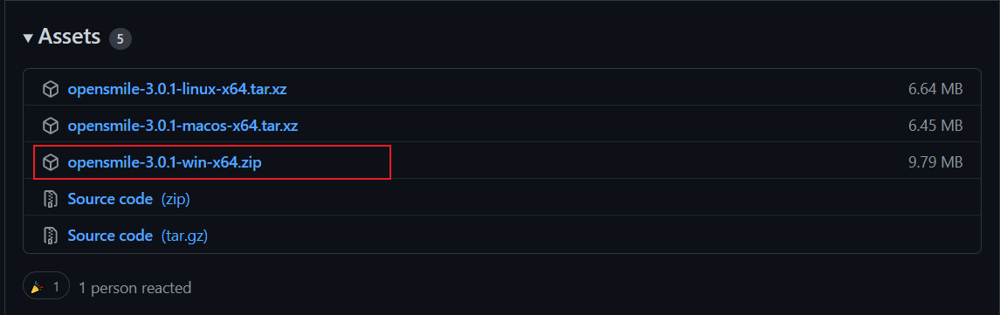

2. 解压

	解压压缩包到程序安装目录
	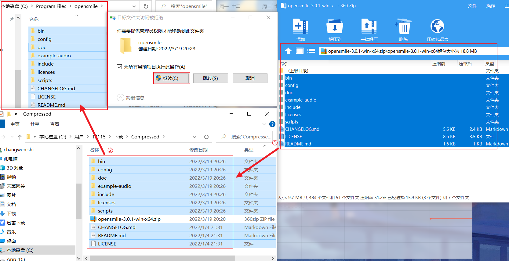

3. 配置环境变量
	
	左下角搜索`环境变量`，打开系统环境变量编辑窗口。
	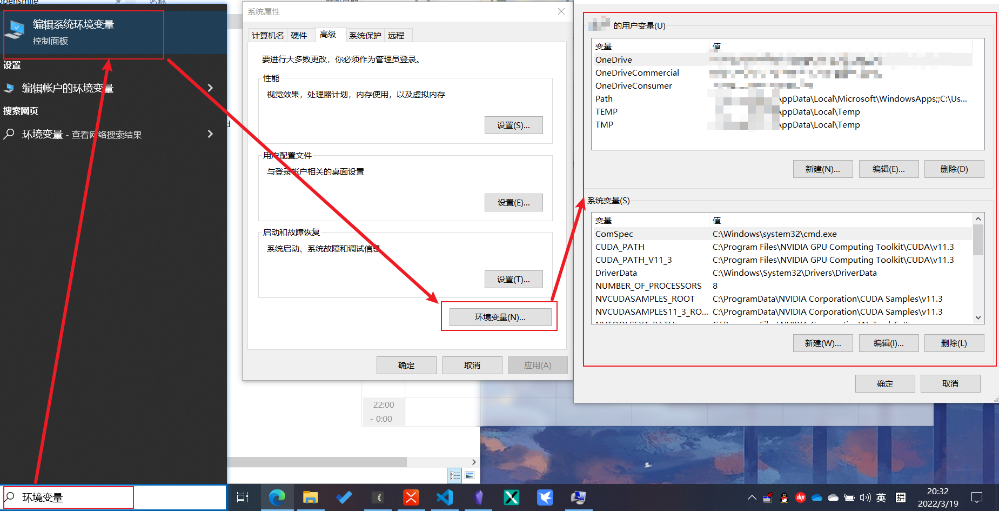
	
	在下册窗口 `系统变量`中找到 `Path` 进行编辑，在其内部`新建`一个Opensmile程序的`bin`文件夹地址。
	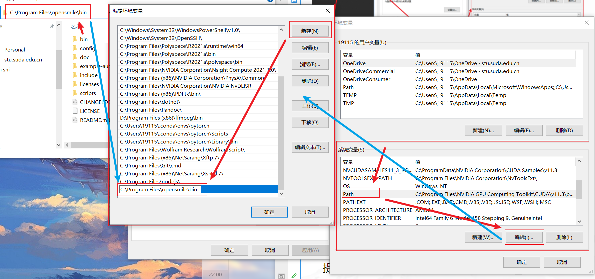
	确认-确认-确认-结束

4. 使用Opensmile提取特征

	键盘摁住 `win+R` 进入 `运行`，然后输入 `cmd` 打开命令提示符窗口，在其内输入命令 `SMILExtract -h` 可以查看当前使用帮助，输入 `SMILExtract -C C:\Program Files\opensmile\config\mfcc\MFCC12_0_D_A.conf -I Input.wav -O Output.csv` 可以进行特征提取操作。
	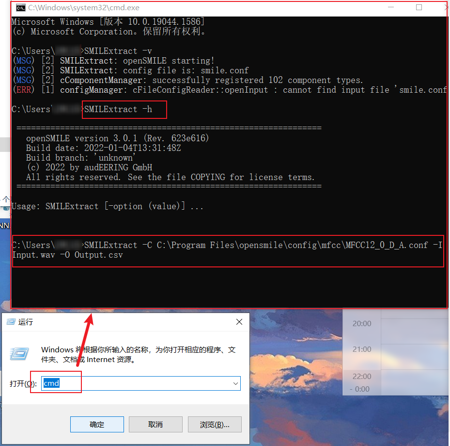

### 在 Linux/Mac 上安装

1. 下载
	
	手动下载：从右侧链接处下载对应自己系统版本的的压缩包，[Releases · audeering/opensmile · GitHub](https://github.com/audeering/opensmile/releases)
	
	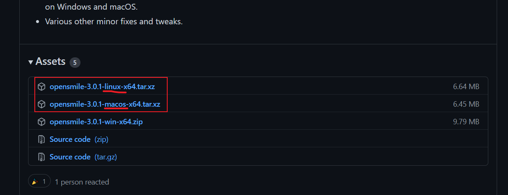

	使用命令直接下载：`cd program && wget --no-check-certificate http://github.com/audeering/opensmile/releases/download/v3.0.1/opensmile-3.0.1-linux-x64.tar.xz`
	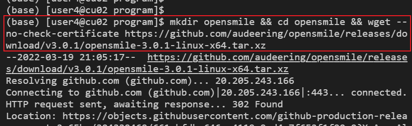

2. 解压

	使用命令 `tar -xvf opensmile-3.0.1-linux-x64.tar.xz` 解压压缩包到程序安装目录。
	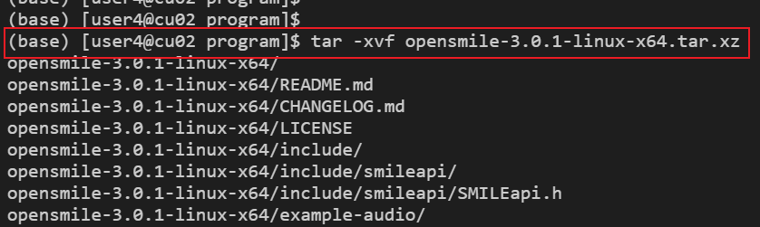
	最终获得程序文件夹，如下。
	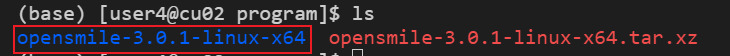

	有需要可以尝试改下名字 `mv ./opensmile-3.0.1-linux-x64 ./opensmile`）
	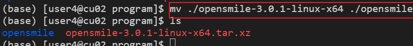

3. 配置当前用户环境变量
	
	通过 `vi ~/.bash_profile` 进入环境变量存储文件。然后修改此文件，在其中添加行： `PATH=$PATH:$HOME/program/opensmile/bin`。
	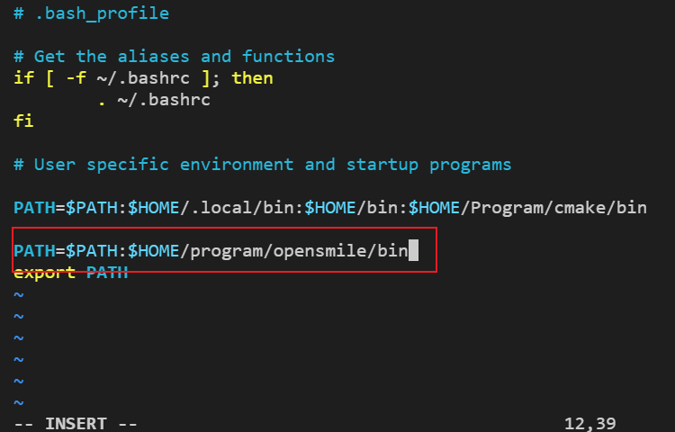

	使变量设置生效 `source ~/.bash_profile`
	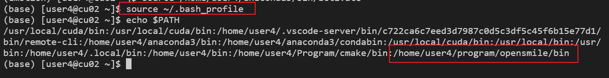

4. 使用 Opensmile 提取特征

	输入命令 `SMILExtract -h` 可以查看当前使用帮助，输入 `SMILExtract -C C:\Program Files\opensmile\config\mfcc\MFCC12_0_D_A.conf -I Input.wav -O Output.csv` 可以进行特征提取操作。

5. 修复 `glibc` 等版本过低导致错误（无权限，放弃ing）
	
	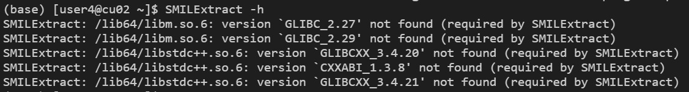

	查看当前系统支持的版本
	glibc： `strings /lib64/libc.so.6 |grep GLIBC_` 可以看出 glibc 到 2.17 之后就不支持了。
	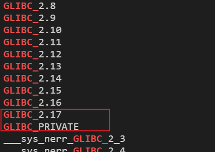

### 在 Linux/Mac 上编译

1. 进入程序安装文件夹

	```bash
	mkdir Program && cd Program
	```
 
2. 确认安装环境是否完整

	```bash
	# 更新软件列表
	sudo apt-get update
	```

	```bash
	# automake
	automake --version
	sudo apt-get install automake
	```

	```bash
	# libtool
	libtool --version
	sudo apt-get install libtool
	```

	```bash
	# m4
	m4 --version
	```

	```bash
	# gcc>5.1
	gcc --version
	g++ --version
	sudo apt-get install g++
	```

	```bash
	# cmake，尽量新
	cmake --version
	sudo apt-get install cmake
	```

	```bash
	# perl
	perl -v
	```

	```bash
	# clang
	clang --version
	sudo apt-get install clang
	```

	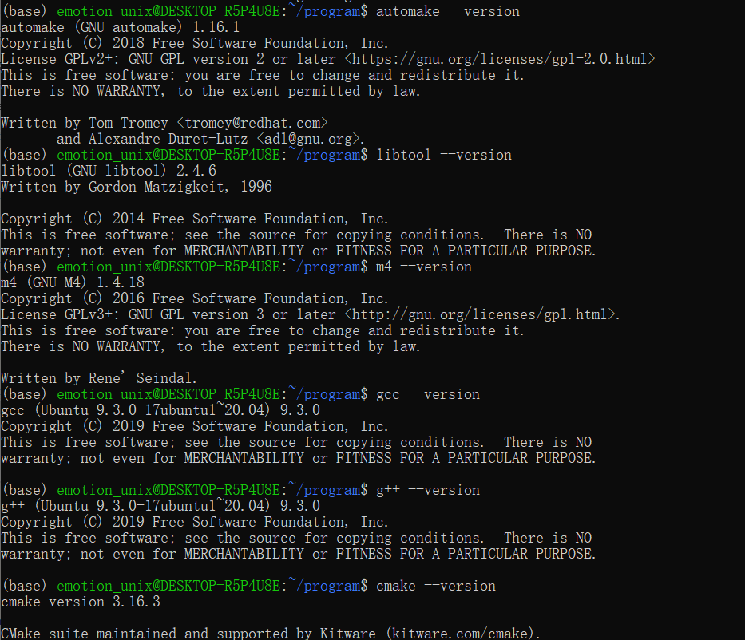
	
	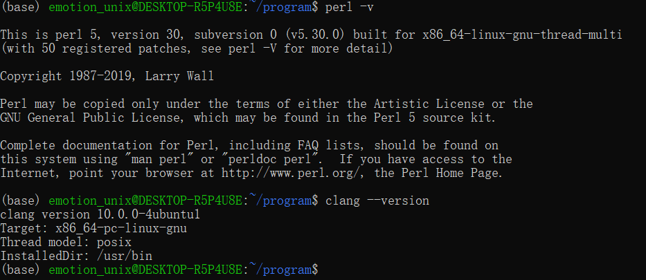

3. 从 GitHub 下载或克隆源代码(三选一)：

	```bash
	# ①克隆 opensmile
	git clone https://github.com/audeering/opensmile.git
	# 注意,若git下载失败,如果立即在原文件夹使用wget下载,可能会导致关机后opensmile的文件丢失, 解决办法是重启再下或者换个文件夹.
	# ②[下载和解压 opensmile](https://github.com/audeering/opensmile/releases)
	wget https://github.com/audeering/opensmile/releases/download/v3.0.1/opensmile-3.0.1-linux-x64.tar.xz
	tar -xvf opensmile-3.0.1-linux-x64.tar.xz
	
	# ③国内下载速度慢的情况下，使用Github文件加速,示例如下：
	wget https://shrill-pond-3e81.hunsh.workers.dev/https://github.com/audeering/opensmile/archive/master.zip
	sudo apt install unzip
	unzip master.zip
	```

	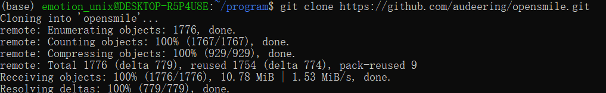
	
	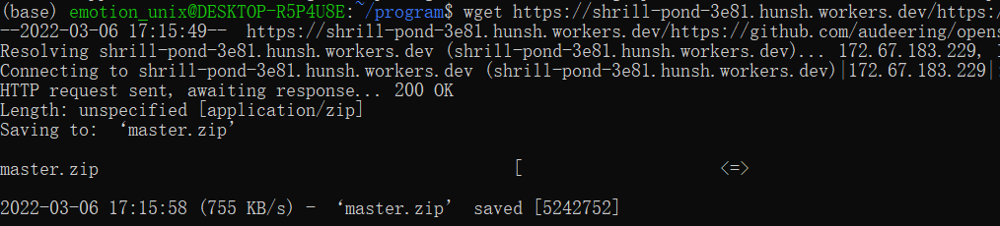

4. 编译程序

	```bash
	# 进入解压或克隆的 opensmile 文件夹
	cd /home/emotion_unix/program/opensmile/
	# opensmile
	sh build.sh  或  bash build.sh
	# 添加全局变量,在.profile 文件中添加以下代码
	PATH="$HOME/program/opensmile/build/progsrc/smilextract:$PATH"
	```
	
	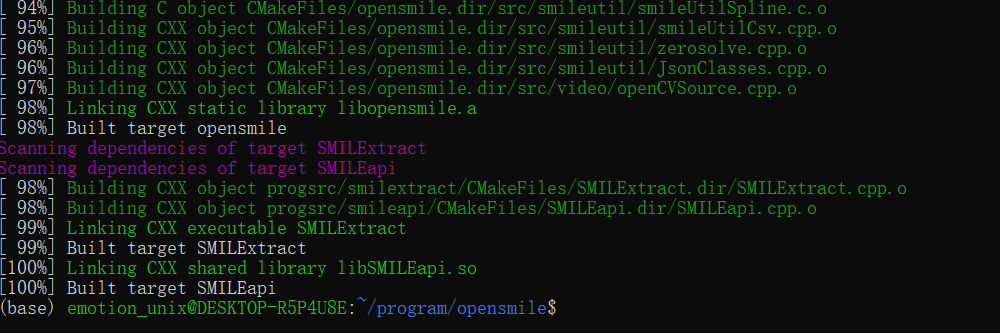

5. 安装实时语音支持库

	```bash
	sudo apt-get install portaudio19-dev
	```

6. 安装可视化库Gnuplot

	```bash
	sudo apt-get install gnuplot-nox
	```

##  SMILExtract

### 基本命令

```bash
# [parameter-type]表示可选参数，<parameter-type>表示必需参数
-h  # 展示帮助信息

-C, -configfile <string>
# .conf 配置文件路径
# (default: 'smile.conf')

-l, -loglevel <integer>
# 日志输出级别 (0-9)
# (default: 2)

-t, -nticks <integer>
# Number of ticks (component loop iterations) to process (-1 = infinite) (Note: this only works for single thread processing, i.e. nThreads=1 set in the config file). This option is not intended for normal use. It is for debugging component execution code only.
# (default: -1)

-d， -debug
# 显示调试日志消息 （DBG）（仅当 binary 编译为调试版本时才可用）
# 默认值：关闭

-L, -components [boolean 0/1]
# 展示所有的component列表
# (default: 0)

-H, -configHelp [string]
# 显示所有可用组件(包括)的配置选项文档。 (如果给定了字符串参数,则仅显示以给定字符串开头的组件配置文档)
# (default: '')

-configDflt [string]
# 展示所有可用组件(component)的默认配置文件section模板(如果给定了字符串参数,则仅显示以给定字符串开头的组件配置文档)。配合 'cfgFileTemplate' 选项，可以生成包含所给定组件列表的模板配置文件。
# (default: '')

-cfgFileTemplate [boolean 0/1]
# 参数'-configDflt'的选项,若设定为1,则'configDflt'可以指定多个以逗号分隔的组件名称字符串,即可以展示多个完整组件名称对应的配置模板.
# (default: 0)

-cfgFileDescriptions [boolean 0/1]
# 参数'-configDflt'的选项,若设定为1,则包含每个配置文件模板参数的具体描述.
# (default: 0)

-c, -ccmdHelp [boolean 0/1]
# 显示标准命令和config file中自定义的命令行选项的帮助。
# (default: 0)

-exportHelp [boolean 0/1]
# 以JSON格式,打印已注册的配置类型的详细文档，适用于希望以编程方式使用联机帮助内容的外部工具。
# (default: 0)

-logfile <string>
# 指定日志文件的路径和文件名。确保文件的路径是可写入的。
# (default: '')

-noconsoleoutput [boolean 0/1]
# 不向控制台输出任何消息 ( log 文件不会受此选项影响)
# (default: 0)

-appendLogfile [boolean 0/1]
# -logfile的选项，选择将日志消息追加到现有的 log 文件，而不是在每次启动时覆盖 log 文件
# (default: 0)
```

```bash
# 从语音文件中提取音频特征
# -C 配置文件路径
# -I 输入文件路径
# -O 输入文件路径
SMILExtract -C config/demo/demo1_energy.conf -I example-audio/opensmile.wav -O opensmile.energy.csv
```

### 自定义配置文件

	 (每个配置文件含有多个组件(component), 每个组件有其对应的注册参数设置)

#### 导出所需组件的默认配置模板

```bash
# 指定使用的组件,导出其默认的配置模板
# -cfgFileTemplate 展示配置模板
# -cfgFileDescriptions 展示配置详细信息
# -configDflt 指定一组逗号分隔的组件名称列表,展示其配置模板
# -l log等级
# 2> 指定输出文件地址
SMILExtract -cfgFileTemplate -cfgFileDescriptions -configDflt cWaveSource,cFramer,cEnergy,cCsvSink -l 1 2> config/myconfig/demo1_descriptions.conf
```

#### 配置文件结构

```json
// demo1_descriptions.conf 文件内部结构

// 第一部分:组件管理配置,定义实例化哪些组件
 ;= component manager configuration (= list of enabled components!) =
[componentInstances:cComponentManager]
 // this line configures the default data memory:
instance[dataMemory].type = cDataMemory
instance[waveSource].type = cWaveSource
instance[framer].type = cFramer
instance[energy].type = cEnergy
instance[csvSink].type = cCsvSink
// 配置数据存储级别显示的详细等级。0表示没有任何信息，5表示最大细节。
printLevelStats = 1
// 配置并行线程数量(实验功能):
nThreads = 1

// 第二部分: 组件参数设置
// 生成模板时,所有参数都会是其默认值
[waveSource:cWaveSource]
writer.dmLevel = wave 
filename = \cm[inputfile(I):file name of the input wave file]
...
[framer:cFramer]
reader.dmLevel = wave  
writer.dmLevel = waveframes
...
[energy:cEnergy]
reader.dmLevel = waveframes  
writer.dmLevel = energy 
...
[csvSink:cCsvSink]
reader.dmLevel = energy 
filename = \cm[outputfile(O):file name of the output CSV file]
...
// 第三部分: 导入配置文件
\{path/to/config.file.to.include}
```

##### 第一部分：启用组件

	此部分创建组件(Component)管理器并实例化其配置数组中列出的所有组件。

- `[componentInstances:cComponentManager]`
	- 声明开始构建组件管理器，即Component section的开头
- `instance[实例名称].type = 组件类型`
	- 给每个需要的组件类型构造实例，保存在`instance` 列表中, 其中[实例名称]必须是唯一的，且不能包含字符 `]`.
	- `cDataMemory`组件是必需的，用来处理组件间的流数据(数据连接);
	- `instance` 列表中的实例，必须拥有配置section，即使为空(仅含`[name:type]` 的 section )

##### 第二部分：配置组件

	执行配置步骤，如打开输入/输出文件、分配内存、完成等组件的参数配置。这三种步骤每一个都可能出现很多次，因为某些组件可能依赖于其他组件已经完成的配置(如，当前组件要从其他组件读取其输出、输出数据维度、输出字段名称等)。每个组件有其对应的参数配置 section，每个 section都以 `[实例名称:组件类型]` 为开头行。

- `[实例名称:组件类型]`

			组件参数设置section 的开头，声明下方将开始某组件类型的参数设置

- `writer.dmLevel`、`reader.dmLevel`
	- 设置组件连接关系(数据流动关系)
	- 在每个组件的接收器或源中都包含了[dataReader]和[dataWriter]组件, 因此可以通过修改其内部的[writer.dmLevel]和[reader.dmLevel]参数值[Level]，指定数据分配到哪部分内存，来连接组件。即通过给每一个组件设置[writer.dmLevel=Level_Y]，分配组件输出数据存到 Y 所在内存；设置 [reader.dmLevel=Level_X] 指定读取数据来源为 X 所在的内存(X来源于上一层组件设置的[writer.dmLevel])。
	- 组件数据分配规则：
		1. 对于组件内部的输出[Level_Y]，只能有一个[dataWriter]存在，也就是说，只有当前组件可以写入到[Level_Y]，亦即 [Level_Y] 不能有同名的[Level]；
		2. 对于[Level_X]，可以被多个外部组件读取；
		3. 每一个组件可以读取多个[Level_X]，由[;]分割，如：[reader-dmLevel =Level_X1;Level_X2]，对应于组件有两个输入，输入数据按列连接。
- `filename = \cm[inputfile(I):file name of the input wave file]`
	- 设置命令行输入文件，命令符为 I；也可直接以文件地址为参数值。
- `filename = \cm[outputfile(O):file name of the output CSV file]`
	- 设置命令行输出文件，命令符为 O；也可直接以文件地址为参数值。
- 参数配置支持 'string'，'numeric'，'char'，'sub type'，'array' 等
- 注释格式：`;`， `//` ，`#`，`/*多行注释 */`

##### 第三部分: 导入配置文件

	等同于将加载到的配置文件行数据复制到此文件中

##### 第四部分：定制新命令行选项

	在当前配置文件中为 openSMILE 命令 `SMILExtract`定义新的命令行选项，然后引用选项值。

```bash
	# 默认值和命令描述至少存在一个
	\cm[长命令(短命令_可选){默认值_可选}:命令描述]
```

#### 执行自定义配置文件

```bash
SMILExtract -C config/myconfig/demo1_descriptions.conf -I example-audio/media-interpretation.wav -O example-audio/smileoutput.csv
```

## 默认特征集配置

- 特征集配置种类

	- Chroma features for key and chord recognition(用于键和和弦识别的色度特征)
	
	- MFCC for speech recognition(用于语音识别的MFCC)
	
	- PLP for speech recognition(用于语音识别的PLP)
	
	- Prosody (Pitch and loudness)(韵律(音高和响度))
	
	- INTERSPEECH 2009 情感挑战赛特征集
	
	- INTERSPEECH 2010 Paralinguistic 挑战赛特征集
	
	- INTERSPEECH 2011 扬声器状态挑战赛特征集
	
	- INTERSPEECH 2012 扬声器特征挑战赛特征集
	
	- INTERSPECEC 2013 ComParE 特征集
	
	- MediaEval 2012 TUM 暴力场景检测特征集。
	
	- 三种情绪识别特征参考集(更老的集，相对INTERSPEECH挑战赛集合已经过时)
	
	- 基于INTERSPEECH 2010 Paralinguistic 挑战赛音视频特性集中的音频特征集。

	>  注：如果你发布的成果中利用openSMILE提取了特征，我们希望你可以把你的配置文件在科研论坛上进行共享，比如上传到您的个人网页并在文章中提供网页地址。同时请指明是openSMILE的哪个官方版本以使大家能够复现你的结果。

- 查看所选配置文件的自定义命令行选项

	```bash
	# 每个配置文件会有自己的设定,常用的有输入和输出文件指令 `I` `O` 等
	SMILExtract -C config/configfile名称.conf -ccmdHelp
	```

- 标准配置文件
	- 音频输入配置

		```bash
		# 文件：config/shared/standard wave input.conf.inc
		
		-inputfile，-I <filename>
		# 输入音频文件的路径和名称。
		
		-start <t in seconds>
		# 从哪里开始分析，相对到文件的开头（0）。
		
		-end <t in seconds>
		# 在哪里结束分析，相对到文件的开头（0），默认（-1）是文件的结尾。
		
		# buffersize_sec = 5.0
		# monoMixdown=1
		# outFieldName = pcm
		```

	- 输入帧配置(frameModeFunctionalsConf类型文件)

		- 完整输入

			```bash
			# 文件：FrameModeFunctionals.conf.inc
			frameMode = full
			frameSize = 0
			frameStep = 0
			frameCenterSpecial = left
			```

		- 固定窗口滑动(窗长5s，步长2s)

			```bash
			frameMode = fixed
			frameSize = 5
			frameStep = 2
			frameCenterSpecial = left
			```

		- 分段输入(4.2秒到5.6秒，7.0到9.0秒，10秒到文件结束)

			```bash
			frameMode = list
			frameList = 4.2s-5.6s，7.0s-9s，10s-E
			frameCenterSpecial = left
			```

		- cTurnDetector组件控制,适于实时录制输入

			```bash
			# 文件：FrameModeFunctionalsLive.conf.inc
			frameMode = var
			frameCenterSpecial = left
			```

	- 组件输出缓冲配置(bufferModeConf类型文件)

			openSMILE中的每个数据内存都有一个缓冲区，默认情况下，它是一个环形缓冲区，以保证应用程序较长时间运行时，内存占用量恒定。  
			如果组件想在给定长度的窗口上汇总多个输入数据，必须确保此组件的输入数据缓冲区大小足以容纳整个窗口。
			1. bufferConf配置随上述frameMode设置而变化。
			2. 缓冲区大小必须至少是所请求的frame大小。
			3. `writer.levelconf.nT` 设置缓冲区初始大小(单位:LLD帧数)。
			4. `writer.levelconf.growDyn` 设置缓冲区在写入更多数据时为动态增长(1)。
			5. `writer.levelconf.isRb` 设置缓冲区类型为环形缓冲区(1)或固定大小的缓冲区(0)。
			6. 通常缓冲区设置后续组件会继承先前的组件。当有组件需要读取完整输入时,应给其单独设置。

		- 完整输入(frameMode = full)

			```bash
			# 文件：BufferMode.conf.inc
			# 完整输入时, 必须配置为动态增长（growDyn = 1）
			writer.levelconf.growDyn = 1
			writer.levelconf.isRb = 0
			writer.levelconf.nT = 1000
			```

		- 固定窗口滑动

			```bash
			# 文件：BufferModeRb.conf.inc
			writer.levelconf.growDyn = 0
			writer.levelconf.isRb = 1
			writer.levelconf.nT = 5
			; writer.levelconf.nT = 3
			```

		- 实时录制输入

			```bash
			# 文件：BufferModeLive.conf.inc
			# 随时间推移,动态增长模式会占用无限量的内存
			writer.levelconf.growDyn = 0
			writer.levelconf.isRb = 1
			# 必须大于 turndetector maxlength + grace
			writer.levelconf.nT = 1500
			writer.levelconf.noHang = 2
			```

	- 结果输出配置

		```bash
		# =============================
		
		-instname         <string>      
		
		# 输入文件的名称，将保存在输出CSV和ARFF文件的首列。默认是"unknow"
		
		# =============================
		
		-lldcsvoutput, -D <filename>    
		# 将LLD特征逐帧输出到<filename>.CSV文件。
		
		-appendcsvlld     <0/1>         
		# 将输出结果追加到已有CSV文件文末(1)，默认覆盖(0)
		
		-timestampcsvlld  <0/1>  
		# 禁止把时间步输出到CSV第二列(0)，默认为输出(1)
		
		-headercsvlld     <0/1> 
		# 禁止把标题输入到CSV(0)，默认为输出(1)
		
		=============================
		-lldhtkoutput     <filename>
		# 将LLD特征逐帧输出到<filename>.HTK文件。
		
		-appendhtklld <float>
		# 将输出结果追加到已有HTK文件文末(1)，默认覆盖(0)
		
		=============================
		-lldarffoutput, -D <filename>
		# 将LLD特征逐帧输出到<filename>.ARFF文件。
		
		-appendarfflld     <0/1>
		# 将输出结果追加到已有ARFF文件文末(1)，默认覆盖(0)
		
		-timestamparfflld  <0/1> 
		# 禁止把时间步输出到ARFF第二列(0)，默认为输出(1)
		
		-lldarfftargetsfile <file>      
		# 指定一个配置，里面包含了 defines the target fields (classes)的参数设置 默认为: shared/arff_targets_conf.inc
		
		=============================
		-output, -O  
		# 默认输出选项. ARFF格式，存放特征汇总
		
		-appendarff       <0/1> 
		# 将输出结果覆盖已有ARFF文件(0)，默认添加(1)
		
		-timestamparff    <0/1> 
		# 禁止把时间步输出到ARFF第二列(0)，默认为输出(1)
		
		-arfftargetsfile <file>  
		# 指定一个配置，里面包含了 defines the target fields (classes)的参数设置 默认为: shared/arff_targets_conf.inc
		
		=============================
		-csvoutput        <filename> 
		# 默认输出选项. CSV格式，存放特征汇总
		
		-appendcsv        <0/1>   
		# 将输出结果覆盖已有CSV文件(0)，默认添加(1)
		
		-timestampcsv     <0/1>
		# 禁止把时间步输出到CSV第二列(0)，默认为输出(1)
		
		-headercsv        <0/1> 
		# 禁止把标题输入到CSV(0)，默认为输出(1)
		
		=============================
		-htkoutput       <filename> 
		# 输出特征汇总（函数）到HTK格式文件，使用 -appendstatichtk 可选择追加到已有文件
		
		-appendhtk <float>
		# 将输出结果追加到已有HTK文件文末(1)，默认覆盖(0)
		
		=============================
		-relation <string>
		# arff relation attribute, feature set name and/or corpus name
		(default: 'openSMILE_features')
		
		-classtype <string>
		# type of labelA, either numeric or a list of comma separated classes in curly brackets
		(default: 'numeric')
		
		-class <string>
		# string value for labelA
		(default: '?')
		
		
		-frameTimeAdd <float>
		# frame time offset -start of segment in seconds- used by avec2013
		(default: 0.000000)
		
		```

- 配置实例

	- 计算音乐色度特征

		```bash
		# 12个半音调
		# SFFT(窗口50ms,速率10ms,高斯窗口)
		# 使用三角滤波器将频谱图缩放到半音调频率轴.
		# 结果一帧一行,以 `;` 符号分分隔特征数据浮点值
		SMILExtract -C config/chroma/chroma_fft.conf -I input.wav -O chroma.csv
		
		```

	- 计算音频MFCC特征

		```bash
		# MFCC12_0_D_A : 窗口25ms, 速率10ms, Hamming窗,预加重0.97,26个Mel频带,频率范围0-8khz,13个MFCC,权重为22的倒谱提升滤波器,一阶和二阶系数
		# MFCC12_E_D_A : 与上述几乎相同,只是取log的频段选择1-12
		# MFCC12_0_D_A_Z : 附加均值归一化
		# MFCC12_E_D_A_Z : 附加均值归一化
		
		SMILExtract -C config/mfcc/MFCC12_E_D_A.conf -I input.wav -O output.mfcc.htk

		```

	- 计算音频PLP特征

		```bash
		# PLP_0_D_A : 窗口25ms, 速率10ms, Hamming窗,预加重0.97, 26个Mel频带,频率范围0-8khz,压缩系数0.33,预测阶数5,PLP 0-5,权重为22的倒谱提升滤波器,一阶和二阶系数
		# PLP_E_D_A : 与上述几乎相同,只是取log的频段选择1-5
		# PLP_0_D_A_Z : 附加均值归一化
		# PLP_E_D_A_Z : 附加均值归一化
		
		SMILExtract -C config/plp/PLP_E_D_A.conf -I input.wav -O output.plp.htk

		```

	- 计算音频韵律特征

		```bash
		# 基频（F0）,the voicing probability,the loudness contours
		SMILExtract -C config/prosody/prosodyShs.conf -I input.wav -O prosody.csv
		
		```

	- INTERSPEECH 2009 情感挑战赛特征集

		```bash
		# 包含 384 种特征
		# pcm_RMSenergy(信号帧的均方根能量)
		# mfcc(梅尔频率倒谱系数1-12), pcm_zcr(基于帧的过零率)
		
		# voiceProb(ACF方法计算的发声概率)
		
		# F0(由倒谱得到的基频)
		
		# 参数后缀:_sma(通过窗口大小3的平均滤波器平滑)
		# 参数后缀:_sma_de(求一阶delta系数(微分))
		
		# max (contour最大值)

		# min (contour最小值)

		# range (= max-min contour范围)

		# maxPos (最大值绝对位置(in frames))

		# minPos (最小值绝对位置 (in frames))

		# amean (contour 算术平均值)

		# linregc1 (contour的线性近似斜率(m))

		# linregc2 (contour的线性近似偏置(t) )

		# linregerrQ (contour的线性近似值和实际值的差值)

		# stddev (contour的标准差)

		# skewness (偏度(三阶标准矩))

		# kurtosis (峰度(## 四阶标准矩))

		```

	- INTERSPEECH 2010  Paralinguistic 挑战赛特征集

		```bash
		# 1582 个特征
			# (34种LLD+34个微分)+21种contour函数
			# (4种pitch-based LLD+4个微分)+19种contour函数
			#  the number of pitch onsets (pseudo syllables)+the total duration of the input
		
		
		```


	- NTERSPEECH 2011 演讲者状态挑战赛功能集

		```bash

		```

	- INTERSPEECH 2012 演讲者特质挑战赛功能集

		```bash

		```

	- INTERSPEECH 2013 ComParE 挑战特征集 

		```bash

		```

	- MediaEval 2012 TUM 暴力场景检测特征集

		```bash

		```

	- openSMILE/openEAR 'emobase' 特征集

		```bash
		# 988个特征
		# (26种LLD+26个微分)+19个contour函数
		SMILExtract -C config/emobase/emobase.conf -I input.wav -O output.arff

		```

	- 基于INTERSPEECH 2010 Paralinguistic 挑战赛音视频特性集中的音频特征集。


		```bash

		```

	- 大型 openSMILE 情感特征集

		```bash
		# 6552种特征
		# 
		SMILExtract -C config/misc/emo_large.conf -I input.wav -O output.arff
		```

	- openSMILE 'emobase2010' 特征集

		```bash
		# 基于 INTERSPEECH 2010 Paralinguistic Challenge 功能集
		# 区别是"maxPos"和"minPos"特征的标准化
		# 1582种特征
		# (34种LLD+34个微分)+21种contour函数
		# (4种pitch-based LLD+4个微分)+19种contour函数
		#  the number of pitch onsets (pseudo syllables)+the total duration of the input
		
		```

## 参考表述

### 增量处理

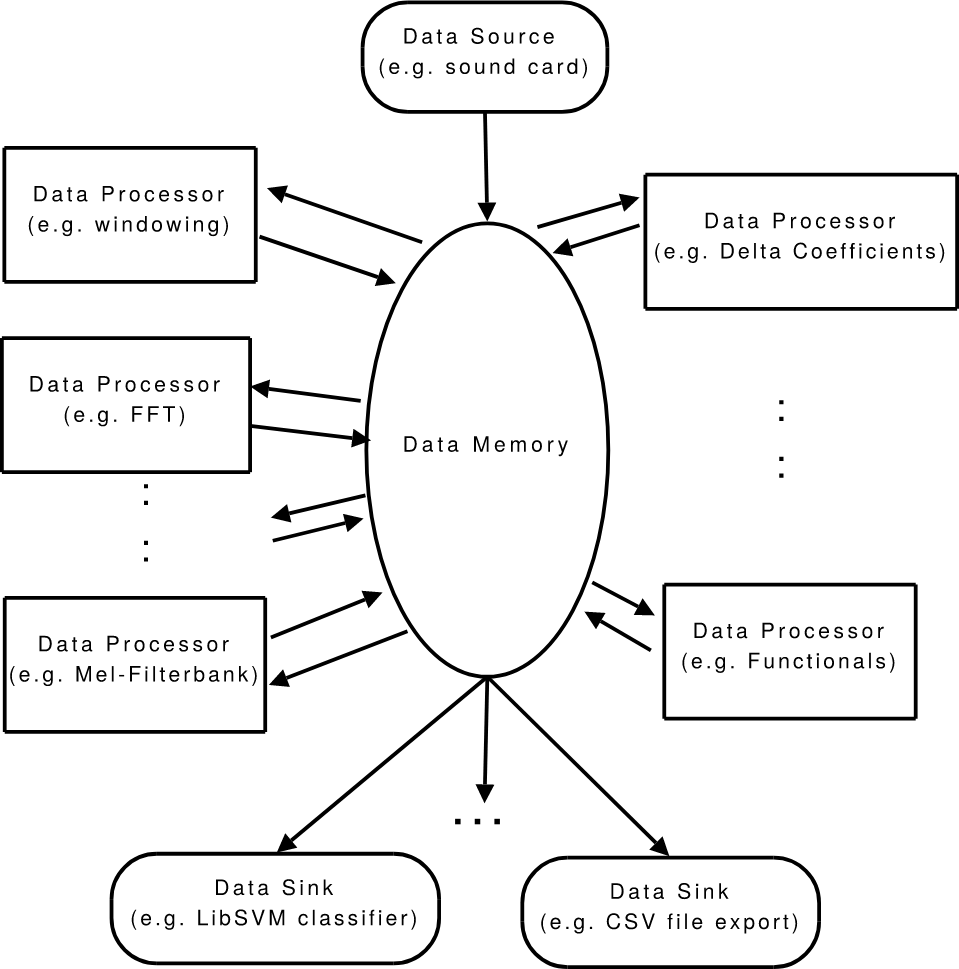

openSMILE 中的数据流由 cDataMemory 组件处理，此组件在内部管理了多个数据存储器 "Level" (不同的Level(层)代表了独立的数据存储位置)，每一个Level只能由一个组件写入，但可以由任意数量的组件读取。数据存储器 "Level" 是所有数据源、数据处理器和数据存储组件之间连接的重要环节。

从图片外部（组件侧）看，Level 可以看作是一个 N×∞ 的矩阵, 其中 N 是 frame 大小（即每一列是一个N维的frame），而组件可以在此虚拟矩阵中的任何位置 读/写 frames（按列读取多个frame）。
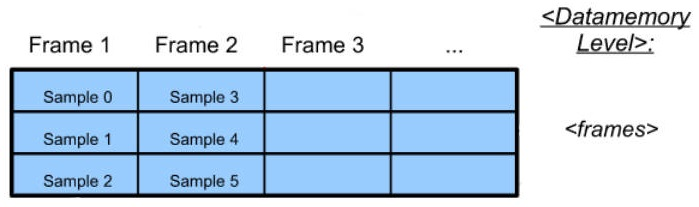


数据存储 Levels 在内部存储分为两种方式：环形缓冲区（isRb =1）或常规缓冲区（isRb=0），并且它们的大小(可以存放的 frame 的数量)可以设置为固定的（growDyn=0）或在运行时动态增长的（growDyn=1）。
	
- 固定 Levels 大小的环形缓冲区
	- 仅当缓冲区中存在空帧（尚未被写入的 frames，或已被所有组件从此 Level(层) 读取的 frames）时，写入操作才会成功。环形意味着，当前写入的数据可能覆盖前面的数据，如下图所示`12，13，14，15` 覆盖了输入的`0，1，2，3`。
	- 仅当使用的 frames 索引不超过环形缓冲区大小时，读取操作才会成功。
		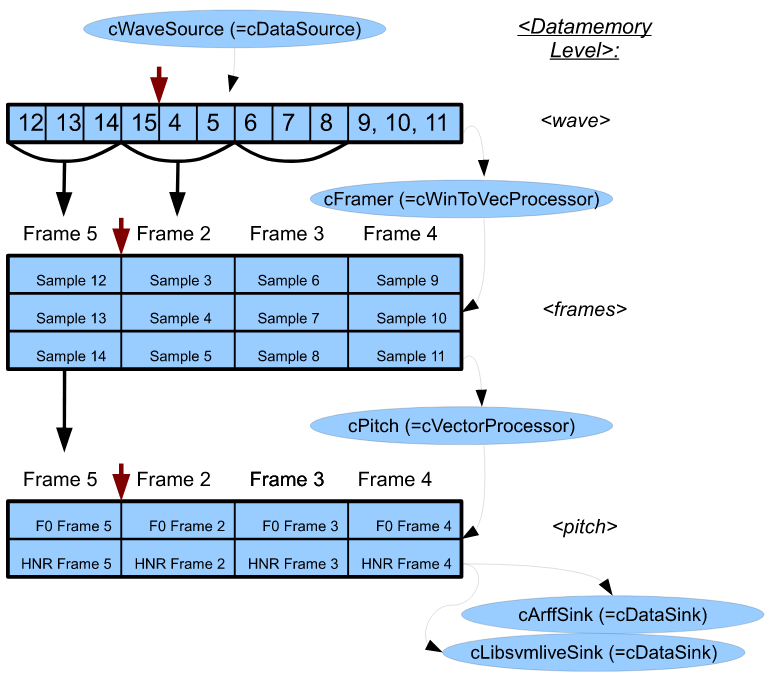
	- 固定 Levels 大小的常规缓冲区
		- 除非缓冲区已满，写入都会成功，否则始终失败。
		- 仅当使用的 frames 索引不超过常规缓冲区大小时，读取操作才会成功。
	- Levels 设置动态增长
		- 除非应用程序内存不足，写入始终成功。但是，设置为动态增长的 Levels 分配的内存量没有限制。在几乎所有情况下，建议使用固定大小的环形缓冲区进行级别配置。

必须合理设置 Level(层) 缓冲区大小，以确保组件顺利处理读取器或写入器每次从 dataMemory 读取/写入的数据块。如下图所示，functionals 组件的读取数据块大小 为 2(一次读取两个pitch frames)，则处理组件 ‘pitch’的输入 Level(层) 缓冲区必须至少为 2 frames 长度,否则functionals 组件将永远无法从此 Level(层) 读取完整的 window 。
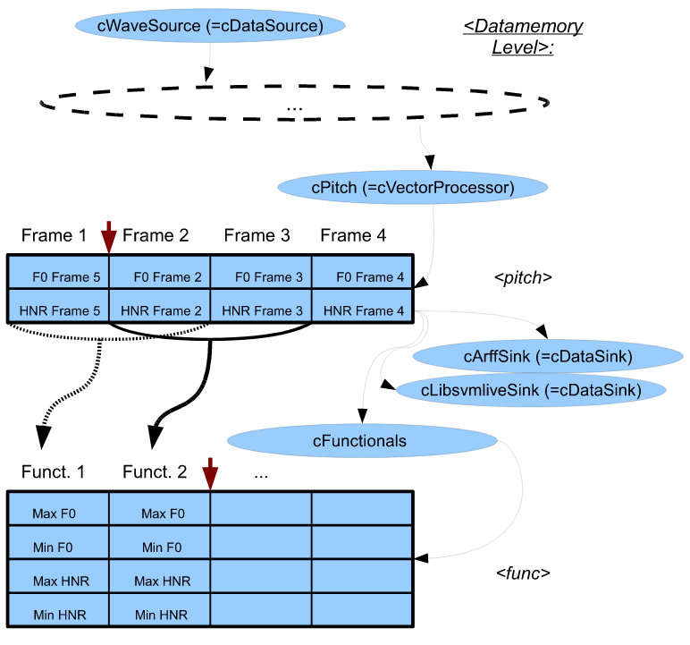

每个组件的读取器和写入器必须在配置阶段向数据存储器(data memory)注册，并提供其读写的数据块大小，之后 openSMILE 就会自动处理调整其Level(层) 缓冲区大小。如果将某个 Level(层) 的缓冲区大小设置为定义的最小缓冲区大小，则该 Level 缓冲区大小将增加到最小缓冲区大小。如果Level(层) 的缓冲区大小（通过配置选项）大于定义的最小缓冲区大小，则将使用较大。
> 此自动调整缓冲区大小设置仅适用于环形缓冲区。

### openSMILE 术语

在数据存储器中的 ‘Level’ 表示一个包含numeric data(数值数据), frame meta data, 和 temporal meta data 三种数据的unit(单元)。其中 temporal meta data(时态元数据) 存在于每一个 frame，其描述了每个 frame 的 timestamps(时间戳) 和自定义的元数据。另一方面 (时态元数据)  也是全局存在的，描述了该 ‘Level’ 的 frame period(帧周期)和timing mode(计时模式)。

‘Level’ 可以看作是一个 $nFields × nTimestemps$ 的二维矩阵，其中 ‘frame’ 对应于此矩阵的列(每一个列向量对应一个‘frame’)，‘windows’ 或 ‘contours’ 对应于此矩阵的行。 (Note: 当导出数据到文件时, 矩阵数据会被转置, i.e. 基于文本的文件 (CSV, ARFF), 文件的行向量对应于 ‘frame’ ) 

术语 ‘element’ 指的是 frames/vectors 的实际元素。‘field’ 是一组同属于相同逻辑的 ‘element’ ，且其中所有的 ‘element’  都具有相同的名称。实例：一个包含特征 ‘energy’, ‘F0’, 和 ‘MFCC’ 1-6 的特征 frame ，其中含有 $1+1+6=8$ 个 elements，但是只有 $3$ 种 ‘field’ ：单 ‘element’ 的 ‘energy field’；单 ‘element’ 的 ‘F0 field’；六个 ‘elements’ 的 ‘MFCC field’。

## 组件

展示所有组件列表：`SMILExtract -L`

查看特定组件配置选项：`SMILExtract -H 组件名称`

[详情介绍](https://audeering.github.io/opensmile/reference.html#components)

cAcf

> 通过对幅度谱平方并应用逆快速傅里叶变换来计算自相关函数 （ACF）

cAmdf

> 计算每个输入帧的平均幅度差函数 （AMDF）

cArffSink

> 将 dataMemory 数据写入 ARFF 文件 （WEKA）。

arffClass

> 

arffTarget

> 

cArffSource

> 读取 WEKA ARFF 文件。

cCens

> 从"cChroma"组件生成的原始色度特征中计算 CENS（能量归一化和平滑色度特征）。

cChroma

> 从"cTonespec"分量生成的半音阶频谱计算色度特征。

cContourSmoother

> 应用可配置长度的移动平均筛选器来平滑数据等值线。

cCsvSink

> CSV（逗号分隔值）格式导出数据

cCsvSource

> 读取 CSV（逗号分隔值）文件。它将所有列作为属性读取到数据存储器中。一行表示一帧。

cDataMemory

> 

cDataMemoryLevel

> 

cDataPrintSink

> 将数据作为文本打印到 stdout 或 log 中，可以选择以标准可分析的结果格式打印出来。

cDataProcessor

> 从数据存储器读取数据并将新数据写入数据存储器的所有组件的抽象基类。

cDataReader

> 从 dataMemory 组件读取数据作为矢量或矩阵。它由所有 dataProcessor、dataSource 和 dataSink 组件在内部使用。

cDataSelector

> 将数据从一个级别复制到另一个级别，从而按元素/字段名称选择帧字段和元素。

cDataSink

> 用于组件读取（而不是写入）dataMemory 以及将数据转储/传递到外部实体。

cDataSource

> 用于组件读取（而不是写入）dataMemory 以及将数据转储/传递到外部实体。

cDataWriter

> 将矢量或矩阵数据写入 dataMemory 级别。编写器只能写入 dataMemory 中的单个级别，此级别在运行时阶段不能更改。

cDataMemoryLevel

> 

cDatadumpSink

> 

cDbA

> 

cDeltaRegression

> 

cEnergy

> 

cExampleSink

> 

cExampleSource

> 

cExternalAudioSource

> 

cExternalMessageInterface

> 

cExternalSink

> 

cExternalSource

> 

cFFTmagphase

> 

cFFmpegSource

> 

cFormantLpc

> 

cFormantSmoother

> 

cFramer

> 

cFullinputMean

> 

cFullturnMean

> 

cFunctionalCrossings

> 

cFunctionalDCT

> 

cFunctionalExtremes

> 

cFunctionalLpc

> 

cFunctionalMeans

> 

cFunctionalModulation

> 

cFunctionalMoments

> 

cFunctionalOnset

> 

cFunctionalPeaks

> 

cFunctionalPeaks2

> 

cFunctionalPercentiles

> 

cFunctionalRegression

> 

cFunctionalSamples

> 

cFunctionalSegments

> 

cFunctionalTimes

> 

cFunctionals

> 

cHarmonics

> 

cHtkSink

> 

cHtkSource

> 

cIntensity

> 

cLibsvmLiveSink

> 

cLibsvmSink

> 

cLpc

> 

cLsp

> 

cMZcr

> 

cMaxIndex

> 

cMelspec

> 

cMfcc

> 

cMonoMixdown

> 

cNullSink

> 

cPitchACF

> 

cPitchBase

> 

cPitchDirection

> 

cPitchJitter

> 

cPitchShs

> 

cDataWriterShs

> 

cPitchSmoother

> 

cPitchSmootherViterbi

> 

cPlp

> 

cPortaudioDuplex

> 

cPortaudioSink

> 

cPortaudioSource

> 

cPortaudioWavplayer

> 

cPreemphasis

> 

cRnnProcessor

> 

cRnnSink

> 

cRnnVad2

> 

cSignalGenerator

> 

cSimpleMessageSender

> 

cSmileResample

> 

cSpecResample

> 

cSpecScale

> 

cSpectral

> 

cSvmSink

> 

cTonefilt

> 

cTonespec

> 

cTransformFFT

> 

cTurnDetector

> 

cVadV1

> 

cValbasedSelector

> 

cVecToWinProcessor

> 

cVectorBinaryOperation

> 

cVectorConcat

> 

cVectorMVN

> 

cVectorOperation

> 

cVectorPreemphasis

> 

cVectorProcessor

> 

cVectorTransform

> 

cWaveSink

> 

cWaveSinkCut

> 

cWaveSource

> 

cWinToVecProcessor

> 

cWindowProcessor

> 

cWindower

> 

## SMILEapi C API and wrappers

SMILExtract命令行工具可以方便地对一组文件执行特征提取以进行研究，或作为演示程序的一部分运行openSMILE。然而，使用这种方法不可能将openSMILE功能无缝集成到其他应用程序中。对此，openSMILE提供了一个名为SMILEapi的C API，可以直接从其他应用程序调用SMILExtract命令行工具中提供的所有功能，以编程方式使用。此外，它还允许与OpenSMILE之间实时传递和检索音频、特征或smile messages。

SMILEapi的二进制可运行文件地址在`build/progsrc/smileapi`。默认情况下，它被构建为共享库 libSMILEapi.so (在Windows上为SMILEapi.dll)。需要链接到SMILEapi的应用程序需要包含共享库头文件 `progsrc/include/smileapi/SMILEapi.h`，此头文件定义了 API 中的所有types和functions。方便的，在`progsrc/smileapi/python`和`progsrc/smileapi/dotnet`中含有使用SMILEapi的Python、C＃包装程序；在（`progsrc/android-template` 和 `progsrc/ios-template`）中含有基于SMILEapi的Android、iOS示例应用程序，可以作为如何在移动应用程序中调用SMILEapi的参考。

## Feature names

## Feature extraction algorithms

## 开发

[Developer’s documentation — openSMILE Documentation (audeering.github.io)](https://audeering.github.io/opensmile/developer.html#developer-s-documentation)
