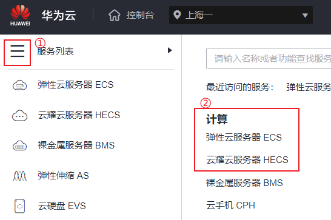
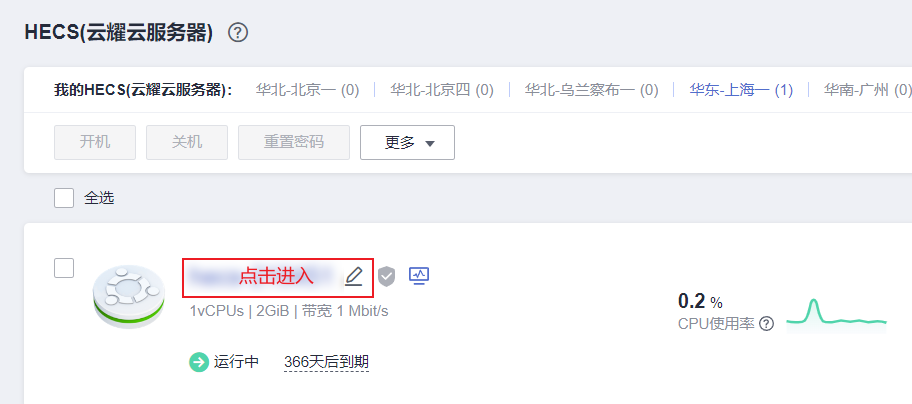
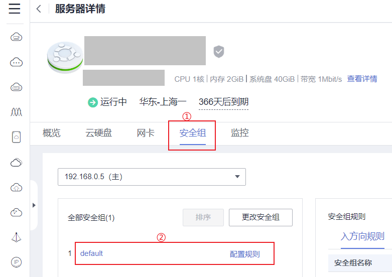
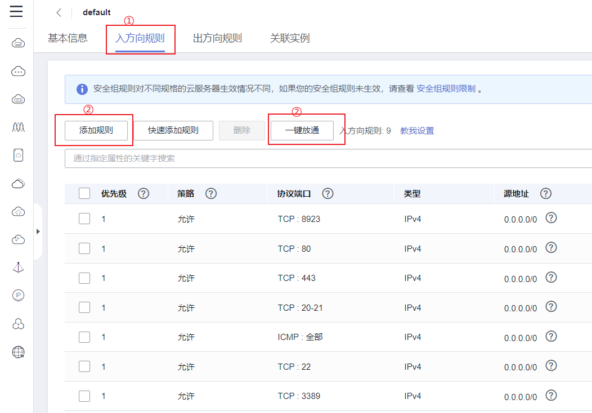

## 初始服务器设置

> [!info] 系统环境 
> 1. 服务器: 华为云 HECS (1vCPUs | 2GiB | 带宽 1 Mbit/s)
> 2. 操作系统: Ubuntu 20.04 64 位

### 介绍

首次创建新的 Ubuntu 20.04 服务器时，应执行一些重要的配置步骤作为初始设置的一部分。这些步骤将提高服务器的安全性和可用性，并为后续操作奠定坚实的基础。

### 步骤 1 — 以 root 用户身份连接和登录服务器

要登录服务器，需要知道**服务器的公共 IP 地址**, 以及 root 用户的登录密码或 root 用户帐户的私钥（如果安装了用于身份验证的 SSH 密钥）。具体登录服务器的方法，可以遵循指南: [使用 SSH 连接到服务器](https://docs.digitalocean.com/products/droplets/how-to/connect-with-ssh/) 。

如果当前还尚未连接到服务器，请使用以下命令立即以 **root** 用户身份登录（注意使用 `[]` 符号框选的部分为自定义部分）：
```bash
ssh root@[你的服务器 ip]
# 示例: ssh root@111.222.066
```
如果出现有关主机真实性的警告, 选择接受 `yes` 。如果使用的是密码身份验证，需要提供 **root** 密码以登录。如果使用的是受密码保护的 SSH 密钥，则在每此建立连接, 并且是首次使用该密钥时，系统可能会提示您输入密码。如果这是您第一次使用密码登录服务器，系统可能还会提示您更改 **root** 密码。

> [!tip] 关于 root 用户
> **root** 用户是 Linux 环境中具有非常广泛权限的管理用户。由于 **root** 账户的权限更高，因此不建议高频率使用它。否者容易因为意外操作对系统环境造成破坏性的更改。因此下一步需要设置一个具有较低权限的新用户帐户以供日常使用。

### 步骤 2 — 创建新用户

通过 `adduser` 指令会为你创建一个新用户, 因此使用前请预先想好用户名名称.

```bash
adduser [用户名]
# 示例: adduser charvin
```

之后系统会询问你几个问题, 除了新账户的密码 `password` 需要设置两次之外, 后面其他的信息不是必需的, 可以通过 `ENTER` 键跳过.

### 步骤 3 — 授予管理权限

现在，我们有了一个具有常规帐户权限的新用户帐户。但是，我们有时可能需要执行需要管理员权限的任务, 因此为了避免注销当前用户然后再重新登陆 root 帐户的重复过程, 我们可以为当前普通帐户设置超级用户权限, 之后只需要在执行的任务指令前面, 添加一个额外的 `sudo` 修饰指令, 就能使普通用户运行需要有管理权限的命令。 

要将超级用户权限赋予给新用户，需要将此用户添加到 **sudo** 用户组。因为在默认情况下， Ubuntu 20.04 会允许 **sudo** 组的用户成员使用 `sudo` 修饰指令来获取超级用户权限. 以 **root** 身份运行以下命令就可以将新用户添加到 **sudo** 组中：

```bash
usermod -aG sudo [用户名]
# 示例: usermod -aG sudo charvin
```

现在，当你以此账户的普通用户身份登录时，你也可以通过在命令之前加上 `sudo` 来使用超级用户权限运行任务了。 

```bash
sudo [任务指令]
# 示例: sudo python main.py
```

### 步骤 4 — 设置基本防火墙

#### UFW 防火墙

Ubuntu 20.04 服务器可以使用 UFW 防火墙来确保来自于服务器外部的连接, 只允许连接到某些开放服务。

>[!warning] 警告
> 注意：通常购买的服务器, 其都会附带有云防火墙或安全组设置, 这与 UFW 防火墙不同, 因此建议一次仅使用一个防火墙，以避免可能出现的规则冲突。

每一个安装的应用程序, 可以在安装时向 UFW 注册其配置文件, 这些配置文件会允许 UFW 按应用名称管理这些应用程序. 例如: 当前使得我们能够从外网连接到服务器的程序, 就是 OpenSSH 程序, 它就在 UFW 有一个对应的注册配置文件.

通过 `ufw app list` 可以查看目前已经注册的应用配置

```bash
sudo ufw app list
# Output
OutputAvailable applications:
	OpenSSH
```

如果想要防火墙允许或禁止某程序通过, 被外网访问, 可以通过 `ufw allow/delete` 指令控制

```bash
sudo ufw allow "OpenSSH"
sudo ufw delete allow "OpenSSH"
```

之后通过键入以下命令, 开启防火墙

>[!warning] 警告
> 在开启防火墙之前, 必须运行 `ufw allow OpenSSH` 命令, 否则将无法继续通过 SSH 命令连接服务器

```bash
sudo ufw enable
```

##### 常用防火墙设置

允许从特定 IP 地址或子网传入 SSH, 更安全的服务器访问控制

```bash
sudo ufw allow from 203.0.113.103 proto tcp to any port 22
sudo ufw allow from 203.0.113.0/24 proto tcp to any port 22
```

允许来自特定 IP 地址或子网的传入 Rsync

```bash
sudo ufw allow from 203.0.113.103 to any port 873
sudo ufw allow from 203.0.113.0/24 to any port 873
```

允许 Nginx HTTP / HTTPS (80, 443)

```bash
sudo ufw app list | grep Nginx
sudo ufw allow "Nginx Full"
```

允许 Apache HTTP / HTTPS (80, 443)

```bash
sudo ufw app list | grep Apache
sudo ufw allow "Nginx Full"
```

允许所有传入的 HTTP（端口`80`)

```bash
sudo ufw allow http
sudo ufw allow 80
```

允许所有传入的 HTTPS（端口`443`)

```bash
sudo ufw allow https
sudo ufw allow 443
```

同时允许所有传入的 HTTP 和 HTTPS

```bash
sudo ufw allow proto tcp from any to any port 80,443
```

允许来自特定 IP 地址或子网的 MySQL 连接

```bash
sudo ufw allow from 203.0.113.103 to any port 3306
sudo ufw allow from 203.0.113.0/24 to any port 3306
```

允许来自特定 IP 地址或子网的 PostgreSQL 连接

```bash
sudo ufw allow from 203.0.113.103 to any port 5432
sudo ufw allow from 203.0.113.0/24 to any port 5432
```

阻止传出的 SMTP 邮件

```bash
sudo ufw deny out 25
```

##### 常用防火墙指令

`sudo ufw status` : 查看防火墙运行状态

`sudo ufw status numbered` : 获取防火墙运行状态, 及其规则 ID

`sudo ufw disable` : 禁用防火墙服务

`sudo ufw deny from 203.0.113.100` : 阻止特定 IP 地址的所有传入连接

`sudo ufw deny from 203.0.113.0/24` : 阻止特定子网中所有 IP 地址的所有传入连接

`sudo ufw deny in on eth0 from 203.0.113.100` : 阻止特定 IP 地址的特定网络接口的所有传入连接

`sudo ufw allow from 203.0.113.101` : 允许源自特定 IP 地址的传入连接

`sudo ufw allow from 203.0.113.0/24` : 允许源自特定子网中所有 IP 地址的传入连接

`sudo ufw allow in on eth0 203.0.113.100` : 允许源自特定 IP 地址的特定网络接口的传入连接

`sudo ufw allow 22` : 允许源自特定端口的传入连接

`sudo ufw allow from 203.0.113.103 proto tcp to any port 22` : 允许指定端口接收来自特定 IP 地址或子网的传入连接

`udo ufw delete allow from 203.0.113.101` 根据规则创建命令删除已有的 UFW 规则

`sudo ufw delete 1` : 根据规则 ID 删除已有的 UFW 规则

#### 华为云服务器安全组

安全组类似防火墙功能，是一个逻辑上的分组，用于设置网络访问控制。用户可以在安全组中定义各种访问规则，当弹性云服务器加入该安全组后，即受到这些访问规则的保护。

1. 登录管理[控制台](https://console.huaweicloud.com/console/)
2. 单击左上角的服务列表图标 :luc_list: , 选择 “计算 > [弹性](https://console.huaweicloud.com/ecm/)云服务器或[云耀](https://console.huaweicloud.com/lcs/)云服务器 ” 点击进入。
3. 在已有的服务器实例列表, 单击待变更安全组规则的弹性云服务器名称, 进入云服务器详情页面, 然后选择 `安全组` 页签, 进入安全组的规则配置页面
4. 在 `入方向规则` 页签，单击 `添加规则` ，添加自定义的入方向规则, 或者通过 `一键放通` 功能, 一次性开启常用端口。

### 步骤 5 — 通过普通用户访问服务器

现在我们有一个日常使用的普通用户, 我们需要确保可以直接通过 SSH 连接到服务器中的该帐户. 为新用户配置 SSH 访问的过程取决于服务器的 **root** 帐户是使用密码还是 SSH 密钥进行身份验证.


如果 root 账户使用密码身份验证, 则会为 SSH 同样启用密码身份验证. 因此可以打开新的终端或命令行提示窗口, 通过 SSH 命令和新用户名一起使用, 来连接到服务器的新用户帐户. 
```
ssh [用户名]@[服务器 IP]
# 示例: ssh charvin@111.222.066
```
输入用户密码后就可以登录服务器了

如果 root 账户使用 SSH 密钥身份验证, 则会禁用 SSH 的密码身份验证, 此时你需要将本地公钥的副本添加到新用户的文件中才能成功登录.
