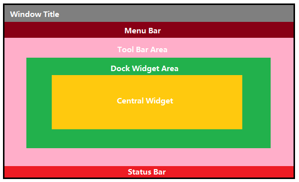
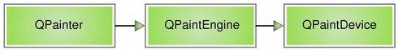

# Qt

## Qt 设计

### 创建资源文件

Qt 资源系统是一个跨平台的资源机制，用于将程序运行时所需要的资源以二进制的形式存储于可执行文件内部。也就是说，如果你将资源以资源文件形式存储，它是会编译到可执行文件内部。其中每个资源文件可以包含前缀（前缀文件夹路径）、语言（方便国际化，不同语言使用不同文件）、文件、别名（方便后期修改文件名）

```xml
<RCC>
    <qresource prefix="/images">
        <file alias="doc-open">document-open.png</file>
    </qresource>
    <qresource prefix="/images/fr" lang="fr">
        <file alias="doc-open">document-open-fr.png</file>
    </qresource>
</RCC>
```

### 创建实例

`QApplication`类的实例，带有QtWidgets 的GUI界面。
`QCoreApplication`类的实例，纯控制台应用程序。
`QGuiApplication`类的实例，不带QtWidgets的GUI界面

### 设计主窗口

#### 预置主窗口

`QMainWindow`主窗口类，由Qt 框架事先预定好的框架，由一个标题栏，一个菜单栏，一个任务栏，若干工具栏和中心工作区组成。



Window Title（标题栏），用于显示窗口标题和控制按钮，如最大化、最小化和关闭按钮。

Menu Bar（菜单栏），用于显示菜单。

Tool Bar Area，用于显示工具条区域，且支持显示多个可拖放（并排，分置...）的工具条。

Dock Widget Area，用于停靠窗口的显示区域。可以像 Photoshop 的工具箱一样，停靠在主窗口的四周，也可以浮动显示。

Central Widget，用于显示程序工作区。

Status Bar（状态栏）。显示某些状态信息，比如浏览器中，鼠标滑过带有链接的文字，你会在底部看到链接的实际 URL。

注意：Qt将菜单项和工具项统一为了一个动作，并定义为`QAction`控件。

##### QAction

setShortcuts：设置快捷键

setStatusTip：被鼠标划过时，状态栏显示提示。

##### 窗口基本设置方法

setWindowTitle()：设置窗口标题

[setTabPosition](https://doc.qt.io/qt-5/qmainwindow.html#setTabPosition)：设置Tab键位置

[setTabShape](https://doc.qt.io/qt-5/qmainwindow.html#tabShape-prop)

[tabPosition](https://doc.qt.io/qt-5/qmainwindow.html#tabPosition)：将停靠部件 _areas_ 的选项卡位置设置为指定的 _tabPosition_。默认情况下，所有停靠区域在底部显示其选项卡。

[tabShape](https://doc.qt.io/qt-5/qmainwindow.html#tabShape-prop)：此属性表示选项卡式停靠部件的选项卡形状。

[documentMode](https://doc.qt.io/qt-5/qmainwindow.html#documentMode-prop)：此属性决定选项卡式停靠部件的选项卡栏是否为文档模式。

[corner](https://doc.qt.io/qt-5/qmainwindow.html#corner)：返回占用指定 corner 的停靠部件区域。

[isAnimated](https://doc.qt.io/qt-5/qmainwindow.html#animated-prop)

[saveState](https://doc.qt.io/qt-5/qmainwindow.html#saveState)：保存界面布局

[restoreState](https://doc.qt.io/qt-5/qmainwindow.html#restoreState)：恢复界面布局

setDockNestingEnabled：使其能上下或者左右排列多个停靠部件。

[setDocumentMode](https://doc.qt.io/qt-5/qmainwindow.html#documentMode-prop)

##### 工具栏区域

[addToolBar](https://doc.qt.io/qt-5/qmainwindow.html#addToolBar)：添加工具栏

[insertToolBar](https://doc.qt.io/qt-5/qmainwindow.html#insertToolBar)：插入工具栏

[removeToolBar](https://doc.qt.io/qt-5/qmainwindow.html#removeToolBar)：移除工具栏

[addToolBarBreak](https://doc.qt.io/qt-5/qmainwindow.html#addToolBarBreak)：使接下来添加的工具栏换至新的一行

[removeToolBarBreak](https://doc.qt.io/qt-5/qmainwindow.html#removeToolBarBreak)：移除一个工具项换行

[insertToolBarBreak](https://doc.qt.io/qt-5/qmainwindow.html#insertToolBarBreak)：添加一个工具栏分隔符

[setIconSize](https://doc.qt.io/qt-5/qmainwindow.html#iconSize-prop)：设置工具栏图标大小

[iconSize](https://doc.qt.io/qt-5/qmainwindow.html#iconSize-prop)：返回工具栏图标大小

[setToolButtonStyle](https://doc.qt.io/qt-5/qmainwindow.html#toolButtonStyle-prop)：设置工具栏图标样式

[toolBarBreak](https://doc.qt.io/qt-5/qmainwindow.html#toolBarBreak)：获取工具栏分隔符

[toolBarArea](https://doc.qt.io/qt-5/qmainwindow.html#toolBarArea)：在主窗口中将 _toolbar_ 添加到指定的 _area_。

[toolButtonStyle](https://doc.qt.io/qt-5/qmainwindow.html#toolButtonStyle-prop)：主窗口的工具栏按钮样式。

##### 菜单栏区域

[setMenuBar](https://doc.qt.io/qt-5/qmainwindow.html#setMenuBar)：建立菜单栏

[setMenuWidget](https://doc.qt.io/qt-5/qmainwindow.html#setMenuWidget)：建立定制的菜单栏

[menuBar](https://doc.qt.io/qt-5/qmainwindow.html#menuBar)：返回主窗口的菜单栏，如果没有菜单栏则会新创建一个

[menuWidget](https://doc.qt.io/qt-5/qmainwindow.html#menuWidget)：返回主窗口的菜单栏。如果尚未构造菜单栏，返回 null。

##### 停靠区域

[addDockWidget](https://doc.qt.io/qt-5/qmainwindow.html#addDockWidget)：添加停靠部件到主窗口

[dockOptions](https://doc.qt.io/qt-5/qmainwindow.html#dockOptions-prop)：该枚举包含指定 [QMainWindow](https://doc.qt.io/qt-5/qmainwindow.html) 停靠行为的标志。

[dockWidgetArea](https://doc.qt.io/qt-5/qmainwindow.html#dockWidgetArea)：控制停靠部件的位置，有上、下、左、右四种

[setCorner](https://doc.qt.io/qt-5/qmainwindow.html#setCorner)：让一个角落属于某个相邻的区域

[isDockNestingEnabled](https://doc.qt.io/qt-5/qmainwindow.html#dockNestingEnabled-prop)：

[removeDockWidget](https://doc.qt.io/qt-5/qmainwindow.html#removeDockWidget)：从主窗口布局中移除 dockwidget并将其隐藏。

[resizeDocks](https://doc.qt.io/qt-5/qmainwindow.html#resizeDocks)：将 docks 列表中的停靠部件调整为 sizes 列表中的相应尺寸（以像素为单位）

[restoreDockWidget](https://doc.qt.io/qt-5/qmainwindow.html#restoreDockWidget)：恢复 dockwidget的状态。

[setDockOptions](https://doc.qt.io/qt-5/qmainwindow.html#dockOptions-prop)：

[splitDockWidget](https://doc.qt.io/qt-5/qmainwindow.html#splitDockWidget)：分割停靠部件 _first_ 为两个停靠部件，第一个部件指针传给 _first_，第二个部件指针传给 _second_。分割停靠部件 _first_ 为两个停靠部件，第一个部件指针传给 _first_，第二个部件指针传给 _second_。

[tabifiedDockWidgets](https://doc.qt.io/qt-5/qmainwindow.html#tabifiedDockWidgets)：返回 _dockwidget_ 内堆叠着的停靠部件。

[tabifyDockWidget](https://doc.qt.io/qt-5/qmainwindow.html#tabifyDockWidget)：将 _second_ 停靠部件移动到 _first_ 停靠部件旁形成一个选项卡式停靠区域。

##### 弹出区域

[createPopupMenu](https://doc.qt.io/qt-5/qmainwindow.html#createPopupMenu)： 建立一个弹出菜单

##### 中心区域

[setCentralWidget](https://doc.qt.io/qt-5/qmainwindow.html#setCentralWidget)：设置窗口中心显示的Widget

[centralWidget](https://doc.qt.io/qt-5/qmainwindow.html#centralWidget)：返回窗口中心的Widget，未设置时返回NULL

[takeCentralWidget](https://doc.qt.io/qt-5/qmainwindow.html#takeCentralWidget)

##### 状态栏

[setStatusBar](https://doc.qt.io/qt-5/qmainwindow.html#setStatusBar)：建立状态栏

[statusBar](https://doc.qt.io/qt-5/qmainwindow.html#statusBar)：获得状态栏对象后，调用状态栏对象的showMessage(message，int timeout=0)方法。显示状态栏信息，其中第一个参数是要显示的状态栏信息，第二个参数是信息停留的时间，单位是毫秒，默认是0，表示一直显示状态栏信息。没有则新建一个状态栏对象。

##### 发出信号函数

[iconSizeChanged](https://doc.qt.io/qt-5/qmainwindow.html#iconSizeChanged)：图标大小改变了

[toolButtonStyleChanged](https://doc.qt.io/qt-5/qmainwindow.html#toolButtonStyleChanged)：工具按钮样式改变了

#### DirectUI（无句柄绘制）

### 程序界面：选定组件布局

所谓 GUI 界面，归根结底，就是一堆组件的叠加，把按钮、图标等放到主窗口中，就成了一个界面。

#### 绝对定位

给出这个组件的坐标和长宽值。这样，Qt 就知道该把组件放在哪里以及如何设置组件的大小。

优点：简单

缺点：
1. 窗口大小变化时，组件大小不变。
2. 正常使用需要禁止用户改变窗口大小。

#### 布局定位

- `QHBoxLayout`：按照水平方向从左到右布局；
- `QVBoxLayout`：按照竖直方向从上到下布局；
- `QGridLayout`：在一个网格中进行布局，类似于 HTML 的 table；
- `QFormLayout`：按照表格布局，每一行前面是一段文本，文本后面跟随一个组件（通常是输入框），类似 HTML 的 form；
- `QStackedLayout`：层叠的布局，允许我们将几个组件按照 Z 轴方向堆叠，可以形成向导那种一页一页的效果。

### 程序界面：选用组件

#### 对话框组件：QDialog

特点：

1. 如果 parent 为 NULL，则该对话框会作为一个顶层窗口，否则则作为其父组件的子对话框（此时，其默认出现的位置是 parent 的中心）。顶层窗口与非顶层窗口的区别在于，顶层窗口在任务栏会有自己的位置，而非顶层窗口则会共享其父组件的位置。
2. 对话框分为模态对话框和非模态对话框。Qt 使用`exec()`实现应用程序级别的模态对话框，`open()`实现窗口级别的模态对话框，`show()`实现非模态对话框。所谓模态对话框，就是会阻塞同一应用程序中其它窗口的输入。比如“打开文件”功能。与此相反的是非模态对话框，例如查找对话框。其中模态对话框分两种级别，应用程序级别的模态和窗口级别的模态，默认是应用程序级别的模态。应用程序级别的模态是指，当该种模态的对话框出现时，用户必须首先对对话框进行交互，直到关闭对话框，然后才能访问程序中其他的窗口。窗口级别的模态是指，该模态仅仅阻塞与对话框关联的窗口，但是依然允许用户与程序中其它窗口交互。窗口级别的模态尤其适用于多窗口模式。
3. dialog分配之后，如果没有被delete，存在内存泄露问题。对于`show()`函数建立的对话框，只可以对dialog设置属性`WA_DeleteOnClose`，让其在Close后，自动销毁对话框。对于`exec()`函数建立的对话框，还可以通过`deleteLater()`函数，设置其在当前事件循环结束时销毁该对话框。
4. 如果想要建立唯一的非模态对话框，可以通过sender()函数接收此对话框的判断对话框状态，控制对话框映射表。

##### 内置对话框组件

- `QColorDialog`：选择颜色；
- `QFileDialog`：选择文件或者目录；
- `QFontDialog`：选择字体；
- `QInputDialog`：允许用户输入一个值，并将其值返回；
- `QMessageBox`：模态对话框，用于显示信息、询问问题等；
- `QPageSetupDialog`：为打印机提供纸张相关的选项；
- `QPrintDialog`：打印机配置；
- `QPrintPreviewDialog`：打印预览；
- `QProgressDialog`：显示操作过程。

#### Qt 绘图系统：QPainter

Qt 的绘图系统允许使用相同的 API 在屏幕和其它打印设备上进行绘制。整个绘图系统基于`QPainter`，`QPainterDevice`和`QPaintEngine`三个类。



`QPainter`：用来执行绘制的操作，理解为画笔；
`QPaintEngine`：提供了画笔（`QPainter`）在不同的设备上进行绘制的统一的接口。
`QPaintDevice`：是一个二维空间的抽象，这个二维空间允许`QPainter`在其上面进行绘制，也就是`QPainter`工作的空间，即画布；

QPainter可以接受一个继承自QPaintDevice的指针作为参数，如`QWidget`、`QPixmap`、`QPicture`、`QImage`和`QPrinter`等，这将作为QPainter的绘制区域。

然后QPainter有很多以 draw 开头的函数，用于各种图形的绘制，比如这里的`drawLine()`，`drawRect()`以及`drawEllipse()`等。

`setPen(QPen(Qt::green, 5))`函数可以设置画笔`QPen`颜色。
`setBrush(Qt::blue)`函数可以设置画刷`QBrush`颜色。

`setRenderHint(QPainter::Antialiasing, true)` 将`Antialiasing`属性（也就是反走样）设置为 true。

##### 画刷

`QBrush`定义了`QPainter`的填充模式，具有样式、颜色、渐变以及纹理等属性。

画刷的`style()`定义了填充的样式。

画刷的`color()`定义了填充模式的颜色。

画刷的`gradient()`定义了渐变填充。

画刷的`texture()`定义了用于填充的纹理。

##### 渐变

Qt内置了三种渐变方式：`QLinearGradient`、`QConicalGradient`和`QRadialGradient`。

线性渐变（`QLinearGradient`），指定起始位置，然后设置起始之间的颜色。

辐射渐变（`QRadialGradient`）

角度渐变（`QConicalGradient`），指定中心点位置和起始角度，然后设置角度间的颜色。

##### 画笔

`QPen`定义了用于`QPainter`应该怎样画线或者轮廓线。画笔具有样式、宽度、画刷、笔帽样式和连接样式等属性。

`style()`定义了线的样式。

`capStyle()`定义了使用绘制的线的末端样式。

`joinStyle()`则定义了两条线如何连接起来。

`width()`或`widthF()`定义了画笔的宽，至少为1像素。

##### Qt 坐标系统

由于`QPaintDeice`是进行绘制的对象，因此，所谓坐标系统，也就是`QPaintDevice`上面的坐标。默认坐标系统位于设备的左上角，也就是坐标原点 (0, 0)。x 轴方向向右；y 轴方向向下。在基于像素的设备上（比如显示器），坐标的默认单位是像素，在打印机上则是点（1/72 英寸）。

在逻辑绘制过程中，坐标系的每个点是无穷小的，因此绘制的曲线也非常理想。但是在实际设备上，像素是最小单位，通常绘制的曲线也并不会是横平竖直的，因此在实际绘制时，Qt 的定义是，绘制点所在像素是逻辑定义点的右下方的像素。

Qt 提供了四种坐标变换：平移 translate，旋转 rotate，缩放 scale 和扭曲 shear。

##### 绘制状态

`QPainter`提供了内置的函数：`save()`和`restore()`。`save()`就是保存下当前状态；`restore()`则恢复上一次保存的结果。这两个函数**必须**成对出现：`QPainter`使用栈来保存数据，每一次`save()`，将当前状态压入栈顶，`restore()`则弹出栈顶进行恢复。

##### 绘制设备（组件）

`QPixmap`、`QBitmap`、`QImage`、`QPicture`、`QWidget`、`QGLWidget`、`QGLFramebufferObject`、`QPrinter`

1. `QPixmap`专门为图像在屏幕上的显示做了优化。


`QPixmap`可以使用`QPainter`直接在上面绘制图形。也可以接受一个字符串作为一个文件的路径来显示文件，比如 png、jpeg 之类的文件。

`drawPixmap()`函数可以把这个文件绘制到一个`QLabel`、`QPushButton`或者其他的组件上面。

`grabWidget()`和`grabWindow()`函数，用于将自身图像绘制到目标上。

2. `QBitmap`是`QPixmap`的一个子类，它的色深限定为1。


色深为 1，也就是使用 1 个二进制位表示颜色。1 个位只有两种状态：0 和 1，因此它所表示的颜色就有两种，黑和白。所以说，`QBitmap`实际上是只有黑白两色的图像数据。由于`QBitmap`色深小，因此只占用很少的存储空间，所以适合做光标文件和笔刷。


3. `QImage`专门为图像的像素级访问做了优化。

`QPixmap`使用底层平台的绘制系统进行绘制，无法提供像素级别的操作，而`QImage`则是使用独立于硬件的绘制系统，实际上是自己绘制自己，因此提供了像素级别的操作，并且能够在不同系统之上提供一个一致的显示形式。

`setPixel()`函数可以进行像素级别的颜色设置。

4. `QPicture`则可以记录和重现`QPainter`的各条命令。
要记录下`QPainter`的命令，首先要使用`QPainter::begin()`函数，将`QPicture`实例作为参数传递进去，以便告诉系统开始记录，记录完毕后使用`QPainter::end()`命令终止。之后可以通过`save("drawing.pic")`和`load()`函数进行命令存储和装载。

#### Qt 图形框架系统：QGraphics

Graphics View 是一个基于元素（item）的 MV 架构的框架。它可以分成三个部分：元素 item、场景 scene 和视图 view。

使用`QPainter`绘图，大多是采用一种面向过程的描述方式：首先使用`drawLine()`画一条直线，然后使用`drawPolygon()`画一个多边形。对于 Graphics View，相同的过程可以是，首先创建一个场景（scene），然后创建一个直线对象和一个多边形对象，再使用场景的`add()`函数，将直线和多边形添加到场景中，最后通过视图进行观察，就可以看到了。

##### 场景 scene

Graphics View 提供了`QGraphicsScene`作为场景，即是允许我们添加图形的空间，相当于整个世界；`QGraphicsView`作为视口，也就是我们的观察窗口，相当于照相机的取景框，这个取景框可以覆盖整个场景，也可以是场景的一部分；

##### 元素 item

`QGraphicsItem`作为图形元件，以便添加到场景中去，Qt 内置了很多图形，比如直线、多边形等，它们都是继承自`QGraphicsItem`。

自定义的`QGraphicsItem`的子类，至少需要重写两个函数：`boundingRect()`和`paint()`。其中`boundingRect()` 返回一个用于包裹住图形元素的矩形，也就是这个图形元素的范围。`paint()`的作用是使用`QPainter`将图形元素绘制出来。


##### 视图 view

# Qt组件

## PySide6.QtCore

提供核心的非GUI功能，如信号和槽间的通信、动画框架、定时器、各个容器类、时间日期类、事件处理、数据IO（数据序列化、JSON）、JSON、插件机制、智能指针、图形（矩形、路径等）、线程、XML 、对象属性查询和设计等。


- [QCoreApplication](https://doc.qt.io/qtforpython-6/PySide6/QtCore/QCoreApplication.html)

- [Connection](https://doc.qt.io/qtforpython-6/PySide6/QtCore/Connection.html)
- [FromBase64Result](https://doc.qt.io/qtforpython-6/PySide6/QtCore/FromBase64Result.html)
- [OffsetData](https://doc.qt.io/qtforpython-6/PySide6/QtCore/OffsetData.html)
- [QAbstractAnimation](https://doc.qt.io/qtforpython-6/PySide6/QtCore/QAbstractAnimation.html)
- [QAbstractEventDispatcher](https://doc.qt.io/qtforpython-6/PySide6/QtCore/QAbstractEventDispatcher.html)
- [QAbstractItemModel](https://doc.qt.io/qtforpython-6/PySide6/QtCore/QAbstractItemModel.html)
- [QAbstractListModel](https://doc.qt.io/qtforpython-6/PySide6/QtCore/QAbstractListModel.html)
- [QAbstractNativeEventFilter](https://doc.qt.io/qtforpython-6/PySide6/QtCore/QAbstractNativeEventFilter.html)
- [QAbstractProxyModel](https://doc.qt.io/qtforpython-6/PySide6/QtCore/QAbstractProxyModel.html)
- [QAbstractTableModel](https://doc.qt.io/qtforpython-6/PySide6/QtCore/QAbstractTableModel.html)
- [QAnimationGroup](https://doc.qt.io/qtforpython-6/PySide6/QtCore/QAnimationGroup.html)
- [QBasicMutex](https://doc.qt.io/qtforpython-6/PySide6/QtCore/QBasicMutex.html)
- [QBasicTimer](https://doc.qt.io/qtforpython-6/PySide6/QtCore/QBasicTimer.html)
- [QBitArray](https://doc.qt.io/qtforpython-6/PySide6/QtCore/QBitArray.html)
- [QBuffer](https://doc.qt.io/qtforpython-6/PySide6/QtCore/QBuffer.html)
- [QByteArray](https://doc.qt.io/qtforpython-6/PySide6/QtCore/QByteArray.html)
- [QByteArrayMatcher](https://doc.qt.io/qtforpython-6/PySide6/QtCore/QByteArrayMatcher.html)
- [QCalendar](https://doc.qt.io/qtforpython-6/PySide6/QtCore/QCalendar.html)
- [QCborArray](https://doc.qt.io/qtforpython-6/PySide6/QtCore/QCborArray.html)
- [QCborError](https://doc.qt.io/qtforpython-6/PySide6/QtCore/QCborError.html)
- [QCborMap](https://doc.qt.io/qtforpython-6/PySide6/QtCore/QCborMap.html)
- [QCborParserError](https://doc.qt.io/qtforpython-6/PySide6/QtCore/QCborParserError.html)
- [QCborStreamReader](https://doc.qt.io/qtforpython-6/PySide6/QtCore/QCborStreamReader.html)
- [QCborStreamWriter](https://doc.qt.io/qtforpython-6/PySide6/QtCore/QCborStreamWriter.html)
- [QCborStringResultByteArray](https://doc.qt.io/qtforpython-6/PySide6/QtCore/QCborStringResultByteArray.html)
- [QCborStringResultString](https://doc.qt.io/qtforpython-6/PySide6/QtCore/QCborStringResultString.html)
- [QCborValue](https://doc.qt.io/qtforpython-6/PySide6/QtCore/QCborValue.html)
- [QChildEvent](https://doc.qt.io/qtforpython-6/PySide6/QtCore/QChildEvent.html)
- [QCollator](https://doc.qt.io/qtforpython-6/PySide6/QtCore/QCollator.html)
- [QCollatorSortKey](https://doc.qt.io/qtforpython-6/PySide6/QtCore/QCollatorSortKey.html)
- [QCommandLineOption](https://doc.qt.io/qtforpython-6/PySide6/QtCore/QCommandLineOption.html)
- [QCommandLineParser](https://doc.qt.io/qtforpython-6/PySide6/QtCore/QCommandLineParser.html)
- [QConcatenateTablesProxyModel](https://doc.qt.io/qtforpython-6/PySide6/QtCore/QConcatenateTablesProxyModel.html)
- [QCryptographicHash](https://doc.qt.io/qtforpython-6/PySide6/QtCore/QCryptographicHash.html)
- [QDataStream](https://doc.qt.io/qtforpython-6/PySide6/QtCore/QDataStream.html)
- [QDate](https://doc.qt.io/qtforpython-6/PySide6/QtCore/QDate.html)
- [QDateTime](https://doc.qt.io/qtforpython-6/PySide6/QtCore/QDateTime.html)
- [QDeadlineTimer](https://doc.qt.io/qtforpython-6/PySide6/QtCore/QDeadlineTimer.html)
- [QDir](https://doc.qt.io/qtforpython-6/PySide6/QtCore/QDir.html)
- [QDirIterator](https://doc.qt.io/qtforpython-6/PySide6/QtCore/QDirIterator.html)
- [QDynamicPropertyChangeEvent](https://doc.qt.io/qtforpython-6/PySide6/QtCore/QDynamicPropertyChangeEvent.html)
- [QEasingCurve](https://doc.qt.io/qtforpython-6/PySide6/QtCore/QEasingCurve.html)
- [QElapsedTimer](https://doc.qt.io/qtforpython-6/PySide6/QtCore/QElapsedTimer.html)
- [QEvent](https://doc.qt.io/qtforpython-6/PySide6/QtCore/QEvent.html)
- [QEventLoop](https://doc.qt.io/qtforpython-6/PySide6/QtCore/QEventLoop.html)
- [QFactoryInterface](https://doc.qt.io/qtforpython-6/PySide6/QtCore/QFactoryInterface.html)
- [QFile](https://doc.qt.io/qtforpython-6/PySide6/QtCore/QFile.html)
- [QFileDevice](https://doc.qt.io/qtforpython-6/PySide6/QtCore/QFileDevice.html)
- [QFileInfo](https://doc.qt.io/qtforpython-6/PySide6/QtCore/QFileInfo.html)
- [QFileSelector](https://doc.qt.io/qtforpython-6/PySide6/QtCore/QFileSelector.html)
- [QFileSystemWatcher](https://doc.qt.io/qtforpython-6/PySide6/QtCore/QFileSystemWatcher.html)
- [QFutureInterfaceBase](https://doc.qt.io/qtforpython-6/PySide6/QtCore/QFutureInterfaceBase.html)
- [QGenericArgument](https://doc.qt.io/qtforpython-6/PySide6/QtCore/QGenericArgument.html)
- [QGenericReturnArgument](https://doc.qt.io/qtforpython-6/PySide6/QtCore/QGenericReturnArgument.html)
- [QIODevice](https://doc.qt.io/qtforpython-6/PySide6/QtCore/QIODevice.html)
- [QIODeviceBase](https://doc.qt.io/qtforpython-6/PySide6/QtCore/QIODeviceBase.html)
- [QIdentityProxyModel](https://doc.qt.io/qtforpython-6/PySide6/QtCore/QIdentityProxyModel.html)
- [QItemSelection](https://doc.qt.io/qtforpython-6/PySide6/QtCore/QItemSelection.html)
- [QItemSelectionModel](https://doc.qt.io/qtforpython-6/PySide6/QtCore/QItemSelectionModel.html)
- [QItemSelectionRange](https://doc.qt.io/qtforpython-6/PySide6/QtCore/QItemSelectionRange.html)
- [QJsonArray](https://doc.qt.io/qtforpython-6/PySide6/QtCore/QJsonArray.html)
- [QJsonDocument](https://doc.qt.io/qtforpython-6/PySide6/QtCore/QJsonDocument.html)
- [QJsonParseError](https://doc.qt.io/qtforpython-6/PySide6/QtCore/QJsonParseError.html)
- [QJsonValue](https://doc.qt.io/qtforpython-6/PySide6/QtCore/QJsonValue.html)
- [QKeyCombination](https://doc.qt.io/qtforpython-6/PySide6/QtCore/QKeyCombination.html)
- [QLibrary](https://doc.qt.io/qtforpython-6/PySide6/QtCore/QLibrary.html)
- [QLibraryInfo](https://doc.qt.io/qtforpython-6/PySide6/QtCore/QLibraryInfo.html)
- [QLine](https://doc.qt.io/qtforpython-6/PySide6/QtCore/QLine.html)
- [QLineF](https://doc.qt.io/qtforpython-6/PySide6/QtCore/QLineF.html)
- [QLocale](https://doc.qt.io/qtforpython-6/PySide6/QtCore/QLocale.html)
- [QLockFile](https://doc.qt.io/qtforpython-6/PySide6/QtCore/QLockFile.html)
- [QMargins](https://doc.qt.io/qtforpython-6/PySide6/QtCore/QMargins.html)
- [QMarginsF](https://doc.qt.io/qtforpython-6/PySide6/QtCore/QMarginsF.html)
- [QMessageAuthenticationCode](https://doc.qt.io/qtforpython-6/PySide6/QtCore/QMessageAuthenticationCode.html)
- [QMessageLogContext](https://doc.qt.io/qtforpython-6/PySide6/QtCore/QMessageLogContext.html)
- [QMetaClassInfo](https://doc.qt.io/qtforpython-6/PySide6/QtCore/QMetaClassInfo.html)
- [QMetaEnum](https://doc.qt.io/qtforpython-6/PySide6/QtCore/QMetaEnum.html)
- [QMetaMethod](https://doc.qt.io/qtforpython-6/PySide6/QtCore/QMetaMethod.html)
- [QMetaObject](https://doc.qt.io/qtforpython-6/PySide6/QtCore/QMetaObject.html)
- [QMetaProperty](https://doc.qt.io/qtforpython-6/PySide6/QtCore/QMetaProperty.html)
- [QMetaType](https://doc.qt.io/qtforpython-6/PySide6/QtCore/QMetaType.html)
- [QMimeData](https://doc.qt.io/qtforpython-6/PySide6/QtCore/QMimeData.html)
- [QMimeDatabase](https://doc.qt.io/qtforpython-6/PySide6/QtCore/QMimeDatabase.html)
- [QMimeType](https://doc.qt.io/qtforpython-6/PySide6/QtCore/QMimeType.html)
- [QModelIndex](https://doc.qt.io/qtforpython-6/PySide6/QtCore/QModelIndex.html)
- [QModelRoleData](https://doc.qt.io/qtforpython-6/PySide6/QtCore/QModelRoleData.html)
- [QMutex](https://doc.qt.io/qtforpython-6/PySide6/QtCore/QMutex.html)
- [QObject](https://doc.qt.io/qtforpython-6/PySide6/QtCore/QObject.html)
- [QOperatingSystemVersion](https://doc.qt.io/qtforpython-6/PySide6/QtCore/QOperatingSystemVersion.html)
- [QOperatingSystemVersionBase](https://doc.qt.io/qtforpython-6/PySide6/QtCore/QOperatingSystemVersionBase.html)
- [QParallelAnimationGroup](https://doc.qt.io/qtforpython-6/PySide6/QtCore/QParallelAnimationGroup.html)
- [QPauseAnimation](https://doc.qt.io/qtforpython-6/PySide6/QtCore/QPauseAnimation.html)
- [QPersistentModelIndex](https://doc.qt.io/qtforpython-6/PySide6/QtCore/QPersistentModelIndex.html)
- [QPluginLoader](https://doc.qt.io/qtforpython-6/PySide6/QtCore/QPluginLoader.html)
- [QPoint](https://doc.qt.io/qtforpython-6/PySide6/QtCore/QPoint.html)
- [QPointF](https://doc.qt.io/qtforpython-6/PySide6/QtCore/QPointF.html)
- [QProcess](https://doc.qt.io/qtforpython-6/PySide6/QtCore/QProcess.html)
- [QProcessEnvironment](https://doc.qt.io/qtforpython-6/PySide6/QtCore/QProcessEnvironment.html)
- [QPropertyAnimation](https://doc.qt.io/qtforpython-6/PySide6/QtCore/QPropertyAnimation.html)
- [QRandomGenerator](https://doc.qt.io/qtforpython-6/PySide6/QtCore/QRandomGenerator.html)
- [QRandomGenerator64](https://doc.qt.io/qtforpython-6/PySide6/QtCore/QRandomGenerator64.html)
- [QReadLocker](https://doc.qt.io/qtforpython-6/PySide6/QtCore/QReadLocker.html)
- [QReadWriteLock](https://doc.qt.io/qtforpython-6/PySide6/QtCore/QReadWriteLock.html)
- [QRect](https://doc.qt.io/qtforpython-6/PySide6/QtCore/QRect.html)
- [QRectF](https://doc.qt.io/qtforpython-6/PySide6/QtCore/QRectF.html)
- [QRecursiveMutex](https://doc.qt.io/qtforpython-6/PySide6/QtCore/QRecursiveMutex.html)
- [QRegularExpression](https://doc.qt.io/qtforpython-6/PySide6/QtCore/QRegularExpression.html)
- [QRegularExpressionMatch](https://doc.qt.io/qtforpython-6/PySide6/QtCore/QRegularExpressionMatch.html)
- [QRegularExpressionMatchIterator](https://doc.qt.io/qtforpython-6/PySide6/QtCore/QRegularExpressionMatchIterator.html)
- [QResource](https://doc.qt.io/qtforpython-6/PySide6/QtCore/QResource.html)
- [QRunnable](https://doc.qt.io/qtforpython-6/PySide6/QtCore/QRunnable.html)
- [QSaveFile](https://doc.qt.io/qtforpython-6/PySide6/QtCore/QSaveFile.html)
- [QSemaphore](https://doc.qt.io/qtforpython-6/PySide6/QtCore/QSemaphore.html)
- [QSemaphoreReleaser](https://doc.qt.io/qtforpython-6/PySide6/QtCore/QSemaphoreReleaser.html)
- [QSequentialAnimationGroup](https://doc.qt.io/qtforpython-6/PySide6/QtCore/QSequentialAnimationGroup.html)
- [QSettings](https://doc.qt.io/qtforpython-6/PySide6/QtCore/QSettings.html)
- [QSharedMemory](https://doc.qt.io/qtforpython-6/PySide6/QtCore/QSharedMemory.html)
- [QSignalBlocker](https://doc.qt.io/qtforpython-6/PySide6/QtCore/QSignalBlocker.html)
- [QSignalMapper](https://doc.qt.io/qtforpython-6/PySide6/QtCore/QSignalMapper.html)
- [QSize](https://doc.qt.io/qtforpython-6/PySide6/QtCore/QSize.html)
- [QSizeF](https://doc.qt.io/qtforpython-6/PySide6/QtCore/QSizeF.html)
- [QSocketDescriptor](https://doc.qt.io/qtforpython-6/PySide6/QtCore/QSocketDescriptor.html)
- [QSocketNotifier](https://doc.qt.io/qtforpython-6/PySide6/QtCore/QSocketNotifier.html)
- [QSortFilterProxyModel](https://doc.qt.io/qtforpython-6/PySide6/QtCore/QSortFilterProxyModel.html)
- [QStandardPaths](https://doc.qt.io/qtforpython-6/PySide6/QtCore/QStandardPaths.html)
- [QStorageInfo](https://doc.qt.io/qtforpython-6/PySide6/QtCore/QStorageInfo.html)
- [QStringConverter](https://doc.qt.io/qtforpython-6/PySide6/QtCore/QStringConverter.html)
- [QStringConverterBase](https://doc.qt.io/qtforpython-6/PySide6/QtCore/QStringConverterBase.html)
- [QStringDecoder](https://doc.qt.io/qtforpython-6/PySide6/QtCore/QStringDecoder.html)
- [QStringEncoder](https://doc.qt.io/qtforpython-6/PySide6/QtCore/QStringEncoder.html)
- [QStringListModel](https://doc.qt.io/qtforpython-6/PySide6/QtCore/QStringListModel.html)
- [QSysInfo](https://doc.qt.io/qtforpython-6/PySide6/QtCore/QSysInfo.html)
- [QSystemSemaphore](https://doc.qt.io/qtforpython-6/PySide6/QtCore/QSystemSemaphore.html)
- [QTemporaryDir](https://doc.qt.io/qtforpython-6/PySide6/QtCore/QTemporaryDir.html)
- [QTemporaryFile](https://doc.qt.io/qtforpython-6/PySide6/QtCore/QTemporaryFile.html)
- [QTextBoundaryFinder](https://doc.qt.io/qtforpython-6/PySide6/QtCore/QTextBoundaryFinder.html)
- [QTextStream](https://doc.qt.io/qtforpython-6/PySide6/QtCore/QTextStream.html)
- [QTextStreamManipulator](https://doc.qt.io/qtforpython-6/PySide6/QtCore/QTextStreamManipulator.html)
- [QThread](https://doc.qt.io/qtforpython-6/PySide6/QtCore/QThread.html)
- [QThreadPool](https://doc.qt.io/qtforpython-6/PySide6/QtCore/QThreadPool.html)
- [QTime](https://doc.qt.io/qtforpython-6/PySide6/QtCore/QTime.html)
- [QTimeLine](https://doc.qt.io/qtforpython-6/PySide6/QtCore/QTimeLine.html)
- [QTimeZone](https://doc.qt.io/qtforpython-6/PySide6/QtCore/QTimeZone.html)
- [QTimer](https://doc.qt.io/qtforpython-6/PySide6/QtCore/QTimer.html)
- [QTimerEvent](https://doc.qt.io/qtforpython-6/PySide6/QtCore/QTimerEvent.html)
- [QTranslator](https://doc.qt.io/qtforpython-6/PySide6/QtCore/QTranslator.html)
- [QTransposeProxyModel](https://doc.qt.io/qtforpython-6/PySide6/QtCore/QTransposeProxyModel.html)
- [QUrl](https://doc.qt.io/qtforpython-6/PySide6/QtCore/QUrl.html)
- [QUrlQuery](https://doc.qt.io/qtforpython-6/PySide6/QtCore/QUrlQuery.html)
- [QUuid](https://doc.qt.io/qtforpython-6/PySide6/QtCore/QUuid.html)
- [QVariantAnimation](https://doc.qt.io/qtforpython-6/PySide6/QtCore/QVariantAnimation.html)
- [QVersionNumber](https://doc.qt.io/qtforpython-6/PySide6/QtCore/QVersionNumber.html)
- [QWaitCondition](https://doc.qt.io/qtforpython-6/PySide6/QtCore/QWaitCondition.html)
- [QWriteLocker](https://doc.qt.io/qtforpython-6/PySide6/QtCore/QWriteLocker.html)
- [QXmlStreamAttribute](https://doc.qt.io/qtforpython-6/PySide6/QtCore/QXmlStreamAttribute.html)
- [QXmlStreamAttributes](https://doc.qt.io/qtforpython-6/PySide6/QtCore/QXmlStreamAttributes.html)
- [QXmlStreamEntityDeclaration](https://doc.qt.io/qtforpython-6/PySide6/QtCore/QXmlStreamEntityDeclaration.html)
- [QXmlStreamEntityResolver](https://doc.qt.io/qtforpython-6/PySide6/QtCore/QXmlStreamEntityResolver.html)
- [QXmlStreamNamespaceDeclaration](https://doc.qt.io/qtforpython-6/PySide6/QtCore/QXmlStreamNamespaceDeclaration.html)
- [QXmlStreamNotationDeclaration](https://doc.qt.io/qtforpython-6/PySide6/QtCore/QXmlStreamNotationDeclaration.html)
- [QXmlStreamReader](https://doc.qt.io/qtforpython-6/PySide6/QtCore/QXmlStreamReader.html)
- [QXmlStreamWriter](https://doc.qt.io/qtforpython-6/PySide6/QtCore/QXmlStreamWriter.html)
- [Qt](https://doc.qt.io/qtforpython-6/PySide6/QtCore/Qt.html)
- [State](https://doc.qt.io/qtforpython-6/PySide6/QtCore/State.html)
- [SystemId](https://doc.qt.io/qtforpython-6/PySide6/QtCore/SystemId.html)
- [TimerInfo](https://doc.qt.io/qtforpython-6/PySide6/QtCore/TimerInfo.html)
- [YearMonthDay](https://doc.qt.io/qtforpython-6/PySide6/QtCore/YearMonthDay.html)
- [ClassInfo](https://doc.qt.io/qtforpython-6/PySide6/QtCore/ClassInfo.html)
- [Property](https://doc.qt.io/qtforpython-6/PySide6/QtCore/Property.html)
- [QEnum/QFlag](https://doc.qt.io/qtforpython-6/PySide6/QtCore/QEnum.html)
- [Signal](https://doc.qt.io/qtforpython-6/PySide6/QtCore/Signal.html)
- [Slot](https://doc.qt.io/qtforpython-6/PySide6/QtCore/Slot.html)

## PySide6.QtWidgets

提供了一些窗口界面组件，比如按钮、单选框、一些图形元素等。

### Shiboken.Object

#### [QColormap](https://doc.qt.io/qtforpython-6/PySide6/QtWidgets/QColormap.html)

将QColor像素值(与设备无关, 逻辑像素)与设备相关的像素值(硬件像素)相关联

#### [QGestureRecognizer](https://doc.qt.io/qtforpython-6/PySide6/QtWidgets/QGestureRecognizer.html)

#### [QGraphicsItem](https://doc.qt.io/qtforpython-6/PySide6/QtWidgets/QGraphicsItem.html)

-- | - [QGraphicsPixmapItem](https://doc.qt.io/qtforpython-6/PySide6/QtWidgets/QGraphicsPixmapItem.html)
-- | - [QGraphicsLineItem](https://doc.qt.io/qtforpython-6/PySide6/QtWidgets/QGraphicsLineItem.html)
-- | - [QGraphicsItemGroup](https://doc.qt.io/qtforpython-6/PySide6/QtWidgets/QGraphicsItemGroup.html)
-- | - [QAbstractGraphicsShapeItem](https://doc.qt.io/qtforpython-6/PySide6/QtWidgets/QAbstractGraphicsShapeItem.html)
---- | - [QGraphicsSimpleTextItem](https://doc.qt.io/qtforpython-6/PySide6/QtWidgets/QGraphicsSimpleTextItem.html)
---- | - [QGraphicsRectItem](https://doc.qt.io/qtforpython-6/PySide6/QtWidgets/QGraphicsRectItem.html)
---- | - [QGraphicsPolygonItem](https://doc.qt.io/qtforpython-6/PySide6/QtWidgets/QGraphicsPolygonItem.html)
---- | - [QGraphicsPathItem](https://doc.qt.io/qtforpython-6/PySide6/QtWidgets/QGraphicsPathItem.html)
---- | - [QGraphicsEllipseItem](https://doc.qt.io/qtforpython-6/PySide6/QtWidgets/QGraphicsEllipseItem.html)
-- | - [QGraphicsObject](https://doc.qt.io/qtforpython-6/PySide6/QtWidgets/QGraphicsObject.html)
---- | - [QGraphicsWidget](https://doc.qt.io/qtforpython-6/PySide6/QtWidgets/QGraphicsWidget.html)
------ | - [QGraphicsProxyWidget](https://doc.qt.io/qtforpython-6/PySide6/QtWidgets/QGraphicsProxyWidget.html)
---- | - [QGraphicsTextItem](https://doc.qt.io/qtforpython-6/PySide6/QtWidgets/QGraphicsTextItem.html)

#### [QGraphicsLayoutItem](https://doc.qt.io/qtforpython-6/PySide6/QtWidgets/QGraphicsLayoutItem.html)

-- | - [QGraphicsLayout](https://doc.qt.io/qtforpython-6/PySide6/QtWidgets/QGraphicsLayout.html)
---- | - [QGraphicsLinearLayout](https://doc.qt.io/qtforpython-6/PySide6/QtWidgets/QGraphicsLinearLayout.html)
---- | - [QGraphicsGridLayout](https://doc.qt.io/qtforpython-6/PySide6/QtWidgets/QGraphicsGridLayout.html)
---- | - [QGraphicsAnchorLayout](https://doc.qt.io/qtforpython-6/PySide6/QtWidgets/QGraphicsAnchorLayout.html)
-- | - [QGraphicsWidget](https://doc.qt.io/qtforpython-6/PySide6/QtWidgets/QGraphicsWidget.html)
---- | - [QGraphicsProxyWidget](https://doc.qt.io/qtforpython-6/PySide6/QtWidgets/QGraphicsProxyWidget.html)

#### [QItemEditorCreatorBase](https://doc.qt.io/qtforpython-6/PySide6/QtWidgets/QItemEditorCreatorBase.html)

#### [QItemEditorFactory](https://doc.qt.io/qtforpython-6/PySide6/QtWidgets/QItemEditorFactory.html)

#### [QLayoutItem](https://doc.qt.io/qtforpython-6/PySide6/QtWidgets/QLayoutItem.html)

-- | - [QSpacerItem](https://doc.qt.io/qtforpython-6/PySide6/QtWidgets/QSpacerItem.html)
-- | - [QWidgetItem](https://doc.qt.io/qtforpython-6/PySide6/QtWidgets/QWidgetItem.html)
-- | - [QLayout](https://doc.qt.io/qtforpython-6/PySide6/QtWidgets/QLayout.html)
---- | - [QStackedLayout](https://doc.qt.io/qtforpython-6/PySide6/QtWidgets/QStackedLayout.html)
---- | - [QGridLayout](https://doc.qt.io/qtforpython-6/PySide6/QtWidgets/QGridLayout.html)
---- | - [QFormLayout](https://doc.qt.io/qtforpython-6/PySide6/QtWidgets/QFormLayout.html)
---- | - [QBoxLayout](https://doc.qt.io/qtforpython-6/PySide6/QtWidgets/QBoxLayout.html)
------ | - [QVBoxLayout](https://doc.qt.io/qtforpython-6/PySide6/QtWidgets/QVBoxLayout.html)
------ | - [QHBoxLayout](https://doc.qt.io/qtforpython-6/PySide6/QtWidgets/QHBoxLayout.html)

#### [QListWidgetItem](https://doc.qt.io/qtforpython-6/PySide6/QtWidgets/QListWidgetItem.html)

#### [QScrollerProperties](https://doc.qt.io/qtforpython-6/PySide6/QtWidgets/QScrollerProperties.html)

#### [QSizePolicy](https://doc.qt.io/qtforpython-6/PySide6/QtWidgets/QSizePolicy.html)

#### [QStyleFactory](https://doc.qt.io/qtforpython-6/PySide6/QtWidgets/QStyleFactory.html)

#### [QStyleHintReturn](https://doc.qt.io/qtforpython-6/PySide6/QtWidgets/QStyleHintReturn.html)

-- | - [QStyleHintReturnVariant](https://doc.qt.io/qtforpython-6/PySide6/QtWidgets/QStyleHintReturnVariant.html)
-- | - [QStyleHintReturnMask](https://doc.qt.io/qtforpython-6/PySide6/QtWidgets/QStyleHintReturnMask.html)

#### [QStyleOption](https://doc.qt.io/qtforpython-6/PySide6/QtWidgets/QStyleOption.html)

-- | - [QStyleOptionViewItem](https://doc.qt.io/qtforpython-6/PySide6/QtWidgets/QStyleOptionViewItem.html)
-- | - [QStyleOptionToolBox](https://doc.qt.io/qtforpython-6/PySide6/QtWidgets/QStyleOptionToolBox.html)
-- | - [QStyleOptionToolBar](https://doc.qt.io/qtforpython-6/PySide6/QtWidgets/QStyleOptionToolBar.html)
-- | - [QStyleOptionTabWidgetFrame](https://doc.qt.io/qtforpython-6/PySide6/QtWidgets/QStyleOptionTabWidgetFrame.html)
-- | - [QStyleOptionTabBarBase](https://doc.qt.io/qtforpython-6/PySide6/QtWidgets/QStyleOptionTabBarBase.html)
-- | - [QStyleOptionTab](https://doc.qt.io/qtforpython-6/PySide6/QtWidgets/QStyleOptionTab.html)
-- | - [QStyleOptionRubberBand](https://doc.qt.io/qtforpython-6/PySide6/QtWidgets/QStyleOptionRubberBand.html)
-- | - [QStyleOptionProgressBar](https://doc.qt.io/qtforpython-6/PySide6/QtWidgets/QStyleOptionProgressBar.html)
-- | - [QStyleOptionMenuItem](https://doc.qt.io/qtforpython-6/PySide6/QtWidgets/QStyleOptionMenuItem.html)
-- | - [QStyleOptionHeader](https://doc.qt.io/qtforpython-6/PySide6/QtWidgets/QStyleOptionHeader.html)
---- | - [QStyleOptionHeaderV2](https://doc.qt.io/qtforpython-6/PySide6/QtWidgets/QStyleOptionHeaderV2.html)
-- | - [QStyleOptionGraphicsItem](https://doc.qt.io/qtforpython-6/PySide6/QtWidgets/QStyleOptionGraphicsItem.html)
-- | - [QStyleOptionFrame](https://doc.qt.io/qtforpython-6/PySide6/QtWidgets/QStyleOptionFrame.html)
-- | - [QStyleOptionFocusRect](https://doc.qt.io/qtforpython-6/PySide6/QtWidgets/QStyleOptionFocusRect.html)
-- | - [QStyleOptionDockWidget](https://doc.qt.io/qtforpython-6/PySide6/QtWidgets/QStyleOptionDockWidget.html)
-- | - [QStyleOptionComplex](https://doc.qt.io/qtforpython-6/PySide6/QtWidgets/QStyleOptionComplex.html)
---- | - [QStyleOptionToolButton](https://doc.qt.io/qtforpython-6/PySide6/QtWidgets/QStyleOptionToolButton.html)
---- | - [QStyleOptionTitleBar](https://doc.qt.io/qtforpython-6/PySide6/QtWidgets/QStyleOptionTitleBar.html)
---- | - [QStyleOptionSpinBox](https://doc.qt.io/qtforpython-6/PySide6/QtWidgets/QStyleOptionSpinBox.html)
---- | - [QStyleOptionSlider](https://doc.qt.io/qtforpython-6/PySide6/QtWidgets/QStyleOptionSlider.html)
---- | - [QStyleOptionSizeGrip](https://doc.qt.io/qtforpython-6/PySide6/QtWidgets/QStyleOptionSizeGrip.html)
---- | - [QStyleOptionGroupBox](https://doc.qt.io/qtforpython-6/PySide6/QtWidgets/QStyleOptionGroupBox.html)
---- | - [QStyleOptionComboBox](https://doc.qt.io/qtforpython-6/PySide6/QtWidgets/QStyleOptionComboBox.html)
-- | - [QStyleOptionButton](https://doc.qt.io/qtforpython-6/PySide6/QtWidgets/QStyleOptionButton.html)

#### [QTableWidgetItem](https://doc.qt.io/qtforpython-6/PySide6/QtWidgets/QTableWidgetItem.html)

#### [QTableWidgetSelectionRange](https://doc.qt.io/qtforpython-6/PySide6/QtWidgets/QTableWidgetSelectionRange.html)

#### [QTileRules](https://doc.qt.io/qtforpython-6/PySide6/QtWidgets/QTileRules.html)

#### [QToolTip](https://doc.qt.io/qtforpython-6/PySide6/QtWidgets/QToolTip.html)

#### [QTreeWidgetItem](https://doc.qt.io/qtforpython-6/PySide6/QtWidgets/QTreeWidgetItem.html)

#### [QTreeWidgetItemIterator](https://doc.qt.io/qtforpython-6/PySide6/QtWidgets/QTreeWidgetItemIterator.html)

#### [QWhatsThis](https://doc.qt.io/qtforpython-6/PySide6/QtWidgets/QWhatsThis.html)

### QtCore

#### [QAbstractItemDelegate](https://doc.qt.io/qtforpython-6/PySide6/QtWidgets/QAbstractItemDelegate.html)

-- | - [QStyledItemDelegate](https://doc.qt.io/qtforpython-6/PySide6/QtWidgets/QStyledItemDelegate.html)
-- | - [QItemDelegate](https://doc.qt.io/qtforpython-6/PySide6/QtWidgets/QItemDelegate.html)

#### [QButtonGroup](https://doc.qt.io/qtforpython-6/PySide6/QtWidgets/QButtonGroup.html)

#### [QCompleter](https://doc.qt.io/qtforpython-6/PySide6/QtWidgets/QCompleter.html)

#### [QDataWidgetMapper](https://doc.qt.io/qtforpython-6/PySide6/QtWidgets/QDataWidgetMapper.html)

#### [QFileSystemModel](https://doc.qt.io/qtforpython-6/PySide6/QtWidgets/QFileSystemModel.html)

#### [QGesture](https://doc.qt.io/qtforpython-6/PySide6/QtWidgets/QGesture.html)

-- | - [QTapGesture](https://doc.qt.io/qtforpython-6/PySide6/QtWidgets/QTapGesture.html)
-- | - [QTapAndHoldGesture](https://doc.qt.io/qtforpython-6/PySide6/QtWidgets/QTapAndHoldGesture.html)
-- | - [QSwipeGesture](https://doc.qt.io/qtforpython-6/PySide6/QtWidgets/QSwipeGesture.html)
-- | - [QPinchGesture](https://doc.qt.io/qtforpython-6/PySide6/QtWidgets/QPinchGesture.html)
-- | - [QPanGesture](https://doc.qt.io/qtforpython-6/PySide6/QtWidgets/QPanGesture.html)

#### [QGestureEvent](https://doc.qt.io/qtforpython-6/PySide6/QtWidgets/QGestureEvent.html)

#### [QGraphicsAnchor](https://doc.qt.io/qtforpython-6/PySide6/QtWidgets/QGraphicsAnchor.html)

#### [QGraphicsEffect](https://doc.qt.io/qtforpython-6/PySide6/QtWidgets/QGraphicsEffect.html)

-- | - [QGraphicsOpacityEffect](https://doc.qt.io/qtforpython-6/PySide6/QtWidgets/QGraphicsOpacityEffect.html)
-- | - [QGraphicsDropShadowEffect](https://doc.qt.io/qtforpython-6/PySide6/QtWidgets/QGraphicsDropShadowEffect.html)
-- | - [QGraphicsColorizeEffect](https://doc.qt.io/qtforpython-6/PySide6/QtWidgets/QGraphicsColorizeEffect.html)
-- | - [QGraphicsBlurEffect](https://doc.qt.io/qtforpython-6/PySide6/QtWidgets/QGraphicsBlurEffect.html)

#### [QGraphicsItemAnimation](https://doc.qt.io/qtforpython-6/PySide6/QtWidgets/QGraphicsItemAnimation.html)

#### [QGraphicsScene](https://doc.qt.io/qtforpython-6/PySide6/QtWidgets/QGraphicsScene.html)

#### [QGraphicsSceneEvent](https://doc.qt.io/qtforpython-6/PySide6/QtWidgets/QGraphicsSceneEvent.html)

-- | - [QGraphicsSceneWheelEvent](https://doc.qt.io/qtforpython-6/PySide6/QtWidgets/QGraphicsSceneWheelEvent.html)
-- | - [QGraphicsSceneResizeEvent](https://doc.qt.io/qtforpython-6/PySide6/QtWidgets/QGraphicsSceneResizeEvent.html)
-- | - [QGraphicsSceneMoveEvent](https://doc.qt.io/qtforpython-6/PySide6/QtWidgets/QGraphicsSceneMoveEvent.html)
-- | - [QGraphicsSceneMouseEvent](https://doc.qt.io/qtforpython-6/PySide6/QtWidgets/QGraphicsSceneMouseEvent.html)
-- | - [QGraphicsSceneHoverEvent](https://doc.qt.io/qtforpython-6/PySide6/QtWidgets/QGraphicsSceneHoverEvent.html)
-- | - [QGraphicsSceneHelpEvent](https://doc.qt.io/qtforpython-6/PySide6/QtWidgets/QGraphicsSceneHelpEvent.html)
-- | PySide6.QtWidgets.- [QGraphicsSceneDragDropEvent](https://doc.qt.io/qtforpython-6/PySide6/QtWidgets/QGraphicsSceneDragDropEvent.html)
-- | - [QGraphicsSceneContextMenuEvent](https://doc.qt.io/qtforpython-6/PySide6/QtWidgets/QGraphicsSceneContextMenuEvent.html)

#### [QGraphicsTransform](https://doc.qt.io/qtforpython-6/PySide6/QtWidgets/QGraphicsTransform.html)

-- | - [QGraphicsScale](https://doc.qt.io/qtforpython-6/PySide6/QtWidgets/QGraphicsScale.html)
-- | - [QGraphicsRotation](https://doc.qt.io/qtforpython-6/PySide6/QtWidgets/QGraphicsRotation.html)

#### [QScroller](https://doc.qt.io/qtforpython-6/PySide6/QtWidgets/QScroller.html)

#### [QStyle](https://doc.qt.io/qtforpython-6/PySide6/QtWidgets/QStyle.html)

-- | - [QCommonStyle](https://doc.qt.io/qtforpython-6/PySide6/QtWidgets/QCommonStyle.html)
---- | - [QProxyStyle](https://doc.qt.io/qtforpython-6/PySide6/QtWidgets/QProxyStyle.html)

#### [QSystemTrayIcon](https://doc.qt.io/qtforpython-6/PySide6/QtWidgets/QSystemTrayIcon.html)

#### [QWidget](https://doc.qt.io/qtforpython-6/PySide6/QtWidgets/QWidget.html)

-- | - [QWizardPage](https://doc.qt.io/qtforpython-6/PySide6/QtWidgets/QWizardPage.html)
-- | - [QToolBar](https://doc.qt.io/qtforpython-6/PySide6/QtWidgets/QToolBar.html)
-- | - [QTabWidget](https://doc.qt.io/qtforpython-6/PySide6/QtWidgets/QTabWidget.html)
-- | - [QTabBar](https://doc.qt.io/qtforpython-6/PySide6/QtWidgets/QTabBar.html)
-- | - [QStatusBar](https://doc.qt.io/qtforpython-6/PySide6/QtWidgets/QStatusBar.html)
-- | - [QSplitterHandle](https://doc.qt.io/qtforpython-6/PySide6/QtWidgets/QSplitterHandle.html)
-- | - [QSplashScreen](https://doc.qt.io/qtforpython-6/PySide6/QtWidgets/QSplashScreen.html)
-- | - [QSizeGrip](https://doc.qt.io/qtforpython-6/PySide6/QtWidgets/QSizeGrip.html)
-- | - [QRubberBand](https://doc.qt.io/qtforpython-6/PySide6/QtWidgets/QRubberBand.html)
-- | - [QProgressBar](https://doc.qt.io/qtforpython-6/PySide6/QtWidgets/QProgressBar.html)
-- | - [QMenuBar](https://doc.qt.io/qtforpython-6/PySide6/QtWidgets/QMenuBar.html)
-- | - [QMenu](https://doc.qt.io/qtforpython-6/PySide6/QtWidgets/QMenu.html)
-- | - [QMdiSubWindow](https://doc.qt.io/qtforpython-6/PySide6/QtWidgets/QMdiSubWindow.html)
-- | - [QMainWindow](https://doc.qt.io/qtforpython-6/PySide6/QtWidgets/QMainWindow.html)
-- | - [QLineEdit](https://doc.qt.io/qtforpython-6/PySide6/QtWidgets/QLineEdit.html)
-- | - [QKeySequenceEdit](https://doc.qt.io/qtforpython-6/PySide6/QtWidgets/QKeySequenceEdit.html)
-- | - [QGroupBox](https://doc.qt.io/qtforpython-6/PySide6/QtWidgets/QGroupBox.html)
-- | - [QFrame](https://doc.qt.io/qtforpython-6/PySide6/QtWidgets/QFrame.html)
---- | - [QToolBox](https://doc.qt.io/qtforpython-6/PySide6/QtWidgets/QToolBox.html)
---- | - [QStackedWidget](https://doc.qt.io/qtforpython-6/PySide6/QtWidgets/QStackedWidget.html)
---- | - [QSplitter](https://doc.qt.io/qtforpython-6/PySide6/QtWidgets/QSplitter.html)
---- | - [QLabel](https://doc.qt.io/qtforpython-6/PySide6/QtWidgets/QLabel.html)
---- | - [QLCDNumber](https://doc.qt.io/qtforpython-6/PySide6/QtWidgets/QLCDNumber.html)
---- | - [QAbstractScrollArea](https://doc.qt.io/qtforpython-6/PySide6/QtWidgets/QAbstractScrollArea.html)
------ | - [QTextEdit](https://doc.qt.io/qtforpython-6/PySide6/QtWidgets/QTextEdit.html)
-------- | - [QTextBrowser](https://doc.qt.io/qtforpython-6/PySide6/QtWidgets/QTextBrowser.html)
------ | - [QScrollArea](https://doc.qt.io/qtforpython-6/PySide6/QtWidgets/QScrollArea.html)
------ | - [QPlainTextEdit](https://doc.qt.io/qtforpython-6/PySide6/QtWidgets/QPlainTextEdit.html)
------ | - [QMdiArea](https://doc.qt.io/qtforpython-6/PySide6/QtWidgets/QMdiArea.html)
------ | - [QGraphicsView](https://doc.qt.io/qtforpython-6/PySide6/QtWidgets/QGraphicsView.html)
------ | - [QAbstractItemView](https://doc.qt.io/qtforpython-6/PySide6/QtWidgets/QAbstractItemView.html)
-------- | - [QTreeView](https://doc.qt.io/qtforpython-6/PySide6/QtWidgets/QTreeView.html)
---------- | - [QTreeWidget](https://doc.qt.io/qtforpython-6/PySide6/QtWidgets/QTreeWidget.html)
-------- | - [QTableView](https://doc.qt.io/qtforpython-6/PySide6/QtWidgets/QTableView.html)
---------- | - [QTableWidget](https://doc.qt.io/qtforpython-6/PySide6/QtWidgets/QTableWidget.html)
-------- | - [QListView](https://doc.qt.io/qtforpython-6/PySide6/QtWidgets/QListView.html)
---------- | - [QUndoView](https://doc.qt.io/qtforpython-6/PySide6/QtWidgets/QUndoView.html)
---------- | - [QListWidget](https://doc.qt.io/qtforpython-6/PySide6/QtWidgets/QListWidget.html)
-------- | - [QHeaderView](https://doc.qt.io/qtforpython-6/PySide6/QtWidgets/QHeaderView.html)
-------- | - [QColumnView](https://doc.qt.io/qtforpython-6/PySide6/QtWidgets/QColumnView.html)
-- | - [QFocusFrame](https://doc.qt.io/qtforpython-6/PySide6/QtWidgets/QFocusFrame.html)
-- | - [QDockWidget](https://doc.qt.io/qtforpython-6/PySide6/QtWidgets/QDockWidget.html)
-- | - [QDialogButtonBox](https://doc.qt.io/qtforpython-6/PySide6/QtWidgets/QDialogButtonBox.html)
-- | - [QDialog](https://doc.qt.io/qtforpython-6/PySide6/QtWidgets/QDialog.html)
---- | - [QWizard](https://doc.qt.io/qtforpython-6/PySide6/QtWidgets/QWizard.html)
---- | - [QProgressDialog](https://doc.qt.io/qtforpython-6/PySide6/QtWidgets/QProgressDialog.html)
---- | - [QMessageBox](https://doc.qt.io/qtforpython-6/PySide6/QtWidgets/QMessageBox.html)
---- | - [QInputDialog](https://doc.qt.io/qtforpython-6/PySide6/QtWidgets/QInputDialog.html)
---- | - [QFontDialog](https://doc.qt.io/qtforpython-6/PySide6/QtWidgets/QFontDialog.html)
---- | - [QErrorMessage](https://doc.qt.io/qtforpython-6/PySide6/QtWidgets/QErrorMessage.html)
---- | - [QColorDialog](https://doc.qt.io/qtforpython-6/PySide6/QtWidgets/QColorDialog.html)
---- | - [QFileDialog](https://doc.qt.io/qtforpython-6/PySide6/QtWidgets/QFileDialog.html)
-- | - [QComboBox](https://doc.qt.io/qtforpython-6/PySide6/QtWidgets/QComboBox.html)
---- | - [QFontComboBox](https://doc.qt.io/qtforpython-6/PySide6/QtWidgets/QFontComboBox.html)
-- | - [QCalendarWidget](https://doc.qt.io/qtforpython-6/PySide6/QtWidgets/QCalendarWidget.html)
-- | - [QAbstractSpinBox](https://doc.qt.io/qtforpython-6/PySide6/QtWidgets/QAbstractSpinBox.html)
---- | - [QSpinBox](https://doc.qt.io/qtforpython-6/PySide6/QtWidgets/QSpinBox.html)
	只能输入数字的输入框
---- | - [QDoubleSpinBox](https://doc.qt.io/qtforpython-6/PySide6/QtWidgets/QDoubleSpinBox.html)
---- | - [QDateTimeEdit](https://doc.qt.io/qtforpython-6/PySide6/QtWidgets/QDateTimeEdit.html)
------ | - [QTimeEdit](https://doc.qt.io/qtforpython-6/PySide6/QtWidgets/QTimeEdit.html)
------ | - [QDateEdit](https://doc.qt.io/qtforpython-6/PySide6/QtWidgets/QDateEdit.html)
-- | - [QAbstractSlider](https://doc.qt.io/qtforpython-6/PySide6/QtWidgets/QAbstractSlider.html)
---- | - [QSlider](https://doc.qt.io/qtforpython-6/PySide6/QtWidgets/QSlider.html)
	带有滑块的滑动条
---- | - [QScrollBar](https://doc.qt.io/qtforpython-6/PySide6/QtWidgets/QScrollBar.html)
---- | - [QDial](https://doc.qt.io/qtforpython-6/PySide6/QtWidgets/QDial.html)
-- | - [QAbstractButton](https://doc.qt.io/qtforpython-6/PySide6/QtWidgets/QAbstractButton.html)
---- | - [QToolButton](https://doc.qt.io/qtforpython-6/PySide6/QtWidgets/QToolButton.html)
---- | - [QRadioButton](https://doc.qt.io/qtforpython-6/PySide6/QtWidgets/QRadioButton.html)
---- | - [QPushButton](https://doc.qt.io/qtforpython-6/PySide6/QtWidgets/QPushButton.html)
------ | - [QCommandLinkButton](https://doc.qt.io/qtforpython-6/PySide6/QtWidgets/QCommandLinkButton.html)
---- | - [QCheckBox](https://doc.qt.io/qtforpython-6/PySide6/QtWidgets/QCheckBox.html)

### QtGui

- [QAccessibleWidget](https://doc.qt.io/qtforpython-6/PySide6/QtWidgets/QAccessibleWidget.html)

- [QApplication](https://doc.qt.io/qtforpython-6/PySide6/QtWidgets/QApplication.html)

- [QFileIconProvider](https://doc.qt.io/qtforpython-6/PySide6/QtWidgets/QFileIconProvider.html)

- [QPlainTextDocumentLayout](https://doc.qt.io/qtforpython-6/PySide6/QtWidgets/QPlainTextDocumentLayout.html)

- [QStylePainter](https://doc.qt.io/qtforpython-6/PySide6/QtWidgets/QStylePainter.html)

- [QWidgetAction](https://doc.qt.io/qtforpython-6/PySide6/QtWidgets/QWidgetAction.html)

### Box

- [QBoxPlotLegendMarker](https://doc.qt.io/qtforpython-6/PySide6/QtCharts/QBoxPlotLegendMarker.html)
- [QBoxPlotModelMapper](https://doc.qt.io/qtforpython-6/PySide6/QtCharts/QBoxPlotModelMapper.html)
- [QBoxPlotSeries](https://doc.qt.io/qtforpython-6/PySide6/QtCharts/QBoxPlotSeries.html)
- [QBoxSet](https://doc.qt.io/qtforpython-6/PySide6/QtCharts/QBoxSet.html)
- [QHBoxPlotModelMapper](https://doc.qt.io/qtforpython-6/PySide6/QtCharts/QHBoxPlotModelMapper.html)
- [QVBoxPlotModelMapper](https://doc.qt.io/qtforpython-6/PySide6/QtCharts/QVBoxPlotModelMapper.html)

### 窗口分布模式

- [QTextLayout](https://doc.qt.io/qtforpython-6/PySide6/QtGui/QTextLayout.html)
- [QPageLayout](https://doc.qt.io/qtforpython-6/PySide6/QtGui/QPageLayout.html)
- [QAbstractTextDocumentLayout](https://doc.qt.io/qtforpython-6/PySide6/QtGui/QAbstractTextDocumentLayout.html)

## PySide6.QtGui

提供 GUI 程序的基本功能，包括与窗口系统的集成、事件处理、OpenGL 和 OpenGL ES （3D）集成、2D 图像、字体、拖放等。

Qt Gui 模块提供的是所有图形用户界面程序都需要的通用功能。

- [QGuiApplication](https://doc.qt.io/qtforpython-6/PySide6/QtGui/QGuiApplication.html)
不带QtWidgets的GUI界面 (QGuiApplication)

- [Attribute](https://doc.qt.io/qtforpython-6/PySide6/QtGui/Attribute.html)
- [Element](https://doc.qt.io/qtforpython-6/PySide6/QtGui/Element.html)
- [FormatRange](https://doc.qt.io/qtforpython-6/PySide6/QtGui/FormatRange.html)
- [Key](https://doc.qt.io/qtforpython-6/PySide6/QtGui/Key.html)
- [PaintContext](https://doc.qt.io/qtforpython-6/PySide6/QtGui/PaintContext.html)
- [PixmapFragment](https://doc.qt.io/qtforpython-6/PySide6/QtGui/PixmapFragment.html)
- [QAbstractFileIconProvider](https://doc.qt.io/qtforpython-6/PySide6/QtGui/QAbstractFileIconProvider.html)

- [QAccessible](https://doc.qt.io/qtforpython-6/PySide6/QtGui/QAccessible.html)
- [QAccessibleActionInterface](https://doc.qt.io/qtforpython-6/PySide6/QtGui/QAccessibleActionInterface.html)
- [QAccessibleEditableTextInterface](https://doc.qt.io/qtforpython-6/PySide6/QtGui/QAccessibleEditableTextInterface.html)
- [QAccessibleEvent](https://doc.qt.io/qtforpython-6/PySide6/QtGui/QAccessibleEvent.html)
- [QAccessibleInterface](https://doc.qt.io/qtforpython-6/PySide6/QtGui/QAccessibleInterface.html)
- [QAccessibleObject](https://doc.qt.io/qtforpython-6/PySide6/QtGui/QAccessibleObject.html)
- [QAccessibleStateChangeEvent](https://doc.qt.io/qtforpython-6/PySide6/QtGui/QAccessibleStateChangeEvent.html)
- [QAccessibleTableCellInterface](https://doc.qt.io/qtforpython-6/PySide6/QtGui/QAccessibleTableCellInterface.html)
- [QAccessibleTableModelChangeEvent](https://doc.qt.io/qtforpython-6/PySide6/QtGui/QAccessibleTableModelChangeEvent.html)
- [QAccessibleTextCursorEvent](https://doc.qt.io/qtforpython-6/PySide6/QtGui/QAccessibleTextCursorEvent.html)
- [QAccessibleTextInsertEvent](https://doc.qt.io/qtforpython-6/PySide6/QtGui/QAccessibleTextInsertEvent.html)
- [QAccessibleTextInterface](https://doc.qt.io/qtforpython-6/PySide6/QtGui/QAccessibleTextInterface.html)
- [QAccessibleTextRemoveEvent](https://doc.qt.io/qtforpython-6/PySide6/QtGui/QAccessibleTextRemoveEvent.html)
- [QAccessibleTextSelectionEvent](https://doc.qt.io/qtforpython-6/PySide6/QtGui/QAccessibleTextSelectionEvent.html)
- [QAccessibleTextUpdateEvent](https://doc.qt.io/qtforpython-6/PySide6/QtGui/QAccessibleTextUpdateEvent.html)
- [QAccessibleValueChangeEvent](https://doc.qt.io/qtforpython-6/PySide6/QtGui/QAccessibleValueChangeEvent.html)
- [QAccessibleValueInterface](https://doc.qt.io/qtforpython-6/PySide6/QtGui/QAccessibleValueInterface.html)
- [QAction](https://doc.qt.io/qtforpython-6/PySide6/QtGui/QAction.html)
- [QActionEvent](https://doc.qt.io/qtforpython-6/PySide6/QtGui/QActionEvent.html)
- [QActionGroup](https://doc.qt.io/qtforpython-6/PySide6/QtGui/QActionGroup.html)
- [QBackingStore](https://doc.qt.io/qtforpython-6/PySide6/QtGui/QBackingStore.html)
- [QBitmap](https://doc.qt.io/qtforpython-6/PySide6/QtGui/QBitmap.html)
- [QBrush](https://doc.qt.io/qtforpython-6/PySide6/QtGui/QBrush.html)
- [QClipboard](https://doc.qt.io/qtforpython-6/PySide6/QtGui/QClipboard.html)
- [QCloseEvent](https://doc.qt.io/qtforpython-6/PySide6/QtGui/QCloseEvent.html)
- [QColor](https://doc.qt.io/qtforpython-6/PySide6/QtGui/QColor.html)
- [QColorConstants](https://doc.qt.io/qtforpython-6/PySide6/QtGui/QColorConstants.html)
- [QColorSpace](https://doc.qt.io/qtforpython-6/PySide6/QtGui/QColorSpace.html)
- [QColorTransform](https://doc.qt.io/qtforpython-6/PySide6/QtGui/QColorTransform.html)
- [QConicalGradient](https://doc.qt.io/qtforpython-6/PySide6/QtGui/QConicalGradient.html)
- [QContextMenuEvent](https://doc.qt.io/qtforpython-6/PySide6/QtGui/QContextMenuEvent.html)
- [QCursor](https://doc.qt.io/qtforpython-6/PySide6/QtGui/QCursor.html)
- [QDesktopServices](https://doc.qt.io/qtforpython-6/PySide6/QtGui/QDesktopServices.html)
- [QDoubleValidator](https://doc.qt.io/qtforpython-6/PySide6/QtGui/QDoubleValidator.html)
- [QDrag](https://doc.qt.io/qtforpython-6/PySide6/QtGui/QDrag.html)
- [QDragEnterEvent](https://doc.qt.io/qtforpython-6/PySide6/QtGui/QDragEnterEvent.html)
- [QDragLeaveEvent](https://doc.qt.io/qtforpython-6/PySide6/QtGui/QDragLeaveEvent.html)
- [QDragMoveEvent](https://doc.qt.io/qtforpython-6/PySide6/QtGui/QDragMoveEvent.html)
- [QDropEvent](https://doc.qt.io/qtforpython-6/PySide6/QtGui/QDropEvent.html)
- [QEnterEvent](https://doc.qt.io/qtforpython-6/PySide6/QtGui/QEnterEvent.html)
- [QEventPoint](https://doc.qt.io/qtforpython-6/PySide6/QtGui/QEventPoint.html)
- [QExposeEvent](https://doc.qt.io/qtforpython-6/PySide6/QtGui/QExposeEvent.html)
- [QFileOpenEvent](https://doc.qt.io/qtforpython-6/PySide6/QtGui/QFileOpenEvent.html)
- [QFocusEvent](https://doc.qt.io/qtforpython-6/PySide6/QtGui/QFocusEvent.html)
- [QFont](https://doc.qt.io/qtforpython-6/PySide6/QtGui/QFont.html)
- [QFontDatabase](https://doc.qt.io/qtforpython-6/PySide6/QtGui/QFontDatabase.html)
- [QFontInfo](https://doc.qt.io/qtforpython-6/PySide6/QtGui/QFontInfo.html)
- [QFontMetrics](https://doc.qt.io/qtforpython-6/PySide6/QtGui/QFontMetrics.html)
- [QFontMetricsF](https://doc.qt.io/qtforpython-6/PySide6/QtGui/QFontMetricsF.html)
- [QGlyphRun](https://doc.qt.io/qtforpython-6/PySide6/QtGui/QGlyphRun.html)
- [QGradient](https://doc.qt.io/qtforpython-6/PySide6/QtGui/QGradient.html)

- [QHelpEvent](https://doc.qt.io/qtforpython-6/PySide6/QtGui/QHelpEvent.html)
- [QHideEvent](https://doc.qt.io/qtforpython-6/PySide6/QtGui/QHideEvent.html)
- [QHoverEvent](https://doc.qt.io/qtforpython-6/PySide6/QtGui/QHoverEvent.html)
- [QIcon](https://doc.qt.io/qtforpython-6/PySide6/QtGui/QIcon.html)
- [QIconDragEvent](https://doc.qt.io/qtforpython-6/PySide6/QtGui/QIconDragEvent.html)
- [QIconEngine](https://doc.qt.io/qtforpython-6/PySide6/QtGui/QIconEngine.html)
- [QImage](https://doc.qt.io/qtforpython-6/PySide6/QtGui/QImage.html)
- [QImageIOHandler](https://doc.qt.io/qtforpython-6/PySide6/QtGui/QImageIOHandler.html)
- [QImageReader](https://doc.qt.io/qtforpython-6/PySide6/QtGui/QImageReader.html)
- [QImageWriter](https://doc.qt.io/qtforpython-6/PySide6/QtGui/QImageWriter.html)
- [QInputDevice](https://doc.qt.io/qtforpython-6/PySide6/QtGui/QInputDevice.html)
- [QInputEvent](https://doc.qt.io/qtforpython-6/PySide6/QtGui/QInputEvent.html)
- [QInputMethod](https://doc.qt.io/qtforpython-6/PySide6/QtGui/QInputMethod.html)
- [QInputMethodEvent](https://doc.qt.io/qtforpython-6/PySide6/QtGui/QInputMethodEvent.html)
- [QInputMethodQueryEvent](https://doc.qt.io/qtforpython-6/PySide6/QtGui/QInputMethodQueryEvent.html)
- [QIntValidator](https://doc.qt.io/qtforpython-6/PySide6/QtGui/QIntValidator.html)
- [QKeyEvent](https://doc.qt.io/qtforpython-6/PySide6/QtGui/QKeyEvent.html)
- [QKeySequence](https://doc.qt.io/qtforpython-6/PySide6/QtGui/QKeySequence.html)
- [QLinearGradient](https://doc.qt.io/qtforpython-6/PySide6/QtGui/QLinearGradient.html)
- [QMatrix2x2](https://doc.qt.io/qtforpython-6/PySide6/QtGui/QMatrix2x2.html)
- [QMatrix2x3](https://doc.qt.io/qtforpython-6/PySide6/QtGui/QMatrix2x3.html)
- [QMatrix2x4](https://doc.qt.io/qtforpython-6/PySide6/QtGui/QMatrix2x4.html)
- [QMatrix3x2](https://doc.qt.io/qtforpython-6/PySide6/QtGui/QMatrix3x2.html)
- [QMatrix3x3](https://doc.qt.io/qtforpython-6/PySide6/QtGui/QMatrix3x3.html)
- [QMatrix3x4](https://doc.qt.io/qtforpython-6/PySide6/QtGui/QMatrix3x4.html)
- [QMatrix4x2](https://doc.qt.io/qtforpython-6/PySide6/QtGui/QMatrix4x2.html)
- [QMatrix4x3](https://doc.qt.io/qtforpython-6/PySide6/QtGui/QMatrix4x3.html)
- [QMatrix4x4](https://doc.qt.io/qtforpython-6/PySide6/QtGui/QMatrix4x4.html)
- [QMouseEvent](https://doc.qt.io/qtforpython-6/PySide6/QtGui/QMouseEvent.html)
- [QMoveEvent](https://doc.qt.io/qtforpython-6/PySide6/QtGui/QMoveEvent.html)
- [QMovie](https://doc.qt.io/qtforpython-6/PySide6/QtGui/QMovie.html)
- [QNativeGestureEvent](https://doc.qt.io/qtforpython-6/PySide6/QtGui/QNativeGestureEvent.html)
- [QOffscreenSurface](https://doc.qt.io/qtforpython-6/PySide6/QtGui/QOffscreenSurface.html)
- [QOpenGLContext](https://doc.qt.io/qtforpython-6/PySide6/QtGui/QOpenGLContext.html)
- [QOpenGLContextGroup](https://doc.qt.io/qtforpython-6/PySide6/QtGui/QOpenGLContextGroup.html)
- [QOpenGLExtraFunctions](https://doc.qt.io/qtforpython-6/PySide6/QtGui/QOpenGLExtraFunctions.html)
- [QOpenGLFunctions](https://doc.qt.io/qtforpython-6/PySide6/QtGui/QOpenGLFunctions.html)

- [QPageRanges](https://doc.qt.io/qtforpython-6/PySide6/QtGui/QPageRanges.html)
- [QPageSize](https://doc.qt.io/qtforpython-6/PySide6/QtGui/QPageSize.html)
- [QPagedPaintDevice](https://doc.qt.io/qtforpython-6/PySide6/QtGui/QPagedPaintDevice.html)
- [QPaintDevice](https://doc.qt.io/qtforpython-6/PySide6/QtGui/QPaintDevice.html)
- [QPaintDeviceWindow](https://doc.qt.io/qtforpython-6/PySide6/QtGui/QPaintDeviceWindow.html)
- [QPaintEngine](https://doc.qt.io/qtforpython-6/PySide6/QtGui/QPaintEngine.html)
- [QPaintEngineState](https://doc.qt.io/qtforpython-6/PySide6/QtGui/QPaintEngineState.html)
- [QPaintEvent](https://doc.qt.io/qtforpython-6/PySide6/QtGui/QPaintEvent.html)
- [QPainter](https://doc.qt.io/qtforpython-6/PySide6/QtGui/QPainter.html)
- [QPainterPath](https://doc.qt.io/qtforpython-6/PySide6/QtGui/QPainterPath.html)
- [QPainterPathStroker](https://doc.qt.io/qtforpython-6/PySide6/QtGui/QPainterPathStroker.html)
- [QPalette](https://doc.qt.io/qtforpython-6/PySide6/QtGui/QPalette.html)
- [QPdfWriter](https://doc.qt.io/qtforpython-6/PySide6/QtGui/QPdfWriter.html)
- [QPen](https://doc.qt.io/qtforpython-6/PySide6/QtGui/QPen.html)
- [QPicture](https://doc.qt.io/qtforpython-6/PySide6/QtGui/QPicture.html)
- [QPixelFormat](https://doc.qt.io/qtforpython-6/PySide6/QtGui/QPixelFormat.html)
- [QPixmap](https://doc.qt.io/qtforpython-6/PySide6/QtGui/QPixmap.html)
- [QPixmapCache](https://doc.qt.io/qtforpython-6/PySide6/QtGui/QPixmapCache.html)
- [QPlatformSurfaceEvent](https://doc.qt.io/qtforpython-6/PySide6/QtGui/QPlatformSurfaceEvent.html)
- [QPointerEvent](https://doc.qt.io/qtforpython-6/PySide6/QtGui/QPointerEvent.html)
- [QPointingDevice](https://doc.qt.io/qtforpython-6/PySide6/QtGui/QPointingDevice.html)
- [QPointingDeviceUniqueId](https://doc.qt.io/qtforpython-6/PySide6/QtGui/QPointingDeviceUniqueId.html)
- [QPolygon](https://doc.qt.io/qtforpython-6/PySide6/QtGui/QPolygon.html)
- [QPolygonF](https://doc.qt.io/qtforpython-6/PySide6/QtGui/QPolygonF.html)
- [QQuaternion](https://doc.qt.io/qtforpython-6/PySide6/QtGui/QQuaternion.html)
- [QRadialGradient](https://doc.qt.io/qtforpython-6/PySide6/QtGui/QRadialGradient.html)
- [QRasterWindow](https://doc.qt.io/qtforpython-6/PySide6/QtGui/QRasterWindow.html)
- [QRawFont](https://doc.qt.io/qtforpython-6/PySide6/QtGui/QRawFont.html)
- [QRegion](https://doc.qt.io/qtforpython-6/PySide6/QtGui/QRegion.html)
- [QRegularExpressionValidator](https://doc.qt.io/qtforpython-6/PySide6/QtGui/QRegularExpressionValidator.html)
- [QResizeEvent](https://doc.qt.io/qtforpython-6/PySide6/QtGui/QResizeEvent.html)
- [QRgba64](https://doc.qt.io/qtforpython-6/PySide6/QtGui/QRgba64.html)
- [QScreen](https://doc.qt.io/qtforpython-6/PySide6/QtGui/QScreen.html)
- [QScrollEvent](https://doc.qt.io/qtforpython-6/PySide6/QtGui/QScrollEvent.html)
- [QScrollPrepareEvent](https://doc.qt.io/qtforpython-6/PySide6/QtGui/QScrollPrepareEvent.html)
- [QSessionManager](https://doc.qt.io/qtforpython-6/PySide6/QtGui/QSessionManager.html)
- [QShortcut](https://doc.qt.io/qtforpython-6/PySide6/QtGui/QShortcut.html)
- [QShortcutEvent](https://doc.qt.io/qtforpython-6/PySide6/QtGui/QShortcutEvent.html)
- [QShowEvent](https://doc.qt.io/qtforpython-6/PySide6/QtGui/QShowEvent.html)
- [QSinglePointEvent](https://doc.qt.io/qtforpython-6/PySide6/QtGui/QSinglePointEvent.html)
- [QStandardItem](https://doc.qt.io/qtforpython-6/PySide6/QtGui/QStandardItem.html)
- [QStandardItemModel](https://doc.qt.io/qtforpython-6/PySide6/QtGui/QStandardItemModel.html)
- [QStaticText](https://doc.qt.io/qtforpython-6/PySide6/QtGui/QStaticText.html)
- [QStatusTipEvent](https://doc.qt.io/qtforpython-6/PySide6/QtGui/QStatusTipEvent.html)
- [QStyleHints](https://doc.qt.io/qtforpython-6/PySide6/QtGui/QStyleHints.html)
- [QSurface](https://doc.qt.io/qtforpython-6/PySide6/QtGui/QSurface.html)
- [QSurfaceFormat](https://doc.qt.io/qtforpython-6/PySide6/QtGui/QSurfaceFormat.html)
- [QSyntaxHighlighter](https://doc.qt.io/qtforpython-6/PySide6/QtGui/QSyntaxHighlighter.html)
- [QTabletEvent](https://doc.qt.io/qtforpython-6/PySide6/QtGui/QTabletEvent.html)
- [QTextBlock](https://doc.qt.io/qtforpython-6/PySide6/QtGui/QTextBlock.html)
- [QTextBlockFormat](https://doc.qt.io/qtforpython-6/PySide6/QtGui/QTextBlockFormat.html)
- [QTextBlockGroup](https://doc.qt.io/qtforpython-6/PySide6/QtGui/QTextBlockGroup.html)
- [QTextBlockUserData](https://doc.qt.io/qtforpython-6/PySide6/QtGui/QTextBlockUserData.html)
- [QTextCharFormat](https://doc.qt.io/qtforpython-6/PySide6/QtGui/QTextCharFormat.html)
- [QTextCursor](https://doc.qt.io/qtforpython-6/PySide6/QtGui/QTextCursor.html)
- [QTextDocument](https://doc.qt.io/qtforpython-6/PySide6/QtGui/QTextDocument.html)
- [QTextDocumentFragment](https://doc.qt.io/qtforpython-6/PySide6/QtGui/QTextDocumentFragment.html)
- [QTextDocumentWriter](https://doc.qt.io/qtforpython-6/PySide6/QtGui/QTextDocumentWriter.html)
- [QTextFormat](https://doc.qt.io/qtforpython-6/PySide6/QtGui/QTextFormat.html)
- [QTextFragment](https://doc.qt.io/qtforpython-6/PySide6/QtGui/QTextFragment.html)
- [QTextFrame](https://doc.qt.io/qtforpython-6/PySide6/QtGui/QTextFrame.html)
- [QTextFrameFormat](https://doc.qt.io/qtforpython-6/PySide6/QtGui/QTextFrameFormat.html)
- [QTextImageFormat](https://doc.qt.io/qtforpython-6/PySide6/QtGui/QTextImageFormat.html)
- [QTextInlineObject](https://doc.qt.io/qtforpython-6/PySide6/QtGui/QTextInlineObject.html)
- [QTextItem](https://doc.qt.io/qtforpython-6/PySide6/QtGui/QTextItem.html)

- [QTextLength](https://doc.qt.io/qtforpython-6/PySide6/QtGui/QTextLength.html)
- [QTextLine](https://doc.qt.io/qtforpython-6/PySide6/QtGui/QTextLine.html)
- [QTextList](https://doc.qt.io/qtforpython-6/PySide6/QtGui/QTextList.html)
- [QTextListFormat](https://doc.qt.io/qtforpython-6/PySide6/QtGui/QTextListFormat.html)
- [QTextObject](https://doc.qt.io/qtforpython-6/PySide6/QtGui/QTextObject.html)
- [QTextObjectInterface](https://doc.qt.io/qtforpython-6/PySide6/QtGui/QTextObjectInterface.html)
- [QTextOption](https://doc.qt.io/qtforpython-6/PySide6/QtGui/QTextOption.html)
- [QTextTable](https://doc.qt.io/qtforpython-6/PySide6/QtGui/QTextTable.html)
- [QTextTableCell](https://doc.qt.io/qtforpython-6/PySide6/QtGui/QTextTableCell.html)
- [QTextTableCellFormat](https://doc.qt.io/qtforpython-6/PySide6/QtGui/QTextTableCellFormat.html)
- [QTextTableFormat](https://doc.qt.io/qtforpython-6/PySide6/QtGui/QTextTableFormat.html)
- [QToolBarChangeEvent](https://doc.qt.io/qtforpython-6/PySide6/QtGui/QToolBarChangeEvent.html)
- [QTouchEvent](https://doc.qt.io/qtforpython-6/PySide6/QtGui/QTouchEvent.html)
- [QTransform](https://doc.qt.io/qtforpython-6/PySide6/QtGui/QTransform.html)
- [QUndoCommand](https://doc.qt.io/qtforpython-6/PySide6/QtGui/QUndoCommand.html)
- [QUndoGroup](https://doc.qt.io/qtforpython-6/PySide6/QtGui/QUndoGroup.html)
- [QUndoStack](https://doc.qt.io/qtforpython-6/PySide6/QtGui/QUndoStack.html)
- [QValidator](https://doc.qt.io/qtforpython-6/PySide6/QtGui/QValidator.html)
- [QVector2D](https://doc.qt.io/qtforpython-6/PySide6/QtGui/QVector2D.html)
- [QVector3D](https://doc.qt.io/qtforpython-6/PySide6/QtGui/QVector3D.html)
- [QVector4D](https://doc.qt.io/qtforpython-6/PySide6/QtGui/QVector4D.html)
- [QWhatsThisClickedEvent](https://doc.qt.io/qtforpython-6/PySide6/QtGui/QWhatsThisClickedEvent.html)
- [QWheelEvent](https://doc.qt.io/qtforpython-6/PySide6/QtGui/QWheelEvent.html)
- [QWindow](https://doc.qt.io/qtforpython-6/PySide6/QtGui/QWindow.html)
- [QWindowStateChangeEvent](https://doc.qt.io/qtforpython-6/PySide6/QtGui/QWindowStateChangeEvent.html)
- [Qt](https://doc.qt.io/qtforpython-6/PySide6/QtGui/Qt.html)
- [Range](https://doc.qt.io/qtforpython-6/PySide6/QtGui/Range.html)
- [ScaledPixmapArgument](https://doc.qt.io/qtforpython-6/PySide6/QtGui/ScaledPixmapArgument.html)
- [Selection](https://doc.qt.io/qtforpython-6/PySide6/QtGui/Selection.html)
- [State](https://doc.qt.io/qtforpython-6/PySide6/QtGui/State.html)
- [Svg](https://doc.qt.io/qtforpython-6/PySide6/QtGui/Svg.html)
- [Tab](https://doc.qt.io/qtforpython-6/PySide6/QtGui/Tab.html)
- [iterator](https://doc.qt.io/qtforpython-6/PySide6/QtGui/iterator.html)
- [iterator](https://doc.qt.io/qtforpython-6/PySide6/QtGui/iterator.html)

## PySide6.QtQml

与Qml文件进行交互的基本工具

## PySide6.QtCharts

- [QAbstractAxis](https://doc.qt.io/qtforpython-6/PySide6/QtCharts/QAbstractAxis.html)
- [QAbstractBarSeries](https://doc.qt.io/qtforpython-6/PySide6/QtCharts/QAbstractBarSeries.html)
- [QAbstractSeries](https://doc.qt.io/qtforpython-6/PySide6/QtCharts/QAbstractSeries.html)
- [QAreaLegendMarker](https://doc.qt.io/qtforpython-6/PySide6/QtCharts/QAreaLegendMarker.html)
- [QAreaSeries](https://doc.qt.io/qtforpython-6/PySide6/QtCharts/QAreaSeries.html)
- [QBarCategoryAxis](https://doc.qt.io/qtforpython-6/PySide6/QtCharts/QBarCategoryAxis.html)
- [QBarLegendMarker](https://doc.qt.io/qtforpython-6/PySide6/QtCharts/QBarLegendMarker.html)
- [QBarModelMapper](https://doc.qt.io/qtforpython-6/PySide6/QtCharts/QBarModelMapper.html)
- [QBarSeries](https://doc.qt.io/qtforpython-6/PySide6/QtCharts/QBarSeries.html)
- [QBarSet](https://doc.qt.io/qtforpython-6/PySide6/QtCharts/QBarSet.html)


- [QCandlestickLegendMarker](https://doc.qt.io/qtforpython-6/PySide6/QtCharts/QCandlestickLegendMarker.html)
- [QCandlestickModelMapper](https://doc.qt.io/qtforpython-6/PySide6/QtCharts/QCandlestickModelMapper.html)
- [QCandlestickSeries](https://doc.qt.io/qtforpython-6/PySide6/QtCharts/QCandlestickSeries.html)
- [QCandlestickSet](https://doc.qt.io/qtforpython-6/PySide6/QtCharts/QCandlestickSet.html)
- [QCategoryAxis](https://doc.qt.io/qtforpython-6/PySide6/QtCharts/QCategoryAxis.html)
- [QChart](https://doc.qt.io/qtforpython-6/PySide6/QtCharts/QChart.html)
- [QChartView](https://doc.qt.io/qtforpython-6/PySide6/QtCharts/QChartView.html)
- [QDateTimeAxis](https://doc.qt.io/qtforpython-6/PySide6/QtCharts/QDateTimeAxis.html)
- [QHBarModelMapper](https://doc.qt.io/qtforpython-6/PySide6/QtCharts/QHBarModelMapper.html)


- [QHCandlestickModelMapper](https://doc.qt.io/qtforpython-6/PySide6/QtCharts/QHCandlestickModelMapper.html)
- [QHPieModelMapper](https://doc.qt.io/qtforpython-6/PySide6/QtCharts/QHPieModelMapper.html)
- [QHXYModelMapper](https://doc.qt.io/qtforpython-6/PySide6/QtCharts/QHXYModelMapper.html)
- [QHorizontalBarSeries](https://doc.qt.io/qtforpython-6/PySide6/QtCharts/QHorizontalBarSeries.html)
- [QHorizontalPercentBarSeries](https://doc.qt.io/qtforpython-6/PySide6/QtCharts/QHorizontalPercentBarSeries.html)
- [QHorizontalStackedBarSeries](https://doc.qt.io/qtforpython-6/PySide6/QtCharts/QHorizontalStackedBarSeries.html)
- [QLegend](https://doc.qt.io/qtforpython-6/PySide6/QtCharts/QLegend.html)
- [QLegendMarker](https://doc.qt.io/qtforpython-6/PySide6/QtCharts/QLegendMarker.html)
- [QLineSeries](https://doc.qt.io/qtforpython-6/PySide6/QtCharts/QLineSeries.html)
- [QLogValueAxis](https://doc.qt.io/qtforpython-6/PySide6/QtCharts/QLogValueAxis.html)
- [QPercentBarSeries](https://doc.qt.io/qtforpython-6/PySide6/QtCharts/QPercentBarSeries.html)
- [QPieLegendMarker](https://doc.qt.io/qtforpython-6/PySide6/QtCharts/QPieLegendMarker.html)
- [QPieModelMapper](https://doc.qt.io/qtforpython-6/PySide6/QtCharts/QPieModelMapper.html)
- [QPieSeries](https://doc.qt.io/qtforpython-6/PySide6/QtCharts/QPieSeries.html)
- [QPieSlice](https://doc.qt.io/qtforpython-6/PySide6/QtCharts/QPieSlice.html)
- [QPolarChart](https://doc.qt.io/qtforpython-6/PySide6/QtCharts/QPolarChart.html)
- [QScatterSeries](https://doc.qt.io/qtforpython-6/PySide6/QtCharts/QScatterSeries.html)
- [QSplineSeries](https://doc.qt.io/qtforpython-6/PySide6/QtCharts/QSplineSeries.html)
- [QStackedBarSeries](https://doc.qt.io/qtforpython-6/PySide6/QtCharts/QStackedBarSeries.html)
- [QVBarModelMapper](https://doc.qt.io/qtforpython-6/PySide6/QtCharts/QVBarModelMapper.html)


- [QVCandlestickModelMapper](https://doc.qt.io/qtforpython-6/PySide6/QtCharts/QVCandlestickModelMapper.html)
- [QVPieModelMapper](https://doc.qt.io/qtforpython-6/PySide6/QtCharts/QVPieModelMapper.html)
- [QVXYModelMapper](https://doc.qt.io/qtforpython-6/PySide6/QtCharts/QVXYModelMapper.html)
- [QValueAxis](https://doc.qt.io/qtforpython-6/PySide6/QtCharts/QValueAxis.html)
- [QXYLegendMarker](https://doc.qt.io/qtforpython-6/PySide6/QtCharts/QXYLegendMarker.html)
- [QXYModelMapper](https://doc.qt.io/qtforpython-6/PySide6/QtCharts/QXYModelMapper.html)
- [QXYSeries](https://doc.qt.io/qtforpython-6/PySide6/QtCharts/QXYSeries.html)

## PySide6.QtMultimedia

提供视频、音频、收音机以及摄像头等功能。

- [Interval](https://doc.qt.io/qtforpython-6/PySide6/QtMultimedia/Interval.html)
- [QAudio](https://doc.qt.io/qtforpython-6/PySide6/QtMultimedia/QAudio.html)
- [QAudioBuffer](https://doc.qt.io/qtforpython-6/PySide6/QtMultimedia/QAudioBuffer.html)
- [QAudioDecoder](https://doc.qt.io/qtforpython-6/PySide6/QtMultimedia/QAudioDecoder.html)
- [QAudioDevice](https://doc.qt.io/qtforpython-6/PySide6/QtMultimedia/QAudioDevice.html)
- [QAudioFormat](https://doc.qt.io/qtforpython-6/PySide6/QtMultimedia/QAudioFormat.html)
- [QAudioInput](https://doc.qt.io/qtforpython-6/PySide6/QtMultimedia/QAudioInput.html)
- [QAudioOutput](https://doc.qt.io/qtforpython-6/PySide6/QtMultimedia/QAudioOutput.html)
- [QAudioSink](https://doc.qt.io/qtforpython-6/PySide6/QtMultimedia/QAudioSink.html)
- [QAudioSource](https://doc.qt.io/qtforpython-6/PySide6/QtMultimedia/QAudioSource.html)
- [QCamera](https://doc.qt.io/qtforpython-6/PySide6/QtMultimedia/QCamera.html)
- [QCameraDevice](https://doc.qt.io/qtforpython-6/PySide6/QtMultimedia/QCameraDevice.html)
- [QCameraFormat](https://doc.qt.io/qtforpython-6/PySide6/QtMultimedia/QCameraFormat.html)
- [QImageCapture](https://doc.qt.io/qtforpython-6/PySide6/QtMultimedia/QImageCapture.html)
- [QMediaCaptureSession](https://doc.qt.io/qtforpython-6/PySide6/QtMultimedia/QMediaCaptureSession.html)
- [QMediaDevices](https://doc.qt.io/qtforpython-6/PySide6/QtMultimedia/QMediaDevices.html)
- [QMediaFormat](https://doc.qt.io/qtforpython-6/PySide6/QtMultimedia/QMediaFormat.html)
- [QMediaMetaData](https://doc.qt.io/qtforpython-6/PySide6/QtMultimedia/QMediaMetaData.html)
- [QMediaPlayer](https://doc.qt.io/qtforpython-6/PySide6/QtMultimedia/QMediaPlayer.html)
- [QMediaRecorder](https://doc.qt.io/qtforpython-6/PySide6/QtMultimedia/QMediaRecorder.html)
- [QMediaTimeRange](https://doc.qt.io/qtforpython-6/PySide6/QtMultimedia/QMediaTimeRange.html)
- [QSoundEffect](https://doc.qt.io/qtforpython-6/PySide6/QtMultimedia/QSoundEffect.html)
- [QVideoFrame](https://doc.qt.io/qtforpython-6/PySide6/QtMultimedia/QVideoFrame.html)
- [QVideoFrameFormat](https://doc.qt.io/qtforpython-6/PySide6/QtMultimedia/QVideoFrameFormat.html)
- [QVideoSink](https://doc.qt.io/qtforpython-6/PySide6/QtMultimedia/QVideoSink.html)

## PySide6.QtMultimediaWidgets

- [QGraphicsVideoItem](https://doc.qt.io/qtforpython-6/PySide6/QtMultimediaWidgets/QGraphicsVideoItem.html)
- [QVideoWidget](https://doc.qt.io/qtforpython-6/PySide6/QtMultimediaWidgets/QVideoWidget.html)

## PySide6.QtSvg

提供渲染和创建 SVG 文件的功能。
- [QSvgGenerator](https://doc.qt.io/qtforpython-6/PySide6/QtSvg/QSvgGenerator.html)
- [QSvgRenderer](https://doc.qt.io/qtforpython-6/PySide6/QtSvg/QSvgRenderer.html)

## PySide6.QtSvgWidgets

- [QGraphicsSvgItem](https://doc.qt.io/qtforpython-6/PySide6/QtSvgWidgets/QGraphicsSvgItem.html)
- [QSvgWidget](https://doc.qt.io/qtforpython-6/PySide6/QtSvgWidgets/QSvgWidget.html)

PySide6.QtXml

PySide6.Qt3DAnimation

PySide6.Qt3DCore

PySide6.Qt3DExtras

PySide6.Qt3DInput

PySide6.Qt3DLogic

PySide6.Qt3DRender

PySide6.QtBluetooth

PySide6.QtConcurrent

PySide6.QtDBus

PySide6.QtDataVisualization

PySide6.QtDesigner

PySide6.QtHelp

PySide6.QtNetwork

PySide6.QtNetworkAuth

PySide6.QtNfc

PySide6.QtPositioning

PySide6.QtPrintSupport

PySide6.QtQuickControls2

Provides classes to embed Qt Quick in Qt applications.

PySide6.QtQuickWidgets

Provides the QQuickWidget class to embed Qt Quick in widget-based applications.

PySide6.QtRemoteObjects

PySide6.QtScxml

PySide6.QtSensors

PySide6.QtSerialPort

PySide6.QtSql

PySide6.QtStateMachine

PySide6.QtTest

PySide6.QtUiTools

PySide6.QtWebChannel

PySide6.QtWebEngineCore

PySide6.QtWebEngineQuick

PySide6.QtWebEngineWidgets

PySide6.QtWebSockets

# 组件基本特性

## 组件样式

### 组件基本方法（槽函数）

- .setWindowTitle()
	设置窗口标题

- .setAlignment(Qt.AlignCenter)
	设置对齐方式

- .setStyleSheet()
	设置单个组件样式
	```python
	w.setStyleSheet("""
        background-color: #262626;
        color: #FFFFFF;
        font-family: Titillium;
        font-size: 18px;
        """)
	
	```

	使用样式表，应用到所有组件
	```python
	if __name__ == "__main__":
	    app = QApplication()
	
	    w = Widget()
	    w.show()
	
	    with open("style.qss", "r") as f:
	        _style = f.read()
	        app.setStyleSheet(_style)
	```

- .close()
	关闭此组件，发出closeEvent()信号，对于有WA_DeleteOnClose属性的组件，会直接删除此组件，否则是隐藏组件。
- .lower()
	将此组件窗口置底，会被其他小组件遮挡
- .setDisabled(bool)
	设置为True时，将禁用输入事件，反之启用。发出信号为EnabledChange类型的changeEvent()
- .setFocus(reason)
	将此小组件设置为活动窗口的焦点，方便键盘输入。
- .setWindowModified(bool)
	将此窗口设置为文件未保存状态。
- .showFullScreen()
	将此窗口组件设置为全屏模式
- .showMaximized()
	将此窗口组件设置为最大化模式
- .showMinimized()
	将此窗口组件设置为最小化模式
- .showNormal()
	在最大化、最小化、全屏化窗口后，将此窗口恢复。
- .isFullScreen()，.isMaximized()，.isMinimized()，.isTopLevel() .isVisible()，.isWindowModified()
	判断窗口状态
- .update()
	调用一个绘制事件，在主事件循环时更新此组件，除非禁用更新或隐藏了此组件。此方法会发出一个paintEvent()类型的信号，并且当WA_OpaquePaintEvent属性存在时，绘制颜色转换为不透明颜色。
- .setMask(QtGui.QBitmap或QtGui.QRegion)
	使组件指定区域被蒙版覆盖，使其不可见或模糊，并且禁止其输入
- .clearMask()
	删除设置的蒙版
- .fontInfo()
	获取当前组件的字体信息
- .setCursor(QtGui.QCursor)
	设置鼠标进入此组件的光标形状
- .hasMouseTracking()
	启用鼠标跟踪
- .hasTabletTracking()
	启用平板手写板跟踪
- .setContentsMargins(left, top, right, bottom)
	设置组件内容的边距，设置后会触发resizeEvent()事件
- .setWindowIcon(QtGui.QIcon)
	设置窗口图标
- .y()
	设置相对于父组件的y轴距离
- .x()
	设置相对于父组件的x轴距离

### 组件事件

Qt 中的组件都有很多种事件：鼠标事件、键盘事件、大小改变的事件、位置移动的事件等等。

在Qt中，每一种事件都对应一个事件处理函数，所有的事件处理函数在同一个地方进行分发，即类中的`event()`函数。例如，当`QMouseEvent`产生之后，`event()`函数将其分发给`mouseEvent()`事件处理器进行处理。

Qt 的事件处理，实际上是有五个方法：

1. 重写`paintEvent()`、`mousePressEvent()`等事件处理函数。这是最普通、最简单的形式，同时功能也最简单。
2. 重写`event()`函数。`event()`函数是所有对象的事件入口，`QObject`和`QWidget`中的实现，默认是把事件传递给特定的事件处理函数。
3. 在特定对象上面安装事件过滤器。该过滤器仅过滤该对象接收到的事件。
	修改`event()`函数不方便，且不易于使用第三方库。此时可以使用事件过滤器函数。事件过滤器给我们一种能力，让我们能够完全移除某种事件。事件过滤器可以安装到任意`QObject`类型上面，并且可以安装多个。如果要实现全局的事件过滤器，则可以安装到`QApplication`或者`QCoreApplication`上面。这里需要注意的是，如果使用`installEventFilter()`函数给一个对象安装事件过滤器，那么该事件过滤器只对该对象有效，只有这个对象的事件需要先传递给事件过滤器的`eventFilter()`函数进行过滤，其它对象不受影响。如果给`QApplication`对象安装事件过滤器，那么该过滤器对程序中的每一个对象都有效，任何对象的事件都是先传给`eventFilter()`函数。
4. 在`QCoreApplication::instance()`上面安装事件过滤器。该过滤器将过滤所有对象的所有事件，因此和`notify()`函数一样强大，但是它更灵活，因为可以安装多个过滤器。全局的事件过滤器可以看到 disabled 组件上面发出的鼠标事件。全局过滤器有一个问题：只能用在主线程。
5. 重写`QCoreApplication::notify()`函数。这是最强大的，和全局事件过滤器一样提供完全控制，并且不受线程的限制。但是全局范围内只能有一个被使用（因为`QCoreApplication`是单例的）。

Qt自定义事件，需要继承自`QEvent`。

1. 定义事件类型函数：`registerEventTyp(int)`，每种事件类型应对应其唯一的类型值，一般为Int类型，且0-999已被系统保留，不可以使用。使用这个注册函数，如果输入的注册值合法，则此函数会在向系统注册新的 Type 类型的值之后，直接返回这个值。否则，系统会自动分配一个合法值并返回。
2. 事件发送函数：`sendEvent`或`postEvent`。`sendEvent` 是直接将`event`事件发送给`receiver`接受者，然后将事件处理函数的返回值作为自身返回值，并且发送的`event`对象并不会被销毁，通常会在栈上创建`event`对象。`postEvent`将`event`事件及其接受者`receiver`一同追加到事件队列中，函数立即返回，其中事件处理顺序默认按照post 的顺序（可以指定优先级），并且当事件队列的事件被post 之后，`event`对象就会被 delete掉，这种函数必须在堆上创建`event`对象。两者都是使用的notify()函数发送事件。`sendPostedEvents`可以将事件队列中指定事件类型的所有事件立即发送给 receiver 进行处理。


-- | PySide6.QtCore.QTimerEvent

-- | PySide6.QtCore.QDynamicPropertyChangeEvent

-- | PySide6.QtCore.QChildEvent

-- | PySide6.QtGui.QWindowStateChangeEvent     

-- | PySide6.QtGui.QWhatsThisClickedEvent      

-- | PySide6.QtGui.QToolBarChangeEvent

-- | PySide6.QtGui.QStatusTipEvent

-- | PySide6.QtGui.QShowEvent

-- | PySide6.QtGui.QShortcutEvent

-- | PySide6.QtGui.QScrollPrepareEvent

-- | PySide6.QtGui.QScrollEvent

-- | PySide6.QtGui.QResizeEvent

-- | PySide6.QtGui.QPlatformSurfaceEvent

-- | PySide6.QtGui.QPaintEvent

-- | PySide6.QtGui.QMoveEvent

-- | PySide6.QtGui.QInputMethodQueryEvent

-- | PySide6.QtGui.QInputMethodEvent

-- | PySide6.QtGui.QInputEvent

---- | PySide6.QtGui.QPointerEvent

------ | PySide6.QtGui.QTouchEvent

------ | PySide6.QtGui.QSinglePointEvent

-------- | PySide6.QtGui.QWheelEvent

-------- | PySide6.QtGui.QTabletEvent

-------- | PySide6.QtGui.QNativeGestureEvent

-------- | PySide6.QtGui.QMouseEvent

-------- | PySide6.QtGui.QHoverEvent

-------- | PySide6.QtGui.QEnterEvent

---- | PySide6.QtGui.QKeyEvent

---- | PySide6.QtGui.QContextMenuEvent

-- | PySide6.QtGui.QIconDragEvent

-- | PySide6.QtGui.QHideEvent

-- | PySide6.QtGui.QHelpEvent

-- | PySide6.QtGui.QFocusEvent

-- | PySide6.QtGui.QFileOpenEvent

-- | PySide6.QtGui.QExposeEvent

-- | PySide6.QtGui.QDropEvent

---- | PySide6.QtGui.QDragMoveEvent

------ | PySide6.QtGui.QDragEnterEvent

-- | PySide6.QtGui.QDragLeaveEvent

-- | PySide6.QtGui.QCloseEvent

-- | PySide6.QtGui.QActionEvent

-- | PySide6.QtWidgets.QGraphicsSceneEvent

---- | PySide6.QtWidgets.QGraphicsSceneWheelEvent      

---- | PySide6.QtWidgets.QGraphicsSceneResizeEvent     

---- | PySide6.QtWidgets.QGraphicsSceneMoveEvent     
  
---- | PySide6.QtWidgets.QGraphicsSceneMouseEvent    

---- | PySide6.QtWidgets.QGraphicsSceneHoverEvent      

---- | PySide6.QtWidgets.QGraphicsSceneHelpEvent       

---- | PySide6.QtWidgets.QGraphicsSceneDragDropEvent   

---- | PySide6.QtWidgets.QGraphicsSceneContextMenuEvent

-- | PySide6.QtWidgets.QGestureEven

### 样式表

.qss文件是Qt的[样式表](https://doc.qt.io/qtforpython-6/overviews/stylesheet.html#qt-style-sheets)，其中定义了组件的UI样式，编写格式与css类似。

对于不同类型，但是是相同组件的元素，可以通过 `.setObjectName("title")`方法设置对象名称，然后通过`#title`的方式在.qss文件中自定此对象的样式。

可以通过`.setProperty("mandatoryField", True)`为组件动态的添加属性值，之后在样式表中使用`*[Attribute="true"]`添加属性条件，`*`代表任意组件，则满足这一条件的widget对象就会执行此样式。

可以通过嵌套的方式，指定父组件包含的子组件的子组件...的样式，如：`QDialog QLineEdit ...{ color: brown }`

```css
QLabel {
    color: #FFFFFF;
    background-color: #FFFFFF;
    height: 50px;
    padding: 20px;
    font-size: 18px;
    qproperty-alignment: AlignCenter;
}

QLineEdit[readOnly="true"] { color: gray }

QLabel#title {
    font-size: 20px;
}

QListWidget::item {
    height: 50px;
}

QListWidget::item:selected {
    background-color: #2ABf9E;
}
```

### [属性表](https://doc.qt.io/qtforpython-6/overviews/stylesheet-reference.html#list-of-properties)

- 背景颜色：`background-color: yellow`
- 选定的背景颜色：selection-background-color: blue
- 备用背景颜色：alternate-background-color
- 背景图片：background-image: url(draft.png);
- 背景滚动模式：background-attachment: scroll，fixed

- 文本颜色：color: red
- 选定的文本颜色：selection-color: yellow
- 文本字体样式：font: bold 14px;

- 边框设置：border: 1px solid gray
- 边框宽度：border-width: 2px
- 边框左侧宽度：border-left-width: 1px;
- 边框样式：border-style: outset，inset，solid
- 边框左侧样式：border-left-style
- 边框颜色：border-color: beige
- 边框左侧颜色：border-left-color: darkgray
- 边框角度：border-radius: 10px
- 边框上侧和右侧角度：border-top-right-radius: 3px
- 边框底侧和右侧角度：border-bottom-right-radius: 3px

- 宽度：width: 13px
- 高度：height: 13px
- 最小宽度：min-width: 10em;
- 填充空间：padding: 1px 18px 1px 3px
- 填充上部：padding-top: 3px
- 填充左侧：padding-left: 4px

- 图片：image: url(myindicator.png)
- 子控件位置：subcontrol-position: right center
- 子控件内原始矩形：subcontrol-origin: padding
- 向左移动：left: -2px;
- 向上移动：top: -2px;

beige，yellow，red，blue，white，darkgray

### [图标表](https://doc.qt.io/qtforpython-6/overviews/stylesheet-reference.html#overviews-list-of-icons)

### [状态表](https://doc.qt.io/qtforpython-6/overviews/stylesheet-reference.html#list-of-pseudo-states)

- 鼠标点击：:pressed
- 未被选择：:unchecked
- 被选择：:checked
- 鼠标悬停：:hover
- 下拉菜单：::menu-indicator
- 选择框：::indicator
- 半勾选状态：:indeterminate
- ::drop-down
- ::down-arrow
- :!editable
- :editable
- :on

### [子控件](https://doc.qt.io/qtforpython-6/overviews/stylesheet-reference.html#list-of-sub-controls)

### 高级设置

颜色渐变

qlineargradient

```css
background: qlineargradient(x1: 0, y1: 0, x2: 0, y2: 1,
                                 stop: 0 #E1E1E1, stop: 0.4 #DDDDDD,
                                 stop: 0.5 #D8D8D8, stop: 1.0 #D3D3D3)
```

除此之外，您还可以通过将[QStyle](https://doc.qt.io/qtforpython-6/PySide6/QtWidgets/QStyle.html)子类化来实现这些功能

## 组件布局

[布局](https://doc.qt.io/qtforpython-6/overviews/layout.html#layout-management)

[结构](https://doc.qt.io/qtforpython-6/overviews/model-view-programming.html#model-view-programming)

[图形视图](https://doc.qt.io/qtforpython-6/overviews/graphicsview.html#graphics-view-framework)

QVBoxLayout垂直布局

通过`addWidget(Qt..)`方法，可以往布局内部添加组件

## 组件分类
