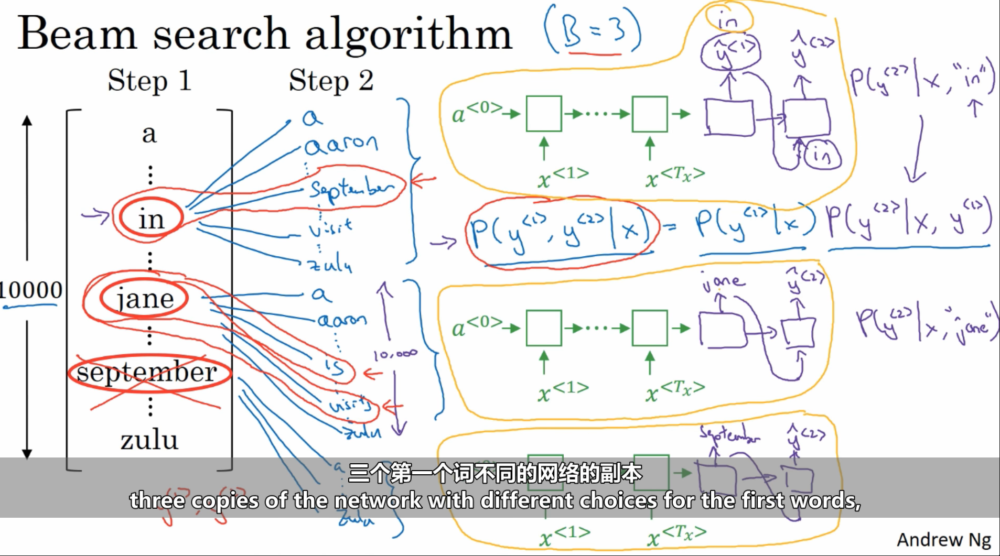
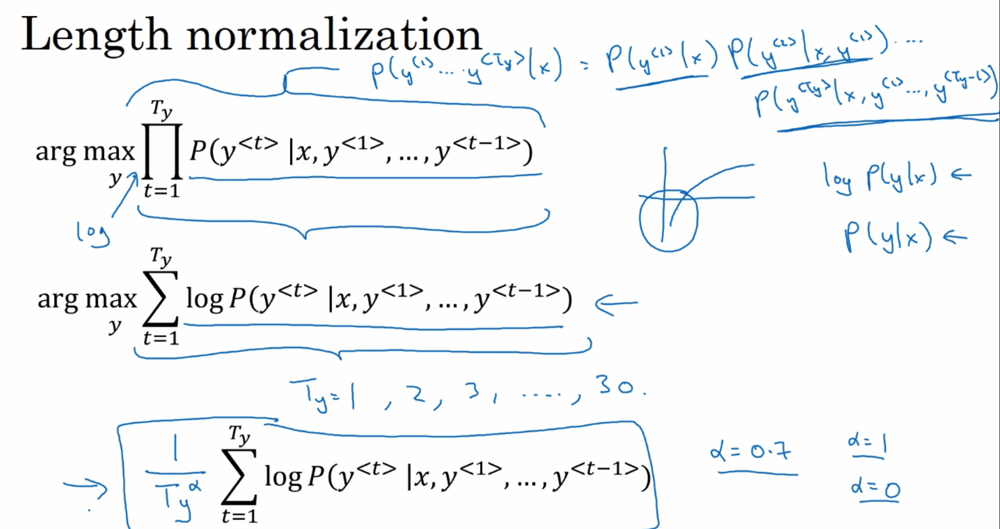

# 最大条件概率搜索方法

## 贪婪搜索

## Beam Search

通过贪婪搜索，每次选择前三个概率最大的句子。

错误分析：分辨时模型错误还是搜索方法没找到最大概率路径。

找出最优目标和实际预测的输出序列的概率，看哪个大。实际的小，则表明beam搜索没搜到最优值，需要扩大搜索范围；最优的小，则表明网络有问题，需要改进。

BLEU结果评测

 网络架构实现

# EM算法 期望最大化算法

 解码器

WFST

 区分性训练

LF-MMI(Lattice Free MMI)

 Beam Search

Greedy Decoding：每次寻找概率最大，最好的结果。这种不见得好

对于答案明确，没有创造性的，可以用Beam
