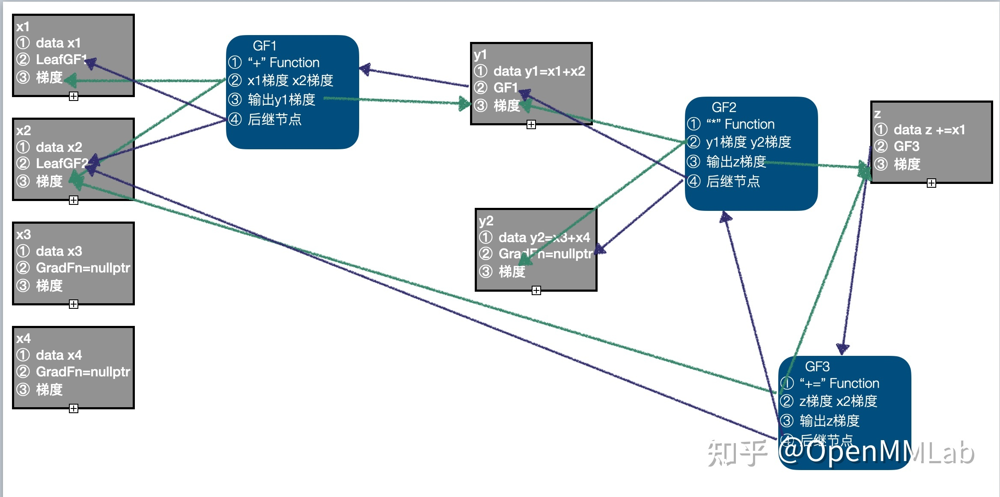

# 自动求导机制

[文章](https://www.zhihu.com/question/54554389)

[自动求导](https://zhuanlan.zhihu.com/p/347385418)

实现梯度要求

1. 增加一个梯度的变量`grad`保存当前 tensor 中对输入值的操作(函数)对每个输入值的求导梯度

2. 保存当前 tensor 所依赖的 tensor

3. 保存下对各个依赖 tensor 的导函数（这个导函数的作用是将当前 tensor 的梯度传到依赖的 tensor 上）

	

代码实现过程中，每一个张量由(`data`,`requires_grad`,,`grad_fn`,`is_leaf`)组成

`requires_grad` 的 bool 变量表明这个 tensor 是不是需要求梯度,(可以求导对应是变量,不可以求导对应是常量)

一个 dependency 的列表用于保存该 tensor 依赖的 tensor 以及对于他们的导函数。

`gradient` 看作是不同分量所占的权重

一个计算图(包含要计算的节点中的梯度值)在进行反向求导之后，为了节省内存，这个计算图就销毁了。 添加 `retain_graph=True`可以保留,但是吃内存。

##
