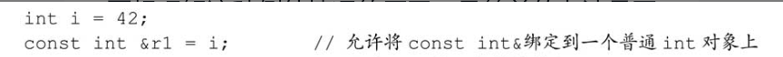
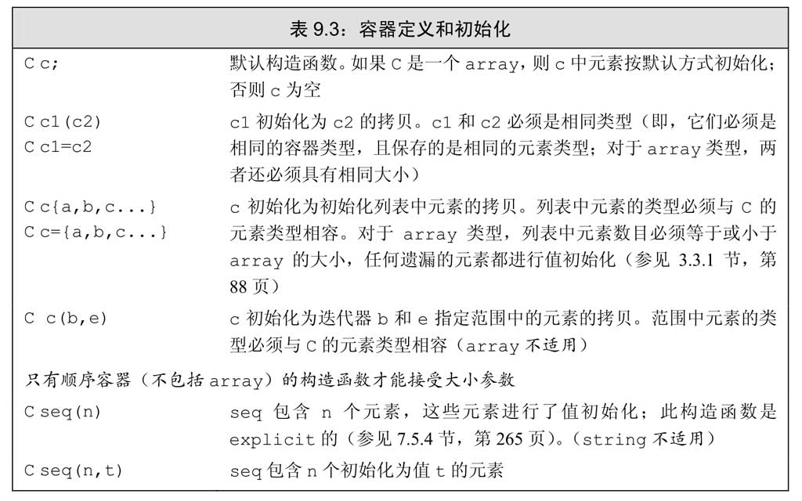
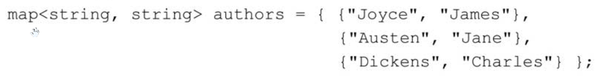

# C++开发环境及IDE安装

[MinGW安装（Windows）_w3cschool](https://www.w3cschool.cn/c/install-mingw.html)

[配置CLion用于STM32开发【优雅の嵌入式开发】 - 知乎 (zhihu.com)](https://zhuanlan.zhihu.com/p/145801160)

[CLion 中 的 MinGW 配置（及中文坑解决） - 知乎 (zhihu.com)](https://zhuanlan.zhihu.com/p/43680621)

[Clion 配置C/C++环境 - 知乎 (zhihu.com)](https://zhuanlan.zhihu.com/p/40776005)

[(33条消息) Clion的安装和配置（C/C++开发神器）_王菜鸟的博客-CSDN博客_clion](https://blog.csdn.net/qq_44723773/article/details/104698675)

[(33条消息) STM32HAL库学习（二）利用Visual Studio 2017 + Visual GDB建立STM32工程并移植TFT_凡人就行的博客-CSDN博客](https://blog.csdn.net/u011619535/article/details/82355239)

[VS下STM32开发环境搭建 - 知乎 (zhihu.com)](https://zhuanlan.zhihu.com/p/28813251)

[(33条消息) 在Visual Studio上开发ARM嵌入式软件_season_lzw的博客-CSDN博客_vs开发嵌入式](https://blog.csdn.net/season_lzw/article/details/50492667)

[手把手教你用CLion玩转STM32 - 知乎 (zhihu.com)](https://zhuanlan.zhihu.com/p/444893180)

[(33条消息) ubuntu 使用clion 搭建stm32开环境使用stlink下载调试_音柯路德的博客-CSDN博客_clion stm32调试](https://blog.csdn.net/weixin_41115751/article/details/121439534)

[Docs (feishu.cn)](https://uk0mjrsnkf.feishu.cn/docx/doxcnUbs3RJby8CxKHYOh3nSi3f)

# 基础知识

## 代码语句

- 在 C++ 中，大多数 C++ 语句以分号表示结束。

### 数据结构

#### 基本数据类型

字面值类型

##### 算数 数据类型

- 内置算数数据类型：布尔值、字符、整型、浮点数、空类型、字面值常量、转义序列
- 数据尺寸
	- 
	- 可寻址的最小内存块称为 “字节（byte）”
	- 存储的基本单元称为 “字（word）”，它通常由几个字节组成。
	- 大多数机器的字节由 8 比特构成，字则由 32 或 64 比特构成，也就是 4 或 8 字节。
	- 一个 `char` 的大小和一个机器字节一样，因为需要确保可以存放机器基本字符集。
	- 通常 `float` 以 1 个字（ 32 比特）来表示，`double` 以 2 个字（ 64 比特）来表示，`long double` 以 3 或 4 个字（ 96 或 128 比特）来表示。
- 数据符号类型
	- 带符号类型可以表示正数、负数或0，无符号类型则仅能表示大于等于0的值。
	- 整数类型 `int` 、`short` 、`long` 和 `long long` 都是带符号的。且可以通过在这些类型名前添加 `unsigned` 得到对应的无符号类型。
	- 字符型可以被分为三种类型：`char`、`signed char` 和 `unsigned char`。其中 `char` 类型表现形式由编译器决定，可能是无符号类型，也可能是有符号类型。
- 字面值常量的形式和值决定了它的数据类型。
	- 整数进制 --> 十进制： `20` ，八进制： `024` ，十六进制： `0x14`  
		- 十进制字面值的类型是 `int` 、 `long` 和 `long long` 中尺寸最小的那个 
		- 八进制和十六进制字面值的类型是能容纳其数值的 `int` 、 `unsigned int` 、 `long` 、 `unsigned long` 、 `long long` 和 `unsigned long long` 中的尺寸最小者。 
	- 小数表现形式 -->  `3.14159`，`3.14159E0`，`0.`，`0e0`，`.001` 
	- 字符表现形式 --> 单字符： `'a'` ，字符串： `"Hello world!"`  
		- 编译器会在每个字符串的结尾处添加一个空字符（`′\0′`），因此，字符串字面值的实际长度要比它的内容多 1。 
		- 转义字符
			- C++ 语言规定的转义字符 
			- 泛化的转义字符，其形式是 `\x` 后紧跟 1 个或多个十六进制数字，或者 `\` 后紧跟 1 个、2 个或 3 个八进制数字 

	- 添加前缀和后缀，可以改变整型、浮点型和字符型字面值的默认类型。 
	- `true` 和 `false` 是布尔类型的字面值。 
	- `nullptr` 是空指针字面值。

##### 引用和指针

###### “左值引用”

（lvalue reference） 

```c++
int i1 = 1024, i2 = 2048;
int &r1 = i1, &r2 = i2;

```

- 特点
	- 功能：为已创建的变量，起另外一个名字
	- 定义引用时，程序把引用和它的初始值绑定（bind）在一起，而不是将初始值拷贝给引用。 
	- 引用必须初始化，且无法令引用重新绑定到另外一个对象。
	- 引用本身不是一个对象，所以不能定义引用或字面值的引用。

###### 指针

```c++
int i1 = 1024, i2 = 2048;
int *r1 = &i1, *r2 = &i2;

```

- 特点
	- 功能：建立一个指向已有对象的对象，允许通过指针实现对其他对象的间接访问。
	- 指针本身就是一个对象，允许对指针赋值和拷贝，而且在指针的生命周期内它可以先后指向几个不同的对象。
	- 指针无须在定义时赋初值，但建议初始化所有指针。
	- 因为引用不是对象，没有实际地址，所以不能定义指向引用的指针。
	- 如果实在不清楚指针应该指向何处，就把它初始化为 nullptr 或者 0 
	- 指针是内存中的对象，像其他对象一样也有自己的地址
- 利用指针访问对象
	- 解引用符 `*` 可以用来取出指针指向的对象 
		- 如果给解引用的结果赋值，实际上也就是给指针所指的对象赋值：
	- `nullptr`（建议） 、`0`、`NULL` 可以用来初始化空指针后，空指针可以被转换成任意其他的指针类型。 
- 指针赋值
	- 给指针赋值就是令它存放一个新的地址，从而指向一个新的对象。
	- `void＊` 是一种特殊的指针类型，可用于存放任意对象的地址。 
		- 以 `void＊` 的视角来看内存空间也就仅仅是内存空间，没办法访问内存空间中所存的对象 

###### “右值引用”

（rvalue reference）

##### 数组

- 特点
	- 数组的使用与 Vector 类似，但是性能更优，灵活性低。
	- 在定义数组时，必须指定一个大于零的常量表达式作为维度，或者提供一个初始值；
	- 在定义数组时，必须声明数组的类型，不允许通过 `auto` 关键字自动推断。
	- 原生不允许将数组内容拷贝给其他数组作为其初始值，或者赋值。
	- 在一些情况下，数组可以看做是一个指针，指向第一个元素。

- 数组定义
	```c++
	const unsigned sz= 3;
	int arr[10]; // 含有十个整数的数组
	int *parr[10];		// 含有10个整型指针的数组
	string strs[get_size()];  //get_size是constexpr时正确；否则错误
	int ial[sz] = {0,1,2}; // 给定初始值的，三维数组
	int a2[] = {0,1,2}; // 给定初始值的，三维数组
	string a3[sz] = {"a","b"}; // 部分初始化的三维数组，相当于a3[3] = {"a","b",""} 
	```
	- 定义 `char` 类型的字符数组 ( C 语言风格的字符串) 
		- 可以通过字符串字面值进行初始化，注意：字符串字面值结尾的附加空字符也会被拷贝到字符数组中。
			```c++
			char a1[] = {'C', '+', '+'};		// 没有空字符的自定义初始化
			char a2[] = {'C', '+', '+', '\0'};	//手动添加空字符的初始化
			char a3[] = "C++";					// 这里在初始化时，会自动添加字符串字面值中的空字符
			const char a4[3] = "C++";			// 错误，没有空间可存放字符串字面值中的空字符
			```
- 数组元素访问
	- 数组下标可以是无符号类型，如用 `cstddef` 里面的 `size_t` 类型。 也可以通过不指向首位置的数组指针，进行负值下标访问。
	- 遍历数组所有元素时，最好的方法就是使用范围 for 语句。
- 数组的迭代
	- 在大多数表达式中，使用的数组类型的对象就是指向该数组首元素的指针。也就是说数组类型的对象支持迭代器操作，并且对于 `vector` 和 `string` 支持的迭代器运算，数组的指针也支持。
	- 数组的指针和引用
		```c++
		int (*Parray)[10] = &arr;	//Parray是一个指向 int[10] 类型的指针 
		int (&arrRef)[10] = arr;	//arrRef是一个 int[10]类型的引用
		int *(&arry)[10] = ptrs;	//arry是一个引用，指向的是 含有10个int类型指针的数组
		```
		- 类型修饰符的理解，简单的可以通过从左向右依次绑定的方式。对于含有括号的复杂形势，可以通过由内向外的理解方式。
		- 在定义指向数组的指针时，编译器会自动将其设置为指向数组首元素的指针。即 `int *p1 = arr;` = `int *p2 = &arr[0];` 
		- 数组指针进行相减运算得到的是两者之间的距离数值，其类型为 `cstddef` 头文件中的一种 `ptrdiff_t` 类型。 
	- 起始指针和尾后指针的获取方式
		- 起始指针可以简单的由数组对象或数组首元素的地址获得。也可以通过 `iterator.h` 头文件中的函数 `begin`  获得。
		- 尾后指针可以通过指向尾元素下一个位置的指针表示。即 `int *e = &arr[end+1];` ，也可以通过 `iterator` 头文件中的函数 `end`  获得。
		```c++
		int ia[] = {0, 1, 2, 3, 4, 5, 6, 7};
		for(int *beg = begin(ia); beg != end(ia);++beg){
			statements;
		};
		```
- 多维数组
	- 多维数组其实是数组的数组，即靠外侧的数组的指针就是一个指向数组的指针。

#### Const 限定符

#### `auto` 类型说明符

- `auto` ？
	- `auto` 可以让编译器通过初始值来推算变量的类型。
	- 当引用被用作初始值时，真正参与初始化的其实是引用对象的值。此时编译器以引用对象的类型作为auto的类型。
	- 当 const 类型作为初始值时，auto 一般会忽略掉顶层const，同时底层 const 则会保留下来。

#### `decltype` 类型说明符

- `decltype` 可以从表达式（函数）的返回类型推断出要定义的变量的类型。
	- 编译器并不实际调用函数，而是使用当调用发生时函数的返回值类型作为sum的类型。
	- 如果decltype使用的表达式是一个变量，则decltype返回该变量的类型（包括顶层const和引用在内）
	- 如果变量名加上了一层或多层括号，编译器就会把它当成是一个表达式，并最终得到一个引用类型。
	- 如果表达式的内容是解引用操作（`decltype(*p)`），则 decltype 将得到引用类型。
- 特点
	- 功能：定义一种变量，它的值不能被改变。
		- 因为const对象一旦创建后其值就不能再改变，所以const对象必须初始化。
	- Const 限定状态，仅仅在执行改变此向量的操作时才会发挥作用。
	- 默认状态下，const 对象仅在文件内有效。
		- 想要只在一个文件中定义 const，而在其他多个文件中声明并使用它。可以添加`extern`关键字
- const 的引用
	- 对常量的引用（ 对 const 的引用）
		- 功能：常量引用，不能被用作修改它所绑定的对象。
		- C++ 允许用字面值初始化常量引用。
	- 对非常量的常量引用
		- 功能：因为对象是个非常量，所以允许通过其他途径改变它的值。即引用的对象本身是不是一个常量未作限定。
- const 的指针
	- 指向常量或非常量的常量指针
		- 功能：要想存放常量对象的地址，只能使用指向常量的指针。
		- 如果对象是个非常量，则允许通过其他途径改变它的值。
	- const 指针（常量指针）
			- 功能：定义一个指向常量对象的常量指针。此定义更加严格些。
			- 常量指针（const pointer）必须初始化，而且一旦初始化完成，则它的值（也就是存放在指针中的那个地址）就不能再改变了。
	- 顶（底）层const
		- 顶层 const（top-level const）表示指针本身是个常量
		- 底层 const（low-level const）表示指针所指的对象是一个常量。
			- 底层const进行一些操作时，如拷贝，需要拷入和拷出的对象必须具有相同的底层 const 类型，或者两个对象的数据类型必须能够转换。一般来说，非常量可以转换成常量，反之则不行。

#### 数据初始化

- 赋给无符号类型一个超出它表示范围的值时，结果是初始值对无符号类型表示数值总数取模后的余数 `256/65536/4294967296/... - |X|`。
- 赋给带符号类型一个超出它表示范围的值时，结果是未定义的（undefined）。

- 列表初始化
	- 如果赋值语句的左侧运算对象是内置类型，那么右侧初始值列表最多只能包含一个值。
	- 如果赋值语句的右侧初始值需要转换为左侧运算对象类型，则其所占空间不应该大于目标类型的空间。
	- `vector` 模板重载了赋值运算符并且可以接收初始值列表，当赋值发生时用右侧运算对象的元素替换左侧运算对象的元素。
- 默认初始化
	- 如果定义变量时没有指定初值，则变量被默认初始化。
	- 定义在函数体内部的内置类型变量将不被初始化，即该值未定义。而函数体之外的变量被初始化为 0 。
- 变量命名规范
	- 变量名一般用小写字母，如 index，不要使用 Index 或 INDEX 。
	- 用户自定义的类名一般以大写字母开头，如Sales_item。
	- 果标识符由多个单词组成，则单词间应有明显区分，如student_loan或studentLoan，不要使用studentloan。
	- 不使用C++内部关键字
- constexpr 和常量表达式
	- 特点：在编译过程就能得到计算结果的表达式
	- C++11新标准规定，允许将变量或函数声明为constexpr类型以便由编译器来验证变量值或返回值是否是一个常量表达式。
		- constexpr 类型的指针的初始值必须是 nullptr 或者 0，或者是存储于某个固定地址中的对象。且 constexpr 指针只能指向地址固定不变的变量。

### 常见数据运算符

#### 运算符类型

一个符号到底是一元运算符还是二元运算符由它的上下文，即前后作用对象决定。

- 一元运算符（unary operator）
	- 作用于一个运算对象的运算符是一元运算符，如取地址符（`&`）和解引用符（`*`）；
- 二元运算符（binary operator）。
	- 作用于两个运算对象的运算符是二元运算符，如相等运算符（`==`）和乘法运算符（`*`）。
- 三元运算符（ternary operator）
	- 还有一个作用于三个运算对象的三元运算符。
- 特殊运算符
	- 函数调用是一种特殊的运算符，它对运算对象的数量没有限制。

#### 常用运算符介绍

- `<<` 运算符接受两个运算对象：左侧的运算对象必须是一个ostream对象，右侧的运算对象是要打印的值。计算结果返回左侧运算对象。
- `>>` 运算符接受两个运算对象：左侧的运算对象必须是一个istream对象，右侧的为读入数据存储对象。它从给定的istream读入数据，并存入给定对象中。
- 操纵符 `std::endl` 效果是结束当前行，并将与设备关联的缓冲区（buffer）中的内容刷到设备中。缓冲刷新操作可以保证到目前为止程序所产生的所有输出都真正写入输出流中，而不是仅停留在内存中等待写入流。
- 代码注释符号：`/＊ ... ＊/`; `// ...`
- 算术运算符：`+`、`-`、`*`、`/`、`++`、`%`、`--`
	- 算术运算符能作用于任意算术类型以及任意能转换为算术类型的类型。
	- 整数相除的结果还是整数，也就是说，如果商含有小数部分，直接弃除。
	- 参与取余运算的运算对象必须是整数类型。
	- 取余运算 `m%n` 不等于 0，则它的符号和 `m` 相同。
	- 递增和递减运算符有两种形式：前置版本和后置版本。
		- 前置版本`++i`，首先将运算对象加 1（或减 1），然后将改变后的对象作为求值结果，类型为左值。
		- 后置版本 `i++`，首先将运算对象加 1（或减 1），然后将运算对象改变之前那个值的副本作为求值结果，类型为右值。
			- 适合先输出，再 +1 的情况
	- 普通算数运算符的运算对象和求值结果都是右值。
- 关系运算符：`==`、`!=`、`>`、`<`、`>=`、`<=`
	- 关系运算符能作用于任意算术类型或指针类型。
	- 运算对象和求值结果都是右值。
- 逻辑运算符：`&&`、`||`、`!`
	- 逻辑运算符能作用于任意能转换成布尔值的类型。
	- `&&` 短路求值：仅当左侧运算对象为假时才对右侧运算对象求值。
	- `||` 短路求值：当且仅当左侧运算对象为真时才对右侧运算对象求值。
	- 运算对象和求值结果都是右值。
- 位运算符：`&`、`|`、`^`、`~`、`<<`、`>>`
	- "与"、"或"、"异或"、左移（左边的二进制位丢弃，右边补 0）、右移（正数左补 0，负数左补 1，右边丢弃）
	- 位运算符进行运算之前，会先判断运算对象是否需要提升类型
	- 左移运算符（<<）在右侧插入值为 0 的二进制位，左侧超出边界的位被移除。
	- 右移运算符（>>）的行为则依赖于其左侧运算对象的类型：如果该运算对象是无符号类型，在左侧插入值为0的二进制位；如果该运算对象是带符号类型，在左侧插入符号位的副本或值为0的二进制位，如何选择要视具体环境而定。之后右侧超出边界的位被移除。
	- 可以作用于整数类型的运算对象或者标准库 `bitset` 类型对象。
	- 应用：
		- 想将数据某一位（如第 k 位）强行设置为 1，可以通过与 `1UL<<k` 进行或运算实现（`UL==unsigned long`）
		- 想将数据某一位（如第 k 位）强行设置为 0，可以通过与 `~(1UL<<k)` 进行与运算实现（`UL==unsigned long`）
		- 想要判断某一位（如第 k 位）是否为 1，可以通过与 `1UL<<k` 进行与运算实现（`UL==unsigned long`）
			- 是 1，则计算的结果非 0（真）（有一位为 1）。否则计算结果为 0（假）（所有位均为 0）
		- 想要判断某一位（如第 k 位）是否为 0，可以通过与 `~(1UL<<k)` 进行或运算实现（`UL==unsigned long`）
			- 是 0，则计算的结果为不全是 1（真）（只有一位为 0）。否则计算结果所有位为 1.
- 赋值运算符
	- `=`、`+=`、`-=`、`*=`、`/=`、`%=`、`<<=`、`>>=`、`&=`、`^=`、`|=`
	- 如果赋值运算符的左右两个运算对象类型不同，则右侧运算对象将转换成左侧运算对象的类型。
	- 左侧运算对象为可修改的左值，右侧运算对象看情况。求值结果为左侧运算对象类型。
- 杂项运算符
	- 计算变量所占的字节数大小的运算符：`sizeof`
		- 所得的值是一个 size_t 类型的常量表达式
		- 对 char 或者类型为 char 的表达式执行 sizeof 运算，结果得 1。
		- 对引用类型执行 sizeof 运算得到被引用对象所占空间的大小。
		- 对指针执行 sizeof 运算得到指针本身所占空间的大小。
		- 对解引用指针执行 sizeof 运算得到指针指向的对象所占空间的大小，指针不需有效。
		- 对数组执行 sizeof 运算得到整个数组所占空间的大小。此外还可以用数组的大小除以其单个元素的大小（如 `*array`）得到数组中元素的个数。
		- 对 string 对象或 vector 对象执行 sizeof 运算只返回该类型固定部分的大小，不会计算对象中的元素占用了多少空间。
	- 条件运算符：`Condition ? X : Y`
		- 条件为真，则执行 X 表达式。反之，则执行 Y 表达式
		- 条件运算符可以嵌套。
		- 当条件运算符的两个表达式都是左值或者能转换成同一种左值类型时，运算的结果是左值；否则运算的结果是右值。
	- 逗号运算符：`,`
		- 首先对左侧的表达式求值，然后将求值结果丢弃掉。逗号运算符真正的结果是右侧表达式的值。如果右侧运算对象是左值，那么最终的求值结果也是左值。
	- 成员访问运算符：`.` 和 `->`
		- 类对象直接访问：`s.size()`
		- 指针访问：`p->size()` 或 `(*p).size()`
		- 箭头运算符作用于一个指针类型的运算对象，结果是一个左值。点运算符分成两种情况：如果成员所属的对象是左值，那么结果是左值；反之，如果成员所属的对象是右值，那么结果是右值。
	- 指针运算符：`&`、`*`
	- 作用域运算符 `::`
		- 前面为空，代表强制调用全局变量。

#### 运算对象

C++ 的表达式要不然是右值（rvalue，读作“are-value”），要不然就是左值（lvalue，读作“ell-value”）。

当一个对象被用作右值的时候，用的是对象的值（内容）；当对象被用作左值的时候，用的是对象的身份（在内存中的位置）。

不同的运算符对运算对象的要求各不相同，有的需要左值运算对象、有的需要右值运算对象；返回值也有差异，有的得到左值结果、有的得到右值结果。

当一个左值被当成右值使用时，实际使用的是它的内容（值）。反之则不可以。

- 赋值运算符需要一个（不是常量）左值作为其左侧运算对象，得到的结果也仍然是一个左值。
- 取地址符作用于一个左值运算对象，返回一个指向该运算对象的指针，这个指针是一个右值。
- 内置解引用运算符、下标运算符、迭代器解引用运算符、string 和 vector 的下标运算符的求值结果都是左值。
- 内置类型和迭代器的递增递减运算符作用于左值运算对象，本书之前章节所用的形式，所得的结果也是左值。
- 使用关键字decltype的时候，如果表达式的求值结果是左值，decltype作用于该表达式得到一个引用类型。举个例子，假定p的类型是int＊，因为解引用运算符生成左值，所以decltype（＊p）的结果是int&。另一方面，因为取地址运算符生成右值，所以decltype（&p）的结果是int＊＊，也就是说，结果是一个指向整型指针的指针。

#### 运算符的优先级、结合律和求值顺序

优先级与结合律决定了运算对象复杂组合的方式，其中优先级控制不同对象的紧密结合程度，结合律控制同优先级对象的组合规则。


- 运算结合律
	- 左结合律，意味着当优先级相同时按照从左向右的顺序进行组合。
- 括号无视优先级与结合律，使其内对象得到优先运算。
- 优先级规定了运算符中运算对象的组合方式，但是大部分运算符并没有规定其中表达式对象的求值顺序。
	```c++
		int i = f1()*f2(); // 两个函数哪个先调用是未知的
		cout << i << " " << ++i << endl; // i 和 ++i 哪个先调用也是未定义的
	```
- 求值顺序
	- 逻辑与 `&&` 运算符规定先求左侧运算对象的值，只有当左侧运算对象的值为真时才继续求右侧运算对象的值。 
	- 逻辑或 `||` 运算符
	- 条件（`?:`）运算符
	- 逗号（`,`）运算符

#### 运算对象转换

C++语言不会对两种不同类型的值进行运算，而是先根据类型转换规则，设法将被运算对象的类型统一后再求值。

##### 隐式类型转换规则

- 整型提升
	- 在大多数表达式中，比 `int` 类型小的整型值（如 `bool`、`char`、`signed char`、`unsigned char`、`short` 和 `unsigned short` 等类型），只要它们所有可能的值都能存在 `int` 里，它们就会提升成 `int` 类型；否则，提升成 `unsigned int` 类型。
	- 对于较大的 char 类型（如 `wchar_t`、`char16_t`、`char32_t`），提升成 `int`、`unsigned int`、`long`、`unsigned long`、`long long` 和 `unsigned long long` 中，能容纳原类型最小的一种类型。
- 整形转换成浮点
	- 整数类型和浮点数类型同时进行运算时，整型会转换成相应的浮点型。但如果该整数所占的空间超过了浮点类型的容量，精度可能有损失。 
- 符号提升
	- 如果两个（整型提升后的）运算对象的类型要么都是带符号的、要么都是无符号的，则小类型的运算对象转换成较大的类型。
	- 如果一个运算对象是无符号类型、另外一个运算对象是带符号类型，而且其中的无符号类型不小于带符号类型，那么带符号的运算对象转换成无符号的。例如，假设两个类型分别是 unsigned int 和 int，则 int 类型的运算对象转换成 unsigned int 类型。需要注意的是，如果 int 型的值恰好为负值，其结果将以 2.1.2 节（第 32 页）介绍的方法转换，并带来该节描述的所有副作用。首先把负数转换成无符号数。把负数转换成无符号数类似于直接给无符号数赋一个负值，结果等于这个负数加上无符号数的模。然后再进行对象运算。
	- 如果一个运算对象是无符号类型、另外一个运算对象是带符号类型，而且带符号类型大于无符号类型，此时转换的结果依赖于机器。如果无符号类型的所有值都能存在该带符号类型中，则无符号类型的运算对象转换成带符号类型。如果不能，那么带符号类型的运算对象转换成无符号类型。例如，如果两个运算对象的类型分别是long和unsigned int，并且int和long的大小相同，则long类型的运算对象转换成unsigned int类型；如果long类型占用的空间比int更多，则unsigned int类型的运算对象转换成long类型。
- 在赋值语句中，右侧运算对象将转换成左侧运算对象的类型。
	- 把一个浮点数赋给整数类型时，进行了近似处理。结果值将仅保留浮点数中小数点之前的部分。
- 数组转换成指针
	- 在大多数用到数组的表达式中，数组自动转换成指向数组首元素的指针。
		- 当数组被用作 decltype 关键字的参数，或者作为取地址符（&）、sizeof 及 typeid 等运算符的运算对象时，上述转换不会发生。
		- 如果用一个引用来初始化数组，上述转换也不会发生。
- 指针的转换
	- 常量整数值 0 或者字面值 nullptr 能转换成任意指针类型
	- 指向任意非常量的指针能转换成 `void＊`
	- 指向任意对象的指针能转换成 `const void＊`
- 布尔类型转换
	- 把一个非布尔类型的算术值赋给布尔类型时，初始值为 0 则结果为 false ，否则结果为 true 。
	- 把一个布尔值赋给非布尔类型时，初始值为 false 则结果为 0 ，初始值为 true 则结果为 1 。
- 转换成常量
	- 允许将指向不是常量类型数据的指针或引用，转换成指向相应的常量类型的指针。
		- 即可以给不是常量类型数据，定义常量类型指针或引用。反过来就不行。
- 类类型定义的转换
	- 即标准库或自定义的类类型，有的可以自动进行转换。（如：C风格字符串自动转换为String；istream类型自动转换为布尔值）

##### 显式强制类型转换

###### 命名的强制类型转换

形式：`cast-name<type>(expression);`

cast-name ：`static_cast`、`dynamic_cast`、`const_cast` 和 `reinterpret_cast`

- static_cast
	- 任何具有明确定义的类型转换，只要不包含底层 const，都可以使用 static_cast 。
		- `double slope = static_cast<double>(j)/ i;`
	- 功能：告诉程序的读者和编译器，不在乎类型转换蕴含的潜在精度损失（正常会出现警告）。
	- 当需要把一个较大的算术类型赋值给较小的类型时，static_cast 非常有用，不使用。
	- 对于编译器无法自动执行的类型转换也非常有用，如将 `void` 类型数据转换成指定类型的数据。
- const_cast
	- 可以将常量对象转换成非常量对象，去掉其 `const` 性质。反过来也可以将非常量对象转换成常量对象。
	- 如果对象本身不是一个常量，使用强制类型转换获得写权限是合法的行为。然而如果对象是一个常量，再使用 const_cast 执行写操作就会产生未定义的后果。
	- 只有 const_cast 能改变表达式的常量属性，使用其他形式的命名强制类型转换改变表达式的常量属性都将引发编译器错误。同样的，也不能用 const_cast 改变表达式的类型。
- reinterpret_cast
	- 为运算对象的位模式提供较低层次上的重新解释。
	- P146 / P556

### 作用域

块作用域：C++语言中大多数块作用域都以花括号分隔。

嵌套的作用域：允许在内层块作用域中重新定义外层块作用域已有的名字。

#### 局部变量

函数形参和语句块内部定义的变量统称为局部变量。其仅能在所处作用域内可见，同时局部变量还会隐藏在外层作用域中同名的其他所有声明中。

自动对象

对于普通局部变量对应的对象来说，当函数的控制路径经过变量定义语句时创建该对象，当到达定义所在的块末尾时销毁它。我们把只存在于块执行期间的对象称为自动对象（automatic object）。当块的执行结束后，块中创建的自动对象的值就变成未定义的了。

局部静态对象

某些时候，有必要令局部变量的生命周期贯穿函数调用及之后的时间，此时可以将局部变量定义成 `static` 类型从而获得这样的局部静态对象。在程序的执行路径第一次经过对象定义语句时初始化，并且直到程序终止才被销毁，在此期间即使对象所在的函数结束执行也不会对它有影响。

### 控制流语句

#### 空语句

#### while 语句

- 定义在 while 条件部分或者 while 循环体内的变量每次迭代都经历从创建到销毁的过程。

#### do while 语句

- do while 语句先执行循环体后，再检查条件。即不管条件的值如何，我们都至少执行一次循环。
- 因为对于do while来说先执行语句或者块，后判断条件，所以不允许在条件部分定义变量

#### for 语句

- `init` 也可以定义多个对象。但是 `init` 只能有一条声明语句，因此，所有变量的基础类型必须相同。
- 省略 `condition` 的效果等价于在条件部分写了一个 `true`。因为条件的值永远是 `true`，所以在循环体内必须有语句负责退出循环，否则循环就会无休止地执行下去。
- 省略掉 `for` 语句头中的 `expression`，就要求条件部分或者循环体必须改变迭代变量的值。

#### 范围 for 语句

- 可以遍历容器或其他序列的所有元素。
- 如果需要对序列中的元素执行写操作，循环变量必须声明成引用类型。
- 序列中的每个元素都需要能转换成被定义变量的类型（最方便的就是用 `auto` ）。
- 等价的 for 语句
	- 

#### if 语句

#### switch 语句

- 如果某个 case 标签匹配成功，将从该标签开始往后顺序执行所有 case 分支，除非程序显式地中断了这一过程，否则直到 switch 的结尾处才会停下来。
- 可以把几个 case 标签写在一行里，强调这些 case 代表的是某个范围内的值：
	- `case 'a' : case 'e' : case 'i' : case 'o' : case 'u' : statement;`
- case 分支不可以含有与其他分支共用的隐式或显式变量初始化。

#### 跳转语句

- break
	- break 语句负责终止离它最近的 while、do while、for 或 switch 语句，并从这些语句之后的第一条语句开始继续执行。
	- break语句的作用范围仅限于最近的循环或者switch。
- continue
	- continue 语句终止最近的 for、while 和 do while 循环中的当前迭代并立即开始下一次迭代。
	- continue 语句的作用范围仅限于最近的循环语句。因此也只有当 switch 语句嵌套在迭代语句内部时，才能在 switch 里使用 continue。
- goto
	- goto 语句的作用是从 goto 语句无条件跳转到同一函数内的另一条语句处，跳转位置由预设的标示符控制。（不建议使用）
	- 被跳过的语句，不可以含有后续语句所使用的变量的隐式或显式初始化语句。
	- 样句：`goto label; ...; label:statement;`
- return

#### 主动异常处理语句

- 抛出异常：`throw Error(..)`
- 处理异常：`try {statement;} catch(Error1 arr1){statement;} catch(Error2 arr2){statement;}`
- 异常数据
- 异常处理流程：
	- 在代码执行过程种，如果异常被抛出，首先搜索抛出该异常的函数，寻找匹配的 catch 子句。
	- 没找到匹配的 catch 子句，终止该函数，并在调用该函数的函数中继续寻找。
	- 以此类推，沿着程序的执行路径逐层回退，直到找到适当类型的 catch 子句为止。
	- 如果最终还是没能找到任何匹配的 catch 子句，程序转到名为 terminate 的标准库函数，程序非正常退出。
	- 特殊情况：一段程序没有 try 语句块且发生了异常，相当于肯定找不到任何匹配的 catch 子句，系统会调用 terminate 函数并终止当前程序的执行。
- 异常类
	- exception 库
		- 定义了最通用的异常类exception。
	- stdexcept 库
		- 
		- 定义了几种常用的异常类
	- new
		- 定义了bad_alloc异常类型
	- type_info
		- 定义了 bad_cast 异常类型
	- 只能以默认初始化的方式初始化 exception、bad_alloc 和 bad_cast 对象，不允许为这些对象提供初始值。
	- 其他的异常对象类型应该使用 string 对象或者 C 风格字符串初始化，但是不允许使用默认初始化的方式。
	- 可以通过通用的 what 函数，获取异常对象中初始化后的或内置的字符串信息。

```c++
//代码示例
	// while 循环语句
	while (condition){
		statement;
		
	}
	// do while 循环语句
	do{
		statement;
	} while (condition);
	// for 循环语句
	for (init; condition; expression){
		statement;
	}
	// 基于范围的for循环语句
	// seq 是一个序列对象
	// i 被用于迭代访问 seq 序列中的基础元素
	for (auto &declaration : expression){
	statement;
	}
	// if 条件语句
	if (condition){
		statement;
	}
	else if(condition){
		statement;
	}
	else {
		statement;
	}
	// switch 条件语句
	// 标签 ch 必须是整型常量表达式
	// 不主动断开 switch ，就会判断所有分支
	switch (ch) {
		case 'a':
			statement; 
			break;
		default:
			statement;
			break;
	}

```

### 函数

#### 函数定义

- 每个 C++程序都包含一个或多个函数（function），其中一个必须命名为 main。
- 函数声明（函数原型）
	- 函数的名字也必须在使用之前声明，并且如果一个函数永远也不会被我们用到，可以只有声明没有定义。
	- 函数的声明由：返回类型、函数名和一个括号包围的形参列表组成。
	- 声明的函数需要传入数组作为形参时，形参声明可以用对应指针类型，或数组类型。因为最终数组也会转换成指针。
- 一个函数的定义包含四部分：返回类型、函数名、一个括号包围的形参列表（允许为空）以及函数体（语句块）。
	- 函数返回类型
		- 无返回类型：`void` ，返回方式：`return;`
		- 函数的返回类型不能是数组类型或函数类型，但可以是指向数组或函数的指针或引用。
			- 返回值定义：
				- 通过自定义类型别名 `arrT` ： `typedef int  arrT[10]` 或 `using arrT = int [10]` 
				- 直接定义一个指向数组或函数的指针： `int (*p)[10]= &arr;`
			- 函数定义
				- 直接定义：`int (*func(int i)) [10];`
					- `func(int i)`表示调用 func 函数时需要一个 int 类型的实参。
					- `(＊func(int i))`意味着我们可以对函数调用的结果执行解引用操作。
					- `(＊func(int i))[10]`表示解引用 func 的调用将得到一个大小是 10 的数组。
					- `int (＊func(int i))[10]` 表示数组中的元素是 int 类型。
				- 使用尾置返回类型：`auto func(paratype) -> paratype (*)[10];`
				- 使用 `decltype` 关键字声明返回类型：`decltype(para) *func(para)`
		- 函数返回值是对象副本、未命名的临时对象或引用别名。
		- 函数完成后，它所占用的存储空间也随之被释放掉，因此不要返回局部对象的引用或指针（如可以被自动转换的非同类型值，局部对象的引用，局部对象的指针）。
			- 特别的，C++11新标准规定，函数可以返回花括号包围的值的列表，作为要返回的类型初始化值。
				- 如果函数返回的是内置类型，则花括号包围的列表最多包含一个值，而且该值所占空间不应该大于目标类型的空间。
				- 如果函数返回的是类类型，由类本身定义初始值如何使用。最常见的为 `vector` 对象
		- 返回类型也可以使用返回类类型的函数和调用运算符。
		- 函数的返回类型决定函数调用是否是左值（返回引用类型为左值，其他类型为右值）。
		- main 函数，可以没有 return 语句直接结束。其默认返回值为 0。返回 0 表示执行成功，返回其他值表示执行失败。
			- cstdlib 头文件定义了两个预处理变量，可以使用这两个变量分别表示成功 `EXIT_SUCCESS` 与失败 `EXIT_FAILURE` 
	- 函数名
	- 函数参数
		- 实参
			- 送入实参的求值顺序并无明确规定。
			- 默认实参
				- 一旦某个形参被赋予了默认值，它后面的所有形参都必须有默认值。
				- 在进行多次函数声明时，在给定的作用域中，一个形参只能被赋予一次默认实参。但是后续声明可以为之前那些没有默认值的形参继续添加默认实参。
				- 可以通过表达式作为默认实参，但是无法通过同名局部变量覆盖的方式，修改默认实参。
		- 形参
			- 形参列表可以为空，但是不能省略，隐式定义：`func(){}`，显示定义：`func(void){}`。
			- 形参列表中的形参通常用逗号隔开，其中每个形参都是含有一个声明符的声明，例：`func(int v1,int v2,...){}`。
			- 任意两个形参都不能同名，函数块中的局部变量也不能使用与函数形参一样的名字。
			- 数组作为函数传递参数时，实际上传递的是指向数组首元素的指针，也因此无法得到数组大小（管理数组的常用方法有：末尾添加标记、传递首元素和尾后元素的指针，传递大小形参）。
			- 可变数量形参实现
				- 标准库：`initializer_list`
					- 如果函数的实参数量未知但是全部实参的类型都相同，我们可以使用initializer_list类型的形参。
				- 省略符形参
					- 省略符形参是为了便于C++程序访问某些特殊的C代码而设置的，这些代码使用了名为varargs的C标准库功能。
					- 省略符形参应该仅仅用于C和C++通用的类型。
					- `int func(arr, ...){};`
					- 模板函数
		- 参数传递过程
			- 实参的类型必须与对应的形参类型相同或能转换。
			- 如果形参是引用类型，它将绑定到对应的实参上（引用传递）；否则，将实参的值拷贝后赋给形参（值传递，独立）。
			- 指针也是一个对象，作为形参时也是构建一个独立对象，但是需要注意的是，通过指针去访问的对象不变。在 C++语言中，建议使用引用类型的形参替代指针（避免了拷贝操作，也更方便）。
			- 当用实参初始化形参时会忽略掉顶层 const，因此当形参有顶层 const 时，传给它常量对象或者非常量对象都是可以的。P6.2.3
			- 函数不会改变的形参尽量使用常量引用。
				- 告诉函数的调用者，此函数不会修改传入的实参的值。
				- 普通的引用形参不能接受 const 对象、字面值或者需要类型转换的对象。
				- 数组的引用需要加括号：`func(int (&arr)[len]){}`

#### 函数调用

调用方式：函数或者指向函数的指针+调用运算符（一对圆括号）+括号内的实参列表 `function(arg1,arg2,...)`

- 首先用实参初始化函数对应的形参。
- 然后将控制权转移给被调用函数。
	- 主调函数的执行被暂时中断，被调函数开始执行。
- 当遇到一条 return 语句时函数结束执行过程。
	- 首先返回 return 语句中的值（如果有的话）
	- 然后将控制权从被调函数转移回主调函数。

#### 函数重载

如果同一作用域内的几个函数名字相同但形参列表不同，我们称之为重载函数。当调用这些函数时，编译器会根据传递的实参类型推断想要的是哪个函数。

- 不允许两个函数除了返回类型外其他所有的要素都相同。
- 因为形参的名字仅仅起到帮助记忆的作用（有没有它并不影响形参列表的内容），以及类别名的存在，所以有时候两个形参列表看起来不一样，但实际上是相同的
- 一个拥有顶层 const 的形参无法和另一个没有顶层 const 的形参区分开来
- 如果形参是某种类型的指针或引用，则通过区分其指向的是常量对象还是非常量对象可以实现函数重载，此时的 const 是底层的。
- const 对象（或指向 const 的指针）只能传递给 const 形参。并且，因为非常量（或指向非常量对象的指针）可以转换成 const，因此也可以传递给 const 形参。但是当我们传递一个非常量对象或者指向非常量对象的指针时，编译器会优先选用非常量版本的函数。
- 重载对作用域的一般性质并没有什么改变：如果我们在内层作用域中声明名字，它将隐藏外层作用域中声明的同名实体。在不同的作用域中无法重载函数名。

##### 函数匹配

- 第一步，选定本次调用对应的重载函数集，集合中的函数为与被调用的函数同名，并且其声明在调用点可见的候选函数。
- 第二步，考察本次调用提供的实参（参数数量和类型），然后从候选函数中选出能被这组实参调用的函数，这些新选出的函数称为可行函数。
- 第三步，从可行函数中选择与本次调用最匹配的函数。
	- 精确匹配
		- 实参类型和形参类型相同；实参从数组类型或函数类型转换成对应的指针类型；向实参添加顶层const或者从实参中删除顶层const
	- 通过 const 转换实现的匹配
	- 通过类型提升实现的匹配
	- 通过算术类型转换或指针转换实现的匹配。
	- 通过类类型转换实现的匹配
	- 如果重载函数的区别在于它们的引用类型的形参是否引用了const，或者指针类型的形参是否指向const，则当调用发生时编译器通过实参是否是常量来决定选择哪个函数。

匹配二义性

- 算术类型转换的级别相等，因此同等级转换会导致二义性。（如 `double`，既能转换成`long`也能转换成`float`）

#### 内联函数

通过函数，可以统一相关表达式的操作行为，容易针对性修改表达式以及被重复利用。但是在大多数机器上，一次函数调用其实包含着一系列工作：调用前要先保存寄存器，并在返回时恢复；可能需要拷贝实参；程序转向一个新的位置继续执行。比求等价表达式的值要慢一些。

将函数指定为内联函数，通常就是将它在每个调用点上“内联地”展开。定义方式为在函数定义的时候添加关键词 `inline`

#### constexpr 函数

一种能用于常量表达式的函数, 其函数的返回类型及所有形参的类型都需要是字面值类型，而且函数体中必须有且只有一条 return 语句。

#### 函数指针

函数指针指向的是函数而非对象，其类型由函数的返回类型和形参类型共同决定，与函数名无关。

- 函数指针定义
	- 要想直接声明一个可以指向函数的指针，只需要用指针替换函数名即可。`type (*p)(type para,...)`
	- 当我们把函数名作为一个值使用时，该函数自动地转换成指针，并进行赋值等操作，如 `p = func` ，其等价于 `p = &func`。
	- 可以直接使用指向函数的指针调用该函数，无须提前解引用指针，如如 `p(para)` ，其等价于 `(*p)(para)`。
	- 可以为函数指针赋一个 `nullptr` 或者值为 `0` 的整型常量表达式，表示该指针没有指向任何一个函数。
	- 如果定义了指向重载函数的指针，编译器通过指针类型决定选用哪个函数，指针类型必须与重载函数中的某一个精确匹配。
	- 函数形参可以定义为指向函数的指针
		- 在使用时，可以直接把函数作为实参使用，此时它会自动转换成指针。
	- 可以通过 `typedef` 或 `using` 定义类型别名、 `decltype` 或定义尾置返回类型简化定义在函数形参设置和函数返回类型设置中使用函数指针的过程。
		- 定义函数类型 
			- `typedef bool Func(const string&, const string&); ` = `typedef decltype (Func) Func2;`
			- `using F = int (int*, int);F *f1(int);` = `int (*f1 (int) ) (int* , int);`
		- 定义指向函数的指针类型 
			- `typedef bool(*FuncP)(const string&,const string&);` = `typedef decltype (lengthCompare) *FuncP2;`
			- `using PF = int (* ) ( int* , int); PF f1(int);` = `int (*f1 (int) ) (int* , int);`
		- 尾置返回类型
			- `auto f1 (int) -> int (*) ( int* , int) ;`
		- decltype
			- `decltype (func) *f1 (int);`
			- 当明确知道返回的函数是哪一个，就能使用decltype简化书写函数指针返回类型的过程。
		- 通过定义的类型，就可以进一步给定形参，或定义对象。
		- 编译器会自动地将形参得到的函数类型转换成指向函数的指针。反之函数返回类型不会自动地转换成指针。

#### 调式程序

##### 预处理变量

`__func__` ：它是 const char 的一个静态数组，用于存放函数的名字。

`__FILE__` ：存放文件名的字符串字面值。

`__LINE__` ：存放当前行号的整型字面值。

`__TIME__` ：存放文件编译时间的字符串字面值。

`__DATE__ `：存放文件编译日期的字符串字面值。

##### 预处理宏 `assert`

头文件： `cassert`

`assert(expr)`，如果表达式为假（即 0），`assert` 输出信息并终止程序的执行。如果表达式为真（即非 0），`assert` 什么也不做。常用于检查“不能发生”的条件。

##### 预处理状态 `NDEBUG`

`#define NDEBUG`

`assert` 的行为依赖于一个名为 `NDEBUG` 的预处理变量的状态。如果定义了 `NDEBUG`，则 `assert` 什么也不做。默认状态下没有定义 `NDEBUG`，此时 `assert` 将执行运行时检查。

#### `lambda` 表达式

`[ capture_list] (parameter_list) -> return_type { function_body; }`

- 表达式结构
	- capture list 是 lambda 要使用的所在函数中定义的，以逗号分隔的局部变量列表；
		- lambda 可以直接使用定义在当前所在函数之外的对象。
		- lambda 可以直接使用局部 `static` 变量
		- 局部变量列表中的值可以是原值拷贝，也可以是引用。
		- 可以通过捕获列表中写一个 `&` 或 `=`，表示采用隐式引用捕获或值捕获方式，让编译器自动推断和捕获所需变量对象。
		- 同时隐式和显示捕获可以混合使用，要求是两种必须是不同的捕获方式（引用捕获或值捕获）。
	- return type 表示返回类型
	- parameter list 表示参数列表
	- function body 表示函数体
- 表达式特点
	- 可以忽略参数列表和返回类型，但必须永远包含捕获列表和函数体
	- 与普通函数不同，lambda 不能有默认参数
	- 可以指定 `mutable` 关键字，使得值捕获拷贝得到的对象可在 lambda 函数体内被修改。
	- 

当向一个函数传递一个 lambda 时，同时定义了一个新类型和该类型的一个对象：传递的参数就是此编译器生成的类类型的未命名对象。类似的，当使用 auto 定义一个用 lambda 初始化的变量时，定义了一个从 lambda 生成的类型的对象。

默认情况下，从 lambda 生成的类都包含一个对应该 lambda 所捕获的变量的数据成员。类似任何普通类的数据成员，lambda 的数据成员也在 lambda 对象创建时被初始化。

尽量保持 lambda 的变量捕获简单化，如捕获一个普通变量，如 int、string 或其他非指针类型。防止捕获对象在 lambda 执行时失效（迭代器、指针或引用的对象不存在了）。


### 类

类型成员、类的成员的类内初始值、可变数据成员、内联成员函数、从成员函数返回＊this

- 类结构初步定义

```c++
struct/class Example {
	statement;
};
Example example; // 或 class Example example;
example.state;
```

- 特点：
	- 类内部定义的名字必须唯一，但是可以与类外部定义的名字重复。
	- 类体右侧的表示结束的花括号后必须写一个分号
	- 使用 `class` 和 `struct` 定义类唯一的区别就是默认的访问权限。
		- `struct` 定义在第一个访问说明符之前的成员默认是 `public` 的。
		- `class` 定义在第一个访问说明符之前的成员默认是 `private` 的。
- 类别名
	- 分割复合类型定义顺序
		- 上图，前者是指向 char 类型对象的常量指针，后者是指向 const char 类型对象的指针。

#### 类声明

- 就像可以把函数的声明和定义分离开来一样，我们也能仅仅声明类而暂时不定义它。
- 正常情况下，但是对于一个类来说，在我们创建它的对象之前该类必须被定义过，而不能仅仅被声明。
- 特殊情况，有时候必须首先完成类的定义，然后编译器才能知道存储该数据成员需要多少空间。即直到类被定义之后数据成员才能被声明成这种类类型。

#### 类数据成员

##### 数据成员

- 所有数据成员都必须在类的内部声明
- 类内初始值时，必须以符号`=`或者花括号`{}`表示。

##### 类型成员

- 类还可以自定义某种类型在类中的别名，方便在类中定义成员和提高代码可读性。
- 同时也可以利用 `public` 和 `private` 实现内部成员类型的伪装。
- 类型成员必须先定义后使用，即通常直接在类的开头就定义类型成员。

##### 可变数据成员

用于在一个 const 成员函数（`Type func() const{};` ）内，修改类的某个数据成员，正常情况下，const 成员函数是无法通过 `this` 修改类数据成员的。关键字：mutable，

##### 静态成员

如果需要类的一些成员与类本身直接相关，即此成员被所有这种类全局性的共同拥有。通过关键字 `static` 将其声明为静态成员即可。

- 特点
	- 静态成员函数不能声明成 const 的。
	- 静态成员函数也不与任何对象绑定在一起，它们不包含 this 指针，即不能使用 this 指针。这一限制既适用于 this 的显式使用，也对调用非静态成员的隐式使用有效。
	- 键字 `static` 只能出现在类内部的声明语句。
- 静态成员调用
	- 可以使用作用域运算符直接访问静态成员。
	- 可以使用类的对象、引用或者指针来访问静态成员。
	- 不同对象的类成员函数可以不用通过作用域运算符就能直接使用静态成员。

#### 类行为

- 重载运算符，如（加法、赋值、复合）
	- 使用重载运算符时，其包括运算对象的类型和返回值的类型，都是由该运算符定义的；但是运算对象的个数、运算符的优先级和结合律都是无法改变的。

#### 类成员函数

类的实际编译过程中，编译器首先编译成员的声明，然后才轮到成员函数体（如果有的话）。

- 成员函数的声明必须在类的内部，它的定义则既可以在类的内部也可以在类的外部。
- 定义在类内部的函数是隐式的内联函数，即定义在类内部的成员函数是自动 `inline` 的。
	- `inline` 成员函数也应该与相应的类定义在同一个头文件中。
	- 因为类内默认是内联函数，因此即使将一些表达式改编成成员函数去调用，也不会带来多余的运行开销。而且通过函数调用的方式，还可以方便调试，避免重复。
- 作为接口组成部分的非成员函数，它们的定义和声明都在类的外部。
- 成员函数通过一个名为 `this` 的额外的隐式参数来访问调用它的那个对象。
- 当我们调用成员函数时，此成员函数可以通过一个名为 `this` 的隐式参数来访问调用它的那个对象，而 `this` 默认情况下是一个向非常量对象的常量指针（`Class *const this`），保存的是这个对象的地址。
	- 注意：指向非常量对象的常量指针，不可以指向常量对象。这意味着，在一个常量对象上，无法调用普通的成员函数。
	- 常量成员函数：C++允许把 `const` 关键字放在普通的成员函数的参数列表之后，表示 `this` 是一个指向常量的常量指针（`const Class *const this`）。
	- 如果成员被声明成常量成员函数，那么它的外部定义也必须在参数列表后明确指定 `const` 属性，并且函数名需要指定它所属的类名。`type Class::func() const {...}`
- 和非成员函数一样，成员函数也可以被重载，只要函数之间在参数的数量和/或类型上有所区别就行。
- 一个const成员函数如果以引用的形式返回`＊this`，那么它的返回类型将是常量引用。
	- 可以通过设置成员函数的返回值为原类对象的引用（非 `const` ），连接多个成员函数调用 `class.func1().func2()`。

##### 拷贝、赋值和析构

##### 函数重载

- 常量数据对象只能被 const 成员函数调用。相反非常量数据对象可以被常量版本或非常量版本成员函数调用。
	- 如果想要非常量对象与非常量成员函数匹配，就需要定义常量和非常量两种重载函数。

#### 类构造函数

构造函数的任务是初始化类对象的数据成员，无论何时，只要类的对象被创建，就会执行构造函数。

- 构造函数特征
	- 构造函数的名字和类名相同。
	- 构造函数没有返回类型。
	- 类可以包含多个构造函数，和其他重载函数差不多。
	- 构造函数不能被声明成 const 的。
- 默认构造函数
	- 默认构造函数无须任何实参。
	- 合成的默认构造函数
		- 当类没有显式地定义任何构造函数时，那么编译器就会为我们隐式地生成一个默认构造函数：合成的默认构造函数。
			- 如果类内数据成员存在初始值，就用它来初始化成员。
			- 否则，通过默认初始化规则初始化该成员。
			- 合成的默认构造函数的失效情况
				- 因为内置类型在函数内未被显式初始化时，其值是未定义的，因此，含有内置类型或复合类型成员的类应该在类的内部初始化这些成员，或者定义一个自己的默认构造函数。否则，用户在创建类的对象时，就可能得到未定义的值。
				- 一旦定义了一些其他的构造函数，那么除非再定义一个默认的构造函数，否则类将没有合成的默认构造函数。
				- 如果类中包含一个其他类类型的成员且这个成员的类型没有默认构造函数，那么编译器将无法初始化该成员。
		- 当类显式地定义了构造函数时，一些编译器可以通过在参数列表后面写上 `= default` 来强制性使用生成默认构造函数。
			- `= default` 在类的内部，则默认构造函数是内联的；`Classname() = default;`
			- `= default` 在类的外部，则该成员默认情况下不是内联的。
	- 默认构造函数的作用
		- 当我们在类的作用域内不使用任何初始值定义一个非静态变量或者数组时。
		- 当一个类本身含有类类型的成员，且使用合成的默认构造函数时。
		- 当类类型的成员没有在构造函数初始值列表中显式地初始化时。
			- 类的某些数据成员可能缺少默认构造函数。
		- 在数组初始化的过程中，如果我们提供的初始值数量少于数组的大小时。
		- 当我们不使用初始值定义一个局部静态变量时。
		- 当我们通过书写形如T（ ）的表达式显式地请求值初始化时，其中T是类型名（vector的一个构造函数只接受一个实参用于说明vector大小，它就是使用一个这种形式的实参来对它的元素初始化器进行值初始化）。
- 自定义构造函数
	- 通过构造函数初始值列表给部分或全部数据成员赋值。
		- `Classname(Type para) : arr(para), ...{ }`
			- 花括号定义了（空的）函数体。
			- 冒号和花括号之间的构造函数初始值列表，由成员名字和括号括起来的成员初始值构成。
			- 不同成员的初始化通过逗号分隔开来。
		- 没有被构造参数初始化的数据成员，将以与合成默认构造函数相同的方式隐式初始化。

			- 如果编译器不支持类内初始值，则所有构造函数都应该显式地初始化每个内置类型的成员。
		- 在定义初始值列表之后，同样也可以通过函数体进行赋值操作，进一步初始化数据成员。
			- 如果没有在构造函数的初始值列表中显式地初始化某些成员，则该成员将在构造函数体之前先执行默认初始化。
		- 如果成员是 const 或者是引用的话，必须将其通过初始值列表初始化。
				- 被默认初始化的 const 数据成员无法再被赋值。
				- 引用无法被默认初始化。
		- 初始值列表的初始化顺序与它们在类定义中的出现顺序一致。
	- 在类外部定义构造函数
		- `Classname::Classname(Type &para) { statements; }`
			- 构造函数没有返回类型
			- 因为是构造函数，成员的名字和类名相同。
			- 可以通过使用默认实参，自定义默认构造函数
- 委托构造函数
	- 委托构造函数定义结构与其他构造函数类似，只是成员初始值列表只有一个唯一的入口，就是类名本身。类似于调用已有的构造函数，所以初始值列表需要与这个构造函数匹配。
		- `classname(para):classname(para,v1,v2,...){}`
		- 假如受委托的函数体包含有代码的话，将先执行这些代码，然后控制权才会交还给委托者的函数体。

#### 类访问与封装

##### 访问说明符

- public
	- 定义在public说明符之后的成员在整个程序内可被访问，public成员定义类的接口。
- private
	- 定义在 private 说明符之后的成员可以被类的成员函数访问，但是不能被使用该类的代码访问，private 部分封装了（即隐藏了）类的实现细节。
- 每个访问说明符其有效范围为，直到出现下一个访问说明符或者到达类的结尾处为止。

##### 友元

给其他类或者函数访问 `private` 类型的数据成员的权限。

- 友元定义
	- `friend` 关键字开始的函数声明语句：`friend Type func(para,...);` 或 `friend Type Class::func(para,...);`
	- 友元函数能定义在类的内部，这样的函数是隐式内联的。
	- 当使用类成员函数作为友元时，需要注意定义和声明顺序。先声明，再调用，最后定义。
- 友元声明只能出现在类定义的内部，但是在类内出现的具体位置不限。
- 友元关系不存在传递性。
- 尽管重载函数的名字相同，但它们仍然是不同的函数。因此，如果一个类想把一组重载函数声明成它的友元，它需要对这组函数中的每一个分别声明。
- 类和非成员函数的声明不是必须在它们的友元声明之前。
	- 因为当一个名字第一次出现在一个友元声明中时，会隐式地假定该名字在当前作用域中是可见的。然而，友元本身不一定真的声明在当前作用域中。
	- 在调用该友元函数函数时，必须是被声明过的。

##### 作用域

- 每个类都会定义它自己的作用域。
- 在类的作用域之外，普通的数据和函数成员只能由对象、引用或者指针使用成员访问运算符来访问。对于类类型成员则使用作用域运算符访问。
- 在类的外部时，一旦遇到了类名，定义的剩余部分就在类的作用域之内了，这里的剩余部分包括参数列表和函数体。
- 成员函数所使用成员名称查找过程
	- 声明中使用的名字，包括返回类型或者参数列表中使用的名字，都必须在使用前确保可见。
	- 类中声明成员类型名称查找过程
		- 如果某个成员的声明使用了类中尚未出现的名字，则编译器将会在定义该类的作用域中继续查找，并且只考虑在类定义之前出现的声明。
	- 类成员函数调用成员类型或数据成员查找过程
		- 首先，在名字所在的函数块中寻找其声明语句，并且只考虑在名字的使用之前出现的声明。
		- 如果在成员函数内没有找到，则在类内继续查找，这时类的所有成员都可以被考虑。
			- 因为编译器会首先编译类内成员函数的声明。
			- 直到类全部可见后才编译对应的函数体。
			- 因为成员函数体直到整个类可见后才会被处理，所以它能使用类中定义的任何名字。
		- 如果类内也没找到该名字的声明，继续查找在成员函数定义之前的类外部作用域内出现的声明。
	- 如果最终没有找到匹配的声明，则程序报错。
- 在类中，如果成员使用了外层作用域中的某个名字（`typedef Type Name;`），而该名字代表一种类型，则类不能在类内重新定义该名字。

#### 类类型转换 7.5.4

通过构造函数，将一些其他类型，隐式的创建（转换为）当前类类型，并在其成员函数中做运算。

#### 聚合类

```c++
struct Data{
	int ival ;
	string s;
};
```

- 聚合类条件
	- 所有成员都是 public 的。
	- 没有定义任何构造函数。
	- 没有类内初始值。
	- 没有基类，也没有 virtual 函数
- 聚合类初始化
	- 可以通过一个花括号括起来的成员初始值列表初始化聚合类的数据成员。
		- `Class class = {...}`
		- 初始值的顺序必须与声明的顺序一致。
		- 如果初始值列表中的元素个数少于类的成员数量，则靠后的成员被值初始化。

#### 字面值常量类

除了算术类型、引用和指针外，某些类也是字面值类型。

- 数据成员都是字面值类型的聚合类是字面值常量类。
- 或者满足以下条件的普通类
	- 数据成员都必须是字面值类型。
	- 字面值常量类的构造函数必须至少含有一个 constexpr 类型的构造函数。
		- constexpr 构造函数就必须既符合构造函数的要求（意味着不能包含返回语句）。
		- 又符合 constexpr 函数的要求（意味着它能拥有的唯一可执行语句就是返回语句。
		- 综合这两点可知，constexpr构造函数体一般来说应该是空的。
	- 如果一个数据成员含有类内初始值，则内置类型成员的初始值必须是一条常量表达式；或者如果成员属于某种类类型，则初始值必须使用成员自己的 constexpr 构造函数。
		- constexpr构造函数必须初始化所有数据成员，初始值或者使用constexpr构造函数，或者是一条常量表达式。
	- 类必须使用析构函数的默认定义，该成员负责销毁类的对象。

## 程序编译

- 预处理器
	- `#include` 
		- 当预处理器看到`#include`标记时就会用指定的头文件的内容代替`#include`。
	- `#define`
		- 把一个名字设定为预处理变量。
		- 为了避免与程序中的其他实体发生名字冲突，一般把预处理变量的名字全部大写。
	- `#ifdef`/`#ifndef`->`#endif`
		- `#ifdef`和`#ifndef`检查某个指定的预处理变量是否已经定义
		- `#ifdef`当且仅当变量已定义时为真，`#ifndef`当且仅当变量未定义时为真。
		- 一旦检查结果为真，则执行后续操作直至遇到`#endif`指令

- 常见编译器支持的文件后缀有 .cc、.cxx、.cpp、.cp及 .C。
- 文件编译指令: GNU编译器：`g++ -o -Wall output ./prog1.cc`、微软编译器： `cl /W4 prog1.cpp
- 文件重定向
	- `program <infile >outfile`

### 分离式编译

分离式编译允许我们把程序分割到几个文件中去，每个文件独立编译。

## 标准模板库（STL）和泛型编程

C++ 标准库定义了另外一组具有更高级性质的类型，它们尚未直接实现到计算机硬件中。C++ 标准库是基于模板(template)为主要工具的泛型编程方法实现的作品。

C++ 标准模板库（STL）是 C++ 标准库的一大部分。

- 包含库头文件
	- 包含来自标准库的头文件时，应该用尖括号 `<>`）包围头文件名。
		- `#include <string\iostream\vector\algorithm\functional>`
	- 为了兼容 C 语言的标准库，如头文件形如 `name.h` 的库文件，C++ 将这些文件命名为 `cname`。也就是去掉了 `.h` 后缀，而在文件名 `name` 之前添加了字母 `c`，这里的 `c` 表示这是一个属于 C 语言标准库的头文件。
		- `#include <cstdio>`
		- `cname` 从命名规范上来讲更符合 C++ 语言的要求，但是其实与包含 `name.h` 的内容相同。
		- 特别的，在名为 `cname` 的头文件中定义的名字从属于命名空间 `std`，而定义在名为`.h`的头文件中的则不然。
	- 对于不属于标准库的头文件，则用双引号（`""`）包围。
		- `#include "fuc"`
- 命名空间
	- 所有自定义的组件均可以通过再次封装，到指定的命名空间之中。
	- `namespace::name`为作用域操作符，应从操作符左侧名字所示的作用域（命名空间）中寻找右侧那个名字。
	- `using namespace::name;` 
		- 一旦声明了上述语句，就可以直接访问命名空间中的名字。
		- 每个名字都需要独立的 `using` 声明。
		- 头文件不应包含 `using` 声明。


### IO 库

#### iostream 库


- IO 对象特点
	- IO 对象无法被拷贝或赋值，只能通过引用来调用或返回。
	- 读写一个 IO 对象会改变其状态，因此传递和返回的引用不能是 const 的。

控制台窗口操纵 `char` 数据。

外部写命名文件。

操作处理 `string` 类型数据

##### IO 类型

- `istream` 类型，提供输入操作。
	- `cin` ，`istream` 对象，从标准输入读取数据。
	- 当遇到文件结束符（end-of-file），或遇到一个无效输入时，`istream` 对象的状态会变为无效。处于无效状态的 `istream` 对象会使条件变为 `False`。

- `ostream` 类型，提供输出操作。
	- `cout`，`ostream` 对象，向标准输出写入数据。
	- `cerr`，`ostream` 对象，通常用于输出程序错误消息，写入到标准错误。
	- `clog`，`ostream` 对象，。

##### 运算符或函数

- `>>` 运算符，用来从一个 `istream` 对象读取输入数据。
- `<<` 运算符，用来向一个 `ostream` 对象写入输出数据。
- `getline` 函数，从一个给定的 `istream` 读取一行数据，存入一个给定的 `string` 对象中。

##### IO 对象状态

 

- 通常应该在使用一个流之前检查它是否处于良好状态，因为一个流一旦发生错误，其上后续的 IO 操作都会失败。
- 状态判断或设置方法
	- 条件判断（IO 操作会返回当前流的状态）方法
		- `while (cin >> word){};`
	- 基于 `iostate` 类型提供的状态位判断或设置方法
- 状态类型介绍
	- `badbit` 表示系统级错误，如不可恢复的读写错误。
	- `failbit` 表示可恢复错误，如期望读取数值却读出一个字符等错误。

##### IO 输出缓冲

- 缓冲区是在最终进行系统级读写操作前，数据的保存区。
	- 写操作可能很耗时，用来先组合多个输出操作。
- 缓冲区被刷新原因（数据真正写到输出设备或文件）
	- 程序正常结束，作为 `main` 函数的 `return` 操作的一部分，缓冲刷新被执行。
	- 缓冲区满时，需要刷新缓冲，而后新的数据才能继续写入缓冲区。
	- 使用操纵符如 `endl` 显式刷新缓冲区。
	- 在每个输出操作之后，我们可以用操纵符 `unitbuf` 设置流的内部状态，来清空缓冲区。默认情况下，对 `cerr` 是设置 `unitbuf` 的，因此写到 `cerr` 的内容都是立即刷新的。
	- 一个输出流可能被关联到另一个流。在这种情况下，当读写被关联的流时，关联到的流的缓冲区会被刷新。
		- 例如，默认情况下，`cin` 和 `cerr` 都关联到 `cout`。因此，读 `cin` 或写 `cerr` 都会导致 `cout` 的缓冲区被刷新。
		- 可以通过`istream` 对象的 `tie` 成员函数关联不同的 `ostream` 对象。当一个输入流被关联到一个输出流时，任何试图从输入流读取数据的操作都会先刷新关联的输出流。
			- `tie` 不带参数的重载版本，返回指向输出流的指针。
				- 如果本对象当前关联到一个输出流，则返回的就是指向这个流的指针，如果对象未关联到流，则返回空指针。
			- `tie` 接受指向 `ostream` 的指针参数的重载版本，会将自己关联到此 `ostream` 对象。
			- 每个流同时最多关联到一个流，但多个流可以同时关联到同一个ostream。
	- 程序异常终止，输出缓冲区是不会被刷新的。因此当调试一个已经崩溃的程序时，需要确认是否有需要输出的数据被挂起了。

##### IO 操纵符

- `endl` 操纵符，完成输出换行，并刷新缓冲区的工作。
- `ends` 操纵符，完成输出一个空字符，并刷新缓冲区的工作。
- `flush` 操纵符，只刷新缓冲区，但不输出任何额外的字符。
- `unitbuf` 操纵符，设置流操作，每次输出操作后都刷新缓冲区。
- `nounitbuf` 操纵符，恢复流操作，使用正常的系统管理的缓冲区刷新机制。


```c++
//代码示例
#include <iostream>
int main ()
{
	std::cout<< "Enter two numbers : " << std::endl;
	int v1 = 0, v2= 0;
	std::cin >> v1 >> v2;
	std::cout << "The sum of " << vl << " and " << v2 << " is " << v1 + v2<< std::endl;
	return 0;
}

```

#### fstream 库


- fstream 库的类型，均继承自 iostream 库的类型，支持对应的原有类型方法。
- 当一个 fstream 对象离开其作用域时，会被销毁，与之关联的文件会自动关闭。

##### IO 类型

- `ifstream` 从一个给定文件读取数据。

- `ofstream` 向一个给定文件写入数据。

- `fstream` 可以读写给定文件。

##### 文件模式


无论用哪种方式打开文件，我们都可以指定文件模式，规定如何使用文件。

- 限制条件
	- 只可以对 `ofstream` 或 `fstream` 对象设定 `out` 模式。
	- 只可以对 `ifstream` 或 `fstream` 对象设定 `in` 模式。
	- 只有当 `out` 也被设定时才可设定 `trunc` 模式。
	- 只要 `trunc` 没被设定，就可以设定 `app` 模式。
- 默认模式
	- 与 `ifstream` 关联的文件默认以 `in` 模式打开；
	- 与 `ofstream` 关联的文件默认以 `out` 模式打开；
	- 与 `fstream` 关联的文件默认以 `in` 和 `out` 模式打开。
	- 在 `app` 模式下，文件默认是以无 `trunc` 的 `out` 输出模式打开。
	- 以 `out` 模式打开的文件，默认是以 `trunc` 截断方式打开文件。
		- 以 `out` 模式打开的文件，如果想要保留原有内容，必须同时指定 `app` 模式，这样会将数据追加写到文件末尾；
- `ate` 和 `binary` 模式可用于任何类型的文件流对象，且可以与其他任何文件模式组合使用。
- 以 `out` 模式打开的文件，如果想要同时进行读写操作，可以同时指定 `in` 模式。
- 同一个流（stream对象），可以多次调用不同文件模式的 `open`。

```c++

ifstream in(ifile,ifstream::in);

//构筑一个ifstream, 并以in模式打开给定文件

ofstream out; //构筑一个输出文件流，且未与任何文件相关联

out.open (ifile + ".copy", ofstream::app) ;//以app模式打开指定文件

if(out){ // 判断是否打开成功

}

in.close ();
out.close ();

//关闭文件

```

#### sstream 库


- fstream 库的类型，均继承自 iostream 库的类型，支持对应的原有类型方法。
- 当一个 fstream 对象离开其作用域时，会被销毁，与之关联的文件会自动关闭。

##### IO 类型

- `istringstream` 从 `string` 读取数据。
- `ostringstream` 向 `string` 写入数据。
- 而头文件 `stringstream` 既可从 `string` 读数据也可向 `string` 写数据。

### 容器 (Containers)


- 序列式容器（Sequence container），一种有序（ordered）集合，其内每个元素均有确凿的位置——取决于插入时机和地点，与元素值无关。
	- STL 提供了 5 个定义好的序列式容器：`array`、`vector`、`deque`、`list` 和 `forward_list`。
- 关联式容器（Associative container），一种已排序（sorted）集合，元素位置取决于其 value（或 key——如果元素是个 key/value pair）和给定的某个排序准则。
	- STL 提供了 4 个关联式容器：`set`、`multiset`、`map` 和 `multimap`。
- 无序容器（Unordered （associative）container），一种无序集合，其内每个元素的位置无关紧要，唯一重要的是某特定元素是否位于此集合内。
	- STL 内含 4 个预定义的无序容器：`unordered_set`、`unordered_multiset`、`unordered_map` 和 `unordered_multimap`。


容器均定义为模板类。

- 不同容器特点
	- 连续空间存储
		- string 和 vector 将元素保存在连续的内存空间中。
		- 由于元素是连续存储的，由元素的下标来计算其地址是非常快速的。但是，在这两种容器的中间位置添加或删除元素就会非常耗时：在一次插入或删除操作后，需要移动插入/删除位置之后的所有元素，来保持连续存储。
		- 而且，添加一个元素有时可能还需要分配额外的存储空间。在这种情况下，每个元素都必须移动到新的存储空间中。
	- 链表存储
		- list 和 forward_list 两个容器的设计目的是令容器任何位置的添加和删除操作都很快速。作为代价，这两个容器不支持元素的随机访问：为了访问一个元素，我们只能遍历整个容器。而且，与 vector、deque 和 array 相比，这两个容器的额外内存开销也很大。
	- 双端队列
		- deque 是一个更为复杂的数据结构。与 string 和 vector 类似，deque 支持快速的随机访问。与 string 和 vector 一样，在 deque 的中间位置添加或删除元素的代价（可能）很高。但是，在 deque 的两端添加或删除元素都是很快的，与 list 或 forward_list 添加删除元素的速度相当。
	- forward_list 和 array 是新 C++标准增加的类型。
		- 与内置数组相比，array 是一种更安全、更容易使用的数组类型。与内置数组类似，array 对象的大小是固定的。因此，array 不支持添加和删除元素以及改变容器大小的操作。
		- forward_list 的设计目标是达到与最好的手写的单向链表数据结构相当的性能。因此，forward_list 没有 size 操作，因为保存或计算其大小就会比手写链表多出额外的开销。

#### 容器操作

##### 公共操作


##### 容器定义和初始化



- 容器类型定义
	- 容器均被定义为模板类，对大多数容器，必须提供额外信息（如元素类型信息）来生成特定的容器类型。
	- `list<Sales_data>` 、`deque<double>`
	- 容器内元素的类型可以是几乎任意类型元素，包裹另一个容器类型。
	- 较旧的编译器可能需要在两个尖括号之间键入空格
- 默认构造方式 `C<Type> c`
	- 除 `array` 之外，其他容器的默认构造函数都会创建一个指定类型的空容器。
	- 除了 `array` 之外，其他顺序容器都可以接受指定容器大小 `n`（元素个数） 和元素初始值的参数 `t`，例如 `C<Type> c(n,t)`。
	- 默认构造的 `array` 是非空的：它包含了与其大小一样多的元素。这些元素都会被默认初始化或列表初始化。
- 拷贝构造方式
	- 等式拷贝 `C<Type> c1 = c2` 或 `C<Type> c1(c2)`
		- 容器的拷贝，两个容器的类型及其元素类型必须匹配。
		- `array` 还额外要求元素类型和大小也都一样。
	- 列表拷贝 `C<Type> c1 = {a,b,c,...}` 或 `C<Type> c1{a,b,c,...}`
	- 范围拷贝 `C<Type> c(iter1,iter2)`
		- `array` 除外
		- 范围拷贝，不要求容器类型是相同的，新容器和原容器中的元素类型也可以不同，只要能将要拷贝的元素转换为要初始化的容器的元素类型即可。
- 特别的 `array` 类型构造
	- 当定义或使用一个 `array` 时，除了指定元素类型，还必需要指定容器大小。`array<Type , num>`
		- 如果对 `array` 进行列表初始化，初始值的数目必须等于或小于 `array` 的大小。

##### 容器类型成员


###### 迭代器 (Iterators)

迭代器是一种类似于指针的对象类型（指针属于迭代器），他有指针类似的操作，除此之外还有自己独特的一些操作。

迭代器类型

- `iterator` 、 `const_iterator`、`reverse_iterator` 和 `const_reverse_iterator`
	- `iterator` 能读能写
	- `const_iterator` 只能读
		- 对于常量容器对象（用 `const` 修饰的对象）需要使用 `const_iterator` 。
		```c++
		vector<int>::iterator it1;	
		string::iterator ii2;
		
		vector<int>::const_iterator it3;
		string::const_iterator it4;
		```
		- 任何一个改变当前 `vector` 大小的操作（比如增加元素），都会使得迭代器失效。
	- 反向迭代器
		- 与正向迭代器相比，各种操作的含义也都发生了颠倒。

迭代器获取成员函数

- 支持迭代器的容器，如 `string` 等类型，都会拥有名为 `begin`、 `cbegin`、`rbegin`、`crbegin` 和 `end` 、`cend`、`rend` 、`crend`  的成员函数，其中  `begin`、 `cbegin`、`rbegin`、`crbegin` 返回指向第一个元素的迭代器（或反向迭代器）， `end` 、`cend`、`rend` 、`crend`  返回指向最后一个元素的下一个位置的迭代器（不存在的元素），也叫做尾后迭代器（或反向尾后迭代器）。 

	- 定义或初次赋值迭代器的时候，需要显式声明或 `auto` 声明希望使用哪种类型的迭代器。
	- `cbegin` 函数有一个对应的 `begin` 重载版本，因此当我们对一个常量对象调用 `begin` 时，得到的迭代器类型是 `const_iterator` 版本。
		- 当不需要写访问时，应使用 `cbegin` 和 `cend`。
- 两种类型的迭代器共同构成了一个左闭合区间的迭代范围 `[begin, end)`。
	- `end` 可以与 `begin` 指向相同的位置，但不能指向 `begin` 之前的位置。

迭代器常用运算符

- 
	- 和指针类似，可以通过解引用运算符获取迭代器指向的元素值或对象，如 `(*it).empty()` 或 `it->empty()`。
	- 通过 `++` 和 `--` 运算符可以移动迭代器指向下一个元素或上一个元素。
		- `forward_list` 的迭代器不支持递减运算符 `--` 。
		```c++
		string s("some string");
		for (auto it = s.begin(); it != s.end() && !isspace(*it); ++it)
		{
			*it = toupper(*it);		//将当前字符改成大写形式
		}
		```
- 额外非通用的迭代器运算符
	- 
	- 可以通过 `+` 运算符获得移动指定整数位置后的迭代器，如 `auto test = vi.begin() + vi.size() / 2`
	- 这里的比较和计算运算符，需要参与的两个迭代器必须合法且指向的是同一个容器的元素。
	- 这些运算只能应用于 `string`、`vector`、`deque` 和 `array` 类型的迭代器。

###### 类型别名

- `size_type`
	- `容器类型::size_type` 类型是一个无符号类型的值，足够存放下任何 `string` 对象的大小（特性与机器无关）。所有用于存放容器类的 `size` 函数返回值的变量，都应该是 `...::size_type` 类型的。
- `value_type`
	- 容器内的元素类型
- `reference` 或 `const_reference`
	- 容器内的元素类型的引用
- `difference_type`

##### 容器运算

- 注意事项
	- 向容器中添加元素和从容器中删除元素的操作可能会使指向容器元素的指针、引用或迭代器失效。因此程序必须保证每步都合理更新迭代器、引用或指针。
		- 如果容器是 vector 或 string，且存储空间被重新分配，则指向容器的迭代器、指针和引用都会失效。如果存储空间未重新分配，指向插入位置之前的元素的迭代器、指针和引用仍有效，但指向插入位置之后元素的迭代器、指针和引用将会失效。
		- 对于 deque，插入到除首尾位置之外的任何位置都会导致迭代器、指针和引用失效。如果在首尾位置添加元素，迭代器会失效，但指向存在的元素的引用和指针不会失效。
		- 对于 list 和 forward_list，指向容器的迭代器（包括尾后迭代器和首前迭代器）、指针和引用仍有效。
		- 对于 list 和 forward_list，指向容器其他位置的迭代器（包括尾后迭代器和首前迭代器）、引用和指针仍有效。
		- 对于 deque，如果在首尾之外的任何位置删除元素，那么指向被删除元素外其他元素的迭代器、引用或指针也会失效。如果是删除 deque 的尾元素，则尾后迭代器也会失效，但其他迭代器、引用和指针不受影响；如果是删除首元素，这些也不会受影响。
		- 对于vector和string，指向被删元素之前元素的迭代器、引用和指针仍有效。注意：当我们删除元素时，尾后迭代器总是会失效。

###### 赋值运算


- 容器运算限制
	- 赋值号左右两边的运算对象必须具有相同的类型。
	- `array` 类型和关联容器不支持 `assign`，也不允许用花括号包围的值列表进行赋值。
- `assign` 操作类似于容器的拷贝操作，操作用参数所指定的元素（的拷贝）替换左边容器中的所有元素。
	- 允许我们从一个不同容器类型但元素类型相容的容器赋值，或者从容器的一个子序列赋值。
- `swap` 操作用于交换两个相同类型容器的内容。
	- `swap` 操作通常只是交换了两个容器的内部数据结构，其元素本身并未交换，因此比普通的拷贝速度更快。
		- `swap` 操作两个 `array` 会真正交换它们的元素。
	- 元素不会被移动的事实意味着，除 `string` 外，指向容器的迭代器、引用和指针在 `swap` 操作之后都不会失效，只是属于不同的容器了。
- `swap` 操作包含早期的成员函数版本，以及非成员函数版本

###### 大小状态运算


- 成员函数 `size`（参见 3.2.2 节，第 78 页）返回容器中元素的数目；
	- `forward_list` 支持 `max_size` 和 `empty`，但不支持 `size`
- `empty` 当 `size` 为 0 时返回布尔值 `true`，否则返回 `false`；
- `max_size` 返回一个大于或等于该类型容器所能容纳的最大元素数的值。

###### 容器关系运算


- 每个容器类型都支持相等运算符（`==`和`！=`）；
- 除了无序关联容器外的所有容器都支持关系运算符（`>`、`>=`、`<`、`<=`）。
- 关系运算符左右两边的运算对象必须是相同类型的容器，且必须保存相同类型的元素。
- 比较两个容器实际上是进行元素的逐对比较。

###### 添加元素


顺序容器添加元素（非 `array` ）


- 元素空间分配策略
	- 在一个 `vector` 或 `string` 的尾部之外的任何位置，或是一个 `deque` 的首尾之外的任何位置添加元素，都需要移动元素。
	- 向一个 `vector` 或 `string` 添加元素可能引起整个对象存储空间的重新分配，并且需要将元素从旧的空间移动到新的空间中。
- 对象拷贝式添加元素，
	- 将一个对象插入到容器中时，实际上放入到容器中的是对象值的一个拷贝，而不是对象本身。
	- `push_back` 将一个元素追加到容器的尾部。
		- 支持除 `array` 和 `forward_list` 之外的顺序容器（`list`、`vector`、`deque`、`string`）。
	- `push_front` 将元素插入到容器头部。
		- 支持除 `array`、`vector`、`string` 之外的顺序容器（`list`、`forward_list`、`deque`）。
	- `insert` 将 0 个或多个元素插入到容器的任意位置。
		- 支持 `vector`、`deque`、`list`、`string`、`forward_list`
		- 通过使用 `insert` 的返回值，可以在容器中一个特定位置反复插入元素：
		- 每个 `insert` 函数都接受一个迭代器作为其第一个参数，并将新元素放置到迭代器所指位置之前。
			- `container.insert (container.begin(), "Hello !");`
		- 每个 `insert` 函数还可以接受迭代器、元素数目、元素值三个参数，将指定数量的元素添加到指定位置之前。
			- `container.insert (container.begin(),10 , "Hello !");`
		- 每个 `insert` 函数还可以接受迭代器、一对迭代器三个参数，将给定范围中的元素插入到指定位置之前。
			- `container.insert (container.begin(), C.begin() , C.end());`
			- 这一对不能指向被添加元素的目标容器。
		- 每个 `insert` 函数还可以接受迭代器、一个初始化列表两个参数，将指定的多个元素插入到指定位置之前。
			- `container.insert (container.begin(), {a, b, c, d, ... });`
- 参数构造式添加元素
	- 通过传递与目标对象构造函数匹配的参数，在容器管理的内存空间中直接构造元素对象。
	- `emplace_back` 将一个元素追加到容器的尾部。
	- `emplace_front` 将元素插入到容器头部。
	- `emplace` 在一个指定位置之前添加元素。

向 `forward_list` 添加元素


- 这个迭代器允许我们在链表首元素之前并不存在的元素“之后”添加或删除元素（亦即在链表首元素之前添加删除元素）。
- 通常，可在最初期用 `before_begin` 和 `begin` 分别获取首前元素和第一个元素的迭代器。

###### 删除元素

顺序容器删除元素（非 `array` ）


- `pop_front` 删除首元素。
	- 不支持 `vector` 、`string`、 `array` 类型
- `pop_back` 删除尾元素。
	- 不支持 `forward_list` 、 `array` 类型
- `erase` 指定位置或范围内删除元素。
	- 给定一个迭代器参数，删除指定位置元素，并返回指向删除的元素之后位置的迭代器。
	- 给定一对迭代器，删除指定范围内元素，并返回指向删除的元素之后位置的迭代器。
- `clear` 删除一个容器中的所有元素

向 `forward_list` 删除元素


- 为了删除 `elem3`，应该用指向 `elem2` 的迭代器调用 `erase_after`。
	- `flst.erase_after(elem2_iter)`
	- 通常，可在最初期用 `before_begin` 和 `begin` 分别获取首前元素和第一个元素的迭代器。

###### 访问元素

顺序容器访问元素


- `front` 返回首元素的引用
	- 适用于所有顺序容器
- `back` 返回尾元素的引用
	- 适用于除 `forward_list` 之外的所有顺序容器
- 下标和 `at` 返回容器中该位置的元素的引用。
	- 下标运算符并不检查下标是否在合法范围内。
	- `at` 成员函会在越界后抛出一个 out_of_range 异常。
	- 仅适用于 `string`、`vector`、`deque` 和 `array` 类型。
- 访问元素的成员函数（`front`、`back`、下标和 `at` ）返回的都是引用。
	- 如果容器是一个 const 对象，则返回值是 const 的引用。如果容器不是 const 的，则返回值是普通引用。
	- 记得保存引用类型时，变量也定义为引用类型。

###### 改变容器大小


- 如果当前大小大于所要求的大小，容器后部的元素会被删除；
- 如果当前大小小于新大小，会将新元素添加到容器后部。

###### 容器容量管理

容器的 `size` 是指它已经保存的元素的数目；

而 `capacity` 则是在不分配新的内存空间的前提下它最多可以保存多少元素。

`capacity` 分配原则为：通过在一个初始为空的 `vector` 上调用 n 次 push_back 来创建一个 n 个元素的 `vector`，所花费的时间不能超过 n 的常数倍。


- `capacity` 操作告诉我们容器在不扩张内存空间的情况下可以容纳多少个元素。
- `reserve` 操作允许我们通知容器所需要保存的元素数目。
	- 只有当需要的内存空间超过当前容量时，`reserve` 调用才会改变容器容量，反之则什么都不做。
	- `reserve` 至少分配与需求一样大的内存空间（可能更大）。
	- 调用 `reserve` 永远也不会减少容器占用的内存空间。
	- 调用 `reserve` 之后，`capacity` 也将会大于或等于传递给 `reserve` 的参数。
- shrink_to_fit 可以要求 `deque`、`vector` 或 `string` 退回不需要的内存空间（并不保证）。

###### 关联容器操作

###### 无序容器操作

##### 特殊操作

#### 顺序容器类型

##### `string` 库

###### 字符串风格兼容

- 字符串字面值是 C++ 由 C 继承来的 C 风格字符串。字符串的最后一个字符后面会默认追加一个空字符 `\0` ，共同构成一个字符数组。
- String 类型是 C++ 风格的字符串类型，其重载了 C 风格字符串的一系列运算符，因此两者可以自动转换。
- C 风格标准库函数 `cstring` 头文件。
	- 图片：P109 页
	- 传入此类函数的字符串数组（或字符串字面值）必须以空字符 `\0` 作为结束。
	- 直接使用不同的 C 风格字符串时，得到的是不同的数组指针，其无法直接使用内置的普通关系运算符和比较运算符进行运算。
	- 在进行以上函数时，需要严格确认结果数组存储大小足够大，不然会引发严重错误。因此使用 String 更高效和安全。
	- 为了兼容早期使用的 C 风格字符串， String 专门提供了一个 `c_str` 的成员函数，其返回值是一个 C 风格字符串，即当前对象对应的一个以空字符结束的字符数组。

###### `string` 初始化或赋值方式


- 这些构造函数支持 `string` 或 `const char* ` 两种参数，此外还有可选的数量参数参数、开始下标参数。
	- 当从一个 `const char*` 创建 `string` 时，指针指向的数组必须以空字符结尾，拷贝操作遇到空字符时或满足数量要求时停止。
	- 当从一个 `string` 拷贝字符时，位置大于 `size`，则构造函数抛出一个 `out_of_range` 异常。并且不论计数值多大，标准库最多拷贝到 `string` 结尾，不会更多。

###### `string` 运算


- 在执行`>>`读取操作时，`string` 对象会自动忽略开头的空白（即空格符、换行符、制表符等）并从第一个真正的字符开始读起，直到遇见下一处**空白**为止。之后返回运算符左侧的运算对象作为其结果。
	- 示例：读取未知数量的 `string` 对象
- 执行 `getline` 函数可以读取一整行，直到遇到换行符为止（注意换行符也被读进来了，但是不被保存），这样能够保留输入时的空白符。之后返回流参数。
	- 示例：读取未知行数的 string 行
- 执行`empty`函数，可以判断 string 对象是否为空，返回布尔值。
	- 示例：读取未知行数的 string 行，并且只输出非空行
- 执行`size`函数，可以获取 string 对象中的字符个数，返回值为`string::size_type`类型值（一个**无符号类型**的值，能足够存放下任何 string 对象的大小。）。
	- 示例：读取未知行数的string行，并且只输出其中超过80字符的行
- 执行`<=`、`>=`、`>`、`<`、`==`、`!=`比较运算，会逐一比较string对象中的字符，并且对大小写敏感。
	- 如果两个 string 对象的长度不同，而且较短string对象的每个字符都与较长string对象对应位置上的字符相同，就说较短 string 对象小于较长 string 对象。
	- 如果两个 string 对象在某些对应的位置上不一致，则string对象比较的结果其实是 string 对象中第一对相异字符比较的结果。
- 执行`=`赋值操作，为副本替换操作
	- 
- 执行`+`加法操作
	- 两个 string 对象相加得到一个新的 string 对象，其内容是把左侧的运算对象与右侧的运算对象串接而成。
	- 当把 string 对象和字符字面值及字符串字面值混在一条语句中使用时，可以自动转换成所需的 string 类型。但是必须确保每个加法运算符（+）的两侧的运算对象至少有一个是 string 。
		- 

######  `string` 元素处理操作

  

- `substr` 操作返回一个 `string`，它是原始 `string` 的一部分或全部的拷贝。可以传递给 `substr` 一个可选的开始位置和计数值。
	- 如果开始位置超过了 `string` 的大小，则 `substr` 函数抛出一个 `out_of_range` 异常
	- 如果开始位置加上计数值大于 `string` 的大小，则 `substr` 会调整计数值，只拷贝到 `string` 的末尾。
- `insert` 接受下标和元素值的额外版本。
	- 添加给定元素到给定下标值之前的位置。
- `erase` 接受下标和元素数量的额外版本。
	- 删除指定下标位置的单个或多个元素。
- `insert` 接受下标和给定 C 风格字符数组的额外版本。
	- 添加字符数组开始指针指向地址到其结尾的值，到给定下标值之前的位置（可覆盖式赋值）。
- `assign` 接受 C 风格字符数组指针和所需字符数量的额外版本。
	- 使用从指针指向的地址开始的，指定字符数数量的字符赋值给此 `string` 容器。
	- 要求赋值的字符数必须小于或等于 cp 指向的数组中的字符数（不包括结尾的空字符）。
- `append` 
	- `append` 操作是在 `string` 末尾进行插入操作的一种简写形式。
	- `s.insert(s.size(), " 4th Ed." );`= `s.append(" 4th Ed.");`
- `replace`
	- `replace` 操作是调用 `erase` 和 `insert` 的一种简写形式
	- `s.erase (11, 3); s.insert (11, "5th" );` = `s.replace (11, 3, "5th");`


- 一个 `string` 对象表示一个字符的序列，因此 `string` 对象可以作为范围 `for` 语句中的 seq 部分。
	- 使用范围 `for` 语句处理 `string` 字符串中的每个字符
	- 使用范围 `for` 语句改变 `string` 字符串中的字符
		- 想要改变 `string` 对象中字符的值，必须把循环变量定义成引用类型。
	- 使用下标处理指定位置字符，其返回指定位置字符的引用
		- `string` 对象的下标从 0 计起，直至`s.size()`。
		- 下标（索引）值需要是 `string::size_type` 类型值，即无符号类型值，如果不是将自动转换为无符号类型的 `string::size_type` 类型值。
		- 只要对 `string` 对象使用了下标，都要确认在那个位置上确实有值。
	- 使用下标迭代处理 `string` 字符串的值
		- 逻辑与运算符：`&&`，只有当左侧运算对象为真时才会检查右侧运算对象的情况。

######  `string` 搜索元素

 

- 每个搜索操作都返回一个 `string::size_type` 值，表示第一次匹配发生位置的下标。
	- 搜索失败，则返回一个名为 `string::npos` 的 static 成员值，其为 `unsigned` 类型的 `const string::size_type` 类型，值为 `-1`。
	- 搜索是对大小写敏感的。
- `find_first_of` 查找指定字符串中任意一个字符，第一次匹配的位置。
	- 如可以通过给定 `0123456789` 参数，查找第一个数字出现的位置。
	- 相反的， `find_first_not_of()` 是要搜索第一个不在指定字符串参数中的字符。
- 可以通过可选位置参数，在字符串中循环地搜索子字符串出现的所有位置。

######  `string` 类型比较


######  `string` 数据类型转换


- `to_string` 将算术类型转换为其对应的 `string` 类型
- `stod` 将 `string` 类型转换为双精度浮点值类型
	- 第一个非空白符必须是数值字符（包括 `0x` 或 `0X` 表示的十六进制、`e` 或 `E` 表示的指数）或正负符号。
	- `stod` 会处理字符，直至遇到不可能是数值的一部分的字符。
- 将字符串转换为整型值的函数
	- 根据基数不同，`string` 参数可以包含字母字符，对应大于数字 9 的数。

##### `vector` 库

`Vector` 表示对象的集合，并且其中的所有对象都是相同类型。在集合中的每个对象都有一个与之对应的索引。

```c++
#include <vector>
using std::vector;
```

- vector 是一个类模板。
    - 模板本身不是类或函数，类似于编译器生成类或函数的一份说明格式。给定模板参数（具体参数由模板决定），使得编译器创建对应类或函数的过程被称为实例化。
        ```c++
        vector<int> ivec;		//ivec 是保存 int 类型的对象集合
        vector<Sales_item> Sales_vec;	//Sales_vec 是 Sales_item 类型的对象集合
        vector<vector<string> > file;	//file 是 vector 类型的对象集合
        // 在 C11之前 vector<vector<string>> file; 要写成 vector<vector<string> > file;
        ```
    
- 定义和初始化 vector 对象的常用方法
	- 
    - vector 初始化时，其中使用对象类型必须相同。
        - 拷贝初始化，为使用`=`赋值，只能提供一个初始值
        - 直接初始化，为使用`()`赋值，可以提供参数，自定义初始化值
        - 列表初始化，为使用`{}`赋值，要注意`()`和`{}`的区别
        - 初始化类内初始值时不能使用直接初始化`()`
        - 当使用花括号`{}`初始化，但是其中提供的值并不能进行列表初始化时，会通过提供的值来构造 vector 对象。
        - 初始化使用值可以使用内置的数组格式，如 `vector<int> ivec(begin(arr), end(arr));`。
- vector 操作
    - 
    - 添加元素
        - `push_back` 可以将值添加到 vector 对象的尾端
        - 不可以使用下标添加元素
        - 不要在for循环里面执行改变当前 vector 大小的操作（比如增加元素）。
    - 遍历元素
        ```c++
        vector<int> v{1, 2, 3, 4, 5, 6, 7, 8, 9};
        for (auto &i : v)		//使用引用可以改变v中的值， 
        {
            i *= i;				//计算平方
        }
        for (auto i : v)		//普通
        {
            cout << i << " ";	
        }
        ```

`vector` 存储

为了支持快速随机访问，`vector` 将元素连续存储——每个元素紧挨着前一个元素存储。

假定容器中元素是连续存储的，且容器的大小是可变的，考虑向vector或string中添加元素会发生什么：如果没有空间容纳新元素，容器不可能简单地将它添加到内存中其他位置——因为元素必须连续存储。容器必须分配新的内存空间来保存已有元素和新元素，将已有元素从旧位置移动到新空间中，然后添加新元素，释放旧存储空间。如果我们每添加一个新元素，vector就执行一次这样的内存分配和释放操作，性能会慢到不可接受。为了避免这种代价，标准库实现者采用了可以减少容器空间重新分配次数的策略。当不得不获取新的内存空间时，vector和 string的实现通常会分配比新的空间需求更大的内存空间。容器预留这些空间作为备用，可用来保存更多的新元素。这样，就不需要每次添加新元素都重新分配容器的内存空间了。这种分配策略比每次添加新元素时都重新分配容器内存空间的策略要高效得多。其实际性能也表现得足够好——虽然vector在每次重新分配内存空间时都要移动所有元素，但使用此策略后，其扩张操作通常比list和deque还要快。

##### `list` 库

##### `array` 库

##### `forward_list` 库

`forward_list` 是单向链表，因此没有简单的方法来获取一个元素的前驱。在一个 `forward_list` 中添加或删除元素的操作是通过改变给定元素之后的元素来完成的。这样，我们总是可以访问到被添加或删除操作所影响的元素。

当在 `forward_list` 中添加或删除元素时，我们必须关注两个迭代器——一个指向我们要处理的元素，另一个指向其前驱。

##### `deque` 库

`deque` 像 `vector` 一样提供了随机访问元素的能力，但它提供了 `vector` 所不支持的 `push_front`。

`deque` 保证在容器首尾进行插入和删除元素的操作都只花费常数时间。

与 `vector` 一样，在 `deque` 首尾之外的位置插入元素会很耗时。

#### 关联容器类型

标准库提供 8 个关联容器，名字是否含 `multi` 控制是否允许重复关键字，名字是否含 `unordered` 控制是否无序保存。其中无序容器使用哈希函数来组织元素。

- 关联容器不支持顺序容器的位置相关的操作，例如 `push_front` 或 `push_back` 。
	- 原因是关联容器中元素是根据关键字存储的，这些操作对关联容器没有意义。
- 关联容器不支持构造函数或插入操作这些接受一个元素值和一个数量值的操作。
- 容器 `map` 或 `set` 中的关键字必须是唯一的，容器 `multimap` 和 `multiset` 允许多个元素具有相同的关键字。
- 对于有序容器—— `map`、`multimap`、`set` 以及 `multiset`，关键字类型必须定义元素比较的方法，用来内部排序（默认使用 `<`）。
	- 可以用自定义比较操作代替关键字上的 `<` 运算符
	- 函数操作规则
		- 两个关键字不能同时“小于等于”对方；如果 k1“小于等于”k2，那么 k2 绝不能“小于等于”k1。
		- 如果 k1“小于等于”k2，且 k2“小于等于”k3，那么 k1 必须“小于等于”k3。
		- 如果存在两个关键字，任何一个都不“小于等于”另一个，那么我们称这两个关键字是“等价”的。如果 k1“等价于”k2，且 k2“等价于”k3，那么 k1 必须“等价于”k3。
		- 如果两个关键字是等价的（即，任何一个都不“小于等于”另一个），那么容器将它们视作相等来处理。
	- 定义方法
		- 为了使用自己定义的操作，必须额外提供比较操作函数指针类型给模板和此函数指针给对象。
		- `container_type<member_type, decltype(func)*> object_name(func);`
			- `decltype(func)*` 被用来获得一个函数指针类型
			- 函数的名字会自动自动转化为一个指针。


##### `set` 库

`set<key_type> para;` ，`set` 类型对象 `para` 中的元素是一些关键字，支持高效的关键字查询操作。

- `set` 容器定义
	- 默认构造时，会创建一个指定类型的空容器。
	- 可以将关联容器初始化为另一个同类型容器的拷贝，或是从一个值范围来初始化关联容器，只要这些值可以转化为容器所需类型就可以。
	- 可以对关联容器进行值初始化。
- 

##### `map` 库

`map<key_type, value_type> para;` ，`map` 类型对象 `para` 中的元素是一些关键字-值（key-value）对：关键字起到索引的作用，值则表示与索引相关联的数据。

- `map` 容器定义
	- 默认构造时，会创建一个指定类型的空容器。
	- 可以将关联容器初始化为另一个同类型容器的拷贝，或是从一个值范围来初始化关联容器，只要这些值可以转化为容器所需类型就可以。
	- 可以对关联容器进行值初始化（关键字是第一个元素，值是第二个）。
- `map` 操作
	- key 可以作为下标使用下标运算符，得到的值为 value。而如果 key 还未在 `map` 中，下标运算符会创建一个新元素，同时执行默认初始化。
	- 遍历得到的 `map` 保存的每个元素对都是一个 `pair` 模板类型对象，其中含有的 `first` 成员保存关键字，`second` 成员保存对应的值。

##### `unordered_map`  库

##### `unordered_set` 库

##### `iterator` 库

### 适配器 (Adapters)

#### 容器适配器 (Adapters)


##### 适配器定义

- 默认构造
	- 创建一个空对象
		- `stack<string> stk`
	- 重载默认容器类型创建对象
		- `stack<string, vector<string>> str_stk ;`
		- 默认情况下，`stack` 和 `queue` 是基于 `deque` 实现的，`priority_queue` 是在 `vector` 之上实现的。
- 容器拷贝构造
	- 接受一个容器，拷贝该容器来初始化适配器。
	- `stack<int> stk (deq);` 从 `deq` 容器拷贝其中元素到 `stack` 类型的 `stk`

##### `stack` 栈


- `stack` 结构只要求 `push_back`、`pop_back` 和 `back` 操作，因此可以使用除 `array` 和 `forward_list` 之外的任何容器类型，并使其操作起来像一个 `stack` 一样。

##### `queue` 队列


- 标准库 `queue` 使用一种先进先出（first-in，first-out，FIFO）的存储和访问策略。进入队列的对象被放置到队尾，而离开队列的对象则从队首删除。
- `queue` 适配器要求 `back`、`push_back`、`front` 和 `push_front`，因此它可以构造于 `list` 或 `deque` 之上，但不能基于 `vector` 构造。

##### `priority_queue` 优先级队列

- `priority_queue` 除了 `front`、`push_back` 和 `pop_back` 操作之外还要求随机访问能力，因此它可以构造于 `vector` 或 `deque` 之上，但不能基于 `list` 构造。

### 分配器 (Allocators)

### 算法 (Algorithms)

1. O($1$) 或 O ($c$)︰常数时间 (constant time)
2. O($n$)∶线性时间(linear time)
3. O($log_{2}n$)∶ (sub-linear time)
4. O($n^2$)∶平方时间 (quadratic time)
5. O($n^3$)︰立方时间 (cubic time)
6. O($2^n$)︰指数时间 (exponential time)
7. O ($nlog_{2}n$)∶

泛型算法运行于迭代器之上，执行迭代器的操作，其本身不会执行容器的操作。因此算法可能改变容器中保存的元素的值，也可能在容器内移动元素，但永远不会直接添加或删除元素。

#### 查找算法

只会读取其输入范围内的元素，而从不改变元素。

简单查找算法

find (beg, end, val)

find_if (beg, end, unaryPred)

find_if_not (beg, end, unaryPred)

count (beg, end, val)

count_if(beg,end,unaryPred)

all_of (beg, end, unaryPred)

any_of (beg, end, unaryPred)

none_of(beg,end,unaryPred)

查找重复值的算法

adjacent_find (beg, end) 

adjacent_find (beg, end, binaryPred)

search_n (beg, end, count, val)

search_n (beg, end, count, val, binaryPred)

查找子序列的算法

search (beg1, end1, beg2, end2) 

search (beg1, end1, beg2, end2, binaryPred)

find_first_of (beg1, end1, beg2, end2) 

find_first_of (beg1, end1, beg2, end2, binaryPred)

find_end (beg1, end1, beg2, end2)

find_end (beg1, end1, beg2, end2, binaryPred)

#### 逐一只读算法

for_each (beg, end, unaryOp)

mismatch (beg1, end1, beg2)

mismatch (beg1, end1, beg2, binaryPred)

equal (beg1, end1, beg2)

equal (beg1, end1, beg2, binaryPred)

#### 二分搜索算法

- 这些算法要求序列中的元素已经是有序的
- 它们的行为类似关联容器的同名成员
- 每个算法都提供两个版本：第一个版本用元素类型的小于运算符（`x<y`）来检测元素；第二个版本则使用给定的比较操作 `comp（x，y）`。

lower_bound (beg, end, val)

lower_bound (beg, end, val, comp)

upper_bound (beg, end, val)

upper_bound (beg, end, val, comp)

equal_range (beg, end, val)

equal_range (beg, end, val, comp)

binary_search (beg, end, val)

binary_search (beg, end, val, comp)

#### 写数据算法

##### 写入值

fill (beg, end, val)

fill_n (dest, cnt, val)

generate (beg, end, Gen)

generate_n (dest, cnt, Gen)

##### 写入序列

copy (beg, end, dest)

copy_if (beg, end, dest, unaryPred)

copy_n (beg, n, dest)

##### 写出值

move (beg, end, dest)

transform (beg, end, dest, unaryOp)

transform (beg, end, beg2, dest, binaryOp)

replace_copy (beg, end, dest, old_val, new_val)

replace_copy_if (beg, end, dest, unaryPred, new_val)

copy_backward (beg, end, dest)

move_backward (beg, end, dest)

##### 合并写出值

merge (beg1, end1, beg2, end2, dest)

merge (beg1, end1, beg2, end2, dest, comp)

inplace_merge (beg, mid, end)

inplace_merge (beg, mid, end, comp)

##### 交换值

iter_swap (iter1, iter2)

swap_ranges (beg1, end1, beg2)

replace (beg, end, old_val, new_val)

replace_if (beg, end, unaryPred, new_val)

#### 划分与排序算法

##### 划分算法

is_partitioned (beg, end, unaryPred)

partition_copy (beg, end, dest1, dest2, unaryPred)

partition_point (beg, end, unaryPred)

stable_partition (beg, end, unaryPred)

partition (beg, end, unaryPred)

##### 排序算法

sort (beg, end)

sort (beg, end, comp)

stable_sort (beg, end)

stable_sort (beg, end, comp)

is_sorted (beg, end)

is_sorted (beg, end, comp)

is_sorted_until (beg, end)

is_sorted_until (beg, end, comp)

partial_sort (beg, mid, end)

partial_sort (beg, mid, end, comp)

partial_sort_copy (beg, end, destBeg, destEnd)

partial_sort_copy (beg, end, destBeg, destEnd, comp)

nth_element (beg, nth, end)

nth_element (beg, nth, end, comp)

##### 重排算法

remove (beg, end, val)

remove_if (beg, end, unaryPred)

remove_copy (beg, end, dest, val)

remove_copy_if (beg, end, dest, unaryPred)

unique (beg, end) 

unique (beg, end, binaryPred) 

unique_copy (beg, end, dest) 

unique_copy_if (beg, end, dest, binaryPred)

rotate (beg, mid, end) 

rotate_copy (beg, mid, end, dest)

reverse (beg, end) 

reverse_copy (beg, end, dest)

random_shuffle (beg, end) 

random_shuffle (beg, end, rand) 

shuffle (beg, end, Uniform_rand)

#### 排列算法

- 这些算法假定序列中的元素都是唯一的，即，没有两个元素的值是一样的。
- 算法要求双向迭代器。

is_permutation (beg1, end1, beg2) 

is_permutation (beg1, end1, beg2, binaryPred)

next_permutation (beg, end) 

next_permutation (beg, end, comp)

prev_permutation (beg, end) 

prev_permutation (beg, end, comp)

#### 有序序列的集合算法

includes (beg, end, beg2, end2) 

includes (beg, end, beg2, end2, comp)

set_union (beg, end, beg2, end2, dest) 

set_union (beg, end, beg2, end2, dest, comp)

set_intersection (beg, end, beg2, end2, dest) 

set_intersection (beg, end, beg2, end2, dest, comp)

set_difference (beg, end, beg2, end2, dest) 

set_difference (beg, end, beg2, end2, dest, comp)

set_symmetric_difference (beg, end, beg2, end2, dest) 

set_symmetric_difference (beg, end, beg2, end2, dest, comp)

#### 最小值和最大值算法

min (val1, val2) 

min (val1, val2, comp) 

min (init_list) 

min (init_list, comp) 

max (val1, val2) 

max (val1, val2, comp) 

max (init_list) 

max (init_list, comp)

minmax (val1, val2) 

minmax (val1, val2, comp) 

minmax (init_list) 

minmax (init_list, comp)

min_element (beg, end) 

min_element (beg, end, comp) 

max_element (beg, end) 

max_element (beg, end, comp) 

minmax_element (beg, end) 

minmax_element（beg，end，comp）

lexicographical_compare (beg1, end1, beg2, end2)

lexicographical_compare (beg1, end1, beg2, end2, comp)

#### 数值算法

- 数值算法定义在头文件 numeric 中。
- 如果算法输出数据，则使用输出迭代器表示目标位置。

accumulate (beg, end, init)

accumulate(beg,end,init,binaryOp)

inner_product (beg1, end1, beg2, init) 

inner_product (beg1, end1, beg2, init, binOp1, binOp2)

partial_sum (beg, end, dest)

partial_sum (beg, end, dest, binaryOp)

adjacent_difference (beg, end, dest) 

adjacent_difference (beg, end, dest, binaryOp)

iota (beg, end, val)

### 迭代器（iterator）

**迭代器** 就是把不同的数据结构 "相同功能 "的函数装到一个名字相同的函数里，这样的话你在写算法的时候就可以不管你要操作的数据结构的逻辑结构了。

#### 插入迭代器（insert iterator）

插入器是一种容器适配器，可以被绑定到一个容器上，生成一个迭代器，用来向给定容器插入元素。


`back_inserter` 可以创建一个使用 `push_back` 的迭代器。

`front_inserter(c)` 可以创建一个使用 `push_front` 的迭代器。

- 使用此迭代器时，元素总是插入到容器第一个元素之前。

`inserter(c,iter)` 可以创建一个使用 `insert` 的迭代器。

- 此函数接受第二个参数，这个参数必须是一个指向给定容器的迭代器。
- 使用此迭代器时，会将元素插入到 `iter` 原来所指向的元素之前的位置。
	```c++

	it = inserter(c, c.begin())
	*it = val
	// 赋值语句等价于
	it = c.insert(it, val) ;
	++it;

	```

#### 流迭代器（stream iterator）

这些迭代器被绑定到输入或输出流上，可用来遍历所关联的 IO 流。


`istream_iterator` 读取输入流

- `istream_iterator` 可以对任何具有输入运算符 `>>`  的类型来读取流。
- 当创建一个 `istream_iterator` 时
	- 可以将它绑定到一个输入流，方便使用解引用从流读取值。
	- 还可以默认初始化迭代器，获取尾后迭代器。
	- 创建迭代器之后，在第一次解引用迭代器之前，从流中读取数据的操作已经完成了。因此在没有使用就销毁迭代器或同步读取同一个流的情况下，需要考虑读取顺序问题。
- 输入迭代器和尾后迭代器，可以看作是一对表示范围的迭代器，因此就可以用在一些构造函数或者范围运算算法中。
- 流迭代器不支持递减运算

```c++
// 定义一个 istream_iterator 从标准库的 cin 读取 int 类型数据
istream_iterator <int> in_iter(cin);
// 默认初始化是一个 istream 尾后迭代器，指示输入流的一个本不存在的“尾后元素”。
intistream_iterator<int> eof;
// 循环读取输入流， 直至遇到“尾后元素”，即无数据可供读取了。
while (in_iter != eof)
//后置递增运算读取流，返回迭代器的旧值
//解引用迭代器, 获得从流读取的前一个值
vec.push_back(*in_iter++);

// 构造函数
istream_iterator <int> in_iter(cin), eof; // 从 cin 读取 int
vector<int> vec(in_iter, eof) ; //从迭代器范围构造vec
// 算法示例
istream_iterator<int> in (cin), eof;
cout << accumulate(in,eof,0 ) << endl;

```

`ostream_iterator` 向一个输出流写数据


- `ostream_iterator` 可以对任何具有输出运算符 `<<`  的类型来读取流。
- 当创建一个 `ostream_iterator` 时
	- 必须将 `ostream_iterator` 绑定到一个指定的流，不允许空的或表示尾后位置的 `ostream_iterator`。
	- 可以使用赋值将对象写入到输出流。
	- 可以提供第二参数，必须是一个 C 风格字符串，在输出每个元素后都会打印此字符串。


```c++
// 此程序将 vec 中的每个元素写到 cout，每个元素后加一个空格。
ostream_iterator<int> out_iter (cout, " ") ;

for (auto e : vec)
	*out_iter++ = e; //赋值语句实际上将元素写到cout
cout <<endl;
```

#### 反向迭代器（reverse iterator）

反向迭代器就是在容器中从尾元素向首元素反向移动的迭代器。。除了 forward_list 之外的标准库容器都有反向迭代器。


- 迭代器操作
	- 递增一个反向迭代器（++it）会移动到前一个元素；
	- 递减一个迭代器（--it）会移动到下一个元素。
- 可以通过 `rbegin`、`crbegin` 和 `crend`、`rend` 成员函数获取指向容器尾元素和首前元素的 const 和非 const 版本的反向迭代器。
	- 可以通过向 sort 传递一对反向迭代器来递减序。
- 可以通过反向迭代器的 `base` 成员函数会返回其对应的正常顺序普通迭代器。

#### 移动迭代器（move iterator）

这些专用的迭代器不是拷贝其中的元素，而是移动它们。

#### io 迭代器 （iostream iterator）

### 仿函式(Functors)

### `functional` 库

#### 函数参数绑定（函数适配器）

 `bind` 函数

`auto newCallable = bind (callable, arg1,arg2,...,_1, _2,..., _i  ) ;`

此函数接受一个可调用对象 `callable` 和一个逗号分隔的参数列表 `arg_list`，之后它会生成一个单一的新可调用对象 `newCallable` ，`newCallable` 会调用 `callable`，并传递给它 `arg_list` 中的参数。

- `arg_list` 中的参数会包含常见的拷贝参数或引用参数（需被 `ref` 和 `cref` ），同时还可能会包含 ”占位符” 参数 `_n`
	- ”占位符” 被用来代表新对象 `newCallable` 被调用时所得到的参数，数字 n 代表第几个参数。
		- ”占位符” 均被定义在了 `std::placeholders` 命名空间中
		- 可以通过调整 `bind` 的参数列表中参数顺序，重新安排输入到 `callable` 的参数顺序。
		- 如果希望传递给 `bind` 一个对象的引用或 const 引用，必须使用标准库中的 `ref` 和 `cref` 函数，间接包含。

bind1st

接受一个函数作为参数，生成一个新的可调用对象，该对象调用给定函数，并将绑定第一个参数传递给它。

bind2nd

接受一个函数作为参数，生成一个新的可调用对象，该对象调用给定函数，并将绑定第二个参数传递给它。

placeholders

ref 和 cref

### utility 库

`pair` 

- 一个 `pair` 保存两个数据成员。当创建一个 pair 时，我们必须提供两个类型名，pair 的数据成员将具有对应的类型。
- 构造的`pair` 对象中的两个数据成员可以通过的默认构造函数对数据成员进行值初始化

### cctype 库

定义了一组标准库函数，处理string对象中的每一个字符、特定字符等操作。

- 库函数

### 异常 库

exception 库

定义了最通用的异常类exception。

stdexcept 库


定义了几种常用的异常类

new

定义了bad_alloc异常类型

type_info

定义了bad_cast异常类型

### initializer_list 库

### 随机数

#### 均匀分布

`uniform_int_distribution<IntT>u(m,n);`

`uniform_real_distribution<RealT>u(x,y);`

#### 伯努利分布

`bernoulli_distribution b(p);`

`binomial_distribution<IntT>b(t,p);`

`geometric_distribution<IntT>g(p);`

`negative_binomial_distribution<IntT>nb(k,p);`

#### 泊松分布

`poisson_distribution<IntT>p(x);`

`exponential_distribution<RealT>e(lam);`

`gamma_distribution<RealT>g(a,b);`

`weibull_distribution<RealT>w(a,b);`

`extreme_value_distribution<RealT>e(a,b);`

#### 正态分布

`normal_distribution<RealT>n(m,s);`

`lognormal_distribution<RealT>ln(m,s);`

`chi_squared_distribution<RealT>c(x);`

`cauchy_distribution<RealT>c(a,b);`

`fisher_f_distribution<RealT>f(m,n);`

`student_t_distribution<RealT>s(n);`

#### 抽样分布

`discrete_distribution<IntT>d(i,j);`

`discrete_distribution<IntT>d{il};`

`piecewise_constant_distribution<RealT>pc(b,e,w);`

`piecewise_linear_distribution<RealT>pl(b,e,w);`

#### 随机数适配器

default_random_engine

linear_congruential_engine

mersenne_twister_engine

subtract_with_carry_engine

discard_block_engine

independent_bits_engine

shuffle_order_engine
