# 科学记录工具：Markdown


Markdown 是一种可以使用任意的文本编辑器编写的标记型语言，通过它可以将具体文档的**显示样式**和**文本内容**进行分离。

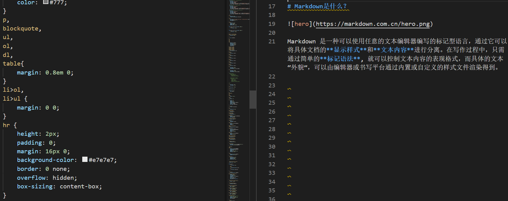

在写作过程中，只需通过简单的**标记语法**, 就可以控制文本内容的表现格式，而具体的文本“外貌”，可以由编辑器或书写平台通过内置或自定义的样式文件渲染得到。

# Markdown 相对于 Word 有什么优点？

## 避免选择焦虑

常用的 Word 文本编辑工具虽然功能非常强大，我们所需的各种文本样式都可以通过调整参数得到。但也因为功能太多了，导致我们需要额外的精力去设置每段，甚至每行的文字样式（字体大小、字体颜色、段落间距）。选择越多，写作也就越迷茫，效率自然而然也就降低了。


Markdown 的本质是让我们回归到内容本身，只注重文章本身的结构，而不是样式。

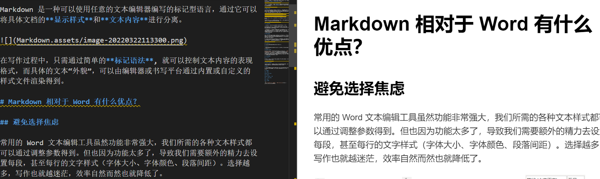

具体的文本样式都是按照后端预先设置好的格式规范进行渲染，无需或者不能在写作过程中去纠结字体大小、颜色等设置。

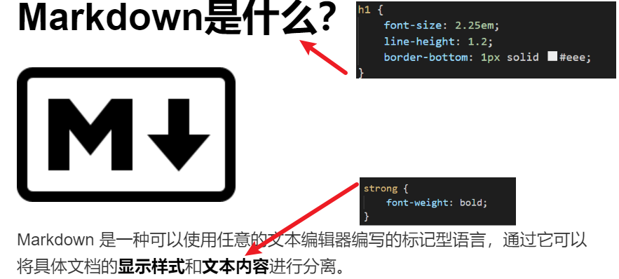

## 帮助知识分享

使用云、协同和跨端同步，已经逐渐成为如今知识分享的主流趋势。因为 Markdown 是基于「网页」逻辑的文本编辑标准，其内容排版和字体风格都写在了网页代码里，因此一些主流的在线内容平台，都对 Markdown 有很好的支持。

比如，国内外知名开发者社区 [CSDN](https://www.csdn.net/)和 [stackoverflow](https://stackoverflow.com/) 的文章编辑器可以直接通过 Markdown 语法书写文章
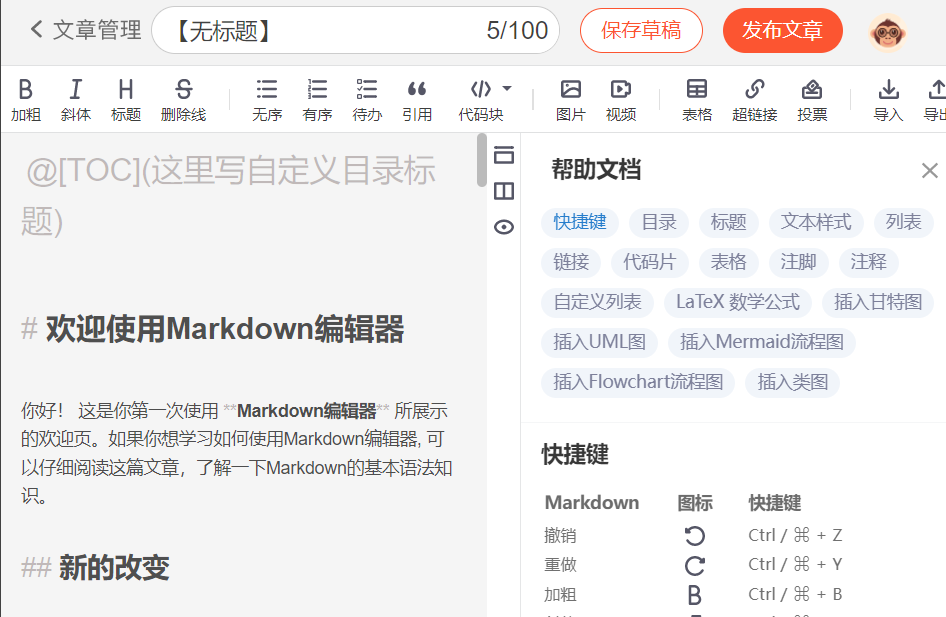

知识问答网站 [知乎](https://www.zhihu.com/) 在写文章时可以直接导入Markdown 格式的文档

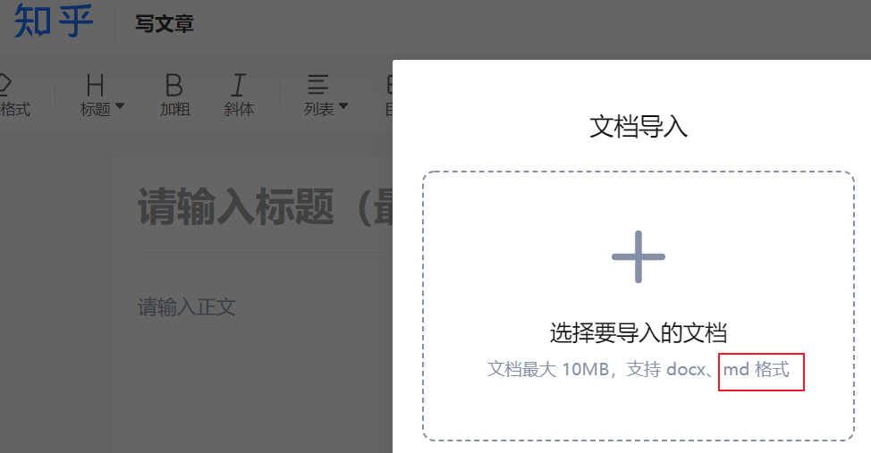

写作和阅读社区 [简书](https://www.jianshu.com/) 也内置有在线 Markdown 编辑器

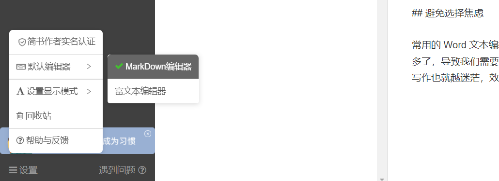

热门的在线版本托管服务网站 Github，可以直接在网页渲染 Markdown 格式的自述文件。

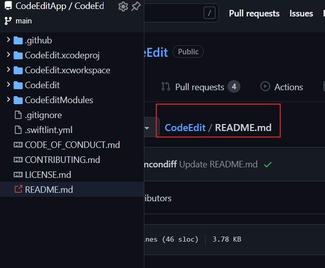

而常用的 Word 文件， 其本质是基于「纸张」逻辑的文本编辑器，在分享 Word 文件时，容易因为编写工具或平台不同，导致对方打开的文档发生格式混乱，只能通过打印成PDF或实体纸张的方式，稳定分享。

## 附件云端存储

不同于 Word 可以直接将图片压缩在文档本体中， Markdown 由于其纯文本编写的特性，其自身无法直接存储图片、视频等数据，只能选择通过使用超链接或 html 语法的方式，引用非文本资源的路径，然后通过浏览器或编辑器渲染，最终实现显示功能。

不过，这在我看来，可能还是 Markdown 的一个优点。因为如果将 Markdown 内引用的本地的图片数据改为引用存放在云端的数据，就可以减小笔记在传输过程中的整体大小，轻易的将大批量的笔记在不同平台设备之间进行传输、阅读、编辑、存储以及备份。如下图所示，使用了云端存储的 markdown 文件，所占存储远小于 word 文件。

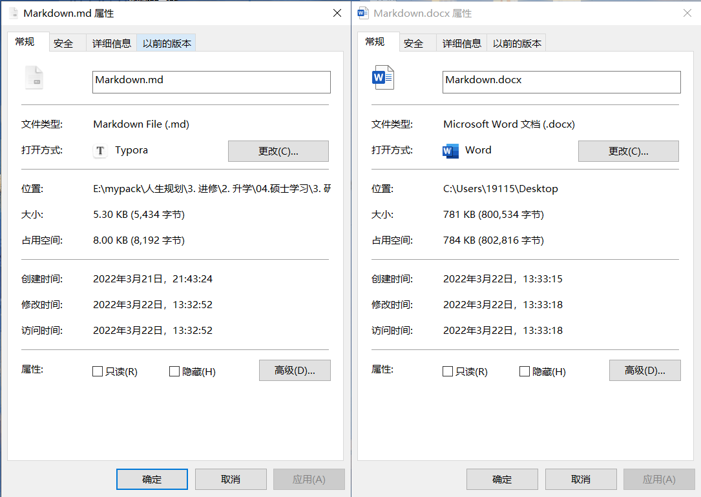

# Markdown 支持哪些写作需求？

## 常用文本格式

标题格式


有序列表

1. 第一行
2. 第二行
3. 第三行

无序列表

- 第一行
- 第二行
- 第三行

**字体加粗**

*斜体字*

文章脚注


## 扩展格式

行内代码、代码块、引用块、表格、Latex 公式、分割线、图片、html块、超链接、
流程图

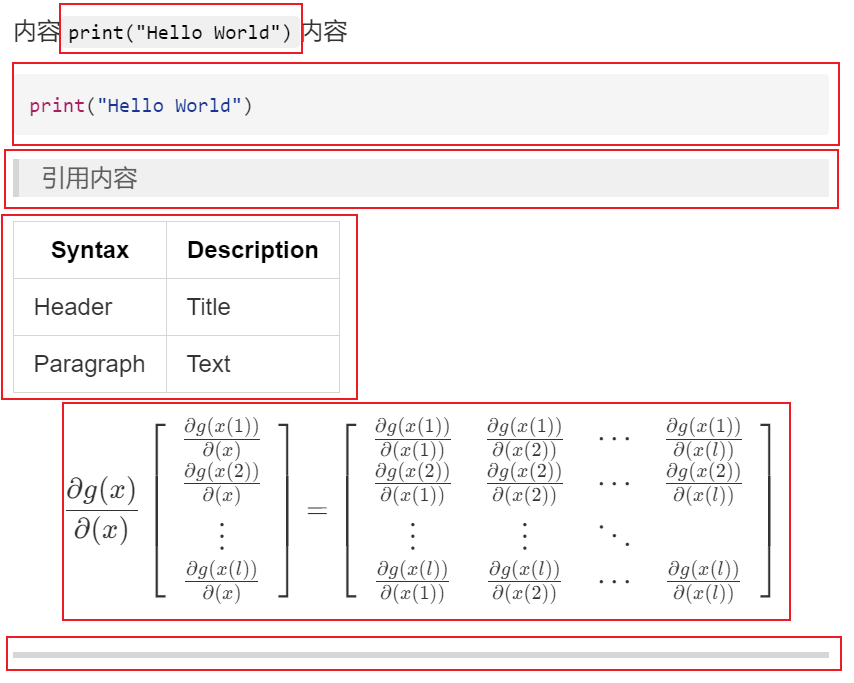

## 代码块自动高亮

Markdown本身支持对于代码块文本的整体高亮显示，只需在两个"\`\`\`"符号之间输入代码，并在第一个"\`\`\`"后标注对应的编程语言。Markdown会基于相应的编程语言特性对代码文本进行高亮。如下两个代码块，可以看出 Markdown 对代码块中各语言的头文件、解释器声明语句、方法以及各类字符串常量分别用各类鲜明的颜色进行区分，便于快速阅读代码，知晓代码运行逻辑。

```java
#FileName: HelloWorld.java  
public class HelloWorld
{  
  public static void main(String[] args)  
  {   
    System.out.println("Hello,World!");  
  }  
}  
```

```c++
#include <iostream>
#include <stdio.h>

int main()  
{
  std::cout << "Hello,World!--Way 4" << std::endl;
  return 1;                                        
} 
```

## 自定义渲染样式

Markdown 编辑器都是通过解析CSS文件进行文本渲染，因此可以通过修改其 css 文件，设置自己想要的样式。不过对于仅仅使用 Markdown 写作的我们，只需要从网上找到自己喜欢的样式，下载其css 文件即可。

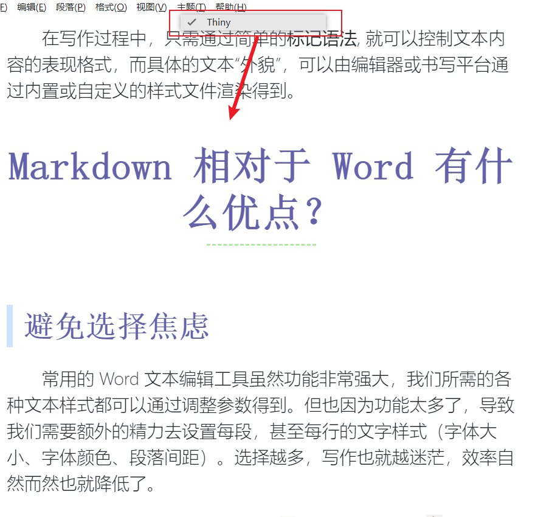

## 多格式导出

Markdown 格式的导出十分方便，除了原生支持 PDF 、HTML，还可通过插件导出 docx，LaTeX等格式。

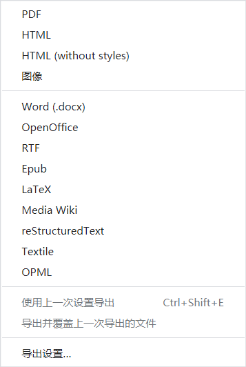

# Markdown 的一些扩展用法

## Jupyter Notebook

Jupyter Notebook 是一种交互式笔记本，结合了文档编写、代码运行和数据可视化等功能。其中文档编写功能就支持 Markdown 语法。

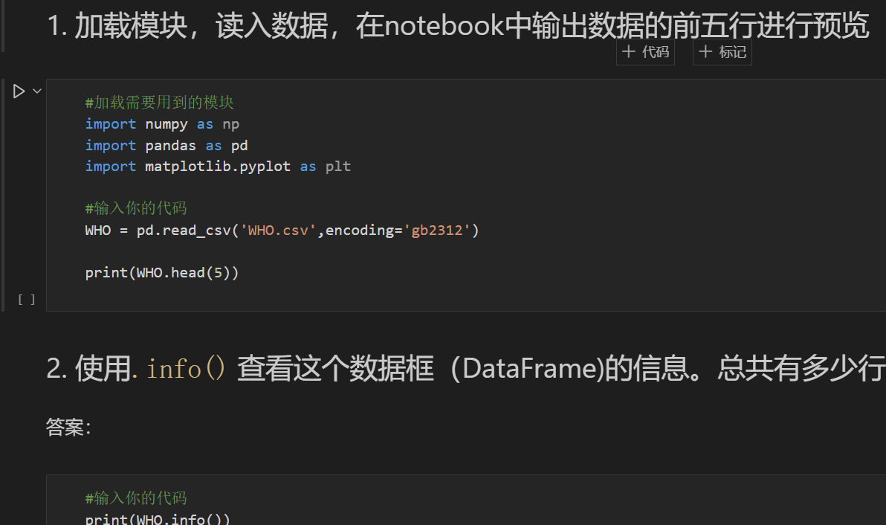

## 静态博客

通过静态网站生成工具，可以在你不太了解 html 的相关知识情况下，直接从 Markdown 文本文件生成一个博客网站，用来记录成长历程，总结学习和工作。


## 旁门左道

### 实时预览

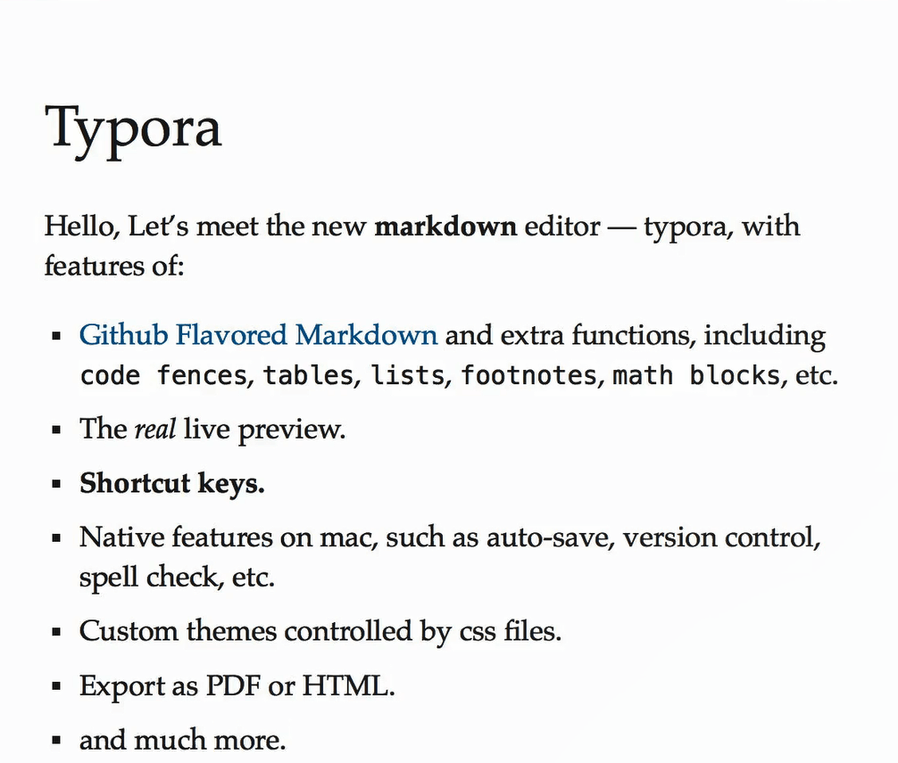

### 表格单元格里换行

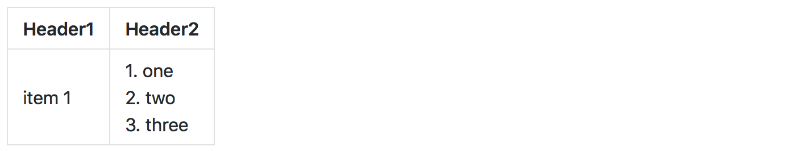

### 图文混排


### 控制图片大小和位置


### 使用 Emoji 表情

:stuck_out_tongue_winking_eye: :grinning: :frowning: :hushed: :joy: :mask: :sunglasses: :star2:

### 任务列表

- [x] 学习
- [x] 学习
- [x] 学习
- [x] 学习
- [x] 学习


参考
> [关于 Markdown 的一些技巧 - 知乎 (zhihu.com)](https://zhuanlan.zhihu.com/p/28987530)
> [Typora|Typora中文|typora下载|typora 主题](https://www.typora.net/)
> [Markdown 教程](https://markdown.com.cn/)
> [The world’s fastest framework for building websites | Hugo (gohugo.io)](https://gohugo.io/)
