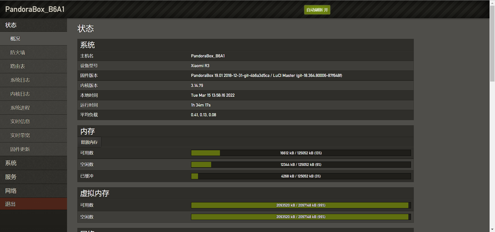
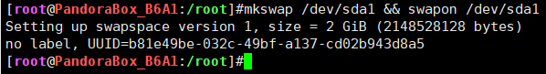
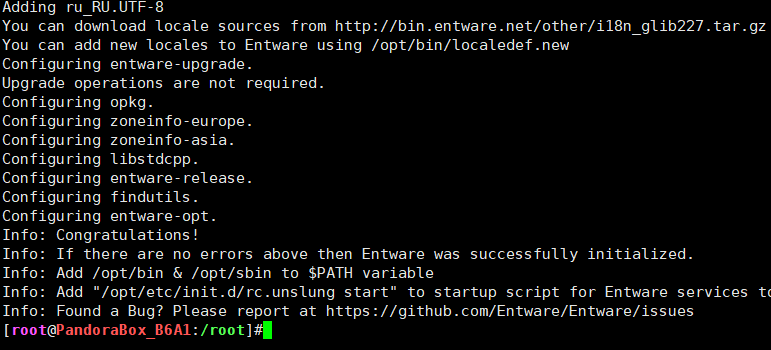

# 路由器优点

1. 全天工作（定时重启）
2. 功耗低
3. 噪音小

# 硬件准备

- U盘 ： 路由器的FLASH是在太小，仅仅12MB，一定是不够用的，所以需要在路由器上挂载一个U盘增加内存和额外存储。
- 小米路由器3
- 同局域网电脑

# 软件准备

1. [2.11.20开发版的ROM](http://bigota.miwifi.com/xiaoqiang/rom/r3/miwifi_r3_all_55ac7_2.11.20.bin)

		此版本可以开启SSH权限

1. [Xshell和Xftp](https://www.xshell.com/zh/free-for-home-school/)

		进行SSH连接路由器或FTP向路由器传输文件

	进入网站填写信息后确认`下载`
	


	进入上步填写的邮箱里面查看邮件，点击下载链接，下载安装包。
	
	
	然后正常软件的安装流程，连续下一步。
	
	


3. [潘多拉刷机包](https://mega.nz/#F!WY0FiTIS!Cl_Dzm4yhzrQZFazYG3i8Q)

		原版系统内核太低，安装插件容易出错，因此更换内核系统为 PandoraBox
	注意：需要翻墙下载
	

4. 分区助手

		将U盘分区，划定给路由器添加的内存和存储区
	[下载](https://www.diskgenius.cn/download.php)
	
	解压后打开
	

# 开始安装

1. 电脑连接路由器网络，打开 `192.168.31.1` 登录管理后台；

2. 在【常用设置】-【系统状态】中点击手动升级，将提供的升级包 \[ miwifi_r3_all_55ac7_2.11.20.bin ]上传，等待升级即可，详情见下图：
	
	
3. 获取SSH权限
	[登录路由器后台](http://192.168.31.1/)，从网页URL可以获取 \<stok\> 值
	
	网线或Wi-Fi连接路由器，分别输入以下三个连接，即可获取SSH权限和设置密码
	```html
	# Step1 输入

	http://192.168.31.1/cgi-bin/luci/;stok=<stok>/api/xqnetwork/set_wifi_ap?ssid=Xiaomi&encryption=NONE&enctype=NONE&channel=1%3Bnvram%20set%20ssh%5Fen%3D1%3B%20nvram%20commit
	## Step1 输出
	{msg:未能连接到指定WiFi(Connecting),code:1616}
	
	## Step2 输入
	http://192.168.31.1/cgi-bin/luci/;stok=<stok数值>/api/xqnetwork/set_wifi_ap?ssid=Xiaomi&encryption=NONE&enctype=NONE&channel=1%3Bsed%20%2Di%20%22%3Ax%3AN%3As%2Fif%20%5C%5B%2E%2A%5C%3B%20then%5Cn%2E%2Areturn%200%5Cn%2E%2Afi%2F%23tb%2F%3Bb%20x%22%20%2Fetc%2Finit.d%2Fdropbear
	## Step2 输出
	{msg:未能连接到指定WiFi(Probe timeout),code:1616}
	
	## Step3 输入
	http://192.168.31.1/cgi-bin/luci/;stok=<stok数值>/api/xqnetwork/set_wifi_ap?ssid=Xiaomi&encryption=NONE&enctype=NONE&channel=1%3B%2Fetc%2Finit.d%2Fdropbear%20start
	## Step3 输出
	{msg:未能连接到指定WiFi(Probe timeout),code:1616}
	
	## Step4 输入
	http://192.168.31.1/cgi-bin/luci/;stok=<stok数值>/api/xqsystem/set_name_password?oldPwd=<路由器登录密码>&newPwd=<路由器登录新密码>
	## Step4 输出
	{code:0}

	```

4. 查看当前路由器网关地址，默认为192.168.31.1
	
5. 运行Xshell，设置SSH连接信息，主机地址即为上述网关地址。
	


6. 设置身份验证，输入登录用户名`root` 和前述设置的<路由器登录新密码>，点击连接。
	
	接受密钥，进入路由器系统
	


	

7. 刷入潘多拉固件
	激活串口功能
	```shell
	nvram set uart_en=1
	nvram set flag_last_success=1
	nvram set boot_wait=on
	nvram commit
	```
	将下载好的文件（下图），通过软件Xftp传送到路由器/tmp 文件夹中
	
	
	

	使用SSH，刷入bootloader

	```shell
	cd /tmp
	mtd write pb-boot-xiaomi3-20190317-61b6d33.img Bootloader
	reboot
	```
	等待4-5分钟后，进入潘多拉恢复模式，刷潘多拉固件

		按住reset按钮之后重新接入电源，大概1-3秒后指示灯变为黄色慢闪状态，松开reset键。通过网线连接路由器（这个时候不能用Wi-Fi了），访问 192.168.1.1，过1～3分钟会进入pd-boot界面。
		如果 192.168.1.1 页面不正常，尝试清除浏览器历史记录和其他缓存，重新进入。
	
	点击浏览文件，选择PandoraBox Firmware里面下载的固件
	
	等待一段时间之后，就可以进入到路由器管理页面了，默认密码是admin。
	


1. 拔出插在路由器上的U盘，进行分区和格式化，记得备份好自己的文件，其中 NTFS分区用来日常存储数据，Ext4分区用来挂载路由器系统文件夹，swap分区解决后面数据库内存不足问题。


11. 将U盘插在路由器上，在Xshell中挂载U盘。
	在Xshell中输入 `df -h` 或者 `ls /dev`查看U盘挂载位置(一般是`/dev/sda<i>->/mnt/sda<i>`)。
	
	进一步可以通过 `fdisk -l`  产看具体对应关系。如果没有`fdisk -l` 命令，可以通过观看存储区数据大小判断对应关系，其中`df -h` 中没有列出的`/dev/sda1` 是 swap 分区。
	
	挂载swap分区 `mkswap /dev/sda1 && swapon /dev/sda1`
	
	挂载ext4分区至系统目录，(以后下述`/usb`目录中的文件都存在U盘中)。
	`cd ~ && mkdir userdisk && cd userdisk && mkdir usb && mount /dev/sda2 /userdisk/usb`
	

	复制原系统`root` `opt`文件夹到U盘挂载的目录中，并建立自动挂载的软链接（以后这两个目录也存放在U盘对应挂载的目录中）
	```shell
	cd /userdisk/usb
	mkdir root opt
	cd / && mkdir opt
	vi /etc/rc.local
	# i
	# 添加如下内容
	# mount /dev/sda2 /userdisk/usb
	# mount --bind /userdisk/usb/root /root
	# mount --bind /userdisk/usb/opt /opt
	# /opt/etc/init.d/rc.unslung start
	# Esc
	# :wq
	```
	

	重启路由器，重新通过SSH，进入系统，输入 `df -h` 查看挂载内容是否自动更改。
	

	> 这种方式进行的磁盘扩展本质上是在系统完全启动后进行的目录存储位置的替换，并不是真正的从U盘启动

12. 安装opkg
	[一键下载opkg](https://github.com/xzhih/ONMP/wiki/%E5%9C%A8-LEDE-%E4%B8%8A%E5%AE%89%E8%A3%85-Entware)
	```shell
		cd /root
		wget -O - http://bin.entware.net/mipselsf-k3.4/installer/generic.sh | /bin/sh
		# 下载出错，就重新再来几遍。
	```
	


	配置opkg环境变量
	```shell
		vi /etc/profile
		# a
		# export PATH="$PATH:/opt/bin"
		# export PATH="$PATH:/opt/sbin"
		# . /opt/etc/profile
		# Esc
		# :wq
	```
	


	重启路由器，进入SSH，测试 opkg `opkg update`
	

13. 安装onmp
	下载onmp
	`wget --no-check-certificate -O /opt/onmp.zip https://github.com/xzhih/ONMP/archive/master.zip` （注意，原版小米路由器系统中安装的wget不支持此链接，需要本地下载，通过ftp传到/opt/onmp.zip，这也是更换系统的其中一个原因了）
	

	`cd /opt && opkg install wget unzip`
	

	```
	# 解压
	unzip /opt/onmp.zip
	mv /opt/ONMP-master /opt/onmp
	cd /opt/onmp
	wget https://github.com/WuSiYu/PHP-Probe/blob/master/tz.php
	# 设置权限
	chmod +x ./onmp.sh
	
	# 运行
	./onmp.sh
	```
	

	输入`1` 安装 ，最终安装失败。
	
	开启swap，`swapon /dev/sda1`
	
	重新安装 `./onmp.sh`，安装成功。
	
	输入地址 `http://192.168.21.1:81/`
	


[小米路由器3刷机潘多拉(Openwrt)以及刷回教程 - 歪麦博客 (awaimai.com)](https://www.awaimai.com/2852.html)

[新3 解决潘多拉固件安装可道云，搭建frp（内网穿透）进行外网访问 内含完整步骤 - TOMATO专版 - 恩山无线论坛 - Powered by Discuz! (right.com.cn)](https://www.right.com.cn/forum/thread-420165-1-1.html)

软件准备
1. [开发版的ROM](http://www1.miwifi.com/miwifi_download.html)
	进入网站找到自己设备对应的开发板EOM，直接下载。
	

2. [小米路由SSH工具](http://www1.miwifi.com/miwifi_open.html)
	进入网站，点击 `开启SSH工具`
	
	进入当前小米ID对应的网站，点击 `下载工具包`，记住root密码
	


开始安装

1. 电脑连接路由器网络，打开miwifi.com登录管理后台；
2. 在【常用设置】-【系统状态】中点击手动升级，将提供的升级包[开发板ROM包]上传等待升级即可，详情见下图：
	
	
3. 请将下载的SSH工具包bin文件复制到U盘（FAT/FAT32格式）的根目录下，保证文件名为miwifi_ssh.bin；
	
4. 断开小米路由器的电源，将U盘插入USB接口；
5. 按住reset按钮之后重新接入电源，指示灯变为黄色闪烁状态即可松开reset
6. 等待3-5秒后安装完成之后，小米路由器会自动重启。
7. 查看当前路由器网关地址，默认为192.168.31.1
	
8. 运行Xshell，设置SSH连接信息。
	


9. 设置身份验证，输入登录用户名`root` 和前述记录的root密码，点击连接。
	
	接受密钥，进入路由器系统
	


	

10. 拔出插在路由器上的U盘，进行格式化，记得备份好自己的文件。
	

11. 将U盘插在路由器上，在Xshell中挂载U盘。
	在Xshell中输入 `df -h` 查看U盘挂载位置(一般是`/dev/sda1->/extdisks/sda1`)。
	


	使用`mkdir /userdisk/usbdisk && mount /dev/sda1 /userdisk/usbdisk`将U盘[根目录](https://so.csdn.net/so/search?q=%E6%A0%B9%E7%9B%AE%E5%BD%95&spm=1001.2101.3001.7020)挂载至/userdisk/usbdisk目录(以后/usbdisk目录中的文件都存在U盘中)。
	
	复制原系统文件到U盘挂载的目录中，并建立自动挂载的软链接（以后目录存放在U盘挂载的目录中）
	```shell
	cd /userdisk/usbdisk
	mkdir root opt
	cp -r /opt/* /userdisk/usbdisk/opt
	# cp -r /bin/* /userdisk/usbdisk/bin
	# cp -r /sbin/* /userdisk/usbdisk/sbin
	# cp -r /lib/* /userdisk/usbdisk/lib
	# cp -r /usr/* /userdisk/usbdisk/usr
	vi /etc/rc.local
	# a
	# 添加如下内容
	# mount /dev/sda1 /userdisk/usbdisk
	# mount --bind /userdisk/usbdisk/root /root
	# mount --bind /userdisk/usbdisk/opt /opt
	# mount --bind /userdisk/usbdisk/bin /bin
	# mount --bind /userdisk/usbdisk/sbin /sbin
	# mount --bind /userdisk/usbdisk/lib /lib
	# mount --bind /userdisk/usbdisk/usr /usr
	# Esc
	# :wq
	```
	
	
	重启路由器，重新通过SSH，进入系统，输入 `df -h` 查看挂载内容是否自动更改。
	
	> 这种方式进行的磁盘扩展本质上是在系统完全启动后进行的目录存储位置的替换，并不是真正的从U盘启动

12. 安装opkg
	下载opkg
	```shell
		cd /root
		wget http://pkg.entware.net/binaries/mipsel/installer/installer.sh
		chmod +x installer.sh
		./installer.sh
		# wget -O - http://bin.entware.net/mipselsf-k3.4/installer/generic.sh | /bin/sh
	```
	
	配置opkg环境变量
	```shell
		vi /etc/profile
		# a
		# export PATH="$PATH:/opt/bin"
		# export PATH="$PATH:/opt/sbin"
		# . /opt/etc/profile
		# Esc
		# :wq
	```
	
	重启路由器，进入SSH，测试 opkg `opkg update`
	

13. 安装onmp
	下载onmp
	`wget --no-check-certificate -O /opt/onmp.zip https://github.com/xzhih/ONMP/archive/master.zip`或者下载此文件到 `/opt/onmp.zip`（记得修改名字）
	


	`cd /opt && opkg install wget unzip`
	

	```
	# 解压
	unzip /opt/onmp.zip
	cd /opt/ONMP-master
	
	# 设置权限
	chmod +x ./onmp.sh
	
	# 运行
	./onmp.sh
	```
	
	输入`1` 安装
