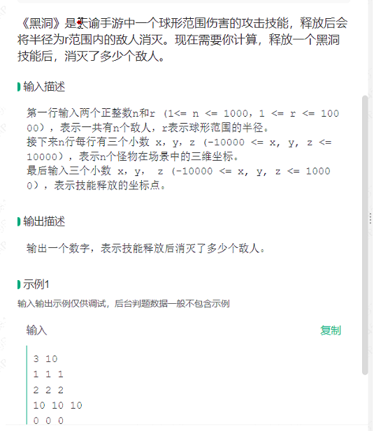
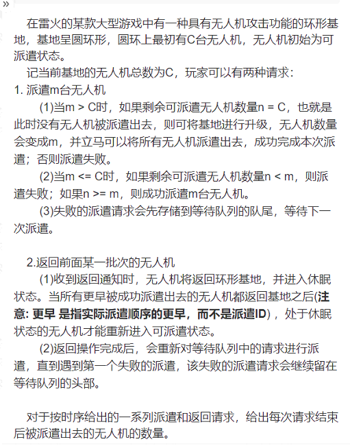
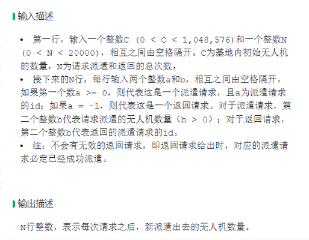
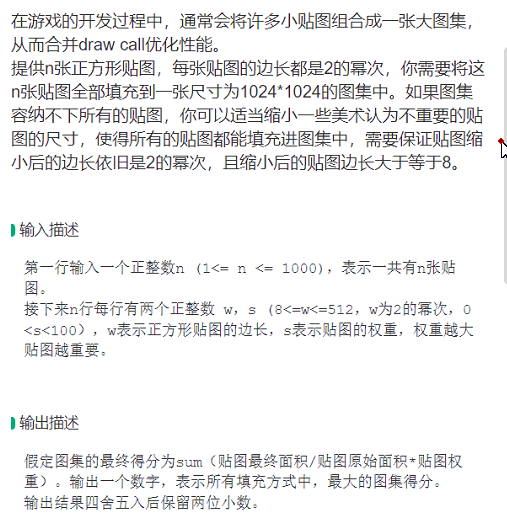
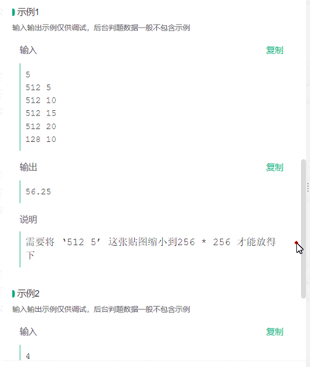
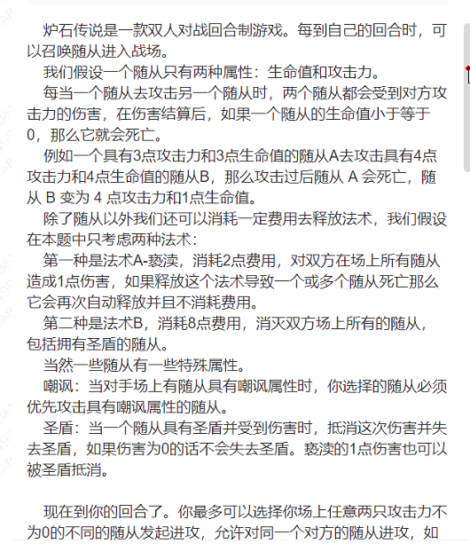
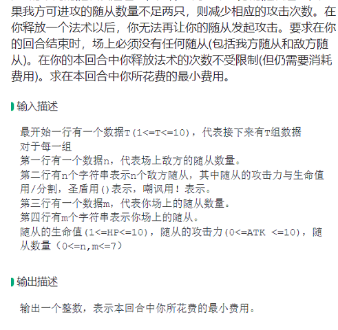
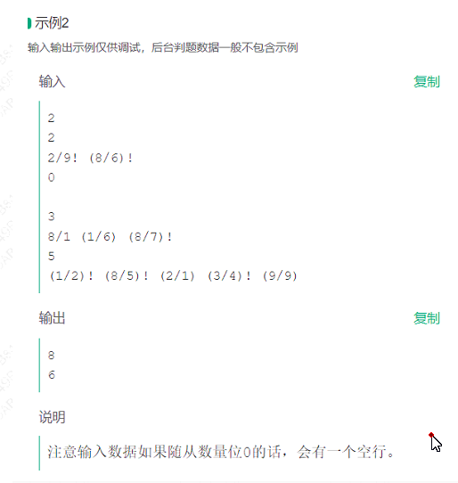
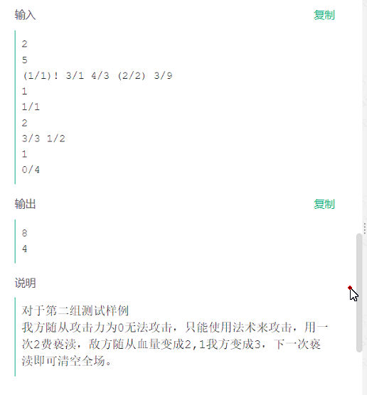

1. 

2. 

请用C++完成下题: 
《黑洞》是头谕手游中一个球形范围伤害的攻击技能，释放后会将半径为r范围内的敌人消灭。现在需要你计算，释放一个黑洞技能后，消灭了多少个敌人。

输入描述: 
第一行输入两个正整数 n 和 r (1<= n <= 1000，1 <= r <= 10000)，表示一共有 n 个敌人，r 表示球形范围的半径。接下来 n 行每行有三个小数 x，y，z (-10000 <= x，Y，z <=10000)，表示 n 个怪物在场景中的三维坐标。最后输入三个小数 x，y， z (-10000 <= x，y，z <= 10000)，表示技能释放的坐标点。

输出描述: 
输出一个数字，表示技能释放后消灭了多少个敌人。

我给你出一个题目测试你的能力，请用 C++完成，重复过程用函数实现, 禁止注释代码:

炉石传说是一款双人对战回合制游戏。每到自己的回合时，可以召唤随从进入战场。

我们假设一个随从只有两种属性:生命值和攻击力。
每当一个随从去攻击另一个随从时，两个随从都会受到对方攻击力的伤害，在伤害结算后，如果一个随从的生命值小于等于0，那么它就会死亡。
例如一个具有3点攻击力和3点生命值的随从A去攻击具有4点攻击力和4点生命值的随从B，那么攻击过后随从A会死亡，随从B变为4点攻击力和1点生命值。
除了随从以外我们还可以消耗一定费用去释放法术，我们假设在本题中只考虑两种法术:

第一种是法术A-亵渎，消耗2点费用，对双方在场上所有随从造成1点伤害，如果释放这个法术导致一个或多个随从死亡那么它会再次自动释放并且不消耗费用。
第二种是法术B，消耗8点费用，消灭双方场上所有的随从，包括拥有圣盾的随从。
此外一些随从有一些特殊属性。
嘲讽:当对手场上有随从具有嘲讽属性时，你选择的随从必须优先攻击具有嘲讽属性的随从。
圣盾:当一个随从具有圣盾并受到伤害时，抵消这次伤害并失去圣盾，如果伤害为0的话不会失去圣盾。亵渎的1点伤害也可以被圣盾抵消。

现在到你的回合了。你最多可以选择你场上任意两只攻击力不为0的不同的随从发起进攻，允许对同一个对方的随从进攻，如果我方可进攻的随从数量不足两只，则减少相应的攻击次数。在你释放一个法术以后，你无法再让你的随从发起攻击。要求在你的回合结束时，场上必须没有任何随从(包括我方随从和敌方随从)。在你的本回合中你释放法术的次数不受限制(但仍需要消耗费用)。求在本回合中你所花费的最小费用。

输入描述:

最开始一行有一个数据 T(1<=T<=10)，代表接下来有 r 组数据对于每一组
第一行有一个数据n，代表场上敌方的随从数量。
第二行有n个字符串表示n个敌方随从，其中随从的攻击力与生命值用/分割，圣盾用()表示，嘲讽用!表示。
第三行有一个数据m，代表你场上的随从数量。第四行有m个字符串表示你场上的随从。
随从的生命值(1<=HP<=10)，随从的攻击力(0<=ATK<=10)，随从数量（0<=n, m<=7)

输出描述:

输出一个整数，表示本回合中你所花费的最小费用。

说明: 
输入数据如果随从数量为 0 ，需要紧跟着输入一个空行。

3. 

4. sa
